# All original screenshots

[Download the current Android testing APK](https://github.com/Apdelrahman1911/PartyDeck/releases/download/android-preview-34664818655-1/PartyDeck-android-preview.apk) · [Published prerelease](https://github.com/Apdelrahman1911/PartyDeck/releases/tag/android-preview-34664818655-1) · [Release verification](published-release-34664818655-1/download-verification.json). Workflow **34664818655, attempt 1** passed. Earlier runs below retain their original status.

104 unchanged PNGs, including the earlier reviewed iterations. Click any image for the original pixels; full SHA-256 values are in the [catalogue](original-catalogue.json) and [file inventory](SHA256SUMS). [Back to the focused comparison](README.md).

## Android API 36 preview: successful published run

**passed** · All 7 native smoke checks passed with no final diagnostic errors. Workflow 34664818655 attempt 1; the original source and APK hashes match the published testing release. Native Android emulator captures at 1080 × 2400 and 420 dpi. The earlier failed run remains preserved.

[Original smoke result](android-api36-successful-run/smoke-result.json) · [Artifact provenance](android-api36-successful-run/append-provenance.json)

| 3d-engine-baseline-first-card.png | 3d-engine-baseline-public.png | 3d-engine-entry-native-ready.png |
| --- | --- | --- |
| <a href="android-api36-successful-run/runtime/captures/3d-engine-baseline-first-card.png">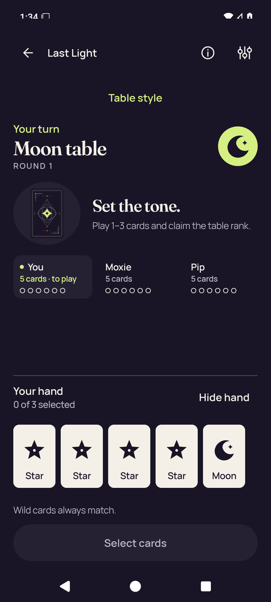</a> | <a href="android-api36-successful-run/runtime/captures/3d-engine-baseline-public.png">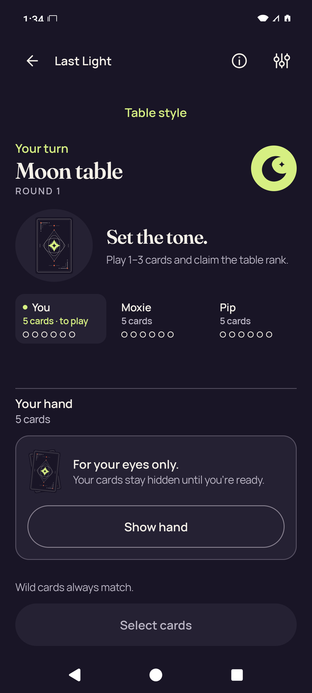</a> |  |

| 3d-engine-entry-selector.png | 3d-engine-home.png | 3d-engine-leave-confirmation.png |
| --- | --- | --- |
| <a href="android-api36-successful-run/runtime/captures/3d-engine-entry-selector.png">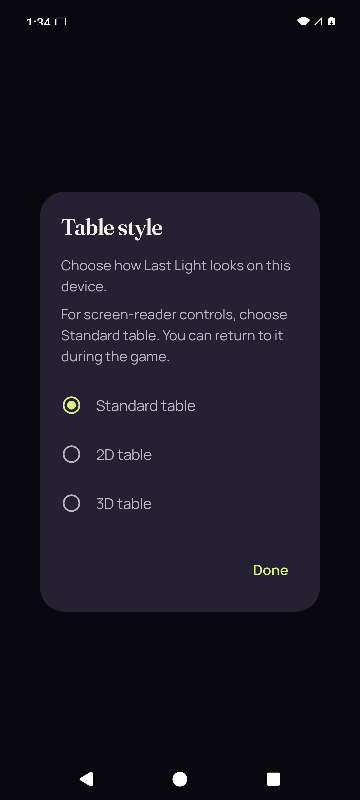</a> |  |  |

| 3d-engine-leave-selector.png | 3d-engine-selected.png | 3d-engine-standard-after-play.png |
| --- | --- | --- |
|  |  | <a href="android-api36-successful-run/runtime/captures/3d-engine-standard-after-play.png">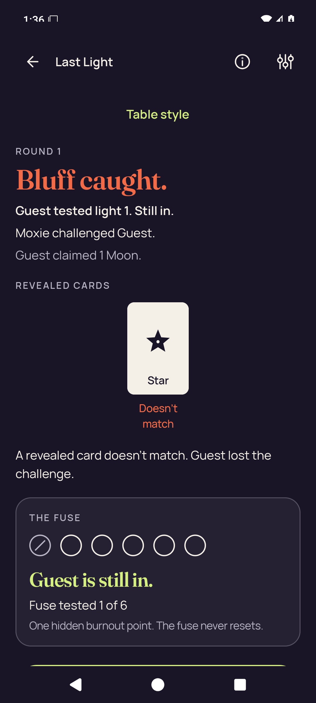</a> |

| final-diagnostic.png | home-cold.png |
| --- | --- |
|  | <a href="android-api36-successful-run/runtime/captures/home-cold.png">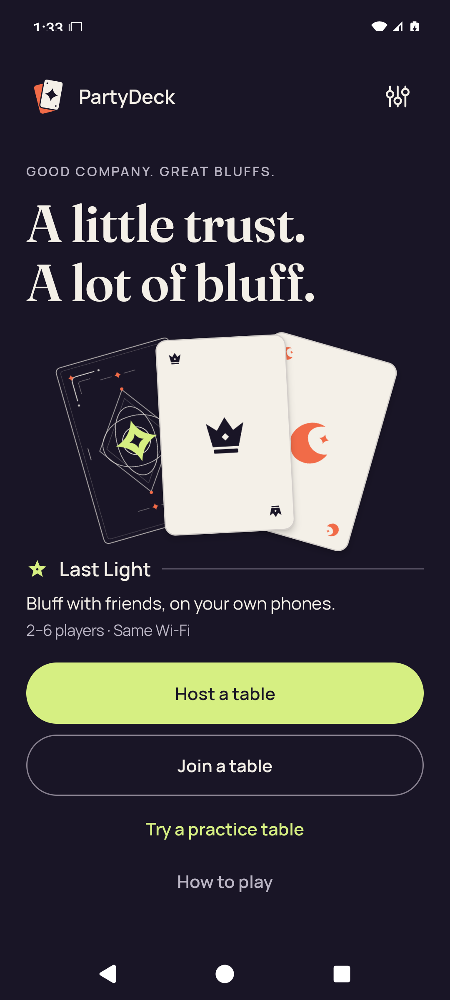</a> |

## Final candidate: native-density matrix

**passed** · Final pack; portrait originals came from the root wrapper, landscape and fractional captures from the focused harness.

| landscape-d3/01-concealed.png | landscape-d3/02-revealed.png | landscape-d3/03-selected.png |
| --- | --- | --- |
|  |  |  |

| portrait-d1p75/01-concealed.png | portrait-d1p75/02-revealed.png | portrait-d1p75/03-selected.png |
| --- | --- | --- |
|  | <a href="after-final/portrait-d1p75/02-revealed.png">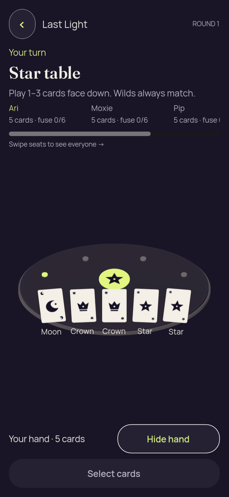</a> | <a href="after-final/portrait-d1p75/03-selected.png">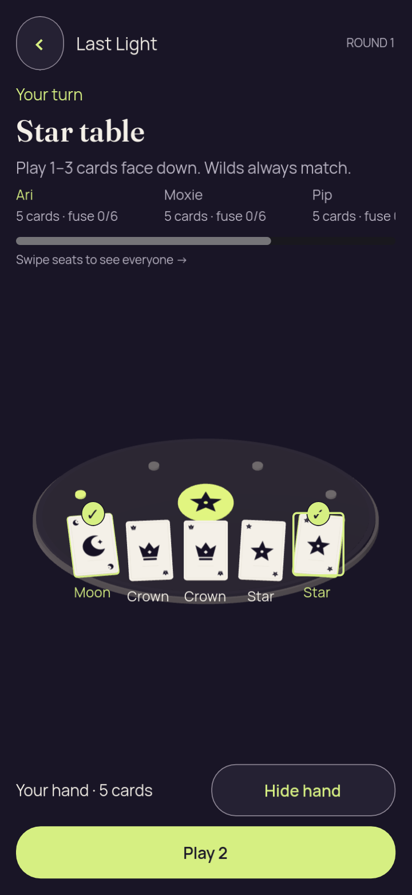</a> |

| portrait-d3/01-concealed.png | portrait-d3/02-revealed.png | portrait-d3/03-selected.png |
| --- | --- | --- |
|  |  | <a href="after-final/portrait-d3/03-selected.png">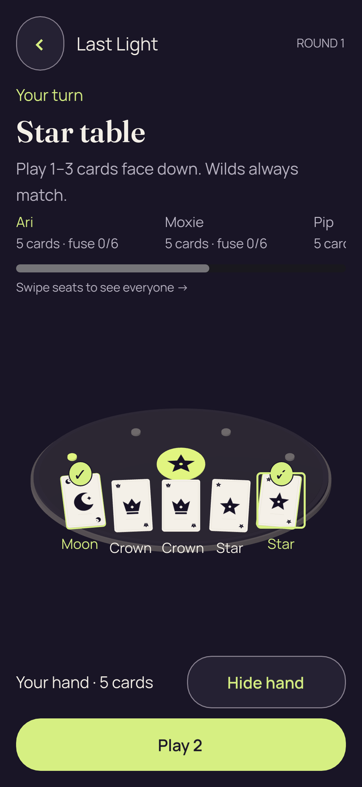</a> |

## Baseline: matched matrix

**baseline** · Frozen baseline e8e05709; expected low-resolution target and clipped rim.

| landscape-d3/01-concealed.png | landscape-d3/02-revealed.png | landscape-d3/03-selected.png |
| --- | --- | --- |
| <a href="before/landscape-d3/01-concealed.png">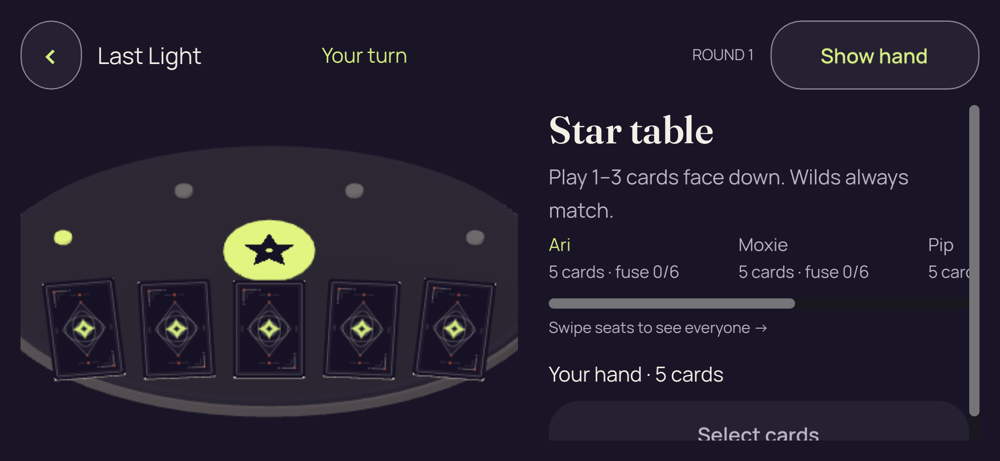</a> | <a href="before/landscape-d3/02-revealed.png">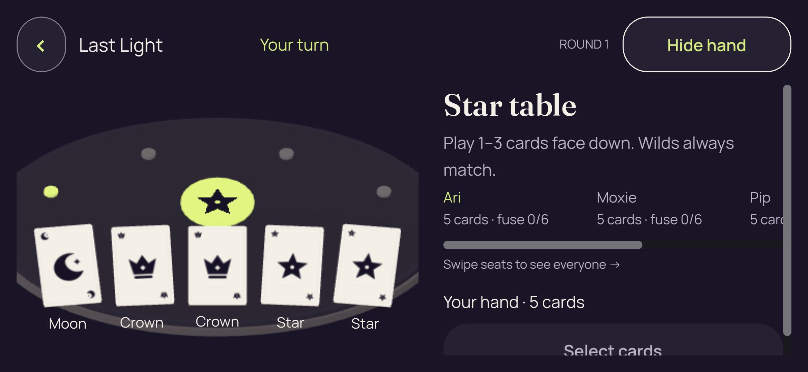</a> | <a href="before/landscape-d3/03-selected.png">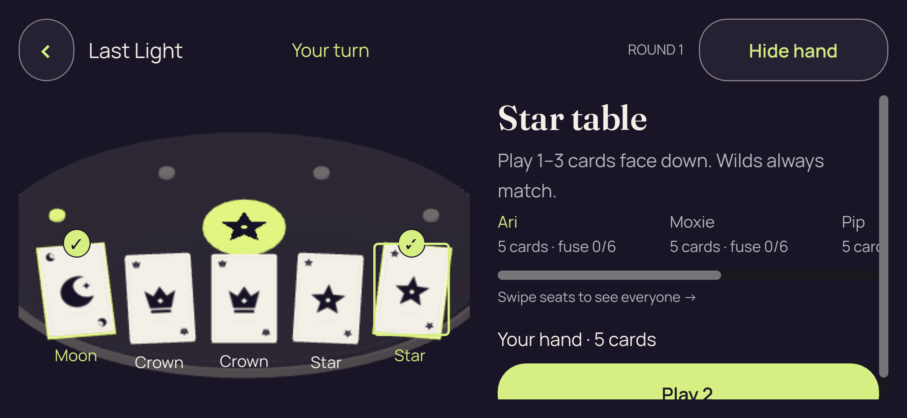</a> |

| portrait-d1p75/01-concealed.png | portrait-d1p75/02-revealed.png | portrait-d1p75/03-selected.png |
| --- | --- | --- |
| <a href="before/portrait-d1p75/01-concealed.png">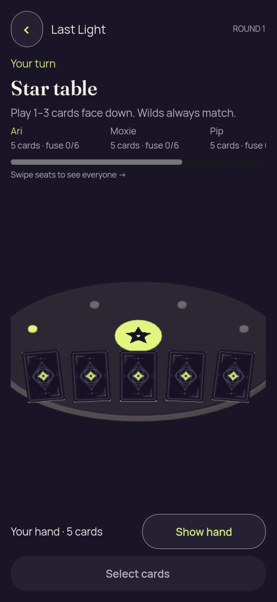</a> | <a href="before/portrait-d1p75/02-revealed.png">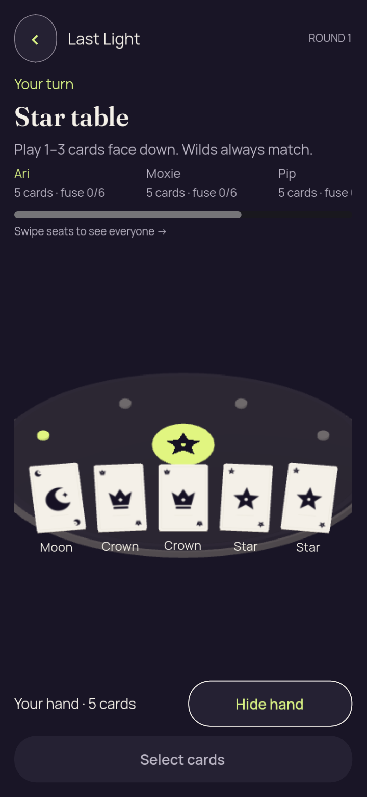</a> | <a href="before/portrait-d1p75/03-selected.png">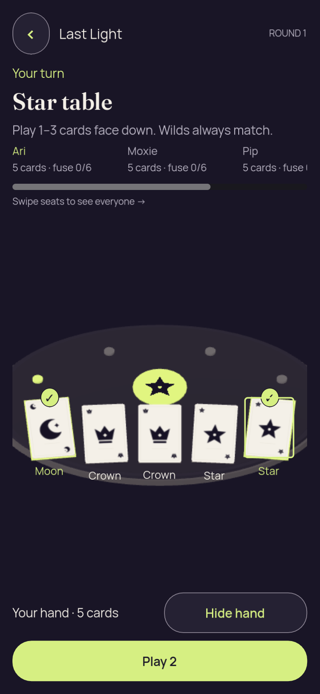</a> |

| portrait-d3/01-concealed.png | portrait-d3/02-revealed.png | portrait-d3/03-selected.png |
| --- | --- | --- |
|  |  |  |

## Final local and remote public play motion

**passed** · Six actual table raster frames. Fixture-driven recipient snapshots; real Tweens and raster changes, without a device or network claim.

| local-01-start.png | local-02-travel.png | local-03-settled.png |
| --- | --- | --- |
|  |  |  |

| remote-01-start.png | remote-02-travel.png | remote-03-settled.png |
| --- | --- | --- |
|  |  |  |

## Final full-match comparison: 2D

**passed** · Same KMP authority trace as 3D, through LastLightEngine and its bridge. Desktop renderer execution.

| 01-concealed.png | 02-revealed.png | 03-selected.png |
| --- | --- | --- |
|  | <a href="authority-comparison-final/2d/02-revealed.png">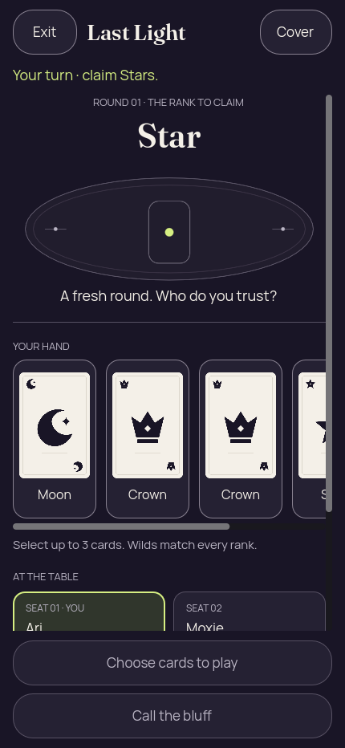</a> |  |

| 04-covered.png | 05-background-privacy.png | 06-play-pending.png |
| --- | --- | --- |
|  |  |  |

| 07-public-round-result.png | 08-next-round.png | 09-challenge-pending.png |
| --- | --- | --- |
|  |  |  |

| 10-winner.png | 12-fresh-presentation.png |
| --- | --- |
|  |  |

## Final full-match comparison: 3D

**passed** · Same KMP authority trace as 2D. Original per-frame receipts pin the final pack and image hashes.

| 01-concealed.png | 02-revealed.png | 03-selected.png |
| --- | --- | --- |
|  | <a href="authority-comparison-final/3d/02-revealed.png">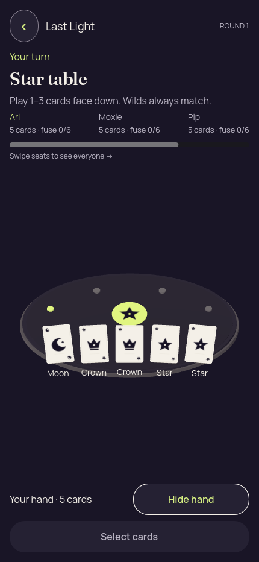</a> | <a href="authority-comparison-final/3d/03-selected.png">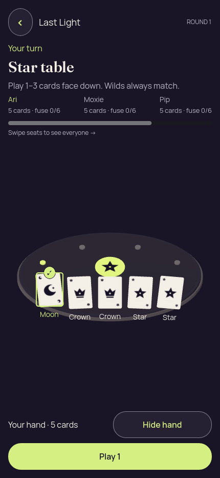</a> |

| 04-covered.png | 05-background-privacy.png | 06-play-pending.png |
| --- | --- | --- |
|  | <a href="authority-comparison-final/3d/05-background-privacy.png">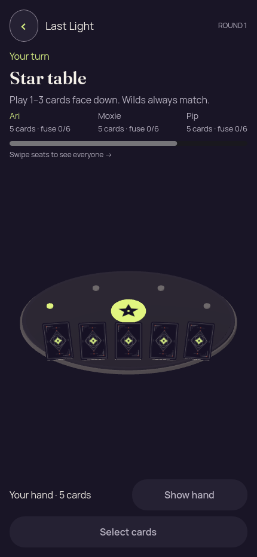</a> | <a href="authority-comparison-final/3d/06-play-pending.png">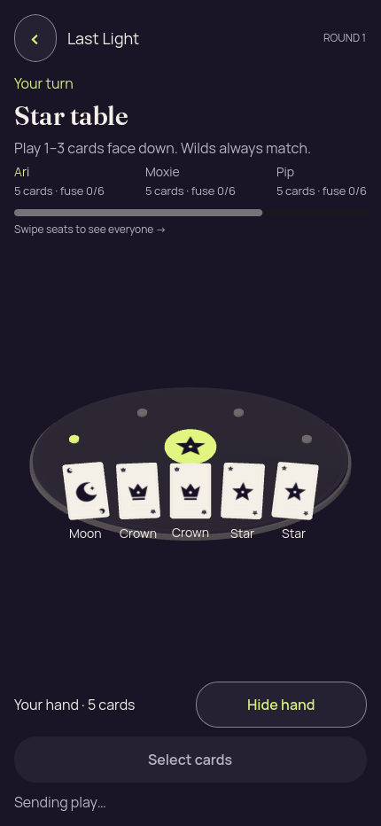</a> |

| 07-public-round-result.png | 08-next-round.png | 09-challenge-pending.png |
| --- | --- | --- |
| <a href="authority-comparison-final/3d/07-public-round-result.png">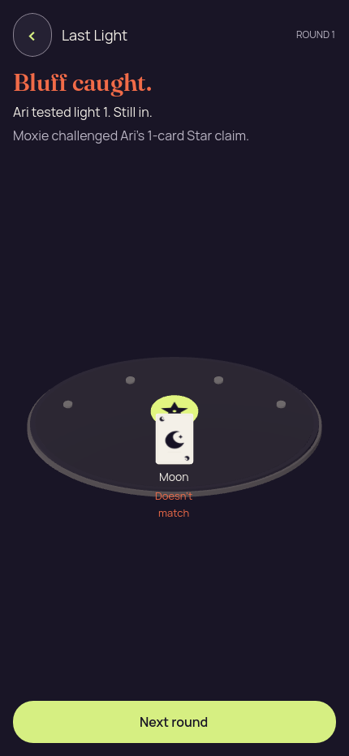</a> | <a href="authority-comparison-final/3d/08-next-round.png">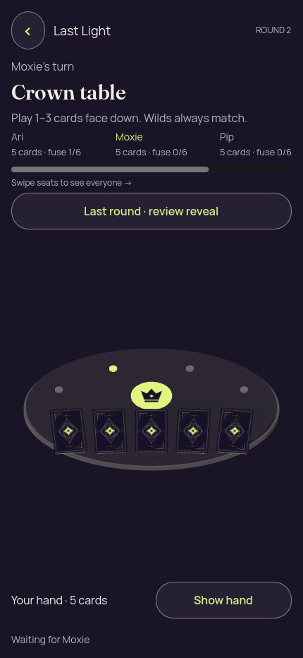</a> | <a href="authority-comparison-final/3d/09-challenge-pending.png">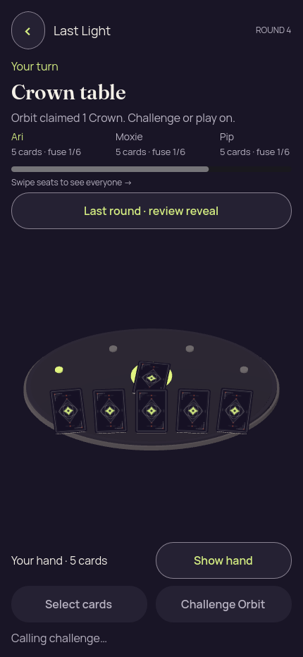</a> |

| 10-winner.png | 12-fresh-presentation.png |
| --- | --- |
| <a href="authority-comparison-final/3d/10-winner.png">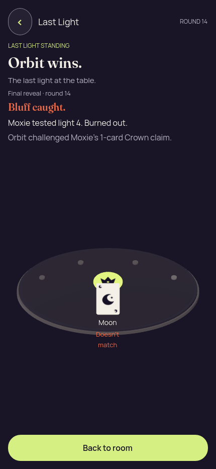</a> | <a href="authority-comparison-final/3d/12-fresh-presentation.png">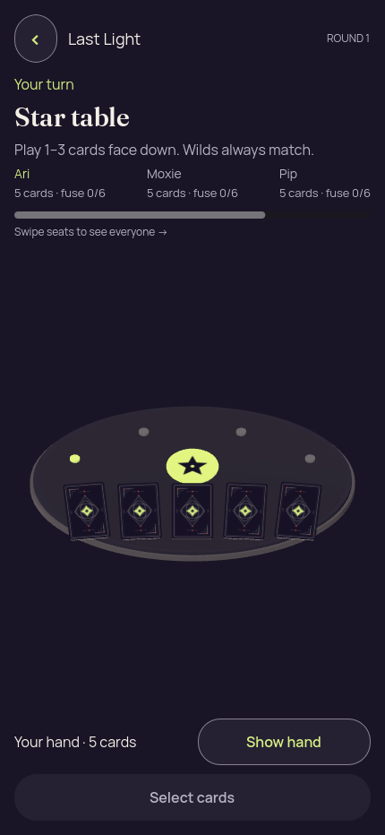</a> |

## Superseded candidate: before hit-target rounding correction

**superseded** · Earlier PCK 1a8642527d6115817a0683d95ded2619d7396122db1acba167decbcb63e8d06b. Preserved unchanged; use the final candidate for acceptance.

| landscape-d3/01-concealed.png | landscape-d3/02-revealed.png | landscape-d3/03-selected.png |
| --- | --- | --- |
| <a href="after/landscape-d3/01-concealed.png">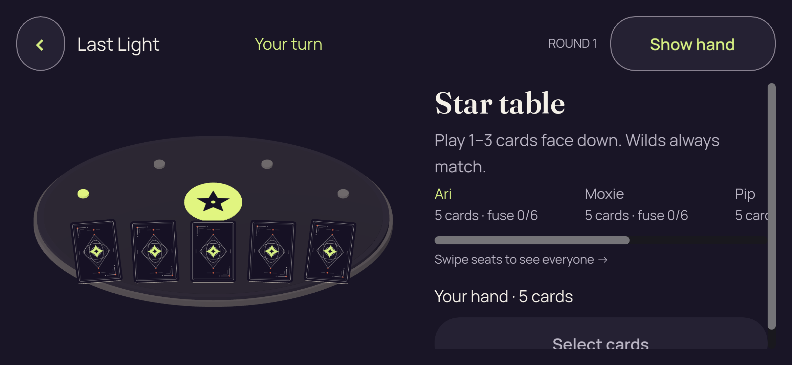</a> | <a href="after/landscape-d3/02-revealed.png">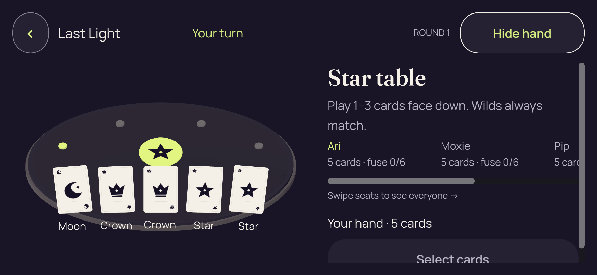</a> | <a href="after/landscape-d3/03-selected.png">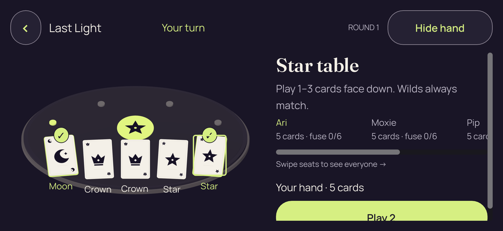</a> |

| portrait-d1p75/01-concealed.png | portrait-d1p75/02-revealed.png | portrait-d1p75/03-selected.png |
| --- | --- | --- |
| <a href="after/portrait-d1p75/01-concealed.png">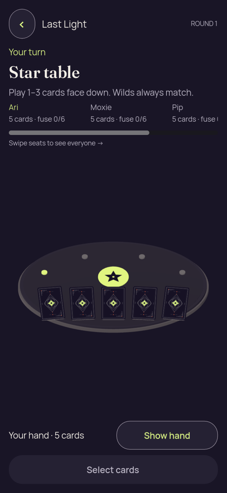</a> |  | <a href="after/portrait-d1p75/03-selected.png">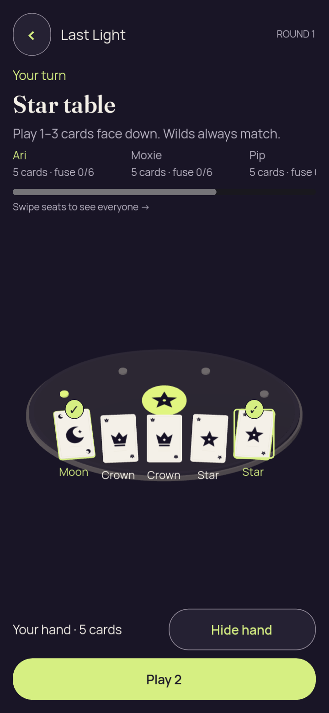</a> |

| portrait-d3/01-concealed.png | portrait-d3/02-revealed.png | portrait-d3/03-selected.png |
| --- | --- | --- |
| <a href="after/portrait-d3/01-concealed.png">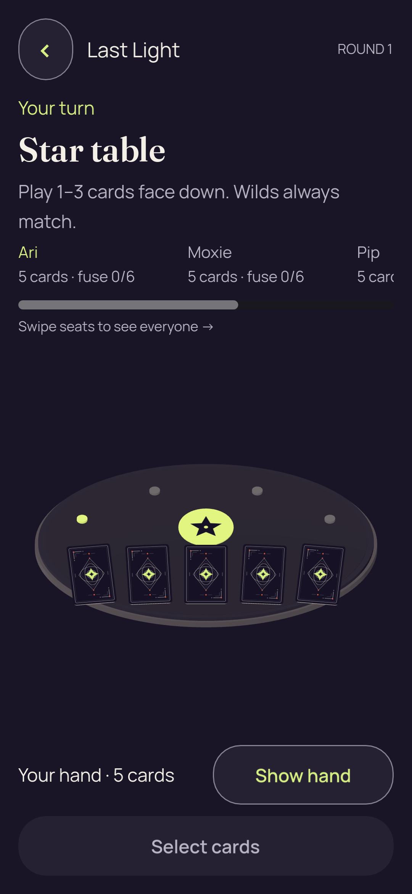</a> | <a href="after/portrait-d3/02-revealed.png">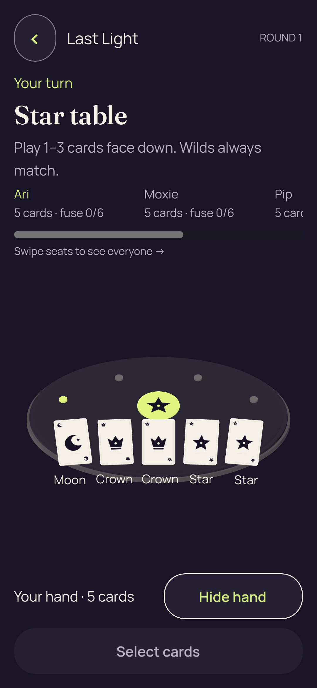</a> | <a href="after/portrait-d3/03-selected.png">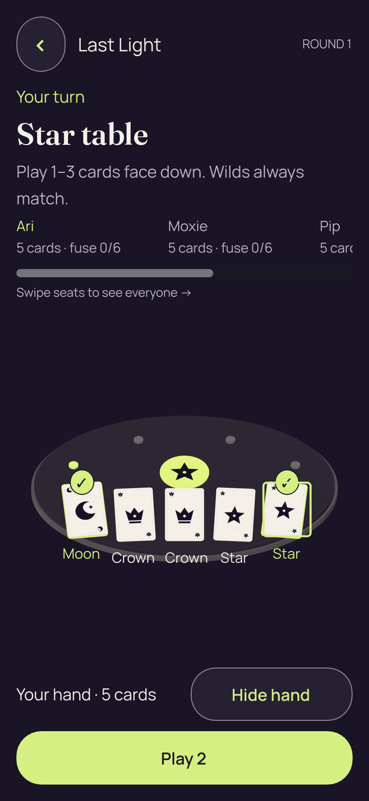</a> |

## Preliminary baseline portrait

**passed** · Initial density-aware scene/input/privacy run, including selection limit, covered hand, and resumed privacy frames.

| 01-concealed.png | 02-revealed-selected.png | 02a-selection-limit.png |
| --- | --- | --- |
|  | <a href="iterations/preliminary-baseline-portrait/02-revealed-selected.png">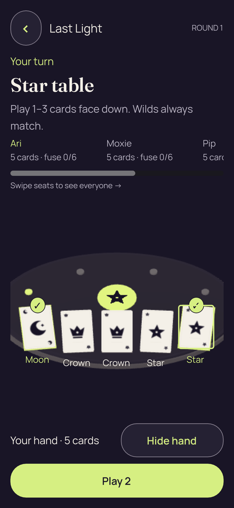</a> | <a href="iterations/preliminary-baseline-portrait/02a-selection-limit.png">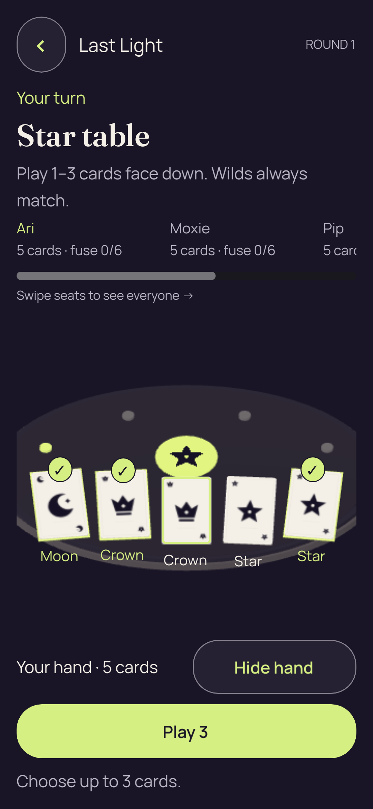</a> |

| 02b-deselected-last.png | 03-covered-again.png | 04-resumed-covered.png |
| --- | --- | --- |
| <a href="iterations/preliminary-baseline-portrait/02b-deselected-last.png">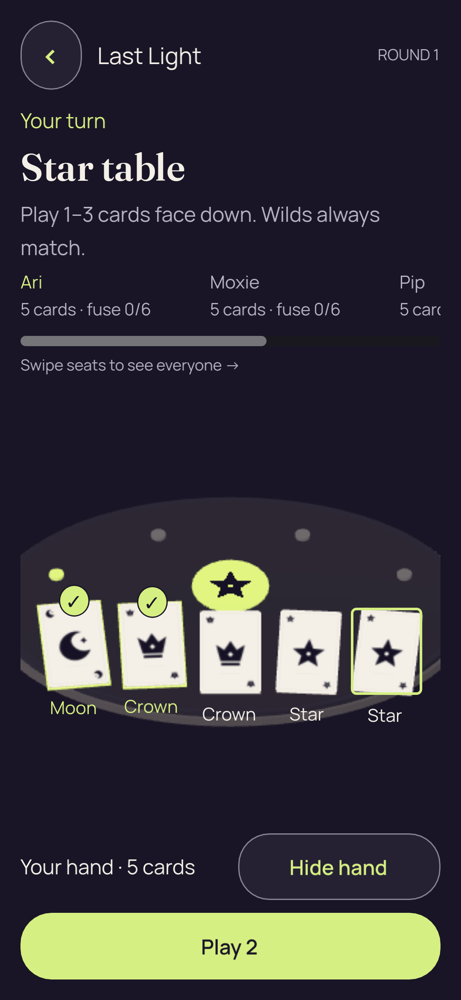</a> | <a href="iterations/preliminary-baseline-portrait/03-covered-again.png">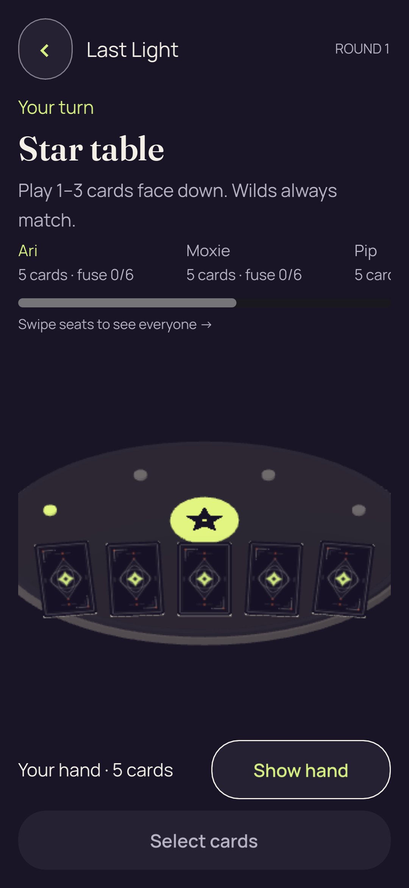</a> | <a href="iterations/preliminary-baseline-portrait/04-resumed-covered.png">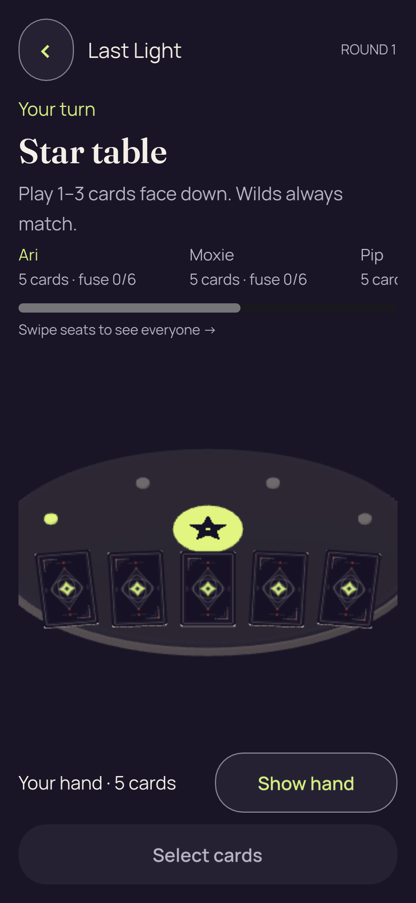</a> |

## Superseded candidate source portrait

**superseded** · Source-project capture before final hit-target rounding. Its three PNGs match the earlier packed portrait PNGs.

| 01-concealed.png | 02-revealed.png | 03-selected.png |
| --- | --- | --- |
|  |  |  |

## Earlier public-play motion: run1

**failed** · Preserved earlier run; Close removes live motion, scene resources and private bindings

| local-01-start.png | local-02-travel.png | local-03-settled.png |
| --- | --- | --- |
| <a href="iterations/play-effect-run1/local-01-start.png">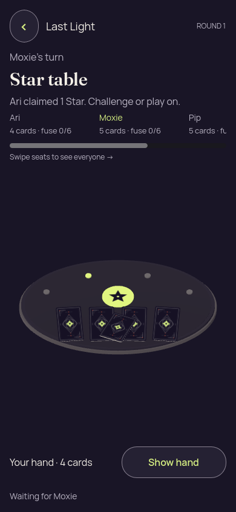</a> |  |  |

| remote-01-start.png | remote-02-travel.png | remote-03-settled.png |
| --- | --- | --- |
|  |  | <a href="iterations/play-effect-run1/remote-03-settled.png">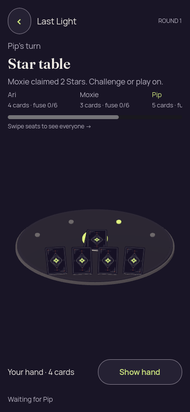</a> |

## Earlier public-play motion: run2

**failed** · Preserved earlier run; Close removes live motion, scene resources and private bindings

| local-01-start.png | local-02-travel.png | local-03-settled.png |
| --- | --- | --- |
|  |  |  |

| remote-01-start.png | remote-02-travel.png | remote-03-settled.png |
| --- | --- | --- |
| <a href="iterations/play-effect-run2/remote-01-start.png">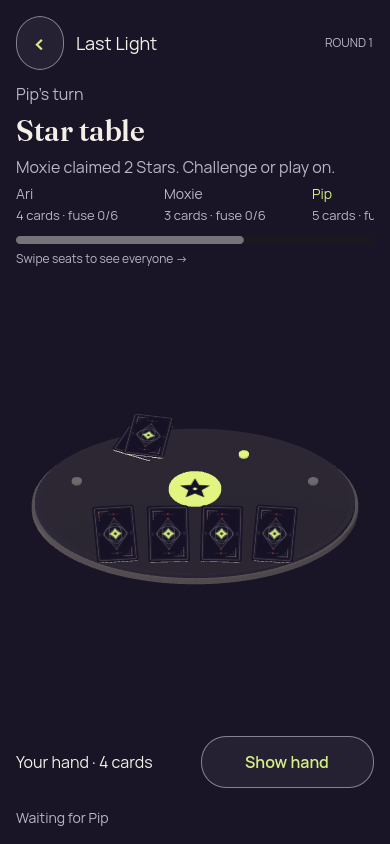</a> |  |  |

## Earlier public-play motion: run3

**passed** · Passing author run before the final packaged wrapper run.

| local-01-start.png | local-02-travel.png | local-03-settled.png |
| --- | --- | --- |
|  | <a href="iterations/play-effect-run3/local-02-travel.png">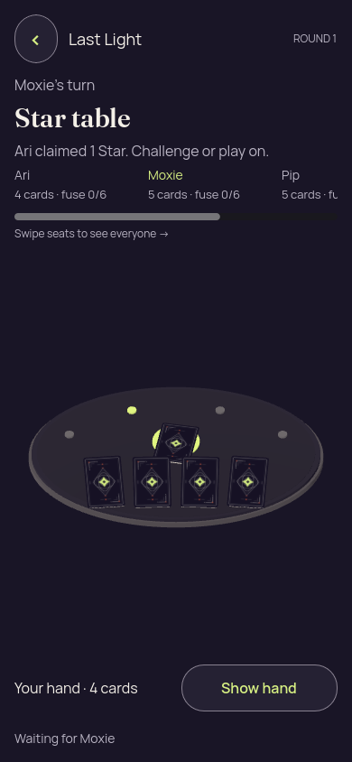</a> |  |

| remote-01-start.png | remote-02-travel.png | remote-03-settled.png |
| --- | --- | --- |
|  | <a href="iterations/play-effect-run3/remote-02-travel.png">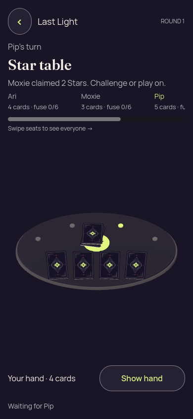</a> |  |

## Android API 36 preview: first run

**failed** · All 7 smoke checks passed. Overall run failed only because the final evidence check requested the missing capture label 3d-engine-entry; the successfully captured 3d-engine-entry-native-ready and selected originals are retained. Native Android emulator captures at 1080 × 2400 and 420 dpi.

[Original smoke result](android-api36-first-run/smoke-result.json) · [Artifact provenance](android-api36-first-run/append-provenance.json)

| 3d-engine-baseline-first-card.png | 3d-engine-baseline-public.png | 3d-engine-entry-native-ready.png |
| --- | --- | --- |
| <a href="android-api36-first-run/runtime/captures/3d-engine-baseline-first-card.png">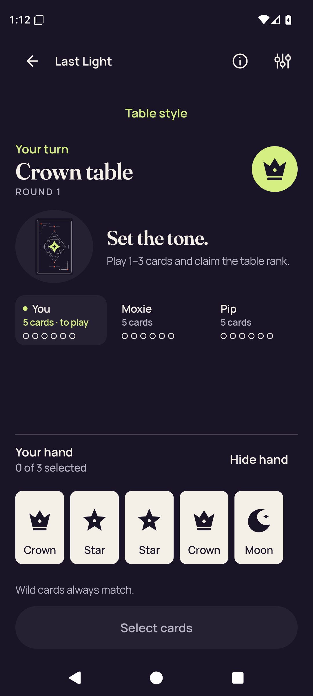</a> |  |  |

| 3d-engine-entry-selector.png | 3d-engine-home.png | 3d-engine-leave-confirmation.png |
| --- | --- | --- |
| <a href="android-api36-first-run/runtime/captures/3d-engine-entry-selector.png">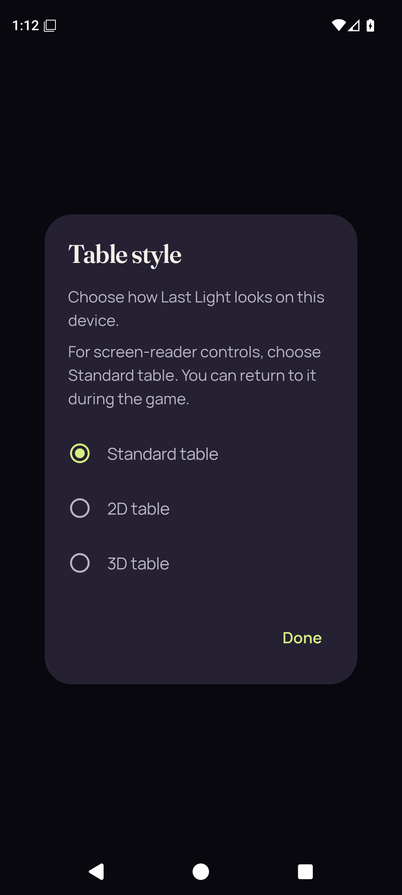</a> |  | <a href="android-api36-first-run/runtime/captures/3d-engine-leave-confirmation.png">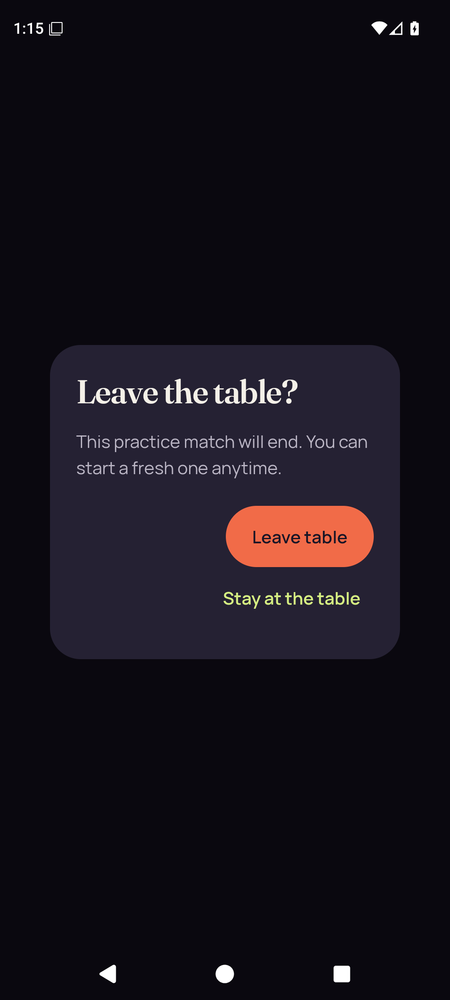</a> |

| 3d-engine-leave-selector.png | 3d-engine-selected.png | 3d-engine-standard-after-play.png |
| --- | --- | --- |
| <a href="android-api36-first-run/runtime/captures/3d-engine-leave-selector.png">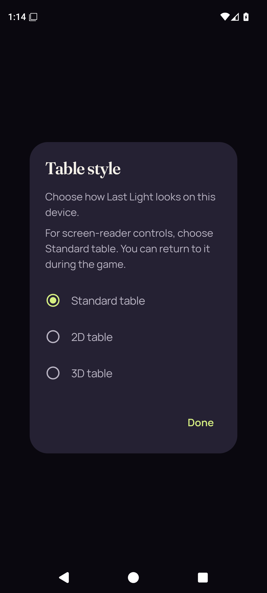</a> |  | <a href="android-api36-first-run/runtime/captures/3d-engine-standard-after-play.png">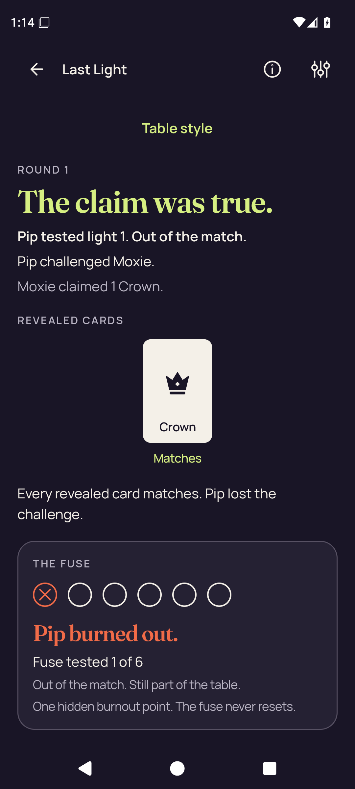</a> |

| final-diagnostic.png | home-cold.png |
| --- | --- |
|  | <a href="android-api36-first-run/runtime/captures/home-cold.png">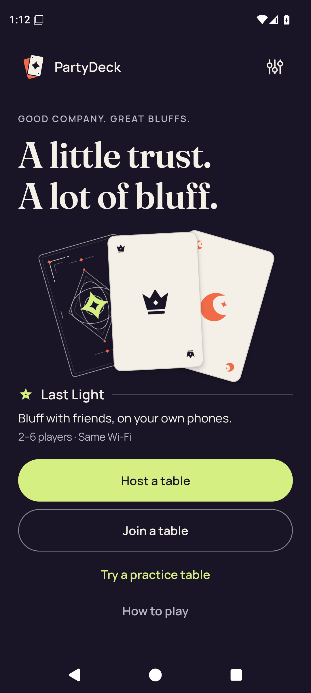</a> |
