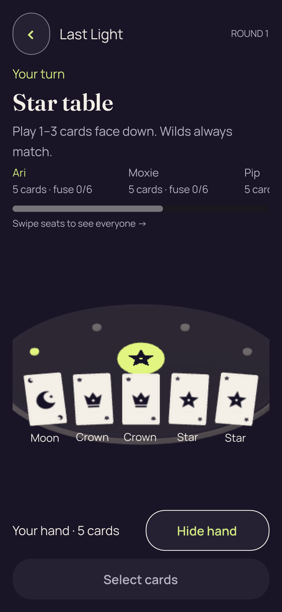
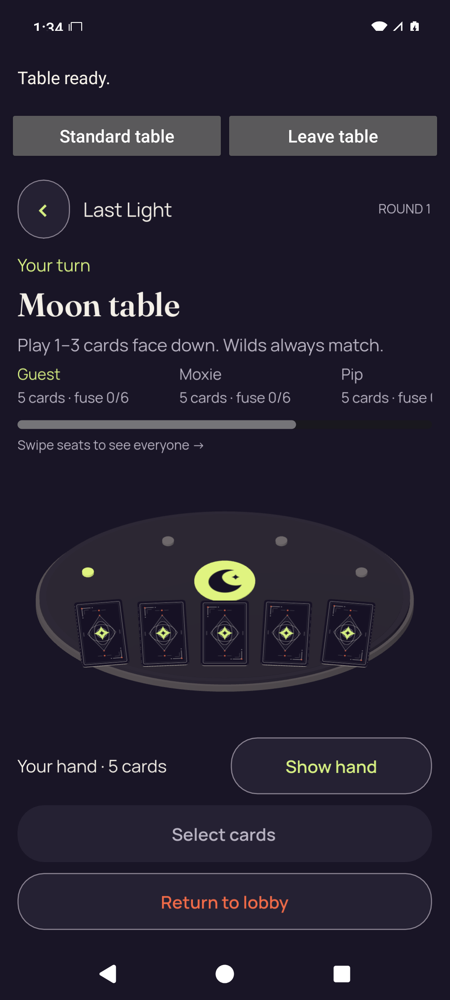
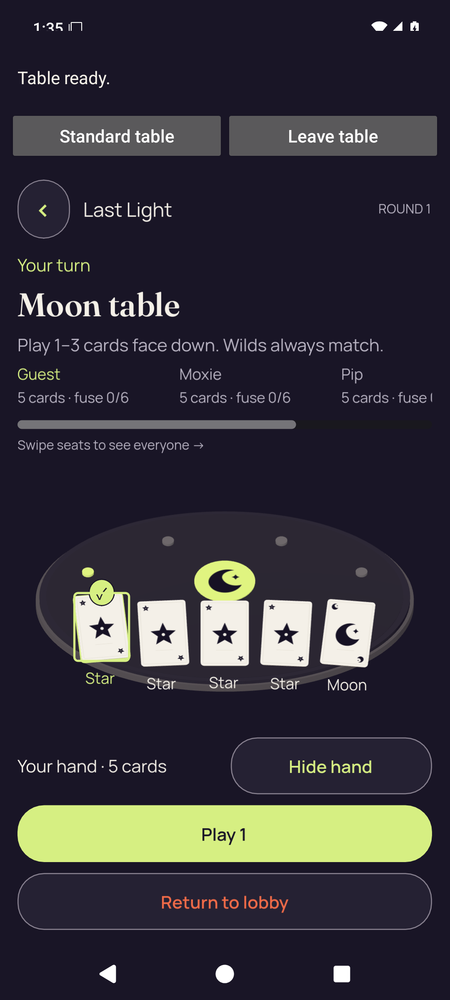
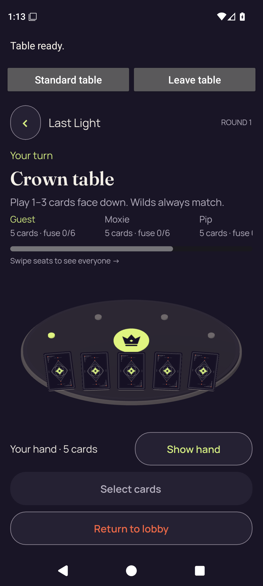
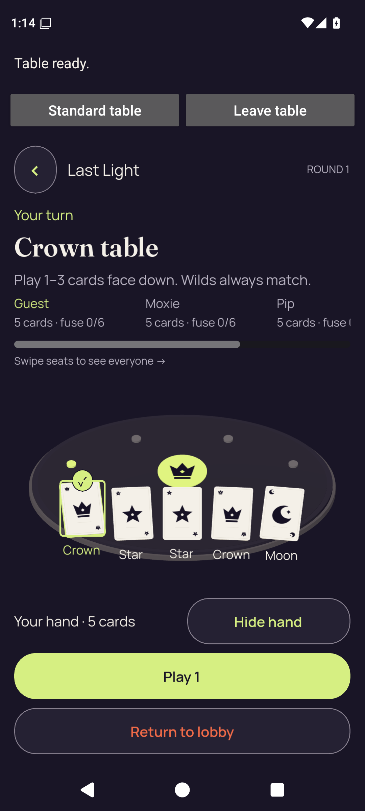

# Android testing release and 3D screenshots

[Download the Android testing APK](https://github.com/Apdelrahman1911/PartyDeck/releases/download/android-preview-34664818655-1/PartyDeck-android-preview.apk) · [Published prerelease](https://github.com/Apdelrahman1911/PartyDeck/releases/tag/android-preview-34664818655-1) · [Successful workflow](https://github.com/Apdelrahman1911/PartyDeck/actions/runs/34664818655)

Run **34664818655, attempt 1** passed Standard practice, native 3D smoke, and all **438 renderer assertions**. The comparison below uses the same renderer pack included in the published APK.

The full public APK download was verified: **334,823,155 bytes**, source `9b119ea9c692ff487a7221596407dfb9503e077e`. SHA-256: `4a57a1b4df33f6ee88b243ddbcb20449f47ff471843c94024f9306fdd626e5c0`. [Download receipt](published-release-34664818655-1/download-verification.json) · [Build and check results](published-release-34664818655-1/build-info.json).

## Before and after

The portrait pair below shows the same revealed hand before and after the renderer changes. Every image is an unchanged original PNG from the real Godot renderer.

| Before · 1080 × 2340, density 3 | Final candidate · 1080 × 2340, density 3 |
| --- | --- |
|  |  |

[Browse all original images in the repository](ALL-IMAGES.md). The [interactive HTML gallery](index.html) is optional: download this directory and open it locally.

## Android API 36 preview: successful published run

These unchanged native images come from the **published APK** on an API 36 emulator at **1080 × 2400, 420 dpi**. The complete rim, concealed backs, sharp card details, and selected-card feedback are visible in the original frames.

| Successful native entry, concealed hand | Successful native selected hand |
| --- | --- |
|  |  |

**Run status: passed. All 7 native smoke checks passed**, with no final diagnostic errors. The [original smoke result](android-api36-successful-run/smoke-result.json) exactly matches the native result in the published build information. Source `9b119ea9c692ff487a7221596407dfb9503e077e` and APK SHA-256 `4a57a1b4df33f6ee88b243ddbcb20449f47ff471843c94024f9306fdd626e5c0` are pinned in the original receipts.

[All 11 successful native images](ALL-IMAGES.md#android-api-36-preview-successful-published-run) · [Verified artifact provenance](android-api36-successful-run/append-provenance.json) · [Four passing Kotlin feedback tests](android-api36-successful-run/checks/TEST-dev.partydeck.app.controller.MobileCardPlayFeedbackTest.xml). These checks cover emulator behavior and feedback requests; they do not qualify physical-phone performance or audible sound output.

## Desktop measurements and review

The candidate renders the table at native pixel density, with sharper card details and the entire rim inside the stage. All nine capture/input/privacy checks passed in each of the three candidate cases.

| Physical window and density | 3D render target, before → after | Smallest side margin, logical px | Revealed originals |
| --- | --- | --- | --- |
| Portrait · 1080 × 2340 · density 3 | 328 × 333 → 984 × 999 | -23.75 → +14.42 | [Before](before/portrait-d3/02-revealed.png) · [After](after-final/portrait-d3/02-revealed.png) |
| Landscape · 2340 × 1080 · density 3 | 388 × 262 → 1164 × 786 | -28.10 → +17.05 | [Before](before/landscape-d3/02-revealed.png) · [After](after-final/landscape-d3/02-revealed.png) |
| Portrait · 720 × 1560 · density 1.75 | 379 × 470 → 663 × 822 | -27.44 → +16.66 | [Before](before/portrait-d1p75/02-revealed.png) · [After](after-final/portrait-d1p75/02-revealed.png) |

The fractional-density target differs from its physical stage by 0.25 px horizontally and 0.5 px vertically, within pixel rounding. Anti-aliasing changed from 2× to 4× MSAA. The short landscape details panel scrolls; these images preserve the initial scroll position.

Baseline: `e8e05709`, copied into scratch before import. Its original 160-file source inventory is unchanged and no import cache was created there. Candidate images were rendered from PCK `7ec66f903ed41b55bdb4c3d8972de56900c85fe765f1bf7cc81306150c86e9f2` with an external capture script and an empty project directory.

The focused before/after matrix uses recipient-safe fixture captures on Godot 4.7.2 with Mesa llvmpipe under Xvfb, not device GPU or multiplayer qualification. Reveal and selection used real mouse input; no gameplay intent or accepted play is claimed by the focused matrix. Reduced motion was enabled in both versions.

[Manifest and measurements](manifest.json) · [SHA-256 file inventory](SHA256SUMS) · [Fixture provenance](provenance/fixture-manifest.json) · [Reusable capture harness](../../../godot/renderer/tests/three_d_quality_capture.gd)

[All 104 original PNGs and iterations](ALL-IMAGES.md) are preserved with [full image identities](original-catalogue.json). The final archive includes six local/remote public-play motion frames and 22 full-match 2D/3D frames. The motion test passed 123 desktop renderer checks; its recipient snapshots are fixtures. The full-match comparison passed with the same actual KMP authority trace in both presentations, as recorded in its [report](authority-comparison-final/report.json). Earlier failed motion reports and the superseded candidate remain labeled in the archive.

[Independent review](review/INDEPENDENT-3D-REVIEW.md) approved the final pack after all 492 rendering/input assertions and direct review of the final portrait, landscape, and fractional-density images. It found no unresolved issue within the tested scope.

## Android API 36 preview: first run

These archived first-run screenshots come from workflow `34663701915`, whose failed result is retained below. They are unchanged native images from the Android preview APK on an API 36 emulator at **1080 × 2400, 420 dpi**. The entry and selected frames show the full rim and clear card details.

| Native entry, concealed hand | Native selected hand |
| --- | --- |
|  |  |

**Run status: failed. All 7 smoke checks passed**, including Reveal/select, Play verified through the Standard authority outcome, and Leave. The sole final diagnostic was `Missing successful native display capture: 3d-engine-entry`. The original [smoke result](android-api36-first-run/smoke-result.json) retains that failure; the successfully acquired entry image is named `3d-engine-entry-native-ready`.

The 11 native PNGs, their original capture receipts and UI XML are included in [all images](ALL-IMAGES.md#android-api-36-preview-first-run). [Artifact and APK provenance](android-api36-first-run/append-provenance.json) pins workflow `34663701915`, artifact `10288363349`, source `c0bf954adb950cae5f3e861dd0bb81b2eed21b43`, and the same `7ec66f90…` renderer pack. This evidence does not qualify a physical phone, sound audibility, networking, animation quality, or performance.
