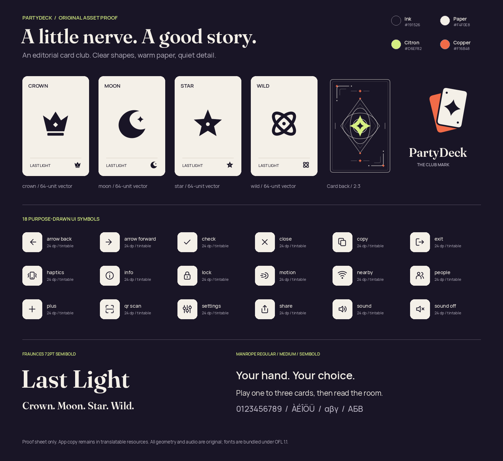
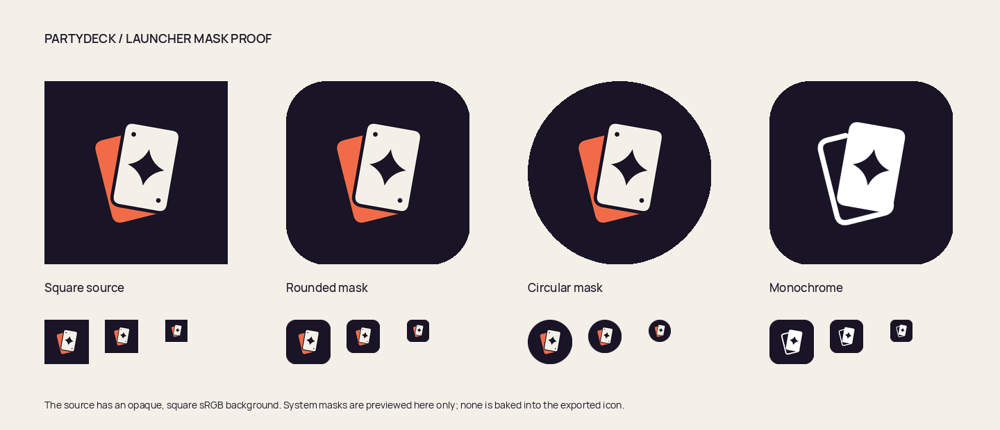
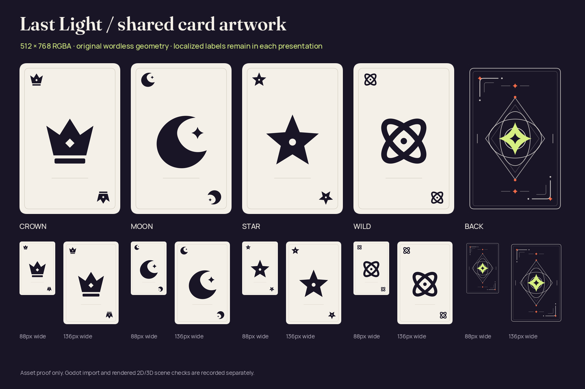
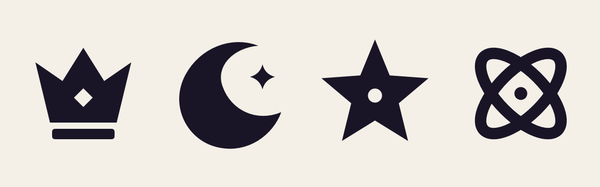

# Screenshot review gallery

This collection preserves **3,433 original app and renderer captures**, including failed attempts, and links to **four existing asset proofs**. Click a collection, then any thumbnail to open the full PNG. Every record includes its original filename, scenario, platform, pixel dimensions and full SHA-256; [manifest.json](manifest.json) also records source locations, exact revisions where known, CI runs, receipts and duplicate-source aliases.

This batch preserves 618 additional originals: **53 directly viewed, 84 exact published-byte matches and 481 explicitly unviewed**. The unviewed originals carry no visual acceptance. All original capture identities remain separate, including failed cases and identical image bytes.

An additional **13 supplemental images** comprise [nine decoded launch-video frames](supplemental/ios-34478720554-launch-video/README.md) and [four existing adaptive review sheets](supplemental/android-adaptive-34485033488-review-sheets/README.md). They are separate from the original PNG total.

[Open the published first batch](first-batch/README.md) for the 125 initially published native, shared-UI and first desktop 2D views. The collection pages below add complete source records and original-filename mappings without duplicating those images.

Use the latest native and shared-UI collections for current review. Earlier captures and Godot iterations are retained below for comparison. A screenshot shows a particular state; the run and fixture limits remain part of its evidence.

| Current preserved collection | Images | Evidence scope |
| --- | ---: | --- |
| [Android API 35 debug — CI 34515669045](android-34515669045/debug/README.md) | 31 | Ordinary smoke passes; originals retain exact published-byte matches or explicit unviewed status. |
| [Android API 35 optimized, test signed — CI 34515669045](android-34515669045/optimized-test-signed/README.md) | 31 | Ordinary smoke passes; native and visual-review limits remain separate. |
| [iOS ordinary — CI 34515669045](ios-34515669045/ordinary/README.md) | 10 | Nine cases and five unfiltered .all audits pass. All ten originals remain explicitly unviewed in this batch. |
| [iOS ordinary — CI 34509634154](ios-34509634154/ordinary/README.md) | 10 | Nine cases and five .all audits pass. Maximum-selection original directly viewed; nine others explicitly unviewed. |
| [Compose JVM snapshots — CI 34515669045](android-34515669045/compose-jvm/README.md) | 69 | Original fixture identities, including the nested presentation directory. Byte matches and unviewed status are explicit. |
| [Android API 35 preparation — CI 34515669045](android-34515669045/preparation/README.md) | 1 | Original setup capture, explicitly unviewed. |
| [Android API 35 debug — CI 34503251315](android-34503251315/debug/README.md) | 31 | Ordinary smoke passes. Normal hands/actions fit; enlarged intermediate scrolling and the debug invalid-Join right-edge clipping remain. |
| [Android API 35 optimized, test signed — CI 34503251315](android-34503251315/optimized-test-signed/README.md) | 31 | Ordinary smoke passes. Enlarged invalid Join fits; the named Rules-entered original is a round result. Native session checks are separate. |
| [Compose JVM snapshots — CI 34503251315](android-34503251315/compose-jvm/README.md) | 69 | Original layout fixtures at exact CI source; no native renderer qualification follows from JVM images. |
| [Android API 35 emulator preparation — CI 34503251315](android-34503251315/preparation/README.md) | 1 | Original launcher/setup image, with its original companions and separate evidence scope. |
| [Android API 35 debug — CI 34496267571](android-34496267571/debug/README.md) | 31 | Ordinary smoke passes. Normal and 200% Home, Rules and hand actions are reviewed; captured scroll-edge limits remain. Native progress is separate. |
| [Android API 35 optimized, test signed — CI 34496267571](android-34496267571/optimized-test-signed/README.md) | 31 | Ordinary smoke passes. Full hand labels and scrolled large-text Play fit; native JNI failure remains separate. |
| [iOS ordinary production app — CI 34496252392](ios-34496252392/README.md) | 9 | Standard `.all` accessibility audit fails the count-feedback hit area. Nine original capture identities include the XCTest Element Screenshot; native production-session/layout gates were skipped. |
| [Compose GameplayLayout — local validation](compose-gameplay-layout-20260910-root-validation/README.md) | 37 | Seven JVM tests pass. One directly viewed selection-limit original and 36 named published-byte matches; source-file hashes identify the batch without a whole-tree commit claim. |
| [Compose JVM snapshots — CI 34496267571](android-34496267571/compose-jvm/README.md) | 69 | Original JVM fixtures preserve their exact CI source. Enlarged picker/opening observations remain layout evidence, separate from native renderer results. |
| [Android API 35 emulator preparation — CI 34496267571](android-34496267571/preparation/README.md) | 1 | Original launcher capture is setup evidence; no game content or native acceptance is inferred. |
| [Android API 35 debug — CI 34485028785](android-34485028785/debug/README.md) | 31 | Ordinary smoke passes 88 steps. Home, Rules, hand and Play are reviewed at normal/200% text; scroll and edge clipping remain. Separate native entry fails. |
| [Android API 35 optimized, test signed — CI 34485028785](android-34485028785/optimized-test-signed/README.md) | 31 | Ordinary smoke passes 86 steps. The final 200% Home is directly reviewed; the enlarged invalid-Join button is partly clipped. Separate native entry fails. |
| [Compose named winner — stable announcement, four layouts](compose-winner-semantics-20260910/README.md) | 4 | Seven JVM tests pass. Named winner and both actions fit at phone, 200% text, short landscape and tablet sizes; stable heading/one polite live region remains JVM-only evidence. |
| [Android API 36 debug — CI 34457458638](android-34457458638/debug/README.md) | 31 | Both text-scale Rules routes pass with complete dedicated Practice actions. Enlarged Play is reachability only; result and intermediate scroll clipping remain. Final Home is 200% text. |
| [Android API 36 optimized, test signed — CI 34457458638](android-34457458638/optimized-test-signed/README.md) | 31 | Both text-scale Rules routes pass with complete dedicated Practice actions. Enlarged Play is reachability only; result and intermediate scroll clipping remain. Final Home is 200% text. |
| [Android API 35 debug — CI 34456441354](android-34456441354/debug/README.md) | 31 | Both text-scale Rules routes pass with complete dedicated Practice actions. Enlarged Play is reachability only; result and intermediate scroll clipping remain. Final Home is 200% text. |
| [Android API 35 optimized, test signed — CI 34456441354](android-34456441354/optimized-test-signed/README.md) | 31 | Both text-scale Rules routes pass with complete dedicated Practice actions. Enlarged Play is reachability only; result and intermediate scroll clipping remain. Final Home is 200% text. |
| [Android optimized, test signed — Rules recapture, CI 34432935952](android-34432935952/optimized-test-signed/README.md) | 31 | Full exercised flow and actual Rules → Practice → confirmed leave/Home pass at 100% and 200%. Both dedicated Rules actions have complete labels/borders with 63 px clearance. The normal Rules-entered result still places most of Next round below the viewport. |
| [Android debug — Rules recapture, CI 34432935952](android-34432935952/debug/README.md) | 31 | Full exercised flow and both Rules routes pass. Both dedicated Rules actions have complete labels/borders with 63 px clearance; 30 stages and final 200% Home remain separate originals. Enlarged result content continues below the viewport. |
| [iOS native baseline — CI 34428798269](ios-34428798269/README.md) | 8 | Three UI and three native transport tests pass on iPhone 17 simulator, runtime 26.4.1. Eight original attachment mappings are retained; text scale was not recorded. |
| [Compose presentation controls — 200% lifecycle fixtures](compose-presentation-controls-20260910/README.md) | 4 | Two JVM UI cases pass in one actual rendering execution. Available selectors, Opening and concealed fallback use explicit fixtures; no native factory executes. Fallback retains its scrolled clipping limit. |
| [Compose shared UI — exact CI layout fixtures, 34428798269](compose-ci-34428798269/README.md) | 65 | 21 layout tests pass. All original pixels match the earlier reviewed fixtures; exact CI revision and fresh source records are preserved separately. These remain JVM fixtures. |

## Godot native host evidence

| Collection | Images | Evidence scope |
| --- | ---: | --- |
| [Android API 35 native sessions — CI 34515669045](android-34515669045/godot-session/README.md) | 186 | Debug 30 pass; optimized 28 pass and two renderer-death skips. Two compact 2D entries and four public outcome frames directly viewed; remaining-hand size unobserved. |
| [Android API 36 adaptive — CI 34514544296](godot-android-adaptive-34514544296/README.md) | 228 | 28 named scopes pass, four fail, 12 unsupported, 52 unreached. Failure is 3D preparation after unsupported recording; no split request. Twelve unviewed movies. |
| [iOS production — CI 34515669045](ios-34515669045/godot-session/README.md) | 12 | Both cases fail second entry freshness wait. Compact 2D cover/Reveal fits; seat-bottom and 3D lower-action clipping remain. Two direct views, ten unviewed. |
| [iOS production — CI 34509634154](ios-34509634154/godot-session/README.md) | 12 | Both cases fail second entry freshness wait under old pack. Reveal/return clipping remains. Two direct views, ten unviewed. |
| [iOS corrected retained-host diagnostic — CI 34515678208](godot-ios-retained-34515678208/README.md) | 28 | Two cases pass; stale second-3D-entry diagnostics fails. Ten direct views and 18 unviewed originals; all qualification gates remain false. |
| [Android API 35 native sessions — CI 34503251315](android-34503251315/godot-session/README.md) | 150 | Debug passes 21 checks; optimized passes 19 and skips two renderer-death checks. Engine gameplay was not invoked. Round-1 optimized and longer round-2 debug result layouts remain distinct. |
| [Android API 36 adaptive — CI 34506161751](godot-android-adaptive-34506161751/README.md) | 125 | 15 named scopes pass, one fails, eight are unsupported and 72 are unreached. Optimized 200% reaches 2D/3D; normal-text recovery cases remain failed. Seven movies remain unviewed/undecoded. |
| [iOS sampled retained-host diagnostic — CI 34505106959](godot-ios-sampled-34505106959/README.md) | 18 | Opt-in sampling=true; one case passes and two fail. Complete later controls do not change failures. Includes bounded Sample-05 and earlier 3D-scroll supplements with zero new PNGs. |
| [iOS MSAA diagnostic guard failure — CI 34512412329](godot-ios-msaa-guard-failure-34512412329/README.md) | 3 | All three fail initial 2D entry at the exact-pack guard before native preparation/rendering. The failed-case outcome overrides no original attachment metadata. |
| [iOS authority host — CI 34488350932](godot-ios-native-34488350932/authority/README.md) | 45 | All five Simulator fixture cases pass, including four reference matches at normal/200% text. Initial normal 2D Reveal still clips; scrolled 200% proof/actions retain viewport limits. |
| [iOS retained host — CI 34488350932](godot-ios-native-34488350932/retained/README.md) | 28 | Background and repeated-entry cases pass; stale-first-ready reentry fails its 15-second wait. The later Running frame does not satisfy that deadline. |
| [Android API 36 adaptive — CI 34496282263](godot-android-adaptive-34496282263/README.md) | 30 | Two scopes pass, four fail, one is unsupported and 89 are unreached. Debug initial landscapes pass; optimized JNI aborts remain. No 3D or video/privacy qualification. |
| [Android API 35 native sessions — CI 34496267571](android-34496267571/godot-session/README.md) | 61 | Debug retains 55 partial-progress captures before the ten-minute cutoff; optimized retains six before/after JNI failure. No complete native pass. |
| [Android adaptive — CI 34485033488](godot-android-adaptive-34485033488/README.md) | 16 | Four installations pass; all four initial landscape checks fail. Normal text stops in Standard preparation; 200% stops after the logged 2D choice. No sampled renderer, video or native transition; 92 scopes unexecuted. |
| [Android production entry — CI 34485028785](android-34485028785/godot-session/README.md) | 12 | Both 2D Activity waits fail after the recorded picker choice. Final frames retain the concealed Compose table; no native Ready, 3D, lifecycle or renderer-death check. |
| [iOS production — CI 34480503751](godot-ios-production-34480503751/README.md) | 2 | Both 2D/3D smokes fail. A stretched host area leaves a reported 402 × 26 renderer viewport; the native accessibility guard is unsatisfied. Six baseline cases are separate evidence. |
| [Android comparison — reviewed subset, CI 34478725424](godot-android-34478725424/README.md) | 8 | Existing acceptance covers four API35 comparison cases and twelve exits. Four blank Recents thumbnails and four 3D reveal/resume originals are published; the enlarged resumed hand remains clipped. No native idle timing claim. |
| [Godot iOS authority host — CI 34478720554](godot-ios-authority-34478720554/README.md) | 16 | Normal 2D and secure Exit pass. 2D/200% fails launch with no original PNG; both 3D diagnostic waits fail. Later captures remain separate from rejected observations. |
| [Godot iOS retained host — CI 34478720554](godot-ios-retained-34478720554/README.md) | 27 | Four repeated entries pass. Dormant Home/activate passes before a separate second-3D entry wait fails; stale reentry also fails while warming. Later concealed frames do not satisfy the deadlines. |
| [Godot iOS authority host — preceding success, CI 34473325295](godot-ios-authority-34473325295/README.md) | 45 | All four reference matches at normal/200% text and secure Exit pass. This exact pack predates demand redraw; layout clipping and broader native limits remain. |
| [Godot iOS retained host — CI 34473325295](godot-ios-retained-34473325295/README.md) | 26 | Four repeated entries pass. Dormant Home/activate fails immediate applicationActive with no exact returned dictionary; reentry fails while covered. |
| [Godot iOS authority host — CI 34464316979](godot-ios-authority-34464316979/README.md) | 37 | Normal 2D and secure Exit pass. 2D/200% reaches the winner but fails revision 42 versus 41; both 3D cases fail controlMissing. |
| [Godot iOS retained host — CI 34464316979](godot-ios-retained-34464316979/README.md) | 28 | Background transitions and four repeated entries pass; stale reentry fails. Original retention aliases remain provenance, without inflating capture counts. |
| [Godot Android — CI 34463877910](godot-android-34463877910/README.md) | 76 | All four complete API 35 debug scripts and all twelve exits pass. Twelve native barriers/main callbacks, zero fallback; 200% viewport clipping remains. |
| [Godot iOS authority host — CI 34460468965](godot-ios-authority-34460468965/README.md) | 35 | All four reference tests fail; secure Exit passes. Normal 2D reaches the winner but fails revision 42 versus 41. Actual Home/state discrepancies and later-progress limits remain explicit. |
| [Godot Android — CI 34456443339](godot-android-34456443339/README.md) | 66 | Both 2D scripts pass. Both 3D matches accept lobby return, then fail Close acknowledgment; neither attempts fresh Exit or native Back. Eight entries yield six completed exits. Six native barriers and two fallbacks are recorded; scheduling cause is unproven. |
| [Godot Android — CI 34450246541](godot-android-34450246541/README.md) | 71 | Both 2D cases and 3D/200% pass. Normal 3D accepts match return but fails close acknowledgment; fresh Exit and native Back are never attempted there. Ten entries yield nine completed requested exits. Initial 2D Reveal now fits. |
| [Godot Android — CI 34446327045](godot-android-34446327045/README.md) | 74 | All four matches, Home/Recents/concealed resumes and fresh scene Exits complete. Both 2D scripts pass; both final 3D native Back routes fail as renderer_exit. Twelve entries yield ten completed requested exit routes; normal 2D initial Reveal still clips. |
| [Godot iOS authority host — CI 34439760695](godot-ios-authority-34439760695/README.md) | 36 | Both normal-text full matches and secure Exit pass. 2D/200% stops at scrollBound with no Next tap; 3D/200% shows Home within the deadline while the state predicate fails. Initial normal 2D Reveal remains clipped. |
| [Godot Android — CI 34439587132](godot-android-34439587132/README.md) | 48 | Both 2D scales pass full matches, Home/Recents/resume and three separate teardown paths. Both 3D cases fail: normal diagnostics timeout, 200% SIGSEGV during resume. Normal initial 2D Reveal still clips by four logical units. |
| [Godot iOS authority host — CI 34434392993](godot-ios-authority-34434392993/README.md) | 23 | Four reference matches fail; secure default renderer Exit passes. Native 2D/100% reaches round 8 and 3D/200% reaches round 2, with transient geometry limits. The 2D/200% audio-startup abort and 3D/100% delayed Home remain failed outcomes. |
| [Godot Android — CI 34433457249](godot-android-34433457249/README.md) | 31 | All four full qualification jobs fail. Native 2D/100% completes the match and records destruction; 2D/200% reaches round 4 before Next round scroll timeout. Both 3D cases render Ready but stop at shader-warning classification with zero gameplay intents. |
| [Godot iOS diagnostic probe — CI 34431377938](godot-ios-probe-34431377938/README.md) | 9 | Five diagnostic tests pass with actual drawing, pause/cover/resume, touch-driven exit and cleanup. The expected missing-scene failure is retained. This does not establish Last Light gameplay, KMP factory or same-process reinitialization. |
| [Godot Android host — CI 34430556814](godot-android-34430556814/README.md) | 8 | All four entries fail initialization before Ready or gameplay. Final originals show the chooser's closed-before-ready message; process logs retain the display-density error and a 3D/200% exit timeout. |
| [Godot Android host — CI 34427418175](godot-android-34427418175/README.md) | 8 | All four 2D/3D × 100%/200% cases fail at match entry. Native chooser and covered final host originals are retained; no rendered game or accepted gameplay intent is established. |
| [Godot iOS probe — CI 34428221586](godot-ios-probe-34428221586/README.md) | 2 | One cancellation before engine construction passes; four tests fail. The native host shows Closed or Failed, with zero draw/Ready/iterations. Original metrics and four supplemental source recordings are retained. |

## Supplemental image evidence

| Supplement | Images | Evidence scope |
| --- | ---: | --- |
| [Android adaptive review sheets — CI 34485033488](supplemental/android-adaptive-34485033488-review-sheets/README.md) | 4 | Existing resized/labeled sheets cover all 16 preserved failed-run originals. Zero original-PNG contribution; native entry remains unqualified. |
| [iOS launch recording — CI 34478720554](supplemental/ios-34478720554-launch-video/README.md) | 9 | Original MP4 and unchanged decoded frames retained with exact relative PTS. Home → blank opening view → late Idle chooser; launch remains failed, tap delivery/native scene entry unproven. These are excluded from original PNG totals. |

## Godot gameplay through the real authority

| Collection | Images | Evidence scope |
| --- | ---: | --- |
| [Godot 2D and 3D — desktop CI 34463877910](godot-desktop-34463877910/README.md) | 22 | Exact clean bbfde024 source, PCK a47392b4…, equal complete 42-view traces and exits 0. All original bytes match prior reviewed images; new source identities remain distinct. |
| [Godot 2D and 3D — desktop CI 34456443339](godot-desktop-34456443339/README.md) | 22 | Exact clean dad1c11 source and PCK 8f24944d…, equal complete 42-view traces and exits 0. All originals match previously reviewed bytes. Both native 3D Close acknowledgments fail. |
| [Godot 2D and 3D — desktop CI 34450246541](godot-desktop-34450246541/README.md) | 22 | Exact clean a727868 source and PCK 0440dc8a…, equal complete 42-view traces and exits 0. All originals match previously reviewed bytes; normal 3D native close acknowledgment remains failed. |
| [Godot 2D and 3D — desktop CI 34446327045](godot-desktop-34446327045/README.md) | 22 | Exact clean b7f2f4f source and PCK 0ed324c…, equal complete 42-view traces and exits 0. All pixels match earlier reviewed originals; native Back failures remain separate. |
| [Godot frame reconciliation — local packed authority run](godot-frame-reconciliation-packed-20260910/README.md) | 22 | Dirty local base 86ca7f5 and frozen source fingerprint; the same PCK and equal complete 42-view traces with both exits 0. Distinct local receipts and later source review are retained. |
| [Godot 2D and 3D — desktop CI 34439587132](godot-desktop-34439587132/README.md) | 22 | Exact clean ff6e0ac source and PCK 6599f825…, equal 42-view traces and exits 0. All PNGs match the preceding reviewed desktop originals; source records and native outcomes stay separate. |
| [Godot 2D and 3D — desktop CI 34433457249](godot-desktop-34433457249/README.md) | 22 | Exact clean revision `bf77ea7`, replacement PCK `6599f825…`, equal 42-view traces and both exits 0. All pixels match the corrected ordered originals; the native jobs retain their separate failed outcomes above. |
| [Godot 2D and 3D — local packed run after native fixes](godot-matched-packed-native-fixes-20260910/README.md) | 22 | Same PCK and equal 42-view traces with both exits 0. Local base `8d8d429` has a dirty working tree; source fingerprint and original receipts identify the execution separately from clean CI. |
| [Godot 2D and 3D — final ordered desktop CI 34430556814](godot-desktop-34430556814/README.md) | 22 | Exact clean CI source and ordered PCK `26bfbb72…`; equal 42-view traces and both exits 0. Pixels match the corrected local originals, including the Crown winner and named explanation. Native entries in this workflow fail separately. |
| [Godot 2D and 3D — final ordered packed gameplay](godot-matched-packed-ordered-20260910/README.md) | 22 | Final PCK `26bfbb72…` executes equal 42-view traces with both exits 0. Pixels match the corrected v5 originals; all new source PNGs and receipts are preserved separately. |
| [Godot 2D and 3D — final matched packed v5 gameplay](godot-matched-packed-v5-20260910/README.md) | 22 | Equal 42-view authority traces, real input and both exits 0 at 430 × 932. The final 3D winner now has the correct Crown emblem and complete challenge/burnout explanation. |
| [Godot 2D and 3D — older desktop CI 34427418175](godot-desktop-34427418175/README.md) | 22 | Exact CI source, equal 42-view traces and clean desktop exits. This older source still has the wrong Star winner emblem and missing final explanation in 3D; the native jobs in the same workflow fail. |
| [Godot 2D and 3D — matched packed seed-2 gameplay](godot-matched-packed-20260910/README.md) | 22 | Equal 42-snapshot authority traces, real input, both exits 0. Desktop 430 × 932. The 3D winner still has the wrong rank emblem and missing final explanation. |
| [Godot 2D — first complete seeded match](godot-first-real-2d-input/README.md) | 11 | Real Button/authority gameplay, privacy and captures retained. Shutdown logged a loopback-close error; clean engine exit is unqualified. Desktop 430 × 932; no 2D/3D parity or native execution claim. |

## Godot input investigations

| Collection | Images | Evidence scope |
| --- | ---: | --- |
| [2D compact initial Reveal — source proposal](godot-2d-initial-layout-source-20260910/README.md) | 12 | Accepted within width <860, height 500–799 and text scale <1.5. Hardest wrap fixture retains 7 units; 320×568 at 200% still clips by 93. |
| [2D compact initial Reveal — root packed checks](godot-2d-initial-layout-packed-20260910/README.md) | 8 | Both existing packed checks pass under PCK 557b2297…; eight separate originals exactly match reviewed source pixels. Native qualification remains pending. |
| [3D MSAA-disabled diagnostic — root packed checks](godot-msaa-disabled-packed-20260910/README.md) | 12 | All originals peer-reviewed; both Linux fixture checks pass. Readable ranks/controls, visible aliasing and existing 200% scrolling; no native/performance acceptance. |
| [Godot 3D demand redraw — desktop functional review](godot-3d-demand-redraw-20260910/README.md) | 13 | Final 306 redraw, 155 bridge and 216 terminal-return assertions pass, plus two scene flows. Earlier parse/overlay/zero-size failures remain. No native timing or iOS stall-fix claim. |
| [Godot 2D — initial Reveal source investigation](godot-2d-initial-reveal-20260910/README.md) | 17 | Normal baseline clips; compact source shows complete Reveal/panel with an eight-unit margin. All four 200% probe images match. Four failed-fixture and five corrected-fixture originals remain distinct; this collection records source-probe behavior. |
| [Godot frame reconciliation — focused packed 3D at 200% text](godot-frame-reconciliation-focused-3d-20260910/README.md) | 15 | Two local fixture reports pass: persistent context, emulated drag, selection limit/deselection, privacy and complete six-seat confirmation. Scrolling means not every card is fully visible at once; no authority-accepted gameplay or native-device claim. |
| [Godot 2D — adaptive gestures and actual authority acceptance](godot-2d-scroll-adaptive-20260910/README.md) | 7 | Desktop Xvfb/Mesa at the failed Android case’s geometry and 200% text. Both gestures expose the complete Next action; captured input is accepted by the real adapter/authority and round 5/revision 12 renders. No Android execution claim. |
| [Godot 2D — scroll-inertia investigation](godot-2d-scroll-investigation-20260910/README.md) | 6 | Desktop 250 ms touch/mouse strokes reproduce overshoot. A 900 ms touch leaves Next visible and emits one renderer event without authority acceptance. Repeated initial images and failed after-release views remain separate originals. |

## Godot prototype iterations

These are actual Godot capture files, including explicitly labeled blank parse-error screens in 3D v9. Iteration 01 uses synthetic structural data; later 2D iterations mostly use frozen Kotlin-authority projections, with an explicitly synthetic lobby-permission input where labeled. Iterations 09–10 use the real six-seat authority input for lobby confirmation. The 3D v1–v10 captures use authority-derived static inputs and retain both failures and later corrections. Desktop emulated-touch traces are labeled separately from native input. Static checks do not establish authority-accepted gameplay or native mobile accessibility. Every original in these reviewed batches is retained.

| Collection | Images | Stage |
| --- | ---: | --- |
| [Godot 2D — iteration 10, final compact Reveal and confirmation checks](godot-2d-iteration-10/README.md) | 14 | Complete initial Reveal at 900 × 740; both confirmation choices visible at 200%; repeat emulated drag/tap/privacy checks pass. |
| [Godot 2D — iteration 09, corrected gestures and authority edge cases](godot-2d-iteration-09/README.md) | 26 | Nine static reports pass; one/zero-card, truthful rank/Wild, burnout and six-seat confirmation. Case-specific seeds and frozen fixture tools retained. |
| [Godot 2D — iteration 08, action-drag failures](godot-2d-iteration-08/README.md) | 3 | All three failed attempts retained; ancestor probe identifies the cover panel stopping drag propagation. |
| [Godot 2D — iteration 07, six-seat layout and emulated hand drag](godot-2d-iteration-07/README.md) | 14 | Corrected 1280 × 800 layout and successful emulated hand drag; 900 × 740 Reveal clipping and failed 200% action drag retained. |
| [Godot 2D — iteration 06, header-width correction](godot-2d-iteration-06/README.md) | 5 | Header fixed; Reveal still below the initial viewport and diagnostic hand drag fails. |
| [Godot 2D — iteration 05, proof reflow and edge states](godot-2d-iteration-05/README.md) | 12 | Proof labels, forced challenge, observer and winner; failed desktop header and incomplete gesture probe retained. |
| [Godot 2D — iteration 04, compact confirmation and edge fixtures](godot-2d-iteration-04/README.md) | 7 | 200% confirmation corrected; eliminated spectator and failed three-card proof wrapping preserved. |
| [Godot 2D — iteration 03, compact layouts and outcomes](godot-2d-iteration-03/README.md) | 29 | Reveal/selection visibility improved; round/winner/old-proof states retained. The 200% lobby confirmation fails initial-viewport visibility. |
| [Godot 2D — iteration 02, authority-derived fixtures](godot-2d-iteration-02/README.md) | 16 | Desktop, phone, 200% text and short landscape; static renderer checks passed with recorded layout issues. |
| [Godot 2D — iteration 01, desktop structural fixture](history/godot-2d-iteration-01/desktop/README.md) | 4 | Early desktop structural fixture; known selection indicator and scrolling issues. |
| [Godot 2D — iteration 01, phone and landscape history](history/godot-2d-iteration-01/README.md) | 9 | Original phone/landscape captures and the failed 200% input-reachability attempt. |
| [Godot 3D — v10, final compact input and confirmation checks](godot-3d-20260910-v10/README.md) | 21 | Three focused cases pass. Persistent actor/rank and Show/Hide, corrected focused-card containment and readable 200% confirmation; emulated drag/tap/privacy receipts retained. |
| [Godot 3D — v9, parse-error screens](history/godot-3d-20260910-v9/README.md) | 3 | All three runs fail before the game scene renders; original blank outputs, diagnostics and parse-error logs retained. |
| [Godot 3D — v8, 200% card-containment failure](history/godot-3d-20260910-v8/README.md) | 3 | Initial, selected and failure captures retained; the focused card is clipped by two pixels after fourth-choice feedback. |
| [Godot 3D — v7, persistent context and six-seat failure](history/godot-3d-20260910-v7/README.md) | 40 | Ten cases pass; one 200% six-name case fails. Corrected observer/forced-challenge copy and confirmation contrast, plus emulated drag receipts. |
| [Godot 3D — v6, authority edge cases and layout defects](history/godot-3d-20260910-v6/README.md) | 52 | Sixteen static/runtime reports pass; one/zero-card, truthful rank/Wild, burnout, three-card proof and observer/eliminated states. Visual context/copy/focus defects retained. |
| [Godot 3D — v1, Camera failure and broken portrait roster](history/godot-3d-20260910-v1/README.md) | 1 | Failed camera/roster attempt; one actual frame. |
| [Godot 3D — v2, Camera corrected; portrait layout still broken](history/godot-3d-20260910-v2/README.md) | 8 | Local input/privacy passed; portrait roster and Play placement fail visual review. |
| [Godot 3D — v3, Portrait roster and Play visibility corrected](history/godot-3d-20260910-v3/README.md) | 4 | Portrait roster/Play improved; captions and selected markers still need correction. |
| [Godot 3D — v4, captions improved; defects retained](history/godot-3d-20260910-v4/README.md) | 22 | Large-text markers/back control, narrow hit overlap and wrong winner emblem fail visual review. Six runtime receipts pass; portrait is report-only. |
| [Godot 3D — v5, corrected winner and larger controls](godot-3d-20260910-v5/README.md) | 17 | Crown/final explanation and target overlap corrected; compact scrolled context and focus-outline limits remain. Five retained runtime receipts pass. |

## Earlier reviewed captures

| Historical collection | Images | Reason retained |
| --- | ---: | --- |
| [Android optimized, test signed — CI 34428798269](android-34428798269/optimized-test-signed/README.md) | 31 | Full exercised flow passes, including actual Rules → Practice → confirmed leave/Home at 100% and 200%. The normal Rules label fits, but its lower rounded border remains clipped; the after-play Next round label is also clipped. |
| [Android debug — CI 34428798269](android-34428798269/debug/README.md) | 31 | Full exercised flow and both Rules routes pass; 30 named stages plus final 200% Home are retained. Rules button borders fit; the initial normal Rules-entered result retains a clipped Next round label. |
| [Android optimized, test signed — CI 34421746656](android-34421746656/optimized-test-signed/README.md) | 27 | Earlier full exercised flow passed, including 200% Join/hand/Play reachability. Rules and Next round labels are clipped; the Rules Practice button was captured without a tap. |
| [Android debug — CI 34421746656](android-34421746656/debug/README.md) | 27 | Earlier full exercised flow passed; final 200% Home and paired UI dumps remain retained. |
| [iOS — CI 34398824935](ios-34398824935/README.md) | 8 | Earlier three UI tests passed; native qualification remains bounded to this run. |
| [Compose shared UI — reviewed local layout fixtures](compose-shared/README.md) | 65 | Original JVM fixture review; exact working-tree capture revision was not recorded. Identical later CI originals have their own source records above. |
| [Android optimized, test signed — CI 34417204089](android-34417204089/optimized-test-signed/README.md) | 27 | Earlier optimized variant completed the exercised smoke flow while the overall workflow failed in debug. |
| [Android debug — CI 34417204089](android-34417204089/debug/README.md) | 23 | Earlier debug stopped at 200% Join validation while the notification shade covered the app. |
| [Android debug — CI 34413839964](android-34413839964/debug/README.md) | 24 | Earlier API 35 run, failed at 200% Join invitation focus; original failure frames retained. |
| [Android optimized, test signed — CI 34413839964](android-34413839964/optimized-test-signed/README.md) | 24 | Earlier API 35 run, failed at 200% Join invitation focus; original failure frames retained. |
| [Earlier Android optimized review — c73a659](history/android-c73a659/README.md) | 21 | Earlier API 36 run; incomplete large-text Join flow and final-rule coverage. |
| [Earlier Compose review — first render](history/compose-first-review/README.md) | 7 | First-render comparisons, including the original layout defects. |

## Asset proofs

These link to repository-owned originals rather than creating duplicate copies. They qualify artwork or imports, not complete app scenes.

| Original proof | Source and hash |
| --- | --- |
| <a href="../../assets/previews/asset_sheet.png"></a> | **[Shared artwork contact sheet](../../assets/previews/asset_sheet.png)**<br>Asset overview, not an app screenshot.<br>1440 × 1320 px<br>SHA-256: <code>18bee9ed19707fb5d411259a149a1f36fe78ac2af98f2bcd4b7063a9cacc5929</code><br>Last path commit: <code>7a4f8b80597472ac1fb2aac498c7db3a5dda7dfe</code> |
| <a href="../../assets/previews/launcher_masks.png"></a> | **[Launcher mask proof](../../assets/previews/launcher_masks.png)**<br>Launcher icon masking proof, not a device screenshot.<br>1440 × 620 px<br>SHA-256: <code>9a865cc8564cd113a6dc55a9632875b4b03d21daee6154045e97b47aa91cf4b8</code><br>Last path commit: <code>7a4f8b80597472ac1fb2aac498c7db3a5dda7dfe</code> |
| <a href="../../godot/renderer/assets/proofs/cards.png"></a> | **[Godot card asset proof](../../godot/renderer/assets/proofs/cards.png)**<br>Card art at review sizes; asset proof, not a rendered app scene.<br>1440 × 960 px<br>SHA-256: <code>49f489aee1319a3d77d2444b75c59da371980da3827c64746ca0dbb8bd2d39a6</code><br>Last path commit: <code>83943390a78a075c77a71695c7cf7e59349474ee</code> |
| <a href="../../godot/renderer/assets/proofs/godot_rank_imports.png"></a> | **[Godot imported-rank proof](../../godot/renderer/assets/proofs/godot_rank_imports.png)**<br>Actual Godot-imported SVG rasters composed onto paper; asset import proof, not a rendered app scene.<br>1152 × 360 px<br>SHA-256: <code>ebc84812671781de4dab325670bd22b7f21daf5b0c19a25a0301779f1cac9690</code><br>Last path commit: <code>80abb1a2cb7c653a31f50fe9ec4440413c7badae</code> |

The [Godot import report](../../godot/renderer/assets/proofs/import_verification.json) covers 47 loaded resources and 24 SVG comparisons. It was generated with `godot/tools/prepare_assets.py --check --godot /opt/partydeck-godot/godot` using Godot `4.7.2.stable.official.ed1daf0bf` (binary SHA-256 `8d106cbe6144c2dc7e881d61d2429c1a8a76e6b22ef48bd5e48dcf934953f71e`). Report SHA-256: `2b4016138bc1e57e74e34fa1320ff9830d5ee89f89da6f14cff85c81eb86f786`.

## Provenance and capture safety

- This publication adds 618 original capture identities: 53 direct views by `review_design`, 84 exact published-byte matches and 481 explicitly unviewed originals. All original filenames, dimensions, source paths, scenarios, timestamps and outcomes remain separate. Completed review receipts supersede historical pending flags in frozen view plans. No derivative image was created; 13 existing supplemental images remain separate.
- Seventeen new original MP4 companions remain unviewed and undecoded: twelve adaptive, one retained-host diagnostic, two old production iOS and two combined-run iOS. Each contributes zero original or supplemental PNGs. Original recording statuses, test results and attachment metadata remain unchanged.
- The Android success and combined iOS workflow failure retain separate scopes. Source/build/action audits are reused; this publication validates new copies and bindings only. Later runs 34520365907 and 34520375602 are excluded from this batch.
- The preceding publication added 460 original capture identities: 172 direct views by `review_design`, 144 attributed peer direct views, 82 exact published-byte matches, 54 same-batch matches and eight exact source-candidate matches. Every original filename, dimension, source path, scenario and outcome remains distinct. No new derivative image is added; the supplemental-image total remains 13.
- That preceding 460-original batch preserved twelve MP4 companions without viewing or decoding by its publication reviewers, with zero contribution to original or supplemental PNG totals. API 36 retains six unavailable-start recordings and one captured-review-required recording. Native sampled and exact-pack-guard outcomes remain unchanged. Frozen source/result/attachment mappings and review receipts remain available through each evidence index.
- The accepted compact 2D source geometry, subsequent root packed checks, local MSAA-disabled diagnostic and pre-render iOS guard failures have separate provenance. Existing broad native/source audits were reused; this publication validates its new copies and review links. Corrected retry 34515678208 was outside that earlier batch.
- Original PNG bytes are preserved. Original capture filenames are retained in each record; the first-batch iOS gallery uses readable repository filenames mapped back to the original UUID filenames. Inline thumbnails display the same files at a smaller width; no image is redrawn, redacted or recompressed. Distinct scenario records remain separate even when their image bytes match.
- Earlier reviewed native captures were screened against their capture guards and Android UI dumps. The new explicitly unviewed originals carry no direct pixel screening claim. Live invitation and share surfaces were not captured; the host lobby images precede invitation opening or follow its dismissal. Infrastructure/SystemUI preparation images and app-bundle icons are excluded. Run 34417204089 debug/final-screen.png is excluded because it shows the notification shade. Pre-install Launcher PNGs are excluded with source paths, hashes, dimensions and reasons: four from Godot CI 34427418175, one from baseline CI 34428798269, four from Godot CI 34430556814, one from Android recapture 34432935952, four from Godot CI 34433457249, four from Godot CI 34439587132, four from Godot CI 34446327045, four from Godot CI 34450246541, four from Godot CI 34456443339, and one each from ordinary Android CI 34456441354 and API 36 CI 34457458638. Native 2D/3D background-Home and Recents originals are retained because they record the exercised privacy lifecycle after reveal/selection.
- Compose invitation/QR/Join captures contain explicitly labeled synthetic fixture values, including their separately preserved exact-CI originals. `ShellLayoutTest.syntheticInvitation()` uses the documentation-only endpoint `192.0.2.44:42424` and deterministic fixture credentials. These are not live admission material.
- Godot iteration 01 contains synthetic recipient-safe structural data. Later static captures use frozen Kotlin-authority projections plus the explicitly synthetic 2D lobby-permission fixture where labeled; 2D iterations 09–10 and the 3D six-seat cases use the real authority-derived lobby input. Truthful-rank, truthful-Wild and burnout edge fixtures use seed 1; the other edge inputs use seed 2. The first-2D and matched packed collections record actual authority-accepted desktop gameplay; the paired runs also verify equal 2D/3D traces and clean exits. Exact older CI and later dirty-tree local provenance remain distinct, even where pixels match. The scroll investigations preserve their recorded renderer hashes and specific input/authority scope; their exact local capture commit was not recorded. Original reports, diagnostics and available fixture/source provenance are retained. No LAN or admission credentials are involved.
- Earlier native Android evidence from CI 34433457249 includes a completed 2D/100% match and observed destruction, partial 2D/200% gameplay, covered Recents previews and actual 3D Ready frames. All four full qualification results still fail; the checker assumptions and scroll limits remain explicit. Earlier Android initialization failures, the Closing/Opening image/dump mismatch and the 3D/200% exit timeout remain retained. The successful iOS probe establishes diagnostic drawing and cleanup only; its deliberately induced missing-scene failure is an expected passing-test state. The older iOS Diagnostic rendering attachment remains paired with its actual failed-initialization metrics. Attachment names do not override measured states or original test results.
- The earlier iOS authority run 34434392993 retains all 211 exported attachments, including 23 PNGs, 21 measurements, 42 touch geometries and three original recordings. Four reference matches fail while secure default Exit passes. PNG checkpoints, later app-stream progress and reviewer diagnoses remain distinct; every export and the retained original logs/crashes independently match xcresult payloads. The two Home PNGs document successful exercised background paths, while the 3D/100% recording retains a covered frame, an 11.345-second frame gap and later Home appearance. Derived video frames are not included as original screenshots. These results do not qualify a full native reference match, App Switcher privacy, same-process re-entry, KMP app-factory integration or audio behavior.
- Earlier Android CI 34439587132 retains 48 originals: both 2D full match/lifecycle scripts pass, while both 3D cases fail. All six 2D teardown paths retain an EGL destruction error; normal initial Reveal still clips by four logical units. iOS authority CI 34439760695 retains 36 PNGs and all 285 exports: both normal matches and secure Exit pass, both 200% cases fail. The 2D/200% final Next fits but is never tapped; 3D/200% shows actual Home within the deadline despite a foreground-state receipt. All 33 iOS measurements use normal motion and sound enabled. The unchanged runtime payloads establish no audio fix, and native accessibility, same-process re-entry, KMP factory, audio dormancy and physical-device acceptance remain open.
- Earlier frozen Android CI 34446327045 retains 74 runtime originals from exact b7f2f4f/PCK 0ed324c…. All four full matches and concealed resumes complete; both final 3D native Back routes fail despite actual child death and chooser restoration. Ten of twelve requested exit routes pass. All twelve process logs retain an EGL error, and ten retain shader-cache warnings. The 48 RGB crops, 156 scene-input geometries and 354 native input records were independently checked. No full native-matrix, KMP factory, accessibility, audio-dormancy or physical-device acceptance follows.
- The local frame-reconciliation authority pair, focused 3D fixtures and initial Reveal investigation retain 54 originals. Dirty local source identity stays separate from the 22 later exact-CI desktop originals. The Reveal investigation records source-probe behavior, with native execution recorded separately in CI 34450246541; four failed-fixture images remain failed, and four copied prior native references link to their already-published capture records. Internal contact sheets remain outside the gallery.
- Earlier frozen Android CI 34450246541 retains 71 runtime originals from exact a727868/PCK 0440dc8a…. All four matches and concealed resumes complete. Both 2D cases and 3D/200% pass; normal 3D fails closeSignalAcknowledged during match return, despite accepted lobby intent and actual child death. No fresh scene Exit or native Back is attempted there. The passing 3D/200% Back records native_back with acknowledgment and zero renderer event-count delta. Ten entries yield nine completed requested exits. Initial 2D Reveal now fits. All ten process logs retain an EGL error and eight shader-cache warning pairs remain. The archive audit checked 46 RGB crops, 151 scene-input geometries and 347 native input records. Its 71 originals were visually reviewed in internal sheets; 22 separate desktop originals match earlier reviewed bytes. The original null producer conclusion and later workflow failure both remain, as does the unrelated collector-interruption receipt. Full native-matrix, KMP factory, accessibility, audio-dormancy and physical-device acceptance remain open.
- Earlier frozen Android CI 34456443339 retains 66 runtime originals from exact dad1c11/PCK 8f24944d…. All four matches and concealed resumes complete. Both 2D cases pass; both 3D cases fail closeSignalAcknowledged during match return despite accepted lobby intent, actual child death and restored chooser. Neither attempts fresh scene Exit or native Back. Eight entries yield six completed requested exits. Six 2D exits record a native barrier/main callback; both 3D exits record fallback only at logged deltas of 250/251 ms, without an established scheduling cause. Initial 2D Reveal fits at both scales. All eight logs retain an EGL error and six shader-cache warning pairs remain. The archive audit checked 44 RGB crops, 151 scene-input geometries and 345 native input records. All 66 native originals were visually reviewed in 24 internal sheets; 22 desktop originals match previously reviewed bytes. Four target crops derive from already-counted frames one diagnostic refresh before input and stay outside the gallery. Producer and final workflow conclusions both remain failure; local crop-helper attempts are retained separately. Full native matrix, KMP factory, accessibility, audio dormancy and physical-device acceptance remain open.
- Ordinary Android CI 34456441354 and API 36 CI 34457458638 add 124 originals from exact dad1c11 and f11f92e source respectively. Both APK variants pass within each same-boot run. Dedicated Rules actions fit at both scales; enlarged Play is reachability only and intermediate/result clipping remains. API 35 debug records one Next round tap during enlarged practice setup; the other three cases record none. All four final diagnostics are 200% Home before environment restoration. The API 35 owner’s 60 route reviews and this gallery’s two final reviews cover its 62 originals, with two overlapping after-play checks; all 62 API 36 originals were inspected in 21 internal sheets. The API 35 APK bytes were independently hashed; API 36 package identities come from executed-input/signing receipts because its package artifact was not downloaded. Both report ZIP digests and all extracted members were verified. Godot session smoke was disabled, and the existing Godot outcomes remain unchanged.
- Latest archived Android CI 34463877910 adds 76 runtime originals from exact bbfde024/PCK a47392b4…. All four complete API 35 debug scripts pass with round-14/revision-41 winners, Home/Recents/concealed resumes and three acknowledged exits per case. All twelve actual process deaths, native barriers and main callbacks reconcile, with zero fallback and unchanged 250/1500 ms bounds. Both native 3D Back routes record zero renderer-event delta. All twelve logs retain an EGL error and ten shader-cache warning pairs remain. Initial 2D Reveal fits; large-text scrolling and clipping remain visible. The source audit checks 48 scene RGB crops, 152 scene-input geometries and 350 native inputs. All 76 originals were visually reviewed in 28 internal sheets that also show four excluded preparation images. The 22 companion desktop originals match previously reviewed bytes with equal complete 42-view traces and exits 0. The producer’s original null conclusion remains alongside the later workflow success; historical Close failures are unchanged.
- iOS authority CI 34460468965 adds 35 original PNGs and all 394 original attachments from exact 31d148f/PCK 8f24944d…. Four reference tests remain failed, and secure default renderer Exit passes. Normal 2D reaches the round-14 winner but fails revision 42 versus 41; 2D/200% fails current bounded diagnostics at round 4/revision 10 after three actual Next taps. 3D/200% records three Next taps before controlMissing, and normal 3D records one before its control-enabled failure; their pictured round-1 outcomes are earlier checkpoints. All four actual Home images coexist with original foreground-state-4/false observations. Normal 2D initial Reveal has 31 of 56 logical points visible, with 25 points/75 pixels clipped. Thirty-three originals were reviewed in twelve internal sheets; the failure and secure Exit originals were reviewed directly without creating derivatives. The seventeen-file normal-text v1 supplement remains rejected and unapplied historical diagnosis. All test results, original recordings, decoded app output and source/package identities remain preserved; later proposals and newer runs are separate work.
- The three newly archived iOS runs preserve 179 distinct originals: 65 from 34464316979, 71 from 34473325295 and 43 from 34478720554. All original ZIP members and payloads were independently verified; compact measurements, failed predicates, results and source provenance are published. The preceding run passes all five authority cases, while the latest run passes only normal 2D and secure Exit. Both newer retained suites pass only their four-entry case. Later screenshots do not replace rejected observations or missing assertion dictionaries.
- The latest launch case has no original CI PNG or initial measurement. Nine supplemental decoded frames and their original MP4 show late Idle chooser visibility, with a 3.501667-second sample gap and unresolved absolute PTS origin. A logged tap attempt does not prove delivery or native entry. The 2D/200% label identifies the failed test, not a demonstrated enlarged chooser.
- Thirteen local demand-redraw originals retain their source fingerprint and desktop-only scope. The first import log reports a parse failure despite exit 0; the second attempt exits 1 with three failed assertions. Four winner originals retain their seven-test JVM receipt, exact two-file source hashes and stable named-winner semantics scope. Native assistive technology is not executed by these fixtures.
- The preceding publication added 100 distinct originals and four existing review sheets from two frozen copy queues. Sixty-five originals were directly viewed, 16 were reviewed through the sheets, 14 exactly match published bytes and five match direct views in this batch. Both final ordinary Android PNGs were reviewed later without changing the source owner’s earlier history. All capture names, dimensions, exact revisions and source paths remain separate.
- Android production 34485028785 retains passing ordinary smokes and two failed native-entry waits; adaptive 34485033488 retains four failed initial landscape checks. iOS production 34480503751 retains both clipped-viewport failures. The eight Android comparison originals from 34478725424 are the complete directly viewed subset, not all 48 scene captures. Prior runtime/archive audits are reused; publication checks cover the selected originals, paired evidence and frozen copies.
- The preceding publication added 342 distinct originals from three frozen copy queues: 210 direct views (including two earlier views of the same original extraction), 103 exact matches to published bytes and 29 matches to direct views in this batch. There are no new derivatives; the supplemental-image total stays 13. All original identities, dimensions, names, source paths and runtime outcomes remain separate.
- Native iOS retains 426 original JSON/TXT companions (420 JSON and six TXT); the MP4 and two synthesized-event payloads are explicit source-only references. The companion-extension correction is preserved separately from the unchanged source map. Original XCTest Element Screenshots contribute to original PNG totals. Local JVM source-file hashes are not presented as a whole-tree capture revision.
- Failed runtime stages, historical layout defects and missing native qualification are recorded in the relevant collection. No retained candidate required credential redaction or omission.

For accepted findings and remaining native limits, see [the shared UI design review](../design-review.md), [the Godot design review](../../godot/reviews/design-review.md), and [the Godot asset documentation](../../godot/renderer/assets/README.md).

Verify all retained originals, receipts and referenced asset proofs from the repository root:

```sh
sha256sum -c docs/screenshots/SHA256SUMS
```
