# Android optimized, test signed — CI 34413839964

[All screenshot collections](../../README.md)

API 35 AVD; 720 × 1600 pixels; 280 dpi (about 411 × 914 dp). Normal font scale is 1.0; large-text captures and final-screen.png use 2.0. Software keyboard captures include the actual Android IME.

**Evidence status:** Smoke run failed at large-text Join invitation focus after earlier stages passed. This test-signed artifact does not establish store signing or a complete smoke pass.

Source revision: [`09f35a5891f3912e22b4f8ced7907fe9e945b416`](https://github.com/Apdelrahman1911/PartyDeck/commit/09f35a5891f3912e22b4f8ced7907fe9e945b416).

CI run: [34413839964](https://github.com/Apdelrahman1911/PartyDeck/actions/runs/34413839964).

APK SHA-256: `51d3da516e73cc1fbe2ec4d71a675d8a2e7e5dcfb0978df94a6da36300e248a6`.

Original source directory: `/tmp/partydeck-engine-ci/34413839964/android-jvm-reports/build/ci/android/optimized-test-signed`. This is an archival locator; use the repository links below to open the retained files.

Preserved receipts: [smoke-result.json](smoke-result.json).

Click any thumbnail for the full original PNG. Dimensions are pixels. Hashes identify the unedited original files.

| Original image | Scenario and provenance |
| --- | --- |
| <a href="../../first-batch/android-optimized/final-screen.png">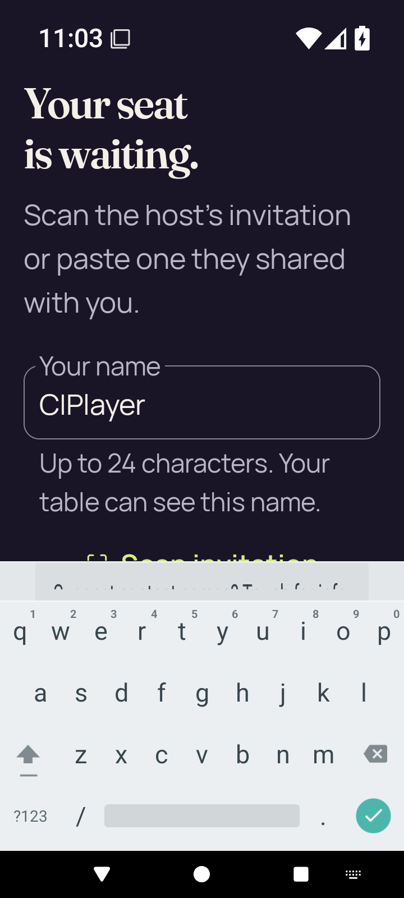</a> | **Final failure capture — Join at 200% text** Android API 35 emulator, optimized test-signed APK Original: [final-screen.png](../../first-batch/android-optimized/final-screen.png) 720 × 1600 px; text 2.0× SHA-256: <code>b39ecd140343623ecf5f591e94676ccce63c8591a164a0e116141f816ab049a2</code> Failure evidence; this is not a successful final state. |
|  | **Home** Android API 35 emulator, optimized test-signed APK Original: [home.png](../../first-batch/android-optimized/home.png) 720 × 1600 px; text 1.0× SHA-256: <code>024c902db8d0a4f7fc3451d6fb86677b104982c26ae4393d40898cf3a3610aca</code> |
|  | **Host lobby after closing invitation and share surfaces** Android API 35 emulator, optimized test-signed APK Original: [host-after-share.png](../../first-batch/android-optimized/host-after-share.png) 720 × 1600 px; text 1.0× SHA-256: <code>53dc86b93a81ffa443052767b17f567e0299cd2d5dfb96d3d4b1f1975a84c0f2</code> Invitation dialog is closed; no live admission credentials are shown. |
| <a href="../../first-batch/android-optimized/host-lobby.png">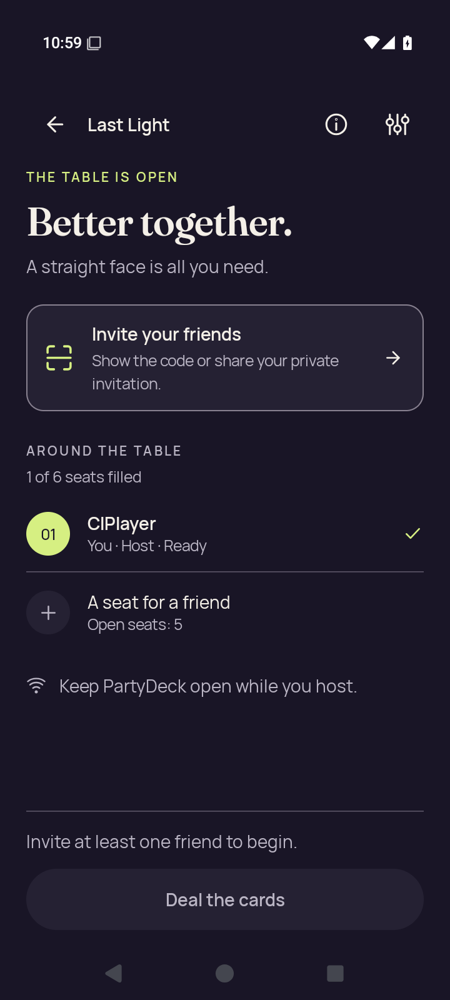</a> | **Native host lobby before opening invitation** Android API 35 emulator, optimized test-signed APK Original: [host-lobby.png](../../first-batch/android-optimized/host-lobby.png) 720 × 1600 px; text 1.0× SHA-256: <code>5df74aed851b486d49f2f7f179404aa2b4202a2093b05383c2d35c7f6c057863</code> Invitation dialog is closed; no live admission credentials are shown. |
|  | **Home after leaving host lobby** Android API 35 emulator, optimized test-signed APK Original: [host-returned-home.png](../../first-batch/android-optimized/host-returned-home.png) 720 × 1600 px; text 1.0× SHA-256: <code>f01670190b07c536da50fe45bc2fb9ca108d56cda22740f82ada02a73d1ead6d</code> |
| <a href="../../first-batch/android-optimized/join-invalid.png">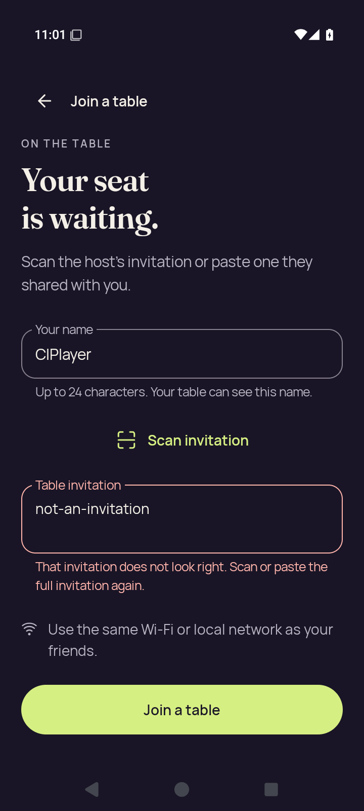</a> | **Join with invalid invitation feedback** Android API 35 emulator, optimized test-signed APK Original: [join-invalid.png](../../first-batch/android-optimized/join-invalid.png) 720 × 1600 px; text 1.0× SHA-256: <code>bfd91a277b03641bcc4bc33285a349246bf395834a41435bc63373d7cefeb059</code> |
| <a href="../../first-batch/android-optimized/join-name-soft-ime.png">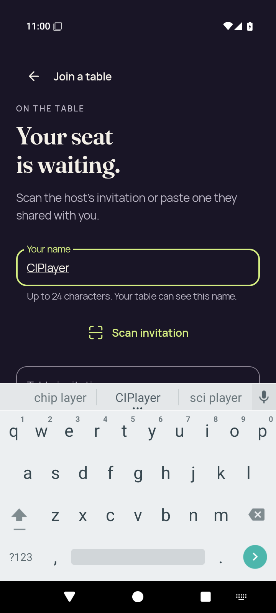</a> | **Join name focused with software keyboard** Android API 35 emulator, optimized test-signed APK Original: [join-name-soft-ime.png](../../first-batch/android-optimized/join-name-soft-ime.png) 720 × 1600 px; text 1.0× SHA-256: <code>32d8611fc1145086bdc61c604041f17ca40e054bbb784f29da9d7626dfa837b4</code> |
| <a href="../../first-batch/android-optimized/large-text-home-actions.png">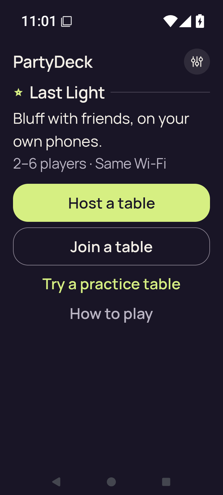</a> | **Home actions at 200% text** Android API 35 emulator, optimized test-signed APK Original: [large-text-home-actions.png](../../first-batch/android-optimized/large-text-home-actions.png) 720 × 1600 px; text 2.0× SHA-256: <code>60add53dd1af215430762c7d3fe0b74bb1e457d43ed31d7e05907ab832764fb9</code> |
| <a href="../../first-batch/android-optimized/large-text-join-name-soft-ime.png">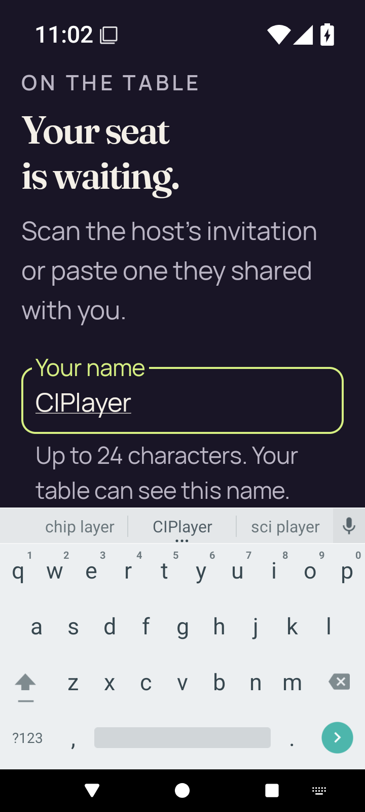</a> | **Join name and software keyboard at 200% text** Android API 35 emulator, optimized test-signed APK Original: [large-text-join-name-soft-ime.png](../../first-batch/android-optimized/large-text-join-name-soft-ime.png) 720 × 1600 px; text 2.0× SHA-256: <code>6516a4d5ba880577088888446fe0020a5b11e8fb5bea54c96c56478862b852cd</code> |
| <a href="../../first-batch/android-optimized/large-text-rules-intro.png">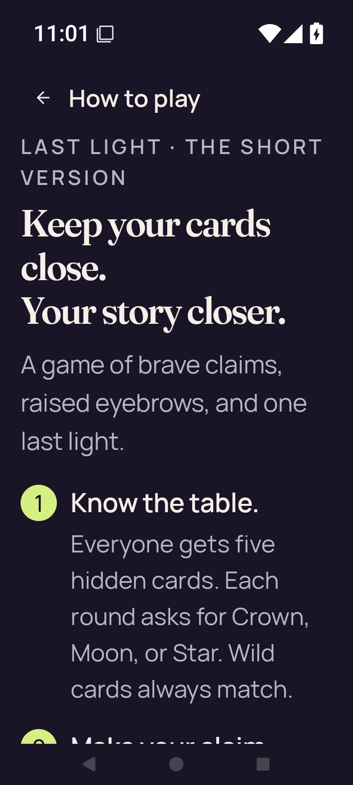</a> | **Rules introduction at 200% text** Android API 35 emulator, optimized test-signed APK Original: [large-text-rules-intro.png](../../first-batch/android-optimized/large-text-rules-intro.png) 720 × 1600 px; text 2.0× SHA-256: <code>3a2174b7529e82b13607f92e591ce93563c4ab68fe6b996b080bc28e5cf586d5</code> |
| <a href="../../first-batch/android-optimized/large-text-rules-last-step.png">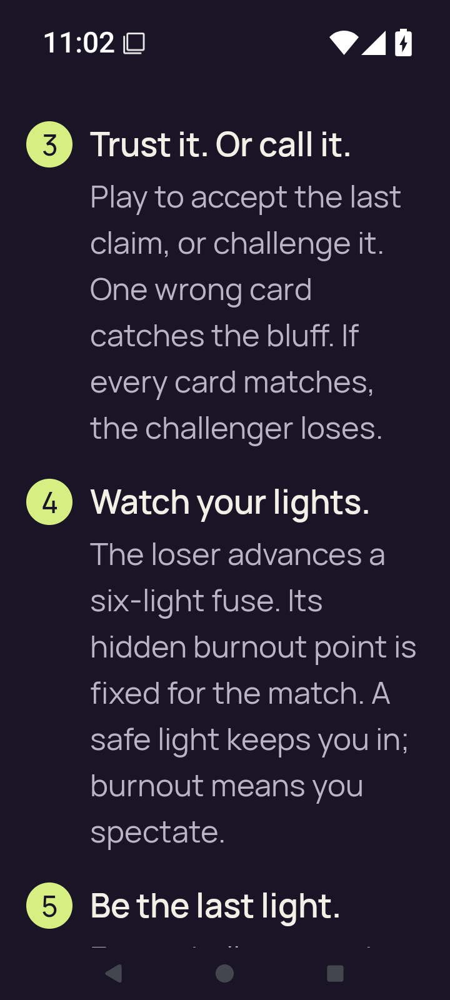</a> | **Rules final-step scroll position at 200% text** Android API 35 emulator, optimized test-signed APK Original: [large-text-rules-last-step.png](../../first-batch/android-optimized/large-text-rules-last-step.png) 720 × 1600 px; text 2.0× SHA-256: <code>136f16aa961330bb1fb911e143eb6fe58bcdd0dd34da34a64dcc223cb89969c4</code> |
| <a href="../../first-batch/android-optimized/large-text-rules-practice-action.png">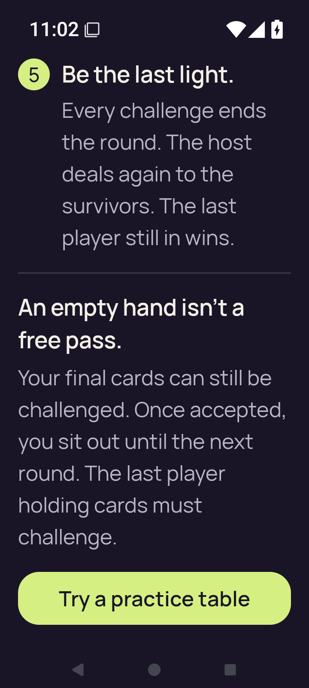</a> | **Rules final rule and Practice action at 200% text** Android API 35 emulator, optimized test-signed APK Original: [large-text-rules-practice-action.png](../../first-batch/android-optimized/large-text-rules-practice-action.png) 720 × 1600 px; text 2.0× SHA-256: <code>48ac672c7e9b397c18fdfca97fc347f369cd52069b5b6f8ba3ab4358309f9395</code> |
| <a href="../../first-batch/android-optimized/large-text-settings.png">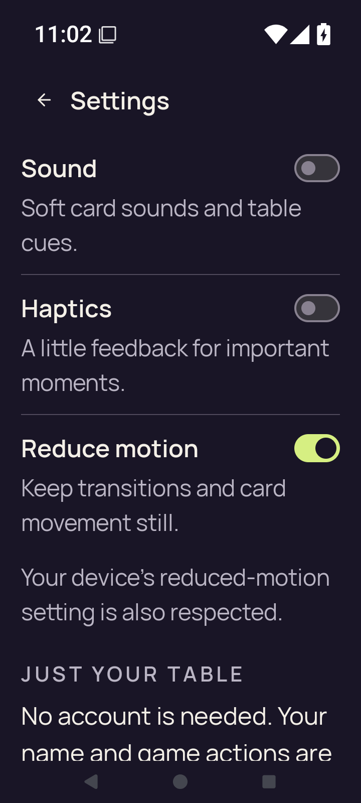</a> | **Settings at 200% text** Android API 35 emulator, optimized test-signed APK Original: [large-text-settings.png](../../first-batch/android-optimized/large-text-settings.png) 720 × 1600 px; text 2.0× SHA-256: <code>56b5b649a41239e45d66856d689d3e4064cde81af46cba9625a15e8e3283e837</code> |
| <a href="../../first-batch/android-optimized/practice-after-play.png">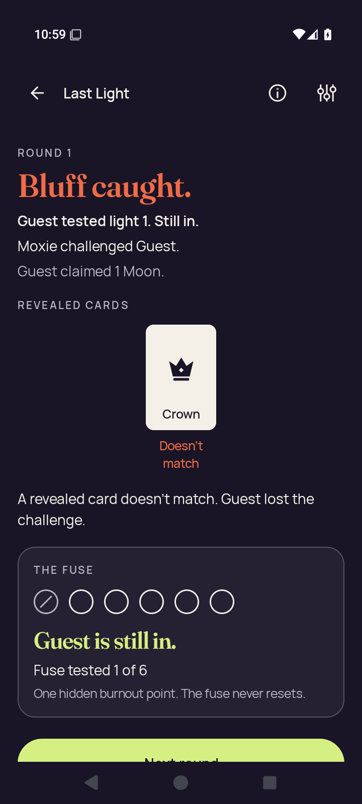</a> | **Practice after accepted one-card play** Android API 35 emulator, optimized test-signed APK Original: [practice-after-play.png](../../first-batch/android-optimized/practice-after-play.png) 720 × 1600 px; text 1.0× SHA-256: <code>3905df1573d2ad1953a1c0d8021523d1bae622c8908a37402c70e80aed65f6c9</code> Visible round result: Crown played as a Moon bluff. |
|  | **Practice with concealed hand** Android API 35 emulator, optimized test-signed APK Original: [practice-concealed.png](../../first-batch/android-optimized/practice-concealed.png) 720 × 1600 px; text 1.0× SHA-256: <code>eefbbaec1b2d753b23fae3baad743b439b42e22f15cb5bdccd4fdfcca80c7f16</code> |
| <a href="../../first-batch/android-optimized/practice-resumed-concealed.png">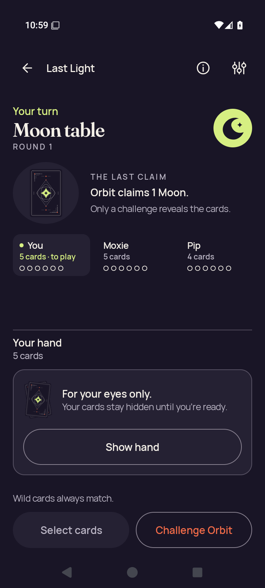</a> | **Practice concealed after app resumes** Android API 35 emulator, optimized test-signed APK Original: [practice-resumed-concealed.png](../../first-batch/android-optimized/practice-resumed-concealed.png) 720 × 1600 px; text 1.0× SHA-256: <code>e017d9d18b79a839c6ea9466fec096012e1ae105c22b8009d69f419fdeb6d67e</code> |
|  | **Home after leaving Practice** Android API 35 emulator, optimized test-signed APK Original: [practice-returned-home.png](../../first-batch/android-optimized/practice-returned-home.png) 720 × 1600 px; text 1.0× SHA-256: <code>0ba53d2b3af444e596bf9192b93a54f43295465fbd7e825dd342cbbe5cdb13af</code> |
| <a href="../../first-batch/android-optimized/practice-selected.png">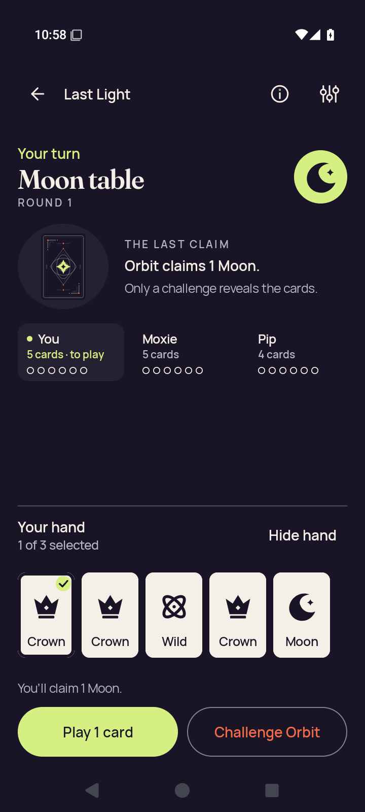</a> | **Practice with a selected card** Android API 35 emulator, optimized test-signed APK Original: [practice-selected.png](../../first-batch/android-optimized/practice-selected.png) 720 × 1600 px; text 1.0× SHA-256: <code>e30c5862b32edecd0a8d206d8034e34949cf8f78bb130817092b6127e1282931</code> |
| <a href="../../first-batch/android-optimized/rules-intro.png">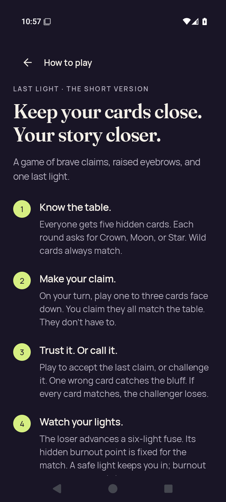</a> | **Rules introduction** Android API 35 emulator, optimized test-signed APK Original: [rules-intro.png](../../first-batch/android-optimized/rules-intro.png) 720 × 1600 px; text 1.0× SHA-256: <code>7251f0714ca2cd49734079dbf21d1b7a99e8c236107e1fdb5b3a37b5d356702b</code> |
| <a href="../../first-batch/android-optimized/rules-last-step.png">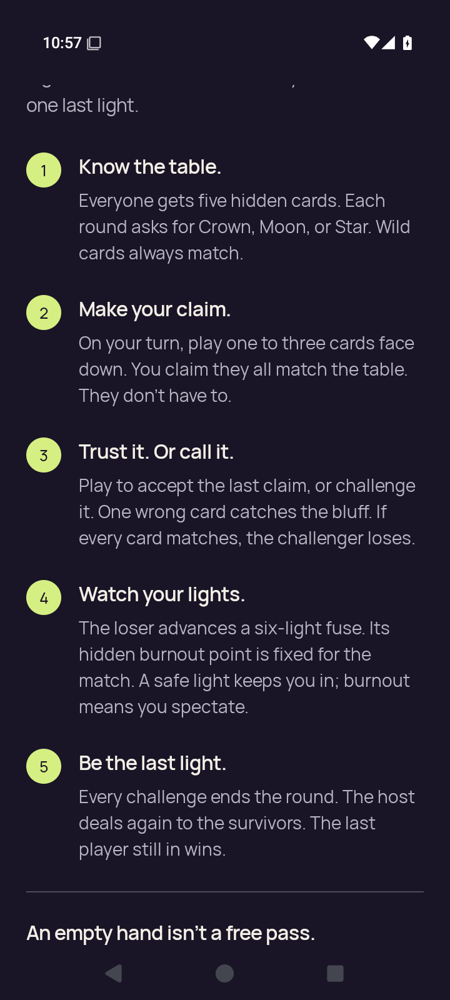</a> | **Rules final-step scroll position** Android API 35 emulator, optimized test-signed APK Original: [rules-last-step.png](../../first-batch/android-optimized/rules-last-step.png) 720 × 1600 px; text 1.0× SHA-256: <code>938f64d2a0a6f7ca683faa86930a6bf7cd3150196bf0e7c547df8621f3592afe</code> |
| <a href="../../first-batch/android-optimized/rules-practice-action.png">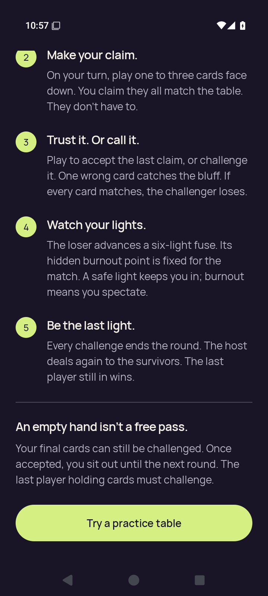</a> | **Rules final rule and Practice action** Android API 35 emulator, optimized test-signed APK Original: [rules-practice-action.png](../../first-batch/android-optimized/rules-practice-action.png) 720 × 1600 px; text 1.0× SHA-256: <code>bfefc213f6e0c4ee43d831dba68ecb02610ef2a4d9fabbe318f276140063b219</code> |
| <a href="../../first-batch/android-optimized/settings-changed.png">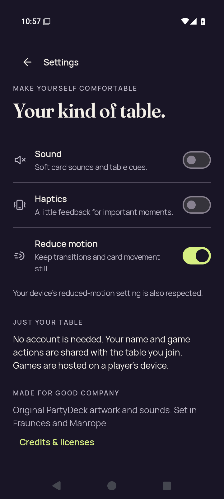</a> | **Settings after changing all three preferences** Android API 35 emulator, optimized test-signed APK Original: [settings-changed.png](../../first-batch/android-optimized/settings-changed.png) 720 × 1600 px; text 1.0× SHA-256: <code>09079d71f61836365ae6539f7cdf78aeb5ffc0102a56905b2ba64576deb33a57</code> |
|  | **Settings after process restart** Android API 35 emulator, optimized test-signed APK Original: [settings-persisted.png](../../first-batch/android-optimized/settings-persisted.png) 720 × 1600 px; text 1.0× SHA-256: <code>2b1adc31eafbef5536b21f3c019cc9a3b8d7e112582649e0c03cf38d4ba55bf9</code> |
| <a href="../../first-batch/android-optimized/settings-return-home.png">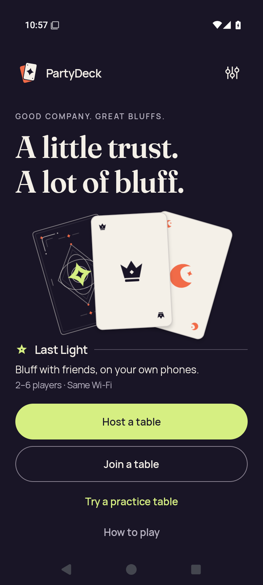</a> | **Home after closing Settings** Android API 35 emulator, optimized test-signed APK Original: [settings-return-home.png](../../first-batch/android-optimized/settings-return-home.png) 720 × 1600 px; text 1.0× SHA-256: <code>bb4c6a3a0ea5a44f6eac7eee252a23a62e7eac7ba2a48e745154c8a7514f94fd</code> |
