# Android debug — CI 34417204089

[All screenshot collections](../../README.md)

**Evidence status:** Debug smoke failed while seeking visible invalid-invitation feedback at 200% text. The final diagnostic image shows the Android notification shade covering the app, so the failure does not establish that the app omitted validation feedback. That SystemUI image is excluded from this app gallery.

API 35 AVD; 720 × 1600 pixels; 280 dpi (about 411 × 914 dp); three-button navigation. Normal font scale is 1.0; large-text captures and the optimized final-screen.png use 2.0. Software keyboard captures show the actual Android IME.

Source revision: [`ed440c8cece8e83f39ce75706e9827e9ba111b7b`](https://github.com/Apdelrahman1911/PartyDeck/commit/ed440c8cece8e83f39ce75706e9827e9ba111b7b). CI run: [34417204089](https://github.com/Apdelrahman1911/PartyDeck/actions/runs/34417204089).

APK SHA-256: `f356fdaabf9d7b67f217fda9a66014d3121b5ea5becf8b0b3a1ec4fc26b7ae43`.

[Original smoke receipt](smoke-result.json). The receipt covers a single emulator, local Practice/hosting, preferences, and tested UI flows. Physical LAN, camera frames, assistive technology, store signing and Godot native integration remain separate gates.

Original source directory: `/tmp/partydeck-engine-ci/34417204089/android-jvm-reports/build/ci/android/debug`.

All retained app captures were visually reviewed. Their paired UI dumps (or last-ui.xml for the successful final frame) were screened for live invitation credentials and invitation-dialog controls; capture guards are unchanged from run 34413839964. The main manifest records the reviewed dump hashes. Original image bytes and filenames are preserved.

Excluded infrastructure image: `debug/final-screen.png`, independently inspected as the Android notification shade. It is recorded as an exclusion in the main manifest and is not copied into the app gallery.

| Original image | Scenario and provenance |
| --- | --- |
|  | **Home** Android API 35 emulator, debug APK Original: [home.png](home.png) 720 × 1600 px; text 1.0× SHA-256: <code>4f3dbe5bdc92d83a81e63ea216805c11e5754a68a67f2979b9fd1bb8d1a9b1fb</code> |
|  | **Host lobby after closing invitation and share surfaces** Android API 35 emulator, debug APK Original: [host-after-share.png](host-after-share.png) 720 × 1600 px; text 1.0× SHA-256: <code>c2e03094c9367da08459afd9f33ebac40bfeb325031e365d8ec48f9627a85390</code> Invitation/share surfaces are closed; no live invitation credentials are shown. |
| <a href="host-lobby.png">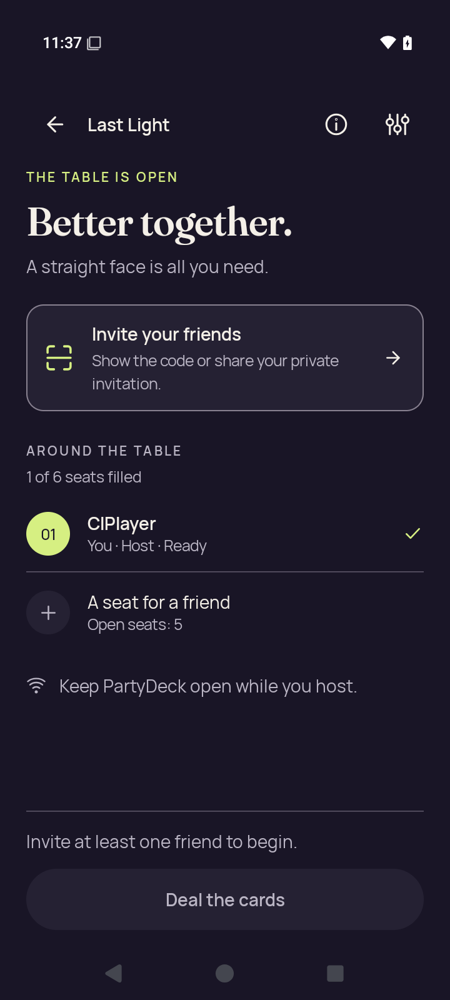</a> | **Native host lobby before opening invitation** Android API 35 emulator, debug APK Original: [host-lobby.png](host-lobby.png) 720 × 1600 px; text 1.0× SHA-256: <code>644afcf1ae4dca2098b9db0bdeed9f9df38268ef5ee464c3b35889deb0e27c7b</code> Invitation/share surfaces are closed; no live invitation credentials are shown. |
|  | **Home after leaving host lobby** Android API 35 emulator, debug APK Original: [host-returned-home.png](host-returned-home.png) 720 × 1600 px; text 1.0× SHA-256: <code>10e76df59cb51e9903186d00388cb64328edd09e36f1a82a8e45e7374acf9efc</code> |
| <a href="join-invalid.png">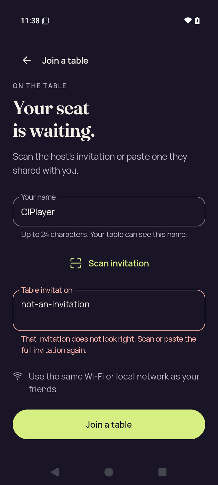</a> | **Join with invalid invitation feedback** Android API 35 emulator, debug APK Original: [join-invalid.png](join-invalid.png) 720 × 1600 px; text 1.0× SHA-256: <code>e19796d26dd960fd6c2bd3f7b8067e861dd15adc4b77d91c92df70faa8e30288</code> |
| <a href="join-name-soft-ime.png">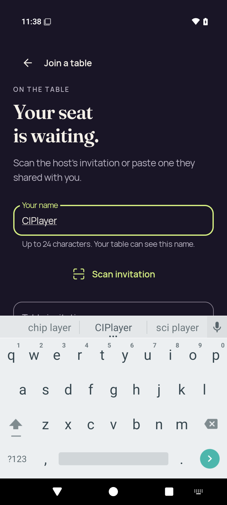</a> | **Join name focused with software keyboard** Android API 35 emulator, debug APK Original: [join-name-soft-ime.png](join-name-soft-ime.png) 720 × 1600 px; text 1.0× SHA-256: <code>10ce8671a0c501b884e0a8a4b315d1ba981f025ed58a58c7f01c298a09f82a37</code> |
| <a href="large-text-home-actions.png">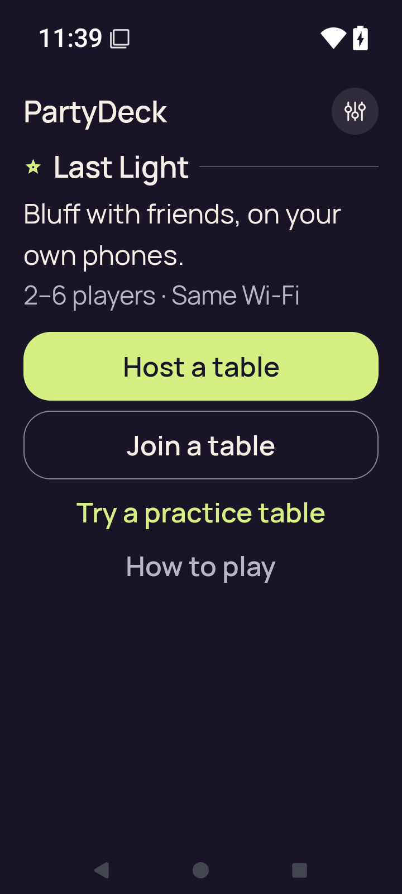</a> | **Home actions at 200% text** Android API 35 emulator, debug APK Original: [large-text-home-actions.png](large-text-home-actions.png) 720 × 1600 px; text 2.0× SHA-256: <code>6a0084caae2cf49d55a2ec321ea42ce94590cff01181f82a6a1b48c3b90b76cd</code> |
| <a href="large-text-join-name-soft-ime.png">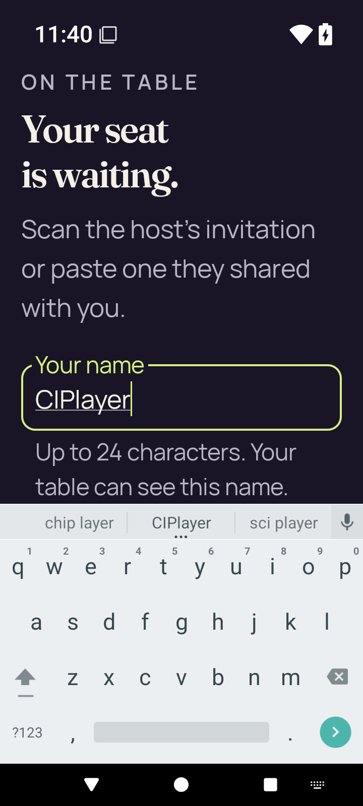</a> | **Join name and software keyboard at 200% text** Android API 35 emulator, debug APK Original: [large-text-join-name-soft-ime.png](large-text-join-name-soft-ime.png) 720 × 1600 px; text 2.0× SHA-256: <code>42a05db8a69ef39f0fb26438e6a8c6f9f4c841164e277bd66ebe1c80139f6403</code> |
| <a href="large-text-rules-intro.png">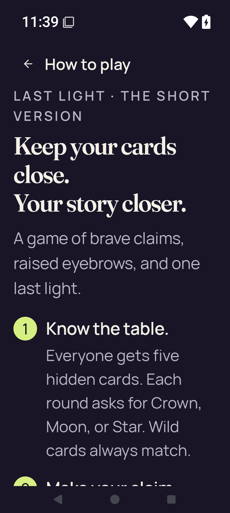</a> | **Rules introduction at 200% text** Android API 35 emulator, debug APK Original: [large-text-rules-intro.png](large-text-rules-intro.png) 720 × 1600 px; text 2.0× SHA-256: <code>200fc903f550c3fd4d224962fa8e77487f5f9b90795a109f5f1e289696f4cbb3</code> |
| <a href="large-text-rules-last-step.png">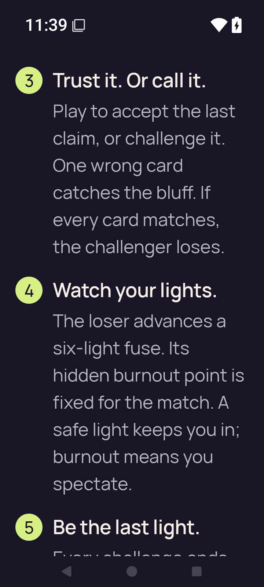</a> | **Rules final-step scroll position at 200% text** Android API 35 emulator, debug APK Original: [large-text-rules-last-step.png](large-text-rules-last-step.png) 720 × 1600 px; text 2.0× SHA-256: <code>bd2dc92bc29f6c365ec944fd07ecb03b4e58f9eaf7a56836095bd2f7e8d5bf39</code> |
| <a href="large-text-rules-practice-action.png">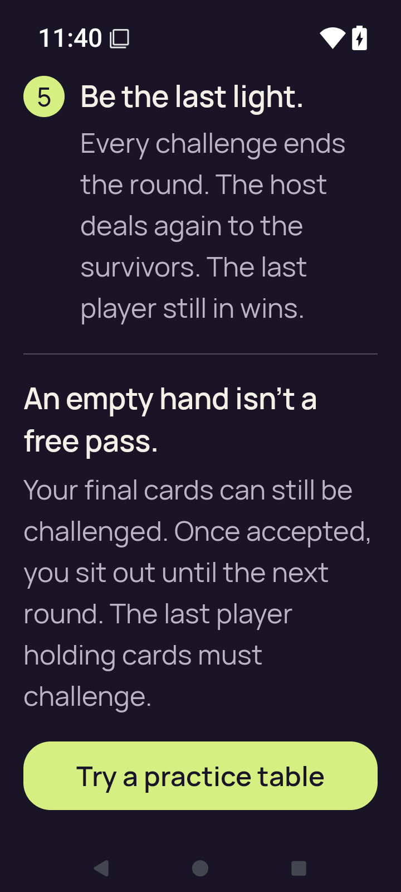</a> | **Rules final rule and Practice action at 200% text** Android API 35 emulator, debug APK Original: [large-text-rules-practice-action.png](large-text-rules-practice-action.png) 720 × 1600 px; text 2.0× SHA-256: <code>4a657d766367d533860c2f32c8fc37ea98ebe4963fb8d69730ed663446dd8c08</code> |
| <a href="large-text-settings.png">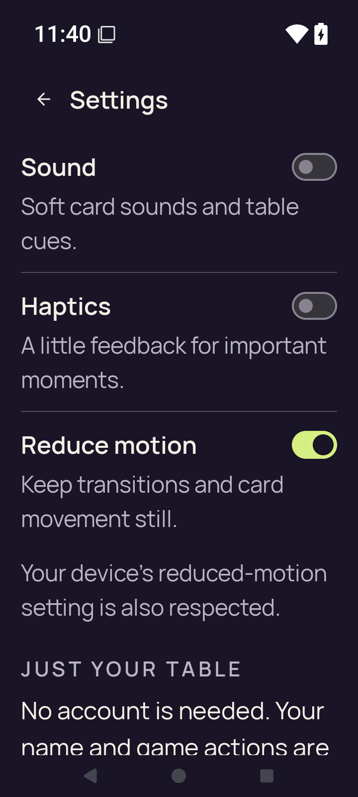</a> | **Settings at 200% text** Android API 35 emulator, debug APK Original: [large-text-settings.png](large-text-settings.png) 720 × 1600 px; text 2.0× SHA-256: <code>9fa0d74e90b1d23717a156f02439a085c67270cd962466deba7d5d6d0c935006</code> |
| <a href="practice-after-play.png">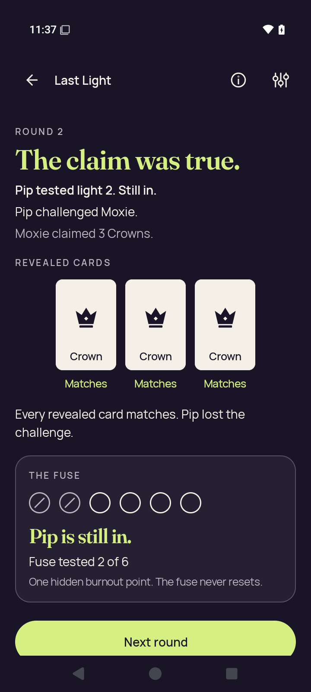</a> | **Practice round result after accepted play** Android API 35 emulator, debug APK Original: [practice-after-play.png](practice-after-play.png) 720 × 1600 px; text 1.0× SHA-256: <code>f1fda50d34a10ec623f197b4d2b907b16d6bf3ba65d1fb83fbc373f02f94cfe7</code> Visible round 2 result: three Crown cards were truthful; Pip lost the challenge and remains in. This capture shows an outcome, not a reduced hand. |
|  | **Practice with concealed hand** Android API 35 emulator, debug APK Original: [practice-concealed.png](practice-concealed.png) 720 × 1600 px; text 1.0× SHA-256: <code>b33e498c9b4645f29b7ccce3cbecbb2cf2bd337bde86a596e3656b3d5f999a0e</code> |
| <a href="practice-resumed-concealed.png">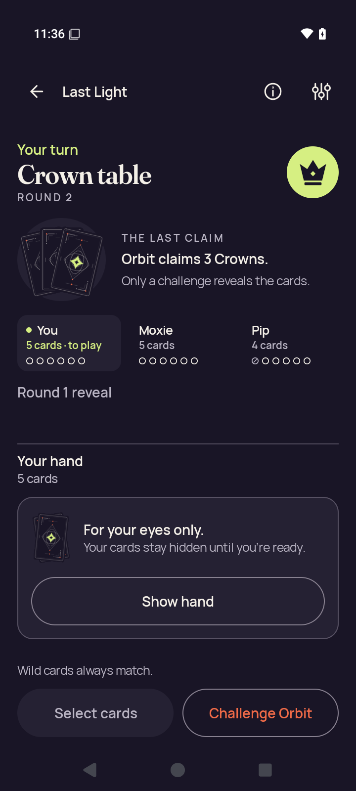</a> | **Practice concealed after app resumes** Android API 35 emulator, debug APK Original: [practice-resumed-concealed.png](practice-resumed-concealed.png) 720 × 1600 px; text 1.0× SHA-256: <code>b33e498c9b4645f29b7ccce3cbecbb2cf2bd337bde86a596e3656b3d5f999a0e</code> |
| <a href="practice-returned-home.png">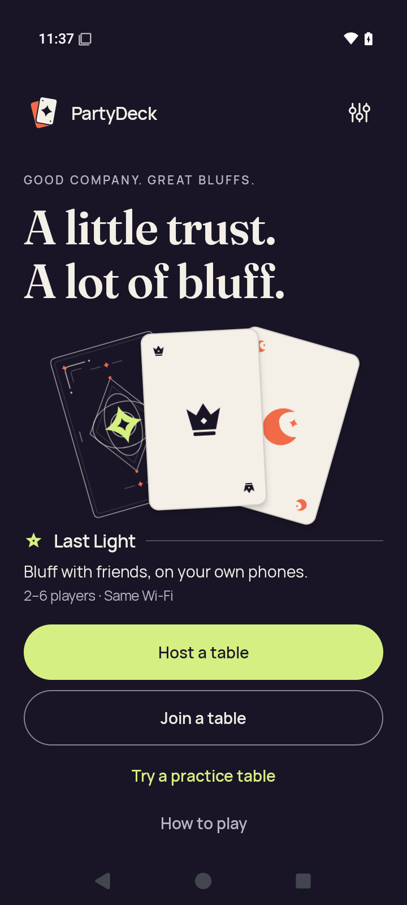</a> | **Home after leaving Practice** Android API 35 emulator, debug APK Original: [practice-returned-home.png](practice-returned-home.png) 720 × 1600 px; text 1.0× SHA-256: <code>7031e747c9da1d8db6e9e561cf789973cb4ddce30a965866eea9aa9407bc2b14</code> |
| <a href="practice-selected.png">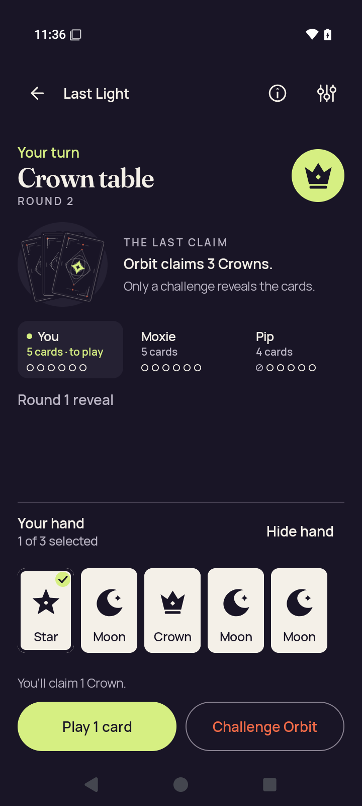</a> | **Practice with a selected card** Android API 35 emulator, debug APK Original: [practice-selected.png](practice-selected.png) 720 × 1600 px; text 1.0× SHA-256: <code>fe6a1f6651a6d3d0ece167a3dd10d93acdde910992af66b92c6c14fc41f9a92f</code> |
| <a href="rules-intro.png">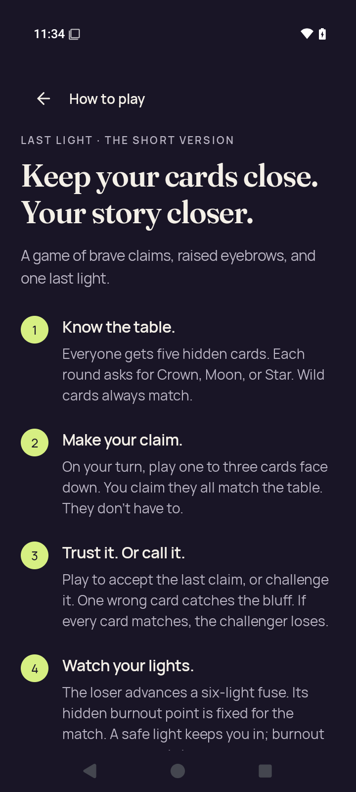</a> | **Rules introduction** Android API 35 emulator, debug APK Original: [rules-intro.png](rules-intro.png) 720 × 1600 px; text 1.0× SHA-256: <code>cab08c204181a33a874e152dbe8c0c75982f61a0a67b3b846e92cd5160e4bee3</code> |
| <a href="rules-last-step.png">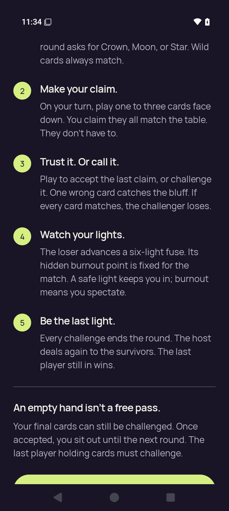</a> | **Rules final-step scroll position** Android API 35 emulator, debug APK Original: [rules-last-step.png](rules-last-step.png) 720 × 1600 px; text 1.0× SHA-256: <code>46fe6ed2ae45856060b1e2c514f597d189db222dddc31f1446584f839475ffd6</code> |
| <a href="rules-practice-action.png">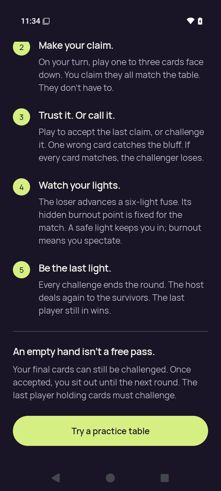</a> | **Rules final rule and Practice action** Android API 35 emulator, debug APK Original: [rules-practice-action.png](rules-practice-action.png) 720 × 1600 px; text 1.0× SHA-256: <code>42281943243ae9ba59c76bd0271668635f8148621e55b489f42021eae3952d64</code> |
|  | **Settings after changing all three preferences** Android API 35 emulator, debug APK Original: [settings-changed.png](settings-changed.png) 720 × 1600 px; text 1.0× SHA-256: <code>9b43bd243ab0a10fefd5ecdfc60ddefc693bbfd121f7aacea6c3ede9ce66898a</code> |
| <a href="settings-persisted.png">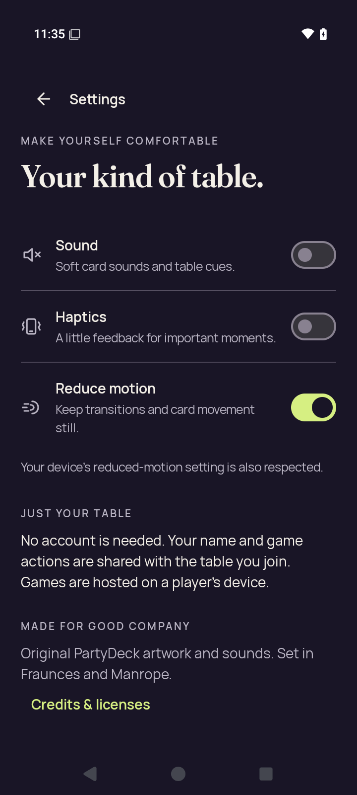</a> | **Settings after process restart** Android API 35 emulator, debug APK Original: [settings-persisted.png](settings-persisted.png) 720 × 1600 px; text 1.0× SHA-256: <code>9b43bd243ab0a10fefd5ecdfc60ddefc693bbfd121f7aacea6c3ede9ce66898a</code> |
|  | **Home after closing Settings** Android API 35 emulator, debug APK Original: [settings-return-home.png](settings-return-home.png) 720 × 1600 px; text 1.0× SHA-256: <code>0a3ed5c9c7283757d1babe5e011524e09558930046e82725d065c0f9f1b8261e</code> |
