# Android optimized, test signed — CI 34417204089

[All screenshot collections](../../README.md)

**Evidence status:** Optimized smoke passed all exercised runtime flows, including 200% Join recovery and hand/Play reachability. This is a complete pass for this variant on this emulator; the overall workflow still failed because the debug variant did not complete.

API 35 AVD; 720 × 1600 pixels; 280 dpi (about 411 × 914 dp); three-button navigation. Normal font scale is 1.0; large-text captures and the optimized final-screen.png use 2.0. Software keyboard captures show the actual Android IME.

Source revision: [`ed440c8cece8e83f39ce75706e9827e9ba111b7b`](https://github.com/Apdelrahman1911/PartyDeck/commit/ed440c8cece8e83f39ce75706e9827e9ba111b7b). CI run: [34417204089](https://github.com/Apdelrahman1911/PartyDeck/actions/runs/34417204089).

APK SHA-256: `20ca98be8f0965251da271aff98673468940f2007ebc87617d27520e8aa5f147`.

[Original smoke receipt](smoke-result.json). The receipt covers a single emulator, local Practice/hosting, preferences, and tested UI flows. Physical LAN, camera frames, assistive technology, store signing and Godot native integration remain separate gates.

Original source directory: `/tmp/partydeck-engine-ci/34417204089/android-jvm-reports/build/ci/android/optimized-test-signed`.

All retained app captures were visually reviewed. Their paired UI dumps (or last-ui.xml for the successful final frame) were screened for live invitation credentials and invitation-dialog controls; capture guards are unchanged from run 34413839964. The main manifest records the reviewed dump hashes. Original image bytes and filenames are preserved.

| Original image | Scenario and provenance |
| --- | --- |
| <a href="final-screen.png">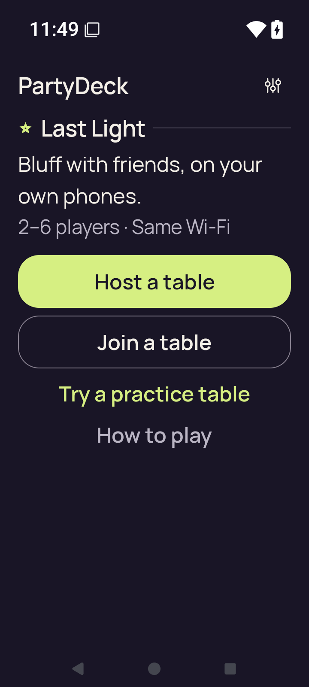</a> | **Home after the completed smoke flow at 200% text** Android API 35 emulator, optimized test-signed APK Original: [final-screen.png](final-screen.png) 720 × 1600 px; text 2.0× SHA-256: <code>649d697943d5c7c8813533a0c9de34bc882e3776b493f5e8878b9b09cbccf73e</code> Successful final Home capture after leaving Practice; this is not a failure screen. |
| <a href="home.png">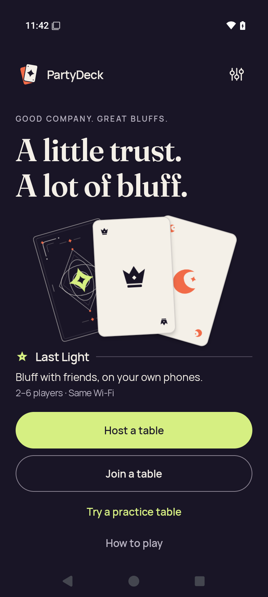</a> | **Home** Android API 35 emulator, optimized test-signed APK Original: [home.png](home.png) 720 × 1600 px; text 1.0× SHA-256: <code>839a482dcd83c695d40a341230f49b78ccc788de9eb8509f94e639c8793ea0db</code> |
|  | **Host lobby after closing invitation and share surfaces** Android API 35 emulator, optimized test-signed APK Original: [host-after-share.png](host-after-share.png) 720 × 1600 px; text 1.0× SHA-256: <code>8707e5247cf1162069f7c3624da1a4da2159a25beca5906edde120be8995a028</code> Invitation/share surfaces are closed; no live invitation credentials are shown. |
| <a href="host-lobby.png">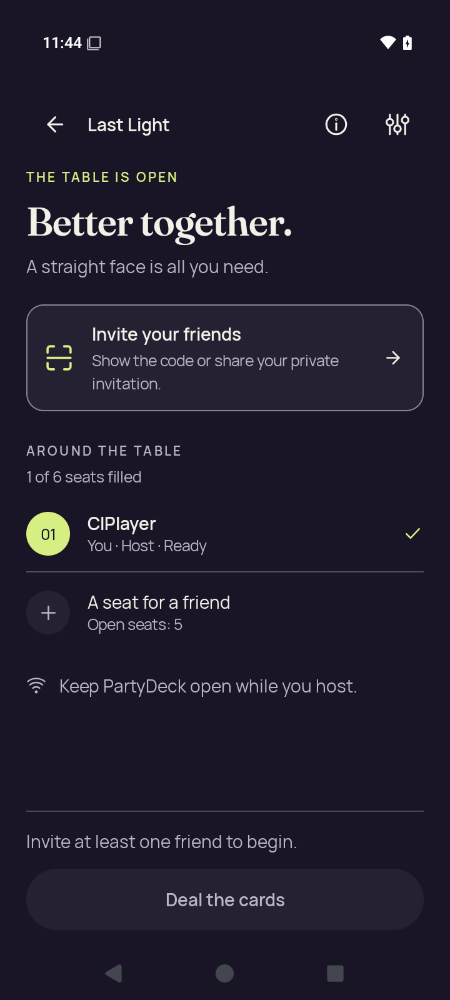</a> | **Native host lobby before opening invitation** Android API 35 emulator, optimized test-signed APK Original: [host-lobby.png](host-lobby.png) 720 × 1600 px; text 1.0× SHA-256: <code>cccfe28153032ad97dd02da567fe912e6b0d62d67c2464370a707c520f9dbb80</code> Invitation/share surfaces are closed; no live invitation credentials are shown. |
|  | **Home after leaving host lobby** Android API 35 emulator, optimized test-signed APK Original: [host-returned-home.png](host-returned-home.png) 720 × 1600 px; text 1.0× SHA-256: <code>4565c7325f969dbd03f06ea8cdb51465b4808082839d16bcd09a366a5d9b5738</code> |
| <a href="join-invalid.png">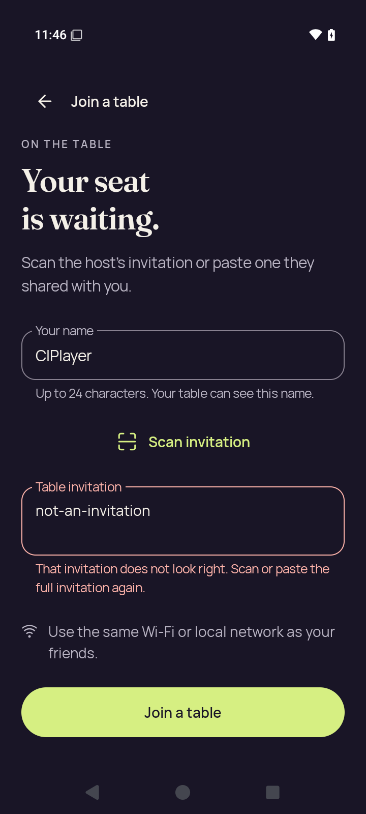</a> | **Join with invalid invitation feedback** Android API 35 emulator, optimized test-signed APK Original: [join-invalid.png](join-invalid.png) 720 × 1600 px; text 1.0× SHA-256: <code>7ec65815917827447e5b56527e3cc00daecd86950648ed2bad47dae4953ccc95</code> |
| <a href="join-name-soft-ime.png">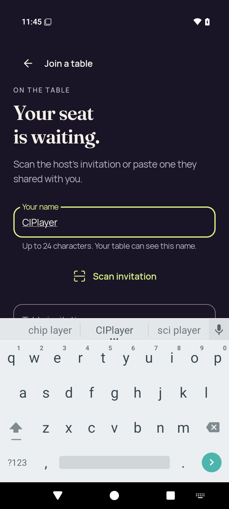</a> | **Join name focused with software keyboard** Android API 35 emulator, optimized test-signed APK Original: [join-name-soft-ime.png](join-name-soft-ime.png) 720 × 1600 px; text 1.0× SHA-256: <code>ecf94d3d82f061d50ae0866be7c6d6f52b820f5572caa440890244a7b0f5a159</code> |
| <a href="large-text-home-actions.png">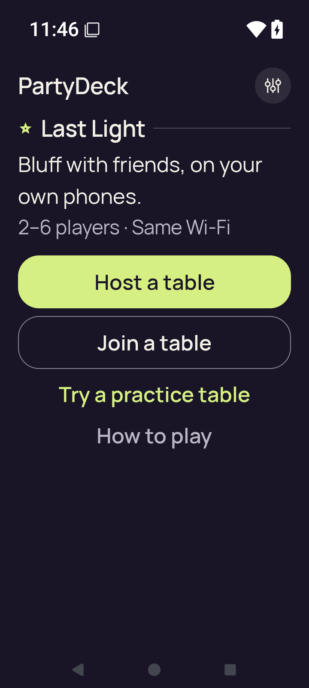</a> | **Home actions at 200% text** Android API 35 emulator, optimized test-signed APK Original: [large-text-home-actions.png](large-text-home-actions.png) 720 × 1600 px; text 2.0× SHA-256: <code>319645f6decb7f66ddd40c7e4b27bbca56a5c421f7bbe2f8be74c3849b19f9ca</code> |
| <a href="large-text-join-invalid.png">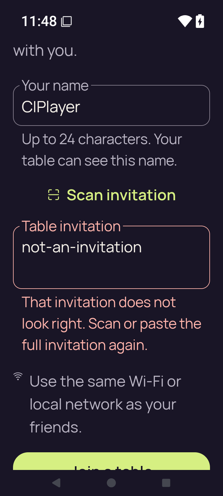</a> | **Join with invalid invitation feedback at 200% text** Android API 35 emulator, optimized test-signed APK Original: [large-text-join-invalid.png](large-text-join-invalid.png) 720 × 1600 px; text 2.0× SHA-256: <code>d52bd40f6905f2593b0456c57703a5afddd1a0771835259e4077c826abafe19a</code> Invalid input and complete error explanation are visible; Join submit is partly below this captured scroll position. |
| <a href="large-text-join-name-soft-ime.png">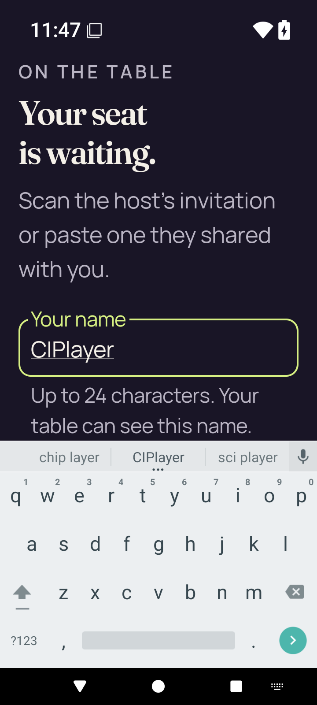</a> | **Join name and software keyboard at 200% text** Android API 35 emulator, optimized test-signed APK Original: [large-text-join-name-soft-ime.png](large-text-join-name-soft-ime.png) 720 × 1600 px; text 2.0× SHA-256: <code>541eb2ab249df437562f8bf6a38774ff5728dd0b9b34786482eafc0d258d2321</code> |
| <a href="large-text-play-action.png">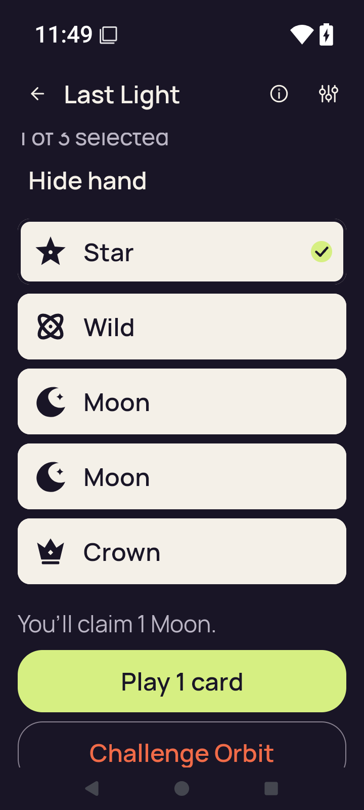</a> | **Claim explanation and Play action at 200% text** Android API 35 emulator, optimized test-signed APK Original: [large-text-play-action.png](large-text-play-action.png) 720 × 1600 px; text 2.0× SHA-256: <code>08bc921798d7f97ca3f2833748693eef3b10117a1803f4535bb8d9040fbc5040</code> The claim explanation and Play 1 card are fully visible. Challenge Orbit is partly below this captured scroll position. This step verifies Play reachability, not a 200% accepted play. |
| <a href="large-text-private-hand.png">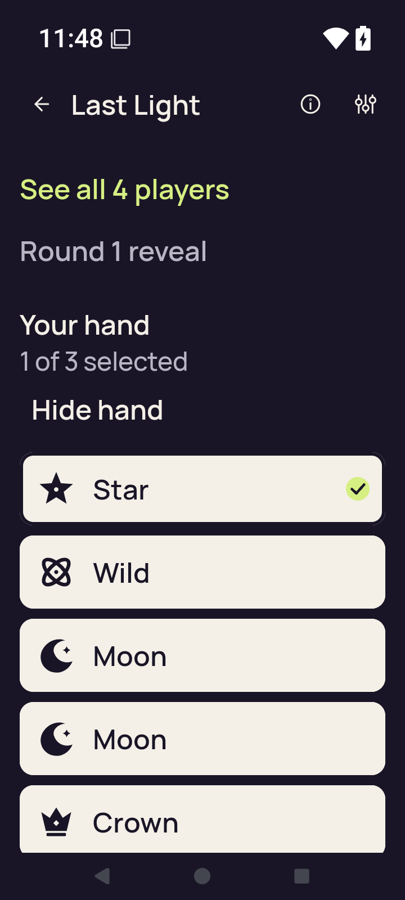</a> | **Revealed private hand and selected card at 200% text** Android API 35 emulator, optimized test-signed APK Original: [large-text-private-hand.png](large-text-private-hand.png) 720 × 1600 px; text 2.0× SHA-256: <code>7fd7780ac31000476f70fccd24099634550cd0e382262657a81fd133806665fe</code> All five rank labels and the selected Star are visible; the bottom edge of the fifth row reaches the viewport boundary. |
| <a href="large-text-rules-intro.png">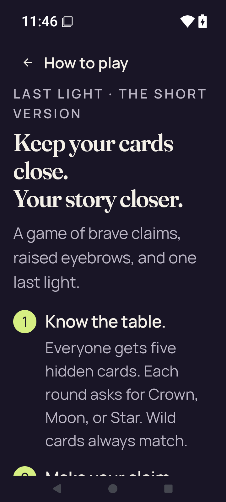</a> | **Rules introduction at 200% text** Android API 35 emulator, optimized test-signed APK Original: [large-text-rules-intro.png](large-text-rules-intro.png) 720 × 1600 px; text 2.0× SHA-256: <code>c4cb92913a317184a83fd1076f6521e07b65a8cf051fbd3377ef5dcfb6eb7f3e</code> |
| <a href="large-text-rules-last-step.png">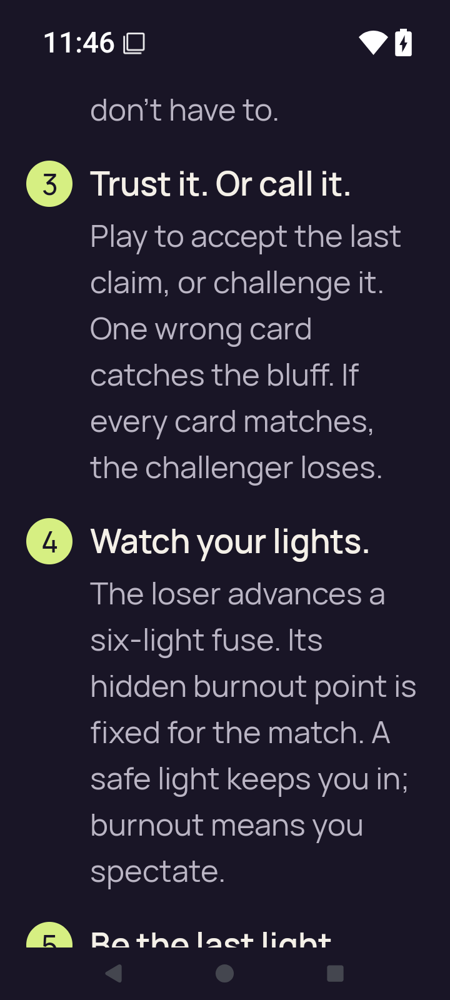</a> | **Rules final-step scroll position at 200% text** Android API 35 emulator, optimized test-signed APK Original: [large-text-rules-last-step.png](large-text-rules-last-step.png) 720 × 1600 px; text 2.0× SHA-256: <code>5ad7da5806d664e9a350ca65e65b4342f2a45c7628a03b3f7229dcb5245311e0</code> |
| <a href="large-text-rules-practice-action.png">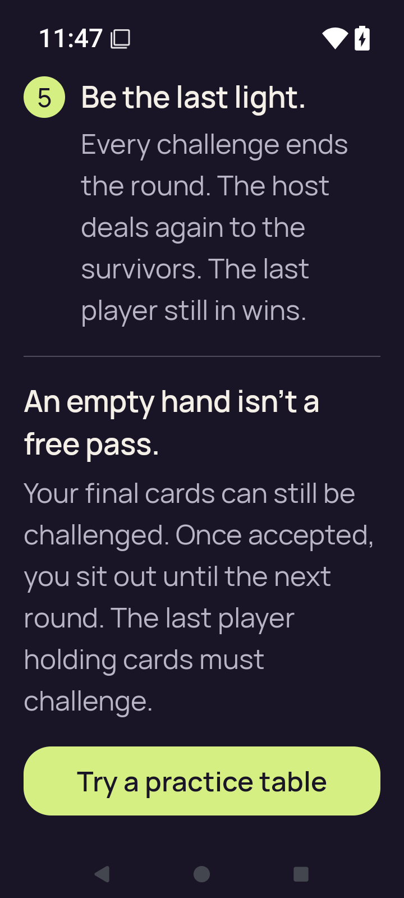</a> | **Rules final rule and Practice action at 200% text** Android API 35 emulator, optimized test-signed APK Original: [large-text-rules-practice-action.png](large-text-rules-practice-action.png) 720 × 1600 px; text 2.0× SHA-256: <code>116a8ff53bd98e7ec7e000b45a3ba1e7df31c27777db30a89a0299713eee82e7</code> |
| <a href="large-text-settings.png">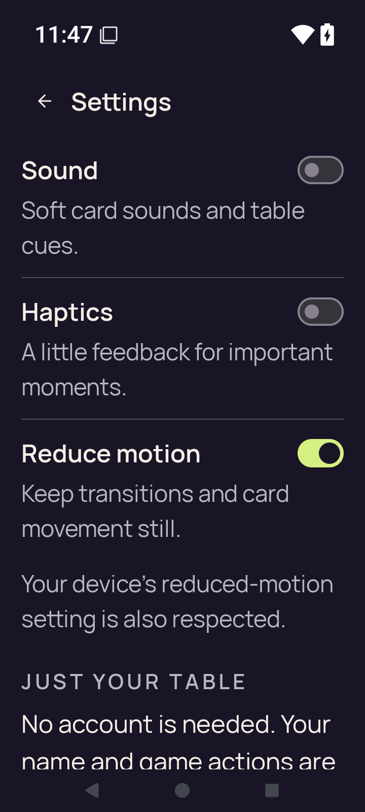</a> | **Settings at 200% text** Android API 35 emulator, optimized test-signed APK Original: [large-text-settings.png](large-text-settings.png) 720 × 1600 px; text 2.0× SHA-256: <code>888aa891b872ce46b619a6b81f171707a80b812994ec912b67405a42bfbc2ead</code> |
| <a href="practice-after-play.png">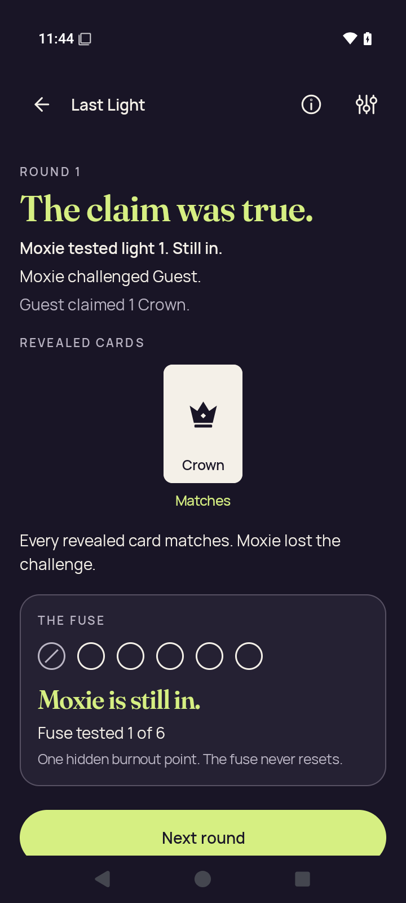</a> | **Practice round result after accepted play** Android API 35 emulator, optimized test-signed APK Original: [practice-after-play.png](practice-after-play.png) 720 × 1600 px; text 1.0× SHA-256: <code>dd60f2170e5a07d3e193375cb53fb92bd7871d6f1532413d3b6d304fe7c2a72f</code> Visible round 1 result: one Crown was truthful; Moxie lost the challenge and remains in. |
| <a href="practice-concealed.png">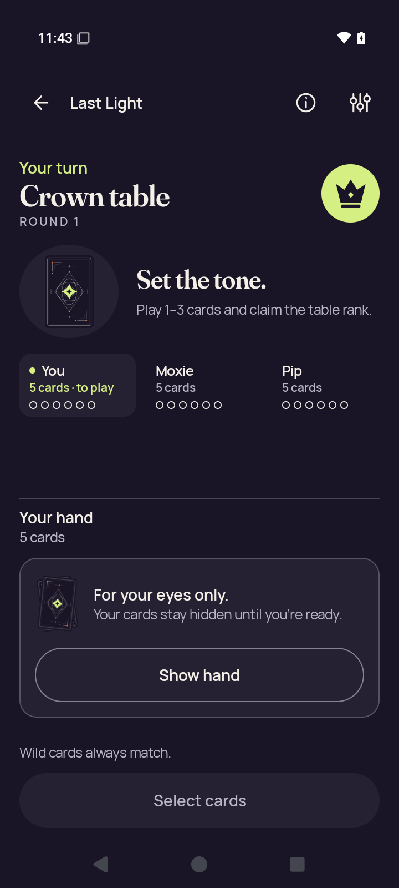</a> | **Practice with concealed hand** Android API 35 emulator, optimized test-signed APK Original: [practice-concealed.png](practice-concealed.png) 720 × 1600 px; text 1.0× SHA-256: <code>c991c0b8ceb238071b62882831b75e9fef844788cc786db89d3312306582a96a</code> |
|  | **Practice concealed after app resumes** Android API 35 emulator, optimized test-signed APK Original: [practice-resumed-concealed.png](practice-resumed-concealed.png) 720 × 1600 px; text 1.0× SHA-256: <code>3b42431e29134712fecb192df7d8adea07a2ac9e32a83031eb6ac33d1ad21cac</code> |
|  | **Home after leaving Practice** Android API 35 emulator, optimized test-signed APK Original: [practice-returned-home.png](practice-returned-home.png) 720 × 1600 px; text 1.0× SHA-256: <code>949e736bd33566147ec523fb72b981b19ca68442f6cd336202e32bce11aaee05</code> |
| <a href="practice-selected.png">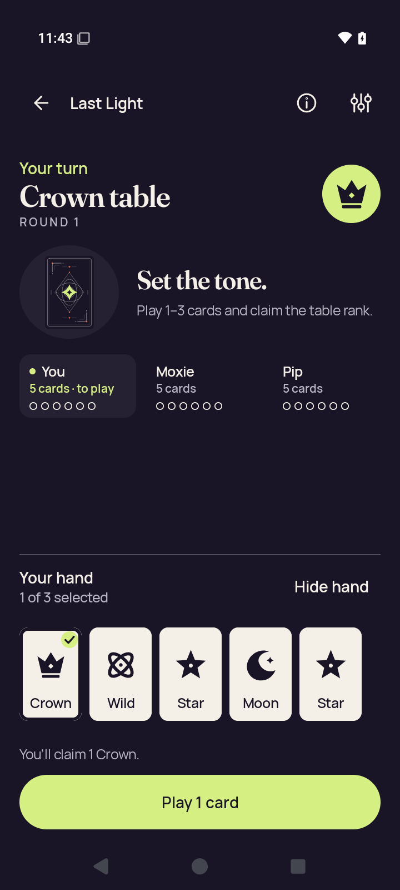</a> | **Practice with a selected card** Android API 35 emulator, optimized test-signed APK Original: [practice-selected.png](practice-selected.png) 720 × 1600 px; text 1.0× SHA-256: <code>03feb1d83625e2bd41384cb71e5d4f37f270a1f97bb55c6111bf424a6635eedf</code> |
| <a href="rules-intro.png">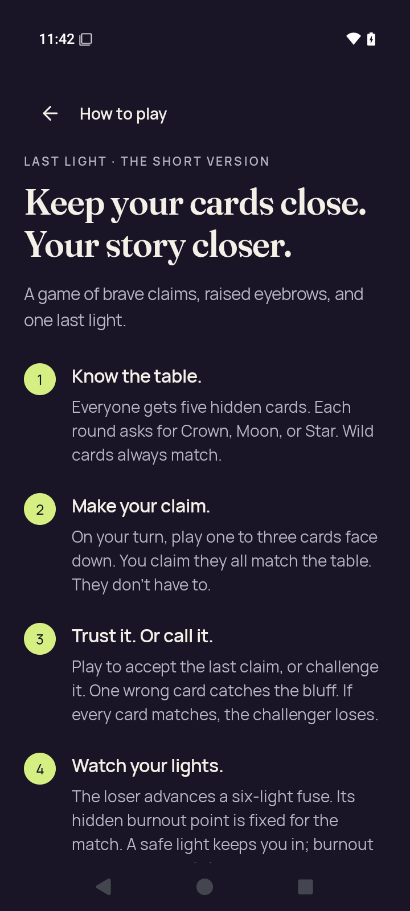</a> | **Rules introduction** Android API 35 emulator, optimized test-signed APK Original: [rules-intro.png](rules-intro.png) 720 × 1600 px; text 1.0× SHA-256: <code>7d5894627ae1835603a5784acd8ff1a6e00a7d617f4b8cbdb5d42ef699f05cb6</code> |
| <a href="rules-last-step.png">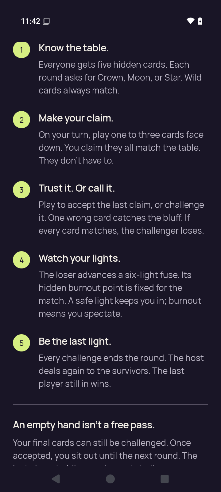</a> | **Rules final-step scroll position** Android API 35 emulator, optimized test-signed APK Original: [rules-last-step.png](rules-last-step.png) 720 × 1600 px; text 1.0× SHA-256: <code>f5bf286b27848b40ca9fedbce7624b0f1b21f0e3ba9e7b0f39c3d49bd4f04ddb</code> |
| <a href="rules-practice-action.png">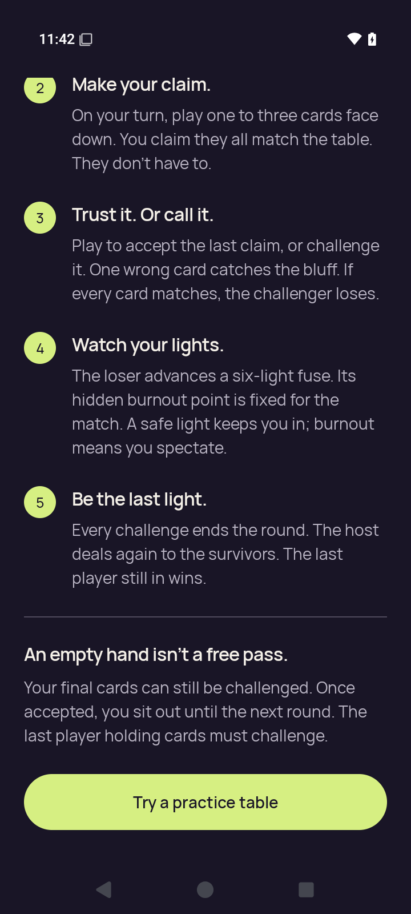</a> | **Rules final rule and Practice action** Android API 35 emulator, optimized test-signed APK Original: [rules-practice-action.png](rules-practice-action.png) 720 × 1600 px; text 1.0× SHA-256: <code>bbd136290c321f1f4f05dd0c92a9b9ef23d3ddcdcbe60f0bbc458bbc17a06240</code> |
| <a href="settings-changed.png">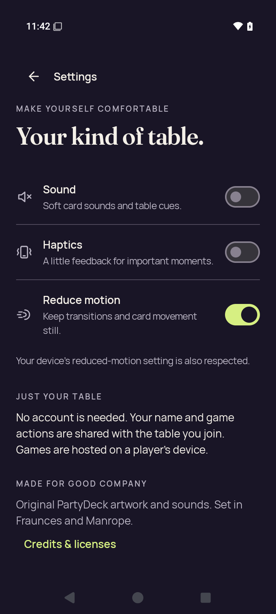</a> | **Settings after changing all three preferences** Android API 35 emulator, optimized test-signed APK Original: [settings-changed.png](settings-changed.png) 720 × 1600 px; text 1.0× SHA-256: <code>c6a4c050c89aa56088a7e0d8284e48f134e6961f88381d1ba70a460a81453f88</code> |
|  | **Settings after process restart** Android API 35 emulator, optimized test-signed APK Original: [settings-persisted.png](settings-persisted.png) 720 × 1600 px; text 1.0× SHA-256: <code>d6c95c8d9f418f51f60a028752d9cfe042590e7d75e5adf07c2f4b2618381a21</code> |
|  | **Home after closing Settings** Android API 35 emulator, optimized test-signed APK Original: [settings-return-home.png](settings-return-home.png) 720 × 1600 px; text 1.0× SHA-256: <code>839a482dcd83c695d40a341230f49b78ccc788de9eb8509f94e639c8793ea0db</code> |
