# Android debug — CI 34421746656

[All screenshot collections](../../README.md)

**Evidence status:** Smoke passed the full exercised flow on this emulator, including 200% Join recovery and hand/Play reachability.

API 35 AVD; 720 × 1600 pixels at 280 dpi (about 411 × 914 dp); three-button navigation. Standard font scale is 1.0; large-text captures and `final-screen.png` use 2.0. Software keyboard captures show the actual Android IME.

Exact source revision: [`d3418f150e908667560767e4b825f8968b337df3`](https://github.com/Apdelrahman1911/PartyDeck/commit/d3418f150e908667560767e4b825f8968b337df3). CI run: [34421746656](https://github.com/Apdelrahman1911/PartyDeck/actions/runs/34421746656). Executed APK SHA-256: `69c168aaec7c5bf3900515d1c12e6d99f379d596046a78be41047b3d5f911598`; independently recomputed from the downloaded package.

[Original smoke receipt](smoke-result.json) · [Original CI evidence summary](../evidence-summary.json) · [Display size](display-size.log) · [Display density](display-density.log).

The retained report covers local Practice reveal, selection, hide, background concealment, one-card play and leave; settings persisted through process restart; host invitation/copy/share cancellation and teardown; invalid Join recovery; and 200% layout reachability. The [script at the captured revision](https://github.com/Apdelrahman1911/PartyDeck/blob/d3418f150e908667560767e4b825f8968b337df3/scripts/smoke-android-ui.py) scrolls to and captures the final Rules action, then presses Back; it does not tap that Rules button. The 200% Play step verifies reachability without claiming an accepted play at that setting.

The summary retains a Launcher ANR from before PartyDeck installation. It is a preparation infrastructure event; both APK acceptance passes occur afterward. Physical LAN, camera frames, assistive technology and store signing remain outside this run’s exercised scope.

All 27 original app PNGs, including the successful final Home screen, are preserved. All paired UI dumps were parsed and screened against capture guards at the exact revision: no live invitation URI or open invitation dialog was retained. Host captures precede invitation opening or follow its dismissal; invalid Join input is the literal `not-an-invitation`. Original bytes and filenames are unchanged; preparation images are excluded. Source directory: `/tmp/partydeck-engine-ci/34421746656/android-jvm-reports/build/ci/android/debug`.

| Original image | Scenario and provenance |
| --- | --- |
| <a href="final-screen.png">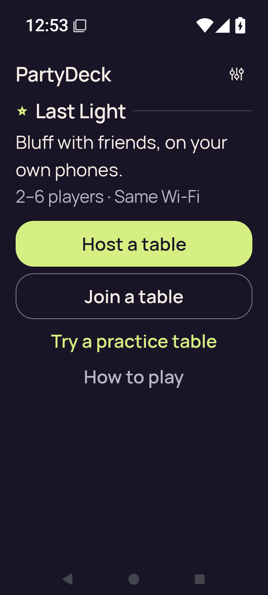</a> | **Home after the completed smoke flow at 200% text** Android API 35 emulator, debug APK Original: [final-screen.png](final-screen.png) 720 × 1600 px; text 2× SHA-256: <code>dbd96517214f8fcd0deca6a68fc72c7a348d9fc5cdd567a77e5a198fddb9d8b1</code> [Original UI dump](last-ui.xml) Successful final Home capture after leaving Practice at 200% text. |
| <a href="home.png">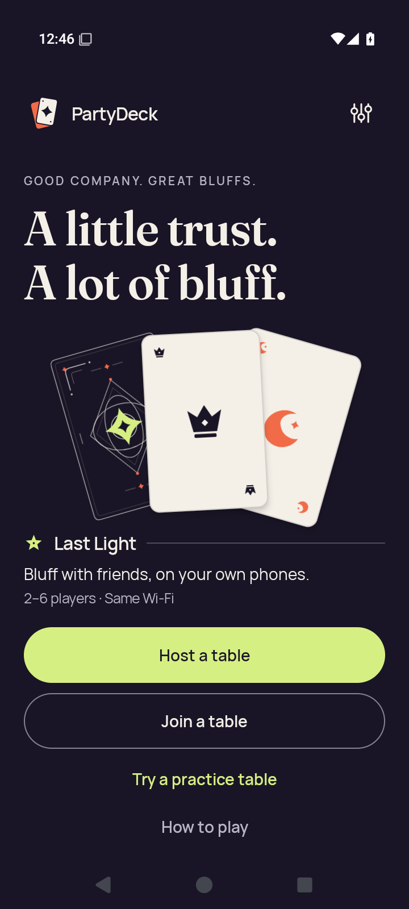</a> | **Home** Android API 35 emulator, debug APK Original: [home.png](home.png) 720 × 1600 px; text 1× SHA-256: <code>fbf449020109ca1bce4e29a508ee3596b19671f950d33be0b52ec825cb422638</code> [Original UI dump](home.xml) |
|  | **Host lobby after closing invitation and share surfaces** Android API 35 emulator, debug APK Original: [host-after-share.png](host-after-share.png) 720 × 1600 px; text 1× SHA-256: <code>6ac36c52db76987bf7d46fc21777d3b3e2bcdc19ab4e8d61da1e3b7b7fa6fb6a</code> [Original UI dump](host-after-share.xml) Invitation and share surfaces are closed; no live invitation credentials are shown. |
| <a href="host-lobby.png">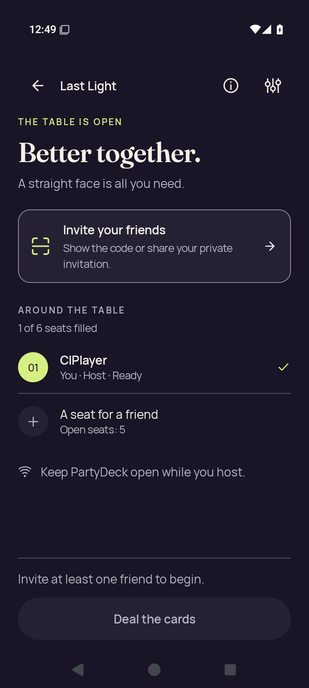</a> | **Native host lobby before opening invitation** Android API 35 emulator, debug APK Original: [host-lobby.png](host-lobby.png) 720 × 1600 px; text 1× SHA-256: <code>6ac36c52db76987bf7d46fc21777d3b3e2bcdc19ab4e8d61da1e3b7b7fa6fb6a</code> [Original UI dump](host-lobby.xml) Invitation and share surfaces are closed; no live invitation credentials are shown. |
|  | **Home after leaving host lobby** Android API 35 emulator, debug APK Original: [host-returned-home.png](host-returned-home.png) 720 × 1600 px; text 1× SHA-256: <code>7fe65afde4d837f5ad8d626115ca9234674008737328695498c3bcb068ea13c4</code> [Original UI dump](host-returned-home.xml) |
| <a href="join-invalid.png">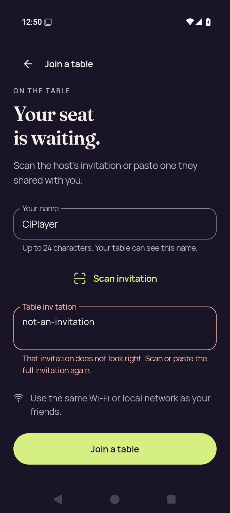</a> | **Join with invalid invitation feedback** Android API 35 emulator, debug APK Original: [join-invalid.png](join-invalid.png) 720 × 1600 px; text 1× SHA-256: <code>2a2841fdfc579c5f5441c0318d84e0ed0a51081b9f68dda7edcc916c7009d1a1</code> [Original UI dump](join-invalid.xml) The rejected input is the literal not-an-invitation; no live admission material is present. |
| <a href="join-name-soft-ime.png">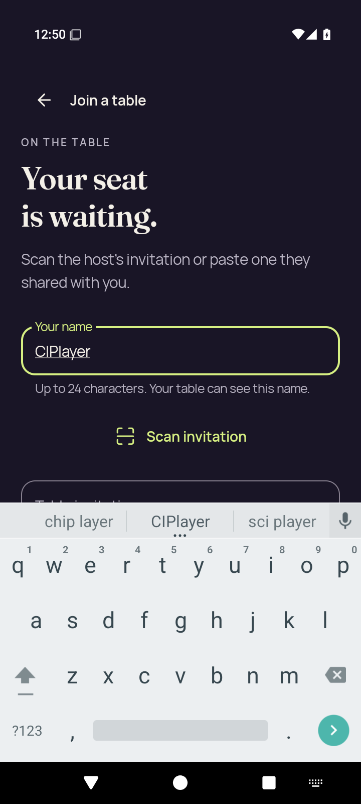</a> | **Join name focused with software keyboard** Android API 35 emulator, debug APK Original: [join-name-soft-ime.png](join-name-soft-ime.png) 720 × 1600 px; text 1× SHA-256: <code>71efbfed3b4978d884524ffa5f6820f75d34e6739a4018db32fa1aad0c787d5d</code> [Original UI dump](join-name-soft-ime.xml) |
| <a href="large-text-home-actions.png">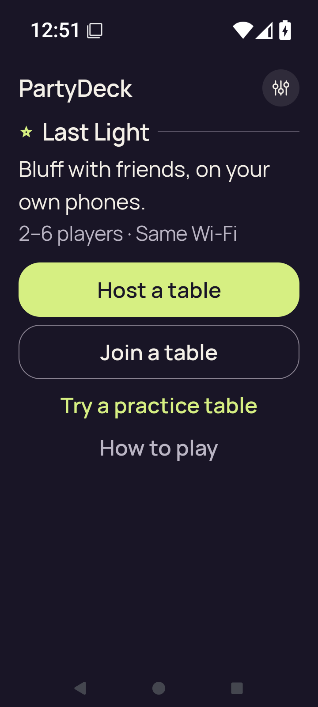</a> | **Home actions at 200% text** Android API 35 emulator, debug APK Original: [large-text-home-actions.png](large-text-home-actions.png) 720 × 1600 px; text 2× SHA-256: <code>b8029f16489823bf916f078b83ee184873736e5dae78ed39dc2624f871ce0542</code> [Original UI dump](large-text-home-actions.xml) |
| <a href="large-text-join-invalid.png">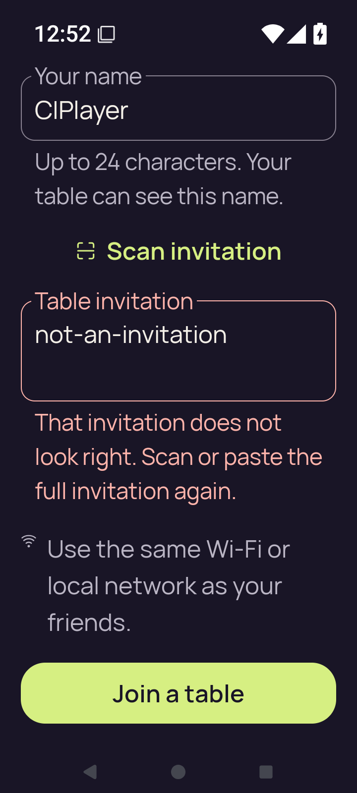</a> | **Join with invalid invitation feedback at 200% text** Android API 35 emulator, debug APK Original: [large-text-join-invalid.png](large-text-join-invalid.png) 720 × 1600 px; text 2× SHA-256: <code>b521c445f0bfa4b5903d100459f624817fc804d6da5be453fa2bbe271d2f564c</code> [Original UI dump](large-text-join-invalid.xml) The rejected input is the literal not-an-invitation; no live admission material is present. |
| <a href="large-text-join-name-soft-ime.png">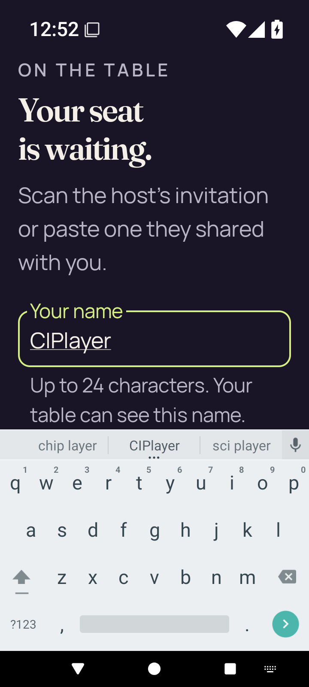</a> | **Join name and software keyboard at 200% text** Android API 35 emulator, debug APK Original: [large-text-join-name-soft-ime.png](large-text-join-name-soft-ime.png) 720 × 1600 px; text 2× SHA-256: <code>63231537b6a51419b907cc0e045ef1bae0117babf95def7e971e596c6890ba39</code> [Original UI dump](large-text-join-name-soft-ime.xml) |
| <a href="large-text-play-action.png">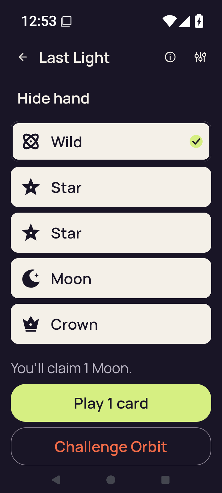</a> | **Claim explanation and Play action at 200% text** Android API 35 emulator, debug APK Original: [large-text-play-action.png](large-text-play-action.png) 720 × 1600 px; text 2× SHA-256: <code>ee9dea5827552335902c2cdcdbb95dac8233c9fe5694e2693332963436429085</code> [Original UI dump](large-text-play-action.xml) The enlarged Play action is readable after scrolling. This capture establishes reachability, not an accepted play at 200% text. |
| <a href="large-text-private-hand.png">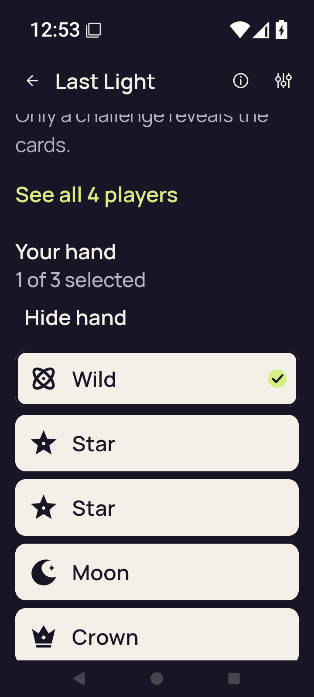</a> | **Revealed private hand and selected card at 200% text** Android API 35 emulator, debug APK Original: [large-text-private-hand.png](large-text-private-hand.png) 720 × 1600 px; text 2× SHA-256: <code>6df8e0cf722504d930329ab1349b80aef91171a037906267aa75a1ec571ba031</code> [Original UI dump](large-text-private-hand.xml) Enlarged hand uses vertical card controls. The last card can extend below this hand-focused scroll position; the separate Play capture records the action after scrolling. |
| <a href="large-text-rules-intro.png">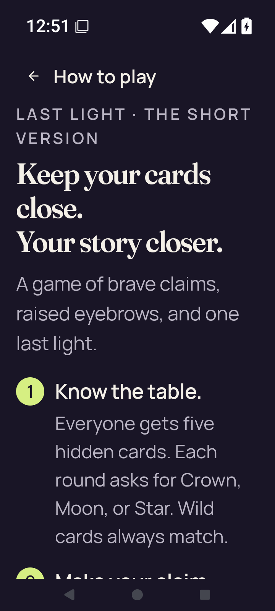</a> | **Rules introduction at 200% text** Android API 35 emulator, debug APK Original: [large-text-rules-intro.png](large-text-rules-intro.png) 720 × 1600 px; text 2× SHA-256: <code>2ad09c7bb41a3f081423905d7db1ae9c422f1cf5952d49d6672c323f2b43afc4</code> [Original UI dump](large-text-rules-intro.xml) |
| <a href="large-text-rules-last-step.png">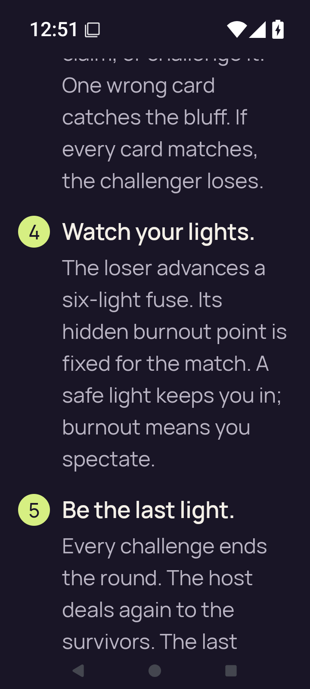</a> | **Rules final-step scroll position at 200% text** Android API 35 emulator, debug APK Original: [large-text-rules-last-step.png](large-text-rules-last-step.png) 720 × 1600 px; text 2× SHA-256: <code>db82a3bee983a70ce4434f5630e4e2ffe572366aec756132f97d048ca08b047b</code> [Original UI dump](large-text-rules-last-step.xml) |
| <a href="large-text-rules-practice-action.png">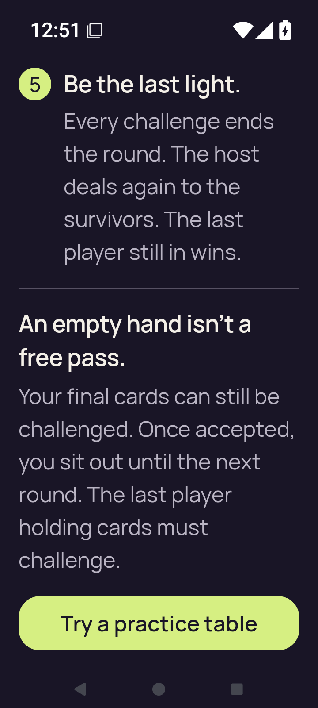</a> | **Rules final rule and Practice action at 200% text** Android API 35 emulator, debug APK Original: [large-text-rules-practice-action.png](large-text-rules-practice-action.png) 720 × 1600 px; text 2× SHA-256: <code>54784984cc65a383a176b7101bdd60290dc3857bacaf4f82c2403f3799cbd9d7</code> [Original UI dump](large-text-rules-practice-action.xml) The smoke script locates this Rules action and captures it, then presses Back; it does not tap this button. |
| <a href="large-text-settings.png">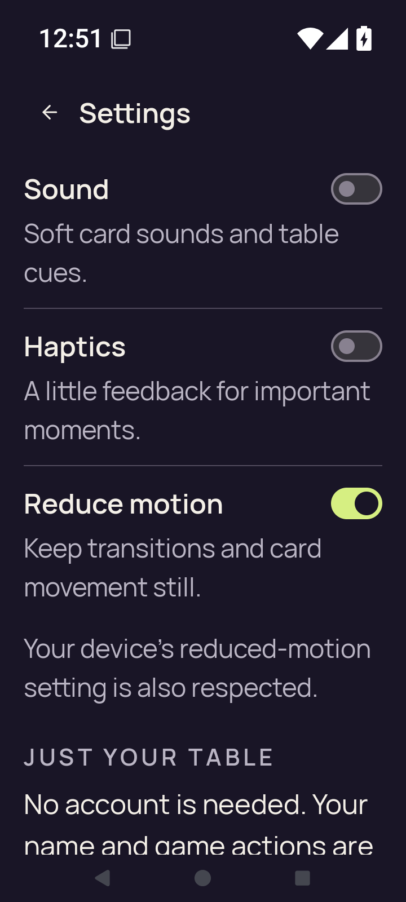</a> | **Settings at 200% text** Android API 35 emulator, debug APK Original: [large-text-settings.png](large-text-settings.png) 720 × 1600 px; text 2× SHA-256: <code>6e0abcee927bf9a8c4aa7d142dd09890ae07620de2750147a43502eafa9492ea</code> [Original UI dump](large-text-settings.xml) |
| <a href="practice-after-play.png">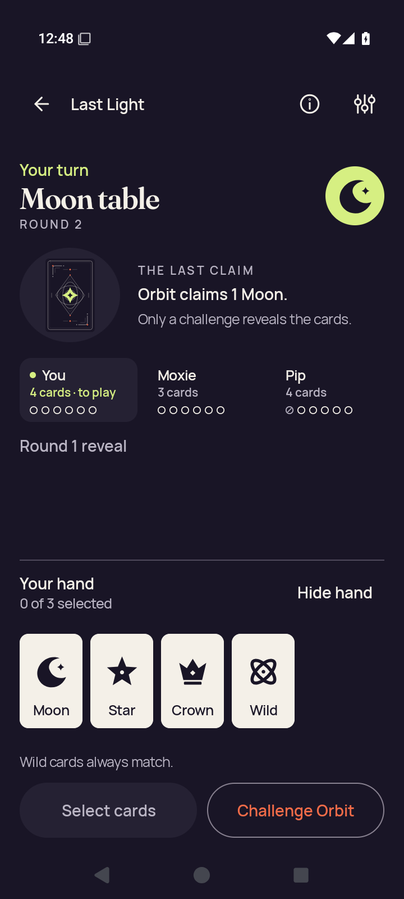</a> | **Practice after accepted play, with four cards remaining** Android API 35 emulator, debug APK Original: [practice-after-play.png](practice-after-play.png) 720 × 1600 px; text 1× SHA-256: <code>0e919cc7d3846e8af2f273111443f312b2150b37a22d1883d3db23b9b32d2f65</code> [Original UI dump](practice-after-play.xml) The debug player has four cards remaining after playing the selected Crown for a Moon claim. |
| <a href="practice-concealed.png">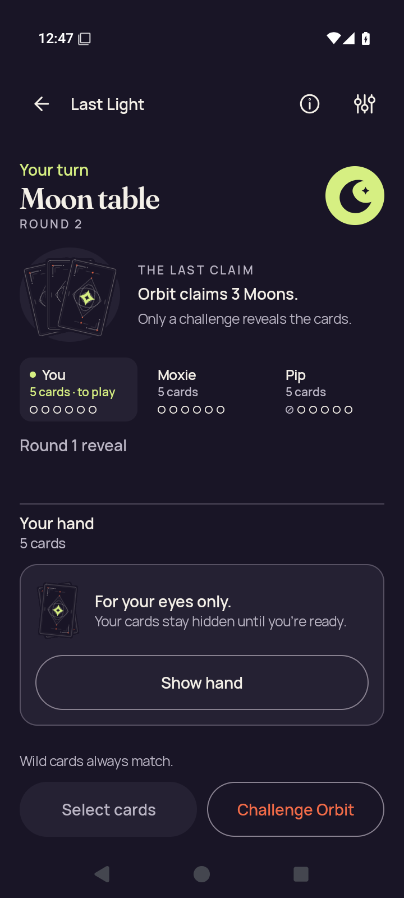</a> | **Practice with concealed hand** Android API 35 emulator, debug APK Original: [practice-concealed.png](practice-concealed.png) 720 × 1600 px; text 1× SHA-256: <code>039edd688ee971e73da8878d79b6d046aaad13e132728dfb2b40c863ce0893e6</code> [Original UI dump](practice-concealed.xml) |
|  | **Practice concealed after app resumes** Android API 35 emulator, debug APK Original: [practice-resumed-concealed.png](practice-resumed-concealed.png) 720 × 1600 px; text 1× SHA-256: <code>6dfd36a5966a2369125ebd08c5749a77fc7b3e7172eb4ccba1835ac8c6b31e20</code> [Original UI dump](practice-resumed-concealed.xml) |
|  | **Home after leaving Practice** Android API 35 emulator, debug APK Original: [practice-returned-home.png](practice-returned-home.png) 720 × 1600 px; text 1× SHA-256: <code>8be8153eeee551aadeba52ca7b5e9f3ba7936f52fde479a7fd8e825059507a17</code> [Original UI dump](practice-returned-home.xml) |
| <a href="practice-selected.png">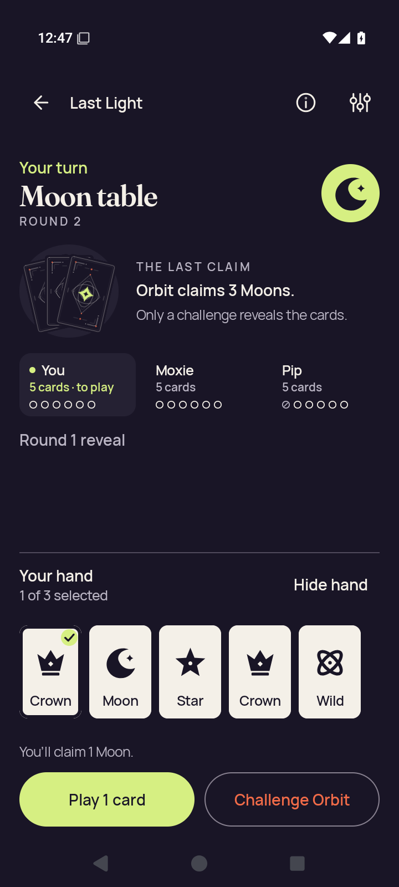</a> | **Practice with a selected card** Android API 35 emulator, debug APK Original: [practice-selected.png](practice-selected.png) 720 × 1600 px; text 1× SHA-256: <code>0c52c6ab33a2c3a4d522ae7446e9a0af327e72b0e5bc9211f3f2a89dcb2e0286</code> [Original UI dump](practice-selected.xml) Selected Crown for a Moon claim. |
| <a href="rules-intro.png">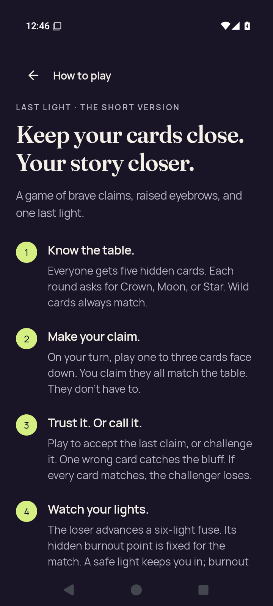</a> | **Rules introduction** Android API 35 emulator, debug APK Original: [rules-intro.png](rules-intro.png) 720 × 1600 px; text 1× SHA-256: <code>aa2d111ad261fa949914dd33e716b14c795663b8440310c66f6e0b9b84a75eaa</code> [Original UI dump](rules-intro.xml) |
| <a href="rules-last-step.png">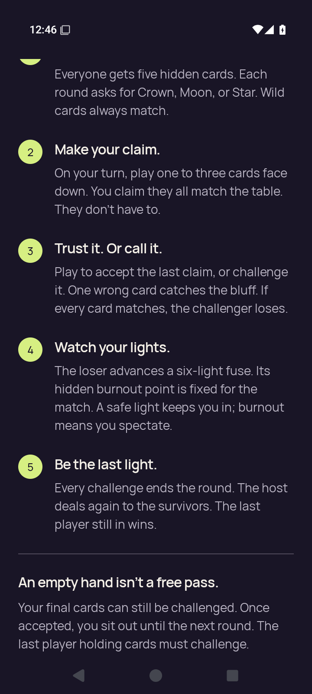</a> | **Rules final-step scroll position** Android API 35 emulator, debug APK Original: [rules-last-step.png](rules-last-step.png) 720 × 1600 px; text 1× SHA-256: <code>7926c275829c0c84d63a3e142e1507f6f1363fbf30ce7268f18f59c6a8557d09</code> [Original UI dump](rules-last-step.xml) |
| <a href="rules-practice-action.png">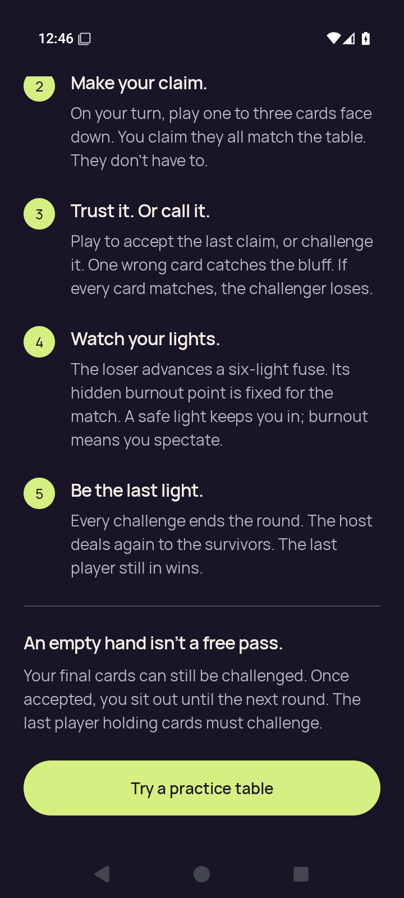</a> | **Rules final rule and Practice action** Android API 35 emulator, debug APK Original: [rules-practice-action.png](rules-practice-action.png) 720 × 1600 px; text 1× SHA-256: <code>e620dc23e739d1f890f5e458ab5deb09c474369065095fc82ba1b5a54d8ce1ff</code> [Original UI dump](rules-practice-action.xml) The smoke script locates this Rules action and captures it, then presses Back; it does not tap this button. |
| <a href="settings-changed.png">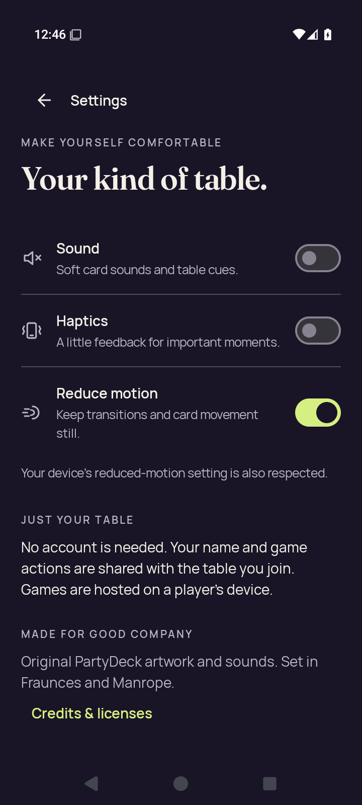</a> | **Settings after changing all three preferences** Android API 35 emulator, debug APK Original: [settings-changed.png](settings-changed.png) 720 × 1600 px; text 1× SHA-256: <code>c04cab11697d71e839e98df51cfcfeaa8584865c9af449a12161fdada1a34a63</code> [Original UI dump](settings-changed.xml) |
|  | **Settings after process restart** Android API 35 emulator, debug APK Original: [settings-persisted.png](settings-persisted.png) 720 × 1600 px; text 1× SHA-256: <code>f57f84ce4433550ffac3315cdc1b2aa9845541a15f01b54d437bf2e2f1c0a06a</code> [Original UI dump](settings-persisted.xml) |
|  | **Home after closing Settings** Android API 35 emulator, debug APK Original: [settings-return-home.png](settings-return-home.png) 720 × 1600 px; text 1× SHA-256: <code>7e93ed125c21fea35b03cad98c9ce218ef76c7ec2512d7460829be52b26ac186</code> [Original UI dump](settings-return-home.xml) |
