# Android optimized, test signed — CI 34421746656

[All screenshot collections](../../README.md)

**Evidence status:** Smoke passed the full exercised flow on this emulator, including 200% Join recovery and hand/Play reachability. The optimized Rules action and Next round screenshots retain clipped labels; these capture limits are separate from the completed runtime flow.

API 35 AVD; 720 × 1600 pixels at 280 dpi (about 411 × 914 dp); three-button navigation. Standard font scale is 1.0; large-text captures and `final-screen.png` use 2.0. Software keyboard captures show the actual Android IME.

Exact source revision: [`d3418f150e908667560767e4b825f8968b337df3`](https://github.com/Apdelrahman1911/PartyDeck/commit/d3418f150e908667560767e4b825f8968b337df3). CI run: [34421746656](https://github.com/Apdelrahman1911/PartyDeck/actions/runs/34421746656). Executed APK SHA-256: `a3c7f01fc586dc76d868bce781951048def30d69cda662521e29a4ba447e7a60`; independently recomputed from the downloaded package.

[Original smoke receipt](smoke-result.json) · [Original CI evidence summary](../evidence-summary.json) · [Display size](display-size.log) · [Display density](display-density.log).

The retained report covers local Practice reveal, selection, hide, background concealment, one-card play and leave; settings persisted through process restart; host invitation/copy/share cancellation and teardown; invalid Join recovery; and 200% layout reachability. The [script at the captured revision](https://github.com/Apdelrahman1911/PartyDeck/blob/d3418f150e908667560767e4b825f8968b337df3/scripts/smoke-android-ui.py) scrolls to and captures the final Rules action, then presses Back; it does not tap that Rules button. The 200% Play step verifies reachability without claiming an accepted play at that setting.

The summary retains a Launcher ANR from before PartyDeck installation. It is a preparation infrastructure event; both APK acceptance passes occur afterward. Physical LAN, camera frames, assistive technology and store signing remain outside this run’s exercised scope.

All 27 original app PNGs, including the successful final Home screen, are preserved. All paired UI dumps were parsed and screened against capture guards at the exact revision: no live invitation URI or open invitation dialog was retained. Host captures precede invitation opening or follow its dismissal; invalid Join input is the literal `not-an-invitation`. Original bytes and filenames are unchanged; preparation images are excluded. Source directory: `/tmp/partydeck-engine-ci/34421746656/android-jvm-reports/build/ci/android/optimized-test-signed`.

The optimized Rules captures and the after-play capture have visible clipping at the app content edge (y=1516). The normal Rules action label has only five pixels in its XML bounds; the 200% Rules action and Next round labels are also partly clipped. These originals do not prove those labels fully fit at the captured positions. The completed runtime smoke flow remains recorded separately above.

| Original image | Scenario and provenance |
| --- | --- |
| <a href="final-screen.png">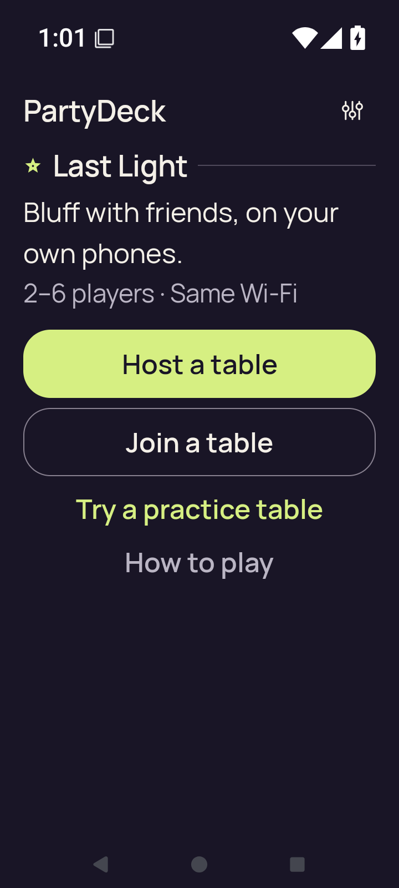</a> | **Home after the completed smoke flow at 200% text** Android API 35 emulator, optimized test-signed APK Original: [final-screen.png](final-screen.png) 720 × 1600 px; text 2× SHA-256: <code>3df0c4d24b42f0a625ff539ed4d4c9c5e13b506197ab8dc9c94f2a8ec9d2c0d5</code> [Original UI dump](last-ui.xml) Successful final Home capture after leaving Practice at 200% text. |
| <a href="home.png">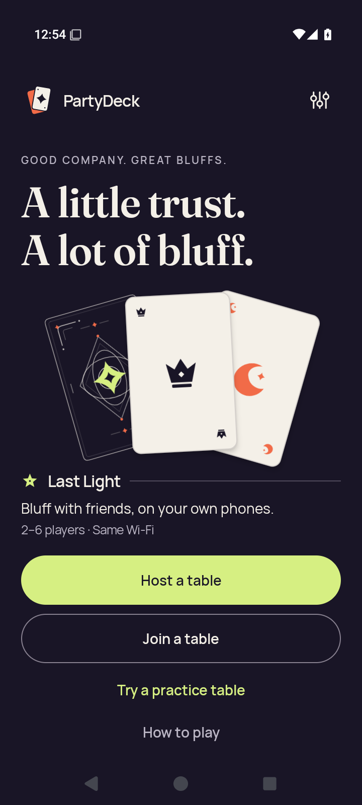</a> | **Home** Android API 35 emulator, optimized test-signed APK Original: [home.png](home.png) 720 × 1600 px; text 1× SHA-256: <code>a4119946009d33df98aed5c68dc3191619f682f13c0583771f4faab3e2af0ac7</code> [Original UI dump](home.xml) |
| <a href="host-after-share.png">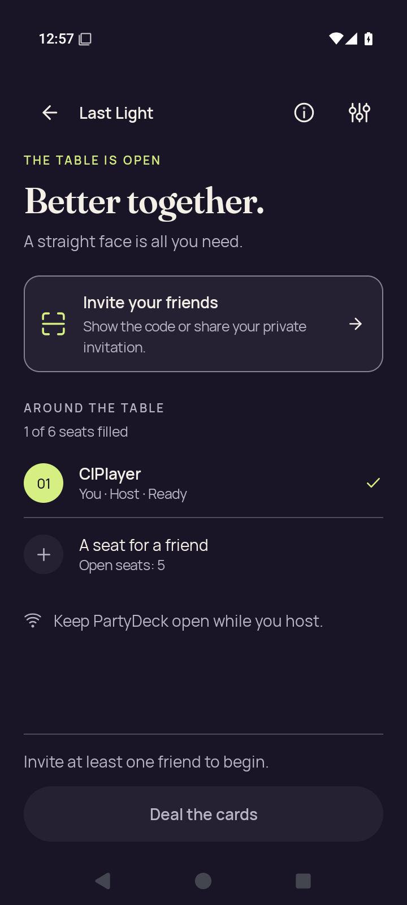</a> | **Host lobby after closing invitation and share surfaces** Android API 35 emulator, optimized test-signed APK Original: [host-after-share.png](host-after-share.png) 720 × 1600 px; text 1× SHA-256: <code>7d3f3a7f24dcff34570e447d2822185f4d5b42481798bfa66893caca4a8b7068</code> [Original UI dump](host-after-share.xml) Invitation and share surfaces are closed; no live invitation credentials are shown. |
|  | **Native host lobby before opening invitation** Android API 35 emulator, optimized test-signed APK Original: [host-lobby.png](host-lobby.png) 720 × 1600 px; text 1× SHA-256: <code>9fe1055c10109f00bccc8e9668b856cd8bc609ae7e297ea71d64ea8b61e5b32c</code> [Original UI dump](host-lobby.xml) Invitation and share surfaces are closed; no live invitation credentials are shown. |
|  | **Home after leaving host lobby** Android API 35 emulator, optimized test-signed APK Original: [host-returned-home.png](host-returned-home.png) 720 × 1600 px; text 1× SHA-256: <code>cceeeea835295e9d26551126a92641a16259f230c6c31bfe287adef4d3dec58e</code> [Original UI dump](host-returned-home.xml) |
| <a href="join-invalid.png">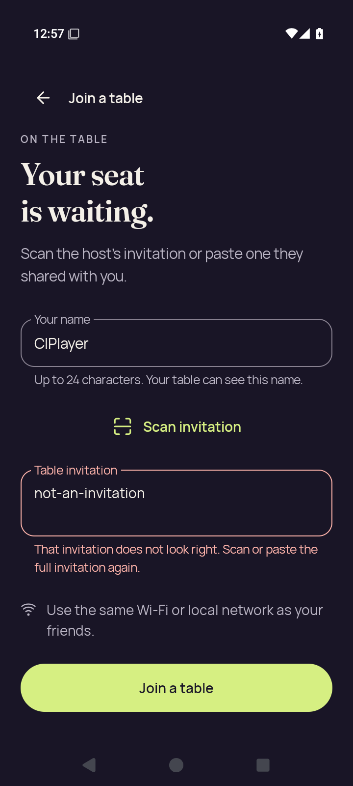</a> | **Join with invalid invitation feedback** Android API 35 emulator, optimized test-signed APK Original: [join-invalid.png](join-invalid.png) 720 × 1600 px; text 1× SHA-256: <code>5d48f90dafd298126c275ebe50d7f30bc54785f255afc4a9b7eb3aa37ab94abb</code> [Original UI dump](join-invalid.xml) The rejected input is the literal not-an-invitation; no live admission material is present. |
| <a href="join-name-soft-ime.png">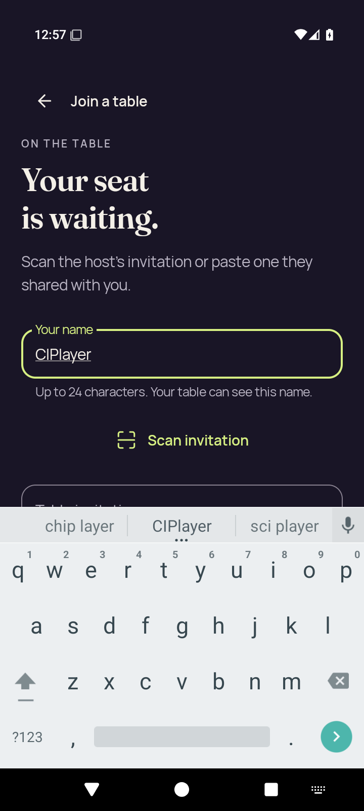</a> | **Join name focused with software keyboard** Android API 35 emulator, optimized test-signed APK Original: [join-name-soft-ime.png](join-name-soft-ime.png) 720 × 1600 px; text 1× SHA-256: <code>a318a1fed3269eecfe6a784c06d3a6f340e0b8b276d0f2c80cd7948da15c621b</code> [Original UI dump](join-name-soft-ime.xml) |
| <a href="large-text-home-actions.png">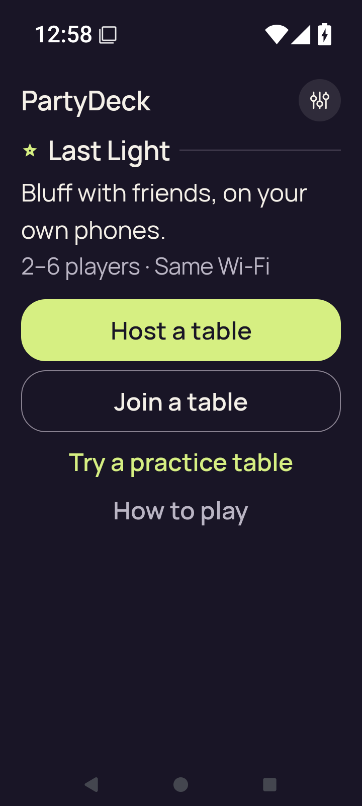</a> | **Home actions at 200% text** Android API 35 emulator, optimized test-signed APK Original: [large-text-home-actions.png](large-text-home-actions.png) 720 × 1600 px; text 2× SHA-256: <code>c653d0d55d4773769584c44ecdb49ba950cd1155d11330ead1722419a8986d54</code> [Original UI dump](large-text-home-actions.xml) |
| <a href="large-text-join-invalid.png">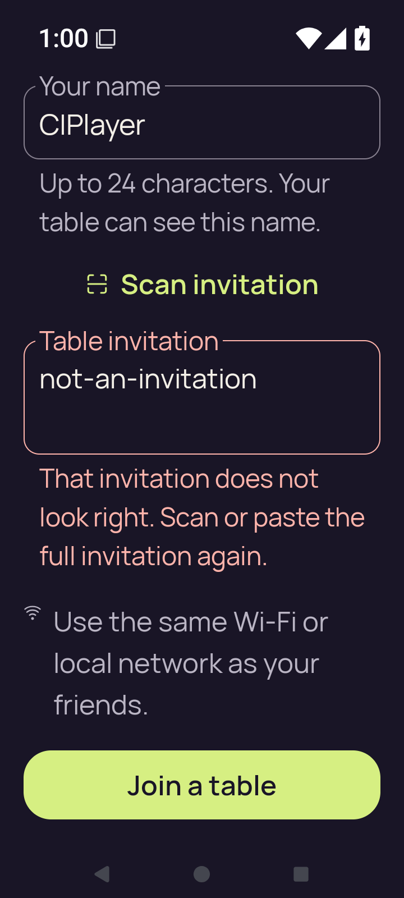</a> | **Join with invalid invitation feedback at 200% text** Android API 35 emulator, optimized test-signed APK Original: [large-text-join-invalid.png](large-text-join-invalid.png) 720 × 1600 px; text 2× SHA-256: <code>a7d78ad9804d7322767a303cd84d870b391a3f66128d8681170ff839c7a5d20c</code> [Original UI dump](large-text-join-invalid.xml) The rejected input is the literal not-an-invitation; no live admission material is present. |
| <a href="large-text-join-name-soft-ime.png">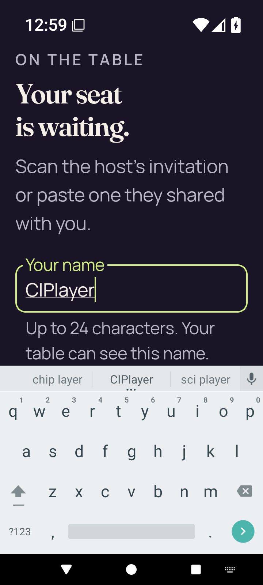</a> | **Join name and software keyboard at 200% text** Android API 35 emulator, optimized test-signed APK Original: [large-text-join-name-soft-ime.png](large-text-join-name-soft-ime.png) 720 × 1600 px; text 2× SHA-256: <code>a0ea266bb94d4d97f5b92a344b7fb6ecbce0ba9bd54f536d580da0d14885f677</code> [Original UI dump](large-text-join-name-soft-ime.xml) |
| <a href="large-text-play-action.png">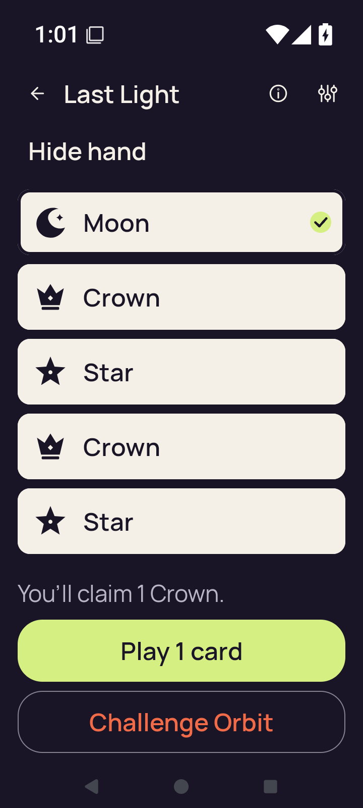</a> | **Claim explanation and Play action at 200% text** Android API 35 emulator, optimized test-signed APK Original: [large-text-play-action.png](large-text-play-action.png) 720 × 1600 px; text 2× SHA-256: <code>f22737d0655aa6592d02fa567e64ab0efc02cc167f2867f38d456e4110c50624</code> [Original UI dump](large-text-play-action.xml) The enlarged Play action is readable after scrolling. This capture establishes reachability, not an accepted play at 200% text. |
| <a href="large-text-private-hand.png">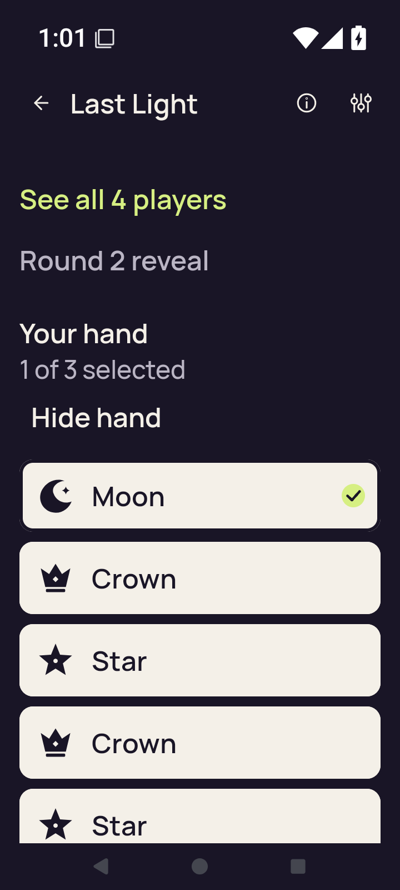</a> | **Revealed private hand and selected card at 200% text** Android API 35 emulator, optimized test-signed APK Original: [large-text-private-hand.png](large-text-private-hand.png) 720 × 1600 px; text 2× SHA-256: <code>3ed31b5a8a02dbf8d09ce02a51df07ff7251599d035e648fdb93ed85d53b5f15</code> [Original UI dump](large-text-private-hand.xml) Enlarged hand uses vertical card controls. The last card can extend below this hand-focused scroll position; the separate Play capture records the action after scrolling. |
| <a href="large-text-rules-intro.png">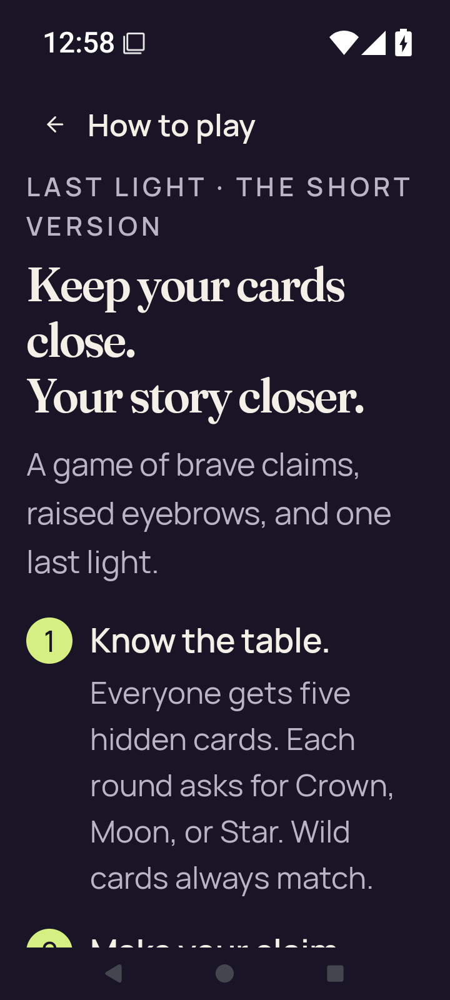</a> | **Rules introduction at 200% text** Android API 35 emulator, optimized test-signed APK Original: [large-text-rules-intro.png](large-text-rules-intro.png) 720 × 1600 px; text 2× SHA-256: <code>ef574e4f84e412b5c67eac6b6af403325d6e05ab2c456227318041429fa00df3</code> [Original UI dump](large-text-rules-intro.xml) |
| <a href="large-text-rules-last-step.png">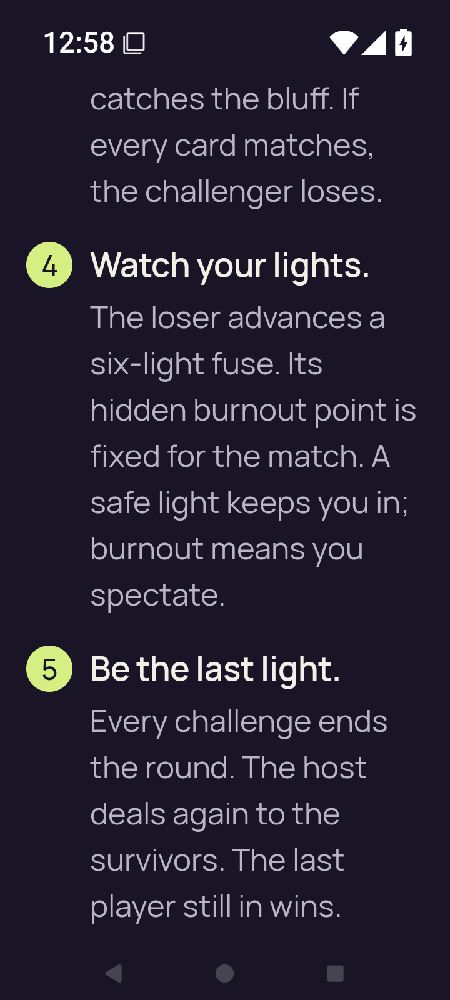</a> | **Rules final-step scroll position at 200% text** Android API 35 emulator, optimized test-signed APK Original: [large-text-rules-last-step.png](large-text-rules-last-step.png) 720 × 1600 px; text 2× SHA-256: <code>7449304f1058fa6a596ba2ed18bb90598aa0234739f2501c359f9d6e0df5c520</code> [Original UI dump](large-text-rules-last-step.xml) |
| <a href="large-text-rules-practice-action.png">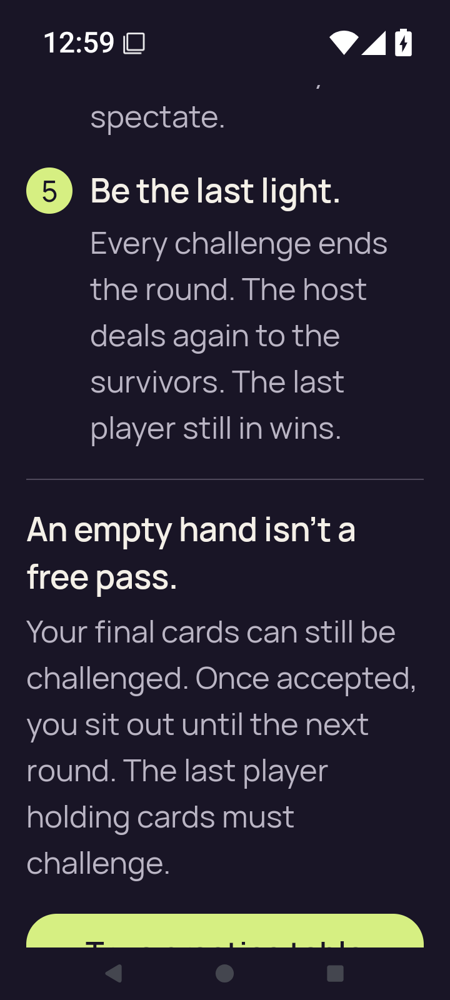</a> | **Rules final rule and Practice action at 200% text** Android API 35 emulator, optimized test-signed APK Original: [large-text-rules-practice-action.png](large-text-rules-practice-action.png) 720 × 1600 px; text 2× SHA-256: <code>1091509d8c601b8652d14a38d42533a42a1e71895dc4e6cb92a9ff7d334d531d</code> [Original UI dump](large-text-rules-practice-action.xml) The smoke script locates this Rules action and captures it, then presses Back; it does not tap this button. Capture limitation: the final Rules action label is clipped at the bottom. XML label bounds [137,1490][584,1516]; app content ends at y=1516. |
| <a href="large-text-settings.png">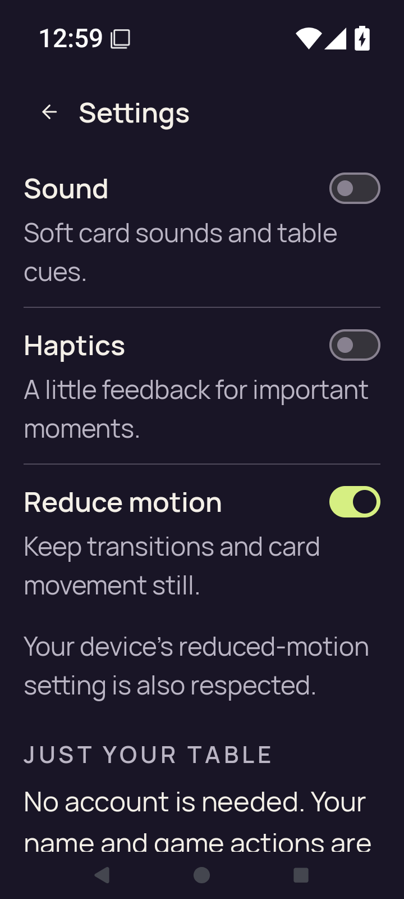</a> | **Settings at 200% text** Android API 35 emulator, optimized test-signed APK Original: [large-text-settings.png](large-text-settings.png) 720 × 1600 px; text 2× SHA-256: <code>301100043869d4aba157dff00ae38c03e2ca93cfc01697a227ba60b95b0c7cfc</code> [Original UI dump](large-text-settings.xml) |
| <a href="practice-after-play.png">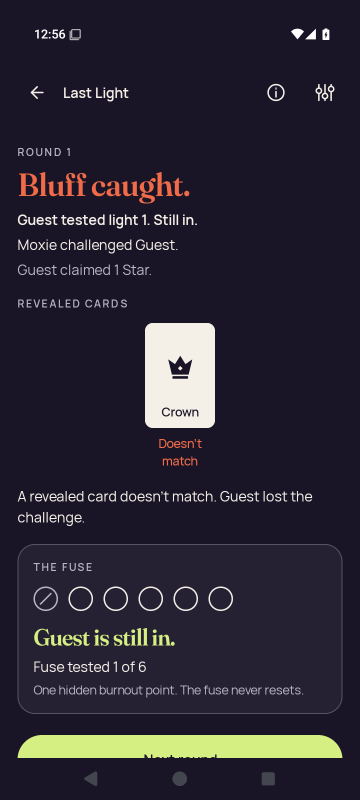</a> | **Practice result after Moxie catches Guest’s bluff** Android API 35 emulator, optimized test-signed APK Original: [practice-after-play.png](practice-after-play.png) 720 × 1600 px; text 1× SHA-256: <code>dbb496b3327cac480ae06a9eaf3c003239536d414e354fb9e6a82f418fc409dd</code> [Original UI dump](practice-after-play.xml) Guest’s Crown did not match the Star claim; Guest used light 1 and remains in. The Next round label is partly clipped at the captured scroll position: UI text bounds [286,1500][434,1516]. |
|  | **Practice with concealed hand** Android API 35 emulator, optimized test-signed APK Original: [practice-concealed.png](practice-concealed.png) 720 × 1600 px; text 1× SHA-256: <code>802cc1c07d484ad9427956008affc8a31c5eda0af08d6627b132e21103cfc596</code> [Original UI dump](practice-concealed.xml) |
| <a href="practice-resumed-concealed.png">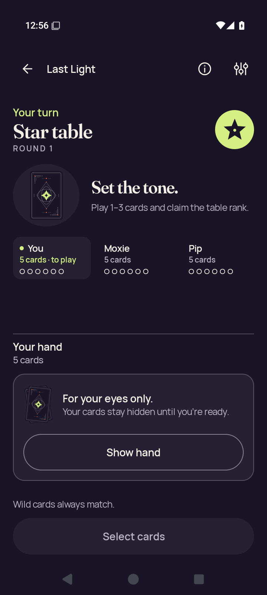</a> | **Practice concealed after app resumes** Android API 35 emulator, optimized test-signed APK Original: [practice-resumed-concealed.png](practice-resumed-concealed.png) 720 × 1600 px; text 1× SHA-256: <code>4591157e24e0117bb89057087ff717b478e7cf518181ac585acf6b4d8d080267</code> [Original UI dump](practice-resumed-concealed.xml) |
|  | **Home after leaving Practice** Android API 35 emulator, optimized test-signed APK Original: [practice-returned-home.png](practice-returned-home.png) 720 × 1600 px; text 1× SHA-256: <code>71ff777b0f0c4e2a9736579579ac08c7b0ad16d0302afe9bf8fd1c3d9c058104</code> [Original UI dump](practice-returned-home.xml) |
| <a href="practice-selected.png">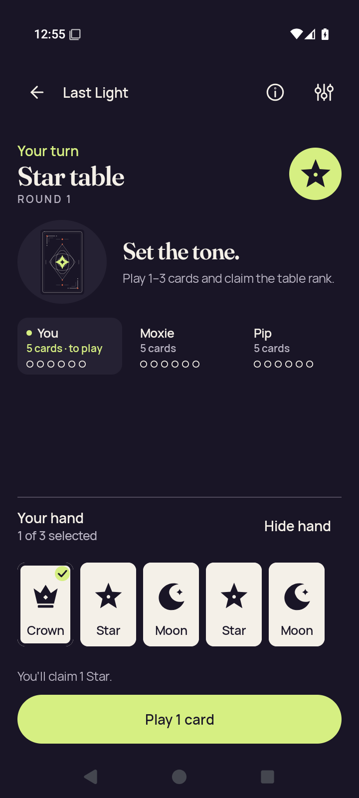</a> | **Practice with a selected card** Android API 35 emulator, optimized test-signed APK Original: [practice-selected.png](practice-selected.png) 720 × 1600 px; text 1× SHA-256: <code>6280210b00980602a4aaddad793590e7a8a47cac8093647f1248c045624446a9</code> [Original UI dump](practice-selected.xml) Selected Crown for a Star claim. |
| <a href="rules-intro.png">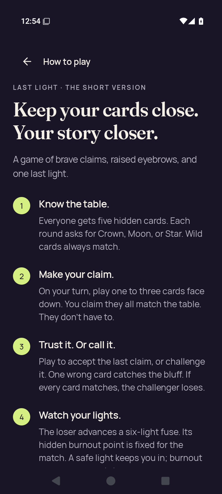</a> | **Rules introduction** Android API 35 emulator, optimized test-signed APK Original: [rules-intro.png](rules-intro.png) 720 × 1600 px; text 1× SHA-256: <code>1d4693bfc9b5691e6cb9fa7f297d9505e89e0f984c33ef9d45d601efb1f23c24</code> [Original UI dump](rules-intro.xml) |
| <a href="rules-last-step.png">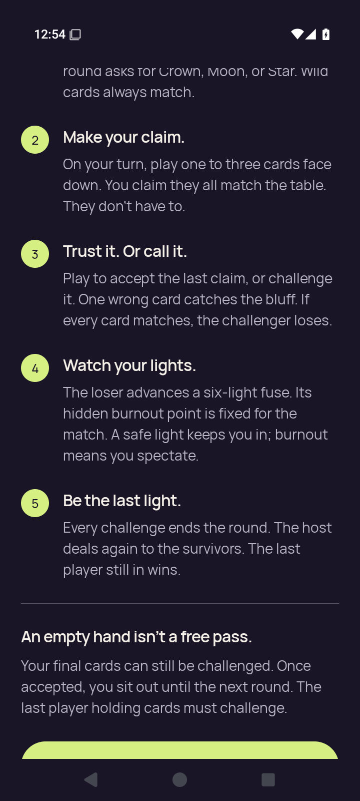</a> | **Rules final-step scroll position** Android API 35 emulator, optimized test-signed APK Original: [rules-last-step.png](rules-last-step.png) 720 × 1600 px; text 1× SHA-256: <code>2ac239e0e4a5700d10e18dcd7de9739dbd408d6be266d761b5f552a4ecd63814</code> [Original UI dump](rules-last-step.xml) |
|  | **Rules final rule and Practice action** Android API 35 emulator, optimized test-signed APK Original: [rules-practice-action.png](rules-practice-action.png) 720 × 1600 px; text 1× SHA-256: <code>2ac239e0e4a5700d10e18dcd7de9739dbd408d6be266d761b5f552a4ecd63814</code> [Original UI dump](rules-practice-action.xml) The smoke script locates this Rules action and captures it, then presses Back; it does not tap this button. Capture limitation: only the top of the action is visible and its label is unreadable. XML label bounds [232,1511][488,1516] leave five pixels before the app content edge at y=1516. |
| <a href="settings-changed.png">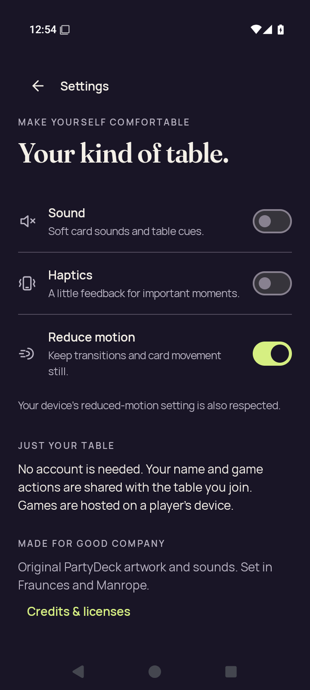</a> | **Settings after changing all three preferences** Android API 35 emulator, optimized test-signed APK Original: [settings-changed.png](settings-changed.png) 720 × 1600 px; text 1× SHA-256: <code>0c694e80b14279ced2d60384483386d080ea26e97704076ee56ad140f25ae1c5</code> [Original UI dump](settings-changed.xml) |
|  | **Settings after process restart** Android API 35 emulator, optimized test-signed APK Original: [settings-persisted.png](settings-persisted.png) 720 × 1600 px; text 1× SHA-256: <code>f12b8e33cb07c91e301f2d102d374dad44a0b7cafc160ee0f1ce56985918dc3a</code> [Original UI dump](settings-persisted.xml) |
|  | **Home after closing Settings** Android API 35 emulator, optimized test-signed APK Original: [settings-return-home.png](settings-return-home.png) 720 × 1600 px; text 1× SHA-256: <code>a4119946009d33df98aed5c68dc3191619f682f13c0583771f4faab3e2af0ac7</code> [Original UI dump](settings-return-home.xml) |
