# Android debug — CI 34428798269

[All screenshot collections](../../README.md) · [Both Android variants](../README.md)

**Evidence status:** Full exercised smoke flow passes, including actual Rules → Practice → confirmed leave/Home at 100% and 200%, settings restart, Practice input/privacy, host/share dismissal and invalid Join recovery. Both Rules button borders fit; the initial normal Rules-entered result retains a clipped Next round label.

Actual Android API 35 emulator, 720 × 1600 pixels at 280 dpi (approximately 411 × 914 dp), with three-button navigation. Standard text is 1.0; large-text captures and the final diagnostic use 2.0. Software-keyboard captures show the actual Android IME. Exact CI revision: `15ab6408d16c04941d133214b03d4e8c6c42ced9`. Executed APK SHA-256: `fb5ab7ffc54d5f01cd7a93761c03f10743f4b5d3e6f8019f0486fddee0079d0b`, independently recomputed from the downloaded package.

[Original smoke result](smoke-result.json) · [Original input trace](input-geometry.log) · [Display size](display-size.log) · [Density](display-density.log) · [Runtime variants](../runtime-variants.json) · [CI artifact metadata](../provenance/artifacts.json).

The [capture script at the exact revision](https://github.com/Apdelrahman1911/PartyDeck/blob/15ab6408d16c04941d133214b03d4e8c6c42ced9/scripts/smoke-android-ui.py) enters Rules, verifies Back, re-enters Rules, scrolls to its Practice action, taps that action, captures the game, confirms leave and captures Home. This executes at both text scales. The original receipt and input trace independently agree with both sequences. The [later Rules audit](../provenance/rules-cta-evidence-summary.json) records all four label/button bounds and tap coordinates; its function and pixel checks are separate. The normal optimized border remains clipped even though its label and actual route pass.

The same run exercises settings persistence through process restart, normal-text Practice reveal/selection/hide/background concealment and one-card play, real local host creation, invitation/copy/share cancellation, host teardown and invalid Join recovery. The 200% Play control is scrolled into view but is not tapped to submit a play. Physical LAN, camera frames, TalkBack and store signing remain outside this exercised flow. The optimized package uses a [disposable CI test key](../packages/runtime-package.json).

All 31 app PNGs are preserved: 30 named stages plus `final-screen.png`. Every paired XML was parsed and screened against the exact capture guards; no live invitation URI or open invitation dialog appears. Host screenshots precede invitation opening or follow dismissal; invalid Join input is `not-an-invitation`. Five preparation Launcher images across this and the new Godot run are excluded with full source/hash/dimension records in the main manifest. No original image is edited or recompressed.

The [downloaded-artifact summary](../provenance/evidence-summary.json) and Rules audit were created later by the CI reviewer, not by the runner. The original per-variant receipts, XMLs, input traces and relevant logs remain beside these images. Source directory: `/tmp/partydeck-engine-ci/34428798269/android-jvm-reports/build/ci/android/debug`.

| Original image | Scenario and provenance |
| --- | --- |
| <a href="final-screen.png">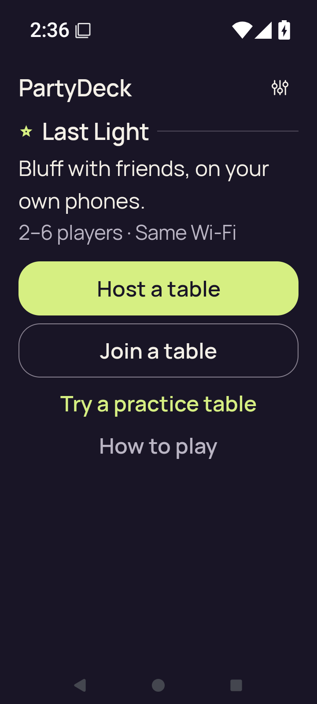</a> | **Home after the completed smoke flow at 200% text** Android API 35 emulator, debug APK Original: [final-screen.png](final-screen.png) 720 × 1600 px; text 2× SHA-256: <code>f5b3fdb16e54ebcf61b57e71897a08a143621c99c919e367cf16a3ab54281230</code> [Original receipt](smoke-result.json) [Original UI dump](last-ui.xml) Successful final Home at 200% text after the complete exercised flow. This diagnostic PNG is additional to the receipt’s 30 named stage captures. |
| <a href="home.png">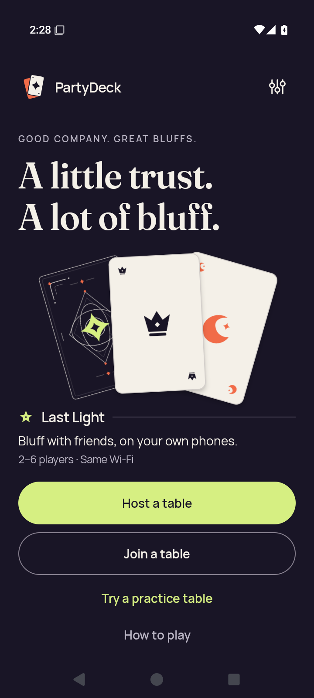</a> | **Home** Android API 35 emulator, debug APK Original: [home.png](home.png) 720 × 1600 px; text 1× SHA-256: <code>f6c3f5b9bc174d3607d63c4e4f2d844267a0959ec71dd8b830997fc5b66881a9</code> [Original receipt](smoke-result.json) [Original UI dump](home.xml) |
| <a href="host-after-share.png">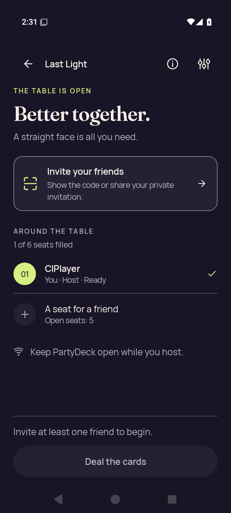</a> | **Host lobby after closing invitation and share surfaces** Android API 35 emulator, debug APK Original: [host-after-share.png](host-after-share.png) 720 × 1600 px; text 1× SHA-256: <code>dbffc9f730ebd1ee43c2e108cbbc866030512230ea9f97cb096e7ea83a07abfe</code> [Original receipt](smoke-result.json) [Original UI dump](host-after-share.xml) The native host lobby is captured before invitation opening or after invitation/share dismissal. No live invitation credentials are visible. |
|  | **Native host lobby before opening invitation** Android API 35 emulator, debug APK Original: [host-lobby.png](host-lobby.png) 720 × 1600 px; text 1× SHA-256: <code>dbffc9f730ebd1ee43c2e108cbbc866030512230ea9f97cb096e7ea83a07abfe</code> [Original receipt](smoke-result.json) [Original UI dump](host-lobby.xml) The native host lobby is captured before invitation opening or after invitation/share dismissal. No live invitation credentials are visible. |
| <a href="host-returned-home.png">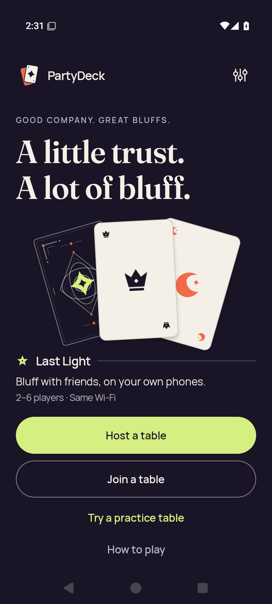</a> | **Home after leaving host lobby** Android API 35 emulator, debug APK Original: [host-returned-home.png](host-returned-home.png) 720 × 1600 px; text 1× SHA-256: <code>81ce7a2fdf578229e507314fe732200f32bc6c97d3c5e1b788c3e569650a1675</code> [Original receipt](smoke-result.json) [Original UI dump](host-returned-home.xml) |
| <a href="join-invalid.png">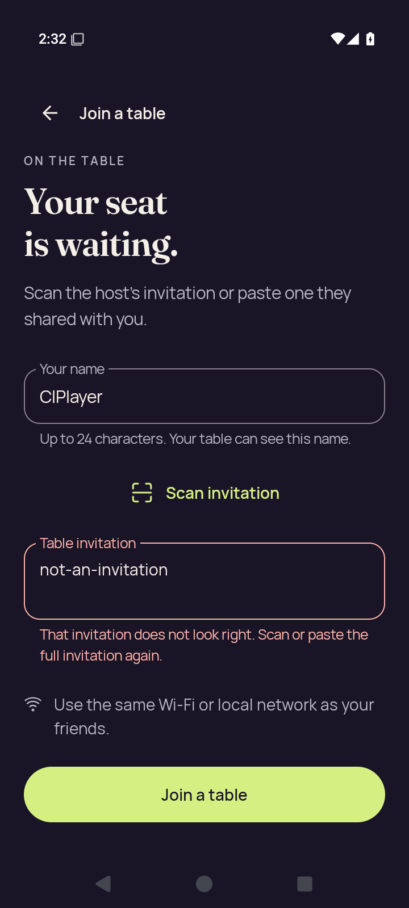</a> | **Join with invalid invitation feedback** Android API 35 emulator, debug APK Original: [join-invalid.png](join-invalid.png) 720 × 1600 px; text 1× SHA-256: <code>cf5016ece408701d0e2032e0629a521fd1cb63a72cb860dc44d9564d81eca07a</code> [Original receipt](smoke-result.json) [Original UI dump](join-invalid.xml) The rejected input is the literal not-an-invitation; the original flow then edits it and returns Home. |
| <a href="join-name-soft-ime.png">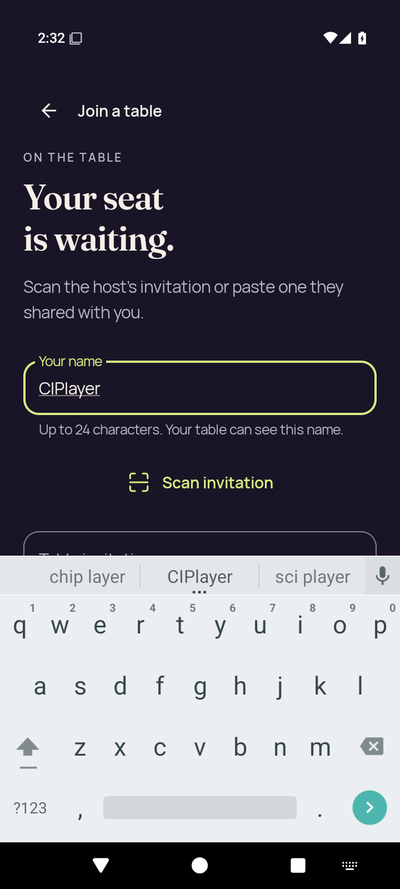</a> | **Join name focused with software keyboard** Android API 35 emulator, debug APK Original: [join-name-soft-ime.png](join-name-soft-ime.png) 720 × 1600 px; text 1× SHA-256: <code>3a7df04b69989a5a6982580c49b4f66538209b33f05fb5f98d904fb0d9614b23</code> [Original receipt](smoke-result.json) [Original UI dump](join-name-soft-ime.xml) |
|  | **Home actions at 200% text** Android API 35 emulator, debug APK Original: [large-text-home-actions.png](large-text-home-actions.png) 720 × 1600 px; text 2× SHA-256: <code>c231527a94f31e5b5b7cd310c2483596fe9c90fff7b06c7ee71a887e8f588447</code> [Original receipt](smoke-result.json) [Original UI dump](large-text-home-actions.xml) |
| <a href="large-text-join-invalid.png">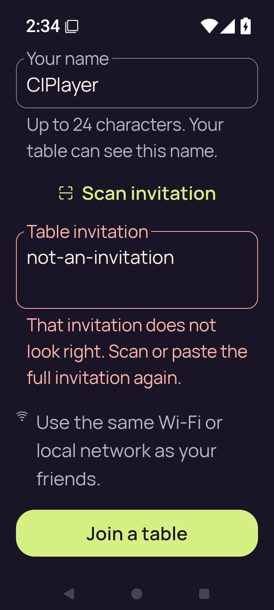</a> | **Join with invalid invitation feedback at 200% text** Android API 35 emulator, debug APK Original: [large-text-join-invalid.png](large-text-join-invalid.png) 720 × 1600 px; text 2× SHA-256: <code>ec71e4c9ae629e6a1f3bd3c44f110614e4278baf6c5628b97f2b868ad654b1bc</code> [Original receipt](smoke-result.json) [Original UI dump](large-text-join-invalid.xml) The rejected input is the literal not-an-invitation; the original flow then edits it and returns Home. |
| <a href="large-text-join-name-soft-ime.png">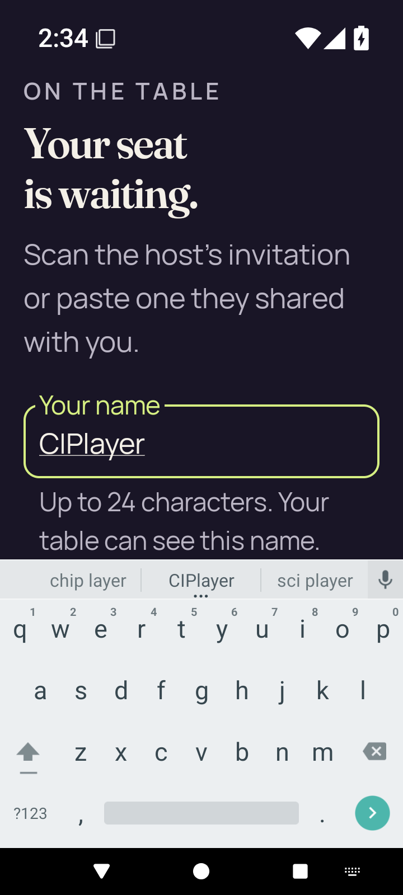</a> | **Join name and software keyboard at 200% text** Android API 35 emulator, debug APK Original: [large-text-join-name-soft-ime.png](large-text-join-name-soft-ime.png) 720 × 1600 px; text 2× SHA-256: <code>6ce22138bcc275e60300e52c5b488cf5709ee24fb6d07a11bb5df2c5a76da94d</code> [Original receipt](smoke-result.json) [Original UI dump](large-text-join-name-soft-ime.xml) |
| <a href="large-text-play-action.png">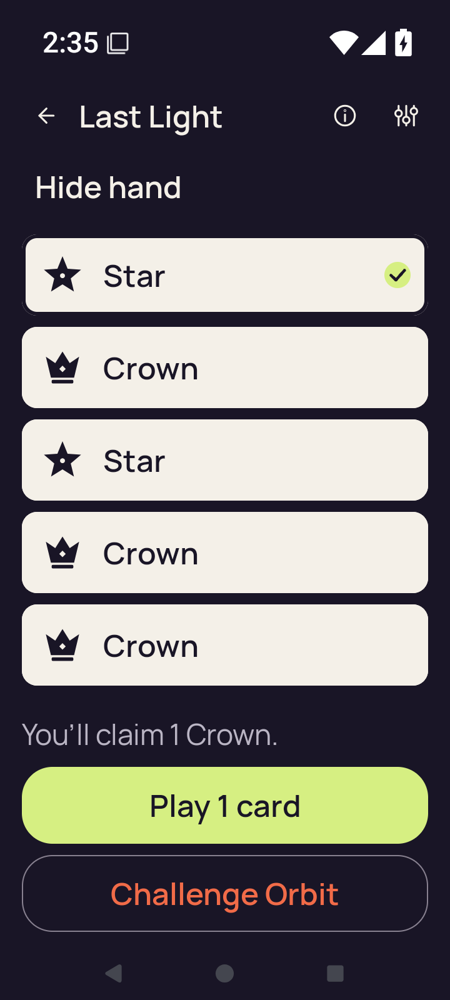</a> | **Claim explanation and Play action at 200% text** Android API 35 emulator, debug APK Original: [large-text-play-action.png](large-text-play-action.png) 720 × 1600 px; text 2× SHA-256: <code>a179cf272585a731218b89599d870305636f7cd693848d8739e5d9de3cbb0f89</code> [Original receipt](smoke-result.json) [Original UI dump](large-text-play-action.xml) The enlarged Play action is fully readable after scrolling. The runner verifies reachability here; it does not submit an accepted play at 200% text. |
| <a href="large-text-private-hand.png">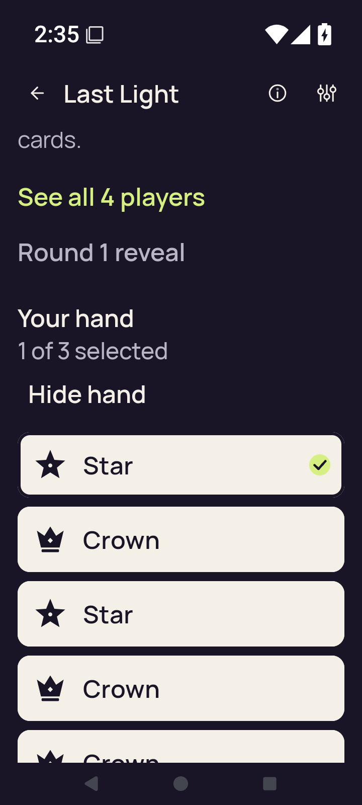</a> | **Revealed private hand and selected card at 200% text** Android API 35 emulator, debug APK Original: [large-text-private-hand.png](large-text-private-hand.png) 720 × 1600 px; text 2× SHA-256: <code>d3d832610eaf20595ad00aab2d7649f77e1cc8e91b1e22c0333d4e2b5d9892e6</code> [Original receipt](smoke-result.json) [Original UI dump](large-text-private-hand.xml) The hand-focused scroll position is retained separately from the following Play-action position. Enlarged cards form a vertical list. |
| <a href="large-text-rules-intro.png">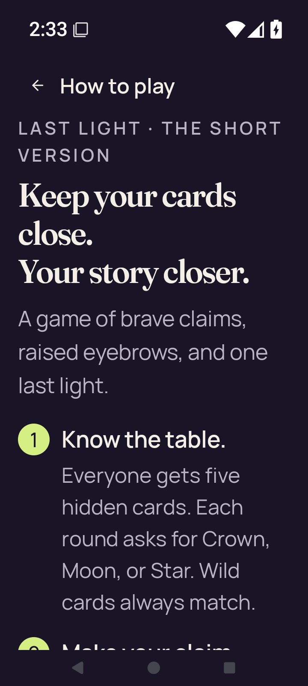</a> | **Rules introduction at 200% text** Android API 35 emulator, debug APK Original: [large-text-rules-intro.png](large-text-rules-intro.png) 720 × 1600 px; text 2× SHA-256: <code>8156eba0a0b6680079cebc8b5d95a999db315a40e35345e4cde33c8ae305129e</code> [Original receipt](smoke-result.json) [Original UI dump](large-text-rules-intro.xml) |
| <a href="large-text-rules-last-step.png">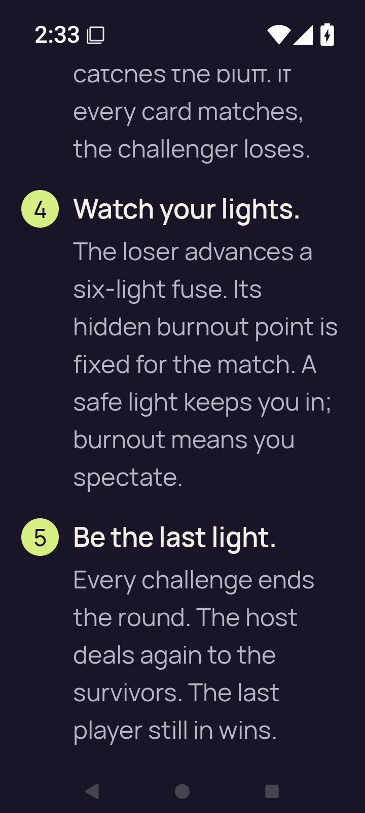</a> | **Rules final-step scroll position at 200% text** Android API 35 emulator, debug APK Original: [large-text-rules-last-step.png](large-text-rules-last-step.png) 720 × 1600 px; text 2× SHA-256: <code>08eab6da59783d6ab5709a56436e1541e39a0bbab57964667abe8bca6420109a</code> [Original receipt](smoke-result.json) [Original UI dump](large-text-rules-last-step.xml) |
| <a href="large-text-rules-practice-action.png">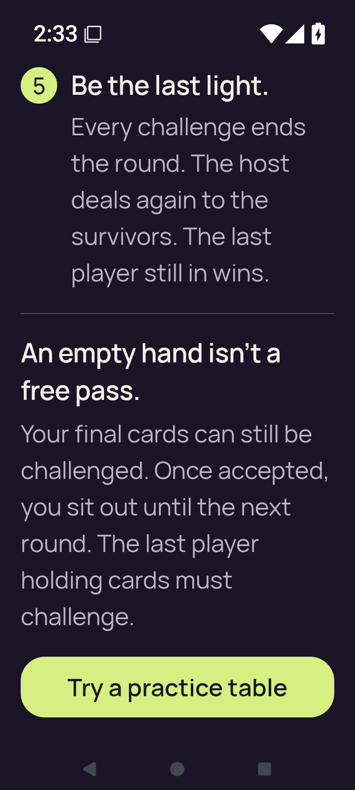</a> | **Rules final rule and Practice action at 200% text** Android API 35 emulator, debug APK Original: [large-text-rules-practice-action.png](large-text-rules-practice-action.png) 720 × 1600 px; text 2× SHA-256: <code>e845fb8e454ce576802cd79a2d4e4c8265b6b04335602f1d2177799c8f6e71c5</code> [Original receipt](smoke-result.json) [Original UI dump](large-text-rules-practice-action.xml) The actual Rules action is tapped at (360, 1391); its original input trace and following game/Home captures confirm direct entry and confirmed leave. The complete label and rounded button border are visible at this captured position. |
| <a href="large-text-rules-practice-entered.png">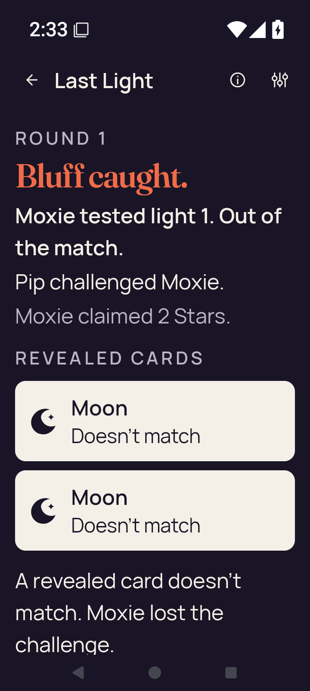</a> | **Practice entered directly from Rules at 200% text** Android API 35 emulator, debug APK Original: [large-text-rules-practice-entered.png](large-text-rules-practice-entered.png) 720 × 1600 px; text 2× SHA-256: <code>df7c4ebd7877c741cc425ce91f385f0b6e1f70e2bb9fda6fd22a6812c73d9fd0</code> [Original receipt](smoke-result.json) [Original UI dump](large-text-rules-practice-entered.xml) The entered game already shows Pip catching Moxie’s two-Star claim with two Moons; Moxie used light 1 and is out. Further result content continues below the initial viewport. |
| <a href="large-text-rules-returned-home.png">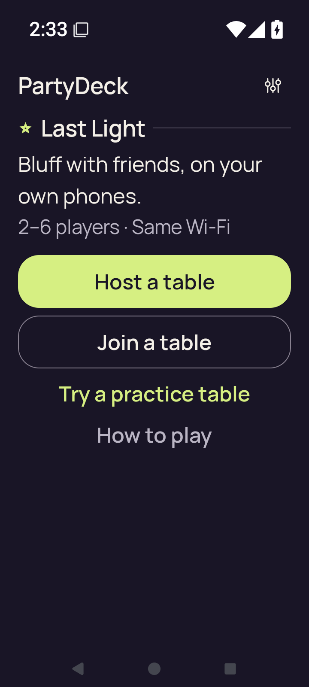</a> | **Home after confirming leave from Rules-started Practice at 200% text** Android API 35 emulator, debug APK Original: [large-text-rules-returned-home.png](large-text-rules-returned-home.png) 720 × 1600 px; text 2× SHA-256: <code>ce05324a606a32c8725e5709e3dbf3efde5770da0f63dcae2cdaaf42094d7874</code> [Original receipt](smoke-result.json) [Original UI dump](large-text-rules-returned-home.xml) |
| <a href="large-text-settings.png">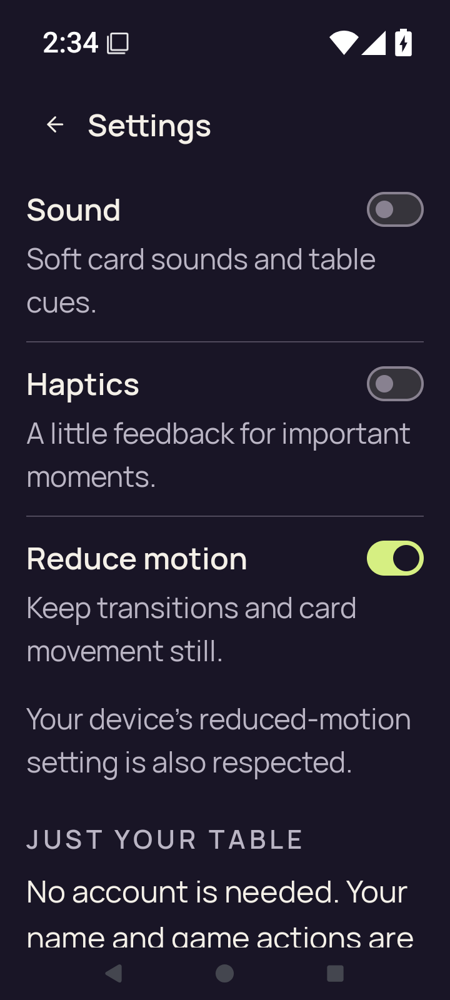</a> | **Settings at 200% text** Android API 35 emulator, debug APK Original: [large-text-settings.png](large-text-settings.png) 720 × 1600 px; text 2× SHA-256: <code>a9b625bf67ed1436134d57f23a6173396907baf6111c3b2518414c6ce992caa7</code> [Original receipt](smoke-result.json) [Original UI dump](large-text-settings.xml) |
| <a href="practice-after-play.png">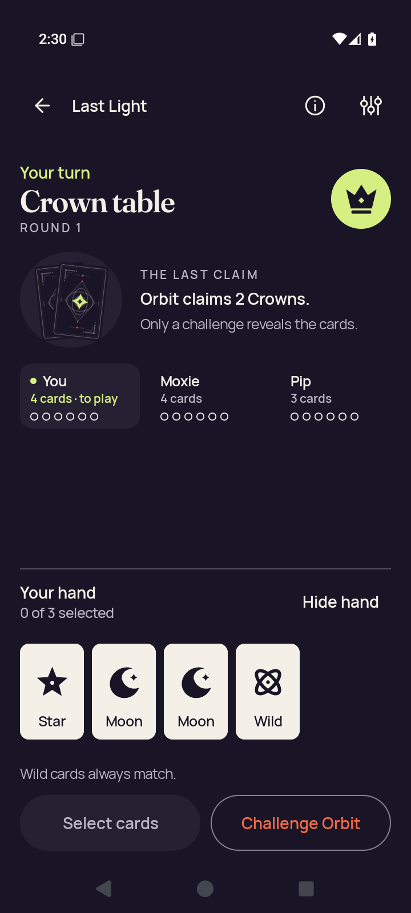</a> | **Practice continues after an accepted one-card play; four cards remain** Android API 35 emulator, debug APK Original: [practice-after-play.png](practice-after-play.png) 720 × 1600 px; text 1× SHA-256: <code>88901957e45d6c806c3587f345d5310c1dfe473a4a2ed62e315350d36d5a02cc</code> [Original receipt](smoke-result.json) [Original UI dump](practice-after-play.xml) The receipt records the hand decreasing by one. This frame is still round 1 on the Crown table, with four own cards, zero selections and Orbit’s two-Crown claim; it is not a round-result screen. |
| <a href="practice-concealed.png">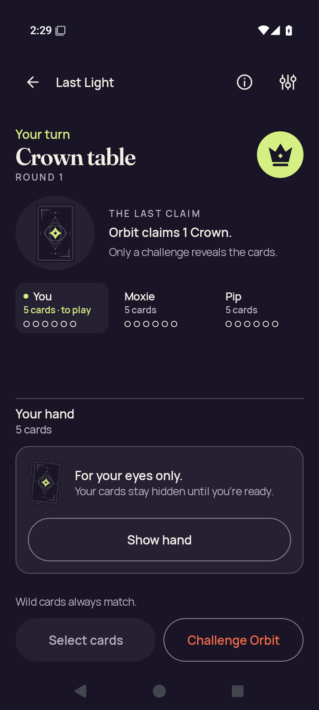</a> | **Practice with concealed hand** Android API 35 emulator, debug APK Original: [practice-concealed.png](practice-concealed.png) 720 × 1600 px; text 1× SHA-256: <code>0c62267c17db0b11351013ee0da8ec19b4a2509999bb1c5c15e2f01abc01116e</code> [Original receipt](smoke-result.json) [Original UI dump](practice-concealed.xml) |
|  | **Practice concealed after app resumes** Android API 35 emulator, debug APK Original: [practice-resumed-concealed.png](practice-resumed-concealed.png) 720 × 1600 px; text 1× SHA-256: <code>b1d31187f9be4dc1c2398aa1a8000aaee7f86c5f99e97897d6ae32e4a387077f</code> [Original receipt](smoke-result.json) [Original UI dump](practice-resumed-concealed.xml) |
|  | **Home after leaving Practice** Android API 35 emulator, debug APK Original: [practice-returned-home.png](practice-returned-home.png) 720 × 1600 px; text 1× SHA-256: <code>c798b1980c65cc3a83be7741afe49652f2c4fd347fc77b73aede28febe4f80f1</code> [Original receipt](smoke-result.json) [Original UI dump](practice-returned-home.xml) |
| <a href="practice-selected.png">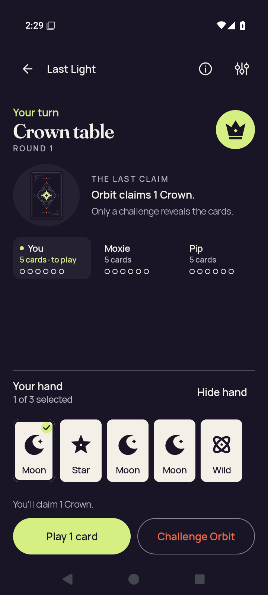</a> | **Practice with a selected card** Android API 35 emulator, debug APK Original: [practice-selected.png](practice-selected.png) 720 × 1600 px; text 1× SHA-256: <code>6fb4696c1f3e7319c74373078335415e86b58b799cb2151e055f88602a05415b</code> [Original receipt](smoke-result.json) [Original UI dump](practice-selected.xml) Selected Moon for a one-card Crown claim. |
| <a href="rules-intro.png">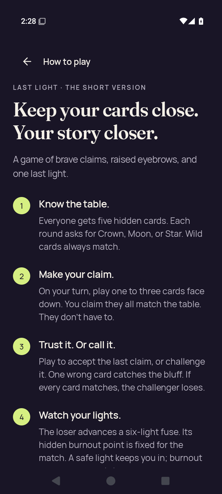</a> | **Rules introduction** Android API 35 emulator, debug APK Original: [rules-intro.png](rules-intro.png) 720 × 1600 px; text 1× SHA-256: <code>7e3fd17bc744d4a74b3627abdff55679628f2026b01086115b19f43377353174</code> [Original receipt](smoke-result.json) [Original UI dump](rules-intro.xml) |
| <a href="rules-last-step.png">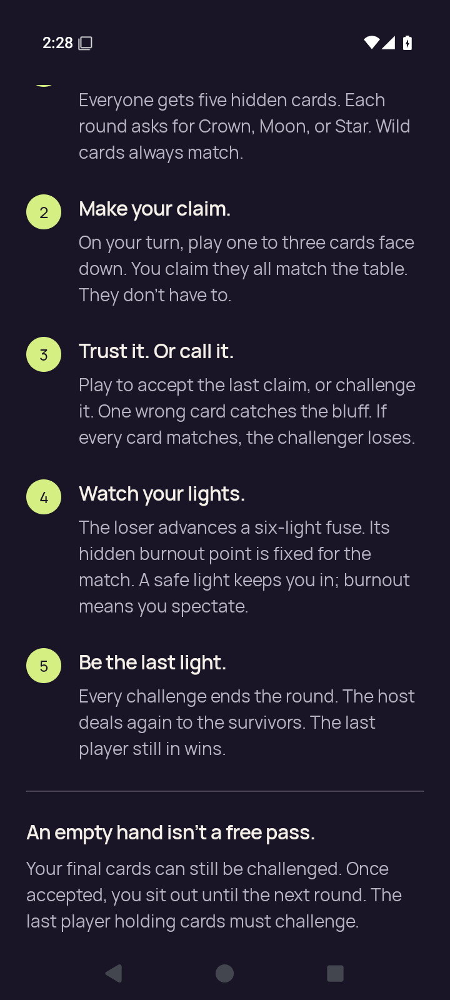</a> | **Rules final-step scroll position** Android API 35 emulator, debug APK Original: [rules-last-step.png](rules-last-step.png) 720 × 1600 px; text 1× SHA-256: <code>ac4d5fa6ef1f539a824591a06e56d22a3b2a4ba7f685a0f87ef654954baf1aad</code> [Original receipt](smoke-result.json) [Original UI dump](rules-last-step.xml) |
| <a href="rules-practice-action.png">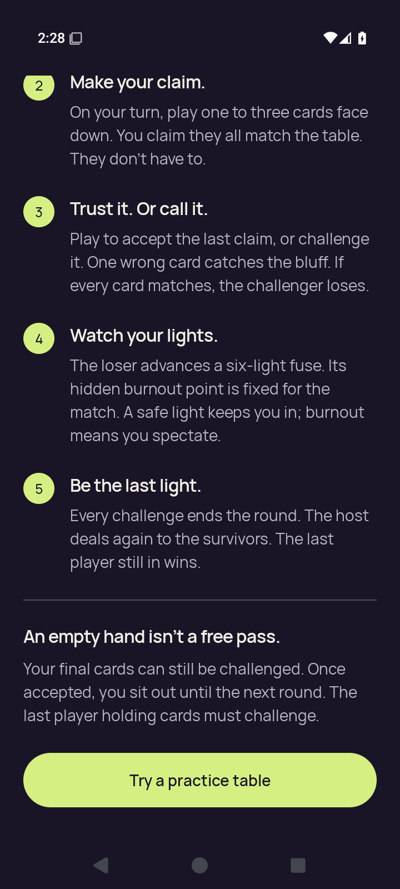</a> | **Rules final rule and Practice action** Android API 35 emulator, debug APK Original: [rules-practice-action.png](rules-practice-action.png) 720 × 1600 px; text 1× SHA-256: <code>6dd57ad883263a029afa7e07d473bdde374a3ef65bfe027a735d317433e62350</code> [Original receipt](smoke-result.json) [Original UI dump](rules-practice-action.xml) The actual Rules action is tapped at (360, 1404); its original input trace and following game/Home captures confirm direct entry and confirmed leave. The complete label and rounded button border are visible at this captured position. |
| <a href="rules-practice-entered.png">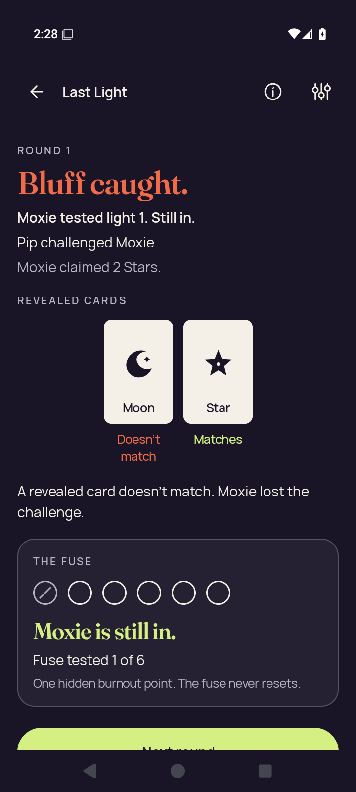</a> | **Practice entered directly from the Rules action** Android API 35 emulator, debug APK Original: [rules-practice-entered.png](rules-practice-entered.png) 720 × 1600 px; text 1× SHA-256: <code>9751810ebbc38cc80c0d30789281bf26b6067ac85da3763039ac1cdccbbd9be1</code> [Original receipt](smoke-result.json) [Original UI dump](rules-practice-entered.xml) Autonomous practice turns already reached a public result: Pip caught Moxie’s two-Star claim with Moon and Star; Moxie used light 1 and remains in. Next round is partly clipped at the initial viewport edge; label bounds [286,1500,434,1516]. |
|  | **Home after confirming leave from Rules-started Practice** Android API 35 emulator, debug APK Original: [rules-returned-home.png](rules-returned-home.png) 720 × 1600 px; text 1× SHA-256: <code>8deffe0e43f1f6fb43c9d0d730f3c2f83f032600307972a3edeea44181ff5369</code> [Original receipt](smoke-result.json) [Original UI dump](rules-returned-home.xml) |
| <a href="settings-changed.png">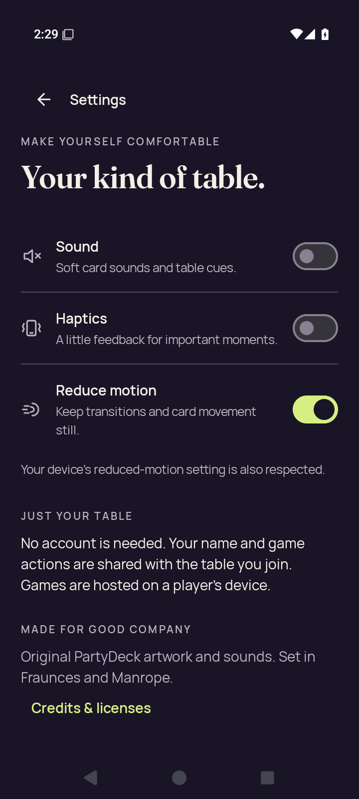</a> | **Settings after changing all three preferences** Android API 35 emulator, debug APK Original: [settings-changed.png](settings-changed.png) 720 × 1600 px; text 1× SHA-256: <code>fafdf977c9d4383d68888179781f5f43f9dbd0db935cabcf4168f6beffc336f4</code> [Original receipt](smoke-result.json) [Original UI dump](settings-changed.xml) |
|  | **Settings after process restart** Android API 35 emulator, debug APK Original: [settings-persisted.png](settings-persisted.png) 720 × 1600 px; text 1× SHA-256: <code>fafdf977c9d4383d68888179781f5f43f9dbd0db935cabcf4168f6beffc336f4</code> [Original receipt](smoke-result.json) [Original UI dump](settings-persisted.xml) |
|  | **Home after closing Settings** Android API 35 emulator, debug APK Original: [settings-return-home.png](settings-return-home.png) 720 × 1600 px; text 1× SHA-256: <code>37789abc9606043d1f6c0f80c157579ddc124e1f50e8866a496b4bf998d034e8</code> [Original receipt](smoke-result.json) [Original UI dump](settings-return-home.xml) |
