# Android optimized, test signed — CI 34428798269

[All screenshot collections](../../README.md) · [Both Android variants](../README.md)

**Evidence status:** Full exercised smoke flow passes, including actual Rules → Practice → confirmed leave/Home at 100% and 200%, settings restart, Practice input/privacy, host/share dismissal and invalid Join recovery. The normal Rules label is readable but its lower rounded border remains clipped; the after-play Next round label is also clipped.

Actual Android API 35 emulator, 720 × 1600 pixels at 280 dpi (approximately 411 × 914 dp), with three-button navigation. Standard text is 1.0; large-text captures and the final diagnostic use 2.0. Software-keyboard captures show the actual Android IME. Exact CI revision: `15ab6408d16c04941d133214b03d4e8c6c42ced9`. Executed APK SHA-256: `a0adb50939b13eb83b21e37bd0d0604aba309e3d106d1f0c38dd0746a7115724`, independently recomputed from the downloaded package.

[Original smoke result](smoke-result.json) · [Original input trace](input-geometry.log) · [Display size](display-size.log) · [Density](display-density.log) · [Runtime variants](../runtime-variants.json) · [CI artifact metadata](../provenance/artifacts.json).

The [capture script at the exact revision](https://github.com/Apdelrahman1911/PartyDeck/blob/15ab6408d16c04941d133214b03d4e8c6c42ced9/scripts/smoke-android-ui.py) enters Rules, verifies Back, re-enters Rules, scrolls to its Practice action, taps that action, captures the game, confirms leave and captures Home. This executes at both text scales. The original receipt and input trace independently agree with both sequences. The [later Rules audit](../provenance/rules-cta-evidence-summary.json) records all four label/button bounds and tap coordinates; its function and pixel checks are separate. The normal optimized border remains clipped even though its label and actual route pass.

The same run exercises settings persistence through process restart, normal-text Practice reveal/selection/hide/background concealment and one-card play, real local host creation, invitation/copy/share cancellation, host teardown and invalid Join recovery. The 200% Play control is scrolled into view but is not tapped to submit a play. Physical LAN, camera frames, TalkBack and store signing remain outside this exercised flow. The optimized package uses a [disposable CI test key](../packages/runtime-package.json).

All 31 app PNGs are preserved: 30 named stages plus `final-screen.png`. Every paired XML was parsed and screened against the exact capture guards; no live invitation URI or open invitation dialog appears. Host screenshots precede invitation opening or follow dismissal; invalid Join input is `not-an-invitation`. Five preparation Launcher images across this and the new Godot run are excluded with full source/hash/dimension records in the main manifest. No original image is edited or recompressed.

The [downloaded-artifact summary](../provenance/evidence-summary.json) and Rules audit were created later by the CI reviewer, not by the runner. The original per-variant receipts, XMLs, input traces and relevant logs remain beside these images. Source directory: `/tmp/partydeck-engine-ci/34428798269/android-jvm-reports/build/ci/android/optimized-test-signed`.

| Original image | Scenario and provenance |
| --- | --- |
| <a href="final-screen.png">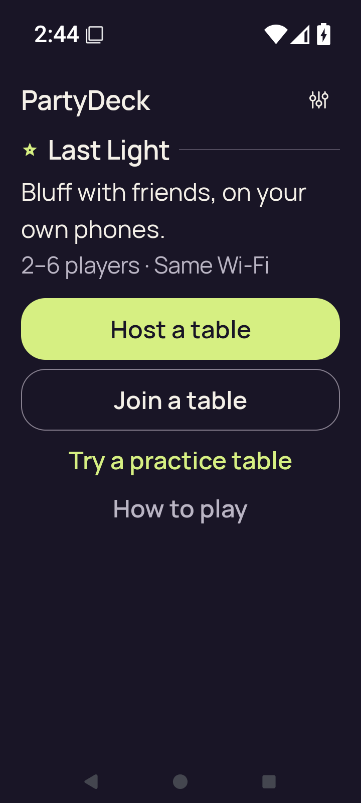</a> | **Home after the completed smoke flow at 200% text** Android API 35 emulator, optimized test-signed APK Original: [final-screen.png](final-screen.png) 720 × 1600 px; text 2× SHA-256: <code>f7a317197aeb3ffc3a0dddc324607b057e7eeffd790b8fb4945683d0cfdc3a87</code> [Original receipt](smoke-result.json) [Original UI dump](last-ui.xml) Successful final Home at 200% text after the complete exercised flow. This diagnostic PNG is additional to the receipt’s 30 named stage captures. |
|  | **Home** Android API 35 emulator, optimized test-signed APK Original: [home.png](home.png) 720 × 1600 px; text 1× SHA-256: <code>9f93c4cd9f90786f9ddb0d48570e93d871d58f07f2cf98605e3dd0009adef912</code> [Original receipt](smoke-result.json) [Original UI dump](home.xml) |
|  | **Host lobby after closing invitation and share surfaces** Android API 35 emulator, optimized test-signed APK Original: [host-after-share.png](host-after-share.png) 720 × 1600 px; text 1× SHA-256: <code>d89927fb0177cd47241685e277b7c9651ee4c830a7bcbbf2be0b728e598cd84f</code> [Original receipt](smoke-result.json) [Original UI dump](host-after-share.xml) The native host lobby is captured before invitation opening or after invitation/share dismissal. No live invitation credentials are visible. |
| <a href="host-lobby.png">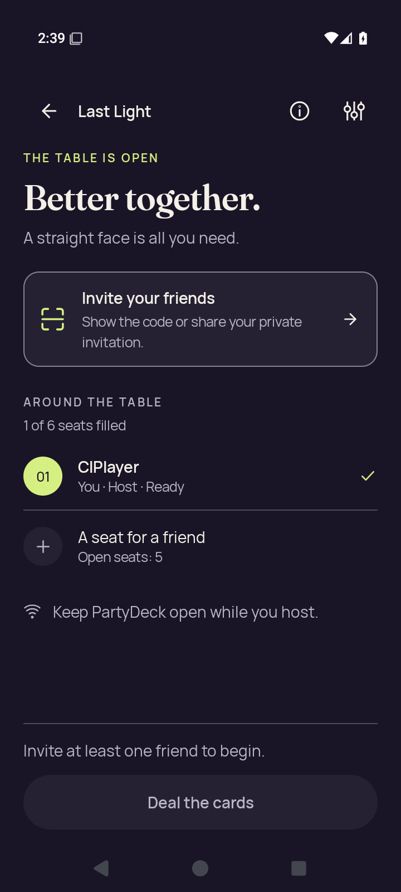</a> | **Native host lobby before opening invitation** Android API 35 emulator, optimized test-signed APK Original: [host-lobby.png](host-lobby.png) 720 × 1600 px; text 1× SHA-256: <code>d89927fb0177cd47241685e277b7c9651ee4c830a7bcbbf2be0b728e598cd84f</code> [Original receipt](smoke-result.json) [Original UI dump](host-lobby.xml) The native host lobby is captured before invitation opening or after invitation/share dismissal. No live invitation credentials are visible. |
|  | **Home after leaving host lobby** Android API 35 emulator, optimized test-signed APK Original: [host-returned-home.png](host-returned-home.png) 720 × 1600 px; text 1× SHA-256: <code>8b78b10c4b68e9f0a9b68ee67a8b4788d4188764533e12e1343936e05c1a9e31</code> [Original receipt](smoke-result.json) [Original UI dump](host-returned-home.xml) |
| <a href="join-invalid.png">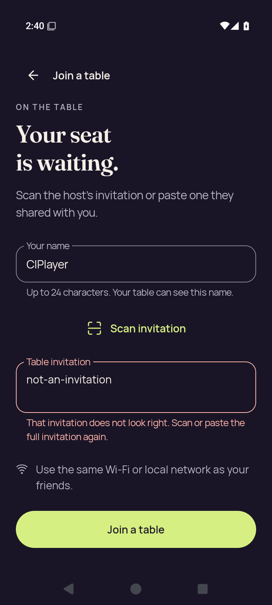</a> | **Join with invalid invitation feedback** Android API 35 emulator, optimized test-signed APK Original: [join-invalid.png](join-invalid.png) 720 × 1600 px; text 1× SHA-256: <code>b7fa73d62a26346b33ab1b17319b0f54155083e0ba3c13393869506ed04cf325</code> [Original receipt](smoke-result.json) [Original UI dump](join-invalid.xml) The rejected input is the literal not-an-invitation; the original flow then edits it and returns Home. |
| <a href="join-name-soft-ime.png">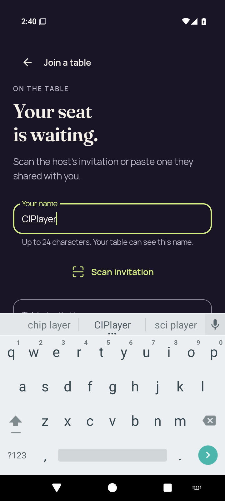</a> | **Join name focused with software keyboard** Android API 35 emulator, optimized test-signed APK Original: [join-name-soft-ime.png](join-name-soft-ime.png) 720 × 1600 px; text 1× SHA-256: <code>d271c75798cf005eef6b173ac7144e03d7eb4a375d6de8f271832d93adf3213b</code> [Original receipt](smoke-result.json) [Original UI dump](join-name-soft-ime.xml) |
| <a href="large-text-home-actions.png">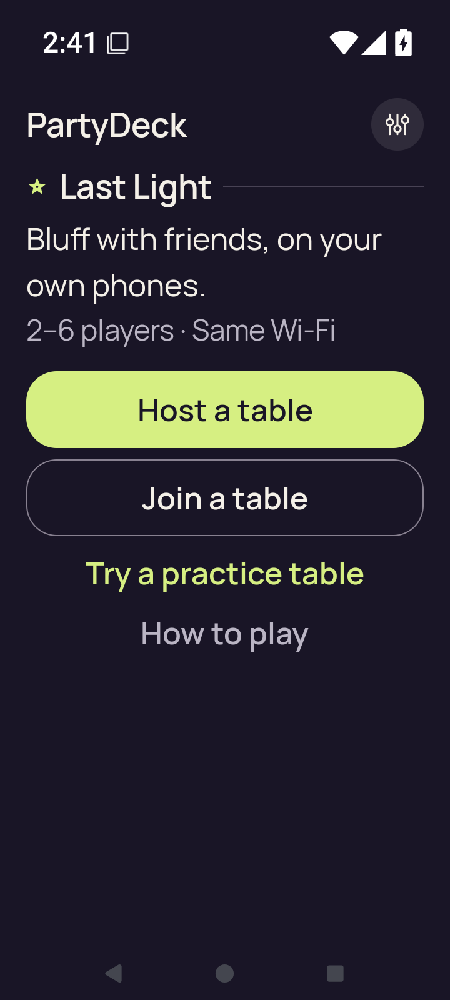</a> | **Home actions at 200% text** Android API 35 emulator, optimized test-signed APK Original: [large-text-home-actions.png](large-text-home-actions.png) 720 × 1600 px; text 2× SHA-256: <code>a67a016ea15f50a0f82fcf60331df3446f3917fec549d3dbb49e7a828263d90f</code> [Original receipt](smoke-result.json) [Original UI dump](large-text-home-actions.xml) |
| <a href="large-text-join-invalid.png">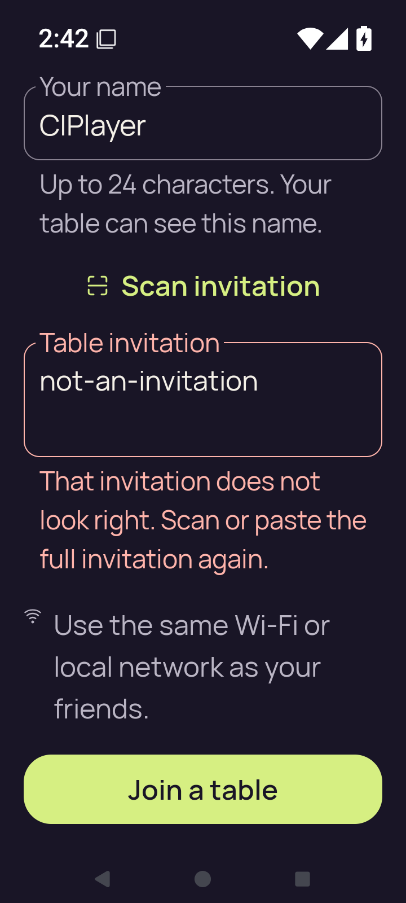</a> | **Join with invalid invitation feedback at 200% text** Android API 35 emulator, optimized test-signed APK Original: [large-text-join-invalid.png](large-text-join-invalid.png) 720 × 1600 px; text 2× SHA-256: <code>1a21206e2153e0de8f0fd4036dbc967ba75957353ac48ff59355a4553f17ffff</code> [Original receipt](smoke-result.json) [Original UI dump](large-text-join-invalid.xml) The rejected input is the literal not-an-invitation; the original flow then edits it and returns Home. |
| <a href="large-text-join-name-soft-ime.png">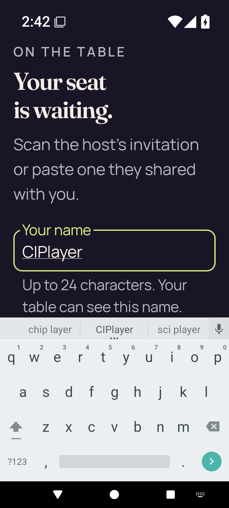</a> | **Join name and software keyboard at 200% text** Android API 35 emulator, optimized test-signed APK Original: [large-text-join-name-soft-ime.png](large-text-join-name-soft-ime.png) 720 × 1600 px; text 2× SHA-256: <code>c1a0b3f052bfe695d5034013d372451418fb8521ab6a1eefd16775311a574d87</code> [Original receipt](smoke-result.json) [Original UI dump](large-text-join-name-soft-ime.xml) |
| <a href="large-text-play-action.png">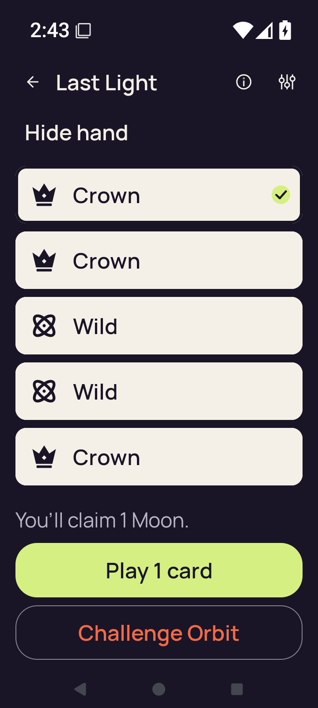</a> | **Claim explanation and Play action at 200% text** Android API 35 emulator, optimized test-signed APK Original: [large-text-play-action.png](large-text-play-action.png) 720 × 1600 px; text 2× SHA-256: <code>8b4e40f4ab1e6d534cf8038f45323c24c7e2bf66a4abaaf0ab9cb7e4663611f6</code> [Original receipt](smoke-result.json) [Original UI dump](large-text-play-action.xml) The enlarged Play action is fully readable after scrolling. The runner verifies reachability here; it does not submit an accepted play at 200% text. |
| <a href="large-text-private-hand.png">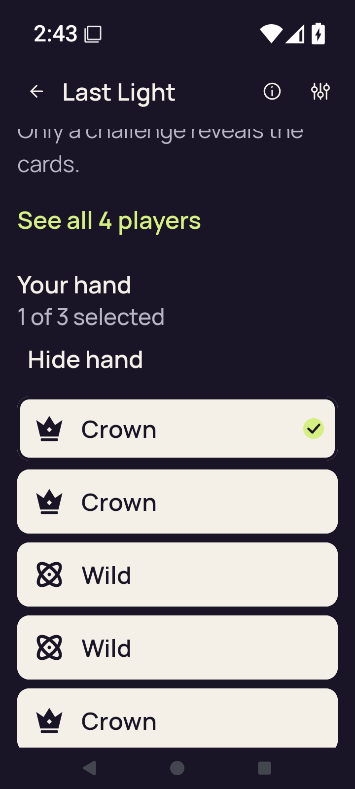</a> | **Revealed private hand and selected card at 200% text** Android API 35 emulator, optimized test-signed APK Original: [large-text-private-hand.png](large-text-private-hand.png) 720 × 1600 px; text 2× SHA-256: <code>694d93aaa8571e31588872d631c02a14dd0222b93cf7b046161c65b472a01b4d</code> [Original receipt](smoke-result.json) [Original UI dump](large-text-private-hand.xml) The hand-focused scroll position is retained separately from the following Play-action position. Enlarged cards form a vertical list. |
| <a href="large-text-rules-intro.png">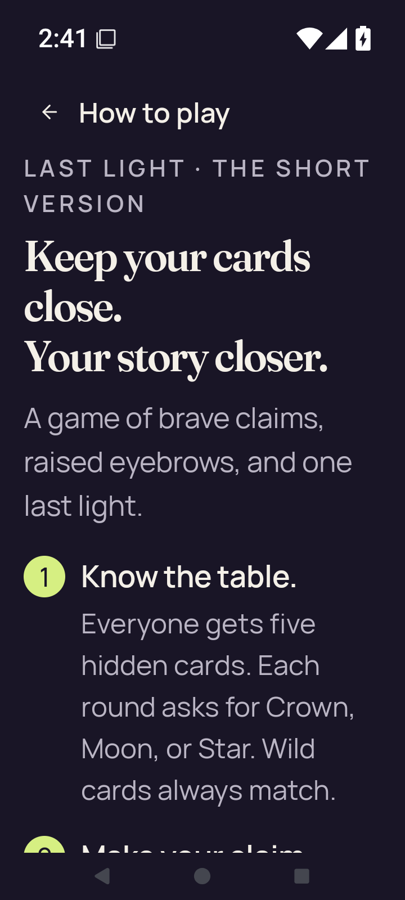</a> | **Rules introduction at 200% text** Android API 35 emulator, optimized test-signed APK Original: [large-text-rules-intro.png](large-text-rules-intro.png) 720 × 1600 px; text 2× SHA-256: <code>833a5dc088fa63f6bde72634dc7d82a45c922c395889f8e80a90eac58451903c</code> [Original receipt](smoke-result.json) [Original UI dump](large-text-rules-intro.xml) |
| <a href="large-text-rules-last-step.png">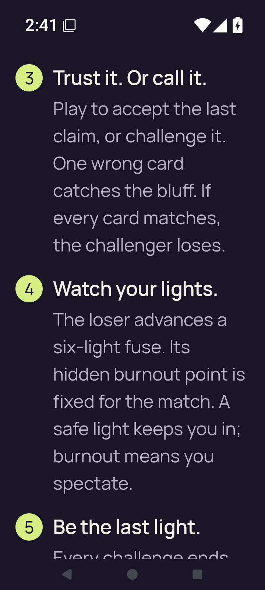</a> | **Rules final-step scroll position at 200% text** Android API 35 emulator, optimized test-signed APK Original: [large-text-rules-last-step.png](large-text-rules-last-step.png) 720 × 1600 px; text 2× SHA-256: <code>b30499d7e8de189e435ed30f990e615bede7e52debc9b13b3f72678b6aaa7588</code> [Original receipt](smoke-result.json) [Original UI dump](large-text-rules-last-step.xml) |
| <a href="large-text-rules-practice-action.png">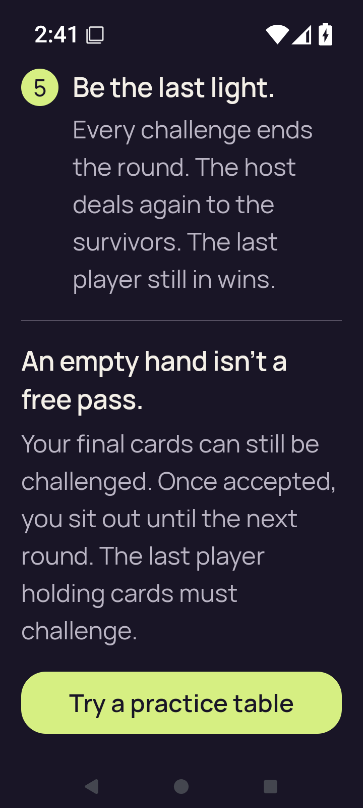</a> | **Rules final rule and Practice action at 200% text** Android API 35 emulator, optimized test-signed APK Original: [large-text-rules-practice-action.png](large-text-rules-practice-action.png) 720 × 1600 px; text 2× SHA-256: <code>9fd66a200a370293b9fb9c8f3cc67b061102cca970f7a2c34f6473dcc71ede6a</code> [Original receipt](smoke-result.json) [Original UI dump](large-text-rules-practice-action.xml) The actual Rules action is tapped at (360, 1391); its original input trace and following game/Home captures confirm direct entry and confirmed leave. The complete label and rounded button border are visible at this captured position. |
| <a href="large-text-rules-practice-entered.png">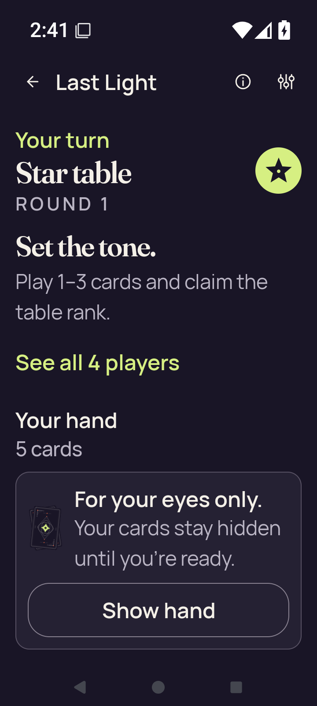</a> | **Practice entered directly from Rules at 200% text** Android API 35 emulator, optimized test-signed APK Original: [large-text-rules-practice-entered.png](large-text-rules-practice-entered.png) 720 × 1600 px; text 2× SHA-256: <code>ac6b3b1c3869121f732a72b78dc6e29b28e4cb2bdcc614707e78e9459267b227</code> [Original receipt](smoke-result.json) [Original UI dump](large-text-rules-practice-entered.xml) The Star table starts with the own five-card hand concealed; the enlarged Show hand control is visible. |
| <a href="large-text-rules-returned-home.png">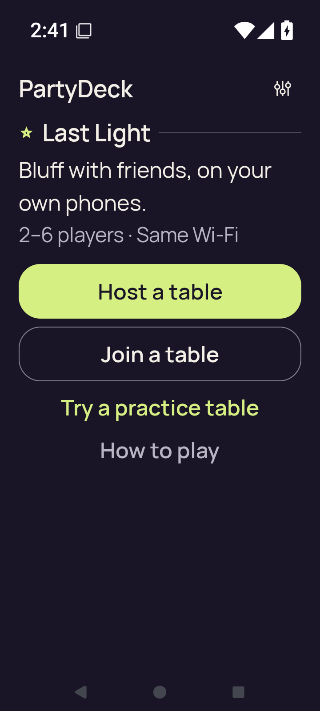</a> | **Home after confirming leave from Rules-started Practice at 200% text** Android API 35 emulator, optimized test-signed APK Original: [large-text-rules-returned-home.png](large-text-rules-returned-home.png) 720 × 1600 px; text 2× SHA-256: <code>2e451724bcc59548584d012094f853ab04f893950362c620b74e1c9bb98a3c90</code> [Original receipt](smoke-result.json) [Original UI dump](large-text-rules-returned-home.xml) |
| <a href="large-text-settings.png">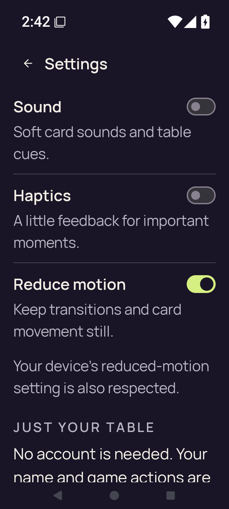</a> | **Settings at 200% text** Android API 35 emulator, optimized test-signed APK Original: [large-text-settings.png](large-text-settings.png) 720 × 1600 px; text 2× SHA-256: <code>541ed7c4b77b256b6adf11168c4f3e2b4b69d991d28732aeb6cee6242e83c72f</code> [Original receipt](smoke-result.json) [Original UI dump](large-text-settings.xml) |
| <a href="practice-after-play.png">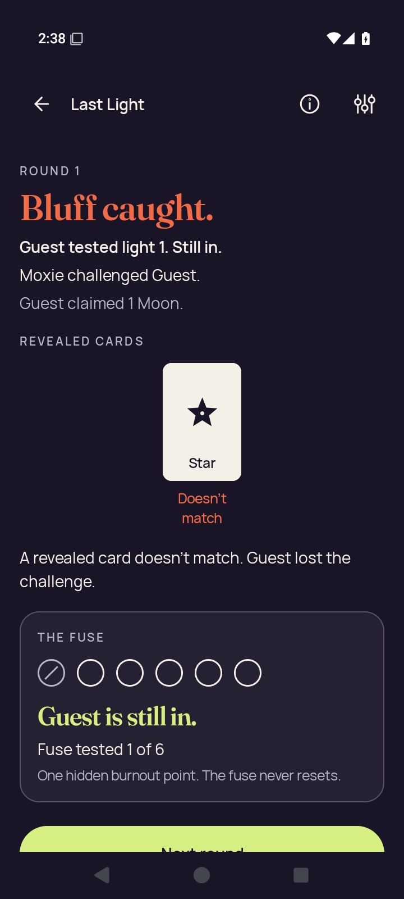</a> | **Practice result after Moxie catches Guest’s Moon bluff** Android API 35 emulator, optimized test-signed APK Original: [practice-after-play.png](practice-after-play.png) 720 × 1600 px; text 1× SHA-256: <code>597886a41abc502349258823f24ae4c1bed25c99eefe3b53afe16615bbc3798b</code> [Original receipt](smoke-result.json) [Original UI dump](practice-after-play.xml) Guest claimed one Moon; the public Star does not match. Guest used light 1 and remains in. Next round is partly clipped at the captured position; label bounds [286,1500,434,1516]. |
| <a href="practice-concealed.png">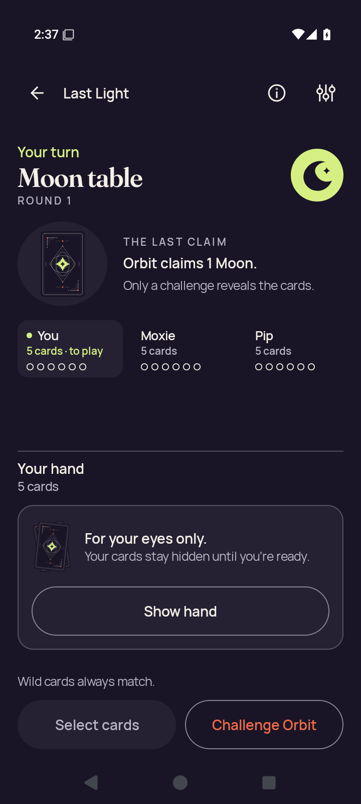</a> | **Practice with concealed hand** Android API 35 emulator, optimized test-signed APK Original: [practice-concealed.png](practice-concealed.png) 720 × 1600 px; text 1× SHA-256: <code>78d55ac602d8066eb25e27a7f3ac08e528da1d41be6020989b36a7985db5f8fa</code> [Original receipt](smoke-result.json) [Original UI dump](practice-concealed.xml) |
|  | **Practice concealed after app resumes** Android API 35 emulator, optimized test-signed APK Original: [practice-resumed-concealed.png](practice-resumed-concealed.png) 720 × 1600 px; text 1× SHA-256: <code>f07252d9a5b1096320065243b290989e7f8bc70f7ce51209595e35f459a2c960</code> [Original receipt](smoke-result.json) [Original UI dump](practice-resumed-concealed.xml) |
|  | **Home after leaving Practice** Android API 35 emulator, optimized test-signed APK Original: [practice-returned-home.png](practice-returned-home.png) 720 × 1600 px; text 1× SHA-256: <code>9e0cbc6855a110caee2f1e3469d680c1f081868235faf8f3c73f84a4813f897c</code> [Original receipt](smoke-result.json) [Original UI dump](practice-returned-home.xml) |
| <a href="practice-selected.png">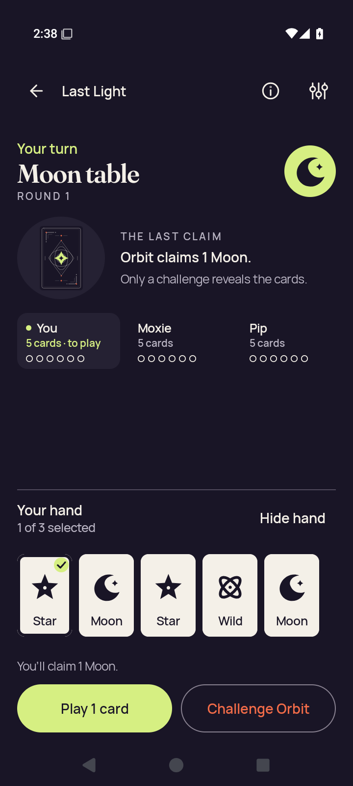</a> | **Practice with a selected card** Android API 35 emulator, optimized test-signed APK Original: [practice-selected.png](practice-selected.png) 720 × 1600 px; text 1× SHA-256: <code>94b5c82e7476cf09759e03340d7e55ee15c1470a831ee27cc1a03cbfd47362a6</code> [Original receipt](smoke-result.json) [Original UI dump](practice-selected.xml) Selected Star for a one-card Moon claim. |
| <a href="rules-intro.png">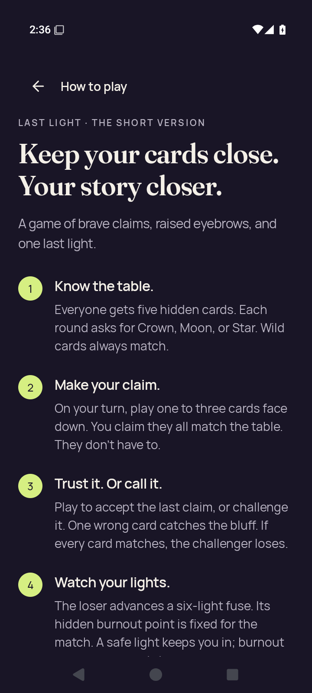</a> | **Rules introduction** Android API 35 emulator, optimized test-signed APK Original: [rules-intro.png](rules-intro.png) 720 × 1600 px; text 1× SHA-256: <code>a4cf234e64f19eda07d021bbb36643fb16ff13422c00239a8ea1fa60ed5404af</code> [Original receipt](smoke-result.json) [Original UI dump](rules-intro.xml) |
| <a href="rules-last-step.png">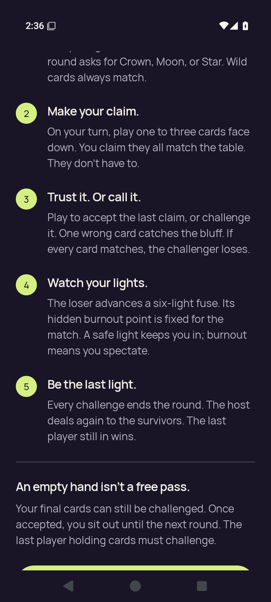</a> | **Rules final-step scroll position** Android API 35 emulator, optimized test-signed APK Original: [rules-last-step.png](rules-last-step.png) 720 × 1600 px; text 1× SHA-256: <code>b079ccbed6df70b62f414e4f2949c88e4be1bab5d5b73da99c2df73bfcbb13ec</code> [Original receipt](smoke-result.json) [Original UI dump](rules-last-step.xml) |
| <a href="rules-practice-action.png">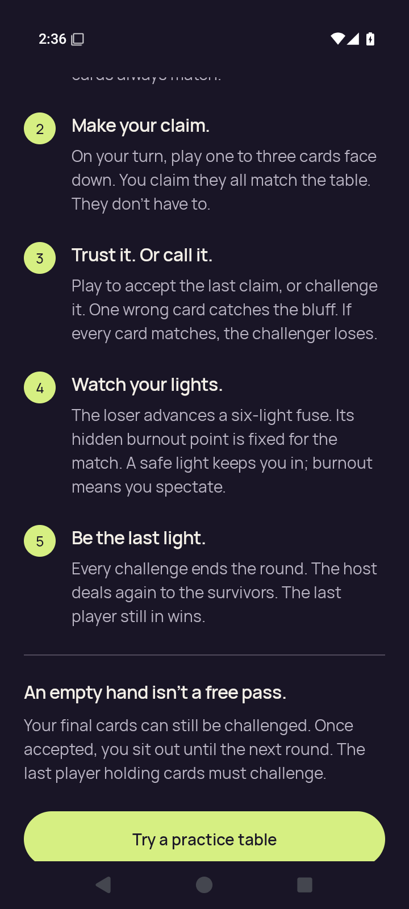</a> | **Rules final rule and Practice action** Android API 35 emulator, optimized test-signed APK Original: [rules-practice-action.png](rules-practice-action.png) 720 × 1600 px; text 1× SHA-256: <code>73cf85aa46724260608f9427b35bdda9a168c3e3af55136d2dd30bb3509c211c</code> [Original receipt](smoke-result.json) [Original UI dump](rules-practice-action.xml) The actual Rules action is tapped at (360, 1472); its original input trace and following game/Home captures confirm direct entry and confirmed leave. Residual visual limit: the label is fully readable, but the rounded bottom border is clipped at y=1516. Reported action bounds [42,1428,678,1516] are 88 pixels high, versus 98 in the normal debug reference; about ten bottom pixels are missing. |
| <a href="rules-practice-entered.png">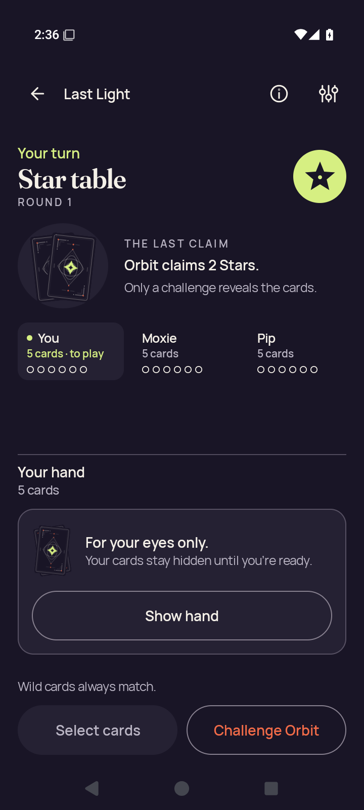</a> | **Practice entered directly from the Rules action** Android API 35 emulator, optimized test-signed APK Original: [rules-practice-entered.png](rules-practice-entered.png) 720 × 1600 px; text 1× SHA-256: <code>5eea8c998b85839b83135a01622e8fc20eda0f4c1bd0e14bea8809f1d1faba89</code> [Original receipt](smoke-result.json) [Original UI dump](rules-practice-entered.xml) The Star table is active with the own hand concealed and Orbit’s two-Star claim visible. |
|  | **Home after confirming leave from Rules-started Practice** Android API 35 emulator, optimized test-signed APK Original: [rules-returned-home.png](rules-returned-home.png) 720 × 1600 px; text 1× SHA-256: <code>9f93c4cd9f90786f9ddb0d48570e93d871d58f07f2cf98605e3dd0009adef912</code> [Original receipt](smoke-result.json) [Original UI dump](rules-returned-home.xml) |
|  | **Settings after changing all three preferences** Android API 35 emulator, optimized test-signed APK Original: [settings-changed.png](settings-changed.png) 720 × 1600 px; text 1× SHA-256: <code>f1b3beffb36da1968e0d6160e3dc09d954d219cc07600900ac9092d05b7aace1</code> [Original receipt](smoke-result.json) [Original UI dump](settings-changed.xml) |
| <a href="settings-persisted.png">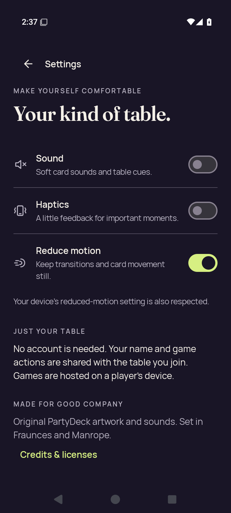</a> | **Settings after process restart** Android API 35 emulator, optimized test-signed APK Original: [settings-persisted.png](settings-persisted.png) 720 × 1600 px; text 1× SHA-256: <code>359227da1b09cba6c8d69aaa52068138c353b959b983d5ea2c2ad5bdffd76cf7</code> [Original receipt](smoke-result.json) [Original UI dump](settings-persisted.xml) |
| <a href="settings-return-home.png">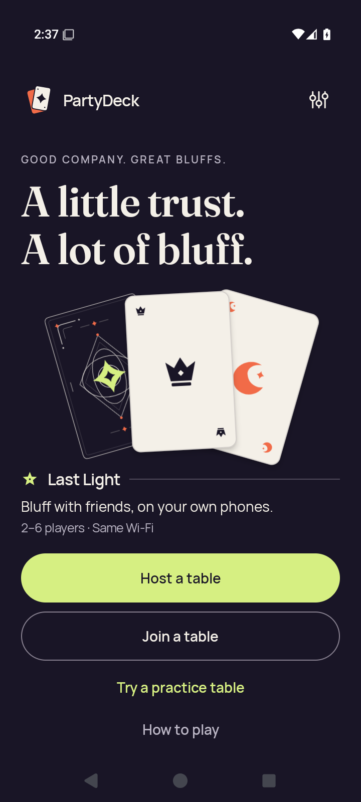</a> | **Home after closing Settings** Android API 35 emulator, optimized test-signed APK Original: [settings-return-home.png](settings-return-home.png) 720 × 1600 px; text 1× SHA-256: <code>66a112335bd18af69cf742eef4ee9e9d6d54a9f0b86b485987f8408c20d8340f</code> [Original receipt](smoke-result.json) [Original UI dump](settings-return-home.xml) |
