# Android debug — Rules recapture, CI 34432935952

[All screenshot collections](../../README.md) · [Both Android variants](../README.md)

**Evidence status:** Full exercised smoke flow passes. Actual Rules → Practice → confirmed leave/Home passes at 100% and 200%; both dedicated Rules action captures show complete labels/borders with 63 pixels of lower clearance. Result content can still continue below the initial viewport.

Actual Android API 35 emulator, 720 × 1600 pixels at 280 dpi (approximately 411 × 914 dp), with three-button navigation. Standard text is 1.0; large-text captures and final diagnostic Home use 2.0. Exact CI revision: `8d8d429186bfa3fc895b943101a24c7aeb992163`. Executed APK SHA-256: `6d5d798aa3ebc4a63442c2766ecc4974d1b34b2301db7eceb0341cd4a151c8c0`, independently recomputed from the downloaded package.

[Original smoke result](smoke-result.json) · [Original input trace](input-geometry.log) · [Display size](display-size.log) · [Density](display-density.log) · [Original runtime outcomes](../runtime-variants.json).

All four Rules actions across both APKs have complete labels and rounded borders. Their lower edges end at y=1453, 63 pixels above the viewport edge at y=1516. Exact XML bounds, original tap coordinates and subsequent game/Home captures independently verify the actual Rules → Practice → confirmed leave route. This resolves the [earlier optimized normal Rules border clipping](../../android-34428798269/optimized-test-signed/README.md) within this recapture. Intermediate scroll positions and later game results retain their own limits; the optimized normal Rules-entered result still places most of Next round below the viewport.

The [exact capture script](https://github.com/Apdelrahman1911/PartyDeck/blob/8d8d429186bfa3fc895b943101a24c7aeb992163/scripts/smoke-android-ui.py) also exercises preference persistence through process restart, normal-text Practice reveal/select/hide/background concealment and an accepted one-card play, host/invitation/copy/share cancellation, host teardown and invalid Join recovery. The enlarged Play action is scrolled into view without submitting a 200% play. The optimized package uses a [disposable CI test key](../packages/runtime-package.json).

All 31 PNGs remain original: 30 named stages plus final Home. Every paired XML was parsed and screened. The runner refuses screenshots while its live-invitation/share flag is set; host images precede invitation opening or follow dismissal. Invalid input is the literal `not-an-invitation`. The pre-install Launcher image is separately excluded with full metadata; no retained image is edited or recompressed.

[CI artifact metadata](../provenance/artifacts.json) · [Job metadata](../provenance/last-job-status.json) · [Later reviewer Rules audit](../provenance/rules-cta-evidence-summary.json) · [Later downloaded-artifact audit](../provenance/evidence-summary.json). These two audits were produced after downloading the originals, not by the CI runner. Source: `/tmp/partydeck-engine-ci/34432935952/android-jvm-reports/build/ci/android/debug`.

| Original image | Scenario and provenance |
| --- | --- |
| <a href="final-screen.png">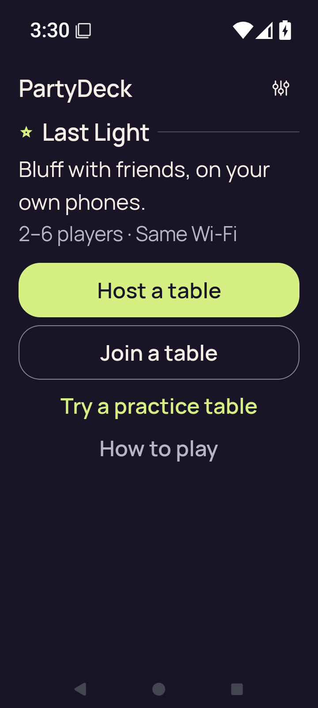</a> | **Home after the completed smoke flow at 200% text** Android API 35 emulator, debug APK Original: [final-screen.png](final-screen.png) 720 × 1600 px; text 2× SHA-256: <code>3ef857f141e8b59071e317f1b4328df6355c2da330975e7329d4afa513b50f04</code> [Original receipt](smoke-result.json) [Original UI dump](last-ui.xml) Final successful Home at 200% text after the complete exercised flow. This diagnostic original is additional to the receipt’s 30 named stage captures. |
|  | **Home** Android API 35 emulator, debug APK Original: [home.png](home.png) 720 × 1600 px; text 1× SHA-256: <code>19fbfad8d0d5b93b9ee06d5edc246d2a3967e90bec62ed63bfd63020b0671c7c</code> [Original receipt](smoke-result.json) [Original UI dump](home.xml) |
|  | **Host lobby after closing invitation and share surfaces** Android API 35 emulator, debug APK Original: [host-after-share.png](host-after-share.png) 720 × 1600 px; text 1× SHA-256: <code>26ba3084fdb294dd94d7784e1394c842a8b8f5ca7f9d24d92c095c437b5493d2</code> [Original receipt](smoke-result.json) [Original UI dump](host-after-share.xml) Native host lobby before invitation opening or after invitation/share dismissal. No live QR, URI or admission credentials are shown. |
| <a href="host-lobby.png">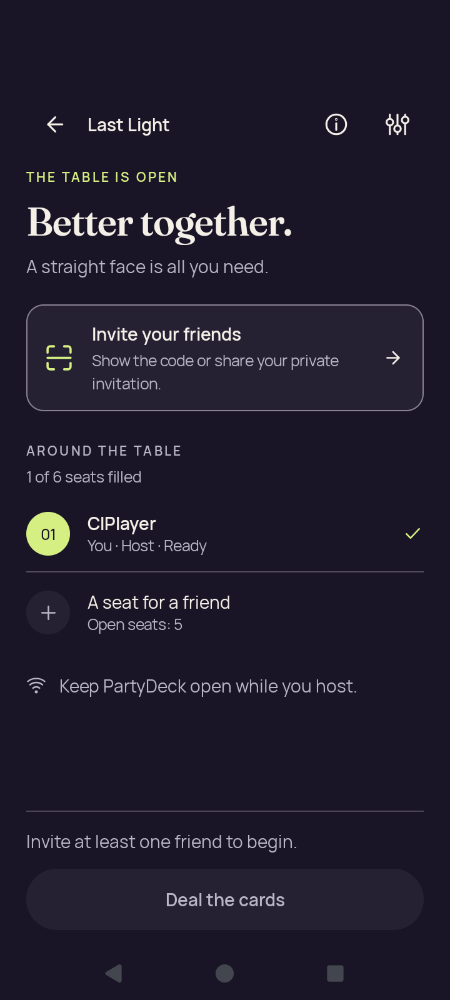</a> | **Native host lobby before opening invitation** Android API 35 emulator, debug APK Original: [host-lobby.png](host-lobby.png) 720 × 1600 px; text 1× SHA-256: <code>26ba3084fdb294dd94d7784e1394c842a8b8f5ca7f9d24d92c095c437b5493d2</code> [Original receipt](smoke-result.json) [Original UI dump](host-lobby.xml) Native host lobby before invitation opening or after invitation/share dismissal. No live QR, URI or admission credentials are shown. |
|  | **Home after leaving host lobby** Android API 35 emulator, debug APK Original: [host-returned-home.png](host-returned-home.png) 720 × 1600 px; text 1× SHA-256: <code>19fbfad8d0d5b93b9ee06d5edc246d2a3967e90bec62ed63bfd63020b0671c7c</code> [Original receipt](smoke-result.json) [Original UI dump](host-returned-home.xml) |
|  | **Join with invalid invitation feedback** Android API 35 emulator, debug APK Original: [join-invalid.png](join-invalid.png) 720 × 1600 px; text 1× SHA-256: <code>34465ad4e7fd80c856e310b8529a0df9afcc5557bfc4de071e2704bfe8ec3a7f</code> [Original receipt](smoke-result.json) [Original UI dump](join-invalid.xml) The invalid fixture is not-an-invitation. The runner subsequently edits it and returns Home. |
| <a href="join-name-soft-ime.png">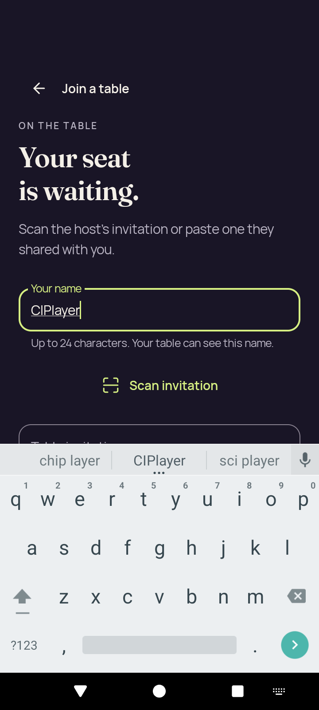</a> | **Join name focused with software keyboard** Android API 35 emulator, debug APK Original: [join-name-soft-ime.png](join-name-soft-ime.png) 720 × 1600 px; text 1× SHA-256: <code>21ddcba0deaee49cfa5d20df198c3fe77bc46a9bc3b436ac3a9d58be8718ee87</code> [Original receipt](smoke-result.json) [Original UI dump](join-name-soft-ime.xml) |
| <a href="large-text-home-actions.png">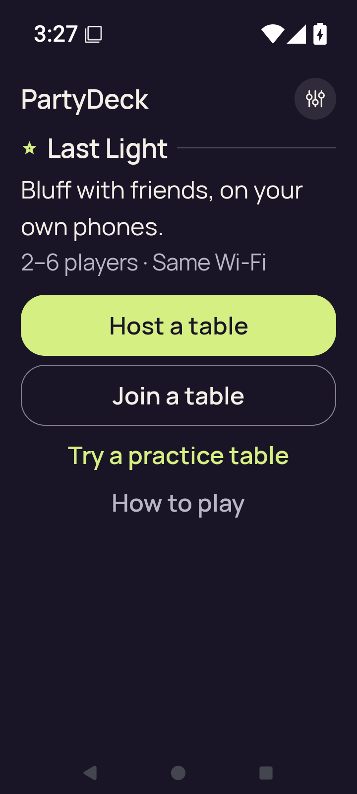</a> | **Home actions at 200% text** Android API 35 emulator, debug APK Original: [large-text-home-actions.png](large-text-home-actions.png) 720 × 1600 px; text 2× SHA-256: <code>ebb83cd8886a1ac6643c02e78a2c82f197a8054b3595e8b190d6bc6d1463d996</code> [Original receipt](smoke-result.json) [Original UI dump](large-text-home-actions.xml) |
| <a href="large-text-join-invalid.png">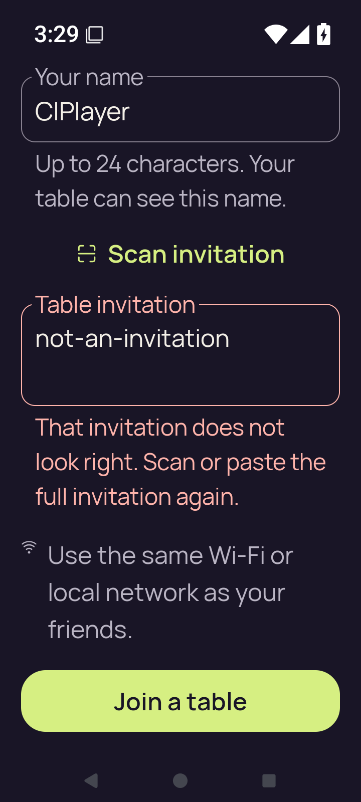</a> | **Join with invalid invitation feedback at 200% text** Android API 35 emulator, debug APK Original: [large-text-join-invalid.png](large-text-join-invalid.png) 720 × 1600 px; text 2× SHA-256: <code>55875c91785c4615ecb0b2d83e78e11f72da10ed84266cafa3876640fec4a13b</code> [Original receipt](smoke-result.json) [Original UI dump](large-text-join-invalid.xml) The invalid fixture is not-an-invitation. The runner subsequently edits it and returns Home. |
| <a href="large-text-join-name-soft-ime.png">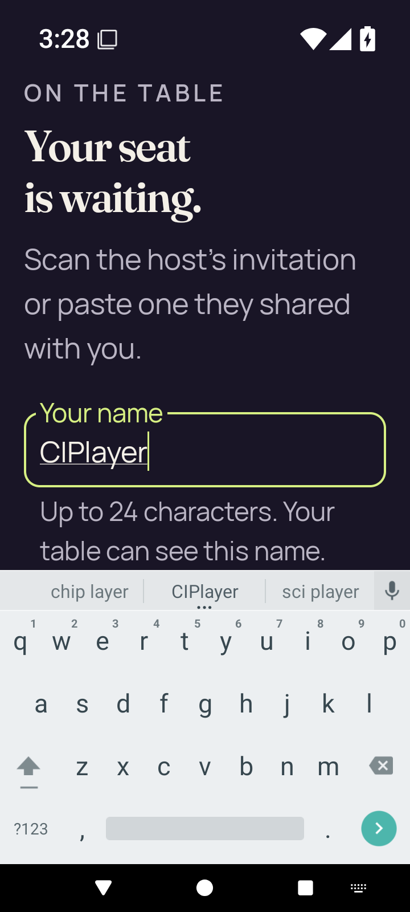</a> | **Join name and software keyboard at 200% text** Android API 35 emulator, debug APK Original: [large-text-join-name-soft-ime.png](large-text-join-name-soft-ime.png) 720 × 1600 px; text 2× SHA-256: <code>f0092d82836bdea56ee2fe1a7bf1d12221b199cc2b0211e785f51c313f8cfc5b</code> [Original receipt](smoke-result.json) [Original UI dump](large-text-join-name-soft-ime.xml) |
| <a href="large-text-play-action.png">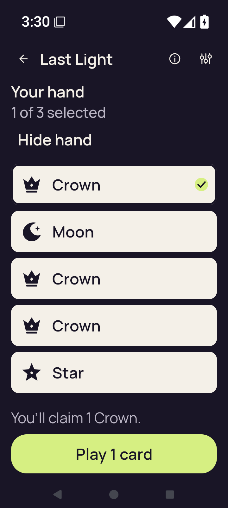</a> | **Claim explanation and Play action at 200% text** Android API 35 emulator, debug APK Original: [large-text-play-action.png](large-text-play-action.png) 720 × 1600 px; text 2× SHA-256: <code>734a6c4b6592e9a4afcde7e231894bf1b75ac1d2932c29ec710f545190d02aeb</code> [Original receipt](smoke-result.json) [Original UI dump](large-text-play-action.xml) Play 1 card is completely visible after scrolling. This 200% step checks reachability; no accepted play is submitted at the enlarged scale. |
| <a href="large-text-private-hand.png">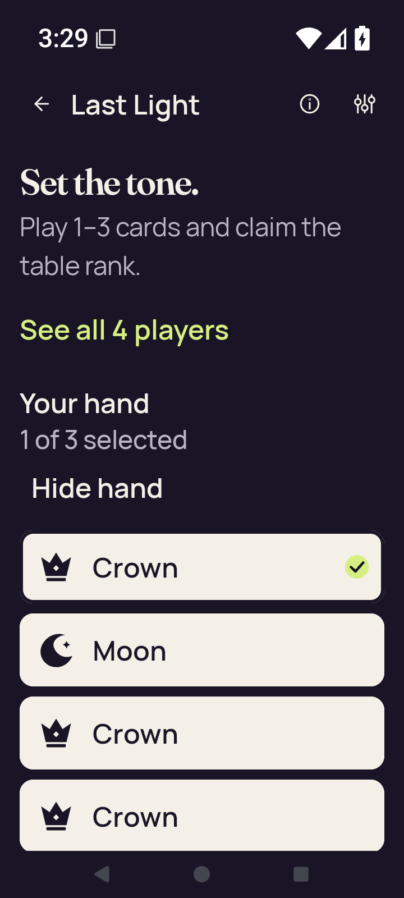</a> | **Revealed private hand and selected card at 200% text** Android API 35 emulator, debug APK Original: [large-text-private-hand.png](large-text-private-hand.png) 720 × 1600 px; text 2× SHA-256: <code>1a94e80de24378d829c489a89f984051c604abf9e71016b8bf80908f21f42652</code> [Original receipt](smoke-result.json) [Original UI dump](large-text-private-hand.xml) Own cards form an enlarged vertical list. This hand-focused position is retained separately from the following Play-action capture. |
| <a href="large-text-rules-intro.png">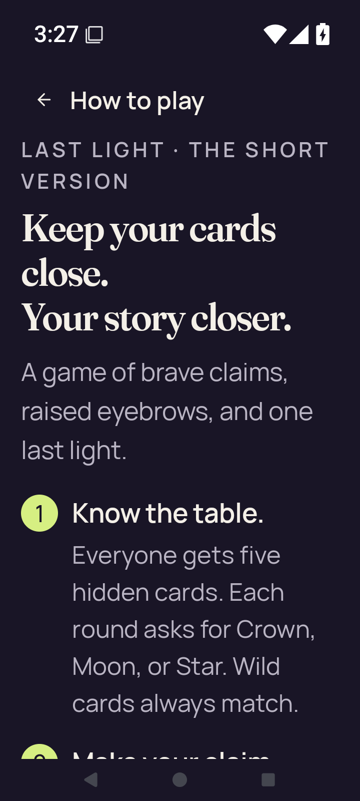</a> | **Rules introduction at 200% text** Android API 35 emulator, debug APK Original: [large-text-rules-intro.png](large-text-rules-intro.png) 720 × 1600 px; text 2× SHA-256: <code>01d362f0aed05d4f82ef428d6d76e73e00dd91a7c737d227c08bdb7f772c7e16</code> [Original receipt](smoke-result.json) [Original UI dump](large-text-rules-intro.xml) |
| <a href="large-text-rules-last-step.png">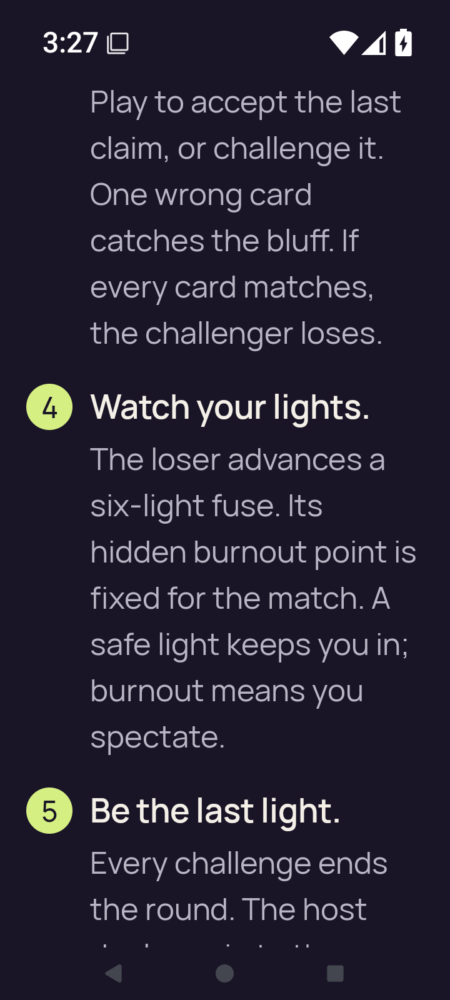</a> | **Rules final-step scroll position at 200% text** Android API 35 emulator, debug APK Original: [large-text-rules-last-step.png](large-text-rules-last-step.png) 720 × 1600 px; text 2× SHA-256: <code>820794855fcf0f7f15c8276618c2f06a5017445d130e0a9bcc04580655a990d3</code> [Original receipt](smoke-result.json) [Original UI dump](large-text-rules-last-step.xml) |
| <a href="large-text-rules-practice-action.png">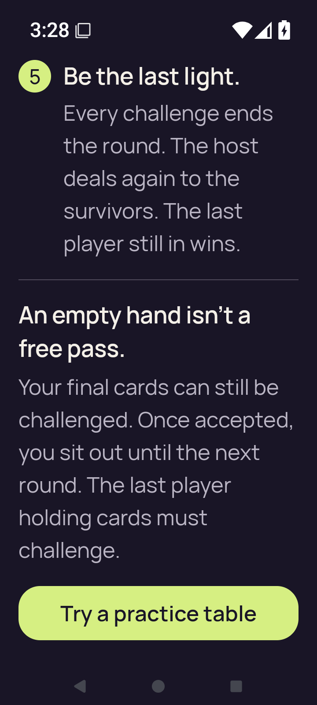</a> | **Rules final rule and Practice action at 200% text** Android API 35 emulator, debug APK Original: [large-text-rules-practice-action.png](large-text-rules-practice-action.png) 720 × 1600 px; text 2× SHA-256: <code>269fc3f7713806e12d02074187b6676fa8021a255eec432744352a88ba568620</code> [Original receipt](smoke-result.json) [Original UI dump](large-text-rules-practice-action.xml) The complete label and rounded border are visible. The action ends at y=1453 inside a viewport ending at y=1516: 63 pixels of clearance. Actual tap (360, 1391) is followed by captured Practice entry and confirmed leave/Home. |
| <a href="large-text-rules-practice-entered.png">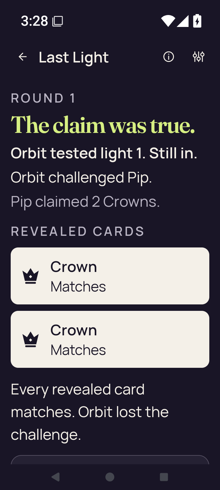</a> | **Practice entered directly from Rules at 200% text** Android API 35 emulator, debug APK Original: [large-text-rules-practice-entered.png](large-text-rules-practice-entered.png) 720 × 1600 px; text 2× SHA-256: <code>af93581a73457fa950c87f23f29132d680f9ab18bd979e8a25110e6124184d67</code> [Original receipt](smoke-result.json) [Original UI dump](large-text-rules-practice-entered.xml) The game already shows Orbit losing a challenge to Pip’s two-Crown claim; both public Crowns match. Orbit used light 1 and remains in. Further result content and actions continue below the viewport. |
|  | **Home after confirming leave from Rules-started Practice at 200% text** Android API 35 emulator, debug APK Original: [large-text-rules-returned-home.png](large-text-rules-returned-home.png) 720 × 1600 px; text 2× SHA-256: <code>0b13ad538bf06f396315fdb5016693ff306da0a43c1c7bc714d159011935d89d</code> [Original receipt](smoke-result.json) [Original UI dump](large-text-rules-returned-home.xml) |
| <a href="large-text-settings.png">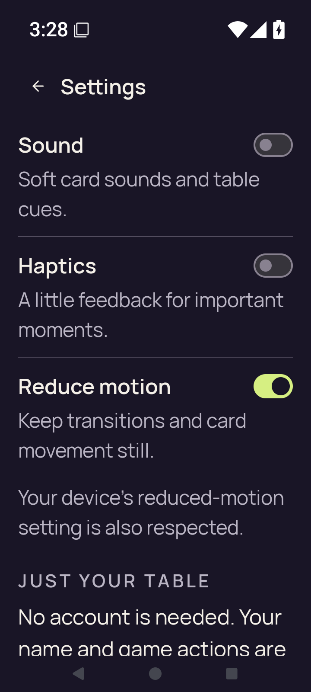</a> | **Settings at 200% text** Android API 35 emulator, debug APK Original: [large-text-settings.png](large-text-settings.png) 720 × 1600 px; text 2× SHA-256: <code>ab72da630a764979a229b255c18e95fab708d43701f2e74311235c26c834b394</code> [Original receipt](smoke-result.json) [Original UI dump](large-text-settings.xml) |
| <a href="practice-after-play.png">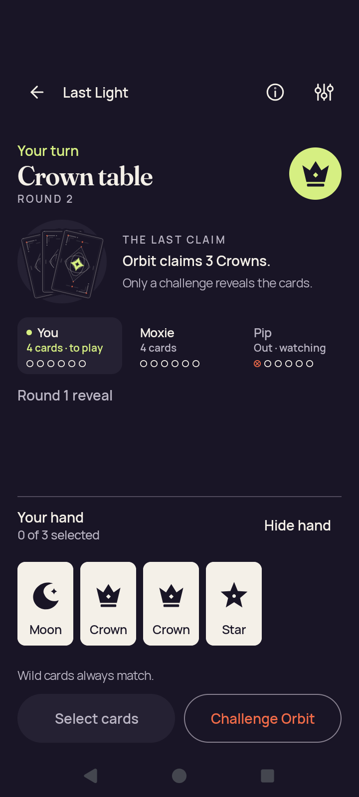</a> | **Practice continues after an accepted one-card play; four cards remain** Android API 35 emulator, debug APK Original: [practice-after-play.png](practice-after-play.png) 720 × 1600 px; text 1× SHA-256: <code>18598c085dce197ae494902f86608f20ea79ec0a7dcd9fc6dfe47dcf9b5a07d1</code> [Original receipt](smoke-result.json) [Original UI dump](practice-after-play.xml) The original receipt records the hand decreasing by one. This is continuing round 2 on the Crown table, with four own cards and Orbit’s three-Crown claim; it is not a round-result screen. |
| <a href="practice-concealed.png">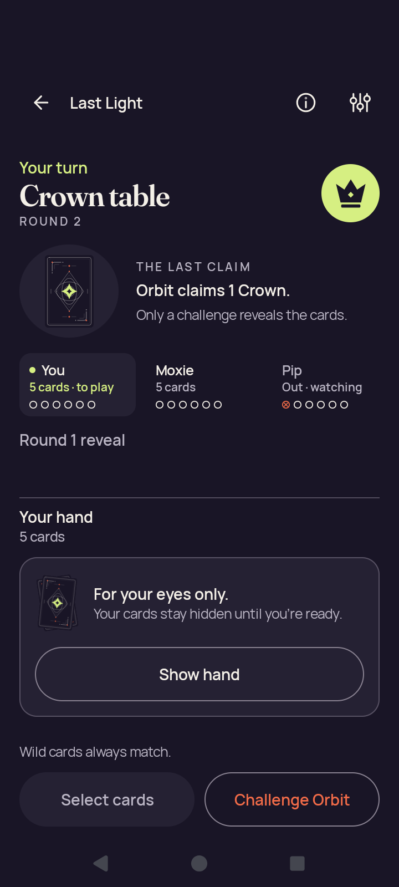</a> | **Practice with concealed hand** Android API 35 emulator, debug APK Original: [practice-concealed.png](practice-concealed.png) 720 × 1600 px; text 1× SHA-256: <code>984de6bc4fdd2cef27e2ee6e46dfdfe5212651e683c866b0591da68ff5597097</code> [Original receipt](smoke-result.json) [Original UI dump](practice-concealed.xml) |
|  | **Practice concealed after app resumes** Android API 35 emulator, debug APK Original: [practice-resumed-concealed.png](practice-resumed-concealed.png) 720 × 1600 px; text 1× SHA-256: <code>984de6bc4fdd2cef27e2ee6e46dfdfe5212651e683c866b0591da68ff5597097</code> [Original receipt](smoke-result.json) [Original UI dump](practice-resumed-concealed.xml) |
|  | **Home after leaving Practice** Android API 35 emulator, debug APK Original: [practice-returned-home.png](practice-returned-home.png) 720 × 1600 px; text 1× SHA-256: <code>19fbfad8d0d5b93b9ee06d5edc246d2a3967e90bec62ed63bfd63020b0671c7c</code> [Original receipt](smoke-result.json) [Original UI dump](practice-returned-home.xml) |
| <a href="practice-selected.png">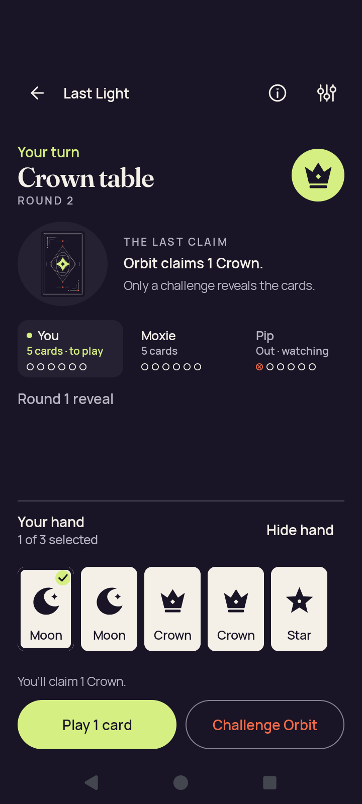</a> | **Practice with a selected card** Android API 35 emulator, debug APK Original: [practice-selected.png](practice-selected.png) 720 × 1600 px; text 1× SHA-256: <code>19250306bee0f6fdc11c6834483f3391ddac9faf3256a36f84b125daa18afb4d</code> [Original receipt](smoke-result.json) [Original UI dump](practice-selected.xml) Selected Moon for a one-card Crown claim in round 2. |
|  | **Rules introduction** Android API 35 emulator, debug APK Original: [rules-intro.png](rules-intro.png) 720 × 1600 px; text 1× SHA-256: <code>f653c9b7e52c935e1993adeb056a6fb613b32572d0254b3486d36245adf059b1</code> [Original receipt](smoke-result.json) [Original UI dump](rules-intro.xml) |
| <a href="rules-last-step.png">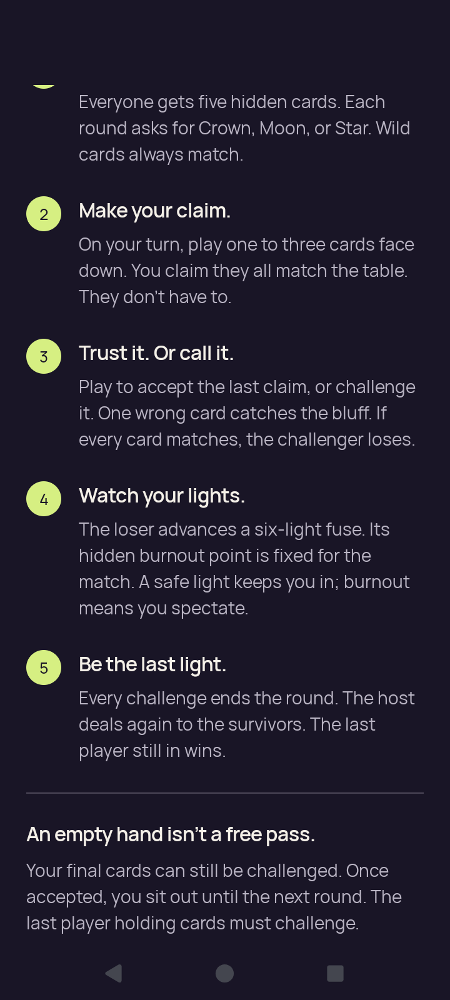</a> | **Rules final-step scroll position** Android API 35 emulator, debug APK Original: [rules-last-step.png](rules-last-step.png) 720 × 1600 px; text 1× SHA-256: <code>9671377d47b99cd341b49fed978b14f5f40c01b2db59efcf61877b0eb339a818</code> [Original receipt](smoke-result.json) [Original UI dump](rules-last-step.xml) |
| <a href="rules-practice-action.png">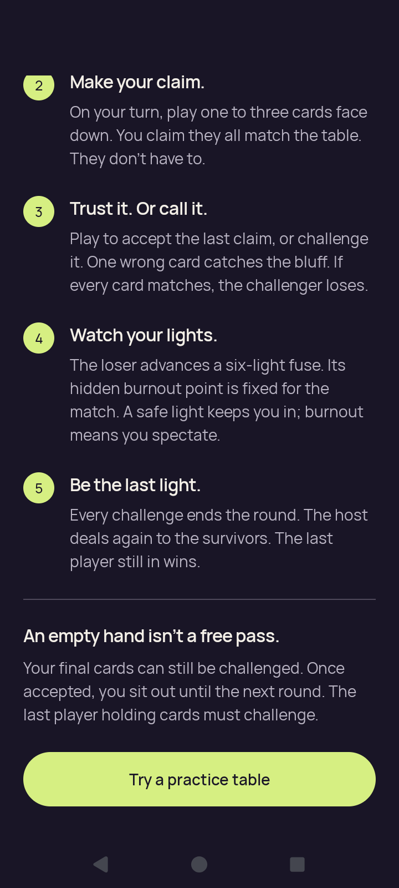</a> | **Rules final rule and Practice action** Android API 35 emulator, debug APK Original: [rules-practice-action.png](rules-practice-action.png) 720 × 1600 px; text 1× SHA-256: <code>014fb3d0da6f3f8ca679ffd0f99a3d0f49bff0797fe120ccd7337ec9bca19057</code> [Original receipt](smoke-result.json) [Original UI dump](rules-practice-action.xml) The complete label and rounded border are visible. The action ends at y=1453 inside a viewport ending at y=1516: 63 pixels of clearance. Actual tap (360, 1404) is followed by captured Practice entry and confirmed leave/Home. |
|  | **Practice entered directly from the Rules action** Android API 35 emulator, debug APK Original: [rules-practice-entered.png](rules-practice-entered.png) 720 × 1600 px; text 1× SHA-256: <code>2d291bed68621b2295e76761c9719910ccd45d1e774786ce2092b4f12cc6fe31</code> [Original receipt](smoke-result.json) [Original UI dump](rules-practice-entered.xml) The Star table starts with five own cards concealed and no prior claim. |
|  | **Home after confirming leave from Rules-started Practice** Android API 35 emulator, debug APK Original: [rules-returned-home.png](rules-returned-home.png) 720 × 1600 px; text 1× SHA-256: <code>19fbfad8d0d5b93b9ee06d5edc246d2a3967e90bec62ed63bfd63020b0671c7c</code> [Original receipt](smoke-result.json) [Original UI dump](rules-returned-home.xml) |
|  | **Settings after changing all three preferences** Android API 35 emulator, debug APK Original: [settings-changed.png](settings-changed.png) 720 × 1600 px; text 1× SHA-256: <code>312d72f0b7e2f74c2181dddfa0bdca4b2de0dc5c886248d53f07ce4de824aeb1</code> [Original receipt](smoke-result.json) [Original UI dump](settings-changed.xml) |
|  | **Settings after process restart** Android API 35 emulator, debug APK Original: [settings-persisted.png](settings-persisted.png) 720 × 1600 px; text 1× SHA-256: <code>312d72f0b7e2f74c2181dddfa0bdca4b2de0dc5c886248d53f07ce4de824aeb1</code> [Original receipt](smoke-result.json) [Original UI dump](settings-persisted.xml) |
|  | **Home after closing Settings** Android API 35 emulator, debug APK Original: [settings-return-home.png](settings-return-home.png) 720 × 1600 px; text 1× SHA-256: <code>19fbfad8d0d5b93b9ee06d5edc246d2a3967e90bec62ed63bfd63020b0671c7c</code> [Original receipt](smoke-result.json) [Original UI dump](settings-return-home.xml) |
