# Android optimized, test signed — Rules recapture, CI 34432935952

[All screenshot collections](../../README.md) · [Both Android variants](../README.md)

**Evidence status:** Full exercised smoke flow passes. Actual Rules → Practice → confirmed leave/Home passes at 100% and 200%; both dedicated Rules action captures show complete labels/borders with 63 pixels of lower clearance. Result content can still continue below the initial viewport.

Actual Android API 35 emulator, 720 × 1600 pixels at 280 dpi (approximately 411 × 914 dp), with three-button navigation. Standard text is 1.0; large-text captures and final diagnostic Home use 2.0. Exact CI revision: `8d8d429186bfa3fc895b943101a24c7aeb992163`. Executed APK SHA-256: `28b4322baa4548a5ac565f05bb7f6dd0de56980c493797b2abc422a7e1fa0f88`, independently recomputed from the downloaded package.

[Original smoke result](smoke-result.json) · [Original input trace](input-geometry.log) · [Display size](display-size.log) · [Density](display-density.log) · [Original runtime outcomes](../runtime-variants.json).

All four Rules actions across both APKs have complete labels and rounded borders. Their lower edges end at y=1453, 63 pixels above the viewport edge at y=1516. Exact XML bounds, original tap coordinates and subsequent game/Home captures independently verify the actual Rules → Practice → confirmed leave route. This resolves the [earlier optimized normal Rules border clipping](../../android-34428798269/optimized-test-signed/README.md) within this recapture. Intermediate scroll positions and later game results retain their own limits; the optimized normal Rules-entered result still places most of Next round below the viewport.

The [exact capture script](https://github.com/Apdelrahman1911/PartyDeck/blob/8d8d429186bfa3fc895b943101a24c7aeb992163/scripts/smoke-android-ui.py) also exercises preference persistence through process restart, normal-text Practice reveal/select/hide/background concealment and an accepted one-card play, host/invitation/copy/share cancellation, host teardown and invalid Join recovery. The enlarged Play action is scrolled into view without submitting a 200% play. The optimized package uses a [disposable CI test key](../packages/runtime-package.json).

All 31 PNGs remain original: 30 named stages plus final Home. Every paired XML was parsed and screened. The runner refuses screenshots while its live-invitation/share flag is set; host images precede invitation opening or follow dismissal. Invalid input is the literal `not-an-invitation`. The pre-install Launcher image is separately excluded with full metadata; no retained image is edited or recompressed.

[CI artifact metadata](../provenance/artifacts.json) · [Job metadata](../provenance/last-job-status.json) · [Later reviewer Rules audit](../provenance/rules-cta-evidence-summary.json) · [Later downloaded-artifact audit](../provenance/evidence-summary.json). These two audits were produced after downloading the originals, not by the CI runner. Source: `/tmp/partydeck-engine-ci/34432935952/android-jvm-reports/build/ci/android/optimized-test-signed`.

| Original image | Scenario and provenance |
| --- | --- |
|  | **Home after the completed smoke flow at 200% text** Android API 35 emulator, optimized test-signed APK Original: [final-screen.png](final-screen.png) 720 × 1600 px; text 2× SHA-256: <code>91362a3cd831d4124cae5da296bb9a1ce507f6340ba3b2b8bcfd908e87334adf</code> [Original receipt](smoke-result.json) [Original UI dump](last-ui.xml) Final successful Home at 200% text after the complete exercised flow. This diagnostic original is additional to the receipt’s 30 named stage captures. |
| <a href="home.png">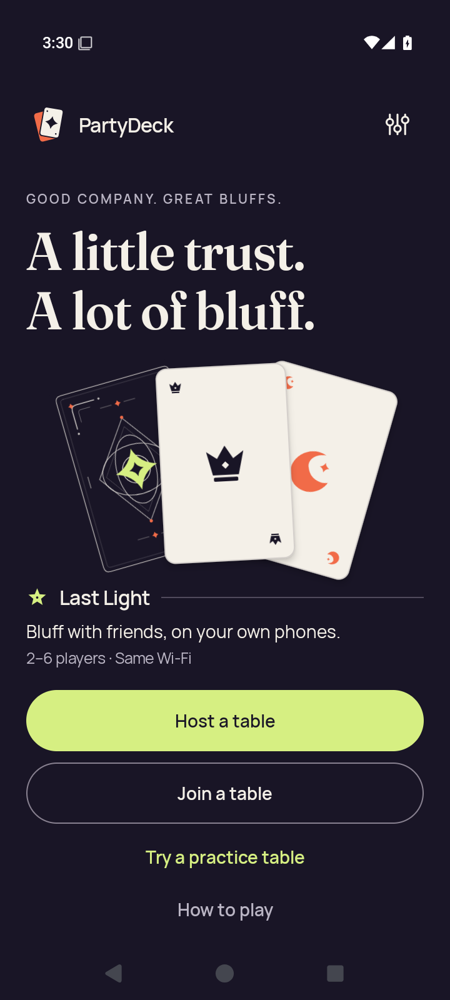</a> | **Home** Android API 35 emulator, optimized test-signed APK Original: [home.png](home.png) 720 × 1600 px; text 1× SHA-256: <code>d20e768775b02e9e318491b7644612b00605f51904a687d546465fd6591547ea</code> [Original receipt](smoke-result.json) [Original UI dump](home.xml) |
|  | **Host lobby after closing invitation and share surfaces** Android API 35 emulator, optimized test-signed APK Original: [host-after-share.png](host-after-share.png) 720 × 1600 px; text 1× SHA-256: <code>6789da493ccc37a21b0f35780a4782b1d8da4f409dfca1a88e7df6593a68842f</code> [Original receipt](smoke-result.json) [Original UI dump](host-after-share.xml) Native host lobby before invitation opening or after invitation/share dismissal. No live QR, URI or admission credentials are shown. |
| <a href="host-lobby.png">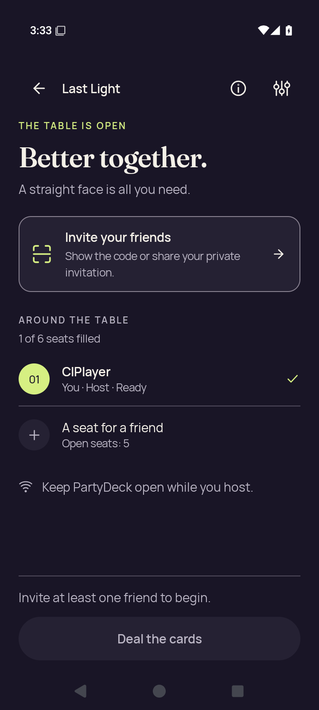</a> | **Native host lobby before opening invitation** Android API 35 emulator, optimized test-signed APK Original: [host-lobby.png](host-lobby.png) 720 × 1600 px; text 1× SHA-256: <code>6789da493ccc37a21b0f35780a4782b1d8da4f409dfca1a88e7df6593a68842f</code> [Original receipt](smoke-result.json) [Original UI dump](host-lobby.xml) Native host lobby before invitation opening or after invitation/share dismissal. No live QR, URI or admission credentials are shown. |
|  | **Home after leaving host lobby** Android API 35 emulator, optimized test-signed APK Original: [host-returned-home.png](host-returned-home.png) 720 × 1600 px; text 1× SHA-256: <code>26d830608f7e9a450115b2270253db02dd9e7d26d127d00527d19356dbc217bb</code> [Original receipt](smoke-result.json) [Original UI dump](host-returned-home.xml) |
| <a href="join-invalid.png">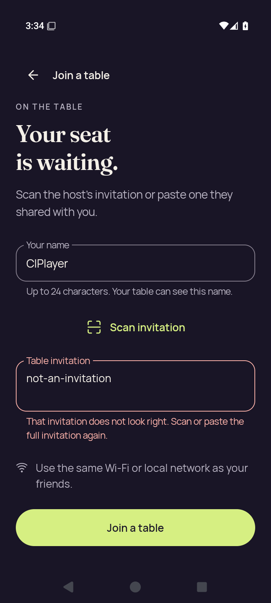</a> | **Join with invalid invitation feedback** Android API 35 emulator, optimized test-signed APK Original: [join-invalid.png](join-invalid.png) 720 × 1600 px; text 1× SHA-256: <code>7d1dcc3f8c3cc41b27e1c12b9da70a7e2d59cd20b73fda5f1686bd4e966790f7</code> [Original receipt](smoke-result.json) [Original UI dump](join-invalid.xml) The invalid fixture is not-an-invitation. The runner subsequently edits it and returns Home. |
| <a href="join-name-soft-ime.png">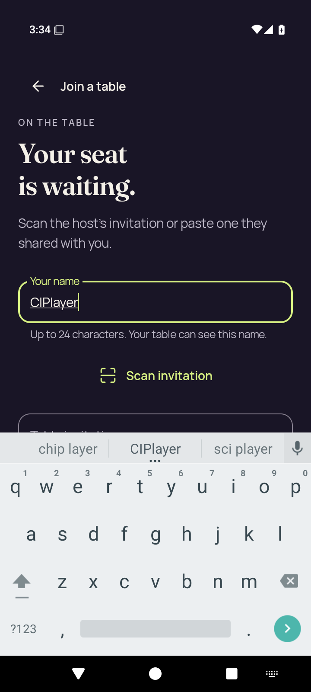</a> | **Join name focused with software keyboard** Android API 35 emulator, optimized test-signed APK Original: [join-name-soft-ime.png](join-name-soft-ime.png) 720 × 1600 px; text 1× SHA-256: <code>852f2ff8aab4ae142f7233278a2d86be5bc4a83f18421528485d8257df3fbbfd</code> [Original receipt](smoke-result.json) [Original UI dump](join-name-soft-ime.xml) |
| <a href="large-text-home-actions.png">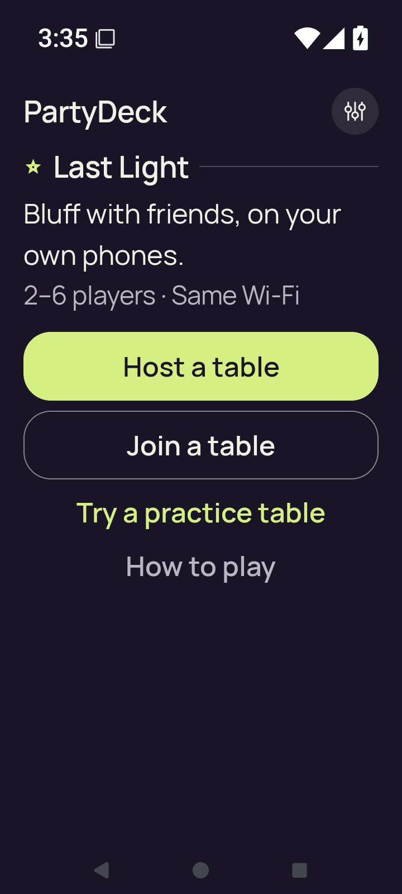</a> | **Home actions at 200% text** Android API 35 emulator, optimized test-signed APK Original: [large-text-home-actions.png](large-text-home-actions.png) 720 × 1600 px; text 2× SHA-256: <code>dc0436d03f0f576a6e4fa5b80da6dcc149e95241f1ef103e12cebed1a4b6e876</code> [Original receipt](smoke-result.json) [Original UI dump](large-text-home-actions.xml) |
| <a href="large-text-join-invalid.png">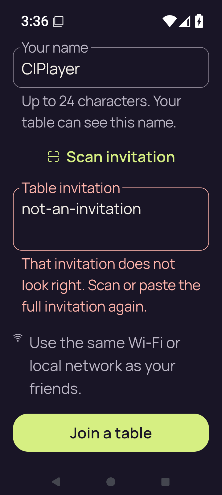</a> | **Join with invalid invitation feedback at 200% text** Android API 35 emulator, optimized test-signed APK Original: [large-text-join-invalid.png](large-text-join-invalid.png) 720 × 1600 px; text 2× SHA-256: <code>4327a38565608ce1201679135fb5a1b57b82b8413515d1ef92a50cff58aa3d7a</code> [Original receipt](smoke-result.json) [Original UI dump](large-text-join-invalid.xml) The invalid fixture is not-an-invitation. The runner subsequently edits it and returns Home. |
| <a href="large-text-join-name-soft-ime.png">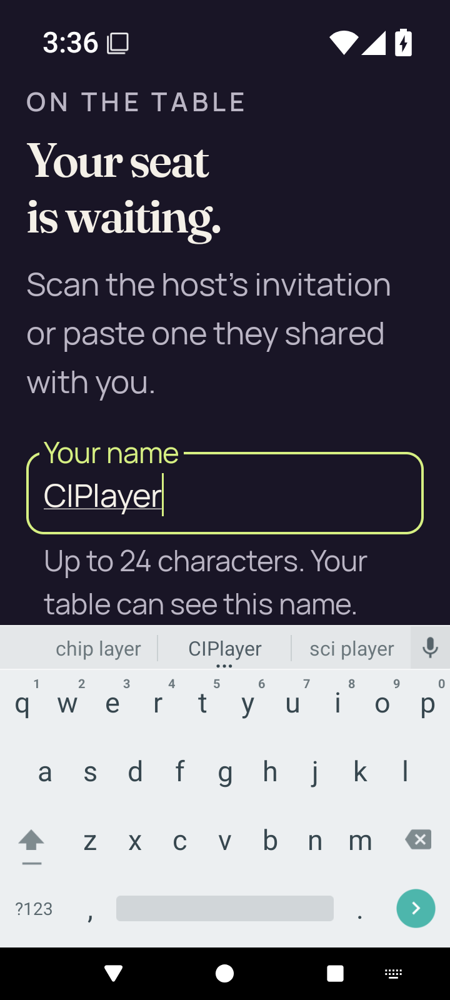</a> | **Join name and software keyboard at 200% text** Android API 35 emulator, optimized test-signed APK Original: [large-text-join-name-soft-ime.png](large-text-join-name-soft-ime.png) 720 × 1600 px; text 2× SHA-256: <code>bed6e86caf953fe0e5636f70c505755511f4c502090c338dba18487af0172231</code> [Original receipt](smoke-result.json) [Original UI dump](large-text-join-name-soft-ime.xml) |
| <a href="large-text-play-action.png">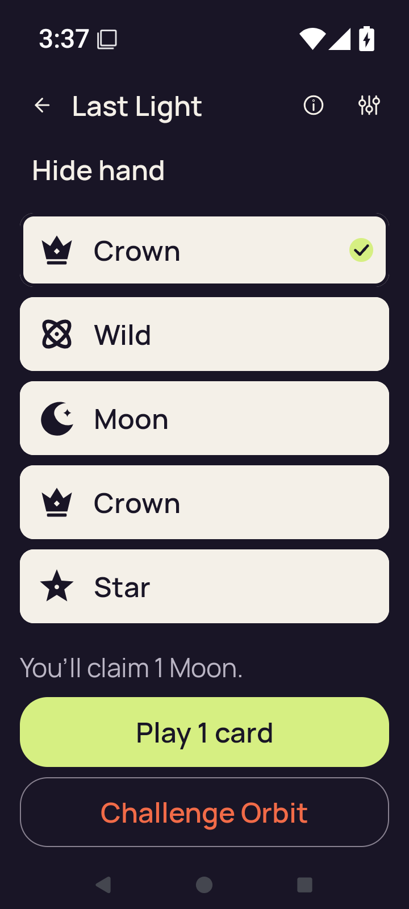</a> | **Claim explanation and Play action at 200% text** Android API 35 emulator, optimized test-signed APK Original: [large-text-play-action.png](large-text-play-action.png) 720 × 1600 px; text 2× SHA-256: <code>37f911338a6068933a7a62ae8e00c15d67f263ce7018523d40a9c41f17c12d7a</code> [Original receipt](smoke-result.json) [Original UI dump](large-text-play-action.xml) Play 1 card is completely visible after scrolling. This 200% step checks reachability; no accepted play is submitted at the enlarged scale. |
| <a href="large-text-private-hand.png">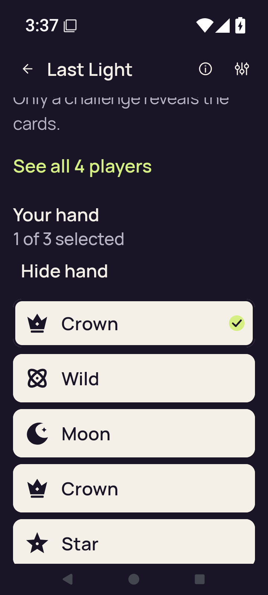</a> | **Revealed private hand and selected card at 200% text** Android API 35 emulator, optimized test-signed APK Original: [large-text-private-hand.png](large-text-private-hand.png) 720 × 1600 px; text 2× SHA-256: <code>849c5edb415fd94f6ab74cdee85f599c234f827e4083c1491f87d253aac781b3</code> [Original receipt](smoke-result.json) [Original UI dump](large-text-private-hand.xml) Own cards form an enlarged vertical list. This hand-focused position is retained separately from the following Play-action capture. |
| <a href="large-text-rules-intro.png">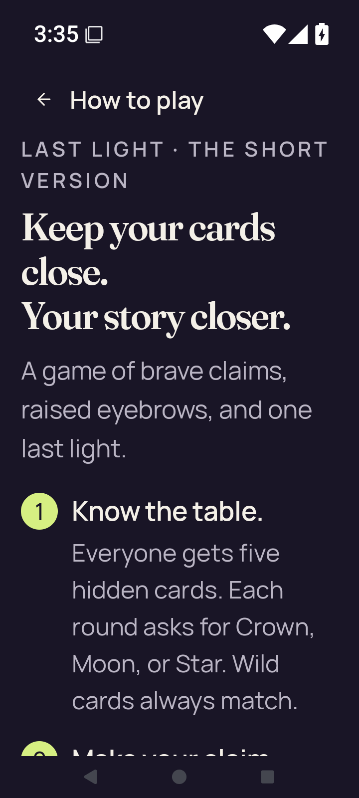</a> | **Rules introduction at 200% text** Android API 35 emulator, optimized test-signed APK Original: [large-text-rules-intro.png](large-text-rules-intro.png) 720 × 1600 px; text 2× SHA-256: <code>7d83c8d2249dae498be92ba6542beeb319f9079aff077c5f36e4da3865b66e50</code> [Original receipt](smoke-result.json) [Original UI dump](large-text-rules-intro.xml) |
| <a href="large-text-rules-last-step.png">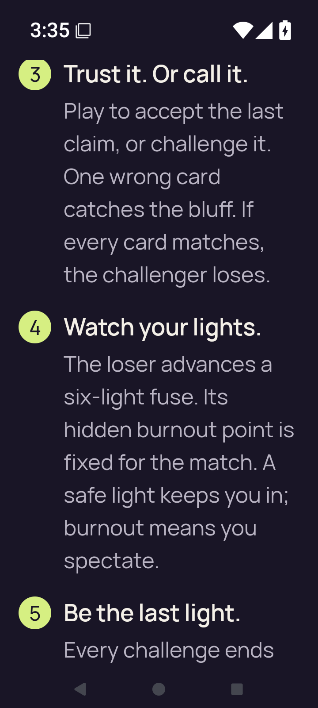</a> | **Rules final-step scroll position at 200% text** Android API 35 emulator, optimized test-signed APK Original: [large-text-rules-last-step.png](large-text-rules-last-step.png) 720 × 1600 px; text 2× SHA-256: <code>855de0ded7f045dc7e9a95955595ee385d6813dc1a89c498f0f77834a1719673</code> [Original receipt](smoke-result.json) [Original UI dump](large-text-rules-last-step.xml) |
| <a href="large-text-rules-practice-action.png">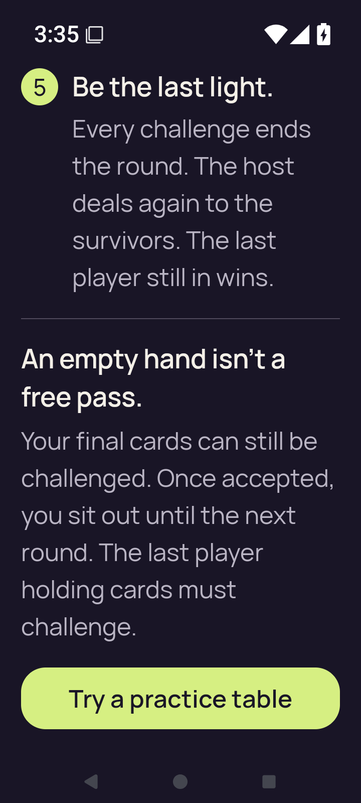</a> | **Rules final rule and Practice action at 200% text** Android API 35 emulator, optimized test-signed APK Original: [large-text-rules-practice-action.png](large-text-rules-practice-action.png) 720 × 1600 px; text 2× SHA-256: <code>f4c31f015623b27e63e85a253c392308edc85cf283d704684d738c064f6e47a2</code> [Original receipt](smoke-result.json) [Original UI dump](large-text-rules-practice-action.xml) The complete label and rounded border are visible. The action ends at y=1453 inside a viewport ending at y=1516: 63 pixels of clearance. Actual tap (360, 1391) is followed by captured Practice entry and confirmed leave/Home. |
| <a href="large-text-rules-practice-entered.png">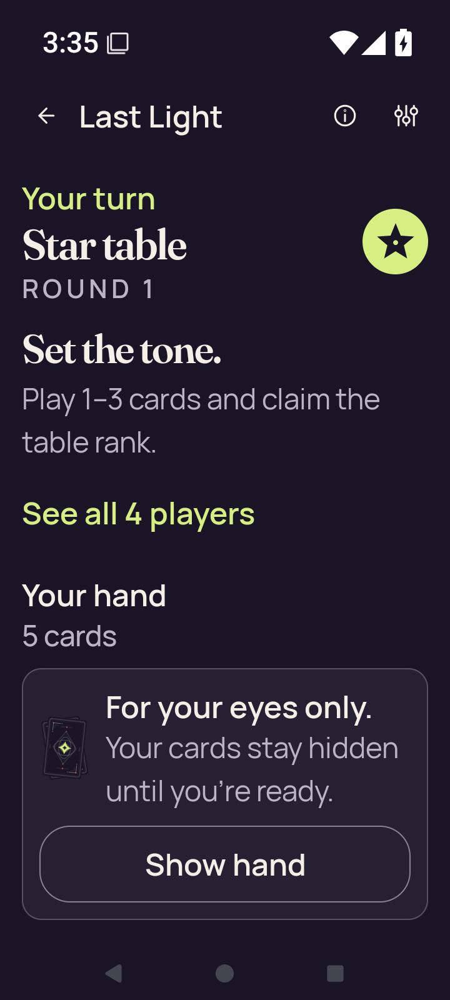</a> | **Practice entered directly from Rules at 200% text** Android API 35 emulator, optimized test-signed APK Original: [large-text-rules-practice-entered.png](large-text-rules-practice-entered.png) 720 × 1600 px; text 2× SHA-256: <code>9222e782bd9fa9f9a51462f2541a759c93437724c5ce791a5585ac657b1e01dc</code> [Original receipt](smoke-result.json) [Original UI dump](large-text-rules-practice-entered.xml) The enlarged Star-table entry has five own cards concealed and the complete Show hand action visible. |
| <a href="large-text-rules-returned-home.png">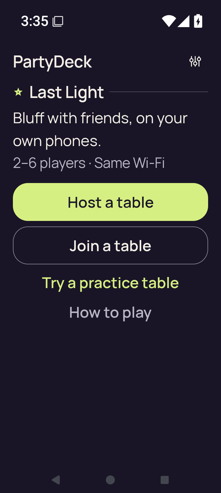</a> | **Home after confirming leave from Rules-started Practice at 200% text** Android API 35 emulator, optimized test-signed APK Original: [large-text-rules-returned-home.png](large-text-rules-returned-home.png) 720 × 1600 px; text 2× SHA-256: <code>f47eb70069557f9fafc12cdb086528488bec9847b3fb6b95ac912f21dde76431</code> [Original receipt](smoke-result.json) [Original UI dump](large-text-rules-returned-home.xml) |
| <a href="large-text-settings.png">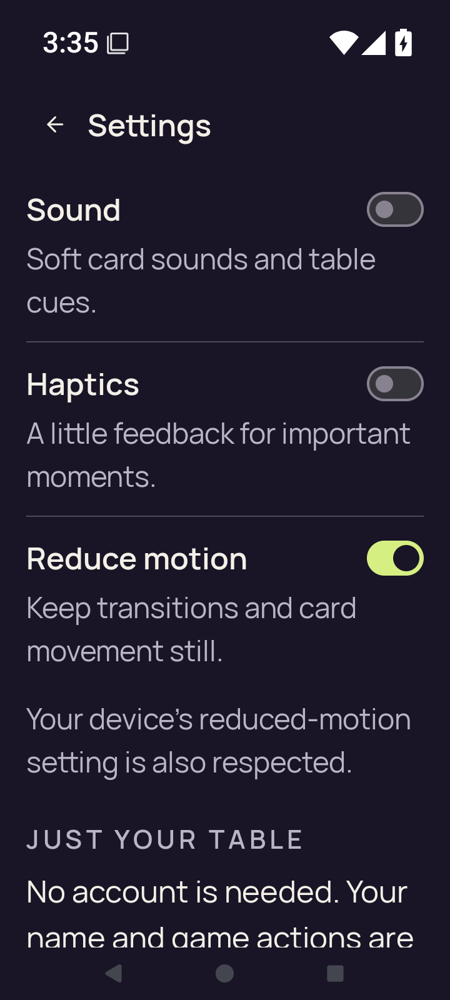</a> | **Settings at 200% text** Android API 35 emulator, optimized test-signed APK Original: [large-text-settings.png](large-text-settings.png) 720 × 1600 px; text 2× SHA-256: <code>f178535e9f96ed869b6b074e930a688f2abea1b5abc2081074fd17b0268f0f25</code> [Original receipt](smoke-result.json) [Original UI dump](large-text-settings.xml) |
| <a href="practice-after-play.png">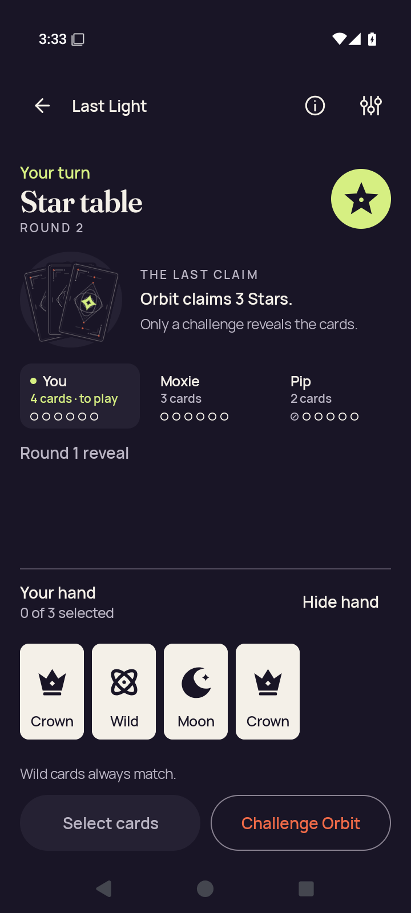</a> | **Practice continues after an accepted one-card play; four cards remain** Android API 35 emulator, optimized test-signed APK Original: [practice-after-play.png](practice-after-play.png) 720 × 1600 px; text 1× SHA-256: <code>3ad5770ba3b60608ce06d2875648ad3ef5284cc5aee3d799e474ac098d07ac35</code> [Original receipt](smoke-result.json) [Original UI dump](practice-after-play.xml) The original receipt records the hand decreasing by one. This is continuing round 2 on the Star table, with four own cards and Orbit’s three-Star claim; it is not a round-result screen. |
|  | **Practice with concealed hand** Android API 35 emulator, optimized test-signed APK Original: [practice-concealed.png](practice-concealed.png) 720 × 1600 px; text 1× SHA-256: <code>c437a3a4ca78e1263f41ab095c7a504a0c7174d5945c0f5f22c8ba0777d1a3e8</code> [Original receipt](smoke-result.json) [Original UI dump](practice-concealed.xml) |
| <a href="practice-resumed-concealed.png">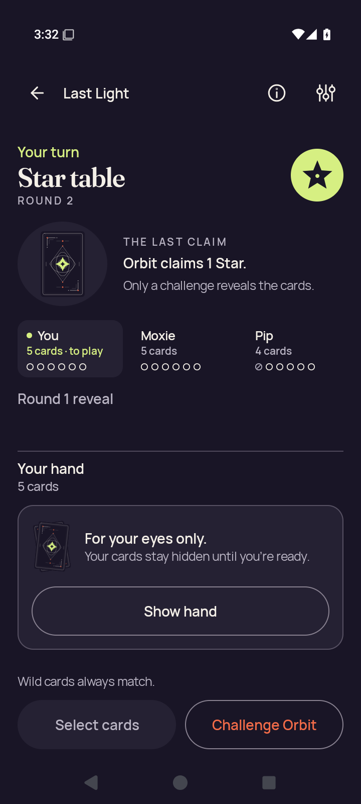</a> | **Practice concealed after app resumes** Android API 35 emulator, optimized test-signed APK Original: [practice-resumed-concealed.png](practice-resumed-concealed.png) 720 × 1600 px; text 1× SHA-256: <code>5614cc8bb6dbbdc315e4caa19b21b35b89dc921dcae51fc25c31bbe99d2039e5</code> [Original receipt](smoke-result.json) [Original UI dump](practice-resumed-concealed.xml) |
|  | **Home after leaving Practice** Android API 35 emulator, optimized test-signed APK Original: [practice-returned-home.png](practice-returned-home.png) 720 × 1600 px; text 1× SHA-256: <code>26d830608f7e9a450115b2270253db02dd9e7d26d127d00527d19356dbc217bb</code> [Original receipt](smoke-result.json) [Original UI dump](practice-returned-home.xml) |
| <a href="practice-selected.png">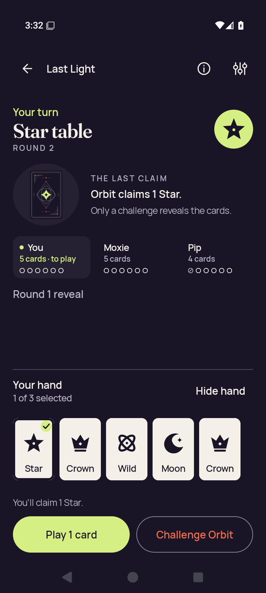</a> | **Practice with a selected card** Android API 35 emulator, optimized test-signed APK Original: [practice-selected.png](practice-selected.png) 720 × 1600 px; text 1× SHA-256: <code>e3ee55a986c2469623a86e9623401e292e933ee6fd843719d2455e46717e78a5</code> [Original receipt](smoke-result.json) [Original UI dump](practice-selected.xml) Selected Star for a one-card Star claim in round 2. |
| <a href="rules-intro.png">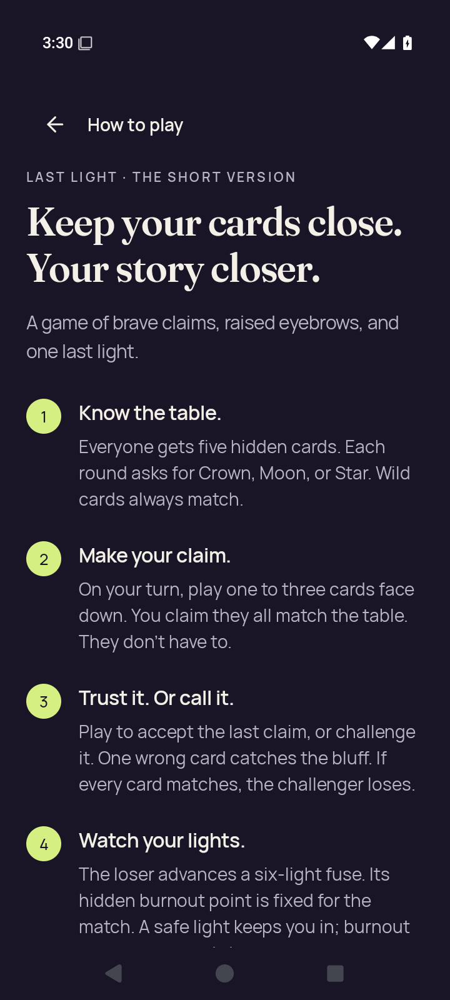</a> | **Rules introduction** Android API 35 emulator, optimized test-signed APK Original: [rules-intro.png](rules-intro.png) 720 × 1600 px; text 1× SHA-256: <code>ac8370e032384183ab6a1cf1493ee3d3f1250e5d6397305b38c09428ebf6ca0b</code> [Original receipt](smoke-result.json) [Original UI dump](rules-intro.xml) |
| <a href="rules-last-step.png">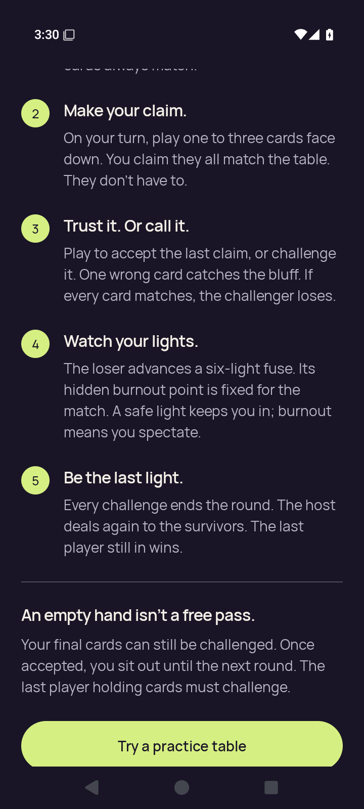</a> | **Rules final-step scroll position** Android API 35 emulator, optimized test-signed APK Original: [rules-last-step.png](rules-last-step.png) 720 × 1600 px; text 1× SHA-256: <code>112081c93bc0b46e64af9bf97d71e63927de320070b2b00ae03bdf57b52ee761</code> [Original receipt](smoke-result.json) [Original UI dump](rules-last-step.xml) Intermediate Rules scroll position: the Practice action is near the viewport edge. The separate rules-practice-action.png records its complete border with 63 pixels of lower clearance. |
| <a href="rules-practice-action.png">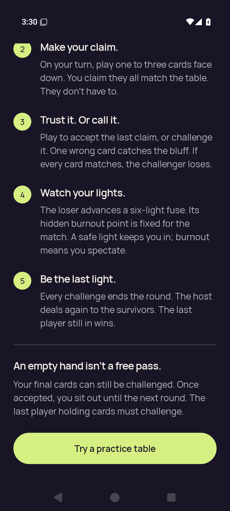</a> | **Rules final rule and Practice action** Android API 35 emulator, optimized test-signed APK Original: [rules-practice-action.png](rules-practice-action.png) 720 × 1600 px; text 1× SHA-256: <code>5fd5314c8626c1ca06a3c8ebf1930809838e56294bfff09f1e13ca8abbdfb658</code> [Original receipt](smoke-result.json) [Original UI dump](rules-practice-action.xml) The complete label and rounded border are visible. The action ends at y=1453 inside a viewport ending at y=1516: 63 pixels of clearance. Actual tap (360, 1404) is followed by captured Practice entry and confirmed leave/Home. |
| <a href="rules-practice-entered.png">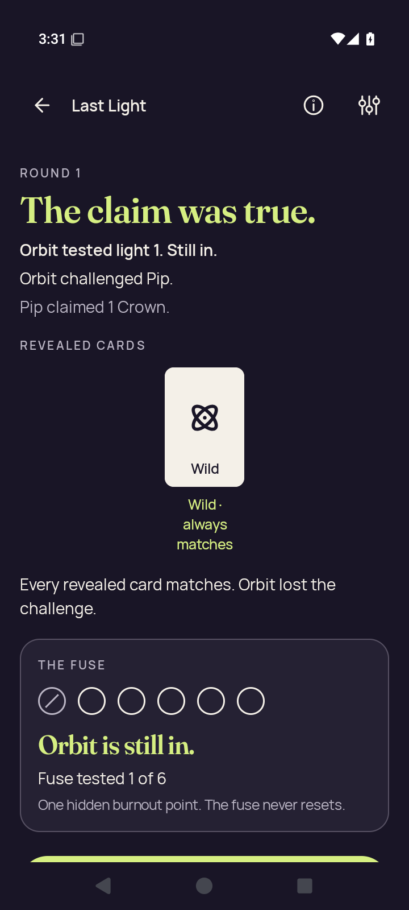</a> | **Practice entered directly from the Rules action** Android API 35 emulator, optimized test-signed APK Original: [rules-practice-entered.png](rules-practice-entered.png) 720 × 1600 px; text 1× SHA-256: <code>9bf0f1a803dc144a703e65f5120d78fdefa9dffe6c9b8d0c542c7a0dc1802f20</code> [Original receipt](smoke-result.json) [Original UI dump](rules-practice-entered.xml) The game already shows Orbit losing a challenge to Pip’s one-Crown claim because the public Wild matches. Orbit used light 1 and remains in. Only the top edge of Next round is visible at the viewport bottom; this recapture does not resolve result-action containment. |
|  | **Home after confirming leave from Rules-started Practice** Android API 35 emulator, optimized test-signed APK Original: [rules-returned-home.png](rules-returned-home.png) 720 × 1600 px; text 1× SHA-256: <code>f24c818c7f4a62122da612f4d61c78c9eb565980c8ed0558f701b737c31d2a6b</code> [Original receipt](smoke-result.json) [Original UI dump](rules-returned-home.xml) |
|  | **Settings after changing all three preferences** Android API 35 emulator, optimized test-signed APK Original: [settings-changed.png](settings-changed.png) 720 × 1600 px; text 1× SHA-256: <code>987cd0c484181035c8ae6e957d30d5ebd8c5e66518a888bcdcb9bb22a0e0f54e</code> [Original receipt](smoke-result.json) [Original UI dump](settings-changed.xml) |
| <a href="settings-persisted.png">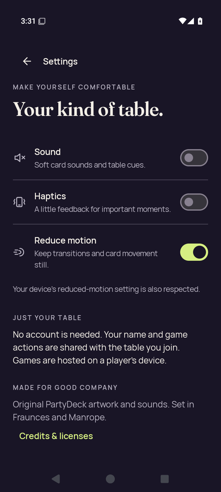</a> | **Settings after process restart** Android API 35 emulator, optimized test-signed APK Original: [settings-persisted.png](settings-persisted.png) 720 × 1600 px; text 1× SHA-256: <code>987cd0c484181035c8ae6e957d30d5ebd8c5e66518a888bcdcb9bb22a0e0f54e</code> [Original receipt](smoke-result.json) [Original UI dump](settings-persisted.xml) |
| <a href="settings-return-home.png">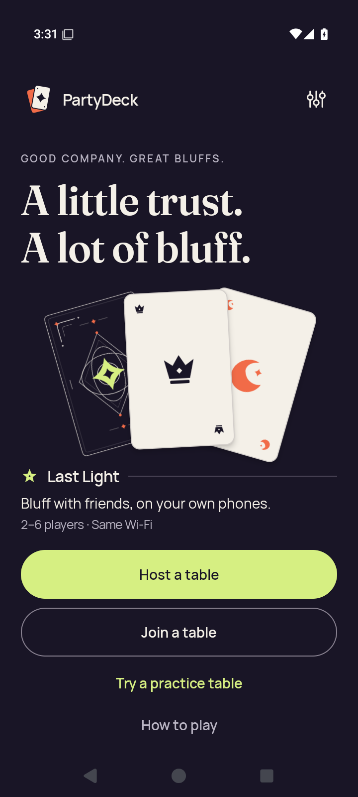</a> | **Home after closing Settings** Android API 35 emulator, optimized test-signed APK Original: [settings-return-home.png](settings-return-home.png) 720 × 1600 px; text 1× SHA-256: <code>f24c818c7f4a62122da612f4d61c78c9eb565980c8ed0558f701b737c31d2a6b</code> [Original receipt](smoke-result.json) [Original UI dump](settings-return-home.xml) |
