# Android API 35 optimized, test signed — CI 34456441354

[All screenshot collections](../../README.md) · [Run overview](../README.md) · [Other APK](../debug/README.md)

**Evidence status:** The exercised ordinary app flow passes at 100% and 200% text. The dedicated Rules Practice actions show complete labels and rounded borders, and their actual taps reach Practice and confirmed return Home. This APK records **86 steps, 64 native input records, 30 named route captures and one final app diagnostic**. Debug and optimized APKs use the same emulator boot within this run.

Exact source revision: `dad1c11741bd4322bb8b2afb9f18f3db5f50c919`. Android API 35, 720 × 1600 pixels, 280 dpi. Executed APK SHA-256: `52905946b8121c5b83064818793bcb2a663389dae5de2608d5f293eba7e6141c`. Both downloaded APKs were independently hashed for this gallery and matched their actual executed-input receipts.

The focused name and real keyboard are visible at both scales. Enlarged hands and actions are reached by scrolling; all content is not asserted to fit simultaneously. At 200%, Play is checked for reachability only and is **not submitted**. This case records no native Next round tap. Result and intermediate scroll images retain their clipped content. No margin from an older collection is reused.

Pip challenges Moxie's two-Crown claim. Public Crown and Wild both match; Pip loses the challenge and remains Still in after light 1. The named result and consequence are readable; only the upper edge of the next-result action is visible. The earlier original smoke observation says `played_card="hand decreased by one"`; it remains unchanged because the PNG is a later checkpoint.

[Original smoke result](smoke-result.json) · [Actual input geometry](input-geometry.log) · [Native events](events.log) · [Display and API receipt](../display-configuration.json) · [Run outcomes](../runtime-variants.json) · [Original owner review](../provenance/review/final-native-review-receipt.json) · [Later gallery visual review](../review/partydeck-gallery-1584-visual-review-34456441354.json) · [Independent source/archive audit](../review/partydeck-gallery-1584-source-audit.json).

The original owner reviewed all 60 named route captures across the two APKs in ten paired sheets. The later gallery review inspected both final diagnostics and both after-play originals; the after-play checks overlap the owner’s scope. Review sheets remain outside the gallery. Every thumbnail below displays and opens its unchanged original PNG, with its paired UI dump and original result linked separately.

All final Home diagnostics are **200% text**, collected before environment restoration. Live invitation, QR and Sharesheet images are intentionally omitted by the exact harness; the displayed host views precede opening or follow dismissal. Godot session smoke was explicitly disabled. These results do not qualify native Godot presentation, physical devices, screen readers, mixed-device LAN, camera frames or store distribution.

[Later Next round input reconciliation](../review/partydeck-gallery-1584-next-round-reconciliation.json). The original input stage label is retained; its source context distinguishes Join recovery from subsequent practice.

## 100% text route captures

| Original image | Scenario and provenance |
| --- | --- |
|  | **Home at 100% text** Android API 35 emulator, optimized test-signed APK Original: [home.png](home.png) 720 × 1600 px; text 1× SHA-256: <code>7d42c205f1fe1ada92e65a51057cee2fe66cefb3be1f7532b9103f08d5398d4e</code> [Original receipt](smoke-result.json) [Original UI dump](home.xml) |
| <a href="rules-intro.png">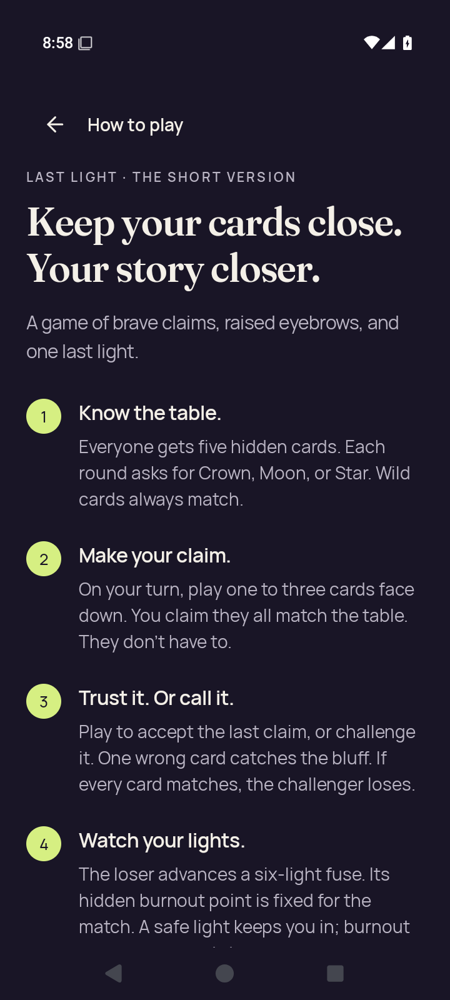</a> | **How to play introduction at 100% text** Android API 35 emulator, optimized test-signed APK Original: [rules-intro.png](rules-intro.png) 720 × 1600 px; text 1× SHA-256: <code>2f7663e1b29134cc3c26280cf9430447a9ba461d5d52b791378c53e94c9c8e58</code> [Original receipt](smoke-result.json) [Original UI dump](rules-intro.xml) Intermediate Rules scroll checkpoint; viewport-edge clipping is retained. The separate dedicated Practice-action image shows the complete button. |
| <a href="rules-last-step.png">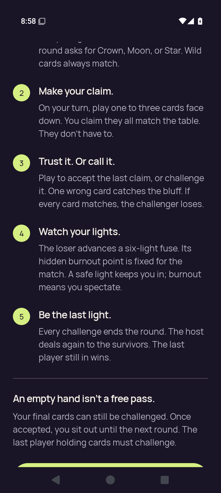</a> | **How to play after scrolling at 100% text** Android API 35 emulator, optimized test-signed APK Original: [rules-last-step.png](rules-last-step.png) 720 × 1600 px; text 1× SHA-256: <code>f50b85e03ac5ed755be493a5b57366c7ff98a5c237f402a62d8eef078dbaab72</code> [Original receipt](smoke-result.json) [Original UI dump](rules-last-step.xml) Intermediate Rules scroll checkpoint; viewport-edge clipping is retained. The separate dedicated Practice-action image shows the complete button. |
| <a href="rules-practice-action.png">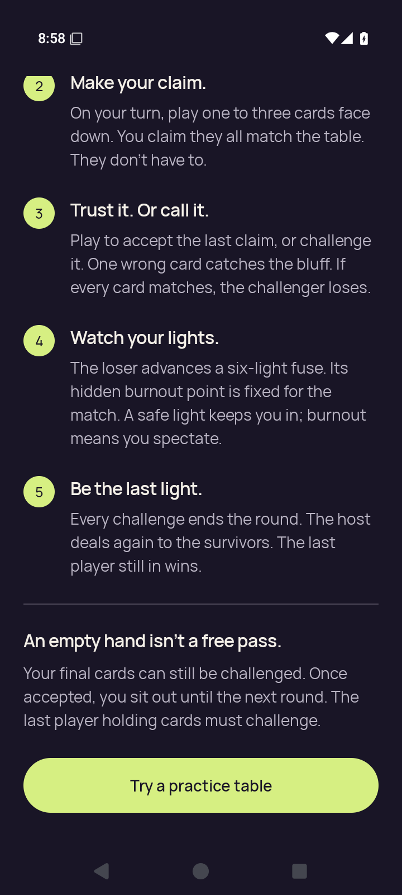</a> | **Complete Rules Practice action at 100% text** Android API 35 emulator, optimized test-signed APK Original: [rules-practice-action.png](rules-practice-action.png) 720 × 1600 px; text 1× SHA-256: <code>33c5bae27e79cc9215078f9a7dece4ea527c1b70463fb41ddb5c80a3257f0243</code> [Original receipt](smoke-result.json) [Original UI dump](rules-practice-action.xml) The complete Practice label and rounded button border are visible. Original native input geometry records the actual tap, followed by entry to Practice and confirmed return Home. No numeric clearance is transferred from an older run. |
| <a href="rules-practice-entered.png">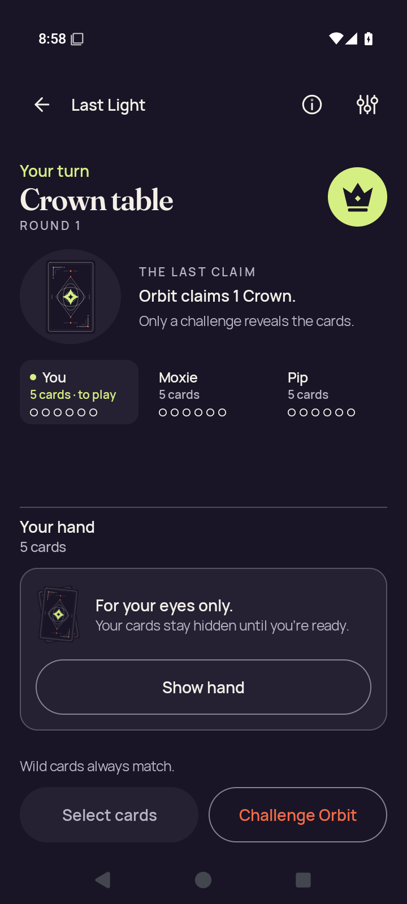</a> | **Practice reached from Rules at 100% text** Android API 35 emulator, optimized test-signed APK Original: [rules-practice-entered.png](rules-practice-entered.png) 720 × 1600 px; text 1× SHA-256: <code>080f142160e573c434692da5c64d3ee5184bdf917cf6d5c69f815bd198d2b954</code> [Original receipt](smoke-result.json) [Original UI dump](rules-practice-entered.xml) The actual Rules Practice tap reached the game table. This checkpoint does not imply that private cards were revealed or a Next round action was exercised. |
|  | **Home after confirmed departure from Rules practice** Android API 35 emulator, optimized test-signed APK Original: [rules-returned-home.png](rules-returned-home.png) 720 × 1600 px; text 1× SHA-256: <code>7d42c205f1fe1ada92e65a51057cee2fe66cefb3be1f7532b9103f08d5398d4e</code> [Original receipt](smoke-result.json) [Original UI dump](rules-returned-home.xml) |
| <a href="settings-changed.png">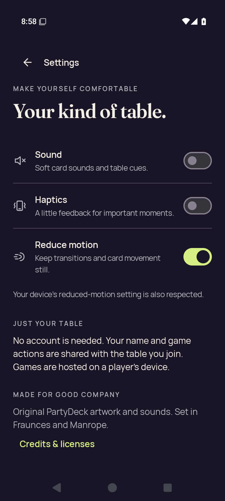</a> | **Settings changed: sound and haptics off, reduced motion on** Android API 35 emulator, optimized test-signed APK Original: [settings-changed.png](settings-changed.png) 720 × 1600 px; text 1× SHA-256: <code>210abdfa5e8c9a12b59845e6d265e579e89eba4959d450b1cd135a293f343e38</code> [Original receipt](smoke-result.json) [Original UI dump](settings-changed.xml) |
|  | **Home after changing settings** Android API 35 emulator, optimized test-signed APK Original: [settings-return-home.png](settings-return-home.png) 720 × 1600 px; text 1× SHA-256: <code>d787987437409a304663b799b5765cfbb7199e3c12356622e188a2bc26b4e7a7</code> [Original receipt](smoke-result.json) [Original UI dump](settings-return-home.xml) |
|  | **Settings retained after relaunch** Android API 35 emulator, optimized test-signed APK Original: [settings-persisted.png](settings-persisted.png) 720 × 1600 px; text 1× SHA-256: <code>588a6d4f5bea92953e86f1378b2e2c07dc91a04291d5f5a77fb79c5d53de523d</code> [Original receipt](smoke-result.json) [Original UI dump](settings-persisted.xml) |
|  | **Practice with the private hand concealed** Android API 35 emulator, optimized test-signed APK Original: [practice-concealed.png](practice-concealed.png) 720 × 1600 px; text 1× SHA-256: <code>76b3ed78d0b01137f5d0bca13bf2712f6f55cfa3614df52cec135e3708bcbe41</code> [Original receipt](smoke-result.json) [Original UI dump](practice-concealed.xml) Private card faces, rank labels and selection are concealed in this checkpoint. |
| <a href="practice-selected.png">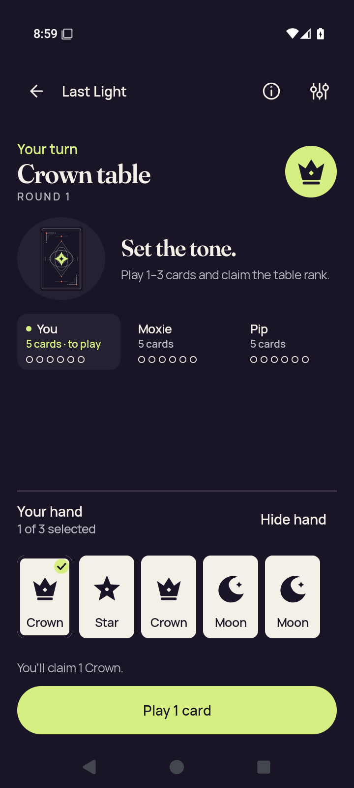</a> | **Practice with one private card selected** Android API 35 emulator, optimized test-signed APK Original: [practice-selected.png](practice-selected.png) 720 × 1600 px; text 1× SHA-256: <code>d872d45445f80d8057a3896f14db81f41c67231127d773c601e8e0e31f650aed</code> [Original receipt](smoke-result.json) [Original UI dump](practice-selected.xml) One card is selected in the normal-text private hand; the complete Play and Challenge controls remain available. |
| <a href="practice-resumed-concealed.png">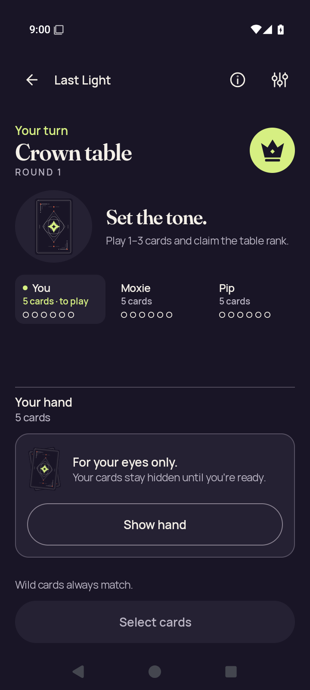</a> | **Resumed practice with the private hand concealed** Android API 35 emulator, optimized test-signed APK Original: [practice-resumed-concealed.png](practice-resumed-concealed.png) 720 × 1600 px; text 1× SHA-256: <code>68fc46a0555aa7ca4f2fa78dc1584b25387a62691294ce907b34311d55a3d22b</code> [Original receipt](smoke-result.json) [Original UI dump](practice-resumed-concealed.xml) Private card faces, rank labels and selection are concealed in this checkpoint. |
| <a href="practice-after-play.png">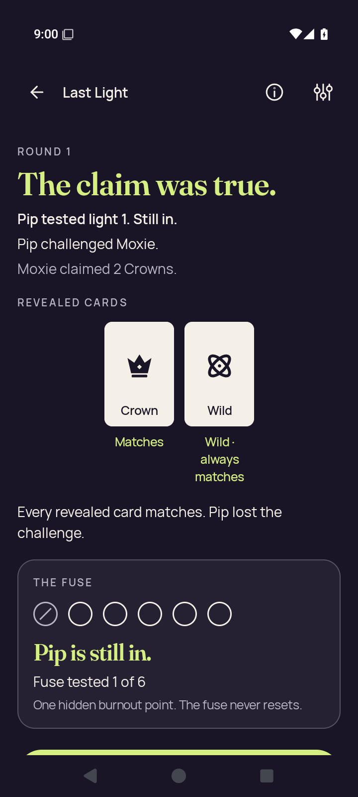</a> | **Public round result captured after the normal-text play** Android API 35 emulator, optimized test-signed APK Original: [practice-after-play.png](practice-after-play.png) 720 × 1600 px; text 1× SHA-256: <code>eb31b68f1483fcd7b19898d99410d58b63012200d262681cc6ad9aae1ecb5941</code> [Original receipt](smoke-result.json) [Original UI dump](practice-after-play.xml) Pip challenges Moxie&#x27;s two-Crown claim. Public Crown and Wild both match; Pip loses the challenge and remains Still in after light 1. The named result and consequence are readable; only the upper edge of the next-result action is visible. The unchanged earlier played_card observation is &quot;hand decreased by one&quot;. The original PNG is a later checkpoint that already includes autonomous public progress. No Next round tap follows this normal-text result checkpoint; the flow leaves the table afterward. |
|  | **Home after confirmed departure from practice** Android API 35 emulator, optimized test-signed APK Original: [practice-returned-home.png](practice-returned-home.png) 720 × 1600 px; text 1× SHA-256: <code>c25c14a95415135ceca9663386ab9985d09662f1e2d04cfe8a628449cbb14b9f</code> [Original receipt](smoke-result.json) [Original UI dump](practice-returned-home.xml) |
| <a href="host-lobby.png">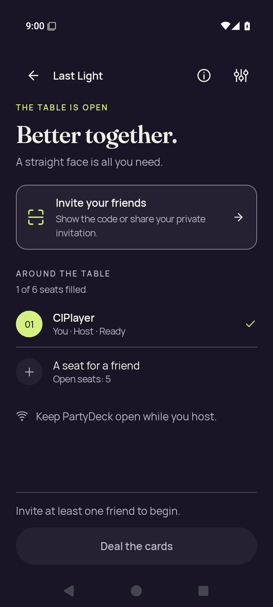</a> | **Local host lobby before opening its invitation** Android API 35 emulator, optimized test-signed APK Original: [host-lobby.png](host-lobby.png) 720 × 1600 px; text 1× SHA-256: <code>f2693cd0c65d586385cfd2d35c47dd49e4f3c8d311d2fe72571b35cc93587c00</code> [Original receipt](smoke-result.json) [Original UI dump](host-lobby.xml) The live invitation, QR and Sharesheet surfaces are intentionally omitted by the exact harness. This original shows the lobby before opening or after dismissing those surfaces. |
| <a href="host-after-share.png">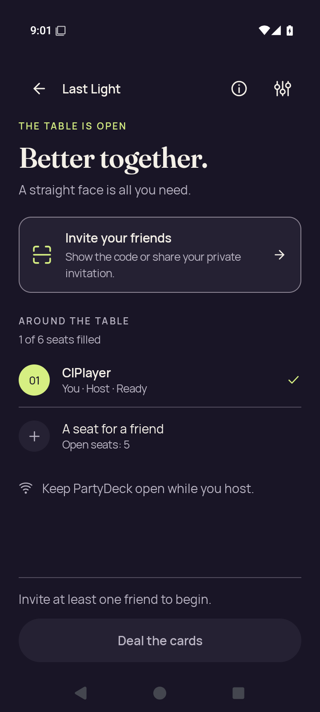</a> | **Local host lobby after dismissing sharing** Android API 35 emulator, optimized test-signed APK Original: [host-after-share.png](host-after-share.png) 720 × 1600 px; text 1× SHA-256: <code>b999ef8841a727b00ee4b28397dbf24b1a645c925113d59d98841038f493e944</code> [Original receipt](smoke-result.json) [Original UI dump](host-after-share.xml) The live invitation, QR and Sharesheet surfaces are intentionally omitted by the exact harness. This original shows the lobby before opening or after dismissing those surfaces. |
| <a href="host-returned-home.png">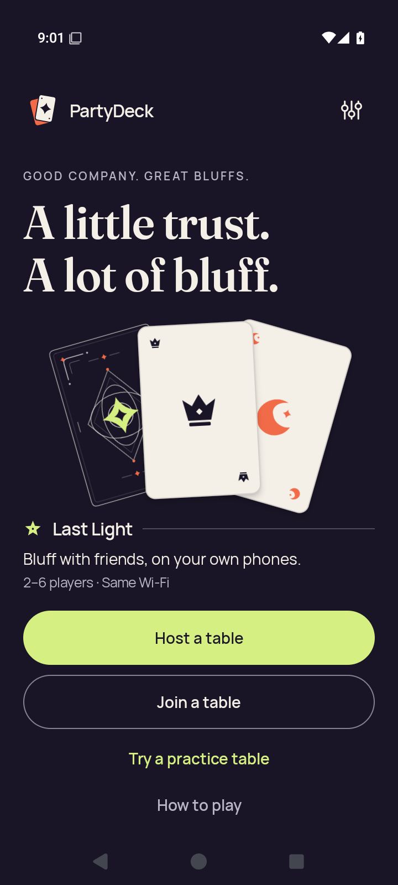</a> | **Home after closing the local host lobby** Android API 35 emulator, optimized test-signed APK Original: [host-returned-home.png](host-returned-home.png) 720 × 1600 px; text 1× SHA-256: <code>be6ffb222b9f41fb54f621cd0ad9f5e4afdac00a8589c1a4337e7e45739e4628</code> [Original receipt](smoke-result.json) [Original UI dump](host-returned-home.xml) |
| <a href="join-name-soft-ime.png">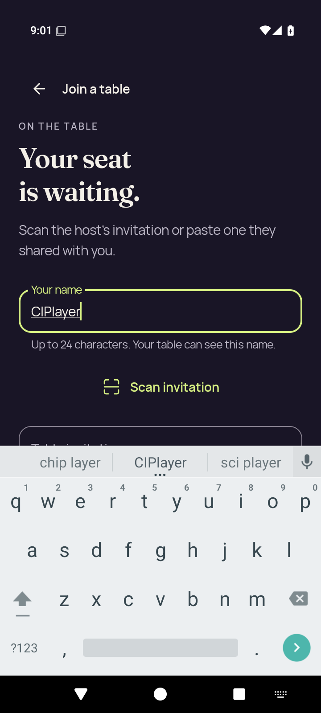</a> | **Focused Join name with the real keyboard at 100% text** Android API 35 emulator, optimized test-signed APK Original: [join-name-soft-ime.png](join-name-soft-ime.png) 720 × 1600 px; text 1× SHA-256: <code>1b74115820411c7b73d600329e3a252276bd0d7d094a8c0e3dba80b80204bb9a</code> [Original receipt](smoke-result.json) [Original UI dump](join-name-soft-ime.xml) The focused name field and actual software keyboard are visible together; the paired input-method log is preserved. |
| <a href="join-invalid.png">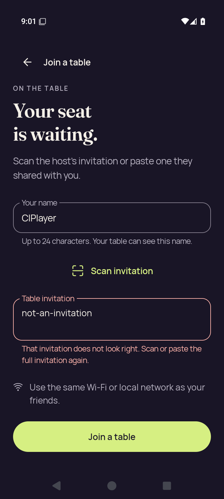</a> | **Join recovery after an invalid invitation at 100% text** Android API 35 emulator, optimized test-signed APK Original: [join-invalid.png](join-invalid.png) 720 × 1600 px; text 1× SHA-256: <code>0c7ab90f1a26b801647158ce388575ac9629c0360e46db0e8fbd30b0bfa7901a</code> [Original receipt](smoke-result.json) [Original UI dump](join-invalid.xml) |

## 200% text route captures

| Original image | Scenario and provenance |
| --- | --- |
| <a href="large-text-home-actions.png">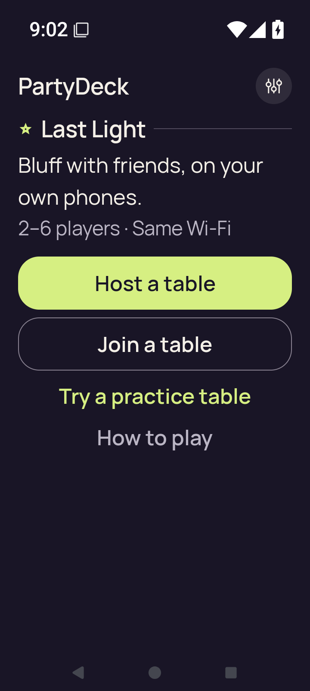</a> | **Home actions at 200% text** Android API 35 emulator, optimized test-signed APK Original: [large-text-home-actions.png](large-text-home-actions.png) 720 × 1600 px; text 2× SHA-256: <code>c5a426e66ce020fc5de0fdcbd82cddcdc302ae5de2b4a14f348791eedeee1f28</code> [Original receipt](smoke-result.json) [Original UI dump](large-text-home-actions.xml) |
| <a href="large-text-rules-intro.png">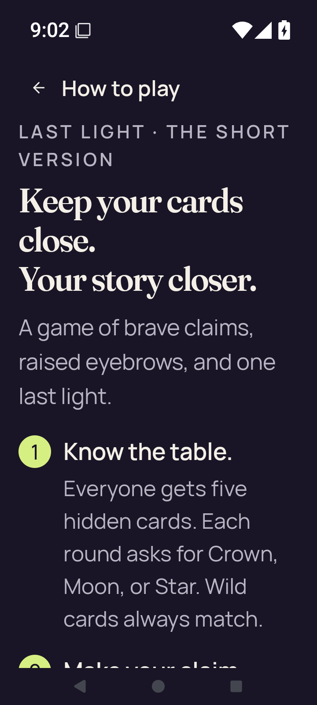</a> | **How to play introduction at 200% text** Android API 35 emulator, optimized test-signed APK Original: [large-text-rules-intro.png](large-text-rules-intro.png) 720 × 1600 px; text 2× SHA-256: <code>b74c4fcbe4efb64c647ec9f870c303541e657a87a487727d4a73d8704281743f</code> [Original receipt](smoke-result.json) [Original UI dump](large-text-rules-intro.xml) Intermediate Rules scroll checkpoint; viewport-edge clipping is retained. The separate dedicated Practice-action image shows the complete button. |
| <a href="large-text-rules-last-step.png">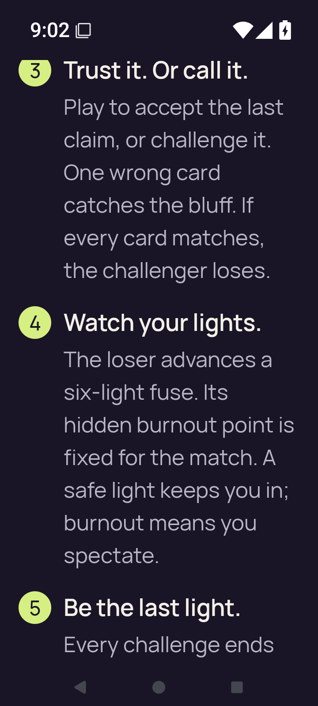</a> | **How to play after scrolling at 200% text** Android API 35 emulator, optimized test-signed APK Original: [large-text-rules-last-step.png](large-text-rules-last-step.png) 720 × 1600 px; text 2× SHA-256: <code>af5356e09ede558c54c559be8304e239a50fb3a8d602fec467042a39a5dc04ec</code> [Original receipt](smoke-result.json) [Original UI dump](large-text-rules-last-step.xml) Intermediate Rules scroll checkpoint; viewport-edge clipping is retained. The separate dedicated Practice-action image shows the complete button. |
| <a href="large-text-rules-practice-action.png">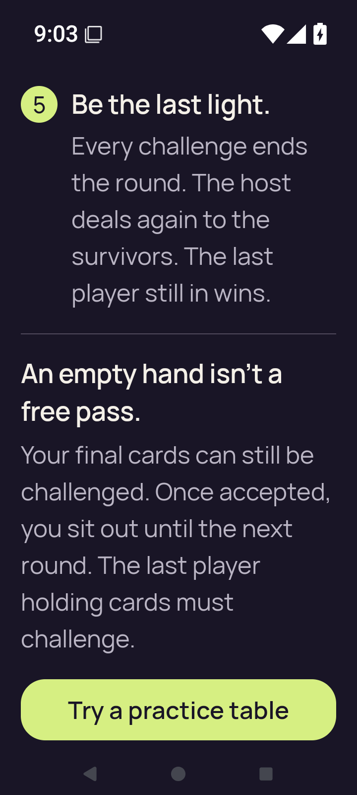</a> | **Complete Rules Practice action at 200% text** Android API 35 emulator, optimized test-signed APK Original: [large-text-rules-practice-action.png](large-text-rules-practice-action.png) 720 × 1600 px; text 2× SHA-256: <code>950de7db7beb2fd19e02e508ad63a39549ef5c92cd5b919004f1508a61cf0c3b</code> [Original receipt](smoke-result.json) [Original UI dump](large-text-rules-practice-action.xml) The complete Practice label and rounded button border are visible. Original native input geometry records the actual tap, followed by entry to Practice and confirmed return Home. No numeric clearance is transferred from an older run. |
| <a href="large-text-rules-practice-entered.png">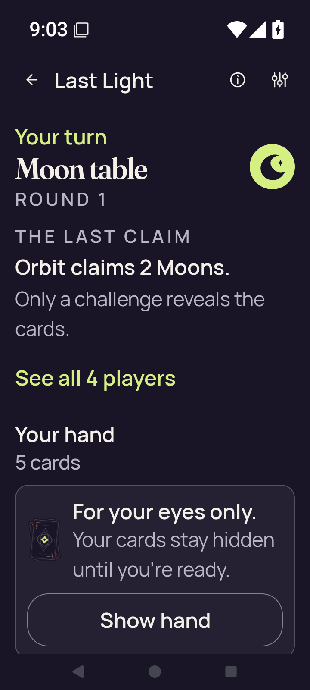</a> | **Practice reached from Rules at 200% text** Android API 35 emulator, optimized test-signed APK Original: [large-text-rules-practice-entered.png](large-text-rules-practice-entered.png) 720 × 1600 px; text 2× SHA-256: <code>7c96968e54f41be6cd1167c85372acf4eeffa1a2386b805a5c548f8cf40e46bd</code> [Original receipt](smoke-result.json) [Original UI dump](large-text-rules-practice-entered.xml) Actual entry from the enlarged Rules action; the route returns Home after confirmed departure. |
|  | **Home after confirmed departure from Rules practice at 200% text** Android API 35 emulator, optimized test-signed APK Original: [large-text-rules-returned-home.png](large-text-rules-returned-home.png) 720 × 1600 px; text 2× SHA-256: <code>47689140526bbacdaf7faef4cc5f247c8a0faca32b38928db3e350f2f534a87f</code> [Original receipt](smoke-result.json) [Original UI dump](large-text-rules-returned-home.xml) |
| <a href="large-text-settings.png">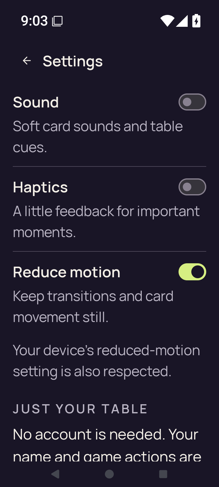</a> | **Settings at 200% text** Android API 35 emulator, optimized test-signed APK Original: [large-text-settings.png](large-text-settings.png) 720 × 1600 px; text 2× SHA-256: <code>da91c2ab56b614ac4329f1f3eba5354b48306f2b77b9504a49055c1477aa067e</code> [Original receipt](smoke-result.json) [Original UI dump](large-text-settings.xml) All three settings switches are readable; lower explanatory content continues beyond the viewport. |
| <a href="large-text-join-name-soft-ime.png">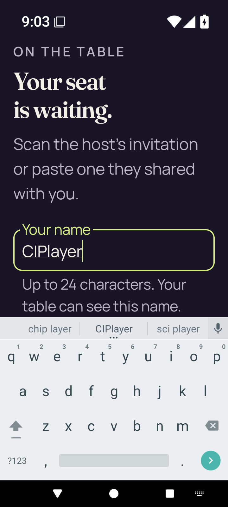</a> | **Focused Join name with the real keyboard at 200% text** Android API 35 emulator, optimized test-signed APK Original: [large-text-join-name-soft-ime.png](large-text-join-name-soft-ime.png) 720 × 1600 px; text 2× SHA-256: <code>5855cf03d305133e0ee4d4d65b580fdf4c01dc803154fbaf33ab3924d67bdb24</code> [Original receipt](smoke-result.json) [Original UI dump](large-text-join-name-soft-ime.xml) The focused name field and actual software keyboard are visible together; the paired input-method log is preserved. |
| <a href="large-text-join-invalid.png">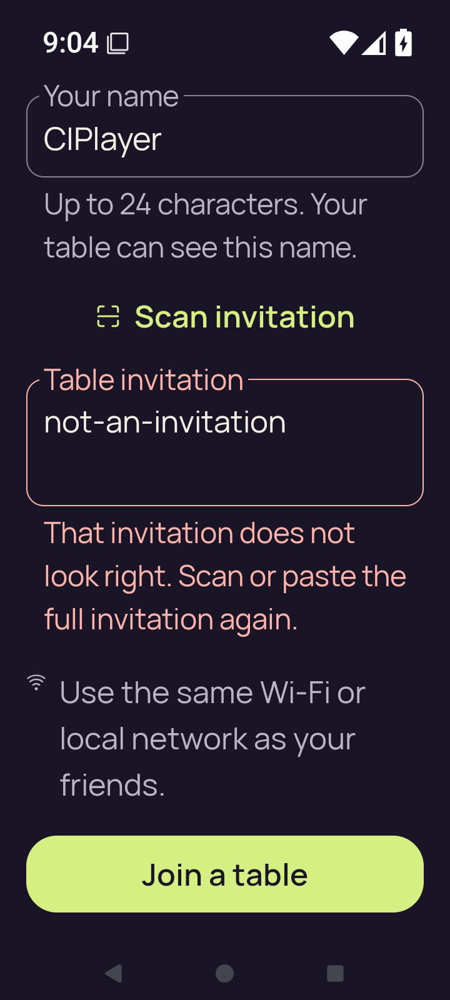</a> | **Join recovery after an invalid invitation at 200% text** Android API 35 emulator, optimized test-signed APK Original: [large-text-join-invalid.png](large-text-join-invalid.png) 720 × 1600 px; text 2× SHA-256: <code>0490354797ac47392f5fd9d2b0a11b09babad6d874a5528c9013f22107ed3f1f</code> [Original receipt](smoke-result.json) [Original UI dump](large-text-join-invalid.xml) The invalid-invitation recovery message remains readable in the scrolled form. |
| <a href="large-text-private-hand.png">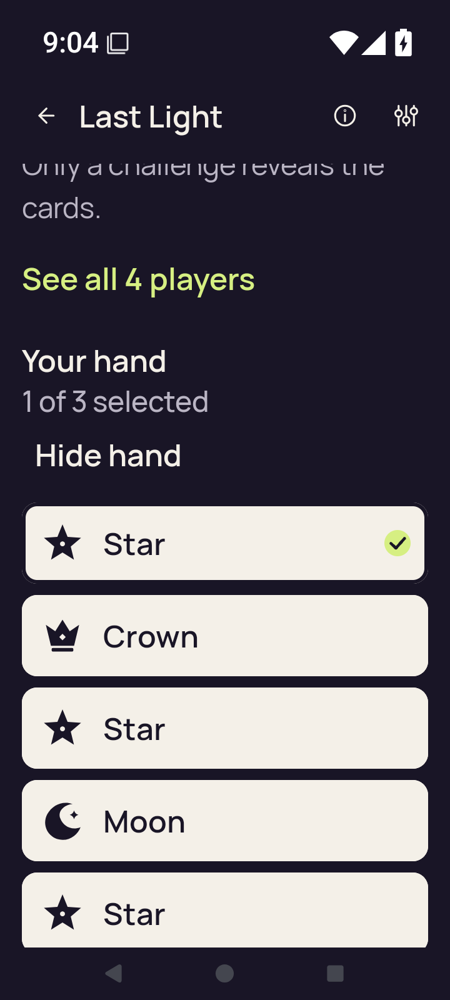</a> | **Enlarged private hand at its captured scroll position** Android API 35 emulator, optimized test-signed APK Original: [large-text-private-hand.png](large-text-private-hand.png) 720 × 1600 px; text 2× SHA-256: <code>6dade6dfe9cbe2e04165714858edced36037eccd42ceae9c72ee6c96060dd8a8</code> [Original receipt](smoke-result.json) [Original UI dump](large-text-private-hand.xml) The enlarged hand uses vertical scrolling; simultaneous visibility of all cards, turn context and actions is not asserted. |
| <a href="large-text-play-action.png">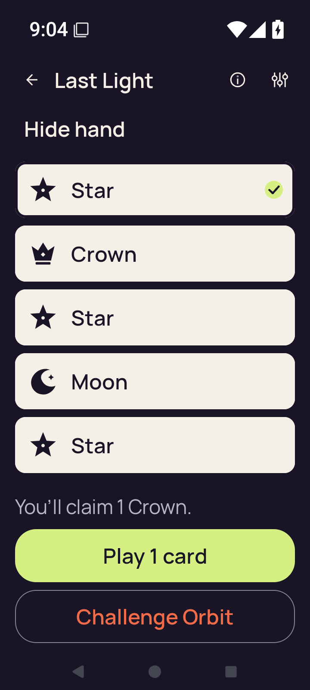</a> | **Reachable Play and Challenge actions at 200% text** Android API 35 emulator, optimized test-signed APK Original: [large-text-play-action.png](large-text-play-action.png) 720 × 1600 px; text 2× SHA-256: <code>d223ebbd42c8ca8fa01ead6a4ed58aef2043e592eff88885012f8c86d4ea76f0</code> [Original receipt](smoke-result.json) [Original UI dump](large-text-play-action.xml) The Play action is reached after scrolling. The 200% phase checks reachability and does not submit a play. |

## Final app diagnostic

| Original image | Scenario and provenance |
| --- | --- |
| <a href="final-screen.png">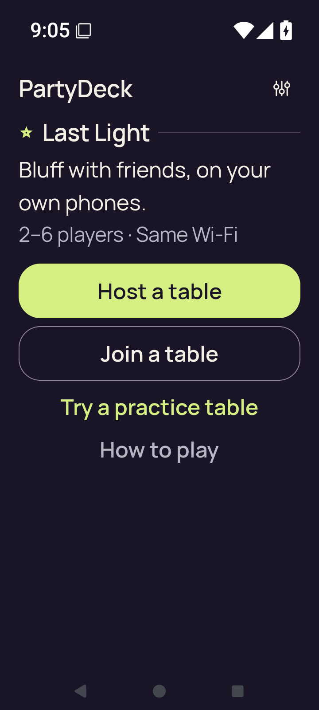</a> | **Final Home diagnostic at 200% text before environment restoration** Android API 35 emulator, optimized test-signed APK Original: [final-screen.png](final-screen.png) 720 × 1600 px; text 2× SHA-256: <code>e2293693eb6f30e02e204339f9f205d4645f13068e2b93bdcefc4fc135941c5f</code> [Original receipt](smoke-result.json) [Original UI dump](last-ui.xml) All Home actions are visible. The exact harness collects final diagnostics after the 200% flow and before restoring the environment; this is text 2.0, not text 1.0. Additional app diagnostic beyond the receipt’s 30 named route captures. |
