# Android API 35 debug — ordinary UI flow passed

[All collections](../../README.md) · [Original CI run](https://github.com/Apdelrahman1911/PartyDeck/actions/runs/34485028785)

Ordinary UI smoke passed with 88 recorded steps. Separate native entry failed.

30 named PNG/XML pairs and the distinct final PNG. Publication visual review is recorded below, including exact-byte reuse where stated. Native accessibility testing remains outside this evidence.

Exact source: `fc431ee775990943dfe152f4f20fb9365db4e72d`. Original PNG/XML/JSON bytes and the recorded failure limits are preserved.

## Publication review

Review coverage for these 31 originals: 14 exact matches to published bytes, 16 direct original views, 1 exact match to a direct view in this batch. Capture identities remain separate when pixels match. The review describes the captured viewport; it adds no native execution or assistive-technology result.

[Completed visual review](../provenance/publication-review/partydeck-gallery-next2-production-visual-review.json) · [Publication copy audit](../../godot-android-adaptive-34485033488/provenance/publication-review/partydeck-gallery-next2-ready-source-audit.json) · [Frozen queue](../../godot-android-adaptive-34485033488/provenance/publication-queue-v1/queue-freeze.json) · [Original copy mapping](../../godot-android-adaptive-34485033488/provenance/publication-queue-v1/copy-paths.tsv) · [Original queue page](../../godot-android-adaptive-34485033488/provenance/publication-queue-v1/payload/docs/screenshots/android-34485028785/debug/README.md). The archived queue page retains its original text and relative paths as provenance.

Both distinct final ordinary PNGs were directly viewed for this publication. The source owner’s earlier unviewed status is retained. [Run overview](../README.md).

| Original capture | Scenario and retained limits |
| --- | --- |
|  | **Home and practice route** Android API 35 x86_64 emulator, production Compose shell, debug APK; text 1.0× [home.png](home.png); 720 × 1600 px SHA-256: <code>19fbfad8d0d5b93b9ee06d5edc246d2a3967e90bec62ed63bfd63020b0671c7c</code> [Original XML](home.xml) · [Original result](smoke-result.json) The original ordinary Compose UI smoke passed. The overall workflow failed in the separate Godot session entry. Existing source-owner audits and original runtime receipts are retained. The later publication visual review adds no native accessibility or engine qualification. **Publication review — exact published-byte match:** Exact bytes match the previously published android-34432935952/debug/home.png; its visual review is reused for this distinct source capture. [Published matching original](../../android-34432935952/debug/home.png); runtime context remains separate. |
|  | **Rules introduction** Android API 35 x86_64 emulator, production Compose shell, debug APK; text 1.0× [rules-intro.png](rules-intro.png); 720 × 1600 px SHA-256: <code>f653c9b7e52c935e1993adeb056a6fb613b32572d0254b3486d36245adf059b1</code> [Original XML](rules-intro.xml) · [Original result](smoke-result.json) The original ordinary Compose UI smoke passed. The overall workflow failed in the separate Godot session entry. Existing source-owner audits and original runtime receipts are retained. The later publication visual review adds no native accessibility or engine qualification. **Publication review — exact published-byte match:** Exact bytes match the previously published android-34432935952/debug/rules-intro.png; its visual review is reused for this distinct source capture. [Published matching original](../../android-34432935952/debug/rules-intro.png); runtime context remains separate. |
|  | **Rules final step** Android API 35 x86_64 emulator, production Compose shell, debug APK; text 1.0× [rules-last-step.png](rules-last-step.png); 720 × 1600 px SHA-256: <code>014fb3d0da6f3f8ca679ffd0f99a3d0f49bff0797fe120ccd7337ec9bca19057</code> [Original XML](rules-last-step.xml) · [Original result](smoke-result.json) The original ordinary Compose UI smoke passed. The overall workflow failed in the separate Godot session entry. Existing source-owner audits and original runtime receipts are retained. The later publication visual review adds no native accessibility or engine qualification. **Publication review — exact published-byte match:** Exact bytes match the previously published android-34432935952/debug/rules-practice-action.png; its visual review is reused for this distinct source capture. [Published matching original](../../android-34432935952/debug/rules-practice-action.png); runtime context remains separate. |
|  | **Rules Practice action checkpoint** Android API 35 x86_64 emulator, production Compose shell, debug APK; text 1.0× [rules-practice-action.png](rules-practice-action.png); 720 × 1600 px SHA-256: <code>014fb3d0da6f3f8ca679ffd0f99a3d0f49bff0797fe120ccd7337ec9bca19057</code> [Original XML](rules-practice-action.xml) · [Original result](smoke-result.json) The original ordinary Compose UI smoke passed. The overall workflow failed in the separate Godot session entry. Existing source-owner audits and original runtime receipts are retained. The later publication visual review adds no native accessibility or engine qualification. **Publication review — exact published-byte match:** Exact bytes match the previously published android-34432935952/debug/rules-practice-action.png; its visual review is reused for this distinct source capture. [Published matching original](../../android-34432935952/debug/rules-practice-action.png); runtime context remains separate. |
| <a href="rules-practice-entered.png">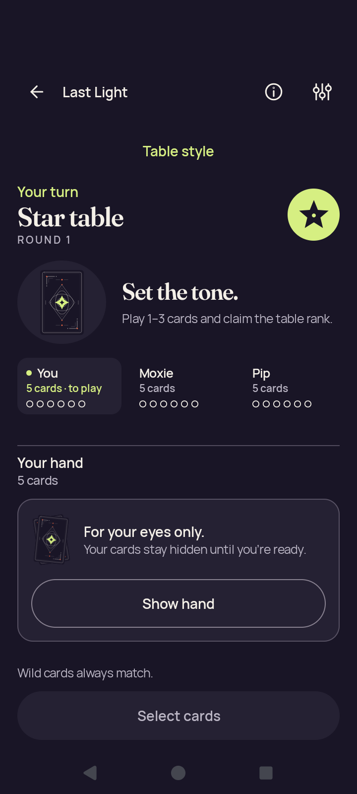</a> | **Practice entered from Rules** Android API 35 x86_64 emulator, production Compose shell, debug APK; text 1.0× [rules-practice-entered.png](rules-practice-entered.png); 720 × 1600 px SHA-256: <code>4d02e9eeca3519cefb72e6e8e72dbfa2f4d5a549433623a5ff6c96defbca2ceb</code> [Original XML](rules-practice-entered.xml) · [Original result](smoke-result.json) The original ordinary Compose UI smoke passed. The overall workflow failed in the separate Godot session entry. Existing source-owner audits and original runtime receipts are retained. The later publication visual review adds no native accessibility or engine qualification. **Publication review — direct original view:** Portrait Compose practice shows Your turn, Star table, round 1, the opening instructions and all three player summaries. The concealed five-card hand, full Show hand button, Wild explanation and disabled Select cards action fit. |
|  | **Home after leaving Rules-entered practice** Android API 35 x86_64 emulator, production Compose shell, debug APK; text 1.0× [rules-returned-home.png](rules-returned-home.png); 720 × 1600 px SHA-256: <code>19fbfad8d0d5b93b9ee06d5edc246d2a3967e90bec62ed63bfd63020b0671c7c</code> [Original XML](rules-returned-home.xml) · [Original result](smoke-result.json) The original ordinary Compose UI smoke passed. The overall workflow failed in the separate Godot session entry. Existing source-owner audits and original runtime receipts are retained. The later publication visual review adds no native accessibility or engine qualification. **Publication review — exact published-byte match:** Exact bytes match the previously published android-34432935952/debug/home.png; its visual review is reused for this distinct source capture. [Published matching original](../../android-34432935952/debug/home.png); runtime context remains separate. |
|  | **Changed settings** Android API 35 x86_64 emulator, production Compose shell, debug APK; text 1.0× [settings-changed.png](settings-changed.png); 720 × 1600 px SHA-256: <code>312d72f0b7e2f74c2181dddfa0bdca4b2de0dc5c886248d53f07ce4de824aeb1</code> [Original XML](settings-changed.xml) · [Original result](smoke-result.json) The original ordinary Compose UI smoke passed. The overall workflow failed in the separate Godot session entry. Existing source-owner audits and original runtime receipts are retained. The later publication visual review adds no native accessibility or engine qualification. **Publication review — exact published-byte match:** Exact bytes match the previously published android-34432935952/debug/settings-changed.png; its visual review is reused for this distinct source capture. [Published matching original](../../android-34432935952/debug/settings-changed.png); runtime context remains separate. |
|  | **Home after settings** Android API 35 x86_64 emulator, production Compose shell, debug APK; text 1.0× [settings-return-home.png](settings-return-home.png); 720 × 1600 px SHA-256: <code>19fbfad8d0d5b93b9ee06d5edc246d2a3967e90bec62ed63bfd63020b0671c7c</code> [Original XML](settings-return-home.xml) · [Original result](smoke-result.json) The original ordinary Compose UI smoke passed. The overall workflow failed in the separate Godot session entry. Existing source-owner audits and original runtime receipts are retained. The later publication visual review adds no native accessibility or engine qualification. **Publication review — exact published-byte match:** Exact bytes match the previously published android-34432935952/debug/home.png; its visual review is reused for this distinct source capture. [Published matching original](../../android-34432935952/debug/home.png); runtime context remains separate. |
|  | **Persisted settings checkpoint** Android API 35 x86_64 emulator, production Compose shell, debug APK; text 1.0× [settings-persisted.png](settings-persisted.png); 720 × 1600 px SHA-256: <code>312d72f0b7e2f74c2181dddfa0bdca4b2de0dc5c886248d53f07ce4de824aeb1</code> [Original XML](settings-persisted.xml) · [Original result](smoke-result.json) The original ordinary Compose UI smoke passed. The overall workflow failed in the separate Godot session entry. Existing source-owner audits and original runtime receipts are retained. The later publication visual review adds no native accessibility or engine qualification. **Publication review — exact published-byte match:** Exact bytes match the previously published android-34432935952/debug/settings-changed.png; its visual review is reused for this distinct source capture. [Published matching original](../../android-34432935952/debug/settings-changed.png); runtime context remains separate. |
| <a href="practice-concealed.png">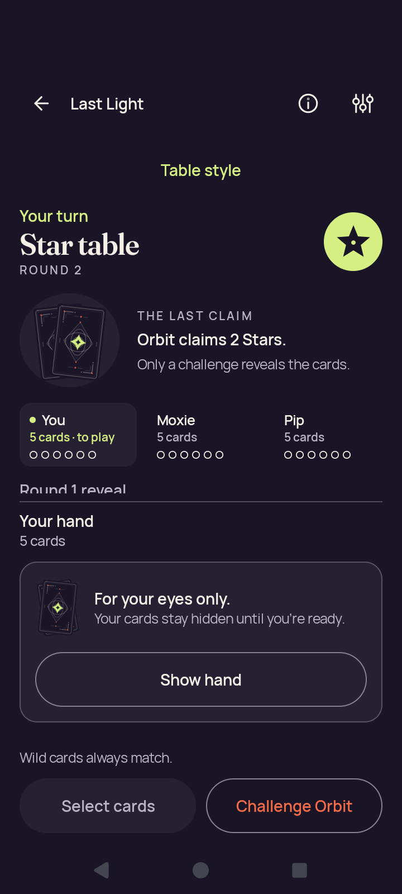</a> | **Practice with the hand concealed** Android API 35 x86_64 emulator, production Compose shell, debug APK; text 1.0× [practice-concealed.png](practice-concealed.png); 720 × 1600 px SHA-256: <code>637790ee9ed044a00b2c8c150cb80416214474302177d2b4dd55aa23b55910e3</code> [Original XML](practice-concealed.xml) · [Original result](smoke-result.json) The original ordinary Compose UI smoke passed. The overall workflow failed in the separate Godot session entry. Existing source-owner audits and original runtime receipts are retained. The later publication visual review adds no native accessibility or engine qualification. **Publication review — direct original view:** Portrait Compose practice shows round 2 and Orbit claims 2 Stars. The Round 1 reveal heading is cut by the hand-section boundary. The concealed hand, Show hand, disabled Select cards and Challenge Orbit actions are readable and complete. |
| <a href="practice-selected.png">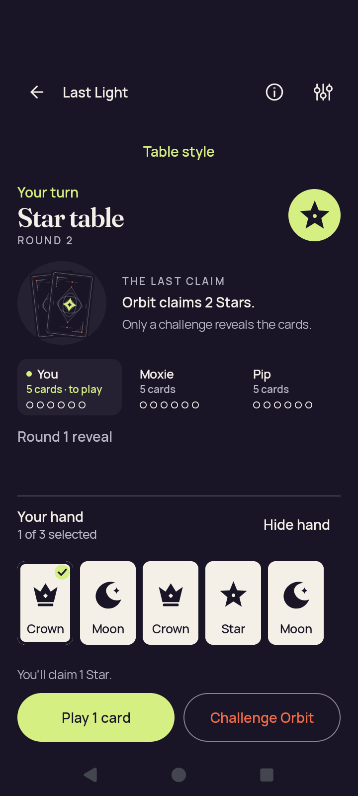</a> | **Practice card selection checkpoint** Android API 35 x86_64 emulator, production Compose shell, debug APK; text 1.0× [practice-selected.png](practice-selected.png); 720 × 1600 px SHA-256: <code>1c054da0dae2869a04b77a2d70b3742f3a2d95d8b0f8a71167f44dec916ef31c</code> [Original XML](practice-selected.xml) · [Original result](smoke-result.json) The original ordinary Compose UI smoke passed. The overall workflow failed in the separate Godot session entry. Existing source-owner audits and original runtime receipts are retained. The later publication visual review adds no native accessibility or engine qualification. **Publication review — direct original view:** Five face-up card tiles fit, with a visible check on the first Crown and 1 of 3 selected. The claim of 1 Star, enabled Play 1 card and Challenge Orbit fit beneath the round-2 public table. |
|  | **Practice concealed after resume** Android API 35 x86_64 emulator, production Compose shell, debug APK; text 1.0× [practice-resumed-concealed.png](practice-resumed-concealed.png); 720 × 1600 px SHA-256: <code>637790ee9ed044a00b2c8c150cb80416214474302177d2b4dd55aa23b55910e3</code> [Original XML](practice-resumed-concealed.xml) · [Original result](smoke-result.json) The original ordinary Compose UI smoke passed. The overall workflow failed in the separate Godot session entry. Existing source-owner audits and original runtime receipts are retained. The later publication visual review adds no native accessibility or engine qualification. **Publication review — exact match to a direct view in this batch:** Portrait Compose practice shows round 2 and Orbit claims 2 Stars. The Round 1 reveal heading is cut by the hand-section boundary. The concealed hand, Show hand, disabled Select cards and Challenge Orbit actions are readable and complete. [Directly viewed matching original](practice-concealed.png). |
| <a href="practice-after-play.png">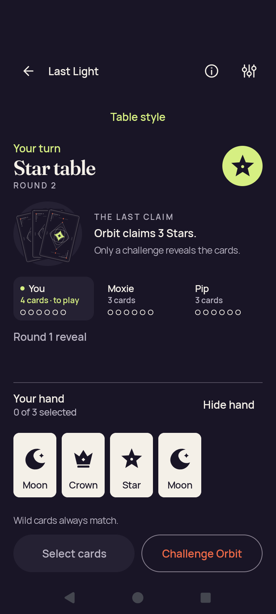</a> | **Practice after the recorded play** Android API 35 x86_64 emulator, production Compose shell, debug APK; text 1.0× [practice-after-play.png](practice-after-play.png); 720 × 1600 px SHA-256: <code>ff1ad3c29b55fe89a1038c49bde14dd5cae9bba7e94816d6c397cc3c0bb6f4ca</code> [Original XML](practice-after-play.xml) · [Original result](smoke-result.json) The original ordinary Compose UI smoke passed. The overall workflow failed in the separate Godot session entry. Existing source-owner audits and original runtime receipts are retained. The later publication visual review adds no native accessibility or engine qualification. **Publication review — direct original view:** After the recorded play, four face-up cards and 0 of 3 selected are visible. The public claim reads Orbit claims 3 Stars; Wild guidance, disabled Select cards and Challenge Orbit fit. |
|  | **Home after leaving practice** Android API 35 x86_64 emulator, production Compose shell, debug APK; text 1.0× [practice-returned-home.png](practice-returned-home.png); 720 × 1600 px SHA-256: <code>19fbfad8d0d5b93b9ee06d5edc246d2a3967e90bec62ed63bfd63020b0671c7c</code> [Original XML](practice-returned-home.xml) · [Original result](smoke-result.json) The original ordinary Compose UI smoke passed. The overall workflow failed in the separate Godot session entry. Existing source-owner audits and original runtime receipts are retained. The later publication visual review adds no native accessibility or engine qualification. **Publication review — exact published-byte match:** Exact bytes match the previously published android-34432935952/debug/home.png; its visual review is reused for this distinct source capture. [Published matching original](../../android-34432935952/debug/home.png); runtime context remains separate. |
|  | **Host lobby** Android API 35 x86_64 emulator, production Compose shell, debug APK; text 1.0× [host-lobby.png](host-lobby.png); 720 × 1600 px SHA-256: <code>26ba3084fdb294dd94d7784e1394c842a8b8f5ca7f9d24d92c095c437b5493d2</code> [Original XML](host-lobby.xml) · [Original result](smoke-result.json) The original ordinary Compose UI smoke passed. The overall workflow failed in the separate Godot session entry. Existing source-owner audits and original runtime receipts are retained. The later publication visual review adds no native accessibility or engine qualification. **Publication review — exact published-byte match:** Exact bytes match the previously published android-34432935952/debug/host-after-share.png; its visual review is reused for this distinct source capture. [Published matching original](../../android-34432935952/debug/host-after-share.png); runtime context remains separate. |
|  | **Host lobby after the sharing flow** Android API 35 x86_64 emulator, production Compose shell, debug APK; text 1.0× [host-after-share.png](host-after-share.png); 720 × 1600 px SHA-256: <code>26ba3084fdb294dd94d7784e1394c842a8b8f5ca7f9d24d92c095c437b5493d2</code> [Original XML](host-after-share.xml) · [Original result](smoke-result.json) The original ordinary Compose UI smoke passed. The overall workflow failed in the separate Godot session entry. Existing source-owner audits and original runtime receipts are retained. The later publication visual review adds no native accessibility or engine qualification. **Publication review — exact published-byte match:** Exact bytes match the previously published android-34432935952/debug/host-after-share.png; its visual review is reused for this distinct source capture. [Published matching original](../../android-34432935952/debug/host-after-share.png); runtime context remains separate. |
|  | **Home after leaving the host lobby** Android API 35 x86_64 emulator, production Compose shell, debug APK; text 1.0× [host-returned-home.png](host-returned-home.png); 720 × 1600 px SHA-256: <code>19fbfad8d0d5b93b9ee06d5edc246d2a3967e90bec62ed63bfd63020b0671c7c</code> [Original XML](host-returned-home.xml) · [Original result](smoke-result.json) The original ordinary Compose UI smoke passed. The overall workflow failed in the separate Godot session entry. Existing source-owner audits and original runtime receipts are retained. The later publication visual review adds no native accessibility or engine qualification. **Publication review — exact published-byte match:** Exact bytes match the previously published android-34432935952/debug/home.png; its visual review is reused for this distinct source capture. [Published matching original](../../android-34432935952/debug/home.png); runtime context remains separate. |
|  | **Join name field with the software keyboard** Android API 35 x86_64 emulator, production Compose shell, debug APK; text 1.0× [join-name-soft-ime.png](join-name-soft-ime.png); 720 × 1600 px SHA-256: <code>21ddcba0deaee49cfa5d20df198c3fe77bc46a9bc3b436ac3a9d58be8718ee87</code> [Original XML](join-name-soft-ime.xml) · [Original result](smoke-result.json) The original ordinary Compose UI smoke passed. The overall workflow failed in the separate Godot session entry. Existing source-owner audits and original runtime receipts are retained. The later publication visual review adds no native accessibility or engine qualification. **Publication review — exact published-byte match:** Exact bytes match the previously published android-34432935952/debug/join-name-soft-ime.png; its visual review is reused for this distinct source capture. [Published matching original](../../android-34432935952/debug/join-name-soft-ime.png); runtime context remains separate. |
| <a href="join-invalid.png">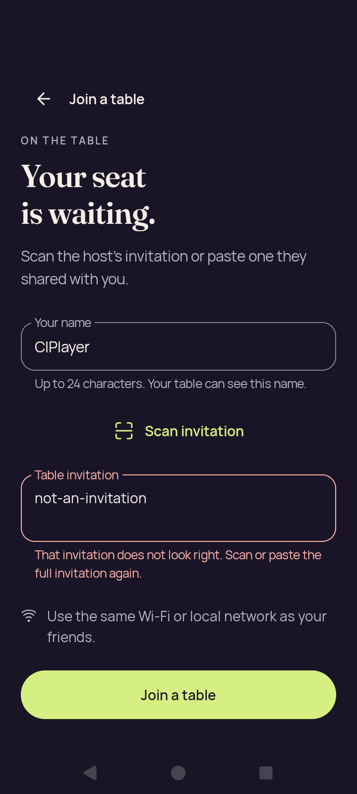</a> | **Invalid join input feedback** Android API 35 x86_64 emulator, production Compose shell, debug APK; text 1.0× [join-invalid.png](join-invalid.png); 720 × 1600 px SHA-256: <code>34465ad4e7fd80c856e310b8529a0df9afcc5557bfc4de071e2704bfe8ec3a7f</code> [Original XML](join-invalid.xml) · [Original result](smoke-result.json) The original ordinary Compose UI smoke passed. The overall workflow failed in the separate Godot session entry. Existing source-owner audits and original runtime receipts are retained. The later publication visual review adds no native accessibility or engine qualification. **Publication review — exact published-byte match:** Exact bytes match the previously published android-34432935952/debug/join-invalid.png; its visual review is reused for this distinct source capture. [Published matching original](../../android-34432935952/debug/join-invalid.png); runtime context remains separate. |
|  | **Home action checkpoints — 200% text** Android API 35 x86_64 emulator, production Compose shell, debug APK; text 2.0× [large-text-home-actions.png](large-text-home-actions.png); 720 × 1600 px SHA-256: <code>0740611ef27695bc553560b22503e13e8035845ee716da1376ac45dfbe678554</code> [Original XML](large-text-home-actions.xml) · [Original result](smoke-result.json) The original ordinary Compose UI smoke passed. The overall workflow failed in the separate Godot session entry. Existing source-owner audits and original runtime receipts are retained. The later publication visual review adds no native accessibility or engine qualification. **Publication review — direct original view:** At 200% text, the Home title and description wrap within the portrait width. Host, Join, Try a practice table and How to play are complete and readable. |
| <a href="large-text-rules-intro.png">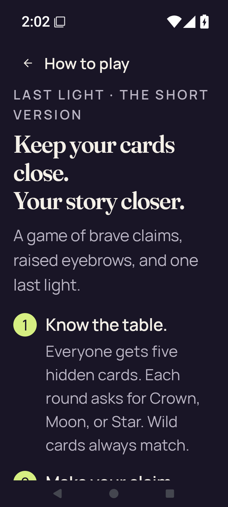</a> | **Rules introduction — 200% text** Android API 35 x86_64 emulator, production Compose shell, debug APK; text 2.0× [large-text-rules-intro.png](large-text-rules-intro.png); 720 × 1600 px SHA-256: <code>5bf00c38d09549dfa11ddcbeeb5cad501767feb887ebaa9aadca6b83acb9e49f</code> [Original XML](large-text-rules-intro.xml) · [Original result](smoke-result.json) The original ordinary Compose UI smoke passed. The overall workflow failed in the separate Godot session entry. Existing source-owner audits and original runtime receipts are retained. The later publication visual review adds no native accessibility or engine qualification. **Publication review — direct original view:** At 200% text, the Rules hero and complete first numbered step are readable. The start of step 2 is cut at the lower viewport edge and requires scrolling. |
| <a href="large-text-rules-last-step.png">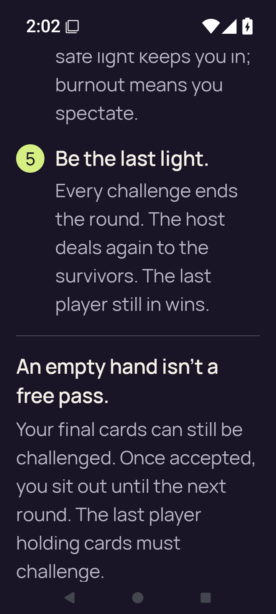</a> | **Rules final step — 200% text** Android API 35 x86_64 emulator, production Compose shell, debug APK; text 2.0× [large-text-rules-last-step.png](large-text-rules-last-step.png); 720 × 1600 px SHA-256: <code>cb20731c17783ac5de0f84580ba275153843ef457ea566a32e8f8fcd69ab1a9b</code> [Original XML](large-text-rules-last-step.xml) · [Original result](smoke-result.json) The original ordinary Compose UI smoke passed. The overall workflow failed in the separate Godot session entry. Existing source-owner audits and original runtime receipts are retained. The later publication visual review adds no native accessibility or engine qualification. **Publication review — direct original view:** At 200% text, the complete fifth Rules step and empty-hand explanation are readable after scrolling. Earlier text is cut at the top; the Practice action is below this capture. |
| <a href="large-text-rules-practice-action.png">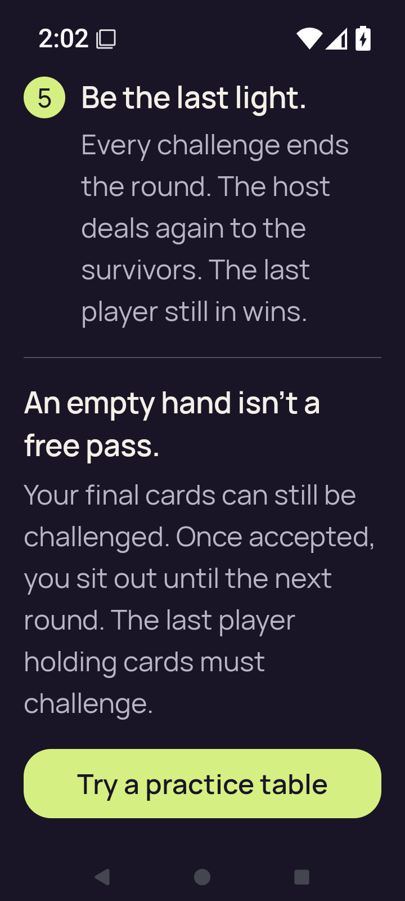</a> | **Rules Practice action checkpoint — 200% text** Android API 35 x86_64 emulator, production Compose shell, debug APK; text 2.0× [large-text-rules-practice-action.png](large-text-rules-practice-action.png); 720 × 1600 px SHA-256: <code>56b27d703481d1b6cb92549bd2e48135188f7abb51cac3c214fc548a6fd88259</code> [Original XML](large-text-rules-practice-action.xml) · [Original result](smoke-result.json) The original ordinary Compose UI smoke passed. The overall workflow failed in the separate Godot session entry. Existing source-owner audits and original runtime receipts are retained. The later publication visual review adds no native accessibility or engine qualification. **Publication review — direct original view:** At 200% text, the fifth Rules step, empty-hand explanation and complete Try a practice table button fit in the scrolled view. |
| <a href="large-text-rules-practice-entered.png">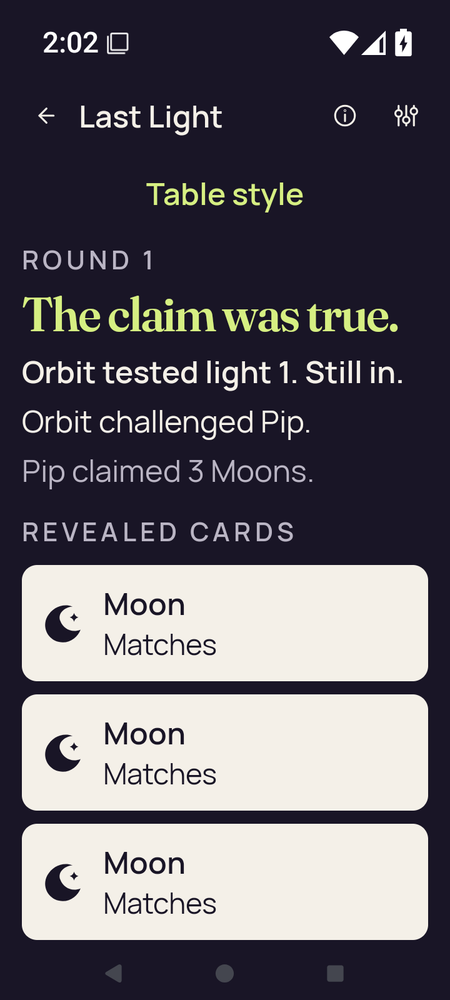</a> | **Practice entered from Rules — 200% text** Android API 35 x86_64 emulator, production Compose shell, debug APK; text 2.0× [large-text-rules-practice-entered.png](large-text-rules-practice-entered.png); 720 × 1600 px SHA-256: <code>f46e5f6033c7ad7f90e1957e4a07fb4f228501a55d6acd13b97e8d71362a8ce0</code> [Original XML](large-text-rules-practice-entered.xml) · [Original result](smoke-result.json) The original ordinary Compose UI smoke passed. The overall workflow failed in the separate Godot session entry. Existing source-owner audits and original runtime receipts are retained. The later publication visual review adds no native accessibility or engine qualification. **Publication review — direct original view:** The Rules-entered practice checkpoint shows the round-1 result rather than a fresh concealed hand: The claim was true; Orbit tested light 1 and is still in. Three complete Moon/Matches rows are visible. Further result content is below the viewport. |
| <a href="large-text-rules-returned-home.png">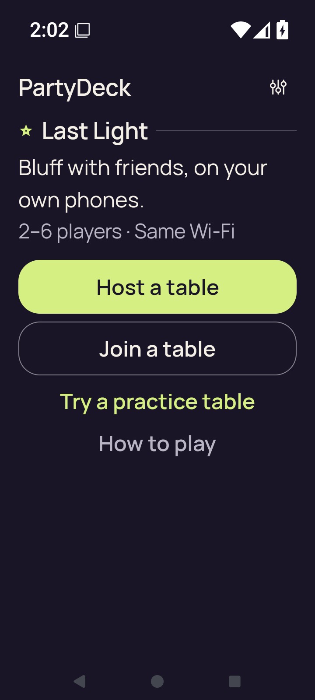</a> | **Home after leaving Rules-entered practice — 200% text** Android API 35 x86_64 emulator, production Compose shell, debug APK; text 2.0× [large-text-rules-returned-home.png](large-text-rules-returned-home.png); 720 × 1600 px SHA-256: <code>44d12765306b10d461f694f28e2bf631b3f429c72974193152b50258f040b0f1</code> [Original XML](large-text-rules-returned-home.xml) · [Original result](smoke-result.json) The original ordinary Compose UI smoke passed. The overall workflow failed in the separate Godot session entry. Existing source-owner audits and original runtime receipts are retained. The later publication visual review adds no native accessibility or engine qualification. **Publication review — direct original view:** Returned Home at 200% text shows the complete Host, Join, Try a practice table and How to play actions with readable wrapped introduction. |
| <a href="large-text-settings.png">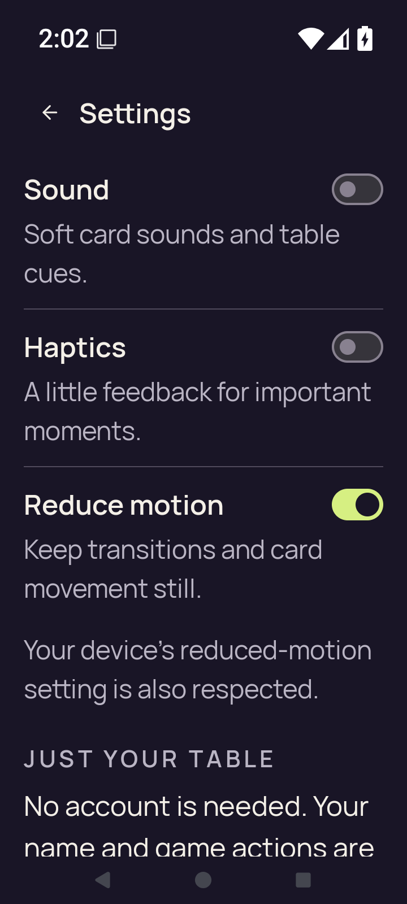</a> | **Settings checkpoint — 200% text** Android API 35 x86_64 emulator, production Compose shell, debug APK; text 2.0× [large-text-settings.png](large-text-settings.png); 720 × 1600 px SHA-256: <code>282a9a64e36f6644f97d1033e3f8969da815d1143a8831895c267bcf877229f2</code> [Original XML](large-text-settings.xml) · [Original result](smoke-result.json) The original ordinary Compose UI smoke passed. The overall workflow failed in the separate Godot session entry. Existing source-owner audits and original runtime receipts are retained. The later publication visual review adds no native accessibility or engine qualification. **Publication review — direct original view:** At 200% text, Sound and Haptics are off and Reduce motion is on; their labels and guidance fit. The Just your table privacy paragraph continues below the viewport. |
| <a href="large-text-join-name-soft-ime.png">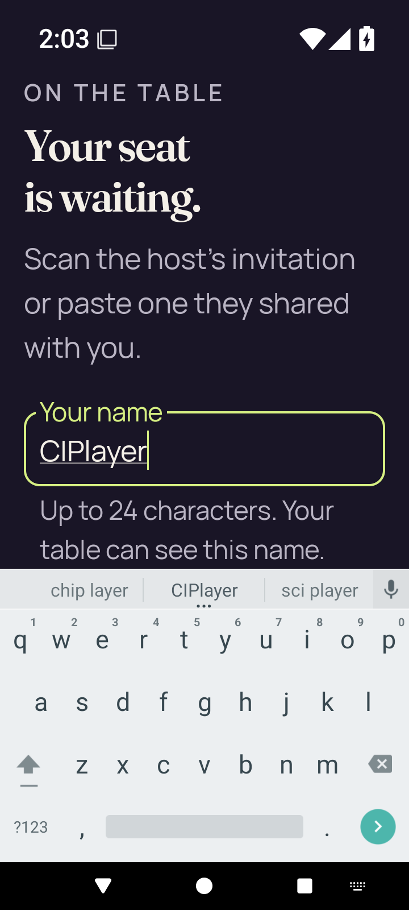</a> | **Join name field with the software keyboard — 200% text** Android API 35 x86_64 emulator, production Compose shell, debug APK; text 2.0× [large-text-join-name-soft-ime.png](large-text-join-name-soft-ime.png); 720 × 1600 px SHA-256: <code>a42abddd53aced224b7500838dc468855e96127d49ed36274e3bd280461721f0</code> [Original XML](large-text-join-name-soft-ime.xml) · [Original result](smoke-result.json) The original ordinary Compose UI smoke passed. The overall workflow failed in the separate Godot session entry. Existing source-owner audits and original runtime receipts are retained. The later publication visual review adds no native accessibility or engine qualification. **Publication review — direct original view:** With the software keyboard open at 200% text, the focused Your name field contains CIPlayer and its full helper text remains above the keyboard. The invitation controls are outside this scrolled viewport. |
| <a href="large-text-join-invalid.png">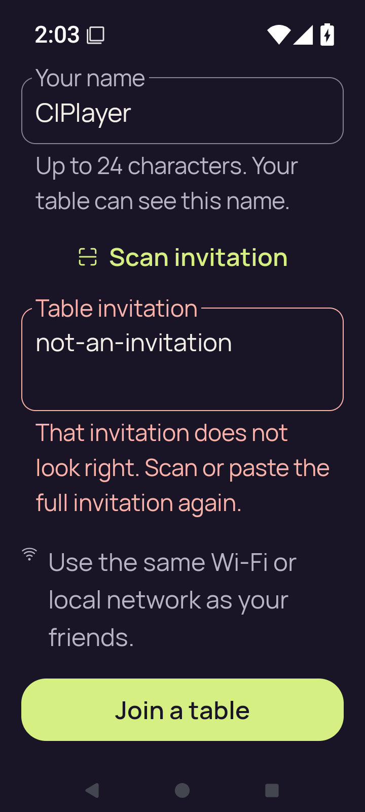</a> | **Invalid join input feedback — 200% text** Android API 35 x86_64 emulator, production Compose shell, debug APK; text 2.0× [large-text-join-invalid.png](large-text-join-invalid.png); 720 × 1600 px SHA-256: <code>dbe281429c57ed795027c62df73d049f9077791d4658b3c568f5fb2bef3ea4d7</code> [Original XML](large-text-join-invalid.xml) · [Original result](smoke-result.json) The original ordinary Compose UI smoke passed. The overall workflow failed in the separate Godot session entry. Existing source-owner audits and original runtime receipts are retained. The later publication visual review adds no native accessibility or engine qualification. **Publication review — direct original view:** At 200% text, the invalid invitation value and full correction message are visible, together with network guidance and the complete Join a table action. The name field remains visible at the top of the scrolled view. |
| <a href="large-text-private-hand.png">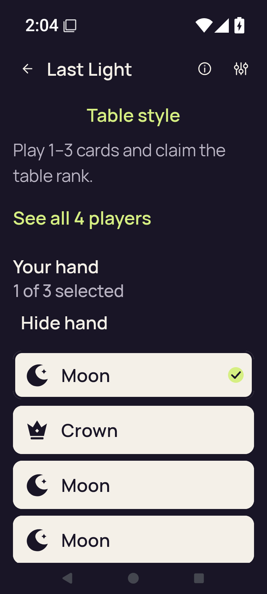</a> | **Own-hand checkpoint — 200% text** Android API 35 x86_64 emulator, production Compose shell, debug APK; text 2.0× [large-text-private-hand.png](large-text-private-hand.png); 720 × 1600 px SHA-256: <code>c2a2ba0d417729062070ba7c89e85de463333fe90c67ed248c8eab8c52b7ce0a</code> [Original XML](large-text-private-hand.xml) · [Original result](smoke-result.json) The original ordinary Compose UI smoke passed. The overall workflow failed in the separate Godot session entry. Existing source-owner audits and original runtime receipts are retained. The later publication visual review adds no native accessibility or engine qualification. **Publication review — direct original view:** At 200% text, the hand uses stacked rows. A check marks the first Moon; 1 of 3 selected and Hide hand are readable. Three full rows and most of a fourth fit; more cards and the play action require scrolling. Turn and rank are above this viewport. |
| <a href="large-text-play-action.png">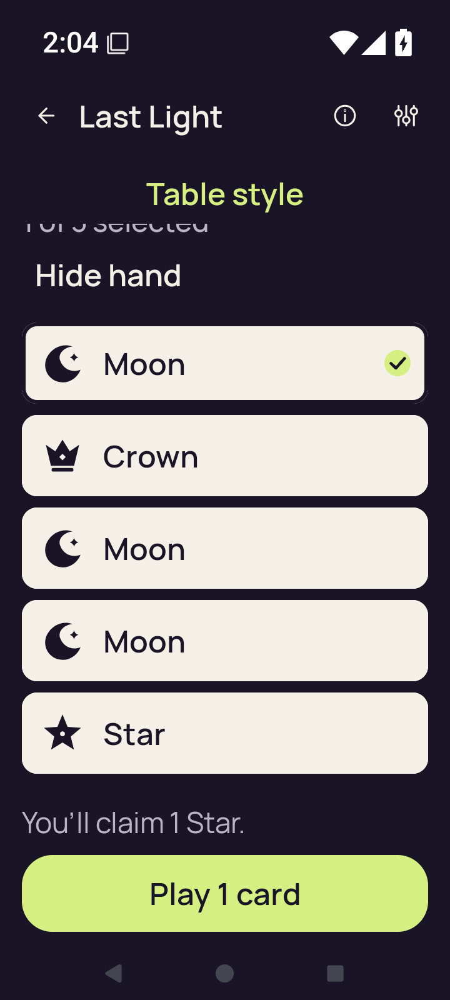</a> | **Play action reachability checkpoint — 200% text** Android API 35 x86_64 emulator, production Compose shell, debug APK; text 2.0× [large-text-play-action.png](large-text-play-action.png); 720 × 1600 px SHA-256: <code>6332cc75a16171a8bc02b6431d9011873a1dd9ac275afe88641d290ddfe51101</code> [Original XML](large-text-play-action.xml) · [Original result](smoke-result.json) The original ordinary Compose UI smoke passed. The overall workflow failed in the separate Godot session entry. Existing source-owner audits and original runtime receipts are retained. The later publication visual review adds no native accessibility or engine qualification. The named stage establishes recorded reachability only; it is not a second accepted-play claim. **Publication review — direct original view:** The 200% scrolled hand shows all five rows, the selected Moon check, full claim of 1 Star and full Play 1 card action. The selection count is clipped beneath the fixed Table style header; turn and rank are above the viewport. |
| <a href="final-screen.png">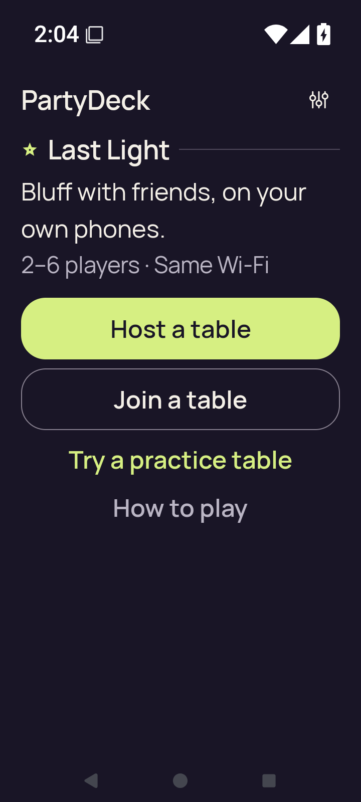</a> | **Final ordinary-smoke diagnostic — distinct original** Android API 35 x86_64 emulator, production Compose shell, debug APK; text 2.0× [final-screen.png](final-screen.png); 720 × 1600 px SHA-256: <code>47b04751c5fb4248341c3e96a3bd5584f9ccef8a2a5d60f46426844b26b8e309</code> [Original result](smoke-result.json) Distinct final original retained after the passed ordinary UI flow. It has no named PNG/XML pair in the original capture list. The source-owner audit did not include a full visual review of this final image. **Publication review — direct original view:** The distinct final debug original shows the 200% Home screen with all four actions complete. This is a later publication review of a final diagnostic the source owner did not directly view. |
