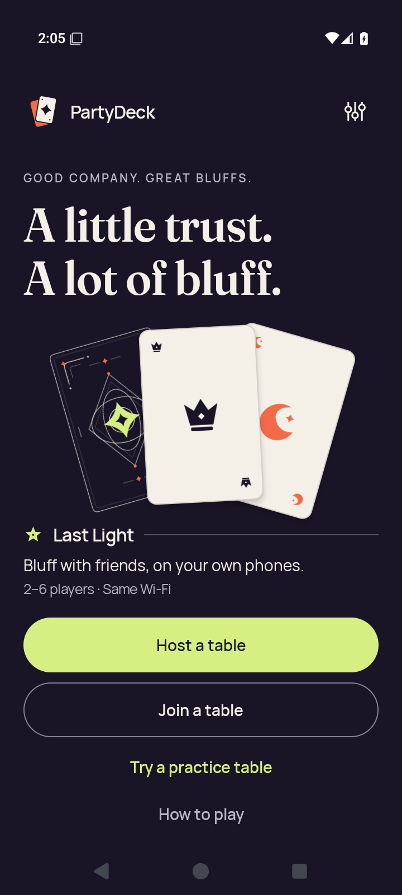
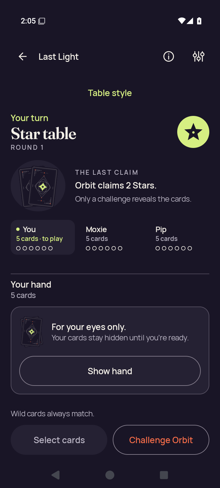
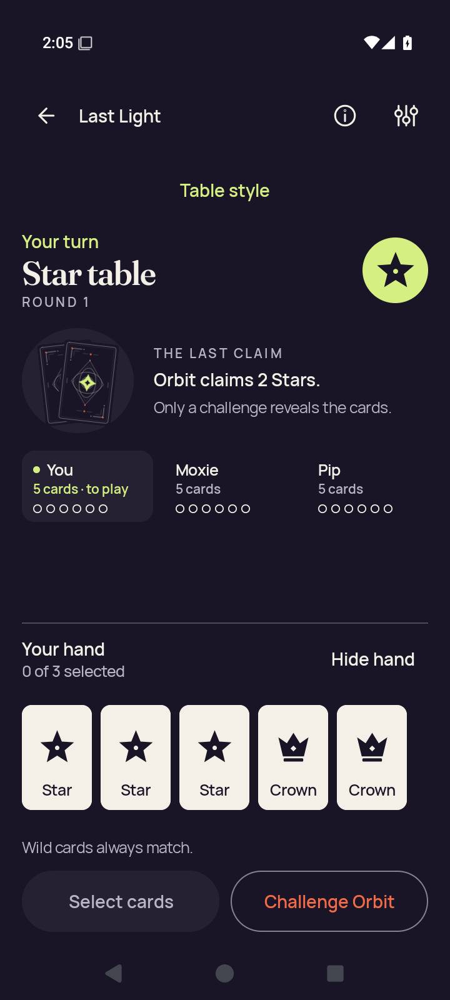
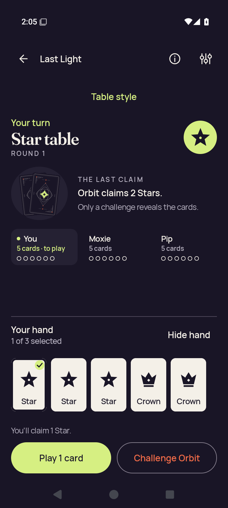
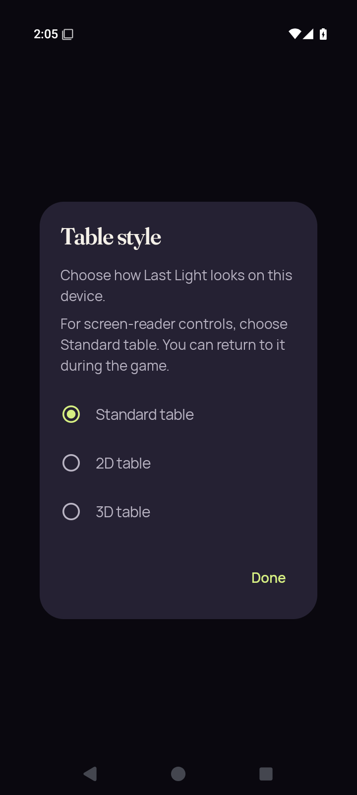
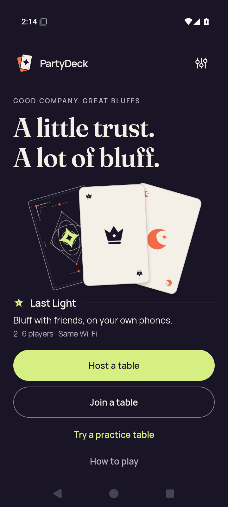
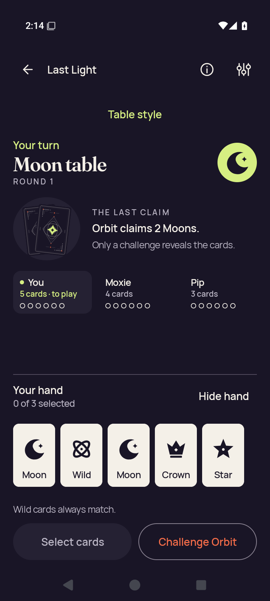
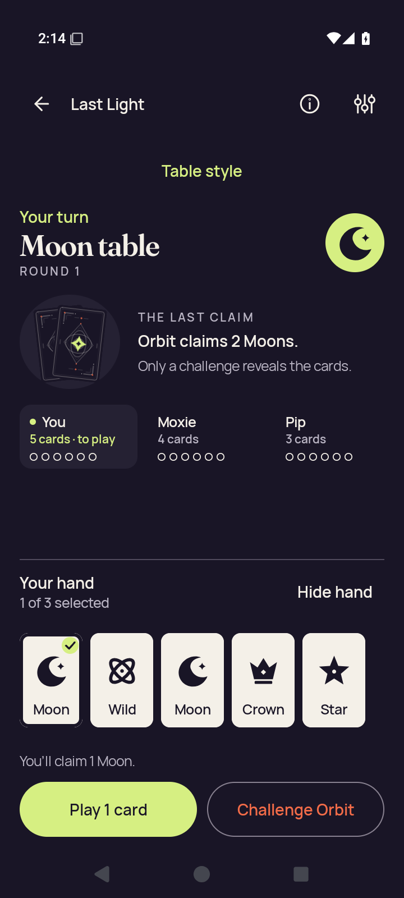
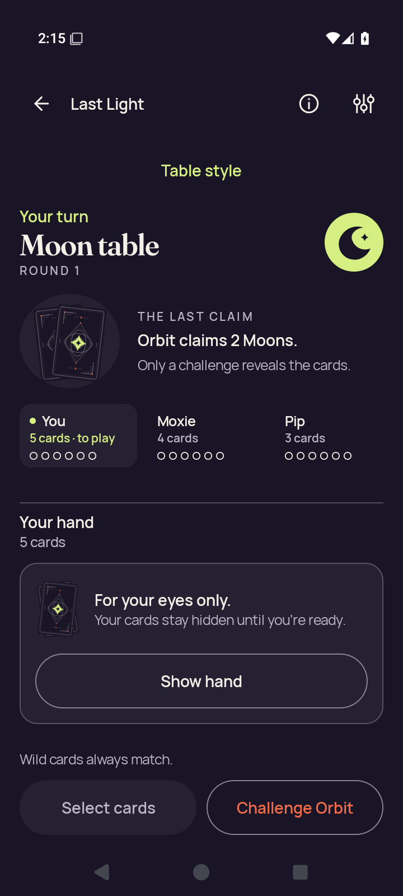

# Android API 35 production Godot selection — both native entries failed

[All collections](../../README.md) · [Original CI run](https://github.com/Apdelrahman1911/PartyDeck/actions/runs/34485028785)

Installation and Compose baseline passed; both 2d.native-entry checks failed after the recorded choice action.

12 original PNG/XML pairs. The 45-second native-activity wait expired with the concealed Compose table retained. No renderer/Ready, 3D, lifecycle, renderer-death or native pixel-privacy acceptance.

Exact source: `fc431ee775990943dfe152f4f20fb9365db4e72d`. Original PNG/XML/JSON bytes and the recorded failure limits are preserved.

## Publication review

Review coverage for these 12 originals: 12 direct original views. Capture identities remain separate when pixels match. The review describes the captured viewport; it adds no native execution or assistive-technology result.

[Completed visual review](../provenance/publication-review/partydeck-gallery-next2-production-visual-review.json) · [Publication copy audit](../../godot-android-adaptive-34485033488/provenance/publication-review/partydeck-gallery-next2-ready-source-audit.json) · [Frozen queue](../../godot-android-adaptive-34485033488/provenance/publication-queue-v1/queue-freeze.json) · [Original copy mapping](../../godot-android-adaptive-34485033488/provenance/publication-queue-v1/copy-paths.tsv) · [Original queue page](../../godot-android-adaptive-34485033488/provenance/publication-queue-v1/payload/docs/screenshots/android-34485028785/godot-session/README.md). The archived queue page retains its original text and relative paths as provenance.

Both distinct final ordinary PNGs were directly viewed for this publication. The source owner’s earlier unviewed status is retained. [Run overview](../README.md).

| Original capture | Scenario and retained limits |
| --- | --- |
|  | **Cold Compose Home — installation passed** Android API 35 x86_64 emulator, production Compose shell, debug APK; text 1.0× [home-cold.png](debug/runtime/captures/home-cold.png); 720 × 1600 px SHA-256: <code>92f5e13514b7725224f25fb5a2177f24c50041b2a09945235e900c858cd9c6eb</code> [Original XML](debug/runtime/captures/home-cold.xml) · [Original capture receipt](debug/runtime/captures/home-cold.json) · [Original result](debug/runtime/godot-session-result.json) Both variants failed 2d.native-entry after the recorded choice action and a 45-second native-activity wait. No native renderer/Ready was observed. 3D, lifecycle, renderer-death and native pixel privacy remain unqualified. **Publication review — direct original view:** The debug native-session cold Home original shows the complete hero, card artwork and all four Home actions. |
|  | **Concealed Compose practice baseline — baseline check passed** Android API 35 x86_64 emulator, production Compose shell, debug APK; text 1.0× [2d-baseline-public.png](debug/runtime/captures/2d-baseline-public.png); 720 × 1600 px SHA-256: <code>ea62cf8d4206441da79bfc3a7c113caf75f307093c798e7cb1ed084c01d4285a</code> [Original XML](debug/runtime/captures/2d-baseline-public.xml) · [Original capture receipt](debug/runtime/captures/2d-baseline-public.json) · [Original result](debug/runtime/godot-session-result.json) Both variants failed 2d.native-entry after the recorded choice action and a 45-second native-activity wait. No native renderer/Ready was observed. 3D, lifecycle, renderer-death and native pixel privacy remain unqualified. **Publication review — direct original view:** The debug native-session Compose baseline shows Your turn, Star table and Orbit claims 2 Stars. Concealed-hand guidance, Show hand and both lower actions fit. |
|  | **First indexed card sample before switching — deselected** Android API 35 x86_64 emulator, production Compose shell, debug APK; text 1.0× [2d-baseline-first-card.png](debug/runtime/captures/2d-baseline-first-card.png); 720 × 1600 px SHA-256: <code>7fb063a3faf1102c3e28d69ad6a89b597600c14b4ee98d5054bbb092c0713365</code> [Original XML](debug/runtime/captures/2d-baseline-first-card.xml) · [Original capture receipt](debug/runtime/captures/2d-baseline-first-card.json) · [Original result](debug/runtime/godot-session-result.json) Both variants failed 2d.native-entry after the recorded choice action and a 45-second native-activity wait. No native renderer/Ready was observed. 3D, lifecycle, renderer-death and native pixel privacy remain unqualified. The original baseline records Star at index 0 in a five-card hand, deselected. **Publication review — direct original view:** The debug first-card baseline shows five complete face-up tiles, 0 of 3 selected and no selection check. Public turn/rank, Hide hand, Wild guidance and lower actions remain visible. |
|  | **Compose first-card selection before switching** Android API 35 x86_64 emulator, production Compose shell, debug APK; text 1.0× [2d-baseline-selected.png](debug/runtime/captures/2d-baseline-selected.png); 720 × 1600 px SHA-256: <code>c5c02674ae46fde4efc0dc7ac70aeaaa4bb1fe8c416739289d5b2930e60485ff</code> [Original XML](debug/runtime/captures/2d-baseline-selected.xml) · [Original capture receipt](debug/runtime/captures/2d-baseline-selected.json) · [Original result](debug/runtime/godot-session-result.json) Both variants failed 2d.native-entry after the recorded choice action and a 45-second native-activity wait. No native renderer/Ready was observed. 3D, lifecycle, renderer-death and native pixel privacy remain unqualified. **Publication review — direct original view:** The debug selected baseline shows a visible check on the first Star, 1 of 3 selected, claim of 1 Star, Play 1 card and Challenge Orbit. It is still the Compose table before the switch. |
|  | **Production Table style modal before the actual 2D choice action** Android API 35 x86_64 emulator, production Compose shell, debug APK; text 1.0× [2d-entry-selector.png](debug/runtime/captures/2d-entry-selector.png); 720 × 1600 px SHA-256: <code>6d67876580c8ed91c869a29b510a4704c66a625c53508d48788b70b140fea873</code> [Original XML](debug/runtime/captures/2d-entry-selector.xml) · [Original capture receipt](debug/runtime/captures/2d-entry-selector.json) · [Original result](debug/runtime/godot-session-result.json) Both variants failed 2d.native-entry after the recorded choice action and a 45-second native-activity wait. No native renderer/Ready was observed. 3D, lifecycle, renderer-death and native pixel privacy remain unqualified. Original pre-tap modal: Standard selected, enabled 2D/3D rows. This frame alone does not prove a native launch. **Publication review — direct original view:** The debug Table style modal fits entirely in portrait: full explanatory text, Standard selected, 2D and 3D alternatives, and Done. The original is captured before the recorded 2D choice. |
|  | **Failed 2D native entry — concealed Compose table remains** Android API 35 x86_64 emulator, production Compose shell, debug APK; text 1.0× [final-diagnostic.png](debug/runtime/captures/final-diagnostic.png); 720 × 1600 px SHA-256: <code>6d517ccf55a9fcb06b8aa08d17ceda70f5d1b116d4a02fec27ee830d3aab2e99</code> [Original XML](debug/runtime/captures/final-diagnostic.xml) · [Original capture receipt](debug/runtime/captures/final-diagnostic.json) · [Original result](debug/runtime/godot-session-result.json) Both variants failed 2d.native-entry after the recorded choice action and a 45-second native-activity wait. No native renderer/Ready was observed. 3D, lifecycle, renderer-death and native pixel privacy remain unqualified. **Publication review — direct original view:** The debug final native-entry diagnostic shows the picker gone and the same concealed Compose Star table, including full Show hand and disabled Select cards. No native renderer or Ready surface is visible; the run receipt records the failed Activity wait. |
|  | **Cold Compose Home — installation passed** Android API 35 x86_64 emulator, production Compose shell, optimized-test-signed APK; text 1.0× [home-cold.png](optimized-test-signed/runtime/captures/home-cold.png); 720 × 1600 px SHA-256: <code>da95dd57814feef6af4afb0822e7b226ff5877431abf2e5c14486c4f5027e59f</code> [Original XML](optimized-test-signed/runtime/captures/home-cold.xml) · [Original capture receipt](optimized-test-signed/runtime/captures/home-cold.json) · [Original result](optimized-test-signed/runtime/godot-session-result.json) Both variants failed 2d.native-entry after the recorded choice action and a 45-second native-activity wait. No native renderer/Ready was observed. 3D, lifecycle, renderer-death and native pixel privacy remain unqualified. **Publication review — direct original view:** The optimized native-session cold Home original shows the complete hero, card artwork and all four Home actions. |
|  | **Concealed Compose practice baseline — baseline check passed** Android API 35 x86_64 emulator, production Compose shell, optimized-test-signed APK; text 1.0× [2d-baseline-public.png](optimized-test-signed/runtime/captures/2d-baseline-public.png); 720 × 1600 px SHA-256: <code>8dd4bbacf26a18774a9d41ef884096e73335653042e8f3d3627bf92a040776b5</code> [Original XML](optimized-test-signed/runtime/captures/2d-baseline-public.xml) · [Original capture receipt](optimized-test-signed/runtime/captures/2d-baseline-public.json) · [Original result](optimized-test-signed/runtime/godot-session-result.json) Both variants failed 2d.native-entry after the recorded choice action and a 45-second native-activity wait. No native renderer/Ready was observed. 3D, lifecycle, renderer-death and native pixel privacy remain unqualified. **Publication review — direct original view:** The optimized native-session Compose baseline shows Your turn, Moon table and Orbit claims 2 Moons. Concealed-hand guidance, Show hand and both lower actions fit. |
|  | **First indexed card sample before switching — deselected** Android API 35 x86_64 emulator, production Compose shell, optimized-test-signed APK; text 1.0× [2d-baseline-first-card.png](optimized-test-signed/runtime/captures/2d-baseline-first-card.png); 720 × 1600 px SHA-256: <code>b4d1651f89356637be29dcf716a9e19ea88c0105c44e831e9c37a1509f6a1d28</code> [Original XML](optimized-test-signed/runtime/captures/2d-baseline-first-card.xml) · [Original capture receipt](optimized-test-signed/runtime/captures/2d-baseline-first-card.json) · [Original result](optimized-test-signed/runtime/godot-session-result.json) Both variants failed 2d.native-entry after the recorded choice action and a 45-second native-activity wait. No native renderer/Ready was observed. 3D, lifecycle, renderer-death and native pixel privacy remain unqualified. The original baseline records Moon at index 0 in a five-card hand, deselected. **Publication review — direct original view:** The optimized first-card baseline shows five complete face-up tiles, 0 of 3 selected and no selection check. Public turn/rank, Hide hand, Wild guidance and lower actions remain visible. |
|  | **Compose first-card selection before switching** Android API 35 x86_64 emulator, production Compose shell, optimized-test-signed APK; text 1.0× [2d-baseline-selected.png](optimized-test-signed/runtime/captures/2d-baseline-selected.png); 720 × 1600 px SHA-256: <code>2456ac0dfaa63c71a8deeae6a0ad029a6d81d91dacbe2bcc43613b0c4517e400</code> [Original XML](optimized-test-signed/runtime/captures/2d-baseline-selected.xml) · [Original capture receipt](optimized-test-signed/runtime/captures/2d-baseline-selected.json) · [Original result](optimized-test-signed/runtime/godot-session-result.json) Both variants failed 2d.native-entry after the recorded choice action and a 45-second native-activity wait. No native renderer/Ready was observed. 3D, lifecycle, renderer-death and native pixel privacy remain unqualified. **Publication review — direct original view:** The optimized selected baseline shows a visible check on the first Moon, 1 of 3 selected, claim of 1 Moon, Play 1 card and Challenge Orbit. It remains the Compose table before switching. |
|  | **Production Table style modal before the actual 2D choice action** Android API 35 x86_64 emulator, production Compose shell, optimized-test-signed APK; text 1.0× [2d-entry-selector.png](optimized-test-signed/runtime/captures/2d-entry-selector.png); 720 × 1600 px SHA-256: <code>eeb7c81839d218fc95da2f20b44c6f007636d963b5df823d3097b9353a4db83b</code> [Original XML](optimized-test-signed/runtime/captures/2d-entry-selector.xml) · [Original capture receipt](optimized-test-signed/runtime/captures/2d-entry-selector.json) · [Original result](optimized-test-signed/runtime/godot-session-result.json) Both variants failed 2d.native-entry after the recorded choice action and a 45-second native-activity wait. No native renderer/Ready was observed. 3D, lifecycle, renderer-death and native pixel privacy remain unqualified. Original pre-tap modal: Standard selected, enabled 2D/3D rows. This frame alone does not prove a native launch. **Publication review — direct original view:** The optimized Table style modal fits entirely in portrait: full explanatory text, Standard selected, 2D and 3D alternatives, and Done. The original is captured before the recorded 2D choice. |
|  | **Failed 2D native entry — concealed Compose table remains** Android API 35 x86_64 emulator, production Compose shell, optimized-test-signed APK; text 1.0× [final-diagnostic.png](optimized-test-signed/runtime/captures/final-diagnostic.png); 720 × 1600 px SHA-256: <code>5fad0e59c80d57406699b2a449939aa2c45f6de09255ebcd154ba6d83decdeb8</code> [Original XML](optimized-test-signed/runtime/captures/final-diagnostic.xml) · [Original capture receipt](optimized-test-signed/runtime/captures/final-diagnostic.json) · [Original result](optimized-test-signed/runtime/godot-session-result.json) Both variants failed 2d.native-entry after the recorded choice action and a 45-second native-activity wait. No native renderer/Ready was observed. 3D, lifecycle, renderer-death and native pixel privacy remain unqualified. **Publication review — direct original view:** The optimized final native-entry diagnostic shows the picker gone and the concealed Compose Moon table, including Show hand and disabled Select cards. No native renderer or Ready surface is visible; the run receipt records the failed Activity wait. |
