# Android API 35 debug — ordinary UI smoke passed

[All collections](../../README.md) · [Original CI run](https://github.com/Apdelrahman1911/PartyDeck/actions/runs/34496267571)

The ordinary UI smoke passed. The separate native phase failed or ended incomplete; no full native qualification follows.

30 named PNG/XML pairs and one distinct final PNG associated with last-ui.xml. Original result JSON and owner mapping are preserved.

Exact source: `410c9386dd88b2ad0ab380e5b8f1f9bf19674b00`. [Original owner capture mapping](../provenance/review/capture-gallery-mapping.json).

## Publication visual review

All 31 original capture identities have review coverage: 28 direct original views, 3 exact matches to direct views in this batch. Each capture keeps its original name, source, dimensions, scenario and recorded time. Matching pixels do not transfer runtime outcomes. No derived image was created.

[Completed visual review](../provenance/publication-review/partydeck-gallery-after-2013-api35-visual-review.json) · [Capture/review binding](../../godot-ios-native-34488350932/provenance/publication-review/partydeck-gallery-2355-publication-review.json) · [Frozen publication queue](../../godot-android-adaptive-34496282263/provenance/publication-queue-v1/queue-freeze.json) · [Original copy mapping](../../godot-android-adaptive-34496282263/provenance/publication-queue-v1/copy-paths.tsv) · [Unchanged queue page](../../godot-android-adaptive-34496282263/provenance/publication-queue-v1/payload/docs/screenshots/android-34496267571/debug/README.md). The archived queue page retains its original text and relative paths as provenance.

| Original capture | Recorded scenario and retained limits |
| --- | --- |
| <a href="final-screen.png">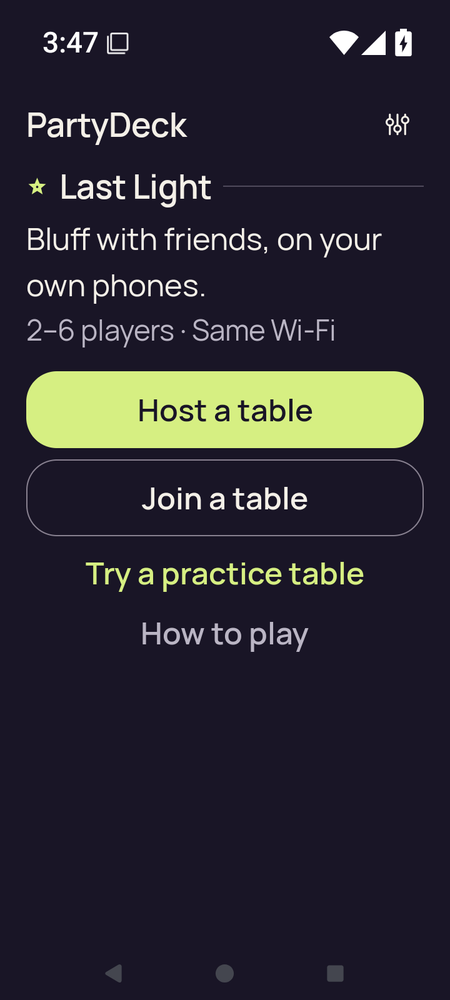</a> | **Final ordinary-smoke diagnostic** Android API 35 x86_64 emulator, production debug APK [final-screen.png](final-screen.png); 720 × 1600 px SHA-256: <code>a817b1c821cf6e56cbddd6c17349f3a80f217e724eb9e9b4365b1d351accc899</code> [Original XML](last-ui.xml) · [Original result](smoke-result.json) Named PNG/XML pair; final-screen.png is associated with the separately retained last-ui.xml. This distinct final original is associated with last-ui.xml, not a named same-stem PNG/XML capture pair. Original ordinary UI smoke passed. The separate publication visual review adds no new accessibility result. Ordinary debug and optimized smokes passed. The debug native phase hit the executed ten-minute wrapper limit during partial 3d.renderer-death; no final debug result or complete check map exists. The optimized renderer aborted during Godot JNI startup. Neither native variant is fully qualified. Selected stills do not establish continuous privacy, engine gameplay or TalkBack speech/traversal. The collector directly viewed seven API35 originals. The later publication review covers every retained capture. Debug partial captures are not a complete native qualification. Current images do not establish engine gameplay, TalkBack speech/traversal or continuous privacy through transitions. Compose JVM snapshots are host-generated UI tests, separate from emulator screenshots. PNG/XML captures are sequential, not atomic. No derived image was viewed or created. **Publication review — direct original view:** The final ordinary capture shows the compact 200% Home summary and complete Host, Join, practice and How to play actions above system navigation. |
| <a href="home.png">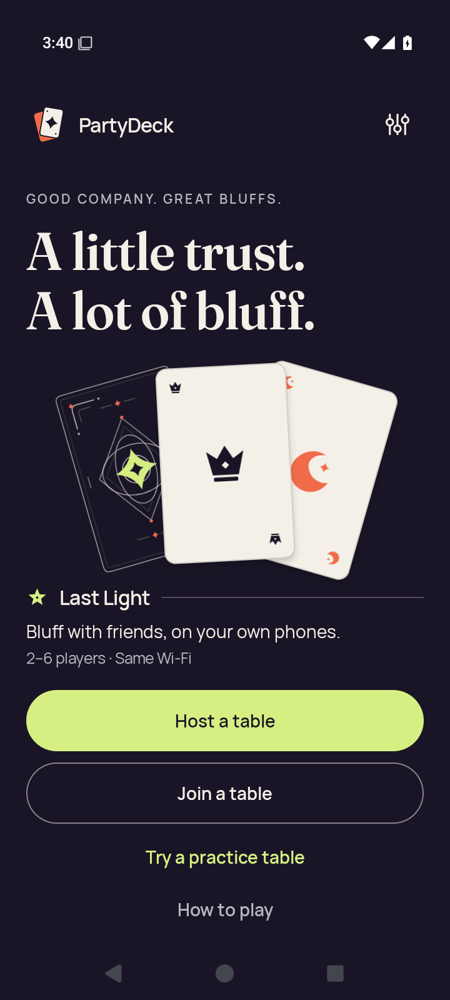</a> | **Home and practice route** Android API 35 x86_64 emulator, production debug APK [home.png](home.png); 720 × 1600 px SHA-256: <code>c590132990c24f546144195f49ef5e01ef5452fdc1c6f09143f86019acec726d</code> [Original XML](home.xml) · [Original result](smoke-result.json) Named PNG/XML pair; final-screen.png is associated with the separately retained last-ui.xml. Original ordinary UI smoke passed. The separate publication visual review adds no new accessibility result. Ordinary debug and optimized smokes passed. The debug native phase hit the executed ten-minute wrapper limit during partial 3d.renderer-death; no final debug result or complete check map exists. The optimized renderer aborted during Godot JNI startup. Neither native variant is fully qualified. Selected stills do not establish continuous privacy, engine gameplay or TalkBack speech/traversal. The collector directly viewed seven API35 originals. The later publication review covers every retained capture. Debug partial captures are not a complete native qualification. Current images do not establish engine gameplay, TalkBack speech/traversal or continuous privacy through transitions. Compose JVM snapshots are host-generated UI tests, separate from emulator screenshots. PNG/XML captures are sequential, not atomic. No derived image was viewed or created. **Publication review — direct original view:** The normal-size Home view contains the complete brand, hero illustration, game summary and four main actions without visible overlap. |
|  | **Host lobby after the sharing flow** Android API 35 x86_64 emulator, production debug APK [host-after-share.png](host-after-share.png); 720 × 1600 px SHA-256: <code>50598feb7fff20abe27555332335d5faab279aef44febb870699eecc1819460e</code> [Original XML](host-after-share.xml) · [Original result](smoke-result.json) Named PNG/XML pair; final-screen.png is associated with the separately retained last-ui.xml. Original ordinary UI smoke passed. The separate publication visual review adds no new accessibility result. Ordinary debug and optimized smokes passed. The debug native phase hit the executed ten-minute wrapper limit during partial 3d.renderer-death; no final debug result or complete check map exists. The optimized renderer aborted during Godot JNI startup. Neither native variant is fully qualified. Selected stills do not establish continuous privacy, engine gameplay or TalkBack speech/traversal. The collector directly viewed seven API35 originals. The later publication review covers every retained capture. Debug partial captures are not a complete native qualification. Current images do not establish engine gameplay, TalkBack speech/traversal or continuous privacy through transitions. Compose JVM snapshots are host-generated UI tests, separate from emulator screenshots. PNG/XML captures are sequential, not atomic. No derived image was viewed or created. **Publication review — direct original view:** The host lobby shows CIPlayer ready, five empty seats, complete invitation and hosting instructions, and disabled Deal the cards. No invitation value is displayed. |
| <a href="host-lobby.png">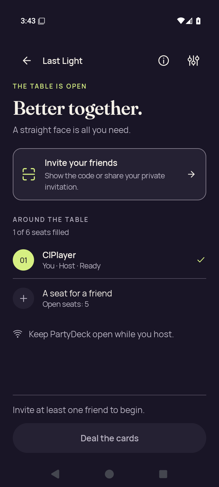</a> | **Host lobby** Android API 35 x86_64 emulator, production debug APK [host-lobby.png](host-lobby.png); 720 × 1600 px SHA-256: <code>50598feb7fff20abe27555332335d5faab279aef44febb870699eecc1819460e</code> [Original XML](host-lobby.xml) · [Original result](smoke-result.json) Named PNG/XML pair; final-screen.png is associated with the separately retained last-ui.xml. Original ordinary UI smoke passed. The separate publication visual review adds no new accessibility result. Ordinary debug and optimized smokes passed. The debug native phase hit the executed ten-minute wrapper limit during partial 3d.renderer-death; no final debug result or complete check map exists. The optimized renderer aborted during Godot JNI startup. Neither native variant is fully qualified. Selected stills do not establish continuous privacy, engine gameplay or TalkBack speech/traversal. The collector directly viewed seven API35 originals. The later publication review covers every retained capture. Debug partial captures are not a complete native qualification. Current images do not establish engine gameplay, TalkBack speech/traversal or continuous privacy through transitions. Compose JVM snapshots are host-generated UI tests, separate from emulator screenshots. PNG/XML captures are sequential, not atomic. No derived image was viewed or created. **Publication review — exact match to a directly viewed original in this batch:** The host lobby shows CIPlayer ready, five empty seats, complete invitation and hosting instructions, and disabled Deal the cards. No invitation value is displayed. [Reviewed matching original](host-after-share.png); capture context remains separate. |
|  | **Home after leaving the host lobby** Android API 35 x86_64 emulator, production debug APK [host-returned-home.png](host-returned-home.png); 720 × 1600 px SHA-256: <code>365c9628a9355b876c71b4cff5fc5ae37b9ed18ba2386e119034a042bb702f2b</code> [Original XML](host-returned-home.xml) · [Original result](smoke-result.json) Named PNG/XML pair; final-screen.png is associated with the separately retained last-ui.xml. Original ordinary UI smoke passed. The separate publication visual review adds no new accessibility result. Ordinary debug and optimized smokes passed. The debug native phase hit the executed ten-minute wrapper limit during partial 3d.renderer-death; no final debug result or complete check map exists. The optimized renderer aborted during Godot JNI startup. Neither native variant is fully qualified. Selected stills do not establish continuous privacy, engine gameplay or TalkBack speech/traversal. The collector directly viewed seven API35 originals. The later publication review covers every retained capture. Debug partial captures are not a complete native qualification. Current images do not establish engine gameplay, TalkBack speech/traversal or continuous privacy through transitions. Compose JVM snapshots are host-generated UI tests, separate from emulator screenshots. PNG/XML captures are sequential, not atomic. No derived image was viewed or created. **Publication review — direct original view:** The returned Home view shows complete hero artwork, game summary and Host, Join, practice and How to play actions. |
| <a href="join-invalid.png">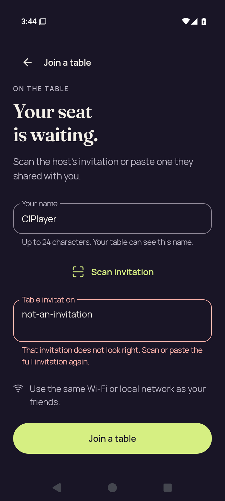</a> | **Invalid join input feedback** Android API 35 x86_64 emulator, production debug APK [join-invalid.png](join-invalid.png); 720 × 1600 px SHA-256: <code>07077d1c84e23f881c87dd3a3a674b79213edd25775ebfcbfc7a4232a620af04</code> [Original XML](join-invalid.xml) · [Original result](smoke-result.json) Named PNG/XML pair; final-screen.png is associated with the separately retained last-ui.xml. Original ordinary UI smoke passed. The separate publication visual review adds no new accessibility result. Ordinary debug and optimized smokes passed. The debug native phase hit the executed ten-minute wrapper limit during partial 3d.renderer-death; no final debug result or complete check map exists. The optimized renderer aborted during Godot JNI startup. Neither native variant is fully qualified. Selected stills do not establish continuous privacy, engine gameplay or TalkBack speech/traversal. The collector directly viewed seven API35 originals. The later publication review covers every retained capture. Debug partial captures are not a complete native qualification. Current images do not establish engine gameplay, TalkBack speech/traversal or continuous privacy through transitions. Compose JVM snapshots are host-generated UI tests, separate from emulator screenshots. PNG/XML captures are sequential, not atomic. No derived image was viewed or created. **Publication review — direct original view:** The invalid invitation screen shows the test value, a readable two-line validation message, complete name field and Scan/Join controls. All content fits above system navigation. |
| <a href="join-name-soft-ime.png">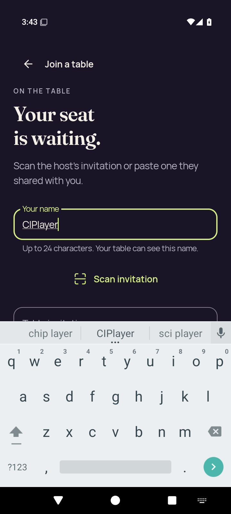</a> | **Join name field with the software keyboard** Android API 35 x86_64 emulator, production debug APK [join-name-soft-ime.png](join-name-soft-ime.png); 720 × 1600 px SHA-256: <code>cf536f57f34655efc6863311d48fd0585e58e3ea87a4ebdad5e6af4f76abc81b</code> [Original XML](join-name-soft-ime.xml) · [Original result](smoke-result.json) Named PNG/XML pair; final-screen.png is associated with the separately retained last-ui.xml. Original ordinary UI smoke passed. The separate publication visual review adds no new accessibility result. Ordinary debug and optimized smokes passed. The debug native phase hit the executed ten-minute wrapper limit during partial 3d.renderer-death; no final debug result or complete check map exists. The optimized renderer aborted during Godot JNI startup. Neither native variant is fully qualified. Selected stills do not establish continuous privacy, engine gameplay or TalkBack speech/traversal. The collector directly viewed seven API35 originals. The later publication review covers every retained capture. Debug partial captures are not a complete native qualification. Current images do not establish engine gameplay, TalkBack speech/traversal or continuous privacy through transitions. Compose JVM snapshots are host-generated UI tests, separate from emulator screenshots. PNG/XML captures are sequential, not atomic. No derived image was viewed or created. **Publication review — direct original view:** The focused name field, helper text and Scan invitation action remain visible above the soft keyboard. The invitation field begins at the keyboard edge; lower join content is outside this viewport. |
|  | **Home action checkpoints — large text** Android API 35 x86_64 emulator, production debug APK [large-text-home-actions.png](large-text-home-actions.png); 720 × 1600 px SHA-256: <code>462eb820d9d1ff08d6c6adeadd6b84eee2870510ca7b6413f02f45f0490f666d</code> [Original XML](large-text-home-actions.xml) · [Original result](smoke-result.json) Named PNG/XML pair; final-screen.png is associated with the separately retained last-ui.xml. Original ordinary UI smoke passed. The separate publication visual review adds no new accessibility result. Ordinary debug and optimized smokes passed. The debug native phase hit the executed ten-minute wrapper limit during partial 3d.renderer-death; no final debug result or complete check map exists. The optimized renderer aborted during Godot JNI startup. Neither native variant is fully qualified. Selected stills do not establish continuous privacy, engine gameplay or TalkBack speech/traversal. The collector directly viewed seven API35 originals. The later publication review covers every retained capture. Debug partial captures are not a complete native qualification. Current images do not establish engine gameplay, TalkBack speech/traversal or continuous privacy through transitions. Compose JVM snapshots are host-generated UI tests, separate from emulator screenshots. PNG/XML captures are sequential, not atomic. No derived image was viewed or created. **Publication review — direct original view:** The large-text Home view shows the compact Last Light summary and four complete main actions; the settings icon has a visible pressed/focus background. |
| <a href="large-text-join-invalid.png">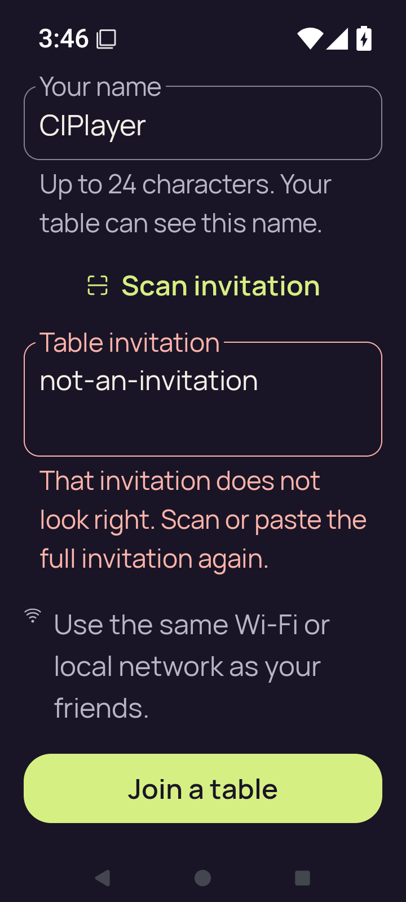</a> | **Invalid join input feedback — large text** Android API 35 x86_64 emulator, production debug APK [large-text-join-invalid.png](large-text-join-invalid.png); 720 × 1600 px SHA-256: <code>717d63a43487a18a5678eb597a228ea6c73637258c636568d832a8b48062bd51</code> [Original XML](large-text-join-invalid.xml) · [Original result](smoke-result.json) Named PNG/XML pair; final-screen.png is associated with the separately retained last-ui.xml. Original ordinary UI smoke passed. The separate publication visual review adds no new accessibility result. Ordinary debug and optimized smokes passed. The debug native phase hit the executed ten-minute wrapper limit during partial 3d.renderer-death; no final debug result or complete check map exists. The optimized renderer aborted during Godot JNI startup. Neither native variant is fully qualified. Selected stills do not establish continuous privacy, engine gameplay or TalkBack speech/traversal. The collector directly viewed seven API35 originals. The later publication review covers every retained capture. Debug partial captures are not a complete native qualification. Current images do not establish engine gameplay, TalkBack speech/traversal or continuous privacy through transitions. Compose JVM snapshots are host-generated UI tests, separate from emulator screenshots. PNG/XML captures are sequential, not atomic. No derived image was viewed or created. **Publication review — direct original view:** The scrolled large-text join view includes the complete name field, invalid test invitation, validation message, local-network instruction and Join a table button. |
| <a href="large-text-join-name-soft-ime.png">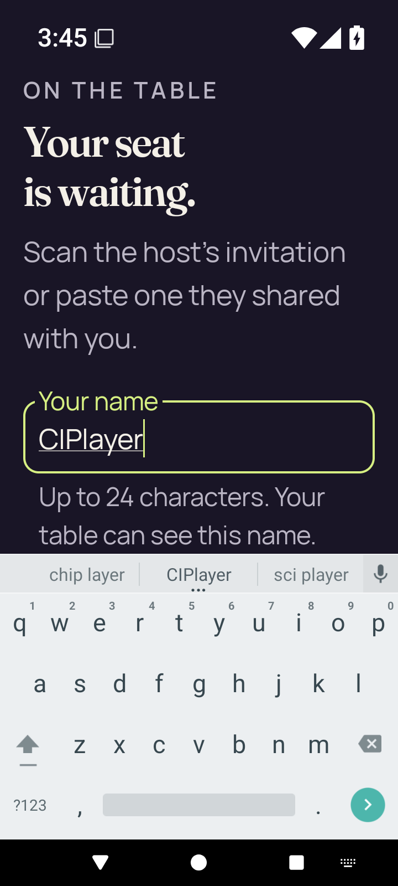</a> | **Join name field with the software keyboard — large text** Android API 35 x86_64 emulator, production debug APK [large-text-join-name-soft-ime.png](large-text-join-name-soft-ime.png); 720 × 1600 px SHA-256: <code>25d75d08980db2fe49bd9db3e234245df489b581d76140b7ee6762df85f7bad1</code> [Original XML](large-text-join-name-soft-ime.xml) · [Original result](smoke-result.json) Named PNG/XML pair; final-screen.png is associated with the separately retained last-ui.xml. Original ordinary UI smoke passed. The separate publication visual review adds no new accessibility result. Ordinary debug and optimized smokes passed. The debug native phase hit the executed ten-minute wrapper limit during partial 3d.renderer-death; no final debug result or complete check map exists. The optimized renderer aborted during Godot JNI startup. Neither native variant is fully qualified. Selected stills do not establish continuous privacy, engine gameplay or TalkBack speech/traversal. The collector directly viewed seven API35 originals. The later publication review covers every retained capture. Debug partial captures are not a complete native qualification. Current images do not establish engine gameplay, TalkBack speech/traversal or continuous privacy through transitions. Compose JVM snapshots are host-generated UI tests, separate from emulator screenshots. PNG/XML captures are sequential, not atomic. No derived image was viewed or created. **Publication review — direct original view:** At large text, the focused name field and its wrapped helper text fit above the soft keyboard. The invitation and join controls lie below this captured position. |
| <a href="large-text-play-action.png">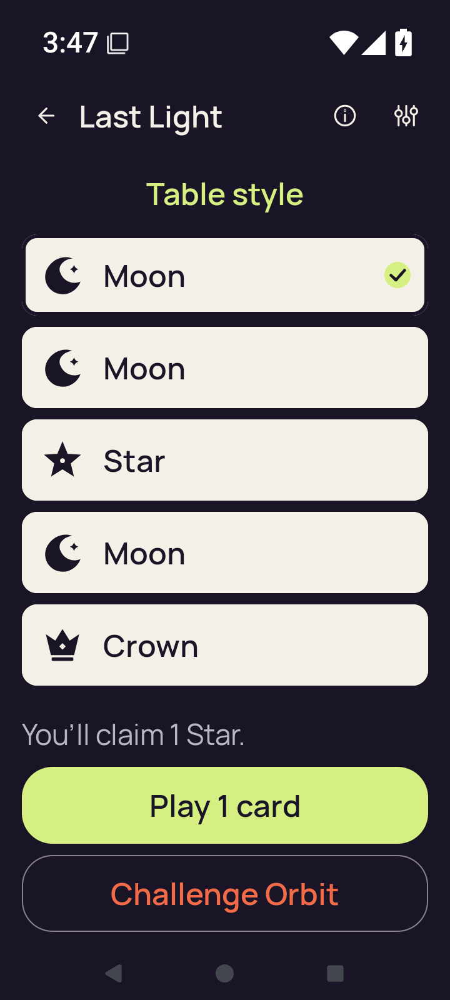</a> | **Play action reachability checkpoint — large text** Android API 35 x86_64 emulator, production debug APK [large-text-play-action.png](large-text-play-action.png); 720 × 1600 px SHA-256: <code>6e9ef42eafdaa77e2ec8eac931012567900dffc635a22b4ce84ec8bad87ccba1</code> [Original XML](large-text-play-action.xml) · [Original result](smoke-result.json) Named PNG/XML pair; final-screen.png is associated with the separately retained last-ui.xml. Recorded action reachability is not a second accepted-play claim. Original ordinary UI smoke passed. The separate publication visual review adds no new accessibility result. Ordinary debug and optimized smokes passed. The debug native phase hit the executed ten-minute wrapper limit during partial 3d.renderer-death; no final debug result or complete check map exists. The optimized renderer aborted during Godot JNI startup. Neither native variant is fully qualified. Selected stills do not establish continuous privacy, engine gameplay or TalkBack speech/traversal. The collector directly viewed seven API35 originals. The later publication review covers every retained capture. Debug partial captures are not a complete native qualification. Current images do not establish engine gameplay, TalkBack speech/traversal or continuous privacy through transitions. Compose JVM snapshots are host-generated UI tests, separate from emulator screenshots. PNG/XML captures are sequential, not atomic. No derived image was viewed or created. **Publication review — direct original view:** The large-text hand/action view shows all five complete card rows, a checked Moon, the one-Star claim instruction and complete Play 1 card and Challenge Orbit actions. |
| <a href="large-text-private-hand.png">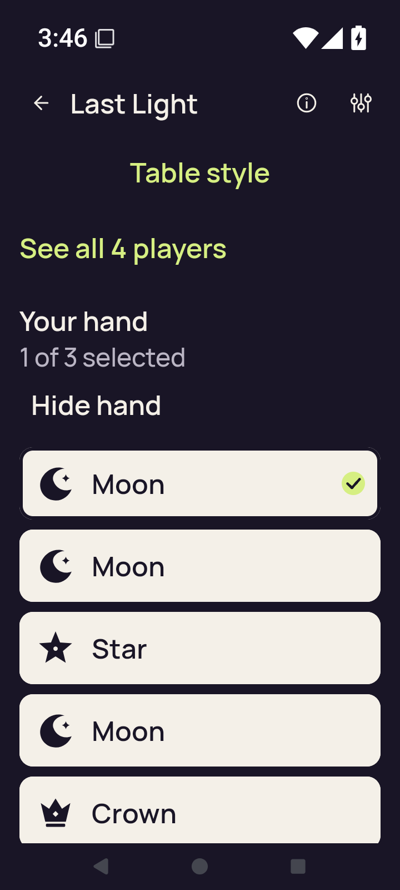</a> | **Own-hand checkpoint — large text** Android API 35 x86_64 emulator, production debug APK [large-text-private-hand.png](large-text-private-hand.png); 720 × 1600 px SHA-256: <code>5314207466976944622b2ec9e6864738d627cf2ed61feb09be576c05c782d205</code> [Original XML](large-text-private-hand.xml) · [Original result](smoke-result.json) Named PNG/XML pair; final-screen.png is associated with the separately retained last-ui.xml. Original ordinary UI smoke passed. The separate publication visual review adds no new accessibility result. Ordinary debug and optimized smokes passed. The debug native phase hit the executed ten-minute wrapper limit during partial 3d.renderer-death; no final debug result or complete check map exists. The optimized renderer aborted during Godot JNI startup. Neither native variant is fully qualified. Selected stills do not establish continuous privacy, engine gameplay or TalkBack speech/traversal. The collector directly viewed seven API35 originals. The later publication review covers every retained capture. Debug partial captures are not a complete native qualification. Current images do not establish engine gameplay, TalkBack speech/traversal or continuous privacy through transitions. Compose JVM snapshots are host-generated UI tests, separate from emulator screenshots. PNG/XML captures are sequential, not atomic. No derived image was viewed or created. **Publication review — direct original view:** The large-text hand view shows 1 of 3 selected, Hide hand and the checked first Moon. The fifth Crown label is readable but its row bottom meets the lower viewport edge; actions are below this position. |
| <a href="large-text-rules-intro.png">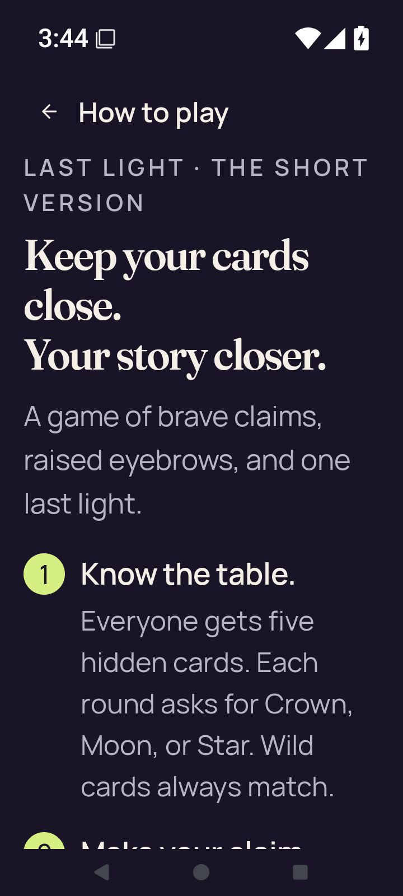</a> | **Rules introduction — large text** Android API 35 x86_64 emulator, production debug APK [large-text-rules-intro.png](large-text-rules-intro.png); 720 × 1600 px SHA-256: <code>4d9b77774a344548173b97b6f3e8a3b8acdd464bde9bfbfd65bd87b60ffe7df8</code> [Original XML](large-text-rules-intro.xml) · [Original result](smoke-result.json) Named PNG/XML pair; final-screen.png is associated with the separately retained last-ui.xml. Original ordinary UI smoke passed. The separate publication visual review adds no new accessibility result. Ordinary debug and optimized smokes passed. The debug native phase hit the executed ten-minute wrapper limit during partial 3d.renderer-death; no final debug result or complete check map exists. The optimized renderer aborted during Godot JNI startup. Neither native variant is fully qualified. Selected stills do not establish continuous privacy, engine gameplay or TalkBack speech/traversal. The collector directly viewed seven API35 originals. The later publication review covers every retained capture. Debug partial captures are not a complete native qualification. Current images do not establish engine gameplay, TalkBack speech/traversal or continuous privacy through transitions. Compose JVM snapshots are host-generated UI tests, separate from emulator screenshots. PNG/XML captures are sequential, not atomic. No derived image was viewed or created. **Publication review — direct original view:** The large-text rules introduction and complete first rule are readable with wrapping. The second rule begins and is clipped at the lower edge. |
| <a href="large-text-rules-last-step.png">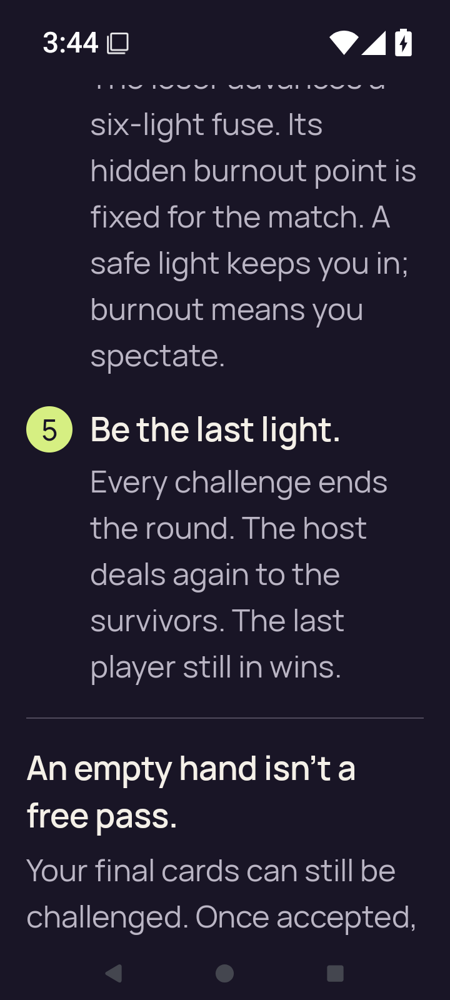</a> | **Rules final step — large text** Android API 35 x86_64 emulator, production debug APK [large-text-rules-last-step.png](large-text-rules-last-step.png); 720 × 1600 px SHA-256: <code>5254926fa02f5dc9119de24ddd638a5405128759e896068988952226e590d055</code> [Original XML](large-text-rules-last-step.xml) · [Original result](smoke-result.json) Named PNG/XML pair; final-screen.png is associated with the separately retained last-ui.xml. Original ordinary UI smoke passed. The separate publication visual review adds no new accessibility result. Ordinary debug and optimized smokes passed. The debug native phase hit the executed ten-minute wrapper limit during partial 3d.renderer-death; no final debug result or complete check map exists. The optimized renderer aborted during Godot JNI startup. Neither native variant is fully qualified. Selected stills do not establish continuous privacy, engine gameplay or TalkBack speech/traversal. The collector directly viewed seven API35 originals. The later publication review covers every retained capture. Debug partial captures are not a complete native qualification. Current images do not establish engine gameplay, TalkBack speech/traversal or continuous privacy through transitions. Compose JVM snapshots are host-generated UI tests, separate from emulator screenshots. PNG/XML captures are sequential, not atomic. No derived image was viewed or created. **Publication review — direct original view:** The scrolled large-text rules frame shows the complete Be the last light step. The prior step is cut at the top and the empty-hand explanation continues below the viewport. |
| <a href="large-text-rules-practice-action.png">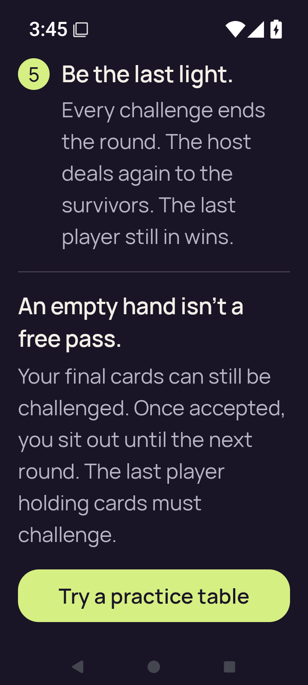</a> | **Rules Practice action checkpoint — large text** Android API 35 x86_64 emulator, production debug APK [large-text-rules-practice-action.png](large-text-rules-practice-action.png); 720 × 1600 px SHA-256: <code>4c13f00a56365425b410cb96ba46e4fa6d57c17d1db0beb1fed1aee8fa41dad6</code> [Original XML](large-text-rules-practice-action.xml) · [Original result](smoke-result.json) Named PNG/XML pair; final-screen.png is associated with the separately retained last-ui.xml. Original ordinary UI smoke passed. The separate publication visual review adds no new accessibility result. Ordinary debug and optimized smokes passed. The debug native phase hit the executed ten-minute wrapper limit during partial 3d.renderer-death; no final debug result or complete check map exists. The optimized renderer aborted during Godot JNI startup. Neither native variant is fully qualified. Selected stills do not establish continuous privacy, engine gameplay or TalkBack speech/traversal. The collector directly viewed seven API35 originals. The later publication review covers every retained capture. Debug partial captures are not a complete native qualification. Current images do not establish engine gameplay, TalkBack speech/traversal or continuous privacy through transitions. Compose JVM snapshots are host-generated UI tests, separate from emulator screenshots. PNG/XML captures are sequential, not atomic. No derived image was viewed or created. **Publication review — direct original view:** The bottom of the large-text rules page shows the complete last rule, empty-hand explanation and Try a practice table action. |
| <a href="large-text-rules-practice-entered.png">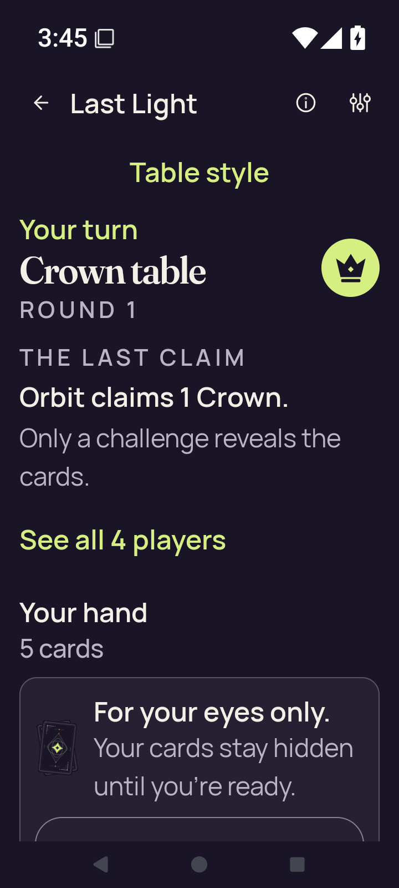</a> | **Practice entered from Rules — large text** Android API 35 x86_64 emulator, production debug APK [large-text-rules-practice-entered.png](large-text-rules-practice-entered.png); 720 × 1600 px SHA-256: <code>4e882587757973ff4a1461555473a2566b35337648bd36bf962808ba9e72d025</code> [Original XML](large-text-rules-practice-entered.xml) · [Original result](smoke-result.json) Named PNG/XML pair; final-screen.png is associated with the separately retained last-ui.xml. Original ordinary UI smoke passed. The separate publication visual review adds no new accessibility result. Ordinary debug and optimized smokes passed. The debug native phase hit the executed ten-minute wrapper limit during partial 3d.renderer-death; no final debug result or complete check map exists. The optimized renderer aborted during Godot JNI startup. Neither native variant is fully qualified. Selected stills do not establish continuous privacy, engine gameplay or TalkBack speech/traversal. The collector directly viewed seven API35 originals. The later publication review covers every retained capture. Debug partial captures are not a complete native qualification. Current images do not establish engine gameplay, TalkBack speech/traversal or continuous privacy through transitions. Compose JVM snapshots are host-generated UI tests, separate from emulator screenshots. PNG/XML captures are sequential, not atomic. No derived image was viewed or created. **Publication review — direct original view:** The large-text practice entry shows readable Crown/round and Orbit claim details, See all 4 players and the concealed-hand message. Show hand begins at the bottom and is outside the captured viewport. |
| <a href="large-text-rules-returned-home.png">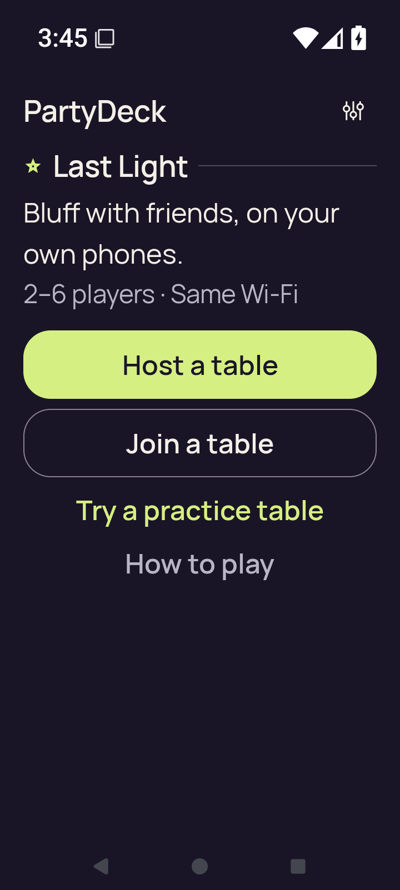</a> | **Home after leaving Rules-entered practice — large text** Android API 35 x86_64 emulator, production debug APK [large-text-rules-returned-home.png](large-text-rules-returned-home.png); 720 × 1600 px SHA-256: <code>df599d2b8cb0d024c789ebd051465b2c9ede4c04f9e584883a6d45180e4f5233</code> [Original XML](large-text-rules-returned-home.xml) · [Original result](smoke-result.json) Named PNG/XML pair; final-screen.png is associated with the separately retained last-ui.xml. Original ordinary UI smoke passed. The separate publication visual review adds no new accessibility result. Ordinary debug and optimized smokes passed. The debug native phase hit the executed ten-minute wrapper limit during partial 3d.renderer-death; no final debug result or complete check map exists. The optimized renderer aborted during Godot JNI startup. Neither native variant is fully qualified. Selected stills do not establish continuous privacy, engine gameplay or TalkBack speech/traversal. The collector directly viewed seven API35 originals. The later publication review covers every retained capture. Debug partial captures are not a complete native qualification. Current images do not establish engine gameplay, TalkBack speech/traversal or continuous privacy through transitions. Compose JVM snapshots are host-generated UI tests, separate from emulator screenshots. PNG/XML captures are sequential, not atomic. No derived image was viewed or created. **Publication review — direct original view:** The returned large-text Home view shows the compact game summary and complete Host, Join, practice and How to play controls. |
| <a href="large-text-settings.png">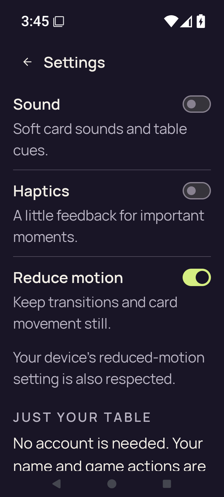</a> | **Settings checkpoint — large text** Android API 35 x86_64 emulator, production debug APK [large-text-settings.png](large-text-settings.png); 720 × 1600 px SHA-256: <code>651fd076010c74a887a578b2173d50569642d6f9bd9b98e8d1985af6d860d1ab</code> [Original XML](large-text-settings.xml) · [Original result](smoke-result.json) Named PNG/XML pair; final-screen.png is associated with the separately retained last-ui.xml. Original ordinary UI smoke passed. The separate publication visual review adds no new accessibility result. Ordinary debug and optimized smokes passed. The debug native phase hit the executed ten-minute wrapper limit during partial 3d.renderer-death; no final debug result or complete check map exists. The optimized renderer aborted during Godot JNI startup. Neither native variant is fully qualified. Selected stills do not establish continuous privacy, engine gameplay or TalkBack speech/traversal. The collector directly viewed seven API35 originals. The later publication review covers every retained capture. Debug partial captures are not a complete native qualification. Current images do not establish engine gameplay, TalkBack speech/traversal or continuous privacy through transitions. Compose JVM snapshots are host-generated UI tests, separate from emulator screenshots. PNG/XML captures are sequential, not atomic. No derived image was viewed or created. **Publication review — direct original view:** Large-text Settings shows complete Sound, Haptics and Reduce motion rows and device-setting copy. The table/privacy paragraph continues below the lower viewport edge. |
| <a href="practice-after-play.png">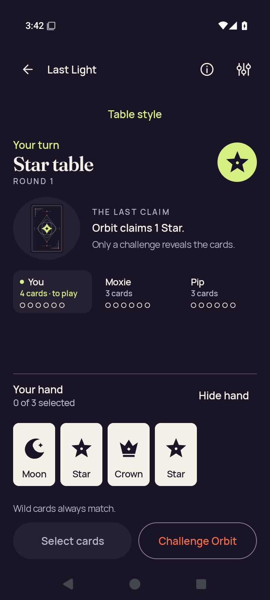</a> | **Practice after the recorded play** Android API 35 x86_64 emulator, production debug APK [practice-after-play.png](practice-after-play.png); 720 × 1600 px SHA-256: <code>2b78ee05c1fc2f62ea0f6733847f941119ebe9ed86125129d6e7b62c060bd43f</code> [Original XML](practice-after-play.xml) · [Original result](smoke-result.json) Named PNG/XML pair; final-screen.png is associated with the separately retained last-ui.xml. Original ordinary UI smoke passed. The separate publication visual review adds no new accessibility result. Ordinary debug and optimized smokes passed. The debug native phase hit the executed ten-minute wrapper limit during partial 3d.renderer-death; no final debug result or complete check map exists. The optimized renderer aborted during Godot JNI startup. Neither native variant is fully qualified. Selected stills do not establish continuous privacy, engine gameplay or TalkBack speech/traversal. The collector directly viewed seven API35 originals. The later publication review covers every retained capture. Debug partial captures are not a complete native qualification. Current images do not establish engine gameplay, TalkBack speech/traversal or continuous privacy through transitions. Compose JVM snapshots are host-generated UI tests, separate from emulator screenshots. PNG/XML captures are sequential, not atomic. No derived image was viewed or created. **Publication review — direct original view:** The after-play Standard table shows four complete card faces and labels, 0 of 3 selected, Orbit’s one-Star claim and complete Select cards/Challenge Orbit actions. |
| <a href="practice-concealed.png">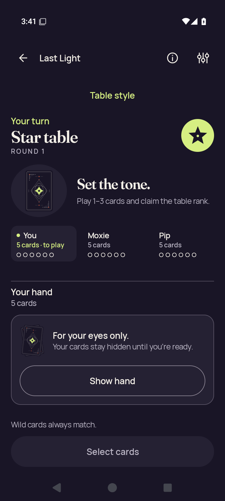</a> | **Practice with the hand concealed** Android API 35 x86_64 emulator, production debug APK [practice-concealed.png](practice-concealed.png); 720 × 1600 px SHA-256: <code>ff20b0af3a6caf099c07e10d669a54843053c673b67ed02408d66da0fa7d5fd2</code> [Original XML](practice-concealed.xml) · [Original result](smoke-result.json) Named PNG/XML pair; final-screen.png is associated with the separately retained last-ui.xml. Original ordinary UI smoke passed. The separate publication visual review adds no new accessibility result. Ordinary debug and optimized smokes passed. The debug native phase hit the executed ten-minute wrapper limit during partial 3d.renderer-death; no final debug result or complete check map exists. The optimized renderer aborted during Godot JNI startup. Neither native variant is fully qualified. Selected stills do not establish continuous privacy, engine gameplay or TalkBack speech/traversal. The collector directly viewed seven API35 originals. The later publication review covers every retained capture. Debug partial captures are not a complete native qualification. Current images do not establish engine gameplay, TalkBack speech/traversal or continuous privacy through transitions. Compose JVM snapshots are host-generated UI tests, separate from emulator screenshots. PNG/XML captures are sequential, not atomic. No derived image was viewed or created. **Publication review — direct original view:** The initial Standard Star table shows readable turn instructions, a complete concealed-hand panel and Show hand, with disabled Select cards at the bottom. |
|  | **Practice concealed after resume** Android API 35 x86_64 emulator, production debug APK [practice-resumed-concealed.png](practice-resumed-concealed.png); 720 × 1600 px SHA-256: <code>2f54653c51ac703e1c27630167f7d9ac2703bfde390e3a8b1d682a3ddb61e558</code> [Original XML](practice-resumed-concealed.xml) · [Original result](smoke-result.json) Named PNG/XML pair; final-screen.png is associated with the separately retained last-ui.xml. Original ordinary UI smoke passed. The separate publication visual review adds no new accessibility result. Ordinary debug and optimized smokes passed. The debug native phase hit the executed ten-minute wrapper limit during partial 3d.renderer-death; no final debug result or complete check map exists. The optimized renderer aborted during Godot JNI startup. Neither native variant is fully qualified. Selected stills do not establish continuous privacy, engine gameplay or TalkBack speech/traversal. The collector directly viewed seven API35 originals. The later publication review covers every retained capture. Debug partial captures are not a complete native qualification. Current images do not establish engine gameplay, TalkBack speech/traversal or continuous privacy through transitions. Compose JVM snapshots are host-generated UI tests, separate from emulator screenshots. PNG/XML captures are sequential, not atomic. No derived image was viewed or created. **Publication review — direct original view:** The resumed Standard Star table shows the complete concealed-hand message, Show hand and disabled Select cards with no private ranks visible. |
|  | **Home after leaving practice** Android API 35 x86_64 emulator, production debug APK [practice-returned-home.png](practice-returned-home.png); 720 × 1600 px SHA-256: <code>3149e07ffa9d532e0dc7bb83c4becdb31c22f31320c17dc526564a11532c6c9b</code> [Original XML](practice-returned-home.xml) · [Original result](smoke-result.json) Named PNG/XML pair; final-screen.png is associated with the separately retained last-ui.xml. Original ordinary UI smoke passed. The separate publication visual review adds no new accessibility result. Ordinary debug and optimized smokes passed. The debug native phase hit the executed ten-minute wrapper limit during partial 3d.renderer-death; no final debug result or complete check map exists. The optimized renderer aborted during Godot JNI startup. Neither native variant is fully qualified. Selected stills do not establish continuous privacy, engine gameplay or TalkBack speech/traversal. The collector directly viewed seven API35 originals. The later publication review covers every retained capture. Debug partial captures are not a complete native qualification. Current images do not establish engine gameplay, TalkBack speech/traversal or continuous privacy through transitions. Compose JVM snapshots are host-generated UI tests, separate from emulator screenshots. PNG/XML captures are sequential, not atomic. No derived image was viewed or created. **Publication review — direct original view:** The returned normal-size Home view shows complete hero artwork, summary and four main actions. |
| <a href="practice-selected.png">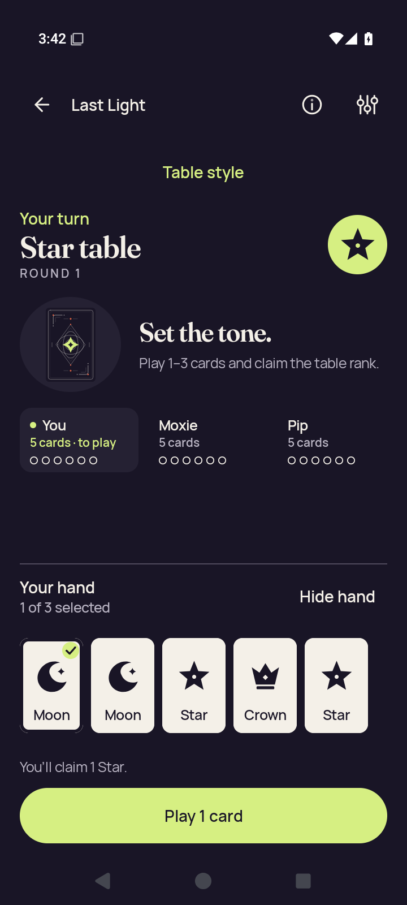</a> | **Practice card selection checkpoint** Android API 35 x86_64 emulator, production debug APK [practice-selected.png](practice-selected.png); 720 × 1600 px SHA-256: <code>d76a807857337d6fe2fd35ded27306c9002cad0ada515faf36b299043cd9e226</code> [Original XML](practice-selected.xml) · [Original result](smoke-result.json) Named PNG/XML pair; final-screen.png is associated with the separately retained last-ui.xml. Original ordinary UI smoke passed. The separate publication visual review adds no new accessibility result. Ordinary debug and optimized smokes passed. The debug native phase hit the executed ten-minute wrapper limit during partial 3d.renderer-death; no final debug result or complete check map exists. The optimized renderer aborted during Godot JNI startup. Neither native variant is fully qualified. Selected stills do not establish continuous privacy, engine gameplay or TalkBack speech/traversal. The collector directly viewed seven API35 originals. The later publication review covers every retained capture. Debug partial captures are not a complete native qualification. Current images do not establish engine gameplay, TalkBack speech/traversal or continuous privacy through transitions. Compose JVM snapshots are host-generated UI tests, separate from emulator screenshots. PNG/XML captures are sequential, not atomic. No derived image was viewed or created. **Publication review — direct original view:** The normal-size Standard hand shows five complete faces and labels, a checked Moon, 1 of 3 selected and complete Play 1 card with the one-Star claim instruction. |
| <a href="rules-intro.png">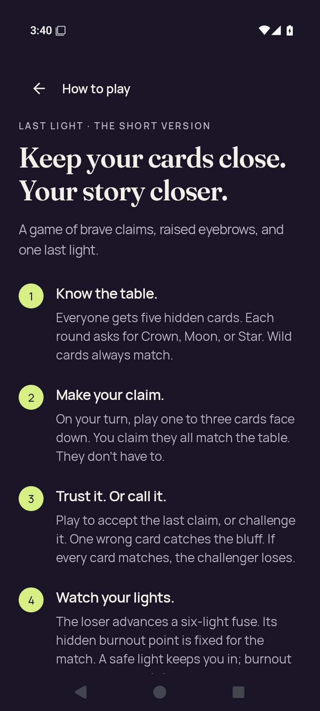</a> | **Rules introduction** Android API 35 x86_64 emulator, production debug APK [rules-intro.png](rules-intro.png); 720 × 1600 px SHA-256: <code>7128c9da334d9c7458ab37352f14b8e5b1e65e7b6a7d572d9f2c5b947c1e33ff</code> [Original XML](rules-intro.xml) · [Original result](smoke-result.json) Named PNG/XML pair; final-screen.png is associated with the separately retained last-ui.xml. Original ordinary UI smoke passed. The separate publication visual review adds no new accessibility result. Ordinary debug and optimized smokes passed. The debug native phase hit the executed ten-minute wrapper limit during partial 3d.renderer-death; no final debug result or complete check map exists. The optimized renderer aborted during Godot JNI startup. Neither native variant is fully qualified. Selected stills do not establish continuous privacy, engine gameplay or TalkBack speech/traversal. The collector directly viewed seven API35 originals. The later publication review covers every retained capture. Debug partial captures are not a complete native qualification. Current images do not establish engine gameplay, TalkBack speech/traversal or continuous privacy through transitions. Compose JVM snapshots are host-generated UI tests, separate from emulator screenshots. PNG/XML captures are sequential, not atomic. No derived image was viewed or created. **Publication review — direct original view:** The normal-size rules introduction and steps 1–3 are readable. Step 4 continues below the lower viewport edge. |
| <a href="rules-last-step.png">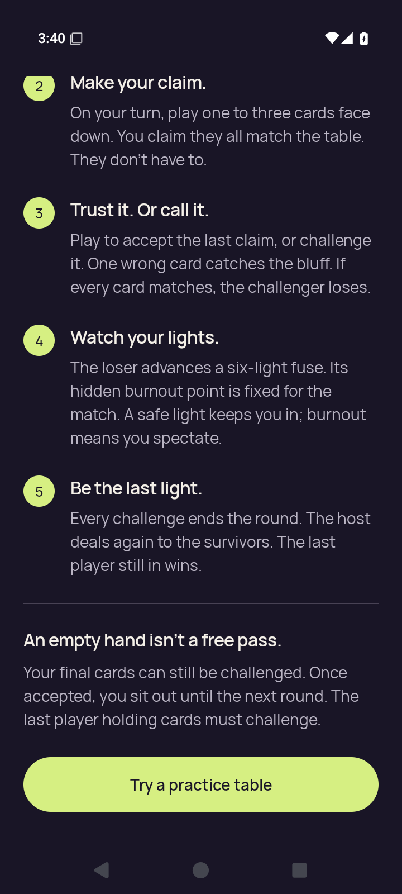</a> | **Rules final step** Android API 35 x86_64 emulator, production debug APK [rules-last-step.png](rules-last-step.png); 720 × 1600 px SHA-256: <code>0596c13f378f81ad431cea926d111fd5fd4a78f44e6ee02f239c7d516f69253c</code> [Original XML](rules-last-step.xml) · [Original result](smoke-result.json) Named PNG/XML pair; final-screen.png is associated with the separately retained last-ui.xml. Original ordinary UI smoke passed. The separate publication visual review adds no new accessibility result. Ordinary debug and optimized smokes passed. The debug native phase hit the executed ten-minute wrapper limit during partial 3d.renderer-death; no final debug result or complete check map exists. The optimized renderer aborted during Godot JNI startup. Neither native variant is fully qualified. Selected stills do not establish continuous privacy, engine gameplay or TalkBack speech/traversal. The collector directly viewed seven API35 originals. The later publication review covers every retained capture. Debug partial captures are not a complete native qualification. Current images do not establish engine gameplay, TalkBack speech/traversal or continuous privacy through transitions. Compose JVM snapshots are host-generated UI tests, separate from emulator screenshots. PNG/XML captures are sequential, not atomic. No derived image was viewed or created. **Publication review — direct original view:** The scrolled normal-size rules frame shows complete steps 3–5, the empty-hand explanation and practice action. Step 2 begins at the upper scroll edge. |
|  | **Rules Practice action checkpoint** Android API 35 x86_64 emulator, production debug APK [rules-practice-action.png](rules-practice-action.png); 720 × 1600 px SHA-256: <code>0596c13f378f81ad431cea926d111fd5fd4a78f44e6ee02f239c7d516f69253c</code> [Original XML](rules-practice-action.xml) · [Original result](smoke-result.json) Named PNG/XML pair; final-screen.png is associated with the separately retained last-ui.xml. Original ordinary UI smoke passed. The separate publication visual review adds no new accessibility result. Ordinary debug and optimized smokes passed. The debug native phase hit the executed ten-minute wrapper limit during partial 3d.renderer-death; no final debug result or complete check map exists. The optimized renderer aborted during Godot JNI startup. Neither native variant is fully qualified. Selected stills do not establish continuous privacy, engine gameplay or TalkBack speech/traversal. The collector directly viewed seven API35 originals. The later publication review covers every retained capture. Debug partial captures are not a complete native qualification. Current images do not establish engine gameplay, TalkBack speech/traversal or continuous privacy through transitions. Compose JVM snapshots are host-generated UI tests, separate from emulator screenshots. PNG/XML captures are sequential, not atomic. No derived image was viewed or created. **Publication review — exact match to a directly viewed original in this batch:** The scrolled normal-size rules frame shows complete steps 3–5, the empty-hand explanation and practice action. Step 2 begins at the upper scroll edge. [Reviewed matching original](rules-last-step.png); capture context remains separate. |
| <a href="rules-practice-entered.png">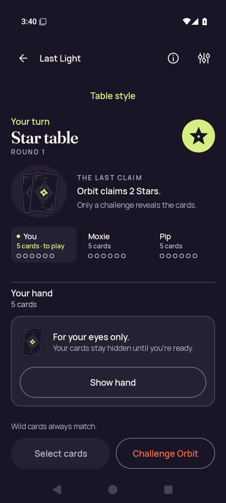</a> | **Practice entered from Rules** Android API 35 x86_64 emulator, production debug APK [rules-practice-entered.png](rules-practice-entered.png); 720 × 1600 px SHA-256: <code>a8af4250b0e3d8b9246dd68e6624707d8f9b297c6b7760679ace5ba8fae7c272</code> [Original XML](rules-practice-entered.xml) · [Original result](smoke-result.json) Named PNG/XML pair; final-screen.png is associated with the separately retained last-ui.xml. Original ordinary UI smoke passed. The separate publication visual review adds no new accessibility result. Ordinary debug and optimized smokes passed. The debug native phase hit the executed ten-minute wrapper limit during partial 3d.renderer-death; no final debug result or complete check map exists. The optimized renderer aborted during Godot JNI startup. Neither native variant is fully qualified. Selected stills do not establish continuous privacy, engine gameplay or TalkBack speech/traversal. The collector directly viewed seven API35 originals. The later publication review covers every retained capture. Debug partial captures are not a complete native qualification. Current images do not establish engine gameplay, TalkBack speech/traversal or continuous privacy through transitions. Compose JVM snapshots are host-generated UI tests, separate from emulator screenshots. PNG/XML captures are sequential, not atomic. No derived image was viewed or created. **Publication review — direct original view:** The Standard practice entry shows Star table, Orbit’s two-Star claim, a complete concealed-hand panel and full Show hand/Select cards/Challenge Orbit controls. |
|  | **Home after leaving Rules-entered practice** Android API 35 x86_64 emulator, production debug APK [rules-returned-home.png](rules-returned-home.png); 720 × 1600 px SHA-256: <code>1a5b94ba1499072aa69c0edfb2383a49092476a05cc79b600e93f99134aa7fa3</code> [Original XML](rules-returned-home.xml) · [Original result](smoke-result.json) Named PNG/XML pair; final-screen.png is associated with the separately retained last-ui.xml. Original ordinary UI smoke passed. The separate publication visual review adds no new accessibility result. Ordinary debug and optimized smokes passed. The debug native phase hit the executed ten-minute wrapper limit during partial 3d.renderer-death; no final debug result or complete check map exists. The optimized renderer aborted during Godot JNI startup. Neither native variant is fully qualified. Selected stills do not establish continuous privacy, engine gameplay or TalkBack speech/traversal. The collector directly viewed seven API35 originals. The later publication review covers every retained capture. Debug partial captures are not a complete native qualification. Current images do not establish engine gameplay, TalkBack speech/traversal or continuous privacy through transitions. Compose JVM snapshots are host-generated UI tests, separate from emulator screenshots. PNG/XML captures are sequential, not atomic. No derived image was viewed or created. **Publication review — direct original view:** The Home capture following the rules flow shows full hero artwork, game summary and four complete main actions. |
| <a href="settings-changed.png">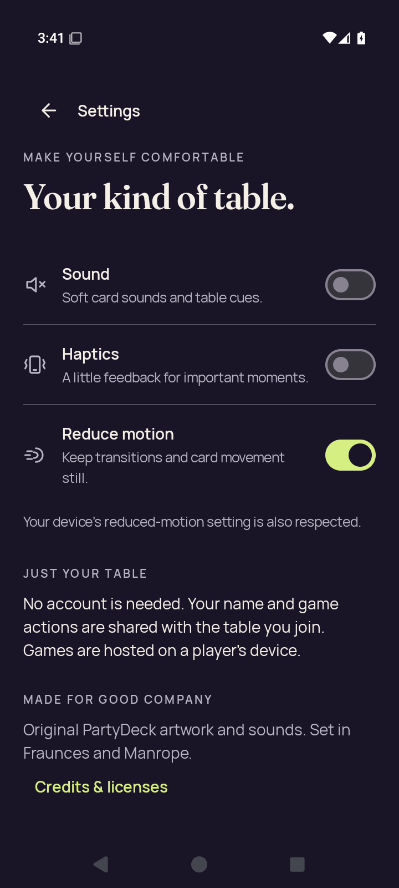</a> | **Changed settings** Android API 35 x86_64 emulator, production debug APK [settings-changed.png](settings-changed.png); 720 × 1600 px SHA-256: <code>f639e19c1fde668ef06eb45dfa78d3cb8246da3486e11ac21b702fb73a1f83aa</code> [Original XML](settings-changed.xml) · [Original result](smoke-result.json) Named PNG/XML pair; final-screen.png is associated with the separately retained last-ui.xml. Original ordinary UI smoke passed. The separate publication visual review adds no new accessibility result. Ordinary debug and optimized smokes passed. The debug native phase hit the executed ten-minute wrapper limit during partial 3d.renderer-death; no final debug result or complete check map exists. The optimized renderer aborted during Godot JNI startup. Neither native variant is fully qualified. Selected stills do not establish continuous privacy, engine gameplay or TalkBack speech/traversal. The collector directly viewed seven API35 originals. The later publication review covers every retained capture. Debug partial captures are not a complete native qualification. Current images do not establish engine gameplay, TalkBack speech/traversal or continuous privacy through transitions. Compose JVM snapshots are host-generated UI tests, separate from emulator screenshots. PNG/XML captures are sequential, not atomic. No derived image was viewed or created. **Publication review — direct original view:** Settings shows Sound and Haptics off and Reduce motion on. All descriptions, table/privacy copy and Credits &amp; licenses fit in the captured viewport. |
|  | **Persisted settings checkpoint** Android API 35 x86_64 emulator, production debug APK [settings-persisted.png](settings-persisted.png); 720 × 1600 px SHA-256: <code>0658728a7dec877a8dcbf7b870ce71a51a9fc7b026a58f613302ee63439d65bd</code> [Original XML](settings-persisted.xml) · [Original result](smoke-result.json) Named PNG/XML pair; final-screen.png is associated with the separately retained last-ui.xml. Original ordinary UI smoke passed. The separate publication visual review adds no new accessibility result. Ordinary debug and optimized smokes passed. The debug native phase hit the executed ten-minute wrapper limit during partial 3d.renderer-death; no final debug result or complete check map exists. The optimized renderer aborted during Godot JNI startup. Neither native variant is fully qualified. Selected stills do not establish continuous privacy, engine gameplay or TalkBack speech/traversal. The collector directly viewed seven API35 originals. The later publication review covers every retained capture. Debug partial captures are not a complete native qualification. Current images do not establish engine gameplay, TalkBack speech/traversal or continuous privacy through transitions. Compose JVM snapshots are host-generated UI tests, separate from emulator screenshots. PNG/XML captures are sequential, not atomic. No derived image was viewed or created. **Publication review — direct original view:** The separate persisted-settings capture shows Sound and Haptics off and Reduce motion on, with the complete settings copy and Credits &amp; licenses visible. Persistence is established by the companion test evidence. |
|  | **Home after settings** Android API 35 x86_64 emulator, production debug APK [settings-return-home.png](settings-return-home.png); 720 × 1600 px SHA-256: <code>1a5b94ba1499072aa69c0edfb2383a49092476a05cc79b600e93f99134aa7fa3</code> [Original XML](settings-return-home.xml) · [Original result](smoke-result.json) Named PNG/XML pair; final-screen.png is associated with the separately retained last-ui.xml. Original ordinary UI smoke passed. The separate publication visual review adds no new accessibility result. Ordinary debug and optimized smokes passed. The debug native phase hit the executed ten-minute wrapper limit during partial 3d.renderer-death; no final debug result or complete check map exists. The optimized renderer aborted during Godot JNI startup. Neither native variant is fully qualified. Selected stills do not establish continuous privacy, engine gameplay or TalkBack speech/traversal. The collector directly viewed seven API35 originals. The later publication review covers every retained capture. Debug partial captures are not a complete native qualification. Current images do not establish engine gameplay, TalkBack speech/traversal or continuous privacy through transitions. Compose JVM snapshots are host-generated UI tests, separate from emulator screenshots. PNG/XML captures are sequential, not atomic. No derived image was viewed or created. **Publication review — exact match to a directly viewed original in this batch:** The Home capture following the rules flow shows full hero artwork, game summary and four complete main actions. [Reviewed matching original](rules-returned-home.png); capture context remains separate. |
