# Android API 35 production native session — timeout and JNI crash

[All collections](../../README.md) · [Original CI run](https://github.com/Apdelrahman1911/PartyDeck/actions/runs/34496267571)

Ordinary debug and optimized smokes passed. The debug native phase hit the executed ten-minute wrapper limit during partial 3d.renderer-death; no final debug result or complete check map exists. The optimized renderer aborted during Godot JNI startup. Neither native variant is fully qualified. Selected stills do not establish continuous privacy, engine gameplay or TalkBack speech/traversal.

55 debug and six optimized original PNG/XML/JSON triples. Seven originals have recorded direct visual observations. Debug has no final result; partial progression cannot supply a complete native pass.

Exact source: `410c9386dd88b2ad0ab380e5b8f1f9bf19674b00`. [Original owner capture mapping](../provenance/review/capture-gallery-mapping.json).

## Publication visual review

All 61 original capture identities have review coverage: 48 direct original views, 13 exact matches to direct views in this batch. Each capture keeps its original name, source, dimensions, scenario and recorded time. Matching pixels do not transfer runtime outcomes. No derived image was created.

[Completed visual review](../provenance/publication-review/partydeck-gallery-after-2013-api35-visual-review.json) · [Capture/review binding](../../godot-ios-native-34488350932/provenance/publication-review/partydeck-gallery-2355-publication-review.json) · [Frozen publication queue](../../godot-android-adaptive-34496282263/provenance/publication-queue-v1/queue-freeze.json) · [Original copy mapping](../../godot-android-adaptive-34496282263/provenance/publication-queue-v1/copy-paths.tsv) · [Unchanged queue page](../../godot-android-adaptive-34496282263/provenance/publication-queue-v1/payload/docs/screenshots/android-34496267571/godot-session/README.md). The archived queue page retains its original text and relative paths as provenance.

| Original capture | Recorded scenario and retained limits |
| --- | --- |
|  | **2d action entry native ready** Android API 35 x86_64 emulator, production debug APK [2d-action-entry-native-ready.png](debug/runtime/captures/2d-action-entry-native-ready.png); 720 × 1600 px SHA-256: <code>d84a6bf3d03098983c45fd4876531e8247ae1c06cb4d8f980855540d5adc615b</code> [Original XML](debug/runtime/captures/2d-action-entry-native-ready.xml) · [Original capture receipt](debug/runtime/captures/2d-action-entry-native-ready.json) Original debug native stage: 2d.standard-action; capture status: captured. Native gameplay was not invoked by the API35 checker; a native Ready capture does not qualify gameplay. Ordinary debug and optimized smokes passed. The debug native phase hit the executed ten-minute wrapper limit during partial 3d.renderer-death; no final debug result or complete check map exists. The optimized renderer aborted during Godot JNI startup. Neither native variant is fully qualified. Selected stills do not establish continuous privacy, engine gameplay or TalkBack speech/traversal. The collector directly viewed seven API35 originals. The later publication review covers every retained capture. Debug partial captures are not a complete native qualification. Current images do not establish engine gameplay, TalkBack speech/traversal or continuous privacy through transitions. Compose JVM snapshots are host-generated UI tests, separate from emulator screenshots. PNG/XML captures are sequential, not atomic. No derived image was viewed or created. **Publication review — direct original view:** The native 2D action-entry frame shows the Crown claim, concealed pile, complete Reveal my hand and bottom Choose cards/Call the bluff controls. Table ready and native navigation remain readable. |
|  | **2d action entry selected** Android API 35 x86_64 emulator, production debug APK [2d-action-entry-selected.png](debug/runtime/captures/2d-action-entry-selected.png); 720 × 1600 px SHA-256: <code>a39203905877760893a10e5c2dc374717b67a4059aa3ab0fcddf40b30eb9dd27</code> [Original XML](debug/runtime/captures/2d-action-entry-selected.xml) · [Original capture receipt](debug/runtime/captures/2d-action-entry-selected.json) Original debug native stage: 2d.standard-action; capture status: captured. Native gameplay was not invoked by the API35 checker; a native Ready capture does not qualify gameplay. Ordinary debug and optimized smokes passed. The debug native phase hit the executed ten-minute wrapper limit during partial 3d.renderer-death; no final debug result or complete check map exists. The optimized renderer aborted during Godot JNI startup. Neither native variant is fully qualified. Selected stills do not establish continuous privacy, engine gameplay or TalkBack speech/traversal. The collector directly viewed seven API35 originals. The later publication review covers every retained capture. Debug partial captures are not a complete native qualification. Current images do not establish engine gameplay, TalkBack speech/traversal or continuous privacy through transitions. Compose JVM snapshots are host-generated UI tests, separate from emulator screenshots. PNG/XML captures are sequential, not atomic. No derived image was viewed or created. **Publication review — direct original view:** Standard Crown table, all five faces and labels, checked first Crown, 1 of 3 selected, complete Play 1 card and Challenge Orbit. |
|  | **2d action entry selector** Android API 35 x86_64 emulator, production debug APK [2d-action-entry-selector.png](debug/runtime/captures/2d-action-entry-selector.png); 720 × 1600 px SHA-256: <code>c2a88dab2ca14e3bc806834608244de89f884260f017721abbec81b204206061</code> [Original XML](debug/runtime/captures/2d-action-entry-selector.xml) · [Original capture receipt](debug/runtime/captures/2d-action-entry-selector.json) Original debug native stage: 2d.standard-action; capture status: captured. Native gameplay was not invoked by the API35 checker; a native Ready capture does not qualify gameplay. Ordinary debug and optimized smokes passed. The debug native phase hit the executed ten-minute wrapper limit during partial 3d.renderer-death; no final debug result or complete check map exists. The optimized renderer aborted during Godot JNI startup. Neither native variant is fully qualified. Selected stills do not establish continuous privacy, engine gameplay or TalkBack speech/traversal. The collector directly viewed seven API35 originals. The later publication review covers every retained capture. Debug partial captures are not a complete native qualification. Current images do not establish engine gameplay, TalkBack speech/traversal or continuous privacy through transitions. Compose JVM snapshots are host-generated UI tests, separate from emulator screenshots. PNG/XML captures are sequential, not atomic. No derived image was viewed or created. **Publication review — direct original view:** Complete portrait Table style dialog, full explanatory copy, all three choices, Standard selected and Done. |
|  | **2d action return concealed** Android API 35 x86_64 emulator, production debug APK [2d-action-return-concealed.png](debug/runtime/captures/2d-action-return-concealed.png); 720 × 1600 px SHA-256: <code>29a2dec0d77934ae20d9a8176ed9da195b2f22b034d074b25b5772889932a642</code> [Original XML](debug/runtime/captures/2d-action-return-concealed.xml) · [Original capture receipt](debug/runtime/captures/2d-action-return-concealed.json) Original debug native stage: 2d.standard-action; capture status: captured. Native gameplay was not invoked by the API35 checker; a native Ready capture does not qualify gameplay. Ordinary debug and optimized smokes passed. The debug native phase hit the executed ten-minute wrapper limit during partial 3d.renderer-death; no final debug result or complete check map exists. The optimized renderer aborted during Godot JNI startup. Neither native variant is fully qualified. Selected stills do not establish continuous privacy, engine gameplay or TalkBack speech/traversal. The collector directly viewed seven API35 originals. The later publication review covers every retained capture. Debug partial captures are not a complete native qualification. Current images do not establish engine gameplay, TalkBack speech/traversal or continuous privacy through transitions. Compose JVM snapshots are host-generated UI tests, separate from emulator screenshots. PNG/XML captures are sequential, not atomic. No derived image was viewed or created. **Publication review — direct original view:** Standard Crown table, Orbit claims 3 Crowns, complete concealed panel, Show hand and disabled Select cards/Challenge Orbit. |
|  | **2d action return first card** Android API 35 x86_64 emulator, production debug APK [2d-action-return-first-card.png](debug/runtime/captures/2d-action-return-first-card.png); 720 × 1600 px SHA-256: <code>b04b40797fe9a4b507d0794a6865114f36c9abc723f027749e8e768e5c368283</code> [Original XML](debug/runtime/captures/2d-action-return-first-card.xml) · [Original capture receipt](debug/runtime/captures/2d-action-return-first-card.json) Original debug native stage: 2d.standard-action; capture status: captured. Native gameplay was not invoked by the API35 checker; a native Ready capture does not qualify gameplay. Ordinary debug and optimized smokes passed. The debug native phase hit the executed ten-minute wrapper limit during partial 3d.renderer-death; no final debug result or complete check map exists. The optimized renderer aborted during Godot JNI startup. Neither native variant is fully qualified. Selected stills do not establish continuous privacy, engine gameplay or TalkBack speech/traversal. The collector directly viewed seven API35 originals. The later publication review covers every retained capture. Debug partial captures are not a complete native qualification. Current images do not establish engine gameplay, TalkBack speech/traversal or continuous privacy through transitions. Compose JVM snapshots are host-generated UI tests, separate from emulator screenshots. PNG/XML captures are sequential, not atomic. No derived image was viewed or created. **Publication review — direct original view:** All five Standard faces and labels, first Crown unchecked, 0 of 3 selected, complete Hide hand and bottom actions. |
|  | **2d action return public** Android API 35 x86_64 emulator, production debug APK [2d-action-return-public.png](debug/runtime/captures/2d-action-return-public.png); 720 × 1600 px SHA-256: <code>29a2dec0d77934ae20d9a8176ed9da195b2f22b034d074b25b5772889932a642</code> [Original XML](debug/runtime/captures/2d-action-return-public.xml) · [Original capture receipt](debug/runtime/captures/2d-action-return-public.json) Original debug native stage: 2d.standard-action; capture status: captured. Native gameplay was not invoked by the API35 checker; a native Ready capture does not qualify gameplay. Ordinary debug and optimized smokes passed. The debug native phase hit the executed ten-minute wrapper limit during partial 3d.renderer-death; no final debug result or complete check map exists. The optimized renderer aborted during Godot JNI startup. Neither native variant is fully qualified. Selected stills do not establish continuous privacy, engine gameplay or TalkBack speech/traversal. The collector directly viewed seven API35 originals. The later publication review covers every retained capture. Debug partial captures are not a complete native qualification. Current images do not establish engine gameplay, TalkBack speech/traversal or continuous privacy through transitions. Compose JVM snapshots are host-generated UI tests, separate from emulator screenshots. PNG/XML captures are sequential, not atomic. No derived image was viewed or created. **Publication review — exact match to a directly viewed original in this batch:** Standard Crown table, Orbit claims 3 Crowns, complete concealed panel, Show hand and disabled Select cards/Challenge Orbit. [Reviewed matching original](debug/runtime/captures/2d-action-return-concealed.png); capture context remains separate. |
|  | **2d action return selection cleared** Android API 35 x86_64 emulator, production debug APK [2d-action-return-selection-cleared.png](debug/runtime/captures/2d-action-return-selection-cleared.png); 720 × 1600 px SHA-256: <code>29a2dec0d77934ae20d9a8176ed9da195b2f22b034d074b25b5772889932a642</code> [Original XML](debug/runtime/captures/2d-action-return-selection-cleared.xml) · [Original capture receipt](debug/runtime/captures/2d-action-return-selection-cleared.json) Original debug native stage: 2d.standard-action; capture status: captured. Native gameplay was not invoked by the API35 checker; a native Ready capture does not qualify gameplay. Ordinary debug and optimized smokes passed. The debug native phase hit the executed ten-minute wrapper limit during partial 3d.renderer-death; no final debug result or complete check map exists. The optimized renderer aborted during Godot JNI startup. Neither native variant is fully qualified. Selected stills do not establish continuous privacy, engine gameplay or TalkBack speech/traversal. The collector directly viewed seven API35 originals. The later publication review covers every retained capture. Debug partial captures are not a complete native qualification. Current images do not establish engine gameplay, TalkBack speech/traversal or continuous privacy through transitions. Compose JVM snapshots are host-generated UI tests, separate from emulator screenshots. PNG/XML captures are sequential, not atomic. No derived image was viewed or created. **Publication review — exact match to a directly viewed original in this batch:** Standard Crown table, Orbit claims 3 Crowns, complete concealed panel, Show hand and disabled Select cards/Challenge Orbit. [Reviewed matching original](debug/runtime/captures/2d-action-return-concealed.png); capture context remains separate. |
|  | **2d baseline first card** Android API 35 x86_64 emulator, production debug APK [2d-baseline-first-card.png](debug/runtime/captures/2d-baseline-first-card.png); 720 × 1600 px SHA-256: <code>2267d73724f4b0b656ed7bfe181892663c7b883ecdef435eccb26ee77795b458</code> [Original XML](debug/runtime/captures/2d-baseline-first-card.xml) · [Original capture receipt](debug/runtime/captures/2d-baseline-first-card.json) Original debug native stage: 2d.practice-baseline; capture status: captured. Native gameplay was not invoked by the API35 checker; a native Ready capture does not qualify gameplay. Ordinary debug and optimized smokes passed. The debug native phase hit the executed ten-minute wrapper limit during partial 3d.renderer-death; no final debug result or complete check map exists. The optimized renderer aborted during Godot JNI startup. Neither native variant is fully qualified. Selected stills do not establish continuous privacy, engine gameplay or TalkBack speech/traversal. The collector directly viewed seven API35 originals. The later publication review covers every retained capture. Debug partial captures are not a complete native qualification. Current images do not establish engine gameplay, TalkBack speech/traversal or continuous privacy through transitions. Compose JVM snapshots are host-generated UI tests, separate from emulator screenshots. PNG/XML captures are sequential, not atomic. No derived image was viewed or created. **Publication review — direct original view:** All five Standard faces and labels, 0 of 3 selected, first Crown unchecked; complete Hide hand and bottom actions. |
|  | **2d baseline public** Android API 35 x86_64 emulator, production debug APK [2d-baseline-public.png](debug/runtime/captures/2d-baseline-public.png); 720 × 1600 px SHA-256: <code>2b1baca4e5a8095f6eb04fa322b0a8ec2e2cb48d360a9a5161bc693206b3903f</code> [Original XML](debug/runtime/captures/2d-baseline-public.xml) · [Original capture receipt](debug/runtime/captures/2d-baseline-public.json) Original debug native stage: 2d.practice-baseline; capture status: captured. Native gameplay was not invoked by the API35 checker; a native Ready capture does not qualify gameplay. Ordinary debug and optimized smokes passed. The debug native phase hit the executed ten-minute wrapper limit during partial 3d.renderer-death; no final debug result or complete check map exists. The optimized renderer aborted during Godot JNI startup. Neither native variant is fully qualified. Selected stills do not establish continuous privacy, engine gameplay or TalkBack speech/traversal. The collector directly viewed seven API35 originals. The later publication review covers every retained capture. Debug partial captures are not a complete native qualification. Current images do not establish engine gameplay, TalkBack speech/traversal or continuous privacy through transitions. Compose JVM snapshots are host-generated UI tests, separate from emulator screenshots. PNG/XML captures are sequential, not atomic. No derived image was viewed or created. **Publication review — direct original view:** Standard Crown table, Orbit claims 3 Crowns, complete concealed panel, Show hand and bottom actions. |
|  | **2d baseline selected** Android API 35 x86_64 emulator, production debug APK [2d-baseline-selected.png](debug/runtime/captures/2d-baseline-selected.png); 720 × 1600 px SHA-256: <code>64bee45b26e7e734ee7f31710b819c39a1294b7b3b645a3c9c9c2cc588508e6f</code> [Original XML](debug/runtime/captures/2d-baseline-selected.xml) · [Original capture receipt](debug/runtime/captures/2d-baseline-selected.json) Original debug native stage: 2d.standard-hand; capture status: captured. Native gameplay was not invoked by the API35 checker; a native Ready capture does not qualify gameplay. Ordinary debug and optimized smokes passed. The debug native phase hit the executed ten-minute wrapper limit during partial 3d.renderer-death; no final debug result or complete check map exists. The optimized renderer aborted during Godot JNI startup. Neither native variant is fully qualified. Selected stills do not establish continuous privacy, engine gameplay or TalkBack speech/traversal. The collector directly viewed seven API35 originals. The later publication review covers every retained capture. Debug partial captures are not a complete native qualification. Current images do not establish engine gameplay, TalkBack speech/traversal or continuous privacy through transitions. Compose JVM snapshots are host-generated UI tests, separate from emulator screenshots. PNG/XML captures are sequential, not atomic. No derived image was viewed or created. **Publication review — direct original view:** Standard Crown table, checked first Crown, 1 of 3 selected, complete Play 1 card and Challenge Orbit; all five faces fit. |
|  | **2d death native ready** Android API 35 x86_64 emulator, production debug APK [2d-death-native-ready.png](debug/runtime/captures/2d-death-native-ready.png); 720 × 1600 px SHA-256: <code>24d8c9604be7601a6415a46f75f26649efc9920c3ef2c5ddea3da6bc1ae51f5b</code> [Original XML](debug/runtime/captures/2d-death-native-ready.xml) · [Original capture receipt](debug/runtime/captures/2d-death-native-ready.json) Original debug native stage: 2d.renderer-death; capture status: captured. Native gameplay was not invoked by the API35 checker; a native Ready capture does not qualify gameplay. Ordinary debug and optimized smokes passed. The debug native phase hit the executed ten-minute wrapper limit during partial 3d.renderer-death; no final debug result or complete check map exists. The optimized renderer aborted during Godot JNI startup. Neither native variant is fully qualified. Selected stills do not establish continuous privacy, engine gameplay or TalkBack speech/traversal. The collector directly viewed seven API35 originals. The later publication review covers every retained capture. Debug partial captures are not a complete native qualification. Current images do not establish engine gameplay, TalkBack speech/traversal or continuous privacy through transitions. Compose JVM snapshots are host-generated UI tests, separate from emulator screenshots. PNG/XML captures are sequential, not atomic. No derived image was viewed or created. **Publication review — direct original view:** Native portrait 2D says Table ready, with a readable Crown claim and concealed pile and complete Reveal my hand, Choose cards and Call the bluff. Native navigation fits. The image alone does not establish process-death recovery. |
|  | **2d death return concealed** Android API 35 x86_64 emulator, production debug APK [2d-death-return-concealed.png](debug/runtime/captures/2d-death-return-concealed.png); 720 × 1600 px SHA-256: <code>bdde4e6b020546a62c136eb5e83615ddb9b586139588dae42bc9ef714b8118a4</code> [Original XML](debug/runtime/captures/2d-death-return-concealed.xml) · [Original capture receipt](debug/runtime/captures/2d-death-return-concealed.json) Original debug native stage: 2d.renderer-death; capture status: captured. Native gameplay was not invoked by the API35 checker; a native Ready capture does not qualify gameplay. Ordinary debug and optimized smokes passed. The debug native phase hit the executed ten-minute wrapper limit during partial 3d.renderer-death; no final debug result or complete check map exists. The optimized renderer aborted during Godot JNI startup. Neither native variant is fully qualified. Selected stills do not establish continuous privacy, engine gameplay or TalkBack speech/traversal. The collector directly viewed seven API35 originals. The later publication review covers every retained capture. Debug partial captures are not a complete native qualification. Current images do not establish engine gameplay, TalkBack speech/traversal or continuous privacy through transitions. Compose JVM snapshots are host-generated UI tests, separate from emulator screenshots. PNG/XML captures are sequential, not atomic. No derived image was viewed or created. **Publication review — direct original view:** Standard Crown table with Orbit claims 3 Crowns, complete concealed hand panel and Show hand. Select cards is disabled; Challenge Orbit is complete. |
| <a href="debug/runtime/captures/2d-death-return-first-card.png">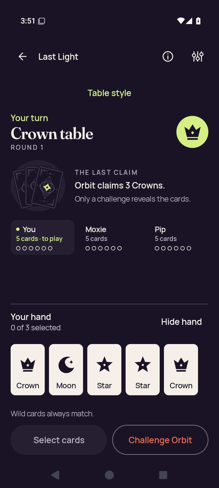</a> | **2d death return first card** Android API 35 x86_64 emulator, production debug APK [2d-death-return-first-card.png](debug/runtime/captures/2d-death-return-first-card.png); 720 × 1600 px SHA-256: <code>a96940e6168ab2813b25e95b55104487b0f9661ff74403d3431b71aab45cc815</code> [Original XML](debug/runtime/captures/2d-death-return-first-card.xml) · [Original capture receipt](debug/runtime/captures/2d-death-return-first-card.json) Original debug native stage: 2d.renderer-death; capture status: captured. Native gameplay was not invoked by the API35 checker; a native Ready capture does not qualify gameplay. Ordinary debug and optimized smokes passed. The debug native phase hit the executed ten-minute wrapper limit during partial 3d.renderer-death; no final debug result or complete check map exists. The optimized renderer aborted during Godot JNI startup. Neither native variant is fully qualified. Selected stills do not establish continuous privacy, engine gameplay or TalkBack speech/traversal. The collector directly viewed seven API35 originals. The later publication review covers every retained capture. Debug partial captures are not a complete native qualification. Current images do not establish engine gameplay, TalkBack speech/traversal or continuous privacy through transitions. Compose JVM snapshots are host-generated UI tests, separate from emulator screenshots. PNG/XML captures are sequential, not atomic. No derived image was viewed or created. **Publication review — direct original view:** Standard Crown table with all five faces and labels, unchecked first Crown, 0 of 3 selected and complete Hide hand, Select cards and Challenge Orbit. |
|  | **2d death return public** Android API 35 x86_64 emulator, production debug APK [2d-death-return-public.png](debug/runtime/captures/2d-death-return-public.png); 720 × 1600 px SHA-256: <code>bdde4e6b020546a62c136eb5e83615ddb9b586139588dae42bc9ef714b8118a4</code> [Original XML](debug/runtime/captures/2d-death-return-public.xml) · [Original capture receipt](debug/runtime/captures/2d-death-return-public.json) Original debug native stage: 2d.renderer-death; capture status: captured. Native gameplay was not invoked by the API35 checker; a native Ready capture does not qualify gameplay. Ordinary debug and optimized smokes passed. The debug native phase hit the executed ten-minute wrapper limit during partial 3d.renderer-death; no final debug result or complete check map exists. The optimized renderer aborted during Godot JNI startup. Neither native variant is fully qualified. Selected stills do not establish continuous privacy, engine gameplay or TalkBack speech/traversal. The collector directly viewed seven API35 originals. The later publication review covers every retained capture. Debug partial captures are not a complete native qualification. Current images do not establish engine gameplay, TalkBack speech/traversal or continuous privacy through transitions. Compose JVM snapshots are host-generated UI tests, separate from emulator screenshots. PNG/XML captures are sequential, not atomic. No derived image was viewed or created. **Publication review — exact match to a directly viewed original in this batch:** Standard Crown table with Orbit claims 3 Crowns, complete concealed hand panel and Show hand. Select cards is disabled; Challenge Orbit is complete. [Reviewed matching original](debug/runtime/captures/2d-death-return-concealed.png); capture context remains separate. |
|  | **2d death return selection cleared** Android API 35 x86_64 emulator, production debug APK [2d-death-return-selection-cleared.png](debug/runtime/captures/2d-death-return-selection-cleared.png); 720 × 1600 px SHA-256: <code>bdde4e6b020546a62c136eb5e83615ddb9b586139588dae42bc9ef714b8118a4</code> [Original XML](debug/runtime/captures/2d-death-return-selection-cleared.xml) · [Original capture receipt](debug/runtime/captures/2d-death-return-selection-cleared.json) Original debug native stage: 2d.renderer-death; capture status: captured. Native gameplay was not invoked by the API35 checker; a native Ready capture does not qualify gameplay. Ordinary debug and optimized smokes passed. The debug native phase hit the executed ten-minute wrapper limit during partial 3d.renderer-death; no final debug result or complete check map exists. The optimized renderer aborted during Godot JNI startup. Neither native variant is fully qualified. Selected stills do not establish continuous privacy, engine gameplay or TalkBack speech/traversal. The collector directly viewed seven API35 originals. The later publication review covers every retained capture. Debug partial captures are not a complete native qualification. Current images do not establish engine gameplay, TalkBack speech/traversal or continuous privacy through transitions. Compose JVM snapshots are host-generated UI tests, separate from emulator screenshots. PNG/XML captures are sequential, not atomic. No derived image was viewed or created. **Publication review — exact match to a directly viewed original in this batch:** Standard Crown table with Orbit claims 3 Crowns, complete concealed hand panel and Show hand. Select cards is disabled; Challenge Orbit is complete. [Reviewed matching original](debug/runtime/captures/2d-death-return-concealed.png); capture context remains separate. |
|  | **2d death selected** Android API 35 x86_64 emulator, production debug APK [2d-death-selected.png](debug/runtime/captures/2d-death-selected.png); 720 × 1600 px SHA-256: <code>368b7e0424d54d139ba24c06c61f62010087c7312695afd35a6ce174dbad9cb4</code> [Original XML](debug/runtime/captures/2d-death-selected.xml) · [Original capture receipt](debug/runtime/captures/2d-death-selected.json) Original debug native stage: 2d.renderer-death; capture status: captured. Native gameplay was not invoked by the API35 checker; a native Ready capture does not qualify gameplay. Ordinary debug and optimized smokes passed. The debug native phase hit the executed ten-minute wrapper limit during partial 3d.renderer-death; no final debug result or complete check map exists. The optimized renderer aborted during Godot JNI startup. Neither native variant is fully qualified. Selected stills do not establish continuous privacy, engine gameplay or TalkBack speech/traversal. The collector directly viewed seven API35 originals. The later publication review covers every retained capture. Debug partial captures are not a complete native qualification. Current images do not establish engine gameplay, TalkBack speech/traversal or continuous privacy through transitions. Compose JVM snapshots are host-generated UI tests, separate from emulator screenshots. PNG/XML captures are sequential, not atomic. No derived image was viewed or created. **Publication review — direct original view:** Standard Crown table with all five faces and labels; first Crown has a check badge, 1 of 3 selected and complete Play 1 card and Challenge Orbit. |
|  | **2d death selector** Android API 35 x86_64 emulator, production debug APK [2d-death-selector.png](debug/runtime/captures/2d-death-selector.png); 720 × 1600 px SHA-256: <code>4b38612d50cd9b77104bd9c5ed42b8edc58271600c4259b6d455da9f868cbfb3</code> [Original XML](debug/runtime/captures/2d-death-selector.xml) · [Original capture receipt](debug/runtime/captures/2d-death-selector.json) Original debug native stage: 2d.renderer-death; capture status: captured. Native gameplay was not invoked by the API35 checker; a native Ready capture does not qualify gameplay. Ordinary debug and optimized smokes passed. The debug native phase hit the executed ten-minute wrapper limit during partial 3d.renderer-death; no final debug result or complete check map exists. The optimized renderer aborted during Godot JNI startup. Neither native variant is fully qualified. Selected stills do not establish continuous privacy, engine gameplay or TalkBack speech/traversal. The collector directly viewed seven API35 originals. The later publication review covers every retained capture. Debug partial captures are not a complete native qualification. Current images do not establish engine gameplay, TalkBack speech/traversal or continuous privacy through transitions. Compose JVM snapshots are host-generated UI tests, separate from emulator screenshots. PNG/XML captures are sequential, not atomic. No derived image was viewed or created. **Publication review — direct original view:** Complete Table style dialog, explanatory and screen-reader copy, all three choices, Standard selected and Done. |
| <a href="debug/runtime/captures/2d-entry-native-ready.png">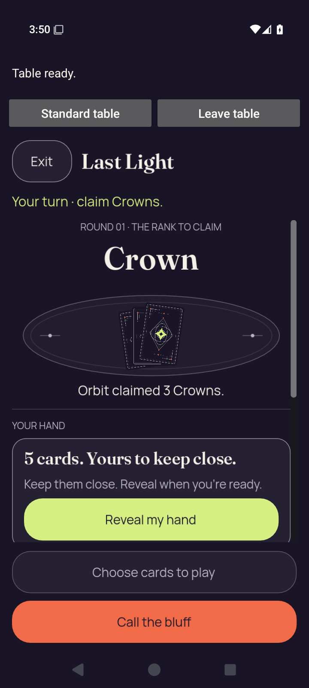</a> | **2d entry native ready** Android API 35 x86_64 emulator, production debug APK [2d-entry-native-ready.png](debug/runtime/captures/2d-entry-native-ready.png); 720 × 1600 px SHA-256: <code>13c92d884bc91a77af3df896b6695e6c8f13c07b1c090aeb0ccb1d9d1eebff93</code> [Original XML](debug/runtime/captures/2d-entry-native-ready.xml) · [Original capture receipt](debug/runtime/captures/2d-entry-native-ready.json) Existing direct visual observation: Rendered 2D table and Ready/native return controls. The hand remains concealed; no private card face is visible. Original debug native stage: 2d.native-entry; capture status: captured. Native gameplay was not invoked by the API35 checker; a native Ready capture does not qualify gameplay. Ordinary debug and optimized smokes passed. The debug native phase hit the executed ten-minute wrapper limit during partial 3d.renderer-death; no final debug result or complete check map exists. The optimized renderer aborted during Godot JNI startup. Neither native variant is fully qualified. Selected stills do not establish continuous privacy, engine gameplay or TalkBack speech/traversal. The collector directly viewed seven API35 originals. The later publication review covers every retained capture. Debug partial captures are not a complete native qualification. Current images do not establish engine gameplay, TalkBack speech/traversal or continuous privacy through transitions. Compose JVM snapshots are host-generated UI tests, separate from emulator screenshots. PNG/XML captures are sequential, not atomic. No derived image was viewed or created. **Publication review — direct original view:** The native portrait 2D entry shows Table ready, the Crown claim, concealed cards and a complete Reveal my hand button. Standard table, Leave table, Exit and the bottom play/challenge controls fit; the hand-panel border meets the scroll edge below Reveal. |
| <a href="debug/runtime/captures/2d-entry-selector.png">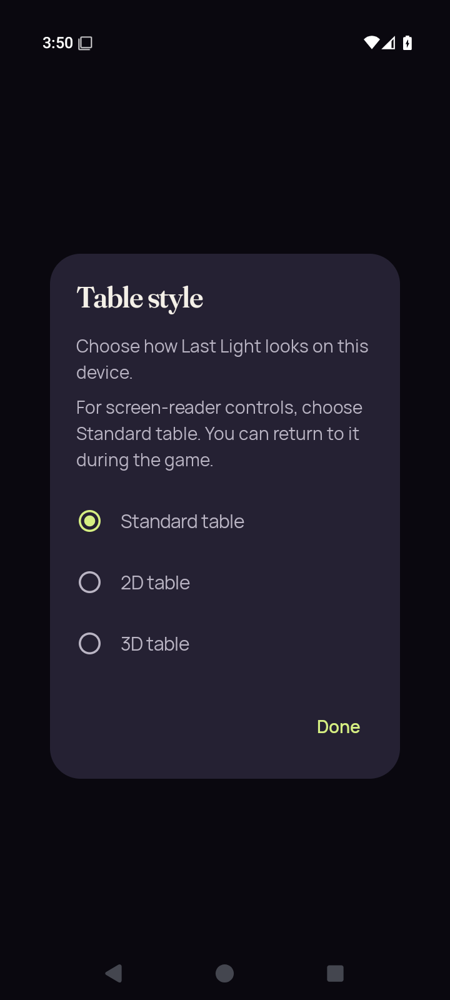</a> | **2d entry selector** Android API 35 x86_64 emulator, production debug APK [2d-entry-selector.png](debug/runtime/captures/2d-entry-selector.png); 720 × 1600 px SHA-256: <code>594ac30717e7004fb29d453a0e5b4acfddedfc9c8db456678811a2ec9fb133e1</code> [Original XML](debug/runtime/captures/2d-entry-selector.xml) · [Original capture receipt](debug/runtime/captures/2d-entry-selector.json) Original debug native stage: 2d.native-entry; capture status: captured. Native gameplay was not invoked by the API35 checker; a native Ready capture does not qualify gameplay. Ordinary debug and optimized smokes passed. The debug native phase hit the executed ten-minute wrapper limit during partial 3d.renderer-death; no final debug result or complete check map exists. The optimized renderer aborted during Godot JNI startup. Neither native variant is fully qualified. Selected stills do not establish continuous privacy, engine gameplay or TalkBack speech/traversal. The collector directly viewed seven API35 originals. The later publication review covers every retained capture. Debug partial captures are not a complete native qualification. Current images do not establish engine gameplay, TalkBack speech/traversal or continuous privacy through transitions. Compose JVM snapshots are host-generated UI tests, separate from emulator screenshots. PNG/XML captures are sequential, not atomic. No derived image was viewed or created. **Publication review — direct original view:** Complete Table style dialog, all explanatory copy, all three choices, Standard selected and Done. |
|  | **2d home after session end** Android API 35 x86_64 emulator, production debug APK [2d-home-after-session-end.png](debug/runtime/captures/2d-home-after-session-end.png); 720 × 1600 px SHA-256: <code>f75afe11a5ba9fe0157853fde2535ff1663f9557a18e739cff5a405fb7ab050b</code> [Original XML](debug/runtime/captures/2d-home-after-session-end.xml) · [Original capture receipt](debug/runtime/captures/2d-home-after-session-end.json) Original debug native stage: 2d.leave-end; capture status: captured. Native gameplay was not invoked by the API35 checker; a native Ready capture does not qualify gameplay. Ordinary debug and optimized smokes passed. The debug native phase hit the executed ten-minute wrapper limit during partial 3d.renderer-death; no final debug result or complete check map exists. The optimized renderer aborted during Godot JNI startup. Neither native variant is fully qualified. Selected stills do not establish continuous privacy, engine gameplay or TalkBack speech/traversal. The collector directly viewed seven API35 originals. The later publication review covers every retained capture. Debug partial captures are not a complete native qualification. Current images do not establish engine gameplay, TalkBack speech/traversal or continuous privacy through transitions. Compose JVM snapshots are host-generated UI tests, separate from emulator screenshots. PNG/XML captures are sequential, not atomic. No derived image was viewed or created. **Publication review — direct original view:** PartyDeck Home shows the complete title, three-card artwork and Host, Join, practice and How to play actions. |
|  | **2d home resumed** Android API 35 x86_64 emulator, production debug APK [2d-home-resumed.png](debug/runtime/captures/2d-home-resumed.png); 720 × 1600 px SHA-256: <code>5a570579c3e0ca34903ac8409f77f94ec321d365ac8ffda7731ff5d25fa88e69</code> [Original XML](debug/runtime/captures/2d-home-resumed.xml) · [Original capture receipt](debug/runtime/captures/2d-home-resumed.json) Original debug native stage: 2d.home-interruption; capture status: captured. Native gameplay was not invoked by the API35 checker; a native Ready capture does not qualify gameplay. Ordinary debug and optimized smokes passed. The debug native phase hit the executed ten-minute wrapper limit during partial 3d.renderer-death; no final debug result or complete check map exists. The optimized renderer aborted during Godot JNI startup. Neither native variant is fully qualified. Selected stills do not establish continuous privacy, engine gameplay or TalkBack speech/traversal. The collector directly viewed seven API35 originals. The later publication review covers every retained capture. Debug partial captures are not a complete native qualification. Current images do not establish engine gameplay, TalkBack speech/traversal or continuous privacy through transitions. Compose JVM snapshots are host-generated UI tests, separate from emulator screenshots. PNG/XML captures are sequential, not atomic. No derived image was viewed or created. **Publication review — direct original view:** Native 2D capture says Table ready and shows concealed Crown claim cards and a complete Reveal my hand button. The hand-panel border meets the central scroll edge; fixed Choose cards to play and Call the bluff actions fit. |
| <a href="debug/runtime/captures/2d-home-system-ui.png">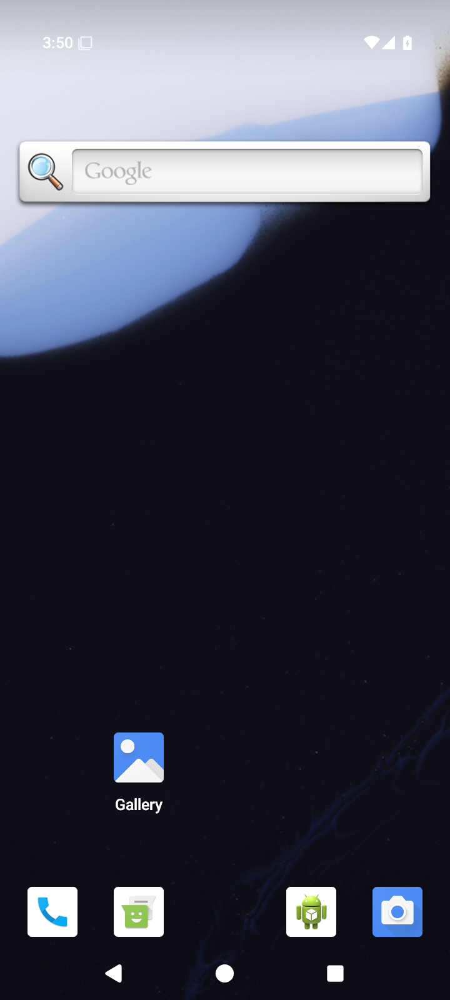</a> | **2d home system ui** Android API 35 x86_64 emulator, production debug APK [2d-home-system-ui.png](debug/runtime/captures/2d-home-system-ui.png); 720 × 1600 px SHA-256: <code>2d71ec6fe8be2c2afd34c2002b4755808a71a8a0a16d0056c5f3248ac9b3d5d1</code> [Original XML](debug/runtime/captures/2d-home-system-ui.xml) · [Original capture receipt](debug/runtime/captures/2d-home-system-ui.json) Existing direct visual observation: Android launcher Home is visible; no app table or private card face is visible. Original debug native stage: 2d.home-interruption; capture status: captured. Native gameplay was not invoked by the API35 checker; a native Ready capture does not qualify gameplay. Ordinary debug and optimized smokes passed. The debug native phase hit the executed ten-minute wrapper limit during partial 3d.renderer-death; no final debug result or complete check map exists. The optimized renderer aborted during Godot JNI startup. Neither native variant is fully qualified. Selected stills do not establish continuous privacy, engine gameplay or TalkBack speech/traversal. The collector directly viewed seven API35 originals. The later publication review covers every retained capture. Debug partial captures are not a complete native qualification. Current images do not establish engine gameplay, TalkBack speech/traversal or continuous privacy through transitions. Compose JVM snapshots are host-generated UI tests, separate from emulator screenshots. PNG/XML captures are sequential, not atomic. No derived image was viewed or created. **Publication review — direct original view:** The capture shows the Android Home screen with search, Gallery and dock icons. No game content is visible; this is a system-state capture within partial debug progress. |
|  | **2d leave cancel confirmation** Android API 35 x86_64 emulator, production debug APK [2d-leave-cancel-confirmation.png](debug/runtime/captures/2d-leave-cancel-confirmation.png); 720 × 1600 px SHA-256: <code>86444463fab150be2b31a8a68a99fce086c9dd0c54c8c5798c4f412e2f02015a</code> [Original XML](debug/runtime/captures/2d-leave-cancel-confirmation.xml) · [Original capture receipt](debug/runtime/captures/2d-leave-cancel-confirmation.json) Original debug native stage: 2d.leave-cancel; capture status: captured. Native gameplay was not invoked by the API35 checker; a native Ready capture does not qualify gameplay. Ordinary debug and optimized smokes passed. The debug native phase hit the executed ten-minute wrapper limit during partial 3d.renderer-death; no final debug result or complete check map exists. The optimized renderer aborted during Godot JNI startup. Neither native variant is fully qualified. Selected stills do not establish continuous privacy, engine gameplay or TalkBack speech/traversal. The collector directly viewed seven API35 originals. The later publication review covers every retained capture. Debug partial captures are not a complete native qualification. Current images do not establish engine gameplay, TalkBack speech/traversal or continuous privacy through transitions. Compose JVM snapshots are host-generated UI tests, separate from emulator screenshots. PNG/XML captures are sequential, not atomic. No derived image was viewed or created. **Publication review — direct original view:** Complete Leave the table dialog with practice-match explanation, Leave table and Stay at the table actions. |
|  | **2d leave cancel native ready** Android API 35 x86_64 emulator, production debug APK [2d-leave-cancel-native-ready.png](debug/runtime/captures/2d-leave-cancel-native-ready.png); 720 × 1600 px SHA-256: <code>38a2bf38b187857f894884e8863fdacba93f2ad762a3859f6326c6378345526d</code> [Original XML](debug/runtime/captures/2d-leave-cancel-native-ready.xml) · [Original capture receipt](debug/runtime/captures/2d-leave-cancel-native-ready.json) Original debug native stage: 2d.leave-cancel; capture status: captured. Native gameplay was not invoked by the API35 checker; a native Ready capture does not qualify gameplay. Ordinary debug and optimized smokes passed. The debug native phase hit the executed ten-minute wrapper limit during partial 3d.renderer-death; no final debug result or complete check map exists. The optimized renderer aborted during Godot JNI startup. Neither native variant is fully qualified. Selected stills do not establish continuous privacy, engine gameplay or TalkBack speech/traversal. The collector directly viewed seven API35 originals. The later publication review covers every retained capture. Debug partial captures are not a complete native qualification. Current images do not establish engine gameplay, TalkBack speech/traversal or continuous privacy through transitions. Compose JVM snapshots are host-generated UI tests, separate from emulator screenshots. PNG/XML captures are sequential, not atomic. No derived image was viewed or created. **Publication review — direct original view:** Native 2D says Table ready. Crown claim, concealed pile and complete Reveal my hand fit; the hand-panel border meets the scroll edge. Standard table, Leave table, Exit and fixed Choose cards to play/Call the bluff are complete. |
|  | **2d leave cancel return concealed** Android API 35 x86_64 emulator, production debug APK [2d-leave-cancel-return-concealed.png](debug/runtime/captures/2d-leave-cancel-return-concealed.png); 720 × 1600 px SHA-256: <code>20478640ee79b116f0723cac8d7f576973157c7bc6ae938cc136b766aecdbec0</code> [Original XML](debug/runtime/captures/2d-leave-cancel-return-concealed.xml) · [Original capture receipt](debug/runtime/captures/2d-leave-cancel-return-concealed.json) Original debug native stage: 2d.leave-cancel; capture status: captured. Native gameplay was not invoked by the API35 checker; a native Ready capture does not qualify gameplay. Ordinary debug and optimized smokes passed. The debug native phase hit the executed ten-minute wrapper limit during partial 3d.renderer-death; no final debug result or complete check map exists. The optimized renderer aborted during Godot JNI startup. Neither native variant is fully qualified. Selected stills do not establish continuous privacy, engine gameplay or TalkBack speech/traversal. The collector directly viewed seven API35 originals. The later publication review covers every retained capture. Debug partial captures are not a complete native qualification. Current images do not establish engine gameplay, TalkBack speech/traversal or continuous privacy through transitions. Compose JVM snapshots are host-generated UI tests, separate from emulator screenshots. PNG/XML captures are sequential, not atomic. No derived image was viewed or created. **Publication review — direct original view:** Standard Crown table shows the full concealed hand panel, Show hand and complete bottom actions, with Orbit claims 3 Crowns readable. |
|  | **2d leave cancel return first card** Android API 35 x86_64 emulator, production debug APK [2d-leave-cancel-return-first-card.png](debug/runtime/captures/2d-leave-cancel-return-first-card.png); 720 × 1600 px SHA-256: <code>05ca5fbe4c6951e792f07211c4f155277c34471a691cfc4dc3b3294151bbd90d</code> [Original XML](debug/runtime/captures/2d-leave-cancel-return-first-card.xml) · [Original capture receipt](debug/runtime/captures/2d-leave-cancel-return-first-card.json) Original debug native stage: 2d.leave-cancel; capture status: captured. Native gameplay was not invoked by the API35 checker; a native Ready capture does not qualify gameplay. Ordinary debug and optimized smokes passed. The debug native phase hit the executed ten-minute wrapper limit during partial 3d.renderer-death; no final debug result or complete check map exists. The optimized renderer aborted during Godot JNI startup. Neither native variant is fully qualified. Selected stills do not establish continuous privacy, engine gameplay or TalkBack speech/traversal. The collector directly viewed seven API35 originals. The later publication review covers every retained capture. Debug partial captures are not a complete native qualification. Current images do not establish engine gameplay, TalkBack speech/traversal or continuous privacy through transitions. Compose JVM snapshots are host-generated UI tests, separate from emulator screenshots. PNG/XML captures are sequential, not atomic. No derived image was viewed or created. **Publication review — direct original view:** Standard Crown table shows all five complete faces and labels, first Crown unchecked, 0 of 3 selected, full Hide hand and bottom actions. |
|  | **2d leave cancel return public** Android API 35 x86_64 emulator, production debug APK [2d-leave-cancel-return-public.png](debug/runtime/captures/2d-leave-cancel-return-public.png); 720 × 1600 px SHA-256: <code>20478640ee79b116f0723cac8d7f576973157c7bc6ae938cc136b766aecdbec0</code> [Original XML](debug/runtime/captures/2d-leave-cancel-return-public.xml) · [Original capture receipt](debug/runtime/captures/2d-leave-cancel-return-public.json) Original debug native stage: 2d.leave-cancel; capture status: captured. Native gameplay was not invoked by the API35 checker; a native Ready capture does not qualify gameplay. Ordinary debug and optimized smokes passed. The debug native phase hit the executed ten-minute wrapper limit during partial 3d.renderer-death; no final debug result or complete check map exists. The optimized renderer aborted during Godot JNI startup. Neither native variant is fully qualified. Selected stills do not establish continuous privacy, engine gameplay or TalkBack speech/traversal. The collector directly viewed seven API35 originals. The later publication review covers every retained capture. Debug partial captures are not a complete native qualification. Current images do not establish engine gameplay, TalkBack speech/traversal or continuous privacy through transitions. Compose JVM snapshots are host-generated UI tests, separate from emulator screenshots. PNG/XML captures are sequential, not atomic. No derived image was viewed or created. **Publication review — exact match to a directly viewed original in this batch:** Standard Crown table shows the full concealed hand panel, Show hand and complete bottom actions, with Orbit claims 3 Crowns readable. [Reviewed matching original](debug/runtime/captures/2d-leave-cancel-return-concealed.png); capture context remains separate. |
|  | **2d leave cancel return selection cleared** Android API 35 x86_64 emulator, production debug APK [2d-leave-cancel-return-selection-cleared.png](debug/runtime/captures/2d-leave-cancel-return-selection-cleared.png); 720 × 1600 px SHA-256: <code>20478640ee79b116f0723cac8d7f576973157c7bc6ae938cc136b766aecdbec0</code> [Original XML](debug/runtime/captures/2d-leave-cancel-return-selection-cleared.xml) · [Original capture receipt](debug/runtime/captures/2d-leave-cancel-return-selection-cleared.json) Original debug native stage: 2d.leave-cancel; capture status: captured. Native gameplay was not invoked by the API35 checker; a native Ready capture does not qualify gameplay. Ordinary debug and optimized smokes passed. The debug native phase hit the executed ten-minute wrapper limit during partial 3d.renderer-death; no final debug result or complete check map exists. The optimized renderer aborted during Godot JNI startup. Neither native variant is fully qualified. Selected stills do not establish continuous privacy, engine gameplay or TalkBack speech/traversal. The collector directly viewed seven API35 originals. The later publication review covers every retained capture. Debug partial captures are not a complete native qualification. Current images do not establish engine gameplay, TalkBack speech/traversal or continuous privacy through transitions. Compose JVM snapshots are host-generated UI tests, separate from emulator screenshots. PNG/XML captures are sequential, not atomic. No derived image was viewed or created. **Publication review — exact match to a directly viewed original in this batch:** Standard Crown table shows the full concealed hand panel, Show hand and complete bottom actions, with Orbit claims 3 Crowns readable. [Reviewed matching original](debug/runtime/captures/2d-leave-cancel-return-concealed.png); capture context remains separate. |
| <a href="debug/runtime/captures/2d-leave-cancel-selected.png">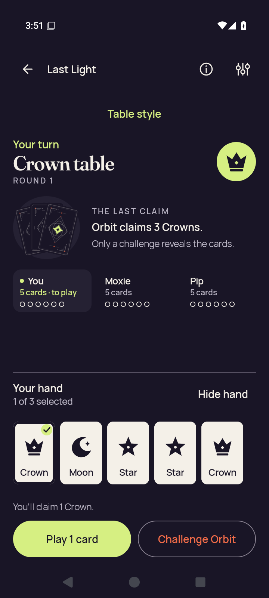</a> | **2d leave cancel selected** Android API 35 x86_64 emulator, production debug APK [2d-leave-cancel-selected.png](debug/runtime/captures/2d-leave-cancel-selected.png); 720 × 1600 px SHA-256: <code>368b7e0424d54d139ba24c06c61f62010087c7312695afd35a6ce174dbad9cb4</code> [Original XML](debug/runtime/captures/2d-leave-cancel-selected.xml) · [Original capture receipt](debug/runtime/captures/2d-leave-cancel-selected.json) Original debug native stage: 2d.leave-cancel; capture status: captured. Native gameplay was not invoked by the API35 checker; a native Ready capture does not qualify gameplay. Ordinary debug and optimized smokes passed. The debug native phase hit the executed ten-minute wrapper limit during partial 3d.renderer-death; no final debug result or complete check map exists. The optimized renderer aborted during Godot JNI startup. Neither native variant is fully qualified. Selected stills do not establish continuous privacy, engine gameplay or TalkBack speech/traversal. The collector directly viewed seven API35 originals. The later publication review covers every retained capture. Debug partial captures are not a complete native qualification. Current images do not establish engine gameplay, TalkBack speech/traversal or continuous privacy through transitions. Compose JVM snapshots are host-generated UI tests, separate from emulator screenshots. PNG/XML captures are sequential, not atomic. No derived image was viewed or created. **Publication review — exact match to a directly viewed original in this batch:** Standard Crown table with all five faces and labels; first Crown has a check badge, 1 of 3 selected and complete Play 1 card and Challenge Orbit. [Reviewed matching original](debug/runtime/captures/2d-death-selected.png); capture context remains separate. |
|  | **2d leave cancel selector** Android API 35 x86_64 emulator, production debug APK [2d-leave-cancel-selector.png](debug/runtime/captures/2d-leave-cancel-selector.png); 720 × 1600 px SHA-256: <code>19f6f577fb00340092e93f74d78b6641118fd2a5217a0ce5185d10380757267d</code> [Original XML](debug/runtime/captures/2d-leave-cancel-selector.xml) · [Original capture receipt](debug/runtime/captures/2d-leave-cancel-selector.json) Original debug native stage: 2d.leave-cancel; capture status: captured. Native gameplay was not invoked by the API35 checker; a native Ready capture does not qualify gameplay. Ordinary debug and optimized smokes passed. The debug native phase hit the executed ten-minute wrapper limit during partial 3d.renderer-death; no final debug result or complete check map exists. The optimized renderer aborted during Godot JNI startup. Neither native variant is fully qualified. Selected stills do not establish continuous privacy, engine gameplay or TalkBack speech/traversal. The collector directly viewed seven API35 originals. The later publication review covers every retained capture. Debug partial captures are not a complete native qualification. Current images do not establish engine gameplay, TalkBack speech/traversal or continuous privacy through transitions. Compose JVM snapshots are host-generated UI tests, separate from emulator screenshots. PNG/XML captures are sequential, not atomic. No derived image was viewed or created. **Publication review — direct original view:** Complete portrait Table style dialog with explanation, all three choices, Standard selected and Done. |
| <a href="debug/runtime/captures/2d-leave-end-confirmation.png">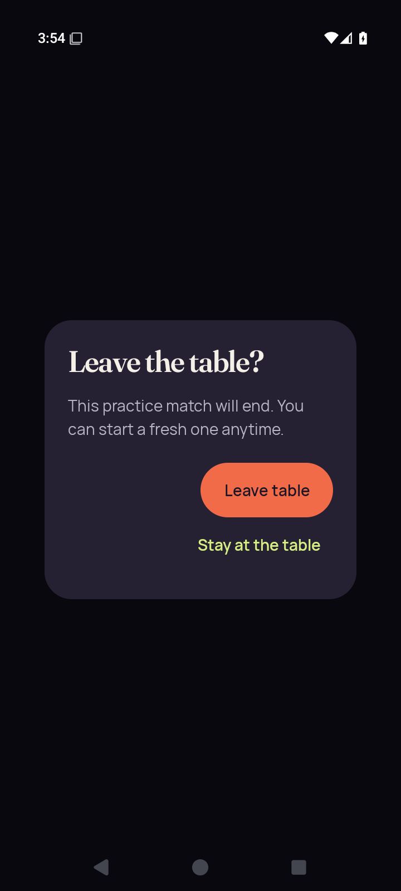</a> | **2d leave end confirmation** Android API 35 x86_64 emulator, production debug APK [2d-leave-end-confirmation.png](debug/runtime/captures/2d-leave-end-confirmation.png); 720 × 1600 px SHA-256: <code>a6a9037a9a99955b849deb02c3b0d841c10e83f98984099b2715862c80a17def</code> [Original XML](debug/runtime/captures/2d-leave-end-confirmation.xml) · [Original capture receipt](debug/runtime/captures/2d-leave-end-confirmation.json) Original debug native stage: 2d.leave-end; capture status: captured. Native gameplay was not invoked by the API35 checker; a native Ready capture does not qualify gameplay. Ordinary debug and optimized smokes passed. The debug native phase hit the executed ten-minute wrapper limit during partial 3d.renderer-death; no final debug result or complete check map exists. The optimized renderer aborted during Godot JNI startup. Neither native variant is fully qualified. Selected stills do not establish continuous privacy, engine gameplay or TalkBack speech/traversal. The collector directly viewed seven API35 originals. The later publication review covers every retained capture. Debug partial captures are not a complete native qualification. Current images do not establish engine gameplay, TalkBack speech/traversal or continuous privacy through transitions. Compose JVM snapshots are host-generated UI tests, separate from emulator screenshots. PNG/XML captures are sequential, not atomic. No derived image was viewed or created. **Publication review — direct original view:** Complete Leave the table dialog with practice-match explanation and both Leave table and Stay at the table. |
|  | **2d leave end selector** Android API 35 x86_64 emulator, production debug APK [2d-leave-end-selector.png](debug/runtime/captures/2d-leave-end-selector.png); 720 × 1600 px SHA-256: <code>067555c2de95b4e182f2cdb87703b81a0b2717d35b728f35643ef45b20e98006</code> [Original XML](debug/runtime/captures/2d-leave-end-selector.xml) · [Original capture receipt](debug/runtime/captures/2d-leave-end-selector.json) Original debug native stage: 2d.leave-end; capture status: captured. Native gameplay was not invoked by the API35 checker; a native Ready capture does not qualify gameplay. Ordinary debug and optimized smokes passed. The debug native phase hit the executed ten-minute wrapper limit during partial 3d.renderer-death; no final debug result or complete check map exists. The optimized renderer aborted during Godot JNI startup. Neither native variant is fully qualified. Selected stills do not establish continuous privacy, engine gameplay or TalkBack speech/traversal. The collector directly viewed seven API35 originals. The later publication review covers every retained capture. Debug partial captures are not a complete native qualification. Current images do not establish engine gameplay, TalkBack speech/traversal or continuous privacy through transitions. Compose JVM snapshots are host-generated UI tests, separate from emulator screenshots. PNG/XML captures are sequential, not atomic. No derived image was viewed or created. **Publication review — direct original view:** Complete portrait Table style dialog with explanation, all three choices, Standard selected and Done. |
|  | **2d recents resumed** Android API 35 x86_64 emulator, production debug APK [2d-recents-resumed.png](debug/runtime/captures/2d-recents-resumed.png); 720 × 1600 px SHA-256: <code>5a570579c3e0ca34903ac8409f77f94ec321d365ac8ffda7731ff5d25fa88e69</code> [Original XML](debug/runtime/captures/2d-recents-resumed.xml) · [Original capture receipt](debug/runtime/captures/2d-recents-resumed.json) Original debug native stage: 2d.recents-interruption; capture status: captured. Native gameplay was not invoked by the API35 checker; a native Ready capture does not qualify gameplay. Ordinary debug and optimized smokes passed. The debug native phase hit the executed ten-minute wrapper limit during partial 3d.renderer-death; no final debug result or complete check map exists. The optimized renderer aborted during Godot JNI startup. Neither native variant is fully qualified. Selected stills do not establish continuous privacy, engine gameplay or TalkBack speech/traversal. The collector directly viewed seven API35 originals. The later publication review covers every retained capture. Debug partial captures are not a complete native qualification. Current images do not establish engine gameplay, TalkBack speech/traversal or continuous privacy through transitions. Compose JVM snapshots are host-generated UI tests, separate from emulator screenshots. PNG/XML captures are sequential, not atomic. No derived image was viewed or created. **Publication review — exact match to a directly viewed original in this batch:** Native 2D capture says Table ready and shows concealed Crown claim cards and a complete Reveal my hand button. The hand-panel border meets the central scroll edge; fixed Choose cards to play and Call the bluff actions fit. [Reviewed matching original](debug/runtime/captures/2d-home-resumed.png); capture context remains separate. |
|  | **2d recents system ui** Android API 35 x86_64 emulator, production debug APK [2d-recents-system-ui.png](debug/runtime/captures/2d-recents-system-ui.png); 720 × 1600 px SHA-256: <code>f351f3865c56ac8656a1a49444d4801a7a0e867a65e1299d59a0f870555cadb1</code> [Original XML](debug/runtime/captures/2d-recents-system-ui.xml) · [Original capture receipt](debug/runtime/captures/2d-recents-system-ui.json) Existing direct visual observation: Recents task preview shows the privacy cover and native return controls; engine pixels/card faces are covered. Original debug native stage: 2d.recents-interruption; capture status: captured. Native gameplay was not invoked by the API35 checker; a native Ready capture does not qualify gameplay. Ordinary debug and optimized smokes passed. The debug native phase hit the executed ten-minute wrapper limit during partial 3d.renderer-death; no final debug result or complete check map exists. The optimized renderer aborted during Godot JNI startup. Neither native variant is fully qualified. Selected stills do not establish continuous privacy, engine gameplay or TalkBack speech/traversal. The collector directly viewed seven API35 originals. The later publication review covers every retained capture. Debug partial captures are not a complete native qualification. Current images do not establish engine gameplay, TalkBack speech/traversal or continuous privacy through transitions. Compose JVM snapshots are host-generated UI tests, separate from emulator screenshots. PNG/XML captures are sequential, not atomic. No derived image was viewed or created. **Publication review — direct original view:** Android Recents shows the PartyDeck card covered by Your cards stay private with Standard table and Leave table controls. No private card ranks or game scene are visible in the thumbnail. This single image does not establish transition timing. |
|  | **2d standard concealed** Android API 35 x86_64 emulator, production debug APK [2d-standard-concealed.png](debug/runtime/captures/2d-standard-concealed.png); 720 × 1600 px SHA-256: <code>7f9ae2c24d4765ffa5ece1364d6280d55721d09293861f8abeea6811727841c4</code> [Original XML](debug/runtime/captures/2d-standard-concealed.xml) · [Original capture receipt](debug/runtime/captures/2d-standard-concealed.json) Original debug native stage: 2d.standard-return; capture status: captured. Native gameplay was not invoked by the API35 checker; a native Ready capture does not qualify gameplay. Ordinary debug and optimized smokes passed. The debug native phase hit the executed ten-minute wrapper limit during partial 3d.renderer-death; no final debug result or complete check map exists. The optimized renderer aborted during Godot JNI startup. Neither native variant is fully qualified. Selected stills do not establish continuous privacy, engine gameplay or TalkBack speech/traversal. The collector directly viewed seven API35 originals. The later publication review covers every retained capture. Debug partial captures are not a complete native qualification. Current images do not establish engine gameplay, TalkBack speech/traversal or continuous privacy through transitions. Compose JVM snapshots are host-generated UI tests, separate from emulator screenshots. PNG/XML captures are sequential, not atomic. No derived image was viewed or created. **Publication review — direct original view:** Standard Crown table shows Orbit claims 3 Crowns and the full concealed hand panel/Show hand; disabled Select cards and Challenge Orbit fit. |
|  | **2d standard first card** Android API 35 x86_64 emulator, production debug APK [2d-standard-first-card.png](debug/runtime/captures/2d-standard-first-card.png); 720 × 1600 px SHA-256: <code>ec1752294ae6ef47a24f56e7d363a8e83bc43670998da01ae3ac4bc96bbdc45c</code> [Original XML](debug/runtime/captures/2d-standard-first-card.xml) · [Original capture receipt](debug/runtime/captures/2d-standard-first-card.json) Original debug native stage: 2d.standard-return; capture status: captured. Native gameplay was not invoked by the API35 checker; a native Ready capture does not qualify gameplay. Ordinary debug and optimized smokes passed. The debug native phase hit the executed ten-minute wrapper limit during partial 3d.renderer-death; no final debug result or complete check map exists. The optimized renderer aborted during Godot JNI startup. Neither native variant is fully qualified. Selected stills do not establish continuous privacy, engine gameplay or TalkBack speech/traversal. The collector directly viewed seven API35 originals. The later publication review covers every retained capture. Debug partial captures are not a complete native qualification. Current images do not establish engine gameplay, TalkBack speech/traversal or continuous privacy through transitions. Compose JVM snapshots are host-generated UI tests, separate from emulator screenshots. PNG/XML captures are sequential, not atomic. No derived image was viewed or created. **Publication review — direct original view:** Standard Crown table shows all five face cards and labels, 0 of 3 selected, an unchecked first Crown and complete Hide hand/bottom actions. |
| <a href="debug/runtime/captures/2d-standard-play-after-play.png">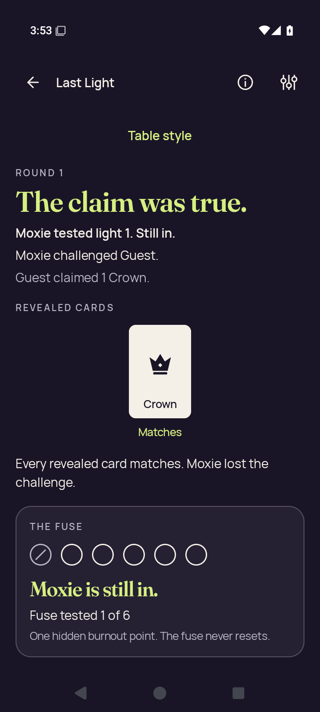</a> | **2d standard play after play** Android API 35 x86_64 emulator, production debug APK [2d-standard-play-after-play.png](debug/runtime/captures/2d-standard-play-after-play.png); 720 × 1600 px SHA-256: <code>feb4c056354c7e0d274a046055b2dec3f3f04d266ee4d0946aed9820812ecab9</code> [Original XML](debug/runtime/captures/2d-standard-play-after-play.xml) · [Original capture receipt](debug/runtime/captures/2d-standard-play-after-play.json) Original debug native stage: 2d.standard-action; capture status: captured. Native gameplay was not invoked by the API35 checker; a native Ready capture does not qualify gameplay. Ordinary debug and optimized smokes passed. The debug native phase hit the executed ten-minute wrapper limit during partial 3d.renderer-death; no final debug result or complete check map exists. The optimized renderer aborted during Godot JNI startup. Neither native variant is fully qualified. Selected stills do not establish continuous privacy, engine gameplay or TalkBack speech/traversal. The collector directly viewed seven API35 originals. The later publication review covers every retained capture. Debug partial captures are not a complete native qualification. Current images do not establish engine gameplay, TalkBack speech/traversal or continuous privacy through transitions. Compose JVM snapshots are host-generated UI tests, separate from emulator screenshots. PNG/XML captures are sequential, not atomic. No derived image was viewed or created. **Publication review — direct original view:** Standard result shows The claim was true, Moxie challenged Guest, Guest claimed 1 Crown, a complete matching Crown proof and Moxie still in with fuse tested 1 of 6. No continuation action is visible in this frame. |
|  | **2d standard play selected** Android API 35 x86_64 emulator, production debug APK [2d-standard-play-selected.png](debug/runtime/captures/2d-standard-play-selected.png); 720 × 1600 px SHA-256: <code>2857895f897b7755ebb49e7be76deb1711803b0e8d8e6fe757252c2ce2b3ceb6</code> [Original XML](debug/runtime/captures/2d-standard-play-selected.xml) · [Original capture receipt](debug/runtime/captures/2d-standard-play-selected.json) Original debug native stage: 2d.standard-action; capture status: captured. Native gameplay was not invoked by the API35 checker; a native Ready capture does not qualify gameplay. Ordinary debug and optimized smokes passed. The debug native phase hit the executed ten-minute wrapper limit during partial 3d.renderer-death; no final debug result or complete check map exists. The optimized renderer aborted during Godot JNI startup. Neither native variant is fully qualified. Selected stills do not establish continuous privacy, engine gameplay or TalkBack speech/traversal. The collector directly viewed seven API35 originals. The later publication review covers every retained capture. Debug partial captures are not a complete native qualification. Current images do not establish engine gameplay, TalkBack speech/traversal or continuous privacy through transitions. Compose JVM snapshots are host-generated UI tests, separate from emulator screenshots. PNG/XML captures are sequential, not atomic. No derived image was viewed or created. **Publication review — direct original view:** Standard Crown table shows a checked first Crown, 1 of 3 selected, all five complete faces and full Play 1 card/Challenge Orbit actions. |
|  | **2d standard public** Android API 35 x86_64 emulator, production debug APK [2d-standard-public.png](debug/runtime/captures/2d-standard-public.png); 720 × 1600 px SHA-256: <code>7f9ae2c24d4765ffa5ece1364d6280d55721d09293861f8abeea6811727841c4</code> [Original XML](debug/runtime/captures/2d-standard-public.xml) · [Original capture receipt](debug/runtime/captures/2d-standard-public.json) Original debug native stage: 2d.standard-return; capture status: captured. Native gameplay was not invoked by the API35 checker; a native Ready capture does not qualify gameplay. Ordinary debug and optimized smokes passed. The debug native phase hit the executed ten-minute wrapper limit during partial 3d.renderer-death; no final debug result or complete check map exists. The optimized renderer aborted during Godot JNI startup. Neither native variant is fully qualified. Selected stills do not establish continuous privacy, engine gameplay or TalkBack speech/traversal. The collector directly viewed seven API35 originals. The later publication review covers every retained capture. Debug partial captures are not a complete native qualification. Current images do not establish engine gameplay, TalkBack speech/traversal or continuous privacy through transitions. Compose JVM snapshots are host-generated UI tests, separate from emulator screenshots. PNG/XML captures are sequential, not atomic. No derived image was viewed or created. **Publication review — exact match to a directly viewed original in this batch:** Standard Crown table shows Orbit claims 3 Crowns and the full concealed hand panel/Show hand; disabled Select cards and Challenge Orbit fit. [Reviewed matching original](debug/runtime/captures/2d-standard-concealed.png); capture context remains separate. |
|  | **2d standard selection cleared** Android API 35 x86_64 emulator, production debug APK [2d-standard-selection-cleared.png](debug/runtime/captures/2d-standard-selection-cleared.png); 720 × 1600 px SHA-256: <code>7f9ae2c24d4765ffa5ece1364d6280d55721d09293861f8abeea6811727841c4</code> [Original XML](debug/runtime/captures/2d-standard-selection-cleared.xml) · [Original capture receipt](debug/runtime/captures/2d-standard-selection-cleared.json) Original debug native stage: 2d.standard-return; capture status: captured. Native gameplay was not invoked by the API35 checker; a native Ready capture does not qualify gameplay. Ordinary debug and optimized smokes passed. The debug native phase hit the executed ten-minute wrapper limit during partial 3d.renderer-death; no final debug result or complete check map exists. The optimized renderer aborted during Godot JNI startup. Neither native variant is fully qualified. Selected stills do not establish continuous privacy, engine gameplay or TalkBack speech/traversal. The collector directly viewed seven API35 originals. The later publication review covers every retained capture. Debug partial captures are not a complete native qualification. Current images do not establish engine gameplay, TalkBack speech/traversal or continuous privacy through transitions. Compose JVM snapshots are host-generated UI tests, separate from emulator screenshots. PNG/XML captures are sequential, not atomic. No derived image was viewed or created. **Publication review — exact match to a directly viewed original in this batch:** Standard Crown table shows Orbit claims 3 Crowns and the full concealed hand panel/Show hand; disabled Select cards and Challenge Orbit fit. [Reviewed matching original](debug/runtime/captures/2d-standard-concealed.png); capture context remains separate. |
|  | **3d baseline first card** Android API 35 x86_64 emulator, production debug APK [3d-baseline-first-card.png](debug/runtime/captures/3d-baseline-first-card.png); 720 × 1600 px SHA-256: <code>2343a00f86bc1b0fd2ccdea6fd4323122942df6057c776899eefb18ae2351c77</code> [Original XML](debug/runtime/captures/3d-baseline-first-card.xml) · [Original capture receipt](debug/runtime/captures/3d-baseline-first-card.json) Original debug native stage: 3d.practice-baseline; capture status: captured. Native gameplay was not invoked by the API35 checker; a native Ready capture does not qualify gameplay. Ordinary debug and optimized smokes passed. The debug native phase hit the executed ten-minute wrapper limit during partial 3d.renderer-death; no final debug result or complete check map exists. The optimized renderer aborted during Godot JNI startup. Neither native variant is fully qualified. Selected stills do not establish continuous privacy, engine gameplay or TalkBack speech/traversal. The collector directly viewed seven API35 originals. The later publication review covers every retained capture. Debug partial captures are not a complete native qualification. Current images do not establish engine gameplay, TalkBack speech/traversal or continuous privacy through transitions. Compose JVM snapshots are host-generated UI tests, separate from emulator screenshots. PNG/XML captures are sequential, not atomic. No derived image was viewed or created. **Publication review — direct original view:** Standard Crown table shows Star, three Wilds and Crown with all labels complete, 0 of 3 selected and full Hide hand/bottom actions. Moxie has three cards and Pip four. |
|  | **3d baseline public** Android API 35 x86_64 emulator, production debug APK [3d-baseline-public.png](debug/runtime/captures/3d-baseline-public.png); 720 × 1600 px SHA-256: <code>f820ea6828dda0947a0db2c3627c8695a79c90694c9f79e9671b1bf9f5eb858f</code> [Original XML](debug/runtime/captures/3d-baseline-public.xml) · [Original capture receipt](debug/runtime/captures/3d-baseline-public.json) Original debug native stage: 3d.practice-baseline; capture status: captured. Native gameplay was not invoked by the API35 checker; a native Ready capture does not qualify gameplay. Ordinary debug and optimized smokes passed. The debug native phase hit the executed ten-minute wrapper limit during partial 3d.renderer-death; no final debug result or complete check map exists. The optimized renderer aborted during Godot JNI startup. Neither native variant is fully qualified. Selected stills do not establish continuous privacy, engine gameplay or TalkBack speech/traversal. The collector directly viewed seven API35 originals. The later publication review covers every retained capture. Debug partial captures are not a complete native qualification. Current images do not establish engine gameplay, TalkBack speech/traversal or continuous privacy through transitions. Compose JVM snapshots are host-generated UI tests, separate from emulator screenshots. PNG/XML captures are sequential, not atomic. No derived image was viewed or created. **Publication review — direct original view:** Standard Crown table shows the complete concealed panel/Show hand and bottom actions. Orbit claims 3 Crowns; Moxie has three cards and Pip four. |
|  | **3d baseline selected** Android API 35 x86_64 emulator, production debug APK [3d-baseline-selected.png](debug/runtime/captures/3d-baseline-selected.png); 720 × 1600 px SHA-256: <code>6eb38df0c77c5f4ff4c755772118e0e5ec2a4a31ac125a442036dfd78382f246</code> [Original XML](debug/runtime/captures/3d-baseline-selected.xml) · [Original capture receipt](debug/runtime/captures/3d-baseline-selected.json) Original debug native stage: 3d.standard-hand; capture status: captured. Native gameplay was not invoked by the API35 checker; a native Ready capture does not qualify gameplay. Ordinary debug and optimized smokes passed. The debug native phase hit the executed ten-minute wrapper limit during partial 3d.renderer-death; no final debug result or complete check map exists. The optimized renderer aborted during Godot JNI startup. Neither native variant is fully qualified. Selected stills do not establish continuous privacy, engine gameplay or TalkBack speech/traversal. The collector directly viewed seven API35 originals. The later publication review covers every retained capture. Debug partial captures are not a complete native qualification. Current images do not establish engine gameplay, TalkBack speech/traversal or continuous privacy through transitions. Compose JVM snapshots are host-generated UI tests, separate from emulator screenshots. PNG/XML captures are sequential, not atomic. No derived image was viewed or created. **Publication review — direct original view:** Standard Crown table shows a checked first Star, three Wilds and Crown, 1 of 3 selected and complete Play 1 card/Challenge Orbit. |
| <a href="debug/runtime/captures/3d-death-selected.png">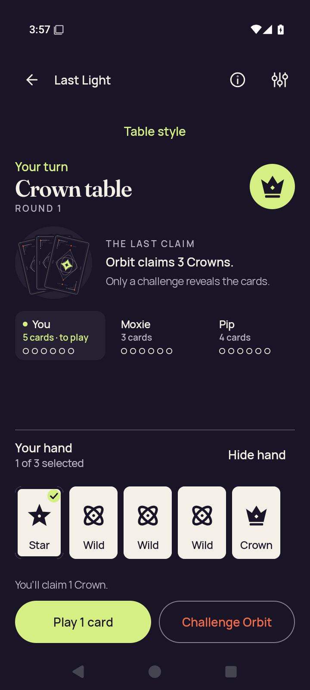</a> | **3d death selected** Android API 35 x86_64 emulator, production debug APK [3d-death-selected.png](debug/runtime/captures/3d-death-selected.png); 720 × 1600 px SHA-256: <code>99e47d6b96be07c3719b2e683f08734ce1c10e8eab9d3df7054ef0dde3bbf1f8</code> [Original XML](debug/runtime/captures/3d-death-selected.xml) · [Original capture receipt](debug/runtime/captures/3d-death-selected.json) Original debug native stage: 3d.renderer-death; capture status: captured. Native gameplay was not invoked by the API35 checker; a native Ready capture does not qualify gameplay. Ordinary debug and optimized smokes passed. The debug native phase hit the executed ten-minute wrapper limit during partial 3d.renderer-death; no final debug result or complete check map exists. The optimized renderer aborted during Godot JNI startup. Neither native variant is fully qualified. Selected stills do not establish continuous privacy, engine gameplay or TalkBack speech/traversal. The collector directly viewed seven API35 originals. The later publication review covers every retained capture. Debug partial captures are not a complete native qualification. Current images do not establish engine gameplay, TalkBack speech/traversal or continuous privacy through transitions. Compose JVM snapshots are host-generated UI tests, separate from emulator screenshots. PNG/XML captures are sequential, not atomic. No derived image was viewed or created. **Publication review — direct original view:** Standard Crown table shows a checked first Star, three Wilds and Crown, 1 of 3 selected and complete Play 1 card/Challenge Orbit. This still does not itself establish process-death recovery. |
| <a href="debug/runtime/captures/3d-entry-native-ready.png">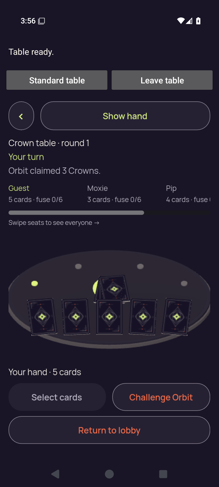</a> | **3d entry native ready** Android API 35 x86_64 emulator, production debug APK [3d-entry-native-ready.png](debug/runtime/captures/3d-entry-native-ready.png); 720 × 1600 px SHA-256: <code>1f2f2733aac887e469722a5e84d5aada196d9f80896bf0cc022849397ef3bf91</code> [Original XML](debug/runtime/captures/3d-entry-native-ready.xml) · [Original capture receipt](debug/runtime/captures/3d-entry-native-ready.json) Existing direct visual observation: Rendered 3D table and Ready/native return controls. Five card backs are visible; no private card face is visible. Original debug native stage: 3d.native-entry; capture status: captured. Native gameplay was not invoked by the API35 checker; a native Ready capture does not qualify gameplay. Ordinary debug and optimized smokes passed. The debug native phase hit the executed ten-minute wrapper limit during partial 3d.renderer-death; no final debug result or complete check map exists. The optimized renderer aborted during Godot JNI startup. Neither native variant is fully qualified. Selected stills do not establish continuous privacy, engine gameplay or TalkBack speech/traversal. The collector directly viewed seven API35 originals. The later publication review covers every retained capture. Debug partial captures are not a complete native qualification. Current images do not establish engine gameplay, TalkBack speech/traversal or continuous privacy through transitions. Compose JVM snapshots are host-generated UI tests, separate from emulator screenshots. PNG/XML captures are sequential, not atomic. No derived image was viewed or created. **Publication review — direct original view:** The native portrait 3D entry shows five complete hand backs, a concealed center pile and full Show hand, Select cards, Challenge Orbit and Return to lobby controls. Crown/round and claim text is readable; Pip’s seat details clip at the horizontal edge. |
|  | **3d entry selector** Android API 35 x86_64 emulator, production debug APK [3d-entry-selector.png](debug/runtime/captures/3d-entry-selector.png); 720 × 1600 px SHA-256: <code>e8e6c63f73c2f05b95999f999b16debc0155682203abc95a638196dd9452babd</code> [Original XML](debug/runtime/captures/3d-entry-selector.xml) · [Original capture receipt](debug/runtime/captures/3d-entry-selector.json) Original debug native stage: 3d.native-entry; capture status: captured. Native gameplay was not invoked by the API35 checker; a native Ready capture does not qualify gameplay. Ordinary debug and optimized smokes passed. The debug native phase hit the executed ten-minute wrapper limit during partial 3d.renderer-death; no final debug result or complete check map exists. The optimized renderer aborted during Godot JNI startup. Neither native variant is fully qualified. Selected stills do not establish continuous privacy, engine gameplay or TalkBack speech/traversal. The collector directly viewed seven API35 originals. The later publication review covers every retained capture. Debug partial captures are not a complete native qualification. Current images do not establish engine gameplay, TalkBack speech/traversal or continuous privacy through transitions. Compose JVM snapshots are host-generated UI tests, separate from emulator screenshots. PNG/XML captures are sequential, not atomic. No derived image was viewed or created. **Publication review — direct original view:** Complete Table style dialog with explanation, three choices, Standard selected and Done. |
|  | **3d home resumed** Android API 35 x86_64 emulator, production debug APK [3d-home-resumed.png](debug/runtime/captures/3d-home-resumed.png); 720 × 1600 px SHA-256: <code>04de9dfb1e0999816ba6692c9f9cf6aceb9d919767f20710e83fd8dec2c146df</code> [Original XML](debug/runtime/captures/3d-home-resumed.xml) · [Original capture receipt](debug/runtime/captures/3d-home-resumed.json) Original debug native stage: 3d.home-interruption; capture status: captured. Native gameplay was not invoked by the API35 checker; a native Ready capture does not qualify gameplay. Ordinary debug and optimized smokes passed. The debug native phase hit the executed ten-minute wrapper limit during partial 3d.renderer-death; no final debug result or complete check map exists. The optimized renderer aborted during Godot JNI startup. Neither native variant is fully qualified. Selected stills do not establish continuous privacy, engine gameplay or TalkBack speech/traversal. The collector directly viewed seven API35 originals. The later publication review covers every retained capture. Debug partial captures are not a complete native qualification. Current images do not establish engine gameplay, TalkBack speech/traversal or continuous privacy through transitions. Compose JVM snapshots are host-generated UI tests, separate from emulator screenshots. PNG/XML captures are sequential, not atomic. No derived image was viewed or created. **Publication review — direct original view:** Native 3D says Table ready. Five complete hand backs and a concealed center pile fit, with Show hand, Select cards, Challenge Orbit and Return to lobby complete. The horizontal seat row clips Pip details at the right edge and shows its scrollbar/instruction. |
|  | **3d home system ui** Android API 35 x86_64 emulator, production debug APK [3d-home-system-ui.png](debug/runtime/captures/3d-home-system-ui.png); 720 × 1600 px SHA-256: <code>892ea9a5f83211de3e323b641342629246f8ddc3e1b8343d1df2fd32d73ae591</code> [Original XML](debug/runtime/captures/3d-home-system-ui.xml) · [Original capture receipt](debug/runtime/captures/3d-home-system-ui.json) Existing direct visual observation: Android launcher Home is visible; no app table or private card face is visible. Original debug native stage: 3d.home-interruption; capture status: captured. Native gameplay was not invoked by the API35 checker; a native Ready capture does not qualify gameplay. Ordinary debug and optimized smokes passed. The debug native phase hit the executed ten-minute wrapper limit during partial 3d.renderer-death; no final debug result or complete check map exists. The optimized renderer aborted during Godot JNI startup. Neither native variant is fully qualified. Selected stills do not establish continuous privacy, engine gameplay or TalkBack speech/traversal. The collector directly viewed seven API35 originals. The later publication review covers every retained capture. Debug partial captures are not a complete native qualification. Current images do not establish engine gameplay, TalkBack speech/traversal or continuous privacy through transitions. Compose JVM snapshots are host-generated UI tests, separate from emulator screenshots. PNG/XML captures are sequential, not atomic. No derived image was viewed or created. **Publication review — direct original view:** The 3D Home system capture shows the Android launcher, search and dock icons with no game content. It is a distinct capture from the earlier 2D Home frame. |
| <a href="debug/runtime/captures/3d-recents-resumed.png">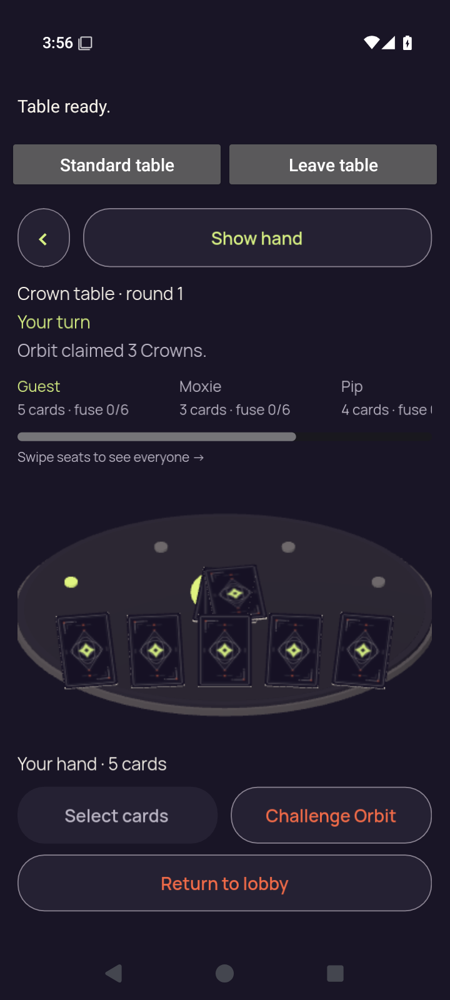</a> | **3d recents resumed** Android API 35 x86_64 emulator, production debug APK [3d-recents-resumed.png](debug/runtime/captures/3d-recents-resumed.png); 720 × 1600 px SHA-256: <code>04de9dfb1e0999816ba6692c9f9cf6aceb9d919767f20710e83fd8dec2c146df</code> [Original XML](debug/runtime/captures/3d-recents-resumed.xml) · [Original capture receipt](debug/runtime/captures/3d-recents-resumed.json) Original debug native stage: 3d.recents-interruption; capture status: captured. Native gameplay was not invoked by the API35 checker; a native Ready capture does not qualify gameplay. Ordinary debug and optimized smokes passed. The debug native phase hit the executed ten-minute wrapper limit during partial 3d.renderer-death; no final debug result or complete check map exists. The optimized renderer aborted during Godot JNI startup. Neither native variant is fully qualified. Selected stills do not establish continuous privacy, engine gameplay or TalkBack speech/traversal. The collector directly viewed seven API35 originals. The later publication review covers every retained capture. Debug partial captures are not a complete native qualification. Current images do not establish engine gameplay, TalkBack speech/traversal or continuous privacy through transitions. Compose JVM snapshots are host-generated UI tests, separate from emulator screenshots. PNG/XML captures are sequential, not atomic. No derived image was viewed or created. **Publication review — exact match to a directly viewed original in this batch:** Native 3D says Table ready. Five complete hand backs and a concealed center pile fit, with Show hand, Select cards, Challenge Orbit and Return to lobby complete. The horizontal seat row clips Pip details at the right edge and shows its scrollbar/instruction. [Reviewed matching original](debug/runtime/captures/3d-home-resumed.png); capture context remains separate. |
| <a href="debug/runtime/captures/3d-recents-system-ui.png">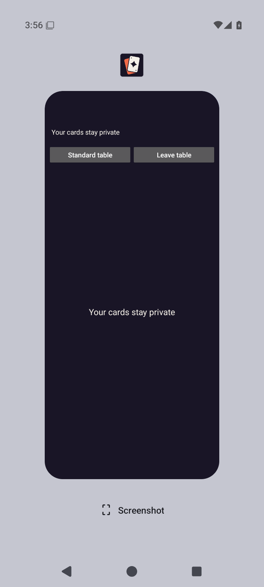</a> | **3d recents system ui** Android API 35 x86_64 emulator, production debug APK [3d-recents-system-ui.png](debug/runtime/captures/3d-recents-system-ui.png); 720 × 1600 px SHA-256: <code>7362638db6c71685b5b2d22a2de2a64b3410b8f3dc9a8465cdf735bebd3f1a36</code> [Original XML](debug/runtime/captures/3d-recents-system-ui.xml) · [Original capture receipt](debug/runtime/captures/3d-recents-system-ui.json) Existing direct visual observation: Recents task preview shows the privacy cover and native return controls; engine pixels/card faces are covered. Original debug native stage: 3d.recents-interruption; capture status: captured. Native gameplay was not invoked by the API35 checker; a native Ready capture does not qualify gameplay. Ordinary debug and optimized smokes passed. The debug native phase hit the executed ten-minute wrapper limit during partial 3d.renderer-death; no final debug result or complete check map exists. The optimized renderer aborted during Godot JNI startup. Neither native variant is fully qualified. Selected stills do not establish continuous privacy, engine gameplay or TalkBack speech/traversal. The collector directly viewed seven API35 originals. The later publication review covers every retained capture. Debug partial captures are not a complete native qualification. Current images do not establish engine gameplay, TalkBack speech/traversal or continuous privacy through transitions. Compose JVM snapshots are host-generated UI tests, separate from emulator screenshots. PNG/XML captures are sequential, not atomic. No derived image was viewed or created. **Publication review — direct original view:** The 3D Recents capture shows a PartyDeck thumbnail covered by Your cards stay private and the two native navigation controls. No renderer scene or card rank is visible; transition timing remains outside this single image. |
| <a href="debug/runtime/captures/3d-standard-concealed.png">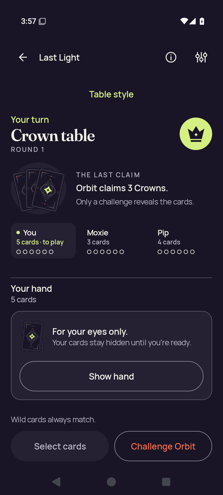</a> | **3d standard concealed** Android API 35 x86_64 emulator, production debug APK [3d-standard-concealed.png](debug/runtime/captures/3d-standard-concealed.png); 720 × 1600 px SHA-256: <code>be2930f7a9fed8e32f970789a8a97dcf5cc8c3aac854067e1d45b546561c00ca</code> [Original XML](debug/runtime/captures/3d-standard-concealed.xml) · [Original capture receipt](debug/runtime/captures/3d-standard-concealed.json) Original debug native stage: 3d.standard-return; capture status: captured. Native gameplay was not invoked by the API35 checker; a native Ready capture does not qualify gameplay. Ordinary debug and optimized smokes passed. The debug native phase hit the executed ten-minute wrapper limit during partial 3d.renderer-death; no final debug result or complete check map exists. The optimized renderer aborted during Godot JNI startup. Neither native variant is fully qualified. Selected stills do not establish continuous privacy, engine gameplay or TalkBack speech/traversal. The collector directly viewed seven API35 originals. The later publication review covers every retained capture. Debug partial captures are not a complete native qualification. Current images do not establish engine gameplay, TalkBack speech/traversal or continuous privacy through transitions. Compose JVM snapshots are host-generated UI tests, separate from emulator screenshots. PNG/XML captures are sequential, not atomic. No derived image was viewed or created. **Publication review — direct original view:** Standard Crown table shows the complete concealed panel, Show hand and bottom actions; Orbit claims 3 Crowns. Moxie has three cards and Pip four. |
| <a href="debug/runtime/captures/3d-standard-first-card.png">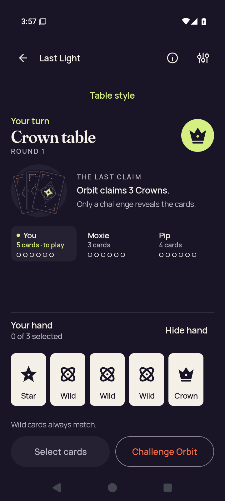</a> | **3d standard first card** Android API 35 x86_64 emulator, production debug APK [3d-standard-first-card.png](debug/runtime/captures/3d-standard-first-card.png); 720 × 1600 px SHA-256: <code>6358d0b0eaf365c2fbfe41c9479a34402fb60aae7db90389a7a6c0dcdb16cc10</code> [Original XML](debug/runtime/captures/3d-standard-first-card.xml) · [Original capture receipt](debug/runtime/captures/3d-standard-first-card.json) Original debug native stage: 3d.standard-return; capture status: captured. Native gameplay was not invoked by the API35 checker; a native Ready capture does not qualify gameplay. Ordinary debug and optimized smokes passed. The debug native phase hit the executed ten-minute wrapper limit during partial 3d.renderer-death; no final debug result or complete check map exists. The optimized renderer aborted during Godot JNI startup. Neither native variant is fully qualified. Selected stills do not establish continuous privacy, engine gameplay or TalkBack speech/traversal. The collector directly viewed seven API35 originals. The later publication review covers every retained capture. Debug partial captures are not a complete native qualification. Current images do not establish engine gameplay, TalkBack speech/traversal or continuous privacy through transitions. Compose JVM snapshots are host-generated UI tests, separate from emulator screenshots. PNG/XML captures are sequential, not atomic. No derived image was viewed or created. **Publication review — direct original view:** Standard Crown table shows all five complete faces and labels: Star, three Wilds and Crown. First Star is unchecked, 0 of 3 selected, and Hide hand/bottom actions fit. |
|  | **3d standard public** Android API 35 x86_64 emulator, production debug APK [3d-standard-public.png](debug/runtime/captures/3d-standard-public.png); 720 × 1600 px SHA-256: <code>be2930f7a9fed8e32f970789a8a97dcf5cc8c3aac854067e1d45b546561c00ca</code> [Original XML](debug/runtime/captures/3d-standard-public.xml) · [Original capture receipt](debug/runtime/captures/3d-standard-public.json) Original debug native stage: 3d.standard-return; capture status: captured. Native gameplay was not invoked by the API35 checker; a native Ready capture does not qualify gameplay. Ordinary debug and optimized smokes passed. The debug native phase hit the executed ten-minute wrapper limit during partial 3d.renderer-death; no final debug result or complete check map exists. The optimized renderer aborted during Godot JNI startup. Neither native variant is fully qualified. Selected stills do not establish continuous privacy, engine gameplay or TalkBack speech/traversal. The collector directly viewed seven API35 originals. The later publication review covers every retained capture. Debug partial captures are not a complete native qualification. Current images do not establish engine gameplay, TalkBack speech/traversal or continuous privacy through transitions. Compose JVM snapshots are host-generated UI tests, separate from emulator screenshots. PNG/XML captures are sequential, not atomic. No derived image was viewed or created. **Publication review — exact match to a directly viewed original in this batch:** Standard Crown table shows the complete concealed panel, Show hand and bottom actions; Orbit claims 3 Crowns. Moxie has three cards and Pip four. [Reviewed matching original](debug/runtime/captures/3d-standard-concealed.png); capture context remains separate. |
|  | **3d standard selection cleared** Android API 35 x86_64 emulator, production debug APK [3d-standard-selection-cleared.png](debug/runtime/captures/3d-standard-selection-cleared.png); 720 × 1600 px SHA-256: <code>be2930f7a9fed8e32f970789a8a97dcf5cc8c3aac854067e1d45b546561c00ca</code> [Original XML](debug/runtime/captures/3d-standard-selection-cleared.xml) · [Original capture receipt](debug/runtime/captures/3d-standard-selection-cleared.json) Original debug native stage: 3d.standard-return; capture status: captured. Native gameplay was not invoked by the API35 checker; a native Ready capture does not qualify gameplay. Ordinary debug and optimized smokes passed. The debug native phase hit the executed ten-minute wrapper limit during partial 3d.renderer-death; no final debug result or complete check map exists. The optimized renderer aborted during Godot JNI startup. Neither native variant is fully qualified. Selected stills do not establish continuous privacy, engine gameplay or TalkBack speech/traversal. The collector directly viewed seven API35 originals. The later publication review covers every retained capture. Debug partial captures are not a complete native qualification. Current images do not establish engine gameplay, TalkBack speech/traversal or continuous privacy through transitions. Compose JVM snapshots are host-generated UI tests, separate from emulator screenshots. PNG/XML captures are sequential, not atomic. No derived image was viewed or created. **Publication review — exact match to a directly viewed original in this batch:** Standard Crown table shows the complete concealed panel, Show hand and bottom actions; Orbit claims 3 Crowns. Moxie has three cards and Pip four. [Reviewed matching original](debug/runtime/captures/3d-standard-concealed.png); capture context remains separate. |
|  | **Home cold** Android API 35 x86_64 emulator, production debug APK [home-cold.png](debug/runtime/captures/home-cold.png); 720 × 1600 px SHA-256: <code>6b7b4fd1b69e0d0c5b2ef67fcc112262dd76a9ff34147cfeeec3bb7d458651d9</code> [Original XML](debug/runtime/captures/home-cold.xml) · [Original capture receipt](debug/runtime/captures/home-cold.json) Original debug native stage: emulator readiness; capture status: captured. Native gameplay was not invoked by the API35 checker; a native Ready capture does not qualify gameplay. Ordinary debug and optimized smokes passed. The debug native phase hit the executed ten-minute wrapper limit during partial 3d.renderer-death; no final debug result or complete check map exists. The optimized renderer aborted during Godot JNI startup. Neither native variant is fully qualified. Selected stills do not establish continuous privacy, engine gameplay or TalkBack speech/traversal. The collector directly viewed seven API35 originals. The later publication review covers every retained capture. Debug partial captures are not a complete native qualification. Current images do not establish engine gameplay, TalkBack speech/traversal or continuous privacy through transitions. Compose JVM snapshots are host-generated UI tests, separate from emulator screenshots. PNG/XML captures are sequential, not atomic. No derived image was viewed or created. **Publication review — direct original view:** Complete PartyDeck Home with title, three-card artwork and Host, Join, practice and How to play actions. |
| <a href="optimized-test-signed/runtime/captures/2d-baseline-first-card.png">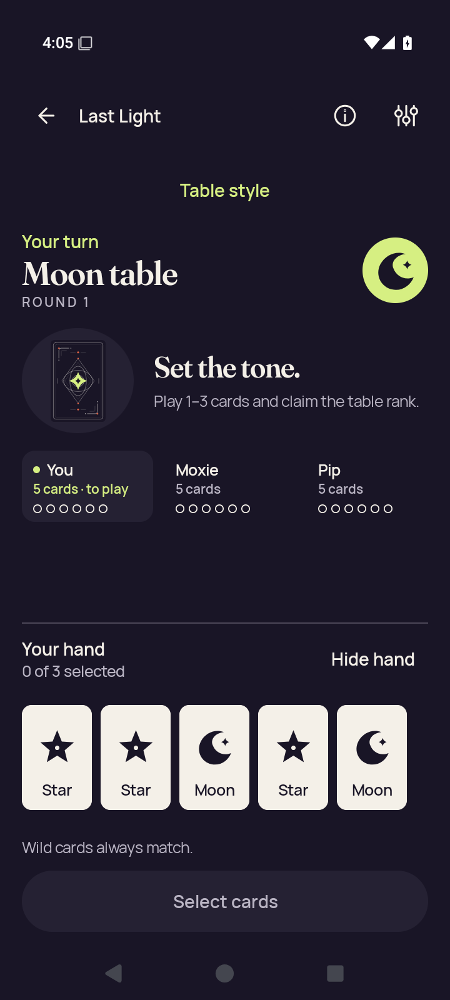</a> | **2d baseline first card** Android API 35 x86_64 emulator, production optimized-test-signed APK [2d-baseline-first-card.png](optimized-test-signed/runtime/captures/2d-baseline-first-card.png); 720 × 1600 px SHA-256: <code>497cdb9b11f7b2a3634690291e53b5f0a6671e5871bb16fefa134e498e838922</code> [Original XML](optimized-test-signed/runtime/captures/2d-baseline-first-card.xml) · [Original capture receipt](optimized-test-signed/runtime/captures/2d-baseline-first-card.json) · [Original result](optimized-test-signed/runtime/godot-session-result.json) Original optimized-test-signed native stage: 2d.practice-baseline; capture status: captured. Native gameplay was not invoked by the API35 checker; a native Ready capture does not qualify gameplay. Ordinary debug and optimized smokes passed. The debug native phase hit the executed ten-minute wrapper limit during partial 3d.renderer-death; no final debug result or complete check map exists. The optimized renderer aborted during Godot JNI startup. Neither native variant is fully qualified. Selected stills do not establish continuous privacy, engine gameplay or TalkBack speech/traversal. The collector directly viewed seven API35 originals. The later publication review covers every retained capture. Debug partial captures are not a complete native qualification. Current images do not establish engine gameplay, TalkBack speech/traversal or continuous privacy through transitions. Compose JVM snapshots are host-generated UI tests, separate from emulator screenshots. PNG/XML captures are sequential, not atomic. No derived image was viewed or created. **Publication review — direct original view:** Standard Moon table shows Set the tone, five complete faces and labels, 0 of 3 selected, full Hide hand and disabled Select cards. |
|  | **2d baseline public** Android API 35 x86_64 emulator, production optimized-test-signed APK [2d-baseline-public.png](optimized-test-signed/runtime/captures/2d-baseline-public.png); 720 × 1600 px SHA-256: <code>7649a99e3846ae0e376b0d4002d4fc3194a281f6060693f3fe7fc501a296c7eb</code> [Original XML](optimized-test-signed/runtime/captures/2d-baseline-public.xml) · [Original capture receipt](optimized-test-signed/runtime/captures/2d-baseline-public.json) · [Original result](optimized-test-signed/runtime/godot-session-result.json) Original optimized-test-signed native stage: 2d.practice-baseline; capture status: captured. Native gameplay was not invoked by the API35 checker; a native Ready capture does not qualify gameplay. Ordinary debug and optimized smokes passed. The debug native phase hit the executed ten-minute wrapper limit during partial 3d.renderer-death; no final debug result or complete check map exists. The optimized renderer aborted during Godot JNI startup. Neither native variant is fully qualified. Selected stills do not establish continuous privacy, engine gameplay or TalkBack speech/traversal. The collector directly viewed seven API35 originals. The later publication review covers every retained capture. Debug partial captures are not a complete native qualification. Current images do not establish engine gameplay, TalkBack speech/traversal or continuous privacy through transitions. Compose JVM snapshots are host-generated UI tests, separate from emulator screenshots. PNG/XML captures are sequential, not atomic. No derived image was viewed or created. **Publication review — direct original view:** Standard Moon table shows Set the tone and the complete concealed hand panel/Show hand, with disabled Select cards fitting below. |
| <a href="optimized-test-signed/runtime/captures/2d-baseline-selected.png">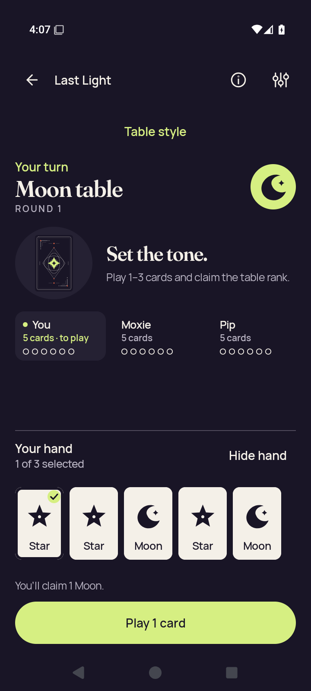</a> | **2d baseline selected** Android API 35 x86_64 emulator, production optimized-test-signed APK [2d-baseline-selected.png](optimized-test-signed/runtime/captures/2d-baseline-selected.png); 720 × 1600 px SHA-256: <code>484468e891521d70bf35c61a1362840908f9f9b798f5da97b37185222ebdf4bc</code> [Original XML](optimized-test-signed/runtime/captures/2d-baseline-selected.xml) · [Original capture receipt](optimized-test-signed/runtime/captures/2d-baseline-selected.json) · [Original result](optimized-test-signed/runtime/godot-session-result.json) Original optimized-test-signed native stage: 2d.standard-hand; capture status: captured. Native gameplay was not invoked by the API35 checker; a native Ready capture does not qualify gameplay. Ordinary debug and optimized smokes passed. The debug native phase hit the executed ten-minute wrapper limit during partial 3d.renderer-death; no final debug result or complete check map exists. The optimized renderer aborted during Godot JNI startup. Neither native variant is fully qualified. Selected stills do not establish continuous privacy, engine gameplay or TalkBack speech/traversal. The collector directly viewed seven API35 originals. The later publication review covers every retained capture. Debug partial captures are not a complete native qualification. Current images do not establish engine gameplay, TalkBack speech/traversal or continuous privacy through transitions. Compose JVM snapshots are host-generated UI tests, separate from emulator screenshots. PNG/XML captures are sequential, not atomic. No derived image was viewed or created. **Publication review — direct original view:** Standard Moon table shows all five complete faces and labels, checked first Star, 1 of 3 selected, the claim-1-Moon feedback and full-width Play 1 card. |
|  | **2d entry selector** Android API 35 x86_64 emulator, production optimized-test-signed APK [2d-entry-selector.png](optimized-test-signed/runtime/captures/2d-entry-selector.png); 720 × 1600 px SHA-256: <code>ce6163994dec5a57de1f30d376fee74119f776a50f9f7283a9cff6cf189729f9</code> [Original XML](optimized-test-signed/runtime/captures/2d-entry-selector.xml) · [Original capture receipt](optimized-test-signed/runtime/captures/2d-entry-selector.json) · [Original result](optimized-test-signed/runtime/godot-session-result.json) Original optimized-test-signed native stage: 2d.native-entry; capture status: captured. Native gameplay was not invoked by the API35 checker; a native Ready capture does not qualify gameplay. Ordinary debug and optimized smokes passed. The debug native phase hit the executed ten-minute wrapper limit during partial 3d.renderer-death; no final debug result or complete check map exists. The optimized renderer aborted during Godot JNI startup. Neither native variant is fully qualified. Selected stills do not establish continuous privacy, engine gameplay or TalkBack speech/traversal. The collector directly viewed seven API35 originals. The later publication review covers every retained capture. Debug partial captures are not a complete native qualification. Current images do not establish engine gameplay, TalkBack speech/traversal or continuous privacy through transitions. Compose JVM snapshots are host-generated UI tests, separate from emulator screenshots. PNG/XML captures are sequential, not atomic. No derived image was viewed or created. **Publication review — direct original view:** Complete portrait Table style dialog with explanatory copy, all three choices, Standard selected and Done. |
| <a href="optimized-test-signed/runtime/captures/final-diagnostic.png">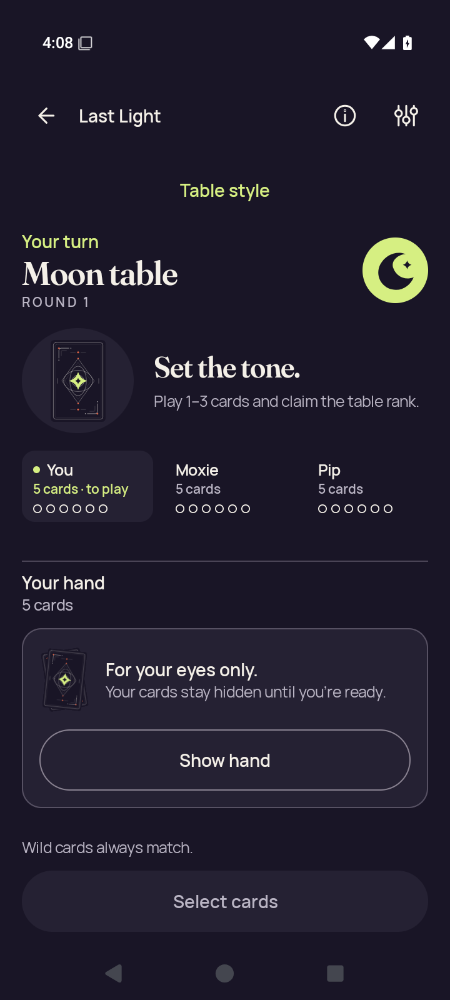</a> | **Final diagnostic** Android API 35 x86_64 emulator, production optimized-test-signed APK [final-diagnostic.png](optimized-test-signed/runtime/captures/final-diagnostic.png); 720 × 1600 px SHA-256: <code>0c6c057379a9fa08c54297f6b2259bc8325bd97f6ae822df82f5efdbcd9846b8</code> [Original XML](optimized-test-signed/runtime/captures/final-diagnostic.xml) · [Original capture receipt](optimized-test-signed/runtime/captures/final-diagnostic.json) · [Original result](optimized-test-signed/runtime/godot-session-result.json) Existing direct visual observation: Concealed Compose table after the JNI crash; Show hand and disabled Select cards are visible, without a native surface. Original optimized-test-signed native stage: 2d.native-entry; capture status: captured. Native gameplay was not invoked by the API35 checker; a native Ready capture does not qualify gameplay. Ordinary debug and optimized smokes passed. The debug native phase hit the executed ten-minute wrapper limit during partial 3d.renderer-death; no final debug result or complete check map exists. The optimized renderer aborted during Godot JNI startup. Neither native variant is fully qualified. Selected stills do not establish continuous privacy, engine gameplay or TalkBack speech/traversal. The collector directly viewed seven API35 originals. The later publication review covers every retained capture. Debug partial captures are not a complete native qualification. Current images do not establish engine gameplay, TalkBack speech/traversal or continuous privacy through transitions. Compose JVM snapshots are host-generated UI tests, separate from emulator screenshots. PNG/XML captures are sequential, not atomic. No derived image was viewed or created. **Publication review — direct original view:** The optimized final diagnostic is the Standard concealed Moon table, with complete Show hand and disabled Select cards. No native Ready state is visible. The later Standard frame does not negate the recorded JNI crash. |
| <a href="optimized-test-signed/runtime/captures/home-cold.png">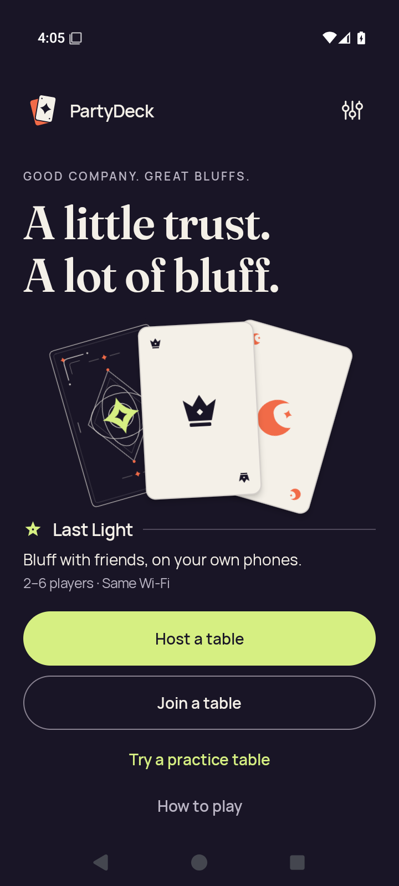</a> | **Home cold** Android API 35 x86_64 emulator, production optimized-test-signed APK [home-cold.png](optimized-test-signed/runtime/captures/home-cold.png); 720 × 1600 px SHA-256: <code>9de4cb4873d67484efe808c9ba06582d216b193b34684f8df7838e80b54a4519</code> [Original XML](optimized-test-signed/runtime/captures/home-cold.xml) · [Original capture receipt](optimized-test-signed/runtime/captures/home-cold.json) · [Original result](optimized-test-signed/runtime/godot-session-result.json) Original optimized-test-signed native stage: emulator readiness; capture status: captured. Native gameplay was not invoked by the API35 checker; a native Ready capture does not qualify gameplay. Ordinary debug and optimized smokes passed. The debug native phase hit the executed ten-minute wrapper limit during partial 3d.renderer-death; no final debug result or complete check map exists. The optimized renderer aborted during Godot JNI startup. Neither native variant is fully qualified. Selected stills do not establish continuous privacy, engine gameplay or TalkBack speech/traversal. The collector directly viewed seven API35 originals. The later publication review covers every retained capture. Debug partial captures are not a complete native qualification. Current images do not establish engine gameplay, TalkBack speech/traversal or continuous privacy through transitions. Compose JVM snapshots are host-generated UI tests, separate from emulator screenshots. PNG/XML captures are sequential, not atomic. No derived image was viewed or created. **Publication review — direct original view:** Complete PartyDeck Home with title, three-card artwork and Host, Join, practice and How to play actions. |
