# Android API 35 optimized-test-signed — ordinary UI smoke passed

[All collections](../../README.md) · [Original CI run](https://github.com/Apdelrahman1911/PartyDeck/actions/runs/34496267571)

The ordinary UI smoke passed. The separate native phase failed or ended incomplete; no full native qualification follows.

30 named PNG/XML pairs and one distinct final PNG associated with last-ui.xml. Original result JSON and owner mapping are preserved.

Exact source: `410c9386dd88b2ad0ab380e5b8f1f9bf19674b00`. [Original owner capture mapping](../provenance/review/capture-gallery-mapping.json).

## Publication visual review

All 31 original capture identities have review coverage: 30 direct original views, 1 exact matches to direct views in this batch. Each capture keeps its original name, source, dimensions, scenario and recorded time. Matching pixels do not transfer runtime outcomes. No derived image was created.

[Completed visual review](../provenance/publication-review/partydeck-gallery-after-2013-api35-visual-review.json) · [Capture/review binding](../../godot-ios-native-34488350932/provenance/publication-review/partydeck-gallery-2355-publication-review.json) · [Frozen publication queue](../../godot-android-adaptive-34496282263/provenance/publication-queue-v1/queue-freeze.json) · [Original copy mapping](../../godot-android-adaptive-34496282263/provenance/publication-queue-v1/copy-paths.tsv) · [Unchanged queue page](../../godot-android-adaptive-34496282263/provenance/publication-queue-v1/payload/docs/screenshots/android-34496267571/optimized-test-signed/README.md). The archived queue page retains its original text and relative paths as provenance.

| Original capture | Recorded scenario and retained limits |
| --- | --- |
|  | **Final ordinary-smoke diagnostic** Android API 35 x86_64 emulator, production optimized-test-signed APK [final-screen.png](final-screen.png); 720 × 1600 px SHA-256: <code>c80f4f76bb6eecc39417efc7a7ceb8f8453b41d869938cecc1c42fe0f282487b</code> [Original XML](last-ui.xml) · [Original result](smoke-result.json) Named PNG/XML pair; final-screen.png is associated with the separately retained last-ui.xml. This distinct final original is associated with last-ui.xml, not a named same-stem PNG/XML capture pair. Original ordinary UI smoke passed. The separate publication visual review adds no new accessibility result. Ordinary debug and optimized smokes passed. The debug native phase hit the executed ten-minute wrapper limit during partial 3d.renderer-death; no final debug result or complete check map exists. The optimized renderer aborted during Godot JNI startup. Neither native variant is fully qualified. Selected stills do not establish continuous privacy, engine gameplay or TalkBack speech/traversal. The collector directly viewed seven API35 originals. The later publication review covers every retained capture. Debug partial captures are not a complete native qualification. Current images do not establish engine gameplay, TalkBack speech/traversal or continuous privacy through transitions. Compose JVM snapshots are host-generated UI tests, separate from emulator screenshots. PNG/XML captures are sequential, not atomic. No derived image was viewed or created. **Publication review — direct original view:** Large-text PartyDeck Home shows the complete Last Light summary and all Host, Join, practice and How to play actions; the compact layout omits the hero artwork. |
|  | **Home and practice route** Android API 35 x86_64 emulator, production optimized-test-signed APK [home.png](home.png); 720 × 1600 px SHA-256: <code>9cc853974947aa124343cfb022696403c45b33e1b139f905bdb00b52b702d89b</code> [Original XML](home.xml) · [Original result](smoke-result.json) Named PNG/XML pair; final-screen.png is associated with the separately retained last-ui.xml. Original ordinary UI smoke passed. The separate publication visual review adds no new accessibility result. Ordinary debug and optimized smokes passed. The debug native phase hit the executed ten-minute wrapper limit during partial 3d.renderer-death; no final debug result or complete check map exists. The optimized renderer aborted during Godot JNI startup. Neither native variant is fully qualified. Selected stills do not establish continuous privacy, engine gameplay or TalkBack speech/traversal. The collector directly viewed seven API35 originals. The later publication review covers every retained capture. Debug partial captures are not a complete native qualification. Current images do not establish engine gameplay, TalkBack speech/traversal or continuous privacy through transitions. Compose JVM snapshots are host-generated UI tests, separate from emulator screenshots. PNG/XML captures are sequential, not atomic. No derived image was viewed or created. **Publication review — direct original view:** Complete normal-text PartyDeck Home with title, three-card artwork and Host, Join, practice and How to play actions. |
| <a href="host-after-share.png">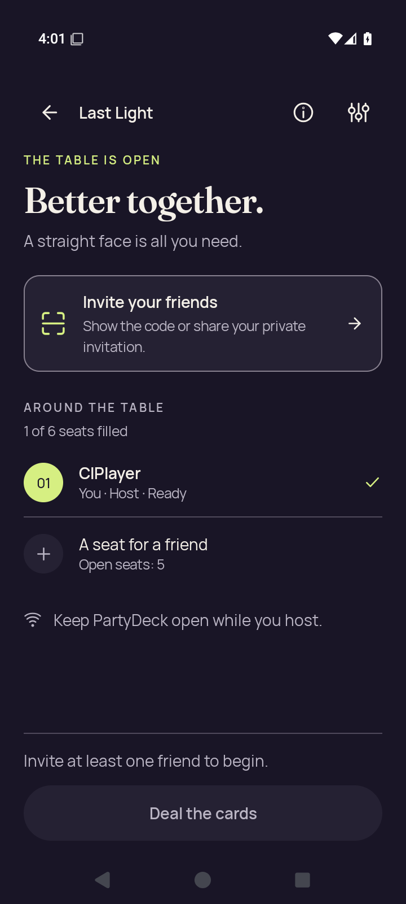</a> | **Host lobby after the sharing flow** Android API 35 x86_64 emulator, production optimized-test-signed APK [host-after-share.png](host-after-share.png); 720 × 1600 px SHA-256: <code>e66e6e28a728c5bca941b2d131aed261501ba071788170e078c655e2fa83c474</code> [Original XML](host-after-share.xml) · [Original result](smoke-result.json) Named PNG/XML pair; final-screen.png is associated with the separately retained last-ui.xml. Original ordinary UI smoke passed. The separate publication visual review adds no new accessibility result. Ordinary debug and optimized smokes passed. The debug native phase hit the executed ten-minute wrapper limit during partial 3d.renderer-death; no final debug result or complete check map exists. The optimized renderer aborted during Godot JNI startup. Neither native variant is fully qualified. Selected stills do not establish continuous privacy, engine gameplay or TalkBack speech/traversal. The collector directly viewed seven API35 originals. The later publication review covers every retained capture. Debug partial captures are not a complete native qualification. Current images do not establish engine gameplay, TalkBack speech/traversal or continuous privacy through transitions. Compose JVM snapshots are host-generated UI tests, separate from emulator screenshots. PNG/XML captures are sequential, not atomic. No derived image was viewed or created. **Publication review — direct original view:** Host lobby shows CIPlayer as ready host, 1 of 6 seats filled, five open seats and the full invitation panel. Keep-open guidance and disabled Deal the cards fit. |
| <a href="host-lobby.png">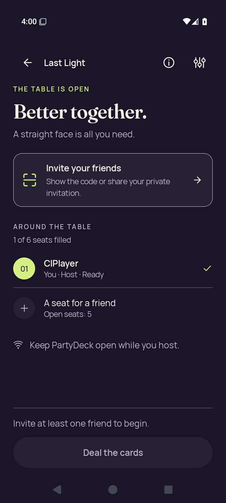</a> | **Host lobby** Android API 35 x86_64 emulator, production optimized-test-signed APK [host-lobby.png](host-lobby.png); 720 × 1600 px SHA-256: <code>eead1617c30b002ff7a5392a8243568ac161bb059f8657be3bebb08e814ef4b3</code> [Original XML](host-lobby.xml) · [Original result](smoke-result.json) Named PNG/XML pair; final-screen.png is associated with the separately retained last-ui.xml. Original ordinary UI smoke passed. The separate publication visual review adds no new accessibility result. Ordinary debug and optimized smokes passed. The debug native phase hit the executed ten-minute wrapper limit during partial 3d.renderer-death; no final debug result or complete check map exists. The optimized renderer aborted during Godot JNI startup. Neither native variant is fully qualified. Selected stills do not establish continuous privacy, engine gameplay or TalkBack speech/traversal. The collector directly viewed seven API35 originals. The later publication review covers every retained capture. Debug partial captures are not a complete native qualification. Current images do not establish engine gameplay, TalkBack speech/traversal or continuous privacy through transitions. Compose JVM snapshots are host-generated UI tests, separate from emulator screenshots. PNG/XML captures are sequential, not atomic. No derived image was viewed or created. **Publication review — direct original view:** Host lobby shows CIPlayer as ready host, 1 of 6 seats filled, five open seats and the full invitation panel. Keep-open guidance and disabled Deal the cards fit. |
|  | **Home after leaving the host lobby** Android API 35 x86_64 emulator, production optimized-test-signed APK [host-returned-home.png](host-returned-home.png); 720 × 1600 px SHA-256: <code>a233590c6838658e6a14f28b4c10847e9211b970aad50f16f66533fcbcd9412a</code> [Original XML](host-returned-home.xml) · [Original result](smoke-result.json) Named PNG/XML pair; final-screen.png is associated with the separately retained last-ui.xml. Original ordinary UI smoke passed. The separate publication visual review adds no new accessibility result. Ordinary debug and optimized smokes passed. The debug native phase hit the executed ten-minute wrapper limit during partial 3d.renderer-death; no final debug result or complete check map exists. The optimized renderer aborted during Godot JNI startup. Neither native variant is fully qualified. Selected stills do not establish continuous privacy, engine gameplay or TalkBack speech/traversal. The collector directly viewed seven API35 originals. The later publication review covers every retained capture. Debug partial captures are not a complete native qualification. Current images do not establish engine gameplay, TalkBack speech/traversal or continuous privacy through transitions. Compose JVM snapshots are host-generated UI tests, separate from emulator screenshots. PNG/XML captures are sequential, not atomic. No derived image was viewed or created. **Publication review — direct original view:** Complete normal-text PartyDeck Home with title, three-card artwork and Host, Join, practice and How to play actions. |
| <a href="join-invalid.png">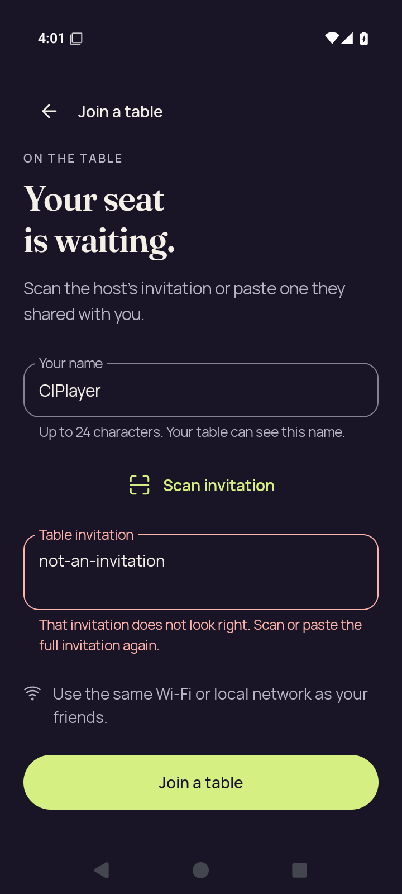</a> | **Invalid join input feedback** Android API 35 x86_64 emulator, production optimized-test-signed APK [join-invalid.png](join-invalid.png); 720 × 1600 px SHA-256: <code>abd9ded4f5c2c21beb22b31d70897b4454cae0dddae79bf495cd868ffcff3125</code> [Original XML](join-invalid.xml) · [Original result](smoke-result.json) Named PNG/XML pair; final-screen.png is associated with the separately retained last-ui.xml. Original ordinary UI smoke passed. The separate publication visual review adds no new accessibility result. Ordinary debug and optimized smokes passed. The debug native phase hit the executed ten-minute wrapper limit during partial 3d.renderer-death; no final debug result or complete check map exists. The optimized renderer aborted during Godot JNI startup. Neither native variant is fully qualified. Selected stills do not establish continuous privacy, engine gameplay or TalkBack speech/traversal. The collector directly viewed seven API35 originals. The later publication review covers every retained capture. Debug partial captures are not a complete native qualification. Current images do not establish engine gameplay, TalkBack speech/traversal or continuous privacy through transitions. Compose JVM snapshots are host-generated UI tests, separate from emulator screenshots. PNG/XML captures are sequential, not atomic. No derived image was viewed or created. **Publication review — direct original view:** Join form shows CIPlayer and not-an-invitation, the complete invitation-error explanation, same-network guidance and full Join a table button. |
| <a href="join-name-soft-ime.png">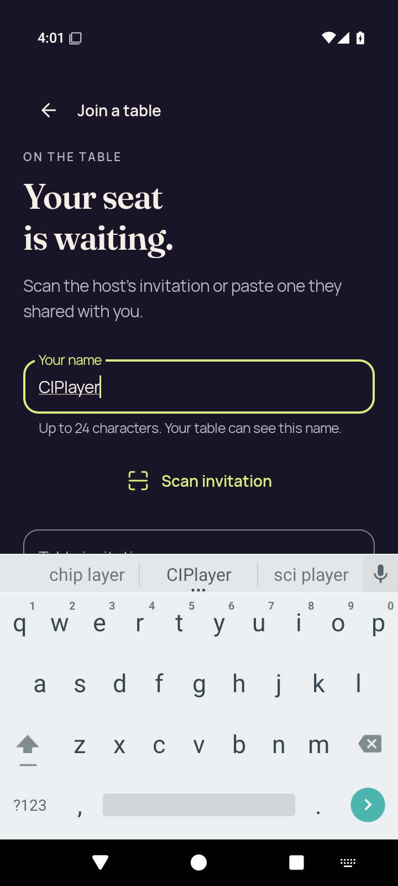</a> | **Join name field with the software keyboard** Android API 35 x86_64 emulator, production optimized-test-signed APK [join-name-soft-ime.png](join-name-soft-ime.png); 720 × 1600 px SHA-256: <code>ff327306b769a409adee02bb2bb8327b42cb6867e4fa618359cfe45ef53c2269</code> [Original XML](join-name-soft-ime.xml) · [Original result](smoke-result.json) Named PNG/XML pair; final-screen.png is associated with the separately retained last-ui.xml. Original ordinary UI smoke passed. The separate publication visual review adds no new accessibility result. Ordinary debug and optimized smokes passed. The debug native phase hit the executed ten-minute wrapper limit during partial 3d.renderer-death; no final debug result or complete check map exists. The optimized renderer aborted during Godot JNI startup. Neither native variant is fully qualified. Selected stills do not establish continuous privacy, engine gameplay or TalkBack speech/traversal. The collector directly viewed seven API35 originals. The later publication review covers every retained capture. Debug partial captures are not a complete native qualification. Current images do not establish engine gameplay, TalkBack speech/traversal or continuous privacy through transitions. Compose JVM snapshots are host-generated UI tests, separate from emulator screenshots. PNG/XML captures are sequential, not atomic. No derived image was viewed or created. **Publication review — direct original view:** Join name field has focus with CIPlayer and caret visible above the software keyboard. Scan invitation fits; the next invitation field is cut by the keyboard edge and later controls are outside this viewport. |
| <a href="large-text-home-actions.png">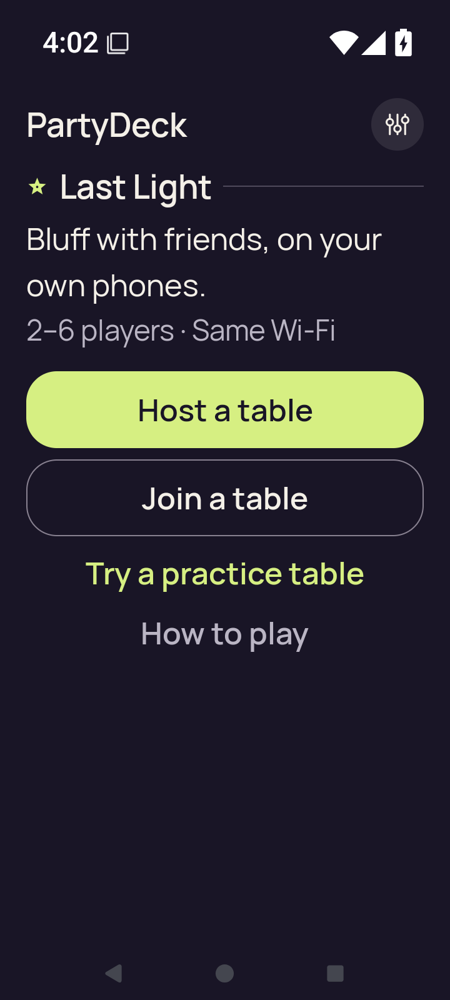</a> | **Home action checkpoints — large text** Android API 35 x86_64 emulator, production optimized-test-signed APK [large-text-home-actions.png](large-text-home-actions.png); 720 × 1600 px SHA-256: <code>8ef855a0b7ed4a45101085a130b3ca9d5f789f9ad9a515b7cb67d18bea174836</code> [Original XML](large-text-home-actions.xml) · [Original result](smoke-result.json) Named PNG/XML pair; final-screen.png is associated with the separately retained last-ui.xml. Original ordinary UI smoke passed. The separate publication visual review adds no new accessibility result. Ordinary debug and optimized smokes passed. The debug native phase hit the executed ten-minute wrapper limit during partial 3d.renderer-death; no final debug result or complete check map exists. The optimized renderer aborted during Godot JNI startup. Neither native variant is fully qualified. Selected stills do not establish continuous privacy, engine gameplay or TalkBack speech/traversal. The collector directly viewed seven API35 originals. The later publication review covers every retained capture. Debug partial captures are not a complete native qualification. Current images do not establish engine gameplay, TalkBack speech/traversal or continuous privacy through transitions. Compose JVM snapshots are host-generated UI tests, separate from emulator screenshots. PNG/XML captures are sequential, not atomic. No derived image was viewed or created. **Publication review — direct original view:** Large-text PartyDeck Home shows the complete Last Light summary and all Host, Join, practice and How to play actions. The settings icon has a visible circular highlight. |
| <a href="large-text-join-invalid.png">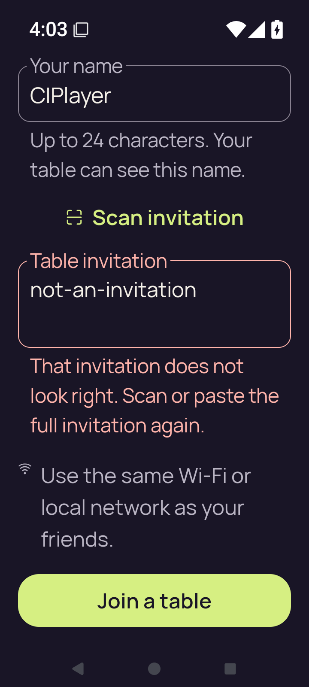</a> | **Invalid join input feedback — large text** Android API 35 x86_64 emulator, production optimized-test-signed APK [large-text-join-invalid.png](large-text-join-invalid.png); 720 × 1600 px SHA-256: <code>ee855362ccd69128d69fc94320c535967cd0d3abeebbd4e550b3094583071fb0</code> [Original XML](large-text-join-invalid.xml) · [Original result](smoke-result.json) Named PNG/XML pair; final-screen.png is associated with the separately retained last-ui.xml. Original ordinary UI smoke passed. The separate publication visual review adds no new accessibility result. Ordinary debug and optimized smokes passed. The debug native phase hit the executed ten-minute wrapper limit during partial 3d.renderer-death; no final debug result or complete check map exists. The optimized renderer aborted during Godot JNI startup. Neither native variant is fully qualified. Selected stills do not establish continuous privacy, engine gameplay or TalkBack speech/traversal. The collector directly viewed seven API35 originals. The later publication review covers every retained capture. Debug partial captures are not a complete native qualification. Current images do not establish engine gameplay, TalkBack speech/traversal or continuous privacy through transitions. Compose JVM snapshots are host-generated UI tests, separate from emulator screenshots. PNG/XML captures are sequential, not atomic. No derived image was viewed or created. **Publication review — direct original view:** Scrolled large-text Join form shows complete name and invitation fields, all invitation-error text, same-network guidance and the full Join a table button. |
| <a href="large-text-join-name-soft-ime.png">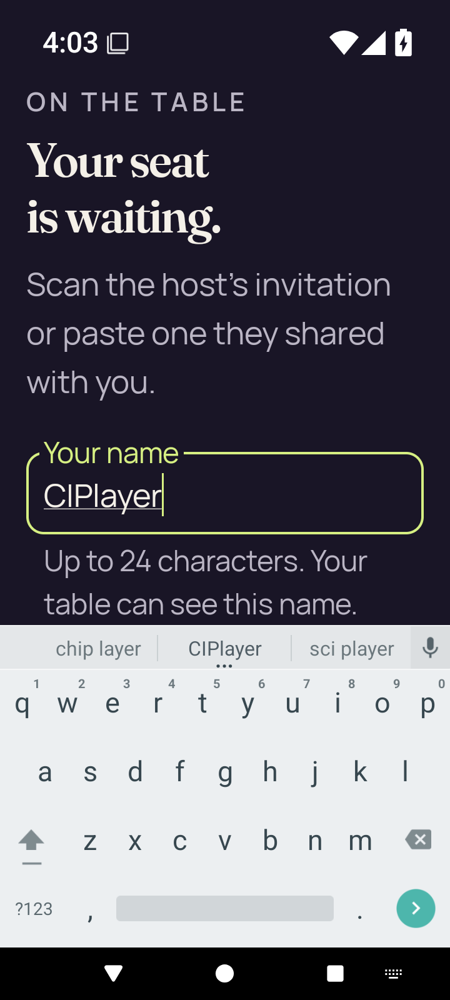</a> | **Join name field with the software keyboard — large text** Android API 35 x86_64 emulator, production optimized-test-signed APK [large-text-join-name-soft-ime.png](large-text-join-name-soft-ime.png); 720 × 1600 px SHA-256: <code>1bd32f0774a27517078c4b499b05d52c9fb76961f221d5e804c8805f5f3a5a31</code> [Original XML](large-text-join-name-soft-ime.xml) · [Original result](smoke-result.json) Named PNG/XML pair; final-screen.png is associated with the separately retained last-ui.xml. Original ordinary UI smoke passed. The separate publication visual review adds no new accessibility result. Ordinary debug and optimized smokes passed. The debug native phase hit the executed ten-minute wrapper limit during partial 3d.renderer-death; no final debug result or complete check map exists. The optimized renderer aborted during Godot JNI startup. Neither native variant is fully qualified. Selected stills do not establish continuous privacy, engine gameplay or TalkBack speech/traversal. The collector directly viewed seven API35 originals. The later publication review covers every retained capture. Debug partial captures are not a complete native qualification. Current images do not establish engine gameplay, TalkBack speech/traversal or continuous privacy through transitions. Compose JVM snapshots are host-generated UI tests, separate from emulator screenshots. PNG/XML captures are sequential, not atomic. No derived image was viewed or created. **Publication review — direct original view:** Large-text Join name field and CIPlayer caret fit above the software keyboard. The name helper text fits at its edge; invitation controls are below the visible area. |
| <a href="large-text-play-action.png">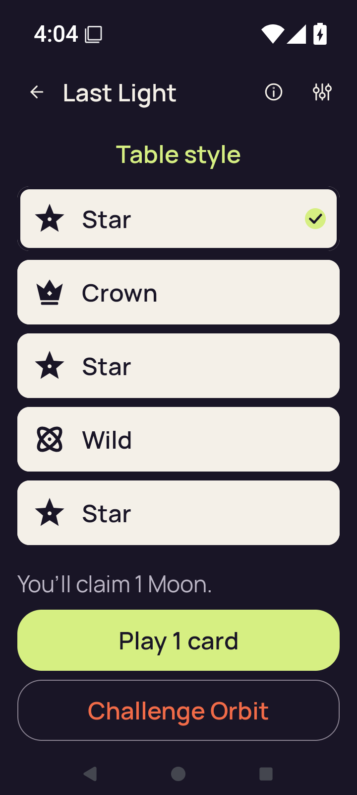</a> | **Play action reachability checkpoint — large text** Android API 35 x86_64 emulator, production optimized-test-signed APK [large-text-play-action.png](large-text-play-action.png); 720 × 1600 px SHA-256: <code>bf4cf7140a0d531baea118b993b2892d1161513f4fb7adf5a0e56cf306031369</code> [Original XML](large-text-play-action.xml) · [Original result](smoke-result.json) Named PNG/XML pair; final-screen.png is associated with the separately retained last-ui.xml. Recorded action reachability is not a second accepted-play claim. Original ordinary UI smoke passed. The separate publication visual review adds no new accessibility result. Ordinary debug and optimized smokes passed. The debug native phase hit the executed ten-minute wrapper limit during partial 3d.renderer-death; no final debug result or complete check map exists. The optimized renderer aborted during Godot JNI startup. Neither native variant is fully qualified. Selected stills do not establish continuous privacy, engine gameplay or TalkBack speech/traversal. The collector directly viewed seven API35 originals. The later publication review covers every retained capture. Debug partial captures are not a complete native qualification. Current images do not establish engine gameplay, TalkBack speech/traversal or continuous privacy through transitions. Compose JVM snapshots are host-generated UI tests, separate from emulator screenshots. PNG/XML captures are sequential, not atomic. No derived image was viewed or created. **Publication review — direct original view:** Scrolled large-text Standard hand shows five complete vertical card rows with the first Star checked. Claim 1 Moon feedback, Play 1 card and Challenge Orbit fit completely. |
| <a href="large-text-private-hand.png">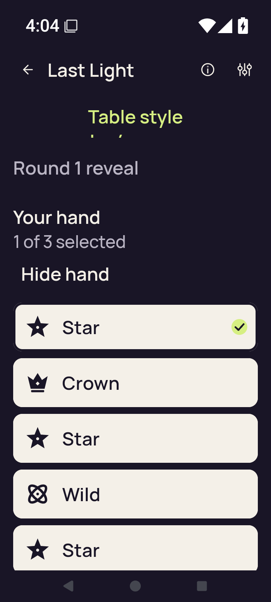</a> | **Own-hand checkpoint — large text** Android API 35 x86_64 emulator, production optimized-test-signed APK [large-text-private-hand.png](large-text-private-hand.png); 720 × 1600 px SHA-256: <code>f77c1a035c0a2403f8c57e6b2ed689a3ab18c2b1bb7a4ba490b16914a0e4df01</code> [Original XML](large-text-private-hand.xml) · [Original result](smoke-result.json) Named PNG/XML pair; final-screen.png is associated with the separately retained last-ui.xml. Original ordinary UI smoke passed. The separate publication visual review adds no new accessibility result. Ordinary debug and optimized smokes passed. The debug native phase hit the executed ten-minute wrapper limit during partial 3d.renderer-death; no final debug result or complete check map exists. The optimized renderer aborted during Godot JNI startup. Neither native variant is fully qualified. Selected stills do not establish continuous privacy, engine gameplay or TalkBack speech/traversal. The collector directly viewed seven API35 originals. The later publication review covers every retained capture. Debug partial captures are not a complete native qualification. Current images do not establish engine gameplay, TalkBack speech/traversal or continuous privacy through transitions. Compose JVM snapshots are host-generated UI tests, separate from emulator screenshots. PNG/XML captures are sequential, not atomic. No derived image was viewed or created. **Publication review — direct original view:** Large-text Standard hand shows 1 of 3 selected, complete Hide hand and five readable card labels. The last Star row border is clipped at the bottom viewport edge; Play lies below this scroll position. A sliver of prior content remains beneath the fixed Table style header. |
| <a href="large-text-rules-intro.png">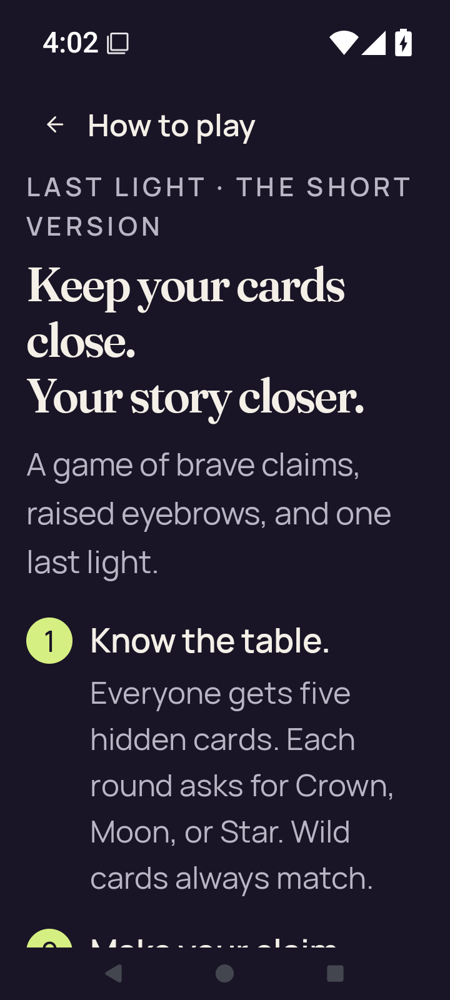</a> | **Rules introduction — large text** Android API 35 x86_64 emulator, production optimized-test-signed APK [large-text-rules-intro.png](large-text-rules-intro.png); 720 × 1600 px SHA-256: <code>8498a17cb393e4b1956cc2cf3eb51ece19c144ee0c57c6a5b3b8f1ab0c06f216</code> [Original XML](large-text-rules-intro.xml) · [Original result](smoke-result.json) Named PNG/XML pair; final-screen.png is associated with the separately retained last-ui.xml. Original ordinary UI smoke passed. The separate publication visual review adds no new accessibility result. Ordinary debug and optimized smokes passed. The debug native phase hit the executed ten-minute wrapper limit during partial 3d.renderer-death; no final debug result or complete check map exists. The optimized renderer aborted during Godot JNI startup. Neither native variant is fully qualified. Selected stills do not establish continuous privacy, engine gameplay or TalkBack speech/traversal. The collector directly viewed seven API35 originals. The later publication review covers every retained capture. Debug partial captures are not a complete native qualification. Current images do not establish engine gameplay, TalkBack speech/traversal or continuous privacy through transitions. Compose JVM snapshots are host-generated UI tests, separate from emulator screenshots. PNG/XML captures are sequential, not atomic. No derived image was viewed or created. **Publication review — direct original view:** Large-text rules intro and full Know the table paragraph are readable. The next numbered step starts at the bottom and is cut by the viewport edge. |
| <a href="large-text-rules-last-step.png">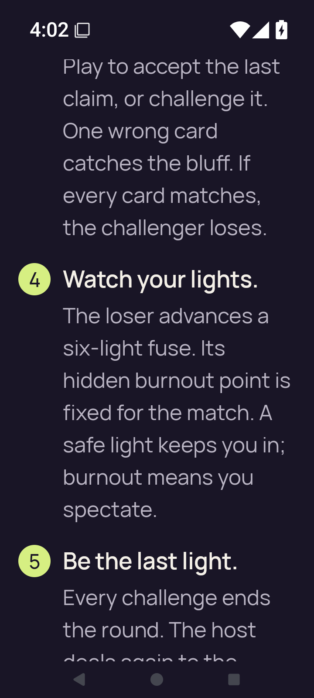</a> | **Rules final step — large text** Android API 35 x86_64 emulator, production optimized-test-signed APK [large-text-rules-last-step.png](large-text-rules-last-step.png); 720 × 1600 px SHA-256: <code>7fb8c45a60b837ba5f29b48d8edbe3a7e7dd73615c91a76a47f07c8bc93805db</code> [Original XML](large-text-rules-last-step.xml) · [Original result](smoke-result.json) Named PNG/XML pair; final-screen.png is associated with the separately retained last-ui.xml. Original ordinary UI smoke passed. The separate publication visual review adds no new accessibility result. Ordinary debug and optimized smokes passed. The debug native phase hit the executed ten-minute wrapper limit during partial 3d.renderer-death; no final debug result or complete check map exists. The optimized renderer aborted during Godot JNI startup. Neither native variant is fully qualified. Selected stills do not establish continuous privacy, engine gameplay or TalkBack speech/traversal. The collector directly viewed seven API35 originals. The later publication review covers every retained capture. Debug partial captures are not a complete native qualification. Current images do not establish engine gameplay, TalkBack speech/traversal or continuous privacy through transitions. Compose JVM snapshots are host-generated UI tests, separate from emulator screenshots. PNG/XML captures are sequential, not atomic. No derived image was viewed or created. **Publication review — direct original view:** Large-text rules show the preceding challenge paragraph, full Watch your lights step and Be the last light heading. The final-step paragraph continues below the viewport. |
| <a href="large-text-rules-practice-action.png">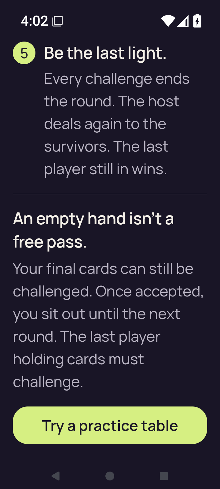</a> | **Rules Practice action checkpoint — large text** Android API 35 x86_64 emulator, production optimized-test-signed APK [large-text-rules-practice-action.png](large-text-rules-practice-action.png); 720 × 1600 px SHA-256: <code>568e4cb6690c7e53bea47423ea550ae858cad070ce0f9d2823475aea123a5633</code> [Original XML](large-text-rules-practice-action.xml) · [Original result](smoke-result.json) Named PNG/XML pair; final-screen.png is associated with the separately retained last-ui.xml. Original ordinary UI smoke passed. The separate publication visual review adds no new accessibility result. Ordinary debug and optimized smokes passed. The debug native phase hit the executed ten-minute wrapper limit during partial 3d.renderer-death; no final debug result or complete check map exists. The optimized renderer aborted during Godot JNI startup. Neither native variant is fully qualified. Selected stills do not establish continuous privacy, engine gameplay or TalkBack speech/traversal. The collector directly viewed seven API35 originals. The later publication review covers every retained capture. Debug partial captures are not a complete native qualification. Current images do not establish engine gameplay, TalkBack speech/traversal or continuous privacy through transitions. Compose JVM snapshots are host-generated UI tests, separate from emulator screenshots. PNG/XML captures are sequential, not atomic. No derived image was viewed or created. **Publication review — direct original view:** Scrolled large-text rules show the full Be the last light paragraph, empty-hand rule and complete Try a practice table action. |
| <a href="large-text-rules-practice-entered.png">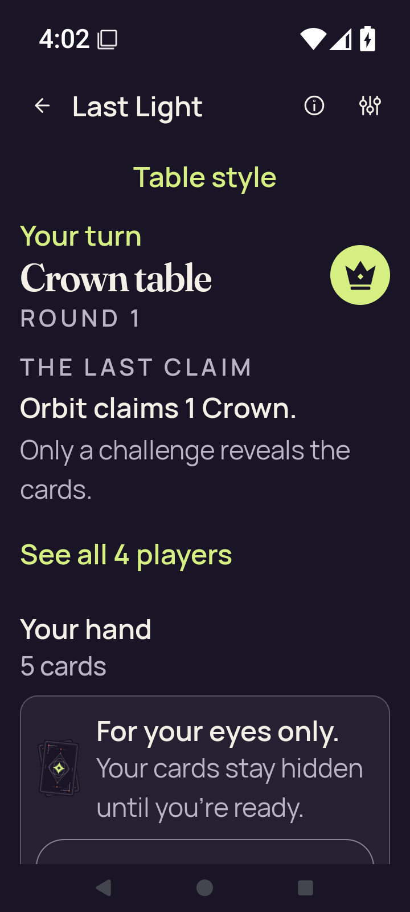</a> | **Practice entered from Rules — large text** Android API 35 x86_64 emulator, production optimized-test-signed APK [large-text-rules-practice-entered.png](large-text-rules-practice-entered.png); 720 × 1600 px SHA-256: <code>da3474d2adbb74775c817dc8bb0d85e37ac37d00bb04999ae3eb475ad6a654d3</code> [Original XML](large-text-rules-practice-entered.xml) · [Original result](smoke-result.json) Named PNG/XML pair; final-screen.png is associated with the separately retained last-ui.xml. Original ordinary UI smoke passed. The separate publication visual review adds no new accessibility result. Ordinary debug and optimized smokes passed. The debug native phase hit the executed ten-minute wrapper limit during partial 3d.renderer-death; no final debug result or complete check map exists. The optimized renderer aborted during Godot JNI startup. Neither native variant is fully qualified. Selected stills do not establish continuous privacy, engine gameplay or TalkBack speech/traversal. The collector directly viewed seven API35 originals. The later publication review covers every retained capture. Debug partial captures are not a complete native qualification. Current images do not establish engine gameplay, TalkBack speech/traversal or continuous privacy through transitions. Compose JVM snapshots are host-generated UI tests, separate from emulator screenshots. PNG/XML captures are sequential, not atomic. No derived image was viewed or created. **Publication review — direct original view:** Large-text Standard Crown table shows Orbit claims 1 Crown, See all 4 players and the concealed hand explanation. The Show hand button starts at the bottom edge, with its label and later actions below the viewport. |
| <a href="large-text-rules-returned-home.png">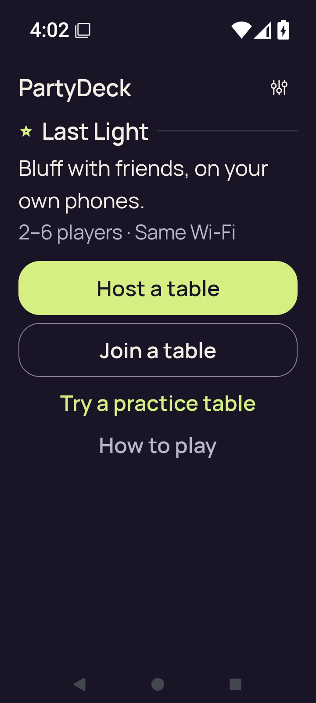</a> | **Home after leaving Rules-entered practice — large text** Android API 35 x86_64 emulator, production optimized-test-signed APK [large-text-rules-returned-home.png](large-text-rules-returned-home.png); 720 × 1600 px SHA-256: <code>3214f3cbffe3e30297825ed09e757850667c9e93be0e9bb3740718c0db030ad7</code> [Original XML](large-text-rules-returned-home.xml) · [Original result](smoke-result.json) Named PNG/XML pair; final-screen.png is associated with the separately retained last-ui.xml. Original ordinary UI smoke passed. The separate publication visual review adds no new accessibility result. Ordinary debug and optimized smokes passed. The debug native phase hit the executed ten-minute wrapper limit during partial 3d.renderer-death; no final debug result or complete check map exists. The optimized renderer aborted during Godot JNI startup. Neither native variant is fully qualified. Selected stills do not establish continuous privacy, engine gameplay or TalkBack speech/traversal. The collector directly viewed seven API35 originals. The later publication review covers every retained capture. Debug partial captures are not a complete native qualification. Current images do not establish engine gameplay, TalkBack speech/traversal or continuous privacy through transitions. Compose JVM snapshots are host-generated UI tests, separate from emulator screenshots. PNG/XML captures are sequential, not atomic. No derived image was viewed or created. **Publication review — direct original view:** Large-text PartyDeck Home shows Last Light summary and all Host, Join, practice and How to play actions completely. |
| <a href="large-text-settings.png">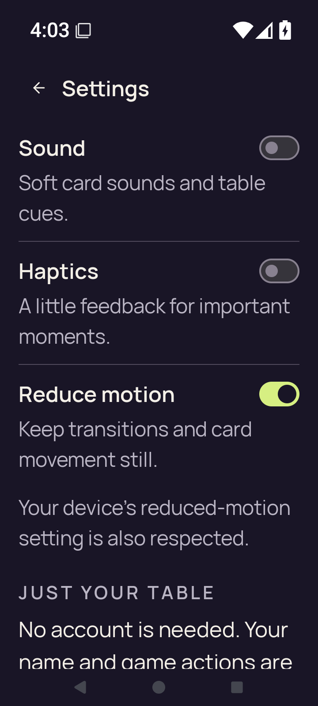</a> | **Settings checkpoint — large text** Android API 35 x86_64 emulator, production optimized-test-signed APK [large-text-settings.png](large-text-settings.png); 720 × 1600 px SHA-256: <code>176dc890ab0637b5fb3a05346826541f21e4afdbe7bd6b55259fa5b7b00b443a</code> [Original XML](large-text-settings.xml) · [Original result](smoke-result.json) Named PNG/XML pair; final-screen.png is associated with the separately retained last-ui.xml. Original ordinary UI smoke passed. The separate publication visual review adds no new accessibility result. Ordinary debug and optimized smokes passed. The debug native phase hit the executed ten-minute wrapper limit during partial 3d.renderer-death; no final debug result or complete check map exists. The optimized renderer aborted during Godot JNI startup. Neither native variant is fully qualified. Selected stills do not establish continuous privacy, engine gameplay or TalkBack speech/traversal. The collector directly viewed seven API35 originals. The later publication review covers every retained capture. Debug partial captures are not a complete native qualification. Current images do not establish engine gameplay, TalkBack speech/traversal or continuous privacy through transitions. Compose JVM snapshots are host-generated UI tests, separate from emulator screenshots. PNG/XML captures are sequential, not atomic. No derived image was viewed or created. **Publication review — direct original view:** Large-text Settings shows Sound and Haptics off, Reduce motion on and their complete explanations. Just your table begins below; its paragraph continues beyond the bottom viewport edge. |
| <a href="practice-after-play.png">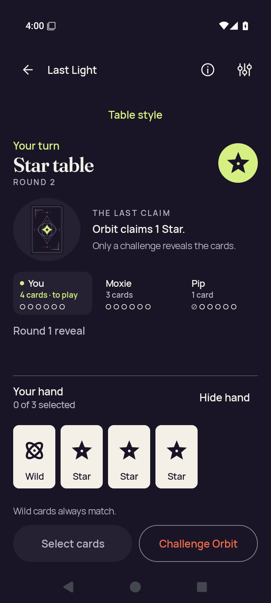</a> | **Practice after the recorded play** Android API 35 x86_64 emulator, production optimized-test-signed APK [practice-after-play.png](practice-after-play.png); 720 × 1600 px SHA-256: <code>a27b3bdca1dc6f81c60bf73e24f1eb30ee29b25e6a1908947897cb7872921cc2</code> [Original XML](practice-after-play.xml) · [Original result](smoke-result.json) Named PNG/XML pair; final-screen.png is associated with the separately retained last-ui.xml. Original ordinary UI smoke passed. The separate publication visual review adds no new accessibility result. Ordinary debug and optimized smokes passed. The debug native phase hit the executed ten-minute wrapper limit during partial 3d.renderer-death; no final debug result or complete check map exists. The optimized renderer aborted during Godot JNI startup. Neither native variant is fully qualified. Selected stills do not establish continuous privacy, engine gameplay or TalkBack speech/traversal. The collector directly viewed seven API35 originals. The later publication review covers every retained capture. Debug partial captures are not a complete native qualification. Current images do not establish engine gameplay, TalkBack speech/traversal or continuous privacy through transitions. Compose JVM snapshots are host-generated UI tests, separate from emulator screenshots. PNG/XML captures are sequential, not atomic. No derived image was viewed or created. **Publication review — direct original view:** Standard Star table round 2 shows Orbit claims 1 Star, four complete faces and labels (Wild and three Stars), 0 of 3 selected and complete Hide hand/bottom actions. |
| <a href="practice-concealed.png">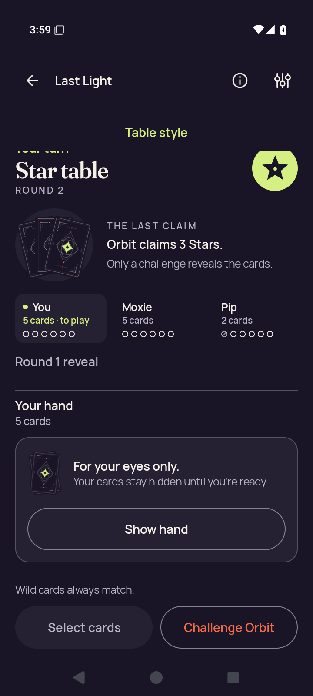</a> | **Practice with the hand concealed** Android API 35 x86_64 emulator, production optimized-test-signed APK [practice-concealed.png](practice-concealed.png); 720 × 1600 px SHA-256: <code>db3fd03ebf4c5e0c892dd784cccf1a13313f86085871757877af505acc4b73a4</code> [Original XML](practice-concealed.xml) · [Original result](smoke-result.json) Named PNG/XML pair; final-screen.png is associated with the separately retained last-ui.xml. Original ordinary UI smoke passed. The separate publication visual review adds no new accessibility result. Ordinary debug and optimized smokes passed. The debug native phase hit the executed ten-minute wrapper limit during partial 3d.renderer-death; no final debug result or complete check map exists. The optimized renderer aborted during Godot JNI startup. Neither native variant is fully qualified. Selected stills do not establish continuous privacy, engine gameplay or TalkBack speech/traversal. The collector directly viewed seven API35 originals. The later publication review covers every retained capture. Debug partial captures are not a complete native qualification. Current images do not establish engine gameplay, TalkBack speech/traversal or continuous privacy through transitions. Compose JVM snapshots are host-generated UI tests, separate from emulator screenshots. PNG/XML captures are sequential, not atomic. No derived image was viewed or created. **Publication review — direct original view:** Scrolled Standard Star table round 2 shows Orbit claims 3 Stars and the full concealed panel/Show hand plus bottom actions. Your turn and the rank badge are clipped beneath the fixed Table style header. |
| <a href="practice-resumed-concealed.png">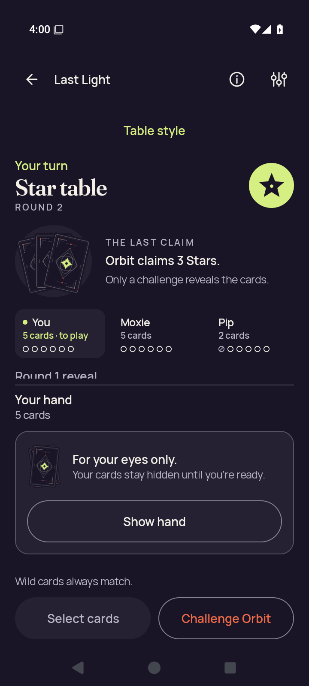</a> | **Practice concealed after resume** Android API 35 x86_64 emulator, production optimized-test-signed APK [practice-resumed-concealed.png](practice-resumed-concealed.png); 720 × 1600 px SHA-256: <code>de91635a3ee68d1c37e7f8dcb9f9fc86f310ceccd0775aedfd9f9802323d451c</code> [Original XML](practice-resumed-concealed.xml) · [Original result](smoke-result.json) Named PNG/XML pair; final-screen.png is associated with the separately retained last-ui.xml. Original ordinary UI smoke passed. The separate publication visual review adds no new accessibility result. Ordinary debug and optimized smokes passed. The debug native phase hit the executed ten-minute wrapper limit during partial 3d.renderer-death; no final debug result or complete check map exists. The optimized renderer aborted during Godot JNI startup. Neither native variant is fully qualified. Selected stills do not establish continuous privacy, engine gameplay or TalkBack speech/traversal. The collector directly viewed seven API35 originals. The later publication review covers every retained capture. Debug partial captures are not a complete native qualification. Current images do not establish engine gameplay, TalkBack speech/traversal or continuous privacy through transitions. Compose JVM snapshots are host-generated UI tests, separate from emulator screenshots. PNG/XML captures are sequential, not atomic. No derived image was viewed or created. **Publication review — direct original view:** Standard Star table round 2 shows Orbit claims 3 Stars and complete concealed hand controls. The Round 1 reveal label is partly clipped at the lower edge of the public-table area; bottom actions fit. |
|  | **Home after leaving practice** Android API 35 x86_64 emulator, production optimized-test-signed APK [practice-returned-home.png](practice-returned-home.png); 720 × 1600 px SHA-256: <code>bd1ad9709e4d27a52c0798cb5ead72bda63347b7a3ed98f2966c8a46ec559708</code> [Original XML](practice-returned-home.xml) · [Original result](smoke-result.json) Named PNG/XML pair; final-screen.png is associated with the separately retained last-ui.xml. Original ordinary UI smoke passed. The separate publication visual review adds no new accessibility result. Ordinary debug and optimized smokes passed. The debug native phase hit the executed ten-minute wrapper limit during partial 3d.renderer-death; no final debug result or complete check map exists. The optimized renderer aborted during Godot JNI startup. Neither native variant is fully qualified. Selected stills do not establish continuous privacy, engine gameplay or TalkBack speech/traversal. The collector directly viewed seven API35 originals. The later publication review covers every retained capture. Debug partial captures are not a complete native qualification. Current images do not establish engine gameplay, TalkBack speech/traversal or continuous privacy through transitions. Compose JVM snapshots are host-generated UI tests, separate from emulator screenshots. PNG/XML captures are sequential, not atomic. No derived image was viewed or created. **Publication review — direct original view:** Complete normal-text PartyDeck Home with title, three-card artwork and Host, Join, practice and How to play actions. |
| <a href="practice-selected.png">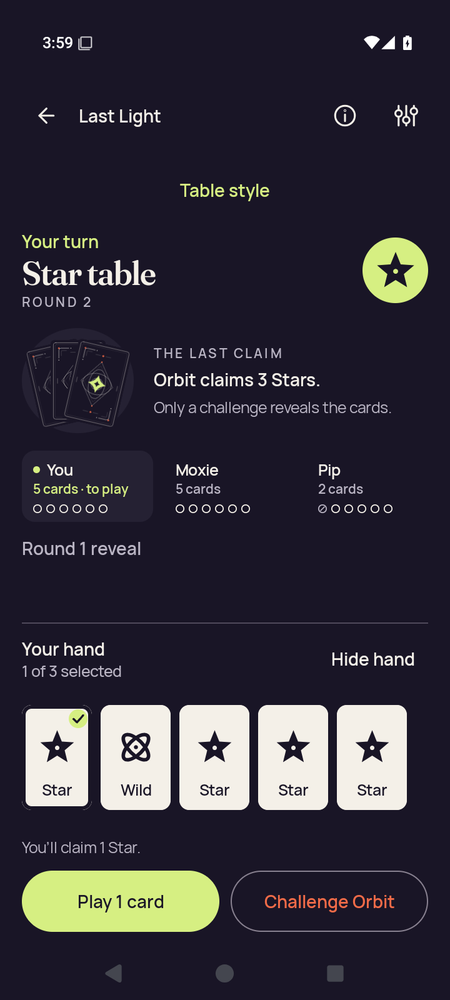</a> | **Practice card selection checkpoint** Android API 35 x86_64 emulator, production optimized-test-signed APK [practice-selected.png](practice-selected.png); 720 × 1600 px SHA-256: <code>ca2acb560689ca7c34dc4fd61f43c1f486c9f8afc550bacfef4b9a28aba0d276</code> [Original XML](practice-selected.xml) · [Original result](smoke-result.json) Named PNG/XML pair; final-screen.png is associated with the separately retained last-ui.xml. Original ordinary UI smoke passed. The separate publication visual review adds no new accessibility result. Ordinary debug and optimized smokes passed. The debug native phase hit the executed ten-minute wrapper limit during partial 3d.renderer-death; no final debug result or complete check map exists. The optimized renderer aborted during Godot JNI startup. Neither native variant is fully qualified. Selected stills do not establish continuous privacy, engine gameplay or TalkBack speech/traversal. The collector directly viewed seven API35 originals. The later publication review covers every retained capture. Debug partial captures are not a complete native qualification. Current images do not establish engine gameplay, TalkBack speech/traversal or continuous privacy through transitions. Compose JVM snapshots are host-generated UI tests, separate from emulator screenshots. PNG/XML captures are sequential, not atomic. No derived image was viewed or created. **Publication review — direct original view:** Standard Star table round 2 shows all five faces and labels, checked first Star, 1 of 3 selected and complete claim feedback, Play 1 card and Challenge Orbit. |
| <a href="rules-intro.png">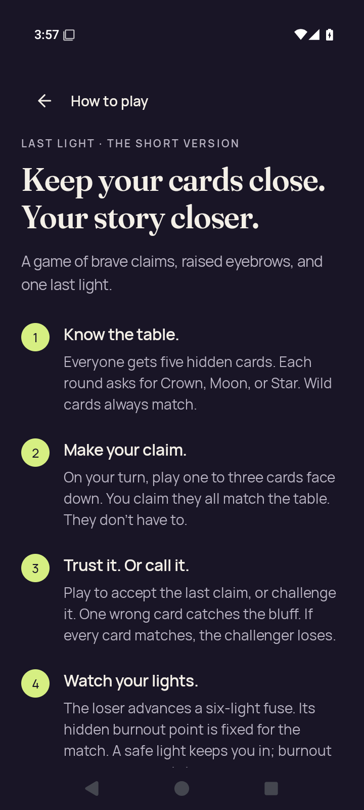</a> | **Rules introduction** Android API 35 x86_64 emulator, production optimized-test-signed APK [rules-intro.png](rules-intro.png); 720 × 1600 px SHA-256: <code>c1b0a1703cadba77a8595d50a150b77aa5a0ef3da8eda50c9026c667a6c76d0b</code> [Original XML](rules-intro.xml) · [Original result](smoke-result.json) Named PNG/XML pair; final-screen.png is associated with the separately retained last-ui.xml. Original ordinary UI smoke passed. The separate publication visual review adds no new accessibility result. Ordinary debug and optimized smokes passed. The debug native phase hit the executed ten-minute wrapper limit during partial 3d.renderer-death; no final debug result or complete check map exists. The optimized renderer aborted during Godot JNI startup. Neither native variant is fully qualified. Selected stills do not establish continuous privacy, engine gameplay or TalkBack speech/traversal. The collector directly viewed seven API35 originals. The later publication review covers every retained capture. Debug partial captures are not a complete native qualification. Current images do not establish engine gameplay, TalkBack speech/traversal or continuous privacy through transitions. Compose JVM snapshots are host-generated UI tests, separate from emulator screenshots. PNG/XML captures are sequential, not atomic. No derived image was viewed or created. **Publication review — direct original view:** Normal-text rules show intro and first three numbered steps completely. Watch your lights begins with most of its explanation visible; the rest continues below the viewport. |
| <a href="rules-last-step.png">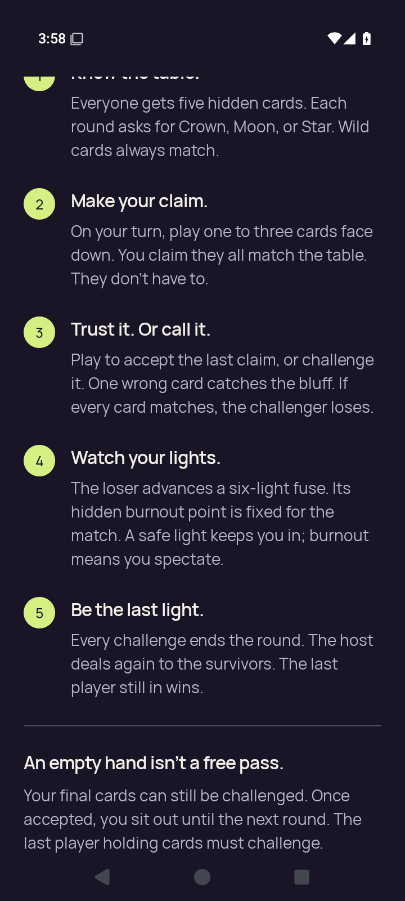</a> | **Rules final step** Android API 35 x86_64 emulator, production optimized-test-signed APK [rules-last-step.png](rules-last-step.png); 720 × 1600 px SHA-256: <code>840dfac8cbfc170faff0ad4bd506cfa814aa87332577713b3938bffb6d45c742</code> [Original XML](rules-last-step.xml) · [Original result](smoke-result.json) Named PNG/XML pair; final-screen.png is associated with the separately retained last-ui.xml. Original ordinary UI smoke passed. The separate publication visual review adds no new accessibility result. Ordinary debug and optimized smokes passed. The debug native phase hit the executed ten-minute wrapper limit during partial 3d.renderer-death; no final debug result or complete check map exists. The optimized renderer aborted during Godot JNI startup. Neither native variant is fully qualified. Selected stills do not establish continuous privacy, engine gameplay or TalkBack speech/traversal. The collector directly viewed seven API35 originals. The later publication review covers every retained capture. Debug partial captures are not a complete native qualification. Current images do not establish engine gameplay, TalkBack speech/traversal or continuous privacy through transitions. Compose JVM snapshots are host-generated UI tests, separate from emulator screenshots. PNG/XML captures are sequential, not atomic. No derived image was viewed or created. **Publication review — direct original view:** Scrolled normal-text rules show full steps 2 through 5 and the empty-hand explanation; the first-step heading is clipped at the top. Practice action is outside this viewport. |
| <a href="rules-practice-action.png">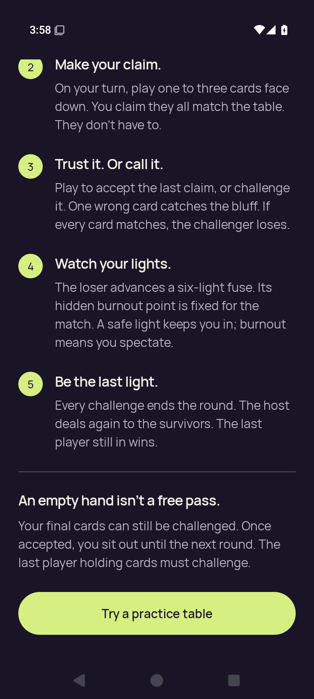</a> | **Rules Practice action checkpoint** Android API 35 x86_64 emulator, production optimized-test-signed APK [rules-practice-action.png](rules-practice-action.png); 720 × 1600 px SHA-256: <code>1c6516571113c0636845a8d2ea5737bf68252daf0c429a4c733fbe0d196e426d</code> [Original XML](rules-practice-action.xml) · [Original result](smoke-result.json) Named PNG/XML pair; final-screen.png is associated with the separately retained last-ui.xml. Original ordinary UI smoke passed. The separate publication visual review adds no new accessibility result. Ordinary debug and optimized smokes passed. The debug native phase hit the executed ten-minute wrapper limit during partial 3d.renderer-death; no final debug result or complete check map exists. The optimized renderer aborted during Godot JNI startup. Neither native variant is fully qualified. Selected stills do not establish continuous privacy, engine gameplay or TalkBack speech/traversal. The collector directly viewed seven API35 originals. The later publication review covers every retained capture. Debug partial captures are not a complete native qualification. Current images do not establish engine gameplay, TalkBack speech/traversal or continuous privacy through transitions. Compose JVM snapshots are host-generated UI tests, separate from emulator screenshots. PNG/XML captures are sequential, not atomic. No derived image was viewed or created. **Publication review — direct original view:** Scrolled normal-text rules show full steps 3 through 5, empty-hand explanation and the complete Try a practice table button. Step 2 heading is clipped at the top. |
| <a href="rules-practice-entered.png">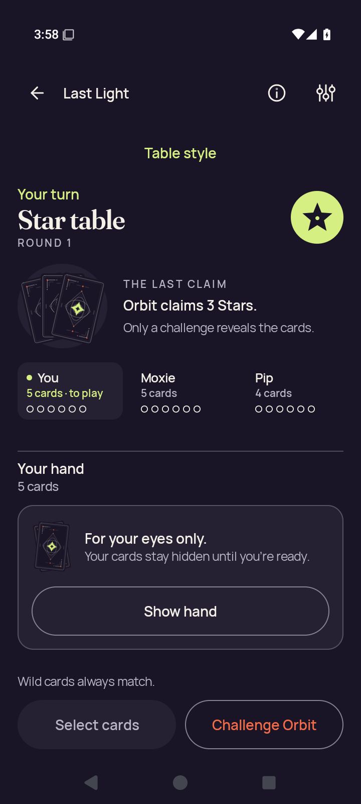</a> | **Practice entered from Rules** Android API 35 x86_64 emulator, production optimized-test-signed APK [rules-practice-entered.png](rules-practice-entered.png); 720 × 1600 px SHA-256: <code>7e6375f96e339c22e1144da52ff5a3abdc0b6386c551b3422dff078ac8269839</code> [Original XML](rules-practice-entered.xml) · [Original result](smoke-result.json) Named PNG/XML pair; final-screen.png is associated with the separately retained last-ui.xml. Original ordinary UI smoke passed. The separate publication visual review adds no new accessibility result. Ordinary debug and optimized smokes passed. The debug native phase hit the executed ten-minute wrapper limit during partial 3d.renderer-death; no final debug result or complete check map exists. The optimized renderer aborted during Godot JNI startup. Neither native variant is fully qualified. Selected stills do not establish continuous privacy, engine gameplay or TalkBack speech/traversal. The collector directly viewed seven API35 originals. The later publication review covers every retained capture. Debug partial captures are not a complete native qualification. Current images do not establish engine gameplay, TalkBack speech/traversal or continuous privacy through transitions. Compose JVM snapshots are host-generated UI tests, separate from emulator screenshots. PNG/XML captures are sequential, not atomic. No derived image was viewed or created. **Publication review — direct original view:** Standard Star table round 1 shows Orbit claims 3 Stars, the complete concealed hand panel/Show hand and full bottom actions. |
|  | **Home after leaving Rules-entered practice** Android API 35 x86_64 emulator, production optimized-test-signed APK [rules-returned-home.png](rules-returned-home.png); 720 × 1600 px SHA-256: <code>0219bc0f17844e1d1ecae4426ef327a517408b82200d22898a18cfc387ef7927</code> [Original XML](rules-returned-home.xml) · [Original result](smoke-result.json) Named PNG/XML pair; final-screen.png is associated with the separately retained last-ui.xml. Original ordinary UI smoke passed. The separate publication visual review adds no new accessibility result. Ordinary debug and optimized smokes passed. The debug native phase hit the executed ten-minute wrapper limit during partial 3d.renderer-death; no final debug result or complete check map exists. The optimized renderer aborted during Godot JNI startup. Neither native variant is fully qualified. Selected stills do not establish continuous privacy, engine gameplay or TalkBack speech/traversal. The collector directly viewed seven API35 originals. The later publication review covers every retained capture. Debug partial captures are not a complete native qualification. Current images do not establish engine gameplay, TalkBack speech/traversal or continuous privacy through transitions. Compose JVM snapshots are host-generated UI tests, separate from emulator screenshots. PNG/XML captures are sequential, not atomic. No derived image was viewed or created. **Publication review — direct original view:** Complete normal-text PartyDeck Home with title, three-card artwork and Host, Join, practice and How to play actions. |
|  | **Changed settings** Android API 35 x86_64 emulator, production optimized-test-signed APK [settings-changed.png](settings-changed.png); 720 × 1600 px SHA-256: <code>004840352291679445f8e35264f9b07078afbdcd0f0cf991be1aa02859f5821c</code> [Original XML](settings-changed.xml) · [Original result](smoke-result.json) Named PNG/XML pair; final-screen.png is associated with the separately retained last-ui.xml. Original ordinary UI smoke passed. The separate publication visual review adds no new accessibility result. Ordinary debug and optimized smokes passed. The debug native phase hit the executed ten-minute wrapper limit during partial 3d.renderer-death; no final debug result or complete check map exists. The optimized renderer aborted during Godot JNI startup. Neither native variant is fully qualified. Selected stills do not establish continuous privacy, engine gameplay or TalkBack speech/traversal. The collector directly viewed seven API35 originals. The later publication review covers every retained capture. Debug partial captures are not a complete native qualification. Current images do not establish engine gameplay, TalkBack speech/traversal or continuous privacy through transitions. Compose JVM snapshots are host-generated UI tests, separate from emulator screenshots. PNG/XML captures are sequential, not atomic. No derived image was viewed or created. **Publication review — direct original view:** Normal-text Settings shows Sound and Haptics off, Reduce motion on, complete explanations, privacy/artwork information and the full Credits &amp; licenses action. |
| <a href="settings-persisted.png">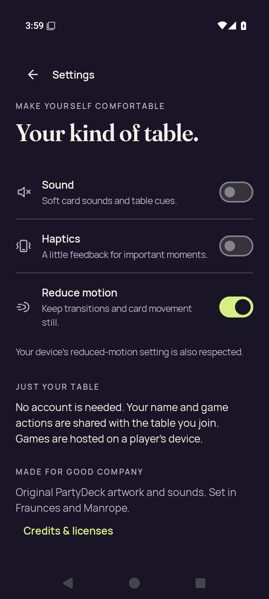</a> | **Persisted settings checkpoint** Android API 35 x86_64 emulator, production optimized-test-signed APK [settings-persisted.png](settings-persisted.png); 720 × 1600 px SHA-256: <code>4e80836bf95f272b4a39a9d1e422de2966a188a2794a97364f10d5a48fc9191a</code> [Original XML](settings-persisted.xml) · [Original result](smoke-result.json) Named PNG/XML pair; final-screen.png is associated with the separately retained last-ui.xml. Original ordinary UI smoke passed. The separate publication visual review adds no new accessibility result. Ordinary debug and optimized smokes passed. The debug native phase hit the executed ten-minute wrapper limit during partial 3d.renderer-death; no final debug result or complete check map exists. The optimized renderer aborted during Godot JNI startup. Neither native variant is fully qualified. Selected stills do not establish continuous privacy, engine gameplay or TalkBack speech/traversal. The collector directly viewed seven API35 originals. The later publication review covers every retained capture. Debug partial captures are not a complete native qualification. Current images do not establish engine gameplay, TalkBack speech/traversal or continuous privacy through transitions. Compose JVM snapshots are host-generated UI tests, separate from emulator screenshots. PNG/XML captures are sequential, not atomic. No derived image was viewed or created. **Publication review — direct original view:** Normal-text Settings shows Sound and Haptics off, Reduce motion on, complete explanations, privacy/artwork information and the full Credits &amp; licenses action. |
| <a href="settings-return-home.png">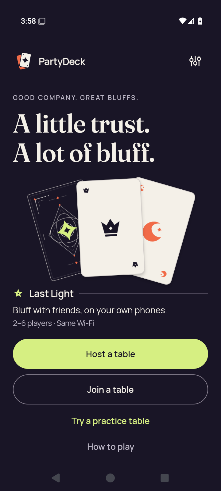</a> | **Home after settings** Android API 35 x86_64 emulator, production optimized-test-signed APK [settings-return-home.png](settings-return-home.png); 720 × 1600 px SHA-256: <code>0219bc0f17844e1d1ecae4426ef327a517408b82200d22898a18cfc387ef7927</code> [Original XML](settings-return-home.xml) · [Original result](smoke-result.json) Named PNG/XML pair; final-screen.png is associated with the separately retained last-ui.xml. Original ordinary UI smoke passed. The separate publication visual review adds no new accessibility result. Ordinary debug and optimized smokes passed. The debug native phase hit the executed ten-minute wrapper limit during partial 3d.renderer-death; no final debug result or complete check map exists. The optimized renderer aborted during Godot JNI startup. Neither native variant is fully qualified. Selected stills do not establish continuous privacy, engine gameplay or TalkBack speech/traversal. The collector directly viewed seven API35 originals. The later publication review covers every retained capture. Debug partial captures are not a complete native qualification. Current images do not establish engine gameplay, TalkBack speech/traversal or continuous privacy through transitions. Compose JVM snapshots are host-generated UI tests, separate from emulator screenshots. PNG/XML captures are sequential, not atomic. No derived image was viewed or created. **Publication review — exact match to a directly viewed original in this batch:** Complete normal-text PartyDeck Home with title, three-card artwork and Host, Join, practice and How to play actions. [Reviewed matching original](rules-returned-home.png); capture context remains separate. |
