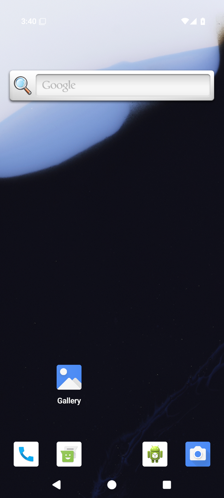

# Android API 35 emulator preparation

[All collections](../../README.md) · [Original CI run](https://github.com/Apdelrahman1911/PartyDeck/actions/runs/34496267571)

Original emulator setup evidence; no app or engine qualification is claimed by this capture.

One original final screen, its separately retained last-ui.xml and the original preparation-attempt.json.

Exact source: `410c9386dd88b2ad0ab380e5b8f1f9bf19674b00`. [Original owner capture mapping](../provenance/review/capture-gallery-mapping.json).

## Publication visual review

All 1 original capture identities have review coverage: 1 direct original views. Each capture keeps its original name, source, dimensions, scenario and recorded time. Matching pixels do not transfer runtime outcomes. No derived image was created.

[Completed visual review](../provenance/publication-review/partydeck-gallery-after-2013-api35-visual-review.json) · [Capture/review binding](../../godot-ios-native-34488350932/provenance/publication-review/partydeck-gallery-2355-publication-review.json) · [Frozen publication queue](../../godot-android-adaptive-34496282263/provenance/publication-queue-v1/queue-freeze.json) · [Original copy mapping](../../godot-android-adaptive-34496282263/provenance/publication-queue-v1/copy-paths.tsv) · [Unchanged queue page](../../godot-android-adaptive-34496282263/provenance/publication-queue-v1/payload/docs/screenshots/android-34496267571/preparation/README.md). The archived queue page retains its original text and relative paths as provenance.

| Original capture | Recorded scenario and retained limits |
| --- | --- |
|  | **Emulator preparation — original final screen** Android API 35 x86_64 emulator preparation [final-screen.png](attempt-1/final-screen.png); 720 × 1600 px SHA-256: <code>68abd57854590ac8d644b992c3013d1da18b5d8936e015fa85f798d2e50fc5de</code> [Original XML](attempt-1/last-ui.xml) · [Original result](attempt-1/preparation-attempt.json) Emulator setup capture retained separately from app and engine behavior. Ordinary debug and optimized smokes passed. The debug native phase hit the executed ten-minute wrapper limit during partial 3d.renderer-death; no final debug result or complete check map exists. The optimized renderer aborted during Godot JNI startup. Neither native variant is fully qualified. Selected stills do not establish continuous privacy, engine gameplay or TalkBack speech/traversal. The collector directly viewed seven API35 originals. The later publication review covers every retained capture. Debug partial captures are not a complete native qualification. Current images do not establish engine gameplay, TalkBack speech/traversal or continuous privacy through transitions. Compose JVM snapshots are host-generated UI tests, separate from emulator screenshots. PNG/XML captures are sequential, not atomic. No derived image was viewed or created. **Publication review — direct original view:** The final-screen original shows the Android launcher with Google search, Gallery and dock icons. No game content is visible. |
