# Compose JVM snapshots — CI 34503251315

[All collections](../../README.md) · [Preserved evidence index](../evidence-index.md) · [Copy/review binding](../provenance/publication-review/partydeck-gallery-2815-publication-binding-v1.json) · [Completed visual review](../provenance/publication-review/partydeck-gallery-after-2355-api35-visual-review-v1.json) · [Unchanged source mapping](../provenance/source-map/capture-gallery-mapping.json)

**Original JVM layout fixtures; not native Android renderer captures.**

Original dimensions and filenames preserve each scenario. Font scale is not inferred from pixel dimensions.

Both ordinary debug and optimized smokes pass. Native debug passes 21 checks, including two guarded renderer-death checks; optimized passes 19 checks and explicitly skips the two renderer-death checks. Engine gameplay was not invoked. The frozen independent review records 262 JUnit tests in 41 suites with no failures/errors/skips, 155 passing host tests and 11 lint warnings. These results add no TalkBack or continuous-privacy acceptance.

Normal Standard hands and selection/actions fit. Several Round 1 reveal labels clip at a public-panel edge. Native old-PCK 2D initial Reveal fits narrowly while the cover bottom clips; 3D seats scroll horizontally. The optimized no-claim round-1 result fits the full Return to lobby action. The debug round-2 claim plus previous-round-review state continues below the body. Enlarged intermediate hand, Rules and Settings content requires scrolling; scrolled Play/Challenge and Rules → Practice fit. The enlarged debug invalid-Join button crosses the right viewport edge while the optimized counterpart fits. The optimized original named large-text-rules-practice-entered.png visibly shows a round result. Sequential PNG/XML are not atomic.

Source revision: `1cd34a36753ed0112e6684f6525592dab8ef2edb`. CI run: [34503251315](https://github.com/Apdelrahman1911/PartyDeck/actions/runs/34503251315). 69 original PNG identities. Review methods: 69 exact published-byte match.

Every thumbnail opens the unchanged original PNG. Original filenames, dimensions, source paths and outcomes remain separate even when pixels match. No derivative image was created. Frozen provenance pages retain their original text and source references.

| Original capture | Original identity and evidence | Visual observation |
| --- | --- | --- |
|  <code>game-bluff-with-wild.png</code> game-bluff-with-wild | 360 × 640 px · 31,335 bytes SHA-256: <code>52c54d147efe0328c4194122b2a7683a10f6f2c33712e897480662dc6dedec26</code> Source: <code>/root/projects/PartyDeck/artifacts/evidence-storage/34503251315/android-jvm-reports/composeApp/build/ui-snapshots/game-bluff-with-wild.png</code> | **Exact published-byte match**. Exact PNG bytes match the previously published original first-batch/compose/game-bluff-with-wild.png. Its prior pixel observation is reused while this source/scenario/capture identity remains separate. [Reviewed matching original](../../first-batch/compose/game-bluff-with-wild.png); original capture identity remains separate. |
|  <code>game-choice-long-name.png</code> game-choice-long-name | 360 × 640 px · 36,840 bytes SHA-256: <code>336545c4fe06c1c43d1c85256ed7324da08266eadd3f430931ae27324b0247db</code> Source: <code>/root/projects/PartyDeck/artifacts/evidence-storage/34503251315/android-jvm-reports/composeApp/build/ui-snapshots/game-choice-long-name.png</code> | **Exact published-byte match**. Exact PNG bytes match the previously published original first-batch/compose/game-choice-long-name.png. Its prior pixel observation is reused while this source/scenario/capture identity remains separate. [Reviewed matching original](../../first-batch/compose/game-choice-long-name.png); original capture identity remains separate. |
|  <code>game-forced-challenge.png</code> game-forced-challenge | 360 × 640 px · 38,983 bytes SHA-256: <code>daa1f2b113bc54db8e2f426b0f47f907bbdf214c58766e561e15beadc87fd44b</code> Source: <code>/root/projects/PartyDeck/artifacts/evidence-storage/34503251315/android-jvm-reports/composeApp/build/ui-snapshots/game-forced-challenge.png</code> | **Exact published-byte match**. Exact PNG bytes match the previously published original first-batch/compose/game-forced-challenge.png. Its prior pixel observation is reused while this source/scenario/capture identity remains separate. [Reviewed matching original](../../first-batch/compose/game-forced-challenge.png); original capture identity remains separate. |
| <a href="game-landscape-concealed.png">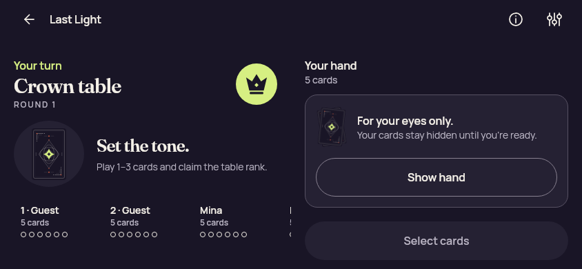</a> <code>game-landscape-concealed.png</code> game-landscape-concealed | 844 × 390 px · 39,059 bytes SHA-256: <code>c4617f711a9d3cca2f9f5f19af79d1608129620faf7c2ce55ed854c531295035</code> Source: <code>/root/projects/PartyDeck/artifacts/evidence-storage/34503251315/android-jvm-reports/composeApp/build/ui-snapshots/game-landscape-concealed.png</code> | **Exact published-byte match**. Exact PNG bytes match the previously published original first-batch/compose/game-landscape-concealed.png. Its prior pixel observation is reused while this source/scenario/capture identity remains separate. [Reviewed matching original](../../first-batch/compose/game-landscape-concealed.png); original capture identity remains separate. |
| <a href="game-landscape-eliminated.png">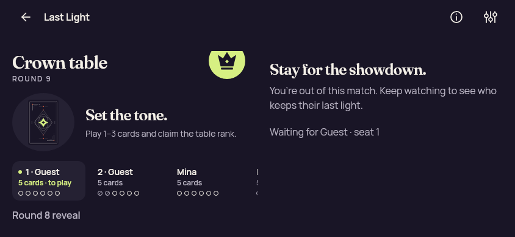</a> <code>game-landscape-eliminated.png</code> game-landscape-eliminated | 844 × 390 px · 36,120 bytes SHA-256: <code>8350390017d78e84decadc825a8cec5fcc523dce6b4e62019094d256ca788b53</code> Source: <code>/root/projects/PartyDeck/artifacts/evidence-storage/34503251315/android-jvm-reports/composeApp/build/ui-snapshots/game-landscape-eliminated.png</code> | **Exact published-byte match**. Exact PNG bytes match the previously published original first-batch/compose/game-landscape-eliminated.png. Its prior pixel observation is reused while this source/scenario/capture identity remains separate. [Reviewed matching original](../../first-batch/compose/game-landscape-eliminated.png); original capture identity remains separate. |
|  <code>game-landscape-hand.png</code> game-landscape-hand | 844 × 390 px · 33,717 bytes SHA-256: <code>842fcd1839c0d05dfec387bff88921877d1bc49eecb80c9a3d63322bfb61d273</code> Source: <code>/root/projects/PartyDeck/artifacts/evidence-storage/34503251315/android-jvm-reports/composeApp/build/ui-snapshots/game-landscape-hand.png</code> | **Exact published-byte match**. Exact PNG bytes match the previously published original first-batch/compose/game-landscape-hand.png. Its prior pixel observation is reused while this source/scenario/capture identity remains separate. [Reviewed matching original](../../first-batch/compose/game-landscape-hand.png); original capture identity remains separate. |
|  <code>game-landscape-previous-proof.png</code> game-landscape-previous-proof | 844 × 390 px · 31,791 bytes SHA-256: <code>059ba1a8ed8340fc4c45a44abb0d023c756687db18daa26ab929ca7bc1a53418</code> Source: <code>/root/projects/PartyDeck/artifacts/evidence-storage/34503251315/android-jvm-reports/composeApp/build/ui-snapshots/game-landscape-previous-proof.png</code> | **Exact published-byte match**. Exact PNG bytes match the previously published original first-batch/compose/game-landscape-previous-proof.png. Its prior pixel observation is reused while this source/scenario/capture identity remains separate. [Reviewed matching original](../../first-batch/compose/game-landscape-previous-proof.png); original capture identity remains separate. |
| <a href="game-landscape-previous-reveal.png">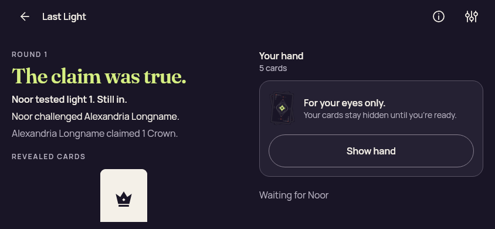</a> <code>game-landscape-previous-reveal.png</code> game-landscape-previous-reveal | 844 × 390 px · 36,971 bytes SHA-256: <code>565ea5890c5330d7de4e0040ad8981a697f33f7327d566bd5b8671df3deb9fb7</code> Source: <code>/root/projects/PartyDeck/artifacts/evidence-storage/34503251315/android-jvm-reports/composeApp/build/ui-snapshots/game-landscape-previous-reveal.png</code> | **Exact published-byte match**. Exact PNG bytes match the previously published original first-batch/compose/game-landscape-previous-reveal.png. Its prior pixel observation is reused while this source/scenario/capture identity remains separate. [Reviewed matching original](../../first-batch/compose/game-landscape-previous-reveal.png); original capture identity remains separate. |
|  <code>game-landscape-round-result.png</code> game-landscape-round-result | 844 × 390 px · 20,935 bytes SHA-256: <code>280668abaf08fa9bc3f97a42fac67ffc15b892a48f6cd09f949df7b39c3454d2</code> Source: <code>/root/projects/PartyDeck/artifacts/evidence-storage/34503251315/android-jvm-reports/composeApp/build/ui-snapshots/game-landscape-round-result.png</code> | **Exact published-byte match**. Exact PNG bytes match the previously published original first-batch/compose/game-landscape-round-result.png. Its prior pixel observation is reused while this source/scenario/capture identity remains separate. [Reviewed matching original](../../first-batch/compose/game-landscape-round-result.png); original capture identity remains separate. |
|  <code>game-landscape-selected.png</code> game-landscape-selected | 844 × 390 px · 36,046 bytes SHA-256: <code>f6fcf73f097293cf19966d8c4779e02b5d020f34015b36ba1abb09c21eb8d176</code> Source: <code>/root/projects/PartyDeck/artifacts/evidence-storage/34503251315/android-jvm-reports/composeApp/build/ui-snapshots/game-landscape-selected.png</code> | **Exact published-byte match**. Exact PNG bytes match the previously published original first-batch/compose/game-landscape-selected.png. Its prior pixel observation is reused while this source/scenario/capture identity remains separate. [Reviewed matching original](../../first-batch/compose/game-landscape-selected.png); original capture identity remains separate. |
|  <code>game-landscape-winner.png</code> game-landscape-winner | 844 × 390 px · 23,671 bytes SHA-256: <code>047656f4f92d2a73a1d65cca1f91e8209fe775a6217b962796f2335ddb230a92</code> Source: <code>/root/projects/PartyDeck/artifacts/evidence-storage/34503251315/android-jvm-reports/composeApp/build/ui-snapshots/game-landscape-winner.png</code> | **Exact published-byte match**. Exact PNG bytes match the previously published original first-batch/compose/game-landscape-winner.png. Its prior pixel observation is reused while this source/scenario/capture identity remains separate. [Reviewed matching original](../../first-batch/compose/game-landscape-winner.png); original capture identity remains separate. |
| <a href="game-large-text-concealed.png">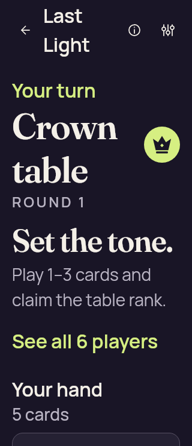</a> <code>game-large-text-concealed.png</code> game-large-text-concealed | 320 × 740 px · 34,837 bytes SHA-256: <code>66a895a136e0cb9bfe69d526f020e64a587a8d95d58dd2e0d71fe7faa44925d7</code> Source: <code>/root/projects/PartyDeck/artifacts/evidence-storage/34503251315/android-jvm-reports/composeApp/build/ui-snapshots/game-large-text-concealed.png</code> | **Exact published-byte match**. Exact PNG bytes match the previously published original first-batch/compose/game-large-text-concealed.png. Its prior pixel observation is reused while this source/scenario/capture identity remains separate. [Reviewed matching original](../../first-batch/compose/game-large-text-concealed.png); original capture identity remains separate. |
| <a href="game-large-text-eliminated.png">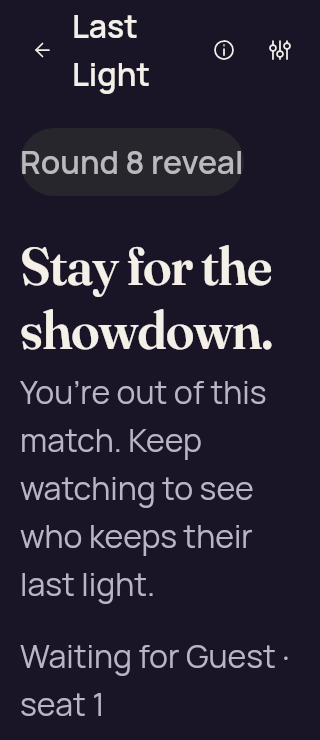</a> <code>game-large-text-eliminated.png</code> game-large-text-eliminated | 320 × 740 px · 39,217 bytes SHA-256: <code>38757db2cc93392232a7e8421ce7ed9fca04efac470ae189c7028aafdbc90e53</code> Source: <code>/root/projects/PartyDeck/artifacts/evidence-storage/34503251315/android-jvm-reports/composeApp/build/ui-snapshots/game-large-text-eliminated.png</code> | **Exact published-byte match**. Exact PNG bytes match the previously published original first-batch/compose/game-large-text-eliminated.png. Its prior pixel observation is reused while this source/scenario/capture identity remains separate. [Reviewed matching original](../../first-batch/compose/game-large-text-eliminated.png); original capture identity remains separate. |
| <a href="game-large-text-hand.png">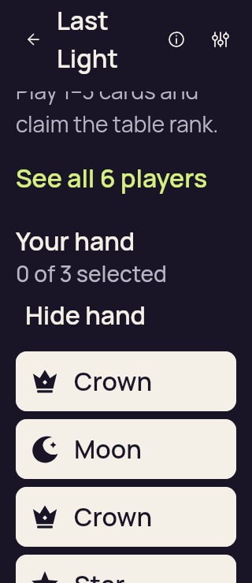</a> <code>game-large-text-hand.png</code> game-large-text-hand | 320 × 740 px · 31,850 bytes SHA-256: <code>067935c4fab262f6d9c6126a8d91582bef1ddda372e3034b4c663c983b4ccb90</code> Source: <code>/root/projects/PartyDeck/artifacts/evidence-storage/34503251315/android-jvm-reports/composeApp/build/ui-snapshots/game-large-text-hand.png</code> | **Exact published-byte match**. Exact PNG bytes match the previously published original first-batch/compose/game-large-text-hand.png. Its prior pixel observation is reused while this source/scenario/capture identity remains separate. [Reviewed matching original](../../first-batch/compose/game-large-text-hand.png); original capture identity remains separate. |
|  <code>game-large-text-previous-proof.png</code> game-large-text-previous-proof | 320 × 740 px · 33,078 bytes SHA-256: <code>9e37d0764b37de09b152d291106f5e854ebc07e684f5568d2ca5d10e2c7d6e81</code> Source: <code>/root/projects/PartyDeck/artifacts/evidence-storage/34503251315/android-jvm-reports/composeApp/build/ui-snapshots/game-large-text-previous-proof.png</code> | **Exact published-byte match**. Exact PNG bytes match the previously published original first-batch/compose/game-large-text-previous-proof.png. Its prior pixel observation is reused while this source/scenario/capture identity remains separate. [Reviewed matching original](../../first-batch/compose/game-large-text-previous-proof.png); original capture identity remains separate. |
| <a href="game-large-text-previous-reveal.png">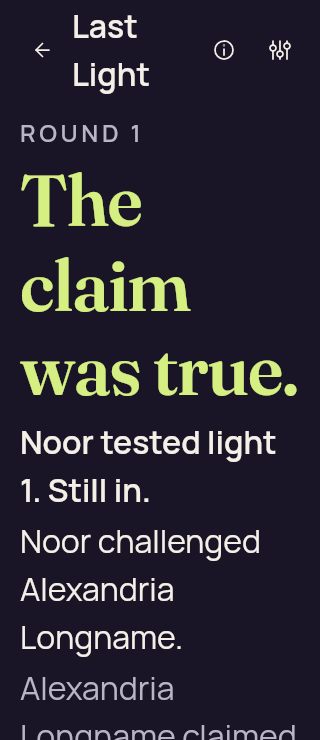</a> <code>game-large-text-previous-reveal.png</code> game-large-text-previous-reveal | 320 × 740 px · 34,558 bytes SHA-256: <code>10f675de2148fd13be34a8967fbeeb456dbe353f7e34769a764978ef0056b045</code> Source: <code>/root/projects/PartyDeck/artifacts/evidence-storage/34503251315/android-jvm-reports/composeApp/build/ui-snapshots/game-large-text-previous-reveal.png</code> | **Exact published-byte match**. Exact PNG bytes match the previously published original first-batch/compose/game-large-text-previous-reveal.png. Its prior pixel observation is reused while this source/scenario/capture identity remains separate. [Reviewed matching original](../../first-batch/compose/game-large-text-previous-reveal.png); original capture identity remains separate. |
|  <code>game-large-text-round-result.png</code> game-large-text-round-result | 320 × 740 px · 32,581 bytes SHA-256: <code>fa176a0d9d5ddbb91ed9ca93c74b1c3cb174e6d1fc9b8060be6ed33fbd02b2cd</code> Source: <code>/root/projects/PartyDeck/artifacts/evidence-storage/34503251315/android-jvm-reports/composeApp/build/ui-snapshots/game-large-text-round-result.png</code> | **Exact published-byte match**. Exact PNG bytes match the previously published original first-batch/compose/game-large-text-round-result.png. Its prior pixel observation is reused while this source/scenario/capture identity remains separate. [Reviewed matching original](../../first-batch/compose/game-large-text-round-result.png); original capture identity remains separate. |
|  <code>game-large-text-selected.png</code> game-large-text-selected | 320 × 740 px · 28,381 bytes SHA-256: <code>578525e168d782a5cc19d783c212537cdf1b17b9fc54b03e157711773858ff8a</code> Source: <code>/root/projects/PartyDeck/artifacts/evidence-storage/34503251315/android-jvm-reports/composeApp/build/ui-snapshots/game-large-text-selected.png</code> | **Exact published-byte match**. Exact PNG bytes match the previously published original first-batch/compose/game-large-text-selected.png. Its prior pixel observation is reused while this source/scenario/capture identity remains separate. [Reviewed matching original](../../first-batch/compose/game-large-text-selected.png); original capture identity remains separate. |
| <a href="game-large-text-winner.png">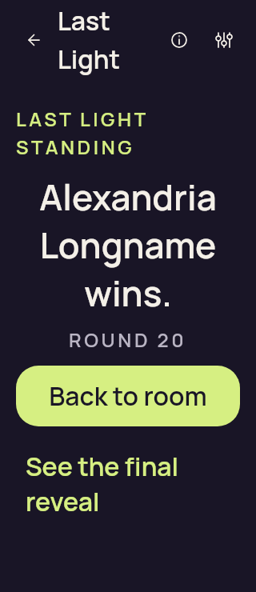</a> <code>game-large-text-winner.png</code> game-large-text-winner | 320 × 740 px · 26,744 bytes SHA-256: <code>7088f1c112b973c7af042071828683669f725ab967be9533ae1ecd1ca7542fb0</code> Source: <code>/root/projects/PartyDeck/artifacts/evidence-storage/34503251315/android-jvm-reports/composeApp/build/ui-snapshots/game-large-text-winner.png</code> | **Exact published-byte match**. Exact PNG bytes match the previously published original first-batch/compose/game-large-text-winner.png. Its prior pixel observation is reused while this source/scenario/capture identity remains separate. [Reviewed matching original](../../first-batch/compose/game-large-text-winner.png); original capture identity remains separate. |
|  <code>game-phone-concealed.png</code> game-phone-concealed | 360 × 640 px · 32,137 bytes SHA-256: <code>c42fd7ac3fcfcb9d1ccb32ff7a54fd5bdbeb458a116a055f4cb231e531e5175c</code> Source: <code>/root/projects/PartyDeck/artifacts/evidence-storage/34503251315/android-jvm-reports/composeApp/build/ui-snapshots/game-phone-concealed.png</code> | **Exact published-byte match**. Exact PNG bytes match the previously published original first-batch/compose/game-phone-concealed.png. Its prior pixel observation is reused while this source/scenario/capture identity remains separate. [Reviewed matching original](../../first-batch/compose/game-phone-concealed.png); original capture identity remains separate. |
|  <code>game-phone-eliminated.png</code> game-phone-eliminated | 360 × 640 px · 33,538 bytes SHA-256: <code>357bd5af2fc4df311f432ae43cb61fd6341b7a40e61edddd1aa400c47885af86</code> Source: <code>/root/projects/PartyDeck/artifacts/evidence-storage/34503251315/android-jvm-reports/composeApp/build/ui-snapshots/game-phone-eliminated.png</code> | **Exact published-byte match**. Exact PNG bytes match the previously published original first-batch/compose/game-phone-eliminated.png. Its prior pixel observation is reused while this source/scenario/capture identity remains separate. [Reviewed matching original](../../first-batch/compose/game-phone-eliminated.png); original capture identity remains separate. |
|  <code>game-phone-hand.png</code> game-phone-hand | 360 × 640 px · 31,920 bytes SHA-256: <code>67f918bfee91987f415e97c09949e4eebdef4d0a6c98e775ee8a6092dddad0ba</code> Source: <code>/root/projects/PartyDeck/artifacts/evidence-storage/34503251315/android-jvm-reports/composeApp/build/ui-snapshots/game-phone-hand.png</code> | **Exact published-byte match**. Exact PNG bytes match the previously published original first-batch/compose/game-phone-hand.png. Its prior pixel observation is reused while this source/scenario/capture identity remains separate. [Reviewed matching original](../../first-batch/compose/game-phone-hand.png); original capture identity remains separate. |
|  <code>game-phone-previous-proof.png</code> game-phone-previous-proof | 360 × 640 px · 29,597 bytes SHA-256: <code>7ed6c3bdd8eac370c872f852bb3de73491f0644c5e47f0cf41acf2bce4d1eb7b</code> Source: <code>/root/projects/PartyDeck/artifacts/evidence-storage/34503251315/android-jvm-reports/composeApp/build/ui-snapshots/game-phone-previous-proof.png</code> | **Exact published-byte match**. Exact PNG bytes match the previously published original first-batch/compose/game-phone-previous-proof.png. Its prior pixel observation is reused while this source/scenario/capture identity remains separate. [Reviewed matching original](../../first-batch/compose/game-phone-previous-proof.png); original capture identity remains separate. |
| <a href="game-phone-previous-reveal.png">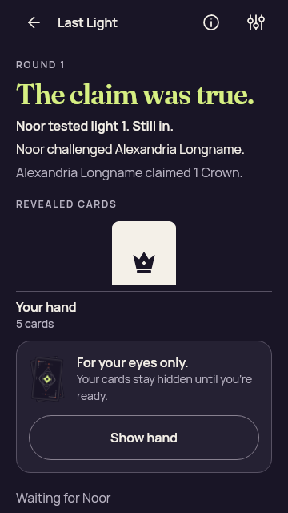</a> <code>game-phone-previous-reveal.png</code> game-phone-previous-reveal | 360 × 640 px · 35,127 bytes SHA-256: <code>a040e64e25737e3d0b04ae60c3e0bea38c9cc79c9e2a4d01c5a19409ee967811</code> Source: <code>/root/projects/PartyDeck/artifacts/evidence-storage/34503251315/android-jvm-reports/composeApp/build/ui-snapshots/game-phone-previous-reveal.png</code> | **Exact published-byte match**. Exact PNG bytes match the previously published original first-batch/compose/game-phone-previous-reveal.png. Its prior pixel observation is reused while this source/scenario/capture identity remains separate. [Reviewed matching original](../../first-batch/compose/game-phone-previous-reveal.png); original capture identity remains separate. |
|  <code>game-phone-round-result.png</code> game-phone-round-result | 360 × 640 px · 31,078 bytes SHA-256: <code>ed44bac4453e2118c6c78362a306c732139ba2da3228931ce8d66096f32141be</code> Source: <code>/root/projects/PartyDeck/artifacts/evidence-storage/34503251315/android-jvm-reports/composeApp/build/ui-snapshots/game-phone-round-result.png</code> | **Exact published-byte match**. Exact PNG bytes match the previously published original first-batch/compose/game-phone-round-result.png. Its prior pixel observation is reused while this source/scenario/capture identity remains separate. [Reviewed matching original](../../first-batch/compose/game-phone-round-result.png); original capture identity remains separate. |
|  <code>game-phone-selected.png</code> game-phone-selected | 360 × 640 px · 32,573 bytes SHA-256: <code>6e0ebcc7856b0386f99a9fbb243719dfe68da0fe4fdbdb4d97f9ab8a70638a6d</code> Source: <code>/root/projects/PartyDeck/artifacts/evidence-storage/34503251315/android-jvm-reports/composeApp/build/ui-snapshots/game-phone-selected.png</code> | **Exact published-byte match**. Exact PNG bytes match the previously published original first-batch/compose/game-phone-selected.png. Its prior pixel observation is reused while this source/scenario/capture identity remains separate. [Reviewed matching original](../../first-batch/compose/game-phone-selected.png); original capture identity remains separate. |
| <a href="game-phone-winner.png">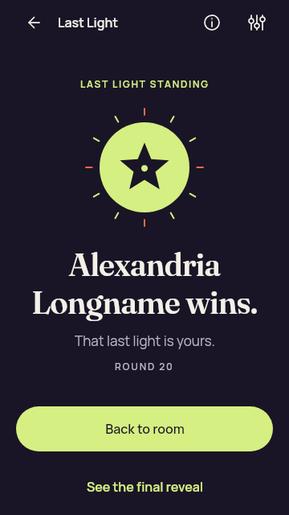</a> <code>game-phone-winner.png</code> game-phone-winner | 360 × 640 px · 24,841 bytes SHA-256: <code>be63e9b3011dacad3811f44ad0c51f23421751ee0c6e62431118e8f887b5b24f</code> Source: <code>/root/projects/PartyDeck/artifacts/evidence-storage/34503251315/android-jvm-reports/composeApp/build/ui-snapshots/game-phone-winner.png</code> | **Exact published-byte match**. Exact PNG bytes match the previously published original first-batch/compose/game-phone-winner.png. Its prior pixel observation is reused while this source/scenario/capture identity remains separate. [Reviewed matching original](../../first-batch/compose/game-phone-winner.png); original capture identity remains separate. |
| <a href="game-selection-limit.png">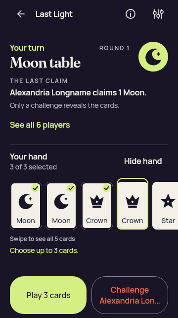</a> <code>game-selection-limit.png</code> game-selection-limit | 360 × 640 px · 38,507 bytes SHA-256: <code>2a473e93b9476c473720e5f592acd38af7f8001beefb65eb905be45ff0d71491</code> Source: <code>/root/projects/PartyDeck/artifacts/evidence-storage/34503251315/android-jvm-reports/composeApp/build/ui-snapshots/game-selection-limit.png</code> | **Exact published-byte match**. Exact PNG bytes match the previously published original compose-gameplay-layout-20260910-root-validation/game-selection-limit.png. Its prior pixel observation is reused while this source/scenario/capture identity remains separate. [Reviewed matching original](../../compose-gameplay-layout-20260910-root-validation/game-selection-limit.png); original capture identity remains separate. |
|  <code>game-tablet-concealed.png</code> game-tablet-concealed | 1024 × 768 px · 45,833 bytes SHA-256: <code>47dee65cec7a47fc8102cf424abcce5cd89b88adf9679a9fd3a7d9e2fe6a6c74</code> Source: <code>/root/projects/PartyDeck/artifacts/evidence-storage/34503251315/android-jvm-reports/composeApp/build/ui-snapshots/game-tablet-concealed.png</code> | **Exact published-byte match**. Exact PNG bytes match the previously published original first-batch/compose/game-tablet-concealed.png. Its prior pixel observation is reused while this source/scenario/capture identity remains separate. [Reviewed matching original](../../first-batch/compose/game-tablet-concealed.png); original capture identity remains separate. |
|  <code>game-tablet-eliminated.png</code> game-tablet-eliminated | 1024 × 768 px · 43,026 bytes SHA-256: <code>4d5ef9dbcaa425ca9d8e65e21c7959f3ecc6f16c333c53b911b62f4a88e0f626</code> Source: <code>/root/projects/PartyDeck/artifacts/evidence-storage/34503251315/android-jvm-reports/composeApp/build/ui-snapshots/game-tablet-eliminated.png</code> | **Exact published-byte match**. Exact PNG bytes match the previously published original first-batch/compose/game-tablet-eliminated.png. Its prior pixel observation is reused while this source/scenario/capture identity remains separate. [Reviewed matching original](../../first-batch/compose/game-tablet-eliminated.png); original capture identity remains separate. |
|  <code>game-tablet-hand.png</code> game-tablet-hand | 1024 × 768 px · 40,436 bytes SHA-256: <code>46141180fac62120c37f0dc9dab09998a5ffcf2be518bf665602ca4249899316</code> Source: <code>/root/projects/PartyDeck/artifacts/evidence-storage/34503251315/android-jvm-reports/composeApp/build/ui-snapshots/game-tablet-hand.png</code> | **Exact published-byte match**. Exact PNG bytes match the previously published original first-batch/compose/game-tablet-hand.png. Its prior pixel observation is reused while this source/scenario/capture identity remains separate. [Reviewed matching original](../../first-batch/compose/game-tablet-hand.png); original capture identity remains separate. |
|  <code>game-tablet-previous-proof.png</code> game-tablet-previous-proof | 1024 × 768 px · 60,400 bytes SHA-256: <code>6208be7a02f3a18e50f6e8ae1843f1684f1fea02367c5238136291243c0cce47</code> Source: <code>/root/projects/PartyDeck/artifacts/evidence-storage/34503251315/android-jvm-reports/composeApp/build/ui-snapshots/game-tablet-previous-proof.png</code> | **Exact published-byte match**. Exact PNG bytes match the previously published original first-batch/compose/game-tablet-previous-proof.png. Its prior pixel observation is reused while this source/scenario/capture identity remains separate. [Reviewed matching original](../../first-batch/compose/game-tablet-previous-proof.png); original capture identity remains separate. |
|  <code>game-tablet-previous-reveal.png</code> game-tablet-previous-reveal | 1024 × 768 px · 60,400 bytes SHA-256: <code>6208be7a02f3a18e50f6e8ae1843f1684f1fea02367c5238136291243c0cce47</code> Source: <code>/root/projects/PartyDeck/artifacts/evidence-storage/34503251315/android-jvm-reports/composeApp/build/ui-snapshots/game-tablet-previous-reveal.png</code> | **Exact published-byte match**. Exact PNG bytes match the previously published original first-batch/compose/game-tablet-previous-proof.png. Its prior pixel observation is reused while this source/scenario/capture identity remains separate. [Reviewed matching original](../../first-batch/compose/game-tablet-previous-proof.png); original capture identity remains separate. |
|  <code>game-tablet-round-result.png</code> game-tablet-round-result | 1024 × 768 px · 44,741 bytes SHA-256: <code>678098f3294c1a823112e6d0224e26ddac92cf9bd9a94937c02527d48af0e0ad</code> Source: <code>/root/projects/PartyDeck/artifacts/evidence-storage/34503251315/android-jvm-reports/composeApp/build/ui-snapshots/game-tablet-round-result.png</code> | **Exact published-byte match**. Exact PNG bytes match the previously published original first-batch/compose/game-tablet-round-result.png. Its prior pixel observation is reused while this source/scenario/capture identity remains separate. [Reviewed matching original](../../first-batch/compose/game-tablet-round-result.png); original capture identity remains separate. |
|  <code>game-tablet-selected.png</code> game-tablet-selected | 1024 × 768 px · 42,445 bytes SHA-256: <code>8703e47cc3baa4da82e6c29d88df3ac5e3021a29f37c5f2d6159a5cc14eee6ba</code> Source: <code>/root/projects/PartyDeck/artifacts/evidence-storage/34503251315/android-jvm-reports/composeApp/build/ui-snapshots/game-tablet-selected.png</code> | **Exact published-byte match**. Exact PNG bytes match the previously published original first-batch/compose/game-tablet-selected.png. Its prior pixel observation is reused while this source/scenario/capture identity remains separate. [Reviewed matching original](../../first-batch/compose/game-tablet-selected.png); original capture identity remains separate. |
|  <code>game-tablet-winner.png</code> game-tablet-winner | 1024 × 768 px · 28,593 bytes SHA-256: <code>a14740d1fae23f0a102959ff7d323ff2ac0aaedb828b1d6683cd8b114afbd94d</code> Source: <code>/root/projects/PartyDeck/artifacts/evidence-storage/34503251315/android-jvm-reports/composeApp/build/ui-snapshots/game-tablet-winner.png</code> | **Exact published-byte match**. Exact PNG bytes match the previously published original first-batch/compose/game-tablet-winner.png. Its prior pixel observation is reused while this source/scenario/capture identity remains separate. [Reviewed matching original](../../first-batch/compose/game-tablet-winner.png); original capture identity remains separate. |
|  <code>game-three-selected.png</code> game-three-selected | 360 × 640 px · 38,592 bytes SHA-256: <code>563fe35f3e5e29459309f308b2fd1dcd733e46fa3a604de7507e96cf629c59c6</code> Source: <code>/root/projects/PartyDeck/artifacts/evidence-storage/34503251315/android-jvm-reports/composeApp/build/ui-snapshots/game-three-selected.png</code> | **Exact published-byte match**. Exact PNG bytes match the previously published original first-batch/compose/game-three-selected.png. Its prior pixel observation is reused while this source/scenario/capture identity remains separate. [Reviewed matching original](../../first-batch/compose/game-three-selected.png); original capture identity remains separate. |
|  <code>global-error-large-text-recovery.png</code> global-error-large-text-recovery | 320 × 740 px · 36,316 bytes SHA-256: <code>1883104be73b2dbbd31867262b3fe44ef35cd167e016dfbc06c50c04e8d5b665</code> Source: <code>/root/projects/PartyDeck/artifacts/evidence-storage/34503251315/android-jvm-reports/composeApp/build/ui-snapshots/global-error-large-text-recovery.png</code> | **Exact published-byte match**. Exact PNG bytes match the previously published original first-batch/compose/global-error-large-text-recovery.png. Its prior pixel observation is reused while this source/scenario/capture identity remains separate. [Reviewed matching original](../../first-batch/compose/global-error-large-text-recovery.png); original capture identity remains separate. |
|  <code>global-error-large-text.png</code> global-error-large-text | 320 × 740 px · 36,316 bytes SHA-256: <code>1883104be73b2dbbd31867262b3fe44ef35cd167e016dfbc06c50c04e8d5b665</code> Source: <code>/root/projects/PartyDeck/artifacts/evidence-storage/34503251315/android-jvm-reports/composeApp/build/ui-snapshots/global-error-large-text.png</code> | **Exact published-byte match**. Exact PNG bytes match the previously published original first-batch/compose/global-error-large-text-recovery.png. Its prior pixel observation is reused while this source/scenario/capture identity remains separate. [Reviewed matching original](../../first-batch/compose/global-error-large-text-recovery.png); original capture identity remains separate. |
| <a href="home-landscape.png">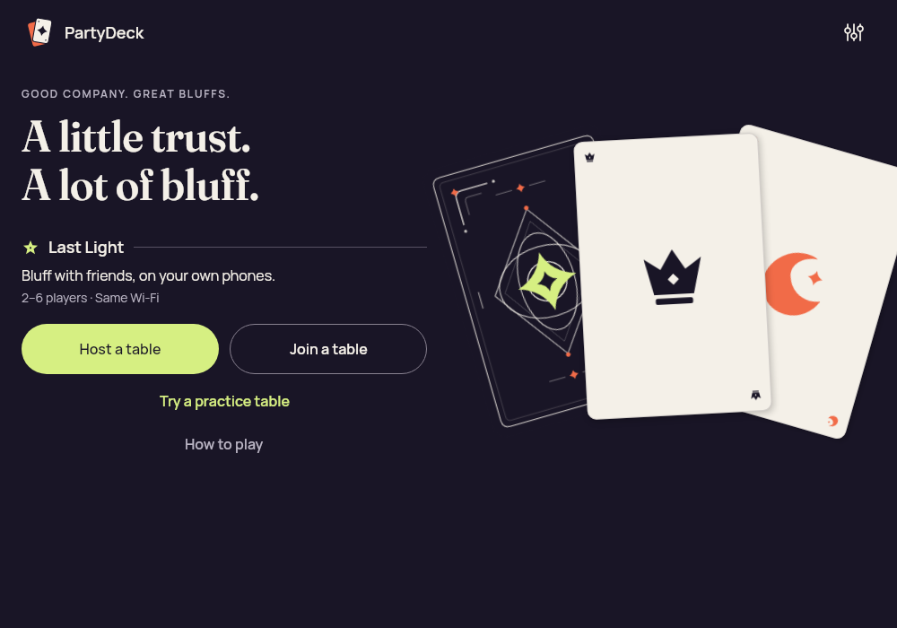</a> <code>home-landscape.png</code> home-landscape | 1000 × 700 px · 83,440 bytes SHA-256: <code>0dd475f5d1c75ad27a3bde69c1ad1bb2fc69ffcc3d82f44cb0fdcc29acf28b2e</code> Source: <code>/root/projects/PartyDeck/artifacts/evidence-storage/34503251315/android-jvm-reports/composeApp/build/ui-snapshots/home-landscape.png</code> | **Exact published-byte match**. Exact PNG bytes match the previously published original first-batch/compose/home-landscape.png. Its prior pixel observation is reused while this source/scenario/capture identity remains separate. [Reviewed matching original](../../first-batch/compose/home-landscape.png); original capture identity remains separate. |
|  <code>home-large-text.png</code> home-large-text | 320 × 740 px · 34,073 bytes SHA-256: <code>909474ccff4af7d929470a34a85adef677c9e6593fc78912a835e8ac699a5be5</code> Source: <code>/root/projects/PartyDeck/artifacts/evidence-storage/34503251315/android-jvm-reports/composeApp/build/ui-snapshots/home-large-text.png</code> | **Exact published-byte match**. Exact PNG bytes match the previously published original first-batch/compose/home-large-text.png. Its prior pixel observation is reused while this source/scenario/capture identity remains separate. [Reviewed matching original](../../first-batch/compose/home-large-text.png); original capture identity remains separate. |
|  <code>home-phone-landscape.png</code> home-phone-landscape | 844 × 390 px · 52,464 bytes SHA-256: <code>1d2642fd1b30f32305d53076ef571f5843347bfe40bec1019fb7914604c197d4</code> Source: <code>/root/projects/PartyDeck/artifacts/evidence-storage/34503251315/android-jvm-reports/composeApp/build/ui-snapshots/home-phone-landscape.png</code> | **Exact published-byte match**. Exact PNG bytes match the previously published original first-batch/compose/home-phone-landscape.png. Its prior pixel observation is reused while this source/scenario/capture identity remains separate. [Reviewed matching original](../../first-batch/compose/home-phone-landscape.png); original capture identity remains separate. |
|  <code>home-phone.png</code> home-phone | 390 × 844 px · 54,944 bytes SHA-256: <code>72b504135fc293ab9a804711655dd0dc941a877f9f81fbf0e1d9171f87cff90a</code> Source: <code>/root/projects/PartyDeck/artifacts/evidence-storage/34503251315/android-jvm-reports/composeApp/build/ui-snapshots/home-phone.png</code> | **Exact published-byte match**. Exact PNG bytes match the previously published original first-batch/compose/home-phone.png. Its prior pixel observation is reused while this source/scenario/capture identity remains separate. [Reviewed matching original](../../first-batch/compose/home-phone.png); original capture identity remains separate. |
| <a href="invitation-dialog-phone.png">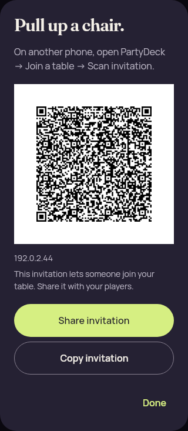</a> <code>invitation-dialog-phone.png</code> invitation-dialog-phone | 320 × 733 px · 42,065 bytes SHA-256: <code>5b5eb8eab231933aff6290ed9203bcb38cfd9066e078c5190a57ec12cca971f8</code> Source: <code>/root/projects/PartyDeck/artifacts/evidence-storage/34503251315/android-jvm-reports/composeApp/build/ui-snapshots/invitation-dialog-phone.png</code> | **Exact published-byte match**. Exact PNG bytes match the previously published original first-batch/compose/invitation-dialog-phone.png. Its prior pixel observation is reused while this source/scenario/capture identity remains separate. [Reviewed matching original](../../first-batch/compose/invitation-dialog-phone.png); original capture identity remains separate. |
|  <code>invitation-qr-synthetic-320.png</code> invitation-qr-synthetic-320 | 272 × 272 px · 19,506 bytes SHA-256: <code>67fb32eb8071769ac7aec99e926f6871c5266687acc5c7fb7c97d273aedac294</code> Source: <code>/root/projects/PartyDeck/artifacts/evidence-storage/34503251315/android-jvm-reports/composeApp/build/ui-snapshots/invitation-qr-synthetic-320.png</code> | **Exact published-byte match**. Exact PNG bytes match the previously published original first-batch/compose/invitation-qr-synthetic-320.png. Its prior pixel observation is reused while this source/scenario/capture identity remains separate. [Reviewed matching original](../../first-batch/compose/invitation-qr-synthetic-320.png); original capture identity remains separate. |
| <a href="join-constrained-large-text-error.png">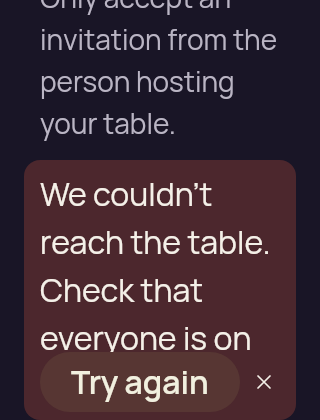</a> <code>join-constrained-large-text-error.png</code> join-constrained-large-text-error | 320 × 420 px · 26,244 bytes SHA-256: <code>db5a645b931ab8ad6a65674132bcf4b42c0b85c7f958df7788cfde6e0d27e11a</code> Source: <code>/root/projects/PartyDeck/artifacts/evidence-storage/34503251315/android-jvm-reports/composeApp/build/ui-snapshots/join-constrained-large-text-error.png</code> | **Exact published-byte match**. Exact PNG bytes match the previously published original first-batch/compose/join-constrained-large-text-error.png. Its prior pixel observation is reused while this source/scenario/capture identity remains separate. [Reviewed matching original](../../first-batch/compose/join-constrained-large-text-error.png); original capture identity remains separate. |
| <a href="join-constrained-large-text-input.png">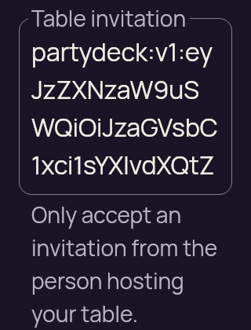</a> <code>join-constrained-large-text-input.png</code> join-constrained-large-text-input | 320 × 420 px · 30,801 bytes SHA-256: <code>c85f16da4bfeb9d9e23f29dae7cb73d0093071fb3ec74a8516e0852324140a0f</code> Source: <code>/root/projects/PartyDeck/artifacts/evidence-storage/34503251315/android-jvm-reports/composeApp/build/ui-snapshots/join-constrained-large-text-input.png</code> | **Exact published-byte match**. Exact PNG bytes match the previously published original first-batch/compose/join-constrained-large-text-input.png. Its prior pixel observation is reused while this source/scenario/capture identity remains separate. [Reviewed matching original](../../first-batch/compose/join-constrained-large-text-input.png); original capture identity remains separate. |
| <a href="licenses-large-text-end.png">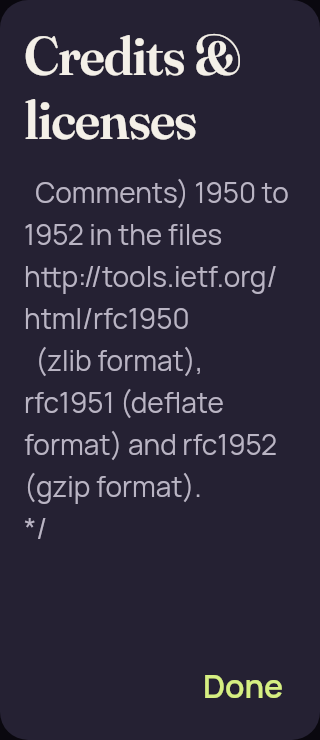</a> <code>licenses-large-text-end.png</code> licenses-large-text-end | 320 × 740 px · 37,115 bytes SHA-256: <code>847e393846e12692d4e9beff338bddaceeaf3848901c0665926123cd9bb53325</code> Source: <code>/root/projects/PartyDeck/artifacts/evidence-storage/34503251315/android-jvm-reports/composeApp/build/ui-snapshots/licenses-large-text-end.png</code> | **Exact published-byte match**. Exact PNG bytes match the previously published original first-batch/compose/licenses-large-text-end.png. Its prior pixel observation is reused while this source/scenario/capture identity remains separate. [Reviewed matching original](../../first-batch/compose/licenses-large-text-end.png); original capture identity remains separate. |
|  <code>licenses-large-text-first-notice.png</code> licenses-large-text-first-notice | 320 × 740 px · 21,432 bytes SHA-256: <code>c2bfa5c3732d30d1313fcf51826c34bc1ec529b02f5823c7609808922743aeb9</code> Source: <code>/root/projects/PartyDeck/artifacts/evidence-storage/34503251315/android-jvm-reports/composeApp/build/ui-snapshots/licenses-large-text-first-notice.png</code> | **Exact published-byte match**. Exact PNG bytes match the previously published original first-batch/compose/licenses-large-text-first-notice.png. Its prior pixel observation is reused while this source/scenario/capture identity remains separate. [Reviewed matching original](../../first-batch/compose/licenses-large-text-first-notice.png); original capture identity remains separate. |
|  <code>licenses-large-text-start.png</code> licenses-large-text-start | 320 × 740 px · 41,687 bytes SHA-256: <code>8ac515a3b4509c4ab782f06fc7777fa9dcbbb9a6ddb24dfe207a102586a27193</code> Source: <code>/root/projects/PartyDeck/artifacts/evidence-storage/34503251315/android-jvm-reports/composeApp/build/ui-snapshots/licenses-large-text-start.png</code> | **Exact published-byte match**. Exact PNG bytes match the previously published original first-batch/compose/licenses-large-text-start.png. Its prior pixel observation is reused while this source/scenario/capture identity remains separate. [Reviewed matching original](../../first-batch/compose/licenses-large-text-start.png); original capture identity remains separate. |
| <a href="lobby-guest-large-text-action.png">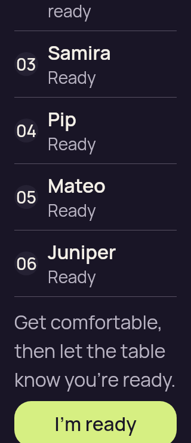</a> <code>lobby-guest-large-text-action.png</code> lobby-guest-large-text-action | 320 × 740 px · 34,611 bytes SHA-256: <code>2c595d58f3bfdd6e2e7199281037ee72c9ba606f5a63d131740d5cf41afe7813</code> Source: <code>/root/projects/PartyDeck/artifacts/evidence-storage/34503251315/android-jvm-reports/composeApp/build/ui-snapshots/lobby-guest-large-text-action.png</code> | **Exact published-byte match**. Exact PNG bytes match the previously published original first-batch/compose/lobby-guest-large-text-action.png. Its prior pixel observation is reused while this source/scenario/capture identity remains separate. [Reviewed matching original](../../first-batch/compose/lobby-guest-large-text-action.png); original capture identity remains separate. |
|  <code>lobby-guest-large-text-roster.png</code> lobby-guest-large-text-roster | 320 × 740 px · 36,400 bytes SHA-256: <code>4997a0f1e33d492073467a276bfd6dca8fd9c1e08fc271594007694750eb6d9b</code> Source: <code>/root/projects/PartyDeck/artifacts/evidence-storage/34503251315/android-jvm-reports/composeApp/build/ui-snapshots/lobby-guest-large-text-roster.png</code> | **Exact published-byte match**. Exact PNG bytes match the previously published original first-batch/compose/lobby-guest-large-text-roster.png. Its prior pixel observation is reused while this source/scenario/capture identity remains separate. [Reviewed matching original](../../first-batch/compose/lobby-guest-large-text-roster.png); original capture identity remains separate. |
|  <code>lobby-guest-large-text.png</code> lobby-guest-large-text | 320 × 740 px · 29,815 bytes SHA-256: <code>d9b00abe73ecc902cc047b7f3e3483d4c351867a0b2db04b9d5cb6f61e3a794f</code> Source: <code>/root/projects/PartyDeck/artifacts/evidence-storage/34503251315/android-jvm-reports/composeApp/build/ui-snapshots/lobby-guest-large-text.png</code> | **Exact published-byte match**. Exact PNG bytes match the previously published original first-batch/compose/lobby-guest-large-text.png. Its prior pixel observation is reused while this source/scenario/capture identity remains separate. [Reviewed matching original](../../first-batch/compose/lobby-guest-large-text.png); original capture identity remains separate. |
|  <code>lobby-guest-phone-action.png</code> lobby-guest-phone-action | 360 × 640 px · 31,566 bytes SHA-256: <code>96b34247491e778c464594c1026eb085f50dca59a03f62204f6f2c7095a78029</code> Source: <code>/root/projects/PartyDeck/artifacts/evidence-storage/34503251315/android-jvm-reports/composeApp/build/ui-snapshots/lobby-guest-phone-action.png</code> | **Exact published-byte match**. Exact PNG bytes match the previously published original first-batch/compose/lobby-guest-phone-action.png. Its prior pixel observation is reused while this source/scenario/capture identity remains separate. [Reviewed matching original](../../first-batch/compose/lobby-guest-phone-action.png); original capture identity remains separate. |
| <a href="lobby-guest-phone-roster.png">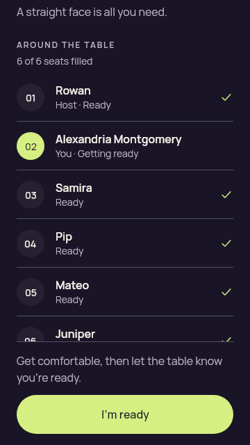</a> <code>lobby-guest-phone-roster.png</code> lobby-guest-phone-roster | 360 × 640 px · 31,322 bytes SHA-256: <code>91b14f011bd98c9404e63928405ef8f2bf9a9aa111e19ade88a94e605aad03b4</code> Source: <code>/root/projects/PartyDeck/artifacts/evidence-storage/34503251315/android-jvm-reports/composeApp/build/ui-snapshots/lobby-guest-phone-roster.png</code> | **Exact published-byte match**. Exact PNG bytes match the previously published original first-batch/compose/lobby-guest-phone-roster.png. Its prior pixel observation is reused while this source/scenario/capture identity remains separate. [Reviewed matching original](../../first-batch/compose/lobby-guest-phone-roster.png); original capture identity remains separate. |
| <a href="lobby-guest-phone.png">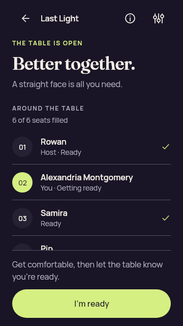</a> <code>lobby-guest-phone.png</code> lobby-guest-phone | 360 × 640 px · 32,491 bytes SHA-256: <code>96c7634ec0d7836650346e3ee380a92edd85d934a45a77cae41b87269af5e65d</code> Source: <code>/root/projects/PartyDeck/artifacts/evidence-storage/34503251315/android-jvm-reports/composeApp/build/ui-snapshots/lobby-guest-phone.png</code> | **Exact published-byte match**. Exact PNG bytes match the previously published original first-batch/compose/lobby-guest-phone.png. Its prior pixel observation is reused while this source/scenario/capture identity remains separate. [Reviewed matching original](../../first-batch/compose/lobby-guest-phone.png); original capture identity remains separate. |
|  <code>lobby-host-large-text-action.png</code> lobby-host-large-text-action | 320 × 740 px · 33,865 bytes SHA-256: <code>3a30b86526133a287be9be88c877866a04b6aed53fd2b5824a05b9fba9a80744</code> Source: <code>/root/projects/PartyDeck/artifacts/evidence-storage/34503251315/android-jvm-reports/composeApp/build/ui-snapshots/lobby-host-large-text-action.png</code> | **Exact published-byte match**. Exact PNG bytes match the previously published original first-batch/compose/lobby-host-large-text-action.png. Its prior pixel observation is reused while this source/scenario/capture identity remains separate. [Reviewed matching original](../../first-batch/compose/lobby-host-large-text-action.png); original capture identity remains separate. |
|  <code>lobby-host-large-text-roster.png</code> lobby-host-large-text-roster | 320 × 740 px · 34,777 bytes SHA-256: <code>cae3a7e483ee2a9636d19fc556b3e478d657d0d38797c9c54aea42e59dc04918</code> Source: <code>/root/projects/PartyDeck/artifacts/evidence-storage/34503251315/android-jvm-reports/composeApp/build/ui-snapshots/lobby-host-large-text-roster.png</code> | **Exact published-byte match**. Exact PNG bytes match the previously published original first-batch/compose/lobby-host-large-text-roster.png. Its prior pixel observation is reused while this source/scenario/capture identity remains separate. [Reviewed matching original](../../first-batch/compose/lobby-host-large-text-roster.png); original capture identity remains separate. |
| <a href="lobby-host-large-text.png">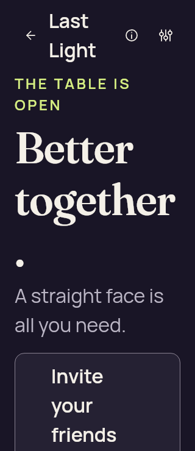</a> <code>lobby-host-large-text.png</code> lobby-host-large-text | 320 × 740 px · 27,932 bytes SHA-256: <code>3e0a36f88a2e31fb662db8813035812835b56784c7573123128c39e3f066d804</code> Source: <code>/root/projects/PartyDeck/artifacts/evidence-storage/34503251315/android-jvm-reports/composeApp/build/ui-snapshots/lobby-host-large-text.png</code> | **Exact published-byte match**. Exact PNG bytes match the previously published original first-batch/compose/lobby-host-large-text.png. Its prior pixel observation is reused while this source/scenario/capture identity remains separate. [Reviewed matching original](../../first-batch/compose/lobby-host-large-text.png); original capture identity remains separate. |
| <a href="lobby-host-phone-action.png">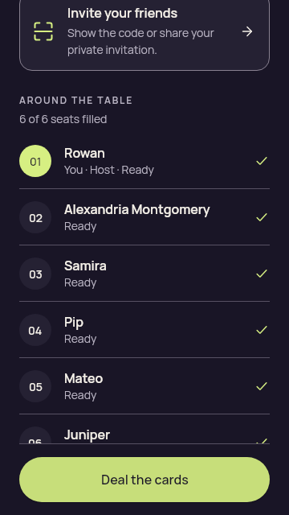</a> <code>lobby-host-phone-action.png</code> lobby-host-phone-action | 360 × 640 px · 30,524 bytes SHA-256: <code>96c7119a43592bb80c502afb8a04cfc775773310c1d4cab201ef9535b827b256</code> Source: <code>/root/projects/PartyDeck/artifacts/evidence-storage/34503251315/android-jvm-reports/composeApp/build/ui-snapshots/lobby-host-phone-action.png</code> | **Exact published-byte match**. Exact PNG bytes match the previously published original first-batch/compose/lobby-host-phone-action.png. Its prior pixel observation is reused while this source/scenario/capture identity remains separate. [Reviewed matching original](../../first-batch/compose/lobby-host-phone-action.png); original capture identity remains separate. |
|  <code>lobby-host-phone-roster.png</code> lobby-host-phone-roster | 360 × 640 px · 30,260 bytes SHA-256: <code>522b1669842a2d19b926dbcfbcb7ba6282af3ac5b8f9fa9fdbf66ea9c5f49682</code> Source: <code>/root/projects/PartyDeck/artifacts/evidence-storage/34503251315/android-jvm-reports/composeApp/build/ui-snapshots/lobby-host-phone-roster.png</code> | **Exact published-byte match**. Exact PNG bytes match the previously published original first-batch/compose/lobby-host-phone-roster.png. Its prior pixel observation is reused while this source/scenario/capture identity remains separate. [Reviewed matching original](../../first-batch/compose/lobby-host-phone-roster.png); original capture identity remains separate. |
|  <code>lobby-host-phone.png</code> lobby-host-phone | 360 × 640 px · 32,611 bytes SHA-256: <code>62b8ff3cb746321051cc0295fa916ed962645f5370b5f9b83293842a4527d927</code> Source: <code>/root/projects/PartyDeck/artifacts/evidence-storage/34503251315/android-jvm-reports/composeApp/build/ui-snapshots/lobby-host-phone.png</code> | **Exact published-byte match**. Exact PNG bytes match the previously published original first-batch/compose/lobby-host-phone.png. Its prior pixel observation is reused while this source/scenario/capture identity remains separate. [Reviewed matching original](../../first-batch/compose/lobby-host-phone.png); original capture identity remains separate. |
|  <code>paused-host-return-large-text.png</code> paused-host-return-large-text | 320 × 732 px · 37,167 bytes SHA-256: <code>c290ee19b41a269c6a86a8a6198172ab26d94d2acdc056cf73b899be32e4121f</code> Source: <code>/root/projects/PartyDeck/artifacts/evidence-storage/34503251315/android-jvm-reports/composeApp/build/ui-snapshots/paused-host-return-large-text.png</code> | **Exact published-byte match**. Exact PNG bytes match the previously published original first-batch/compose/paused-host-return-large-text.png. Its prior pixel observation is reused while this source/scenario/capture identity remains separate. [Reviewed matching original](../../first-batch/compose/paused-host-return-large-text.png); original capture identity remains separate. |
|  <code>fallback-concealed-large-text.png</code> fallback-concealed-large-text | 320 × 740 px · 41,388 bytes SHA-256: <code>12347fa731153e191e327d17c0a5c2721f08d11808d1fa8983dfce3887f9e183</code> Source: <code>/root/projects/PartyDeck/artifacts/evidence-storage/34503251315/android-jvm-reports/composeApp/build/ui-snapshots/presentation-1789058539652/fallback-concealed-large-text.png</code> | **Exact published-byte match**. Exact PNG bytes match the previously published original compose-presentation-controls-20260910/iteration-01/screenshots/fallback-concealed-large-text.png. Its prior pixel observation is reused while this source/scenario/capture identity remains separate. [Reviewed matching original](../../compose-presentation-controls-20260910/iteration-01/screenshots/fallback-concealed-large-text.png); original capture identity remains separate. |
|  <code>opening-large-text.png</code> opening-large-text | 320 × 740 px · 31,278 bytes SHA-256: <code>80ecde376374f864b361d321917d597dee02a2331f0c8d90f03eaabbf82023e8</code> Source: <code>/root/projects/PartyDeck/artifacts/evidence-storage/34503251315/android-jvm-reports/composeApp/build/ui-snapshots/presentation-1789058539652/opening-large-text.png</code> | **Exact published-byte match**. Exact PNG bytes match the previously published original android-34496267571/compose-jvm/presentation-1789054611260/opening-large-text.png. Its prior pixel observation is reused while this source/scenario/capture identity remains separate. [Reviewed matching original](../../android-34496267571/compose-jvm/presentation-1789054611260/opening-large-text.png); original capture identity remains separate. |
| <a href="picker-three-available-large-text.png">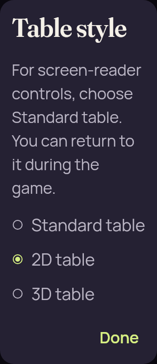</a> <code>picker-three-available-large-text.png</code> picker-three-available-large-text | 320 × 740 px · 35,231 bytes SHA-256: <code>2ac10590f102dd755d2d2a7f3b96db84b5db8db339a9fc76f66aeff94176556d</code> Source: <code>/root/projects/PartyDeck/artifacts/evidence-storage/34503251315/android-jvm-reports/composeApp/build/ui-snapshots/presentation-1789058539652/picker-three-available-large-text.png</code> | **Exact published-byte match**. Exact PNG bytes match the previously published original android-34496267571/compose-jvm/presentation-1789054611260/picker-three-available-large-text.png. Its prior pixel observation is reused while this source/scenario/capture identity remains separate. [Reviewed matching original](../../android-34496267571/compose-jvm/presentation-1789054611260/picker-three-available-large-text.png); original capture identity remains separate. |
|  <code>picker-two-available-large-text.png</code> picker-two-available-large-text | 320 × 740 px · 36,821 bytes SHA-256: <code>b48bd70894b6051980603e783a36f89cefe8a47deb198360b31fe53dff4ee97b</code> Source: <code>/root/projects/PartyDeck/artifacts/evidence-storage/34503251315/android-jvm-reports/composeApp/build/ui-snapshots/presentation-1789058539652/picker-two-available-large-text.png</code> | **Exact published-byte match**. Exact PNG bytes match the previously published original android-34496267571/compose-jvm/presentation-1789054611260/picker-two-available-large-text.png. Its prior pixel observation is reused while this source/scenario/capture identity remains separate. [Reviewed matching original](../../android-34496267571/compose-jvm/presentation-1789054611260/picker-two-available-large-text.png); original capture identity remains separate. |
|  <code>settings-large-text-motion.png</code> settings-large-text-motion | 320 × 740 px · 41,512 bytes SHA-256: <code>20576001c65f4646c75a221ce1fbe1a0a4acc9057dec2f3877ffd525fb4a478c</code> Source: <code>/root/projects/PartyDeck/artifacts/evidence-storage/34503251315/android-jvm-reports/composeApp/build/ui-snapshots/settings-large-text-motion.png</code> | **Exact published-byte match**. Exact PNG bytes match the previously published original first-batch/compose/settings-large-text-motion.png. Its prior pixel observation is reused while this source/scenario/capture identity remains separate. [Reviewed matching original](../../first-batch/compose/settings-large-text-motion.png); original capture identity remains separate. |
|  <code>settings-large-text.png</code> settings-large-text | 320 × 740 px · 40,579 bytes SHA-256: <code>eb837f23b096b20059c073d85740a687a15547c464b248099dc7d7ce64602cf5</code> Source: <code>/root/projects/PartyDeck/artifacts/evidence-storage/34503251315/android-jvm-reports/composeApp/build/ui-snapshots/settings-large-text.png</code> | **Exact published-byte match**. Exact PNG bytes match the previously published original first-batch/compose/settings-large-text.png. Its prior pixel observation is reused while this source/scenario/capture identity remains separate. [Reviewed matching original](../../first-batch/compose/settings-large-text.png); original capture identity remains separate. |
