# API 35 ordinary UI — debug

[All collections](../../README.md) · [Preserved evidence index](../evidence-index.md) · [Copy/review binding](../provenance/publication-review/partydeck-gallery-2815-publication-binding-v1.json) · [Completed visual review](../provenance/publication-review/partydeck-gallery-after-2355-api35-visual-review-v1.json) · [Unchanged source mapping](../provenance/source-map/capture-gallery-mapping.json)

**Original ordinary UI smoke passed. Visual review adds no native gameplay or accessibility outcome.**

Original 720 × 1600 captures; named enlarged-text frames and the final Home frame use font scale 2.0.

Both ordinary debug and optimized smokes pass. Native debug passes 21 checks, including two guarded renderer-death checks; optimized passes 19 checks and explicitly skips the two renderer-death checks. Engine gameplay was not invoked. The frozen independent review records 262 JUnit tests in 41 suites with no failures/errors/skips, 155 passing host tests and 11 lint warnings. These results add no TalkBack or continuous-privacy acceptance.

Normal Standard hands and selection/actions fit. Several Round 1 reveal labels clip at a public-panel edge. Native old-PCK 2D initial Reveal fits narrowly while the cover bottom clips; 3D seats scroll horizontally. The optimized no-claim round-1 result fits the full Return to lobby action. The debug round-2 claim plus previous-round-review state continues below the body. Enlarged intermediate hand, Rules and Settings content requires scrolling; scrolled Play/Challenge and Rules → Practice fit. The enlarged debug invalid-Join button crosses the right viewport edge while the optimized counterpart fits. The optimized original named large-text-rules-practice-entered.png visibly shows a round result. Sequential PNG/XML are not atomic.

Source revision: `1cd34a36753ed0112e6684f6525592dab8ef2edb`. CI run: [34503251315](https://github.com/Apdelrahman1911/PartyDeck/actions/runs/34503251315). 31 original PNG identities. Review methods: 18 direct original view, 12 exact published-byte match, 1 exact same-batch match.

Every thumbnail opens the unchanged original PNG. Original filenames, dimensions, source paths and outcomes remain separate even when pixels match. No derivative image was created. Frozen provenance pages retain their original text and source references.

| Original capture | Original identity and evidence | Visual observation |
| --- | --- | --- |
| <a href="final-screen.png">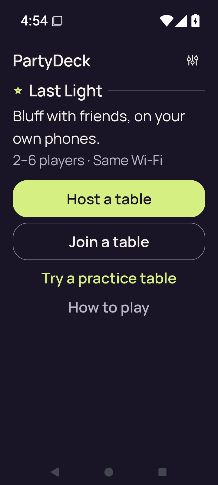</a> <code>final-screen.png</code> final-screen | 720 × 1600 px · 79,602 bytes · text 2.0 SHA-256: <code>8312a8d435df072bc04bbd3058b8e70ab46787222722e07cf5ef8df300dd5982</code> Source: <code>/root/projects/PartyDeck/artifacts/evidence-storage/34503251315/android-jvm-reports/build/ci/android/debug/final-screen.png</code> [UI XML](last-ui.xml) · [Capture/result JSON](smoke-result.json) · [Original result](smoke-result.json) | **Direct original view**. At the recorded enlarged-text final Home state, PartyDeck/Last Light and the introductory copy are readable. Host, Join, Try a practice table, How to play, and Settings are fully visible with ample separation. |
|  <code>home.png</code> home | 720 × 1600 px · 129,561 bytes · text 1.0 SHA-256: <code>19fbfad8d0d5b93b9ee06d5edc246d2a3967e90bec62ed63bfd63020b0671c7c</code> Source: <code>/root/projects/PartyDeck/artifacts/evidence-storage/34503251315/android-jvm-reports/build/ci/android/debug/home.png</code> [UI XML](home.xml) · [Capture/result JSON](smoke-result.json) · [Original result](smoke-result.json) | **Exact published-byte match**. Exact PNG bytes match the previously published original android-34432935952/debug/home.png. Its prior pixel observation is reused while this source/scenario/capture identity remains separate. [Reviewed matching original](../../android-34432935952/debug/home.png); original capture identity remains separate. |
|  <code>host-after-share.png</code> host-after-share | 720 × 1600 px · 99,104 bytes · text 1.0 SHA-256: <code>26ba3084fdb294dd94d7784e1394c842a8b8f5ca7f9d24d92c095c437b5493d2</code> Source: <code>/root/projects/PartyDeck/artifacts/evidence-storage/34503251315/android-jvm-reports/build/ci/android/debug/host-after-share.png</code> [UI XML](host-after-share.xml) · [Capture/result JSON](smoke-result.json) · [Original result](smoke-result.json) | **Exact published-byte match**. Exact PNG bytes match the previously published original android-34432935952/debug/host-after-share.png. Its prior pixel observation is reused while this source/scenario/capture identity remains separate. [Reviewed matching original](../../android-34432935952/debug/host-after-share.png); original capture identity remains separate. |
|  <code>host-lobby.png</code> host-lobby | 720 × 1600 px · 99,104 bytes · text 1.0 SHA-256: <code>26ba3084fdb294dd94d7784e1394c842a8b8f5ca7f9d24d92c095c437b5493d2</code> Source: <code>/root/projects/PartyDeck/artifacts/evidence-storage/34503251315/android-jvm-reports/build/ci/android/debug/host-lobby.png</code> [UI XML](host-lobby.xml) · [Capture/result JSON](smoke-result.json) · [Original result](smoke-result.json) | **Exact published-byte match**. Exact PNG bytes match the previously published original android-34432935952/debug/host-after-share.png. Its prior pixel observation is reused while this source/scenario/capture identity remains separate. [Reviewed matching original](../../android-34432935952/debug/host-after-share.png); original capture identity remains separate. |
|  <code>host-returned-home.png</code> host-returned-home | 720 × 1600 px · 129,561 bytes · text 1.0 SHA-256: <code>19fbfad8d0d5b93b9ee06d5edc246d2a3967e90bec62ed63bfd63020b0671c7c</code> Source: <code>/root/projects/PartyDeck/artifacts/evidence-storage/34503251315/android-jvm-reports/build/ci/android/debug/host-returned-home.png</code> [UI XML](host-returned-home.xml) · [Capture/result JSON](smoke-result.json) · [Original result](smoke-result.json) | **Exact published-byte match**. Exact PNG bytes match the previously published original android-34432935952/debug/home.png. Its prior pixel observation is reused while this source/scenario/capture identity remains separate. [Reviewed matching original](../../android-34432935952/debug/home.png); original capture identity remains separate. |
|  <code>join-invalid.png</code> join-invalid | 720 × 1600 px · 93,385 bytes · text 1.0 SHA-256: <code>34465ad4e7fd80c856e310b8529a0df9afcc5557bfc4de071e2704bfe8ec3a7f</code> Source: <code>/root/projects/PartyDeck/artifacts/evidence-storage/34503251315/android-jvm-reports/build/ci/android/debug/join-invalid.png</code> [UI XML](join-invalid.xml) · [Capture/result JSON](smoke-result.json) · [Original result](smoke-result.json) | **Exact published-byte match**. Exact PNG bytes match the previously published original android-34432935952/debug/join-invalid.png. Its prior pixel observation is reused while this source/scenario/capture identity remains separate. [Reviewed matching original](../../android-34432935952/debug/join-invalid.png); original capture identity remains separate. |
| <a href="join-name-soft-ime.png">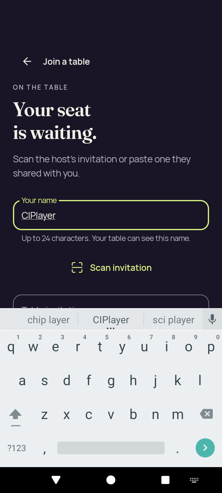</a> <code>join-name-soft-ime.png</code> join-name-soft-ime | 720 × 1600 px · 98,296 bytes · text 1.0 SHA-256: <code>38ca991be5178e3c4f75d411418842e67850ac129b8dde036f994ffdf8bafd6f</code> Source: <code>/root/projects/PartyDeck/artifacts/evidence-storage/34503251315/android-jvm-reports/build/ci/android/debug/join-name-soft-ime.png</code> [UI XML](join-name-soft-ime.xml) · [Capture/result JSON](smoke-result.json) · [Original result](smoke-result.json) | **Direct original view**. The Join page keeps its heading, name field, name guidance and Scan invitation readable above the open keyboard. The invitation field begins at the keyboard edge and lower content is outside the captured visible area. |
|  <code>large-text-home-actions.png</code> large-text-home-actions | 720 × 1600 px · 81,701 bytes · text 2.0 SHA-256: <code>58e28adc453ae5c637625683a6159139ed75fee0217920ea963a507b97ffb7c0</code> Source: <code>/root/projects/PartyDeck/artifacts/evidence-storage/34503251315/android-jvm-reports/build/ci/android/debug/large-text-home-actions.png</code> [UI XML](large-text-home-actions.xml) · [Capture/result JSON](smoke-result.json) · [Original result](smoke-result.json) | **Direct original view**. The enlarged Home retains complete Host and Join buttons plus full Practice, How to play and Settings controls. The multi-line introduction and player/network line are readable. |
| <a href="large-text-join-invalid.png">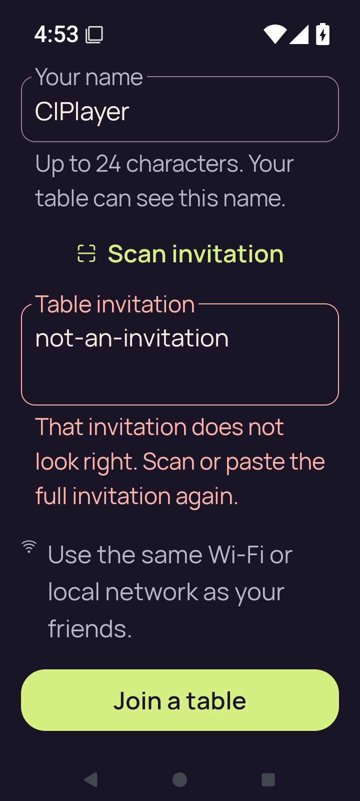</a> <code>large-text-join-invalid.png</code> large-text-join-invalid | 720 × 1600 px · 114,629 bytes · text 2.0 SHA-256: <code>2fa540af7e70626238da918a52a7a0e39699767eb5f4aeaea0688d6800b5f627</code> Source: <code>/root/projects/PartyDeck/artifacts/evidence-storage/34503251315/android-jvm-reports/build/ci/android/debug/large-text-join-invalid.png</code> [UI XML](large-text-join-invalid.xml) · [Capture/result JSON](smoke-result.json) · [Original result](smoke-result.json) | **Direct original view**. The scrolled enlarged Join state shows the complete invalid-invitation explanation and same-network guidance. The bottom Join label is readable, but the button&#x27;s right edge extends beyond the captured viewport; the page heading is above the current scroll position. |
| <a href="large-text-join-name-soft-ime.png">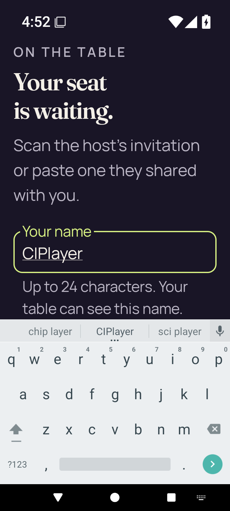</a> <code>large-text-join-name-soft-ime.png</code> large-text-join-name-soft-ime | 720 × 1600 px · 123,400 bytes · text 2.0 SHA-256: <code>57b74da3a519a9c88e00b803d2521e4fd6588d450d365970b29e7347d2719758</code> Source: <code>/root/projects/PartyDeck/artifacts/evidence-storage/34503251315/android-jvm-reports/build/ci/android/debug/large-text-join-name-soft-ime.png</code> [UI XML](large-text-join-name-soft-ime.xml) · [Capture/result JSON](smoke-result.json) · [Original result](smoke-result.json) | **Direct original view**. The enlarged Join heading, explanatory copy, full focused name field and wrapped name guidance remain visible above the keyboard. Scan/invitation controls are beyond the current visible area. |
| <a href="large-text-play-action.png">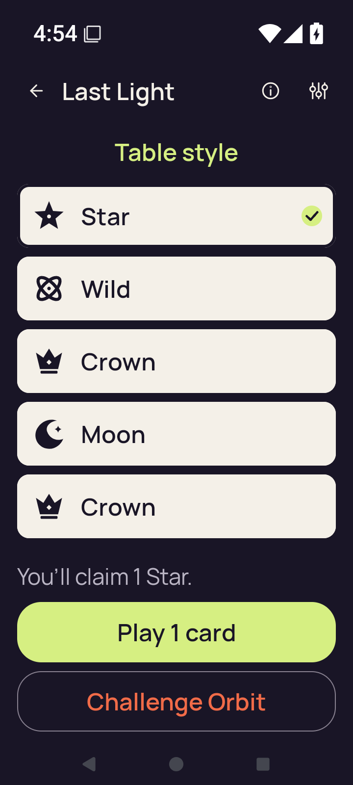</a> <code>large-text-play-action.png</code> large-text-play-action | 720 × 1600 px · 84,423 bytes · text 2.0 SHA-256: <code>52923ffa60f1c23db8dcf6247fd72ac2c334890c0fccfa2598fd820289a9b40c</code> Source: <code>/root/projects/PartyDeck/artifacts/evidence-storage/34503251315/android-jvm-reports/build/ci/android/debug/large-text-play-action.png</code> [UI XML](large-text-play-action.xml) · [Capture/result JSON](smoke-result.json) · [Original result](smoke-result.json) | **Direct original view**. In the scrolled enlarged hand, all five rank labels are readable and Star has a clear selected check. You&#x27;ll claim 1 Star, the complete Play 1 card button, and the complete Challenge Orbit button fit below. |
| <a href="large-text-private-hand.png">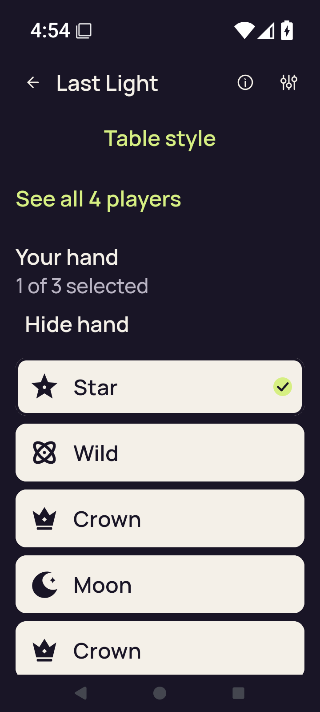</a> <code>large-text-private-hand.png</code> large-text-private-hand | 720 × 1600 px · 81,801 bytes · text 2.0 SHA-256: <code>9c3b2e659280e4537951f97f580ce5593d32dfe8390add1c19b9d359a6f40d59</code> Source: <code>/root/projects/PartyDeck/artifacts/evidence-storage/34503251315/android-jvm-reports/build/ci/android/debug/large-text-private-hand.png</code> [UI XML](large-text-private-hand.xml) · [Capture/result JSON](smoke-result.json) · [Original result](smoke-result.json) | **Direct original view**. The enlarged hand shows 1 of 3 selected and Hide hand above the five rank rows. The last Crown panel is cut at the lower viewport edge, though its rank label remains readable; lower action content requires further scrolling. |
| <a href="large-text-rules-intro.png">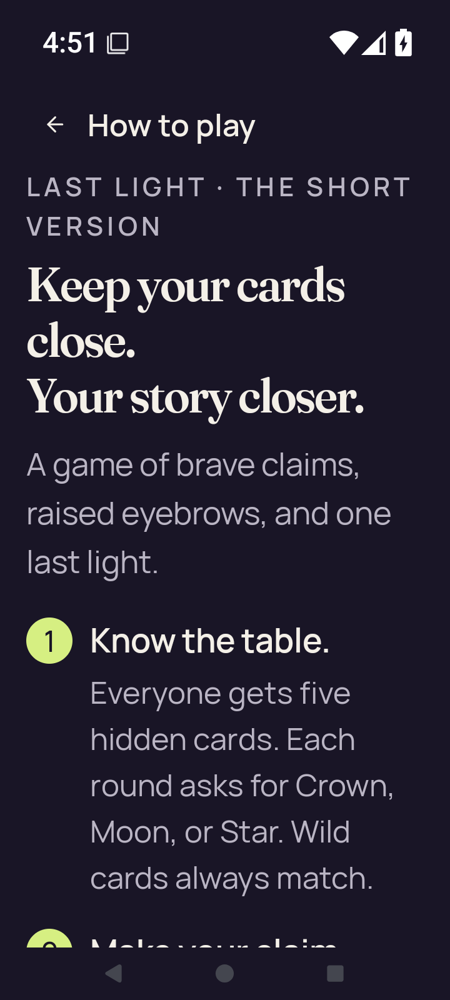</a> <code>large-text-rules-intro.png</code> large-text-rules-intro | 720 × 1600 px · 135,699 bytes · text 2.0 SHA-256: <code>9ab9259e14c4255d683788339f513526ba7f98c983b587a796174e88a1ce66c8</code> Source: <code>/root/projects/PartyDeck/artifacts/evidence-storage/34503251315/android-jvm-reports/build/ci/android/debug/large-text-rules-intro.png</code> [UI XML](large-text-rules-intro.xml) · [Capture/result JSON](smoke-result.json) · [Original result](smoke-result.json) | **Direct original view**. The enlarged Rules title, introductory message and full first rule are readable. The beginning of step 2 is clipped at the bottom, indicating continuation below this scroll position. |
| <a href="large-text-rules-last-step.png">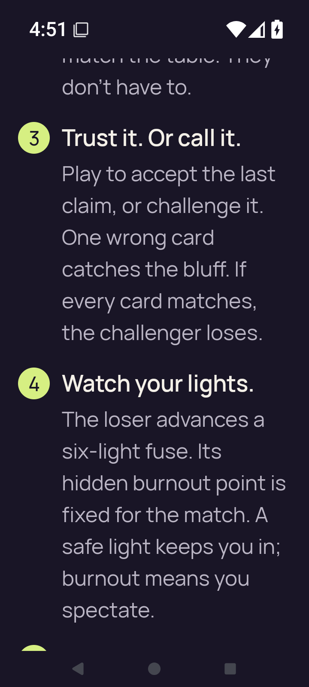</a> <code>large-text-rules-last-step.png</code> large-text-rules-last-step | 720 × 1600 px · 141,680 bytes · text 2.0 SHA-256: <code>fc96e07d192330b9d0325b2456867a8979a244fe35db9c9c795fa285b7ededab</code> Source: <code>/root/projects/PartyDeck/artifacts/evidence-storage/34503251315/android-jvm-reports/build/ci/android/debug/large-text-rules-last-step.png</code> [UI XML](large-text-rules-last-step.xml) · [Capture/result JSON](smoke-result.json) · [Original result](smoke-result.json) | **Direct original view**. The enlarged Rules view fully shows steps 3 and 4. The preceding paragraph is clipped above and the next step starts below the bottom edge; this is an intermediate scroll position. |
| <a href="large-text-rules-practice-action.png">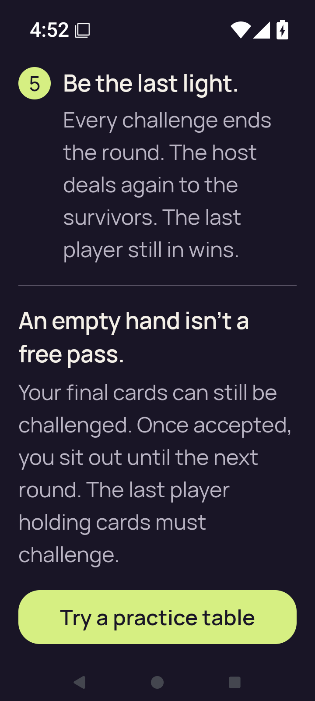</a> <code>large-text-rules-practice-action.png</code> large-text-rules-practice-action | 720 × 1600 px · 124,641 bytes · text 2.0 SHA-256: <code>315a931fcac1b6a89b73a0521e04700dea707f5183e6aa365a76c254c393a9a6</code> Source: <code>/root/projects/PartyDeck/artifacts/evidence-storage/34503251315/android-jvm-reports/build/ci/android/debug/large-text-rules-practice-action.png</code> [UI XML](large-text-rules-practice-action.xml) · [Capture/result JSON](smoke-result.json) · [Original result](smoke-result.json) | **Direct original view**. The final enlarged rule and empty-hand explanation are readable. The complete Try a practice table label and rounded button fit with clearance above system navigation. |
| <a href="large-text-rules-practice-entered.png">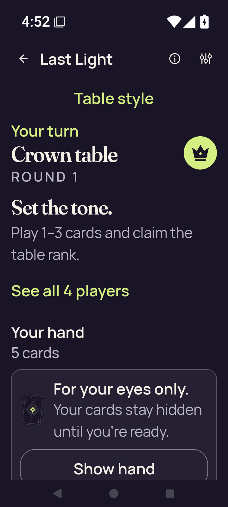</a> <code>large-text-rules-practice-entered.png</code> large-text-rules-practice-entered | 720 × 1600 px · 122,904 bytes · text 2.0 SHA-256: <code>4a7c9acf8c5b368f504060bf051a96163109b28aadcbad1f69c2e1a0eb338b4b</code> Source: <code>/root/projects/PartyDeck/artifacts/evidence-storage/34503251315/android-jvm-reports/build/ci/android/debug/large-text-rules-practice-entered.png</code> [UI XML](large-text-rules-practice-entered.xml) · [Capture/result JSON](smoke-result.json) · [Original result](smoke-result.json) | **Direct original view**. The enlarged practice entry shows Your turn, Crown table, round 1, opening guidance and the covered-hand copy. The Show hand label is readable but its lower button border is cut by the body edge; subsequent actions lie below. |
| <a href="large-text-rules-returned-home.png">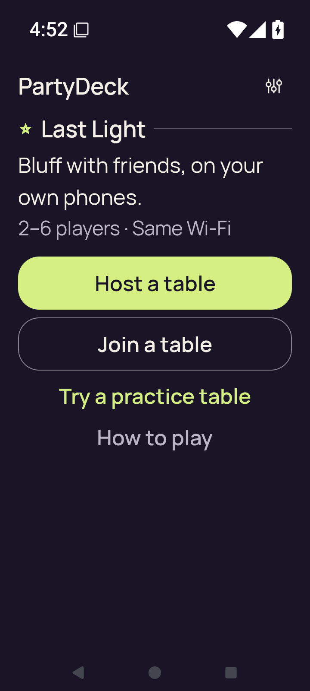</a> <code>large-text-rules-returned-home.png</code> large-text-rules-returned-home | 720 × 1600 px · 80,441 bytes · text 2.0 SHA-256: <code>8d8d8470e9e3a6a270e68b0b63f9416827f4b32a6baa646a01beaaa7fc3c8782</code> Source: <code>/root/projects/PartyDeck/artifacts/evidence-storage/34503251315/android-jvm-reports/build/ci/android/debug/large-text-rules-returned-home.png</code> [UI XML](large-text-rules-returned-home.xml) · [Capture/result JSON](smoke-result.json) · [Original result](smoke-result.json) | **Direct original view**. Returned enlarged Home shows full introductory copy and all Host, Join, Practice, How to play and Settings actions. |
| <a href="large-text-settings.png">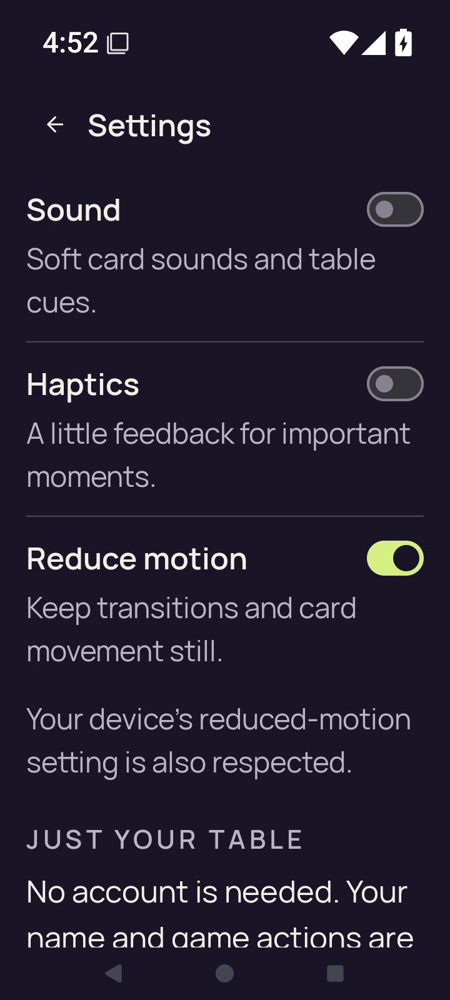</a> <code>large-text-settings.png</code> large-text-settings | 720 × 1600 px · 122,188 bytes · text 2.0 SHA-256: <code>57650fc285f9f2920551d92f1dc068303f9137f0b15016154810c9343774610f</code> Source: <code>/root/projects/PartyDeck/artifacts/evidence-storage/34503251315/android-jvm-reports/build/ci/android/debug/large-text-settings.png</code> [UI XML](large-text-settings.xml) · [Capture/result JSON](smoke-result.json) · [Original result](smoke-result.json) | **Direct original view**. Enlarged Settings shows full Sound, Haptics and Reduce motion controls with readable explanatory copy. The Just your table section starts below; its lower paragraph is clipped at the viewport edge. |
| <a href="practice-after-play.png">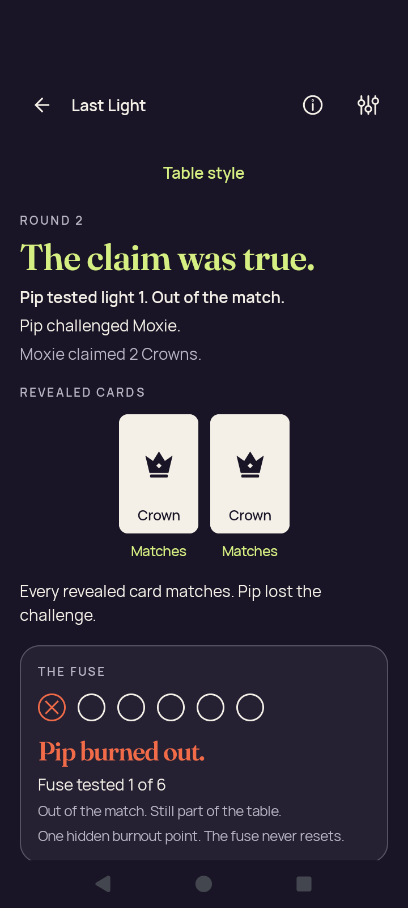</a> <code>practice-after-play.png</code> practice-after-play | 720 × 1600 px · 99,557 bytes · text 1.0 SHA-256: <code>f5bd46b95f000885fc015ec631b11feebdc4f4cf82a6760c63375188df04eafb</code> Source: <code>/root/projects/PartyDeck/artifacts/evidence-storage/34503251315/android-jvm-reports/build/ci/android/debug/practice-after-play.png</code> [UI XML](practice-after-play.xml) · [Capture/result JSON](smoke-result.json) · [Original result](smoke-result.json) | **Direct original view**. The normal-text result clearly names Pip challenging Moxie, the true two-Crown claim, both matching Crown cards, and Pip&#x27;s burnout/fuse status. The continuation action is outside this captured scroll position. |
|  <code>practice-concealed.png</code> practice-concealed | 720 × 1600 px · 120,129 bytes · text 1.0 SHA-256: <code>e8bef6d97ff88f37bc4fd0a3d7b1593b2ce39ad304049ed928fb56e1f4fb26fc</code> Source: <code>/root/projects/PartyDeck/artifacts/evidence-storage/34503251315/android-jvm-reports/build/ci/android/debug/practice-concealed.png</code> [UI XML](practice-concealed.xml) · [Capture/result JSON](smoke-result.json) · [Original result](smoke-result.json) | **Direct original view**. Normal Standard play preserves Your turn, Crown table, latest Orbit claim, and visible player summaries. The covered hand, Show hand and lower Select cards/Challenge Orbit controls are complete. Round 1 reveal is partly clipped at the public-panel boundary. |
| <a href="practice-resumed-concealed.png">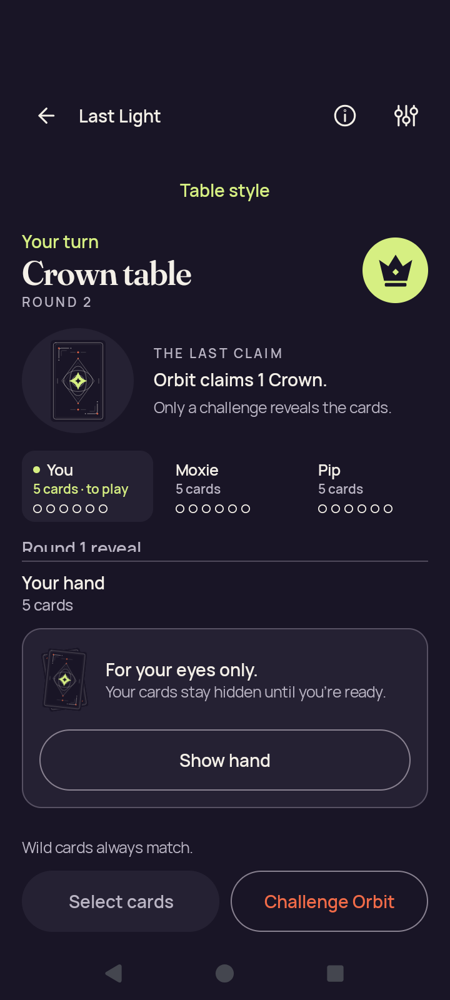</a> <code>practice-resumed-concealed.png</code> practice-resumed-concealed | 720 × 1600 px · 120,129 bytes · text 1.0 SHA-256: <code>e8bef6d97ff88f37bc4fd0a3d7b1593b2ce39ad304049ed928fb56e1f4fb26fc</code> Source: <code>/root/projects/PartyDeck/artifacts/evidence-storage/34503251315/android-jvm-reports/build/ci/android/debug/practice-resumed-concealed.png</code> [UI XML](practice-resumed-concealed.xml) · [Capture/result JSON](smoke-result.json) · [Original result](smoke-result.json) | **Exact same-batch match**. Exact bytes match separately retained capture 19. Reused pixel observation: Normal Standard play preserves Your turn, Crown table, latest Orbit claim, and visible player summaries. The covered hand, Show hand and lower Select cards/Challenge Orbit controls are complete. Round 1 reveal is partly clipped at the public-panel boundary. [Reviewed matching original](practice-concealed.png); original capture identity remains separate. |
|  <code>practice-returned-home.png</code> practice-returned-home | 720 × 1600 px · 129,561 bytes · text 1.0 SHA-256: <code>19fbfad8d0d5b93b9ee06d5edc246d2a3967e90bec62ed63bfd63020b0671c7c</code> Source: <code>/root/projects/PartyDeck/artifacts/evidence-storage/34503251315/android-jvm-reports/build/ci/android/debug/practice-returned-home.png</code> [UI XML](practice-returned-home.xml) · [Capture/result JSON](smoke-result.json) · [Original result](smoke-result.json) | **Exact published-byte match**. Exact PNG bytes match the previously published original android-34432935952/debug/home.png. Its prior pixel observation is reused while this source/scenario/capture identity remains separate. [Reviewed matching original](../../android-34432935952/debug/home.png); original capture identity remains separate. |
| <a href="practice-selected.png">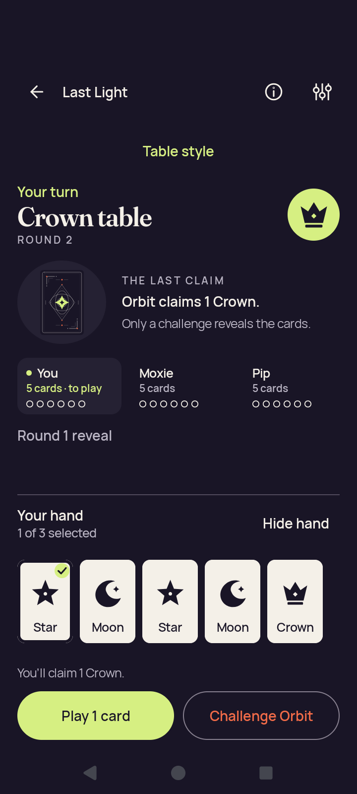</a> <code>practice-selected.png</code> practice-selected | 720 × 1600 px · 116,924 bytes · text 1.0 SHA-256: <code>b45a4d25772824e180d9d5535c0e1ac77f717dc3a0f5727d2fe0ead839ab2b9f</code> Source: <code>/root/projects/PartyDeck/artifacts/evidence-storage/34503251315/android-jvm-reports/build/ci/android/debug/practice-selected.png</code> [UI XML](practice-selected.xml) · [Capture/result JSON](smoke-result.json) · [Original result](smoke-result.json) | **Direct original view**. The normal revealed hand has five complete rank cards and a clear first-Star selection check. 1 of 3 selected, You&#x27;ll claim 1 Crown, Play 1 card and Challenge Orbit are readable; turn, rank and latest claim stay visible above. |
|  <code>rules-intro.png</code> rules-intro | 720 × 1600 px · 148,019 bytes · text 1.0 SHA-256: <code>f653c9b7e52c935e1993adeb056a6fb613b32572d0254b3486d36245adf059b1</code> Source: <code>/root/projects/PartyDeck/artifacts/evidence-storage/34503251315/android-jvm-reports/build/ci/android/debug/rules-intro.png</code> [UI XML](rules-intro.xml) · [Capture/result JSON](smoke-result.json) · [Original result](smoke-result.json) | **Exact published-byte match**. Exact PNG bytes match the previously published original android-34432935952/debug/rules-intro.png. Its prior pixel observation is reused while this source/scenario/capture identity remains separate. [Reviewed matching original](../../android-34432935952/debug/rules-intro.png); original capture identity remains separate. |
| <a href="rules-last-step.png">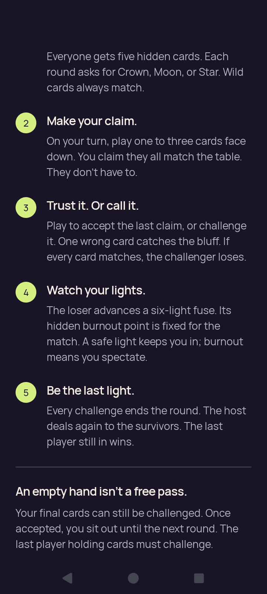</a> <code>rules-last-step.png</code> rules-last-step | 720 × 1600 px · 153,570 bytes · text 1.0 SHA-256: <code>3089a467916409aeeae209b8d892d33198136778dfe84488b92b76053c2ea446</code> Source: <code>/root/projects/PartyDeck/artifacts/evidence-storage/34503251315/android-jvm-reports/build/ci/android/debug/rules-last-step.png</code> [UI XML](rules-last-step.xml) · [Capture/result JSON](smoke-result.json) · [Original result](smoke-result.json) | **Direct original view**. Normal Rules shows steps 2–5 and the empty-hand explanation clearly. The first-rule heading and the separate Practice action lie outside this intermediate scroll position. |
|  <code>rules-practice-action.png</code> rules-practice-action | 720 × 1600 px · 140,860 bytes · text 1.0 SHA-256: <code>014fb3d0da6f3f8ca679ffd0f99a3d0f49bff0797fe120ccd7337ec9bca19057</code> Source: <code>/root/projects/PartyDeck/artifacts/evidence-storage/34503251315/android-jvm-reports/build/ci/android/debug/rules-practice-action.png</code> [UI XML](rules-practice-action.xml) · [Capture/result JSON](smoke-result.json) · [Original result](smoke-result.json) | **Exact published-byte match**. Exact PNG bytes match the previously published original android-34432935952/debug/rules-practice-action.png. Its prior pixel observation is reused while this source/scenario/capture identity remains separate. [Reviewed matching original](../../android-34432935952/debug/rules-practice-action.png); original capture identity remains separate. |
| <a href="rules-practice-entered.png">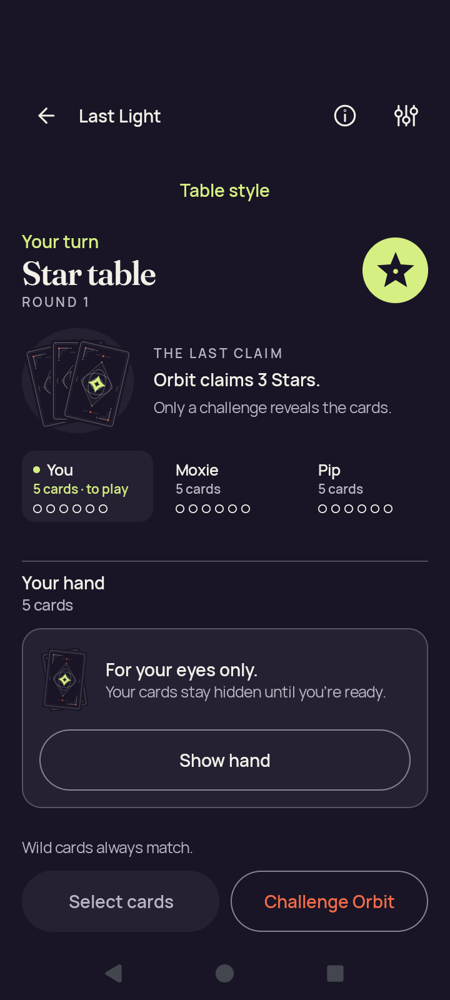</a> <code>rules-practice-entered.png</code> rules-practice-entered | 720 × 1600 px · 125,638 bytes · text 1.0 SHA-256: <code>0802bb5551012b1fac9101fb764f14d74a937846b1d5db0cad617dce3d49575f</code> Source: <code>/root/projects/PartyDeck/artifacts/evidence-storage/34503251315/android-jvm-reports/build/ci/android/debug/rules-practice-entered.png</code> [UI XML](rules-practice-entered.xml) · [Capture/result JSON](smoke-result.json) · [Original result](smoke-result.json) | **Direct original view**. Normal practice entry shows a Star table and Orbit&#x27;s three-Star claim, the covered-hand panel, full Show hand and both lower actions. All visible labels and card counts fit. |
|  <code>rules-returned-home.png</code> rules-returned-home | 720 × 1600 px · 129,561 bytes · text 1.0 SHA-256: <code>19fbfad8d0d5b93b9ee06d5edc246d2a3967e90bec62ed63bfd63020b0671c7c</code> Source: <code>/root/projects/PartyDeck/artifacts/evidence-storage/34503251315/android-jvm-reports/build/ci/android/debug/rules-returned-home.png</code> [UI XML](rules-returned-home.xml) · [Capture/result JSON](smoke-result.json) · [Original result](smoke-result.json) | **Exact published-byte match**. Exact PNG bytes match the previously published original android-34432935952/debug/home.png. Its prior pixel observation is reused while this source/scenario/capture identity remains separate. [Reviewed matching original](../../android-34432935952/debug/home.png); original capture identity remains separate. |
|  <code>settings-changed.png</code> settings-changed | 720 × 1600 px · 116,803 bytes · text 1.0 SHA-256: <code>312d72f0b7e2f74c2181dddfa0bdca4b2de0dc5c886248d53f07ce4de824aeb1</code> Source: <code>/root/projects/PartyDeck/artifacts/evidence-storage/34503251315/android-jvm-reports/build/ci/android/debug/settings-changed.png</code> [UI XML](settings-changed.xml) · [Capture/result JSON](smoke-result.json) · [Original result](smoke-result.json) | **Exact published-byte match**. Exact PNG bytes match the previously published original android-34432935952/debug/settings-changed.png. Its prior pixel observation is reused while this source/scenario/capture identity remains separate. [Reviewed matching original](../../android-34432935952/debug/settings-changed.png); original capture identity remains separate. |
| <a href="settings-persisted.png">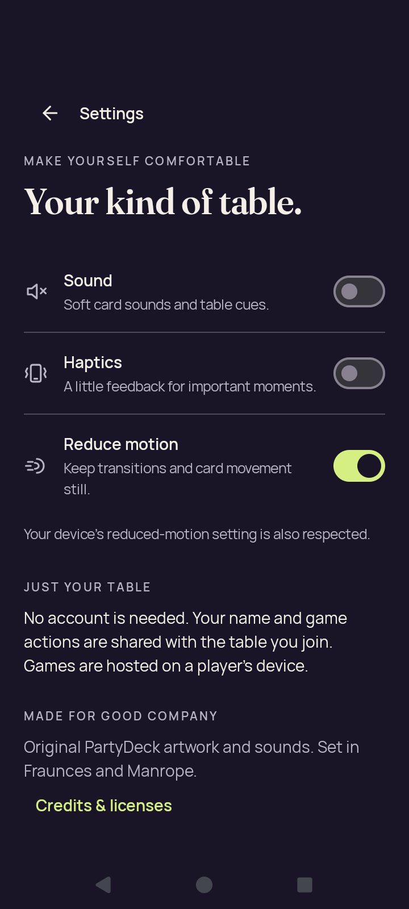</a> <code>settings-persisted.png</code> settings-persisted | 720 × 1600 px · 116,803 bytes · text 1.0 SHA-256: <code>312d72f0b7e2f74c2181dddfa0bdca4b2de0dc5c886248d53f07ce4de824aeb1</code> Source: <code>/root/projects/PartyDeck/artifacts/evidence-storage/34503251315/android-jvm-reports/build/ci/android/debug/settings-persisted.png</code> [UI XML](settings-persisted.xml) · [Capture/result JSON](smoke-result.json) · [Original result](smoke-result.json) | **Exact published-byte match**. Exact PNG bytes match the previously published original android-34432935952/debug/settings-changed.png. Its prior pixel observation is reused while this source/scenario/capture identity remains separate. [Reviewed matching original](../../android-34432935952/debug/settings-changed.png); original capture identity remains separate. |
| <a href="settings-return-home.png">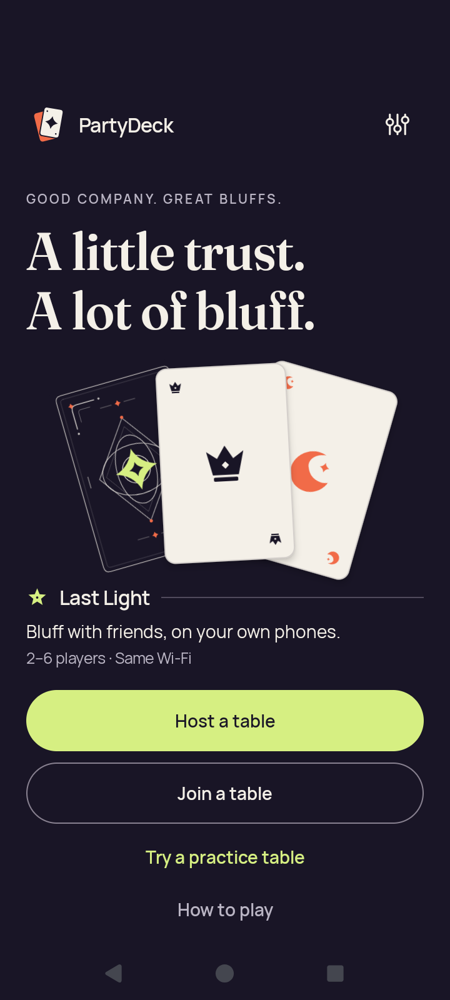</a> <code>settings-return-home.png</code> settings-return-home | 720 × 1600 px · 129,561 bytes · text 1.0 SHA-256: <code>19fbfad8d0d5b93b9ee06d5edc246d2a3967e90bec62ed63bfd63020b0671c7c</code> Source: <code>/root/projects/PartyDeck/artifacts/evidence-storage/34503251315/android-jvm-reports/build/ci/android/debug/settings-return-home.png</code> [UI XML](settings-return-home.xml) · [Capture/result JSON](smoke-result.json) · [Original result](smoke-result.json) | **Exact published-byte match**. Exact PNG bytes match the previously published original android-34432935952/debug/home.png. Its prior pixel observation is reused while this source/scenario/capture identity remains separate. [Reviewed matching original](../../android-34432935952/debug/home.png); original capture identity remains separate. |
