# API 35 native sessions — debug

[All collections](../../../README.md) · [Preserved evidence index](../../evidence-index.md) · [Copy/review binding](../../provenance/publication-review/partydeck-gallery-2815-publication-binding-v1.json) · [Completed visual review](../../provenance/publication-review/partydeck-gallery-after-2355-api35-visual-review-v1.json) · [Unchanged source mapping](../../provenance/source-map/capture-gallery-mapping.json)

**21 native session checks passed, including two guarded renderer-death checks. Engine gameplay was not invoked; no continuous privacy or TalkBack acceptance.**

Original PNG/XML/JSON acquisitions are sequential. Runtime capture names, stages and timestamps retain the source identity.

Both ordinary debug and optimized smokes pass. Native debug passes 21 checks, including two guarded renderer-death checks; optimized passes 19 checks and explicitly skips the two renderer-death checks. Engine gameplay was not invoked. The frozen independent review records 262 JUnit tests in 41 suites with no failures/errors/skips, 155 passing host tests and 11 lint warnings. These results add no TalkBack or continuous-privacy acceptance.

Normal Standard hands and selection/actions fit. Several Round 1 reveal labels clip at a public-panel edge. Native old-PCK 2D initial Reveal fits narrowly while the cover bottom clips; 3D seats scroll horizontally. The optimized no-claim round-1 result fits the full Return to lobby action. The debug round-2 claim plus previous-round-review state continues below the body. Enlarged intermediate hand, Rules and Settings content requires scrolling; scrolled Play/Challenge and Rules → Practice fit. The enlarged debug invalid-Join button crosses the right viewport edge while the optimized counterpart fits. The optimized original named large-text-rules-practice-entered.png visibly shows a round result. Sequential PNG/XML are not atomic.

Source revision: `1cd34a36753ed0112e6684f6525592dab8ef2edb`. CI run: [34503251315](https://github.com/Apdelrahman1911/PartyDeck/actions/runs/34503251315). 82 original PNG identities. Review methods: 53 direct original view, 19 exact same-batch match, 10 attributed peer direct view.

Every thumbnail opens the unchanged original PNG. Original filenames, dimensions, source paths and outcomes remain separate even when pixels match. No derivative image was created. Frozen provenance pages retain their original text and source references.

| Original capture | Original identity and evidence | Visual observation |
| --- | --- | --- |
| <a href="runtime/captures/2d-action-entry-native-ready.png">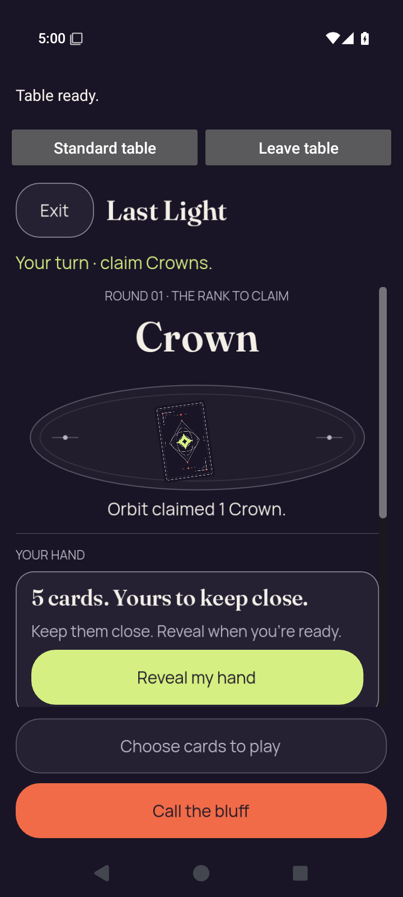</a> <code>2d-action-entry-native-ready.png</code> 2d-action-entry-native-ready — 2d.standard-action | 720 × 1600 px · 160,090 bytes SHA-256: <code>3431d4c4ca688f5746d25b2964cb36e307f0b892aeabebd306c3f62c1bef1788</code> Source: <code>/root/projects/PartyDeck/artifacts/evidence-storage/34503251315/android-jvm-reports/build/ci/android/godot-session/debug/runtime/captures/2d-action-entry-native-ready.png</code> Capture: 2026-09-10T17:00:38.095+00:00 → 2026-09-10T17:00:40.594+00:00 [UI XML](runtime/captures/2d-action-entry-native-ready.xml) · [Capture/result JSON](runtime/captures/2d-action-entry-native-ready.json) · [Original result](runtime/godot-session-result.json) | **Direct original view**. The native 2D page shows Table ready, Standard table/Leave table, Exit, turn, Crown rank and Orbit&#x27;s one-Crown claim. The full Reveal button fits narrowly above the body boundary while the cover panel&#x27;s lower edge is clipped. Fixed Choose cards and Call the bluff controls are complete. |
| <a href="runtime/captures/2d-action-entry-selected.png">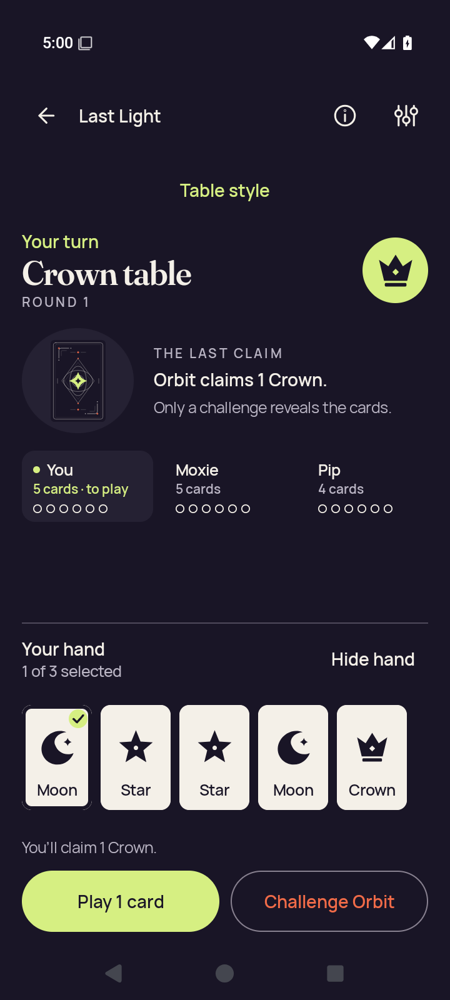</a> <code>2d-action-entry-selected.png</code> 2d-action-entry-selected — 2d.standard-action | 720 × 1600 px · 115,089 bytes SHA-256: <code>e132001095644ebf02d5922ce2a5a5a025a66062d6f5cc981ee72266f4dad001</code> Source: <code>/root/projects/PartyDeck/artifacts/evidence-storage/34503251315/android-jvm-reports/build/ci/android/godot-session/debug/runtime/captures/2d-action-entry-selected.png</code> Capture: 2026-09-10T17:00:17.662+00:00 → 2026-09-10T17:00:20.148+00:00 [UI XML](runtime/captures/2d-action-entry-selected.xml) · [Capture/result JSON](runtime/captures/2d-action-entry-selected.json) · [Original result](runtime/godot-session-result.json) | **Direct original view**. The Standard pre-entry selection state shows five full cards with the first Moon checked, 1 of 3 selected, and readable claim feedback. Play 1 card and Challenge Orbit fit below; public turn, Crown rank and latest claim stay readable. |
|  <code>2d-action-entry-selector.png</code> 2d-action-entry-selector — 2d.standard-action | 720 × 1600 px · 58,195 bytes SHA-256: <code>0a9b972a537a2cd47dbabb5399ece8df48a188521610bafa063ad61980f663f9</code> Source: <code>/root/projects/PartyDeck/artifacts/evidence-storage/34503251315/android-jvm-reports/build/ci/android/godot-session/debug/runtime/captures/2d-action-entry-selector.png</code> Capture: 2026-09-10T17:00:26.798+00:00 → 2026-09-10T17:00:29.269+00:00 [UI XML](runtime/captures/2d-action-entry-selector.xml) · [Capture/result JSON](runtime/captures/2d-action-entry-selector.json) · [Original result](runtime/godot-session-result.json) | **Direct original view**. The centered Table style dialog fully shows its guidance, selected Standard option, 2D/3D choices and Done. No private hand is visible behind the opaque modal. |
|  <code>2d-action-return-concealed.png</code> 2d-action-return-concealed — 2d.standard-action | 720 × 1600 px · 119,992 bytes SHA-256: <code>cd8ad2336da965cebca044ee2ead01ac977ef4a128cbb2a55ce5d99ea24496b3</code> Source: <code>/root/projects/PartyDeck/artifacts/evidence-storage/34503251315/android-jvm-reports/build/ci/android/godot-session/debug/runtime/captures/2d-action-return-concealed.png</code> Capture: 2026-09-10T17:00:48.150+00:00 → 2026-09-10T17:00:50.641+00:00 [UI XML](runtime/captures/2d-action-return-concealed.xml) · [Capture/result JSON](runtime/captures/2d-action-return-concealed.json) · [Original result](runtime/godot-session-result.json) | **Direct original view**. After returning to Standard, the full covered-hand panel and Show hand are visible with zero displayed private ranks. Crown turn/claim context and both lower actions remain readable. |
|  <code>2d-action-return-first-card.png</code> 2d-action-return-first-card — 2d.standard-action | 720 × 1600 px · 114,803 bytes SHA-256: <code>454de2d62e954b8f63b4fc8cd6da43a5de4989402a69c7d099e0f7c809718004</code> Source: <code>/root/projects/PartyDeck/artifacts/evidence-storage/34503251315/android-jvm-reports/build/ci/android/godot-session/debug/runtime/captures/2d-action-return-first-card.png</code> Capture: 2026-09-10T17:01:03.990+00:00 → 2026-09-10T17:01:06.468+00:00 [UI XML](runtime/captures/2d-action-return-first-card.xml) · [Capture/result JSON](runtime/captures/2d-action-return-first-card.json) · [Original result](runtime/godot-session-result.json) | **Direct original view**. The Standard return hand shows five complete Moon/Star/Star/Moon/Crown cards, 0 of 3 selected and Hide hand. Public Crown claim context and lower Select cards/Challenge Orbit actions fit. |
|  <code>2d-action-return-public.png</code> 2d-action-return-public — 2d.standard-action | 720 × 1600 px · 119,992 bytes SHA-256: <code>cd8ad2336da965cebca044ee2ead01ac977ef4a128cbb2a55ce5d99ea24496b3</code> Source: <code>/root/projects/PartyDeck/artifacts/evidence-storage/34503251315/android-jvm-reports/build/ci/android/godot-session/debug/runtime/captures/2d-action-return-public.png</code> Capture: 2026-09-10T17:00:57.286+00:00 → 2026-09-10T17:00:59.766+00:00 [UI XML](runtime/captures/2d-action-return-public.xml) · [Capture/result JSON](runtime/captures/2d-action-return-public.json) · [Original result](runtime/godot-session-result.json) | **Exact same-batch match**. Exact bytes match separately retained capture 34. Reused pixel observation: After returning to Standard, the full covered-hand panel and Show hand are visible with zero displayed private ranks. Crown turn/claim context and both lower actions remain readable. [Reviewed matching original](runtime/captures/2d-action-return-concealed.png); original capture identity remains separate. |
|  <code>2d-action-return-selection-cleared.png</code> 2d-action-return-selection-cleared — 2d.standard-action | 720 × 1600 px · 119,992 bytes SHA-256: <code>cd8ad2336da965cebca044ee2ead01ac977ef4a128cbb2a55ce5d99ea24496b3</code> Source: <code>/root/projects/PartyDeck/artifacts/evidence-storage/34503251315/android-jvm-reports/build/ci/android/godot-session/debug/runtime/captures/2d-action-return-selection-cleared.png</code> Capture: 2026-09-10T17:00:52.728+00:00 → 2026-09-10T17:00:55.193+00:00 [UI XML](runtime/captures/2d-action-return-selection-cleared.xml) · [Capture/result JSON](runtime/captures/2d-action-return-selection-cleared.json) · [Original result](runtime/godot-session-result.json) | **Exact same-batch match**. Exact bytes match separately retained capture 34. Reused pixel observation: After returning to Standard, the full covered-hand panel and Show hand are visible with zero displayed private ranks. Crown turn/claim context and both lower actions remain readable. [Reviewed matching original](runtime/captures/2d-action-return-concealed.png); original capture identity remains separate. |
|  <code>2d-baseline-first-card.png</code> 2d-baseline-first-card — 2d.practice-baseline | 720 × 1600 px · 114,524 bytes SHA-256: <code>f51a1707144b690d1cf48c28ce8dff85c990932455fa6c9ebd2a4542ba1ed0b9</code> Source: <code>/root/projects/PartyDeck/artifacts/evidence-storage/34503251315/android-jvm-reports/build/ci/android/godot-session/debug/runtime/captures/2d-baseline-first-card.png</code> Capture: 2026-09-10T16:55:14.878+00:00 → 2026-09-10T16:55:17.375+00:00 [UI XML](runtime/captures/2d-baseline-first-card.xml) · [Capture/result JSON](runtime/captures/2d-baseline-first-card.json) · [Original result](runtime/godot-session-result.json) | **Direct original view**. The baseline Standard hand shows five complete Moon/Star/Star/Moon/Crown cards with no selection. Turn, Crown table, Orbit&#x27;s claim and the lower actions remain readable. |
|  <code>2d-baseline-public.png</code> 2d-baseline-public — 2d.practice-baseline | 720 × 1600 px · 119,810 bytes SHA-256: <code>5f6f14a4caebb98625b532f76804a4d9a80c901eaec3eb687cca090c77a4f234</code> Source: <code>/root/projects/PartyDeck/artifacts/evidence-storage/34503251315/android-jvm-reports/build/ci/android/godot-session/debug/runtime/captures/2d-baseline-public.png</code> Capture: 2026-09-10T16:55:08.112+00:00 → 2026-09-10T16:55:10.610+00:00 [UI XML](runtime/captures/2d-baseline-public.xml) · [Capture/result JSON](runtime/captures/2d-baseline-public.json) · [Original result](runtime/godot-session-result.json) | **Direct original view**. The Standard baseline shows the complete covered-hand panel, Show hand and both lower actions. Your turn, Crown table, Orbit&#x27;s claim and player card counts are readable; no private card faces are displayed. |
|  <code>2d-baseline-selected.png</code> 2d-baseline-selected — 2d.standard-hand | 720 × 1600 px · 115,032 bytes SHA-256: <code>2ffb7bb2582aa17922ac7d43ac434d098e4d41ca02a0f4d086ac5f5b8a09120b</code> Source: <code>/root/projects/PartyDeck/artifacts/evidence-storage/34503251315/android-jvm-reports/build/ci/android/godot-session/debug/runtime/captures/2d-baseline-selected.png</code> Capture: 2026-09-10T16:57:03.432+00:00 → 2026-09-10T16:57:05.901+00:00 [UI XML](runtime/captures/2d-baseline-selected.xml) · [Capture/result JSON](runtime/captures/2d-baseline-selected.json) · [Original result](runtime/godot-session-result.json) | **Direct original view**. The Standard baseline selection has the first Moon checked and all five card labels complete. Selection count, claim feedback and both lower actions fit under the preserved public context. |
|  <code>2d-death-native-ready.png</code> 2d-death-native-ready — 2d.renderer-death | 720 × 1600 px · 160,432 bytes SHA-256: <code>9845f33c82a091839d7c949a304d9dff89d5b91a7950dcdc6d3df586718abae1</code> Source: <code>/root/projects/PartyDeck/artifacts/evidence-storage/34503251315/android-jvm-reports/build/ci/android/godot-session/debug/runtime/captures/2d-death-native-ready.png</code> Capture: 2026-09-10T16:58:41.258+00:00 → 2026-09-10T16:58:43.758+00:00 [UI XML](runtime/captures/2d-death-native-ready.xml) · [Capture/result JSON](runtime/captures/2d-death-native-ready.json) · [Original result](runtime/godot-session-result.json) | **Direct original view**. The native 2D renderer shows the full initial Reveal just above the body edge, with the cover panel bottom clipped. Table ready, native return/leave controls, turn/rank/claim and both fixed actions remain readable; no private card ranks are shown. |
|  <code>2d-death-return-concealed.png</code> 2d-death-return-concealed — 2d.renderer-death | 720 × 1600 px · 120,349 bytes SHA-256: <code>c9b089fc5f3b927e3c7095b3cf090ea1e72c0977e19b1cf47c9be91abc791831</code> Source: <code>/root/projects/PartyDeck/artifacts/evidence-storage/34503251315/android-jvm-reports/build/ci/android/godot-session/debug/runtime/captures/2d-death-return-concealed.png</code> Capture: 2026-09-10T16:58:48.794+00:00 → 2026-09-10T16:58:51.262+00:00 [UI XML](runtime/captures/2d-death-return-concealed.xml) · [Capture/result JSON](runtime/captures/2d-death-return-concealed.json) · [Original result](runtime/godot-session-result.json) | **Attributed peer direct view** by <code>/root/review_release</code>. After the recorded guarded renderer signal, Standard shows the concealed hand panel, Show hand and disabled Select cards. No private card face is visible. |
|  <code>2d-death-return-first-card.png</code> 2d-death-return-first-card — 2d.renderer-death | 720 × 1600 px · 115,110 bytes SHA-256: <code>f7a788a592db4e4f1e3453dd25e48aa43e8b687d093336a1927aee47ce364390</code> Source: <code>/root/projects/PartyDeck/artifacts/evidence-storage/34503251315/android-jvm-reports/build/ci/android/godot-session/debug/runtime/captures/2d-death-return-first-card.png</code> Capture: 2026-09-10T16:59:04.636+00:00 → 2026-09-10T16:59:07.130+00:00 [UI XML](runtime/captures/2d-death-return-first-card.xml) · [Capture/result JSON](runtime/captures/2d-death-return-first-card.json) · [Original result](runtime/godot-session-result.json) | **Direct original view**. The post-death-return Standard hand is revealed with five complete rank cards, no selection, and full Hide hand/Select cards/Challenge Orbit. Crown and latest claim context are readable. |
|  <code>2d-death-return-public.png</code> 2d-death-return-public — 2d.renderer-death | 720 × 1600 px · 120,349 bytes SHA-256: <code>c9b089fc5f3b927e3c7095b3cf090ea1e72c0977e19b1cf47c9be91abc791831</code> Source: <code>/root/projects/PartyDeck/artifacts/evidence-storage/34503251315/android-jvm-reports/build/ci/android/godot-session/debug/runtime/captures/2d-death-return-public.png</code> Capture: 2026-09-10T16:58:57.919+00:00 → 2026-09-10T16:59:00.400+00:00 [UI XML](runtime/captures/2d-death-return-public.xml) · [Capture/result JSON](runtime/captures/2d-death-return-public.json) · [Original result](runtime/godot-session-result.json) | **Exact same-batch match**. Exact bytes match separately retained capture 42. Reused pixel observation: After the recorded guarded renderer signal, Standard shows the concealed hand panel, Show hand and disabled Select cards. No private card face is visible. [Reviewed matching original](runtime/captures/2d-death-return-concealed.png); original capture identity remains separate. |
|  <code>2d-death-return-selection-cleared.png</code> 2d-death-return-selection-cleared — 2d.renderer-death | 720 × 1600 px · 120,349 bytes SHA-256: <code>c9b089fc5f3b927e3c7095b3cf090ea1e72c0977e19b1cf47c9be91abc791831</code> Source: <code>/root/projects/PartyDeck/artifacts/evidence-storage/34503251315/android-jvm-reports/build/ci/android/godot-session/debug/runtime/captures/2d-death-return-selection-cleared.png</code> Capture: 2026-09-10T16:58:53.348+00:00 → 2026-09-10T16:58:55.841+00:00 [UI XML](runtime/captures/2d-death-return-selection-cleared.xml) · [Capture/result JSON](runtime/captures/2d-death-return-selection-cleared.json) · [Original result](runtime/godot-session-result.json) | **Exact same-batch match**. Exact bytes match separately retained capture 42. Reused pixel observation: After the recorded guarded renderer signal, Standard shows the concealed hand panel, Show hand and disabled Select cards. No private card face is visible. [Reviewed matching original](runtime/captures/2d-death-return-concealed.png); original capture identity remains separate. |
|  <code>2d-death-selected.png</code> 2d-death-selected — 2d.renderer-death | 720 × 1600 px · 115,530 bytes SHA-256: <code>c2d4e18a895503c17d2922eb0bb739fbc5c56807e23d2f89364c1d85102f31c5</code> Source: <code>/root/projects/PartyDeck/artifacts/evidence-storage/34503251315/android-jvm-reports/build/ci/android/godot-session/debug/runtime/captures/2d-death-selected.png</code> Capture: 2026-09-10T16:58:20.621+00:00 → 2026-09-10T16:58:23.129+00:00 [UI XML](runtime/captures/2d-death-selected.xml) · [Capture/result JSON](runtime/captures/2d-death-selected.json) · [Original result](runtime/godot-session-result.json) | **Direct original view**. The Standard hand has five fully visible cards, a checked first Moon and readable selection/claim feedback. Both lower actions and the public Crown/Orbit context fit. |
|  <code>2d-death-selector.png</code> 2d-death-selector — 2d.renderer-death | 720 × 1600 px · 58,455 bytes SHA-256: <code>72d79bf6e9c29702d590e26480a06f9e8d03870b17b938af53a7f1cbcd14aa57</code> Source: <code>/root/projects/PartyDeck/artifacts/evidence-storage/34503251315/android-jvm-reports/build/ci/android/godot-session/debug/runtime/captures/2d-death-selector.png</code> Capture: 2026-09-10T16:58:29.858+00:00 → 2026-09-10T16:58:32.343+00:00 [UI XML](runtime/captures/2d-death-selector.xml) · [Capture/result JSON](runtime/captures/2d-death-selector.json) · [Original result](runtime/godot-session-result.json) | **Direct original view**. The Table style modal shows all guidance, all three options and Done. Standard is selected; private cards are not visible. |
|  <code>2d-entry-native-ready.png</code> 2d-entry-native-ready — 2d.native-entry | 720 × 1600 px · 160,164 bytes SHA-256: <code>6196d3ad38abc2a8cc9cc07379299e267230a51559263099e50ee3bf9f1edb2b</code> Source: <code>/root/projects/PartyDeck/artifacts/evidence-storage/34503251315/android-jvm-reports/build/ci/android/godot-session/debug/runtime/captures/2d-entry-native-ready.png</code> Capture: 2026-09-10T16:57:24.379+00:00 → 2026-09-10T16:57:26.856+00:00 [UI XML](runtime/captures/2d-entry-native-ready.xml) · [Capture/result JSON](runtime/captures/2d-entry-native-ready.json) · [Original result](runtime/godot-session-result.json) | **Attributed peer direct view** by <code>/root/review_release</code>. Visible 2D table, Table ready/native return controls, public claim and concealed hand panel. No private card face is visible. |
|  <code>2d-entry-selector.png</code> 2d-entry-selector — 2d.native-entry | 720 × 1600 px · 58,132 bytes SHA-256: <code>e9679683249dc285b8893fa7038bbbccf83010de6b32fa97b0de89adc43d171a</code> Source: <code>/root/projects/PartyDeck/artifacts/evidence-storage/34503251315/android-jvm-reports/build/ci/android/godot-session/debug/runtime/captures/2d-entry-selector.png</code> Capture: 2026-09-10T16:57:12.624+00:00 → 2026-09-10T16:57:15.078+00:00 [UI XML](runtime/captures/2d-entry-selector.xml) · [Capture/result JSON](runtime/captures/2d-entry-selector.json) · [Original result](runtime/godot-session-result.json) | **Direct original view**. The Table style modal is fully contained, with Standard selected and complete 2D/3D choices, guidance and Done. |
| <a href="runtime/captures/2d-home-after-session-end.png">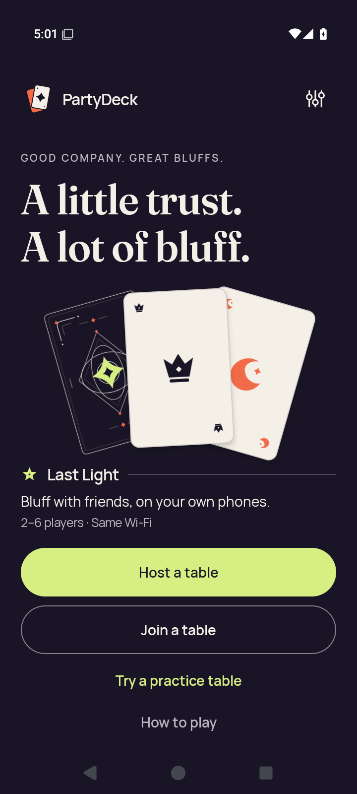</a> <code>2d-home-after-session-end.png</code> 2d-home-after-session-end — 2d.leave-end | 720 × 1600 px · 131,938 bytes SHA-256: <code>097c7ee4847c433c4ceeb7b8bbacf010d982f2c11a2455217fe1727d7c3ae5d2</code> Source: <code>/root/projects/PartyDeck/artifacts/evidence-storage/34503251315/android-jvm-reports/build/ci/android/godot-session/debug/runtime/captures/2d-home-after-session-end.png</code> Capture: 2026-09-10T17:01:52.744+00:00 → 2026-09-10T17:01:55.225+00:00 [UI XML](runtime/captures/2d-home-after-session-end.xml) · [Capture/result JSON](runtime/captures/2d-home-after-session-end.json) · [Original result](runtime/godot-session-result.json) | **Direct original view**. After ending the session, Home shows the full brand, headline, card illustration and complete Host, Join, Practice, How to play and Settings actions. |
|  <code>2d-home-resumed.png</code> 2d-home-resumed — 2d.home-interruption | 720 × 1600 px · 160,164 bytes SHA-256: <code>6196d3ad38abc2a8cc9cc07379299e267230a51559263099e50ee3bf9f1edb2b</code> Source: <code>/root/projects/PartyDeck/artifacts/evidence-storage/34503251315/android-jvm-reports/build/ci/android/godot-session/debug/runtime/captures/2d-home-resumed.png</code> Capture: 2026-09-10T16:57:35.555+00:00 → 2026-09-10T16:57:38.043+00:00 [UI XML](runtime/captures/2d-home-resumed.xml) · [Capture/result JSON](runtime/captures/2d-home-resumed.json) · [Original result](runtime/godot-session-result.json) | **Exact same-batch match**. Exact bytes match separately retained capture 48. Reused pixel observation: Visible 2D table, Table ready/native return controls, public claim and concealed hand panel. No private card face is visible. [Reviewed matching original](runtime/captures/2d-entry-native-ready.png); original capture identity remains separate. |
|  <code>2d-home-system-ui.png</code> 2d-home-system-ui — 2d.home-interruption | 720 × 1600 px · 747,348 bytes SHA-256: <code>e2abd7c3ce37963d9cbb8d4b01b2d1d82443bb56b81578b07118c92b7aef37ee</code> Source: <code>/root/projects/PartyDeck/artifacts/evidence-storage/34503251315/android-jvm-reports/build/ci/android/godot-session/debug/runtime/captures/2d-home-system-ui.png</code> Capture: 2026-09-10T16:57:29.676+00:00 → 2026-09-10T16:57:32.524+00:00 [UI XML](runtime/captures/2d-home-system-ui.xml) · [Capture/result JSON](runtime/captures/2d-home-system-ui.json) · [Original result](runtime/godot-session-result.json) | **Attributed peer direct view** by <code>/root/review_release</code>. Android launcher Home is visible. No PartyDeck table or private card face is visible. |
| <a href="runtime/captures/2d-leave-cancel-confirmation.png">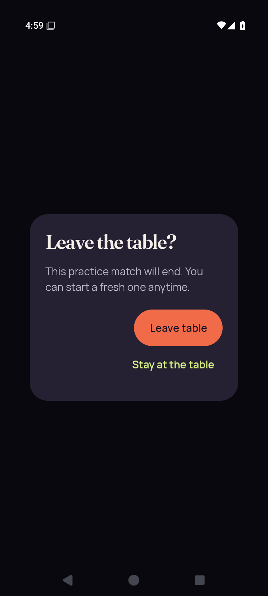</a> <code>2d-leave-cancel-confirmation.png</code> 2d-leave-cancel-confirmation — 2d.leave-cancel | 720 × 1600 px · 41,231 bytes SHA-256: <code>c73b887b3b15a629283f6b628e6c9c40c162c7b13de25f8d3f709320b4ac8913</code> Source: <code>/root/projects/PartyDeck/artifacts/evidence-storage/34503251315/android-jvm-reports/build/ci/android/godot-session/debug/runtime/captures/2d-leave-cancel-confirmation.png</code> Capture: 2026-09-10T16:59:43.844+00:00 → 2026-09-10T16:59:46.320+00:00 [UI XML](runtime/captures/2d-leave-cancel-confirmation.xml) · [Capture/result JSON](runtime/captures/2d-leave-cancel-confirmation.json) · [Original result](runtime/godot-session-result.json) | **Direct original view**. The centered Leave the table? confirmation fully shows its practice-match explanation, Leave table and Stay at the table actions. The underlying table is obscured. |
|  <code>2d-leave-cancel-native-ready.png</code> 2d-leave-cancel-native-ready — 2d.leave-cancel | 720 × 1600 px · 160,412 bytes SHA-256: <code>9a2714f7f8aaa66848c1414f63e16503eeb490a5320488d1ba8992046aad6977</code> Source: <code>/root/projects/PartyDeck/artifacts/evidence-storage/34503251315/android-jvm-reports/build/ci/android/godot-session/debug/runtime/captures/2d-leave-cancel-native-ready.png</code> Capture: 2026-09-10T16:59:34.000+00:00 → 2026-09-10T16:59:36.485+00:00 [UI XML](runtime/captures/2d-leave-cancel-native-ready.xml) · [Capture/result JSON](runtime/captures/2d-leave-cancel-native-ready.json) · [Original result](runtime/godot-session-result.json) | **Direct original view**. Native 2D remains concealed with complete Table ready/native controls, turn, Crown rank, Orbit claim and Reveal button. The cover panel bottom meets the scroll boundary; fixed Choose cards/Call the bluff controls fit. |
|  <code>2d-leave-cancel-return-concealed.png</code> 2d-leave-cancel-return-concealed — 2d.leave-cancel | 720 × 1600 px · 120,321 bytes SHA-256: <code>4b4eda893940663aa9a88004ddda952618caf236ee731dee834be5aabf365400</code> Source: <code>/root/projects/PartyDeck/artifacts/evidence-storage/34503251315/android-jvm-reports/build/ci/android/godot-session/debug/runtime/captures/2d-leave-cancel-return-concealed.png</code> Capture: 2026-09-10T16:59:52.811+00:00 → 2026-09-10T16:59:55.290+00:00 [UI XML](runtime/captures/2d-leave-cancel-return-concealed.xml) · [Capture/result JSON](runtime/captures/2d-leave-cancel-return-concealed.json) · [Original result](runtime/godot-session-result.json) | **Direct original view**. The Standard return is concealed with a complete covered-hand panel and Show hand. Public Crown/Orbit context and both lower actions fit; no private card faces are shown. |
| <a href="runtime/captures/2d-leave-cancel-return-first-card.png">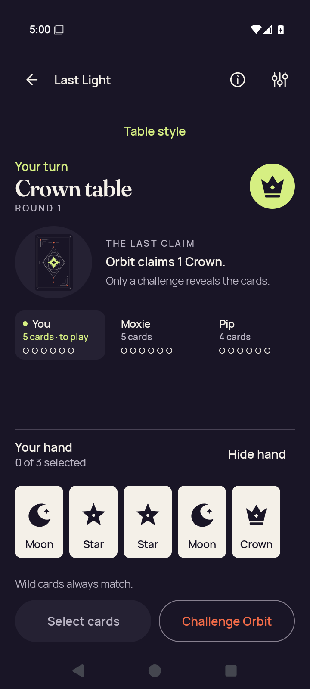</a> <code>2d-leave-cancel-return-first-card.png</code> 2d-leave-cancel-return-first-card — 2d.leave-cancel | 720 × 1600 px · 114,846 bytes SHA-256: <code>462930064089d5a01250ce936d58448860203abad55b671942f72ed22e691030</code> Source: <code>/root/projects/PartyDeck/artifacts/evidence-storage/34503251315/android-jvm-reports/build/ci/android/godot-session/debug/runtime/captures/2d-leave-cancel-return-first-card.png</code> Capture: 2026-09-10T17:00:08.640+00:00 → 2026-09-10T17:00:11.139+00:00 [UI XML](runtime/captures/2d-leave-cancel-return-first-card.xml) · [Capture/result JSON](runtime/captures/2d-leave-cancel-return-first-card.json) · [Original result](runtime/godot-session-result.json) | **Direct original view**. The returned Standard hand shows five complete ranks and no selection. Hide hand and both lower actions are complete beneath the readable public context. |
|  <code>2d-leave-cancel-return-public.png</code> 2d-leave-cancel-return-public — 2d.leave-cancel | 720 × 1600 px · 119,992 bytes SHA-256: <code>cd8ad2336da965cebca044ee2ead01ac977ef4a128cbb2a55ce5d99ea24496b3</code> Source: <code>/root/projects/PartyDeck/artifacts/evidence-storage/34503251315/android-jvm-reports/build/ci/android/godot-session/debug/runtime/captures/2d-leave-cancel-return-public.png</code> Capture: 2026-09-10T17:00:01.917+00:00 → 2026-09-10T17:00:04.402+00:00 [UI XML](runtime/captures/2d-leave-cancel-return-public.xml) · [Capture/result JSON](runtime/captures/2d-leave-cancel-return-public.json) · [Original result](runtime/godot-session-result.json) | **Exact same-batch match**. Exact bytes match separately retained capture 34. Reused pixel observation: After returning to Standard, the full covered-hand panel and Show hand are visible with zero displayed private ranks. Crown turn/claim context and both lower actions remain readable. [Reviewed matching original](runtime/captures/2d-action-return-concealed.png); original capture identity remains separate. |
|  <code>2d-leave-cancel-return-selection-cleared.png</code> 2d-leave-cancel-return-selection-cleared — 2d.leave-cancel | 720 × 1600 px · 120,321 bytes SHA-256: <code>4b4eda893940663aa9a88004ddda952618caf236ee731dee834be5aabf365400</code> Source: <code>/root/projects/PartyDeck/artifacts/evidence-storage/34503251315/android-jvm-reports/build/ci/android/godot-session/debug/runtime/captures/2d-leave-cancel-return-selection-cleared.png</code> Capture: 2026-09-10T16:59:57.365+00:00 → 2026-09-10T16:59:59.838+00:00 [UI XML](runtime/captures/2d-leave-cancel-return-selection-cleared.xml) · [Capture/result JSON](runtime/captures/2d-leave-cancel-return-selection-cleared.json) · [Original result](runtime/godot-session-result.json) | **Exact same-batch match**. Exact bytes match separately retained capture 55. Reused pixel observation: The Standard return is concealed with a complete covered-hand panel and Show hand. Public Crown/Orbit context and both lower actions fit; no private card faces are shown. [Reviewed matching original](runtime/captures/2d-leave-cancel-return-concealed.png); original capture identity remains separate. |
|  <code>2d-leave-cancel-selected.png</code> 2d-leave-cancel-selected — 2d.leave-cancel | 720 × 1600 px · 115,340 bytes SHA-256: <code>aae8707f5fd5eca0e63a5cb196e3f5d134343192d1bfb50b44aed5b024dfebc5</code> Source: <code>/root/projects/PartyDeck/artifacts/evidence-storage/34503251315/android-jvm-reports/build/ci/android/godot-session/debug/runtime/captures/2d-leave-cancel-selected.png</code> Capture: 2026-09-10T16:59:13.690+00:00 → 2026-09-10T16:59:16.188+00:00 [UI XML](runtime/captures/2d-leave-cancel-selected.xml) · [Capture/result JSON](runtime/captures/2d-leave-cancel-selected.json) · [Original result](runtime/godot-session-result.json) | **Direct original view**. The pre-leave Standard hand shows five full cards with a checked first Moon, 1 of 3 selected, and complete Play 1 card/Challenge Orbit controls. |
|  <code>2d-leave-cancel-selector.png</code> 2d-leave-cancel-selector — 2d.leave-cancel | 720 × 1600 px · 58,422 bytes SHA-256: <code>0ca3ba191411958bf8813462986fb35ada4d9572184a6b33bdcf7acecf33513a</code> Source: <code>/root/projects/PartyDeck/artifacts/evidence-storage/34503251315/android-jvm-reports/build/ci/android/godot-session/debug/runtime/captures/2d-leave-cancel-selector.png</code> Capture: 2026-09-10T16:59:22.825+00:00 → 2026-09-10T16:59:25.289+00:00 [UI XML](runtime/captures/2d-leave-cancel-selector.xml) · [Capture/result JSON](runtime/captures/2d-leave-cancel-selector.json) · [Original result](runtime/godot-session-result.json) | **Direct original view**. The full Table style dialog retains Standard selection, all three presentation choices, guidance and Done; private hand content is obscured. |
|  <code>2d-leave-end-confirmation.png</code> 2d-leave-end-confirmation — 2d.leave-end | 720 × 1600 px · 40,857 bytes SHA-256: <code>2b42090dcb5170d59c7f4639fc7952267c989ed9e57341d2f8bfa7463a4798ea</code> Source: <code>/root/projects/PartyDeck/artifacts/evidence-storage/34503251315/android-jvm-reports/build/ci/android/godot-session/debug/runtime/captures/2d-leave-end-confirmation.png</code> Capture: 2026-09-10T17:01:43.724+00:00 → 2026-09-10T17:01:46.181+00:00 [UI XML](runtime/captures/2d-leave-end-confirmation.xml) · [Capture/result JSON](runtime/captures/2d-leave-end-confirmation.json) · [Original result](runtime/godot-session-result.json) | **Direct original view**. The full leave confirmation names the practice-match consequence and shows complete Leave table and Stay at the table actions. |
|  <code>2d-leave-end-selector.png</code> 2d-leave-end-selector — 2d.leave-end | 720 × 1600 px · 58,148 bytes SHA-256: <code>aab055f145567bca56f8519a85ae01e77cd54d269df6bf10a05859aa9a7c4962</code> Source: <code>/root/projects/PartyDeck/artifacts/evidence-storage/34503251315/android-jvm-reports/build/ci/android/godot-session/debug/runtime/captures/2d-leave-end-selector.png</code> Capture: 2026-09-10T17:01:28.996+00:00 → 2026-09-10T17:01:31.470+00:00 [UI XML](runtime/captures/2d-leave-end-selector.xml) · [Capture/result JSON](runtime/captures/2d-leave-end-selector.json) · [Original result](runtime/godot-session-result.json) | **Direct original view**. The Table style dialog is centered and fully contained with Standard selected and all guidance/actions readable. |
| <a href="runtime/captures/2d-recents-resumed.png">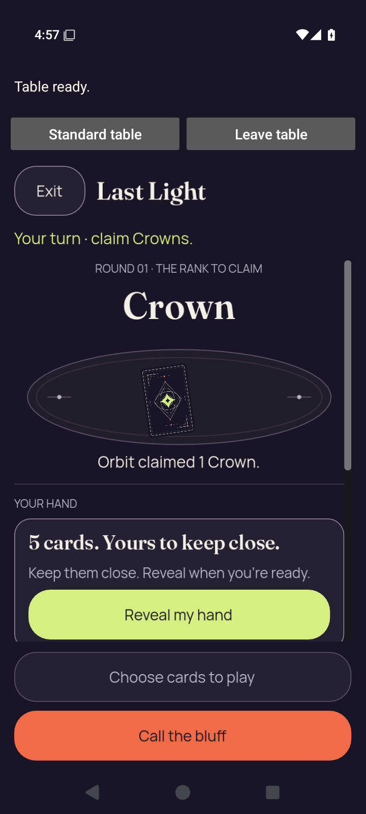</a> <code>2d-recents-resumed.png</code> 2d-recents-resumed — 2d.recents-interruption | 720 × 1600 px · 160,164 bytes SHA-256: <code>6196d3ad38abc2a8cc9cc07379299e267230a51559263099e50ee3bf9f1edb2b</code> Source: <code>/root/projects/PartyDeck/artifacts/evidence-storage/34503251315/android-jvm-reports/build/ci/android/godot-session/debug/runtime/captures/2d-recents-resumed.png</code> Capture: 2026-09-10T16:57:45.865+00:00 → 2026-09-10T16:57:48.339+00:00 [UI XML](runtime/captures/2d-recents-resumed.xml) · [Capture/result JSON](runtime/captures/2d-recents-resumed.json) · [Original result](runtime/godot-session-result.json) | **Exact same-batch match**. Exact bytes match separately retained capture 48. Reused pixel observation: Visible 2D table, Table ready/native return controls, public claim and concealed hand panel. No private card face is visible. [Reviewed matching original](runtime/captures/2d-entry-native-ready.png); original capture identity remains separate. |
|  <code>2d-recents-system-ui.png</code> 2d-recents-system-ui — 2d.recents-interruption | 720 × 1600 px · 41,499 bytes SHA-256: <code>b8d934ab88ff013d7ea8243be1a9d4ed731d46b0bc95f28bb8556726826d114c</code> Source: <code>/root/projects/PartyDeck/artifacts/evidence-storage/34503251315/android-jvm-reports/build/ci/android/godot-session/debug/runtime/captures/2d-recents-system-ui.png</code> Capture: 2026-09-10T16:57:40.547+00:00 → 2026-09-10T16:57:43.024+00:00 [UI XML](runtime/captures/2d-recents-system-ui.xml) · [Capture/result JSON](runtime/captures/2d-recents-system-ui.json) · [Original result](runtime/godot-session-result.json) | **Attributed peer direct view** by <code>/root/review_release</code>. Recents shows the PartyDeck task covered by Your cards stay private, with native return controls visible. Engine pixels and private card faces are covered. |
| <a href="runtime/captures/2d-standard-concealed.png">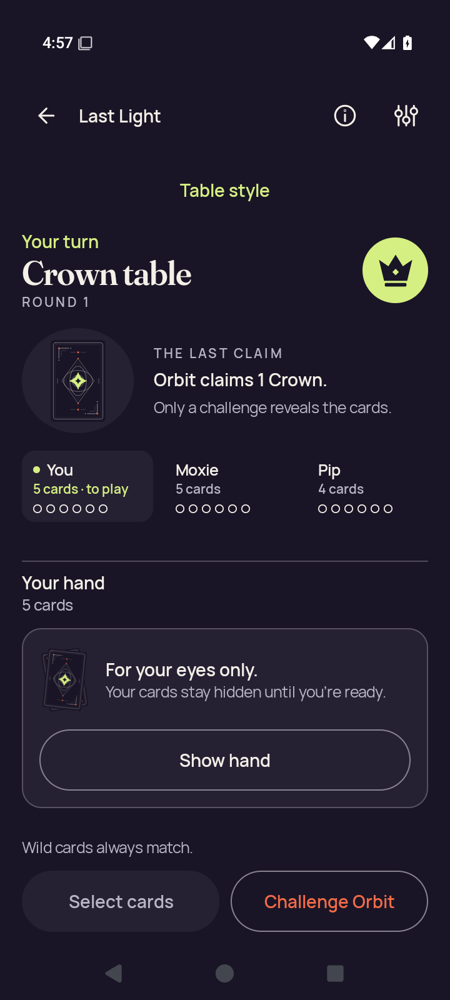</a> <code>2d-standard-concealed.png</code> 2d-standard-concealed — 2d.standard-return | 720 × 1600 px · 120,220 bytes SHA-256: <code>28796d97fb717085ec77e1b436d7e3c8a490a22664aae34168780856e3a5d2cb</code> Source: <code>/root/projects/PartyDeck/artifacts/evidence-storage/34503251315/android-jvm-reports/build/ci/android/godot-session/debug/runtime/captures/2d-standard-concealed.png</code> Capture: 2026-09-10T16:57:55.839+00:00 → 2026-09-10T16:57:58.312+00:00 [UI XML](runtime/captures/2d-standard-concealed.xml) · [Capture/result JSON](runtime/captures/2d-standard-concealed.json) · [Original result](runtime/godot-session-result.json) | **Attributed peer direct view** by <code>/root/review_release</code>. Returned Standard table shows the concealed Your hand panel, Show hand and disabled Select cards. No private card face is visible. |
|  <code>2d-standard-first-card.png</code> 2d-standard-first-card — 2d.standard-return | 720 × 1600 px · 115,299 bytes SHA-256: <code>83dcdf251157f0b9ba41dff66af350b9bc46ff563d9dd07ca9d2c99dc6b8d564</code> Source: <code>/root/projects/PartyDeck/artifacts/evidence-storage/34503251315/android-jvm-reports/build/ci/android/godot-session/debug/runtime/captures/2d-standard-first-card.png</code> Capture: 2026-09-10T16:58:11.661+00:00 → 2026-09-10T16:58:14.143+00:00 [UI XML](runtime/captures/2d-standard-first-card.xml) · [Capture/result JSON](runtime/captures/2d-standard-first-card.json) · [Original result](runtime/godot-session-result.json) | **Direct original view**. Standard shows the complete five-card hand with no selection, readable Hide hand and lower actions, and unchanged Crown/Orbit public context. |
| <a href="runtime/captures/2d-standard-play-after-play.png">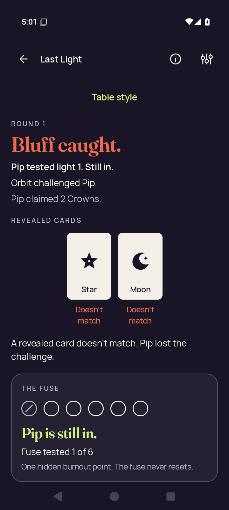</a> <code>2d-standard-play-after-play.png</code> 2d-standard-play-after-play — 2d.standard-action | 720 × 1600 px · 101,314 bytes SHA-256: <code>bd321cd30d23fcd544776310992dfb9130ea61337aecffaab3f95e6250f32494</code> Source: <code>/root/projects/PartyDeck/artifacts/evidence-storage/34503251315/android-jvm-reports/build/ci/android/godot-session/debug/runtime/captures/2d-standard-play-after-play.png</code> Capture: 2026-09-10T17:01:19.893+00:00 → 2026-09-10T17:01:22.357+00:00 [UI XML](runtime/captures/2d-standard-play-after-play.xml) · [Capture/result JSON](runtime/captures/2d-standard-play-after-play.json) · [Original result](runtime/godot-session-result.json) | **Direct original view**. The Standard result clearly says Bluff caught, names Orbit challenging Pip&#x27;s two-Crown claim, and shows Star and Moon as nonmatches. The explanation and complete Pip is still in fuse panel are readable; continuation lies beyond the current view. |
|  <code>2d-standard-play-selected.png</code> 2d-standard-play-selected — 2d.standard-action | 720 × 1600 px · 115,047 bytes SHA-256: <code>936177e4976c790f16ce92df7c20dd6c6f9a2b71eaeba48690e128134b6662db</code> Source: <code>/root/projects/PartyDeck/artifacts/evidence-storage/34503251315/android-jvm-reports/build/ci/android/godot-session/debug/runtime/captures/2d-standard-play-selected.png</code> Capture: 2026-09-10T17:01:13.076+00:00 → 2026-09-10T17:01:15.532+00:00 [UI XML](runtime/captures/2d-standard-play-selected.xml) · [Capture/result JSON](runtime/captures/2d-standard-play-selected.json) · [Original result](runtime/godot-session-result.json) | **Direct original view**. Standard shows a checked first Moon, five complete cards, selection count and Crown claim feedback. Play 1 card and Challenge Orbit are fully visible. |
|  <code>2d-standard-public.png</code> 2d-standard-public — 2d.standard-return | 720 × 1600 px · 120,492 bytes SHA-256: <code>265e96bb313057fce8b492c50f9058119f4c4db5ca655bae3311ef208f51e959</code> Source: <code>/root/projects/PartyDeck/artifacts/evidence-storage/34503251315/android-jvm-reports/build/ci/android/godot-session/debug/runtime/captures/2d-standard-public.png</code> Capture: 2026-09-10T16:58:04.941+00:00 → 2026-09-10T16:58:07.407+00:00 [UI XML](runtime/captures/2d-standard-public.xml) · [Capture/result JSON](runtime/captures/2d-standard-public.json) · [Original result](runtime/godot-session-result.json) | **Direct original view**. Standard is concealed with a complete Show hand panel and full lower actions. Crown rank, turn, latest Orbit claim and visible player summaries fit. |
|  <code>2d-standard-selection-cleared.png</code> 2d-standard-selection-cleared — 2d.standard-return | 720 × 1600 px · 120,492 bytes SHA-256: <code>265e96bb313057fce8b492c50f9058119f4c4db5ca655bae3311ef208f51e959</code> Source: <code>/root/projects/PartyDeck/artifacts/evidence-storage/34503251315/android-jvm-reports/build/ci/android/godot-session/debug/runtime/captures/2d-standard-selection-cleared.png</code> Capture: 2026-09-10T16:58:00.387+00:00 → 2026-09-10T16:58:02.851+00:00 [UI XML](runtime/captures/2d-standard-selection-cleared.xml) · [Capture/result JSON](runtime/captures/2d-standard-selection-cleared.json) · [Original result](runtime/godot-session-result.json) | **Exact same-batch match**. Exact bytes match separately retained capture 69. Reused pixel observation: Standard is concealed with a complete Show hand panel and full lower actions. Crown rank, turn, latest Orbit claim and visible player summaries fit. [Reviewed matching original](runtime/captures/2d-standard-public.png); original capture identity remains separate. |
|  <code>3d-action-entry-native-ready.png</code> 3d-action-entry-native-ready — 3d.standard-action | 720 × 1600 px · 196,389 bytes SHA-256: <code>cfc0bdb753c39cd51cee1443dafa483368fb86a8803c51e1ec051df6d91a4881</code> Source: <code>/root/projects/PartyDeck/artifacts/evidence-storage/34503251315/android-jvm-reports/build/ci/android/godot-session/debug/runtime/captures/3d-action-entry-native-ready.png</code> Capture: 2026-09-10T17:07:58.317+00:00 → 2026-09-10T17:08:00.860+00:00 [UI XML](runtime/captures/3d-action-entry-native-ready.xml) · [Capture/result JSON](runtime/captures/3d-action-entry-native-ready.json) · [Original result](runtime/godot-session-result.json) | **Direct original view**. Native 3D shows Table ready, native return/leave, Show hand, Star round/turn/claim and the complete last-round review control. Five card backs and the main Select cards/Challenge Orbit actions fit. Seat text clips horizontally with a scrollbar, and another lower control begins at the bottom edge. |
|  <code>3d-action-entry-selected.png</code> 3d-action-entry-selected — 3d.standard-action | 720 × 1600 px · 119,633 bytes SHA-256: <code>2d06efbcdebb6107d358ab2263d76a086ffc73f8573d05b81e64a79dfa116b60</code> Source: <code>/root/projects/PartyDeck/artifacts/evidence-storage/34503251315/android-jvm-reports/build/ci/android/godot-session/debug/runtime/captures/3d-action-entry-selected.png</code> Capture: 2026-09-10T17:07:34.876+00:00 → 2026-09-10T17:07:37.369+00:00 [UI XML](runtime/captures/3d-action-entry-selected.xml) · [Capture/result JSON](runtime/captures/3d-action-entry-selected.json) · [Original result](runtime/godot-session-result.json) | **Direct original view**. The Standard pre-entry hand shows five complete Star/Moon/Crown/Wild/Star cards with the first Star checked. Selection/claim feedback, Play and Challenge fit under the readable Star turn/claim context. |
|  <code>3d-action-entry-selector.png</code> 3d-action-entry-selector — 3d.standard-action | 720 × 1600 px · 58,329 bytes SHA-256: <code>fb2ef6165f05dffd0a0edd777b88d3e980540b77174072a6fb5d44e00e1b1554</code> Source: <code>/root/projects/PartyDeck/artifacts/evidence-storage/34503251315/android-jvm-reports/build/ci/android/godot-session/debug/runtime/captures/3d-action-entry-selector.png</code> Capture: 2026-09-10T17:07:44.130+00:00 → 2026-09-10T17:07:46.604+00:00 [UI XML](runtime/captures/3d-action-entry-selector.xml) · [Capture/result JSON](runtime/captures/3d-action-entry-selector.json) · [Original result](runtime/godot-session-result.json) | **Direct original view**. The Table style modal fully contains its guidance, Standard selection, 2D/3D options and Done. Private content is obscured. |
|  <code>3d-action-return-concealed.png</code> 3d-action-return-concealed — 3d.standard-action | 720 × 1600 px · 120,676 bytes SHA-256: <code>2c17cff96ca7ec0bc5d1c8c78989e259e5a889fee74387e016313eaf8b6f50ca</code> Source: <code>/root/projects/PartyDeck/artifacts/evidence-storage/34503251315/android-jvm-reports/build/ci/android/godot-session/debug/runtime/captures/3d-action-return-concealed.png</code> Capture: 2026-09-10T17:08:08.427+00:00 → 2026-09-10T17:08:10.928+00:00 [UI XML](runtime/captures/3d-action-return-concealed.xml) · [Capture/result JSON](runtime/captures/3d-action-return-concealed.json) · [Original result](runtime/godot-session-result.json) | **Direct original view**. The Standard return is concealed with a complete Show hand panel and full lower actions. Star/Orbit context is readable, while Round 1 reveal is partly clipped at the public-panel boundary. |
|  <code>3d-action-return-first-card.png</code> 3d-action-return-first-card — 3d.standard-action | 720 × 1600 px · 120,271 bytes SHA-256: <code>2d2a1d8510166b3ce0474c6fccb8689583a256c1f642361688425d394f90cc13</code> Source: <code>/root/projects/PartyDeck/artifacts/evidence-storage/34503251315/android-jvm-reports/build/ci/android/godot-session/debug/runtime/captures/3d-action-return-first-card.png</code> Capture: 2026-09-10T17:08:24.353+00:00 → 2026-09-10T17:08:26.852+00:00 [UI XML](runtime/captures/3d-action-return-first-card.xml) · [Capture/result JSON](runtime/captures/3d-action-return-first-card.json) · [Original result](runtime/godot-session-result.json) | **Direct original view**. The returned Standard hand has five complete Star/Moon/Crown/Wild/Star cards, no selection and full Hide hand/lower actions. Public Star context and Round 1 reveal are readable. |
| <a href="runtime/captures/3d-action-return-public.png">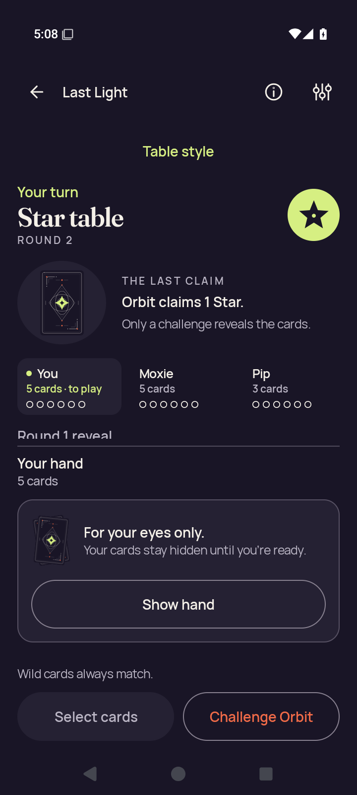</a> <code>3d-action-return-public.png</code> 3d-action-return-public — 3d.standard-action | 720 × 1600 px · 120,676 bytes SHA-256: <code>2c17cff96ca7ec0bc5d1c8c78989e259e5a889fee74387e016313eaf8b6f50ca</code> Source: <code>/root/projects/PartyDeck/artifacts/evidence-storage/34503251315/android-jvm-reports/build/ci/android/godot-session/debug/runtime/captures/3d-action-return-public.png</code> Capture: 2026-09-10T17:08:17.596+00:00 → 2026-09-10T17:08:20.078+00:00 [UI XML](runtime/captures/3d-action-return-public.xml) · [Capture/result JSON](runtime/captures/3d-action-return-public.json) · [Original result](runtime/godot-session-result.json) | **Exact same-batch match**. Exact bytes match separately retained capture 74. Reused pixel observation: The Standard return is concealed with a complete Show hand panel and full lower actions. Star/Orbit context is readable, while Round 1 reveal is partly clipped at the public-panel boundary. [Reviewed matching original](runtime/captures/3d-action-return-concealed.png); original capture identity remains separate. |
|  <code>3d-action-return-selection-cleared.png</code> 3d-action-return-selection-cleared — 3d.standard-action | 720 × 1600 px · 120,676 bytes SHA-256: <code>2c17cff96ca7ec0bc5d1c8c78989e259e5a889fee74387e016313eaf8b6f50ca</code> Source: <code>/root/projects/PartyDeck/artifacts/evidence-storage/34503251315/android-jvm-reports/build/ci/android/godot-session/debug/runtime/captures/3d-action-return-selection-cleared.png</code> Capture: 2026-09-10T17:08:13.020+00:00 → 2026-09-10T17:08:15.495+00:00 [UI XML](runtime/captures/3d-action-return-selection-cleared.xml) · [Capture/result JSON](runtime/captures/3d-action-return-selection-cleared.json) · [Original result](runtime/godot-session-result.json) | **Exact same-batch match**. Exact bytes match separately retained capture 74. Reused pixel observation: The Standard return is concealed with a complete Show hand panel and full lower actions. Star/Orbit context is readable, while Round 1 reveal is partly clipped at the public-panel boundary. [Reviewed matching original](runtime/captures/3d-action-return-concealed.png); original capture identity remains separate. |
| <a href="runtime/captures/3d-baseline-first-card.png">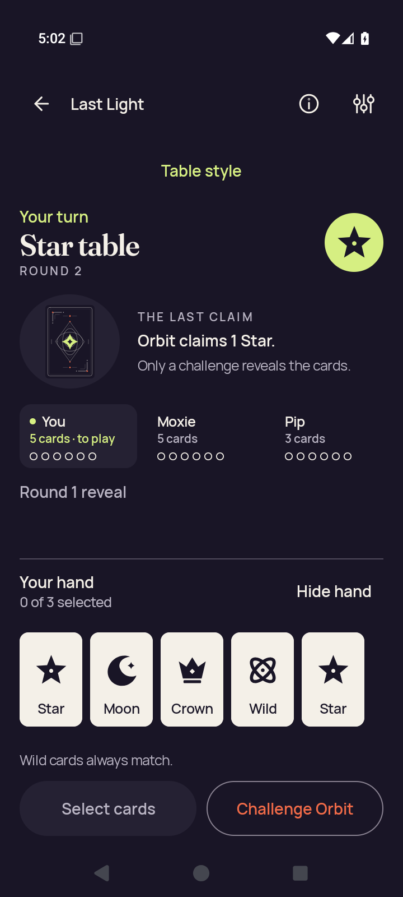</a> <code>3d-baseline-first-card.png</code> 3d-baseline-first-card — 3d.practice-baseline | 720 × 1600 px · 120,270 bytes SHA-256: <code>91d1b278ea45255f68b403bc3deb26e4bf02b28870f32b1309786bdd030c9aa0</code> Source: <code>/root/projects/PartyDeck/artifacts/evidence-storage/34503251315/android-jvm-reports/build/ci/android/godot-session/debug/runtime/captures/3d-baseline-first-card.png</code> Capture: 2026-09-10T17:02:22.941+00:00 → 2026-09-10T17:02:25.427+00:00 [UI XML](runtime/captures/3d-baseline-first-card.xml) · [Capture/result JSON](runtime/captures/3d-baseline-first-card.json) · [Original result](runtime/godot-session-result.json) | **Direct original view**. The Standard baseline hand shows five complete Star/Moon/Crown/Wild/Star cards with no selection. All selection controls and lower actions fit with visible Star turn/claim context. |
| <a href="runtime/captures/3d-baseline-public.png">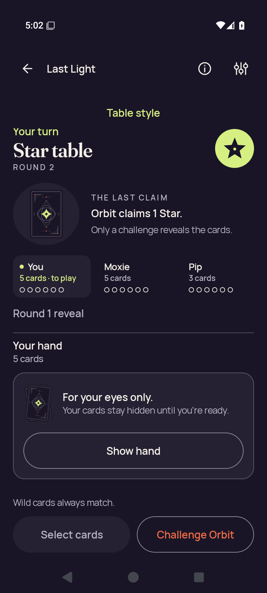</a> <code>3d-baseline-public.png</code> 3d-baseline-public — 3d.practice-baseline | 720 × 1600 px · 121,695 bytes SHA-256: <code>bc94895d4490aed98fb9efb8926a8520330976c83331f78b4ddab4b7ef815da2</code> Source: <code>/root/projects/PartyDeck/artifacts/evidence-storage/34503251315/android-jvm-reports/build/ci/android/godot-session/debug/runtime/captures/3d-baseline-public.png</code> Capture: 2026-09-10T17:02:16.235+00:00 → 2026-09-10T17:02:18.698+00:00 [UI XML](runtime/captures/3d-baseline-public.xml) · [Capture/result JSON](runtime/captures/3d-baseline-public.json) · [Original result](runtime/godot-session-result.json) | **Direct original view**. The Standard baseline is concealed with complete Show hand and lower actions. The public Star claim and Round 1 reveal label are readable in this captured scroll position. |
|  <code>3d-baseline-selected.png</code> 3d-baseline-selected — 3d.standard-hand | 720 × 1600 px · 119,631 bytes SHA-256: <code>eead5bf797158c64719bfd4f5911a9c812c92481498bef392559fa5a288c47e8</code> Source: <code>/root/projects/PartyDeck/artifacts/evidence-storage/34503251315/android-jvm-reports/build/ci/android/godot-session/debug/runtime/captures/3d-baseline-selected.png</code> Capture: 2026-09-10T17:04:10.834+00:00 → 2026-09-10T17:04:13.339+00:00 [UI XML](runtime/captures/3d-baseline-selected.xml) · [Capture/result JSON](runtime/captures/3d-baseline-selected.json) · [Original result](runtime/godot-session-result.json) | **Direct original view**. The Standard baseline selected state shows a checked first Star, all five cards, complete selection feedback and both Play/Challenge actions. Star turn/claim context remains visible. |
|  <code>3d-death-native-ready.png</code> 3d-death-native-ready — 3d.renderer-death | 720 × 1600 px · 195,920 bytes SHA-256: <code>25d6343989c2d5f3d694c338af0a233fe0d12bc7fd793a0096ea63595b479791</code> Source: <code>/root/projects/PartyDeck/artifacts/evidence-storage/34503251315/android-jvm-reports/build/ci/android/godot-session/debug/runtime/captures/3d-death-native-ready.png</code> Capture: 2026-09-10T17:05:54.869+00:00 → 2026-09-10T17:05:57.401+00:00 [UI XML](runtime/captures/3d-death-native-ready.xml) · [Capture/result JSON](runtime/captures/3d-death-native-ready.json) · [Original result](runtime/godot-session-result.json) | **Direct original view**. Native 3D shows complete Table ready/native controls, Show hand, Star/turn/claim text, five backs and full primary actions. Seat details scroll horizontally; a further bottom control is clipped by the body edge. |
|  <code>3d-death-return-concealed.png</code> 3d-death-return-concealed — 3d.renderer-death | 720 × 1600 px · 120,615 bytes SHA-256: <code>b1c34b0b32dde4c1a387182b4d16d8518a197d05c977e2f16f4bf19a474686cd</code> Source: <code>/root/projects/PartyDeck/artifacts/evidence-storage/34503251315/android-jvm-reports/build/ci/android/godot-session/debug/runtime/captures/3d-death-return-concealed.png</code> Capture: 2026-09-10T17:06:02.333+00:00 → 2026-09-10T17:06:04.800+00:00 [UI XML](runtime/captures/3d-death-return-concealed.xml) · [Capture/result JSON](runtime/captures/3d-death-return-concealed.json) · [Original result](runtime/godot-session-result.json) | **Attributed peer direct view** by <code>/root/review_release</code>. After the recorded guarded renderer signal, Standard shows the concealed hand panel, Show hand and disabled Select cards. No private card face is visible. |
|  <code>3d-death-return-first-card.png</code> 3d-death-return-first-card — 3d.renderer-death | 720 × 1600 px · 120,209 bytes SHA-256: <code>a8825ca88a1e5a850a129b9bf5657bb1e88efb08f088fe75de075e6f8cb58fe9</code> Source: <code>/root/projects/PartyDeck/artifacts/evidence-storage/34503251315/android-jvm-reports/build/ci/android/godot-session/debug/runtime/captures/3d-death-return-first-card.png</code> Capture: 2026-09-10T17:06:18.286+00:00 → 2026-09-10T17:06:20.814+00:00 [UI XML](runtime/captures/3d-death-return-first-card.xml) · [Capture/result JSON](runtime/captures/3d-death-return-first-card.json) · [Original result](runtime/godot-session-result.json) | **Direct original view**. The Standard post-death-return hand shows all five rank cards, 0 of 3 selected, and full Hide hand/lower actions. Star turn/claim context and Round 1 reveal are readable. |
|  <code>3d-death-return-public.png</code> 3d-death-return-public — 3d.renderer-death | 720 × 1600 px · 120,615 bytes SHA-256: <code>b1c34b0b32dde4c1a387182b4d16d8518a197d05c977e2f16f4bf19a474686cd</code> Source: <code>/root/projects/PartyDeck/artifacts/evidence-storage/34503251315/android-jvm-reports/build/ci/android/godot-session/debug/runtime/captures/3d-death-return-public.png</code> Capture: 2026-09-10T17:06:11.508+00:00 → 2026-09-10T17:06:14.002+00:00 [UI XML](runtime/captures/3d-death-return-public.xml) · [Capture/result JSON](runtime/captures/3d-death-return-public.json) · [Original result](runtime/godot-session-result.json) | **Exact same-batch match**. Exact bytes match separately retained capture 82. Reused pixel observation: After the recorded guarded renderer signal, Standard shows the concealed hand panel, Show hand and disabled Select cards. No private card face is visible. [Reviewed matching original](runtime/captures/3d-death-return-concealed.png); original capture identity remains separate. |
|  <code>3d-death-return-selection-cleared.png</code> 3d-death-return-selection-cleared — 3d.renderer-death | 720 × 1600 px · 120,615 bytes SHA-256: <code>b1c34b0b32dde4c1a387182b4d16d8518a197d05c977e2f16f4bf19a474686cd</code> Source: <code>/root/projects/PartyDeck/artifacts/evidence-storage/34503251315/android-jvm-reports/build/ci/android/godot-session/debug/runtime/captures/3d-death-return-selection-cleared.png</code> Capture: 2026-09-10T17:06:06.916+00:00 → 2026-09-10T17:06:09.406+00:00 [UI XML](runtime/captures/3d-death-return-selection-cleared.xml) · [Capture/result JSON](runtime/captures/3d-death-return-selection-cleared.json) · [Original result](runtime/godot-session-result.json) | **Exact same-batch match**. Exact bytes match separately retained capture 82. Reused pixel observation: After the recorded guarded renderer signal, Standard shows the concealed hand panel, Show hand and disabled Select cards. No private card face is visible. [Reviewed matching original](runtime/captures/3d-death-return-concealed.png); original capture identity remains separate. |
|  <code>3d-death-selected.png</code> 3d-death-selected — 3d.renderer-death | 720 × 1600 px · 119,407 bytes SHA-256: <code>341ffc4b2a0ebbeac829390002eca4ee5a4299284f4cbe49a8a461daaba80309</code> Source: <code>/root/projects/PartyDeck/artifacts/evidence-storage/34503251315/android-jvm-reports/build/ci/android/godot-session/debug/runtime/captures/3d-death-selected.png</code> Capture: 2026-09-10T17:05:31.518+00:00 → 2026-09-10T17:05:34.032+00:00 [UI XML](runtime/captures/3d-death-selected.xml) · [Capture/result JSON](runtime/captures/3d-death-selected.json) · [Original result](runtime/godot-session-result.json) | **Direct original view**. The Standard pre-death selected state shows five complete cards, a checked first Star, selection/claim feedback and full Play/Challenge controls. |
|  <code>3d-death-selector.png</code> 3d-death-selector — 3d.renderer-death | 720 × 1600 px · 58,051 bytes SHA-256: <code>36eccfd0f447c070bdc82e5228cd2ab2048c5f6b744aa290f58e050a94d8212b</code> Source: <code>/root/projects/PartyDeck/artifacts/evidence-storage/34503251315/android-jvm-reports/build/ci/android/godot-session/debug/runtime/captures/3d-death-selector.png</code> Capture: 2026-09-10T17:05:40.811+00:00 → 2026-09-10T17:05:43.307+00:00 [UI XML](runtime/captures/3d-death-selector.xml) · [Capture/result JSON](runtime/captures/3d-death-selector.json) · [Original result](runtime/godot-session-result.json) | **Direct original view**. The Table style modal fully shows Standard selection, both renderer options, guidance and Done; private hand content is obscured. |
|  <code>3d-entry-native-ready.png</code> 3d-entry-native-ready — 3d.native-entry | 720 × 1600 px · 196,266 bytes SHA-256: <code>17ab9ce8a6b2cc16eae0fa2e0ea4f1a391233f1f7696b6926c549ddea10b2eaa</code> Source: <code>/root/projects/PartyDeck/artifacts/evidence-storage/34503251315/android-jvm-reports/build/ci/android/godot-session/debug/runtime/captures/3d-entry-native-ready.png</code> Capture: 2026-09-10T17:04:34.479+00:00 → 2026-09-10T17:04:36.990+00:00 [UI XML](runtime/captures/3d-entry-native-ready.xml) · [Capture/result JSON](runtime/captures/3d-entry-native-ready.json) · [Original result](runtime/godot-session-result.json) | **Attributed peer direct view** by <code>/root/review_release</code>. Visible 3D table, Table ready/native return controls and five face-down hand cards. No private card face is visible. |
|  <code>3d-entry-selector.png</code> 3d-entry-selector — 3d.native-entry | 720 × 1600 px · 58,325 bytes SHA-256: <code>04ff3692a7a4ab77899f07d7f783923e2af59ab3fdbaff2ffa9c8193c02b5549</code> Source: <code>/root/projects/PartyDeck/artifacts/evidence-storage/34503251315/android-jvm-reports/build/ci/android/godot-session/debug/runtime/captures/3d-entry-selector.png</code> Capture: 2026-09-10T17:04:20.047+00:00 → 2026-09-10T17:04:22.513+00:00 [UI XML](runtime/captures/3d-entry-selector.xml) · [Capture/result JSON](runtime/captures/3d-entry-selector.json) · [Original result](runtime/godot-session-result.json) | **Direct original view**. The initial Table style modal is complete and readable, with Standard selected and all three choices plus Done visible. |
|  <code>3d-home-after-session-end.png</code> 3d-home-after-session-end — 3d.leave-end | 720 × 1600 px · 132,390 bytes SHA-256: <code>a44eef7fdd0051ab75074f674b3ffd9c6522b9980373f94a1f08a4c039d94f48</code> Source: <code>/root/projects/PartyDeck/artifacts/evidence-storage/34503251315/android-jvm-reports/build/ci/android/godot-session/debug/runtime/captures/3d-home-after-session-end.png</code> Capture: 2026-09-10T17:09:14.079+00:00 → 2026-09-10T17:09:16.582+00:00 [UI XML](runtime/captures/3d-home-after-session-end.xml) · [Capture/result JSON](runtime/captures/3d-home-after-session-end.json) · [Original result](runtime/godot-session-result.json) | **Direct original view**. The returned normal Home shows the entire brand/headline illustration and complete Host, Join, Practice, How to play and Settings actions. |
|  <code>3d-home-resumed.png</code> 3d-home-resumed — 3d.home-interruption | 720 × 1600 px · 196,266 bytes SHA-256: <code>17ab9ce8a6b2cc16eae0fa2e0ea4f1a391233f1f7696b6926c549ddea10b2eaa</code> Source: <code>/root/projects/PartyDeck/artifacts/evidence-storage/34503251315/android-jvm-reports/build/ci/android/godot-session/debug/runtime/captures/3d-home-resumed.png</code> Capture: 2026-09-10T17:04:45.973+00:00 → 2026-09-10T17:04:48.486+00:00 [UI XML](runtime/captures/3d-home-resumed.xml) · [Capture/result JSON](runtime/captures/3d-home-resumed.json) · [Original result](runtime/godot-session-result.json) | **Exact same-batch match**. Exact bytes match separately retained capture 88. Reused pixel observation: Visible 3D table, Table ready/native return controls and five face-down hand cards. No private card face is visible. [Reviewed matching original](runtime/captures/3d-entry-native-ready.png); original capture identity remains separate. |
| <a href="runtime/captures/3d-home-system-ui.png">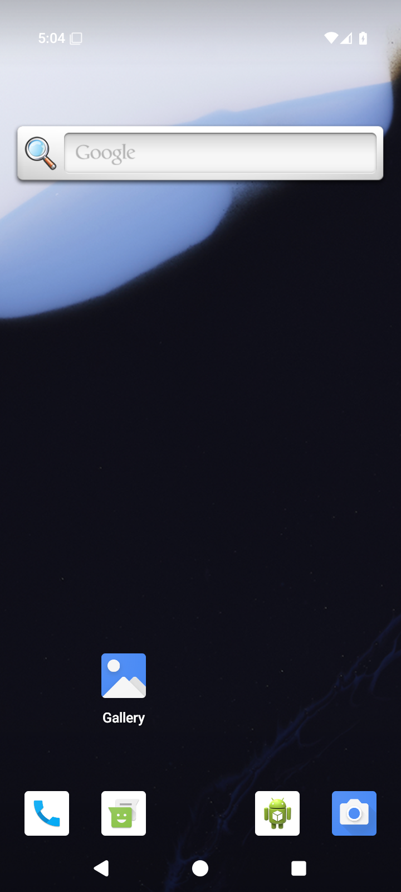</a> <code>3d-home-system-ui.png</code> 3d-home-system-ui — 3d.home-interruption | 720 × 1600 px · 747,603 bytes SHA-256: <code>cb68af334f4adb8ba322545d4776eb9bc8279f24f888c757697aefa0fdf55615</code> Source: <code>/root/projects/PartyDeck/artifacts/evidence-storage/34503251315/android-jvm-reports/build/ci/android/godot-session/debug/runtime/captures/3d-home-system-ui.png</code> Capture: 2026-09-10T17:04:39.923+00:00 → 2026-09-10T17:04:42.810+00:00 [UI XML](runtime/captures/3d-home-system-ui.xml) · [Capture/result JSON](runtime/captures/3d-home-system-ui.json) · [Original result](runtime/godot-session-result.json) | **Attributed peer direct view** by <code>/root/review_release</code>. Android launcher Home is visible. No PartyDeck table or private card face is visible. |
|  <code>3d-leave-cancel-confirmation.png</code> 3d-leave-cancel-confirmation — 3d.leave-cancel | 720 × 1600 px · 41,297 bytes SHA-256: <code>e72d6083b3968d344f810814b2be0afa1b65a63e56dfccab3ac5c8ab1a58dbaf</code> Source: <code>/root/projects/PartyDeck/artifacts/evidence-storage/34503251315/android-jvm-reports/build/ci/android/godot-session/debug/runtime/captures/3d-leave-cancel-confirmation.png</code> Capture: 2026-09-10T17:07:00.830+00:00 → 2026-09-10T17:07:03.313+00:00 [UI XML](runtime/captures/3d-leave-cancel-confirmation.xml) · [Capture/result JSON](runtime/captures/3d-leave-cancel-confirmation.json) · [Original result](runtime/godot-session-result.json) | **Direct original view**. The complete centered Leave the table? modal shows the practice-match explanation, orange Leave table and green Stay at the table actions. Underlying table content is obscured. |
| <a href="runtime/captures/3d-leave-cancel-native-ready.png">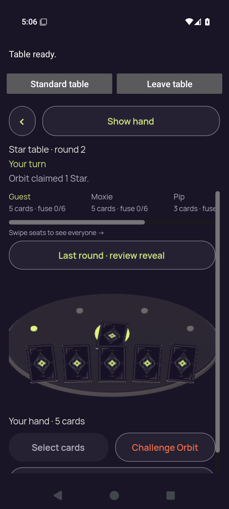</a> <code>3d-leave-cancel-native-ready.png</code> 3d-leave-cancel-native-ready — 3d.leave-cancel | 720 × 1600 px · 196,448 bytes SHA-256: <code>e890051fa350e3c13cf29ca371136697e75174fc78185b34132b7c37dbeadc8c</code> Source: <code>/root/projects/PartyDeck/artifacts/evidence-storage/34503251315/android-jvm-reports/build/ci/android/godot-session/debug/runtime/captures/3d-leave-cancel-native-ready.png</code> Capture: 2026-09-10T17:06:50.795+00:00 → 2026-09-10T17:06:53.332+00:00 [UI XML](runtime/captures/3d-leave-cancel-native-ready.xml) · [Capture/result JSON](runtime/captures/3d-leave-cancel-native-ready.json) · [Original result](runtime/godot-session-result.json) | **Direct original view**. Native 3D shows Table ready, Standard/Leave controls, Show hand and readable Star round 2, Your turn and Orbit&#x27;s one-Star claim. Seat text clips horizontally with a scrollbar. Full Last round review, five backs and Select cards/Challenge Orbit fit; another lower control begins clipped at the bottom. |
|  <code>3d-leave-cancel-return-concealed.png</code> 3d-leave-cancel-return-concealed — 3d.leave-cancel | 720 × 1600 px · 120,388 bytes SHA-256: <code>649f88e6df491862b3cf183fefdab089a15cad3faa8521b1a5655b5d55b0224d</code> Source: <code>/root/projects/PartyDeck/artifacts/evidence-storage/34503251315/android-jvm-reports/build/ci/android/godot-session/debug/runtime/captures/3d-leave-cancel-return-concealed.png</code> Capture: 2026-09-10T17:07:09.858+00:00 → 2026-09-10T17:07:12.365+00:00 [UI XML](runtime/captures/3d-leave-cancel-return-concealed.xml) · [Capture/result JSON](runtime/captures/3d-leave-cancel-return-concealed.json) · [Original result](runtime/godot-session-result.json) | **Direct original view**. The Standard return is concealed with a complete covered-hand panel, Show hand and lower actions. Star round 2 and Orbit&#x27;s claim are readable; Round 1 reveal partly clips at the public-panel lower boundary. No private ranks are displayed. |
|  <code>3d-leave-cancel-return-first-card.png</code> 3d-leave-cancel-return-first-card — 3d.leave-cancel | 720 × 1600 px · 119,992 bytes SHA-256: <code>0d37def5436dbcab534f72b13f0bf9aca4b1a22a1ed5f5e0a19fe95ec3a338ca</code> Source: <code>/root/projects/PartyDeck/artifacts/evidence-storage/34503251315/android-jvm-reports/build/ci/android/godot-session/debug/runtime/captures/3d-leave-cancel-return-first-card.png</code> Capture: 2026-09-10T17:07:25.804+00:00 → 2026-09-10T17:07:28.329+00:00 [UI XML](runtime/captures/3d-leave-cancel-return-first-card.xml) · [Capture/result JSON](runtime/captures/3d-leave-cancel-return-first-card.json) · [Original result](runtime/godot-session-result.json) | **Direct original view**. The returned Standard hand has five full Star/Moon/Crown/Wild/Star cards, 0 of 3 selected, and complete Hide hand and lower actions. Public Star context and Round 1 reveal remain readable. |
|  <code>3d-leave-cancel-return-public.png</code> 3d-leave-cancel-return-public — 3d.leave-cancel | 720 × 1600 px · 120,388 bytes SHA-256: <code>649f88e6df491862b3cf183fefdab089a15cad3faa8521b1a5655b5d55b0224d</code> Source: <code>/root/projects/PartyDeck/artifacts/evidence-storage/34503251315/android-jvm-reports/build/ci/android/godot-session/debug/runtime/captures/3d-leave-cancel-return-public.png</code> Capture: 2026-09-10T17:07:19.048+00:00 → 2026-09-10T17:07:21.546+00:00 [UI XML](runtime/captures/3d-leave-cancel-return-public.xml) · [Capture/result JSON](runtime/captures/3d-leave-cancel-return-public.json) · [Original result](runtime/godot-session-result.json) | **Exact same-batch match**. Exact bytes match separately retained capture 95. Reused pixel observation: The Standard return is concealed with a complete covered-hand panel, Show hand and lower actions. Star round 2 and Orbit&#x27;s claim are readable; Round 1 reveal partly clips at the public-panel lower boundary. No private ranks are displayed. [Reviewed matching original](runtime/captures/3d-leave-cancel-return-concealed.png); original capture identity remains separate. |
|  <code>3d-leave-cancel-return-selection-cleared.png</code> 3d-leave-cancel-return-selection-cleared — 3d.leave-cancel | 720 × 1600 px · 120,388 bytes SHA-256: <code>649f88e6df491862b3cf183fefdab089a15cad3faa8521b1a5655b5d55b0224d</code> Source: <code>/root/projects/PartyDeck/artifacts/evidence-storage/34503251315/android-jvm-reports/build/ci/android/godot-session/debug/runtime/captures/3d-leave-cancel-return-selection-cleared.png</code> Capture: 2026-09-10T17:07:14.455+00:00 → 2026-09-10T17:07:16.954+00:00 [UI XML](runtime/captures/3d-leave-cancel-return-selection-cleared.xml) · [Capture/result JSON](runtime/captures/3d-leave-cancel-return-selection-cleared.json) · [Original result](runtime/godot-session-result.json) | **Exact same-batch match**. Exact bytes match separately retained capture 95. Reused pixel observation: The Standard return is concealed with a complete covered-hand panel, Show hand and lower actions. Star round 2 and Orbit&#x27;s claim are readable; Round 1 reveal partly clips at the public-panel lower boundary. No private ranks are displayed. [Reviewed matching original](runtime/captures/3d-leave-cancel-return-concealed.png); original capture identity remains separate. |
| <a href="runtime/captures/3d-leave-cancel-selected.png">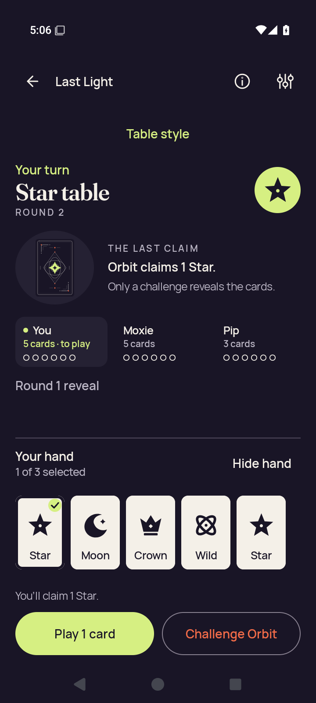</a> <code>3d-leave-cancel-selected.png</code> 3d-leave-cancel-selected — 3d.leave-cancel | 720 × 1600 px · 119,848 bytes SHA-256: <code>a5988a4b38b978d44097f3e199bfad092e02a801e64fbb2c7a02a597ea558a6b</code> Source: <code>/root/projects/PartyDeck/artifacts/evidence-storage/34503251315/android-jvm-reports/build/ci/android/godot-session/debug/runtime/captures/3d-leave-cancel-selected.png</code> Capture: 2026-09-10T17:06:27.371+00:00 → 2026-09-10T17:06:29.877+00:00 [UI XML](runtime/captures/3d-leave-cancel-selected.xml) · [Capture/result JSON](runtime/captures/3d-leave-cancel-selected.json) · [Original result](runtime/godot-session-result.json) | **Direct original view**. The Standard selected hand has five complete Star/Moon/Crown/Wild/Star cards with the first Star checked. 1 of 3 selected, the one-Star claim, Play and Challenge actions fit completely. |
| <a href="runtime/captures/3d-leave-cancel-selector.png">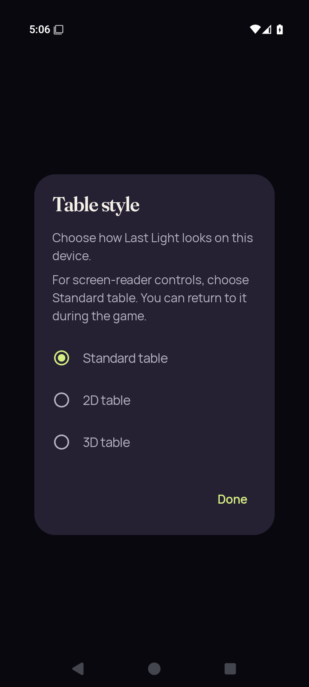</a> <code>3d-leave-cancel-selector.png</code> 3d-leave-cancel-selector — 3d.leave-cancel | 720 × 1600 px · 58,742 bytes SHA-256: <code>a6ee92f1ce9dbd348a9812864d28a4e34514e65157b032d3bfa498466420f451</code> Source: <code>/root/projects/PartyDeck/artifacts/evidence-storage/34503251315/android-jvm-reports/build/ci/android/godot-session/debug/runtime/captures/3d-leave-cancel-selector.png</code> Capture: 2026-09-10T17:06:36.613+00:00 → 2026-09-10T17:06:39.100+00:00 [UI XML](runtime/captures/3d-leave-cancel-selector.xml) · [Capture/result JSON](runtime/captures/3d-leave-cancel-selector.json) · [Original result](runtime/godot-session-result.json) | **Direct original view**. The Table style modal fully contains its guidance, selected Standard option, 2D/3D choices and Done. Private content is obscured. |
|  <code>3d-leave-end-confirmation.png</code> 3d-leave-end-confirmation — 3d.leave-end | 720 × 1600 px · 41,648 bytes SHA-256: <code>402e5e57b0af89b770bf38928ab7e5bc54b95d4698930949ea3a9e9163792d4e</code> Source: <code>/root/projects/PartyDeck/artifacts/evidence-storage/34503251315/android-jvm-reports/build/ci/android/godot-session/debug/runtime/captures/3d-leave-end-confirmation.png</code> Capture: 2026-09-10T17:09:05.032+00:00 → 2026-09-10T17:09:07.503+00:00 [UI XML](runtime/captures/3d-leave-end-confirmation.xml) · [Capture/result JSON](runtime/captures/3d-leave-end-confirmation.json) · [Original result](runtime/godot-session-result.json) | **Direct original view**. The complete centered Leave the table? dialog shows the practice-match explanation, orange Leave table and green Stay at the table. The underlying table is obscured. |
|  <code>3d-leave-end-selector.png</code> 3d-leave-end-selector — 3d.leave-end | 720 × 1600 px · 58,806 bytes SHA-256: <code>aed5c5225f40dbea23180f4077d8fdb246aa888868475d17ca6035bd95811d90</code> Source: <code>/root/projects/PartyDeck/artifacts/evidence-storage/34503251315/android-jvm-reports/build/ci/android/godot-session/debug/runtime/captures/3d-leave-end-selector.png</code> Capture: 2026-09-10T17:08:49.601+00:00 → 2026-09-10T17:08:52.074+00:00 [UI XML](runtime/captures/3d-leave-end-selector.xml) · [Capture/result JSON](runtime/captures/3d-leave-end-selector.json) · [Original result](runtime/godot-session-result.json) | **Direct original view**. The Table style modal shows complete guidance, Standard selection, both renderer choices and Done. No private hand is visible. |
|  <code>3d-recents-resumed.png</code> 3d-recents-resumed — 3d.recents-interruption | 720 × 1600 px · 196,125 bytes SHA-256: <code>d7f052ef470cc54900b7e3ae0299b046468e8222d61060077a51cf5f6adb14aa</code> Source: <code>/root/projects/PartyDeck/artifacts/evidence-storage/34503251315/android-jvm-reports/build/ci/android/godot-session/debug/runtime/captures/3d-recents-resumed.png</code> Capture: 2026-09-10T17:04:56.645+00:00 → 2026-09-10T17:04:59.165+00:00 [UI XML](runtime/captures/3d-recents-resumed.xml) · [Capture/result JSON](runtime/captures/3d-recents-resumed.json) · [Original result](runtime/godot-session-result.json) | **Direct original view**. The resumed native 3D still shows a concealed five-card hand, readable Star turn/claim context and full Show hand, Last round review and primary actions. Seats scroll horizontally and a further bottom control is clipped at the body edge; this still is not continuous privacy proof. |
| <a href="runtime/captures/3d-recents-system-ui.png">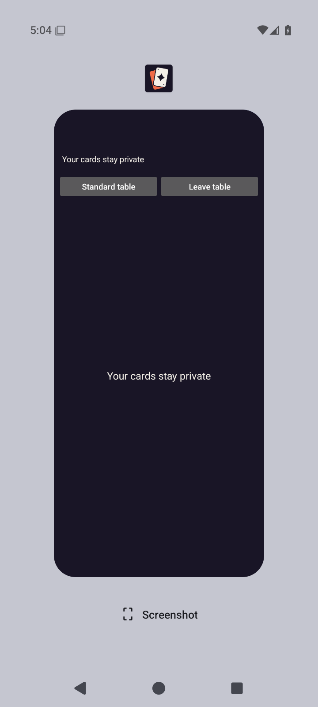</a> <code>3d-recents-system-ui.png</code> 3d-recents-system-ui — 3d.recents-interruption | 720 × 1600 px · 41,804 bytes SHA-256: <code>05c9a934ec9caecb8c16922ab2e19290a7482296f2e7ecee972fdf07a359a115</code> Source: <code>/root/projects/PartyDeck/artifacts/evidence-storage/34503251315/android-jvm-reports/build/ci/android/godot-session/debug/runtime/captures/3d-recents-system-ui.png</code> Capture: 2026-09-10T17:04:50.991+00:00 → 2026-09-10T17:04:53.497+00:00 [UI XML](runtime/captures/3d-recents-system-ui.xml) · [Capture/result JSON](runtime/captures/3d-recents-system-ui.json) · [Original result](runtime/godot-session-result.json) | **Attributed peer direct view** by <code>/root/review_release</code>. Recents shows the PartyDeck task covered by Your cards stay private, with native return controls visible. Engine pixels and private card faces are covered. |
|  <code>3d-standard-concealed.png</code> 3d-standard-concealed — 3d.standard-return | 720 × 1600 px · 120,141 bytes SHA-256: <code>d0c27a40cb1f5940bc66dcb5e05b0e62607de8af5840e58e6816ea62524ed176</code> Source: <code>/root/projects/PartyDeck/artifacts/evidence-storage/34503251315/android-jvm-reports/build/ci/android/godot-session/debug/runtime/captures/3d-standard-concealed.png</code> Capture: 2026-09-10T17:05:06.597+00:00 → 2026-09-10T17:05:09.074+00:00 [UI XML](runtime/captures/3d-standard-concealed.xml) · [Capture/result JSON](runtime/captures/3d-standard-concealed.json) · [Original result](runtime/godot-session-result.json) | **Attributed peer direct view** by <code>/root/review_release</code>. Returned Standard table shows the concealed Your hand panel, Show hand and disabled Select cards. No private card face is visible. |
|  <code>3d-standard-first-card.png</code> 3d-standard-first-card — 3d.standard-return | 720 × 1600 px · 119,763 bytes SHA-256: <code>91f16bd2ec98c70c788b6b3b7e270bd298693ace8420c288e05b92fe66116d77</code> Source: <code>/root/projects/PartyDeck/artifacts/evidence-storage/34503251315/android-jvm-reports/build/ci/android/godot-session/debug/runtime/captures/3d-standard-first-card.png</code> Capture: 2026-09-10T17:05:22.454+00:00 → 2026-09-10T17:05:24.974+00:00 [UI XML](runtime/captures/3d-standard-first-card.xml) · [Capture/result JSON](runtime/captures/3d-standard-first-card.json) · [Original result](runtime/godot-session-result.json) | **Direct original view**. The Standard hand has five complete Star/Moon/Crown/Wild/Star cards, no selection and full Hide hand/lower actions. Star turn/claim context and Round 1 reveal are readable. |
| <a href="runtime/captures/3d-standard-play-after-play.png">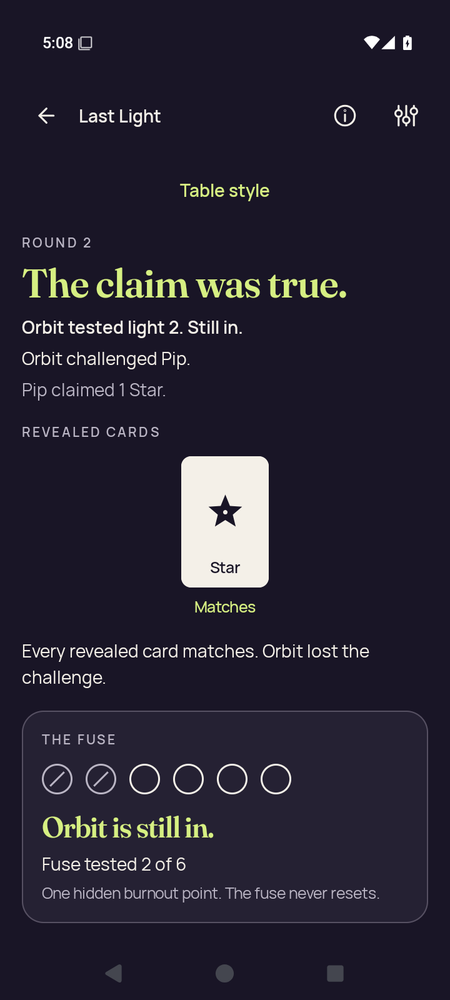</a> <code>3d-standard-play-after-play.png</code> 3d-standard-play-after-play — 3d.standard-action | 720 × 1600 px · 93,271 bytes SHA-256: <code>8e1aa92fade3de7142cc50ff1119730833db43bba79c2523ea88922d0cad359b</code> Source: <code>/root/projects/PartyDeck/artifacts/evidence-storage/34503251315/android-jvm-reports/build/ci/android/godot-session/debug/runtime/captures/3d-standard-play-after-play.png</code> Capture: 2026-09-10T17:08:40.431+00:00 → 2026-09-10T17:08:42.926+00:00 [UI XML](runtime/captures/3d-standard-play-after-play.xml) · [Capture/result JSON](runtime/captures/3d-standard-play-after-play.json) · [Original result](runtime/godot-session-result.json) | **Direct original view**. The Standard result fully identifies Orbit challenging Pip&#x27;s true one-Star claim. The matching Star, challenge explanation and Orbit is still in/fuse tested 2 of 6 panel are readable; continuation is below the captured view. |
|  <code>3d-standard-play-selected.png</code> 3d-standard-play-selected — 3d.standard-action | 720 × 1600 px · 119,916 bytes SHA-256: <code>947ab50c173cb77a8ff23e857b61cbbc237829d28df081e7213dc4c25b42dec4</code> Source: <code>/root/projects/PartyDeck/artifacts/evidence-storage/34503251315/android-jvm-reports/build/ci/android/godot-session/debug/runtime/captures/3d-standard-play-selected.png</code> Capture: 2026-09-10T17:08:33.521+00:00 → 2026-09-10T17:08:36.028+00:00 [UI XML](runtime/captures/3d-standard-play-selected.xml) · [Capture/result JSON](runtime/captures/3d-standard-play-selected.json) · [Original result](runtime/godot-session-result.json) | **Direct original view**. The Standard selected hand has all five complete cards with the first Star checked. 1 of 3 selected, one-Star claim feedback and full Play 1 card/Challenge Orbit controls fit under the Star context. |
|  <code>3d-standard-public.png</code> 3d-standard-public — 3d.standard-return | 720 × 1600 px · 120,141 bytes SHA-256: <code>d0c27a40cb1f5940bc66dcb5e05b0e62607de8af5840e58e6816ea62524ed176</code> Source: <code>/root/projects/PartyDeck/artifacts/evidence-storage/34503251315/android-jvm-reports/build/ci/android/godot-session/debug/runtime/captures/3d-standard-public.png</code> Capture: 2026-09-10T17:05:15.725+00:00 → 2026-09-10T17:05:18.208+00:00 [UI XML](runtime/captures/3d-standard-public.xml) · [Capture/result JSON](runtime/captures/3d-standard-public.json) · [Original result](runtime/godot-session-result.json) | **Exact same-batch match**. Exact bytes match separately retained capture 105. Reused pixel observation: Returned Standard table shows the concealed Your hand panel, Show hand and disabled Select cards. No private card face is visible. [Reviewed matching original](runtime/captures/3d-standard-concealed.png); original capture identity remains separate. |
|  <code>3d-standard-selection-cleared.png</code> 3d-standard-selection-cleared — 3d.standard-return | 720 × 1600 px · 120,141 bytes SHA-256: <code>d0c27a40cb1f5940bc66dcb5e05b0e62607de8af5840e58e6816ea62524ed176</code> Source: <code>/root/projects/PartyDeck/artifacts/evidence-storage/34503251315/android-jvm-reports/build/ci/android/godot-session/debug/runtime/captures/3d-standard-selection-cleared.png</code> Capture: 2026-09-10T17:05:11.160+00:00 → 2026-09-10T17:05:13.637+00:00 [UI XML](runtime/captures/3d-standard-selection-cleared.xml) · [Capture/result JSON](runtime/captures/3d-standard-selection-cleared.json) · [Original result](runtime/godot-session-result.json) | **Exact same-batch match**. Exact bytes match separately retained capture 105. Reused pixel observation: Returned Standard table shows the concealed Your hand panel, Show hand and disabled Select cards. No private card face is visible. [Reviewed matching original](runtime/captures/3d-standard-concealed.png); original capture identity remains separate. |
|  <code>final-diagnostic.png</code> final-diagnostic — 3d.leave-end | 720 × 1600 px · 132,390 bytes SHA-256: <code>a44eef7fdd0051ab75074f674b3ffd9c6522b9980373f94a1f08a4c039d94f48</code> Source: <code>/root/projects/PartyDeck/artifacts/evidence-storage/34503251315/android-jvm-reports/build/ci/android/godot-session/debug/runtime/captures/final-diagnostic.png</code> Capture: 2026-09-10T17:09:16.815+00:00 → 2026-09-10T17:09:19.319+00:00 [UI XML](runtime/captures/final-diagnostic.xml) · [Capture/result JSON](runtime/captures/final-diagnostic.json) · [Original result](runtime/godot-session-result.json) | **Exact same-batch match**. Exact bytes match separately retained capture 90. Reused pixel observation: The returned normal Home shows the entire brand/headline illustration and complete Host, Join, Practice, How to play and Settings actions. [Reviewed matching original](runtime/captures/3d-home-after-session-end.png); original capture identity remains separate. |
|  <code>home-cold.png</code> home-cold — emulator readiness | 720 × 1600 px · 131,652 bytes SHA-256: <code>f3126d8abe6315d35b4f44ba9d4d59c44acfba5cbdc369960944cadeb33032fc</code> Source: <code>/root/projects/PartyDeck/artifacts/evidence-storage/34503251315/android-jvm-reports/build/ci/android/godot-session/debug/runtime/captures/home-cold.png</code> Capture: 2026-09-10T16:54:52.273+00:00 → 2026-09-10T16:54:54.780+00:00 [UI XML](runtime/captures/home-cold.xml) · [Capture/result JSON](runtime/captures/home-cold.json) · [Original result](runtime/godot-session-result.json) | **Direct original view**. Normal Home fully shows the PartyDeck brand, headline, card artwork, Last Light copy and Host, Join, Practice, How to play and Settings actions. |
