# API 35 native sessions — optimized-test-signed

[All collections](../../../README.md) · [Preserved evidence index](../../evidence-index.md) · [Copy/review binding](../../provenance/publication-review/partydeck-gallery-2815-publication-binding-v1.json) · [Completed visual review](../../provenance/publication-review/partydeck-gallery-after-2355-api35-visual-review-v1.json) · [Unchanged source mapping](../../provenance/source-map/capture-gallery-mapping.json)

**19 native session checks passed; two renderer-death checks were explicitly skipped. Engine gameplay was not invoked; no continuous privacy or TalkBack acceptance.**

Original PNG/XML/JSON acquisitions are sequential. Runtime capture names, stages and timestamps retain the source identity.

Both ordinary debug and optimized smokes pass. Native debug passes 21 checks, including two guarded renderer-death checks; optimized passes 19 checks and explicitly skips the two renderer-death checks. Engine gameplay was not invoked. The frozen independent review records 262 JUnit tests in 41 suites with no failures/errors/skips, 155 passing host tests and 11 lint warnings. These results add no TalkBack or continuous-privacy acceptance.

Normal Standard hands and selection/actions fit. Several Round 1 reveal labels clip at a public-panel edge. Native old-PCK 2D initial Reveal fits narrowly while the cover bottom clips; 3D seats scroll horizontally. The optimized no-claim round-1 result fits the full Return to lobby action. The debug round-2 claim plus previous-round-review state continues below the body. Enlarged intermediate hand, Rules and Settings content requires scrolling; scrolled Play/Challenge and Rules → Practice fit. The enlarged debug invalid-Join button crosses the right viewport edge while the optimized counterpart fits. The optimized original named large-text-rules-practice-entered.png visibly shows a round result. Sequential PNG/XML are not atomic.

Source revision: `1cd34a36753ed0112e6684f6525592dab8ef2edb`. CI run: [34503251315](https://github.com/Apdelrahman1911/PartyDeck/actions/runs/34503251315). 68 original PNG identities. Review methods: 45 direct original view, 15 exact same-batch match, 8 attributed peer direct view.

Every thumbnail opens the unchanged original PNG. Original filenames, dimensions, source paths and outcomes remain separate even when pixels match. No derivative image was created. Frozen provenance pages retain their original text and source references.

| Original capture | Original identity and evidence | Visual observation |
| --- | --- | --- |
|  <code>2d-action-entry-native-ready.png</code> 2d-action-entry-native-ready — 2d.standard-action | 720 × 1600 px · 163,960 bytes SHA-256: <code>0e98a981050fe72d88171d7d1c901164e3dda066dfbc6f112c2df35df63645e4</code> Source: <code>/root/projects/PartyDeck/artifacts/evidence-storage/34503251315/android-jvm-reports/build/ci/android/godot-session/optimized-test-signed/runtime/captures/2d-action-entry-native-ready.png</code> Capture: 2026-09-10T17:22:22.742+00:00 → 2026-09-10T17:22:25.248+00:00 [UI XML](runtime/captures/2d-action-entry-native-ready.xml) · [Capture/result JSON](runtime/captures/2d-action-entry-native-ready.json) · [Original result](runtime/godot-session-result.json) | **Direct original view**. Optimized native 2D shows Table ready, native return/leave controls, Exit, Your turn, Crown round 2 and Orbit&#x27;s three-Crown claim. The full Reveal button narrowly fits above the body edge while its cover panel bottom clips. Both fixed lower actions fit. |
|  <code>2d-action-entry-selected.png</code> 2d-action-entry-selected — 2d.standard-action | 720 × 1600 px · 130,476 bytes SHA-256: <code>74690e45c84f5cf31d5d710c1a66400ab1b3e0f45458099e4ee12c6df4cfd0bb</code> Source: <code>/root/projects/PartyDeck/artifacts/evidence-storage/34503251315/android-jvm-reports/build/ci/android/godot-session/optimized-test-signed/runtime/captures/2d-action-entry-selected.png</code> Capture: 2026-09-10T17:22:02.992+00:00 → 2026-09-10T17:22:05.478+00:00 [UI XML](runtime/captures/2d-action-entry-selected.xml) · [Capture/result JSON](runtime/captures/2d-action-entry-selected.json) · [Original result](runtime/godot-session-result.json) | **Direct original view**. The Standard selected hand shows five full Crown/Moon/Crown/Moon/Star cards with the first Crown checked. Selection count, one-Crown claim feedback and Play/Challenge fit below readable Crown turn/claim context. |
|  <code>2d-action-entry-selector.png</code> 2d-action-entry-selector — 2d.standard-action | 720 × 1600 px · 58,185 bytes SHA-256: <code>ce738d28e0d24dcd4efbb24106d5e94a8e41914f730486c3cb8dde2ffd79af3d</code> Source: <code>/root/projects/PartyDeck/artifacts/evidence-storage/34503251315/android-jvm-reports/build/ci/android/godot-session/optimized-test-signed/runtime/captures/2d-action-entry-selector.png</code> Capture: 2026-09-10T17:22:12.256+00:00 → 2026-09-10T17:22:14.747+00:00 [UI XML](runtime/captures/2d-action-entry-selector.xml) · [Capture/result JSON](runtime/captures/2d-action-entry-selector.json) · [Original result](runtime/godot-session-result.json) | **Direct original view**. The centered Table style modal fully shows Standard selection, 2D/3D choices, guidance and Done. Private hand content is obscured. |
|  <code>2d-action-return-concealed.png</code> 2d-action-return-concealed — 2d.standard-action | 720 × 1600 px · 133,579 bytes SHA-256: <code>cb01cbaffb6ab23d123b02041a8a6c72ee3eb0a2fbbd7c6f81628096e2ef717c</code> Source: <code>/root/projects/PartyDeck/artifacts/evidence-storage/34503251315/android-jvm-reports/build/ci/android/godot-session/optimized-test-signed/runtime/captures/2d-action-return-concealed.png</code> Capture: 2026-09-10T17:22:32.602+00:00 → 2026-09-10T17:22:35.089+00:00 [UI XML](runtime/captures/2d-action-return-concealed.xml) · [Capture/result JSON](runtime/captures/2d-action-return-concealed.json) · [Original result](runtime/godot-session-result.json) | **Direct original view**. The Standard return shows a complete covered-hand panel, Show hand and both lower actions without private ranks. Crown round/turn/claim context fits; Round 1 reveal partly clips at the public-panel lower edge. |
| <a href="runtime/captures/2d-action-return-first-card.png">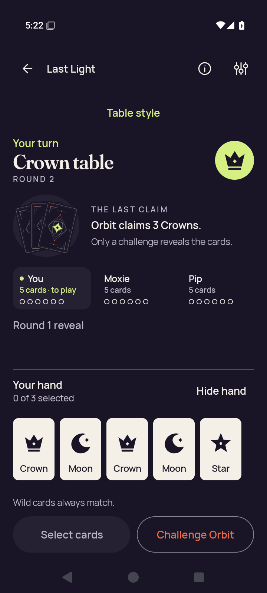</a> <code>2d-action-return-first-card.png</code> 2d-action-return-first-card — 2d.standard-action | 720 × 1600 px · 129,978 bytes SHA-256: <code>2eef2522ac1041ab206916f59bc3846ca812f9720b686a07c0003ffaa7ec9937</code> Source: <code>/root/projects/PartyDeck/artifacts/evidence-storage/34503251315/android-jvm-reports/build/ci/android/godot-session/optimized-test-signed/runtime/captures/2d-action-return-first-card.png</code> Capture: 2026-09-10T17:22:48.514+00:00 → 2026-09-10T17:22:51.020+00:00 [UI XML](runtime/captures/2d-action-return-first-card.xml) · [Capture/result JSON](runtime/captures/2d-action-return-first-card.json) · [Original result](runtime/godot-session-result.json) | **Direct original view**. The Standard returned hand has five complete Crown/Moon/Crown/Moon/Star cards, no selection, and full Hide hand/lower actions. Crown turn/claim context and Round 1 reveal are readable. |
|  <code>2d-action-return-public.png</code> 2d-action-return-public — 2d.standard-action | 720 × 1600 px · 133,579 bytes SHA-256: <code>cb01cbaffb6ab23d123b02041a8a6c72ee3eb0a2fbbd7c6f81628096e2ef717c</code> Source: <code>/root/projects/PartyDeck/artifacts/evidence-storage/34503251315/android-jvm-reports/build/ci/android/godot-session/optimized-test-signed/runtime/captures/2d-action-return-public.png</code> Capture: 2026-09-10T17:22:41.784+00:00 → 2026-09-10T17:22:44.274+00:00 [UI XML](runtime/captures/2d-action-return-public.xml) · [Capture/result JSON](runtime/captures/2d-action-return-public.json) · [Original result](runtime/godot-session-result.json) | **Exact same-batch match**. Exact bytes match separately retained capture 116. Reused pixel observation: The Standard return shows a complete covered-hand panel, Show hand and both lower actions without private ranks. Crown round/turn/claim context fits; Round 1 reveal partly clips at the public-panel lower edge. [Reviewed matching original](runtime/captures/2d-action-return-concealed.png); original capture identity remains separate. |
|  <code>2d-action-return-selection-cleared.png</code> 2d-action-return-selection-cleared — 2d.standard-action | 720 × 1600 px · 133,579 bytes SHA-256: <code>cb01cbaffb6ab23d123b02041a8a6c72ee3eb0a2fbbd7c6f81628096e2ef717c</code> Source: <code>/root/projects/PartyDeck/artifacts/evidence-storage/34503251315/android-jvm-reports/build/ci/android/godot-session/optimized-test-signed/runtime/captures/2d-action-return-selection-cleared.png</code> Capture: 2026-09-10T17:22:37.188+00:00 → 2026-09-10T17:22:39.687+00:00 [UI XML](runtime/captures/2d-action-return-selection-cleared.xml) · [Capture/result JSON](runtime/captures/2d-action-return-selection-cleared.json) · [Original result](runtime/godot-session-result.json) | **Exact same-batch match**. Exact bytes match separately retained capture 116. Reused pixel observation: The Standard return shows a complete covered-hand panel, Show hand and both lower actions without private ranks. Crown round/turn/claim context fits; Round 1 reveal partly clips at the public-panel lower edge. [Reviewed matching original](runtime/captures/2d-action-return-concealed.png); original capture identity remains separate. |
| <a href="runtime/captures/2d-baseline-first-card.png">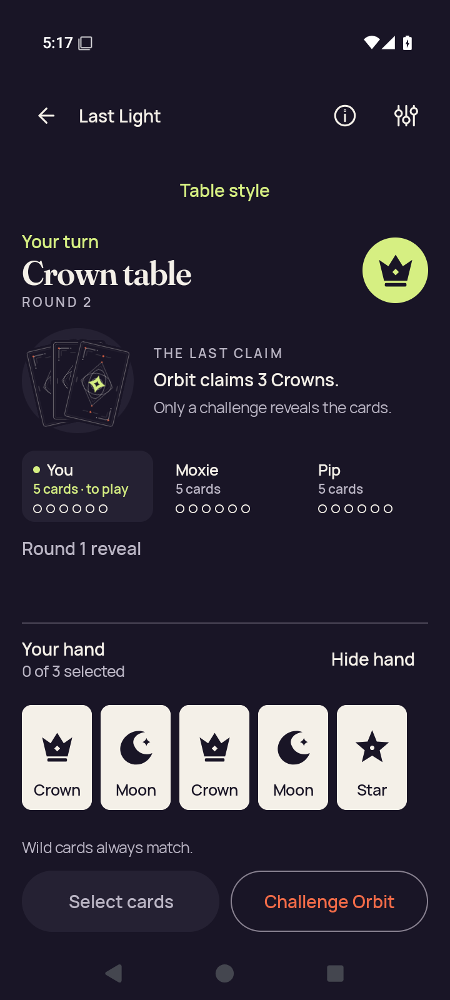</a> <code>2d-baseline-first-card.png</code> 2d-baseline-first-card — 2d.practice-baseline | 720 × 1600 px · 129,957 bytes SHA-256: <code>1b559e80f6ef413ee326cde45749c8e74fc8ea8a59943d8e4cd62087e6779e77</code> Source: <code>/root/projects/PartyDeck/artifacts/evidence-storage/34503251315/android-jvm-reports/build/ci/android/godot-session/optimized-test-signed/runtime/captures/2d-baseline-first-card.png</code> Capture: 2026-09-10T17:17:54.864+00:00 → 2026-09-10T17:17:57.365+00:00 [UI XML](runtime/captures/2d-baseline-first-card.xml) · [Capture/result JSON](runtime/captures/2d-baseline-first-card.json) · [Original result](runtime/godot-session-result.json) | **Direct original view**. The Standard baseline shows five complete Crown/Moon/Crown/Moon/Star cards, no selection and full Hide hand/lower actions. Crown turn/claim context and Round 1 reveal remain readable. |
|  <code>2d-baseline-public.png</code> 2d-baseline-public — 2d.practice-baseline | 720 × 1600 px · 133,672 bytes SHA-256: <code>349bdd7eb153bf374087d2f5dfd8ecfb680f325628d84564b6ce599d30d21173</code> Source: <code>/root/projects/PartyDeck/artifacts/evidence-storage/34503251315/android-jvm-reports/build/ci/android/godot-session/optimized-test-signed/runtime/captures/2d-baseline-public.png</code> Capture: 2026-09-10T17:17:48.080+00:00 → 2026-09-10T17:17:50.593+00:00 [UI XML](runtime/captures/2d-baseline-public.xml) · [Capture/result JSON](runtime/captures/2d-baseline-public.json) · [Original result](runtime/godot-session-result.json) | **Direct original view**. The Standard baseline keeps the full hand cover, Show hand and lower actions visible with no private ranks. Crown turn/claim context fits; Round 1 reveal partly clips at the public-panel boundary. |
| <a href="runtime/captures/2d-baseline-selected.png">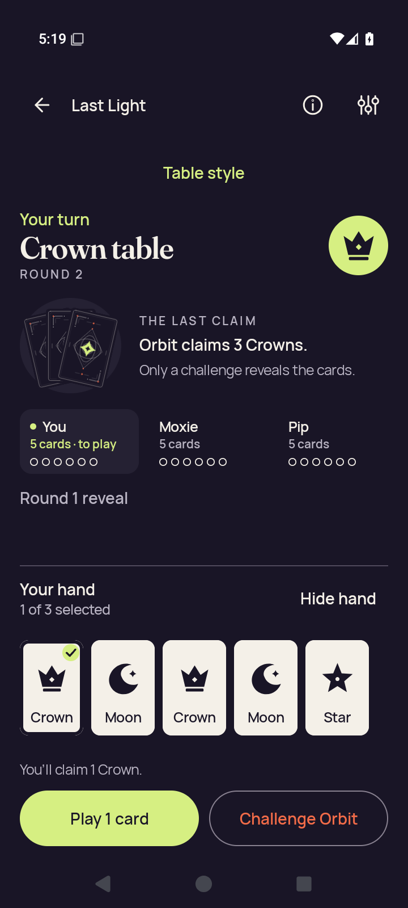</a> <code>2d-baseline-selected.png</code> 2d-baseline-selected — 2d.standard-hand | 720 × 1600 px · 130,682 bytes SHA-256: <code>878fb3f86cde7828e14852eb3298c08fd987ec504cb7dd502d653454556f7939</code> Source: <code>/root/projects/PartyDeck/artifacts/evidence-storage/34503251315/android-jvm-reports/build/ci/android/godot-session/optimized-test-signed/runtime/captures/2d-baseline-selected.png</code> Capture: 2026-09-10T17:19:42.734+00:00 → 2026-09-10T17:19:45.223+00:00 [UI XML](runtime/captures/2d-baseline-selected.xml) · [Capture/result JSON](runtime/captures/2d-baseline-selected.json) · [Original result](runtime/godot-session-result.json) | **Direct original view**. The Standard baseline selected state shows the first Crown checked, all five cards, selection count and one-Crown claim feedback. Full Play/Challenge controls fit beneath the public context. |
|  <code>2d-entry-native-ready.png</code> 2d-entry-native-ready — 2d.native-entry | 720 × 1600 px · 164,496 bytes SHA-256: <code>b4fca806633d27692c9eb5f52b4107b46fd1cf81d7144315133b6a436608894d</code> Source: <code>/root/projects/PartyDeck/artifacts/evidence-storage/34503251315/android-jvm-reports/build/ci/android/godot-session/optimized-test-signed/runtime/captures/2d-entry-native-ready.png</code> Capture: 2026-09-10T17:20:02.419+00:00 → 2026-09-10T17:20:04.923+00:00 [UI XML](runtime/captures/2d-entry-native-ready.xml) · [Capture/result JSON](runtime/captures/2d-entry-native-ready.json) · [Original result](runtime/godot-session-result.json) | **Attributed peer direct view** by <code>/root/review_release</code>. Visible 2D table, Table ready/native return controls, public claim and concealed hand panel. No private card face is visible. |
|  <code>2d-entry-selector.png</code> 2d-entry-selector — 2d.native-entry | 720 × 1600 px · 58,393 bytes SHA-256: <code>6bf044506d52eaab638c387e598607d65b8fb85c29c1681f8bf7cb94068d4662</code> Source: <code>/root/projects/PartyDeck/artifacts/evidence-storage/34503251315/android-jvm-reports/build/ci/android/godot-session/optimized-test-signed/runtime/captures/2d-entry-selector.png</code> Capture: 2026-09-10T17:19:51.904+00:00 → 2026-09-10T17:19:54.407+00:00 [UI XML](runtime/captures/2d-entry-selector.xml) · [Capture/result JSON](runtime/captures/2d-entry-selector.json) · [Original result](runtime/godot-session-result.json) | **Direct original view**. The Table style modal fully shows guidance, Standard selection, both renderer choices and Done. Private content is obscured. |
|  <code>2d-home-after-session-end.png</code> 2d-home-after-session-end — 2d.leave-end | 720 × 1600 px · 132,341 bytes SHA-256: <code>0b903d384a19606076cf49dad3a5c042837e308ea8f75e4083b3f87aebb62d0f</code> Source: <code>/root/projects/PartyDeck/artifacts/evidence-storage/34503251315/android-jvm-reports/build/ci/android/godot-session/optimized-test-signed/runtime/captures/2d-home-after-session-end.png</code> Capture: 2026-09-10T17:23:36.060+00:00 → 2026-09-10T17:23:38.542+00:00 [UI XML](runtime/captures/2d-home-after-session-end.xml) · [Capture/result JSON](runtime/captures/2d-home-after-session-end.json) · [Original result](runtime/godot-session-result.json) | **Direct original view**. After session end, the full Home brand/headline and card illustration are visible. Host, Join, Practice, How to play and Settings all fit. |
|  <code>2d-home-resumed.png</code> 2d-home-resumed — 2d.home-interruption | 720 × 1600 px · 164,370 bytes SHA-256: <code>744b2a2bd1c92f3523811186a866e2bff92de54c4005f7efd5c21ace757f2207</code> Source: <code>/root/projects/PartyDeck/artifacts/evidence-storage/34503251315/android-jvm-reports/build/ci/android/godot-session/optimized-test-signed/runtime/captures/2d-home-resumed.png</code> Capture: 2026-09-10T17:20:13.809+00:00 → 2026-09-10T17:20:16.304+00:00 [UI XML](runtime/captures/2d-home-resumed.xml) · [Capture/result JSON](runtime/captures/2d-home-resumed.json) · [Original result](runtime/godot-session-result.json) | **Direct original view**. After Home resume, native 2D is concealed with readable Table ready/native controls, turn, Crown rank and Orbit&#x27;s three-Crown claim. Reveal narrowly fits while the cover bottom clips; both fixed lower actions are complete. This still does not establish transition privacy. |
|  <code>2d-home-system-ui.png</code> 2d-home-system-ui — 2d.home-interruption | 720 × 1600 px · 747,596 bytes SHA-256: <code>7d8d922330b39d3de26ee376950ff3ba595aa8bf6749b5c95a216431456b8868</code> Source: <code>/root/projects/PartyDeck/artifacts/evidence-storage/34503251315/android-jvm-reports/build/ci/android/godot-session/optimized-test-signed/runtime/captures/2d-home-system-ui.png</code> Capture: 2026-09-10T17:20:07.879+00:00 → 2026-09-10T17:20:10.752+00:00 [UI XML](runtime/captures/2d-home-system-ui.xml) · [Capture/result JSON](runtime/captures/2d-home-system-ui.json) · [Original result](runtime/godot-session-result.json) | **Attributed peer direct view** by <code>/root/review_release</code>. Android launcher Home is visible. No PartyDeck table or private card face is visible. |
|  <code>2d-leave-cancel-confirmation.png</code> 2d-leave-cancel-confirmation — 2d.leave-cancel | 720 × 1600 px · 40,815 bytes SHA-256: <code>7f36f4b2093284d24899575cb19597e05d9efeebd4cb976286503768e59ba8fe</code> Source: <code>/root/projects/PartyDeck/artifacts/evidence-storage/34503251315/android-jvm-reports/build/ci/android/godot-session/optimized-test-signed/runtime/captures/2d-leave-cancel-confirmation.png</code> Capture: 2026-09-10T17:21:29.093+00:00 → 2026-09-10T17:21:31.577+00:00 [UI XML](runtime/captures/2d-leave-cancel-confirmation.xml) · [Capture/result JSON](runtime/captures/2d-leave-cancel-confirmation.json) · [Original result](runtime/godot-session-result.json) | **Direct original view**. The full Leave the table? dialog and practice-match explanation are readable, with complete Leave table and Stay at the table actions. Underlying table content is obscured. |
|  <code>2d-leave-cancel-native-ready.png</code> 2d-leave-cancel-native-ready — 2d.leave-cancel | 720 × 1600 px · 164,039 bytes SHA-256: <code>68dc854ac48f79d9bdd04596e1e6c6b873cfb0ad29cef8ffd1e24f504a27f77e</code> Source: <code>/root/projects/PartyDeck/artifacts/evidence-storage/34503251315/android-jvm-reports/build/ci/android/godot-session/optimized-test-signed/runtime/captures/2d-leave-cancel-native-ready.png</code> Capture: 2026-09-10T17:21:18.980+00:00 → 2026-09-10T17:21:21.478+00:00 [UI XML](runtime/captures/2d-leave-cancel-native-ready.xml) · [Capture/result JSON](runtime/captures/2d-leave-cancel-native-ready.json) · [Original result](runtime/godot-session-result.json) | **Direct original view**. Native 2D shows the complete Reveal button narrowly above the scroll boundary, with the cover panel bottom clipped. Table ready/native controls, Crown turn/claim context and both fixed lower actions fit; private ranks remain concealed. |
|  <code>2d-leave-cancel-return-concealed.png</code> 2d-leave-cancel-return-concealed — 2d.leave-cancel | 720 × 1600 px · 133,669 bytes SHA-256: <code>291337b0a6d8a68a40878ff0c90dcabf66fc47b08b7375a8432af7d734c48df1</code> Source: <code>/root/projects/PartyDeck/artifacts/evidence-storage/34503251315/android-jvm-reports/build/ci/android/godot-session/optimized-test-signed/runtime/captures/2d-leave-cancel-return-concealed.png</code> Capture: 2026-09-10T17:21:38.077+00:00 → 2026-09-10T17:21:40.565+00:00 [UI XML](runtime/captures/2d-leave-cancel-return-concealed.xml) · [Capture/result JSON](runtime/captures/2d-leave-cancel-return-concealed.json) · [Original result](runtime/godot-session-result.json) | **Direct original view**. The returned Standard state is concealed with full cover, Show hand and lower actions. Crown turn and Orbit&#x27;s three-Crown claim are readable; Round 1 reveal partly clips at the public-panel boundary. |
|  <code>2d-leave-cancel-return-first-card.png</code> 2d-leave-cancel-return-first-card — 2d.leave-cancel | 720 × 1600 px · 130,224 bytes SHA-256: <code>89805366fbf9558ff37470e1b8dfb2d2fade656b310e887cdb59b5454583e347</code> Source: <code>/root/projects/PartyDeck/artifacts/evidence-storage/34503251315/android-jvm-reports/build/ci/android/godot-session/optimized-test-signed/runtime/captures/2d-leave-cancel-return-first-card.png</code> Capture: 2026-09-10T17:21:54.040+00:00 → 2026-09-10T17:21:56.536+00:00 [UI XML](runtime/captures/2d-leave-cancel-return-first-card.xml) · [Capture/result JSON](runtime/captures/2d-leave-cancel-return-first-card.json) · [Original result](runtime/godot-session-result.json) | **Direct original view**. The Standard returned hand displays five complete Crown/Moon/Crown/Moon/Star cards, no selection and full Hide hand/lower actions. Public Crown context and Round 1 reveal fit. |
| <a href="runtime/captures/2d-leave-cancel-return-public.png">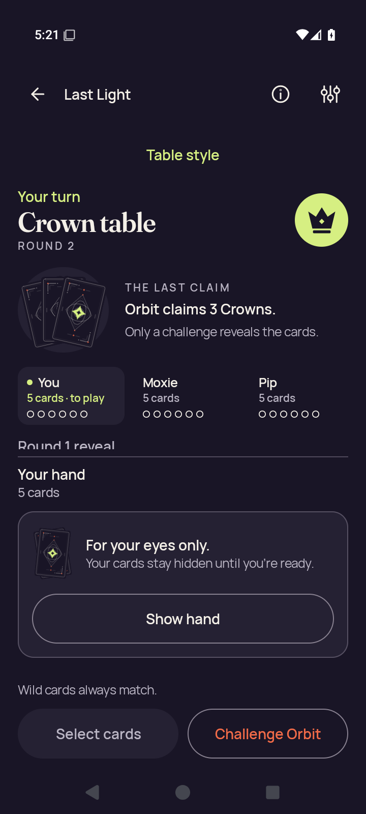</a> <code>2d-leave-cancel-return-public.png</code> 2d-leave-cancel-return-public — 2d.leave-cancel | 720 × 1600 px · 133,808 bytes SHA-256: <code>5c3758b0f7b12659149882f489dd6a93f92a7c5ecb74154692d4a85e317731a0</code> Source: <code>/root/projects/PartyDeck/artifacts/evidence-storage/34503251315/android-jvm-reports/build/ci/android/godot-session/optimized-test-signed/runtime/captures/2d-leave-cancel-return-public.png</code> Capture: 2026-09-10T17:21:47.289+00:00 → 2026-09-10T17:21:49.779+00:00 [UI XML](runtime/captures/2d-leave-cancel-return-public.xml) · [Capture/result JSON](runtime/captures/2d-leave-cancel-return-public.json) · [Original result](runtime/godot-session-result.json) | **Direct original view**. The Standard public return capture shows the full concealed-hand panel, Show hand and both lower actions without private ranks. Crown context is readable; the Round 1 reveal label partly clips at the public-panel boundary. |
|  <code>2d-leave-cancel-return-selection-cleared.png</code> 2d-leave-cancel-return-selection-cleared — 2d.leave-cancel | 720 × 1600 px · 133,669 bytes SHA-256: <code>291337b0a6d8a68a40878ff0c90dcabf66fc47b08b7375a8432af7d734c48df1</code> Source: <code>/root/projects/PartyDeck/artifacts/evidence-storage/34503251315/android-jvm-reports/build/ci/android/godot-session/optimized-test-signed/runtime/captures/2d-leave-cancel-return-selection-cleared.png</code> Capture: 2026-09-10T17:21:42.662+00:00 → 2026-09-10T17:21:45.160+00:00 [UI XML](runtime/captures/2d-leave-cancel-return-selection-cleared.xml) · [Capture/result JSON](runtime/captures/2d-leave-cancel-return-selection-cleared.json) · [Original result](runtime/godot-session-result.json) | **Exact same-batch match**. Exact bytes match separately retained capture 130. Reused pixel observation: The returned Standard state is concealed with full cover, Show hand and lower actions. Crown turn and Orbit&#x27;s three-Crown claim are readable; Round 1 reveal partly clips at the public-panel boundary. [Reviewed matching original](runtime/captures/2d-leave-cancel-return-concealed.png); original capture identity remains separate. |
|  <code>2d-leave-cancel-selected.png</code> 2d-leave-cancel-selected — 2d.leave-cancel | 720 × 1600 px · 130,408 bytes SHA-256: <code>5a0e5491adebd5671f5325df5a485023438b83283cffdb4b3669883af0fd54b4</code> Source: <code>/root/projects/PartyDeck/artifacts/evidence-storage/34503251315/android-jvm-reports/build/ci/android/godot-session/optimized-test-signed/runtime/captures/2d-leave-cancel-selected.png</code> Capture: 2026-09-10T17:20:59.355+00:00 → 2026-09-10T17:21:01.858+00:00 [UI XML](runtime/captures/2d-leave-cancel-selected.xml) · [Capture/result JSON](runtime/captures/2d-leave-cancel-selected.json) · [Original result](runtime/godot-session-result.json) | **Direct original view**. The Standard pre-leave selection shows five complete cards with the first Crown checked. Selection count, one-Crown claim feedback and full Play/Challenge actions are visible beneath readable Crown context. |
|  <code>2d-leave-cancel-selector.png</code> 2d-leave-cancel-selector — 2d.leave-cancel | 720 × 1600 px · 58,111 bytes SHA-256: <code>0a07049d9db994f749f88212f225ef1c38f7d5a369f3765c4db2191aaf6f7d26</code> Source: <code>/root/projects/PartyDeck/artifacts/evidence-storage/34503251315/android-jvm-reports/build/ci/android/godot-session/optimized-test-signed/runtime/captures/2d-leave-cancel-selector.png</code> Capture: 2026-09-10T17:21:08.513+00:00 → 2026-09-10T17:21:10.984+00:00 [UI XML](runtime/captures/2d-leave-cancel-selector.xml) · [Capture/result JSON](runtime/captures/2d-leave-cancel-selector.json) · [Original result](runtime/godot-session-result.json) | **Direct original view**. The Table style dialog fully contains Standard selection, both renderer choices, all guidance and Done. Private content is obscured. |
| <a href="runtime/captures/2d-leave-end-confirmation.png">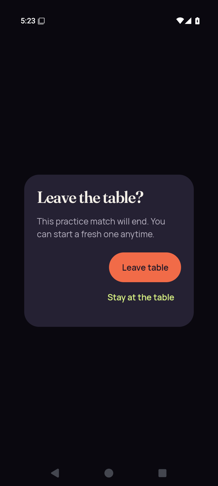</a> <code>2d-leave-end-confirmation.png</code> 2d-leave-end-confirmation — 2d.leave-end | 720 × 1600 px · 41,460 bytes SHA-256: <code>c6aa7dac3a3d66a7d57b0dff85edf6ce00ea45dd0890cfec668821b6f304cbc7</code> Source: <code>/root/projects/PartyDeck/artifacts/evidence-storage/34503251315/android-jvm-reports/build/ci/android/godot-session/optimized-test-signed/runtime/captures/2d-leave-end-confirmation.png</code> Capture: 2026-09-10T17:23:27.017+00:00 → 2026-09-10T17:23:29.503+00:00 [UI XML](runtime/captures/2d-leave-end-confirmation.xml) · [Capture/result JSON](runtime/captures/2d-leave-end-confirmation.json) · [Original result](runtime/godot-session-result.json) | **Direct original view**. The complete leave confirmation explains that the practice match will end and shows both Leave table and Stay at the table actions. |
|  <code>2d-leave-end-selector.png</code> 2d-leave-end-selector — 2d.leave-end | 720 × 1600 px · 58,599 bytes SHA-256: <code>ece60edeca8f3fc5bb15b7ac3295872e3edf67c23b2eeda743883eb5e40ed368</code> Source: <code>/root/projects/PartyDeck/artifacts/evidence-storage/34503251315/android-jvm-reports/build/ci/android/godot-session/optimized-test-signed/runtime/captures/2d-leave-end-selector.png</code> Capture: 2026-09-10T17:23:13.542+00:00 → 2026-09-10T17:23:16.029+00:00 [UI XML](runtime/captures/2d-leave-end-selector.xml) · [Capture/result JSON](runtime/captures/2d-leave-end-selector.json) · [Original result](runtime/godot-session-result.json) | **Direct original view**. The Table style modal has complete Standard/2D/3D options, readable guidance and Done; Standard is selected and private content is obscured. |
| <a href="runtime/captures/2d-recents-resumed.png">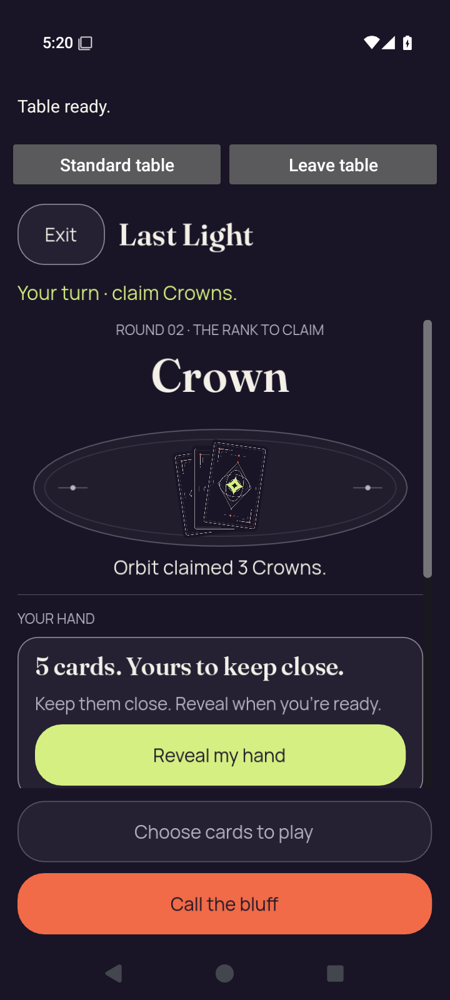</a> <code>2d-recents-resumed.png</code> 2d-recents-resumed — 2d.recents-interruption | 720 × 1600 px · 164,370 bytes SHA-256: <code>744b2a2bd1c92f3523811186a866e2bff92de54c4005f7efd5c21ace757f2207</code> Source: <code>/root/projects/PartyDeck/artifacts/evidence-storage/34503251315/android-jvm-reports/build/ci/android/godot-session/optimized-test-signed/runtime/captures/2d-recents-resumed.png</code> Capture: 2026-09-10T17:20:24.291+00:00 → 2026-09-10T17:20:26.787+00:00 [UI XML](runtime/captures/2d-recents-resumed.xml) · [Capture/result JSON](runtime/captures/2d-recents-resumed.json) · [Original result](runtime/godot-session-result.json) | **Exact same-batch match**. Exact bytes match separately retained capture 126. Reused pixel observation: After Home resume, native 2D is concealed with readable Table ready/native controls, turn, Crown rank and Orbit&#x27;s three-Crown claim. Reveal narrowly fits while the cover bottom clips; both fixed lower actions are complete. This still does not establish transition privacy. [Reviewed matching original](runtime/captures/2d-home-resumed.png); original capture identity remains separate. |
| <a href="runtime/captures/2d-recents-system-ui.png">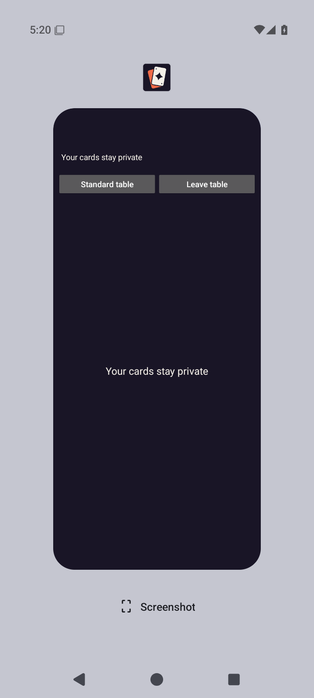</a> <code>2d-recents-system-ui.png</code> 2d-recents-system-ui — 2d.recents-interruption | 720 × 1600 px · 41,845 bytes SHA-256: <code>1d05f446758d69b5add7c67d2e0c93079371146ce0e2b46ed05a23daf8b8bb34</code> Source: <code>/root/projects/PartyDeck/artifacts/evidence-storage/34503251315/android-jvm-reports/build/ci/android/godot-session/optimized-test-signed/runtime/captures/2d-recents-system-ui.png</code> Capture: 2026-09-10T17:20:18.797+00:00 → 2026-09-10T17:20:21.288+00:00 [UI XML](runtime/captures/2d-recents-system-ui.xml) · [Capture/result JSON](runtime/captures/2d-recents-system-ui.json) · [Original result](runtime/godot-session-result.json) | **Attributed peer direct view** by <code>/root/review_release</code>. Recents shows the PartyDeck task covered by Your cards stay private, with native return controls visible. Engine pixels and private card faces are covered. |
|  <code>2d-standard-concealed.png</code> 2d-standard-concealed — 2d.standard-return | 720 × 1600 px · 134,017 bytes SHA-256: <code>c4b85654a91b5478948acd422406fdb6b1614b61bfeeb1a2b20410b9a3bfafe9</code> Source: <code>/root/projects/PartyDeck/artifacts/evidence-storage/34503251315/android-jvm-reports/build/ci/android/godot-session/optimized-test-signed/runtime/captures/2d-standard-concealed.png</code> Capture: 2026-09-10T17:20:34.377+00:00 → 2026-09-10T17:20:36.876+00:00 [UI XML](runtime/captures/2d-standard-concealed.xml) · [Capture/result JSON](runtime/captures/2d-standard-concealed.json) · [Original result](runtime/godot-session-result.json) | **Attributed peer direct view** by <code>/root/review_release</code>. Returned Standard table shows the concealed Your hand panel, Show hand and disabled Select cards. No private card face is visible. |
|  <code>2d-standard-first-card.png</code> 2d-standard-first-card — 2d.standard-return | 720 × 1600 px · 130,430 bytes SHA-256: <code>27efb343fc9269cb9dace24b6aa6a02ab3185f540e45679a56a7503a9041543a</code> Source: <code>/root/projects/PartyDeck/artifacts/evidence-storage/34503251315/android-jvm-reports/build/ci/android/godot-session/optimized-test-signed/runtime/captures/2d-standard-first-card.png</code> Capture: 2026-09-10T17:20:50.341+00:00 → 2026-09-10T17:20:52.842+00:00 [UI XML](runtime/captures/2d-standard-first-card.xml) · [Capture/result JSON](runtime/captures/2d-standard-first-card.json) · [Original result](runtime/godot-session-result.json) | **Direct original view**. The Standard hand shows five complete Crown/Moon/Crown/Moon/Star cards with no selection. Hide hand, lower actions and public Crown/Orbit context are readable. |
| <a href="runtime/captures/2d-standard-play-after-play.png">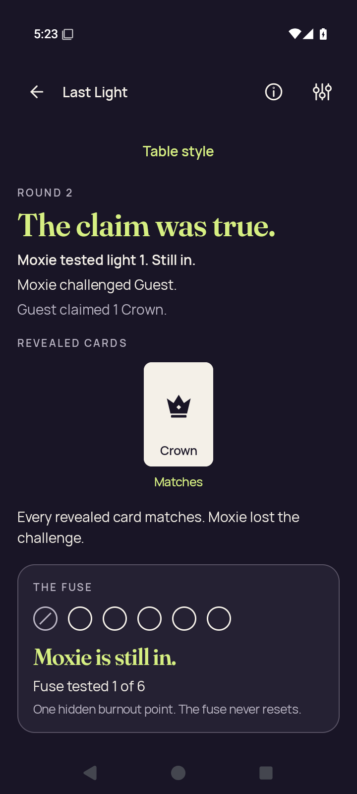</a> <code>2d-standard-play-after-play.png</code> 2d-standard-play-after-play — 2d.standard-action | 720 × 1600 px · 97,381 bytes SHA-256: <code>c58be80e365c60d2545361adcdddbd64931adbc58257d7a50d136fe0c9783d21</code> Source: <code>/root/projects/PartyDeck/artifacts/evidence-storage/34503251315/android-jvm-reports/build/ci/android/godot-session/optimized-test-signed/runtime/captures/2d-standard-play-after-play.png</code> Capture: 2026-09-10T17:23:04.434+00:00 → 2026-09-10T17:23:06.928+00:00 [UI XML](runtime/captures/2d-standard-play-after-play.xml) · [Capture/result JSON](runtime/captures/2d-standard-play-after-play.json) · [Original result](runtime/godot-session-result.json) | **Direct original view**. The Standard result names Moxie challenging Guest&#x27;s true one-Crown claim, shows the matching Crown and complete explanatory text. Moxie is still in/fuse tested 1 of 6 is fully visible; continuation lies below this capture. |
|  <code>2d-standard-play-selected.png</code> 2d-standard-play-selected — 2d.standard-action | 720 × 1600 px · 130,298 bytes SHA-256: <code>1f02074de70b298737f00afbdbfcd9cca9651b4b6f9c26e9f21e5a87bae9937e</code> Source: <code>/root/projects/PartyDeck/artifacts/evidence-storage/34503251315/android-jvm-reports/build/ci/android/godot-session/optimized-test-signed/runtime/captures/2d-standard-play-selected.png</code> Capture: 2026-09-10T17:22:57.548+00:00 → 2026-09-10T17:23:00.048+00:00 [UI XML](runtime/captures/2d-standard-play-selected.xml) · [Capture/result JSON](runtime/captures/2d-standard-play-selected.json) · [Original result](runtime/godot-session-result.json) | **Direct original view**. The Standard selected state has a checked first Crown and five complete card labels. Selection count, claim feedback and both Play/Challenge controls fit with readable public context. |
|  <code>2d-standard-public.png</code> 2d-standard-public — 2d.standard-return | 720 × 1600 px · 134,017 bytes SHA-256: <code>c4b85654a91b5478948acd422406fdb6b1614b61bfeeb1a2b20410b9a3bfafe9</code> Source: <code>/root/projects/PartyDeck/artifacts/evidence-storage/34503251315/android-jvm-reports/build/ci/android/godot-session/optimized-test-signed/runtime/captures/2d-standard-public.png</code> Capture: 2026-09-10T17:20:43.559+00:00 → 2026-09-10T17:20:46.069+00:00 [UI XML](runtime/captures/2d-standard-public.xml) · [Capture/result JSON](runtime/captures/2d-standard-public.json) · [Original result](runtime/godot-session-result.json) | **Exact same-batch match**. Exact bytes match separately retained capture 140. Reused pixel observation: Returned Standard table shows the concealed Your hand panel, Show hand and disabled Select cards. No private card face is visible. [Reviewed matching original](runtime/captures/2d-standard-concealed.png); original capture identity remains separate. |
|  <code>2d-standard-selection-cleared.png</code> 2d-standard-selection-cleared — 2d.standard-return | 720 × 1600 px · 134,017 bytes SHA-256: <code>c4b85654a91b5478948acd422406fdb6b1614b61bfeeb1a2b20410b9a3bfafe9</code> Source: <code>/root/projects/PartyDeck/artifacts/evidence-storage/34503251315/android-jvm-reports/build/ci/android/godot-session/optimized-test-signed/runtime/captures/2d-standard-selection-cleared.png</code> Capture: 2026-09-10T17:20:38.973+00:00 → 2026-09-10T17:20:41.463+00:00 [UI XML](runtime/captures/2d-standard-selection-cleared.xml) · [Capture/result JSON](runtime/captures/2d-standard-selection-cleared.json) · [Original result](runtime/godot-session-result.json) | **Exact same-batch match**. Exact bytes match separately retained capture 140. Reused pixel observation: Returned Standard table shows the concealed Your hand panel, Show hand and disabled Select cards. No private card face is visible. [Reviewed matching original](runtime/captures/2d-standard-concealed.png); original capture identity remains separate. |
|  <code>3d-action-entry-native-ready.png</code> 3d-action-entry-native-ready — 3d.standard-action | 720 × 1600 px · 186,486 bytes SHA-256: <code>3deda11912f4fe4704bacd5e1e6371653217e0a2cba2d6a6c0413ab9db69861d</code> Source: <code>/root/projects/PartyDeck/artifacts/evidence-storage/34503251315/android-jvm-reports/build/ci/android/godot-session/optimized-test-signed/runtime/captures/3d-action-entry-native-ready.png</code> Capture: 2026-09-10T17:28:31.579+00:00 → 2026-09-10T17:28:34.100+00:00 [UI XML](runtime/captures/3d-action-entry-native-ready.xml) · [Capture/result JSON](runtime/captures/3d-action-entry-native-ready.json) · [Original result](runtime/godot-session-result.json) | **Direct original view**. Optimized native 3D round 1 shows Table ready, native controls, full Show hand, Crown/Your turn and opening guidance. Seat details clip horizontally with a scrollbar, while five card backs, Select cards and Return to lobby fit fully in this no-claim state. |
|  <code>3d-action-entry-selected.png</code> 3d-action-entry-selected — 3d.standard-action | 720 × 1600 px · 108,543 bytes SHA-256: <code>8c099d959e408abb6f68e4bbcbd0fb667855aeaef86d78303afa5a335cae3217</code> Source: <code>/root/projects/PartyDeck/artifacts/evidence-storage/34503251315/android-jvm-reports/build/ci/android/godot-session/optimized-test-signed/runtime/captures/3d-action-entry-selected.png</code> Capture: 2026-09-10T17:28:09.110+00:00 → 2026-09-10T17:28:11.604+00:00 [UI XML](runtime/captures/3d-action-entry-selected.xml) · [Capture/result JSON](runtime/captures/3d-action-entry-selected.json) · [Original result](runtime/godot-session-result.json) | **Direct original view**. The Standard Crown round 1 hand displays five complete Moon/Wild/Crown/Star/Crown cards with the first Moon checked. 1 of 3 selected, one-Crown claim feedback and the full-width Play 1 card button fit. |
|  <code>3d-action-entry-selector.png</code> 3d-action-entry-selector — 3d.standard-action | 720 × 1600 px · 58,798 bytes SHA-256: <code>78c709440b9016b12996c7bf7f57aca75e702be8305750d313f8367d759c253d</code> Source: <code>/root/projects/PartyDeck/artifacts/evidence-storage/34503251315/android-jvm-reports/build/ci/android/godot-session/optimized-test-signed/runtime/captures/3d-action-entry-selector.png</code> Capture: 2026-09-10T17:28:18.322+00:00 → 2026-09-10T17:28:20.819+00:00 [UI XML](runtime/captures/3d-action-entry-selector.xml) · [Capture/result JSON](runtime/captures/3d-action-entry-selector.json) · [Original result](runtime/godot-session-result.json) | **Direct original view**. The complete Table style modal shows Standard selected, 2D/3D options, all guidance and Done. Private content is obscured. |
|  <code>3d-action-return-concealed.png</code> 3d-action-return-concealed — 3d.standard-action | 720 × 1600 px · 110,751 bytes SHA-256: <code>34dd6bf7b7530598a365d8a2e130504dc6d09843cf5e78af7f70be3f4e385746</code> Source: <code>/root/projects/PartyDeck/artifacts/evidence-storage/34503251315/android-jvm-reports/build/ci/android/godot-session/optimized-test-signed/runtime/captures/3d-action-return-concealed.png</code> Capture: 2026-09-10T17:28:41.505+00:00 → 2026-09-10T17:28:43.987+00:00 [UI XML](runtime/captures/3d-action-return-concealed.xml) · [Capture/result JSON](runtime/captures/3d-action-return-concealed.json) · [Original result](runtime/godot-session-result.json) | **Direct original view**. The Standard return is concealed with a full cover, Show hand and full-width Select cards button. Crown round 1, Your turn and opening guidance are readable; no private ranks are displayed. |
|  <code>3d-action-return-first-card.png</code> 3d-action-return-first-card — 3d.standard-action | 720 × 1600 px · 108,525 bytes SHA-256: <code>4499c131cfae12484ba79ee55982c1d04ced604dc99af0bb993326bcc045cbf5</code> Source: <code>/root/projects/PartyDeck/artifacts/evidence-storage/34503251315/android-jvm-reports/build/ci/android/godot-session/optimized-test-signed/runtime/captures/3d-action-return-first-card.png</code> Capture: 2026-09-10T17:28:57.424+00:00 → 2026-09-10T17:28:59.951+00:00 [UI XML](runtime/captures/3d-action-return-first-card.xml) · [Capture/result JSON](runtime/captures/3d-action-return-first-card.json) · [Original result](runtime/godot-session-result.json) | **Direct original view**. The returned Standard hand shows five complete Moon/Wild/Crown/Star/Crown cards, no selection, Hide hand and a full Select cards button under readable Crown opening context. |
| <a href="runtime/captures/3d-action-return-public.png">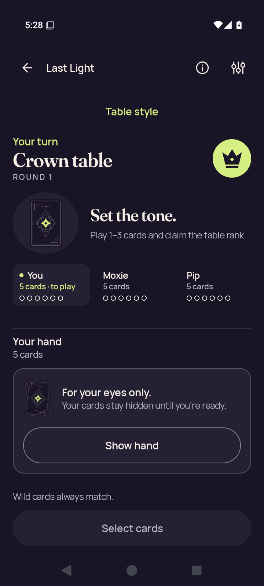</a> <code>3d-action-return-public.png</code> 3d-action-return-public — 3d.standard-action | 720 × 1600 px · 110,606 bytes SHA-256: <code>b50800dafa6155b778d7df759f4d8c74afa5260fa102e8b106b3ee8dd3fe5173</code> Source: <code>/root/projects/PartyDeck/artifacts/evidence-storage/34503251315/android-jvm-reports/build/ci/android/godot-session/optimized-test-signed/runtime/captures/3d-action-return-public.png</code> Capture: 2026-09-10T17:28:50.671+00:00 → 2026-09-10T17:28:53.182+00:00 [UI XML](runtime/captures/3d-action-return-public.xml) · [Capture/result JSON](runtime/captures/3d-action-return-public.json) · [Original result](runtime/godot-session-result.json) | **Direct original view**. The Standard public return capture shows the complete concealed-hand panel, Show hand and Select cards. Crown round 1, Your turn and opening guidance fit without visible private ranks. |
|  <code>3d-action-return-selection-cleared.png</code> 3d-action-return-selection-cleared — 3d.standard-action | 720 × 1600 px · 110,606 bytes SHA-256: <code>b50800dafa6155b778d7df759f4d8c74afa5260fa102e8b106b3ee8dd3fe5173</code> Source: <code>/root/projects/PartyDeck/artifacts/evidence-storage/34503251315/android-jvm-reports/build/ci/android/godot-session/optimized-test-signed/runtime/captures/3d-action-return-selection-cleared.png</code> Capture: 2026-09-10T17:28:46.094+00:00 → 2026-09-10T17:28:48.589+00:00 [UI XML](runtime/captures/3d-action-return-selection-cleared.xml) · [Capture/result JSON](runtime/captures/3d-action-return-selection-cleared.json) · [Original result](runtime/godot-session-result.json) | **Exact same-batch match**. Exact bytes match separately retained capture 151. Reused pixel observation: The Standard public return capture shows the complete concealed-hand panel, Show hand and Select cards. Crown round 1, Your turn and opening guidance fit without visible private ranks. [Reviewed matching original](runtime/captures/3d-action-return-public.png); original capture identity remains separate. |
|  <code>3d-baseline-first-card.png</code> 3d-baseline-first-card — 3d.practice-baseline | 720 × 1600 px · 108,592 bytes SHA-256: <code>edaca3809bd629b1803e517c9dfb040889c66389c4e0aaaf6fda3d21ef517c71</code> Source: <code>/root/projects/PartyDeck/artifacts/evidence-storage/34503251315/android-jvm-reports/build/ci/android/godot-session/optimized-test-signed/runtime/captures/3d-baseline-first-card.png</code> Capture: 2026-09-10T17:23:55.694+00:00 → 2026-09-10T17:23:58.202+00:00 [UI XML](runtime/captures/3d-baseline-first-card.xml) · [Capture/result JSON](runtime/captures/3d-baseline-first-card.json) · [Original result](runtime/godot-session-result.json) | **Direct original view**. The Standard baseline Crown round 1 hand shows all five Moon/Wild/Crown/Star/Crown cards, no selection, Hide hand and a full Select cards control. Turn and opening guidance are readable. |
|  <code>3d-baseline-public.png</code> 3d-baseline-public — 3d.practice-baseline | 720 × 1600 px · 110,561 bytes SHA-256: <code>955b59657e1ee5f744bd5e080abf923987077f8b686f63bcb71327940a9a9d99</code> Source: <code>/root/projects/PartyDeck/artifacts/evidence-storage/34503251315/android-jvm-reports/build/ci/android/godot-session/optimized-test-signed/runtime/captures/3d-baseline-public.png</code> Capture: 2026-09-10T17:23:48.998+00:00 → 2026-09-10T17:23:51.463+00:00 [UI XML](runtime/captures/3d-baseline-public.xml) · [Capture/result JSON](runtime/captures/3d-baseline-public.json) · [Original result](runtime/godot-session-result.json) | **Direct original view**. The Standard baseline is concealed with the complete covered-hand panel, Show hand and full Select cards button. Crown round 1, Your turn and opening guidance fit. |
|  <code>3d-baseline-selected.png</code> 3d-baseline-selected — 3d.standard-hand | 720 × 1600 px · 108,099 bytes SHA-256: <code>dd3732c5d35aff0c9d6bd5740ae604ac6df8f5f94426c9c68f8649552fc5dc07</code> Source: <code>/root/projects/PartyDeck/artifacts/evidence-storage/34503251315/android-jvm-reports/build/ci/android/godot-session/optimized-test-signed/runtime/captures/3d-baseline-selected.png</code> Capture: 2026-09-10T17:25:43.503+00:00 → 2026-09-10T17:25:46.003+00:00 [UI XML](runtime/captures/3d-baseline-selected.xml) · [Capture/result JSON](runtime/captures/3d-baseline-selected.json) · [Original result](runtime/godot-session-result.json) | **Direct original view**. The Standard selected baseline has a checked first Moon, all five complete cards, selection count and one-Crown claim feedback. The full-width Play 1 card button and public opening context are readable. |
|  <code>3d-entry-native-ready.png</code> 3d-entry-native-ready — 3d.native-entry | 720 × 1600 px · 186,416 bytes SHA-256: <code>6ea06993a44970661b9dd3a91b88981199cac6ee49f88e8f72fee92654ca5cdf</code> Source: <code>/root/projects/PartyDeck/artifacts/evidence-storage/34503251315/android-jvm-reports/build/ci/android/godot-session/optimized-test-signed/runtime/captures/3d-entry-native-ready.png</code> Capture: 2026-09-10T17:26:05.933+00:00 → 2026-09-10T17:26:08.464+00:00 [UI XML](runtime/captures/3d-entry-native-ready.xml) · [Capture/result JSON](runtime/captures/3d-entry-native-ready.json) · [Original result](runtime/godot-session-result.json) | **Attributed peer direct view** by <code>/root/review_release</code>. Visible 3D table, Table ready/native return controls and five face-down hand cards. No private card face is visible. |
|  <code>3d-entry-selector.png</code> 3d-entry-selector — 3d.native-entry | 720 × 1600 px · 58,042 bytes SHA-256: <code>115b0bcb274af15a660aa32c59af77a05de41ed4a89224618274951aa67e5f9a</code> Source: <code>/root/projects/PartyDeck/artifacts/evidence-storage/34503251315/android-jvm-reports/build/ci/android/godot-session/optimized-test-signed/runtime/captures/3d-entry-selector.png</code> Capture: 2026-09-10T17:25:52.587+00:00 → 2026-09-10T17:25:55.074+00:00 [UI XML](runtime/captures/3d-entry-selector.xml) · [Capture/result JSON](runtime/captures/3d-entry-selector.json) · [Original result](runtime/godot-session-result.json) | **Direct original view**. The Table style modal fully shows Standard selection, both renderer choices, all guidance and Done; private content is obscured. |
|  <code>3d-home-after-session-end.png</code> 3d-home-after-session-end — 3d.leave-end | 720 × 1600 px · 132,329 bytes SHA-256: <code>0737802b55042697b46785918191580af948f9f6d8a76e11465aaf15a436a168</code> Source: <code>/root/projects/PartyDeck/artifacts/evidence-storage/34503251315/android-jvm-reports/build/ci/android/godot-session/optimized-test-signed/runtime/captures/3d-home-after-session-end.png</code> Capture: 2026-09-10T17:29:46.357+00:00 → 2026-09-10T17:29:48.883+00:00 [UI XML](runtime/captures/3d-home-after-session-end.xml) · [Capture/result JSON](runtime/captures/3d-home-after-session-end.json) · [Original result](runtime/godot-session-result.json) | **Direct original view**. Returned Home fully shows the brand, headline, card artwork and all Host, Join, Practice, How to play and Settings actions. |
| <a href="runtime/captures/3d-home-resumed.png">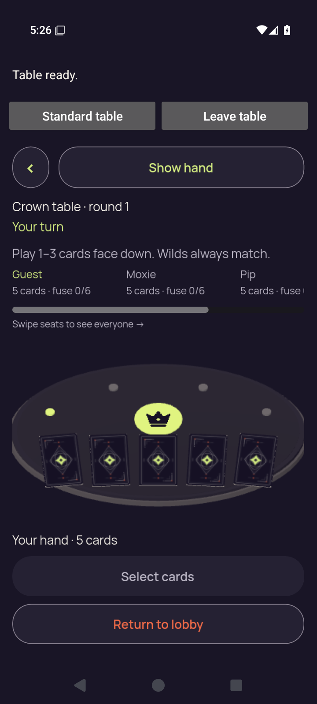</a> <code>3d-home-resumed.png</code> 3d-home-resumed — 3d.home-interruption | 720 × 1600 px · 186,416 bytes SHA-256: <code>6ea06993a44970661b9dd3a91b88981199cac6ee49f88e8f72fee92654ca5cdf</code> Source: <code>/root/projects/PartyDeck/artifacts/evidence-storage/34503251315/android-jvm-reports/build/ci/android/godot-session/optimized-test-signed/runtime/captures/3d-home-resumed.png</code> Capture: 2026-09-10T17:26:17.408+00:00 → 2026-09-10T17:26:19.931+00:00 [UI XML](runtime/captures/3d-home-resumed.xml) · [Capture/result JSON](runtime/captures/3d-home-resumed.json) · [Original result](runtime/godot-session-result.json) | **Exact same-batch match**. Exact bytes match separately retained capture 156. Reused pixel observation: Visible 3D table, Table ready/native return controls and five face-down hand cards. No private card face is visible. [Reviewed matching original](runtime/captures/3d-entry-native-ready.png); original capture identity remains separate. |
| <a href="runtime/captures/3d-home-system-ui.png">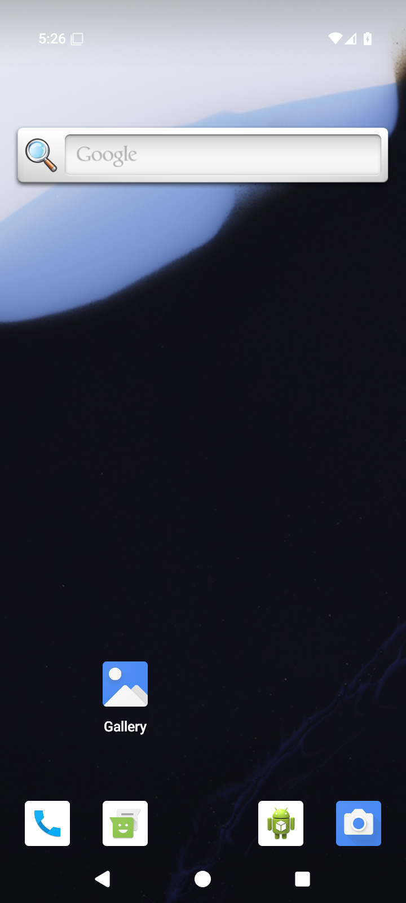</a> <code>3d-home-system-ui.png</code> 3d-home-system-ui — 3d.home-interruption | 720 × 1600 px · 747,769 bytes SHA-256: <code>3c9f926e9536c30c35166b1ffa374c3dc2f3603231c39e0a5a239bf6c21c0550</code> Source: <code>/root/projects/PartyDeck/artifacts/evidence-storage/34503251315/android-jvm-reports/build/ci/android/godot-session/optimized-test-signed/runtime/captures/3d-home-system-ui.png</code> Capture: 2026-09-10T17:26:11.298+00:00 → 2026-09-10T17:26:14.161+00:00 [UI XML](runtime/captures/3d-home-system-ui.xml) · [Capture/result JSON](runtime/captures/3d-home-system-ui.json) · [Original result](runtime/godot-session-result.json) | **Attributed peer direct view** by <code>/root/review_release</code>. Android launcher Home is visible. No PartyDeck table or private card face is visible. |
|  <code>3d-leave-cancel-confirmation.png</code> 3d-leave-cancel-confirmation — 3d.leave-cancel | 720 × 1600 px · 41,061 bytes SHA-256: <code>b5d3926a7b27fefa4c0eb44a68f4ef93f8b13af1ed508b261a500866471a3d9e</code> Source: <code>/root/projects/PartyDeck/artifacts/evidence-storage/34503251315/android-jvm-reports/build/ci/android/godot-session/optimized-test-signed/runtime/captures/3d-leave-cancel-confirmation.png</code> Capture: 2026-09-10T17:27:35.240+00:00 → 2026-09-10T17:27:37.707+00:00 [UI XML](runtime/captures/3d-leave-cancel-confirmation.xml) · [Capture/result JSON](runtime/captures/3d-leave-cancel-confirmation.json) · [Original result](runtime/godot-session-result.json) | **Direct original view**. The centered Leave the table? dialog fully shows its practice-match explanation and both Leave table and Stay at the table actions. Underlying content is obscured. |
| <a href="runtime/captures/3d-leave-cancel-native-ready.png">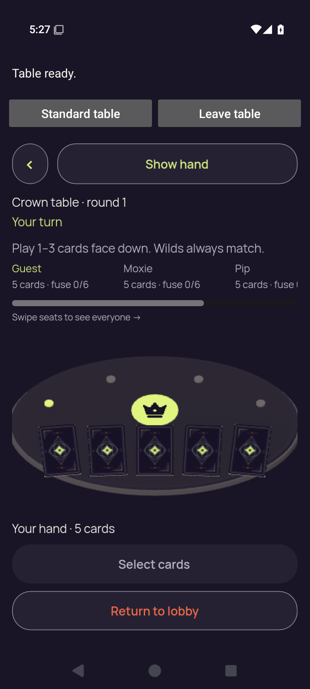</a> <code>3d-leave-cancel-native-ready.png</code> 3d-leave-cancel-native-ready — 3d.leave-cancel | 720 × 1600 px · 186,030 bytes SHA-256: <code>5cf12d6ac82733de5fdfa938b154edd02df1303bd76af18fa62f6bf4ced0957b</code> Source: <code>/root/projects/PartyDeck/artifacts/evidence-storage/34503251315/android-jvm-reports/build/ci/android/godot-session/optimized-test-signed/runtime/captures/3d-leave-cancel-native-ready.png</code> Capture: 2026-09-10T17:27:25.191+00:00 → 2026-09-10T17:27:27.699+00:00 [UI XML](runtime/captures/3d-leave-cancel-native-ready.xml) · [Capture/result JSON](runtime/captures/3d-leave-cancel-native-ready.json) · [Original result](runtime/godot-session-result.json) | **Direct original view**. Optimized native 3D round 1 shows complete Table ready/native controls, Show hand, Crown/turn/opening guidance and five concealed card backs. Seat text scrolls horizontally; full Select cards and Return to lobby fit vertically in this state. |
|  <code>3d-leave-cancel-return-concealed.png</code> 3d-leave-cancel-return-concealed — 3d.leave-cancel | 720 × 1600 px · 110,288 bytes SHA-256: <code>28c2807f3966091eb6ca24400242a499e0f5a14d9795aa00010d6af60504c8d0</code> Source: <code>/root/projects/PartyDeck/artifacts/evidence-storage/34503251315/android-jvm-reports/build/ci/android/godot-session/optimized-test-signed/runtime/captures/3d-leave-cancel-return-concealed.png</code> Capture: 2026-09-10T17:27:44.188+00:00 → 2026-09-10T17:27:46.670+00:00 [UI XML](runtime/captures/3d-leave-cancel-return-concealed.xml) · [Capture/result JSON](runtime/captures/3d-leave-cancel-return-concealed.json) · [Original result](runtime/godot-session-result.json) | **Direct original view**. The Standard return is concealed with a complete Show hand panel and Select cards action. Crown round 1, Your turn and opening guidance remain readable, with no private ranks displayed. |
|  <code>3d-leave-cancel-return-first-card.png</code> 3d-leave-cancel-return-first-card — 3d.leave-cancel | 720 × 1600 px · 108,525 bytes SHA-256: <code>4499c131cfae12484ba79ee55982c1d04ced604dc99af0bb993326bcc045cbf5</code> Source: <code>/root/projects/PartyDeck/artifacts/evidence-storage/34503251315/android-jvm-reports/build/ci/android/godot-session/optimized-test-signed/runtime/captures/3d-leave-cancel-return-first-card.png</code> Capture: 2026-09-10T17:28:00.081+00:00 → 2026-09-10T17:28:02.605+00:00 [UI XML](runtime/captures/3d-leave-cancel-return-first-card.xml) · [Capture/result JSON](runtime/captures/3d-leave-cancel-return-first-card.json) · [Original result](runtime/godot-session-result.json) | **Exact same-batch match**. Exact bytes match separately retained capture 150. Reused pixel observation: The returned Standard hand shows five complete Moon/Wild/Crown/Star/Crown cards, no selection, Hide hand and a full Select cards button under readable Crown opening context. [Reviewed matching original](runtime/captures/3d-action-return-first-card.png); original capture identity remains separate. |
|  <code>3d-leave-cancel-return-public.png</code> 3d-leave-cancel-return-public — 3d.leave-cancel | 720 × 1600 px · 110,288 bytes SHA-256: <code>28c2807f3966091eb6ca24400242a499e0f5a14d9795aa00010d6af60504c8d0</code> Source: <code>/root/projects/PartyDeck/artifacts/evidence-storage/34503251315/android-jvm-reports/build/ci/android/godot-session/optimized-test-signed/runtime/captures/3d-leave-cancel-return-public.png</code> Capture: 2026-09-10T17:27:53.341+00:00 → 2026-09-10T17:27:55.825+00:00 [UI XML](runtime/captures/3d-leave-cancel-return-public.xml) · [Capture/result JSON](runtime/captures/3d-leave-cancel-return-public.json) · [Original result](runtime/godot-session-result.json) | **Exact same-batch match**. Exact bytes match separately retained capture 163. Reused pixel observation: The Standard return is concealed with a complete Show hand panel and Select cards action. Crown round 1, Your turn and opening guidance remain readable, with no private ranks displayed. [Reviewed matching original](runtime/captures/3d-leave-cancel-return-concealed.png); original capture identity remains separate. |
|  <code>3d-leave-cancel-return-selection-cleared.png</code> 3d-leave-cancel-return-selection-cleared — 3d.leave-cancel | 720 × 1600 px · 110,288 bytes SHA-256: <code>28c2807f3966091eb6ca24400242a499e0f5a14d9795aa00010d6af60504c8d0</code> Source: <code>/root/projects/PartyDeck/artifacts/evidence-storage/34503251315/android-jvm-reports/build/ci/android/godot-session/optimized-test-signed/runtime/captures/3d-leave-cancel-return-selection-cleared.png</code> Capture: 2026-09-10T17:27:48.756+00:00 → 2026-09-10T17:27:51.250+00:00 [UI XML](runtime/captures/3d-leave-cancel-return-selection-cleared.xml) · [Capture/result JSON](runtime/captures/3d-leave-cancel-return-selection-cleared.json) · [Original result](runtime/godot-session-result.json) | **Exact same-batch match**. Exact bytes match separately retained capture 163. Reused pixel observation: The Standard return is concealed with a complete Show hand panel and Select cards action. Crown round 1, Your turn and opening guidance remain readable, with no private ranks displayed. [Reviewed matching original](runtime/captures/3d-leave-cancel-return-concealed.png); original capture identity remains separate. |
| <a href="runtime/captures/3d-leave-cancel-selected.png">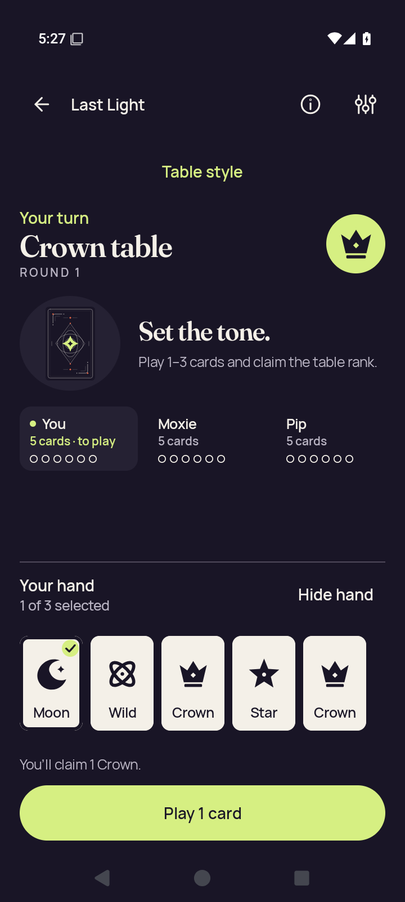</a> <code>3d-leave-cancel-selected.png</code> 3d-leave-cancel-selected — 3d.leave-cancel | 720 × 1600 px · 108,320 bytes SHA-256: <code>d89d144e3e626282610522205e2abe6f8656d732d0c5b86177b86740c1a6f01f</code> Source: <code>/root/projects/PartyDeck/artifacts/evidence-storage/34503251315/android-jvm-reports/build/ci/android/godot-session/optimized-test-signed/runtime/captures/3d-leave-cancel-selected.png</code> Capture: 2026-09-10T17:27:02.897+00:00 → 2026-09-10T17:27:05.354+00:00 [UI XML](runtime/captures/3d-leave-cancel-selected.xml) · [Capture/result JSON](runtime/captures/3d-leave-cancel-selected.json) · [Original result](runtime/godot-session-result.json) | **Direct original view**. The Standard selected hand shows all five Moon/Wild/Crown/Star/Crown cards, the first Moon checked, selection count and one-Crown feedback. Full-width Play 1 card fits below the readable public context. |
|  <code>3d-leave-cancel-selector.png</code> 3d-leave-cancel-selector — 3d.leave-cancel | 720 × 1600 px · 58,318 bytes SHA-256: <code>7ac10d8897fdab59b563ebafbdc91be797458b9e02a368a80d09f5b9873fd94f</code> Source: <code>/root/projects/PartyDeck/artifacts/evidence-storage/34503251315/android-jvm-reports/build/ci/android/godot-session/optimized-test-signed/runtime/captures/3d-leave-cancel-selector.png</code> Capture: 2026-09-10T17:27:12.080+00:00 → 2026-09-10T17:27:14.545+00:00 [UI XML](runtime/captures/3d-leave-cancel-selector.xml) · [Capture/result JSON](runtime/captures/3d-leave-cancel-selector.json) · [Original result](runtime/godot-session-result.json) | **Direct original view**. The Table style modal is fully contained with Standard selected, both renderer choices, guidance and Done. Private content is obscured. |
|  <code>3d-leave-end-confirmation.png</code> 3d-leave-end-confirmation — 3d.leave-end | 720 × 1600 px · 41,405 bytes SHA-256: <code>b891c908afa700722f8896f7a1433b1d5f962ca0d2a9a31f25672bb580843995</code> Source: <code>/root/projects/PartyDeck/artifacts/evidence-storage/34503251315/android-jvm-reports/build/ci/android/godot-session/optimized-test-signed/runtime/captures/3d-leave-end-confirmation.png</code> Capture: 2026-09-10T17:29:37.205+00:00 → 2026-09-10T17:29:39.724+00:00 [UI XML](runtime/captures/3d-leave-end-confirmation.xml) · [Capture/result JSON](runtime/captures/3d-leave-end-confirmation.json) · [Original result](runtime/godot-session-result.json) | **Direct original view**. The complete leave confirmation explains the practice-match consequence and shows both Leave table and Stay at the table actions. |
| <a href="runtime/captures/3d-leave-end-selector.png">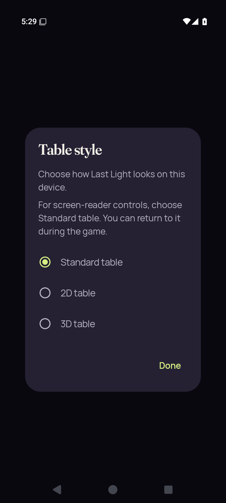</a> <code>3d-leave-end-selector.png</code> 3d-leave-end-selector — 3d.leave-end | 720 × 1600 px · 58,568 bytes SHA-256: <code>fd1336b80cb9f45aa497ffd83aea478b21971e965f14500ed6934ae298a9b305</code> Source: <code>/root/projects/PartyDeck/artifacts/evidence-storage/34503251315/android-jvm-reports/build/ci/android/godot-session/optimized-test-signed/runtime/captures/3d-leave-end-selector.png</code> Capture: 2026-09-10T17:29:22.760+00:00 → 2026-09-10T17:29:25.251+00:00 [UI XML](runtime/captures/3d-leave-end-selector.xml) · [Capture/result JSON](runtime/captures/3d-leave-end-selector.json) · [Original result](runtime/godot-session-result.json) | **Direct original view**. The complete Table style dialog shows Standard selected, 2D/3D options, all guidance and Done. Private content is obscured. |
|  <code>3d-recents-resumed.png</code> 3d-recents-resumed — 3d.recents-interruption | 720 × 1600 px · 186,416 bytes SHA-256: <code>6ea06993a44970661b9dd3a91b88981199cac6ee49f88e8f72fee92654ca5cdf</code> Source: <code>/root/projects/PartyDeck/artifacts/evidence-storage/34503251315/android-jvm-reports/build/ci/android/godot-session/optimized-test-signed/runtime/captures/3d-recents-resumed.png</code> Capture: 2026-09-10T17:26:27.958+00:00 → 2026-09-10T17:26:30.474+00:00 [UI XML](runtime/captures/3d-recents-resumed.xml) · [Capture/result JSON](runtime/captures/3d-recents-resumed.json) · [Original result](runtime/godot-session-result.json) | **Exact same-batch match**. Exact bytes match separately retained capture 156. Reused pixel observation: Visible 3D table, Table ready/native return controls and five face-down hand cards. No private card face is visible. [Reviewed matching original](runtime/captures/3d-entry-native-ready.png); original capture identity remains separate. |
|  <code>3d-recents-system-ui.png</code> 3d-recents-system-ui — 3d.recents-interruption | 720 × 1600 px · 42,012 bytes SHA-256: <code>f44f94c3d56e7b3d3ea66648393a25b1c0b2ad36d277d2203a3dd7c98050e4ef</code> Source: <code>/root/projects/PartyDeck/artifacts/evidence-storage/34503251315/android-jvm-reports/build/ci/android/godot-session/optimized-test-signed/runtime/captures/3d-recents-system-ui.png</code> Capture: 2026-09-10T17:26:22.466+00:00 → 2026-09-10T17:26:24.959+00:00 [UI XML](runtime/captures/3d-recents-system-ui.xml) · [Capture/result JSON](runtime/captures/3d-recents-system-ui.json) · [Original result](runtime/godot-session-result.json) | **Attributed peer direct view** by <code>/root/review_release</code>. Recents shows the PartyDeck task covered by Your cards stay private, with native return controls visible. Engine pixels and private card faces are covered. |
|  <code>3d-standard-concealed.png</code> 3d-standard-concealed — 3d.standard-return | 720 × 1600 px · 110,540 bytes SHA-256: <code>d8a650133d735de16a6b00d8004fed0f39962d023f6fd0132e517a96dfa53c2e</code> Source: <code>/root/projects/PartyDeck/artifacts/evidence-storage/34503251315/android-jvm-reports/build/ci/android/godot-session/optimized-test-signed/runtime/captures/3d-standard-concealed.png</code> Capture: 2026-09-10T17:26:38.074+00:00 → 2026-09-10T17:26:40.550+00:00 [UI XML](runtime/captures/3d-standard-concealed.xml) · [Capture/result JSON](runtime/captures/3d-standard-concealed.json) · [Original result](runtime/godot-session-result.json) | **Attributed peer direct view** by <code>/root/review_release</code>. Returned Standard table shows the concealed Your hand panel, Show hand and disabled Select cards. No private card face is visible. |
| <a href="runtime/captures/3d-standard-first-card.png">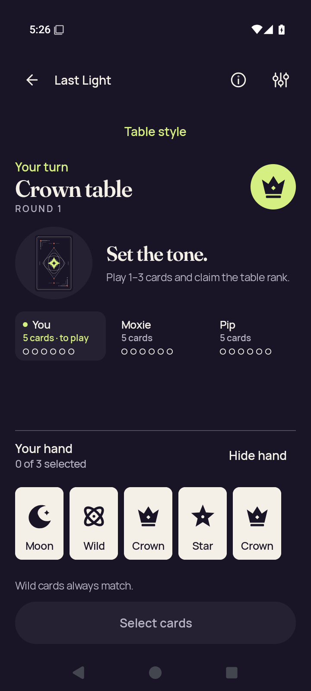</a> <code>3d-standard-first-card.png</code> 3d-standard-first-card — 3d.standard-return | 720 × 1600 px · 108,495 bytes SHA-256: <code>5146817d0eac4aa0cf15abccf8d41a2abec0d56028d9998e2cd8818ca3142604</code> Source: <code>/root/projects/PartyDeck/artifacts/evidence-storage/34503251315/android-jvm-reports/build/ci/android/godot-session/optimized-test-signed/runtime/captures/3d-standard-first-card.png</code> Capture: 2026-09-10T17:26:53.931+00:00 → 2026-09-10T17:26:56.426+00:00 [UI XML](runtime/captures/3d-standard-first-card.xml) · [Capture/result JSON](runtime/captures/3d-standard-first-card.json) · [Original result](runtime/godot-session-result.json) | **Direct original view**. The Standard Crown round 1 hand shows five complete Moon/Wild/Crown/Star/Crown cards with no selection. Hide hand, full Select cards and public turn/opening guidance remain readable. |
| <a href="runtime/captures/3d-standard-play-after-play.png">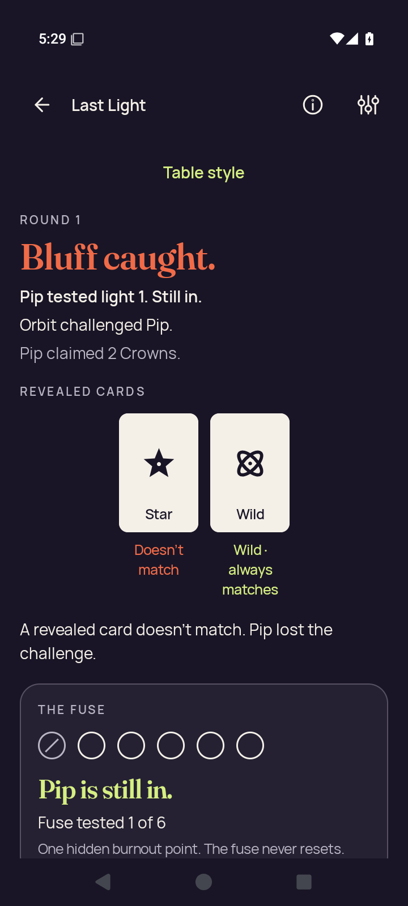</a> <code>3d-standard-play-after-play.png</code> 3d-standard-play-after-play — 3d.standard-action | 720 × 1600 px · 99,362 bytes SHA-256: <code>54785bd439b4c6999ffa3f8feb97fe164fc44fd01329f9f4399353f2cb714fe3</code> Source: <code>/root/projects/PartyDeck/artifacts/evidence-storage/34503251315/android-jvm-reports/build/ci/android/godot-session/optimized-test-signed/runtime/captures/3d-standard-play-after-play.png</code> Capture: 2026-09-10T17:29:13.360+00:00 → 2026-09-10T17:29:15.954+00:00 [UI XML](runtime/captures/3d-standard-play-after-play.xml) · [Capture/result JSON](runtime/captures/3d-standard-play-after-play.json) · [Original result](runtime/godot-session-result.json) | **Direct original view**. The Standard result identifies Orbit challenging Pip&#x27;s two-Crown bluff, with Star marked nonmatching and Wild marked always matching. Pip&#x27;s still-in/fuse-tested status is readable; the fuse panel bottom clips and continuation is outside this captured view. |
|  <code>3d-standard-play-selected.png</code> 3d-standard-play-selected — 3d.standard-action | 720 × 1600 px · 108,505 bytes SHA-256: <code>7f0f5f62f2e7eefeabf52bd3ebc787f5aaac36124d18430b06eae2e1f1c743bf</code> Source: <code>/root/projects/PartyDeck/artifacts/evidence-storage/34503251315/android-jvm-reports/build/ci/android/godot-session/optimized-test-signed/runtime/captures/3d-standard-play-selected.png</code> Capture: 2026-09-10T17:29:06.494+00:00 → 2026-09-10T17:29:08.991+00:00 [UI XML](runtime/captures/3d-standard-play-selected.xml) · [Capture/result JSON](runtime/captures/3d-standard-play-selected.json) · [Original result](runtime/godot-session-result.json) | **Direct original view**. The Standard selected hand has a checked first Moon, five complete card labels and readable one-Crown feedback. The full-width Play 1 card control fits below the public Crown opening context. |
|  <code>3d-standard-public.png</code> 3d-standard-public — 3d.standard-return | 720 × 1600 px · 110,540 bytes SHA-256: <code>d8a650133d735de16a6b00d8004fed0f39962d023f6fd0132e517a96dfa53c2e</code> Source: <code>/root/projects/PartyDeck/artifacts/evidence-storage/34503251315/android-jvm-reports/build/ci/android/godot-session/optimized-test-signed/runtime/captures/3d-standard-public.png</code> Capture: 2026-09-10T17:26:47.214+00:00 → 2026-09-10T17:26:49.697+00:00 [UI XML](runtime/captures/3d-standard-public.xml) · [Capture/result JSON](runtime/captures/3d-standard-public.json) · [Original result](runtime/godot-session-result.json) | **Exact same-batch match**. Exact bytes match separately retained capture 173. Reused pixel observation: Returned Standard table shows the concealed Your hand panel, Show hand and disabled Select cards. No private card face is visible. [Reviewed matching original](runtime/captures/3d-standard-concealed.png); original capture identity remains separate. |
|  <code>3d-standard-selection-cleared.png</code> 3d-standard-selection-cleared — 3d.standard-return | 720 × 1600 px · 110,540 bytes SHA-256: <code>d8a650133d735de16a6b00d8004fed0f39962d023f6fd0132e517a96dfa53c2e</code> Source: <code>/root/projects/PartyDeck/artifacts/evidence-storage/34503251315/android-jvm-reports/build/ci/android/godot-session/optimized-test-signed/runtime/captures/3d-standard-selection-cleared.png</code> Capture: 2026-09-10T17:26:42.641+00:00 → 2026-09-10T17:26:45.127+00:00 [UI XML](runtime/captures/3d-standard-selection-cleared.xml) · [Capture/result JSON](runtime/captures/3d-standard-selection-cleared.json) · [Original result](runtime/godot-session-result.json) | **Exact same-batch match**. Exact bytes match separately retained capture 173. Reused pixel observation: Returned Standard table shows the concealed Your hand panel, Show hand and disabled Select cards. No private card face is visible. [Reviewed matching original](runtime/captures/3d-standard-concealed.png); original capture identity remains separate. |
|  <code>final-diagnostic.png</code> final-diagnostic — 3d.leave-end | 720 × 1600 px · 132,329 bytes SHA-256: <code>0737802b55042697b46785918191580af948f9f6d8a76e11465aaf15a436a168</code> Source: <code>/root/projects/PartyDeck/artifacts/evidence-storage/34503251315/android-jvm-reports/build/ci/android/godot-session/optimized-test-signed/runtime/captures/final-diagnostic.png</code> Capture: 2026-09-10T17:29:49.119+00:00 → 2026-09-10T17:29:51.642+00:00 [UI XML](runtime/captures/final-diagnostic.xml) · [Capture/result JSON](runtime/captures/final-diagnostic.json) · [Original result](runtime/godot-session-result.json) | **Exact same-batch match**. Exact bytes match separately retained capture 158. Reused pixel observation: Returned Home fully shows the brand, headline, card artwork and all Host, Join, Practice, How to play and Settings actions. [Reviewed matching original](runtime/captures/3d-home-after-session-end.png); original capture identity remains separate. |
| <a href="runtime/captures/home-cold.png">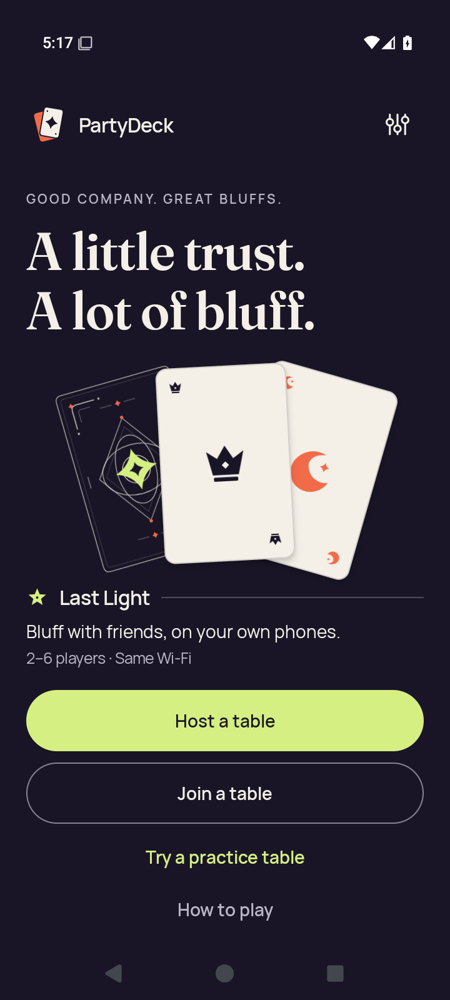</a> <code>home-cold.png</code> home-cold — emulator readiness | 720 × 1600 px · 131,904 bytes SHA-256: <code>6dbd265cb08273fd60d933ed6b91802c14358abf483015569e613dfac5d446b7</code> Source: <code>/root/projects/PartyDeck/artifacts/evidence-storage/34503251315/android-jvm-reports/build/ci/android/godot-session/optimized-test-signed/runtime/captures/home-cold.png</code> Capture: 2026-09-10T17:17:27.240+00:00 → 2026-09-10T17:17:29.718+00:00 [UI XML](runtime/captures/home-cold.xml) · [Capture/result JSON](runtime/captures/home-cold.json) · [Original result](runtime/godot-session-result.json) | **Direct original view**. The normal Home cold-start capture fully shows the brand, headline, card artwork and Host, Join, Practice, How to play and Settings actions. |
