# API 35 ordinary UI — optimized-test-signed

[All collections](../../README.md) · [Preserved evidence index](../evidence-index.md) · [Copy/review binding](../provenance/publication-review/partydeck-gallery-2815-publication-binding-v1.json) · [Completed visual review](../provenance/publication-review/partydeck-gallery-after-2355-api35-visual-review-v1.json) · [Unchanged source mapping](../provenance/source-map/capture-gallery-mapping.json)

**Original ordinary UI smoke passed. Visual review adds no native gameplay or accessibility outcome.**

Original 720 × 1600 captures; named enlarged-text frames and the final Home frame use font scale 2.0.

Both ordinary debug and optimized smokes pass. Native debug passes 21 checks, including two guarded renderer-death checks; optimized passes 19 checks and explicitly skips the two renderer-death checks. Engine gameplay was not invoked. The frozen independent review records 262 JUnit tests in 41 suites with no failures/errors/skips, 155 passing host tests and 11 lint warnings. These results add no TalkBack or continuous-privacy acceptance.

Normal Standard hands and selection/actions fit. Several Round 1 reveal labels clip at a public-panel edge. Native old-PCK 2D initial Reveal fits narrowly while the cover bottom clips; 3D seats scroll horizontally. The optimized no-claim round-1 result fits the full Return to lobby action. The debug round-2 claim plus previous-round-review state continues below the body. Enlarged intermediate hand, Rules and Settings content requires scrolling; scrolled Play/Challenge and Rules → Practice fit. The enlarged debug invalid-Join button crosses the right viewport edge while the optimized counterpart fits. The optimized original named large-text-rules-practice-entered.png visibly shows a round result. Sequential PNG/XML are not atomic.

Source revision: `1cd34a36753ed0112e6684f6525592dab8ef2edb`. CI run: [34503251315](https://github.com/Apdelrahman1911/PartyDeck/actions/runs/34503251315). 31 original PNG identities. Review methods: 28 direct original view, 3 exact same-batch match.

Every thumbnail opens the unchanged original PNG. Original filenames, dimensions, source paths and outcomes remain separate even when pixels match. No derivative image was created. Frozen provenance pages retain their original text and source references.

| Original capture | Original identity and evidence | Visual observation |
| --- | --- | --- |
| <a href="final-screen.png">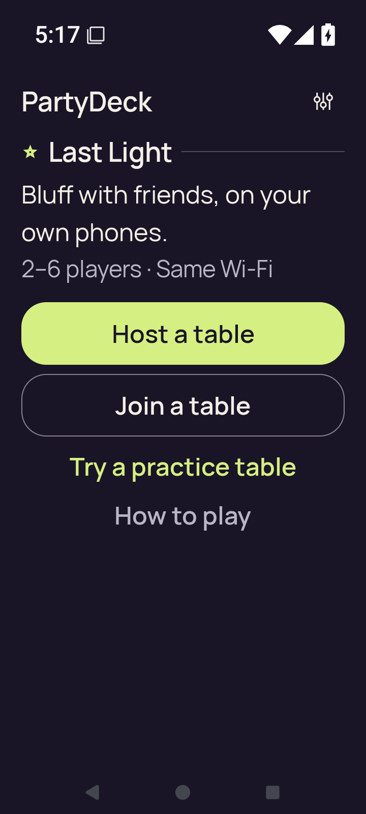</a> <code>final-screen.png</code> final-screen | 720 × 1600 px · 79,840 bytes · text 2.0 SHA-256: <code>59e3ff03b613296b2cd4baf76cf4fcbdfdc85875ed84dde47d7406ee6e5f03fa</code> Source: <code>/root/projects/PartyDeck/artifacts/evidence-storage/34503251315/android-jvm-reports/build/ci/android/optimized-test-signed/final-screen.png</code> [UI XML](last-ui.xml) · [Capture/result JSON](smoke-result.json) · [Original result](smoke-result.json) | **Direct original view**. The enlarged final Home shows readable PartyDeck/Last Light copy and complete Host, Join, Practice, How to play and Settings controls, with ample vertical clearance. |
|  <code>home.png</code> home | 720 × 1600 px · 132,390 bytes · text 1.0 SHA-256: <code>a44eef7fdd0051ab75074f674b3ffd9c6522b9980373f94a1f08a4c039d94f48</code> Source: <code>/root/projects/PartyDeck/artifacts/evidence-storage/34503251315/android-jvm-reports/build/ci/android/optimized-test-signed/home.png</code> [UI XML](home.xml) · [Capture/result JSON](smoke-result.json) · [Original result](smoke-result.json) | **Exact same-batch match**. Exact bytes match separately retained capture 90. Reused pixel observation: The returned normal Home shows the entire brand/headline illustration and complete Host, Join, Practice, How to play and Settings actions. [Reviewed matching original](../godot-session/debug/runtime/captures/3d-home-after-session-end.png); original capture identity remains separate. |
| <a href="host-after-share.png">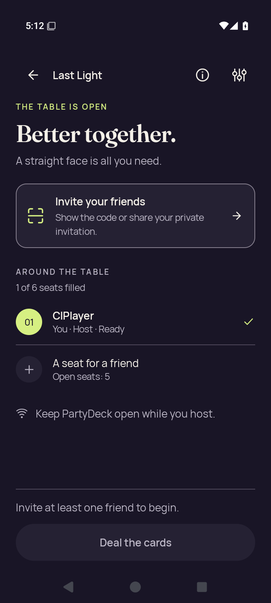</a> <code>host-after-share.png</code> host-after-share | 720 × 1600 px · 101,593 bytes · text 1.0 SHA-256: <code>825d7be77feeedad7bdf604b6fc719c1980aa19f229ccf8c554f01475513920a</code> Source: <code>/root/projects/PartyDeck/artifacts/evidence-storage/34503251315/android-jvm-reports/build/ci/android/optimized-test-signed/host-after-share.png</code> [UI XML](host-after-share.xml) · [Capture/result JSON](smoke-result.json) · [Original result](smoke-result.json) | **Direct original view**. The host lobby shows full invitation entry, CIPlayer as host/ready, one of six seats, five open seats and keep-open guidance. The invite-a-friend requirement and disabled Deal the cards control fit. |
|  <code>host-lobby.png</code> host-lobby | 720 × 1600 px · 101,593 bytes · text 1.0 SHA-256: <code>825d7be77feeedad7bdf604b6fc719c1980aa19f229ccf8c554f01475513920a</code> Source: <code>/root/projects/PartyDeck/artifacts/evidence-storage/34503251315/android-jvm-reports/build/ci/android/optimized-test-signed/host-lobby.png</code> [UI XML](host-lobby.xml) · [Capture/result JSON](smoke-result.json) · [Original result](smoke-result.json) | **Exact same-batch match**. Exact bytes match separately retained capture 183. Reused pixel observation: The host lobby shows full invitation entry, CIPlayer as host/ready, one of six seats, five open seats and keep-open guidance. The invite-a-friend requirement and disabled Deal the cards control fit. [Reviewed matching original](host-after-share.png); original capture identity remains separate. |
| <a href="host-returned-home.png">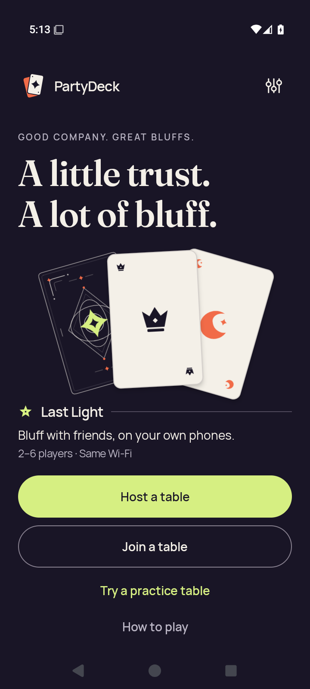</a> <code>host-returned-home.png</code> host-returned-home | 720 × 1600 px · 132,159 bytes · text 1.0 SHA-256: <code>f45539e49d840863d4774aa88a5ff49e237d6f024adea1d36a229f5dbf7268cc</code> Source: <code>/root/projects/PartyDeck/artifacts/evidence-storage/34503251315/android-jvm-reports/build/ci/android/optimized-test-signed/host-returned-home.png</code> [UI XML](host-returned-home.xml) · [Capture/result JSON](smoke-result.json) · [Original result](smoke-result.json) | **Direct original view**. Normal returned Home fully shows the brand, headline, artwork and all Host, Join, Practice, How to play and Settings actions. |
| <a href="join-invalid.png">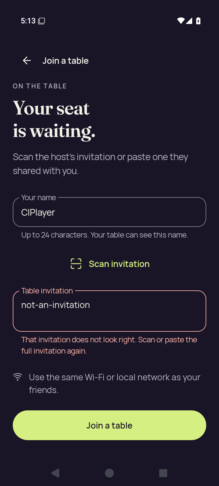</a> <code>join-invalid.png</code> join-invalid | 720 × 1600 px · 95,858 bytes · text 1.0 SHA-256: <code>d8014c25f7f85b538291e7481da4f481e983a3f092fdae2fa6dda703544d6996</code> Source: <code>/root/projects/PartyDeck/artifacts/evidence-storage/34503251315/android-jvm-reports/build/ci/android/optimized-test-signed/join-invalid.png</code> [UI XML](join-invalid.xml) · [Capture/result JSON](smoke-result.json) · [Original result](smoke-result.json) | **Direct original view**. The normal invalid-Join page fully shows both fields, the invalid-invitation explanation, same-network guidance and Join button. The CIPlayer name and Scan invitation control remain readable. |
| <a href="join-name-soft-ime.png">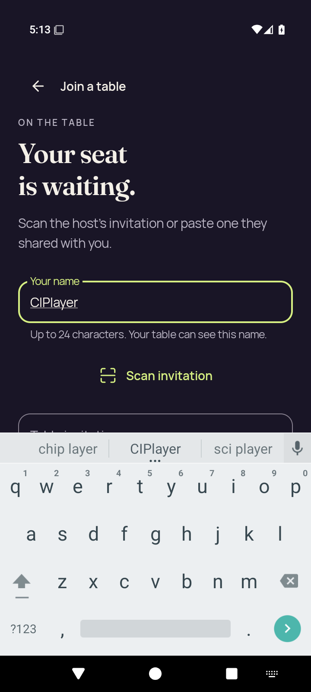</a> <code>join-name-soft-ime.png</code> join-name-soft-ime | 720 × 1600 px · 101,270 bytes · text 1.0 SHA-256: <code>ba96bdb5f4b48015489701c9182b8e5f881b7c778770c13179076d5130114e9d</code> Source: <code>/root/projects/PartyDeck/artifacts/evidence-storage/34503251315/android-jvm-reports/build/ci/android/optimized-test-signed/join-name-soft-ime.png</code> [UI XML](join-name-soft-ime.xml) · [Capture/result JSON](smoke-result.json) · [Original result](smoke-result.json) | **Direct original view**. The normal Join name field, heading, explanatory copy, name guidance and Scan invitation fit above the keyboard. The invitation field begins behind the keyboard edge and lower content is outside the visible area. |
| <a href="large-text-home-actions.png">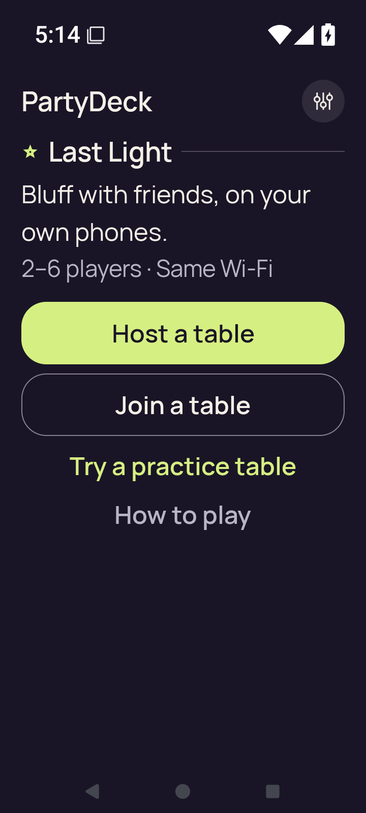</a> <code>large-text-home-actions.png</code> large-text-home-actions | 720 × 1600 px · 81,621 bytes · text 2.0 SHA-256: <code>9be75fcca8ac4eeee31ee501db5720dc405ddf0b0a34127b2635b5fb6f6b2dd1</code> Source: <code>/root/projects/PartyDeck/artifacts/evidence-storage/34503251315/android-jvm-reports/build/ci/android/optimized-test-signed/large-text-home-actions.png</code> [UI XML](large-text-home-actions.xml) · [Capture/result JSON](smoke-result.json) · [Original result](smoke-result.json) | **Direct original view**. The enlarged Home shows complete Host, Join, Practice, How to play and Settings actions plus readable brand/game/network copy. |
| <a href="large-text-join-invalid.png">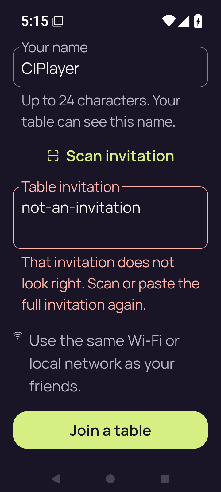</a> <code>large-text-join-invalid.png</code> large-text-join-invalid | 720 × 1600 px · 113,601 bytes · text 2.0 SHA-256: <code>343563f5b5955322b4446f5da96b9967898ecf9b10186cd61f7be5e16ab3a1ce</code> Source: <code>/root/projects/PartyDeck/artifacts/evidence-storage/34503251315/android-jvm-reports/build/ci/android/optimized-test-signed/large-text-join-invalid.png</code> [UI XML](large-text-join-invalid.xml) · [Capture/result JSON](smoke-result.json) · [Original result](smoke-result.json) | **Direct original view**. The scrolled enlarged optimized invalid-Join capture shows both fields, full invalid-invitation feedback, same-network guidance and the entire Join button. The page title lies above this scroll position; the button fits horizontally here. |
| <a href="large-text-join-name-soft-ime.png">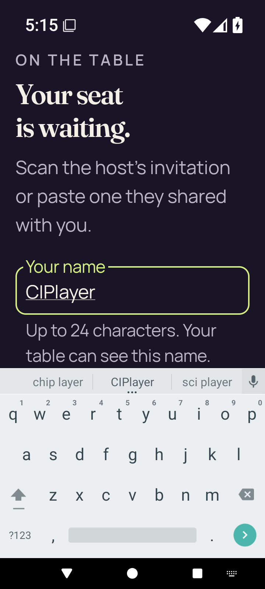</a> <code>large-text-join-name-soft-ime.png</code> large-text-join-name-soft-ime | 720 × 1600 px · 122,482 bytes · text 2.0 SHA-256: <code>998739f0537794a024fb14e9fa003d28bc3b762f16f0e4d556501b3e4f403a14</code> Source: <code>/root/projects/PartyDeck/artifacts/evidence-storage/34503251315/android-jvm-reports/build/ci/android/optimized-test-signed/large-text-join-name-soft-ime.png</code> [UI XML](large-text-join-name-soft-ime.xml) · [Capture/result JSON](smoke-result.json) · [Original result](smoke-result.json) | **Direct original view**. The enlarged Join name capture shows the complete focused CIPlayer field and wrapped name guidance above the keyboard. The large seat heading and introduction are readable; Scan/invitation controls are outside the visible area. |
| <a href="large-text-play-action.png">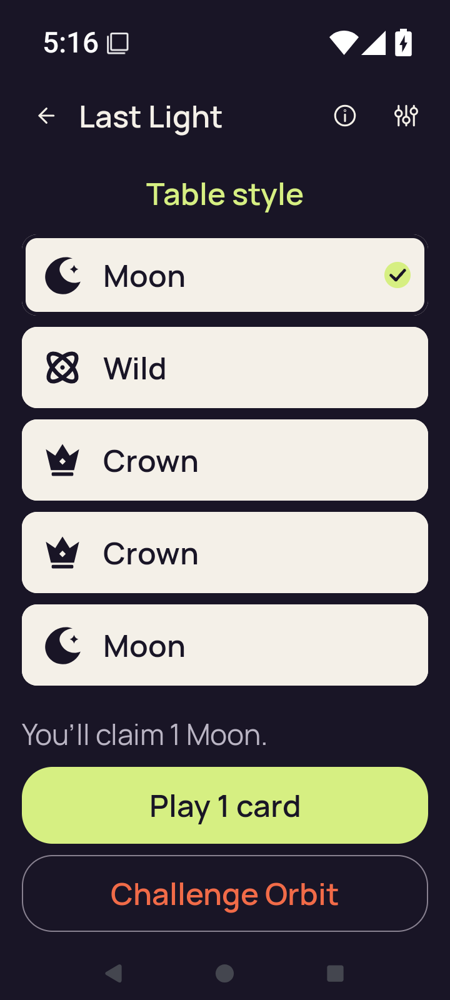</a> <code>large-text-play-action.png</code> large-text-play-action | 720 × 1600 px · 84,159 bytes · text 2.0 SHA-256: <code>a7656d8cf636ecddd32af2b6e55854d7b37387a778ad7f031656be7acaf5c6b3</code> Source: <code>/root/projects/PartyDeck/artifacts/evidence-storage/34503251315/android-jvm-reports/build/ci/android/optimized-test-signed/large-text-play-action.png</code> [UI XML](large-text-play-action.xml) · [Capture/result JSON](smoke-result.json) · [Original result](smoke-result.json) | **Direct original view**. The scrolled enlarged hand shows five complete Moon/Wild/Crown/Crown/Moon rows with the first Moon checked. One-Moon claim feedback, Play 1 card and Challenge Orbit are fully visible. |
| <a href="large-text-private-hand.png">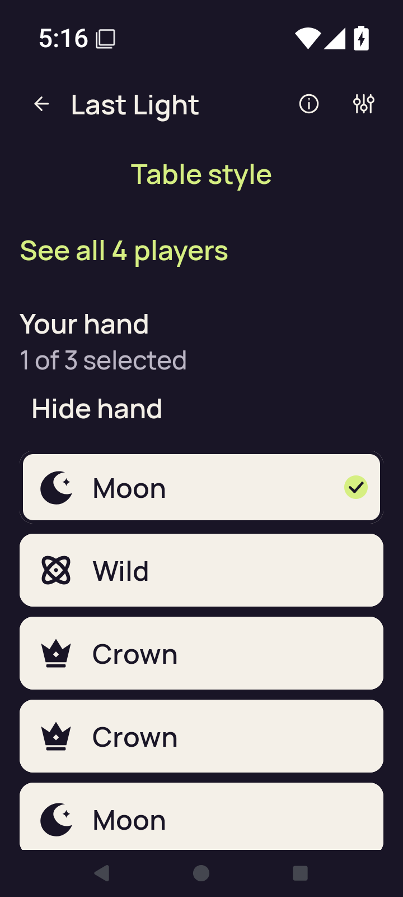</a> <code>large-text-private-hand.png</code> large-text-private-hand | 720 × 1600 px · 81,784 bytes · text 2.0 SHA-256: <code>c799b53f441830d2dbfb6f4bc1e4af9b8121d4e17b5fe66c87dd5fce63f11f1c</code> Source: <code>/root/projects/PartyDeck/artifacts/evidence-storage/34503251315/android-jvm-reports/build/ci/android/optimized-test-signed/large-text-private-hand.png</code> [UI XML](large-text-private-hand.xml) · [Capture/result JSON](smoke-result.json) · [Original result](smoke-result.json) | **Direct original view**. The enlarged hand shows See all 4 players, selection count, Hide hand and all five readable card labels. The final Moon row&#x27;s bottom clips at the viewport edge; lower actions require further scrolling. |
| <a href="large-text-rules-intro.png">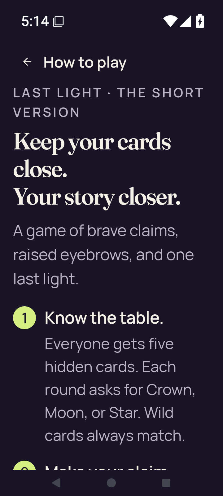</a> <code>large-text-rules-intro.png</code> large-text-rules-intro | 720 × 1600 px · 135,632 bytes · text 2.0 SHA-256: <code>c94f9b972b1d83114efcdaaf125b2aefa4766dba0bc95b500115adf36acc7734</code> Source: <code>/root/projects/PartyDeck/artifacts/evidence-storage/34503251315/android-jvm-reports/build/ci/android/optimized-test-signed/large-text-rules-intro.png</code> [UI XML](large-text-rules-intro.xml) · [Capture/result JSON](smoke-result.json) · [Original result](smoke-result.json) | **Direct original view**. The enlarged Rules title, introductory copy and complete first rule fit. The start of step 2 clips at the bottom, showing continuation below this scroll position. |
| <a href="large-text-rules-last-step.png">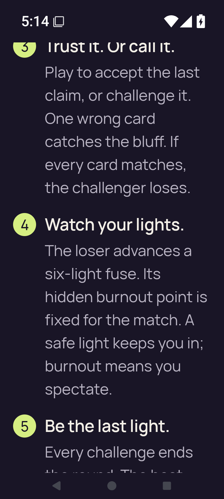</a> <code>large-text-rules-last-step.png</code> large-text-rules-last-step | 720 × 1600 px · 149,582 bytes · text 2.0 SHA-256: <code>e07c768eeae6b18abad0df0a146e3a1e7e7e6509e3d70760cea3a5d3b9adecf0</code> Source: <code>/root/projects/PartyDeck/artifacts/evidence-storage/34503251315/android-jvm-reports/build/ci/android/optimized-test-signed/large-text-rules-last-step.png</code> [UI XML](large-text-rules-last-step.xml) · [Capture/result JSON](smoke-result.json) · [Original result](smoke-result.json) | **Direct original view**. This enlarged Rules scroll position shows step 3&#x27;s full explanation and the complete step 4 text. Step 3&#x27;s heading clips above; step 5 begins below and continues past the bottom. |
| <a href="large-text-rules-practice-action.png">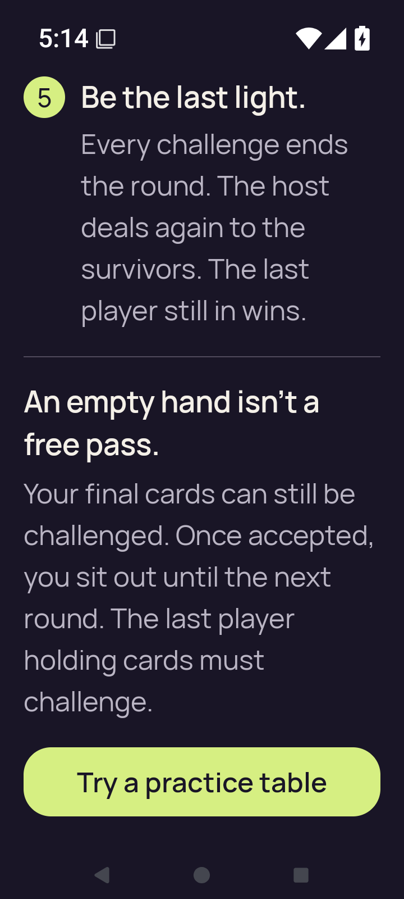</a> <code>large-text-rules-practice-action.png</code> large-text-rules-practice-action | 720 × 1600 px · 124,032 bytes · text 2.0 SHA-256: <code>24f6512053f1795fb2d0402551394a20dab60ddd39d7a6e7da08827061326403</code> Source: <code>/root/projects/PartyDeck/artifacts/evidence-storage/34503251315/android-jvm-reports/build/ci/android/optimized-test-signed/large-text-rules-practice-action.png</code> [UI XML](large-text-rules-practice-action.xml) · [Capture/result JSON](smoke-result.json) · [Original result](smoke-result.json) | **Direct original view**. The enlarged final rule and empty-hand explanation are fully readable. The entire Try a practice table button fits above the system navigation area. |
| <a href="large-text-rules-practice-entered.png">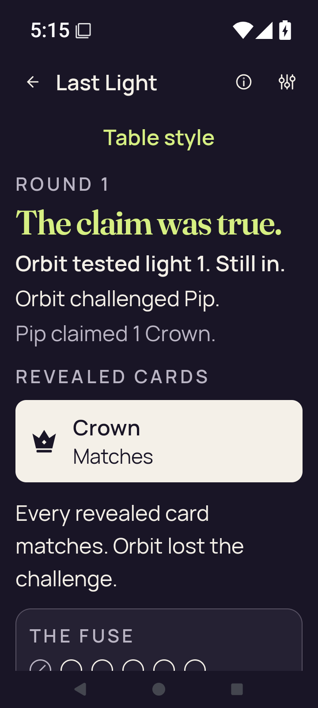</a> <code>large-text-rules-practice-entered.png</code> large-text-rules-practice-entered | 720 × 1600 px · 113,531 bytes · text 2.0 SHA-256: <code>66bd9171c2d5c3b7454316d7f5bed7104f928dfa7b5223924c2102ceec387aa0</code> Source: <code>/root/projects/PartyDeck/artifacts/evidence-storage/34503251315/android-jvm-reports/build/ci/android/optimized-test-signed/large-text-rules-practice-entered.png</code> [UI XML](large-text-rules-practice-entered.xml) · [Capture/result JSON](smoke-result.json) · [Original result](smoke-result.json) | **Direct original view**. The enlarged practice-entered capture actually shows a round-1 result: Orbit challenged Pip&#x27;s true one-Crown claim. The Crown/Matches row and challenge explanation are readable; the fuse panel is only partly visible at the bottom and continuation is below. |
|  <code>large-text-rules-returned-home.png</code> large-text-rules-returned-home | 720 × 1600 px · 79,365 bytes · text 2.0 SHA-256: <code>1a6af60de2cbf463e49a6204d978c791383959465383276d372a27b3599939b2</code> Source: <code>/root/projects/PartyDeck/artifacts/evidence-storage/34503251315/android-jvm-reports/build/ci/android/optimized-test-signed/large-text-rules-returned-home.png</code> [UI XML](large-text-rules-returned-home.xml) · [Capture/result JSON](smoke-result.json) · [Original result](smoke-result.json) | **Direct original view**. The enlarged returned Home shows complete Host, Join, Practice, How to play and Settings actions with readable brand/game/network copy. |
| <a href="large-text-settings.png">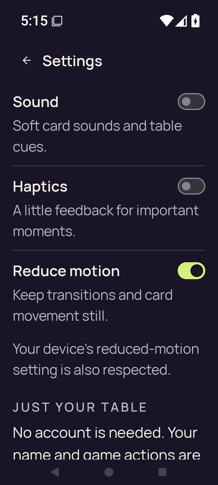</a> <code>large-text-settings.png</code> large-text-settings | 720 × 1600 px · 121,361 bytes · text 2.0 SHA-256: <code>50633cad26774216abc3b5f176448ce4d70407fb8219ba152e27bb319b0a015a</code> Source: <code>/root/projects/PartyDeck/artifacts/evidence-storage/34503251315/android-jvm-reports/build/ci/android/optimized-test-signed/large-text-settings.png</code> [UI XML](large-text-settings.xml) · [Capture/result JSON](smoke-result.json) · [Original result](smoke-result.json) | **Direct original view**. Enlarged Settings fully shows Sound, Haptics and Reduce motion controls and their explanations. The Just your table section begins below; its paragraph continues beyond the bottom edge. |
| <a href="practice-after-play.png">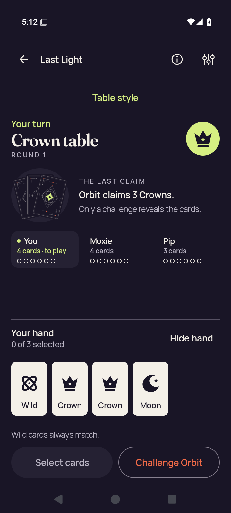</a> <code>practice-after-play.png</code> practice-after-play | 720 × 1600 px · 126,022 bytes · text 1.0 SHA-256: <code>b61990de6a4aa12cf185ea91c4d23d43da54a27d711dd062882a8d0d24c865bc</code> Source: <code>/root/projects/PartyDeck/artifacts/evidence-storage/34503251315/android-jvm-reports/build/ci/android/optimized-test-signed/practice-after-play.png</code> [UI XML](practice-after-play.xml) · [Capture/result JSON](smoke-result.json) · [Original result](smoke-result.json) | **Direct original view**. The normal post-play state shows four complete Wild/Crown/Crown/Moon cards, no selection and full Hide hand/Select cards/Challenge Orbit. Crown round 1, Your turn and Orbit&#x27;s three-Crown claim are readable. |
|  <code>practice-concealed.png</code> practice-concealed | 720 × 1600 px · 109,846 bytes · text 1.0 SHA-256: <code>9c778d39e9e9611b703e09c884d393d1805475b70e07fb29c7f54b025a1d8523</code> Source: <code>/root/projects/PartyDeck/artifacts/evidence-storage/34503251315/android-jvm-reports/build/ci/android/optimized-test-signed/practice-concealed.png</code> [UI XML](practice-concealed.xml) · [Capture/result JSON](smoke-result.json) · [Original result](smoke-result.json) | **Direct original view**. Normal practice is concealed with a complete covered-hand panel, Show hand and full Select cards. Crown round 1, Your turn and opening guidance are readable; no private ranks appear. |
| <a href="practice-resumed-concealed.png">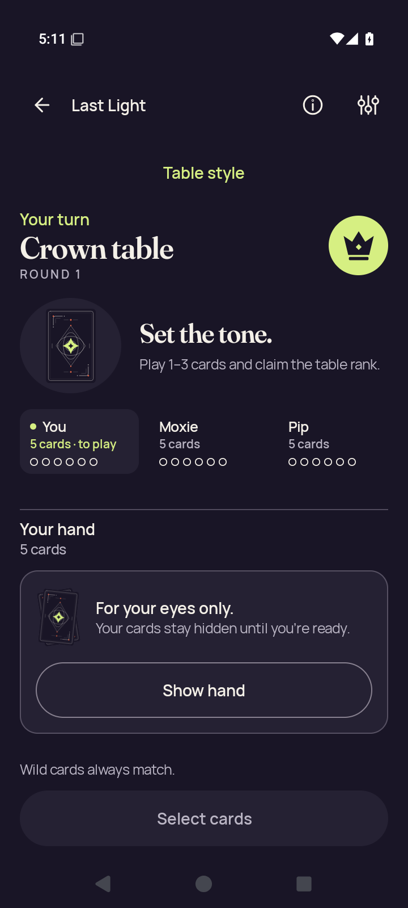</a> <code>practice-resumed-concealed.png</code> practice-resumed-concealed | 720 × 1600 px · 109,693 bytes · text 1.0 SHA-256: <code>d752253f9649691f13630cd26a59988c45c5ad7d05c3902210701602e6cd6fbd</code> Source: <code>/root/projects/PartyDeck/artifacts/evidence-storage/34503251315/android-jvm-reports/build/ci/android/optimized-test-signed/practice-resumed-concealed.png</code> [UI XML](practice-resumed-concealed.xml) · [Capture/result JSON](smoke-result.json) · [Original result](smoke-result.json) | **Direct original view**. The resumed normal practice still shows the complete concealed-hand panel and Show hand, with readable Crown opening context and full Select cards. It is a still-state observation, not transition privacy proof. |
|  <code>practice-returned-home.png</code> practice-returned-home | 720 × 1600 px · 131,901 bytes · text 1.0 SHA-256: <code>7d797a68110b3d486c2e0fa70abaca7883c8721d6d02a26373c297bfa828ae45</code> Source: <code>/root/projects/PartyDeck/artifacts/evidence-storage/34503251315/android-jvm-reports/build/ci/android/optimized-test-signed/practice-returned-home.png</code> [UI XML](practice-returned-home.xml) · [Capture/result JSON](smoke-result.json) · [Original result](smoke-result.json) | **Direct original view**. Normal returned Home fully shows the brand/headline artwork, Last Light copy and Host, Join, Practice, How to play and Settings actions. |
| <a href="practice-selected.png">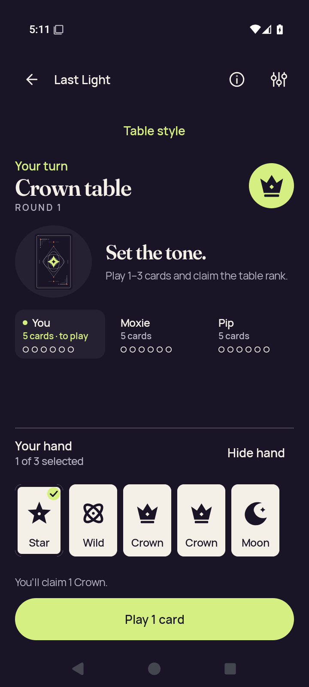</a> <code>practice-selected.png</code> practice-selected | 720 × 1600 px · 107,793 bytes · text 1.0 SHA-256: <code>480bf9c565359ddfe418c07774f31a9654e8b3d54a5b5633c199f46ea9166945</code> Source: <code>/root/projects/PartyDeck/artifacts/evidence-storage/34503251315/android-jvm-reports/build/ci/android/optimized-test-signed/practice-selected.png</code> [UI XML](practice-selected.xml) · [Capture/result JSON](smoke-result.json) · [Original result](smoke-result.json) | **Direct original view**. The normal selected hand shows five complete Star/Wild/Crown/Crown/Moon cards with the first Star checked. Selection count, one-Crown claim feedback and full-width Play 1 card fit under readable Crown opening context. |
| <a href="rules-intro.png">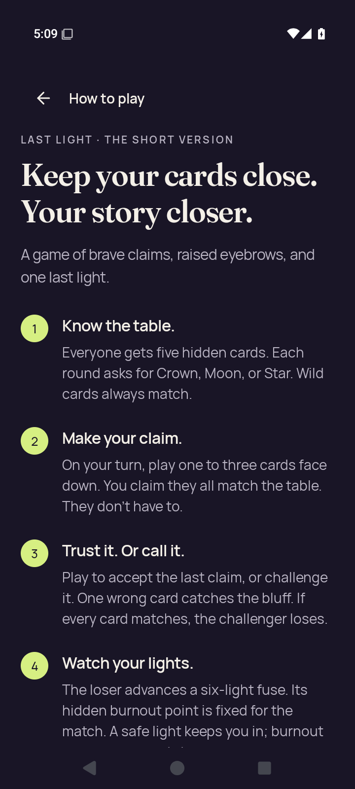</a> <code>rules-intro.png</code> rules-intro | 720 × 1600 px · 151,071 bytes · text 1.0 SHA-256: <code>e4ec02e1a01a55457da6b0fd001f8596e9eb47464f9b27fd59936a3d33e4c32f</code> Source: <code>/root/projects/PartyDeck/artifacts/evidence-storage/34503251315/android-jvm-reports/build/ci/android/optimized-test-signed/rules-intro.png</code> [UI XML](rules-intro.xml) · [Capture/result JSON](smoke-result.json) · [Original result](smoke-result.json) | **Direct original view**. Normal Rules shows the complete introduction and rules 1–3. Rule 4 begins below and continues past the bottom edge; the later rules and Practice action are outside this scroll position. |
| <a href="rules-last-step.png">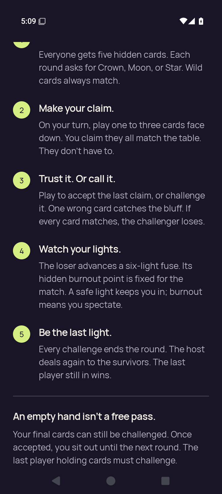</a> <code>rules-last-step.png</code> rules-last-step | 720 × 1600 px · 157,048 bytes · text 1.0 SHA-256: <code>d8fed21ae973735378421dc8029ebe38e368b519ac983eda93c788a3d42ebae6</code> Source: <code>/root/projects/PartyDeck/artifacts/evidence-storage/34503251315/android-jvm-reports/build/ci/android/optimized-test-signed/rules-last-step.png</code> [UI XML](rules-last-step.xml) · [Capture/result JSON](smoke-result.json) · [Original result](smoke-result.json) | **Direct original view**. The normal Rules scroll position shows rules 2–5 and the empty-hand explanation completely. Rule 1&#x27;s heading is clipped above and the separate Practice action lies below. |
| <a href="rules-practice-action.png">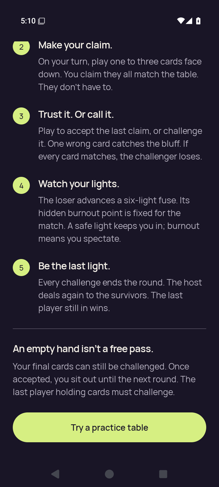</a> <code>rules-practice-action.png</code> rules-practice-action | 720 × 1600 px · 143,281 bytes · text 1.0 SHA-256: <code>ebbee5a02ed981a4e67e7d604f91bd251431a6e15f921b97a1fcb2c71f80bb26</code> Source: <code>/root/projects/PartyDeck/artifacts/evidence-storage/34503251315/android-jvm-reports/build/ci/android/optimized-test-signed/rules-practice-action.png</code> [UI XML](rules-practice-action.xml) · [Capture/result JSON](smoke-result.json) · [Original result](smoke-result.json) | **Direct original view**. The normal Rules lower view shows the rule 2 explanation, complete rules 3–5 and the empty-hand explanation. The entire Try a practice table button fits below. |
| <a href="rules-practice-entered.png">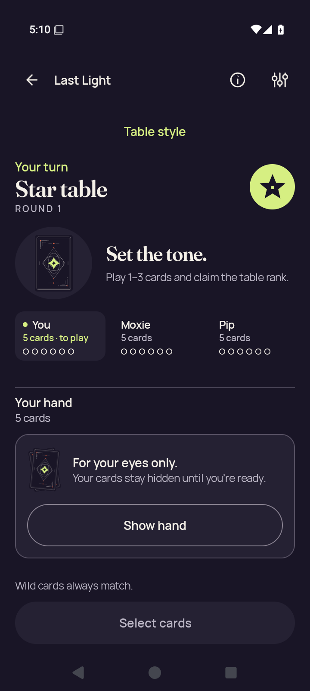</a> <code>rules-practice-entered.png</code> rules-practice-entered | 720 × 1600 px · 108,186 bytes · text 1.0 SHA-256: <code>f0f632ec3080be2bdf21f5cb31b51a6d4c3d5f4656b5051e1957642a26173cc7</code> Source: <code>/root/projects/PartyDeck/artifacts/evidence-storage/34503251315/android-jvm-reports/build/ci/android/optimized-test-signed/rules-practice-entered.png</code> [UI XML](rules-practice-entered.xml) · [Capture/result JSON](smoke-result.json) · [Original result](smoke-result.json) | **Direct original view**. Normal practice entry shows a readable Star round 1, Your turn and opening guidance. The covered-hand panel, full Show hand and Select cards fit; no private ranks appear. |
|  <code>rules-returned-home.png</code> rules-returned-home | 720 × 1600 px · 131,940 bytes · text 1.0 SHA-256: <code>5266b664897e9aa19bce4bc531ceb8c75e64f2872f83d0b313b2b534c51c0c12</code> Source: <code>/root/projects/PartyDeck/artifacts/evidence-storage/34503251315/android-jvm-reports/build/ci/android/optimized-test-signed/rules-returned-home.png</code> [UI XML](rules-returned-home.xml) · [Capture/result JSON](smoke-result.json) · [Original result](smoke-result.json) | **Direct original view**. Normal Home after returning from Rules shows the full brand/headline artwork, Last Light copy and all Host, Join, Practice, How to play and Settings actions. |
|  <code>settings-changed.png</code> settings-changed | 720 × 1600 px · 119,401 bytes · text 1.0 SHA-256: <code>ed4d1f20b49c6681b533ea0bda9e3d5bea53e318fe0c77462e017ac477a4c061</code> Source: <code>/root/projects/PartyDeck/artifacts/evidence-storage/34503251315/android-jvm-reports/build/ci/android/optimized-test-signed/settings-changed.png</code> [UI XML](settings-changed.xml) · [Capture/result JSON](smoke-result.json) · [Original result](smoke-result.json) | **Direct original view**. Normal Settings shows Sound and Haptics off, Reduce motion on, complete explanations, table/privacy copy, artwork/type credits and Credits &amp; licenses. All visible content fits. |
| <a href="settings-persisted.png">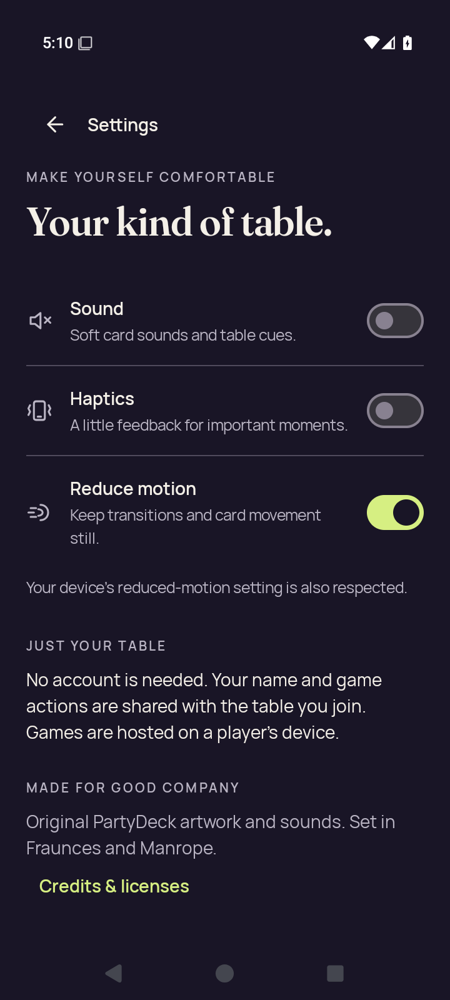</a> <code>settings-persisted.png</code> settings-persisted | 720 × 1600 px · 119,525 bytes · text 1.0 SHA-256: <code>c0e02601605f79a68802deec55a03807c70a0e05bcd982efed4ec201a7f109a1</code> Source: <code>/root/projects/PartyDeck/artifacts/evidence-storage/34503251315/android-jvm-reports/build/ci/android/optimized-test-signed/settings-persisted.png</code> [UI XML](settings-persisted.xml) · [Capture/result JSON](smoke-result.json) · [Original result](smoke-result.json) | **Direct original view**. The persisted Settings capture shows Sound and Haptics off and Reduce motion on, with complete explanatory, table/privacy and credits content. Credits &amp; licenses fits above system navigation. |
| <a href="settings-return-home.png">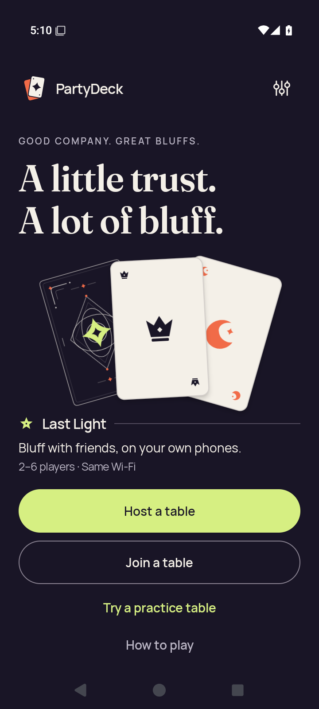</a> <code>settings-return-home.png</code> settings-return-home | 720 × 1600 px · 131,940 bytes · text 1.0 SHA-256: <code>5266b664897e9aa19bce4bc531ceb8c75e64f2872f83d0b313b2b534c51c0c12</code> Source: <code>/root/projects/PartyDeck/artifacts/evidence-storage/34503251315/android-jvm-reports/build/ci/android/optimized-test-signed/settings-return-home.png</code> [UI XML](settings-return-home.xml) · [Capture/result JSON](smoke-result.json) · [Original result](smoke-result.json) | **Exact same-batch match**. Exact bytes match separately retained capture 208. Reused pixel observation: Normal Home after returning from Rules shows the full brand/headline artwork, Last Light copy and all Host, Join, Practice, How to play and Settings actions. [Reviewed matching original](rules-returned-home.png); original capture identity remains separate. |
