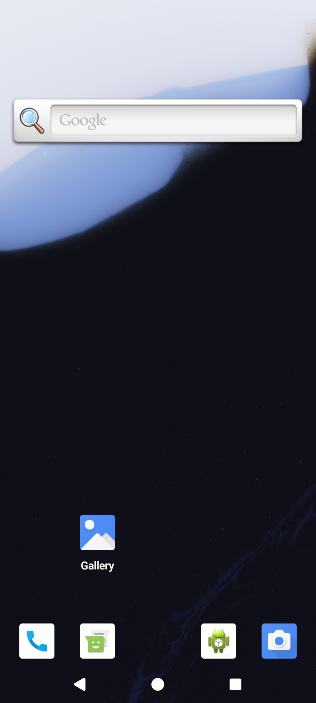

# API 35 emulator preparation — CI 34503251315

[All collections](../../README.md) · [Preserved evidence index](../evidence-index.md) · [Copy/review binding](../provenance/publication-review/partydeck-gallery-2815-publication-binding-v1.json) · [Completed visual review](../provenance/publication-review/partydeck-gallery-after-2355-api35-visual-review-v1.json) · [Unchanged source mapping](../provenance/source-map/capture-gallery-mapping.json)

**Launcher/setup evidence only; no gameplay or native acceptance.**

One original preparation image and its original UI/result companions.

Both ordinary debug and optimized smokes pass. Native debug passes 21 checks, including two guarded renderer-death checks; optimized passes 19 checks and explicitly skips the two renderer-death checks. Engine gameplay was not invoked. The frozen independent review records 262 JUnit tests in 41 suites with no failures/errors/skips, 155 passing host tests and 11 lint warnings. These results add no TalkBack or continuous-privacy acceptance.

Normal Standard hands and selection/actions fit. Several Round 1 reveal labels clip at a public-panel edge. Native old-PCK 2D initial Reveal fits narrowly while the cover bottom clips; 3D seats scroll horizontally. The optimized no-claim round-1 result fits the full Return to lobby action. The debug round-2 claim plus previous-round-review state continues below the body. Enlarged intermediate hand, Rules and Settings content requires scrolling; scrolled Play/Challenge and Rules → Practice fit. The enlarged debug invalid-Join button crosses the right viewport edge while the optimized counterpart fits. The optimized original named large-text-rules-practice-entered.png visibly shows a round result. Sequential PNG/XML are not atomic.

Source revision: `1cd34a36753ed0112e6684f6525592dab8ef2edb`. CI run: [34503251315](https://github.com/Apdelrahman1911/PartyDeck/actions/runs/34503251315). 1 original PNG identities. Review methods: 1 direct original view.

Every thumbnail opens the unchanged original PNG. Original filenames, dimensions, source paths and outcomes remain separate even when pixels match. No derivative image was created. Frozen provenance pages retain their original text and source references.

| Original capture | Original identity and evidence | Visual observation |
| --- | --- | --- |
|  <code>final-screen.png</code> final-screen | 720 × 1600 px · 753,666 bytes SHA-256: <code>bce872854aa66a8dabf102ae58a806188884fb8be3771eed2abf070c37332bdf</code> Source: <code>/root/projects/PartyDeck/artifacts/evidence-storage/34503251315/android-jvm-reports/build/ci/android/preparation/attempt-1/final-screen.png</code> [UI XML](attempt-1/last-ui.xml) · [Capture/result JSON](attempt-1/preparation-attempt.json) · [Original result](attempt-1/preparation-attempt.json) | **Direct original view**. The emulator-preparation original shows the Android launcher, search widget and Gallery/launcher icons. No PartyDeck UI is displayed; this image carries preparation provenance only. |
