# API 35 native sessions — debug

[All collections](../../../README.md) · [Preserved evidence index](../../evidence-index.md) · [Copy/review binding](../../provenance/publication-review/partydeck-gallery-3433-publication-binding-v1.json) · [Completed focused review](../../provenance/publication-review/partydeck-gallery-after-2815-combinedandroid34515669045-visual-review-v1.json) · [Source mapping](../../provenance/source-review/capture-inventory-v1.json)

**Original native check counts: {"passed": 30}. Current engine outcome limits remain explicit.**

Capture PNG, XML and JSON acquisitions are sequential; original stage names and timestamps are retained.

The Android job succeeds. Both ordinary smokes pass. Native debug passes 30 checks; optimized passes 28 and explicitly skips two renderer-death checks. The overall combined workflow fails in the separate iOS job. This collection preserves 186 native, 62 ordinary, 69 Compose JVM and one preparation original.

Six originals were directly reviewed: both normal portrait 2D native entries and the four current engine public-outcome frames. The compact cover/Reveal, first two complete numbered seats and fixed actions fit both 2D entries. Four after-Play PNGs show public round results. Debug 2D is Round 2; the other three are Round 1. The independent XML/source audit establishes each outcome matches its recorded baseline round. These public-result stills show no remaining private-hand layout or visible five-to-four count. All four continuation actions lie below the captured viewport. The optimized 3D fuse panel reaches the clip.

All four current engine scenarios have zero Standard card nodes in the relevant XMLs; remaining Standard hand size/unchecked cards are unobserved. Renderer selection clearing is observed local state only. Eighty-two originals match separately published bytes; 230 others remain explicitly unviewed. The collector and independent action reviewer reported zero media views. No videos exist in this Android collection. Source is derived exact-commit provenance, with 1,124 historical gallery payloads represented by remote-tree identity only. Source audits are reused without broad re-execution.

Source revision: `0f00f17a398be96aef7bdb58d03074a9914f8232`. CI run: [34515669045](https://github.com/Apdelrahman1911/PartyDeck/actions/runs/34515669045). 100 original PNG identities. Review methods: 97 unviewed original — no visual acceptance, 3 direct original view.

Every thumbnail opens the unchanged original PNG. **UNVIEWED** means no direct pixel review or visual acceptance is asserted. Matching bytes reuse only earlier pixel observations. Each source, scenario and original outcome remains separate. Frozen review plans retain their historical pending flags; the completed focused-review receipt records the final status. No new derivative image or video decoding was performed.

| Original capture | Original identity and evidence | Review status and observation |
| --- | --- | --- |
|  <code>2d-action-entry-native-ready.png</code> 2d-action-entry-native-ready — 2d.standard-action | 720 × 1600 px · 146,256 bytes SHA-256: <code>10e109c4d5d15341f8effbcca65482d57313c6d977f1c68d9fae4216020161ea</code> Source: <code>/root/projects/PartyDeck/artifacts/evidence-storage/34515669045/android-jvm-reports/build/ci/android/godot-session/debug/runtime/captures/2d-action-entry-native-ready.png</code> Capture: 2026-09-10T19:01:35.881+00:00 → 2026-09-10T19:01:38.255+00:00 [UI XML](runtime/captures/2d-action-entry-native-ready.xml) · [Capture JSON](runtime/captures/2d-action-entry-native-ready.json) · [Original result](runtime/godot-session-result.json) | **UNVIEWED original — no visual acceptance**. Original capture preserved without direct visual review. Source name, stage, timestamps and run outcome remain unchanged; no pixel observation or visual acceptance is asserted. |
|  <code>2d-action-entry-selected.png</code> 2d-action-entry-selected — 2d.standard-action | 720 × 1600 px · 110,854 bytes SHA-256: <code>4060fff0b4adaad9b2e921982116d26487553405f99324e6d3f026e3ab490de4</code> Source: <code>/root/projects/PartyDeck/artifacts/evidence-storage/34515669045/android-jvm-reports/build/ci/android/godot-session/debug/runtime/captures/2d-action-entry-selected.png</code> Capture: 2026-09-10T19:01:16.226+00:00 → 2026-09-10T19:01:18.577+00:00 [UI XML](runtime/captures/2d-action-entry-selected.xml) · [Capture JSON](runtime/captures/2d-action-entry-selected.json) · [Original result](runtime/godot-session-result.json) | **UNVIEWED original — no visual acceptance**. Original capture preserved without direct visual review. Source name, stage, timestamps and run outcome remain unchanged; no pixel observation or visual acceptance is asserted. |
|  <code>2d-action-entry-selector.png</code> 2d-action-entry-selector — 2d.standard-action | 720 × 1600 px · 58,046 bytes SHA-256: <code>3eb7f94379abc19219a2d912d191f9c04d295818ec6d0e66015d9cf50f3d30d7</code> Source: <code>/root/projects/PartyDeck/artifacts/evidence-storage/34515669045/android-jvm-reports/build/ci/android/godot-session/debug/runtime/captures/2d-action-entry-selector.png</code> Capture: 2026-09-10T19:01:25.261+00:00 → 2026-09-10T19:01:27.592+00:00 [UI XML](runtime/captures/2d-action-entry-selector.xml) · [Capture JSON](runtime/captures/2d-action-entry-selector.json) · [Original result](runtime/godot-session-result.json) | **UNVIEWED original — no visual acceptance**. Original capture preserved without direct visual review. Source name, stage, timestamps and run outcome remain unchanged; no pixel observation or visual acceptance is asserted. |
|  <code>2d-action-return-concealed.png</code> 2d-action-return-concealed — 2d.standard-action | 720 × 1600 px · 118,638 bytes SHA-256: <code>d5621b9d9b1e49649b1f03d4e27657071ab34d1627eceafa0b59091055b4f6f4</code> Source: <code>/root/projects/PartyDeck/artifacts/evidence-storage/34515669045/android-jvm-reports/build/ci/android/godot-session/debug/runtime/captures/2d-action-return-concealed.png</code> Capture: 2026-09-10T19:01:45.349+00:00 → 2026-09-10T19:01:47.694+00:00 [UI XML](runtime/captures/2d-action-return-concealed.xml) · [Capture JSON](runtime/captures/2d-action-return-concealed.json) · [Original result](runtime/godot-session-result.json) | **UNVIEWED original — no visual acceptance**. Original capture preserved without direct visual review. Source name, stage, timestamps and run outcome remain unchanged; no pixel observation or visual acceptance is asserted. |
|  <code>2d-action-return-first-card.png</code> 2d-action-return-first-card — 2d.standard-action | 720 × 1600 px · 111,703 bytes SHA-256: <code>5ab938ad0f5b232643e26689abccd68a27b1324889b090dbf3750def00cb6b93</code> Source: <code>/root/projects/PartyDeck/artifacts/evidence-storage/34515669045/android-jvm-reports/build/ci/android/godot-session/debug/runtime/captures/2d-action-return-first-card.png</code> Capture: 2026-09-10T19:02:00.611+00:00 → 2026-09-10T19:02:02.957+00:00 [UI XML](runtime/captures/2d-action-return-first-card.xml) · [Capture JSON](runtime/captures/2d-action-return-first-card.json) · [Original result](runtime/godot-session-result.json) | **UNVIEWED original — no visual acceptance**. Original capture preserved without direct visual review. Source name, stage, timestamps and run outcome remain unchanged; no pixel observation or visual acceptance is asserted. |
|  <code>2d-action-return-public.png</code> 2d-action-return-public — 2d.standard-action | 720 × 1600 px · 118,638 bytes SHA-256: <code>d5621b9d9b1e49649b1f03d4e27657071ab34d1627eceafa0b59091055b4f6f4</code> Source: <code>/root/projects/PartyDeck/artifacts/evidence-storage/34515669045/android-jvm-reports/build/ci/android/godot-session/debug/runtime/captures/2d-action-return-public.png</code> Capture: 2026-09-10T19:01:54.106+00:00 → 2026-09-10T19:01:56.460+00:00 [UI XML](runtime/captures/2d-action-return-public.xml) · [Capture JSON](runtime/captures/2d-action-return-public.json) · [Original result](runtime/godot-session-result.json) | **UNVIEWED original — no visual acceptance**. Original capture preserved without direct visual review. Source name, stage, timestamps and run outcome remain unchanged; no pixel observation or visual acceptance is asserted. |
|  <code>2d-action-return-selection-cleared.png</code> 2d-action-return-selection-cleared — 2d.standard-action | 720 × 1600 px · 118,638 bytes SHA-256: <code>d5621b9d9b1e49649b1f03d4e27657071ab34d1627eceafa0b59091055b4f6f4</code> Source: <code>/root/projects/PartyDeck/artifacts/evidence-storage/34515669045/android-jvm-reports/build/ci/android/godot-session/debug/runtime/captures/2d-action-return-selection-cleared.png</code> Capture: 2026-09-10T19:01:49.723+00:00 → 2026-09-10T19:01:52.075+00:00 [UI XML](runtime/captures/2d-action-return-selection-cleared.xml) · [Capture JSON](runtime/captures/2d-action-return-selection-cleared.json) · [Original result](runtime/godot-session-result.json) | **UNVIEWED original — no visual acceptance**. Original capture preserved without direct visual review. Source name, stage, timestamps and run outcome remain unchanged; no pixel observation or visual acceptance is asserted. |
|  <code>2d-baseline-first-card.png</code> 2d-baseline-first-card — 2d.practice-baseline | 720 × 1600 px · 111,405 bytes SHA-256: <code>3336f9a00be5242886eba50ba30b78d3f4d82be2355120402e925b67e422df94</code> Source: <code>/root/projects/PartyDeck/artifacts/evidence-storage/34515669045/android-jvm-reports/build/ci/android/godot-session/debug/runtime/captures/2d-baseline-first-card.png</code> Capture: 2026-09-10T18:56:23.805+00:00 → 2026-09-10T18:56:26.220+00:00 [UI XML](runtime/captures/2d-baseline-first-card.xml) · [Capture JSON](runtime/captures/2d-baseline-first-card.json) · [Original result](runtime/godot-session-result.json) | **UNVIEWED original — no visual acceptance**. Original capture preserved without direct visual review. Source name, stage, timestamps and run outcome remain unchanged; no pixel observation or visual acceptance is asserted. |
| <a href="runtime/captures/2d-baseline-public.png">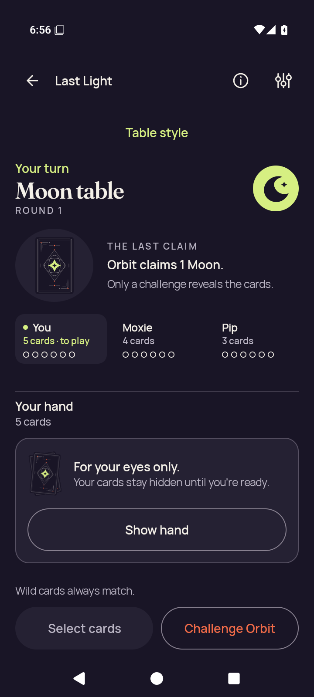</a> <code>2d-baseline-public.png</code> 2d-baseline-public — 2d.practice-baseline | 720 × 1600 px · 118,631 bytes SHA-256: <code>7563d63a4bb9e686d91aee6085eacf6b2bd4c5b316b2becf30f8000d24a7f50a</code> Source: <code>/root/projects/PartyDeck/artifacts/evidence-storage/34515669045/android-jvm-reports/build/ci/android/godot-session/debug/runtime/captures/2d-baseline-public.png</code> Capture: 2026-09-10T18:56:17.257+00:00 → 2026-09-10T18:56:19.619+00:00 [UI XML](runtime/captures/2d-baseline-public.xml) · [Capture JSON](runtime/captures/2d-baseline-public.json) · [Original result](runtime/godot-session-result.json) | **UNVIEWED original — no visual acceptance**. Original capture preserved without direct visual review. Source name, stage, timestamps and run outcome remain unchanged; no pixel observation or visual acceptance is asserted. |
|  <code>2d-baseline-selected.png</code> 2d-baseline-selected — 2d.standard-hand | 720 × 1600 px · 111,397 bytes SHA-256: <code>570c7a04ba791694a65ace076338c37be1e5a8b97e1157a87ae176ea6a7d2554</code> Source: <code>/root/projects/PartyDeck/artifacts/evidence-storage/34515669045/android-jvm-reports/build/ci/android/godot-session/debug/runtime/captures/2d-baseline-selected.png</code> Capture: 2026-09-10T18:58:09.820+00:00 → 2026-09-10T18:58:12.190+00:00 [UI XML](runtime/captures/2d-baseline-selected.xml) · [Capture JSON](runtime/captures/2d-baseline-selected.json) · [Original result](runtime/godot-session-result.json) | **UNVIEWED original — no visual acceptance**. Original capture preserved without direct visual review. Source name, stage, timestamps and run outcome remain unchanged; no pixel observation or visual acceptance is asserted. |
|  <code>2d-death-native-ready.png</code> 2d-death-native-ready — 2d.renderer-death | 720 × 1600 px · 147,047 bytes SHA-256: <code>55f53d9229c9dda2d1a775562563b9922b667371b9d59d0d4c9e5b683775b8eb</code> Source: <code>/root/projects/PartyDeck/artifacts/evidence-storage/34515669045/android-jvm-reports/build/ci/android/godot-session/debug/runtime/captures/2d-death-native-ready.png</code> Capture: 2026-09-10T18:59:43.383+00:00 → 2026-09-10T18:59:45.726+00:00 [UI XML](runtime/captures/2d-death-native-ready.xml) · [Capture JSON](runtime/captures/2d-death-native-ready.json) · [Original result](runtime/godot-session-result.json) | **UNVIEWED original — no visual acceptance**. Original capture preserved without direct visual review. Source name, stage, timestamps and run outcome remain unchanged; no pixel observation or visual acceptance is asserted. |
|  <code>2d-death-return-concealed.png</code> 2d-death-return-concealed — 2d.renderer-death | 720 × 1600 px · 119,335 bytes SHA-256: <code>1115edc1463acfe711d54d5e524cce7718b0e966a5ec7f3cac1cf1bae294da49</code> Source: <code>/root/projects/PartyDeck/artifacts/evidence-storage/34515669045/android-jvm-reports/build/ci/android/godot-session/debug/runtime/captures/2d-death-return-concealed.png</code> Capture: 2026-09-10T18:59:50.442+00:00 → 2026-09-10T18:59:52.784+00:00 [UI XML](runtime/captures/2d-death-return-concealed.xml) · [Capture JSON](runtime/captures/2d-death-return-concealed.json) · [Original result](runtime/godot-session-result.json) | **UNVIEWED original — no visual acceptance**. Original capture preserved without direct visual review. Source name, stage, timestamps and run outcome remain unchanged; no pixel observation or visual acceptance is asserted. |
|  <code>2d-death-return-first-card.png</code> 2d-death-return-first-card — 2d.renderer-death | 720 × 1600 px · 111,175 bytes SHA-256: <code>288ba99fb8ce7f707968c7196509e7db3dee3ef4e83cd2dd62ea16cbf2ed924c</code> Source: <code>/root/projects/PartyDeck/artifacts/evidence-storage/34515669045/android-jvm-reports/build/ci/android/godot-session/debug/runtime/captures/2d-death-return-first-card.png</code> Capture: 2026-09-10T19:00:05.684+00:00 → 2026-09-10T19:00:08.072+00:00 [UI XML](runtime/captures/2d-death-return-first-card.xml) · [Capture JSON](runtime/captures/2d-death-return-first-card.json) · [Original result](runtime/godot-session-result.json) | **UNVIEWED original — no visual acceptance**. Original capture preserved without direct visual review. Source name, stage, timestamps and run outcome remain unchanged; no pixel observation or visual acceptance is asserted. |
|  <code>2d-death-return-public.png</code> 2d-death-return-public — 2d.renderer-death | 720 × 1600 px · 118,420 bytes SHA-256: <code>1d1c7487d9d1a072a5718f5fce2239ef080520fa9cc274809e626bf87e96cfce</code> Source: <code>/root/projects/PartyDeck/artifacts/evidence-storage/34515669045/android-jvm-reports/build/ci/android/godot-session/debug/runtime/captures/2d-death-return-public.png</code> Capture: 2026-09-10T18:59:59.194+00:00 → 2026-09-10T19:00:01.559+00:00 [UI XML](runtime/captures/2d-death-return-public.xml) · [Capture JSON](runtime/captures/2d-death-return-public.json) · [Original result](runtime/godot-session-result.json) | **UNVIEWED original — no visual acceptance**. Original capture preserved without direct visual review. Source name, stage, timestamps and run outcome remain unchanged; no pixel observation or visual acceptance is asserted. |
|  <code>2d-death-return-selection-cleared.png</code> 2d-death-return-selection-cleared — 2d.renderer-death | 720 × 1600 px · 119,335 bytes SHA-256: <code>1115edc1463acfe711d54d5e524cce7718b0e966a5ec7f3cac1cf1bae294da49</code> Source: <code>/root/projects/PartyDeck/artifacts/evidence-storage/34515669045/android-jvm-reports/build/ci/android/godot-session/debug/runtime/captures/2d-death-return-selection-cleared.png</code> Capture: 2026-09-10T18:59:54.812+00:00 → 2026-09-10T18:59:57.164+00:00 [UI XML](runtime/captures/2d-death-return-selection-cleared.xml) · [Capture JSON](runtime/captures/2d-death-return-selection-cleared.json) · [Original result](runtime/godot-session-result.json) | **UNVIEWED original — no visual acceptance**. Original capture preserved without direct visual review. Source name, stage, timestamps and run outcome remain unchanged; no pixel observation or visual acceptance is asserted. |
|  <code>2d-death-selected.png</code> 2d-death-selected — 2d.renderer-death | 720 × 1600 px · 111,507 bytes SHA-256: <code>674ec5bd88af344bf15c9f0878f3a7d26d258a6ee5bb6c8e96b2d61f2fb1d1ca</code> Source: <code>/root/projects/PartyDeck/artifacts/evidence-storage/34515669045/android-jvm-reports/build/ci/android/godot-session/debug/runtime/captures/2d-death-selected.png</code> Capture: 2026-09-10T18:59:23.950+00:00 → 2026-09-10T18:59:26.321+00:00 [UI XML](runtime/captures/2d-death-selected.xml) · [Capture JSON](runtime/captures/2d-death-selected.json) · [Original result](runtime/godot-session-result.json) | **UNVIEWED original — no visual acceptance**. Original capture preserved without direct visual review. Source name, stage, timestamps and run outcome remain unchanged; no pixel observation or visual acceptance is asserted. |
|  <code>2d-death-selector.png</code> 2d-death-selector — 2d.renderer-death | 720 × 1600 px · 58,832 bytes SHA-256: <code>cc10885e5367f8acb91a4d295fffbedbfd6af723c7486b48e2ccb6953e9f4d0e</code> Source: <code>/root/projects/PartyDeck/artifacts/evidence-storage/34515669045/android-jvm-reports/build/ci/android/godot-session/debug/runtime/captures/2d-death-selector.png</code> Capture: 2026-09-10T18:59:32.989+00:00 → 2026-09-10T18:59:35.341+00:00 [UI XML](runtime/captures/2d-death-selector.xml) · [Capture JSON](runtime/captures/2d-death-selector.json) · [Original result](runtime/godot-session-result.json) | **UNVIEWED original — no visual acceptance**. Original capture preserved without direct visual review. Source name, stage, timestamps and run outcome remain unchanged; no pixel observation or visual acceptance is asserted. |
| <a href="runtime/captures/2d-engine-baseline-first-card.png">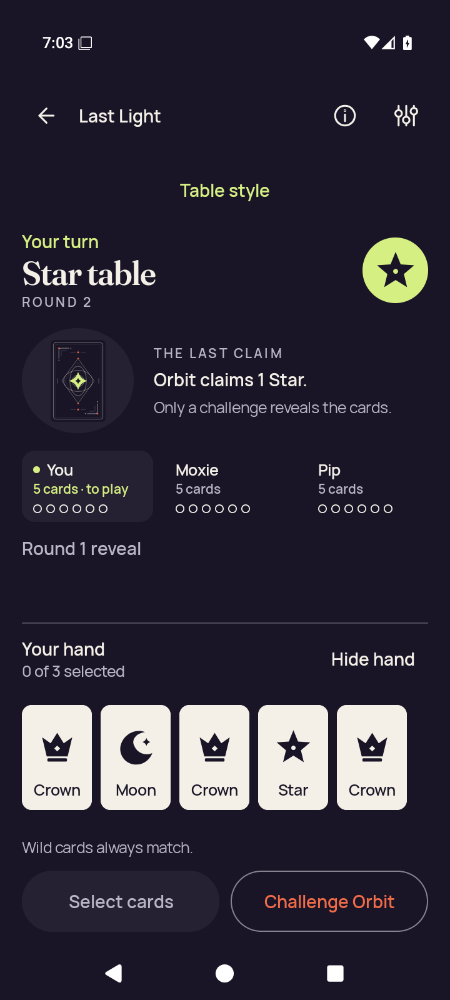</a> <code>2d-engine-baseline-first-card.png</code> 2d-engine-baseline-first-card — 2d.engine-practice-baseline | 720 × 1600 px · 116,619 bytes SHA-256: <code>cf237642e154e5f78e5a9964ed3d1b6ca5b56f53859b201838cf0712b76231a1</code> Source: <code>/root/projects/PartyDeck/artifacts/evidence-storage/34515669045/android-jvm-reports/build/ci/android/godot-session/debug/runtime/captures/2d-engine-baseline-first-card.png</code> Capture: 2026-09-10T19:03:13.676+00:00 → 2026-09-10T19:03:16.043+00:00 [UI XML](runtime/captures/2d-engine-baseline-first-card.xml) · [Capture JSON](runtime/captures/2d-engine-baseline-first-card.json) · [Original result](runtime/godot-session-result.json) | **UNVIEWED original — no visual acceptance**. Original capture preserved without direct visual review. Source name, stage, timestamps and run outcome remain unchanged; no pixel observation or visual acceptance is asserted. |
| <a href="runtime/captures/2d-engine-baseline-public.png">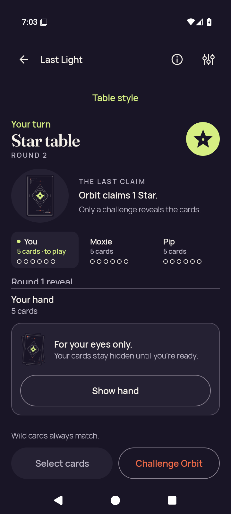</a> <code>2d-engine-baseline-public.png</code> 2d-engine-baseline-public — 2d.engine-practice-baseline | 720 × 1600 px · 120,293 bytes SHA-256: <code>5ecf3a7ef405ff713d4dfc3dab43a48972a7377b918594b03859622d2091e812</code> Source: <code>/root/projects/PartyDeck/artifacts/evidence-storage/34515669045/android-jvm-reports/build/ci/android/godot-session/debug/runtime/captures/2d-engine-baseline-public.png</code> Capture: 2026-09-10T19:03:07.169+00:00 → 2026-09-10T19:03:09.528+00:00 [UI XML](runtime/captures/2d-engine-baseline-public.xml) · [Capture JSON](runtime/captures/2d-engine-baseline-public.json) · [Original result](runtime/godot-session-result.json) | **UNVIEWED original — no visual acceptance**. Original capture preserved without direct visual review. Source name, stage, timestamps and run outcome remain unchanged; no pixel observation or visual acceptance is asserted. |
| <a href="runtime/captures/2d-engine-entry-native-ready.png">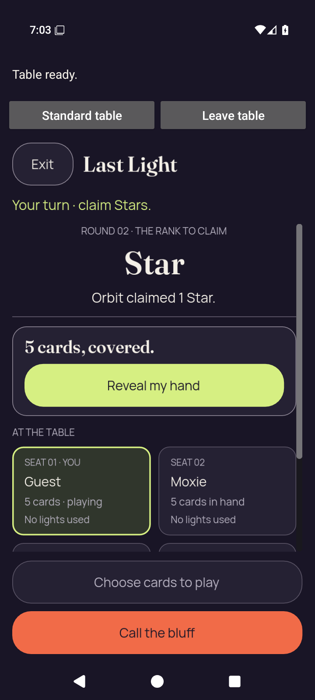</a> <code>2d-engine-entry-native-ready.png</code> 2d-engine-entry-native-ready — 2d.engine-reveal-selection | 720 × 1600 px · 145,446 bytes SHA-256: <code>c3b0afef475a3530e041bd2ac93a742c4fba33a4d3020cb92b66a86b57c27e32</code> Source: <code>/root/projects/PartyDeck/artifacts/evidence-storage/34515669045/android-jvm-reports/build/ci/android/godot-session/debug/runtime/captures/2d-engine-entry-native-ready.png</code> Capture: 2026-09-10T19:03:41.813+00:00 → 2026-09-10T19:03:44.168+00:00 [UI XML](runtime/captures/2d-engine-entry-native-ready.xml) · [Capture JSON](runtime/captures/2d-engine-entry-native-ready.json) · [Original result](runtime/godot-session-result.json) | **UNVIEWED original — no visual acceptance**. Original capture preserved without direct visual review. Source name, stage, timestamps and run outcome remain unchanged; no pixel observation or visual acceptance is asserted. |
|  <code>2d-engine-entry-selector.png</code> 2d-engine-entry-selector — 2d.engine-reveal-selection | 720 × 1600 px · 58,502 bytes SHA-256: <code>50af1c67c42ec9d530abc841b15e16b42fc1f965be9923401c377fabe31f1f31</code> Source: <code>/root/projects/PartyDeck/artifacts/evidence-storage/34515669045/android-jvm-reports/build/ci/android/godot-session/debug/runtime/captures/2d-engine-entry-selector.png</code> Capture: 2026-09-10T19:03:30.965+00:00 → 2026-09-10T19:03:33.317+00:00 [UI XML](runtime/captures/2d-engine-entry-selector.xml) · [Capture JSON](runtime/captures/2d-engine-entry-selector.json) · [Original result](runtime/godot-session-result.json) | **UNVIEWED original — no visual acceptance**. Original capture preserved without direct visual review. Source name, stage, timestamps and run outcome remain unchanged; no pixel observation or visual acceptance is asserted. |
|  <code>2d-engine-home.png</code> 2d-engine-home — 2d.engine-leave-end | 720 × 1600 px · 132,127 bytes SHA-256: <code>189c7c8f3bd4994bf65d9c1370cba201526e79253363758b9ab49645ccce414f</code> Source: <code>/root/projects/PartyDeck/artifacts/evidence-storage/34515669045/android-jvm-reports/build/ci/android/godot-session/debug/runtime/captures/2d-engine-home.png</code> Capture: 2026-09-10T19:05:33.901+00:00 → 2026-09-10T19:05:36.248+00:00 [UI XML](runtime/captures/2d-engine-home.xml) · [Capture JSON](runtime/captures/2d-engine-home.json) · [Original result](runtime/godot-session-result.json) | **UNVIEWED original — no visual acceptance**. Original capture preserved without direct visual review. Source name, stage, timestamps and run outcome remain unchanged; no pixel observation or visual acceptance is asserted. |
|  <code>2d-engine-leave-confirmation.png</code> 2d-engine-leave-confirmation — 2d.engine-leave-end | 720 × 1600 px · 41,177 bytes SHA-256: <code>b0342a91bf395cffc9bc91063291129406e5cca7075607fb2b9a596dea91a0b9</code> Source: <code>/root/projects/PartyDeck/artifacts/evidence-storage/34515669045/android-jvm-reports/build/ci/android/godot-session/debug/runtime/captures/2d-engine-leave-confirmation.png</code> Capture: 2026-09-10T19:05:25.204+00:00 → 2026-09-10T19:05:27.555+00:00 [UI XML](runtime/captures/2d-engine-leave-confirmation.xml) · [Capture JSON](runtime/captures/2d-engine-leave-confirmation.json) · [Original result](runtime/godot-session-result.json) | **UNVIEWED original — no visual acceptance**. Original capture preserved without direct visual review. Source name, stage, timestamps and run outcome remain unchanged; no pixel observation or visual acceptance is asserted. |
|  <code>2d-engine-leave-selector.png</code> 2d-engine-leave-selector — 2d.engine-leave-end | 720 × 1600 px · 58,436 bytes SHA-256: <code>8dd09418e58a38c2adea211fb7045863574300f35a961f335dffb54c96af879b</code> Source: <code>/root/projects/PartyDeck/artifacts/evidence-storage/34515669045/android-jvm-reports/build/ci/android/godot-session/debug/runtime/captures/2d-engine-leave-selector.png</code> Capture: 2026-09-10T19:05:09.970+00:00 → 2026-09-10T19:05:12.360+00:00 [UI XML](runtime/captures/2d-engine-leave-selector.xml) · [Capture JSON](runtime/captures/2d-engine-leave-selector.json) · [Original result](runtime/godot-session-result.json) | **UNVIEWED original — no visual acceptance**. Original capture preserved without direct visual review. Source name, stage, timestamps and run outcome remain unchanged; no pixel observation or visual acceptance is asserted. |
| <a href="runtime/captures/2d-engine-selected.png">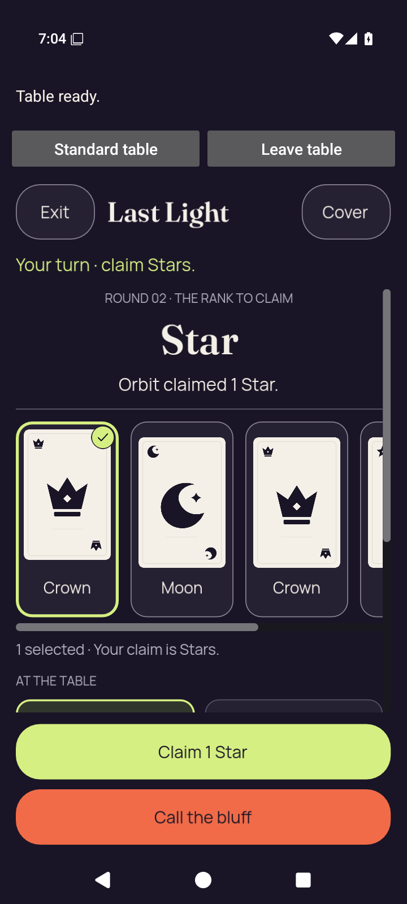</a> <code>2d-engine-selected.png</code> 2d-engine-selected — 2d.engine-reveal-selection | 720 × 1600 px · 122,178 bytes SHA-256: <code>6cc9a9bb60b75176cc150f8fd5d38aae3c163a52edb1a7643cef2f1b82244407</code> Source: <code>/root/projects/PartyDeck/artifacts/evidence-storage/34515669045/android-jvm-reports/build/ci/android/godot-session/debug/runtime/captures/2d-engine-selected.png</code> Capture: 2026-09-10T19:04:32.121+00:00 → 2026-09-10T19:04:34.469+00:00 [UI XML](runtime/captures/2d-engine-selected.xml) · [Capture JSON](runtime/captures/2d-engine-selected.json) · [Original result](runtime/godot-session-result.json) | **UNVIEWED original — no visual acceptance**. Original capture preserved without direct visual review. Source name, stage, timestamps and run outcome remain unchanged; no pixel observation or visual acceptance is asserted. |
| <a href="runtime/captures/2d-engine-standard-after-play.png">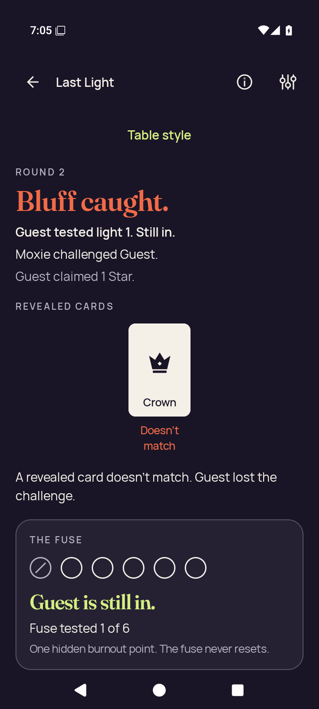</a> <code>2d-engine-standard-after-play.png</code> 2d-engine-standard-after-play — 2d.engine-play-standard-outcome | 720 × 1600 px · 92,460 bytes SHA-256: <code>c2ced809bbac55393879a84a939875ef70a7eee947faaa9685f8fa39c41789e2</code> Source: <code>/root/projects/PartyDeck/artifacts/evidence-storage/34515669045/android-jvm-reports/build/ci/android/godot-session/debug/runtime/captures/2d-engine-standard-after-play.png</code> Capture: 2026-09-10T19:05:01.134+00:00 → 2026-09-10T19:05:03.473+00:00 [UI XML](runtime/captures/2d-engine-standard-after-play.xml) · [Capture JSON](runtime/captures/2d-engine-standard-after-play.json) · [Original result](runtime/godot-session-result.json) | **Direct original view**. Debug 2D shows Round 2, Bluff caught, Guest tested light 1 and stays in, Moxie challenged Guest, and Guest claimed 1 Star. The public Crown card is marked Doesn’t match. The full visible fuse panel says Guest is still in and Fuse tested 1 of 6. Continuation actions are below the captured viewport. The public result card and explanatory copy are readable. No remaining private-hand layout is shown, and no visible five-to-four hand claim is made. The source audit identifies this as a same-round public result relative to its recorded baseline, not proof of a completed match or continuous privacy. |
|  <code>2d-entry-native-ready.png</code> 2d-entry-native-ready — 2d.native-entry | 720 × 1600 px · 146,920 bytes SHA-256: <code>424d51b15939bd753a7b051ed4a7248332decd423c997e1ac8831d6d0bc71341</code> Source: <code>/root/projects/PartyDeck/artifacts/evidence-storage/34515669045/android-jvm-reports/build/ci/android/godot-session/debug/runtime/captures/2d-entry-native-ready.png</code> Capture: 2026-09-10T18:58:29.688+00:00 → 2026-09-10T18:58:32.036+00:00 [UI XML](runtime/captures/2d-entry-native-ready.xml) · [Capture JSON](runtime/captures/2d-entry-native-ready.json) · [Original result](runtime/godot-session-result.json) | **Direct original view**. Debug shows Round 01, Moon and Orbit claimed 1 Moon. The normal-text portrait native-entry frame contains complete Table ready/Standard table/Leave table chrome, Exit/Last Light and round/rank/public context. The full compact five-card cover and Reveal my hand button fit above the first two complete Guest/Moxie seat panels; the next seat row meets the body clip. Fixed Choose cards to play and orange Call the bluff fit fully. No private card face appears. This still does not measure native margins, initial scroll position or continuous privacy. |
|  <code>2d-entry-selector.png</code> 2d-entry-selector — 2d.native-entry | 720 × 1600 px · 58,710 bytes SHA-256: <code>d9b4d13802d4497216cda16e63267e625089d37491a0281113027b638ee78611</code> Source: <code>/root/projects/PartyDeck/artifacts/evidence-storage/34515669045/android-jvm-reports/build/ci/android/godot-session/debug/runtime/captures/2d-entry-selector.png</code> Capture: 2026-09-10T18:58:18.851+00:00 → 2026-09-10T18:58:21.206+00:00 [UI XML](runtime/captures/2d-entry-selector.xml) · [Capture JSON](runtime/captures/2d-entry-selector.json) · [Original result](runtime/godot-session-result.json) | **UNVIEWED original — no visual acceptance**. Original capture preserved without direct visual review. Source name, stage, timestamps and run outcome remain unchanged; no pixel observation or visual acceptance is asserted. |
| <a href="runtime/captures/2d-home-after-session-end.png">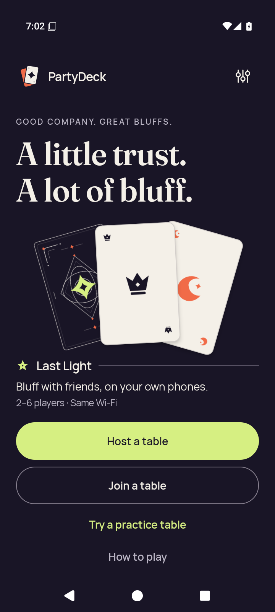</a> <code>2d-home-after-session-end.png</code> 2d-home-after-session-end — 2d.leave-end | 720 × 1600 px · 131,958 bytes SHA-256: <code>860745cf6bbeeeace453d3c9a160d93497eb259abe655420d18f08a6e95dba90</code> Source: <code>/root/projects/PartyDeck/artifacts/evidence-storage/34515669045/android-jvm-reports/build/ci/android/godot-session/debug/runtime/captures/2d-home-after-session-end.png</code> Capture: 2026-09-10T19:02:46.819+00:00 → 2026-09-10T19:02:49.160+00:00 [UI XML](runtime/captures/2d-home-after-session-end.xml) · [Capture JSON](runtime/captures/2d-home-after-session-end.json) · [Original result](runtime/godot-session-result.json) | **UNVIEWED original — no visual acceptance**. Original capture preserved without direct visual review. Source name, stage, timestamps and run outcome remain unchanged; no pixel observation or visual acceptance is asserted. |
| <a href="runtime/captures/2d-home-resumed.png">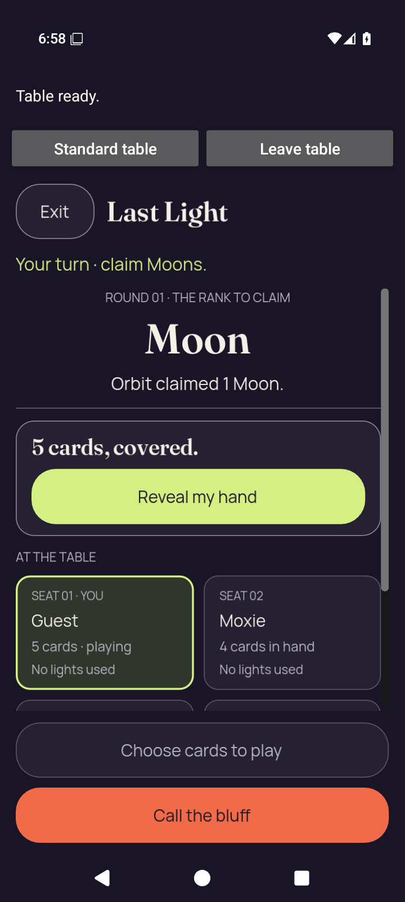</a> <code>2d-home-resumed.png</code> 2d-home-resumed — 2d.home-interruption | 720 × 1600 px · 147,046 bytes SHA-256: <code>7fba3e87c6f6f3d92749143d649e2f4c08da3dd70bee639d80f74c6e4cb4f789</code> Source: <code>/root/projects/PartyDeck/artifacts/evidence-storage/34515669045/android-jvm-reports/build/ci/android/godot-session/debug/runtime/captures/2d-home-resumed.png</code> Capture: 2026-09-10T18:58:40.584+00:00 → 2026-09-10T18:58:42.930+00:00 [UI XML](runtime/captures/2d-home-resumed.xml) · [Capture JSON](runtime/captures/2d-home-resumed.json) · [Original result](runtime/godot-session-result.json) | **UNVIEWED original — no visual acceptance**. Original capture preserved without direct visual review. Source name, stage, timestamps and run outcome remain unchanged; no pixel observation or visual acceptance is asserted. |
| <a href="runtime/captures/2d-home-system-ui.png">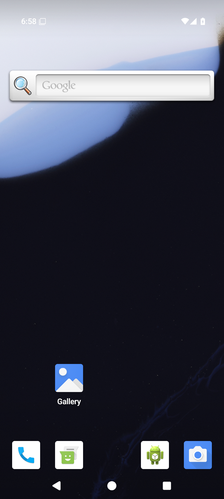</a> <code>2d-home-system-ui.png</code> 2d-home-system-ui — 2d.home-interruption | 720 × 1600 px · 746,536 bytes SHA-256: <code>0dec4d1453a861ac06eb14902a195a8cd04a9c685ca94aa5d92b02cf408de91d</code> Source: <code>/root/projects/PartyDeck/artifacts/evidence-storage/34515669045/android-jvm-reports/build/ci/android/godot-session/debug/runtime/captures/2d-home-system-ui.png</code> Capture: 2026-09-10T18:58:34.839+00:00 → 2026-09-10T18:58:37.540+00:00 [UI XML](runtime/captures/2d-home-system-ui.xml) · [Capture JSON](runtime/captures/2d-home-system-ui.json) · [Original result](runtime/godot-session-result.json) | **UNVIEWED original — no visual acceptance**. Original capture preserved without direct visual review. Source name, stage, timestamps and run outcome remain unchanged; no pixel observation or visual acceptance is asserted. |
|  <code>2d-leave-cancel-confirmation.png</code> 2d-leave-cancel-confirmation — 2d.leave-cancel | 720 × 1600 px · 40,467 bytes SHA-256: <code>d92ba57119f9ef14351a9a2b63c7f866c826fa09456a78624b0495361539e8b7</code> Source: <code>/root/projects/PartyDeck/artifacts/evidence-storage/34515669045/android-jvm-reports/build/ci/android/godot-session/debug/runtime/captures/2d-leave-cancel-confirmation.png</code> Capture: 2026-09-10T19:00:43.633+00:00 → 2026-09-10T19:00:45.963+00:00 [UI XML](runtime/captures/2d-leave-cancel-confirmation.xml) · [Capture JSON](runtime/captures/2d-leave-cancel-confirmation.json) · [Original result](runtime/godot-session-result.json) | **UNVIEWED original — no visual acceptance**. Original capture preserved without direct visual review. Source name, stage, timestamps and run outcome remain unchanged; no pixel observation or visual acceptance is asserted. |
|  <code>2d-leave-cancel-native-ready.png</code> 2d-leave-cancel-native-ready — 2d.leave-cancel | 720 × 1600 px · 146,025 bytes SHA-256: <code>db22e0c003074137ab57b6a8bc973f5a8c96c2cd8c6efef9b91e2e6ff7dbab59</code> Source: <code>/root/projects/PartyDeck/artifacts/evidence-storage/34515669045/android-jvm-reports/build/ci/android/godot-session/debug/runtime/captures/2d-leave-cancel-native-ready.png</code> Capture: 2026-09-10T19:00:33.975+00:00 → 2026-09-10T19:00:36.347+00:00 [UI XML](runtime/captures/2d-leave-cancel-native-ready.xml) · [Capture JSON](runtime/captures/2d-leave-cancel-native-ready.json) · [Original result](runtime/godot-session-result.json) | **UNVIEWED original — no visual acceptance**. Original capture preserved without direct visual review. Source name, stage, timestamps and run outcome remain unchanged; no pixel observation or visual acceptance is asserted. |
|  <code>2d-leave-cancel-return-concealed.png</code> 2d-leave-cancel-return-concealed — 2d.leave-cancel | 720 × 1600 px · 118,534 bytes SHA-256: <code>0ff4e2dde3d5ebdaf73ce5927975d824f3fb789991d5c4e53e9cbd5a4a3595fa</code> Source: <code>/root/projects/PartyDeck/artifacts/evidence-storage/34515669045/android-jvm-reports/build/ci/android/godot-session/debug/runtime/captures/2d-leave-cancel-return-concealed.png</code> Capture: 2026-09-10T19:00:52.366+00:00 → 2026-09-10T19:00:54.708+00:00 [UI XML](runtime/captures/2d-leave-cancel-return-concealed.xml) · [Capture JSON](runtime/captures/2d-leave-cancel-return-concealed.json) · [Original result](runtime/godot-session-result.json) | **UNVIEWED original — no visual acceptance**. Original capture preserved without direct visual review. Source name, stage, timestamps and run outcome remain unchanged; no pixel observation or visual acceptance is asserted. |
|  <code>2d-leave-cancel-return-first-card.png</code> 2d-leave-cancel-return-first-card — 2d.leave-cancel | 720 × 1600 px · 111,370 bytes SHA-256: <code>56ff38f9fa84d03dcfde0d8c73e81fa22775a83fd2edfcbbb2893e8452264422</code> Source: <code>/root/projects/PartyDeck/artifacts/evidence-storage/34515669045/android-jvm-reports/build/ci/android/godot-session/debug/runtime/captures/2d-leave-cancel-return-first-card.png</code> Capture: 2026-09-10T19:01:07.606+00:00 → 2026-09-10T19:01:09.987+00:00 [UI XML](runtime/captures/2d-leave-cancel-return-first-card.xml) · [Capture JSON](runtime/captures/2d-leave-cancel-return-first-card.json) · [Original result](runtime/godot-session-result.json) | **UNVIEWED original — no visual acceptance**. Original capture preserved without direct visual review. Source name, stage, timestamps and run outcome remain unchanged; no pixel observation or visual acceptance is asserted. |
|  <code>2d-leave-cancel-return-public.png</code> 2d-leave-cancel-return-public — 2d.leave-cancel | 720 × 1600 px · 118,610 bytes SHA-256: <code>ceb9f4564e7e850cfec7258ee13d62c42f0192843bf1dc58ac07684ecdd895f7</code> Source: <code>/root/projects/PartyDeck/artifacts/evidence-storage/34515669045/android-jvm-reports/build/ci/android/godot-session/debug/runtime/captures/2d-leave-cancel-return-public.png</code> Capture: 2026-09-10T19:01:01.123+00:00 → 2026-09-10T19:01:03.463+00:00 [UI XML](runtime/captures/2d-leave-cancel-return-public.xml) · [Capture JSON](runtime/captures/2d-leave-cancel-return-public.json) · [Original result](runtime/godot-session-result.json) | **UNVIEWED original — no visual acceptance**. Original capture preserved without direct visual review. Source name, stage, timestamps and run outcome remain unchanged; no pixel observation or visual acceptance is asserted. |
|  <code>2d-leave-cancel-return-selection-cleared.png</code> 2d-leave-cancel-return-selection-cleared — 2d.leave-cancel | 720 × 1600 px · 118,534 bytes SHA-256: <code>0ff4e2dde3d5ebdaf73ce5927975d824f3fb789991d5c4e53e9cbd5a4a3595fa</code> Source: <code>/root/projects/PartyDeck/artifacts/evidence-storage/34515669045/android-jvm-reports/build/ci/android/godot-session/debug/runtime/captures/2d-leave-cancel-return-selection-cleared.png</code> Capture: 2026-09-10T19:00:56.742+00:00 → 2026-09-10T19:00:59.096+00:00 [UI XML](runtime/captures/2d-leave-cancel-return-selection-cleared.xml) · [Capture JSON](runtime/captures/2d-leave-cancel-return-selection-cleared.json) · [Original result](runtime/godot-session-result.json) | **UNVIEWED original — no visual acceptance**. Original capture preserved without direct visual review. Source name, stage, timestamps and run outcome remain unchanged; no pixel observation or visual acceptance is asserted. |
|  <code>2d-leave-cancel-selected.png</code> 2d-leave-cancel-selected — 2d.leave-cancel | 720 × 1600 px · 110,658 bytes SHA-256: <code>cb85e982adbf35ece37fe83743eada2be7b24837eed8e90fe8df622f32b1f78a</code> Source: <code>/root/projects/PartyDeck/artifacts/evidence-storage/34515669045/android-jvm-reports/build/ci/android/godot-session/debug/runtime/captures/2d-leave-cancel-selected.png</code> Capture: 2026-09-10T19:00:14.421+00:00 → 2026-09-10T19:00:16.762+00:00 [UI XML](runtime/captures/2d-leave-cancel-selected.xml) · [Capture JSON](runtime/captures/2d-leave-cancel-selected.json) · [Original result](runtime/godot-session-result.json) | **UNVIEWED original — no visual acceptance**. Original capture preserved without direct visual review. Source name, stage, timestamps and run outcome remain unchanged; no pixel observation or visual acceptance is asserted. |
|  <code>2d-leave-cancel-selector.png</code> 2d-leave-cancel-selector — 2d.leave-cancel | 720 × 1600 px · 57,821 bytes SHA-256: <code>7fbfb8fce1e7b87e928c5b2d3421d0f4c3222e14ac22547104804777d87650c2</code> Source: <code>/root/projects/PartyDeck/artifacts/evidence-storage/34515669045/android-jvm-reports/build/ci/android/godot-session/debug/runtime/captures/2d-leave-cancel-selector.png</code> Capture: 2026-09-10T19:00:23.298+00:00 → 2026-09-10T19:00:25.677+00:00 [UI XML](runtime/captures/2d-leave-cancel-selector.xml) · [Capture JSON](runtime/captures/2d-leave-cancel-selector.json) · [Original result](runtime/godot-session-result.json) | **UNVIEWED original — no visual acceptance**. Original capture preserved without direct visual review. Source name, stage, timestamps and run outcome remain unchanged; no pixel observation or visual acceptance is asserted. |
|  <code>2d-leave-end-confirmation.png</code> 2d-leave-end-confirmation — 2d.leave-end | 720 × 1600 px · 40,944 bytes SHA-256: <code>e13aed3b4c51721aff7707ac5aaa1b57f86e22381b165eec50cd5353ebb21c76</code> Source: <code>/root/projects/PartyDeck/artifacts/evidence-storage/34515669045/android-jvm-reports/build/ci/android/godot-session/debug/runtime/captures/2d-leave-end-confirmation.png</code> Capture: 2026-09-10T19:02:38.069+00:00 → 2026-09-10T19:02:40.422+00:00 [UI XML](runtime/captures/2d-leave-end-confirmation.xml) · [Capture JSON](runtime/captures/2d-leave-end-confirmation.json) · [Original result](runtime/godot-session-result.json) | **UNVIEWED original — no visual acceptance**. Original capture preserved without direct visual review. Source name, stage, timestamps and run outcome remain unchanged; no pixel observation or visual acceptance is asserted. |
|  <code>2d-leave-end-selector.png</code> 2d-leave-end-selector — 2d.leave-end | 720 × 1600 px · 58,241 bytes SHA-256: <code>e368e488eda77526bb51183850c0badfc7e0c70454863aff097c5975affb59e2</code> Source: <code>/root/projects/PartyDeck/artifacts/evidence-storage/34515669045/android-jvm-reports/build/ci/android/godot-session/debug/runtime/captures/2d-leave-end-selector.png</code> Capture: 2026-09-10T19:02:24.952+00:00 → 2026-09-10T19:02:27.299+00:00 [UI XML](runtime/captures/2d-leave-end-selector.xml) · [Capture JSON](runtime/captures/2d-leave-end-selector.json) · [Original result](runtime/godot-session-result.json) | **UNVIEWED original — no visual acceptance**. Original capture preserved without direct visual review. Source name, stage, timestamps and run outcome remain unchanged; no pixel observation or visual acceptance is asserted. |
|  <code>2d-recents-resumed.png</code> 2d-recents-resumed — 2d.recents-interruption | 720 × 1600 px · 147,046 bytes SHA-256: <code>7fba3e87c6f6f3d92749143d649e2f4c08da3dd70bee639d80f74c6e4cb4f789</code> Source: <code>/root/projects/PartyDeck/artifacts/evidence-storage/34515669045/android-jvm-reports/build/ci/android/godot-session/debug/runtime/captures/2d-recents-resumed.png</code> Capture: 2026-09-10T18:58:50.437+00:00 → 2026-09-10T18:58:52.784+00:00 [UI XML](runtime/captures/2d-recents-resumed.xml) · [Capture JSON](runtime/captures/2d-recents-resumed.json) · [Original result](runtime/godot-session-result.json) | **UNVIEWED original — no visual acceptance**. Original capture preserved without direct visual review. Source name, stage, timestamps and run outcome remain unchanged; no pixel observation or visual acceptance is asserted. |
| <a href="runtime/captures/2d-recents-system-ui.png">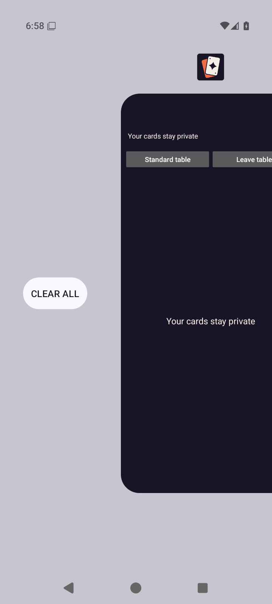</a> <code>2d-recents-system-ui.png</code> 2d-recents-system-ui — 2d.recents-interruption | 720 × 1600 px · 40,815 bytes SHA-256: <code>64abf4e9e683f56e55c5f38228720dd78ccb8eef7f4b9233db6ab1f039d407eb</code> Source: <code>/root/projects/PartyDeck/artifacts/evidence-storage/34515669045/android-jvm-reports/build/ci/android/godot-session/debug/runtime/captures/2d-recents-system-ui.png</code> Capture: 2026-09-10T18:58:45.490+00:00 → 2026-09-10T18:58:47.835+00:00 [UI XML](runtime/captures/2d-recents-system-ui.xml) · [Capture JSON](runtime/captures/2d-recents-system-ui.json) · [Original result](runtime/godot-session-result.json) | **UNVIEWED original — no visual acceptance**. Original capture preserved without direct visual review. Source name, stage, timestamps and run outcome remain unchanged; no pixel observation or visual acceptance is asserted. |
|  <code>2d-standard-concealed.png</code> 2d-standard-concealed — 2d.standard-return | 720 × 1600 px · 119,311 bytes SHA-256: <code>7edeb4232c8abe05509a6610b89015c2a27d1910b791eac00ca1f92962c82152</code> Source: <code>/root/projects/PartyDeck/artifacts/evidence-storage/34515669045/android-jvm-reports/build/ci/android/godot-session/debug/runtime/captures/2d-standard-concealed.png</code> Capture: 2026-09-10T18:58:59.993+00:00 → 2026-09-10T18:59:02.366+00:00 [UI XML](runtime/captures/2d-standard-concealed.xml) · [Capture JSON](runtime/captures/2d-standard-concealed.json) · [Original result](runtime/godot-session-result.json) | **UNVIEWED original — no visual acceptance**. Original capture preserved without direct visual review. Source name, stage, timestamps and run outcome remain unchanged; no pixel observation or visual acceptance is asserted. |
|  <code>2d-standard-first-card.png</code> 2d-standard-first-card — 2d.standard-return | 720 × 1600 px · 112,046 bytes SHA-256: <code>f468f75201b3a6bb6edb32a43d8ea1003c003cfc51247135cd8dd3eac7263da3</code> Source: <code>/root/projects/PartyDeck/artifacts/evidence-storage/34515669045/android-jvm-reports/build/ci/android/godot-session/debug/runtime/captures/2d-standard-first-card.png</code> Capture: 2026-09-10T18:59:15.320+00:00 → 2026-09-10T18:59:17.671+00:00 [UI XML](runtime/captures/2d-standard-first-card.xml) · [Capture JSON](runtime/captures/2d-standard-first-card.json) · [Original result](runtime/godot-session-result.json) | **UNVIEWED original — no visual acceptance**. Original capture preserved without direct visual review. Source name, stage, timestamps and run outcome remain unchanged; no pixel observation or visual acceptance is asserted. |
| <a href="runtime/captures/2d-standard-play-after-play.png">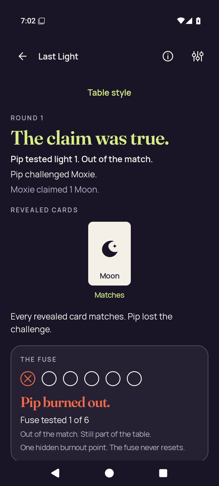</a> <code>2d-standard-play-after-play.png</code> 2d-standard-play-after-play — 2d.standard-action | 720 × 1600 px · 98,888 bytes SHA-256: <code>e531454f7027cf62b823845f56536647ee57cf6bb04b88c304d863de96b0ce15</code> Source: <code>/root/projects/PartyDeck/artifacts/evidence-storage/34515669045/android-jvm-reports/build/ci/android/godot-session/debug/runtime/captures/2d-standard-play-after-play.png</code> Capture: 2026-09-10T19:02:15.859+00:00 → 2026-09-10T19:02:18.208+00:00 [UI XML](runtime/captures/2d-standard-play-after-play.xml) · [Capture JSON](runtime/captures/2d-standard-play-after-play.json) · [Original result](runtime/godot-session-result.json) | **UNVIEWED original — no visual acceptance**. Original capture preserved without direct visual review. Source name, stage, timestamps and run outcome remain unchanged; no pixel observation or visual acceptance is asserted. |
|  <code>2d-standard-play-selected.png</code> 2d-standard-play-selected — 2d.standard-action | 720 × 1600 px · 111,048 bytes SHA-256: <code>8794f387403d888d2f29a8e5025aea6eb179d9529b7205e2a5b04d69ea5ae924</code> Source: <code>/root/projects/PartyDeck/artifacts/evidence-storage/34515669045/android-jvm-reports/build/ci/android/godot-session/debug/runtime/captures/2d-standard-play-selected.png</code> Capture: 2026-09-10T19:02:09.298+00:00 → 2026-09-10T19:02:11.655+00:00 [UI XML](runtime/captures/2d-standard-play-selected.xml) · [Capture JSON](runtime/captures/2d-standard-play-selected.json) · [Original result](runtime/godot-session-result.json) | **UNVIEWED original — no visual acceptance**. Original capture preserved without direct visual review. Source name, stage, timestamps and run outcome remain unchanged; no pixel observation or visual acceptance is asserted. |
|  <code>2d-standard-public.png</code> 2d-standard-public — 2d.standard-return | 720 × 1600 px · 119,322 bytes SHA-256: <code>493fdd6468ab7a71c951f1d682a165bfdc2b807e6633b1b473399bac865bf76a</code> Source: <code>/root/projects/PartyDeck/artifacts/evidence-storage/34515669045/android-jvm-reports/build/ci/android/godot-session/debug/runtime/captures/2d-standard-public.png</code> Capture: 2026-09-10T18:59:08.823+00:00 → 2026-09-10T18:59:11.171+00:00 [UI XML](runtime/captures/2d-standard-public.xml) · [Capture JSON](runtime/captures/2d-standard-public.json) · [Original result](runtime/godot-session-result.json) | **UNVIEWED original — no visual acceptance**. Original capture preserved without direct visual review. Source name, stage, timestamps and run outcome remain unchanged; no pixel observation or visual acceptance is asserted. |
|  <code>2d-standard-selection-cleared.png</code> 2d-standard-selection-cleared — 2d.standard-return | 720 × 1600 px · 119,311 bytes SHA-256: <code>7edeb4232c8abe05509a6610b89015c2a27d1910b791eac00ca1f92962c82152</code> Source: <code>/root/projects/PartyDeck/artifacts/evidence-storage/34515669045/android-jvm-reports/build/ci/android/godot-session/debug/runtime/captures/2d-standard-selection-cleared.png</code> Capture: 2026-09-10T18:59:04.402+00:00 → 2026-09-10T18:59:06.755+00:00 [UI XML](runtime/captures/2d-standard-selection-cleared.xml) · [Capture JSON](runtime/captures/2d-standard-selection-cleared.json) · [Original result](runtime/godot-session-result.json) | **UNVIEWED original — no visual acceptance**. Original capture preserved without direct visual review. Source name, stage, timestamps and run outcome remain unchanged; no pixel observation or visual acceptance is asserted. |
| <a href="runtime/captures/3d-action-entry-native-ready.png">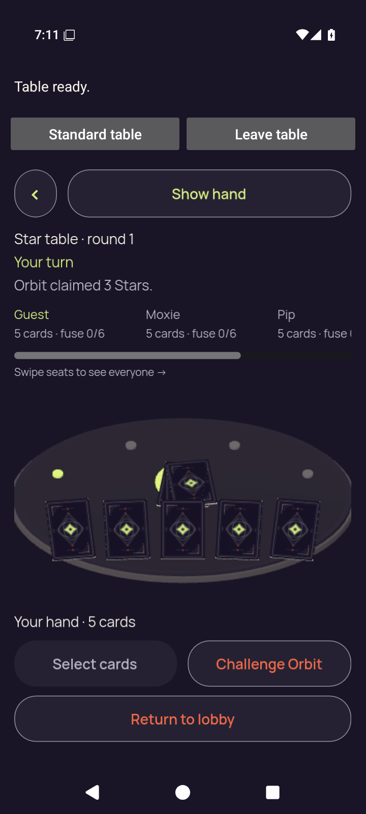</a> <code>3d-action-entry-native-ready.png</code> 3d-action-entry-native-ready — 3d.standard-action | 720 × 1600 px · 190,016 bytes SHA-256: <code>eb760938f66be0a39b847822e7b6488b1d3265e5db44cfc0e6c61f76bf326ac4</code> Source: <code>/root/projects/PartyDeck/artifacts/evidence-storage/34515669045/android-jvm-reports/build/ci/android/godot-session/debug/runtime/captures/3d-action-entry-native-ready.png</code> Capture: 2026-09-10T19:11:09.898+00:00 → 2026-09-10T19:11:12.267+00:00 [UI XML](runtime/captures/3d-action-entry-native-ready.xml) · [Capture JSON](runtime/captures/3d-action-entry-native-ready.json) · [Original result](runtime/godot-session-result.json) | **UNVIEWED original — no visual acceptance**. Original capture preserved without direct visual review. Source name, stage, timestamps and run outcome remain unchanged; no pixel observation or visual acceptance is asserted. |
|  <code>3d-action-entry-selected.png</code> 3d-action-entry-selected — 3d.standard-action | 720 × 1600 px · 122,670 bytes SHA-256: <code>963b0678563b0d1977fb171b3a5ae07e316f943050db1d6f6015f9e479b0aa39</code> Source: <code>/root/projects/PartyDeck/artifacts/evidence-storage/34515669045/android-jvm-reports/build/ci/android/godot-session/debug/runtime/captures/3d-action-entry-selected.png</code> Capture: 2026-09-10T19:10:49.533+00:00 → 2026-09-10T19:10:51.876+00:00 [UI XML](runtime/captures/3d-action-entry-selected.xml) · [Capture JSON](runtime/captures/3d-action-entry-selected.json) · [Original result](runtime/godot-session-result.json) | **UNVIEWED original — no visual acceptance**. Original capture preserved without direct visual review. Source name, stage, timestamps and run outcome remain unchanged; no pixel observation or visual acceptance is asserted. |
| <a href="runtime/captures/3d-action-entry-selector.png">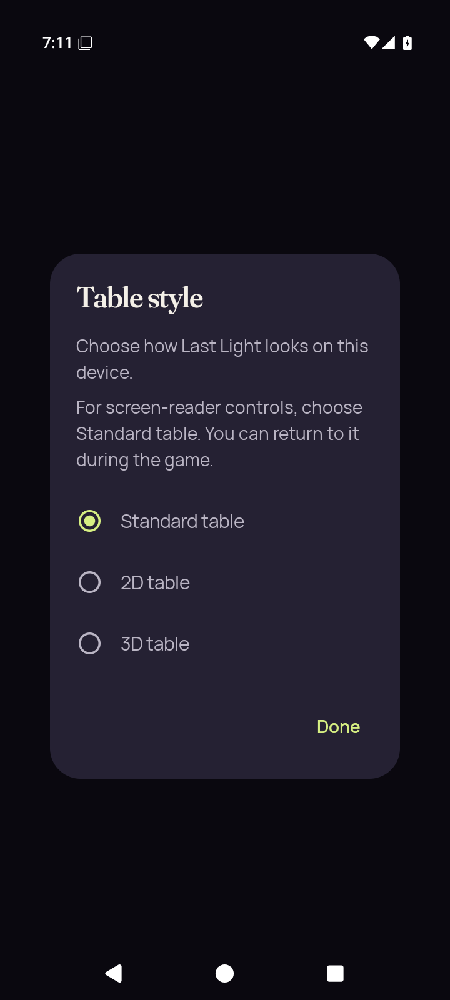</a> <code>3d-action-entry-selector.png</code> 3d-action-entry-selector — 3d.standard-action | 720 × 1600 px · 57,480 bytes SHA-256: <code>c1f2d512a11c09a817da35ff26464d176ba46497e93d98db386b9257fac90e0a</code> Source: <code>/root/projects/PartyDeck/artifacts/evidence-storage/34515669045/android-jvm-reports/build/ci/android/godot-session/debug/runtime/captures/3d-action-entry-selector.png</code> Capture: 2026-09-10T19:10:58.309+00:00 → 2026-09-10T19:11:00.638+00:00 [UI XML](runtime/captures/3d-action-entry-selector.xml) · [Capture JSON](runtime/captures/3d-action-entry-selector.json) · [Original result](runtime/godot-session-result.json) | **UNVIEWED original — no visual acceptance**. Original capture preserved without direct visual review. Source name, stage, timestamps and run outcome remain unchanged; no pixel observation or visual acceptance is asserted. |
|  <code>3d-action-return-concealed.png</code> 3d-action-return-concealed — 3d.standard-action | 720 × 1600 px · 127,685 bytes SHA-256: <code>999ab330187a349fd66637cdb11b15c7fc5457bc97ed18d4a2b7ff683c8d70f6</code> Source: <code>/root/projects/PartyDeck/artifacts/evidence-storage/34515669045/android-jvm-reports/build/ci/android/godot-session/debug/runtime/captures/3d-action-return-concealed.png</code> Capture: 2026-09-10T19:11:19.309+00:00 → 2026-09-10T19:11:21.659+00:00 [UI XML](runtime/captures/3d-action-return-concealed.xml) · [Capture JSON](runtime/captures/3d-action-return-concealed.json) · [Original result](runtime/godot-session-result.json) | **UNVIEWED original — no visual acceptance**. Original capture preserved without direct visual review. Source name, stage, timestamps and run outcome remain unchanged; no pixel observation or visual acceptance is asserted. |
|  <code>3d-action-return-first-card.png</code> 3d-action-return-first-card — 3d.standard-action | 720 × 1600 px · 122,580 bytes SHA-256: <code>954ccff8fece5b582be45e1f0c1b5a1d4b89eaec5d249a8bdc12e62b872b6a4a</code> Source: <code>/root/projects/PartyDeck/artifacts/evidence-storage/34515669045/android-jvm-reports/build/ci/android/godot-session/debug/runtime/captures/3d-action-return-first-card.png</code> Capture: 2026-09-10T19:11:34.555+00:00 → 2026-09-10T19:11:36.913+00:00 [UI XML](runtime/captures/3d-action-return-first-card.xml) · [Capture JSON](runtime/captures/3d-action-return-first-card.json) · [Original result](runtime/godot-session-result.json) | **UNVIEWED original — no visual acceptance**. Original capture preserved without direct visual review. Source name, stage, timestamps and run outcome remain unchanged; no pixel observation or visual acceptance is asserted. |
|  <code>3d-action-return-public.png</code> 3d-action-return-public — 3d.standard-action | 720 × 1600 px · 127,685 bytes SHA-256: <code>999ab330187a349fd66637cdb11b15c7fc5457bc97ed18d4a2b7ff683c8d70f6</code> Source: <code>/root/projects/PartyDeck/artifacts/evidence-storage/34515669045/android-jvm-reports/build/ci/android/godot-session/debug/runtime/captures/3d-action-return-public.png</code> Capture: 2026-09-10T19:11:28.068+00:00 → 2026-09-10T19:11:30.421+00:00 [UI XML](runtime/captures/3d-action-return-public.xml) · [Capture JSON](runtime/captures/3d-action-return-public.json) · [Original result](runtime/godot-session-result.json) | **UNVIEWED original — no visual acceptance**. Original capture preserved without direct visual review. Source name, stage, timestamps and run outcome remain unchanged; no pixel observation or visual acceptance is asserted. |
|  <code>3d-action-return-selection-cleared.png</code> 3d-action-return-selection-cleared — 3d.standard-action | 720 × 1600 px · 127,685 bytes SHA-256: <code>999ab330187a349fd66637cdb11b15c7fc5457bc97ed18d4a2b7ff683c8d70f6</code> Source: <code>/root/projects/PartyDeck/artifacts/evidence-storage/34515669045/android-jvm-reports/build/ci/android/godot-session/debug/runtime/captures/3d-action-return-selection-cleared.png</code> Capture: 2026-09-10T19:11:23.695+00:00 → 2026-09-10T19:11:26.035+00:00 [UI XML](runtime/captures/3d-action-return-selection-cleared.xml) · [Capture JSON](runtime/captures/3d-action-return-selection-cleared.json) · [Original result](runtime/godot-session-result.json) | **UNVIEWED original — no visual acceptance**. Original capture preserved without direct visual review. Source name, stage, timestamps and run outcome remain unchanged; no pixel observation or visual acceptance is asserted. |
|  <code>3d-baseline-first-card.png</code> 3d-baseline-first-card — 3d.practice-baseline | 720 × 1600 px · 123,564 bytes SHA-256: <code>4cad6f014cb60ee49a27dcc50c7c90cbd4d02027e261755076aa69f9ec1efd11</code> Source: <code>/root/projects/PartyDeck/artifacts/evidence-storage/34515669045/android-jvm-reports/build/ci/android/godot-session/debug/runtime/captures/3d-baseline-first-card.png</code> Capture: 2026-09-10T19:05:52.950+00:00 → 2026-09-10T19:05:55.311+00:00 [UI XML](runtime/captures/3d-baseline-first-card.xml) · [Capture JSON](runtime/captures/3d-baseline-first-card.json) · [Original result](runtime/godot-session-result.json) | **UNVIEWED original — no visual acceptance**. Original capture preserved without direct visual review. Source name, stage, timestamps and run outcome remain unchanged; no pixel observation or visual acceptance is asserted. |
|  <code>3d-baseline-public.png</code> 3d-baseline-public — 3d.practice-baseline | 720 × 1600 px · 128,665 bytes SHA-256: <code>ebbb804d26de850d0c087a1be7b145a6558081261ffdbaa00a38985afc8de704</code> Source: <code>/root/projects/PartyDeck/artifacts/evidence-storage/34515669045/android-jvm-reports/build/ci/android/godot-session/debug/runtime/captures/3d-baseline-public.png</code> Capture: 2026-09-10T19:05:46.475+00:00 → 2026-09-10T19:05:48.824+00:00 [UI XML](runtime/captures/3d-baseline-public.xml) · [Capture JSON](runtime/captures/3d-baseline-public.json) · [Original result](runtime/godot-session-result.json) | **UNVIEWED original — no visual acceptance**. Original capture preserved without direct visual review. Source name, stage, timestamps and run outcome remain unchanged; no pixel observation or visual acceptance is asserted. |
|  <code>3d-baseline-selected.png</code> 3d-baseline-selected — 3d.standard-hand | 720 × 1600 px · 122,708 bytes SHA-256: <code>cc9830552adda229ae9e4a0c8ac8ce16bb6639d9db4c9eb4f2e045b2aed8b8b1</code> Source: <code>/root/projects/PartyDeck/artifacts/evidence-storage/34515669045/android-jvm-reports/build/ci/android/godot-session/debug/runtime/captures/3d-baseline-selected.png</code> Capture: 2026-09-10T19:07:38.596+00:00 → 2026-09-10T19:07:40.949+00:00 [UI XML](runtime/captures/3d-baseline-selected.xml) · [Capture JSON](runtime/captures/3d-baseline-selected.json) · [Original result](runtime/godot-session-result.json) | **UNVIEWED original — no visual acceptance**. Original capture preserved without direct visual review. Source name, stage, timestamps and run outcome remain unchanged; no pixel observation or visual acceptance is asserted. |
| <a href="runtime/captures/3d-death-native-ready.png">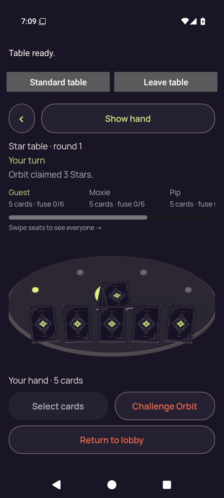</a> <code>3d-death-native-ready.png</code> 3d-death-native-ready — 3d.renderer-death | 720 × 1600 px · 190,840 bytes SHA-256: <code>ee720285280a9f41a9117f3dbbdf51ec970b0c7f05e4c7db388e53e1b900df3c</code> Source: <code>/root/projects/PartyDeck/artifacts/evidence-storage/34515669045/android-jvm-reports/build/ci/android/godot-session/debug/runtime/captures/3d-death-native-ready.png</code> Capture: 2026-09-10T19:09:15.973+00:00 → 2026-09-10T19:09:18.338+00:00 [UI XML](runtime/captures/3d-death-native-ready.xml) · [Capture JSON](runtime/captures/3d-death-native-ready.json) · [Original result](runtime/godot-session-result.json) | **UNVIEWED original — no visual acceptance**. Original capture preserved without direct visual review. Source name, stage, timestamps and run outcome remain unchanged; no pixel observation or visual acceptance is asserted. |
|  <code>3d-death-return-concealed.png</code> 3d-death-return-concealed — 3d.renderer-death | 720 × 1600 px · 128,589 bytes SHA-256: <code>d81102df524458726c10fe58e5ca17e2af0b377097054544332d04b8f75cfbdd</code> Source: <code>/root/projects/PartyDeck/artifacts/evidence-storage/34515669045/android-jvm-reports/build/ci/android/godot-session/debug/runtime/captures/3d-death-return-concealed.png</code> Capture: 2026-09-10T19:09:23.004+00:00 → 2026-09-10T19:09:25.363+00:00 [UI XML](runtime/captures/3d-death-return-concealed.xml) · [Capture JSON](runtime/captures/3d-death-return-concealed.json) · [Original result](runtime/godot-session-result.json) | **UNVIEWED original — no visual acceptance**. Original capture preserved without direct visual review. Source name, stage, timestamps and run outcome remain unchanged; no pixel observation or visual acceptance is asserted. |
| <a href="runtime/captures/3d-death-return-first-card.png">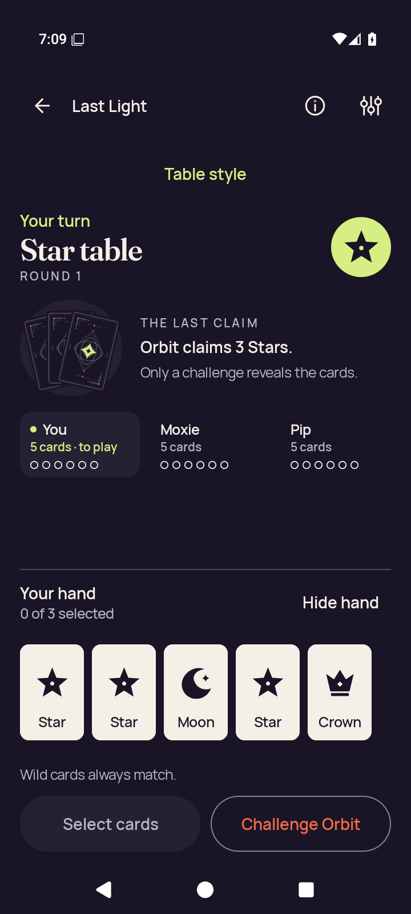</a> <code>3d-death-return-first-card.png</code> 3d-death-return-first-card — 3d.renderer-death | 720 × 1600 px · 123,634 bytes SHA-256: <code>3aebe8d81462e574940f271c7a09a3ebd27d394ac779eec95cdd12922758dba2</code> Source: <code>/root/projects/PartyDeck/artifacts/evidence-storage/34515669045/android-jvm-reports/build/ci/android/godot-session/debug/runtime/captures/3d-death-return-first-card.png</code> Capture: 2026-09-10T19:09:38.225+00:00 → 2026-09-10T19:09:40.579+00:00 [UI XML](runtime/captures/3d-death-return-first-card.xml) · [Capture JSON](runtime/captures/3d-death-return-first-card.json) · [Original result](runtime/godot-session-result.json) | **UNVIEWED original — no visual acceptance**. Original capture preserved without direct visual review. Source name, stage, timestamps and run outcome remain unchanged; no pixel observation or visual acceptance is asserted. |
|  <code>3d-death-return-public.png</code> 3d-death-return-public — 3d.renderer-death | 720 × 1600 px · 128,731 bytes SHA-256: <code>0eb82538710ccd92560dfd07d1032fc5785ac96817a6db9ea55eaa1a314bd0fd</code> Source: <code>/root/projects/PartyDeck/artifacts/evidence-storage/34515669045/android-jvm-reports/build/ci/android/godot-session/debug/runtime/captures/3d-death-return-public.png</code> Capture: 2026-09-10T19:09:31.761+00:00 → 2026-09-10T19:09:34.096+00:00 [UI XML](runtime/captures/3d-death-return-public.xml) · [Capture JSON](runtime/captures/3d-death-return-public.json) · [Original result](runtime/godot-session-result.json) | **UNVIEWED original — no visual acceptance**. Original capture preserved without direct visual review. Source name, stage, timestamps and run outcome remain unchanged; no pixel observation or visual acceptance is asserted. |
|  <code>3d-death-return-selection-cleared.png</code> 3d-death-return-selection-cleared — 3d.renderer-death | 720 × 1600 px · 128,589 bytes SHA-256: <code>d81102df524458726c10fe58e5ca17e2af0b377097054544332d04b8f75cfbdd</code> Source: <code>/root/projects/PartyDeck/artifacts/evidence-storage/34515669045/android-jvm-reports/build/ci/android/godot-session/debug/runtime/captures/3d-death-return-selection-cleared.png</code> Capture: 2026-09-10T19:09:27.390+00:00 → 2026-09-10T19:09:29.740+00:00 [UI XML](runtime/captures/3d-death-return-selection-cleared.xml) · [Capture JSON](runtime/captures/3d-death-return-selection-cleared.json) · [Original result](runtime/godot-session-result.json) | **UNVIEWED original — no visual acceptance**. Original capture preserved without direct visual review. Source name, stage, timestamps and run outcome remain unchanged; no pixel observation or visual acceptance is asserted. |
| <a href="runtime/captures/3d-death-selected.png">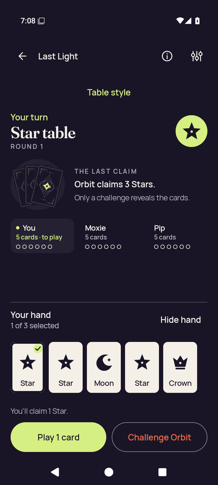</a> <code>3d-death-selected.png</code> 3d-death-selected — 3d.renderer-death | 720 × 1600 px · 123,105 bytes SHA-256: <code>926be880a8cfe837d88bd2db5b7bc9b0a6bdafd0d480759fb0ee5f33e54707ce</code> Source: <code>/root/projects/PartyDeck/artifacts/evidence-storage/34515669045/android-jvm-reports/build/ci/android/godot-session/debug/runtime/captures/3d-death-selected.png</code> Capture: 2026-09-10T19:08:55.096+00:00 → 2026-09-10T19:08:57.455+00:00 [UI XML](runtime/captures/3d-death-selected.xml) · [Capture JSON](runtime/captures/3d-death-selected.json) · [Original result](runtime/godot-session-result.json) | **UNVIEWED original — no visual acceptance**. Original capture preserved without direct visual review. Source name, stage, timestamps and run outcome remain unchanged; no pixel observation or visual acceptance is asserted. |
|  <code>3d-death-selector.png</code> 3d-death-selector — 3d.renderer-death | 720 × 1600 px · 58,314 bytes SHA-256: <code>6344c3ebc007a378da93cd846029ee2962414ada51be6a6682ec5c568fc1b4f0</code> Source: <code>/root/projects/PartyDeck/artifacts/evidence-storage/34515669045/android-jvm-reports/build/ci/android/godot-session/debug/runtime/captures/3d-death-selector.png</code> Capture: 2026-09-10T19:09:04.154+00:00 → 2026-09-10T19:09:06.491+00:00 [UI XML](runtime/captures/3d-death-selector.xml) · [Capture JSON](runtime/captures/3d-death-selector.json) · [Original result](runtime/godot-session-result.json) | **UNVIEWED original — no visual acceptance**. Original capture preserved without direct visual review. Source name, stage, timestamps and run outcome remain unchanged; no pixel observation or visual acceptance is asserted. |
| <a href="runtime/captures/3d-engine-baseline-first-card.png">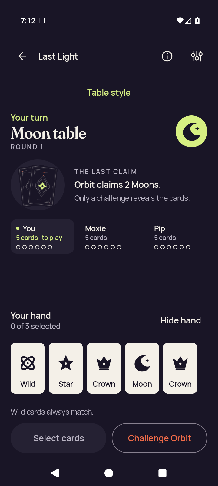</a> <code>3d-engine-baseline-first-card.png</code> 3d-engine-baseline-first-card — 3d.engine-practice-baseline | 720 × 1600 px · 126,283 bytes SHA-256: <code>545978d114b2ae56bdb455001cc3f7c9a378a57adeeee0325f710ebebc80617d</code> Source: <code>/root/projects/PartyDeck/artifacts/evidence-storage/34515669045/android-jvm-reports/build/ci/android/godot-session/debug/runtime/captures/3d-engine-baseline-first-card.png</code> Capture: 2026-09-10T19:12:41.554+00:00 → 2026-09-10T19:12:43.908+00:00 [UI XML](runtime/captures/3d-engine-baseline-first-card.xml) · [Capture JSON](runtime/captures/3d-engine-baseline-first-card.json) · [Original result](runtime/godot-session-result.json) | **UNVIEWED original — no visual acceptance**. Original capture preserved without direct visual review. Source name, stage, timestamps and run outcome remain unchanged; no pixel observation or visual acceptance is asserted. |
|  <code>3d-engine-baseline-public.png</code> 3d-engine-baseline-public — 3d.engine-practice-baseline | 720 × 1600 px · 127,713 bytes SHA-256: <code>0f8b90e81dc0c0bfa149bd7687b0d45c083d6c31c565279cfb83cae841c1640f</code> Source: <code>/root/projects/PartyDeck/artifacts/evidence-storage/34515669045/android-jvm-reports/build/ci/android/godot-session/debug/runtime/captures/3d-engine-baseline-public.png</code> Capture: 2026-09-10T19:12:35.069+00:00 → 2026-09-10T19:12:37.434+00:00 [UI XML](runtime/captures/3d-engine-baseline-public.xml) · [Capture JSON](runtime/captures/3d-engine-baseline-public.json) · [Original result](runtime/godot-session-result.json) | **UNVIEWED original — no visual acceptance**. Original capture preserved without direct visual review. Source name, stage, timestamps and run outcome remain unchanged; no pixel observation or visual acceptance is asserted. |
| <a href="runtime/captures/3d-engine-entry-native-ready.png">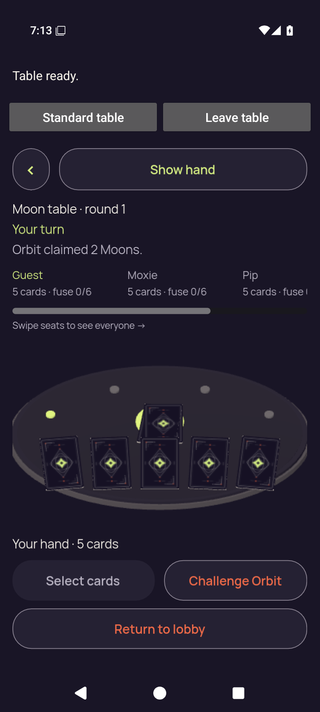</a> <code>3d-engine-entry-native-ready.png</code> 3d-engine-entry-native-ready — 3d.engine-reveal-selection | 720 × 1600 px · 187,536 bytes SHA-256: <code>cb8ac38a5f1cebe958c273ad27e84610bcb55eb5fa8ec9431cfaa9a93926d81d</code> Source: <code>/root/projects/PartyDeck/artifacts/evidence-storage/34515669045/android-jvm-reports/build/ci/android/godot-session/debug/runtime/captures/3d-engine-entry-native-ready.png</code> Capture: 2026-09-10T19:13:10.368+00:00 → 2026-09-10T19:13:12.732+00:00 [UI XML](runtime/captures/3d-engine-entry-native-ready.xml) · [Capture JSON](runtime/captures/3d-engine-entry-native-ready.json) · [Original result](runtime/godot-session-result.json) | **UNVIEWED original — no visual acceptance**. Original capture preserved without direct visual review. Source name, stage, timestamps and run outcome remain unchanged; no pixel observation or visual acceptance is asserted. |
|  <code>3d-engine-entry-selector.png</code> 3d-engine-entry-selector — 3d.engine-reveal-selection | 720 × 1600 px · 57,985 bytes SHA-256: <code>346d595124fc774976c8322ec84852bdf1c52124340fb4aba1b707c9a3432bca</code> Source: <code>/root/projects/PartyDeck/artifacts/evidence-storage/34515669045/android-jvm-reports/build/ci/android/godot-session/debug/runtime/captures/3d-engine-entry-selector.png</code> Capture: 2026-09-10T19:12:58.487+00:00 → 2026-09-10T19:13:00.837+00:00 [UI XML](runtime/captures/3d-engine-entry-selector.xml) · [Capture JSON](runtime/captures/3d-engine-entry-selector.json) · [Original result](runtime/godot-session-result.json) | **UNVIEWED original — no visual acceptance**. Original capture preserved without direct visual review. Source name, stage, timestamps and run outcome remain unchanged; no pixel observation or visual acceptance is asserted. |
|  <code>3d-engine-home.png</code> 3d-engine-home — 3d.engine-leave-end | 720 × 1600 px · 131,828 bytes SHA-256: <code>58bb4352e2867a340cde9e280ff9581b46caf2802e9153e4c850fb7fc6809456</code> Source: <code>/root/projects/PartyDeck/artifacts/evidence-storage/34515669045/android-jvm-reports/build/ci/android/godot-session/debug/runtime/captures/3d-engine-home.png</code> Capture: 2026-09-10T19:15:02.546+00:00 → 2026-09-10T19:15:04.879+00:00 [UI XML](runtime/captures/3d-engine-home.xml) · [Capture JSON](runtime/captures/3d-engine-home.json) · [Original result](runtime/godot-session-result.json) | **UNVIEWED original — no visual acceptance**. Original capture preserved without direct visual review. Source name, stage, timestamps and run outcome remain unchanged; no pixel observation or visual acceptance is asserted. |
|  <code>3d-engine-leave-confirmation.png</code> 3d-engine-leave-confirmation — 3d.engine-leave-end | 720 × 1600 px · 40,547 bytes SHA-256: <code>0c38fa00428b4a9e21183e47f3182f46a5cfb3271cf17ec6feb23a36f6412be6</code> Source: <code>/root/projects/PartyDeck/artifacts/evidence-storage/34515669045/android-jvm-reports/build/ci/android/godot-session/debug/runtime/captures/3d-engine-leave-confirmation.png</code> Capture: 2026-09-10T19:14:53.840+00:00 → 2026-09-10T19:14:56.178+00:00 [UI XML](runtime/captures/3d-engine-leave-confirmation.xml) · [Capture JSON](runtime/captures/3d-engine-leave-confirmation.json) · [Original result](runtime/godot-session-result.json) | **UNVIEWED original — no visual acceptance**. Original capture preserved without direct visual review. Source name, stage, timestamps and run outcome remain unchanged; no pixel observation or visual acceptance is asserted. |
| <a href="runtime/captures/3d-engine-leave-selector.png">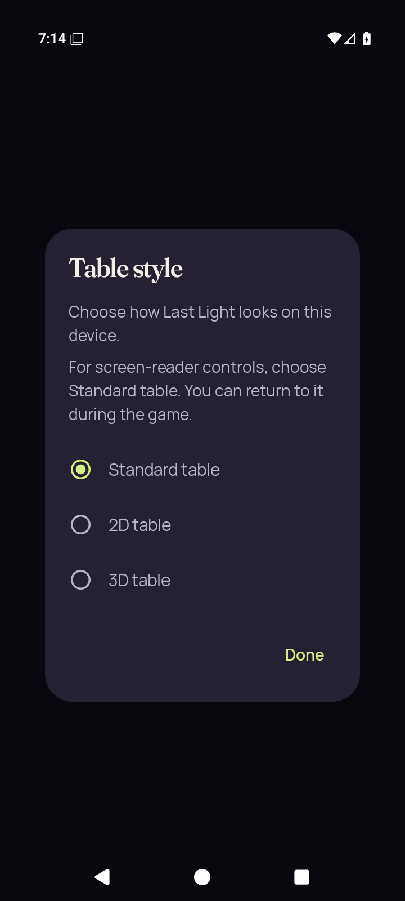</a> <code>3d-engine-leave-selector.png</code> 3d-engine-leave-selector — 3d.engine-leave-end | 720 × 1600 px · 57,871 bytes SHA-256: <code>1fe708f87a5319965ebc05c9d7a351b473884bfa95b147ebe96665a150ae2eda</code> Source: <code>/root/projects/PartyDeck/artifacts/evidence-storage/34515669045/android-jvm-reports/build/ci/android/godot-session/debug/runtime/captures/3d-engine-leave-selector.png</code> Capture: 2026-09-10T19:14:38.693+00:00 → 2026-09-10T19:14:41.034+00:00 [UI XML](runtime/captures/3d-engine-leave-selector.xml) · [Capture JSON](runtime/captures/3d-engine-leave-selector.json) · [Original result](runtime/godot-session-result.json) | **UNVIEWED original — no visual acceptance**. Original capture preserved without direct visual review. Source name, stage, timestamps and run outcome remain unchanged; no pixel observation or visual acceptance is asserted. |
| <a href="runtime/captures/3d-engine-selected.png">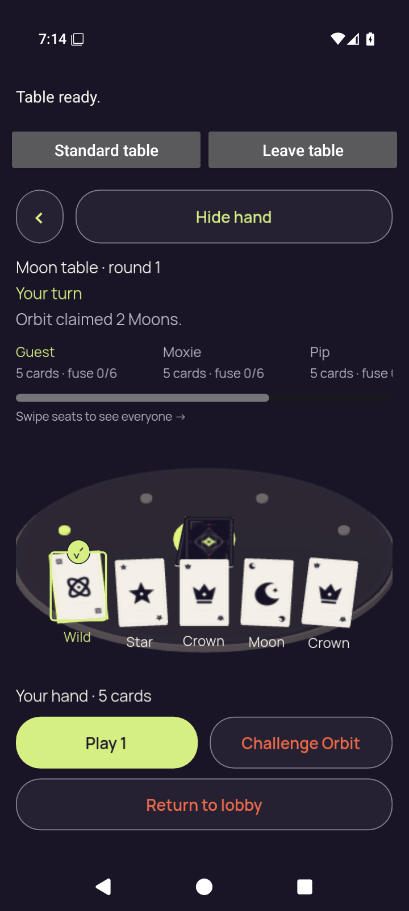</a> <code>3d-engine-selected.png</code> 3d-engine-selected — 3d.engine-reveal-selection | 720 × 1600 px · 180,685 bytes SHA-256: <code>a9f1b23666199bcb1668fac8f0917f9c93bd87f3afacd8d10af270c5b66751ac</code> Source: <code>/root/projects/PartyDeck/artifacts/evidence-storage/34515669045/android-jvm-reports/build/ci/android/godot-session/debug/runtime/captures/3d-engine-selected.png</code> Capture: 2026-09-10T19:14:00.861+00:00 → 2026-09-10T19:14:03.222+00:00 [UI XML](runtime/captures/3d-engine-selected.xml) · [Capture JSON](runtime/captures/3d-engine-selected.json) · [Original result](runtime/godot-session-result.json) | **UNVIEWED original — no visual acceptance**. Original capture preserved without direct visual review. Source name, stage, timestamps and run outcome remain unchanged; no pixel observation or visual acceptance is asserted. |
|  <code>3d-engine-standard-after-play.png</code> 3d-engine-standard-after-play — 3d.engine-play-standard-outcome | 720 × 1600 px · 91,248 bytes SHA-256: <code>0f2fe107c99c91fe815a204311ffb2704d1a9b711ed470bbc6acfeb8b1761799</code> Source: <code>/root/projects/PartyDeck/artifacts/evidence-storage/34515669045/android-jvm-reports/build/ci/android/godot-session/debug/runtime/captures/3d-engine-standard-after-play.png</code> Capture: 2026-09-10T19:14:29.791+00:00 → 2026-09-10T19:14:32.128+00:00 [UI XML](runtime/captures/3d-engine-standard-after-play.xml) · [Capture JSON](runtime/captures/3d-engine-standard-after-play.json) · [Original result](runtime/godot-session-result.json) | **Direct original view**. Debug 3D shows Round 1, Bluff caught, Moxie tested light 1 and stays in, Pip challenged Moxie, and Moxie claimed 1 Moon. The public Star card is marked Doesn’t match. The full visible fuse panel says Moxie is still in and Fuse tested 1 of 6. Continuation actions are below the captured viewport. The public result card and explanatory copy are readable. No remaining private-hand layout is shown, and no visible five-to-four hand claim is made. The source audit identifies this as a same-round public result relative to its recorded baseline, not proof of a completed match or continuous privacy. |
|  <code>3d-entry-native-ready.png</code> 3d-entry-native-ready — 3d.native-entry | 720 × 1600 px · 190,972 bytes SHA-256: <code>b61aef346f30edbb1bf9c315827f80c098fd1f26db42500b75f0cc974d28da35</code> Source: <code>/root/projects/PartyDeck/artifacts/evidence-storage/34515669045/android-jvm-reports/build/ci/android/godot-session/debug/runtime/captures/3d-entry-native-ready.png</code> Capture: 2026-09-10T19:08:00.701+00:00 → 2026-09-10T19:08:03.060+00:00 [UI XML](runtime/captures/3d-entry-native-ready.xml) · [Capture JSON](runtime/captures/3d-entry-native-ready.json) · [Original result](runtime/godot-session-result.json) | **UNVIEWED original — no visual acceptance**. Original capture preserved without direct visual review. Source name, stage, timestamps and run outcome remain unchanged; no pixel observation or visual acceptance is asserted. |
|  <code>3d-entry-selector.png</code> 3d-entry-selector — 3d.native-entry | 720 × 1600 px · 57,940 bytes SHA-256: <code>581417d5d9918dacaf824537ecdd4f65e5a0e14c09357ed4f9cd39b395c6e140</code> Source: <code>/root/projects/PartyDeck/artifacts/evidence-storage/34515669045/android-jvm-reports/build/ci/android/godot-session/debug/runtime/captures/3d-entry-selector.png</code> Capture: 2026-09-10T19:07:47.677+00:00 → 2026-09-10T19:07:50.017+00:00 [UI XML](runtime/captures/3d-entry-selector.xml) · [Capture JSON](runtime/captures/3d-entry-selector.json) · [Original result](runtime/godot-session-result.json) | **UNVIEWED original — no visual acceptance**. Original capture preserved without direct visual review. Source name, stage, timestamps and run outcome remain unchanged; no pixel observation or visual acceptance is asserted. |
|  <code>3d-home-after-session-end.png</code> 3d-home-after-session-end — 3d.leave-end | 720 × 1600 px · 131,761 bytes SHA-256: <code>40fe47e19f2509bb0f623890a0b600add7688cd0a7f6abf8dd4c09a46e549800</code> Source: <code>/root/projects/PartyDeck/artifacts/evidence-storage/34515669045/android-jvm-reports/build/ci/android/godot-session/debug/runtime/captures/3d-home-after-session-end.png</code> Capture: 2026-09-10T19:12:22.453+00:00 → 2026-09-10T19:12:24.803+00:00 [UI XML](runtime/captures/3d-home-after-session-end.xml) · [Capture JSON](runtime/captures/3d-home-after-session-end.json) · [Original result](runtime/godot-session-result.json) | **UNVIEWED original — no visual acceptance**. Original capture preserved without direct visual review. Source name, stage, timestamps and run outcome remain unchanged; no pixel observation or visual acceptance is asserted. |
|  <code>3d-home-resumed.png</code> 3d-home-resumed — 3d.home-interruption | 720 × 1600 px · 190,989 bytes SHA-256: <code>e60c487662c17fde97e941d5a06a55fa47e2f593c48bf502785d86135cdf4637</code> Source: <code>/root/projects/PartyDeck/artifacts/evidence-storage/34515669045/android-jvm-reports/build/ci/android/godot-session/debug/runtime/captures/3d-home-resumed.png</code> Capture: 2026-09-10T19:08:11.409+00:00 → 2026-09-10T19:08:13.770+00:00 [UI XML](runtime/captures/3d-home-resumed.xml) · [Capture JSON](runtime/captures/3d-home-resumed.json) · [Original result](runtime/godot-session-result.json) | **UNVIEWED original — no visual acceptance**. Original capture preserved without direct visual review. Source name, stage, timestamps and run outcome remain unchanged; no pixel observation or visual acceptance is asserted. |
|  <code>3d-home-system-ui.png</code> 3d-home-system-ui — 3d.home-interruption | 720 × 1600 px · 746,523 bytes SHA-256: <code>fb11c7a04a2752e974142e2a0234840cdc094efa7259398655519b1f9525b9d6</code> Source: <code>/root/projects/PartyDeck/artifacts/evidence-storage/34515669045/android-jvm-reports/build/ci/android/godot-session/debug/runtime/captures/3d-home-system-ui.png</code> Capture: 2026-09-10T19:08:05.655+00:00 → 2026-09-10T19:08:08.340+00:00 [UI XML](runtime/captures/3d-home-system-ui.xml) · [Capture JSON](runtime/captures/3d-home-system-ui.json) · [Original result](runtime/godot-session-result.json) | **UNVIEWED original — no visual acceptance**. Original capture preserved without direct visual review. Source name, stage, timestamps and run outcome remain unchanged; no pixel observation or visual acceptance is asserted. |
| <a href="runtime/captures/3d-leave-cancel-confirmation.png">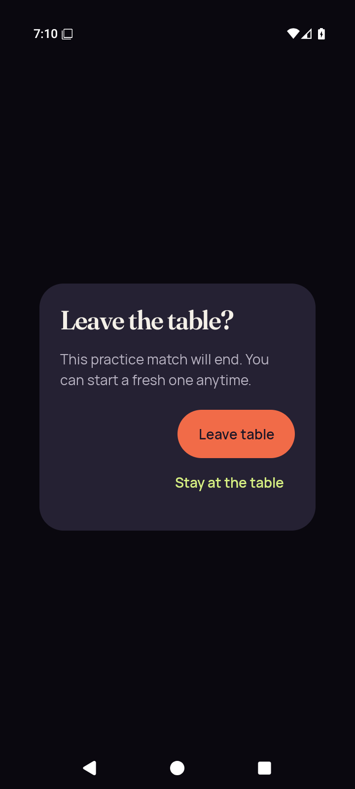</a> <code>3d-leave-cancel-confirmation.png</code> 3d-leave-cancel-confirmation — 3d.leave-cancel | 720 × 1600 px · 40,733 bytes SHA-256: <code>ab3a9a1c73c2fda0e36c986b427a2109a3a99a8123b87da1759aaad2814a723c</code> Source: <code>/root/projects/PartyDeck/artifacts/evidence-storage/34515669045/android-jvm-reports/build/ci/android/godot-session/debug/runtime/captures/3d-leave-cancel-confirmation.png</code> Capture: 2026-09-10T19:10:16.938+00:00 → 2026-09-10T19:10:19.286+00:00 [UI XML](runtime/captures/3d-leave-cancel-confirmation.xml) · [Capture JSON](runtime/captures/3d-leave-cancel-confirmation.json) · [Original result](runtime/godot-session-result.json) | **UNVIEWED original — no visual acceptance**. Original capture preserved without direct visual review. Source name, stage, timestamps and run outcome remain unchanged; no pixel observation or visual acceptance is asserted. |
|  <code>3d-leave-cancel-native-ready.png</code> 3d-leave-cancel-native-ready — 3d.leave-cancel | 720 × 1600 px · 190,574 bytes SHA-256: <code>10162cd91b07ae34159065541564ab25783e3769f20e2eb50a551f7424a75e63</code> Source: <code>/root/projects/PartyDeck/artifacts/evidence-storage/34515669045/android-jvm-reports/build/ci/android/godot-session/debug/runtime/captures/3d-leave-cancel-native-ready.png</code> Capture: 2026-09-10T19:10:07.407+00:00 → 2026-09-10T19:10:09.779+00:00 [UI XML](runtime/captures/3d-leave-cancel-native-ready.xml) · [Capture JSON](runtime/captures/3d-leave-cancel-native-ready.json) · [Original result](runtime/godot-session-result.json) | **UNVIEWED original — no visual acceptance**. Original capture preserved without direct visual review. Source name, stage, timestamps and run outcome remain unchanged; no pixel observation or visual acceptance is asserted. |
|  <code>3d-leave-cancel-return-concealed.png</code> 3d-leave-cancel-return-concealed — 3d.leave-cancel | 720 × 1600 px · 128,327 bytes SHA-256: <code>57c7a959197fe0e1bc3387d01484bd0bde99a4d7a6f556043872f2623aee3b97</code> Source: <code>/root/projects/PartyDeck/artifacts/evidence-storage/34515669045/android-jvm-reports/build/ci/android/godot-session/debug/runtime/captures/3d-leave-cancel-return-concealed.png</code> Capture: 2026-09-10T19:10:25.663+00:00 → 2026-09-10T19:10:28.005+00:00 [UI XML](runtime/captures/3d-leave-cancel-return-concealed.xml) · [Capture JSON](runtime/captures/3d-leave-cancel-return-concealed.json) · [Original result](runtime/godot-session-result.json) | **UNVIEWED original — no visual acceptance**. Original capture preserved without direct visual review. Source name, stage, timestamps and run outcome remain unchanged; no pixel observation or visual acceptance is asserted. |
|  <code>3d-leave-cancel-return-first-card.png</code> 3d-leave-cancel-return-first-card — 3d.leave-cancel | 720 × 1600 px · 123,192 bytes SHA-256: <code>d5e0d58d47c7e4fcf77f7dcfeb6ab9115533ce88f9ac5685ff7b23d8caf865a3</code> Source: <code>/root/projects/PartyDeck/artifacts/evidence-storage/34515669045/android-jvm-reports/build/ci/android/godot-session/debug/runtime/captures/3d-leave-cancel-return-first-card.png</code> Capture: 2026-09-10T19:10:40.881+00:00 → 2026-09-10T19:10:43.242+00:00 [UI XML](runtime/captures/3d-leave-cancel-return-first-card.xml) · [Capture JSON](runtime/captures/3d-leave-cancel-return-first-card.json) · [Original result](runtime/godot-session-result.json) | **UNVIEWED original — no visual acceptance**. Original capture preserved without direct visual review. Source name, stage, timestamps and run outcome remain unchanged; no pixel observation or visual acceptance is asserted. |
|  <code>3d-leave-cancel-return-public.png</code> 3d-leave-cancel-return-public — 3d.leave-cancel | 720 × 1600 px · 128,327 bytes SHA-256: <code>57c7a959197fe0e1bc3387d01484bd0bde99a4d7a6f556043872f2623aee3b97</code> Source: <code>/root/projects/PartyDeck/artifacts/evidence-storage/34515669045/android-jvm-reports/build/ci/android/godot-session/debug/runtime/captures/3d-leave-cancel-return-public.png</code> Capture: 2026-09-10T19:10:34.406+00:00 → 2026-09-10T19:10:36.745+00:00 [UI XML](runtime/captures/3d-leave-cancel-return-public.xml) · [Capture JSON](runtime/captures/3d-leave-cancel-return-public.json) · [Original result](runtime/godot-session-result.json) | **UNVIEWED original — no visual acceptance**. Original capture preserved without direct visual review. Source name, stage, timestamps and run outcome remain unchanged; no pixel observation or visual acceptance is asserted. |
|  <code>3d-leave-cancel-return-selection-cleared.png</code> 3d-leave-cancel-return-selection-cleared — 3d.leave-cancel | 720 × 1600 px · 128,327 bytes SHA-256: <code>57c7a959197fe0e1bc3387d01484bd0bde99a4d7a6f556043872f2623aee3b97</code> Source: <code>/root/projects/PartyDeck/artifacts/evidence-storage/34515669045/android-jvm-reports/build/ci/android/godot-session/debug/runtime/captures/3d-leave-cancel-return-selection-cleared.png</code> Capture: 2026-09-10T19:10:30.042+00:00 → 2026-09-10T19:10:32.380+00:00 [UI XML](runtime/captures/3d-leave-cancel-return-selection-cleared.xml) · [Capture JSON](runtime/captures/3d-leave-cancel-return-selection-cleared.json) · [Original result](runtime/godot-session-result.json) | **UNVIEWED original — no visual acceptance**. Original capture preserved without direct visual review. Source name, stage, timestamps and run outcome remain unchanged; no pixel observation or visual acceptance is asserted. |
|  <code>3d-leave-cancel-selected.png</code> 3d-leave-cancel-selected — 3d.leave-cancel | 720 × 1600 px · 123,231 bytes SHA-256: <code>ea3bb31fdc4e963325d833a1e465238679fcd1d3ef2834cd1abae53b26524a83</code> Source: <code>/root/projects/PartyDeck/artifacts/evidence-storage/34515669045/android-jvm-reports/build/ci/android/godot-session/debug/runtime/captures/3d-leave-cancel-selected.png</code> Capture: 2026-09-10T19:09:46.937+00:00 → 2026-09-10T19:09:49.288+00:00 [UI XML](runtime/captures/3d-leave-cancel-selected.xml) · [Capture JSON](runtime/captures/3d-leave-cancel-selected.json) · [Original result](runtime/godot-session-result.json) | **UNVIEWED original — no visual acceptance**. Original capture preserved without direct visual review. Source name, stage, timestamps and run outcome remain unchanged; no pixel observation or visual acceptance is asserted. |
|  <code>3d-leave-cancel-selector.png</code> 3d-leave-cancel-selector — 3d.leave-cancel | 720 × 1600 px · 58,468 bytes SHA-256: <code>086685799b81198c728fb987b3d74568051df036fdf949c0a4869a07356fec0a</code> Source: <code>/root/projects/PartyDeck/artifacts/evidence-storage/34515669045/android-jvm-reports/build/ci/android/godot-session/debug/runtime/captures/3d-leave-cancel-selector.png</code> Capture: 2026-09-10T19:09:55.717+00:00 → 2026-09-10T19:09:58.063+00:00 [UI XML](runtime/captures/3d-leave-cancel-selector.xml) · [Capture JSON](runtime/captures/3d-leave-cancel-selector.json) · [Original result](runtime/godot-session-result.json) | **UNVIEWED original — no visual acceptance**. Original capture preserved without direct visual review. Source name, stage, timestamps and run outcome remain unchanged; no pixel observation or visual acceptance is asserted. |
|  <code>3d-leave-end-confirmation.png</code> 3d-leave-end-confirmation — 3d.leave-end | 720 × 1600 px · 40,724 bytes SHA-256: <code>7e4040ef7d2491ec879f610991e7e835321bbad1a8c7d3c245f4839040da6d6f</code> Source: <code>/root/projects/PartyDeck/artifacts/evidence-storage/34515669045/android-jvm-reports/build/ci/android/godot-session/debug/runtime/captures/3d-leave-end-confirmation.png</code> Capture: 2026-09-10T19:12:13.718+00:00 → 2026-09-10T19:12:16.066+00:00 [UI XML](runtime/captures/3d-leave-end-confirmation.xml) · [Capture JSON](runtime/captures/3d-leave-end-confirmation.json) · [Original result](runtime/godot-session-result.json) | **UNVIEWED original — no visual acceptance**. Original capture preserved without direct visual review. Source name, stage, timestamps and run outcome remain unchanged; no pixel observation or visual acceptance is asserted. |
|  <code>3d-leave-end-selector.png</code> 3d-leave-end-selector — 3d.leave-end | 720 × 1600 px · 58,028 bytes SHA-256: <code>ac95dec8d5765e927aeed4713a2c2d22ea3cd1bc4dc5bfe002c928baa010c3a8</code> Source: <code>/root/projects/PartyDeck/artifacts/evidence-storage/34515669045/android-jvm-reports/build/ci/android/godot-session/debug/runtime/captures/3d-leave-end-selector.png</code> Capture: 2026-09-10T19:11:58.775+00:00 → 2026-09-10T19:12:01.111+00:00 [UI XML](runtime/captures/3d-leave-end-selector.xml) · [Capture JSON](runtime/captures/3d-leave-end-selector.json) · [Original result](runtime/godot-session-result.json) | **UNVIEWED original — no visual acceptance**. Original capture preserved without direct visual review. Source name, stage, timestamps and run outcome remain unchanged; no pixel observation or visual acceptance is asserted. |
|  <code>3d-recents-resumed.png</code> 3d-recents-resumed — 3d.recents-interruption | 720 × 1600 px · 190,989 bytes SHA-256: <code>e60c487662c17fde97e941d5a06a55fa47e2f593c48bf502785d86135cdf4637</code> Source: <code>/root/projects/PartyDeck/artifacts/evidence-storage/34515669045/android-jvm-reports/build/ci/android/godot-session/debug/runtime/captures/3d-recents-resumed.png</code> Capture: 2026-09-10T19:08:21.973+00:00 → 2026-09-10T19:08:24.352+00:00 [UI XML](runtime/captures/3d-recents-resumed.xml) · [Capture JSON](runtime/captures/3d-recents-resumed.json) · [Original result](runtime/godot-session-result.json) | **UNVIEWED original — no visual acceptance**. Original capture preserved without direct visual review. Source name, stage, timestamps and run outcome remain unchanged; no pixel observation or visual acceptance is asserted. |
| <a href="runtime/captures/3d-recents-system-ui.png">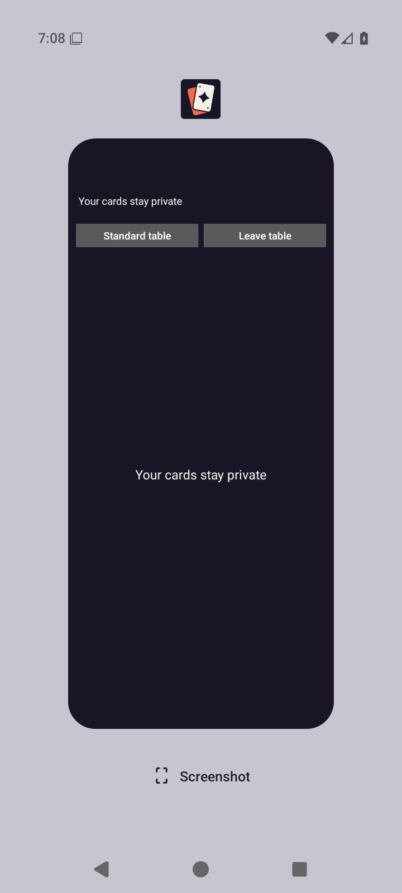</a> <code>3d-recents-system-ui.png</code> 3d-recents-system-ui — 3d.recents-interruption | 720 × 1600 px · 42,227 bytes SHA-256: <code>88f769cff57007691ee8978bed7a9a3d85ae67e78c2ce3cd8b858a25b6217940</code> Source: <code>/root/projects/PartyDeck/artifacts/evidence-storage/34515669045/android-jvm-reports/build/ci/android/godot-session/debug/runtime/captures/3d-recents-system-ui.png</code> Capture: 2026-09-10T19:08:16.774+00:00 → 2026-09-10T19:08:19.122+00:00 [UI XML](runtime/captures/3d-recents-system-ui.xml) · [Capture JSON](runtime/captures/3d-recents-system-ui.json) · [Original result](runtime/godot-session-result.json) | **UNVIEWED original — no visual acceptance**. Original capture preserved without direct visual review. Source name, stage, timestamps and run outcome remain unchanged; no pixel observation or visual acceptance is asserted. |
|  <code>3d-standard-concealed.png</code> 3d-standard-concealed — 3d.standard-return | 720 × 1600 px · 128,753 bytes SHA-256: <code>023e8b39c36121eb189e518c7066a619483fc69296ab2ed422c61301930ebea7</code> Source: <code>/root/projects/PartyDeck/artifacts/evidence-storage/34515669045/android-jvm-reports/build/ci/android/godot-session/debug/runtime/captures/3d-standard-concealed.png</code> Capture: 2026-09-10T19:08:31.179+00:00 → 2026-09-10T19:08:33.522+00:00 [UI XML](runtime/captures/3d-standard-concealed.xml) · [Capture JSON](runtime/captures/3d-standard-concealed.json) · [Original result](runtime/godot-session-result.json) | **UNVIEWED original — no visual acceptance**. Original capture preserved without direct visual review. Source name, stage, timestamps and run outcome remain unchanged; no pixel observation or visual acceptance is asserted. |
|  <code>3d-standard-first-card.png</code> 3d-standard-first-card — 3d.standard-return | 720 × 1600 px · 123,493 bytes SHA-256: <code>96eaa895df88f86a62d22aaadd81422ac0a36e53fe56828f195bb9304e7c36c0</code> Source: <code>/root/projects/PartyDeck/artifacts/evidence-storage/34515669045/android-jvm-reports/build/ci/android/godot-session/debug/runtime/captures/3d-standard-first-card.png</code> Capture: 2026-09-10T19:08:46.444+00:00 → 2026-09-10T19:08:48.797+00:00 [UI XML](runtime/captures/3d-standard-first-card.xml) · [Capture JSON](runtime/captures/3d-standard-first-card.json) · [Original result](runtime/godot-session-result.json) | **UNVIEWED original — no visual acceptance**. Original capture preserved without direct visual review. Source name, stage, timestamps and run outcome remain unchanged; no pixel observation or visual acceptance is asserted. |
| <a href="runtime/captures/3d-standard-play-after-play.png">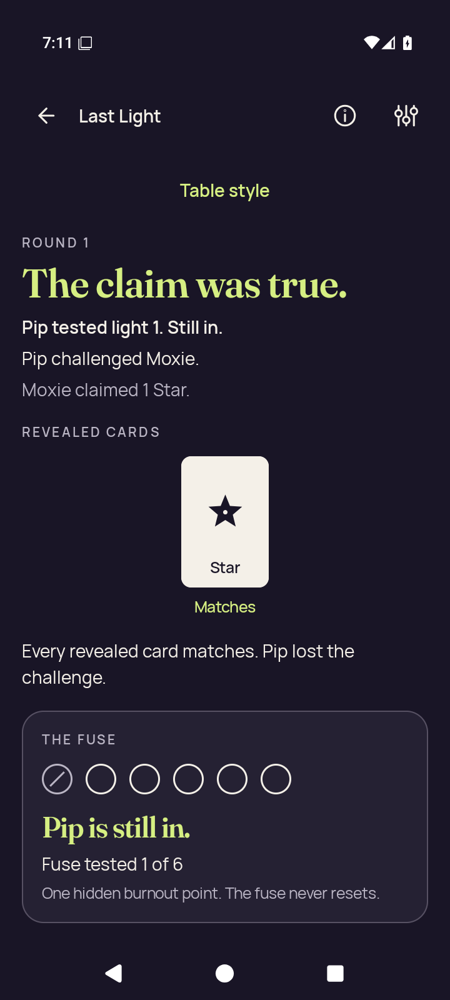</a> <code>3d-standard-play-after-play.png</code> 3d-standard-play-after-play — 3d.standard-action | 720 × 1600 px · 90,117 bytes SHA-256: <code>2c98ef8dae0b1d9b4e50ce32129a2db57336881f50f53cd535df9bfa2c2402ca</code> Source: <code>/root/projects/PartyDeck/artifacts/evidence-storage/34515669045/android-jvm-reports/build/ci/android/godot-session/debug/runtime/captures/3d-standard-play-after-play.png</code> Capture: 2026-09-10T19:11:49.894+00:00 → 2026-09-10T19:11:52.242+00:00 [UI XML](runtime/captures/3d-standard-play-after-play.xml) · [Capture JSON](runtime/captures/3d-standard-play-after-play.json) · [Original result](runtime/godot-session-result.json) | **UNVIEWED original — no visual acceptance**. Original capture preserved without direct visual review. Source name, stage, timestamps and run outcome remain unchanged; no pixel observation or visual acceptance is asserted. |
|  <code>3d-standard-play-selected.png</code> 3d-standard-play-selected — 3d.standard-action | 720 × 1600 px · 122,355 bytes SHA-256: <code>ba0718defff3eda097c45e3b5bb5ce79e56e50a7b379816e4b1e5432042208e4</code> Source: <code>/root/projects/PartyDeck/artifacts/evidence-storage/34515669045/android-jvm-reports/build/ci/android/godot-session/debug/runtime/captures/3d-standard-play-selected.png</code> Capture: 2026-09-10T19:11:43.299+00:00 → 2026-09-10T19:11:45.666+00:00 [UI XML](runtime/captures/3d-standard-play-selected.xml) · [Capture JSON](runtime/captures/3d-standard-play-selected.json) · [Original result](runtime/godot-session-result.json) | **UNVIEWED original — no visual acceptance**. Original capture preserved without direct visual review. Source name, stage, timestamps and run outcome remain unchanged; no pixel observation or visual acceptance is asserted. |
|  <code>3d-standard-public.png</code> 3d-standard-public — 3d.standard-return | 720 × 1600 px · 128,594 bytes SHA-256: <code>0bf91ed1688c6040563cd6b6981fb343a9ea5437d1a47fdd8baa398081865524</code> Source: <code>/root/projects/PartyDeck/artifacts/evidence-storage/34515669045/android-jvm-reports/build/ci/android/godot-session/debug/runtime/captures/3d-standard-public.png</code> Capture: 2026-09-10T19:08:39.945+00:00 → 2026-09-10T19:08:42.317+00:00 [UI XML](runtime/captures/3d-standard-public.xml) · [Capture JSON](runtime/captures/3d-standard-public.json) · [Original result](runtime/godot-session-result.json) | **UNVIEWED original — no visual acceptance**. Original capture preserved without direct visual review. Source name, stage, timestamps and run outcome remain unchanged; no pixel observation or visual acceptance is asserted. |
|  <code>3d-standard-selection-cleared.png</code> 3d-standard-selection-cleared — 3d.standard-return | 720 × 1600 px · 128,753 bytes SHA-256: <code>023e8b39c36121eb189e518c7066a619483fc69296ab2ed422c61301930ebea7</code> Source: <code>/root/projects/PartyDeck/artifacts/evidence-storage/34515669045/android-jvm-reports/build/ci/android/godot-session/debug/runtime/captures/3d-standard-selection-cleared.png</code> Capture: 2026-09-10T19:08:35.559+00:00 → 2026-09-10T19:08:37.901+00:00 [UI XML](runtime/captures/3d-standard-selection-cleared.xml) · [Capture JSON](runtime/captures/3d-standard-selection-cleared.json) · [Original result](runtime/godot-session-result.json) | **UNVIEWED original — no visual acceptance**. Original capture preserved without direct visual review. Source name, stage, timestamps and run outcome remain unchanged; no pixel observation or visual acceptance is asserted. |
| <a href="runtime/captures/final-diagnostic.png">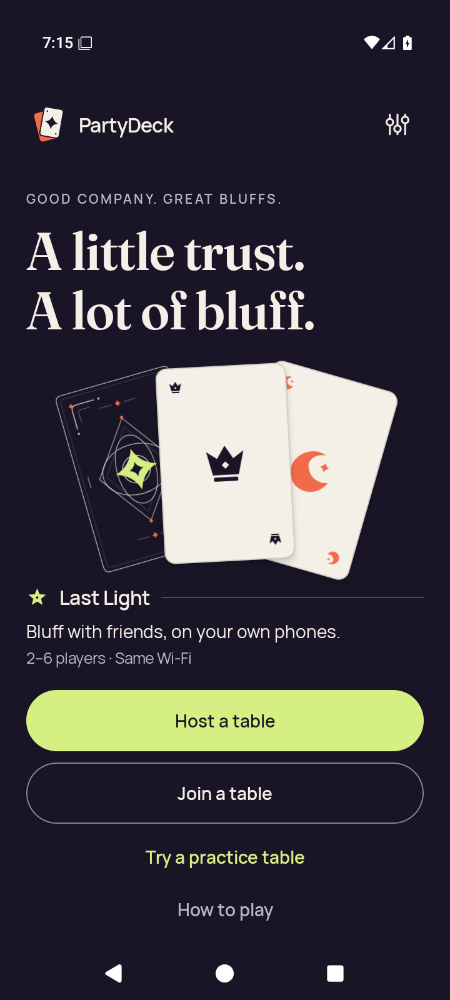</a> <code>final-diagnostic.png</code> final-diagnostic — 3d.engine-leave-end | 720 × 1600 px · 131,828 bytes SHA-256: <code>58bb4352e2867a340cde9e280ff9581b46caf2802e9153e4c850fb7fc6809456</code> Source: <code>/root/projects/PartyDeck/artifacts/evidence-storage/34515669045/android-jvm-reports/build/ci/android/godot-session/debug/runtime/captures/final-diagnostic.png</code> Capture: 2026-09-10T19:15:05.357+00:00 → 2026-09-10T19:15:07.695+00:00 [UI XML](runtime/captures/final-diagnostic.xml) · [Capture JSON](runtime/captures/final-diagnostic.json) · [Original result](runtime/godot-session-result.json) | **UNVIEWED original — no visual acceptance**. Original capture preserved without direct visual review. Source name, stage, timestamps and run outcome remain unchanged; no pixel observation or visual acceptance is asserted. |
|  <code>home-cold.png</code> home-cold — emulator readiness | 720 × 1600 px · 131,799 bytes SHA-256: <code>edf9753c97bc22287e1b43eadd2c1f097485fd6ee41690bd883a3e461d80f1f5</code> Source: <code>/root/projects/PartyDeck/artifacts/evidence-storage/34515669045/android-jvm-reports/build/ci/android/godot-session/debug/runtime/captures/home-cold.png</code> Capture: 2026-09-10T18:56:01.805+00:00 → 2026-09-10T18:56:04.163+00:00 [UI XML](runtime/captures/home-cold.xml) · [Capture JSON](runtime/captures/home-cold.json) · [Original result](runtime/godot-session-result.json) | **UNVIEWED original — no visual acceptance**. Original capture preserved without direct visual review. Source name, stage, timestamps and run outcome remain unchanged; no pixel observation or visual acceptance is asserted. |
