# API 35 native sessions — optimized-test-signed

[All collections](../../../README.md) · [Preserved evidence index](../../evidence-index.md) · [Copy/review binding](../../provenance/publication-review/partydeck-gallery-3433-publication-binding-v1.json) · [Completed focused review](../../provenance/publication-review/partydeck-gallery-after-2815-combinedandroid34515669045-visual-review-v1.json) · [Source mapping](../../provenance/source-review/capture-inventory-v1.json)

**Original native check counts: {"passed": 28, "skipped": 2}. Current engine outcome limits remain explicit.**

Capture PNG, XML and JSON acquisitions are sequential; original stage names and timestamps are retained.

The Android job succeeds. Both ordinary smokes pass. Native debug passes 30 checks; optimized passes 28 and explicitly skips two renderer-death checks. The overall combined workflow fails in the separate iOS job. This collection preserves 186 native, 62 ordinary, 69 Compose JVM and one preparation original.

Six originals were directly reviewed: both normal portrait 2D native entries and the four current engine public-outcome frames. The compact cover/Reveal, first two complete numbered seats and fixed actions fit both 2D entries. Four after-Play PNGs show public round results. Debug 2D is Round 2; the other three are Round 1. The independent XML/source audit establishes each outcome matches its recorded baseline round. These public-result stills show no remaining private-hand layout or visible five-to-four count. All four continuation actions lie below the captured viewport. The optimized 3D fuse panel reaches the clip.

All four current engine scenarios have zero Standard card nodes in the relevant XMLs; remaining Standard hand size/unchecked cards are unobserved. Renderer selection clearing is observed local state only. Eighty-two originals match separately published bytes; 230 others remain explicitly unviewed. The collector and independent action reviewer reported zero media views. No videos exist in this Android collection. Source is derived exact-commit provenance, with 1,124 historical gallery payloads represented by remote-tree identity only. Source audits are reused without broad re-execution.

Source revision: `0f00f17a398be96aef7bdb58d03074a9914f8232`. CI run: [34515669045](https://github.com/Apdelrahman1911/PartyDeck/actions/runs/34515669045). 86 original PNG identities. Review methods: 83 unviewed original — no visual acceptance, 3 direct original view.

Every thumbnail opens the unchanged original PNG. **UNVIEWED** means no direct pixel review or visual acceptance is asserted. Matching bytes reuse only earlier pixel observations. Each source, scenario and original outcome remains separate. Frozen review plans retain their historical pending flags; the completed focused-review receipt records the final status. No new derivative image or video decoding was performed.

| Original capture | Original identity and evidence | Review status and observation |
| --- | --- | --- |
|  <code>2d-action-entry-native-ready.png</code> 2d-action-entry-native-ready — 2d.standard-action | 720 × 1600 px · 149,953 bytes SHA-256: <code>f41555975d5d81cffc69571d17114dda7675ce9ac3b3f85c73cc471188bb2eb2</code> Source: <code>/root/projects/PartyDeck/artifacts/evidence-storage/34515669045/android-jvm-reports/build/ci/android/godot-session/optimized-test-signed/runtime/captures/2d-action-entry-native-ready.png</code> Capture: 2026-09-10T19:27:32.108+00:00 → 2026-09-10T19:27:34.450+00:00 [UI XML](runtime/captures/2d-action-entry-native-ready.xml) · [Capture JSON](runtime/captures/2d-action-entry-native-ready.json) · [Original result](runtime/godot-session-result.json) | **UNVIEWED original — no visual acceptance**. Original capture preserved without direct visual review. Source name, stage, timestamps and run outcome remain unchanged; no pixel observation or visual acceptance is asserted. |
|  <code>2d-action-entry-selected.png</code> 2d-action-entry-selected — 2d.standard-action | 720 × 1600 px · 129,296 bytes SHA-256: <code>8d62da227d302d81df754aee9f83d69dd41f945e0ea4d790893e61813296ef24</code> Source: <code>/root/projects/PartyDeck/artifacts/evidence-storage/34515669045/android-jvm-reports/build/ci/android/godot-session/optimized-test-signed/runtime/captures/2d-action-entry-selected.png</code> Capture: 2026-09-10T19:27:13.194+00:00 → 2026-09-10T19:27:15.553+00:00 [UI XML](runtime/captures/2d-action-entry-selected.xml) · [Capture JSON](runtime/captures/2d-action-entry-selected.json) · [Original result](runtime/godot-session-result.json) | **UNVIEWED original — no visual acceptance**. Original capture preserved without direct visual review. Source name, stage, timestamps and run outcome remain unchanged; no pixel observation or visual acceptance is asserted. |
|  <code>2d-action-entry-selector.png</code> 2d-action-entry-selector — 2d.standard-action | 720 × 1600 px · 57,938 bytes SHA-256: <code>434b4481931f8a68e2c84dffc6c6ecfc8b9ce49f9a4eb4b92482ee522952f3aa</code> Source: <code>/root/projects/PartyDeck/artifacts/evidence-storage/34515669045/android-jvm-reports/build/ci/android/godot-session/optimized-test-signed/runtime/captures/2d-action-entry-selector.png</code> Capture: 2026-09-10T19:27:21.931+00:00 → 2026-09-10T19:27:24.273+00:00 [UI XML](runtime/captures/2d-action-entry-selector.xml) · [Capture JSON](runtime/captures/2d-action-entry-selector.json) · [Original result](runtime/godot-session-result.json) | **UNVIEWED original — no visual acceptance**. Original capture preserved without direct visual review. Source name, stage, timestamps and run outcome remain unchanged; no pixel observation or visual acceptance is asserted. |
|  <code>2d-action-return-concealed.png</code> 2d-action-return-concealed — 2d.standard-action | 720 × 1600 px · 130,883 bytes SHA-256: <code>3420eda3cd935665fc6c53782a85f6dbe0f803716fc1effc56c6f296d052e993</code> Source: <code>/root/projects/PartyDeck/artifacts/evidence-storage/34515669045/android-jvm-reports/build/ci/android/godot-session/optimized-test-signed/runtime/captures/2d-action-return-concealed.png</code> Capture: 2026-09-10T19:27:41.288+00:00 → 2026-09-10T19:27:43.618+00:00 [UI XML](runtime/captures/2d-action-return-concealed.xml) · [Capture JSON](runtime/captures/2d-action-return-concealed.json) · [Original result](runtime/godot-session-result.json) | **UNVIEWED original — no visual acceptance**. Original capture preserved without direct visual review. Source name, stage, timestamps and run outcome remain unchanged; no pixel observation or visual acceptance is asserted. |
| <a href="runtime/captures/2d-action-return-first-card.png">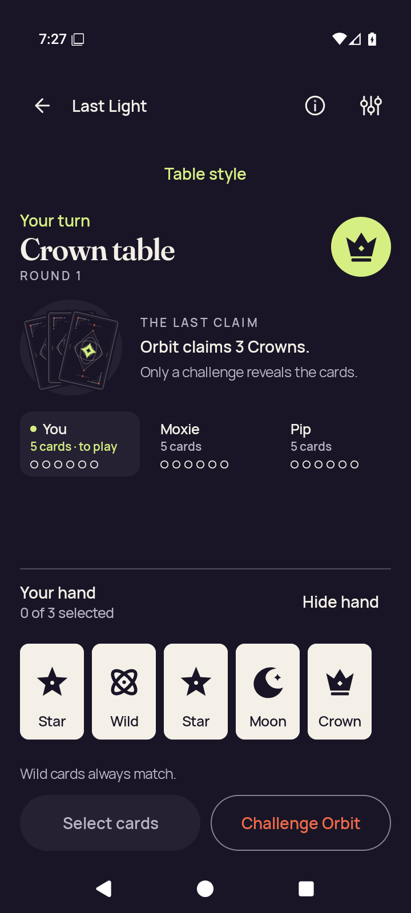</a> <code>2d-action-return-first-card.png</code> 2d-action-return-first-card — 2d.standard-action | 720 × 1600 px · 129,021 bytes SHA-256: <code>913fdcc6cd726c0c19213bc033aae30837a08b28be9486c09fc0e31490062515</code> Source: <code>/root/projects/PartyDeck/artifacts/evidence-storage/34515669045/android-jvm-reports/build/ci/android/godot-session/optimized-test-signed/runtime/captures/2d-action-return-first-card.png</code> Capture: 2026-09-10T19:27:56.445+00:00 → 2026-09-10T19:27:58.794+00:00 [UI XML](runtime/captures/2d-action-return-first-card.xml) · [Capture JSON](runtime/captures/2d-action-return-first-card.json) · [Original result](runtime/godot-session-result.json) | **UNVIEWED original — no visual acceptance**. Original capture preserved without direct visual review. Source name, stage, timestamps and run outcome remain unchanged; no pixel observation or visual acceptance is asserted. |
|  <code>2d-action-return-public.png</code> 2d-action-return-public — 2d.standard-action | 720 × 1600 px · 130,883 bytes SHA-256: <code>3420eda3cd935665fc6c53782a85f6dbe0f803716fc1effc56c6f296d052e993</code> Source: <code>/root/projects/PartyDeck/artifacts/evidence-storage/34515669045/android-jvm-reports/build/ci/android/godot-session/optimized-test-signed/runtime/captures/2d-action-return-public.png</code> Capture: 2026-09-10T19:27:50.000+00:00 → 2026-09-10T19:27:52.352+00:00 [UI XML](runtime/captures/2d-action-return-public.xml) · [Capture JSON](runtime/captures/2d-action-return-public.json) · [Original result](runtime/godot-session-result.json) | **UNVIEWED original — no visual acceptance**. Original capture preserved without direct visual review. Source name, stage, timestamps and run outcome remain unchanged; no pixel observation or visual acceptance is asserted. |
|  <code>2d-action-return-selection-cleared.png</code> 2d-action-return-selection-cleared — 2d.standard-action | 720 × 1600 px · 130,883 bytes SHA-256: <code>3420eda3cd935665fc6c53782a85f6dbe0f803716fc1effc56c6f296d052e993</code> Source: <code>/root/projects/PartyDeck/artifacts/evidence-storage/34515669045/android-jvm-reports/build/ci/android/godot-session/optimized-test-signed/runtime/captures/2d-action-return-selection-cleared.png</code> Capture: 2026-09-10T19:27:45.637+00:00 → 2026-09-10T19:27:47.974+00:00 [UI XML](runtime/captures/2d-action-return-selection-cleared.xml) · [Capture JSON](runtime/captures/2d-action-return-selection-cleared.json) · [Original result](runtime/godot-session-result.json) | **UNVIEWED original — no visual acceptance**. Original capture preserved without direct visual review. Source name, stage, timestamps and run outcome remain unchanged; no pixel observation or visual acceptance is asserted. |
|  <code>2d-baseline-first-card.png</code> 2d-baseline-first-card — 2d.practice-baseline | 720 × 1600 px · 129,606 bytes SHA-256: <code>780570867ad1b27c138e969add6bb8b1ea9a4ad9f8eadc62d8ef48f74c88a843</code> Source: <code>/root/projects/PartyDeck/artifacts/evidence-storage/34515669045/android-jvm-reports/build/ci/android/godot-session/optimized-test-signed/runtime/captures/2d-baseline-first-card.png</code> Capture: 2026-09-10T19:23:15.327+00:00 → 2026-09-10T19:23:17.665+00:00 [UI XML](runtime/captures/2d-baseline-first-card.xml) · [Capture JSON](runtime/captures/2d-baseline-first-card.json) · [Original result](runtime/godot-session-result.json) | **UNVIEWED original — no visual acceptance**. Original capture preserved without direct visual review. Source name, stage, timestamps and run outcome remain unchanged; no pixel observation or visual acceptance is asserted. |
| <a href="runtime/captures/2d-baseline-public.png">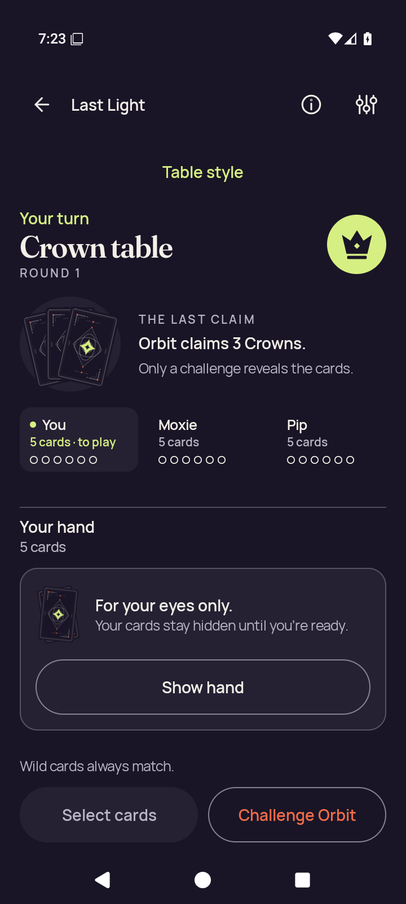</a> <code>2d-baseline-public.png</code> 2d-baseline-public — 2d.practice-baseline | 720 × 1600 px · 131,413 bytes SHA-256: <code>d8bc4575653273adb256029943e1aa73958e8d296544bcde92da8c146d7f01b0</code> Source: <code>/root/projects/PartyDeck/artifacts/evidence-storage/34515669045/android-jvm-reports/build/ci/android/godot-session/optimized-test-signed/runtime/captures/2d-baseline-public.png</code> Capture: 2026-09-10T19:23:08.863+00:00 → 2026-09-10T19:23:11.202+00:00 [UI XML](runtime/captures/2d-baseline-public.xml) · [Capture JSON](runtime/captures/2d-baseline-public.json) · [Original result](runtime/godot-session-result.json) | **UNVIEWED original — no visual acceptance**. Original capture preserved without direct visual review. Source name, stage, timestamps and run outcome remain unchanged; no pixel observation or visual acceptance is asserted. |
|  <code>2d-baseline-selected.png</code> 2d-baseline-selected — 2d.standard-hand | 720 × 1600 px · 129,802 bytes SHA-256: <code>8360266c3cece576695845083a525ec3392a50e051e1f84f0f4a63dd8d6f2db4</code> Source: <code>/root/projects/PartyDeck/artifacts/evidence-storage/34515669045/android-jvm-reports/build/ci/android/godot-session/optimized-test-signed/runtime/captures/2d-baseline-selected.png</code> Capture: 2026-09-10T19:25:00.003+00:00 → 2026-09-10T19:25:02.368+00:00 [UI XML](runtime/captures/2d-baseline-selected.xml) · [Capture JSON](runtime/captures/2d-baseline-selected.json) · [Original result](runtime/godot-session-result.json) | **UNVIEWED original — no visual acceptance**. Original capture preserved without direct visual review. Source name, stage, timestamps and run outcome remain unchanged; no pixel observation or visual acceptance is asserted. |
| <a href="runtime/captures/2d-engine-baseline-first-card.png">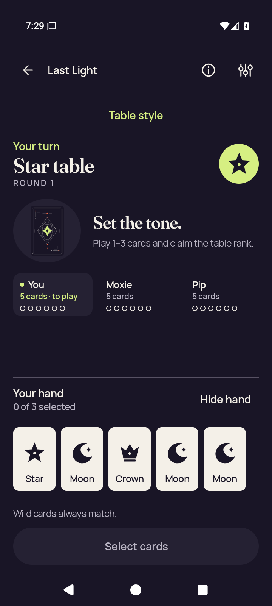</a> <code>2d-engine-baseline-first-card.png</code> 2d-engine-baseline-first-card — 2d.engine-practice-baseline | 720 × 1600 px · 103,267 bytes SHA-256: <code>4ab8808245185a8de813de0f0fdda2eac4ccb12524981abcd0e950ee4c605539</code> Source: <code>/root/projects/PartyDeck/artifacts/evidence-storage/34515669045/android-jvm-reports/build/ci/android/godot-session/optimized-test-signed/runtime/captures/2d-engine-baseline-first-card.png</code> Capture: 2026-09-10T19:29:00.869+00:00 → 2026-09-10T19:29:03.204+00:00 [UI XML](runtime/captures/2d-engine-baseline-first-card.xml) · [Capture JSON](runtime/captures/2d-engine-baseline-first-card.json) · [Original result](runtime/godot-session-result.json) | **UNVIEWED original — no visual acceptance**. Original capture preserved without direct visual review. Source name, stage, timestamps and run outcome remain unchanged; no pixel observation or visual acceptance is asserted. |
| <a href="runtime/captures/2d-engine-baseline-public.png">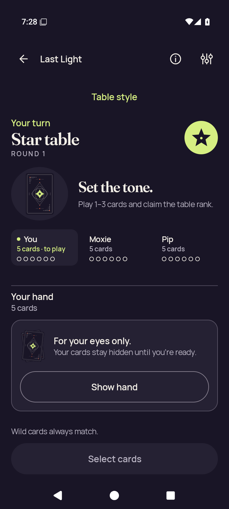</a> <code>2d-engine-baseline-public.png</code> 2d-engine-baseline-public — 2d.engine-practice-baseline | 720 × 1600 px · 108,599 bytes SHA-256: <code>4202dcea6afdfb260c485853d14b63a4cc469a98488b111dd9e5a970189990bb</code> Source: <code>/root/projects/PartyDeck/artifacts/evidence-storage/34515669045/android-jvm-reports/build/ci/android/godot-session/optimized-test-signed/runtime/captures/2d-engine-baseline-public.png</code> Capture: 2026-09-10T19:28:54.436+00:00 → 2026-09-10T19:28:56.766+00:00 [UI XML](runtime/captures/2d-engine-baseline-public.xml) · [Capture JSON](runtime/captures/2d-engine-baseline-public.json) · [Original result](runtime/godot-session-result.json) | **UNVIEWED original — no visual acceptance**. Original capture preserved without direct visual review. Source name, stage, timestamps and run outcome remain unchanged; no pixel observation or visual acceptance is asserted. |
| <a href="runtime/captures/2d-engine-entry-native-ready.png">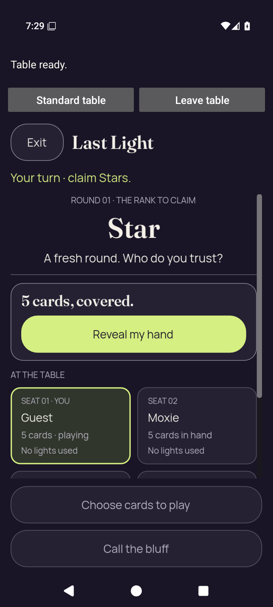</a> <code>2d-engine-entry-native-ready.png</code> 2d-engine-entry-native-ready — 2d.engine-reveal-selection | 720 × 1600 px · 151,229 bytes SHA-256: <code>a705edf8039e982fc63e41f73bfddf2b88b9b92eb58da24a0fa362412f4018f5</code> Source: <code>/root/projects/PartyDeck/artifacts/evidence-storage/34515669045/android-jvm-reports/build/ci/android/godot-session/optimized-test-signed/runtime/captures/2d-engine-entry-native-ready.png</code> Capture: 2026-09-10T19:29:26.446+00:00 → 2026-09-10T19:29:28.795+00:00 [UI XML](runtime/captures/2d-engine-entry-native-ready.xml) · [Capture JSON](runtime/captures/2d-engine-entry-native-ready.json) · [Original result](runtime/godot-session-result.json) | **UNVIEWED original — no visual acceptance**. Original capture preserved without direct visual review. Source name, stage, timestamps and run outcome remain unchanged; no pixel observation or visual acceptance is asserted. |
|  <code>2d-engine-entry-selector.png</code> 2d-engine-entry-selector — 2d.engine-reveal-selection | 720 × 1600 px · 58,479 bytes SHA-256: <code>b1a15f2d3ea81fb8a421b64913d32d9bd3137fe6484c0ddc0373991a60618e4f</code> Source: <code>/root/projects/PartyDeck/artifacts/evidence-storage/34515669045/android-jvm-reports/build/ci/android/godot-session/optimized-test-signed/runtime/captures/2d-engine-entry-selector.png</code> Capture: 2026-09-10T19:29:17.626+00:00 → 2026-09-10T19:29:19.957+00:00 [UI XML](runtime/captures/2d-engine-entry-selector.xml) · [Capture JSON](runtime/captures/2d-engine-entry-selector.json) · [Original result](runtime/godot-session-result.json) | **UNVIEWED original — no visual acceptance**. Original capture preserved without direct visual review. Source name, stage, timestamps and run outcome remain unchanged; no pixel observation or visual acceptance is asserted. |
|  <code>2d-engine-home.png</code> 2d-engine-home — 2d.engine-leave-end | 720 × 1600 px · 131,849 bytes SHA-256: <code>09cd3f3e7842b83b4d97eeb9fd3c081fc61ff582b71e720a265216ac027c99e0</code> Source: <code>/root/projects/PartyDeck/artifacts/evidence-storage/34515669045/android-jvm-reports/build/ci/android/godot-session/optimized-test-signed/runtime/captures/2d-engine-home.png</code> Capture: 2026-09-10T19:31:17.597+00:00 → 2026-09-10T19:31:19.935+00:00 [UI XML](runtime/captures/2d-engine-home.xml) · [Capture JSON](runtime/captures/2d-engine-home.json) · [Original result](runtime/godot-session-result.json) | **UNVIEWED original — no visual acceptance**. Original capture preserved without direct visual review. Source name, stage, timestamps and run outcome remain unchanged; no pixel observation or visual acceptance is asserted. |
|  <code>2d-engine-leave-confirmation.png</code> 2d-engine-leave-confirmation — 2d.engine-leave-end | 720 × 1600 px · 40,840 bytes SHA-256: <code>801aed2bf30d4653e88ee1d6e349973cabc4b814138fa96e0b99860e97a1c442</code> Source: <code>/root/projects/PartyDeck/artifacts/evidence-storage/34515669045/android-jvm-reports/build/ci/android/godot-session/optimized-test-signed/runtime/captures/2d-engine-leave-confirmation.png</code> Capture: 2026-09-10T19:31:08.981+00:00 → 2026-09-10T19:31:11.332+00:00 [UI XML](runtime/captures/2d-engine-leave-confirmation.xml) · [Capture JSON](runtime/captures/2d-engine-leave-confirmation.json) · [Original result](runtime/godot-session-result.json) | **UNVIEWED original — no visual acceptance**. Original capture preserved without direct visual review. Source name, stage, timestamps and run outcome remain unchanged; no pixel observation or visual acceptance is asserted. |
|  <code>2d-engine-leave-selector.png</code> 2d-engine-leave-selector — 2d.engine-leave-end | 720 × 1600 px · 58,348 bytes SHA-256: <code>0c8f856a1afd2871967a10c54c3051e35345648a446ed10018b776354167b6fd</code> Source: <code>/root/projects/PartyDeck/artifacts/evidence-storage/34515669045/android-jvm-reports/build/ci/android/godot-session/optimized-test-signed/runtime/captures/2d-engine-leave-selector.png</code> Capture: 2026-09-10T19:30:54.272+00:00 → 2026-09-10T19:30:56.603+00:00 [UI XML](runtime/captures/2d-engine-leave-selector.xml) · [Capture JSON](runtime/captures/2d-engine-leave-selector.json) · [Original result](runtime/godot-session-result.json) | **UNVIEWED original — no visual acceptance**. Original capture preserved without direct visual review. Source name, stage, timestamps and run outcome remain unchanged; no pixel observation or visual acceptance is asserted. |
| <a href="runtime/captures/2d-engine-selected.png">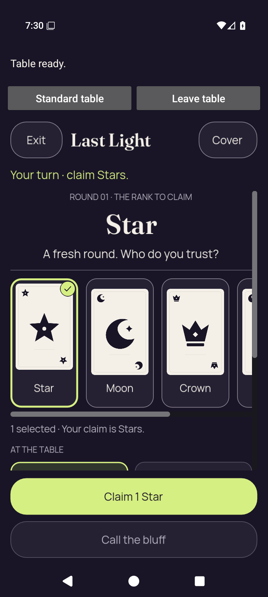</a> <code>2d-engine-selected.png</code> 2d-engine-selected — 2d.engine-reveal-selection | 720 × 1600 px · 130,856 bytes SHA-256: <code>b482a9771dc0d668db56c7741a5d122a75c2cb0b8025e499be2d2021346b11b4</code> Source: <code>/root/projects/PartyDeck/artifacts/evidence-storage/34515669045/android-jvm-reports/build/ci/android/godot-session/optimized-test-signed/runtime/captures/2d-engine-selected.png</code> Capture: 2026-09-10T19:30:16.516+00:00 → 2026-09-10T19:30:18.855+00:00 [UI XML](runtime/captures/2d-engine-selected.xml) · [Capture JSON](runtime/captures/2d-engine-selected.json) · [Original result](runtime/godot-session-result.json) | **UNVIEWED original — no visual acceptance**. Original capture preserved without direct visual review. Source name, stage, timestamps and run outcome remain unchanged; no pixel observation or visual acceptance is asserted. |
| <a href="runtime/captures/2d-engine-standard-after-play.png">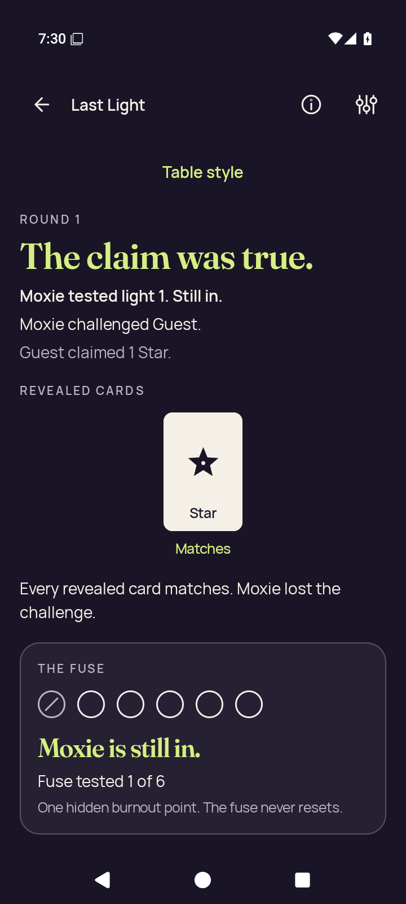</a> <code>2d-engine-standard-after-play.png</code> 2d-engine-standard-after-play — 2d.engine-play-standard-outcome | 720 × 1600 px · 95,592 bytes SHA-256: <code>9f6b21fc0fdb2a07a36143531b2de3838cda41e031605daf582cac266be09e43</code> Source: <code>/root/projects/PartyDeck/artifacts/evidence-storage/34515669045/android-jvm-reports/build/ci/android/godot-session/optimized-test-signed/runtime/captures/2d-engine-standard-after-play.png</code> Capture: 2026-09-10T19:30:45.600+00:00 → 2026-09-10T19:30:47.950+00:00 [UI XML](runtime/captures/2d-engine-standard-after-play.xml) · [Capture JSON](runtime/captures/2d-engine-standard-after-play.json) · [Original result](runtime/godot-session-result.json) | **Direct original view**. Optimized 2D shows Round 1, The claim was true, Moxie tested light 1 and stays in, Moxie challenged Guest, and Guest claimed 1 Star. The public Star card is marked Matches. The complete visible fuse panel says Moxie is still in and Fuse tested 1 of 6. Continuation actions are below the captured viewport. The public result card and explanatory copy are readable. No remaining private-hand layout is shown, and no visible five-to-four hand claim is made. The source audit identifies this as a same-round public result relative to its recorded baseline, not proof of a completed match or continuous privacy. |
|  <code>2d-entry-native-ready.png</code> 2d-entry-native-ready — 2d.native-entry | 720 × 1600 px · 150,404 bytes SHA-256: <code>6fb72882801b4f77f1a4facde99912ffa4820eaaa0bddc17304d84baaab4632e</code> Source: <code>/root/projects/PartyDeck/artifacts/evidence-storage/34515669045/android-jvm-reports/build/ci/android/godot-session/optimized-test-signed/runtime/captures/2d-entry-native-ready.png</code> Capture: 2026-09-10T19:25:19.077+00:00 → 2026-09-10T19:25:21.426+00:00 [UI XML](runtime/captures/2d-entry-native-ready.xml) · [Capture JSON](runtime/captures/2d-entry-native-ready.json) · [Original result](runtime/godot-session-result.json) | **Direct original view**. Optimized shows Round 01, Crown and Orbit claimed 3 Crowns. The normal-text portrait native-entry frame contains complete Table ready/Standard table/Leave table chrome, Exit/Last Light and round/rank/public context. The full compact five-card cover and Reveal my hand button fit above the first two complete Guest/Moxie seat panels; the next seat row meets the body clip. Fixed Choose cards to play and orange Call the bluff fit fully. No private card face appears. This still does not measure native margins, initial scroll position or continuous privacy. |
|  <code>2d-entry-selector.png</code> 2d-entry-selector — 2d.native-entry | 720 × 1600 px · 58,435 bytes SHA-256: <code>69bd38a282a2e645c3c068d8f0389c97eb736f1f0d59f1281ea1d9f7de383b79</code> Source: <code>/root/projects/PartyDeck/artifacts/evidence-storage/34515669045/android-jvm-reports/build/ci/android/godot-session/optimized-test-signed/runtime/captures/2d-entry-selector.png</code> Capture: 2026-09-10T19:25:08.932+00:00 → 2026-09-10T19:25:11.260+00:00 [UI XML](runtime/captures/2d-entry-selector.xml) · [Capture JSON](runtime/captures/2d-entry-selector.json) · [Original result](runtime/godot-session-result.json) | **UNVIEWED original — no visual acceptance**. Original capture preserved without direct visual review. Source name, stage, timestamps and run outcome remain unchanged; no pixel observation or visual acceptance is asserted. |
| <a href="runtime/captures/2d-home-after-session-end.png">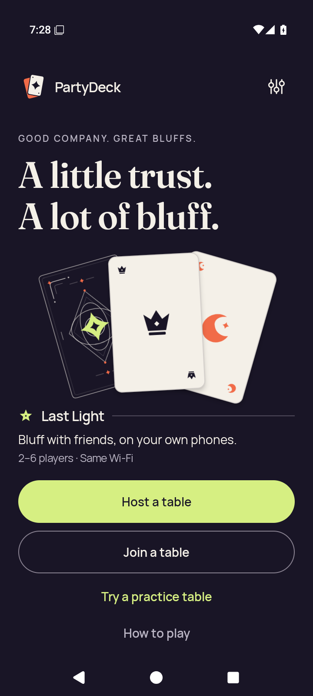</a> <code>2d-home-after-session-end.png</code> 2d-home-after-session-end — 2d.leave-end | 720 × 1600 px · 132,061 bytes SHA-256: <code>720dd906cdf685397da79ef5965762e877dba7d2701ff85a5f62f145152bb077</code> Source: <code>/root/projects/PartyDeck/artifacts/evidence-storage/34515669045/android-jvm-reports/build/ci/android/godot-session/optimized-test-signed/runtime/captures/2d-home-after-session-end.png</code> Capture: 2026-09-10T19:28:41.863+00:00 → 2026-09-10T19:28:44.201+00:00 [UI XML](runtime/captures/2d-home-after-session-end.xml) · [Capture JSON](runtime/captures/2d-home-after-session-end.json) · [Original result](runtime/godot-session-result.json) | **UNVIEWED original — no visual acceptance**. Original capture preserved without direct visual review. Source name, stage, timestamps and run outcome remain unchanged; no pixel observation or visual acceptance is asserted. |
|  <code>2d-home-resumed.png</code> 2d-home-resumed — 2d.home-interruption | 720 × 1600 px · 150,421 bytes SHA-256: <code>423c7334942b6d1961d46a51b13e2cb7449fe7615c7fbe7285ec62a531adf72d</code> Source: <code>/root/projects/PartyDeck/artifacts/evidence-storage/34515669045/android-jvm-reports/build/ci/android/godot-session/optimized-test-signed/runtime/captures/2d-home-resumed.png</code> Capture: 2026-09-10T19:25:29.660+00:00 → 2026-09-10T19:25:32.013+00:00 [UI XML](runtime/captures/2d-home-resumed.xml) · [Capture JSON](runtime/captures/2d-home-resumed.json) · [Original result](runtime/godot-session-result.json) | **UNVIEWED original — no visual acceptance**. Original capture preserved without direct visual review. Source name, stage, timestamps and run outcome remain unchanged; no pixel observation or visual acceptance is asserted. |
| <a href="runtime/captures/2d-home-system-ui.png">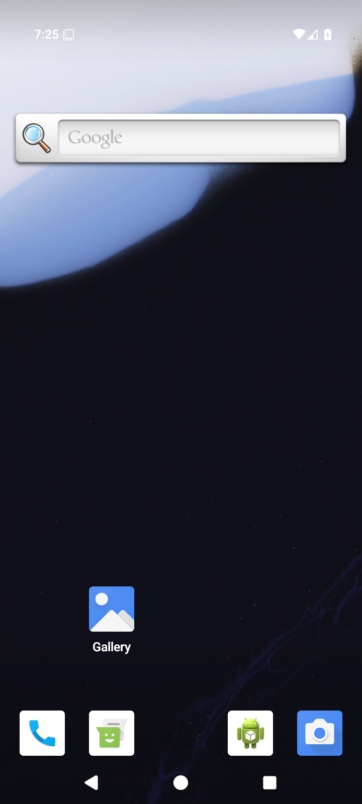</a> <code>2d-home-system-ui.png</code> 2d-home-system-ui — 2d.home-interruption | 720 × 1600 px · 746,382 bytes SHA-256: <code>1e5013675a95917011c8081c7ef990de94c7c576ae8e9c2ca885d0fca65bef4e</code> Source: <code>/root/projects/PartyDeck/artifacts/evidence-storage/34515669045/android-jvm-reports/build/ci/android/godot-session/optimized-test-signed/runtime/captures/2d-home-system-ui.png</code> Capture: 2026-09-10T19:25:24.047+00:00 → 2026-09-10T19:25:26.751+00:00 [UI XML](runtime/captures/2d-home-system-ui.xml) · [Capture JSON](runtime/captures/2d-home-system-ui.json) · [Original result](runtime/godot-session-result.json) | **UNVIEWED original — no visual acceptance**. Original capture preserved without direct visual review. Source name, stage, timestamps and run outcome remain unchanged; no pixel observation or visual acceptance is asserted. |
| <a href="runtime/captures/2d-leave-cancel-confirmation.png">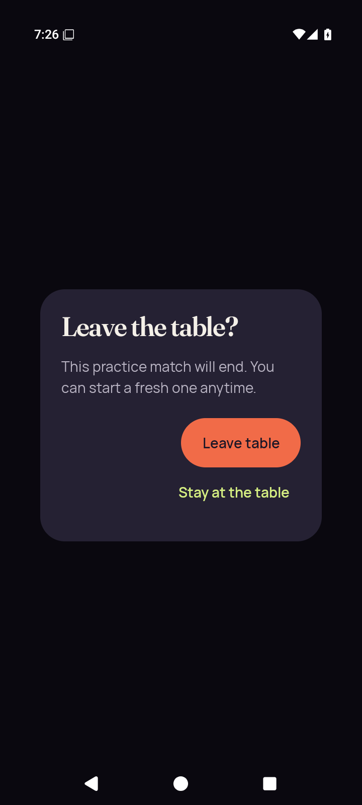</a> <code>2d-leave-cancel-confirmation.png</code> 2d-leave-cancel-confirmation — 2d.leave-cancel | 720 × 1600 px · 41,056 bytes SHA-256: <code>3cec1e5c77de269a67e52422dd9235356d5688de8575e266b50a269c008170bf</code> Source: <code>/root/projects/PartyDeck/artifacts/evidence-storage/34515669045/android-jvm-reports/build/ci/android/godot-session/optimized-test-signed/runtime/captures/2d-leave-cancel-confirmation.png</code> Capture: 2026-09-10T19:26:40.761+00:00 → 2026-09-10T19:26:43.098+00:00 [UI XML](runtime/captures/2d-leave-cancel-confirmation.xml) · [Capture JSON](runtime/captures/2d-leave-cancel-confirmation.json) · [Original result](runtime/godot-session-result.json) | **UNVIEWED original — no visual acceptance**. Original capture preserved without direct visual review. Source name, stage, timestamps and run outcome remain unchanged; no pixel observation or visual acceptance is asserted. |
| <a href="runtime/captures/2d-leave-cancel-native-ready.png">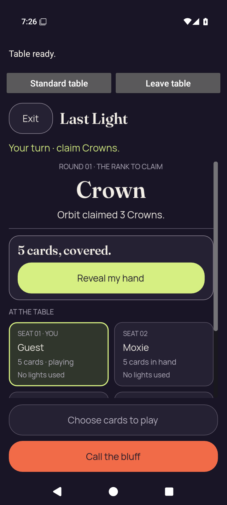</a> <code>2d-leave-cancel-native-ready.png</code> 2d-leave-cancel-native-ready — 2d.leave-cancel | 720 × 1600 px · 150,303 bytes SHA-256: <code>3db4a1173142da7ad5f49b0b19cf47ae43daf32cd8ac52badd28ca08136caa80</code> Source: <code>/root/projects/PartyDeck/artifacts/evidence-storage/34515669045/android-jvm-reports/build/ci/android/godot-session/optimized-test-signed/runtime/captures/2d-leave-cancel-native-ready.png</code> Capture: 2026-09-10T19:26:31.317+00:00 → 2026-09-10T19:26:33.658+00:00 [UI XML](runtime/captures/2d-leave-cancel-native-ready.xml) · [Capture JSON](runtime/captures/2d-leave-cancel-native-ready.json) · [Original result](runtime/godot-session-result.json) | **UNVIEWED original — no visual acceptance**. Original capture preserved without direct visual review. Source name, stage, timestamps and run outcome remain unchanged; no pixel observation or visual acceptance is asserted. |
|  <code>2d-leave-cancel-return-concealed.png</code> 2d-leave-cancel-return-concealed — 2d.leave-cancel | 720 × 1600 px · 131,394 bytes SHA-256: <code>e51c0ccb759caaf9b5a8884fabcd05ce59ccd43ac3d6ef1429ddedcfec5a0e4b</code> Source: <code>/root/projects/PartyDeck/artifacts/evidence-storage/34515669045/android-jvm-reports/build/ci/android/godot-session/optimized-test-signed/runtime/captures/2d-leave-cancel-return-concealed.png</code> Capture: 2026-09-10T19:26:49.431+00:00 → 2026-09-10T19:26:51.775+00:00 [UI XML](runtime/captures/2d-leave-cancel-return-concealed.xml) · [Capture JSON](runtime/captures/2d-leave-cancel-return-concealed.json) · [Original result](runtime/godot-session-result.json) | **UNVIEWED original — no visual acceptance**. Original capture preserved without direct visual review. Source name, stage, timestamps and run outcome remain unchanged; no pixel observation or visual acceptance is asserted. |
|  <code>2d-leave-cancel-return-first-card.png</code> 2d-leave-cancel-return-first-card — 2d.leave-cancel | 720 × 1600 px · 128,987 bytes SHA-256: <code>8e5d5b8a8b761e7fa4ad79712d0445c83cfcc532522359b62dbef5b639cd3593</code> Source: <code>/root/projects/PartyDeck/artifacts/evidence-storage/34515669045/android-jvm-reports/build/ci/android/godot-session/optimized-test-signed/runtime/captures/2d-leave-cancel-return-first-card.png</code> Capture: 2026-09-10T19:27:04.594+00:00 → 2026-09-10T19:27:06.946+00:00 [UI XML](runtime/captures/2d-leave-cancel-return-first-card.xml) · [Capture JSON](runtime/captures/2d-leave-cancel-return-first-card.json) · [Original result](runtime/godot-session-result.json) | **UNVIEWED original — no visual acceptance**. Original capture preserved without direct visual review. Source name, stage, timestamps and run outcome remain unchanged; no pixel observation or visual acceptance is asserted. |
|  <code>2d-leave-cancel-return-public.png</code> 2d-leave-cancel-return-public — 2d.leave-cancel | 720 × 1600 px · 130,852 bytes SHA-256: <code>12ec57ce17eaedbde7ee68f1354655fe67f4ff79bea5d9f3b703e24ef58a3b96</code> Source: <code>/root/projects/PartyDeck/artifacts/evidence-storage/34515669045/android-jvm-reports/build/ci/android/godot-session/optimized-test-signed/runtime/captures/2d-leave-cancel-return-public.png</code> Capture: 2026-09-10T19:26:58.158+00:00 → 2026-09-10T19:27:00.498+00:00 [UI XML](runtime/captures/2d-leave-cancel-return-public.xml) · [Capture JSON](runtime/captures/2d-leave-cancel-return-public.json) · [Original result](runtime/godot-session-result.json) | **UNVIEWED original — no visual acceptance**. Original capture preserved without direct visual review. Source name, stage, timestamps and run outcome remain unchanged; no pixel observation or visual acceptance is asserted. |
|  <code>2d-leave-cancel-return-selection-cleared.png</code> 2d-leave-cancel-return-selection-cleared — 2d.leave-cancel | 720 × 1600 px · 131,394 bytes SHA-256: <code>e51c0ccb759caaf9b5a8884fabcd05ce59ccd43ac3d6ef1429ddedcfec5a0e4b</code> Source: <code>/root/projects/PartyDeck/artifacts/evidence-storage/34515669045/android-jvm-reports/build/ci/android/godot-session/optimized-test-signed/runtime/captures/2d-leave-cancel-return-selection-cleared.png</code> Capture: 2026-09-10T19:26:53.800+00:00 → 2026-09-10T19:26:56.138+00:00 [UI XML](runtime/captures/2d-leave-cancel-return-selection-cleared.xml) · [Capture JSON](runtime/captures/2d-leave-cancel-return-selection-cleared.json) · [Original result](runtime/godot-session-result.json) | **UNVIEWED original — no visual acceptance**. Original capture preserved without direct visual review. Source name, stage, timestamps and run outcome remain unchanged; no pixel observation or visual acceptance is asserted. |
|  <code>2d-leave-cancel-selected.png</code> 2d-leave-cancel-selected — 2d.leave-cancel | 720 × 1600 px · 129,704 bytes SHA-256: <code>4ebcd683a9c5e149fb2d58274494f82e0b17b9c59662613b4f3c8b909fe66a0e</code> Source: <code>/root/projects/PartyDeck/artifacts/evidence-storage/34515669045/android-jvm-reports/build/ci/android/godot-session/optimized-test-signed/runtime/captures/2d-leave-cancel-selected.png</code> Capture: 2026-09-10T19:26:12.416+00:00 → 2026-09-10T19:26:14.756+00:00 [UI XML](runtime/captures/2d-leave-cancel-selected.xml) · [Capture JSON](runtime/captures/2d-leave-cancel-selected.json) · [Original result](runtime/godot-session-result.json) | **UNVIEWED original — no visual acceptance**. Original capture preserved without direct visual review. Source name, stage, timestamps and run outcome remain unchanged; no pixel observation or visual acceptance is asserted. |
| <a href="runtime/captures/2d-leave-cancel-selector.png">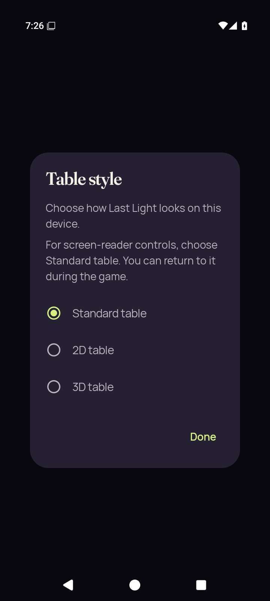</a> <code>2d-leave-cancel-selector.png</code> 2d-leave-cancel-selector — 2d.leave-cancel | 720 × 1600 px · 58,347 bytes SHA-256: <code>3c791e891164785e32ae265c22e899d35e909a889c9a669e61826186d3efe12e</code> Source: <code>/root/projects/PartyDeck/artifacts/evidence-storage/34515669045/android-jvm-reports/build/ci/android/godot-session/optimized-test-signed/runtime/captures/2d-leave-cancel-selector.png</code> Capture: 2026-09-10T19:26:21.268+00:00 → 2026-09-10T19:26:23.602+00:00 [UI XML](runtime/captures/2d-leave-cancel-selector.xml) · [Capture JSON](runtime/captures/2d-leave-cancel-selector.json) · [Original result](runtime/godot-session-result.json) | **UNVIEWED original — no visual acceptance**. Original capture preserved without direct visual review. Source name, stage, timestamps and run outcome remain unchanged; no pixel observation or visual acceptance is asserted. |
|  <code>2d-leave-end-confirmation.png</code> 2d-leave-end-confirmation — 2d.leave-end | 720 × 1600 px · 41,118 bytes SHA-256: <code>7df927af537c25ac3e211e0f0d9a2673b12c25ce10ecad4495c08494c30a7540</code> Source: <code>/root/projects/PartyDeck/artifacts/evidence-storage/34515669045/android-jvm-reports/build/ci/android/godot-session/optimized-test-signed/runtime/captures/2d-leave-end-confirmation.png</code> Capture: 2026-09-10T19:28:33.126+00:00 → 2026-09-10T19:28:35.452+00:00 [UI XML](runtime/captures/2d-leave-end-confirmation.xml) · [Capture JSON](runtime/captures/2d-leave-end-confirmation.json) · [Original result](runtime/godot-session-result.json) | **UNVIEWED original — no visual acceptance**. Original capture preserved without direct visual review. Source name, stage, timestamps and run outcome remain unchanged; no pixel observation or visual acceptance is asserted. |
|  <code>2d-leave-end-selector.png</code> 2d-leave-end-selector — 2d.leave-end | 720 × 1600 px · 58,383 bytes SHA-256: <code>972ddb894594f8444082d5c0dbda78d50a53752d0cfd7ea1e6e0cbdbdf77bca0</code> Source: <code>/root/projects/PartyDeck/artifacts/evidence-storage/34515669045/android-jvm-reports/build/ci/android/godot-session/optimized-test-signed/runtime/captures/2d-leave-end-selector.png</code> Capture: 2026-09-10T19:28:20.498+00:00 → 2026-09-10T19:28:22.833+00:00 [UI XML](runtime/captures/2d-leave-end-selector.xml) · [Capture JSON](runtime/captures/2d-leave-end-selector.json) · [Original result](runtime/godot-session-result.json) | **UNVIEWED original — no visual acceptance**. Original capture preserved without direct visual review. Source name, stage, timestamps and run outcome remain unchanged; no pixel observation or visual acceptance is asserted. |
|  <code>2d-recents-resumed.png</code> 2d-recents-resumed — 2d.recents-interruption | 720 × 1600 px · 150,421 bytes SHA-256: <code>423c7334942b6d1961d46a51b13e2cb7449fe7615c7fbe7285ec62a531adf72d</code> Source: <code>/root/projects/PartyDeck/artifacts/evidence-storage/34515669045/android-jvm-reports/build/ci/android/godot-session/optimized-test-signed/runtime/captures/2d-recents-resumed.png</code> Capture: 2026-09-10T19:25:39.369+00:00 → 2026-09-10T19:25:41.721+00:00 [UI XML](runtime/captures/2d-recents-resumed.xml) · [Capture JSON](runtime/captures/2d-recents-resumed.json) · [Original result](runtime/godot-session-result.json) | **UNVIEWED original — no visual acceptance**. Original capture preserved without direct visual review. Source name, stage, timestamps and run outcome remain unchanged; no pixel observation or visual acceptance is asserted. |
| <a href="runtime/captures/2d-recents-system-ui.png">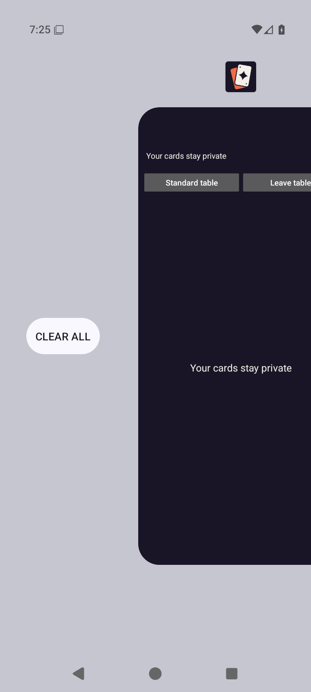</a> <code>2d-recents-system-ui.png</code> 2d-recents-system-ui — 2d.recents-interruption | 720 × 1600 px · 40,511 bytes SHA-256: <code>ddbc0695672617a5746e034ff2b0062602d4ee10b8736ac5b3e7c40ca12ef35f</code> Source: <code>/root/projects/PartyDeck/artifacts/evidence-storage/34515669045/android-jvm-reports/build/ci/android/godot-session/optimized-test-signed/runtime/captures/2d-recents-system-ui.png</code> Capture: 2026-09-10T19:25:34.508+00:00 → 2026-09-10T19:25:36.854+00:00 [UI XML](runtime/captures/2d-recents-system-ui.xml) · [Capture JSON](runtime/captures/2d-recents-system-ui.json) · [Original result](runtime/godot-session-result.json) | **UNVIEWED original — no visual acceptance**. Original capture preserved without direct visual review. Source name, stage, timestamps and run outcome remain unchanged; no pixel observation or visual acceptance is asserted. |
|  <code>2d-standard-concealed.png</code> 2d-standard-concealed — 2d.standard-return | 720 × 1600 px · 131,392 bytes SHA-256: <code>732ac94dce15ca3c8a0bf0f1c68ed0d885d7331e8c3119573947639f1ca30164</code> Source: <code>/root/projects/PartyDeck/artifacts/evidence-storage/34515669045/android-jvm-reports/build/ci/android/godot-session/optimized-test-signed/runtime/captures/2d-standard-concealed.png</code> Capture: 2026-09-10T19:25:48.719+00:00 → 2026-09-10T19:25:51.061+00:00 [UI XML](runtime/captures/2d-standard-concealed.xml) · [Capture JSON](runtime/captures/2d-standard-concealed.json) · [Original result](runtime/godot-session-result.json) | **UNVIEWED original — no visual acceptance**. Original capture preserved without direct visual review. Source name, stage, timestamps and run outcome remain unchanged; no pixel observation or visual acceptance is asserted. |
|  <code>2d-standard-first-card.png</code> 2d-standard-first-card — 2d.standard-return | 720 × 1600 px · 129,435 bytes SHA-256: <code>f3d1dce9a406b0ae8d75564c8f34c6515048d0a821b078199e97a7fcaeda7e65</code> Source: <code>/root/projects/PartyDeck/artifacts/evidence-storage/34515669045/android-jvm-reports/build/ci/android/godot-session/optimized-test-signed/runtime/captures/2d-standard-first-card.png</code> Capture: 2026-09-10T19:26:03.885+00:00 → 2026-09-10T19:26:06.228+00:00 [UI XML](runtime/captures/2d-standard-first-card.xml) · [Capture JSON](runtime/captures/2d-standard-first-card.json) · [Original result](runtime/godot-session-result.json) | **UNVIEWED original — no visual acceptance**. Original capture preserved without direct visual review. Source name, stage, timestamps and run outcome remain unchanged; no pixel observation or visual acceptance is asserted. |
| <a href="runtime/captures/2d-standard-play-after-play.png">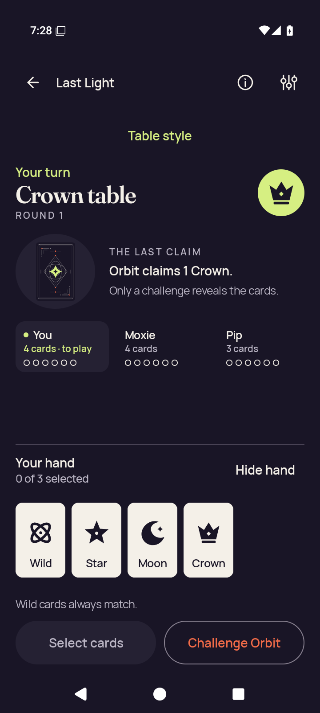</a> <code>2d-standard-play-after-play.png</code> 2d-standard-play-after-play — 2d.standard-action | 720 × 1600 px · 117,162 bytes SHA-256: <code>4c2652db7d2c338c42c08cbf2ac43390178e6b903db9d2a8780f70e0fdea15b6</code> Source: <code>/root/projects/PartyDeck/artifacts/evidence-storage/34515669045/android-jvm-reports/build/ci/android/godot-session/optimized-test-signed/runtime/captures/2d-standard-play-after-play.png</code> Capture: 2026-09-10T19:28:11.659+00:00 → 2026-09-10T19:28:14.005+00:00 [UI XML](runtime/captures/2d-standard-play-after-play.xml) · [Capture JSON](runtime/captures/2d-standard-play-after-play.json) · [Original result](runtime/godot-session-result.json) | **UNVIEWED original — no visual acceptance**. Original capture preserved without direct visual review. Source name, stage, timestamps and run outcome remain unchanged; no pixel observation or visual acceptance is asserted. |
| <a href="runtime/captures/2d-standard-play-selected.png">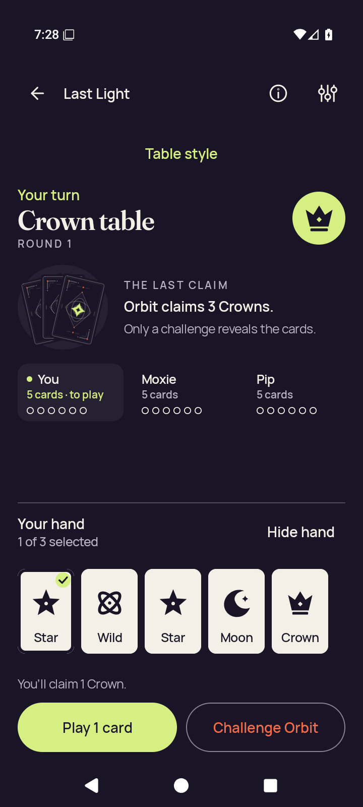</a> <code>2d-standard-play-selected.png</code> 2d-standard-play-selected — 2d.standard-action | 720 × 1600 px · 129,911 bytes SHA-256: <code>5d7d50f7eccb403a3dea8e8ee8360bec246227dd1d24d448d189948953ae080c</code> Source: <code>/root/projects/PartyDeck/artifacts/evidence-storage/34515669045/android-jvm-reports/build/ci/android/godot-session/optimized-test-signed/runtime/captures/2d-standard-play-selected.png</code> Capture: 2026-09-10T19:28:05.104+00:00 → 2026-09-10T19:28:07.441+00:00 [UI XML](runtime/captures/2d-standard-play-selected.xml) · [Capture JSON](runtime/captures/2d-standard-play-selected.json) · [Original result](runtime/godot-session-result.json) | **UNVIEWED original — no visual acceptance**. Original capture preserved without direct visual review. Source name, stage, timestamps and run outcome remain unchanged; no pixel observation or visual acceptance is asserted. |
|  <code>2d-standard-public.png</code> 2d-standard-public — 2d.standard-return | 720 × 1600 px · 131,392 bytes SHA-256: <code>732ac94dce15ca3c8a0bf0f1c68ed0d885d7331e8c3119573947639f1ca30164</code> Source: <code>/root/projects/PartyDeck/artifacts/evidence-storage/34515669045/android-jvm-reports/build/ci/android/godot-session/optimized-test-signed/runtime/captures/2d-standard-public.png</code> Capture: 2026-09-10T19:25:57.442+00:00 → 2026-09-10T19:25:59.782+00:00 [UI XML](runtime/captures/2d-standard-public.xml) · [Capture JSON](runtime/captures/2d-standard-public.json) · [Original result](runtime/godot-session-result.json) | **UNVIEWED original — no visual acceptance**. Original capture preserved without direct visual review. Source name, stage, timestamps and run outcome remain unchanged; no pixel observation or visual acceptance is asserted. |
|  <code>2d-standard-selection-cleared.png</code> 2d-standard-selection-cleared — 2d.standard-return | 720 × 1600 px · 131,392 bytes SHA-256: <code>732ac94dce15ca3c8a0bf0f1c68ed0d885d7331e8c3119573947639f1ca30164</code> Source: <code>/root/projects/PartyDeck/artifacts/evidence-storage/34515669045/android-jvm-reports/build/ci/android/godot-session/optimized-test-signed/runtime/captures/2d-standard-selection-cleared.png</code> Capture: 2026-09-10T19:25:53.083+00:00 → 2026-09-10T19:25:55.417+00:00 [UI XML](runtime/captures/2d-standard-selection-cleared.xml) · [Capture JSON](runtime/captures/2d-standard-selection-cleared.json) · [Original result](runtime/godot-session-result.json) | **UNVIEWED original — no visual acceptance**. Original capture preserved without direct visual review. Source name, stage, timestamps and run outcome remain unchanged; no pixel observation or visual acceptance is asserted. |
|  <code>3d-action-entry-native-ready.png</code> 3d-action-entry-native-ready — 3d.standard-action | 720 × 1600 px · 185,511 bytes SHA-256: <code>11029690a1867fb3fb48472987d1812c2f62115a35d86471ea8813857965af1a</code> Source: <code>/root/projects/PartyDeck/artifacts/evidence-storage/34515669045/android-jvm-reports/build/ci/android/godot-session/optimized-test-signed/runtime/captures/3d-action-entry-native-ready.png</code> Capture: 2026-09-10T19:35:55.601+00:00 → 2026-09-10T19:35:57.965+00:00 [UI XML](runtime/captures/3d-action-entry-native-ready.xml) · [Capture JSON](runtime/captures/3d-action-entry-native-ready.json) · [Original result](runtime/godot-session-result.json) | **UNVIEWED original — no visual acceptance**. Original capture preserved without direct visual review. Source name, stage, timestamps and run outcome remain unchanged; no pixel observation or visual acceptance is asserted. |
|  <code>3d-action-entry-selected.png</code> 3d-action-entry-selected — 3d.standard-action | 720 × 1600 px · 102,466 bytes SHA-256: <code>d66ceaffeb3c02d8fdc89b0ceab92488419c5b5331070f45d3c4fc21043dec7a</code> Source: <code>/root/projects/PartyDeck/artifacts/evidence-storage/34515669045/android-jvm-reports/build/ci/android/godot-session/optimized-test-signed/runtime/captures/3d-action-entry-selected.png</code> Capture: 2026-09-10T19:35:36.125+00:00 → 2026-09-10T19:35:38.467+00:00 [UI XML](runtime/captures/3d-action-entry-selected.xml) · [Capture JSON](runtime/captures/3d-action-entry-selected.json) · [Original result](runtime/godot-session-result.json) | **UNVIEWED original — no visual acceptance**. Original capture preserved without direct visual review. Source name, stage, timestamps and run outcome remain unchanged; no pixel observation or visual acceptance is asserted. |
| <a href="runtime/captures/3d-action-entry-selector.png">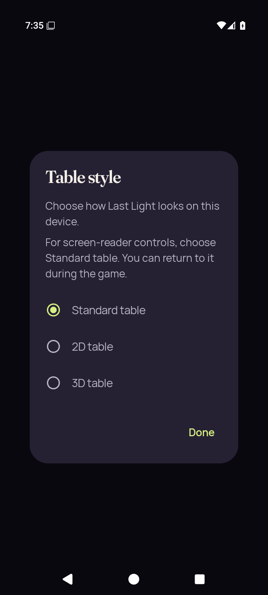</a> <code>3d-action-entry-selector.png</code> 3d-action-entry-selector — 3d.standard-action | 720 × 1600 px · 58,526 bytes SHA-256: <code>0755802366eeb469a09080a9f854ada258043e4d2887b1e50da0d984303ab048</code> Source: <code>/root/projects/PartyDeck/artifacts/evidence-storage/34515669045/android-jvm-reports/build/ci/android/godot-session/optimized-test-signed/runtime/captures/3d-action-entry-selector.png</code> Capture: 2026-09-10T19:35:44.872+00:00 → 2026-09-10T19:35:47.218+00:00 [UI XML](runtime/captures/3d-action-entry-selector.xml) · [Capture JSON](runtime/captures/3d-action-entry-selector.json) · [Original result](runtime/godot-session-result.json) | **UNVIEWED original — no visual acceptance**. Original capture preserved without direct visual review. Source name, stage, timestamps and run outcome remain unchanged; no pixel observation or visual acceptance is asserted. |
|  <code>3d-action-return-concealed.png</code> 3d-action-return-concealed — 3d.standard-action | 720 × 1600 px · 108,735 bytes SHA-256: <code>83277ef6548b191fdb822e4bbda1c592251f0d215b1cccaac346d3e5dc3009c8</code> Source: <code>/root/projects/PartyDeck/artifacts/evidence-storage/34515669045/android-jvm-reports/build/ci/android/godot-session/optimized-test-signed/runtime/captures/3d-action-return-concealed.png</code> Capture: 2026-09-10T19:36:04.921+00:00 → 2026-09-10T19:36:07.254+00:00 [UI XML](runtime/captures/3d-action-return-concealed.xml) · [Capture JSON](runtime/captures/3d-action-return-concealed.json) · [Original result](runtime/godot-session-result.json) | **UNVIEWED original — no visual acceptance**. Original capture preserved without direct visual review. Source name, stage, timestamps and run outcome remain unchanged; no pixel observation or visual acceptance is asserted. |
|  <code>3d-action-return-first-card.png</code> 3d-action-return-first-card — 3d.standard-action | 720 × 1600 px · 103,134 bytes SHA-256: <code>8f8513ad5fee6754549a8efbd22d291b702541a99ff0dc0d0ee2d2b7d7136f3a</code> Source: <code>/root/projects/PartyDeck/artifacts/evidence-storage/34515669045/android-jvm-reports/build/ci/android/godot-session/optimized-test-signed/runtime/captures/3d-action-return-first-card.png</code> Capture: 2026-09-10T19:36:20.086+00:00 → 2026-09-10T19:36:22.418+00:00 [UI XML](runtime/captures/3d-action-return-first-card.xml) · [Capture JSON](runtime/captures/3d-action-return-first-card.json) · [Original result](runtime/godot-session-result.json) | **UNVIEWED original — no visual acceptance**. Original capture preserved without direct visual review. Source name, stage, timestamps and run outcome remain unchanged; no pixel observation or visual acceptance is asserted. |
|  <code>3d-action-return-public.png</code> 3d-action-return-public — 3d.standard-action | 720 × 1600 px · 108,735 bytes SHA-256: <code>83277ef6548b191fdb822e4bbda1c592251f0d215b1cccaac346d3e5dc3009c8</code> Source: <code>/root/projects/PartyDeck/artifacts/evidence-storage/34515669045/android-jvm-reports/build/ci/android/godot-session/optimized-test-signed/runtime/captures/3d-action-return-public.png</code> Capture: 2026-09-10T19:36:13.634+00:00 → 2026-09-10T19:36:15.954+00:00 [UI XML](runtime/captures/3d-action-return-public.xml) · [Capture JSON](runtime/captures/3d-action-return-public.json) · [Original result](runtime/godot-session-result.json) | **UNVIEWED original — no visual acceptance**. Original capture preserved without direct visual review. Source name, stage, timestamps and run outcome remain unchanged; no pixel observation or visual acceptance is asserted. |
|  <code>3d-action-return-selection-cleared.png</code> 3d-action-return-selection-cleared — 3d.standard-action | 720 × 1600 px · 108,735 bytes SHA-256: <code>83277ef6548b191fdb822e4bbda1c592251f0d215b1cccaac346d3e5dc3009c8</code> Source: <code>/root/projects/PartyDeck/artifacts/evidence-storage/34515669045/android-jvm-reports/build/ci/android/godot-session/optimized-test-signed/runtime/captures/3d-action-return-selection-cleared.png</code> Capture: 2026-09-10T19:36:09.273+00:00 → 2026-09-10T19:36:11.606+00:00 [UI XML](runtime/captures/3d-action-return-selection-cleared.xml) · [Capture JSON](runtime/captures/3d-action-return-selection-cleared.json) · [Original result](runtime/godot-session-result.json) | **UNVIEWED original — no visual acceptance**. Original capture preserved without direct visual review. Source name, stage, timestamps and run outcome remain unchanged; no pixel observation or visual acceptance is asserted. |
|  <code>3d-baseline-first-card.png</code> 3d-baseline-first-card — 3d.practice-baseline | 720 × 1600 px · 102,726 bytes SHA-256: <code>c7e03881def85147292243f5b308d2926ee0c66b0d27576b330f4d6c75e8954a</code> Source: <code>/root/projects/PartyDeck/artifacts/evidence-storage/34515669045/android-jvm-reports/build/ci/android/godot-session/optimized-test-signed/runtime/captures/3d-baseline-first-card.png</code> Capture: 2026-09-10T19:31:36.520+00:00 → 2026-09-10T19:31:38.857+00:00 [UI XML](runtime/captures/3d-baseline-first-card.xml) · [Capture JSON](runtime/captures/3d-baseline-first-card.json) · [Original result](runtime/godot-session-result.json) | **UNVIEWED original — no visual acceptance**. Original capture preserved without direct visual review. Source name, stage, timestamps and run outcome remain unchanged; no pixel observation or visual acceptance is asserted. |
| <a href="runtime/captures/3d-baseline-public.png">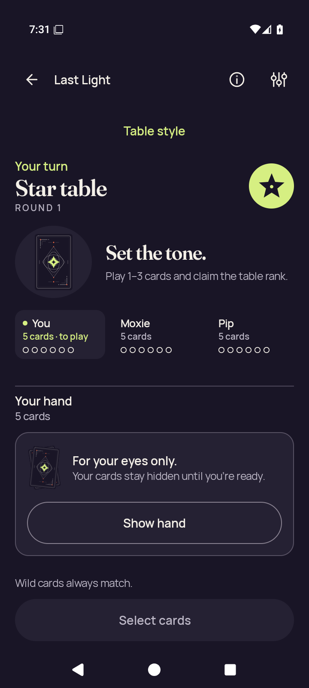</a> <code>3d-baseline-public.png</code> 3d-baseline-public — 3d.practice-baseline | 720 × 1600 px · 108,404 bytes SHA-256: <code>dcbd0444e2f0e8ddfee464bfbd9349ebfffc786132041b3a0d4786e2f9bbf08b</code> Source: <code>/root/projects/PartyDeck/artifacts/evidence-storage/34515669045/android-jvm-reports/build/ci/android/godot-session/optimized-test-signed/runtime/captures/3d-baseline-public.png</code> Capture: 2026-09-10T19:31:30.097+00:00 → 2026-09-10T19:31:32.425+00:00 [UI XML](runtime/captures/3d-baseline-public.xml) · [Capture JSON](runtime/captures/3d-baseline-public.json) · [Original result](runtime/godot-session-result.json) | **UNVIEWED original — no visual acceptance**. Original capture preserved without direct visual review. Source name, stage, timestamps and run outcome remain unchanged; no pixel observation or visual acceptance is asserted. |
|  <code>3d-baseline-selected.png</code> 3d-baseline-selected — 3d.standard-hand | 720 × 1600 px · 101,995 bytes SHA-256: <code>492d026e60ef96679d66f52793a5f374eb7b13cb9f32c08eb06fee865daf6574</code> Source: <code>/root/projects/PartyDeck/artifacts/evidence-storage/34515669045/android-jvm-reports/build/ci/android/godot-session/optimized-test-signed/runtime/captures/3d-baseline-selected.png</code> Capture: 2026-09-10T19:33:21.094+00:00 → 2026-09-10T19:33:23.437+00:00 [UI XML](runtime/captures/3d-baseline-selected.xml) · [Capture JSON](runtime/captures/3d-baseline-selected.json) · [Original result](runtime/godot-session-result.json) | **UNVIEWED original — no visual acceptance**. Original capture preserved without direct visual review. Source name, stage, timestamps and run outcome remain unchanged; no pixel observation or visual acceptance is asserted. |
| <a href="runtime/captures/3d-engine-baseline-first-card.png">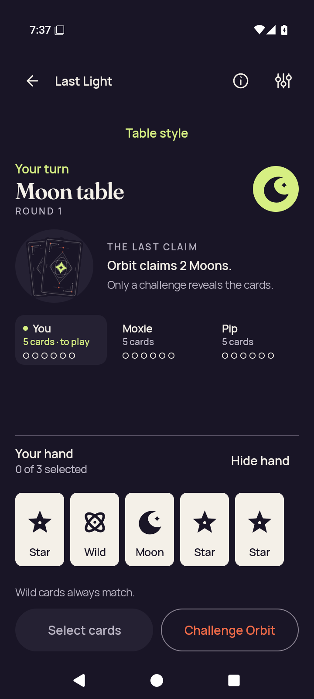</a> <code>3d-engine-baseline-first-card.png</code> 3d-engine-baseline-first-card — 3d.engine-practice-baseline | 720 × 1600 px · 124,143 bytes SHA-256: <code>29fd51f8b891fb741e7c9d4ff46988f3cf58b0c570956ef841a06f1d1e6c202d</code> Source: <code>/root/projects/PartyDeck/artifacts/evidence-storage/34515669045/android-jvm-reports/build/ci/android/godot-session/optimized-test-signed/runtime/captures/3d-engine-baseline-first-card.png</code> Capture: 2026-09-10T19:37:25.341+00:00 → 2026-09-10T19:37:27.689+00:00 [UI XML](runtime/captures/3d-engine-baseline-first-card.xml) · [Capture JSON](runtime/captures/3d-engine-baseline-first-card.json) · [Original result](runtime/godot-session-result.json) | **UNVIEWED original — no visual acceptance**. Original capture preserved without direct visual review. Source name, stage, timestamps and run outcome remain unchanged; no pixel observation or visual acceptance is asserted. |
| <a href="runtime/captures/3d-engine-baseline-public.png">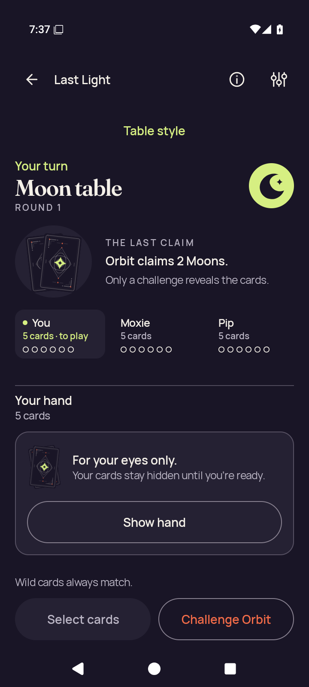</a> <code>3d-engine-baseline-public.png</code> 3d-engine-baseline-public — 3d.engine-practice-baseline | 720 × 1600 px · 127,579 bytes SHA-256: <code>9e2b6d327075d8dc1348f541e1241f514401b0b143d0fd5e1e926080d3225ba7</code> Source: <code>/root/projects/PartyDeck/artifacts/evidence-storage/34515669045/android-jvm-reports/build/ci/android/godot-session/optimized-test-signed/runtime/captures/3d-engine-baseline-public.png</code> Capture: 2026-09-10T19:37:18.915+00:00 → 2026-09-10T19:37:21.254+00:00 [UI XML](runtime/captures/3d-engine-baseline-public.xml) · [Capture JSON](runtime/captures/3d-engine-baseline-public.json) · [Original result](runtime/godot-session-result.json) | **UNVIEWED original — no visual acceptance**. Original capture preserved without direct visual review. Source name, stage, timestamps and run outcome remain unchanged; no pixel observation or visual acceptance is asserted. |
| <a href="runtime/captures/3d-engine-entry-native-ready.png">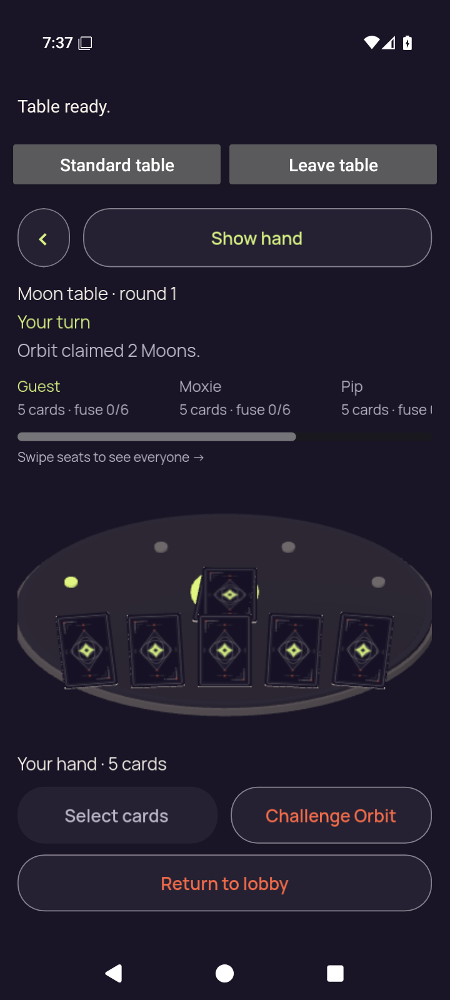</a> <code>3d-engine-entry-native-ready.png</code> 3d-engine-entry-native-ready — 3d.engine-reveal-selection | 720 × 1600 px · 187,554 bytes SHA-256: <code>17ec4b40c59e6705e564b4a909f49d10bdcc4c650616cc6d8fa2b6a26cc26f44</code> Source: <code>/root/projects/PartyDeck/artifacts/evidence-storage/34515669045/android-jvm-reports/build/ci/android/godot-session/optimized-test-signed/runtime/captures/3d-engine-entry-native-ready.png</code> Capture: 2026-09-10T19:37:53.196+00:00 → 2026-09-10T19:37:55.561+00:00 [UI XML](runtime/captures/3d-engine-entry-native-ready.xml) · [Capture JSON](runtime/captures/3d-engine-entry-native-ready.json) · [Original result](runtime/godot-session-result.json) | **UNVIEWED original — no visual acceptance**. Original capture preserved without direct visual review. Source name, stage, timestamps and run outcome remain unchanged; no pixel observation or visual acceptance is asserted. |
|  <code>3d-engine-entry-selector.png</code> 3d-engine-entry-selector — 3d.engine-reveal-selection | 720 × 1600 px · 58,013 bytes SHA-256: <code>4ce60fa5112e10bda2cb804bcd4d29071e09b8db9af4a12ce7e815e6018a6ade</code> Source: <code>/root/projects/PartyDeck/artifacts/evidence-storage/34515669045/android-jvm-reports/build/ci/android/godot-session/optimized-test-signed/runtime/captures/3d-engine-entry-selector.png</code> Capture: 2026-09-10T19:37:42.230+00:00 → 2026-09-10T19:37:44.576+00:00 [UI XML](runtime/captures/3d-engine-entry-selector.xml) · [Capture JSON](runtime/captures/3d-engine-entry-selector.json) · [Original result](runtime/godot-session-result.json) | **UNVIEWED original — no visual acceptance**. Original capture preserved without direct visual review. Source name, stage, timestamps and run outcome remain unchanged; no pixel observation or visual acceptance is asserted. |
|  <code>3d-engine-home.png</code> 3d-engine-home — 3d.engine-leave-end | 720 × 1600 px · 132,285 bytes SHA-256: <code>71483f994c0e94b8a73926fc990863a3880f12d5077e61796d424f13dc830ad7</code> Source: <code>/root/projects/PartyDeck/artifacts/evidence-storage/34515669045/android-jvm-reports/build/ci/android/godot-session/optimized-test-signed/runtime/captures/3d-engine-home.png</code> Capture: 2026-09-10T19:39:51.980+00:00 → 2026-09-10T19:39:54.305+00:00 [UI XML](runtime/captures/3d-engine-home.xml) · [Capture JSON](runtime/captures/3d-engine-home.json) · [Original result](runtime/godot-session-result.json) | **UNVIEWED original — no visual acceptance**. Original capture preserved without direct visual review. Source name, stage, timestamps and run outcome remain unchanged; no pixel observation or visual acceptance is asserted. |
|  <code>3d-engine-leave-confirmation.png</code> 3d-engine-leave-confirmation — 3d.engine-leave-end | 720 × 1600 px · 41,230 bytes SHA-256: <code>f13d67cb9deee7307a4ca4ffd218605145f5da57c890cf71e9e7b0bed9ebfd50</code> Source: <code>/root/projects/PartyDeck/artifacts/evidence-storage/34515669045/android-jvm-reports/build/ci/android/godot-session/optimized-test-signed/runtime/captures/3d-engine-leave-confirmation.png</code> Capture: 2026-09-10T19:39:43.345+00:00 → 2026-09-10T19:39:45.674+00:00 [UI XML](runtime/captures/3d-engine-leave-confirmation.xml) · [Capture JSON](runtime/captures/3d-engine-leave-confirmation.json) · [Original result](runtime/godot-session-result.json) | **UNVIEWED original — no visual acceptance**. Original capture preserved without direct visual review. Source name, stage, timestamps and run outcome remain unchanged; no pixel observation or visual acceptance is asserted. |
|  <code>3d-engine-leave-selector.png</code> 3d-engine-leave-selector — 3d.engine-leave-end | 720 × 1600 px · 58,462 bytes SHA-256: <code>180a35532c22ce1695c82a37298f99c5ca3cc6ec7c0e58f8afc5f0a97158d252</code> Source: <code>/root/projects/PartyDeck/artifacts/evidence-storage/34515669045/android-jvm-reports/build/ci/android/godot-session/optimized-test-signed/runtime/captures/3d-engine-leave-selector.png</code> Capture: 2026-09-10T19:39:27.679+00:00 → 2026-09-10T19:39:30.016+00:00 [UI XML](runtime/captures/3d-engine-leave-selector.xml) · [Capture JSON](runtime/captures/3d-engine-leave-selector.json) · [Original result](runtime/godot-session-result.json) | **UNVIEWED original — no visual acceptance**. Original capture preserved without direct visual review. Source name, stage, timestamps and run outcome remain unchanged; no pixel observation or visual acceptance is asserted. |
| <a href="runtime/captures/3d-engine-selected.png">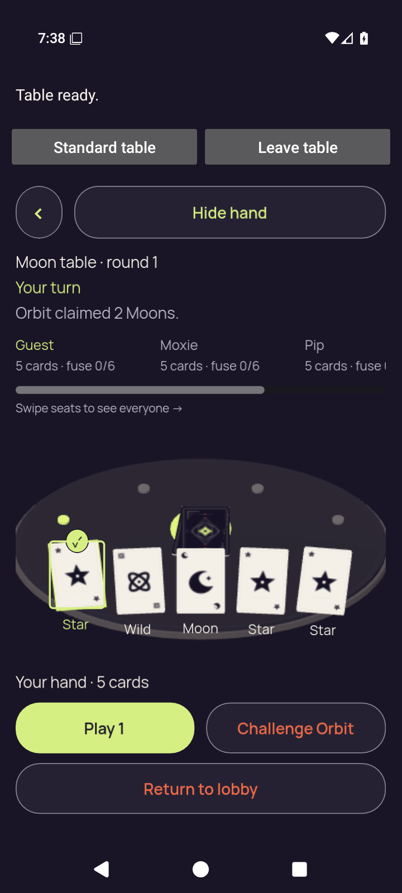</a> <code>3d-engine-selected.png</code> 3d-engine-selected — 3d.engine-reveal-selection | 720 × 1600 px · 180,227 bytes SHA-256: <code>c737090268c222adf2e11cd2ce7caa6659605e1fcd1d95de35115507f36f0f97</code> Source: <code>/root/projects/PartyDeck/artifacts/evidence-storage/34515669045/android-jvm-reports/build/ci/android/godot-session/optimized-test-signed/runtime/captures/3d-engine-selected.png</code> Capture: 2026-09-10T19:38:43.660+00:00 → 2026-09-10T19:38:46.017+00:00 [UI XML](runtime/captures/3d-engine-selected.xml) · [Capture JSON](runtime/captures/3d-engine-selected.json) · [Original result](runtime/godot-session-result.json) | **UNVIEWED original — no visual acceptance**. Original capture preserved without direct visual review. Source name, stage, timestamps and run outcome remain unchanged; no pixel observation or visual acceptance is asserted. |
| <a href="runtime/captures/3d-engine-standard-after-play.png">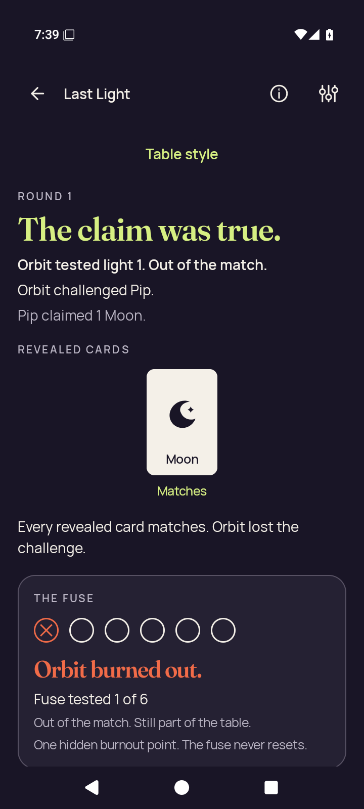</a> <code>3d-engine-standard-after-play.png</code> 3d-engine-standard-after-play — 3d.engine-play-standard-outcome | 720 × 1600 px · 99,441 bytes SHA-256: <code>64fb8b175a7824b3e0329e93edcb26faef4f94c4e49bf15522dfa92b30b9e5c1</code> Source: <code>/root/projects/PartyDeck/artifacts/evidence-storage/34515669045/android-jvm-reports/build/ci/android/godot-session/optimized-test-signed/runtime/captures/3d-engine-standard-after-play.png</code> Capture: 2026-09-10T19:39:18.960+00:00 → 2026-09-10T19:39:21.303+00:00 [UI XML](runtime/captures/3d-engine-standard-after-play.xml) · [Capture JSON](runtime/captures/3d-engine-standard-after-play.json) · [Original result](runtime/godot-session-result.json) | **Direct original view**. Optimized 3D shows Round 1, The claim was true, Orbit tested light 1 and is out of the match, Orbit challenged Pip, and Pip claimed 1 Moon. The public Moon card is marked Matches. The lower fuse panel says Orbit burned out and Fuse tested 1 of 6, followed by the out-of-match/table copy; its lower border reaches the body clip. Continuation actions are below the viewport. The public result card and explanatory copy are readable. No remaining private-hand layout is shown, and no visible five-to-four hand claim is made. The source audit identifies this as a same-round public result relative to its recorded baseline, not proof of a completed match or continuous privacy. |
|  <code>3d-entry-native-ready.png</code> 3d-entry-native-ready — 3d.native-entry | 720 × 1600 px · 185,010 bytes SHA-256: <code>cad15f8493585fc5c176b4795e00e0bbff71545898fee9b4df793d19ec117a3b</code> Source: <code>/root/projects/PartyDeck/artifacts/evidence-storage/34515669045/android-jvm-reports/build/ci/android/godot-session/optimized-test-signed/runtime/captures/3d-entry-native-ready.png</code> Capture: 2026-09-10T19:33:40.645+00:00 → 2026-09-10T19:33:43.000+00:00 [UI XML](runtime/captures/3d-entry-native-ready.xml) · [Capture JSON](runtime/captures/3d-entry-native-ready.json) · [Original result](runtime/godot-session-result.json) | **UNVIEWED original — no visual acceptance**. Original capture preserved without direct visual review. Source name, stage, timestamps and run outcome remain unchanged; no pixel observation or visual acceptance is asserted. |
|  <code>3d-entry-selector.png</code> 3d-entry-selector — 3d.native-entry | 720 × 1600 px · 58,043 bytes SHA-256: <code>4e2e70cfbf509e76ff7be9d6adbde4105eac0c0afabd06bb378f51fdc861b08d</code> Source: <code>/root/projects/PartyDeck/artifacts/evidence-storage/34515669045/android-jvm-reports/build/ci/android/godot-session/optimized-test-signed/runtime/captures/3d-entry-selector.png</code> Capture: 2026-09-10T19:33:29.848+00:00 → 2026-09-10T19:33:32.185+00:00 [UI XML](runtime/captures/3d-entry-selector.xml) · [Capture JSON](runtime/captures/3d-entry-selector.json) · [Original result](runtime/godot-session-result.json) | **UNVIEWED original — no visual acceptance**. Original capture preserved without direct visual review. Source name, stage, timestamps and run outcome remain unchanged; no pixel observation or visual acceptance is asserted. |
|  <code>3d-home-after-session-end.png</code> 3d-home-after-session-end — 3d.leave-end | 720 × 1600 px · 131,642 bytes SHA-256: <code>8b298ca40285e98b5204e092fd16e10459290662be2f36165d492c45428ea59a</code> Source: <code>/root/projects/PartyDeck/artifacts/evidence-storage/34515669045/android-jvm-reports/build/ci/android/godot-session/optimized-test-signed/runtime/captures/3d-home-after-session-end.png</code> Capture: 2026-09-10T19:37:06.350+00:00 → 2026-09-10T19:37:08.690+00:00 [UI XML](runtime/captures/3d-home-after-session-end.xml) · [Capture JSON](runtime/captures/3d-home-after-session-end.json) · [Original result](runtime/godot-session-result.json) | **UNVIEWED original — no visual acceptance**. Original capture preserved without direct visual review. Source name, stage, timestamps and run outcome remain unchanged; no pixel observation or visual acceptance is asserted. |
|  <code>3d-home-resumed.png</code> 3d-home-resumed — 3d.home-interruption | 720 × 1600 px · 185,025 bytes SHA-256: <code>30a799aab0c7e6f3e2d2181738518c36b570f1fd51386bb52e80f6f385c2b5e3</code> Source: <code>/root/projects/PartyDeck/artifacts/evidence-storage/34515669045/android-jvm-reports/build/ci/android/godot-session/optimized-test-signed/runtime/captures/3d-home-resumed.png</code> Capture: 2026-09-10T19:33:51.331+00:00 → 2026-09-10T19:33:53.696+00:00 [UI XML](runtime/captures/3d-home-resumed.xml) · [Capture JSON](runtime/captures/3d-home-resumed.json) · [Original result](runtime/godot-session-result.json) | **UNVIEWED original — no visual acceptance**. Original capture preserved without direct visual review. Source name, stage, timestamps and run outcome remain unchanged; no pixel observation or visual acceptance is asserted. |
|  <code>3d-home-system-ui.png</code> 3d-home-system-ui — 3d.home-interruption | 720 × 1600 px · 746,357 bytes SHA-256: <code>677775cd4697ad34c9a3c4325ccae63602bd826df4995c8705658169de6ec910</code> Source: <code>/root/projects/PartyDeck/artifacts/evidence-storage/34515669045/android-jvm-reports/build/ci/android/godot-session/optimized-test-signed/runtime/captures/3d-home-system-ui.png</code> Capture: 2026-09-10T19:33:45.615+00:00 → 2026-09-10T19:33:48.306+00:00 [UI XML](runtime/captures/3d-home-system-ui.xml) · [Capture JSON](runtime/captures/3d-home-system-ui.json) · [Original result](runtime/godot-session-result.json) | **UNVIEWED original — no visual acceptance**. Original capture preserved without direct visual review. Source name, stage, timestamps and run outcome remain unchanged; no pixel observation or visual acceptance is asserted. |
|  <code>3d-leave-cancel-confirmation.png</code> 3d-leave-cancel-confirmation — 3d.leave-cancel | 720 × 1600 px · 41,130 bytes SHA-256: <code>4348bb21dd37250eb0ef0971606e66b90a22286de7887d762f335014b63bbb87</code> Source: <code>/root/projects/PartyDeck/artifacts/evidence-storage/34515669045/android-jvm-reports/build/ci/android/godot-session/optimized-test-signed/runtime/captures/3d-leave-cancel-confirmation.png</code> Capture: 2026-09-10T19:35:03.700+00:00 → 2026-09-10T19:35:06.039+00:00 [UI XML](runtime/captures/3d-leave-cancel-confirmation.xml) · [Capture JSON](runtime/captures/3d-leave-cancel-confirmation.json) · [Original result](runtime/godot-session-result.json) | **UNVIEWED original — no visual acceptance**. Original capture preserved without direct visual review. Source name, stage, timestamps and run outcome remain unchanged; no pixel observation or visual acceptance is asserted. |
| <a href="runtime/captures/3d-leave-cancel-native-ready.png">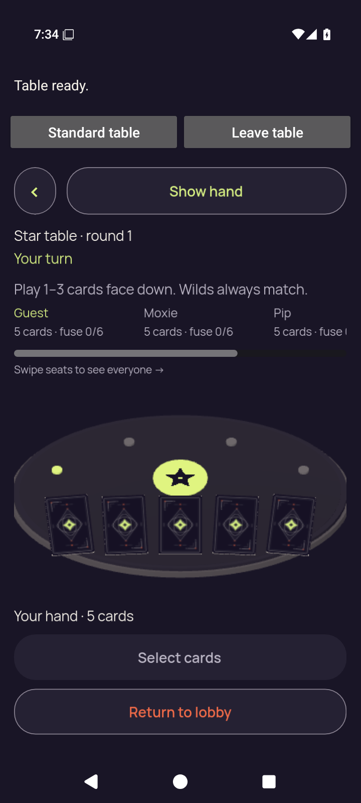</a> <code>3d-leave-cancel-native-ready.png</code> 3d-leave-cancel-native-ready — 3d.leave-cancel | 720 × 1600 px · 185,164 bytes SHA-256: <code>f35dbef8a5268331b72205a14df1c8e31c5b67b849967aac8c4d9664c9d7eff1</code> Source: <code>/root/projects/PartyDeck/artifacts/evidence-storage/34515669045/android-jvm-reports/build/ci/android/godot-session/optimized-test-signed/runtime/captures/3d-leave-cancel-native-ready.png</code> Capture: 2026-09-10T19:34:54.220+00:00 → 2026-09-10T19:34:56.580+00:00 [UI XML](runtime/captures/3d-leave-cancel-native-ready.xml) · [Capture JSON](runtime/captures/3d-leave-cancel-native-ready.json) · [Original result](runtime/godot-session-result.json) | **UNVIEWED original — no visual acceptance**. Original capture preserved without direct visual review. Source name, stage, timestamps and run outcome remain unchanged; no pixel observation or visual acceptance is asserted. |
|  <code>3d-leave-cancel-return-concealed.png</code> 3d-leave-cancel-return-concealed — 3d.leave-cancel | 720 × 1600 px · 108,622 bytes SHA-256: <code>7a6514527948f006d147f99d001172f0d701842b3d451f2b28619fade484552b</code> Source: <code>/root/projects/PartyDeck/artifacts/evidence-storage/34515669045/android-jvm-reports/build/ci/android/godot-session/optimized-test-signed/runtime/captures/3d-leave-cancel-return-concealed.png</code> Capture: 2026-09-10T19:35:12.374+00:00 → 2026-09-10T19:35:14.715+00:00 [UI XML](runtime/captures/3d-leave-cancel-return-concealed.xml) · [Capture JSON](runtime/captures/3d-leave-cancel-return-concealed.json) · [Original result](runtime/godot-session-result.json) | **UNVIEWED original — no visual acceptance**. Original capture preserved without direct visual review. Source name, stage, timestamps and run outcome remain unchanged; no pixel observation or visual acceptance is asserted. |
|  <code>3d-leave-cancel-return-first-card.png</code> 3d-leave-cancel-return-first-card — 3d.leave-cancel | 720 × 1600 px · 102,984 bytes SHA-256: <code>fe1c5c68c21f8e3854d5d9d87f8cecda6239e03fd8bdf27dcaec65f4e79817c1</code> Source: <code>/root/projects/PartyDeck/artifacts/evidence-storage/34515669045/android-jvm-reports/build/ci/android/godot-session/optimized-test-signed/runtime/captures/3d-leave-cancel-return-first-card.png</code> Capture: 2026-09-10T19:35:27.540+00:00 → 2026-09-10T19:35:29.878+00:00 [UI XML](runtime/captures/3d-leave-cancel-return-first-card.xml) · [Capture JSON](runtime/captures/3d-leave-cancel-return-first-card.json) · [Original result](runtime/godot-session-result.json) | **UNVIEWED original — no visual acceptance**. Original capture preserved without direct visual review. Source name, stage, timestamps and run outcome remain unchanged; no pixel observation or visual acceptance is asserted. |
|  <code>3d-leave-cancel-return-public.png</code> 3d-leave-cancel-return-public — 3d.leave-cancel | 720 × 1600 px · 108,622 bytes SHA-256: <code>7a6514527948f006d147f99d001172f0d701842b3d451f2b28619fade484552b</code> Source: <code>/root/projects/PartyDeck/artifacts/evidence-storage/34515669045/android-jvm-reports/build/ci/android/godot-session/optimized-test-signed/runtime/captures/3d-leave-cancel-return-public.png</code> Capture: 2026-09-10T19:35:21.105+00:00 → 2026-09-10T19:35:23.437+00:00 [UI XML](runtime/captures/3d-leave-cancel-return-public.xml) · [Capture JSON](runtime/captures/3d-leave-cancel-return-public.json) · [Original result](runtime/godot-session-result.json) | **UNVIEWED original — no visual acceptance**. Original capture preserved without direct visual review. Source name, stage, timestamps and run outcome remain unchanged; no pixel observation or visual acceptance is asserted. |
|  <code>3d-leave-cancel-return-selection-cleared.png</code> 3d-leave-cancel-return-selection-cleared — 3d.leave-cancel | 720 × 1600 px · 108,622 bytes SHA-256: <code>7a6514527948f006d147f99d001172f0d701842b3d451f2b28619fade484552b</code> Source: <code>/root/projects/PartyDeck/artifacts/evidence-storage/34515669045/android-jvm-reports/build/ci/android/godot-session/optimized-test-signed/runtime/captures/3d-leave-cancel-return-selection-cleared.png</code> Capture: 2026-09-10T19:35:16.737+00:00 → 2026-09-10T19:35:19.072+00:00 [UI XML](runtime/captures/3d-leave-cancel-return-selection-cleared.xml) · [Capture JSON](runtime/captures/3d-leave-cancel-return-selection-cleared.json) · [Original result](runtime/godot-session-result.json) | **UNVIEWED original — no visual acceptance**. Original capture preserved without direct visual review. Source name, stage, timestamps and run outcome remain unchanged; no pixel observation or visual acceptance is asserted. |
| <a href="runtime/captures/3d-leave-cancel-selected.png">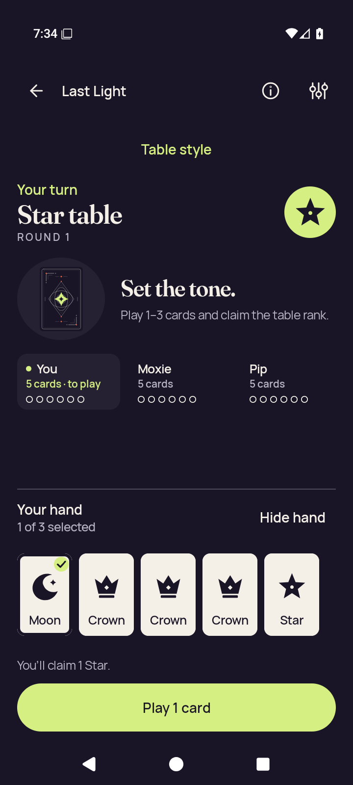</a> <code>3d-leave-cancel-selected.png</code> 3d-leave-cancel-selected — 3d.leave-cancel | 720 × 1600 px · 102,271 bytes SHA-256: <code>53150011f2379e1984b85fc7ef05acd9dd045f1ed5220bb2b8449eae5f028a06</code> Source: <code>/root/projects/PartyDeck/artifacts/evidence-storage/34515669045/android-jvm-reports/build/ci/android/godot-session/optimized-test-signed/runtime/captures/3d-leave-cancel-selected.png</code> Capture: 2026-09-10T19:34:34.618+00:00 → 2026-09-10T19:34:36.960+00:00 [UI XML](runtime/captures/3d-leave-cancel-selected.xml) · [Capture JSON](runtime/captures/3d-leave-cancel-selected.json) · [Original result](runtime/godot-session-result.json) | **UNVIEWED original — no visual acceptance**. Original capture preserved without direct visual review. Source name, stage, timestamps and run outcome remain unchanged; no pixel observation or visual acceptance is asserted. |
|  <code>3d-leave-cancel-selector.png</code> 3d-leave-cancel-selector — 3d.leave-cancel | 720 × 1600 px · 58,179 bytes SHA-256: <code>6eadb73bf20a939b2564a283d84ff4015e86826f1ca7ec4e6aef19235f47fa67</code> Source: <code>/root/projects/PartyDeck/artifacts/evidence-storage/34515669045/android-jvm-reports/build/ci/android/godot-session/optimized-test-signed/runtime/captures/3d-leave-cancel-selector.png</code> Capture: 2026-09-10T19:34:43.381+00:00 → 2026-09-10T19:34:45.703+00:00 [UI XML](runtime/captures/3d-leave-cancel-selector.xml) · [Capture JSON](runtime/captures/3d-leave-cancel-selector.json) · [Original result](runtime/godot-session-result.json) | **UNVIEWED original — no visual acceptance**. Original capture preserved without direct visual review. Source name, stage, timestamps and run outcome remain unchanged; no pixel observation or visual acceptance is asserted. |
|  <code>3d-leave-end-confirmation.png</code> 3d-leave-end-confirmation — 3d.leave-end | 720 × 1600 px · 41,195 bytes SHA-256: <code>dac8c2910781729c00a28022982f1d272505623774b1482ef5e82351e86fd881</code> Source: <code>/root/projects/PartyDeck/artifacts/evidence-storage/34515669045/android-jvm-reports/build/ci/android/godot-session/optimized-test-signed/runtime/captures/3d-leave-end-confirmation.png</code> Capture: 2026-09-10T19:36:57.637+00:00 → 2026-09-10T19:36:59.959+00:00 [UI XML](runtime/captures/3d-leave-end-confirmation.xml) · [Capture JSON](runtime/captures/3d-leave-end-confirmation.json) · [Original result](runtime/godot-session-result.json) | **UNVIEWED original — no visual acceptance**. Original capture preserved without direct visual review. Source name, stage, timestamps and run outcome remain unchanged; no pixel observation or visual acceptance is asserted. |
|  <code>3d-leave-end-selector.png</code> 3d-leave-end-selector — 3d.leave-end | 720 × 1600 px · 58,598 bytes SHA-256: <code>99c5a67aa595e87770b87d1287a1009f2a272c7b22381dd406e6eae2a16857f7</code> Source: <code>/root/projects/PartyDeck/artifacts/evidence-storage/34515669045/android-jvm-reports/build/ci/android/godot-session/optimized-test-signed/runtime/captures/3d-leave-end-selector.png</code> Capture: 2026-09-10T19:36:43.919+00:00 → 2026-09-10T19:36:46.263+00:00 [UI XML](runtime/captures/3d-leave-end-selector.xml) · [Capture JSON](runtime/captures/3d-leave-end-selector.json) · [Original result](runtime/godot-session-result.json) | **UNVIEWED original — no visual acceptance**. Original capture preserved without direct visual review. Source name, stage, timestamps and run outcome remain unchanged; no pixel observation or visual acceptance is asserted. |
|  <code>3d-recents-resumed.png</code> 3d-recents-resumed — 3d.recents-interruption | 720 × 1600 px · 185,309 bytes SHA-256: <code>943f80d87be4c3af7c7a00215920b963ab158be6c61637e6cf29e33ad2d40dda</code> Source: <code>/root/projects/PartyDeck/artifacts/evidence-storage/34515669045/android-jvm-reports/build/ci/android/godot-session/optimized-test-signed/runtime/captures/3d-recents-resumed.png</code> Capture: 2026-09-10T19:34:01.656+00:00 → 2026-09-10T19:34:04.020+00:00 [UI XML](runtime/captures/3d-recents-resumed.xml) · [Capture JSON](runtime/captures/3d-recents-resumed.json) · [Original result](runtime/godot-session-result.json) | **UNVIEWED original — no visual acceptance**. Original capture preserved without direct visual review. Source name, stage, timestamps and run outcome remain unchanged; no pixel observation or visual acceptance is asserted. |
| <a href="runtime/captures/3d-recents-system-ui.png">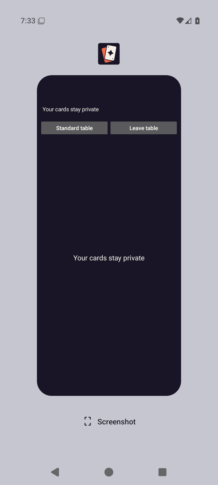</a> <code>3d-recents-system-ui.png</code> 3d-recents-system-ui — 3d.recents-interruption | 720 × 1600 px · 41,771 bytes SHA-256: <code>abb08451fefc69365776c19680900b6bc36b6402778bd0ddf95f372d29a257a6</code> Source: <code>/root/projects/PartyDeck/artifacts/evidence-storage/34515669045/android-jvm-reports/build/ci/android/godot-session/optimized-test-signed/runtime/captures/3d-recents-system-ui.png</code> Capture: 2026-09-10T19:33:56.296+00:00 → 2026-09-10T19:33:58.635+00:00 [UI XML](runtime/captures/3d-recents-system-ui.xml) · [Capture JSON](runtime/captures/3d-recents-system-ui.json) · [Original result](runtime/godot-session-result.json) | **UNVIEWED original — no visual acceptance**. Original capture preserved without direct visual review. Source name, stage, timestamps and run outcome remain unchanged; no pixel observation or visual acceptance is asserted. |
|  <code>3d-standard-concealed.png</code> 3d-standard-concealed — 3d.standard-return | 720 × 1600 px · 108,578 bytes SHA-256: <code>93c07c61f57c96700bccf88e12543b21813e09e605c4acc117245b1a228f2138</code> Source: <code>/root/projects/PartyDeck/artifacts/evidence-storage/34515669045/android-jvm-reports/build/ci/android/godot-session/optimized-test-signed/runtime/captures/3d-standard-concealed.png</code> Capture: 2026-09-10T19:34:10.867+00:00 → 2026-09-10T19:34:13.201+00:00 [UI XML](runtime/captures/3d-standard-concealed.xml) · [Capture JSON](runtime/captures/3d-standard-concealed.json) · [Original result](runtime/godot-session-result.json) | **UNVIEWED original — no visual acceptance**. Original capture preserved without direct visual review. Source name, stage, timestamps and run outcome remain unchanged; no pixel observation or visual acceptance is asserted. |
| <a href="runtime/captures/3d-standard-first-card.png">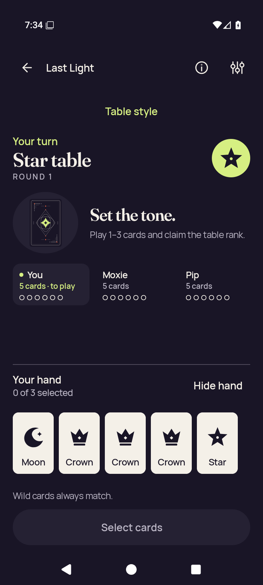</a> <code>3d-standard-first-card.png</code> 3d-standard-first-card — 3d.standard-return | 720 × 1600 px · 102,922 bytes SHA-256: <code>cb071d74f84c211679eacab407ab547e7e83badaea58df5bb040372aed49df85</code> Source: <code>/root/projects/PartyDeck/artifacts/evidence-storage/34515669045/android-jvm-reports/build/ci/android/godot-session/optimized-test-signed/runtime/captures/3d-standard-first-card.png</code> Capture: 2026-09-10T19:34:26.037+00:00 → 2026-09-10T19:34:28.382+00:00 [UI XML](runtime/captures/3d-standard-first-card.xml) · [Capture JSON](runtime/captures/3d-standard-first-card.json) · [Original result](runtime/godot-session-result.json) | **UNVIEWED original — no visual acceptance**. Original capture preserved without direct visual review. Source name, stage, timestamps and run outcome remain unchanged; no pixel observation or visual acceptance is asserted. |
| <a href="runtime/captures/3d-standard-play-after-play.png">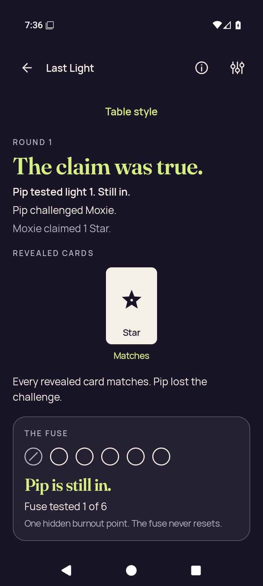</a> <code>3d-standard-play-after-play.png</code> 3d-standard-play-after-play — 3d.standard-action | 720 × 1600 px · 91,223 bytes SHA-256: <code>1749dc17fc08866969d408d69d792917b399a46d0f81d608bbbf86eaaef7610c</code> Source: <code>/root/projects/PartyDeck/artifacts/evidence-storage/34515669045/android-jvm-reports/build/ci/android/godot-session/optimized-test-signed/runtime/captures/3d-standard-play-after-play.png</code> Capture: 2026-09-10T19:36:35.248+00:00 → 2026-09-10T19:36:37.582+00:00 [UI XML](runtime/captures/3d-standard-play-after-play.xml) · [Capture JSON](runtime/captures/3d-standard-play-after-play.json) · [Original result](runtime/godot-session-result.json) | **UNVIEWED original — no visual acceptance**. Original capture preserved without direct visual review. Source name, stage, timestamps and run outcome remain unchanged; no pixel observation or visual acceptance is asserted. |
|  <code>3d-standard-play-selected.png</code> 3d-standard-play-selected — 3d.standard-action | 720 × 1600 px · 102,512 bytes SHA-256: <code>5655f15e60bc4da94ce58e8b5a7ab5b2674e42e8814d989b01fcfaa06b1d091d</code> Source: <code>/root/projects/PartyDeck/artifacts/evidence-storage/34515669045/android-jvm-reports/build/ci/android/godot-session/optimized-test-signed/runtime/captures/3d-standard-play-selected.png</code> Capture: 2026-09-10T19:36:28.704+00:00 → 2026-09-10T19:36:31.053+00:00 [UI XML](runtime/captures/3d-standard-play-selected.xml) · [Capture JSON](runtime/captures/3d-standard-play-selected.json) · [Original result](runtime/godot-session-result.json) | **UNVIEWED original — no visual acceptance**. Original capture preserved without direct visual review. Source name, stage, timestamps and run outcome remain unchanged; no pixel observation or visual acceptance is asserted. |
|  <code>3d-standard-public.png</code> 3d-standard-public — 3d.standard-return | 720 × 1600 px · 108,578 bytes SHA-256: <code>93c07c61f57c96700bccf88e12543b21813e09e605c4acc117245b1a228f2138</code> Source: <code>/root/projects/PartyDeck/artifacts/evidence-storage/34515669045/android-jvm-reports/build/ci/android/godot-session/optimized-test-signed/runtime/captures/3d-standard-public.png</code> Capture: 2026-09-10T19:34:19.576+00:00 → 2026-09-10T19:34:21.920+00:00 [UI XML](runtime/captures/3d-standard-public.xml) · [Capture JSON](runtime/captures/3d-standard-public.json) · [Original result](runtime/godot-session-result.json) | **UNVIEWED original — no visual acceptance**. Original capture preserved without direct visual review. Source name, stage, timestamps and run outcome remain unchanged; no pixel observation or visual acceptance is asserted. |
|  <code>3d-standard-selection-cleared.png</code> 3d-standard-selection-cleared — 3d.standard-return | 720 × 1600 px · 108,578 bytes SHA-256: <code>93c07c61f57c96700bccf88e12543b21813e09e605c4acc117245b1a228f2138</code> Source: <code>/root/projects/PartyDeck/artifacts/evidence-storage/34515669045/android-jvm-reports/build/ci/android/godot-session/optimized-test-signed/runtime/captures/3d-standard-selection-cleared.png</code> Capture: 2026-09-10T19:34:15.223+00:00 → 2026-09-10T19:34:17.556+00:00 [UI XML](runtime/captures/3d-standard-selection-cleared.xml) · [Capture JSON](runtime/captures/3d-standard-selection-cleared.json) · [Original result](runtime/godot-session-result.json) | **UNVIEWED original — no visual acceptance**. Original capture preserved without direct visual review. Source name, stage, timestamps and run outcome remain unchanged; no pixel observation or visual acceptance is asserted. |
|  <code>final-diagnostic.png</code> final-diagnostic — 3d.engine-leave-end | 720 × 1600 px · 132,285 bytes SHA-256: <code>71483f994c0e94b8a73926fc990863a3880f12d5077e61796d424f13dc830ad7</code> Source: <code>/root/projects/PartyDeck/artifacts/evidence-storage/34515669045/android-jvm-reports/build/ci/android/godot-session/optimized-test-signed/runtime/captures/final-diagnostic.png</code> Capture: 2026-09-10T19:39:54.752+00:00 → 2026-09-10T19:39:57.086+00:00 [UI XML](runtime/captures/final-diagnostic.xml) · [Capture JSON](runtime/captures/final-diagnostic.json) · [Original result](runtime/godot-session-result.json) | **UNVIEWED original — no visual acceptance**. Original capture preserved without direct visual review. Source name, stage, timestamps and run outcome remain unchanged; no pixel observation or visual acceptance is asserted. |
|  <code>home-cold.png</code> home-cold — emulator readiness | 720 × 1600 px · 131,670 bytes SHA-256: <code>a8886c519704ad5d7c88779247cb9603878d9c6b1c0e13db81f7add067c7bd24</code> Source: <code>/root/projects/PartyDeck/artifacts/evidence-storage/34515669045/android-jvm-reports/build/ci/android/godot-session/optimized-test-signed/runtime/captures/home-cold.png</code> Capture: 2026-09-10T19:22:56.349+00:00 → 2026-09-10T19:22:58.684+00:00 [UI XML](runtime/captures/home-cold.xml) · [Capture JSON](runtime/captures/home-cold.json) · [Original result](runtime/godot-session-result.json) | **UNVIEWED original — no visual acceptance**. Original capture preserved without direct visual review. Source name, stage, timestamps and run outcome remain unchanged; no pixel observation or visual acceptance is asserted. |
