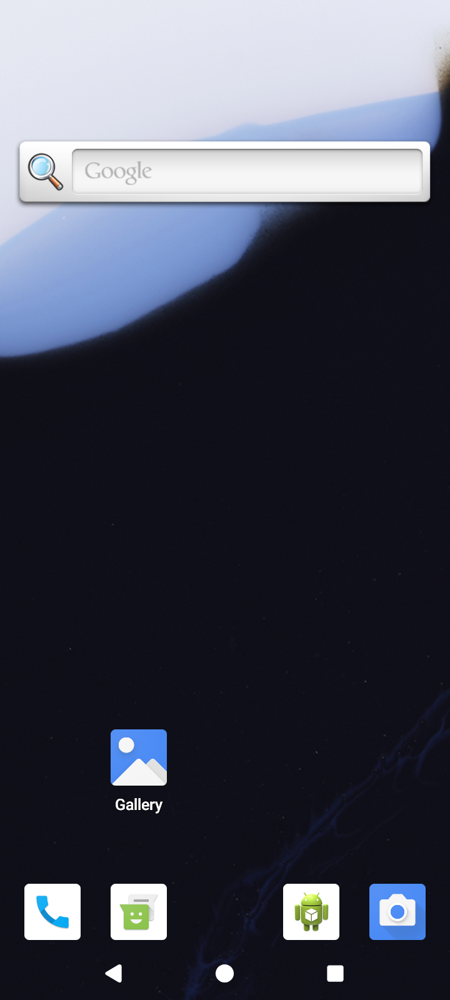

# API 35 emulator preparation — CI 34515669045

[All collections](../../README.md) · [Preserved evidence index](../evidence-index.md) · [Copy/review binding](../provenance/publication-review/partydeck-gallery-3433-publication-binding-v1.json) · [Completed focused review](../provenance/publication-review/partydeck-gallery-after-2815-combinedandroid34515669045-visual-review-v1.json) · [Source mapping](../provenance/source-review/capture-inventory-v1.json)

**Original setup capture remains explicitly unviewed; no gameplay or native visual acceptance.**

The original attempt directory and preparation results are retained.

The Android job succeeds. Both ordinary smokes pass. Native debug passes 30 checks; optimized passes 28 and explicitly skips two renderer-death checks. The overall combined workflow fails in the separate iOS job. This collection preserves 186 native, 62 ordinary, 69 Compose JVM and one preparation original.

Six originals were directly reviewed: both normal portrait 2D native entries and the four current engine public-outcome frames. The compact cover/Reveal, first two complete numbered seats and fixed actions fit both 2D entries. Four after-Play PNGs show public round results. Debug 2D is Round 2; the other three are Round 1. The independent XML/source audit establishes each outcome matches its recorded baseline round. These public-result stills show no remaining private-hand layout or visible five-to-four count. All four continuation actions lie below the captured viewport. The optimized 3D fuse panel reaches the clip.

All four current engine scenarios have zero Standard card nodes in the relevant XMLs; remaining Standard hand size/unchecked cards are unobserved. Renderer selection clearing is observed local state only. Eighty-two originals match separately published bytes; 230 others remain explicitly unviewed. The collector and independent action reviewer reported zero media views. No videos exist in this Android collection. Source is derived exact-commit provenance, with 1,124 historical gallery payloads represented by remote-tree identity only. Source audits are reused without broad re-execution.

Source revision: `0f00f17a398be96aef7bdb58d03074a9914f8232`. CI run: [34515669045](https://github.com/Apdelrahman1911/PartyDeck/actions/runs/34515669045). 1 original PNG identities. Review methods: 1 unviewed original — no visual acceptance.

Every thumbnail opens the unchanged original PNG. **UNVIEWED** means no direct pixel review or visual acceptance is asserted. Matching bytes reuse only earlier pixel observations. Each source, scenario and original outcome remains separate. Frozen review plans retain their historical pending flags; the completed focused-review receipt records the final status. No new derivative image or video decoding was performed.

| Original capture | Original identity and evidence | Review status and observation |
| --- | --- | --- |
|  <code>final-screen.png</code> attempt-1/final-screen | 720 × 1600 px · 752,397 bytes SHA-256: <code>7caa5260ada185574c598f5240d46f617a0ec62d1b376f3165b1538c1d3ccb0c</code> Source: <code>/root/projects/PartyDeck/artifacts/evidence-storage/34515669045/android-jvm-reports/build/ci/android/preparation/attempt-1/final-screen.png</code> [Original result](preparation-result.json) | **UNVIEWED original — no visual acceptance**. Original capture preserved without direct visual review. Source name, stage, timestamps and run outcome remain unchanged; no pixel observation or visual acceptance is asserted. |
