# Compose JVM snapshots — CI 34538972728

Ordinary debug and optimized passed. Godot debug has 30 passes; optimized has 28 passes and two explicit renderer-death skips. The complete Validate run failed separately on iOS. All four packaged PCKs were independently verified against frozen source/export; pixel findings remain bounded to reviewed stills.

Exact source: `dd6df8a530d71b51ae4c3b0f4a05246f2e58402f`. Platform: JVM Compose layout fixture.

**71 images**: 10 reviewed byte match; this identity was not reopened; 61 preserved image; unviewed.

[Gallery index](../../../README.md) · [Batch scope and review counts](../../../provenance/20260911-4586/review-summary.json) · [Exact source paths, hashes and timestamps](../../../provenance/20260911-4586/source-map.json).

### game-large-text-concealed

`game-large-text-concealed.png` · 320 × 740 · 34,908 bytes.

SHA-256: `8d016ff7797c9dd3bb8fe79f346b2f2e9d72038a590ce797b3457d45afe04841`.

**[Reviewed byte match; this identity was not reopened](../../../compose-standard-large-text-20260910/provenance/ui-shell-final/direct-view-delta.json).** Show hand is visible inside its panel below Your hand and 5 cards. Turn/rank and open-round instructions remain in their previous positions. Explanatory content now follows the control below the viewport; no private card faces are visible.

Reviewed representative: [game-large-text-concealed.png](../../../compose-standard-large-text-20260910/affected-layout-final-passed/ui-snapshots/game-large-text-concealed.png).

### game-large-text-hand

<a href="../../originals/android-jvm-reports/composeApp/build/ui-snapshots/game-large-text-hand.png">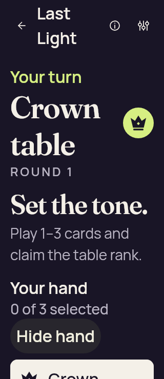</a>

`game-large-text-hand.png` · 320 × 740 · 36,066 bytes.

SHA-256: `cda148e79a17289ac421f5b6bb39b05857dd9f2d13c8222d898d0e8c9d4b021c`.

**[Reviewed byte match; this identity was not reopened](../../../compose-standard-large-text-20260910/provenance/ui-shell-final/direct-view-delta.json).** The viewport retains current public context, hand count/selection status and a clear Hide hand control. Only the top of the first large card row appears at the bottom; the rest remain available through vertical scrolling. The helper accepts a visible intersection, so this capture no longer inherits the older long scroll needed to reach Reveal. It is not an all-cards-visible claim.

Reviewed representative: [game-large-text-hand.png](../../../compose-standard-large-text-20260910/affected-layout-final-passed/ui-snapshots/game-large-text-hand.png).

### game-large-text-selected

<a href="../../originals/android-jvm-reports/composeApp/build/ui-snapshots/game-large-text-selected.png">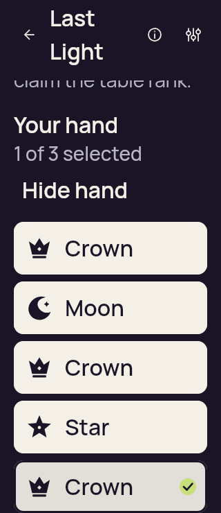</a>

`game-large-text-selected.png` · 320 × 740 · 30,298 bytes.

SHA-256: `7ff0c7afaf38fb337cb92968c69d196bac4b3eef2c777996d752e0afb1358db5`.

**[Reviewed byte match; this identity was not reopened](../../../compose-standard-large-text-20260910/provenance/ui-shell-before/direct-views.json).** Captured after scrolling to and selecting the fifth card. The count reads 1 of 3 selected and the selected card has a check mark; Hide hand remains visible. The public instruction tail is clipped at the scroll viewport top as expected for this captured scroll position.

Reviewed representative: [game-large-text-selected.png](../../../compose-standard-large-text-20260910/passed-focused-tests/ui-snapshots/game-large-text-selected.png).

### game-selection-limit

`game-selection-limit.png` · 360 × 640 · 38,507 bytes.

SHA-256: `2a473e93b9476c473720e5f592acd38af7f8001beefb65eb905be45ff0d71491`.

**[Reviewed byte match; this identity was not reopened](../../../compose-gameplay-layout-20260910-root-validation/provenance/visual-review.json).** The JVM layout capture shows three checked cards, 3 of 3 selected and complete count-only Choose up to 3 cards feedback. Play 3 cards is complete; the challenge target wraps and ends with an ellipsis. The fifth card continues beyond the horizontal viewport. This image adds no native iOS audit or TalkBack qualification.

Reviewed representative: [game-selection-limit.png](../../../compose-gameplay-layout-20260910-root-validation/game-selection-limit.png).

### fallback-concealed-large-text

`fallback-concealed-large-text.png` · 320 × 740 · 34,977 bytes.

SHA-256: `d6eaccff405da4d6bfbad52864329549a0705b30bb56b4ef36c8065d375539ab`.

**[Reviewed byte match; this identity was not reopened](../../../compose-standard-large-text-20260910/provenance/ui-shell-final/direct-view-delta.json).** The full Show hand pill is visible with the current turn/rank and hand title/count above it. Explanatory copy follows below the button. The test invoked ScrollTo before capturing, so this picture is not used for natural-visibility acceptance.

Reviewed representative: [fallback-concealed-large-text.png](../../../compose-standard-large-text-20260910/affected-layout-final-passed/ui-snapshots/presentation-1789079998479/fallback-concealed-large-text.png).

### opening-large-text

`opening-large-text.png` · 320 × 740 · 31,278 bytes.

SHA-256: `80ecde376374f864b361d321917d597dee02a2331f0c8d90f03eaabbf82023e8`.

**[Reviewed byte match; this identity was not reopened](../../../android-34496267571/provenance/publication-review/partydeck-gallery-after-2013-api35-visual-review.json).** The JVM large-text opening view shows the full Opening your table heading, Standard-table continuation explanation and complete Use standard table button. This is a layout snapshot, not evidence of a completed native opening.

Reviewed representative: [opening-large-text.png](../../../android-34496267571/compose-jvm/presentation-1789054611260/opening-large-text.png).

### picker-three-available-large-text

`picker-three-available-large-text.png` · 320 × 740 · 35,231 bytes.

SHA-256: `2ac10590f102dd755d2d2a7f3b96db84b5db8db339a9fc76f66aeff94176556d`.

**[Reviewed byte match; this identity was not reopened](../../../android-34496267571/provenance/publication-review/partydeck-gallery-after-2013-api35-visual-review.json).** JVM large-text Table style dialog shows the full screen-reader explanation, all three available choices, 2D selected and complete Done. This snapshot does not establish runtime availability or accessibility qualification.

Reviewed representative: [picker-three-available-large-text.png](../../../android-34496267571/compose-jvm/presentation-1789054611260/picker-three-available-large-text.png).

### picker-two-available-large-text

<a href="../../originals/android-jvm-reports/composeApp/build/ui-snapshots/presentation-1789080580923/picker-two-available-large-text.png">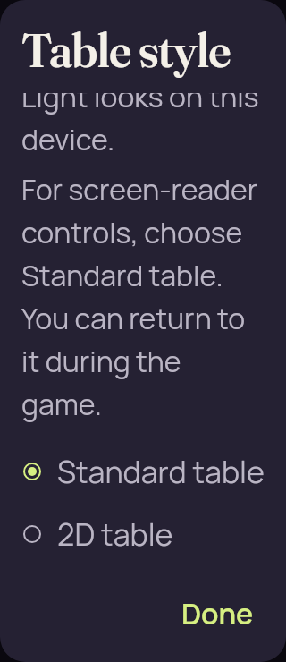</a>

`picker-two-available-large-text.png` · 320 × 740 · 36,821 bytes.

SHA-256: `b48bd70894b6051980603e783a36f89cefe8a47deb198360b31fe53dff4ee97b`.

**[Reviewed byte match; this identity was not reopened](../../../android-34496267571/provenance/publication-review/partydeck-gallery-after-2013-api35-visual-review.json).** JVM large-text Table style dialog shows Standard selected, 2D as the other available choice and complete Done. The beginning of the general appearance explanation is clipped beneath the fixed title; the screen-reader explanation fits.

Reviewed representative: [picker-two-available-large-text.png](../../../android-34496267571/compose-jvm/presentation-1789054611260/picker-two-available-large-text.png).

### returned-concealed

`returned-concealed.png` · 411 × 662 · 35,137 bytes.

SHA-256: `3e4e4ab066a72ec9aa5d2acad03f6dedef94cb17d963cdfa389c773dca02b9ea`.

**[Reviewed byte match; this identity was not reopened](../../../compose-standard-large-text-20260910/provenance/ui-shell-passed/direct-views.json).** Genuine Show hand is fully inside the large-text viewport below Your hand and 5 cards. Turn/rank/current claim stay visible above it. The illustration and explanatory copy follow the control and continue below the viewport in the same scroll flow. No private card face is shown.

Reviewed representative: [fresh-concealed.png](../../../compose-standard-large-text-20260910/fixture-passed-v3/ui-snapshots/standard-return-font2-8789779573886536011/fresh-concealed.png).

### fresh-concealed

`fresh-concealed.png` · 411 × 662 · 35,137 bytes.

SHA-256: `3e4e4ab066a72ec9aa5d2acad03f6dedef94cb17d963cdfa389c773dca02b9ea`.

**[Reviewed byte match; this identity was not reopened](../../../compose-standard-large-text-20260910/provenance/ui-shell-passed/direct-views.json).** Genuine Show hand is fully inside the large-text viewport below Your hand and 5 cards. Turn/rank/current claim stay visible above it. The illustration and explanatory copy follow the control and continue below the viewport in the same scroll flow. No private card face is shown.

Reviewed representative: [fresh-concealed.png](../../../compose-standard-large-text-20260910/fixture-passed-v3/ui-snapshots/standard-return-font2-8789779573886536011/fresh-concealed.png).

### game-bluff-with-wild

`game-bluff-with-wild.png` · 360 × 640 · 31,335 bytes.

SHA-256: `52c54d147efe0328c4194122b2a7683a10f6f2c33712e897480662dc6dedec26`.

**Preserved image; unviewed.** Original preserved without a direct view or an independently established reviewed-byte representative in this bounded review. Matching published bytes alone do not establish visual review.

### game-choice-long-name

`game-choice-long-name.png` · 360 × 640 · 36,840 bytes.

SHA-256: `336545c4fe06c1c43d1c85256ed7324da08266eadd3f430931ae27324b0247db`.

**Preserved image; unviewed.** Original preserved without a direct view or an independently established reviewed-byte representative in this bounded review. Matching published bytes alone do not establish visual review.

### game-forced-challenge

`game-forced-challenge.png` · 360 × 640 · 38,983 bytes.

SHA-256: `daa1f2b113bc54db8e2f426b0f47f907bbdf214c58766e561e15beadc87fd44b`.

**Preserved image; unviewed.** Original preserved without a direct view or an independently established reviewed-byte representative in this bounded review. Matching published bytes alone do not establish visual review.

### game-landscape-concealed

`game-landscape-concealed.png` · 844 × 390 · 39,059 bytes.

SHA-256: `c4617f711a9d3cca2f9f5f19af79d1608129620faf7c2ce55ed854c531295035`.

**Preserved image; unviewed.** Original preserved without a direct view or an independently established reviewed-byte representative in this bounded review. Matching published bytes alone do not establish visual review.

### game-landscape-eliminated

`game-landscape-eliminated.png` · 844 × 390 · 36,120 bytes.

SHA-256: `8350390017d78e84decadc825a8cec5fcc523dce6b4e62019094d256ca788b53`.

**Preserved image; unviewed.** Original preserved without a direct view or an independently established reviewed-byte representative in this bounded review. Matching published bytes alone do not establish visual review.

### game-landscape-hand

<a href="../../originals/android-jvm-reports/composeApp/build/ui-snapshots/game-landscape-hand.png">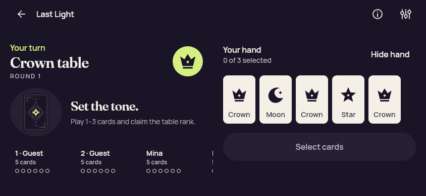</a>

`game-landscape-hand.png` · 844 × 390 · 33,717 bytes.

SHA-256: `842fcd1839c0d05dfec387bff88921877d1bc49eecb80c9a3d63322bfb61d273`.

**Preserved image; unviewed.** Original preserved without a direct view or an independently established reviewed-byte representative in this bounded review. Matching published bytes alone do not establish visual review.

### game-landscape-previous-proof

<a href="../../originals/android-jvm-reports/composeApp/build/ui-snapshots/game-landscape-previous-proof.png">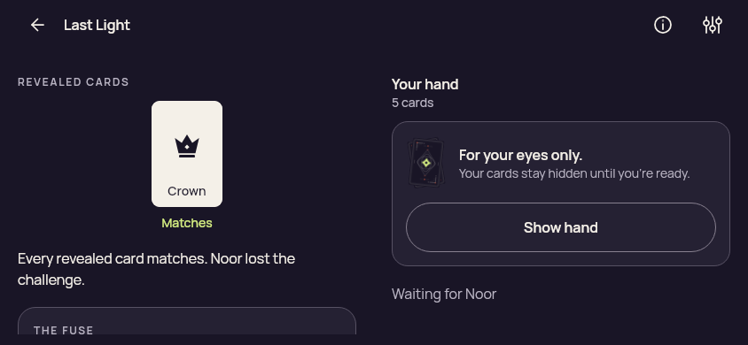</a>

`game-landscape-previous-proof.png` · 844 × 390 · 31,791 bytes.

SHA-256: `059ba1a8ed8340fc4c45a44abb0d023c756687db18daa26ab929ca7bc1a53418`.

**Preserved image; unviewed.** Original preserved without a direct view or an independently established reviewed-byte representative in this bounded review. Matching published bytes alone do not establish visual review.

### game-landscape-previous-reveal

`game-landscape-previous-reveal.png` · 844 × 390 · 36,971 bytes.

SHA-256: `565ea5890c5330d7de4e0040ad8981a697f33f7327d566bd5b8671df3deb9fb7`.

**Preserved image; unviewed.** Original preserved without a direct view or an independently established reviewed-byte representative in this bounded review. Matching published bytes alone do not establish visual review.

### game-landscape-round-result

<a href="../../originals/android-jvm-reports/composeApp/build/ui-snapshots/game-landscape-round-result.png">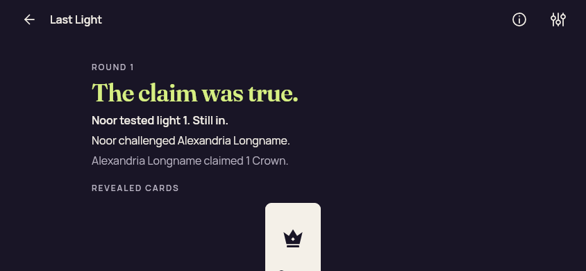</a>

`game-landscape-round-result.png` · 844 × 390 · 20,935 bytes.

SHA-256: `280668abaf08fa9bc3f97a42fac67ffc15b892a48f6cd09f949df7b39c3454d2`.

**Preserved image; unviewed.** Original preserved without a direct view or an independently established reviewed-byte representative in this bounded review. Matching published bytes alone do not establish visual review.

### game-landscape-selected

`game-landscape-selected.png` · 844 × 390 · 36,046 bytes.

SHA-256: `f6fcf73f097293cf19966d8c4779e02b5d020f34015b36ba1abb09c21eb8d176`.

**Preserved image; unviewed.** Original preserved without a direct view or an independently established reviewed-byte representative in this bounded review. Matching published bytes alone do not establish visual review.

### game-landscape-winner

`game-landscape-winner.png` · 844 × 390 · 23,671 bytes.

SHA-256: `047656f4f92d2a73a1d65cca1f91e8209fe775a6217b962796f2335ddb230a92`.

**Preserved image; unviewed.** Original preserved without a direct view or an independently established reviewed-byte representative in this bounded review. Matching published bytes alone do not establish visual review.

### game-large-text-eliminated

<a href="../../originals/android-jvm-reports/composeApp/build/ui-snapshots/game-large-text-eliminated.png">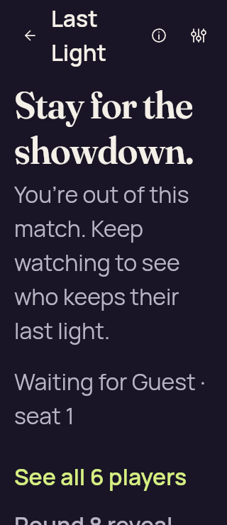</a>

`game-large-text-eliminated.png` · 320 × 740 · 40,416 bytes.

SHA-256: `03025ea93b89cad9f70507011255a0d8961d781bf68c3f43bb68dae927aa16c0`.

**Preserved image; unviewed.** Original preserved without a direct view or an independently established reviewed-byte representative in this bounded review. Matching published bytes alone do not establish visual review.

### game-large-text-previous-proof

`game-large-text-previous-proof.png` · 320 × 740 · 33,078 bytes.

SHA-256: `9e37d0764b37de09b152d291106f5e854ebc07e684f5568d2ca5d10e2c7d6e81`.

**Preserved image; unviewed.** Original preserved without a direct view or an independently established reviewed-byte representative in this bounded review. Matching published bytes alone do not establish visual review.

### game-large-text-previous-reveal

`game-large-text-previous-reveal.png` · 320 × 740 · 34,558 bytes.

SHA-256: `10f675de2148fd13be34a8967fbeeb456dbe353f7e34769a764978ef0056b045`.

**Preserved image; unviewed.** Original preserved without a direct view or an independently established reviewed-byte representative in this bounded review. Matching published bytes alone do not establish visual review.

### game-large-text-round-result

`game-large-text-round-result.png` · 320 × 740 · 32,581 bytes.

SHA-256: `fa176a0d9d5ddbb91ed9ca93c74b1c3cb174e6d1fc9b8060be6ed33fbd02b2cd`.

**Preserved image; unviewed.** Original preserved without a direct view or an independently established reviewed-byte representative in this bounded review. Matching published bytes alone do not establish visual review.

### game-large-text-winner

`game-large-text-winner.png` · 320 × 740 · 26,744 bytes.

SHA-256: `7088f1c112b973c7af042071828683669f725ab967be9533ae1ecd1ca7542fb0`.

**Preserved image; unviewed.** Original preserved without a direct view or an independently established reviewed-byte representative in this bounded review. Matching published bytes alone do not establish visual review.

### game-phone-concealed

`game-phone-concealed.png` · 360 × 640 · 32,137 bytes.

SHA-256: `c42fd7ac3fcfcb9d1ccb32ff7a54fd5bdbeb458a116a055f4cb231e531e5175c`.

**Preserved image; unviewed.** Original preserved without a direct view or an independently established reviewed-byte representative in this bounded review. Matching published bytes alone do not establish visual review.

### game-phone-eliminated

`game-phone-eliminated.png` · 360 × 640 · 33,538 bytes.

SHA-256: `357bd5af2fc4df311f432ae43cb61fd6341b7a40e61edddd1aa400c47885af86`.

**Preserved image; unviewed.** Original preserved without a direct view or an independently established reviewed-byte representative in this bounded review. Matching published bytes alone do not establish visual review.

### game-phone-hand

`game-phone-hand.png` · 360 × 640 · 31,920 bytes.

SHA-256: `67f918bfee91987f415e97c09949e4eebdef4d0a6c98e775ee8a6092dddad0ba`.

**Preserved image; unviewed.** Original preserved without a direct view or an independently established reviewed-byte representative in this bounded review. Matching published bytes alone do not establish visual review.

### game-phone-previous-proof

`game-phone-previous-proof.png` · 360 × 640 · 29,597 bytes.

SHA-256: `7ed6c3bdd8eac370c872f852bb3de73491f0644c5e47f0cf41acf2bce4d1eb7b`.

**Preserved image; unviewed.** Original preserved without a direct view or an independently established reviewed-byte representative in this bounded review. Matching published bytes alone do not establish visual review.

### game-phone-previous-reveal

`game-phone-previous-reveal.png` · 360 × 640 · 35,127 bytes.

SHA-256: `a040e64e25737e3d0b04ae60c3e0bea38c9cc79c9e2a4d01c5a19409ee967811`.

**Preserved image; unviewed.** Original preserved without a direct view or an independently established reviewed-byte representative in this bounded review. Matching published bytes alone do not establish visual review.

### game-phone-round-result

`game-phone-round-result.png` · 360 × 640 · 31,078 bytes.

SHA-256: `ed44bac4453e2118c6c78362a306c732139ba2da3228931ce8d66096f32141be`.

**Preserved image; unviewed.** Original preserved without a direct view or an independently established reviewed-byte representative in this bounded review. Matching published bytes alone do not establish visual review.

### game-phone-selected

`game-phone-selected.png` · 360 × 640 · 32,573 bytes.

SHA-256: `6e0ebcc7856b0386f99a9fbb243719dfe68da0fe4fdbdb4d97f9ab8a70638a6d`.

**Preserved image; unviewed.** Original preserved without a direct view or an independently established reviewed-byte representative in this bounded review. Matching published bytes alone do not establish visual review.

### game-phone-winner

`game-phone-winner.png` · 360 × 640 · 24,841 bytes.

SHA-256: `be63e9b3011dacad3811f44ad0c51f23421751ee0c6e62431118e8f887b5b24f`.

**Preserved image; unviewed.** Original preserved without a direct view or an independently established reviewed-byte representative in this bounded review. Matching published bytes alone do not establish visual review.

### game-tablet-concealed

`game-tablet-concealed.png` · 1024 × 768 · 45,833 bytes.

SHA-256: `47dee65cec7a47fc8102cf424abcce5cd89b88adf9679a9fd3a7d9e2fe6a6c74`.

**Preserved image; unviewed.** Original preserved without a direct view or an independently established reviewed-byte representative in this bounded review. Matching published bytes alone do not establish visual review.

### game-tablet-eliminated

<a href="../../originals/android-jvm-reports/composeApp/build/ui-snapshots/game-tablet-eliminated.png">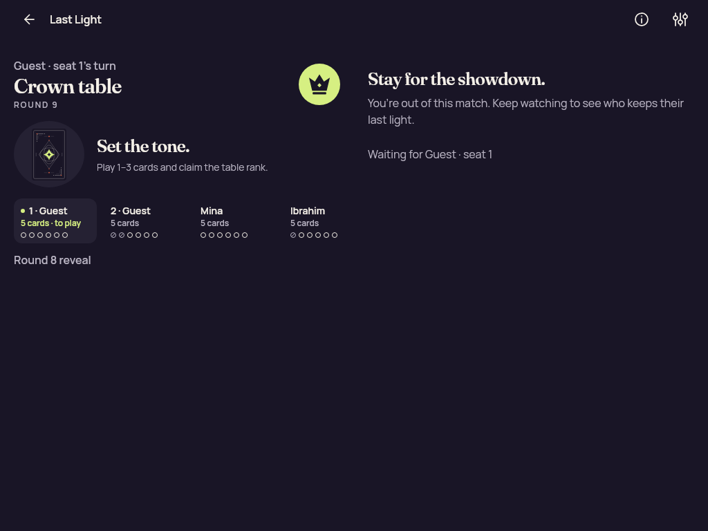</a>

`game-tablet-eliminated.png` · 1024 × 768 · 43,026 bytes.

SHA-256: `4d5ef9dbcaa425ca9d8e65e21c7959f3ecc6f16c333c53b911b62f4a88e0f626`.

**Preserved image; unviewed.** Original preserved without a direct view or an independently established reviewed-byte representative in this bounded review. Matching published bytes alone do not establish visual review.

### game-tablet-hand

`game-tablet-hand.png` · 1024 × 768 · 40,436 bytes.

SHA-256: `46141180fac62120c37f0dc9dab09998a5ffcf2be518bf665602ca4249899316`.

**Preserved image; unviewed.** Original preserved without a direct view or an independently established reviewed-byte representative in this bounded review. Matching published bytes alone do not establish visual review.

### game-tablet-previous-proof

`game-tablet-previous-proof.png` · 1024 × 768 · 60,400 bytes.

SHA-256: `6208be7a02f3a18e50f6e8ae1843f1684f1fea02367c5238136291243c0cce47`.

**Preserved image; unviewed.** Original preserved without a direct view or an independently established reviewed-byte representative in this bounded review. Matching published bytes alone do not establish visual review.

### game-tablet-previous-reveal

`game-tablet-previous-reveal.png` · 1024 × 768 · 60,400 bytes.

SHA-256: `6208be7a02f3a18e50f6e8ae1843f1684f1fea02367c5238136291243c0cce47`.

**Preserved image; unviewed.** Original preserved without a direct view or an independently established reviewed-byte representative in this bounded review. Matching published bytes alone do not establish visual review.

### game-tablet-round-result

`game-tablet-round-result.png` · 1024 × 768 · 44,741 bytes.

SHA-256: `678098f3294c1a823112e6d0224e26ddac92cf9bd9a94937c02527d48af0e0ad`.

**Preserved image; unviewed.** Original preserved without a direct view or an independently established reviewed-byte representative in this bounded review. Matching published bytes alone do not establish visual review.

### game-tablet-selected

`game-tablet-selected.png` · 1024 × 768 · 42,445 bytes.

SHA-256: `8703e47cc3baa4da82e6c29d88df3ac5e3021a29f37c5f2d6159a5cc14eee6ba`.

**Preserved image; unviewed.** Original preserved without a direct view or an independently established reviewed-byte representative in this bounded review. Matching published bytes alone do not establish visual review.

### game-tablet-winner

`game-tablet-winner.png` · 1024 × 768 · 28,593 bytes.

SHA-256: `a14740d1fae23f0a102959ff7d323ff2ac0aaedb828b1d6683cd8b114afbd94d`.

**Preserved image; unviewed.** Original preserved without a direct view or an independently established reviewed-byte representative in this bounded review. Matching published bytes alone do not establish visual review.

### game-three-selected

<a href="../../originals/android-jvm-reports/composeApp/build/ui-snapshots/game-three-selected.png">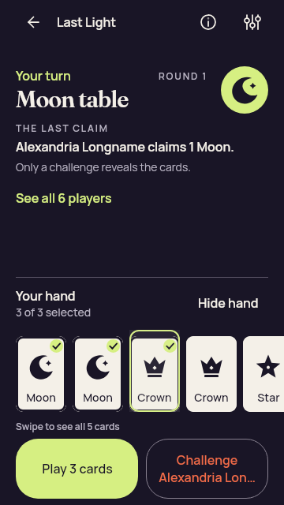</a>

`game-three-selected.png` · 360 × 640 · 38,592 bytes.

SHA-256: `563fe35f3e5e29459309f308b2fd1dcd733e46fa3a604de7507e96cf629c59c6`.

**Preserved image; unviewed.** Original preserved without a direct view or an independently established reviewed-byte representative in this bounded review. Matching published bytes alone do not establish visual review.

### global-error-large-text-recovery

`global-error-large-text-recovery.png` · 320 × 740 · 36,316 bytes.

SHA-256: `1883104be73b2dbbd31867262b3fe44ef35cd167e016dfbc06c50c04e8d5b665`.

**Preserved image; unviewed.** Original preserved without a direct view or an independently established reviewed-byte representative in this bounded review. Matching published bytes alone do not establish visual review.

### global-error-large-text

`global-error-large-text.png` · 320 × 740 · 36,316 bytes.

SHA-256: `1883104be73b2dbbd31867262b3fe44ef35cd167e016dfbc06c50c04e8d5b665`.

**Preserved image; unviewed.** Original preserved without a direct view or an independently established reviewed-byte representative in this bounded review. Matching published bytes alone do not establish visual review.

### home-landscape

`home-landscape.png` · 1000 × 700 · 83,440 bytes.

SHA-256: `0dd475f5d1c75ad27a3bde69c1ad1bb2fc69ffcc3d82f44cb0fdcc29acf28b2e`.

**Preserved image; unviewed.** Original preserved without a direct view or an independently established reviewed-byte representative in this bounded review. Matching published bytes alone do not establish visual review.

### home-large-text

<a href="../../originals/android-jvm-reports/composeApp/build/ui-snapshots/home-large-text.png">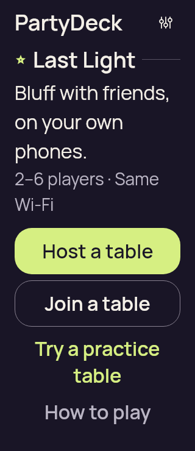</a>

`home-large-text.png` · 320 × 740 · 34,073 bytes.

SHA-256: `909474ccff4af7d929470a34a85adef677c9e6593fc78912a835e8ac699a5be5`.

**Preserved image; unviewed.** Original preserved without a direct view or an independently established reviewed-byte representative in this bounded review. Matching published bytes alone do not establish visual review.

### home-phone-landscape

`home-phone-landscape.png` · 844 × 390 · 52,464 bytes.

SHA-256: `1d2642fd1b30f32305d53076ef571f5843347bfe40bec1019fb7914604c197d4`.

**Preserved image; unviewed.** Original preserved without a direct view or an independently established reviewed-byte representative in this bounded review. Matching published bytes alone do not establish visual review.

### home-phone

<a href="../../originals/android-jvm-reports/composeApp/build/ui-snapshots/home-phone.png">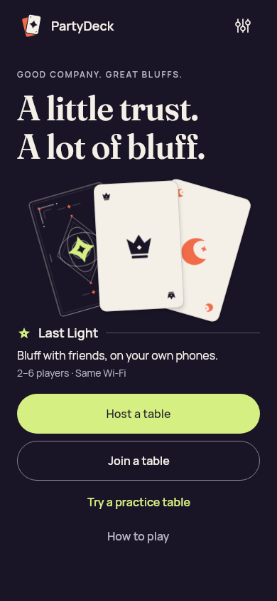</a>

`home-phone.png` · 390 × 844 · 54,944 bytes.

SHA-256: `72b504135fc293ab9a804711655dd0dc941a877f9f81fbf0e1d9171f87cff90a`.

**Preserved image; unviewed.** Original preserved without a direct view or an independently established reviewed-byte representative in this bounded review. Matching published bytes alone do not establish visual review.

### invitation-dialog-phone

`invitation-dialog-phone.png` · 320 × 733 · 42,065 bytes.

SHA-256: `5b5eb8eab231933aff6290ed9203bcb38cfd9066e078c5190a57ec12cca971f8`.

**Preserved image; unviewed.** Original preserved without a direct view or an independently established reviewed-byte representative in this bounded review. Matching published bytes alone do not establish visual review.

### invitation-qr-synthetic-320

`invitation-qr-synthetic-320.png` · 272 × 272 · 19,506 bytes.

SHA-256: `67fb32eb8071769ac7aec99e926f6871c5266687acc5c7fb7c97d273aedac294`.

**Preserved image; unviewed.** Original preserved without a direct view or an independently established reviewed-byte representative in this bounded review. Matching published bytes alone do not establish visual review.

### join-constrained-large-text-error

`join-constrained-large-text-error.png` · 320 × 420 · 26,244 bytes.

SHA-256: `db5a645b931ab8ad6a65674132bcf4b42c0b85c7f958df7788cfde6e0d27e11a`.

**Preserved image; unviewed.** Original preserved without a direct view or an independently established reviewed-byte representative in this bounded review. Matching published bytes alone do not establish visual review.

### join-constrained-large-text-input

`join-constrained-large-text-input.png` · 320 × 420 · 30,801 bytes.

SHA-256: `c85f16da4bfeb9d9e23f29dae7cb73d0093071fb3ec74a8516e0852324140a0f`.

**Preserved image; unviewed.** Original preserved without a direct view or an independently established reviewed-byte representative in this bounded review. Matching published bytes alone do not establish visual review.

### licenses-large-text-end

`licenses-large-text-end.png` · 320 × 740 · 37,115 bytes.

SHA-256: `847e393846e12692d4e9beff338bddaceeaf3848901c0665926123cd9bb53325`.

**Preserved image; unviewed.** Original preserved without a direct view or an independently established reviewed-byte representative in this bounded review. Matching published bytes alone do not establish visual review.

### licenses-large-text-first-notice

`licenses-large-text-first-notice.png` · 320 × 740 · 21,432 bytes.

SHA-256: `c2bfa5c3732d30d1313fcf51826c34bc1ec529b02f5823c7609808922743aeb9`.

**Preserved image; unviewed.** Original preserved without a direct view or an independently established reviewed-byte representative in this bounded review. Matching published bytes alone do not establish visual review.

### licenses-large-text-start

`licenses-large-text-start.png` · 320 × 740 · 41,687 bytes.

SHA-256: `8ac515a3b4509c4ab782f06fc7777fa9dcbbb9a6ddb24dfe207a102586a27193`.

**Preserved image; unviewed.** Original preserved without a direct view or an independently established reviewed-byte representative in this bounded review. Matching published bytes alone do not establish visual review.

### lobby-guest-large-text-action

`lobby-guest-large-text-action.png` · 320 × 740 · 34,611 bytes.

SHA-256: `2c595d58f3bfdd6e2e7199281037ee72c9ba606f5a63d131740d5cf41afe7813`.

**Preserved image; unviewed.** Original preserved without a direct view or an independently established reviewed-byte representative in this bounded review. Matching published bytes alone do not establish visual review.

### lobby-guest-large-text-roster

<a href="../../originals/android-jvm-reports/composeApp/build/ui-snapshots/lobby-guest-large-text-roster.png">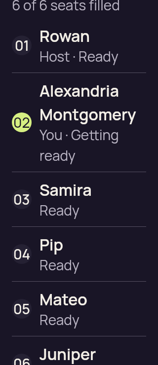</a>

`lobby-guest-large-text-roster.png` · 320 × 740 · 36,400 bytes.

SHA-256: `4997a0f1e33d492073467a276bfd6dca8fd9c1e08fc271594007694750eb6d9b`.

**Preserved image; unviewed.** Original preserved without a direct view or an independently established reviewed-byte representative in this bounded review. Matching published bytes alone do not establish visual review.

### lobby-guest-large-text

<a href="../../originals/android-jvm-reports/composeApp/build/ui-snapshots/lobby-guest-large-text.png">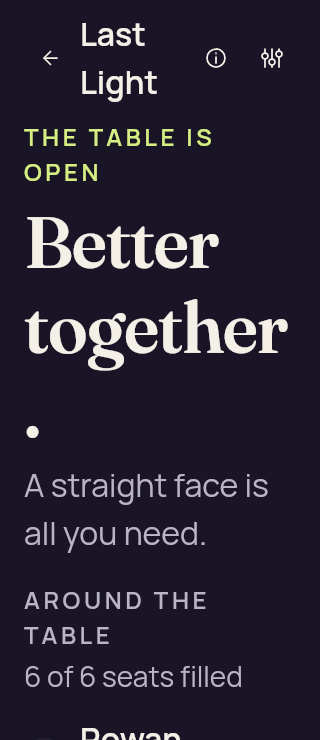</a>

`lobby-guest-large-text.png` · 320 × 740 · 29,815 bytes.

SHA-256: `d9b00abe73ecc902cc047b7f3e3483d4c351867a0b2db04b9d5cb6f61e3a794f`.

**Preserved image; unviewed.** Original preserved without a direct view or an independently established reviewed-byte representative in this bounded review. Matching published bytes alone do not establish visual review.

### lobby-guest-phone-action

<a href="../../originals/android-jvm-reports/composeApp/build/ui-snapshots/lobby-guest-phone-action.png">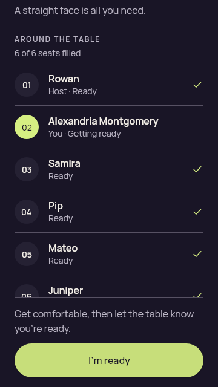</a>

`lobby-guest-phone-action.png` · 360 × 640 · 31,566 bytes.

SHA-256: `96b34247491e778c464594c1026eb085f50dca59a03f62204f6f2c7095a78029`.

**Preserved image; unviewed.** Original preserved without a direct view or an independently established reviewed-byte representative in this bounded review. Matching published bytes alone do not establish visual review.

### lobby-guest-phone-roster

`lobby-guest-phone-roster.png` · 360 × 640 · 31,322 bytes.

SHA-256: `91b14f011bd98c9404e63928405ef8f2bf9a9aa111e19ade88a94e605aad03b4`.

**Preserved image; unviewed.** Original preserved without a direct view or an independently established reviewed-byte representative in this bounded review. Matching published bytes alone do not establish visual review.

### lobby-guest-phone

`lobby-guest-phone.png` · 360 × 640 · 32,491 bytes.

SHA-256: `96c7634ec0d7836650346e3ee380a92edd85d934a45a77cae41b87269af5e65d`.

**Preserved image; unviewed.** Original preserved without a direct view or an independently established reviewed-byte representative in this bounded review. Matching published bytes alone do not establish visual review.

### lobby-host-large-text-action

<a href="../../originals/android-jvm-reports/composeApp/build/ui-snapshots/lobby-host-large-text-action.png">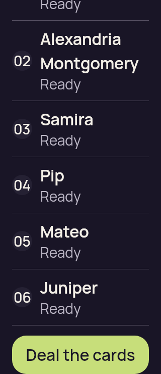</a>

`lobby-host-large-text-action.png` · 320 × 740 · 33,865 bytes.

SHA-256: `3a30b86526133a287be9be88c877866a04b6aed53fd2b5824a05b9fba9a80744`.

**Preserved image; unviewed.** Original preserved without a direct view or an independently established reviewed-byte representative in this bounded review. Matching published bytes alone do not establish visual review.

### lobby-host-large-text-roster

<a href="../../originals/android-jvm-reports/composeApp/build/ui-snapshots/lobby-host-large-text-roster.png">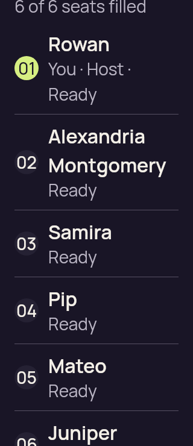</a>

`lobby-host-large-text-roster.png` · 320 × 740 · 34,777 bytes.

SHA-256: `cae3a7e483ee2a9636d19fc556b3e478d657d0d38797c9c54aea42e59dc04918`.

**Preserved image; unviewed.** Original preserved without a direct view or an independently established reviewed-byte representative in this bounded review. Matching published bytes alone do not establish visual review.

### lobby-host-large-text

`lobby-host-large-text.png` · 320 × 740 · 27,932 bytes.

SHA-256: `3e0a36f88a2e31fb662db8813035812835b56784c7573123128c39e3f066d804`.

**Preserved image; unviewed.** Original preserved without a direct view or an independently established reviewed-byte representative in this bounded review. Matching published bytes alone do not establish visual review.

### lobby-host-phone-action

`lobby-host-phone-action.png` · 360 × 640 · 30,524 bytes.

SHA-256: `96c7119a43592bb80c502afb8a04cfc775773310c1d4cab201ef9535b827b256`.

**Preserved image; unviewed.** Original preserved without a direct view or an independently established reviewed-byte representative in this bounded review. Matching published bytes alone do not establish visual review.

### lobby-host-phone-roster

`lobby-host-phone-roster.png` · 360 × 640 · 30,260 bytes.

SHA-256: `522b1669842a2d19b926dbcfbcb7ba6282af3ac5b8f9fa9fdbf66ea9c5f49682`.

**Preserved image; unviewed.** Original preserved without a direct view or an independently established reviewed-byte representative in this bounded review. Matching published bytes alone do not establish visual review.

### lobby-host-phone

`lobby-host-phone.png` · 360 × 640 · 32,611 bytes.

SHA-256: `62b8ff3cb746321051cc0295fa916ed962645f5370b5f9b83293842a4527d927`.

**Preserved image; unviewed.** Original preserved without a direct view or an independently established reviewed-byte representative in this bounded review. Matching published bytes alone do not establish visual review.

### paused-host-return-large-text

<a href="../../originals/android-jvm-reports/composeApp/build/ui-snapshots/paused-host-return-large-text.png">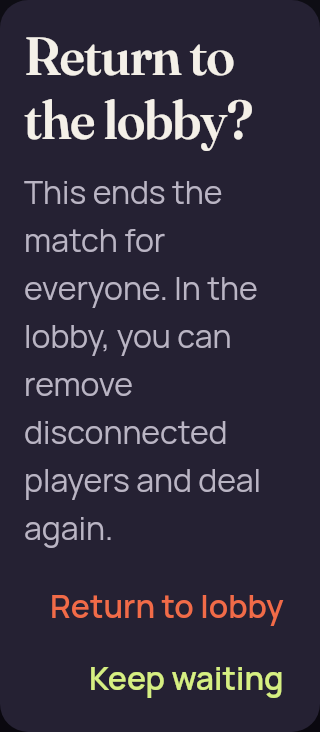</a>

`paused-host-return-large-text.png` · 320 × 732 · 37,167 bytes.

SHA-256: `c290ee19b41a269c6a86a8a6198172ab26d94d2acdc056cf73b899be32e4121f`.

**Preserved image; unviewed.** Original preserved without a direct view or an independently established reviewed-byte representative in this bounded review. Matching published bytes alone do not establish visual review.

### settings-large-text-motion

<a href="../../originals/android-jvm-reports/composeApp/build/ui-snapshots/settings-large-text-motion.png">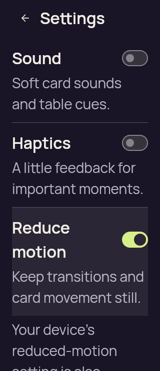</a>

`settings-large-text-motion.png` · 320 × 740 · 41,512 bytes.

SHA-256: `20576001c65f4646c75a221ce1fbe1a0a4acc9057dec2f3877ffd525fb4a478c`.

**Preserved image; unviewed.** Original preserved without a direct view or an independently established reviewed-byte representative in this bounded review. Matching published bytes alone do not establish visual review.

### settings-large-text

`settings-large-text.png` · 320 × 740 · 40,579 bytes.

SHA-256: `eb837f23b096b20059c073d85740a687a15547c464b248099dc7d7ce64602cf5`.

**Preserved image; unviewed.** Original preserved without a direct view or an independently established reviewed-byte representative in this bounded review. Matching published bytes alone do not establish visual review.
