# Android Godot session debug — CI 34538972728

Ordinary debug and optimized passed. Godot debug has 30 passes; optimized has 28 passes and two explicit renderer-death skips. The complete Validate run failed separately on iOS. All four packaged PCKs were independently verified against frozen source/export; pixel findings remain bounded to reviewed stills.

Exact source: `dd6df8a530d71b51ae4c3b0f4a05246f2e58402f`. Platform: Android emulator, native Godot debug.

**100 images**: 12 direct original view; 88 preserved image; unviewed.

[Gallery index](../../../README.md) · [Batch scope and review counts](../../../provenance/20260911-4586/review-summary.json) · [Exact source paths, hashes and timestamps](../../../provenance/20260911-4586/source-map.json).

### 2d-engine-entry-native-ready

<a href="../../originals/android-jvm-reports/build/ci/android/godot-session/debug/runtime/captures/2d-engine-entry-native-ready.png">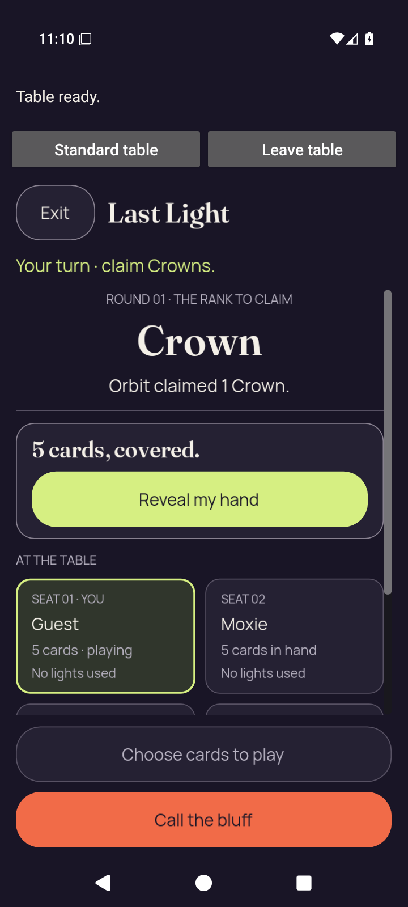</a>

`2d-engine-entry-native-ready.png` · 720 × 1600 · 148,728 bytes.

SHA-256: `765f4208e15a37e0ac66a189d58ba01ff491318dde7e56d9d4d0b01c5b1996fc`.

**[Direct original view](../../provenance/visual-review/direct-views-01.json).** 2D engine entry: hand is covered with the full Reveal my hand control visible. Standard table, Leave table, Exit, disabled Choose cards to play and Call the bluff controls fit within the portrait viewport. Guest/Moxie seat tiles are fully visible; lower seat tiles are cut at the body scroll boundary and a vertical scrollbar is visible. No private card faces are visible in this still.

Original capture window: `2026-09-10T23:10:03.175+00:00` to `2026-09-10T23:10:05.555+00:00`; PNG/XML acquired sequentially.

### 2d-engine-selected

<a href="../../originals/android-jvm-reports/build/ci/android/godot-session/debug/runtime/captures/2d-engine-selected.png">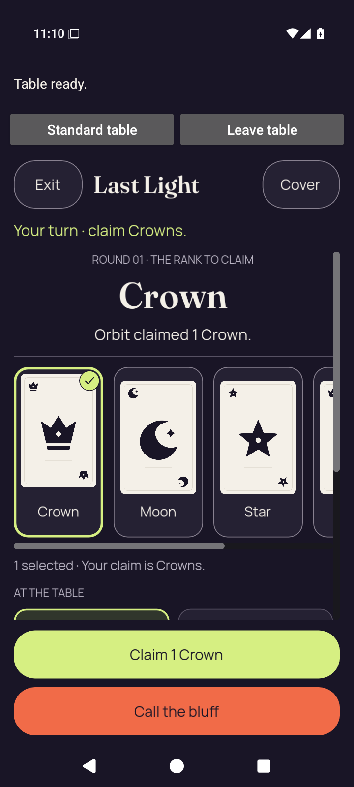</a>

`2d-engine-selected.png` · 720 × 1600 · 129,479 bytes.

SHA-256: `4cbf8c00d0992dbb1471980106e47b1e67de7095a13eac015b8e9df6fd534529`.

**[Direct original view](../../provenance/visual-review/direct-views-01.json).** 2D selected hand: Crown is selected with lime outline and check; Crown, Moon and Star faces and labels are fully visible, with a further card partially visible at the horizontal strip boundary and a horizontal scrollbar below. Selection text and full Claim 1 Crown / Call the bluff controls fit. Standard table, Leave table, Exit and Cover fit. Lower seat content is cut at the body scroll boundary. This is an intentionally revealed still; it does not establish transition privacy or scroll reachability.

Original capture window: `2026-09-10T23:10:53.736+00:00` to `2026-09-10T23:10:56.101+00:00`; PNG/XML acquired sequentially.

### 2d-engine-standard-after-play

<a href="../../originals/android-jvm-reports/build/ci/android/godot-session/debug/runtime/captures/2d-engine-standard-after-play.png">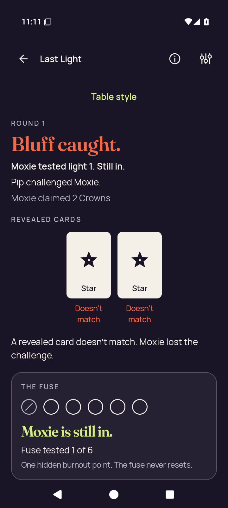</a>

`2d-engine-standard-after-play.png` · 720 × 1600 · 102,899 bytes.

SHA-256: `b8021afda6027eee2845cf58dd9603508625a7b5b6d8d304c5fb5e8acc689ac8`.

**[Direct original view](../../provenance/visual-review/direct-views-02.json).** Standard public outcome after play: Round 1 Bluff caught, Pip challenged Moxie, Moxie claimed 2 Crowns. Two public Star proof cards and their Does not match labels fit. The full fuse panel, Moxie is still in and Fuse tested 1 of 6 text fit above system navigation. No continuation control is visible at this scroll position. Public challenge proof is not a private-hand exposure finding.

Original capture window: `2026-09-10T23:11:23.122+00:00` to `2026-09-10T23:11:25.492+00:00`; PNG/XML acquired sequentially.

### 2d-recents-resumed

`2d-recents-resumed.png` · 720 × 1600 · 147,843 bytes.

SHA-256: `e6602f081a077d94809ea86c4d206f18fc505318a609c84ed7d06c59eab1029d`.

**[Direct original view](../../provenance/visual-review/direct-views-05.json).** 2D resumed still: table is ready, Moon claim is public, and the hand is covered with full Reveal my hand control. Standard table / Leave table / Exit, disabled Choose cards to play and Call the bluff all fit. Guest/Moxie seat tiles fit and lower tiles are clipped at the vertical body scroll boundary. No private faces appear in this resumed still; no continuous transition timing is inferred.

Original capture window: `2026-09-10T23:05:18.291+00:00` to `2026-09-10T23:05:20.654+00:00`; PNG/XML acquired sequentially.

### 2d-recents-system-ui

`2d-recents-system-ui.png` · 720 × 1600 · 41,961 bytes.

SHA-256: `8876870ded565c01e0a283b68fd37c2121d62d5f1db52be5ddd1ddb40effc28c`.

**[Direct original view](../../provenance/visual-review/direct-views-05.json).** Android Recents system UI: the app preview contains a dark privacy shell with Your cards stay private text and Standard table / Leave table controls. No card faces or hand artwork appear in the preview. The app icon and Screenshot system action are visible outside the preview. This single Recents still does not prove every transition frame was concealed.

Original capture window: `2026-09-10T23:05:13.159+00:00` to `2026-09-10T23:05:15.506+00:00`; PNG/XML acquired sequentially.

### 2d-standard-concealed

`2d-standard-concealed.png` · 720 × 1600 · 127,977 bytes.

SHA-256: `a055cbb98f95e2675b675ca1070e681433c934eb65773079ce753e24735493d8`.

**[Direct original view](../../provenance/visual-review/direct-views-02.json).** Standard concealed hand: the full Show hand control, explanatory copy, disabled Select cards and Challenge Orbit action fit. Only card-back artwork is shown; no private hand faces are visible. Public Moon table / Orbit claims 2 Moons information is readable. The visible seat row shows You, Moxie and Pip; no interaction or offscreen reachability is inferred.

Original capture window: `2026-09-10T23:05:27.821+00:00` to `2026-09-10T23:05:30.186+00:00`; PNG/XML acquired sequentially.

### 3d-engine-entry-native-ready

<a href="../../originals/android-jvm-reports/build/ci/android/godot-session/debug/runtime/captures/3d-engine-entry-native-ready.png">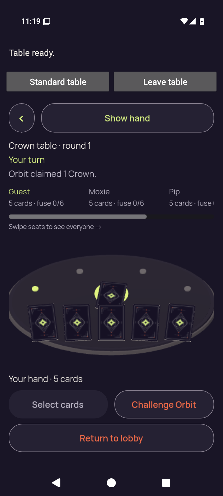</a>

`3d-engine-entry-native-ready.png` · 720 × 1600 · 188,986 bytes.

SHA-256: `4d8bd40b279c4e9930c85f0eb4c63b2dff81ef9ec0cb204742f9a2b7e4e4a8ca`.

**[Direct original view](../../provenance/visual-review/direct-views-03.json).** 3D engine entry: five hand card backs and one public pile back appear on the oval table; no private faces are visible. Show hand, Standard table, Leave table, disabled Select cards, Challenge Orbit and Return to lobby fit. The rightmost visible seat text is clipped at a horizontal scroll boundary, with both a scrollbar and Swipe seats to see everyone instruction. Table/card artwork has visibly coarse edges beside crisp interface text; this still does not establish the renderer-density cause.

Original capture window: `2026-09-10T23:19:38.930+00:00` to `2026-09-10T23:19:41.325+00:00`; PNG/XML acquired sequentially.

### 3d-engine-selected

<a href="../../originals/android-jvm-reports/build/ci/android/godot-session/debug/runtime/captures/3d-engine-selected.png">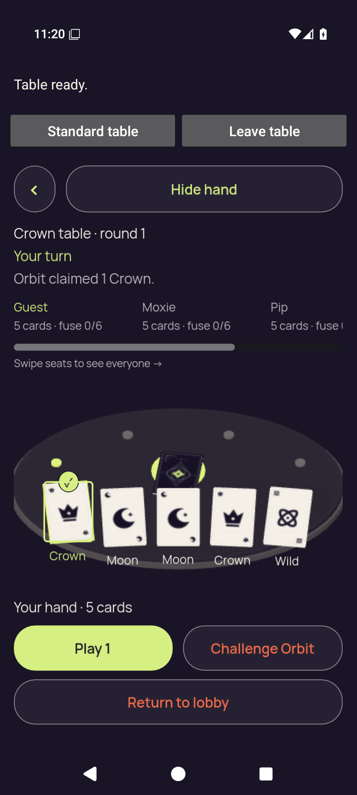</a>

`3d-engine-selected.png` · 720 × 1600 · 183,745 bytes.

SHA-256: `661bd403e283092addff0334a07baa7e6ae714bf65fbaf561db0d1865b84e1df`.

**[Direct original view](../../provenance/visual-review/direct-views-03.json).** 3D selected hand: five faces and labels fit (Crown, Moon, Moon, Crown, Wild). The first Crown has a lime outline and check; full Play 1, Challenge Orbit, Return to lobby and Hide hand controls fit. Right seat text remains clipped at the explicitly indicated horizontal scroll boundary. Table/card edges look coarser than the overlay text. Intentionally revealed hand; no continuous transition or device renderer qualification is inferred.

Original capture window: `2026-09-10T23:20:29.614+00:00` to `2026-09-10T23:20:31.984+00:00`; PNG/XML acquired sequentially.

### 3d-engine-standard-after-play

<a href="../../originals/android-jvm-reports/build/ci/android/godot-session/debug/runtime/captures/3d-engine-standard-after-play.png">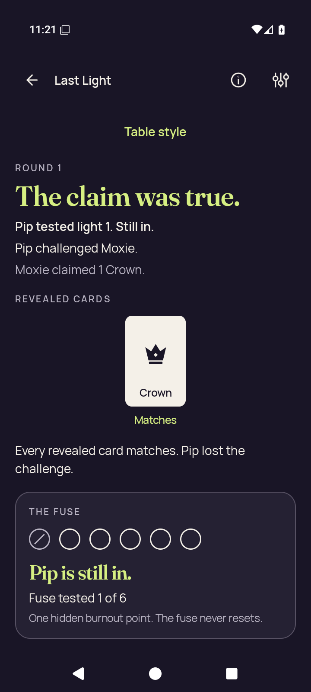</a>

`3d-engine-standard-after-play.png` · 720 × 1600 · 91,082 bytes.

SHA-256: `754d9065c9291d8b43ad232bb595f42e0d210c637e720a6d7fdc9f4efb2d269d`.

**[Direct original view](../../provenance/visual-review/direct-views-04.json).** Standard public outcome after 3D play: The claim was true, Pip challenged Moxie, Moxie claimed 1 Crown. One public Crown proof card, Matches label, challenge explanation and the full Pip is still in / Fuse tested 1 of 6 panel fit above system navigation. No continuation control is visible at this scroll position. Public challenge proof is not a private-hand exposure finding.

Original capture window: `2026-09-10T23:20:58.754+00:00` to `2026-09-10T23:21:01.115+00:00`; PNG/XML acquired sequentially.

### 3d-recents-resumed

<a href="../../originals/android-jvm-reports/build/ci/android/godot-session/debug/runtime/captures/3d-recents-resumed.png">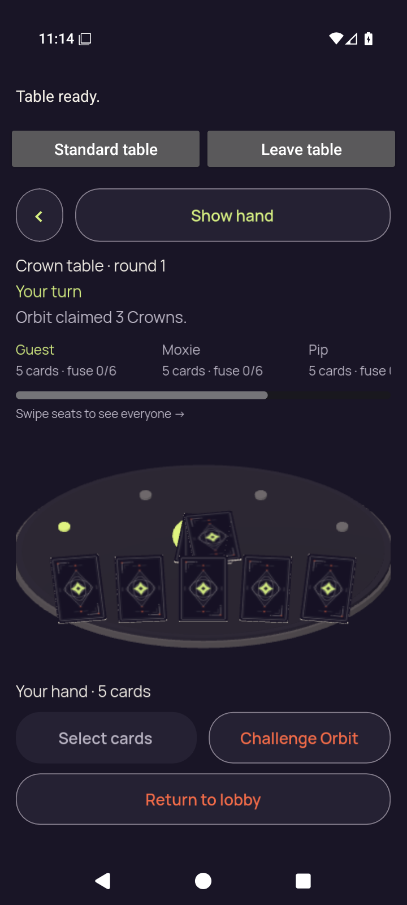</a>

`3d-recents-resumed.png` · 720 × 1600 · 191,415 bytes.

SHA-256: `5e0d854d2aefe55aebf7b7561a02679def4f2ed7d570b8380d75400a8c4302f6`.

**[Direct original view](../../provenance/visual-review/direct-views-06.json).** 3D resumed still: five hand backs and public pile backs are visible on the oval table, with Show hand and disabled Select cards. Standard table / Leave table, Challenge Orbit and Return to lobby fit. Right seat text clips at the horizontal boundary with scrollbar and swipe instruction. No private faces appear in this resumed still. Table/card artwork remains visibly coarser than text; no cause or physical-device quality inference.

Original capture window: `2026-09-10T23:14:44.864+00:00` to `2026-09-10T23:14:47.261+00:00`; PNG/XML acquired sequentially.

### 3d-recents-system-ui

<a href="../../originals/android-jvm-reports/build/ci/android/godot-session/debug/runtime/captures/3d-recents-system-ui.png">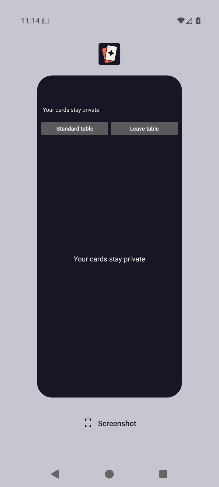</a>

`3d-recents-system-ui.png` · 720 × 1600 · 41,351 bytes.

SHA-256: `38ea37f838f233f9565c1bbd073e588548592fa6f75fd723e3b6b1c52543475f`.

**[Direct original view](../../provenance/visual-review/direct-views-06.json).** Android Recents in 3D route: the app preview is a dark privacy shell with Your cards stay private text and Standard table / Leave table controls. No card faces or table artwork appear in the preview; the app icon and Screenshot action are system UI outside it. Only this retained still is assessed, without a continuous-transition claim.

Original capture window: `2026-09-10T23:14:39.657+00:00` to `2026-09-10T23:14:42.026+00:00`; PNG/XML acquired sequentially.

### 3d-standard-concealed

`3d-standard-concealed.png` · 720 × 1600 · 130,520 bytes.

SHA-256: `82bf09e187e4df8d642a5caae9dddfba7d38c0438d5e57b964f25cc690316c99`.

**[Direct original view](../../provenance/visual-review/direct-views-04.json).** Standard concealed hand in 3D test route: full Show hand, disabled Select cards and Challenge Orbit controls fit, with public Crown table and Orbit claims 3 Crowns copy readable. Hand artwork shows only backs; no private faces are visible in this still. Visible seats and explanatory copy fit.

Original capture window: `2026-09-10T23:14:54.386+00:00` to `2026-09-10T23:14:56.770+00:00`; PNG/XML acquired sequentially.

### 2d-action-entry-native-ready

`2d-action-entry-native-ready.png` · 720 × 1600 · 147,906 bytes.

SHA-256: `7236c0a5decfa6aa445f0ca78cf4408003e066ef5fdc8269fb828a1777794db4`.

**Preserved image; unviewed.** Original preserved without a direct view or an independently established reviewed-byte representative in this bounded review. Matching published bytes alone do not establish visual review.

Original capture window: `2026-09-10T23:08:03.871+00:00` to `2026-09-10T23:08:06.221+00:00`; PNG/XML acquired sequentially.

### 2d-action-entry-selected

<a href="../../originals/android-jvm-reports/build/ci/android/godot-session/debug/runtime/captures/2d-action-entry-selected.png">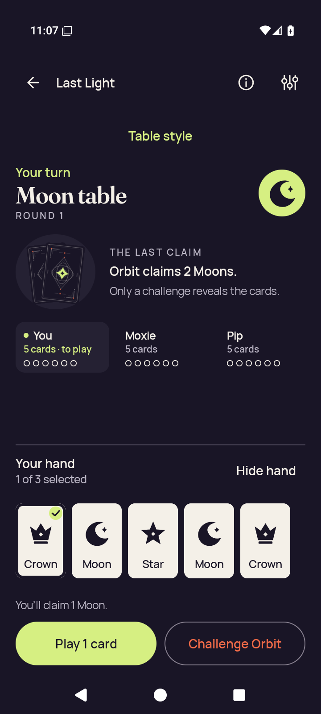</a>

`2d-action-entry-selected.png` · 720 × 1600 · 122,703 bytes.

SHA-256: `d4503ffe13d26aa18540099f5d62210b2e56c2b7c005ecca1601cd0bb7878752`.

**Preserved image; unviewed.** Original preserved without a direct view or an independently established reviewed-byte representative in this bounded review. Matching published bytes alone do not establish visual review.

Original capture window: `2026-09-10T23:07:44.175+00:00` to `2026-09-10T23:07:46.537+00:00`; PNG/XML acquired sequentially.

### 2d-action-entry-selector

`2d-action-entry-selector.png` · 720 × 1600 · 58,090 bytes.

SHA-256: `0222f9ef9462c0fd818106808362c6c20b82a3f36289c9da5745682a12098a68`.

**Preserved image; unviewed.** Original preserved without a direct view or an independently established reviewed-byte representative in this bounded review. Matching published bytes alone do not establish visual review.

Original capture window: `2026-09-10T23:07:53.218+00:00` to `2026-09-10T23:07:55.559+00:00`; PNG/XML acquired sequentially.

### 2d-action-return-concealed

`2d-action-return-concealed.png` · 720 × 1600 · 128,057 bytes.

SHA-256: `df138083efd02845f619e00425315e7c860ba159e0c67d62011c7f3271db9e44`.

**Preserved image; unviewed.** Original preserved without a direct view or an independently established reviewed-byte representative in this bounded review. Matching published bytes alone do not establish visual review.

Original capture window: `2026-09-10T23:08:13.382+00:00` to `2026-09-10T23:08:15.739+00:00`; PNG/XML acquired sequentially.

### 2d-action-return-first-card

`2d-action-return-first-card.png` · 720 × 1600 · 123,522 bytes.

SHA-256: `70dd5209fa574cd964aa353d8934a1a7b71984d0c4ef72ba79bbe941558c679f`.

**Preserved image; unviewed.** Original preserved without a direct view or an independently established reviewed-byte representative in this bounded review. Matching published bytes alone do not establish visual review.

Original capture window: `2026-09-10T23:08:28.666+00:00` to `2026-09-10T23:08:31.036+00:00`; PNG/XML acquired sequentially.

### 2d-action-return-public

`2d-action-return-public.png` · 720 × 1600 · 128,057 bytes.

SHA-256: `df138083efd02845f619e00425315e7c860ba159e0c67d62011c7f3271db9e44`.

**Preserved image; unviewed.** Original preserved without a direct view or an independently established reviewed-byte representative in this bounded review. Matching published bytes alone do not establish visual review.

Original capture window: `2026-09-10T23:08:22.153+00:00` to `2026-09-10T23:08:24.514+00:00`; PNG/XML acquired sequentially.

### 2d-action-return-selection-cleared

`2d-action-return-selection-cleared.png` · 720 × 1600 · 128,057 bytes.

SHA-256: `df138083efd02845f619e00425315e7c860ba159e0c67d62011c7f3271db9e44`.

**Preserved image; unviewed.** Original preserved without a direct view or an independently established reviewed-byte representative in this bounded review. Matching published bytes alone do not establish visual review.

Original capture window: `2026-09-10T23:08:17.767+00:00` to `2026-09-10T23:08:20.119+00:00`; PNG/XML acquired sequentially.

### 2d-baseline-first-card

`2d-baseline-first-card.png` · 720 × 1600 · 123,244 bytes.

SHA-256: `39ed6ba76bd180f17c840a5b33d8480b50153343d50dbd319cfc2e383528eed4`.

**Preserved image; unviewed.** Original preserved without a direct view or an independently established reviewed-byte representative in this bounded review. Matching published bytes alone do not establish visual review.

Original capture window: `2026-09-10T23:02:51.579+00:00` to `2026-09-10T23:02:53.976+00:00`; PNG/XML acquired sequentially.

### 2d-baseline-public

`2d-baseline-public.png` · 720 × 1600 · 127,719 bytes.

SHA-256: `8b434da817daa33b1bbaa9d433a1cb3cb8d504b656f7a59e3feb198402520300`.

**Preserved image; unviewed.** Original preserved without a direct view or an independently established reviewed-byte representative in this bounded review. Matching published bytes alone do not establish visual review.

Original capture window: `2026-09-10T23:02:44.984+00:00` to `2026-09-10T23:02:47.363+00:00`; PNG/XML acquired sequentially.

### 2d-baseline-selected

`2d-baseline-selected.png` · 720 × 1600 · 122,522 bytes.

SHA-256: `35249e90536b81d229af97096bf611bc226e4034c400d6016fcb54bf2c5d6473`.

**Preserved image; unviewed.** Original preserved without a direct view or an independently established reviewed-byte representative in this bounded review. Matching published bytes alone do not establish visual review.

Original capture window: `2026-09-10T23:04:37.809+00:00` to `2026-09-10T23:04:40.186+00:00`; PNG/XML acquired sequentially.

### 2d-death-native-ready

`2d-death-native-ready.png` · 720 × 1600 · 147,887 bytes.

SHA-256: `2e45fa382ae8eda96f408c508a0edd1fed33679884e22f0b3b535c00d637b515`.

**Preserved image; unviewed.** Original preserved without a direct view or an independently established reviewed-byte representative in this bounded review. Matching published bytes alone do not establish visual review.

Original capture window: `2026-09-10T23:06:11.162+00:00` to `2026-09-10T23:06:13.517+00:00`; PNG/XML acquired sequentially.

### 2d-death-return-concealed

`2d-death-return-concealed.png` · 720 × 1600 · 128,016 bytes.

SHA-256: `bbcd241f661bf0c2086deebac57d0006c822cd8fd6dfc1223998b1783178e159`.

**Preserved image; unviewed.** Original preserved without a direct view or an independently established reviewed-byte representative in this bounded review. Matching published bytes alone do not establish visual review.

Original capture window: `2026-09-10T23:06:18.168+00:00` to `2026-09-10T23:06:20.578+00:00`; PNG/XML acquired sequentially.

### 2d-death-return-first-card

<a href="../../originals/android-jvm-reports/build/ci/android/godot-session/debug/runtime/captures/2d-death-return-first-card.png">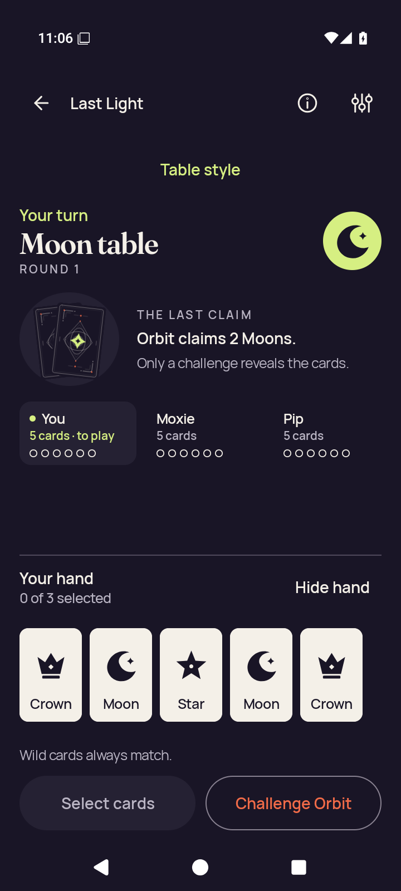</a>

`2d-death-return-first-card.png` · 720 × 1600 · 123,328 bytes.

SHA-256: `1c881763528e3d032073bb3a5d3c947d13fa77e5b6d0d7c282e0eb91355a8a0c`.

**Preserved image; unviewed.** Original preserved without a direct view or an independently established reviewed-byte representative in this bounded review. Matching published bytes alone do not establish visual review.

Original capture window: `2026-09-10T23:06:33.537+00:00` to `2026-09-10T23:06:35.915+00:00`; PNG/XML acquired sequentially.

### 2d-death-return-public

<a href="../../originals/android-jvm-reports/build/ci/android/godot-session/debug/runtime/captures/2d-death-return-public.png">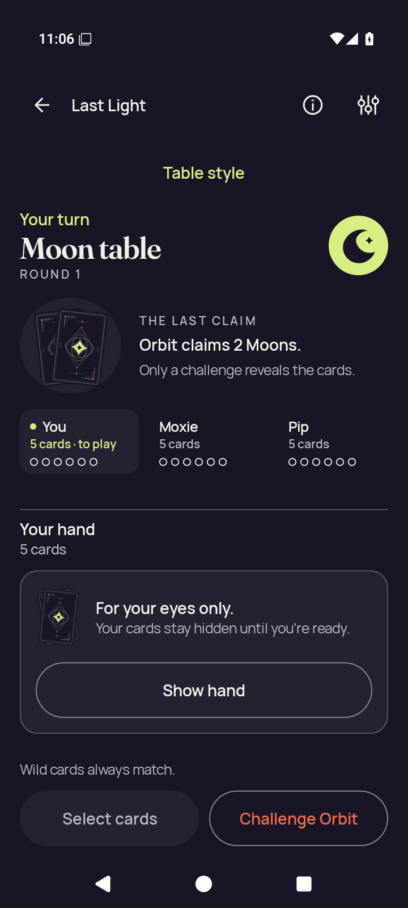</a>

`2d-death-return-public.png` · 720 × 1600 · 127,820 bytes.

SHA-256: `aec37dc36838c2c6004a5b9f868dee7d355d40406bca022df3df73366d976d3c`.

**Preserved image; unviewed.** Original preserved without a direct view or an independently established reviewed-byte representative in this bounded review. Matching published bytes alone do not establish visual review.

Original capture window: `2026-09-10T23:06:27.016+00:00` to `2026-09-10T23:06:29.376+00:00`; PNG/XML acquired sequentially.

### 2d-death-return-selection-cleared

<a href="../../originals/android-jvm-reports/build/ci/android/godot-session/debug/runtime/captures/2d-death-return-selection-cleared.png">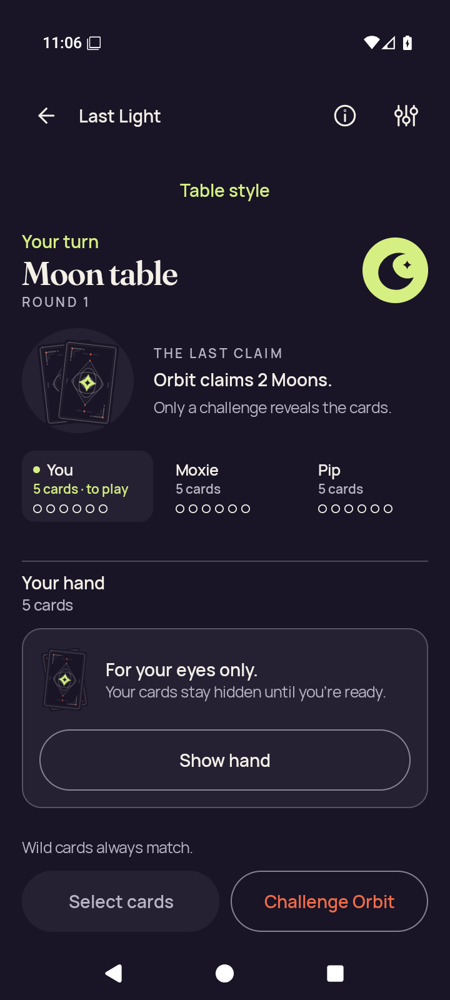</a>

`2d-death-return-selection-cleared.png` · 720 × 1600 · 128,016 bytes.

SHA-256: `bbcd241f661bf0c2086deebac57d0006c822cd8fd6dfc1223998b1783178e159`.

**Preserved image; unviewed.** Original preserved without a direct view or an independently established reviewed-byte representative in this bounded review. Matching published bytes alone do not establish visual review.

Original capture window: `2026-09-10T23:06:22.616+00:00` to `2026-09-10T23:06:24.979+00:00`; PNG/XML acquired sequentially.

### 2d-death-selected

`2d-death-selected.png` · 720 × 1600 · 122,911 bytes.

SHA-256: `91f608a61fff9684e714c3691b3951910ee9e883f3e9811eb3cc512a074fc67c`.

**Preserved image; unviewed.** Original preserved without a direct view or an independently established reviewed-byte representative in this bounded review. Matching published bytes alone do not establish visual review.

Original capture window: `2026-09-10T23:05:51.717+00:00` to `2026-09-10T23:05:54.081+00:00`; PNG/XML acquired sequentially.

### 2d-death-selector

<a href="../../originals/android-jvm-reports/build/ci/android/godot-session/debug/runtime/captures/2d-death-selector.png">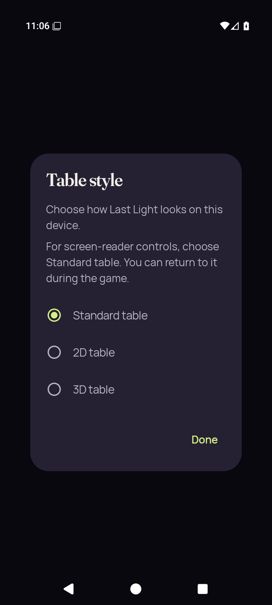</a>

`2d-death-selector.png` · 720 × 1600 · 58,340 bytes.

SHA-256: `00dc024aab4f5ae534ccc1f4982322c911a1e2ba9f30f646ff48cee5e41ba2c0`.

**Preserved image; unviewed.** Original preserved without a direct view or an independently established reviewed-byte representative in this bounded review. Matching published bytes alone do not establish visual review.

Original capture window: `2026-09-10T23:06:00.718+00:00` to `2026-09-10T23:06:03.063+00:00`; PNG/XML acquired sequentially.

### 2d-engine-baseline-first-card

<a href="../../originals/android-jvm-reports/build/ci/android/godot-session/debug/runtime/captures/2d-engine-baseline-first-card.png">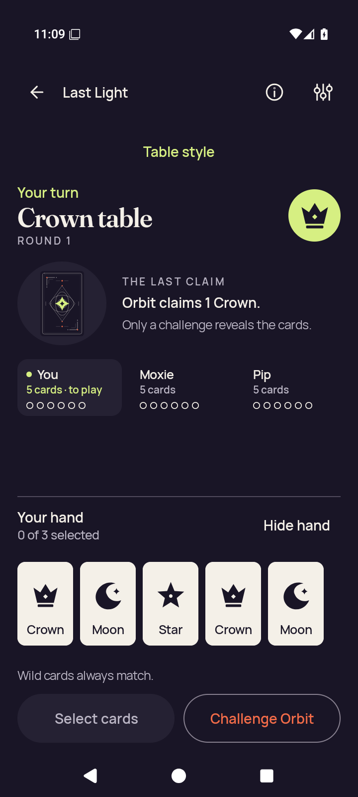</a>

`2d-engine-baseline-first-card.png` · 720 × 1600 · 115,194 bytes.

SHA-256: `af0efbd97ed69de1648b0102ae2ea03ecc2363a79357ef2a741c646daa48f18e`.

**Preserved image; unviewed.** Original preserved without a direct view or an independently established reviewed-byte representative in this bounded review. Matching published bytes alone do not establish visual review.

Original capture window: `2026-09-10T23:09:34.889+00:00` to `2026-09-10T23:09:37.260+00:00`; PNG/XML acquired sequentially.

### 2d-engine-baseline-public

`2d-engine-baseline-public.png` · 720 × 1600 · 120,058 bytes.

SHA-256: `09c28d9752aba83f5e0bf5dc0889fd97d67164a024ece52497f9ea28f6b618bf`.

**Preserved image; unviewed.** Original preserved without a direct view or an independently established reviewed-byte representative in this bounded review. Matching published bytes alone do not establish visual review.

Original capture window: `2026-09-10T23:09:28.380+00:00` to `2026-09-10T23:09:30.745+00:00`; PNG/XML acquired sequentially.

### 2d-engine-entry-selector

`2d-engine-entry-selector.png` · 720 × 1600 · 58,304 bytes.

SHA-256: `8ac6b291260483b601675638a8eb42176ecba8e37b5d92d2b9bc2ce89a1f83cf`.

**Preserved image; unviewed.** Original preserved without a direct view or an independently established reviewed-byte representative in this bounded review. Matching published bytes alone do not establish visual review.

Original capture window: `2026-09-10T23:09:52.451+00:00` to `2026-09-10T23:09:54.809+00:00`; PNG/XML acquired sequentially.

### 2d-engine-home

`2d-engine-home.png` · 720 × 1600 · 131,090 bytes.

SHA-256: `31354db6763a75a01cfdc1635f492fbb860be1493ce0fb39dd166664c615584b`.

**Preserved image; unviewed.** Original preserved without a direct view or an independently established reviewed-byte representative in this bounded review. Matching published bytes alone do not establish visual review.

Original capture window: `2026-09-10T23:11:56.088+00:00` to `2026-09-10T23:11:58.503+00:00`; PNG/XML acquired sequentially.

### 2d-engine-leave-confirmation

`2d-engine-leave-confirmation.png` · 720 × 1600 · 39,884 bytes.

SHA-256: `698ffb2cf795bf02eac1360095a76a119da5e369e2941ec8f2b5a46546cfaeaf`.

**Preserved image; unviewed.** Original preserved without a direct view or an independently established reviewed-byte representative in this bounded review. Matching published bytes alone do not establish visual review.

Original capture window: `2026-09-10T23:11:47.259+00:00` to `2026-09-10T23:11:49.625+00:00`; PNG/XML acquired sequentially.

### 2d-engine-leave-selector

`2d-engine-leave-selector.png` · 720 × 1600 · 57,214 bytes.

SHA-256: `b0dbf18433e5fc86b931a2f39c3efa7a35554f47e51997a748c133a803a34dd6`.

**Preserved image; unviewed.** Original preserved without a direct view or an independently established reviewed-byte representative in this bounded review. Matching published bytes alone do not establish visual review.

Original capture window: `2026-09-10T23:11:31.996+00:00` to `2026-09-10T23:11:34.365+00:00`; PNG/XML acquired sequentially.

### 2d-entry-native-ready

`2d-entry-native-ready.png` · 720 × 1600 · 147,409 bytes.

SHA-256: `5ddd295be3cff6c9fc8591d5b71679e28c934cfca8cbd177cf5da125c1aea57b`.

**Preserved image; unviewed.** Original preserved without a direct view or an independently established reviewed-byte representative in this bounded review. Matching published bytes alone do not establish visual review.

Original capture window: `2026-09-10T23:04:57.598+00:00` to `2026-09-10T23:04:59.933+00:00`; PNG/XML acquired sequentially.

### 2d-entry-selector

<a href="../../originals/android-jvm-reports/build/ci/android/godot-session/debug/runtime/captures/2d-entry-selector.png">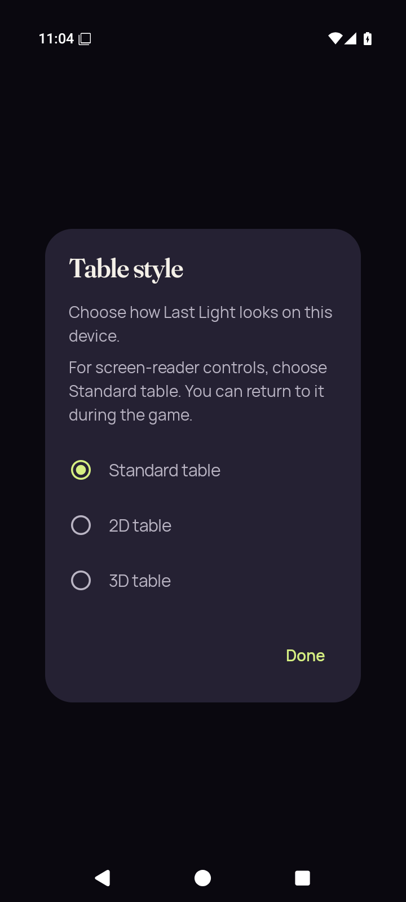</a>

`2d-entry-selector.png` · 720 × 1600 · 57,894 bytes.

SHA-256: `19bd092c5e6c25585b6b4fcd30c19178bc0502af9d13197320c2287a7250e07f`.

**Preserved image; unviewed.** Original preserved without a direct view or an independently established reviewed-byte representative in this bounded review. Matching published bytes alone do not establish visual review.

Original capture window: `2026-09-10T23:04:47.057+00:00` to `2026-09-10T23:04:49.396+00:00`; PNG/XML acquired sequentially.

### 2d-home-after-session-end

<a href="../../originals/android-jvm-reports/build/ci/android/godot-session/debug/runtime/captures/2d-home-after-session-end.png">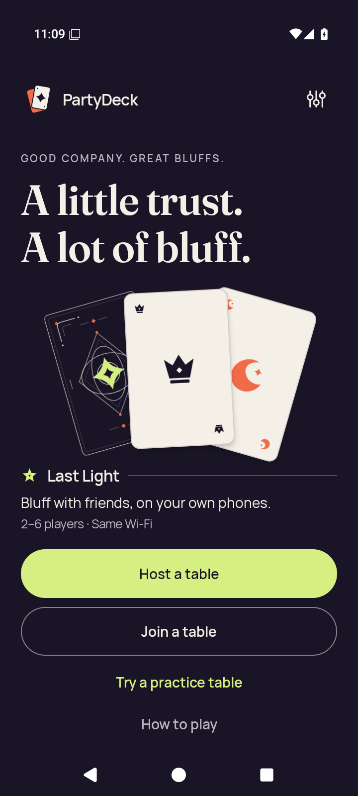</a>

`2d-home-after-session-end.png` · 720 × 1600 · 131,878 bytes.

SHA-256: `7b566ee982747fe3ffb2690e3ea00fe46203a9fb7222a50808acc8171d67bfb4`.

**Preserved image; unviewed.** Original preserved without a direct view or an independently established reviewed-byte representative in this bounded review. Matching published bytes alone do not establish visual review.

Original capture window: `2026-09-10T23:09:15.653+00:00` to `2026-09-10T23:09:18.012+00:00`; PNG/XML acquired sequentially.

### 2d-home-resumed

`2d-home-resumed.png` · 720 × 1600 · 147,843 bytes.

SHA-256: `e6602f081a077d94809ea86c4d206f18fc505318a609c84ed7d06c59eab1029d`.

**Preserved image; unviewed.** Original preserved without a direct view or an independently established reviewed-byte representative in this bounded review. Matching published bytes alone do not establish visual review.

Original capture window: `2026-09-10T23:05:08.165+00:00` to `2026-09-10T23:05:10.523+00:00`; PNG/XML acquired sequentially.

### 2d-home-system-ui

<a href="../../originals/android-jvm-reports/build/ci/android/godot-session/debug/runtime/captures/2d-home-system-ui.png">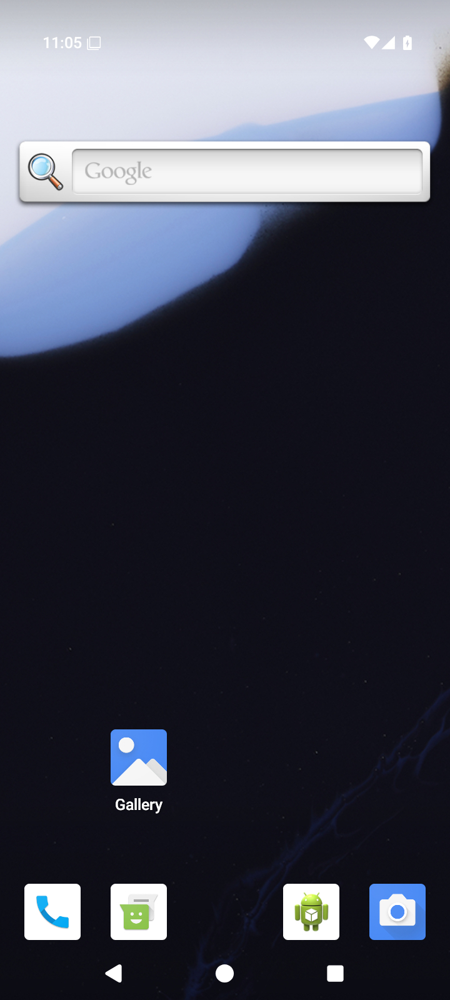</a>

`2d-home-system-ui.png` · 720 × 1600 · 746,194 bytes.

SHA-256: `4d373db144e81bf8178d33563d2286b75132082b2d66554180cef851f3d125fd`.

**Preserved image; unviewed.** Original preserved without a direct view or an independently established reviewed-byte representative in this bounded review. Matching published bytes alone do not establish visual review.

Original capture window: `2026-09-10T23:05:02.625+00:00` to `2026-09-10T23:05:05.311+00:00`; PNG/XML acquired sequentially.

### 2d-leave-cancel-confirmation

`2d-leave-cancel-confirmation.png` · 720 × 1600 · 40,603 bytes.

SHA-256: `af0ae58bb008e8cf7bb108bcd74008bddb013728fa665fe059d9e04b370ff33a`.

**Preserved image; unviewed.** Original preserved without a direct view or an independently established reviewed-byte representative in this bounded review. Matching published bytes alone do not establish visual review.

Original capture window: `2026-09-10T23:07:11.391+00:00` to `2026-09-10T23:07:13.741+00:00`; PNG/XML acquired sequentially.

### 2d-leave-cancel-native-ready

<a href="../../originals/android-jvm-reports/build/ci/android/godot-session/debug/runtime/captures/2d-leave-cancel-native-ready.png">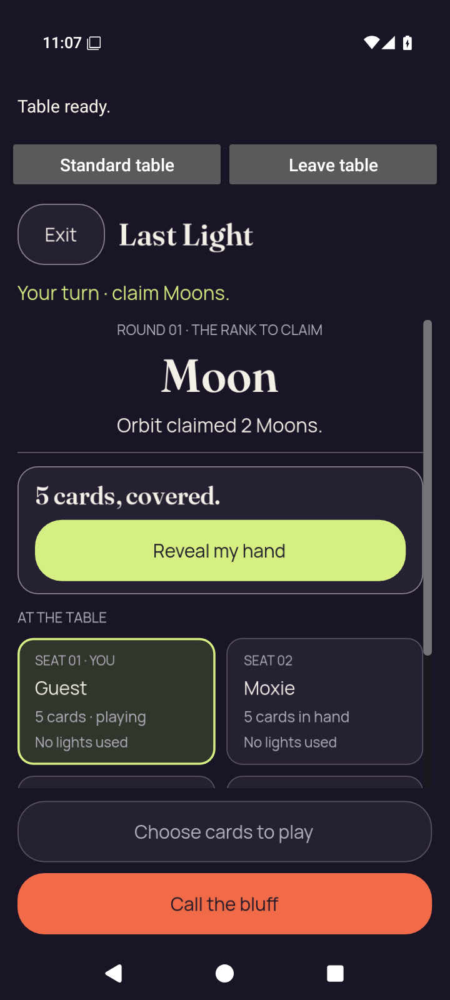</a>

`2d-leave-cancel-native-ready.png` · 720 × 1600 · 147,440 bytes.

SHA-256: `3fc1ad7826f015cfb717d6965a3a85fe12238a36ead0b408635fbab4f333fcef`.

**Preserved image; unviewed.** Original preserved without a direct view or an independently established reviewed-byte representative in this bounded review. Matching published bytes alone do not establish visual review.

Original capture window: `2026-09-10T23:07:01.805+00:00` to `2026-09-10T23:07:04.170+00:00`; PNG/XML acquired sequentially.

### 2d-leave-cancel-return-concealed

`2d-leave-cancel-return-concealed.png` · 720 × 1600 · 127,738 bytes.

SHA-256: `64d4deeb5fa7d9cf3f4bc973252ab4e6c800d5b6ea9288a0b77906519ead4e25`.

**Preserved image; unviewed.** Original preserved without a direct view or an independently established reviewed-byte representative in this bounded review. Matching published bytes alone do not establish visual review.

Original capture window: `2026-09-10T23:07:20.125+00:00` to `2026-09-10T23:07:22.497+00:00`; PNG/XML acquired sequentially.

### 2d-leave-cancel-return-first-card

`2d-leave-cancel-return-first-card.png` · 720 × 1600 · 123,256 bytes.

SHA-256: `c1472ebe4c85fe5a589cbaad066a37de6aeb77fbd55d6be03c72a3b33abe8387`.

**Preserved image; unviewed.** Original preserved without a direct view or an independently established reviewed-byte representative in this bounded review. Matching published bytes alone do not establish visual review.

Original capture window: `2026-09-10T23:07:35.466+00:00` to `2026-09-10T23:07:37.824+00:00`; PNG/XML acquired sequentially.

### 2d-leave-cancel-return-public

`2d-leave-cancel-return-public.png` · 720 × 1600 · 127,738 bytes.

SHA-256: `64d4deeb5fa7d9cf3f4bc973252ab4e6c800d5b6ea9288a0b77906519ead4e25`.

**Preserved image; unviewed.** Original preserved without a direct view or an independently established reviewed-byte representative in this bounded review. Matching published bytes alone do not establish visual review.

Original capture window: `2026-09-10T23:07:28.938+00:00` to `2026-09-10T23:07:31.311+00:00`; PNG/XML acquired sequentially.

### 2d-leave-cancel-return-selection-cleared

`2d-leave-cancel-return-selection-cleared.png` · 720 × 1600 · 127,738 bytes.

SHA-256: `64d4deeb5fa7d9cf3f4bc973252ab4e6c800d5b6ea9288a0b77906519ead4e25`.

**Preserved image; unviewed.** Original preserved without a direct view or an independently established reviewed-byte representative in this bounded review. Matching published bytes alone do not establish visual review.

Original capture window: `2026-09-10T23:07:24.531+00:00` to `2026-09-10T23:07:26.899+00:00`; PNG/XML acquired sequentially.

### 2d-leave-cancel-selected

`2d-leave-cancel-selected.png` · 720 × 1600 · 122,779 bytes.

SHA-256: `55c35711a3f9407758303d8325f14b4ccf1529e004c5a829ded6efdd1968623a`.

**Preserved image; unviewed.** Original preserved without a direct view or an independently established reviewed-byte representative in this bounded review. Matching published bytes alone do not establish visual review.

Original capture window: `2026-09-10T23:06:42.256+00:00` to `2026-09-10T23:06:44.623+00:00`; PNG/XML acquired sequentially.

### 2d-leave-cancel-selector

`2d-leave-cancel-selector.png` · 720 × 1600 · 58,166 bytes.

SHA-256: `d66c3016b6a189d44e4c7b711aac4ccd3271dedbd17f35f0ccceb19945da84ca`.

**Preserved image; unviewed.** Original preserved without a direct view or an independently established reviewed-byte representative in this bounded review. Matching published bytes alone do not establish visual review.

Original capture window: `2026-09-10T23:06:51.270+00:00` to `2026-09-10T23:06:53.623+00:00`; PNG/XML acquired sequentially.

### 2d-leave-end-confirmation

`2d-leave-end-confirmation.png` · 720 × 1600 · 40,852 bytes.

SHA-256: `39a07f9c4273d8542e51931fc6bafaa4c2f5016ef9ecd4dbff0f92f92ed522e9`.

**Preserved image; unviewed.** Original preserved without a direct view or an independently established reviewed-byte representative in this bounded review. Matching published bytes alone do not establish visual review.

Original capture window: `2026-09-10T23:09:06.858+00:00` to `2026-09-10T23:09:09.217+00:00`; PNG/XML acquired sequentially.

### 2d-leave-end-selector

`2d-leave-end-selector.png` · 720 × 1600 · 58,210 bytes.

SHA-256: `2254f5589d5a5c8c47b17a9a8f4eef0bf558d1a0b371b263a833bb0c1e3992f1`.

**Preserved image; unviewed.** Original preserved without a direct view or an independently established reviewed-byte representative in this bounded review. Matching published bytes alone do not establish visual review.

Original capture window: `2026-09-10T23:08:53.054+00:00` to `2026-09-10T23:08:55.395+00:00`; PNG/XML acquired sequentially.

### 2d-standard-first-card

`2d-standard-first-card.png` · 720 × 1600 · 123,446 bytes.

SHA-256: `90ffed62474aeac3ccf922b90476e110c8df70ee375a4423c94c74ac715d8666`.

**Preserved image; unviewed.** Original preserved without a direct view or an independently established reviewed-byte representative in this bounded review. Matching published bytes alone do not establish visual review.

Original capture window: `2026-09-10T23:05:43.109+00:00` to `2026-09-10T23:05:45.478+00:00`; PNG/XML acquired sequentially.

### 2d-standard-play-after-play

<a href="../../originals/android-jvm-reports/build/ci/android/godot-session/debug/runtime/captures/2d-standard-play-after-play.png">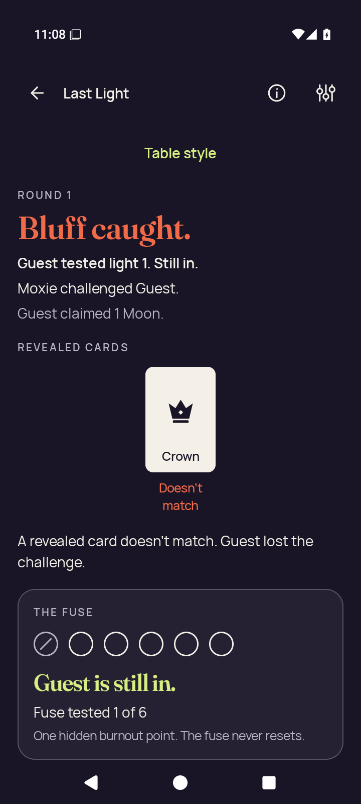</a>

`2d-standard-play-after-play.png` · 720 × 1600 · 92,159 bytes.

SHA-256: `5826d7a54a7eec26b0a472f7e48bf0c327d02a9e25eb79d1d6f6c39036fab9af`.

**Preserved image; unviewed.** Original preserved without a direct view or an independently established reviewed-byte representative in this bounded review. Matching published bytes alone do not establish visual review.

Original capture window: `2026-09-10T23:08:44.012+00:00` to `2026-09-10T23:08:46.363+00:00`; PNG/XML acquired sequentially.

### 2d-standard-play-selected

`2d-standard-play-selected.png` · 720 × 1600 · 122,826 bytes.

SHA-256: `4d10272304651d18b5c16cc3706c0694230f5e8b920b266aa97506dc3425502f`.

**Preserved image; unviewed.** Original preserved without a direct view or an independently established reviewed-byte representative in this bounded review. Matching published bytes alone do not establish visual review.

Original capture window: `2026-09-10T23:08:37.408+00:00` to `2026-09-10T23:08:39.783+00:00`; PNG/XML acquired sequentially.

### 2d-standard-public

`2d-standard-public.png` · 720 × 1600 · 127,983 bytes.

SHA-256: `d1c75c92e1a86e510265f43938799a83c8cf8814b46c7c3b60cbd7981a76d557`.

**Preserved image; unviewed.** Original preserved without a direct view or an independently established reviewed-byte representative in this bounded review. Matching published bytes alone do not establish visual review.

Original capture window: `2026-09-10T23:05:36.621+00:00` to `2026-09-10T23:05:38.965+00:00`; PNG/XML acquired sequentially.

### 2d-standard-selection-cleared

`2d-standard-selection-cleared.png` · 720 × 1600 · 127,977 bytes.

SHA-256: `a055cbb98f95e2675b675ca1070e681433c934eb65773079ce753e24735493d8`.

**Preserved image; unviewed.** Original preserved without a direct view or an independently established reviewed-byte representative in this bounded review. Matching published bytes alone do not establish visual review.

Original capture window: `2026-09-10T23:05:32.217+00:00` to `2026-09-10T23:05:34.574+00:00`; PNG/XML acquired sequentially.

### 3d-action-entry-native-ready

`3d-action-entry-native-ready.png` · 720 × 1600 · 191,280 bytes.

SHA-256: `08c536437fbffe810f4b88de92130c36007961ddd45ecfb1d2d4ce32adc4139a`.

**Preserved image; unviewed.** Original preserved without a direct view or an independently established reviewed-byte representative in this bounded review. Matching published bytes alone do not establish visual review.

Original capture window: `2026-09-10T23:17:37.630+00:00` to `2026-09-10T23:17:39.998+00:00`; PNG/XML acquired sequentially.

### 3d-action-entry-selected

`3d-action-entry-selected.png` · 720 × 1600 · 128,862 bytes.

SHA-256: `968739d6fc6a0fa2f871935173e63478fbca18f1391bcf6ab957581e1f47425f`.

**Preserved image; unviewed.** Original preserved without a direct view or an independently established reviewed-byte representative in this bounded review. Matching published bytes alone do not establish visual review.

Original capture window: `2026-09-10T23:17:15.863+00:00` to `2026-09-10T23:17:18.232+00:00`; PNG/XML acquired sequentially.

### 3d-action-entry-selector

`3d-action-entry-selector.png` · 720 × 1600 · 57,502 bytes.

SHA-256: `194c56d359ef4f86283ce83f7bda41d944cde2a373e7b5b501dd609b417c1634`.

**Preserved image; unviewed.** Original preserved without a direct view or an independently established reviewed-byte representative in this bounded review. Matching published bytes alone do not establish visual review.

Original capture window: `2026-09-10T23:17:24.692+00:00` to `2026-09-10T23:17:27.051+00:00`; PNG/XML acquired sequentially.

### 3d-action-return-concealed

`3d-action-return-concealed.png` · 720 × 1600 · 130,370 bytes.

SHA-256: `f95a5e8fc8d672c4a7ff6db674d50a8e771a3a1f252fd99f4a59eb011ad7d493`.

**Preserved image; unviewed.** Original preserved without a direct view or an independently established reviewed-byte representative in this bounded review. Matching published bytes alone do not establish visual review.

Original capture window: `2026-09-10T23:17:47.050+00:00` to `2026-09-10T23:17:49.421+00:00`; PNG/XML acquired sequentially.

### 3d-action-return-first-card

`3d-action-return-first-card.png` · 720 × 1600 · 128,636 bytes.

SHA-256: `820174091585c7b4aa58e82a6afa512174c64a06295417be83713f0dbd86cdcc`.

**Preserved image; unviewed.** Original preserved without a direct view or an independently established reviewed-byte representative in this bounded review. Matching published bytes alone do not establish visual review.

Original capture window: `2026-09-10T23:18:02.379+00:00` to `2026-09-10T23:18:04.741+00:00`; PNG/XML acquired sequentially.

### 3d-action-return-public

`3d-action-return-public.png` · 720 × 1600 · 130,370 bytes.

SHA-256: `f95a5e8fc8d672c4a7ff6db674d50a8e771a3a1f252fd99f4a59eb011ad7d493`.

**Preserved image; unviewed.** Original preserved without a direct view or an independently established reviewed-byte representative in this bounded review. Matching published bytes alone do not establish visual review.

Original capture window: `2026-09-10T23:17:55.854+00:00` to `2026-09-10T23:17:58.219+00:00`; PNG/XML acquired sequentially.

### 3d-action-return-selection-cleared

`3d-action-return-selection-cleared.png` · 720 × 1600 · 130,370 bytes.

SHA-256: `f95a5e8fc8d672c4a7ff6db674d50a8e771a3a1f252fd99f4a59eb011ad7d493`.

**Preserved image; unviewed.** Original preserved without a direct view or an independently established reviewed-byte representative in this bounded review. Matching published bytes alone do not establish visual review.

Original capture window: `2026-09-10T23:17:51.460+00:00` to `2026-09-10T23:17:53.826+00:00`; PNG/XML acquired sequentially.

### 3d-baseline-first-card

<a href="../../originals/android-jvm-reports/build/ci/android/godot-session/debug/runtime/captures/3d-baseline-first-card.png">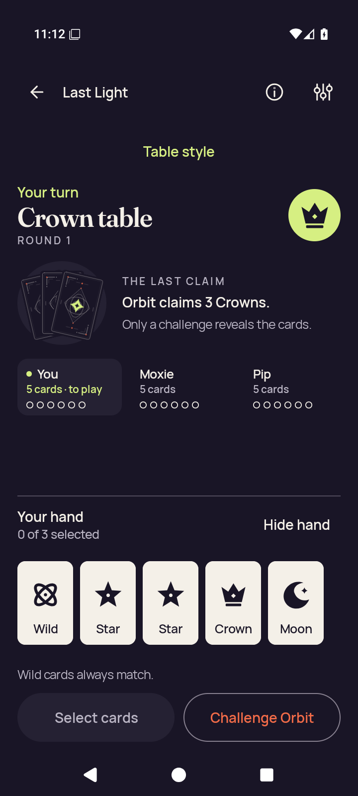</a>

`3d-baseline-first-card.png` · 720 × 1600 · 128,634 bytes.

SHA-256: `ffee158c36aa1ee869df886749fd2c987b1472e6e833e6ced4772b28ea7f501f`.

**Preserved image; unviewed.** Original preserved without a direct view or an independently established reviewed-byte representative in this bounded review. Matching published bytes alone do not establish visual review.

Original capture window: `2026-09-10T23:12:15.358+00:00` to `2026-09-10T23:12:17.737+00:00`; PNG/XML acquired sequentially.

### 3d-baseline-public

<a href="../../originals/android-jvm-reports/build/ci/android/godot-session/debug/runtime/captures/3d-baseline-public.png">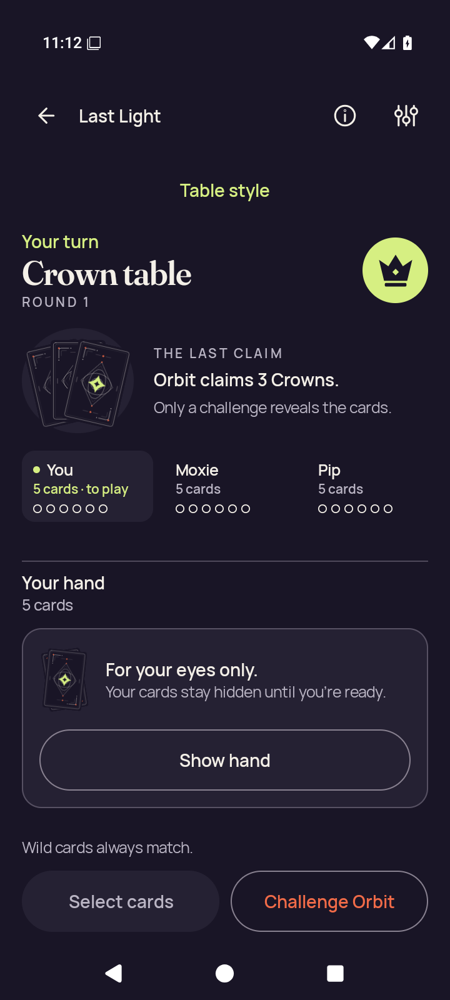</a>

`3d-baseline-public.png` · 720 × 1600 · 130,640 bytes.

SHA-256: `57676d7a5c4834676fc3d5363b32fa0ac8a69a67ebc62459fc86f1ae7547e899`.

**Preserved image; unviewed.** Original preserved without a direct view or an independently established reviewed-byte representative in this bounded review. Matching published bytes alone do not establish visual review.

Original capture window: `2026-09-10T23:12:08.871+00:00` to `2026-09-10T23:12:11.226+00:00`; PNG/XML acquired sequentially.

### 3d-baseline-selected

`3d-baseline-selected.png` · 720 × 1600 · 128,801 bytes.

SHA-256: `9be33f8f9f914e0bf8359fc648d48425ee7e51cde6a409efd00fcf98a86effd7`.

**Preserved image; unviewed.** Original preserved without a direct view or an independently established reviewed-byte representative in this bounded review. Matching published bytes alone do not establish visual review.

Original capture window: `2026-09-10T23:14:01.512+00:00` to `2026-09-10T23:14:03.901+00:00`; PNG/XML acquired sequentially.

### 3d-death-native-ready

<a href="../../originals/android-jvm-reports/build/ci/android/godot-session/debug/runtime/captures/3d-death-native-ready.png">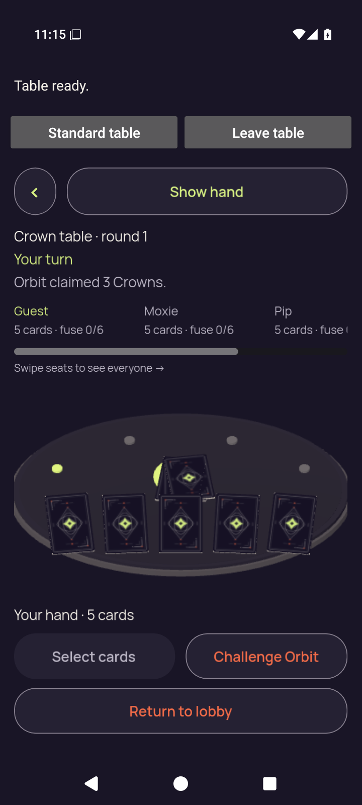</a>

`3d-death-native-ready.png` · 720 × 1600 · 191,458 bytes.

SHA-256: `1775c7a24192ac5ab60e86ebc3877e3b0180e710f229a054db7cea3b59096e0a`.

**Preserved image; unviewed.** Original preserved without a direct view or an independently established reviewed-byte representative in this bounded review. Matching published bytes alone do not establish visual review.

Original capture window: `2026-09-10T23:15:40.638+00:00` to `2026-09-10T23:15:43.053+00:00`; PNG/XML acquired sequentially.

### 3d-death-return-concealed

`3d-death-return-concealed.png` · 720 × 1600 · 130,573 bytes.

SHA-256: `1120ad6a2bfef0c21e3ab26e211a6eb5d9a23e165548aee0634cbd334f2abcca`.

**Preserved image; unviewed.** Original preserved without a direct view or an independently established reviewed-byte representative in this bounded review. Matching published bytes alone do not establish visual review.

Original capture window: `2026-09-10T23:15:47.796+00:00` to `2026-09-10T23:15:50.164+00:00`; PNG/XML acquired sequentially.

### 3d-death-return-first-card

`3d-death-return-first-card.png` · 720 × 1600 · 128,739 bytes.

SHA-256: `d2cb3f03b7c23ec32d51c3bb4d6208d1fa6c8cef24abf3b23950de7a19efb67d`.

**Preserved image; unviewed.** Original preserved without a direct view or an independently established reviewed-byte representative in this bounded review. Matching published bytes alone do not establish visual review.

Original capture window: `2026-09-10T23:16:03.114+00:00` to `2026-09-10T23:16:05.510+00:00`; PNG/XML acquired sequentially.

### 3d-death-return-public

`3d-death-return-public.png` · 720 × 1600 · 130,725 bytes.

SHA-256: `be0f8efd5ae136c4d0ebfd7f8de457687968c7b1b291be118c547d8b27560d1b`.

**Preserved image; unviewed.** Original preserved without a direct view or an independently established reviewed-byte representative in this bounded review. Matching published bytes alone do not establish visual review.

Original capture window: `2026-09-10T23:15:56.602+00:00` to `2026-09-10T23:15:58.974+00:00`; PNG/XML acquired sequentially.

### 3d-death-return-selection-cleared

`3d-death-return-selection-cleared.png` · 720 × 1600 · 130,573 bytes.

SHA-256: `1120ad6a2bfef0c21e3ab26e211a6eb5d9a23e165548aee0634cbd334f2abcca`.

**Preserved image; unviewed.** Original preserved without a direct view or an independently established reviewed-byte representative in this bounded review. Matching published bytes alone do not establish visual review.

Original capture window: `2026-09-10T23:15:52.195+00:00` to `2026-09-10T23:15:54.573+00:00`; PNG/XML acquired sequentially.

### 3d-death-selected

<a href="../../originals/android-jvm-reports/build/ci/android/godot-session/debug/runtime/captures/3d-death-selected.png">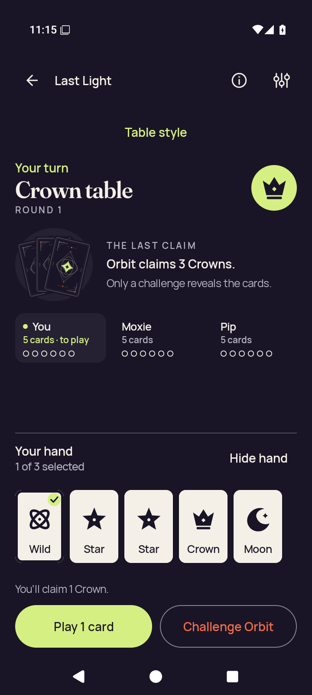</a>

`3d-death-selected.png` · 720 × 1600 · 128,887 bytes.

SHA-256: `2e01dd4293f32711f5096c9ac72248a6911f1494eb76217d81d34ed5af55c461`.

**Preserved image; unviewed.** Original preserved without a direct view or an independently established reviewed-byte representative in this bounded review. Matching published bytes alone do not establish visual review.

Original capture window: `2026-09-10T23:15:18.680+00:00` to `2026-09-10T23:15:21.083+00:00`; PNG/XML acquired sequentially.

### 3d-death-selector

<a href="../../originals/android-jvm-reports/build/ci/android/godot-session/debug/runtime/captures/3d-death-selector.png">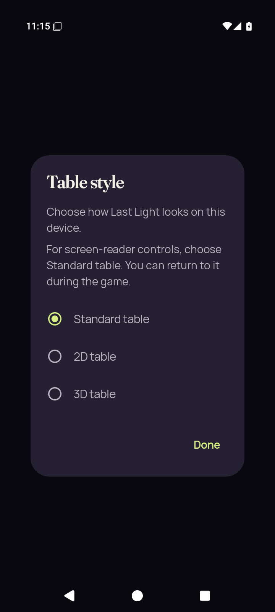</a>

`3d-death-selector.png` · 720 × 1600 · 57,672 bytes.

SHA-256: `855d798f1f3fe563d705f51adba3a78d3f4d38870359b87cd610d06b208df1fc`.

**Preserved image; unviewed.** Original preserved without a direct view or an independently established reviewed-byte representative in this bounded review. Matching published bytes alone do not establish visual review.

Original capture window: `2026-09-10T23:15:27.632+00:00` to `2026-09-10T23:15:29.994+00:00`; PNG/XML acquired sequentially.

### 3d-engine-baseline-first-card

<a href="../../originals/android-jvm-reports/build/ci/android/godot-session/debug/runtime/captures/3d-engine-baseline-first-card.png">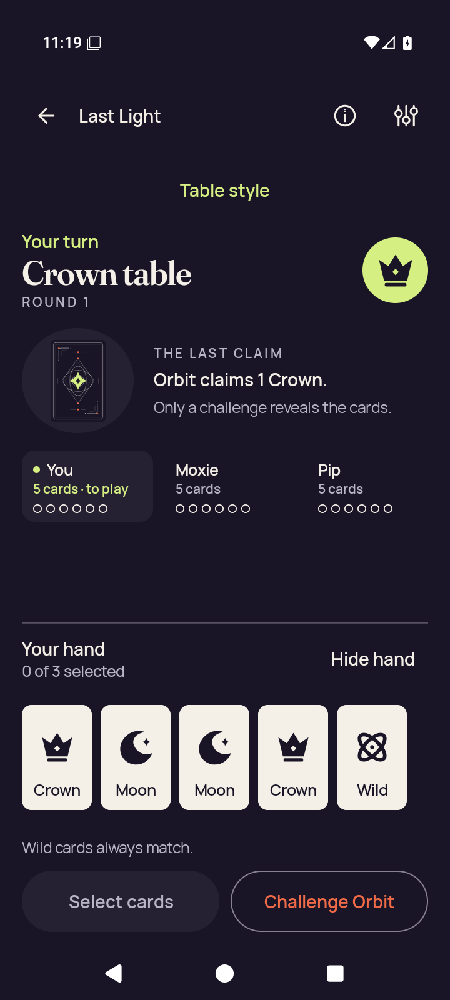</a>

`3d-engine-baseline-first-card.png` · 720 × 1600 · 115,920 bytes.

SHA-256: `75411016e5bde5836c765bff115bd03afbd4f05418d32efe5678f488d661d62b`.

**Preserved image; unviewed.** Original preserved without a direct view or an independently established reviewed-byte representative in this bounded review. Matching published bytes alone do not establish visual review.

Original capture window: `2026-09-10T23:19:08.910+00:00` to `2026-09-10T23:19:11.287+00:00`; PNG/XML acquired sequentially.

### 3d-engine-baseline-public

<a href="../../originals/android-jvm-reports/build/ci/android/godot-session/debug/runtime/captures/3d-engine-baseline-public.png">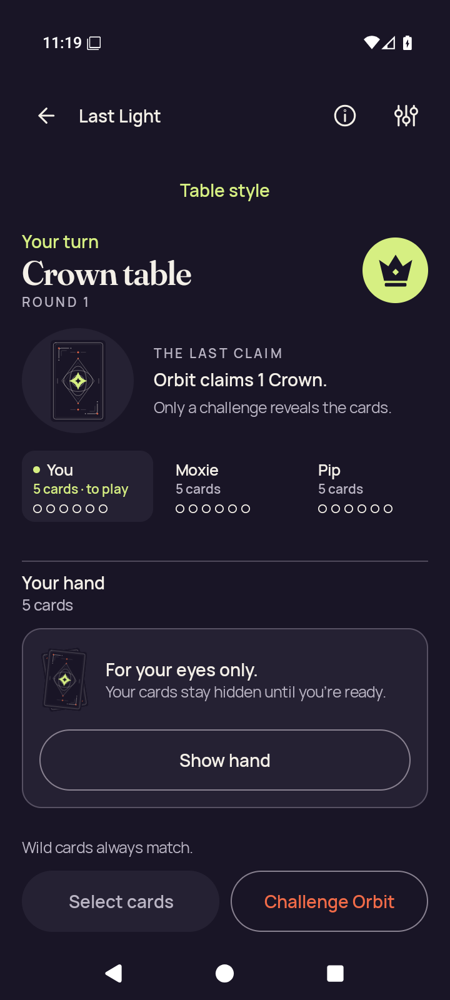</a>

`3d-engine-baseline-public.png` · 720 × 1600 · 119,601 bytes.

SHA-256: `1bd22304e91834115c8e48dd8c48387cd1454f58bbafcaf0a96ba61ba04cbd8b`.

**Preserved image; unviewed.** Original preserved without a direct view or an independently established reviewed-byte representative in this bounded review. Matching published bytes alone do not establish visual review.

Original capture window: `2026-09-10T23:19:02.432+00:00` to `2026-09-10T23:19:04.787+00:00`; PNG/XML acquired sequentially.

### 3d-engine-entry-selector

`3d-engine-entry-selector.png` · 720 × 1600 · 57,706 bytes.

SHA-256: `b2523d1001c2de273ad0f7a56ab8b0c5f2ef57ecb6faea6d3a9252ebc86eb991`.

**Preserved image; unviewed.** Original preserved without a direct view or an independently established reviewed-byte representative in this bounded review. Matching published bytes alone do not establish visual review.

Original capture window: `2026-09-10T23:19:25.927+00:00` to `2026-09-10T23:19:28.333+00:00`; PNG/XML acquired sequentially.

### 3d-engine-home

`3d-engine-home.png` · 720 × 1600 · 131,548 bytes.

SHA-256: `733ea6d3b40e74f391cdc06bd51559c972fbfadc54a3ac3214efa9ee1bd7c1a8`.

**Preserved image; unviewed.** Original preserved without a direct view or an independently established reviewed-byte representative in this bounded review. Matching published bytes alone do not establish visual review.

Original capture window: `2026-09-10T23:21:32.243+00:00` to `2026-09-10T23:21:34.617+00:00`; PNG/XML acquired sequentially.

### 3d-engine-leave-confirmation

`3d-engine-leave-confirmation.png` · 720 × 1600 · 40,404 bytes.

SHA-256: `84e114485785d5bb73cb09453cae22330ed9bebd0eb40cfa09085fa1fbc72a4a`.

**Preserved image; unviewed.** Original preserved without a direct view or an independently established reviewed-byte representative in this bounded review. Matching published bytes alone do not establish visual review.

Original capture window: `2026-09-10T23:21:23.477+00:00` to `2026-09-10T23:21:25.846+00:00`; PNG/XML acquired sequentially.

### 3d-engine-leave-selector

<a href="../../originals/android-jvm-reports/build/ci/android/godot-session/debug/runtime/captures/3d-engine-leave-selector.png">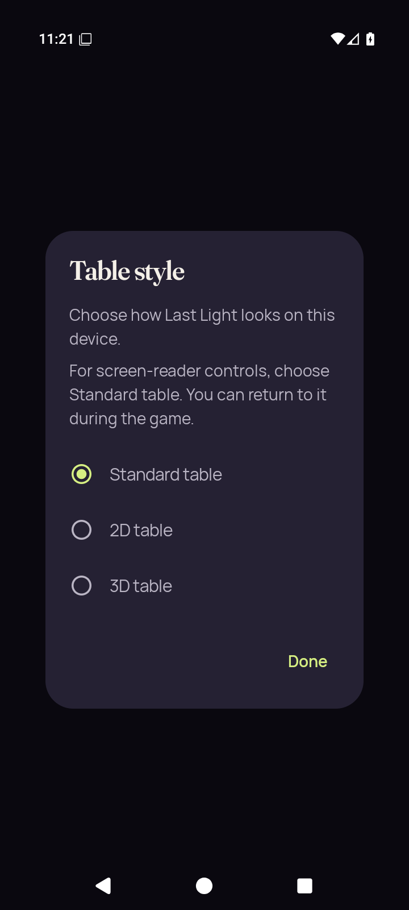</a>

`3d-engine-leave-selector.png` · 720 × 1600 · 57,764 bytes.

SHA-256: `c530305d592c549f68126ec0c9f9ea7c71948b285e56132a26e95d57cd779192`.

**Preserved image; unviewed.** Original preserved without a direct view or an independently established reviewed-byte representative in this bounded review. Matching published bytes alone do not establish visual review.

Original capture window: `2026-09-10T23:21:07.562+00:00` to `2026-09-10T23:21:09.908+00:00`; PNG/XML acquired sequentially.

### 3d-entry-native-ready

`3d-entry-native-ready.png` · 720 × 1600 · 191,400 bytes.

SHA-256: `247722448c8be55af23314a4c158ac23d47a120ee5290a5db22c99cd6151b24c`.

**Preserved image; unviewed.** Original preserved without a direct view or an independently established reviewed-byte representative in this bounded review. Matching published bytes alone do not establish visual review.

Original capture window: `2026-09-10T23:14:23.716+00:00` to `2026-09-10T23:14:26.093+00:00`; PNG/XML acquired sequentially.

### 3d-entry-selector

`3d-entry-selector.png` · 720 × 1600 · 57,615 bytes.

SHA-256: `3658cf359fa2d2fe450cb0a1705f7c1aa10012d1ba8d516d9c6b3ab2bd6894ff`.

**Preserved image; unviewed.** Original preserved without a direct view or an independently established reviewed-byte representative in this bounded review. Matching published bytes alone do not establish visual review.

Original capture window: `2026-09-10T23:14:10.612+00:00` to `2026-09-10T23:14:12.978+00:00`; PNG/XML acquired sequentially.

### 3d-home-after-session-end

`3d-home-after-session-end.png` · 720 × 1600 · 131,645 bytes.

SHA-256: `24baa5aa506fb548c6c1ced4bdfdd07b79c661119de66592a88f3bdae8fa3d8e`.

**Preserved image; unviewed.** Original preserved without a direct view or an independently established reviewed-byte representative in this bounded review. Matching published bytes alone do not establish visual review.

Original capture window: `2026-09-10T23:18:49.743+00:00` to `2026-09-10T23:18:52.091+00:00`; PNG/XML acquired sequentially.

### 3d-home-resumed

`3d-home-resumed.png` · 720 × 1600 · 191,400 bytes.

SHA-256: `247722448c8be55af23314a4c158ac23d47a120ee5290a5db22c99cd6151b24c`.

**Preserved image; unviewed.** Original preserved without a direct view or an independently established reviewed-byte representative in this bounded review. Matching published bytes alone do not establish visual review.

Original capture window: `2026-09-10T23:14:34.384+00:00` to `2026-09-10T23:14:36.770+00:00`; PNG/XML acquired sequentially.

### 3d-home-system-ui

`3d-home-system-ui.png` · 720 × 1600 · 745,843 bytes.

SHA-256: `6eb6977aa910cf72973a451647599da686b9b28b0c330f0d7afe7d1c8b4469b9`.

**Preserved image; unviewed.** Original preserved without a direct view or an independently established reviewed-byte representative in this bounded review. Matching published bytes alone do not establish visual review.

Original capture window: `2026-09-10T23:14:28.766+00:00` to `2026-09-10T23:14:31.486+00:00`; PNG/XML acquired sequentially.

### 3d-leave-cancel-confirmation

<a href="../../originals/android-jvm-reports/build/ci/android/godot-session/debug/runtime/captures/3d-leave-cancel-confirmation.png">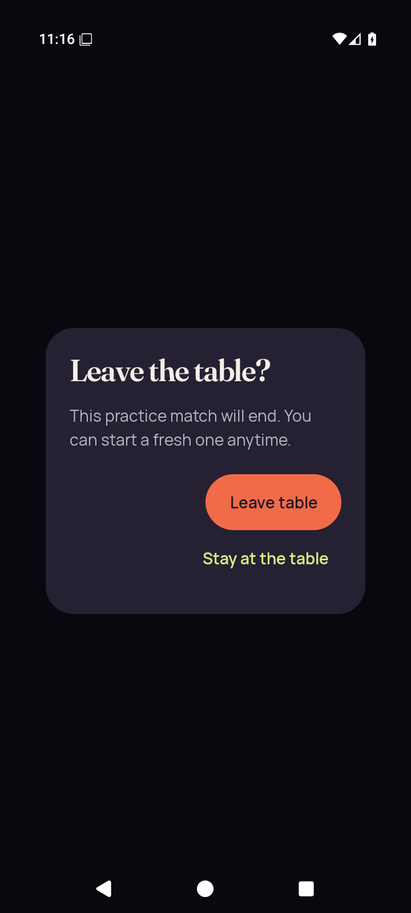</a>

`3d-leave-cancel-confirmation.png` · 720 × 1600 · 40,505 bytes.

SHA-256: `4e37e8acde90c126ee438c2a0ebd0eae609b42b9e09ba35857942aaef8e52223`.

**Preserved image; unviewed.** Original preserved without a direct view or an independently established reviewed-byte representative in this bounded review. Matching published bytes alone do not establish visual review.

Original capture window: `2026-09-10T23:16:43.247+00:00` to `2026-09-10T23:16:45.594+00:00`; PNG/XML acquired sequentially.

### 3d-leave-cancel-native-ready

`3d-leave-cancel-native-ready.png` · 720 × 1600 · 191,622 bytes.

SHA-256: `41ff4f86b00f9d1f1aa7c3f9fe9e29a6237c3886ee8d77a045459d7ab1583d48`.

**Preserved image; unviewed.** Original preserved without a direct view or an independently established reviewed-byte representative in this bounded review. Matching published bytes alone do not establish visual review.

Original capture window: `2026-09-10T23:16:33.715+00:00` to `2026-09-10T23:16:36.106+00:00`; PNG/XML acquired sequentially.

### 3d-leave-cancel-return-concealed

`3d-leave-cancel-return-concealed.png` · 720 × 1600 · 130,779 bytes.

SHA-256: `b9fed3ffdf34ecd111cee4470dcb53d64c7d60f75dac254f3adb154f7e0db8fd`.

**Preserved image; unviewed.** Original preserved without a direct view or an independently established reviewed-byte representative in this bounded review. Matching published bytes alone do not establish visual review.

Original capture window: `2026-09-10T23:16:51.957+00:00` to `2026-09-10T23:16:54.320+00:00`; PNG/XML acquired sequentially.

### 3d-leave-cancel-return-first-card

`3d-leave-cancel-return-first-card.png` · 720 × 1600 · 128,548 bytes.

SHA-256: `a5764aaa3c216855781b0c3e138550c3c7ac24acde0c130d3406f22865bb7ac7`.

**Preserved image; unviewed.** Original preserved without a direct view or an independently established reviewed-byte representative in this bounded review. Matching published bytes alone do not establish visual review.

Original capture window: `2026-09-10T23:17:07.211+00:00` to `2026-09-10T23:17:09.589+00:00`; PNG/XML acquired sequentially.

### 3d-leave-cancel-return-public

`3d-leave-cancel-return-public.png` · 720 × 1600 · 130,545 bytes.

SHA-256: `957b1fc47df7da45a9cf6acab6479dc090bb77d9569405b65ff85244d883d5f2`.

**Preserved image; unviewed.** Original preserved without a direct view or an independently established reviewed-byte representative in this bounded review. Matching published bytes alone do not establish visual review.

Original capture window: `2026-09-10T23:17:00.731+00:00` to `2026-09-10T23:17:03.074+00:00`; PNG/XML acquired sequentially.

### 3d-leave-cancel-return-selection-cleared

`3d-leave-cancel-return-selection-cleared.png` · 720 × 1600 · 130,779 bytes.

SHA-256: `b9fed3ffdf34ecd111cee4470dcb53d64c7d60f75dac254f3adb154f7e0db8fd`.

**Preserved image; unviewed.** Original preserved without a direct view or an independently established reviewed-byte representative in this bounded review. Matching published bytes alone do not establish visual review.

Original capture window: `2026-09-10T23:16:56.343+00:00` to `2026-09-10T23:16:58.692+00:00`; PNG/XML acquired sequentially.

### 3d-leave-cancel-selected

<a href="../../originals/android-jvm-reports/build/ci/android/godot-session/debug/runtime/captures/3d-leave-cancel-selected.png">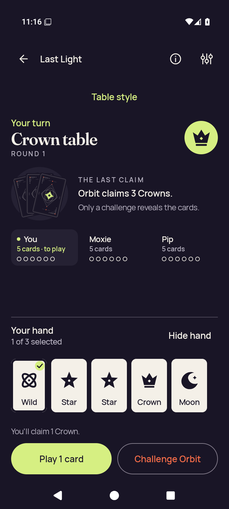</a>

`3d-leave-cancel-selected.png` · 720 × 1600 · 129,046 bytes.

SHA-256: `6963537d0aea3b5895b46b614ddd59fdcfc1957fdbc2f3173bbb5f4e32263523`.

**Preserved image; unviewed.** Original preserved without a direct view or an independently established reviewed-byte representative in this bounded review. Matching published bytes alone do not establish visual review.

Original capture window: `2026-09-10T23:16:11.844+00:00` to `2026-09-10T23:16:14.194+00:00`; PNG/XML acquired sequentially.

### 3d-leave-cancel-selector

`3d-leave-cancel-selector.png` · 720 × 1600 · 57,834 bytes.

SHA-256: `cac30ad796d8881b6bc164ebad4c513d71a5975b28fbf93c7ffd1a66e95a28b3`.

**Preserved image; unviewed.** Original preserved without a direct view or an independently established reviewed-byte representative in this bounded review. Matching published bytes alone do not establish visual review.

Original capture window: `2026-09-10T23:16:20.695+00:00` to `2026-09-10T23:16:23.050+00:00`; PNG/XML acquired sequentially.

### 3d-leave-end-confirmation

`3d-leave-end-confirmation.png` · 720 × 1600 · 40,558 bytes.

SHA-256: `ca85e1d436589f9b9f8809111e64144b3da93b73f8b8fe29ff6c09d01136dcd6`.

**Preserved image; unviewed.** Original preserved without a direct view or an independently established reviewed-byte representative in this bounded review. Matching published bytes alone do not establish visual review.

Original capture window: `2026-09-10T23:18:41.012+00:00` to `2026-09-10T23:18:43.346+00:00`; PNG/XML acquired sequentially.

### 3d-leave-end-selector

<a href="../../originals/android-jvm-reports/build/ci/android/godot-session/debug/runtime/captures/3d-leave-end-selector.png">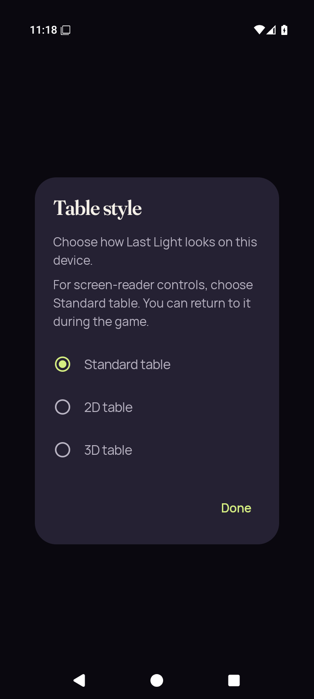</a>

`3d-leave-end-selector.png` · 720 × 1600 · 57,866 bytes.

SHA-256: `3444fb5d076013e5eca76b7ec38858b3d45761327203c8b151833b8314826558`.

**Preserved image; unviewed.** Original preserved without a direct view or an independently established reviewed-byte representative in this bounded review. Matching published bytes alone do not establish visual review.

Original capture window: `2026-09-10T23:18:26.781+00:00` to `2026-09-10T23:18:29.136+00:00`; PNG/XML acquired sequentially.

### 3d-standard-first-card

`3d-standard-first-card.png` · 720 × 1600 · 128,571 bytes.

SHA-256: `38cebef04f27dc29b3a3f8794415223e4cb722c53df8e0130a27293a56e5f841`.

**Preserved image; unviewed.** Original preserved without a direct view or an independently established reviewed-byte representative in this bounded review. Matching published bytes alone do not establish visual review.

Original capture window: `2026-09-10T23:15:09.876+00:00` to `2026-09-10T23:15:12.292+00:00`; PNG/XML acquired sequentially.

### 3d-standard-play-after-play

`3d-standard-play-after-play.png` · 720 × 1600 · 92,544 bytes.

SHA-256: `704768a190df1b039b7198238b87cdcbcc7076446462984a7303afe3338ad1ef`.

**Preserved image; unviewed.** Original preserved without a direct view or an independently established reviewed-byte representative in this bounded review. Matching published bytes alone do not establish visual review.

Original capture window: `2026-09-10T23:18:17.776+00:00` to `2026-09-10T23:18:20.133+00:00`; PNG/XML acquired sequentially.

### 3d-standard-play-selected

`3d-standard-play-selected.png` · 720 × 1600 · 129,094 bytes.

SHA-256: `b33b47c1f02529ef27e6621524060559c4cf40da90aba8d23e795efec6fa56ee`.

**Preserved image; unviewed.** Original preserved without a direct view or an independently established reviewed-byte representative in this bounded review. Matching published bytes alone do not establish visual review.

Original capture window: `2026-09-10T23:18:11.166+00:00` to `2026-09-10T23:18:13.535+00:00`; PNG/XML acquired sequentially.

### 3d-standard-public

`3d-standard-public.png` · 720 × 1600 · 130,753 bytes.

SHA-256: `5a56fb5c1fc7debd1a3a6dce801dc2697ae83adb83b8ac09905fc45dad401565`.

**Preserved image; unviewed.** Original preserved without a direct view or an independently established reviewed-byte representative in this bounded review. Matching published bytes alone do not establish visual review.

Original capture window: `2026-09-10T23:15:03.274+00:00` to `2026-09-10T23:15:05.672+00:00`; PNG/XML acquired sequentially.

### 3d-standard-selection-cleared

`3d-standard-selection-cleared.png` · 720 × 1600 · 130,753 bytes.

SHA-256: `5a56fb5c1fc7debd1a3a6dce801dc2697ae83adb83b8ac09905fc45dad401565`.

**Preserved image; unviewed.** Original preserved without a direct view or an independently established reviewed-byte representative in this bounded review. Matching published bytes alone do not establish visual review.

Original capture window: `2026-09-10T23:14:58.812+00:00` to `2026-09-10T23:15:01.215+00:00`; PNG/XML acquired sequentially.

### final-diagnostic

<a href="../../originals/android-jvm-reports/build/ci/android/godot-session/debug/runtime/captures/final-diagnostic.png">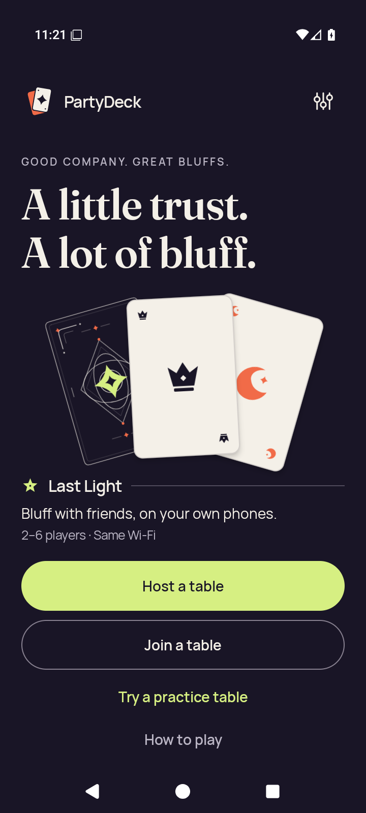</a>

`final-diagnostic.png` · 720 × 1600 · 131,548 bytes.

SHA-256: `733ea6d3b40e74f391cdc06bd51559c972fbfadc54a3ac3214efa9ee1bd7c1a8`.

**Preserved image; unviewed.** Original preserved without a direct view or an independently established reviewed-byte representative in this bounded review. Matching published bytes alone do not establish visual review.

Original capture window: `2026-09-10T23:21:35.069+00:00` to `2026-09-10T23:21:37.417+00:00`; PNG/XML acquired sequentially.

### home-cold

`home-cold.png` · 720 × 1600 · 131,786 bytes.

SHA-256: `14b03b76022cbf9ff5213bfa382fdd9dcca542c11f19b886e8ebd95bb48e367e`.

**Preserved image; unviewed.** Original preserved without a direct view or an independently established reviewed-byte representative in this bounded review. Matching published bytes alone do not establish visual review.

Original capture window: `2026-09-10T23:02:32.082+00:00` to `2026-09-10T23:02:34.456+00:00`; PNG/XML acquired sequentially.

Original media companions and review receipts

| Preserved file | Bytes | SHA-256 |
| --- | ---: | --- |
| [originals/android-jvm-reports/build/ci/android/godot-session/debug/runtime/captures/2d-action-entry-native-ready.json](../../originals/android-jvm-reports/build/ci/android/godot-session/debug/runtime/captures/2d-action-entry-native-ready.json) | 2,177 | `11402726a49ce43bc1612052b7d671b6c8e5b019baecbd417e3d8f7316e29cfb` |
| [originals/android-jvm-reports/build/ci/android/godot-session/debug/runtime/captures/2d-action-entry-native-ready.xml](../../originals/android-jvm-reports/build/ci/android/godot-session/debug/runtime/captures/2d-action-entry-native-ready.xml) | 5,203 | `f0f94a7bd1e71d110a6bdee9781bee1aafb9ddcb7099a51749306186a6bc94d5` |
| [originals/android-jvm-reports/build/ci/android/godot-session/debug/runtime/captures/2d-action-entry-selected.json](../../originals/android-jvm-reports/build/ci/android/godot-session/debug/runtime/captures/2d-action-entry-selected.json) | 1,897 | `2318e4feb0a2e83a409d6594352d15504e8ee19129679bfb4190c3ddf24d0065` |
| [originals/android-jvm-reports/build/ci/android/godot-session/debug/runtime/captures/2d-action-entry-selected.xml](../../originals/android-jvm-reports/build/ci/android/godot-session/debug/runtime/captures/2d-action-entry-selected.xml) | 23,907 | `7ab21f5ff5ec13663cb6f403a2abb354d53d7e6b6956a6ea102ffc66923a3762` |
| [originals/android-jvm-reports/build/ci/android/godot-session/debug/runtime/captures/2d-action-entry-selector.json](../../originals/android-jvm-reports/build/ci/android/godot-session/debug/runtime/captures/2d-action-entry-selector.json) | 1,897 | `92e5a595ab2d838b63dee0251ba21f55d175b59c135913f0e90b52246056d568` |
| [originals/android-jvm-reports/build/ci/android/godot-session/debug/runtime/captures/2d-action-entry-selector.xml](../../originals/android-jvm-reports/build/ci/android/godot-session/debug/runtime/captures/2d-action-entry-selector.xml) | 9,020 | `e26fdbe9fa5fb5cf4eefc26fe358d86cdc60af2dcae1433b3bd82ba04119c189` |
| [originals/android-jvm-reports/build/ci/android/godot-session/debug/runtime/captures/2d-action-return-concealed.json](../../originals/android-jvm-reports/build/ci/android/godot-session/debug/runtime/captures/2d-action-return-concealed.json) | 1,903 | `69788448c4d85f2782cd399ee432d873fb57a26278fb715d2bd5a5097181866b` |
| [originals/android-jvm-reports/build/ci/android/godot-session/debug/runtime/captures/2d-action-return-concealed.xml](../../originals/android-jvm-reports/build/ci/android/godot-session/debug/runtime/captures/2d-action-return-concealed.xml) | 18,287 | `df688a3775a28c995189a21190061852b89260625bf7afaafe0f60a96ad25b78` |
| [originals/android-jvm-reports/build/ci/android/godot-session/debug/runtime/captures/2d-action-return-first-card.json](../../originals/android-jvm-reports/build/ci/android/godot-session/debug/runtime/captures/2d-action-return-first-card.json) | 1,906 | `cb439e1baae89d0f18448ff813ecbb5bffeb18fb899cfd34603aacfdfc95e7a3` |
| [originals/android-jvm-reports/build/ci/android/godot-session/debug/runtime/captures/2d-action-return-first-card.xml](../../originals/android-jvm-reports/build/ci/android/godot-session/debug/runtime/captures/2d-action-return-first-card.xml) | 23,913 | `dc2af71cb3f0dc872e45e0a916b4042bb503631646645b3fc8134dd280cfd1ad` |
| [originals/android-jvm-reports/build/ci/android/godot-session/debug/runtime/captures/2d-action-return-public.json](../../originals/android-jvm-reports/build/ci/android/godot-session/debug/runtime/captures/2d-action-return-public.json) | 1,894 | `63e671a3a80bf10f25fc932d826d1d4df22b91fb5554fb475265882c09f0f8fc` |
| [originals/android-jvm-reports/build/ci/android/godot-session/debug/runtime/captures/2d-action-return-public.xml](../../originals/android-jvm-reports/build/ci/android/godot-session/debug/runtime/captures/2d-action-return-public.xml) | 18,287 | `df688a3775a28c995189a21190061852b89260625bf7afaafe0f60a96ad25b78` |
| [originals/android-jvm-reports/build/ci/android/godot-session/debug/runtime/captures/2d-action-return-selection-cleared.json](../../originals/android-jvm-reports/build/ci/android/godot-session/debug/runtime/captures/2d-action-return-selection-cleared.json) | 1,927 | `c48f89432145e6daa40eb0a5d53794d8aaf420055cf299273f8923730e6daa42` |
| [originals/android-jvm-reports/build/ci/android/godot-session/debug/runtime/captures/2d-action-return-selection-cleared.xml](../../originals/android-jvm-reports/build/ci/android/godot-session/debug/runtime/captures/2d-action-return-selection-cleared.xml) | 18,287 | `df688a3775a28c995189a21190061852b89260625bf7afaafe0f60a96ad25b78` |
| [originals/android-jvm-reports/build/ci/android/godot-session/debug/runtime/captures/2d-baseline-first-card.json](../../originals/android-jvm-reports/build/ci/android/godot-session/debug/runtime/captures/2d-baseline-first-card.json) | 1,892 | `956a12daa2ff5674dbcb46cfb2beca60e26b552e8a9b4fe40ea40d2c00e11dde` |
| [originals/android-jvm-reports/build/ci/android/godot-session/debug/runtime/captures/2d-baseline-first-card.xml](../../originals/android-jvm-reports/build/ci/android/godot-session/debug/runtime/captures/2d-baseline-first-card.xml) | 23,913 | `dc2af71cb3f0dc872e45e0a916b4042bb503631646645b3fc8134dd280cfd1ad` |
| [originals/android-jvm-reports/build/ci/android/godot-session/debug/runtime/captures/2d-baseline-public.json](../../originals/android-jvm-reports/build/ci/android/godot-session/debug/runtime/captures/2d-baseline-public.json) | 1,880 | `5f428698f5bb2b1d4ac6ed23d6ad36a54952785bb23e5380b23f077994d5f7a0` |
| [originals/android-jvm-reports/build/ci/android/godot-session/debug/runtime/captures/2d-baseline-public.xml](../../originals/android-jvm-reports/build/ci/android/godot-session/debug/runtime/captures/2d-baseline-public.xml) | 18,287 | `df688a3775a28c995189a21190061852b89260625bf7afaafe0f60a96ad25b78` |
| [originals/android-jvm-reports/build/ci/android/godot-session/debug/runtime/captures/2d-baseline-selected.json](../../originals/android-jvm-reports/build/ci/android/godot-session/debug/runtime/captures/2d-baseline-selected.json) | 1,882 | `e3f866f2acf6cc75ded2e288228782defb3828fae2708d18d4cecd76c3fdbb1b` |
| [originals/android-jvm-reports/build/ci/android/godot-session/debug/runtime/captures/2d-baseline-selected.xml](../../originals/android-jvm-reports/build/ci/android/godot-session/debug/runtime/captures/2d-baseline-selected.xml) | 23,907 | `7ab21f5ff5ec13663cb6f403a2abb354d53d7e6b6956a6ea102ffc66923a3762` |
| [originals/android-jvm-reports/build/ci/android/godot-session/debug/runtime/captures/2d-death-native-ready.json](../../originals/android-jvm-reports/build/ci/android/godot-session/debug/runtime/captures/2d-death-native-ready.json) | 2,155 | `c3510faffac6f7761ee4d9a2208ee60a6ff4191030ecaae5a5e718765683431c` |
| [originals/android-jvm-reports/build/ci/android/godot-session/debug/runtime/captures/2d-death-native-ready.xml](../../originals/android-jvm-reports/build/ci/android/godot-session/debug/runtime/captures/2d-death-native-ready.xml) | 5,203 | `f0f94a7bd1e71d110a6bdee9781bee1aafb9ddcb7099a51749306186a6bc94d5` |
| [originals/android-jvm-reports/build/ci/android/godot-session/debug/runtime/captures/2d-death-return-concealed.json](../../originals/android-jvm-reports/build/ci/android/godot-session/debug/runtime/captures/2d-death-return-concealed.json) | 1,899 | `ab7e3fab62f622925a803729d0da6b485406539242e26715edc8c2c1534c2b07` |
| [originals/android-jvm-reports/build/ci/android/godot-session/debug/runtime/captures/2d-death-return-concealed.xml](../../originals/android-jvm-reports/build/ci/android/godot-session/debug/runtime/captures/2d-death-return-concealed.xml) | 18,287 | `df688a3775a28c995189a21190061852b89260625bf7afaafe0f60a96ad25b78` |
| [originals/android-jvm-reports/build/ci/android/godot-session/debug/runtime/captures/2d-death-return-first-card.json](../../originals/android-jvm-reports/build/ci/android/godot-session/debug/runtime/captures/2d-death-return-first-card.json) | 1,902 | `cee0bd5107bd4bd69d74634c56e1d7e103c1a5287d68cc58a529e9a00a58218e` |
| [originals/android-jvm-reports/build/ci/android/godot-session/debug/runtime/captures/2d-death-return-first-card.xml](../../originals/android-jvm-reports/build/ci/android/godot-session/debug/runtime/captures/2d-death-return-first-card.xml) | 23,913 | `dc2af71cb3f0dc872e45e0a916b4042bb503631646645b3fc8134dd280cfd1ad` |
| [originals/android-jvm-reports/build/ci/android/godot-session/debug/runtime/captures/2d-death-return-public.json](../../originals/android-jvm-reports/build/ci/android/godot-session/debug/runtime/captures/2d-death-return-public.json) | 1,890 | `e62c2604467b73711784bceab70e911afc58064ce30a36b57e57c80964590fe2` |
| [originals/android-jvm-reports/build/ci/android/godot-session/debug/runtime/captures/2d-death-return-public.xml](../../originals/android-jvm-reports/build/ci/android/godot-session/debug/runtime/captures/2d-death-return-public.xml) | 18,287 | `df688a3775a28c995189a21190061852b89260625bf7afaafe0f60a96ad25b78` |
| [originals/android-jvm-reports/build/ci/android/godot-session/debug/runtime/captures/2d-death-return-selection-cleared.json](../../originals/android-jvm-reports/build/ci/android/godot-session/debug/runtime/captures/2d-death-return-selection-cleared.json) | 1,923 | `d687539e9fc922b3eb3317d430f1227ad74bcf71aca360619d21079aeb60023c` |
| [originals/android-jvm-reports/build/ci/android/godot-session/debug/runtime/captures/2d-death-return-selection-cleared.xml](../../originals/android-jvm-reports/build/ci/android/godot-session/debug/runtime/captures/2d-death-return-selection-cleared.xml) | 18,287 | `df688a3775a28c995189a21190061852b89260625bf7afaafe0f60a96ad25b78` |
| [originals/android-jvm-reports/build/ci/android/godot-session/debug/runtime/captures/2d-death-selected.json](../../originals/android-jvm-reports/build/ci/android/godot-session/debug/runtime/captures/2d-death-selected.json) | 1,874 | `27a6a79a464e84aad7562477d3d431d84472776401a5f1830d0f217eff91b964` |
| [originals/android-jvm-reports/build/ci/android/godot-session/debug/runtime/captures/2d-death-selected.xml](../../originals/android-jvm-reports/build/ci/android/godot-session/debug/runtime/captures/2d-death-selected.xml) | 23,907 | `7ab21f5ff5ec13663cb6f403a2abb354d53d7e6b6956a6ea102ffc66923a3762` |
| [originals/android-jvm-reports/build/ci/android/godot-session/debug/runtime/captures/2d-death-selector.json](../../originals/android-jvm-reports/build/ci/android/godot-session/debug/runtime/captures/2d-death-selector.json) | 1,875 | `65f5fc7b311956f03599c6bc003cf31d100d2dd3e9b4e627b280d8c51a52fd07` |
| [originals/android-jvm-reports/build/ci/android/godot-session/debug/runtime/captures/2d-death-selector.xml](../../originals/android-jvm-reports/build/ci/android/godot-session/debug/runtime/captures/2d-death-selector.xml) | 9,020 | `e26fdbe9fa5fb5cf4eefc26fe358d86cdc60af2dcae1433b3bd82ba04119c189` |
| [originals/android-jvm-reports/build/ci/android/godot-session/debug/runtime/captures/2d-engine-0005-observation.json](../../originals/android-jvm-reports/build/ci/android/godot-session/debug/runtime/captures/2d-engine-0005-observation.json) | 1,872 | `c07e6ab06fa43edd714f0288c28366d1f830aafeb90bc6c77fbbd2d7317de155` |
| [originals/android-jvm-reports/build/ci/android/godot-session/debug/runtime/captures/2d-engine-0005-observation.xml](../../originals/android-jvm-reports/build/ci/android/godot-session/debug/runtime/captures/2d-engine-0005-observation.xml) | 5,972 | `697e9a26adeedf13d959d763461564adfa99b71fe4e7286b13e2170c518b4d6c` |
| [originals/android-jvm-reports/build/ci/android/godot-session/debug/runtime/captures/2d-engine-0009-observation.json](../../originals/android-jvm-reports/build/ci/android/godot-session/debug/runtime/captures/2d-engine-0009-observation.json) | 1,873 | `d87db07df6346fb67da93122a51c1afca03ba9edaa5bfcebcc28b3bcfa5202ce` |
| [originals/android-jvm-reports/build/ci/android/godot-session/debug/runtime/captures/2d-engine-0009-observation.xml](../../originals/android-jvm-reports/build/ci/android/godot-session/debug/runtime/captures/2d-engine-0009-observation.xml) | 5,973 | `b959a5fbb71e11882ffa0ae3bafddab212140d507ec2b167d5aed8103a455047` |
| [originals/android-jvm-reports/build/ci/android/godot-session/debug/runtime/captures/2d-engine-0013-observation.json](../../originals/android-jvm-reports/build/ci/android/godot-session/debug/runtime/captures/2d-engine-0013-observation.json) | 1,873 | `38e003c8d0f9424c096d837fabb3595fa88edcc01b4e44de8f8bbcf922b7a824` |
| [originals/android-jvm-reports/build/ci/android/godot-session/debug/runtime/captures/2d-engine-0013-observation.xml](../../originals/android-jvm-reports/build/ci/android/godot-session/debug/runtime/captures/2d-engine-0013-observation.xml) | 5,973 | `954eac36098f642eb62a2bc012dd211461d9c8fede26f2166270c2ad9e6f4d57` |
| [originals/android-jvm-reports/build/ci/android/godot-session/debug/runtime/captures/2d-engine-0017-observation.xml](../../originals/android-jvm-reports/build/ci/android/godot-session/debug/runtime/captures/2d-engine-0017-observation.xml) | 5,973 | `e51b5b2fa36630944c359ca295cfeefa176cc5ccdc52952bb4b977ac765abd76` |
| [originals/android-jvm-reports/build/ci/android/godot-session/debug/runtime/captures/2d-engine-0017-observation.json](../../originals/android-jvm-reports/build/ci/android/godot-session/debug/runtime/captures/2d-engine-0017-observation.json) | 1,873 | `3d0e7bdc484b9e9e16c8cc70463634bbb5fda95811d487a6a5c55c26a517e485` |
| [originals/android-jvm-reports/build/ci/android/godot-session/debug/runtime/captures/2d-engine-0020-tap.json](../../originals/android-jvm-reports/build/ci/android/godot-session/debug/runtime/captures/2d-engine-0020-tap.json) | 2,199 | `7bcb3e180a76a90535ad7f96c91d8c93e0ee28021f4e5add3e5f058475e08a64` |
| [originals/android-jvm-reports/build/ci/android/godot-session/debug/runtime/captures/2d-engine-0020-tap.xml](../../originals/android-jvm-reports/build/ci/android/godot-session/debug/runtime/captures/2d-engine-0020-tap.xml) | 5,973 | `e51b5b2fa36630944c359ca295cfeefa176cc5ccdc52952bb4b977ac765abd76` |
| [originals/android-jvm-reports/build/ci/android/godot-session/debug/runtime/captures/2d-engine-0024-observation.json](../../originals/android-jvm-reports/build/ci/android/godot-session/debug/runtime/captures/2d-engine-0024-observation.json) | 3,442 | `d9c012d9c565bb8c26dfb3bd58a215ddd561b6ee6df4e3803821f7c4d3ea9d15` |
| [originals/android-jvm-reports/build/ci/android/godot-session/debug/runtime/captures/2d-engine-0024-observation.xml](../../originals/android-jvm-reports/build/ci/android/godot-session/debug/runtime/captures/2d-engine-0024-observation.xml) | 6,591 | `84f534aca14ab75954891594909822aba3adf6973f5fcedc6f0334e8e191f4ec` |
| [originals/android-jvm-reports/build/ci/android/godot-session/debug/runtime/captures/2d-engine-0028-observation.json](../../originals/android-jvm-reports/build/ci/android/godot-session/debug/runtime/captures/2d-engine-0028-observation.json) | 3,442 | `32459bdcfdba79db05544dadd9bb67618c743f806cb2e5acc1f003e69416196e` |
| [originals/android-jvm-reports/build/ci/android/godot-session/debug/runtime/captures/2d-engine-0028-observation.xml](../../originals/android-jvm-reports/build/ci/android/godot-session/debug/runtime/captures/2d-engine-0028-observation.xml) | 6,591 | `32f102e4010a95c858f548c3ad23e035e018765f66e1caad9da51eefa6ced363` |
| [originals/android-jvm-reports/build/ci/android/godot-session/debug/runtime/captures/2d-engine-0032-observation.xml](../../originals/android-jvm-reports/build/ci/android/godot-session/debug/runtime/captures/2d-engine-0032-observation.xml) | 6,591 | `a9cd136db02d1e9d9927e9543e6fe454e320736e841f746bb062b699a6565262` |
| [originals/android-jvm-reports/build/ci/android/godot-session/debug/runtime/captures/2d-engine-0032-observation.json](../../originals/android-jvm-reports/build/ci/android/godot-session/debug/runtime/captures/2d-engine-0032-observation.json) | 3,442 | `82063a65b64c1104b7ced856ab049367eb36cf4da62981b45012d81b89887f24` |
| [originals/android-jvm-reports/build/ci/android/godot-session/debug/runtime/captures/2d-engine-0036-observation.json](../../originals/android-jvm-reports/build/ci/android/godot-session/debug/runtime/captures/2d-engine-0036-observation.json) | 3,442 | `562afa2da935de88029f6a63963346ece4fea844bc02eb99fcefb968eb4d76ad` |
| [originals/android-jvm-reports/build/ci/android/godot-session/debug/runtime/captures/2d-engine-0036-observation.xml](../../originals/android-jvm-reports/build/ci/android/godot-session/debug/runtime/captures/2d-engine-0036-observation.xml) | 6,591 | `78330279a8c006d2f631dc5cad076b9b325aab965499206287944a505172228f` |
| [originals/android-jvm-reports/build/ci/android/godot-session/debug/runtime/captures/2d-engine-0039-tap.json](../../originals/android-jvm-reports/build/ci/android/godot-session/debug/runtime/captures/2d-engine-0039-tap.json) | 3,957 | `fcdcbb52f18105b63960afb1156665324fe3193935a80c1bc7d5e76aea505f9a` |
| [originals/android-jvm-reports/build/ci/android/godot-session/debug/runtime/captures/2d-engine-0039-tap.xml](../../originals/android-jvm-reports/build/ci/android/godot-session/debug/runtime/captures/2d-engine-0039-tap.xml) | 6,591 | `78330279a8c006d2f631dc5cad076b9b325aab965499206287944a505172228f` |
| [originals/android-jvm-reports/build/ci/android/godot-session/debug/runtime/captures/2d-engine-0043-observation.json](../../originals/android-jvm-reports/build/ci/android/godot-session/debug/runtime/captures/2d-engine-0043-observation.json) | 3,440 | `9962bdee2f36f92ca5c9688146b66d5cd34045d6f351b760f080652c2688058b` |
| [originals/android-jvm-reports/build/ci/android/godot-session/debug/runtime/captures/2d-engine-0043-observation.xml](../../originals/android-jvm-reports/build/ci/android/godot-session/debug/runtime/captures/2d-engine-0043-observation.xml) | 6,589 | `bfaf16871bc5529c1e1dfc2f6290e096729adf9678378685bd8e74b1f1018f90` |
| [originals/android-jvm-reports/build/ci/android/godot-session/debug/runtime/captures/2d-engine-0047-observation.json](../../originals/android-jvm-reports/build/ci/android/godot-session/debug/runtime/captures/2d-engine-0047-observation.json) | 3,441 | `cdcd10e170db5f1936ed0d872fc8d6d2455f10563708653abe87eb8481f96ca0` |
| [originals/android-jvm-reports/build/ci/android/godot-session/debug/runtime/captures/2d-engine-0047-observation.xml](../../originals/android-jvm-reports/build/ci/android/godot-session/debug/runtime/captures/2d-engine-0047-observation.xml) | 6,590 | `b84c7379332027a1f28d9101e4651f375c865aa9c7d19e120d01e1c8bd8d8d04` |
| [originals/android-jvm-reports/build/ci/android/godot-session/debug/runtime/captures/2d-engine-0051-observation.json](../../originals/android-jvm-reports/build/ci/android/godot-session/debug/runtime/captures/2d-engine-0051-observation.json) | 3,447 | `c5f54cdae0abb7059d8000ae5d2914e227bea92ab05e27c49f86336e5aafb598` |
| [originals/android-jvm-reports/build/ci/android/godot-session/debug/runtime/captures/2d-engine-0051-observation.xml](../../originals/android-jvm-reports/build/ci/android/godot-session/debug/runtime/captures/2d-engine-0051-observation.xml) | 6,591 | `bf06b78eadd6abaefe0aa6acc6ec9a51ec0777044eae65b7e3095dffcdf12c06` |
| [originals/android-jvm-reports/build/ci/android/godot-session/debug/runtime/captures/2d-engine-0055-observation.json](../../originals/android-jvm-reports/build/ci/android/godot-session/debug/runtime/captures/2d-engine-0055-observation.json) | 3,447 | `dd8fe5127209c953570150e91eae4d70fd632fedd2abca5d3405d5118c14a4e8` |
| [originals/android-jvm-reports/build/ci/android/godot-session/debug/runtime/captures/2d-engine-0055-observation.xml](../../originals/android-jvm-reports/build/ci/android/godot-session/debug/runtime/captures/2d-engine-0055-observation.xml) | 6,591 | `fa76057292b8950e135797591a015116153ff90391cb0db6152c7a71876e1e22` |
| [originals/android-jvm-reports/build/ci/android/godot-session/debug/runtime/captures/2d-engine-0058-tap.json](../../originals/android-jvm-reports/build/ci/android/godot-session/debug/runtime/captures/2d-engine-0058-tap.json) | 3,962 | `ef8c1a3276c6ad79f20899e47afa003b81fa666174f1261620e3cb879b2b3ff4` |
| [originals/android-jvm-reports/build/ci/android/godot-session/debug/runtime/captures/2d-engine-0058-tap.xml](../../originals/android-jvm-reports/build/ci/android/godot-session/debug/runtime/captures/2d-engine-0058-tap.xml) | 6,591 | `fa76057292b8950e135797591a015116153ff90391cb0db6152c7a71876e1e22` |
| [originals/android-jvm-reports/build/ci/android/godot-session/debug/runtime/captures/2d-engine-0062-observation.xml](../../originals/android-jvm-reports/build/ci/android/godot-session/debug/runtime/captures/2d-engine-0062-observation.xml) | 5,982 | `503b05a55d4bc5a54c2b63f7b43ec803c66fbe2c711a5fd1b51dac94d7d35057` |
| [originals/android-jvm-reports/build/ci/android/godot-session/debug/runtime/captures/2d-engine-0062-observation.json](../../originals/android-jvm-reports/build/ci/android/godot-session/debug/runtime/captures/2d-engine-0062-observation.json) | 1,888 | `dec68eec6db5b2efb3c56258b8b139c1157ace4199534a05140dd1b0e98ac001` |
| [originals/android-jvm-reports/build/ci/android/godot-session/debug/runtime/captures/2d-engine-0066-observation.json](../../originals/android-jvm-reports/build/ci/android/godot-session/debug/runtime/captures/2d-engine-0066-observation.json) | 1,888 | `ce0b9d3c46418b3b55ec573ed1c5e788b24e336b23f4058aa713b61065fae10e` |
| [originals/android-jvm-reports/build/ci/android/godot-session/debug/runtime/captures/2d-engine-0066-observation.xml](../../originals/android-jvm-reports/build/ci/android/godot-session/debug/runtime/captures/2d-engine-0066-observation.xml) | 5,982 | `befdf5d8c3560ef40c69527bedf7ec8551df87f8c811e471e5a85a3912ad6694` |
| [originals/android-jvm-reports/build/ci/android/godot-session/debug/runtime/captures/2d-engine-baseline-first-card.json](../../originals/android-jvm-reports/build/ci/android/godot-session/debug/runtime/captures/2d-engine-baseline-first-card.json) | 1,921 | `476dc14209ad6581aab272d68299f20d0d1644e0ddcaaa8d5a1a63cc6fa7cc2f` |
| [originals/android-jvm-reports/build/ci/android/godot-session/debug/runtime/captures/2d-engine-baseline-first-card.xml](../../originals/android-jvm-reports/build/ci/android/godot-session/debug/runtime/captures/2d-engine-baseline-first-card.xml) | 23,914 | `558ee4880ba17872e103fe23e9e996b5ee2f7c32edeb9140594e4a365f145faa` |
| [originals/android-jvm-reports/build/ci/android/godot-session/debug/runtime/captures/2d-engine-baseline-public.json](../../originals/android-jvm-reports/build/ci/android/godot-session/debug/runtime/captures/2d-engine-baseline-public.json) | 1,909 | `7bd654ed562976ab24ce8f61833749cb694f452e727c20e0025e3d2892062f03` |
| [originals/android-jvm-reports/build/ci/android/godot-session/debug/runtime/captures/2d-engine-baseline-public.xml](../../originals/android-jvm-reports/build/ci/android/godot-session/debug/runtime/captures/2d-engine-baseline-public.xml) | 18,288 | `27e369e72ae86eeb4eaa9f11b597c17d66228d02ca7b062f8a5ab70617179c8f` |
| [originals/android-jvm-reports/build/ci/android/godot-session/debug/runtime/captures/2d-engine-entry-native-ready.json](../../originals/android-jvm-reports/build/ci/android/godot-session/debug/runtime/captures/2d-engine-entry-native-ready.json) | 2,185 | `04b43088bcd23d130af03980485396c6e03b6fb6923c5e0fe9100f24bd0307b2` |
| [originals/android-jvm-reports/build/ci/android/godot-session/debug/runtime/captures/2d-engine-entry-native-ready.xml](../../originals/android-jvm-reports/build/ci/android/godot-session/debug/runtime/captures/2d-engine-entry-native-ready.xml) | 5,203 | `f0f94a7bd1e71d110a6bdee9781bee1aafb9ddcb7099a51749306186a6bc94d5` |
| [originals/android-jvm-reports/build/ci/android/godot-session/debug/runtime/captures/2d-engine-entry-selector.json](../../originals/android-jvm-reports/build/ci/android/godot-session/debug/runtime/captures/2d-engine-entry-selector.json) | 1,905 | `9e140ee79cd2ea9122a55229a21049e207b6532064cffac1e4ebe2709ba5b45e` |
| [originals/android-jvm-reports/build/ci/android/godot-session/debug/runtime/captures/2d-engine-entry-selector.xml](../../originals/android-jvm-reports/build/ci/android/godot-session/debug/runtime/captures/2d-engine-entry-selector.xml) | 9,020 | `e26fdbe9fa5fb5cf4eefc26fe358d86cdc60af2dcae1433b3bd82ba04119c189` |
| [originals/android-jvm-reports/build/ci/android/godot-session/debug/runtime/captures/2d-engine-home.json](../../originals/android-jvm-reports/build/ci/android/godot-session/debug/runtime/captures/2d-engine-home.json) | 1,868 | `2ee5b56f727a02b4b273c548f1506696d6ef7bef1e9724ab47c8dae9b2c80ccf` |
| [originals/android-jvm-reports/build/ci/android/godot-session/debug/runtime/captures/2d-engine-home.xml](../../originals/android-jvm-reports/build/ci/android/godot-session/debug/runtime/captures/2d-engine-home.xml) | 13,571 | `51ccf336b9506663d15597c9f0a1a6af3e9e66ef82b3063e77d00c111a9019dc` |
| [originals/android-jvm-reports/build/ci/android/godot-session/debug/runtime/captures/2d-engine-leave-confirmation.json](../../originals/android-jvm-reports/build/ci/android/godot-session/debug/runtime/captures/2d-engine-leave-confirmation.json) | 1,910 | `b0456dce37757a5d0e5e188ee70640f52290ad9bf7256b1cb7635109be0f4fc8` |
| [originals/android-jvm-reports/build/ci/android/godot-session/debug/runtime/captures/2d-engine-leave-confirmation.xml](../../originals/android-jvm-reports/build/ci/android/godot-session/debug/runtime/captures/2d-engine-leave-confirmation.xml) | 5,802 | `3979bafd154da469678fa69d82589043866471582a5d3f82c0108d000235530b` |
| [originals/android-jvm-reports/build/ci/android/godot-session/debug/runtime/captures/2d-engine-leave-selector.json](../../originals/android-jvm-reports/build/ci/android/godot-session/debug/runtime/captures/2d-engine-leave-selector.json) | 1,898 | `dadf7f55aed187a3ec603822a1a20028fba60c0002c8cf815fa42ff13f6c15e4` |
| [originals/android-jvm-reports/build/ci/android/godot-session/debug/runtime/captures/2d-engine-leave-selector.xml](../../originals/android-jvm-reports/build/ci/android/godot-session/debug/runtime/captures/2d-engine-leave-selector.xml) | 9,020 | `e26fdbe9fa5fb5cf4eefc26fe358d86cdc60af2dcae1433b3bd82ba04119c189` |
| [originals/android-jvm-reports/build/ci/android/godot-session/debug/runtime/captures/2d-engine-selected.json](../../originals/android-jvm-reports/build/ci/android/godot-session/debug/runtime/captures/2d-engine-selected.json) | 2,155 | `242d08f12a9d649de8e69a7ee5f899113e5e2448d77c94f310c4f8320d5fe586` |
| [originals/android-jvm-reports/build/ci/android/godot-session/debug/runtime/captures/2d-engine-selected.xml](../../originals/android-jvm-reports/build/ci/android/godot-session/debug/runtime/captures/2d-engine-selected.xml) | 6,590 | `b84c7379332027a1f28d9101e4651f375c865aa9c7d19e120d01e1c8bd8d8d04` |
| [originals/android-jvm-reports/build/ci/android/godot-session/debug/runtime/captures/2d-engine-standard-after-play.json](../../originals/android-jvm-reports/build/ci/android/godot-session/debug/runtime/captures/2d-engine-standard-after-play.json) | 1,925 | `09c5e5d0004e5a82f7436d868c7299afc75d2024780f6795c8285ae58f1dcf77` |
| [originals/android-jvm-reports/build/ci/android/godot-session/debug/runtime/captures/2d-engine-standard-after-play.xml](../../originals/android-jvm-reports/build/ci/android/godot-session/debug/runtime/captures/2d-engine-standard-after-play.xml) | 15,101 | `54f6a547f03856fa870b329dd4af4ee89998a10a00b1a2c731caa9faf1320bc1` |
| [originals/android-jvm-reports/build/ci/android/godot-session/debug/runtime/captures/2d-engine-standard-concealed.json](../../originals/android-jvm-reports/build/ci/android/godot-session/debug/runtime/captures/2d-engine-standard-concealed.json) | 431 | `08553a9ce49b7656bf4461a17fa6fd473e413aed3720670b57a1d99c896da32d` |
| [originals/android-jvm-reports/build/ci/android/godot-session/debug/runtime/captures/2d-engine-standard-concealed.xml](../../originals/android-jvm-reports/build/ci/android/godot-session/debug/runtime/captures/2d-engine-standard-concealed.xml) | 15,101 | `54f6a547f03856fa870b329dd4af4ee89998a10a00b1a2c731caa9faf1320bc1` |
| [originals/android-jvm-reports/build/ci/android/godot-session/debug/runtime/captures/2d-engine-standard-outcome.json](../../originals/android-jvm-reports/build/ci/android/godot-session/debug/runtime/captures/2d-engine-standard-outcome.json) | 538 | `2e1ed5b83cbb6b286cbdb824f7d4099d51d94268009a1cc72b9a1e28d9263f73` |
| [originals/android-jvm-reports/build/ci/android/godot-session/debug/runtime/captures/2d-engine-standard-outcome.xml](../../originals/android-jvm-reports/build/ci/android/godot-session/debug/runtime/captures/2d-engine-standard-outcome.xml) | 15,101 | `54f6a547f03856fa870b329dd4af4ee89998a10a00b1a2c731caa9faf1320bc1` |
| [originals/android-jvm-reports/build/ci/android/godot-session/debug/runtime/captures/2d-entry-native-ready.json](../../originals/android-jvm-reports/build/ci/android/godot-session/debug/runtime/captures/2d-entry-native-ready.json) | 2,148 | `3a462e67930bbd1801af96658e90f86bf6707ca1d42658c84ef3bfa39484cccb` |
| [originals/android-jvm-reports/build/ci/android/godot-session/debug/runtime/captures/2d-entry-native-ready.xml](../../originals/android-jvm-reports/build/ci/android/godot-session/debug/runtime/captures/2d-entry-native-ready.xml) | 5,203 | `f0f94a7bd1e71d110a6bdee9781bee1aafb9ddcb7099a51749306186a6bc94d5` |
| [originals/android-jvm-reports/build/ci/android/godot-session/debug/runtime/captures/2d-entry-selector.json](../../originals/android-jvm-reports/build/ci/android/godot-session/debug/runtime/captures/2d-entry-selector.json) | 1,872 | `bc141651fc601782e4940392c3af1640401b7cbc91020c14d9f37ce7366f2a44` |
| [originals/android-jvm-reports/build/ci/android/godot-session/debug/runtime/captures/2d-entry-selector.xml](../../originals/android-jvm-reports/build/ci/android/godot-session/debug/runtime/captures/2d-entry-selector.xml) | 9,020 | `e26fdbe9fa5fb5cf4eefc26fe358d86cdc60af2dcae1433b3bd82ba04119c189` |
| [originals/android-jvm-reports/build/ci/android/godot-session/debug/runtime/captures/2d-home-after-session-end.json](../../originals/android-jvm-reports/build/ci/android/godot-session/debug/runtime/captures/2d-home-after-session-end.json) | 1,894 | `3829658e3192b708d5537ad8fadfed50d3657980b31b9ce7084f82f2bb5b2fb8` |
| [originals/android-jvm-reports/build/ci/android/godot-session/debug/runtime/captures/2d-home-after-session-end.xml](../../originals/android-jvm-reports/build/ci/android/godot-session/debug/runtime/captures/2d-home-after-session-end.xml) | 13,571 | `51ccf336b9506663d15597c9f0a1a6af3e9e66ef82b3063e77d00c111a9019dc` |
| [originals/android-jvm-reports/build/ci/android/godot-session/debug/runtime/captures/2d-home-resumed.json](../../originals/android-jvm-reports/build/ci/android/godot-session/debug/runtime/captures/2d-home-resumed.json) | 2,135 | `59870bc2f9c00c0a50b7081355d6e23f09a3821c33018678509a6d0f16b068e1` |
| [originals/android-jvm-reports/build/ci/android/godot-session/debug/runtime/captures/2d-home-resumed.xml](../../originals/android-jvm-reports/build/ci/android/godot-session/debug/runtime/captures/2d-home-resumed.xml) | 5,203 | `f0f94a7bd1e71d110a6bdee9781bee1aafb9ddcb7099a51749306186a6bc94d5` |
| [originals/android-jvm-reports/build/ci/android/godot-session/debug/runtime/captures/2d-home-system-ui.json](../../originals/android-jvm-reports/build/ci/android/godot-session/debug/runtime/captures/2d-home-system-ui.json) | 2,161 | `8117de420fb5ebd1e3f0a3d5145499669c5673bcf7590c102f7873c5b9ed9a29` |
| [originals/android-jvm-reports/build/ci/android/godot-session/debug/runtime/captures/2d-home-system-ui.xml](../../originals/android-jvm-reports/build/ci/android/godot-session/debug/runtime/captures/2d-home-system-ui.xml) | 9,997 | `8bc5c5df977feb9af0ca292b7eab5c024ea36125961b221bb87527946ba85926` |
| [originals/android-jvm-reports/build/ci/android/godot-session/debug/runtime/captures/2d-leave-cancel-confirmation.json](../../originals/android-jvm-reports/build/ci/android/godot-session/debug/runtime/captures/2d-leave-cancel-confirmation.json) | 1,906 | `17f9c450a30792a5c2aea911b1a4aa30b86f30639f62ea2061e5140f61fce8a7` |
| [originals/android-jvm-reports/build/ci/android/godot-session/debug/runtime/captures/2d-leave-cancel-confirmation.xml](../../originals/android-jvm-reports/build/ci/android/godot-session/debug/runtime/captures/2d-leave-cancel-confirmation.xml) | 5,802 | `3979bafd154da469678fa69d82589043866471582a5d3f82c0108d000235530b` |
| [originals/android-jvm-reports/build/ci/android/godot-session/debug/runtime/captures/2d-leave-cancel-native-ready.json](../../originals/android-jvm-reports/build/ci/android/godot-session/debug/runtime/captures/2d-leave-cancel-native-ready.json) | 2,174 | `e864959acc45259b42669d4f13c7191f39286b86b73ad57cb044c625683a8ca7` |
| [originals/android-jvm-reports/build/ci/android/godot-session/debug/runtime/captures/2d-leave-cancel-native-ready.xml](../../originals/android-jvm-reports/build/ci/android/godot-session/debug/runtime/captures/2d-leave-cancel-native-ready.xml) | 5,203 | `f0f94a7bd1e71d110a6bdee9781bee1aafb9ddcb7099a51749306186a6bc94d5` |
| [originals/android-jvm-reports/build/ci/android/godot-session/debug/runtime/captures/2d-leave-cancel-return-concealed.json](../../originals/android-jvm-reports/build/ci/android/godot-session/debug/runtime/captures/2d-leave-cancel-return-concealed.json) | 1,918 | `a5d7a0533c02f4000919733dcc90880d419a62f8317dcfe9ef5e058d3899d49b` |
| [originals/android-jvm-reports/build/ci/android/godot-session/debug/runtime/captures/2d-leave-cancel-return-concealed.xml](../../originals/android-jvm-reports/build/ci/android/godot-session/debug/runtime/captures/2d-leave-cancel-return-concealed.xml) | 18,287 | `df688a3775a28c995189a21190061852b89260625bf7afaafe0f60a96ad25b78` |
| [originals/android-jvm-reports/build/ci/android/godot-session/debug/runtime/captures/2d-leave-cancel-return-first-card.json](../../originals/android-jvm-reports/build/ci/android/godot-session/debug/runtime/captures/2d-leave-cancel-return-first-card.json) | 1,921 | `f90420eaf5f448e08c2ce0a9efc68c69d648ece14dd26da3ffe9006b0bfe52e6` |
| [originals/android-jvm-reports/build/ci/android/godot-session/debug/runtime/captures/2d-leave-cancel-return-first-card.xml](../../originals/android-jvm-reports/build/ci/android/godot-session/debug/runtime/captures/2d-leave-cancel-return-first-card.xml) | 23,913 | `dc2af71cb3f0dc872e45e0a916b4042bb503631646645b3fc8134dd280cfd1ad` |
| [originals/android-jvm-reports/build/ci/android/godot-session/debug/runtime/captures/2d-leave-cancel-return-public.json](../../originals/android-jvm-reports/build/ci/android/godot-session/debug/runtime/captures/2d-leave-cancel-return-public.json) | 1,909 | `103d0212845ad929e4a765d6f7139f8970914b1b637b9e06ee070fa383dfe258` |
| [originals/android-jvm-reports/build/ci/android/godot-session/debug/runtime/captures/2d-leave-cancel-return-public.xml](../../originals/android-jvm-reports/build/ci/android/godot-session/debug/runtime/captures/2d-leave-cancel-return-public.xml) | 18,287 | `df688a3775a28c995189a21190061852b89260625bf7afaafe0f60a96ad25b78` |
| [originals/android-jvm-reports/build/ci/android/godot-session/debug/runtime/captures/2d-leave-cancel-return-selection-cleared.json](../../originals/android-jvm-reports/build/ci/android/godot-session/debug/runtime/captures/2d-leave-cancel-return-selection-cleared.json) | 1,942 | `ddb3e3b8b5e526448136f8cbf84f98dbc6951397821efe7a2f4f4328af0cb7ed` |
| [originals/android-jvm-reports/build/ci/android/godot-session/debug/runtime/captures/2d-leave-cancel-return-selection-cleared.xml](../../originals/android-jvm-reports/build/ci/android/godot-session/debug/runtime/captures/2d-leave-cancel-return-selection-cleared.xml) | 18,287 | `df688a3775a28c995189a21190061852b89260625bf7afaafe0f60a96ad25b78` |
| [originals/android-jvm-reports/build/ci/android/godot-session/debug/runtime/captures/2d-leave-cancel-selected.json](../../originals/android-jvm-reports/build/ci/android/godot-session/debug/runtime/captures/2d-leave-cancel-selected.json) | 1,894 | `ae3f4a5646559a9765b29ce5af1bb6fdb27024d3f654bc231ed4ac8e5b6a8960` |
| [originals/android-jvm-reports/build/ci/android/godot-session/debug/runtime/captures/2d-leave-cancel-selected.xml](../../originals/android-jvm-reports/build/ci/android/godot-session/debug/runtime/captures/2d-leave-cancel-selected.xml) | 23,907 | `7ab21f5ff5ec13663cb6f403a2abb354d53d7e6b6956a6ea102ffc66923a3762` |
| [originals/android-jvm-reports/build/ci/android/godot-session/debug/runtime/captures/2d-leave-cancel-selector.json](../../originals/android-jvm-reports/build/ci/android/godot-session/debug/runtime/captures/2d-leave-cancel-selector.json) | 1,894 | `9d2cc8a9bbb640b1b554d5262e8ceb52489108791cac273b4384de15f7a6fec0` |
| [originals/android-jvm-reports/build/ci/android/godot-session/debug/runtime/captures/2d-leave-cancel-selector.xml](../../originals/android-jvm-reports/build/ci/android/godot-session/debug/runtime/captures/2d-leave-cancel-selector.xml) | 9,020 | `e26fdbe9fa5fb5cf4eefc26fe358d86cdc60af2dcae1433b3bd82ba04119c189` |
| [originals/android-jvm-reports/build/ci/android/godot-session/debug/runtime/captures/2d-leave-end-confirmation.json](../../originals/android-jvm-reports/build/ci/android/godot-session/debug/runtime/captures/2d-leave-end-confirmation.json) | 1,894 | `bd5af56f3529f3b0f3252aaa4491a4b13b46816698be217409cf19e62120092b` |
| [originals/android-jvm-reports/build/ci/android/godot-session/debug/runtime/captures/2d-leave-end-confirmation.xml](../../originals/android-jvm-reports/build/ci/android/godot-session/debug/runtime/captures/2d-leave-end-confirmation.xml) | 5,802 | `3979bafd154da469678fa69d82589043866471582a5d3f82c0108d000235530b` |
| [originals/android-jvm-reports/build/ci/android/godot-session/debug/runtime/captures/2d-leave-end-control-observation.xml](../../originals/android-jvm-reports/build/ci/android/godot-session/debug/runtime/captures/2d-leave-end-control-observation.xml) | 5,575 | `c0b8ebcbff1baa3d3e8b5011884d113f242ee50796bf6790cc92c4efa9d5f6d4` |
| [originals/android-jvm-reports/build/ci/android/godot-session/debug/runtime/captures/2d-leave-end-selector.json](../../originals/android-jvm-reports/build/ci/android/godot-session/debug/runtime/captures/2d-leave-end-selector.json) | 1,882 | `c682d3cb50ae747f5b5b502567f83cc62305a78295063d782898631f003be9d7` |
| [originals/android-jvm-reports/build/ci/android/godot-session/debug/runtime/captures/2d-leave-end-selector.xml](../../originals/android-jvm-reports/build/ci/android/godot-session/debug/runtime/captures/2d-leave-end-selector.xml) | 9,020 | `e26fdbe9fa5fb5cf4eefc26fe358d86cdc60af2dcae1433b3bd82ba04119c189` |
| [originals/android-jvm-reports/build/ci/android/godot-session/debug/runtime/captures/2d-recents-resumed.json](../../originals/android-jvm-reports/build/ci/android/godot-session/debug/runtime/captures/2d-recents-resumed.json) | 2,147 | `8f4d106369ad22d9ce4d2bcbc31401e289469a0100ec43336633b44896399beb` |
| [originals/android-jvm-reports/build/ci/android/godot-session/debug/runtime/captures/2d-recents-resumed.xml](../../originals/android-jvm-reports/build/ci/android/godot-session/debug/runtime/captures/2d-recents-resumed.xml) | 5,203 | `f0f94a7bd1e71d110a6bdee9781bee1aafb9ddcb7099a51749306186a6bc94d5` |
| [originals/android-jvm-reports/build/ci/android/godot-session/debug/runtime/captures/2d-recents-system-ui.json](../../originals/android-jvm-reports/build/ci/android/godot-session/debug/runtime/captures/2d-recents-system-ui.json) | 2,173 | `47a13d379b7aaabeb2979504f84267f79c00fb6039b6aad9ac72e2b83c6a6ddc` |
| [originals/android-jvm-reports/build/ci/android/godot-session/debug/runtime/captures/2d-recents-system-ui.xml](../../originals/android-jvm-reports/build/ci/android/godot-session/debug/runtime/captures/2d-recents-system-ui.xml) | 5,516 | `62bbbca28516417d7320b5e48783ce77b544839baf548da03ba3bea46d0ca941` |
| [originals/android-jvm-reports/build/ci/android/godot-session/debug/runtime/captures/2d-standard-concealed.json](../../originals/android-jvm-reports/build/ci/android/godot-session/debug/runtime/captures/2d-standard-concealed.json) | 1,887 | `9fc50edeb89a396f14bc9640f7b72f5f7c84b7a3d8adfc32af16eadc30910924` |
| [originals/android-jvm-reports/build/ci/android/godot-session/debug/runtime/captures/2d-standard-concealed.xml](../../originals/android-jvm-reports/build/ci/android/godot-session/debug/runtime/captures/2d-standard-concealed.xml) | 18,287 | `df688a3775a28c995189a21190061852b89260625bf7afaafe0f60a96ad25b78` |
| [originals/android-jvm-reports/build/ci/android/godot-session/debug/runtime/captures/2d-standard-first-card.json](../../originals/android-jvm-reports/build/ci/android/godot-session/debug/runtime/captures/2d-standard-first-card.json) | 1,890 | `531d0c55010fd39a99ab8d2b040d9f313da79866e662ae4b20036e708207fb9e` |
| [originals/android-jvm-reports/build/ci/android/godot-session/debug/runtime/captures/2d-standard-hand-fifth-deselect-after.json](../../originals/android-jvm-reports/build/ci/android/godot-session/debug/runtime/captures/2d-standard-hand-fifth-deselect-after.json) | 489 | `99d7538f6cda8f1ef84a12e6d9a0d2f11752deafd3aae7afe18871a56aa5fe8a` |
| [originals/android-jvm-reports/build/ci/android/godot-session/debug/runtime/captures/2d-standard-first-card.xml](../../originals/android-jvm-reports/build/ci/android/godot-session/debug/runtime/captures/2d-standard-first-card.xml) | 23,913 | `dc2af71cb3f0dc872e45e0a916b4042bb503631646645b3fc8134dd280cfd1ad` |
| [originals/android-jvm-reports/build/ci/android/godot-session/debug/runtime/captures/2d-standard-hand-fifth-deselect-after.xml](../../originals/android-jvm-reports/build/ci/android/godot-session/debug/runtime/captures/2d-standard-hand-fifth-deselect-after.xml) | 23,913 | `dc2af71cb3f0dc872e45e0a916b4042bb503631646645b3fc8134dd280cfd1ad` |
| [originals/android-jvm-reports/build/ci/android/godot-session/debug/runtime/captures/2d-standard-hand-fifth-deselect-before.json](../../originals/android-jvm-reports/build/ci/android/godot-session/debug/runtime/captures/2d-standard-hand-fifth-deselect-before.json) | 489 | `9df2859ccfa9d954f6435e148c8ac98ac5d6cb91a3e5b1cb6e33af90956d702b` |
| [originals/android-jvm-reports/build/ci/android/godot-session/debug/runtime/captures/2d-standard-hand-fifth-deselected-count.json](../../originals/android-jvm-reports/build/ci/android/godot-session/debug/runtime/captures/2d-standard-hand-fifth-deselected-count.json) | 402 | `d3d39fc609eb5983ddef760e1611be6cc81c667366c90963e030f4caa7e0393d` |
| [originals/android-jvm-reports/build/ci/android/godot-session/debug/runtime/captures/2d-standard-hand-fifth-deselect-before.xml](../../originals/android-jvm-reports/build/ci/android/godot-session/debug/runtime/captures/2d-standard-hand-fifth-deselect-before.xml) | 23,907 | `0ac798ba7b95cc8a71bfdbc4b66b773e3a003c2942389ee06b7cbc1a0dc87070` |
| [originals/android-jvm-reports/build/ci/android/godot-session/debug/runtime/captures/2d-standard-hand-fifth-deselected-count.xml](../../originals/android-jvm-reports/build/ci/android/godot-session/debug/runtime/captures/2d-standard-hand-fifth-deselected-count.xml) | 23,913 | `dc2af71cb3f0dc872e45e0a916b4042bb503631646645b3fc8134dd280cfd1ad` |
| [originals/android-jvm-reports/build/ci/android/godot-session/debug/runtime/captures/2d-standard-hand-fifth-deselected-play.json](../../originals/android-jvm-reports/build/ci/android/godot-session/debug/runtime/captures/2d-standard-hand-fifth-deselected-play.json) | 415 | `ea653a94db48844c9585223efe731720d6d4c5db9916d91baa30792b7cca4c29` |
| [originals/android-jvm-reports/build/ci/android/godot-session/debug/runtime/captures/2d-standard-hand-fifth-deselected-play.xml](../../originals/android-jvm-reports/build/ci/android/godot-session/debug/runtime/captures/2d-standard-hand-fifth-deselected-play.xml) | 23,913 | `dc2af71cb3f0dc872e45e0a916b4042bb503631646645b3fc8134dd280cfd1ad` |
| [originals/android-jvm-reports/build/ci/android/godot-session/debug/runtime/captures/2d-standard-hand-fifth-select-after.json](../../originals/android-jvm-reports/build/ci/android/godot-session/debug/runtime/captures/2d-standard-hand-fifth-select-after.json) | 486 | `d79bd6d157245728893f7b5e408221b991d2406913581fbfb8e7e91a05e11535` |
| [originals/android-jvm-reports/build/ci/android/godot-session/debug/runtime/captures/2d-standard-hand-fifth-select-after.xml](../../originals/android-jvm-reports/build/ci/android/godot-session/debug/runtime/captures/2d-standard-hand-fifth-select-after.xml) | 23,907 | `0ac798ba7b95cc8a71bfdbc4b66b773e3a003c2942389ee06b7cbc1a0dc87070` |
| [originals/android-jvm-reports/build/ci/android/godot-session/debug/runtime/captures/2d-standard-hand-fifth-select-before.json](../../originals/android-jvm-reports/build/ci/android/godot-session/debug/runtime/captures/2d-standard-hand-fifth-select-before.json) | 488 | `3be8f0153199f1b8f055dc897fd49b246b3d878250a4c33a8c51be58b20aad3a` |
| [originals/android-jvm-reports/build/ci/android/godot-session/debug/runtime/captures/2d-standard-hand-fifth-select-before.xml](../../originals/android-jvm-reports/build/ci/android/godot-session/debug/runtime/captures/2d-standard-hand-fifth-select-before.xml) | 23,913 | `dc2af71cb3f0dc872e45e0a916b4042bb503631646645b3fc8134dd280cfd1ad` |
| [originals/android-jvm-reports/build/ci/android/godot-session/debug/runtime/captures/2d-standard-hand-fifth-selected-count.json](../../originals/android-jvm-reports/build/ci/android/godot-session/debug/runtime/captures/2d-standard-hand-fifth-selected-count.json) | 400 | `ec86605658a8bd34356f96b63920a632808af5bff002c99f52e8d14b13f20fb5` |
| [originals/android-jvm-reports/build/ci/android/godot-session/debug/runtime/captures/2d-standard-hand-fifth-selected-count.xml](../../originals/android-jvm-reports/build/ci/android/godot-session/debug/runtime/captures/2d-standard-hand-fifth-selected-count.xml) | 23,907 | `0ac798ba7b95cc8a71bfdbc4b66b773e3a003c2942389ee06b7cbc1a0dc87070` |
| [originals/android-jvm-reports/build/ci/android/godot-session/debug/runtime/captures/2d-standard-hand-fifth-selected-play.xml](../../originals/android-jvm-reports/build/ci/android/godot-session/debug/runtime/captures/2d-standard-hand-fifth-selected-play.xml) | 23,907 | `0ac798ba7b95cc8a71bfdbc4b66b773e3a003c2942389ee06b7cbc1a0dc87070` |
| [originals/android-jvm-reports/build/ci/android/godot-session/debug/runtime/captures/2d-standard-hand-fifth-selected-play.json](../../originals/android-jvm-reports/build/ci/android/godot-session/debug/runtime/captures/2d-standard-hand-fifth-selected-play.json) | 411 | `b252ade1ba4ba949c9d60f954a5877e94c3099ab908e4f828fe8edb0f1c258c0` |
| [originals/android-jvm-reports/build/ci/android/godot-session/debug/runtime/captures/2d-standard-hand-fourth-feedback.json](../../originals/android-jvm-reports/build/ci/android/godot-session/debug/runtime/captures/2d-standard-hand-fourth-feedback.json) | 493 | `b64ffaf83e9122f1271dd2d7f71561a259cb9de5110c71c48a2fd37c18bb0126` |
| [originals/android-jvm-reports/build/ci/android/godot-session/debug/runtime/captures/2d-standard-hand-fourth-feedback.xml](../../originals/android-jvm-reports/build/ci/android/godot-session/debug/runtime/captures/2d-standard-hand-fourth-feedback.xml) | 24,265 | `0cd04aefea86dc1f8859a84d7bab107c5c0057e5ce54946fd7084b14538fd60a` |
| [originals/android-jvm-reports/build/ci/android/godot-session/debug/runtime/captures/2d-standard-hand-fourth-input.json](../../originals/android-jvm-reports/build/ci/android/godot-session/debug/runtime/captures/2d-standard-hand-fourth-input.json) | 480 | `fc7a055d9d750f4a9bf5b9171806f3684afb8ba0aa06659ba49b8e076db60796` |
| [originals/android-jvm-reports/build/ci/android/godot-session/debug/runtime/captures/2d-standard-hand-fourth-input.xml](../../originals/android-jvm-reports/build/ci/android/godot-session/debug/runtime/captures/2d-standard-hand-fourth-input.xml) | 23,907 | `49bcb49fb7e18fa2e7f9d46745d11f4f8b1eb83777910088b78110770fd013e1` |
| [originals/android-jvm-reports/build/ci/android/godot-session/debug/runtime/captures/2d-standard-hand-fourth-rejected-card-1.json](../../originals/android-jvm-reports/build/ci/android/godot-session/debug/runtime/captures/2d-standard-hand-fourth-rejected-card-1.json) | 490 | `e5ee753ec66e6aacb12a084b22652a8345d6653e1f10729a623bebdac7f4e613` |
| [originals/android-jvm-reports/build/ci/android/godot-session/debug/runtime/captures/2d-standard-hand-fourth-rejected-card-1.xml](../../originals/android-jvm-reports/build/ci/android/godot-session/debug/runtime/captures/2d-standard-hand-fourth-rejected-card-1.xml) | 24,265 | `0cd04aefea86dc1f8859a84d7bab107c5c0057e5ce54946fd7084b14538fd60a` |
| [originals/android-jvm-reports/build/ci/android/godot-session/debug/runtime/captures/2d-standard-hand-fourth-rejected-card-2.json](../../originals/android-jvm-reports/build/ci/android/godot-session/debug/runtime/captures/2d-standard-hand-fourth-rejected-card-2.json) | 489 | `f810f9c19a56d2dbc5d8221d60a00c33710ca678159339bc6f3a394de46792c4` |
| [originals/android-jvm-reports/build/ci/android/godot-session/debug/runtime/captures/2d-standard-hand-fourth-rejected-card-2.xml](../../originals/android-jvm-reports/build/ci/android/godot-session/debug/runtime/captures/2d-standard-hand-fourth-rejected-card-2.xml) | 24,265 | `0cd04aefea86dc1f8859a84d7bab107c5c0057e5ce54946fd7084b14538fd60a` |
| [originals/android-jvm-reports/build/ci/android/godot-session/debug/runtime/captures/2d-standard-hand-fourth-rejected-card-3.xml](../../originals/android-jvm-reports/build/ci/android/godot-session/debug/runtime/captures/2d-standard-hand-fourth-rejected-card-3.xml) | 24,265 | `0cd04aefea86dc1f8859a84d7bab107c5c0057e5ce54946fd7084b14538fd60a` |
| [originals/android-jvm-reports/build/ci/android/godot-session/debug/runtime/captures/2d-standard-hand-fourth-rejected-card-3.json](../../originals/android-jvm-reports/build/ci/android/godot-session/debug/runtime/captures/2d-standard-hand-fourth-rejected-card-3.json) | 489 | `335a6902e4410a44701dd784bc822c9ad64295929a8991e47b7b61f83e4c3eb6` |
| [originals/android-jvm-reports/build/ci/android/godot-session/debug/runtime/captures/2d-standard-hand-fourth-rejected-card-4.json](../../originals/android-jvm-reports/build/ci/android/godot-session/debug/runtime/captures/2d-standard-hand-fourth-rejected-card-4.json) | 490 | `0f36f4a1d9db17bc999e0bfce5c302ff2c687b1d5b81e047d0014825eea610e5` |
| [originals/android-jvm-reports/build/ci/android/godot-session/debug/runtime/captures/2d-standard-hand-fourth-rejected-card-4.xml](../../originals/android-jvm-reports/build/ci/android/godot-session/debug/runtime/captures/2d-standard-hand-fourth-rejected-card-4.xml) | 24,265 | `0cd04aefea86dc1f8859a84d7bab107c5c0057e5ce54946fd7084b14538fd60a` |
| [originals/android-jvm-reports/build/ci/android/godot-session/debug/runtime/captures/2d-standard-hand-fourth-rejected-card-5.json](../../originals/android-jvm-reports/build/ci/android/godot-session/debug/runtime/captures/2d-standard-hand-fourth-rejected-card-5.json) | 491 | `849fad4b0dfc7035b6f9671aac3f534c5299db9075a6d1ceb36a94cd055b4393` |
| [originals/android-jvm-reports/build/ci/android/godot-session/debug/runtime/captures/2d-standard-hand-fourth-rejected-card-5.xml](../../originals/android-jvm-reports/build/ci/android/godot-session/debug/runtime/captures/2d-standard-hand-fourth-rejected-card-5.xml) | 24,265 | `0cd04aefea86dc1f8859a84d7bab107c5c0057e5ce54946fd7084b14538fd60a` |
| [originals/android-jvm-reports/build/ci/android/godot-session/debug/runtime/captures/2d-standard-hand-fourth-rejected-count.json](../../originals/android-jvm-reports/build/ci/android/godot-session/debug/runtime/captures/2d-standard-hand-fourth-rejected-count.json) | 401 | `9b8a4a6a8968e47a148e5c5b9794e68074e8f8e87f1d335b28b377785c17b996` |
| [originals/android-jvm-reports/build/ci/android/godot-session/debug/runtime/captures/2d-standard-hand-fourth-rejected-count.xml](../../originals/android-jvm-reports/build/ci/android/godot-session/debug/runtime/captures/2d-standard-hand-fourth-rejected-count.xml) | 24,265 | `0cd04aefea86dc1f8859a84d7bab107c5c0057e5ce54946fd7084b14538fd60a` |
| [originals/android-jvm-reports/build/ci/android/godot-session/debug/runtime/captures/2d-standard-hand-fourth-rejected-play.json](../../originals/android-jvm-reports/build/ci/android/godot-session/debug/runtime/captures/2d-standard-hand-fourth-rejected-play.json) | 413 | `cb5968362886358da28f10866fce0a3438a99da83b7a76575a81cfe1b78a83f4` |
| [originals/android-jvm-reports/build/ci/android/godot-session/debug/runtime/captures/2d-standard-hand-fourth-rejected-play.xml](../../originals/android-jvm-reports/build/ci/android/godot-session/debug/runtime/captures/2d-standard-hand-fourth-rejected-play.xml) | 24,265 | `0cd04aefea86dc1f8859a84d7bab107c5c0057e5ce54946fd7084b14538fd60a` |
| [originals/android-jvm-reports/build/ci/android/godot-session/debug/runtime/captures/2d-standard-hand-fresh-reveal-card-1.json](../../originals/android-jvm-reports/build/ci/android/godot-session/debug/runtime/captures/2d-standard-hand-fresh-reveal-card-1.json) | 488 | `c3bed74df85001da4bf5381d9537bd30a85983ccaecb21ef15d73aff2c94d217` |
| [originals/android-jvm-reports/build/ci/android/godot-session/debug/runtime/captures/2d-standard-hand-fresh-reveal-card-1.xml](../../originals/android-jvm-reports/build/ci/android/godot-session/debug/runtime/captures/2d-standard-hand-fresh-reveal-card-1.xml) | 23,913 | `dc2af71cb3f0dc872e45e0a916b4042bb503631646645b3fc8134dd280cfd1ad` |
| [originals/android-jvm-reports/build/ci/android/godot-session/debug/runtime/captures/2d-standard-hand-fresh-reveal-card-2.xml](../../originals/android-jvm-reports/build/ci/android/godot-session/debug/runtime/captures/2d-standard-hand-fresh-reveal-card-2.xml) | 23,913 | `dc2af71cb3f0dc872e45e0a916b4042bb503631646645b3fc8134dd280cfd1ad` |
| [originals/android-jvm-reports/build/ci/android/godot-session/debug/runtime/captures/2d-standard-hand-fresh-reveal-card-2.json](../../originals/android-jvm-reports/build/ci/android/godot-session/debug/runtime/captures/2d-standard-hand-fresh-reveal-card-2.json) | 487 | `b5e0a59c29607bb6e655ca64ff21cf2e906bd70ba517e17c419222c55d2b1369` |
| [originals/android-jvm-reports/build/ci/android/godot-session/debug/runtime/captures/2d-standard-hand-fresh-reveal-card-3.json](../../originals/android-jvm-reports/build/ci/android/godot-session/debug/runtime/captures/2d-standard-hand-fresh-reveal-card-3.json) | 487 | `93e0514f09f1219354568f41fbbec30fe597fe32770c3cbf6a177e1aa3cfb40e` |
| [originals/android-jvm-reports/build/ci/android/godot-session/debug/runtime/captures/2d-standard-hand-fresh-reveal-card-3.xml](../../originals/android-jvm-reports/build/ci/android/godot-session/debug/runtime/captures/2d-standard-hand-fresh-reveal-card-3.xml) | 23,913 | `dc2af71cb3f0dc872e45e0a916b4042bb503631646645b3fc8134dd280cfd1ad` |
| [originals/android-jvm-reports/build/ci/android/godot-session/debug/runtime/captures/2d-standard-hand-fresh-reveal-card-4.json](../../originals/android-jvm-reports/build/ci/android/godot-session/debug/runtime/captures/2d-standard-hand-fresh-reveal-card-4.json) | 487 | `1b60836b8100d118eff15f1733863379b91076bca15cc2a9394e7f04627e74be` |
| [originals/android-jvm-reports/build/ci/android/godot-session/debug/runtime/captures/2d-standard-hand-fresh-reveal-card-4.xml](../../originals/android-jvm-reports/build/ci/android/godot-session/debug/runtime/captures/2d-standard-hand-fresh-reveal-card-4.xml) | 23,913 | `dc2af71cb3f0dc872e45e0a916b4042bb503631646645b3fc8134dd280cfd1ad` |
| [originals/android-jvm-reports/build/ci/android/godot-session/debug/runtime/captures/2d-standard-hand-fresh-reveal-card-5.json](../../originals/android-jvm-reports/build/ci/android/godot-session/debug/runtime/captures/2d-standard-hand-fresh-reveal-card-5.json) | 488 | `e617b21c555f49b5ee8122f7e6f0c14360439e97b0c489583429a86d864e71a9` |
| [originals/android-jvm-reports/build/ci/android/godot-session/debug/runtime/captures/2d-standard-hand-fresh-reveal-card-5.xml](../../originals/android-jvm-reports/build/ci/android/godot-session/debug/runtime/captures/2d-standard-hand-fresh-reveal-card-5.xml) | 23,913 | `dc2af71cb3f0dc872e45e0a916b4042bb503631646645b3fc8134dd280cfd1ad` |
| [originals/android-jvm-reports/build/ci/android/godot-session/debug/runtime/captures/2d-standard-hand-fresh-reveal-count.json](../../originals/android-jvm-reports/build/ci/android/godot-session/debug/runtime/captures/2d-standard-hand-fresh-reveal-count.json) | 398 | `4eac182a3173c159284013846d9eb0d6913b5f987a16325314b466d56a674124` |
| [originals/android-jvm-reports/build/ci/android/godot-session/debug/runtime/captures/2d-standard-hand-fresh-reveal-count.xml](../../originals/android-jvm-reports/build/ci/android/godot-session/debug/runtime/captures/2d-standard-hand-fresh-reveal-count.xml) | 23,913 | `dc2af71cb3f0dc872e45e0a916b4042bb503631646645b3fc8134dd280cfd1ad` |
| [originals/android-jvm-reports/build/ci/android/godot-session/debug/runtime/captures/2d-standard-hand-fresh-reveal-play.json](../../originals/android-jvm-reports/build/ci/android/godot-session/debug/runtime/captures/2d-standard-hand-fresh-reveal-play.json) | 411 | `4368eb632be547b4ef5424e8a9efa3458859558a7573edad4efc796a67ea0adb` |
| [originals/android-jvm-reports/build/ci/android/godot-session/debug/runtime/captures/2d-standard-hand-fresh-reveal-play.xml](../../originals/android-jvm-reports/build/ci/android/godot-session/debug/runtime/captures/2d-standard-hand-fresh-reveal-play.xml) | 23,913 | `dc2af71cb3f0dc872e45e0a916b4042bb503631646645b3fc8134dd280cfd1ad` |
| [originals/android-jvm-reports/build/ci/android/godot-session/debug/runtime/captures/2d-standard-hand-hidden-play-disabled.json](../../originals/android-jvm-reports/build/ci/android/godot-session/debug/runtime/captures/2d-standard-hand-hidden-play-disabled.json) | 390 | `277e1f5def59b5f378c527e163d591276796d2eb5d355850f79b27112e2d59c2` |
| [originals/android-jvm-reports/build/ci/android/godot-session/debug/runtime/captures/2d-standard-hand-hidden-play-disabled.xml](../../originals/android-jvm-reports/build/ci/android/godot-session/debug/runtime/captures/2d-standard-hand-hidden-play-disabled.xml) | 18,287 | `df688a3775a28c995189a21190061852b89260625bf7afaafe0f60a96ad25b78` |
| [originals/android-jvm-reports/build/ci/android/godot-session/debug/runtime/captures/2d-standard-hand-hidden.json](../../originals/android-jvm-reports/build/ci/android/godot-session/debug/runtime/captures/2d-standard-hand-hidden.json) | 373 | `1a64ca89344cc676d05088a0340cc11293368a5b6298975da8f380ca94898b3b` |
| [originals/android-jvm-reports/build/ci/android/godot-session/debug/runtime/captures/2d-standard-hand-hidden.xml](../../originals/android-jvm-reports/build/ci/android/godot-session/debug/runtime/captures/2d-standard-hand-hidden.xml) | 18,287 | `df688a3775a28c995189a21190061852b89260625bf7afaafe0f60a96ad25b78` |
| [originals/android-jvm-reports/build/ci/android/godot-session/debug/runtime/captures/2d-standard-hand-revealed-card-1.json](../../originals/android-jvm-reports/build/ci/android/godot-session/debug/runtime/captures/2d-standard-hand-revealed-card-1.json) | 484 | `ea6e930f1f6f399a460fa5c6f9ab66b4b7ef571dac93ca5d8710f85b73e51acf` |
| [originals/android-jvm-reports/build/ci/android/godot-session/debug/runtime/captures/2d-standard-hand-revealed-card-1.xml](../../originals/android-jvm-reports/build/ci/android/godot-session/debug/runtime/captures/2d-standard-hand-revealed-card-1.xml) | 23,913 | `dc2af71cb3f0dc872e45e0a916b4042bb503631646645b3fc8134dd280cfd1ad` |
| [originals/android-jvm-reports/build/ci/android/godot-session/debug/runtime/captures/2d-standard-hand-revealed-card-2.json](../../originals/android-jvm-reports/build/ci/android/godot-session/debug/runtime/captures/2d-standard-hand-revealed-card-2.json) | 483 | `aacebe197ab12443f463d8edd67859c2d0afd48458c12aeac667ec9673809969` |
| [originals/android-jvm-reports/build/ci/android/godot-session/debug/runtime/captures/2d-standard-hand-revealed-card-2.xml](../../originals/android-jvm-reports/build/ci/android/godot-session/debug/runtime/captures/2d-standard-hand-revealed-card-2.xml) | 23,913 | `dc2af71cb3f0dc872e45e0a916b4042bb503631646645b3fc8134dd280cfd1ad` |
| [originals/android-jvm-reports/build/ci/android/godot-session/debug/runtime/captures/2d-standard-hand-revealed-card-3.json](../../originals/android-jvm-reports/build/ci/android/godot-session/debug/runtime/captures/2d-standard-hand-revealed-card-3.json) | 483 | `566ea15e25e554a5005a6570ce427d23bf78151893646eb983ea5dbde12b83eb` |
| [originals/android-jvm-reports/build/ci/android/godot-session/debug/runtime/captures/2d-standard-hand-revealed-card-3.xml](../../originals/android-jvm-reports/build/ci/android/godot-session/debug/runtime/captures/2d-standard-hand-revealed-card-3.xml) | 23,913 | `dc2af71cb3f0dc872e45e0a916b4042bb503631646645b3fc8134dd280cfd1ad` |
| [originals/android-jvm-reports/build/ci/android/godot-session/debug/runtime/captures/2d-standard-hand-revealed-card-4.json](../../originals/android-jvm-reports/build/ci/android/godot-session/debug/runtime/captures/2d-standard-hand-revealed-card-4.json) | 483 | `d0ad7274e5f6a0d1c9da52d30eba37b89730c97471632d89d7560539d6f9cb5e` |
| [originals/android-jvm-reports/build/ci/android/godot-session/debug/runtime/captures/2d-standard-hand-revealed-card-4.xml](../../originals/android-jvm-reports/build/ci/android/godot-session/debug/runtime/captures/2d-standard-hand-revealed-card-4.xml) | 23,913 | `dc2af71cb3f0dc872e45e0a916b4042bb503631646645b3fc8134dd280cfd1ad` |
| [originals/android-jvm-reports/build/ci/android/godot-session/debug/runtime/captures/2d-standard-hand-revealed-card-5.json](../../originals/android-jvm-reports/build/ci/android/godot-session/debug/runtime/captures/2d-standard-hand-revealed-card-5.json) | 484 | `8da473fbf62c61bc23612a825396f45fdf27398dedd8d14fa9c2405e91262e58` |
| [originals/android-jvm-reports/build/ci/android/godot-session/debug/runtime/captures/2d-standard-hand-revealed-card-5.xml](../../originals/android-jvm-reports/build/ci/android/godot-session/debug/runtime/captures/2d-standard-hand-revealed-card-5.xml) | 23,913 | `dc2af71cb3f0dc872e45e0a916b4042bb503631646645b3fc8134dd280cfd1ad` |
| [originals/android-jvm-reports/build/ci/android/godot-session/debug/runtime/captures/2d-standard-hand-select-1-after.json](../../originals/android-jvm-reports/build/ci/android/godot-session/debug/runtime/captures/2d-standard-hand-select-1-after.json) | 482 | `9c59a7e7665f68805d6a2a3b0c56801475613da57cb5eae0a9902bc5473344b4` |
| [originals/android-jvm-reports/build/ci/android/godot-session/debug/runtime/captures/2d-standard-hand-select-1-after.xml](../../originals/android-jvm-reports/build/ci/android/godot-session/debug/runtime/captures/2d-standard-hand-select-1-after.xml) | 23,907 | `7ab21f5ff5ec13663cb6f403a2abb354d53d7e6b6956a6ea102ffc66923a3762` |
| [originals/android-jvm-reports/build/ci/android/godot-session/debug/runtime/captures/2d-standard-hand-select-1-before.json](../../originals/android-jvm-reports/build/ci/android/godot-session/debug/runtime/captures/2d-standard-hand-select-1-before.json) | 484 | `512a30a1c7fe85704e09c743294e88005dd8ffd03fc5c456ead3435f1c83c9ac` |
| [originals/android-jvm-reports/build/ci/android/godot-session/debug/runtime/captures/2d-standard-hand-select-2-after.json](../../originals/android-jvm-reports/build/ci/android/godot-session/debug/runtime/captures/2d-standard-hand-select-2-after.json) | 481 | `721e5bb3d91cc91a73e56f134e58b3d773c8ba1f79e1c6117a42bb3dc4c1c453` |
| [originals/android-jvm-reports/build/ci/android/godot-session/debug/runtime/captures/2d-standard-hand-select-2-after.xml](../../originals/android-jvm-reports/build/ci/android/godot-session/debug/runtime/captures/2d-standard-hand-select-2-after.xml) | 23,908 | `e56700c3f84c79db6fa5707ae6b79ff1b01f823185370fe870141f08c20a5171` |
| [originals/android-jvm-reports/build/ci/android/godot-session/debug/runtime/captures/2d-standard-hand-select-1-before.xml](../../originals/android-jvm-reports/build/ci/android/godot-session/debug/runtime/captures/2d-standard-hand-select-1-before.xml) | 23,913 | `dc2af71cb3f0dc872e45e0a916b4042bb503631646645b3fc8134dd280cfd1ad` |
| [originals/android-jvm-reports/build/ci/android/godot-session/debug/runtime/captures/2d-standard-hand-select-2-before.json](../../originals/android-jvm-reports/build/ci/android/godot-session/debug/runtime/captures/2d-standard-hand-select-2-before.json) | 483 | `96ae81409e099fe80a8997e9796f8396667e495fcaff27df53e32f6c6f52352b` |
| [originals/android-jvm-reports/build/ci/android/godot-session/debug/runtime/captures/2d-standard-hand-select-2-before.xml](../../originals/android-jvm-reports/build/ci/android/godot-session/debug/runtime/captures/2d-standard-hand-select-2-before.xml) | 23,907 | `7ab21f5ff5ec13663cb6f403a2abb354d53d7e6b6956a6ea102ffc66923a3762` |
| [originals/android-jvm-reports/build/ci/android/godot-session/debug/runtime/captures/2d-standard-hand-select-3-after.json](../../originals/android-jvm-reports/build/ci/android/godot-session/debug/runtime/captures/2d-standard-hand-select-3-after.json) | 481 | `22468da1dada39cab18d6b15ed0b01def7cd03c17c9bf5caa0f1d946f1f29abe` |
| [originals/android-jvm-reports/build/ci/android/godot-session/debug/runtime/captures/2d-standard-hand-select-3-before.json](../../originals/android-jvm-reports/build/ci/android/godot-session/debug/runtime/captures/2d-standard-hand-select-3-before.json) | 483 | `5e10626062c3c7aa87c2fd897a86c08f5f0cc3aa1daef706abba93270ea0e3d5` |
| [originals/android-jvm-reports/build/ci/android/godot-session/debug/runtime/captures/2d-standard-hand-select-3-after.xml](../../originals/android-jvm-reports/build/ci/android/godot-session/debug/runtime/captures/2d-standard-hand-select-3-after.xml) | 23,907 | `49bcb49fb7e18fa2e7f9d46745d11f4f8b1eb83777910088b78110770fd013e1` |
| [originals/android-jvm-reports/build/ci/android/godot-session/debug/runtime/captures/2d-standard-hand-select-3-before.xml](../../originals/android-jvm-reports/build/ci/android/godot-session/debug/runtime/captures/2d-standard-hand-select-3-before.xml) | 23,908 | `e56700c3f84c79db6fa5707ae6b79ff1b01f823185370fe870141f08c20a5171` |
| [originals/android-jvm-reports/build/ci/android/godot-session/debug/runtime/captures/2d-standard-hand-three-selected-card-1.json](../../originals/android-jvm-reports/build/ci/android/godot-session/debug/runtime/captures/2d-standard-hand-three-selected-card-1.json) | 489 | `c7a459e1fb7a2eb146dde3560adfc1f5dc140c20254b0591837120065b69e11b` |
| [originals/android-jvm-reports/build/ci/android/godot-session/debug/runtime/captures/2d-standard-hand-three-selected-card-1.xml](../../originals/android-jvm-reports/build/ci/android/godot-session/debug/runtime/captures/2d-standard-hand-three-selected-card-1.xml) | 23,907 | `49bcb49fb7e18fa2e7f9d46745d11f4f8b1eb83777910088b78110770fd013e1` |
| [originals/android-jvm-reports/build/ci/android/godot-session/debug/runtime/captures/2d-standard-hand-three-selected-card-2.json](../../originals/android-jvm-reports/build/ci/android/godot-session/debug/runtime/captures/2d-standard-hand-three-selected-card-2.json) | 488 | `8f8bf68f58aa09d9c7737bc88384de9e48523052af41aea15f3f2f71e60c170d` |
| [originals/android-jvm-reports/build/ci/android/godot-session/debug/runtime/captures/2d-standard-hand-three-selected-card-2.xml](../../originals/android-jvm-reports/build/ci/android/godot-session/debug/runtime/captures/2d-standard-hand-three-selected-card-2.xml) | 23,907 | `49bcb49fb7e18fa2e7f9d46745d11f4f8b1eb83777910088b78110770fd013e1` |
| [originals/android-jvm-reports/build/ci/android/godot-session/debug/runtime/captures/2d-standard-hand-three-selected-card-3.json](../../originals/android-jvm-reports/build/ci/android/godot-session/debug/runtime/captures/2d-standard-hand-three-selected-card-3.json) | 488 | `b94f9cadb7a3482644ef44f185e7703fbbe3fb4707ad0e49b6d3c7dd301096f8` |
| [originals/android-jvm-reports/build/ci/android/godot-session/debug/runtime/captures/2d-standard-hand-three-selected-card-3.xml](../../originals/android-jvm-reports/build/ci/android/godot-session/debug/runtime/captures/2d-standard-hand-three-selected-card-3.xml) | 23,907 | `49bcb49fb7e18fa2e7f9d46745d11f4f8b1eb83777910088b78110770fd013e1` |
| [originals/android-jvm-reports/build/ci/android/godot-session/debug/runtime/captures/2d-standard-hand-three-selected-card-4.json](../../originals/android-jvm-reports/build/ci/android/godot-session/debug/runtime/captures/2d-standard-hand-three-selected-card-4.json) | 489 | `a52fb1ff7d1bd942dc89cac529fa4e722f2e257d924088bc8ee1025b62320b73` |
| [originals/android-jvm-reports/build/ci/android/godot-session/debug/runtime/captures/2d-standard-hand-three-selected-card-4.xml](../../originals/android-jvm-reports/build/ci/android/godot-session/debug/runtime/captures/2d-standard-hand-three-selected-card-4.xml) | 23,907 | `49bcb49fb7e18fa2e7f9d46745d11f4f8b1eb83777910088b78110770fd013e1` |
| [originals/android-jvm-reports/build/ci/android/godot-session/debug/runtime/captures/2d-standard-hand-three-selected-card-5.xml](../../originals/android-jvm-reports/build/ci/android/godot-session/debug/runtime/captures/2d-standard-hand-three-selected-card-5.xml) | 23,907 | `49bcb49fb7e18fa2e7f9d46745d11f4f8b1eb83777910088b78110770fd013e1` |
| [originals/android-jvm-reports/build/ci/android/godot-session/debug/runtime/captures/2d-standard-hand-three-selected-count.json](../../originals/android-jvm-reports/build/ci/android/godot-session/debug/runtime/captures/2d-standard-hand-three-selected-count.json) | 400 | `d69d429fcc09ddcec57a9fa4422e98462da7f5db01a24b3031d2e495ffcb0de7` |
| [originals/android-jvm-reports/build/ci/android/godot-session/debug/runtime/captures/2d-standard-hand-three-selected-card-5.json](../../originals/android-jvm-reports/build/ci/android/godot-session/debug/runtime/captures/2d-standard-hand-three-selected-card-5.json) | 490 | `a82d11768570f2b41b1e3fc4d33cb90f5c8e3ad2ce2e408e0b73147b32d9c9d9` |
| [originals/android-jvm-reports/build/ci/android/godot-session/debug/runtime/captures/2d-standard-hand-three-selected-count.xml](../../originals/android-jvm-reports/build/ci/android/godot-session/debug/runtime/captures/2d-standard-hand-three-selected-count.xml) | 23,907 | `49bcb49fb7e18fa2e7f9d46745d11f4f8b1eb83777910088b78110770fd013e1` |
| [originals/android-jvm-reports/build/ci/android/godot-session/debug/runtime/captures/2d-standard-hand-three-selected-play.json](../../originals/android-jvm-reports/build/ci/android/godot-session/debug/runtime/captures/2d-standard-hand-three-selected-play.json) | 412 | `f8cdd5ad7fa125288ced9c280cdaab38d55f266b1a57854e2afc7577a5589542` |
| [originals/android-jvm-reports/build/ci/android/godot-session/debug/runtime/captures/2d-standard-hand-three-selected-play.xml](../../originals/android-jvm-reports/build/ci/android/godot-session/debug/runtime/captures/2d-standard-hand-three-selected-play.xml) | 23,907 | `49bcb49fb7e18fa2e7f9d46745d11f4f8b1eb83777910088b78110770fd013e1` |
| [originals/android-jvm-reports/build/ci/android/godot-session/debug/runtime/captures/2d-standard-play-after-play.json](../../originals/android-jvm-reports/build/ci/android/godot-session/debug/runtime/captures/2d-standard-play-after-play.json) | 1,906 | `d3f3bd24c07fddcfdd05c5a60baca6fe6665cf753cb26b8523094d79e8d998bc` |
| [originals/android-jvm-reports/build/ci/android/godot-session/debug/runtime/captures/2d-standard-play-after-play.xml](../../originals/android-jvm-reports/build/ci/android/godot-session/debug/runtime/captures/2d-standard-play-after-play.xml) | 14,737 | `e465b32f8cf7804fbd122fdb43a658d868ce225686c27fae9622155caadaca59` |
| [originals/android-jvm-reports/build/ci/android/godot-session/debug/runtime/captures/2d-standard-play-input.json](../../originals/android-jvm-reports/build/ci/android/godot-session/debug/runtime/captures/2d-standard-play-input.json) | 606 | `46da4fa6d17d2e5b2f588f2c77366191bba524ea71d640aa7109378b22663e09` |
| [originals/android-jvm-reports/build/ci/android/godot-session/debug/runtime/captures/2d-standard-play-input.xml](../../originals/android-jvm-reports/build/ci/android/godot-session/debug/runtime/captures/2d-standard-play-input.xml) | 23,907 | `7ab21f5ff5ec13663cb6f403a2abb354d53d7e6b6956a6ea102ffc66923a3762` |
| [originals/android-jvm-reports/build/ci/android/godot-session/debug/runtime/captures/2d-standard-play-outcome.json](../../originals/android-jvm-reports/build/ci/android/godot-session/debug/runtime/captures/2d-standard-play-outcome.json) | 523 | `8a9a70eff2774b874e0590f1355bf93856e6ca4d932cb5ecaae83c714f77b92b` |
| [originals/android-jvm-reports/build/ci/android/godot-session/debug/runtime/captures/2d-standard-play-outcome.xml](../../originals/android-jvm-reports/build/ci/android/godot-session/debug/runtime/captures/2d-standard-play-outcome.xml) | 14,737 | `e465b32f8cf7804fbd122fdb43a658d868ce225686c27fae9622155caadaca59` |
| [originals/android-jvm-reports/build/ci/android/godot-session/debug/runtime/captures/2d-standard-play-selected.json](../../originals/android-jvm-reports/build/ci/android/godot-session/debug/runtime/captures/2d-standard-play-selected.json) | 1,900 | `373a8e2cb220387b41bd9a0d97f1cad4bedf91b3cc74854965cf27c77477ae9d` |
| [originals/android-jvm-reports/build/ci/android/godot-session/debug/runtime/captures/2d-standard-play-selected.xml](../../originals/android-jvm-reports/build/ci/android/godot-session/debug/runtime/captures/2d-standard-play-selected.xml) | 23,907 | `7ab21f5ff5ec13663cb6f403a2abb354d53d7e6b6956a6ea102ffc66923a3762` |
| [originals/android-jvm-reports/build/ci/android/godot-session/debug/runtime/captures/2d-standard-public.json](../../originals/android-jvm-reports/build/ci/android/godot-session/debug/runtime/captures/2d-standard-public.json) | 1,878 | `e1c853d6d3f7c9d6d4224849e539cc8212569328f2eafdca31692001d05201fd` |
| [originals/android-jvm-reports/build/ci/android/godot-session/debug/runtime/captures/2d-standard-public.xml](../../originals/android-jvm-reports/build/ci/android/godot-session/debug/runtime/captures/2d-standard-public.xml) | 18,287 | `df688a3775a28c995189a21190061852b89260625bf7afaafe0f60a96ad25b78` |
| [originals/android-jvm-reports/build/ci/android/godot-session/debug/runtime/captures/2d-standard-selection-cleared.json](../../originals/android-jvm-reports/build/ci/android/godot-session/debug/runtime/captures/2d-standard-selection-cleared.json) | 1,911 | `5c07fb27b1916f4a63dbd7561a4ea7dd1f90b1711f2498436981367603134aad` |
| [originals/android-jvm-reports/build/ci/android/godot-session/debug/runtime/captures/2d-standard-selection-cleared.xml](../../originals/android-jvm-reports/build/ci/android/godot-session/debug/runtime/captures/2d-standard-selection-cleared.xml) | 18,287 | `df688a3775a28c995189a21190061852b89260625bf7afaafe0f60a96ad25b78` |
| [originals/android-jvm-reports/build/ci/android/godot-session/debug/runtime/captures/3d-action-entry-native-ready.json](../../originals/android-jvm-reports/build/ci/android/godot-session/debug/runtime/captures/3d-action-entry-native-ready.json) | 2,177 | `34658005f8c09023b84ae13932b47315481ac17fade064b71fe8f2d9009bac8b` |
| [originals/android-jvm-reports/build/ci/android/godot-session/debug/runtime/captures/3d-action-entry-native-ready.xml](../../originals/android-jvm-reports/build/ci/android/godot-session/debug/runtime/captures/3d-action-entry-native-ready.xml) | 5,203 | `f0f94a7bd1e71d110a6bdee9781bee1aafb9ddcb7099a51749306186a6bc94d5` |
| [originals/android-jvm-reports/build/ci/android/godot-session/debug/runtime/captures/3d-action-entry-selected.json](../../originals/android-jvm-reports/build/ci/android/godot-session/debug/runtime/captures/3d-action-entry-selected.json) | 1,897 | `7f424e4f1456271bc097f1aa30fd65cb3a3d95e74487e02c79b8e838b2ba705e` |
| [originals/android-jvm-reports/build/ci/android/godot-session/debug/runtime/captures/3d-action-entry-selected.xml](../../originals/android-jvm-reports/build/ci/android/godot-session/debug/runtime/captures/3d-action-entry-selected.xml) | 23,909 | `45bd89d28bcce83ba2eabbda19904c1093b9b4d13bb3fd67a7d1788645640f50` |
| [originals/android-jvm-reports/build/ci/android/godot-session/debug/runtime/captures/3d-action-entry-selector.json](../../originals/android-jvm-reports/build/ci/android/godot-session/debug/runtime/captures/3d-action-entry-selector.json) | 1,897 | `ff4372815889e9fbd7a5877dbe33af7ae00ac7bb6f7d265361f9e30d0fd748ad` |
| [originals/android-jvm-reports/build/ci/android/godot-session/debug/runtime/captures/3d-action-entry-selector.xml](../../originals/android-jvm-reports/build/ci/android/godot-session/debug/runtime/captures/3d-action-entry-selector.xml) | 9,020 | `e26fdbe9fa5fb5cf4eefc26fe358d86cdc60af2dcae1433b3bd82ba04119c189` |
| [originals/android-jvm-reports/build/ci/android/godot-session/debug/runtime/captures/3d-action-return-concealed.json](../../originals/android-jvm-reports/build/ci/android/godot-session/debug/runtime/captures/3d-action-return-concealed.json) | 1,903 | `3b4bb8fa0856e1b0a06dcf098f362b0e827a58b6131a49ee63be61f706b66688` |
| [originals/android-jvm-reports/build/ci/android/godot-session/debug/runtime/captures/3d-action-return-concealed.xml](../../originals/android-jvm-reports/build/ci/android/godot-session/debug/runtime/captures/3d-action-return-concealed.xml) | 18,289 | `0edcd59c47c3a8cf7005fd1198e703235611bc0d50fc259a75407077ce996cba` |
| [originals/android-jvm-reports/build/ci/android/godot-session/debug/runtime/captures/3d-action-return-first-card.json](../../originals/android-jvm-reports/build/ci/android/godot-session/debug/runtime/captures/3d-action-return-first-card.json) | 1,906 | `c6368e5427c21872b8e0f423c771986cf616730c9b43e92dc2205fec47673608` |
| [originals/android-jvm-reports/build/ci/android/godot-session/debug/runtime/captures/3d-action-return-first-card.xml](../../originals/android-jvm-reports/build/ci/android/godot-session/debug/runtime/captures/3d-action-return-first-card.xml) | 23,914 | `e6be21aa2ae49df5ce70a72c6b346604796adfde074a57e62620293d0edc3b81` |
| [originals/android-jvm-reports/build/ci/android/godot-session/debug/runtime/captures/3d-action-return-public.json](../../originals/android-jvm-reports/build/ci/android/godot-session/debug/runtime/captures/3d-action-return-public.json) | 1,894 | `a749bb86f2588dd8d3d127b70d64f7a831bfad5899e9291c81b19079f06b1279` |
| [originals/android-jvm-reports/build/ci/android/godot-session/debug/runtime/captures/3d-action-return-public.xml](../../originals/android-jvm-reports/build/ci/android/godot-session/debug/runtime/captures/3d-action-return-public.xml) | 18,289 | `0edcd59c47c3a8cf7005fd1198e703235611bc0d50fc259a75407077ce996cba` |
| [originals/android-jvm-reports/build/ci/android/godot-session/debug/runtime/captures/3d-action-return-selection-cleared.json](../../originals/android-jvm-reports/build/ci/android/godot-session/debug/runtime/captures/3d-action-return-selection-cleared.json) | 1,927 | `a3ceed72d21f93f12cb78ef3eaae0a891c7b08d1970fe0154fd1bd3b48c10f01` |
| [originals/android-jvm-reports/build/ci/android/godot-session/debug/runtime/captures/3d-action-return-selection-cleared.xml](../../originals/android-jvm-reports/build/ci/android/godot-session/debug/runtime/captures/3d-action-return-selection-cleared.xml) | 18,289 | `0edcd59c47c3a8cf7005fd1198e703235611bc0d50fc259a75407077ce996cba` |
| [originals/android-jvm-reports/build/ci/android/godot-session/debug/runtime/captures/3d-baseline-first-card.json](../../originals/android-jvm-reports/build/ci/android/godot-session/debug/runtime/captures/3d-baseline-first-card.json) | 1,893 | `9b45b2bc2899a4d4acae37adc998ea2274460fbcdf46e5819b60c5411a5ab956` |
| [originals/android-jvm-reports/build/ci/android/godot-session/debug/runtime/captures/3d-baseline-first-card.xml](../../originals/android-jvm-reports/build/ci/android/godot-session/debug/runtime/captures/3d-baseline-first-card.xml) | 23,914 | `e6be21aa2ae49df5ce70a72c6b346604796adfde074a57e62620293d0edc3b81` |
| [originals/android-jvm-reports/build/ci/android/godot-session/debug/runtime/captures/3d-baseline-public.json](../../originals/android-jvm-reports/build/ci/android/godot-session/debug/runtime/captures/3d-baseline-public.json) | 1,881 | `b1837d012f127f10fec0e67c4967879f2bea6952ef70b51d38c11f686c023139` |
| [originals/android-jvm-reports/build/ci/android/godot-session/debug/runtime/captures/3d-baseline-public.xml](../../originals/android-jvm-reports/build/ci/android/godot-session/debug/runtime/captures/3d-baseline-public.xml) | 18,289 | `0edcd59c47c3a8cf7005fd1198e703235611bc0d50fc259a75407077ce996cba` |
| [originals/android-jvm-reports/build/ci/android/godot-session/debug/runtime/captures/3d-baseline-selected.json](../../originals/android-jvm-reports/build/ci/android/godot-session/debug/runtime/captures/3d-baseline-selected.json) | 1,883 | `a90bb705d3cd5ac6b64dd8a8dfe630db5e8003ef903543eb303b40ff38dfeb39` |
| [originals/android-jvm-reports/build/ci/android/godot-session/debug/runtime/captures/3d-baseline-selected.xml](../../originals/android-jvm-reports/build/ci/android/godot-session/debug/runtime/captures/3d-baseline-selected.xml) | 23,909 | `45bd89d28bcce83ba2eabbda19904c1093b9b4d13bb3fd67a7d1788645640f50` |
| [originals/android-jvm-reports/build/ci/android/godot-session/debug/runtime/captures/3d-death-native-ready.json](../../originals/android-jvm-reports/build/ci/android/godot-session/debug/runtime/captures/3d-death-native-ready.json) | 2,155 | `b8ff416fd76d9255a1803c958a47d547cfcdb13b080bde4717a3e56e35be8330` |
| [originals/android-jvm-reports/build/ci/android/godot-session/debug/runtime/captures/3d-death-native-ready.xml](../../originals/android-jvm-reports/build/ci/android/godot-session/debug/runtime/captures/3d-death-native-ready.xml) | 5,203 | `f0f94a7bd1e71d110a6bdee9781bee1aafb9ddcb7099a51749306186a6bc94d5` |
| [originals/android-jvm-reports/build/ci/android/godot-session/debug/runtime/captures/3d-death-return-concealed.json](../../originals/android-jvm-reports/build/ci/android/godot-session/debug/runtime/captures/3d-death-return-concealed.json) | 1,899 | `101231f8508450f97742e9d7e0aef4f4ccc2bce50189bb303286e32e6e29bab0` |
| [originals/android-jvm-reports/build/ci/android/godot-session/debug/runtime/captures/3d-death-return-concealed.xml](../../originals/android-jvm-reports/build/ci/android/godot-session/debug/runtime/captures/3d-death-return-concealed.xml) | 18,289 | `0edcd59c47c3a8cf7005fd1198e703235611bc0d50fc259a75407077ce996cba` |
| [originals/android-jvm-reports/build/ci/android/godot-session/debug/runtime/captures/3d-death-return-first-card.json](../../originals/android-jvm-reports/build/ci/android/godot-session/debug/runtime/captures/3d-death-return-first-card.json) | 1,902 | `aac776d97a826dd9a16447840bf20f71bf78ad7710e756b7d5ef1970c96273c5` |
| [originals/android-jvm-reports/build/ci/android/godot-session/debug/runtime/captures/3d-death-return-first-card.xml](../../originals/android-jvm-reports/build/ci/android/godot-session/debug/runtime/captures/3d-death-return-first-card.xml) | 23,914 | `e6be21aa2ae49df5ce70a72c6b346604796adfde074a57e62620293d0edc3b81` |
| [originals/android-jvm-reports/build/ci/android/godot-session/debug/runtime/captures/3d-death-return-public.json](../../originals/android-jvm-reports/build/ci/android/godot-session/debug/runtime/captures/3d-death-return-public.json) | 1,890 | `604a374c02a718922cc3af36c5e8c8636248c7f149bf00169940ef7400df4687` |
| [originals/android-jvm-reports/build/ci/android/godot-session/debug/runtime/captures/3d-death-return-public.xml](../../originals/android-jvm-reports/build/ci/android/godot-session/debug/runtime/captures/3d-death-return-public.xml) | 18,289 | `0edcd59c47c3a8cf7005fd1198e703235611bc0d50fc259a75407077ce996cba` |
| [originals/android-jvm-reports/build/ci/android/godot-session/debug/runtime/captures/3d-death-return-selection-cleared.json](../../originals/android-jvm-reports/build/ci/android/godot-session/debug/runtime/captures/3d-death-return-selection-cleared.json) | 1,923 | `a243a6f00b28d28da02e1a8e156becd0f86eb06a44de96eb372b62f3736c24c4` |
| [originals/android-jvm-reports/build/ci/android/godot-session/debug/runtime/captures/3d-death-return-selection-cleared.xml](../../originals/android-jvm-reports/build/ci/android/godot-session/debug/runtime/captures/3d-death-return-selection-cleared.xml) | 18,289 | `0edcd59c47c3a8cf7005fd1198e703235611bc0d50fc259a75407077ce996cba` |
| [originals/android-jvm-reports/build/ci/android/godot-session/debug/runtime/captures/3d-death-selected.json](../../originals/android-jvm-reports/build/ci/android/godot-session/debug/runtime/captures/3d-death-selected.json) | 1,875 | `9f8c507d7feca13b4199d18bb90f6e61c568cd568c1e3dccbef353dd5f2c1557` |
| [originals/android-jvm-reports/build/ci/android/godot-session/debug/runtime/captures/3d-death-selected.xml](../../originals/android-jvm-reports/build/ci/android/godot-session/debug/runtime/captures/3d-death-selected.xml) | 23,909 | `45bd89d28bcce83ba2eabbda19904c1093b9b4d13bb3fd67a7d1788645640f50` |
| [originals/android-jvm-reports/build/ci/android/godot-session/debug/runtime/captures/3d-death-selector.json](../../originals/android-jvm-reports/build/ci/android/godot-session/debug/runtime/captures/3d-death-selector.json) | 1,875 | `2429f9037dc8f9f502115186e34bd029688cc4d9868dd5aae90e31e1b1ed79c7` |
| [originals/android-jvm-reports/build/ci/android/godot-session/debug/runtime/captures/3d-death-selector.xml](../../originals/android-jvm-reports/build/ci/android/godot-session/debug/runtime/captures/3d-death-selector.xml) | 9,020 | `e26fdbe9fa5fb5cf4eefc26fe358d86cdc60af2dcae1433b3bd82ba04119c189` |
| [originals/android-jvm-reports/build/ci/android/godot-session/debug/runtime/captures/3d-engine-0005-observation.json](../../originals/android-jvm-reports/build/ci/android/godot-session/debug/runtime/captures/3d-engine-0005-observation.json) | 1,555 | `3e9a852eb57b378d3ce3563630a13970927fb48611eca273f95fdb8659f54dac` |
| [originals/android-jvm-reports/build/ci/android/godot-session/debug/runtime/captures/3d-engine-0005-observation.xml](../../originals/android-jvm-reports/build/ci/android/godot-session/debug/runtime/captures/3d-engine-0005-observation.xml) | 5,845 | `fc63ff24be22b2999d5c2caad54b0783510604929ef9447d8b16e49f71a11610` |
| [originals/android-jvm-reports/build/ci/android/godot-session/debug/runtime/captures/3d-engine-0009-observation.json](../../originals/android-jvm-reports/build/ci/android/godot-session/debug/runtime/captures/3d-engine-0009-observation.json) | 1,555 | `958c83e62f10042145c91bee7a2f4778711ca2baa6d9dad80e928e79a90b23d2` |
| [originals/android-jvm-reports/build/ci/android/godot-session/debug/runtime/captures/3d-engine-0009-observation.xml](../../originals/android-jvm-reports/build/ci/android/godot-session/debug/runtime/captures/3d-engine-0009-observation.xml) | 5,845 | `87d7f3b82472e32d2f425f3d46d92872fb31327c21fc48b187daff477eb0ed48` |
| [originals/android-jvm-reports/build/ci/android/godot-session/debug/runtime/captures/3d-engine-0013-observation.json](../../originals/android-jvm-reports/build/ci/android/godot-session/debug/runtime/captures/3d-engine-0013-observation.json) | 1,555 | `fa438c65ac95bffb61213f5f2f5a6093eb2b173271806068257ab3a635006199` |
| [originals/android-jvm-reports/build/ci/android/godot-session/debug/runtime/captures/3d-engine-0013-observation.xml](../../originals/android-jvm-reports/build/ci/android/godot-session/debug/runtime/captures/3d-engine-0013-observation.xml) | 5,845 | `50529a609ab0e7dc67f43e09eec67bfa70fd3ab79f7d263926d3f0781dff4c10` |
| [originals/android-jvm-reports/build/ci/android/godot-session/debug/runtime/captures/3d-engine-0017-observation.json](../../originals/android-jvm-reports/build/ci/android/godot-session/debug/runtime/captures/3d-engine-0017-observation.json) | 1,555 | `eea17962ca612b8a4dfdfcf0e6482308b4139c8b898420817059720ec6bb9350` |
| [originals/android-jvm-reports/build/ci/android/godot-session/debug/runtime/captures/3d-engine-0017-observation.xml](../../originals/android-jvm-reports/build/ci/android/godot-session/debug/runtime/captures/3d-engine-0017-observation.xml) | 5,845 | `587d0c5d32dba0028fd4d9711ac1c30dcca81b41f0726b240095a1531b95a837` |
| [originals/android-jvm-reports/build/ci/android/godot-session/debug/runtime/captures/3d-engine-0020-tap.json](../../originals/android-jvm-reports/build/ci/android/godot-session/debug/runtime/captures/3d-engine-0020-tap.json) | 1,843 | `f6fad3395d27b83e51e86d68aacdc0048845fff3691bc11acb34c9a70ef051f5` |
| [originals/android-jvm-reports/build/ci/android/godot-session/debug/runtime/captures/3d-engine-0020-tap.xml](../../originals/android-jvm-reports/build/ci/android/godot-session/debug/runtime/captures/3d-engine-0020-tap.xml) | 5,845 | `587d0c5d32dba0028fd4d9711ac1c30dcca81b41f0726b240095a1531b95a837` |
| [originals/android-jvm-reports/build/ci/android/godot-session/debug/runtime/captures/3d-engine-0024-observation.json](../../originals/android-jvm-reports/build/ci/android/godot-session/debug/runtime/captures/3d-engine-0024-observation.json) | 3,378 | `a30aea7e8017b1d549576cfbf5f05ef508ddad2c74d414cc359d22c4180a6ab3` |
| [originals/android-jvm-reports/build/ci/android/godot-session/debug/runtime/captures/3d-engine-0024-observation.xml](../../originals/android-jvm-reports/build/ci/android/godot-session/debug/runtime/captures/3d-engine-0024-observation.xml) | 6,717 | `91c1bd446538637994c9a4167af96bf32971089d7c94c5ae8f8f180fa56ecf76` |
| [originals/android-jvm-reports/build/ci/android/godot-session/debug/runtime/captures/3d-engine-0028-observation.json](../../originals/android-jvm-reports/build/ci/android/godot-session/debug/runtime/captures/3d-engine-0028-observation.json) | 3,378 | `0ce792e3c7eeadd63748536fd446b1b17208efebd03eff8fbe1afb48010d94be` |
| [originals/android-jvm-reports/build/ci/android/godot-session/debug/runtime/captures/3d-engine-0028-observation.xml](../../originals/android-jvm-reports/build/ci/android/godot-session/debug/runtime/captures/3d-engine-0028-observation.xml) | 6,717 | `ec6c432725d20ff88473b928332024ce9c5747683cead5ba7e9917ac3470c459` |
| [originals/android-jvm-reports/build/ci/android/godot-session/debug/runtime/captures/3d-engine-0032-observation.json](../../originals/android-jvm-reports/build/ci/android/godot-session/debug/runtime/captures/3d-engine-0032-observation.json) | 3,378 | `ea99acb447ccacee0634c60d581ef2a11c0658b907017f3a551f86d38fe422c2` |
| [originals/android-jvm-reports/build/ci/android/godot-session/debug/runtime/captures/3d-engine-0032-observation.xml](../../originals/android-jvm-reports/build/ci/android/godot-session/debug/runtime/captures/3d-engine-0032-observation.xml) | 6,717 | `a26a5c09d20ed51bc46c70840585a2967eaba5b6cd2d1e71dd61aa1524030437` |
| [originals/android-jvm-reports/build/ci/android/godot-session/debug/runtime/captures/3d-engine-0036-observation.json](../../originals/android-jvm-reports/build/ci/android/godot-session/debug/runtime/captures/3d-engine-0036-observation.json) | 3,378 | `cc6c6798e35bf325c99356b5c2713d4db46fa574851e020dab2ffce0ca4d5f89` |
| [originals/android-jvm-reports/build/ci/android/godot-session/debug/runtime/captures/3d-engine-0036-observation.xml](../../originals/android-jvm-reports/build/ci/android/godot-session/debug/runtime/captures/3d-engine-0036-observation.xml) | 6,717 | `995b87ae10d78ad5feb603ba7c8ff8b5f9701320c58f37720e81535d96a819cd` |
| [originals/android-jvm-reports/build/ci/android/godot-session/debug/runtime/captures/3d-engine-0039-tap.json](../../originals/android-jvm-reports/build/ci/android/godot-session/debug/runtime/captures/3d-engine-0039-tap.json) | 3,856 | `18ee9a3b5c733c22c35a627a5530979e17c548f868c46e3d8dbdb6423fc65c46` |
| [originals/android-jvm-reports/build/ci/android/godot-session/debug/runtime/captures/3d-engine-0039-tap.xml](../../originals/android-jvm-reports/build/ci/android/godot-session/debug/runtime/captures/3d-engine-0039-tap.xml) | 6,717 | `995b87ae10d78ad5feb603ba7c8ff8b5f9701320c58f37720e81535d96a819cd` |
| [originals/android-jvm-reports/build/ci/android/godot-session/debug/runtime/captures/3d-engine-0043-observation.json](../../originals/android-jvm-reports/build/ci/android/godot-session/debug/runtime/captures/3d-engine-0043-observation.json) | 3,376 | `ac563aaf2836f7ffea88dc71984a848cab27a08dc82b17edcfa4994889a3c071` |
| [originals/android-jvm-reports/build/ci/android/godot-session/debug/runtime/captures/3d-engine-0043-observation.xml](../../originals/android-jvm-reports/build/ci/android/godot-session/debug/runtime/captures/3d-engine-0043-observation.xml) | 6,715 | `bb9a83234ba9cfb82057b8ce98e7146e86c1adfd72b8ddb648241e8628d72f89` |
| [originals/android-jvm-reports/build/ci/android/godot-session/debug/runtime/captures/3d-engine-0047-observation.json](../../originals/android-jvm-reports/build/ci/android/godot-session/debug/runtime/captures/3d-engine-0047-observation.json) | 3,377 | `7296f4268a29211da29da3d87c4a658390cd0a92664aa4f61808daacf39107a4` |
| [originals/android-jvm-reports/build/ci/android/godot-session/debug/runtime/captures/3d-engine-0047-observation.xml](../../originals/android-jvm-reports/build/ci/android/godot-session/debug/runtime/captures/3d-engine-0047-observation.xml) | 6,716 | `9ece5cd17d3864843443f35aa6f98a29aa3b6eb7dcaf7388023cecdeeaa82062` |
| [originals/android-jvm-reports/build/ci/android/godot-session/debug/runtime/captures/3d-engine-0051-observation.json](../../originals/android-jvm-reports/build/ci/android/godot-session/debug/runtime/captures/3d-engine-0051-observation.json) | 3,383 | `d9e714243e5c8abf7a522c44d362bc562209f84dd21487ea9271e8843780b7e0` |
| [originals/android-jvm-reports/build/ci/android/godot-session/debug/runtime/captures/3d-engine-0051-observation.xml](../../originals/android-jvm-reports/build/ci/android/godot-session/debug/runtime/captures/3d-engine-0051-observation.xml) | 6,717 | `1b9c2b2fc71cc32539e7dbeedb3563e1c12a07de5888f62f12c12f3624b493a2` |
| [originals/android-jvm-reports/build/ci/android/godot-session/debug/runtime/captures/3d-engine-0055-observation.json](../../originals/android-jvm-reports/build/ci/android/godot-session/debug/runtime/captures/3d-engine-0055-observation.json) | 3,383 | `2e21d19903422ff7630880e25ffa82c3a4a61bcecfba4dcf390b1aa9b59b7422` |
| [originals/android-jvm-reports/build/ci/android/godot-session/debug/runtime/captures/3d-engine-0055-observation.xml](../../originals/android-jvm-reports/build/ci/android/godot-session/debug/runtime/captures/3d-engine-0055-observation.xml) | 6,717 | `af564637d0986528c677eb431fa208ef520a9be0cf7cf4068463a00eda7379bf` |
| [originals/android-jvm-reports/build/ci/android/godot-session/debug/runtime/captures/3d-engine-0058-tap.json](../../originals/android-jvm-reports/build/ci/android/godot-session/debug/runtime/captures/3d-engine-0058-tap.json) | 3,860 | `7c4cd0c34db2203c80e88236e577726ffe9f539036ad30fde3c33ef6059e65e7` |
| [originals/android-jvm-reports/build/ci/android/godot-session/debug/runtime/captures/3d-engine-0058-tap.xml](../../originals/android-jvm-reports/build/ci/android/godot-session/debug/runtime/captures/3d-engine-0058-tap.xml) | 6,717 | `af564637d0986528c677eb431fa208ef520a9be0cf7cf4068463a00eda7379bf` |
| [originals/android-jvm-reports/build/ci/android/godot-session/debug/runtime/captures/3d-engine-0062-observation.json](../../originals/android-jvm-reports/build/ci/android/godot-session/debug/runtime/captures/3d-engine-0062-observation.json) | 928 | `9160cd412eb1a1f6dd1e80955ba28d96da9aa854592d7ab3d08a2d553266d9ce` |
| [originals/android-jvm-reports/build/ci/android/godot-session/debug/runtime/captures/3d-engine-0062-observation.xml](../../originals/android-jvm-reports/build/ci/android/godot-session/debug/runtime/captures/3d-engine-0062-observation.xml) | 5,597 | `c6f14446cfc1a10474db97537768c75f6190b3821e4faeca04b65a046705eb37` |
| [originals/android-jvm-reports/build/ci/android/godot-session/debug/runtime/captures/3d-engine-0066-observation.json](../../originals/android-jvm-reports/build/ci/android/godot-session/debug/runtime/captures/3d-engine-0066-observation.json) | 928 | `af800fe3cb84e56cf00f056e9420657f70ae9b7092913dede0be90ab9b9dedf2` |
| [originals/android-jvm-reports/build/ci/android/godot-session/debug/runtime/captures/3d-engine-0066-observation.xml](../../originals/android-jvm-reports/build/ci/android/godot-session/debug/runtime/captures/3d-engine-0066-observation.xml) | 5,597 | `2571594bb6370a55fadb07288bf9b50aba49d9d85d9e29b0d640eea8f7b30919` |
| [originals/android-jvm-reports/build/ci/android/godot-session/debug/runtime/captures/3d-engine-baseline-first-card.json](../../originals/android-jvm-reports/build/ci/android/godot-session/debug/runtime/captures/3d-engine-baseline-first-card.json) | 1,921 | `6c8d0c54d0130ad283dfea45d833a7e6225106a3345b9a5de163b06c17fff71e` |
| [originals/android-jvm-reports/build/ci/android/godot-session/debug/runtime/captures/3d-engine-baseline-first-card.xml](../../originals/android-jvm-reports/build/ci/android/godot-session/debug/runtime/captures/3d-engine-baseline-first-card.xml) | 23,914 | `50a5dfe71f251a855a1e49587c9fb392248e8c70e4202c65d21ef6dfe65e0207` |
| [originals/android-jvm-reports/build/ci/android/godot-session/debug/runtime/captures/3d-engine-baseline-public.json](../../originals/android-jvm-reports/build/ci/android/godot-session/debug/runtime/captures/3d-engine-baseline-public.json) | 1,909 | `e12adb97b81ff4e2c1b876f6d45bb78f6bcfef6907f4bc1f7f33ccd9e89f8f5c` |
| [originals/android-jvm-reports/build/ci/android/godot-session/debug/runtime/captures/3d-engine-baseline-public.xml](../../originals/android-jvm-reports/build/ci/android/godot-session/debug/runtime/captures/3d-engine-baseline-public.xml) | 18,288 | `27e369e72ae86eeb4eaa9f11b597c17d66228d02ca7b062f8a5ab70617179c8f` |
| [originals/android-jvm-reports/build/ci/android/godot-session/debug/runtime/captures/3d-engine-entry-native-ready.json](../../originals/android-jvm-reports/build/ci/android/godot-session/debug/runtime/captures/3d-engine-entry-native-ready.json) | 2,185 | `594d2e17353e9699f893dc6ab936ae030daea970c1f0131fb37bcc3db6cd1865` |
| [originals/android-jvm-reports/build/ci/android/godot-session/debug/runtime/captures/3d-engine-entry-native-ready.xml](../../originals/android-jvm-reports/build/ci/android/godot-session/debug/runtime/captures/3d-engine-entry-native-ready.xml) | 5,203 | `f0f94a7bd1e71d110a6bdee9781bee1aafb9ddcb7099a51749306186a6bc94d5` |
| [originals/android-jvm-reports/build/ci/android/godot-session/debug/runtime/captures/3d-engine-entry-selector.json](../../originals/android-jvm-reports/build/ci/android/godot-session/debug/runtime/captures/3d-engine-entry-selector.json) | 1,905 | `ed697585eaa7d428ca12ecd29ecbef6acff8a8828e3b15a43f9e414d25fc67aa` |
| [originals/android-jvm-reports/build/ci/android/godot-session/debug/runtime/captures/3d-engine-entry-selector.xml](../../originals/android-jvm-reports/build/ci/android/godot-session/debug/runtime/captures/3d-engine-entry-selector.xml) | 9,020 | `e26fdbe9fa5fb5cf4eefc26fe358d86cdc60af2dcae1433b3bd82ba04119c189` |
| [originals/android-jvm-reports/build/ci/android/godot-session/debug/runtime/captures/3d-engine-home.json](../../originals/android-jvm-reports/build/ci/android/godot-session/debug/runtime/captures/3d-engine-home.json) | 1,868 | `c8e41f4503ee5c656701a277a6b5ea68c0db497aab2dba11a8068fe4a295c8c1` |
| [originals/android-jvm-reports/build/ci/android/godot-session/debug/runtime/captures/3d-engine-home.xml](../../originals/android-jvm-reports/build/ci/android/godot-session/debug/runtime/captures/3d-engine-home.xml) | 13,571 | `51ccf336b9506663d15597c9f0a1a6af3e9e66ef82b3063e77d00c111a9019dc` |
| [originals/android-jvm-reports/build/ci/android/godot-session/debug/runtime/captures/3d-engine-leave-confirmation.json](../../originals/android-jvm-reports/build/ci/android/godot-session/debug/runtime/captures/3d-engine-leave-confirmation.json) | 1,910 | `ad1418b70cc70277ea2a22682e55e65c66aed7dc2efcc25f4aabd80c19afa7fd` |
| [originals/android-jvm-reports/build/ci/android/godot-session/debug/runtime/captures/3d-engine-leave-confirmation.xml](../../originals/android-jvm-reports/build/ci/android/godot-session/debug/runtime/captures/3d-engine-leave-confirmation.xml) | 5,802 | `3979bafd154da469678fa69d82589043866471582a5d3f82c0108d000235530b` |
| [originals/android-jvm-reports/build/ci/android/godot-session/debug/runtime/captures/3d-engine-leave-selector.json](../../originals/android-jvm-reports/build/ci/android/godot-session/debug/runtime/captures/3d-engine-leave-selector.json) | 1,898 | `1d89d1cca3dc45ebfccf186c149ec65dcb8d97a320472795527cfeb8c65a288c` |
| [originals/android-jvm-reports/build/ci/android/godot-session/debug/runtime/captures/3d-engine-leave-selector.xml](../../originals/android-jvm-reports/build/ci/android/godot-session/debug/runtime/captures/3d-engine-leave-selector.xml) | 9,020 | `e26fdbe9fa5fb5cf4eefc26fe358d86cdc60af2dcae1433b3bd82ba04119c189` |
| [originals/android-jvm-reports/build/ci/android/godot-session/debug/runtime/captures/3d-engine-selected.json](../../originals/android-jvm-reports/build/ci/android/godot-session/debug/runtime/captures/3d-engine-selected.json) | 2,155 | `e6aaa29da7d50bd8858bc0d76243d8e4538e5eda8f5719db03b5aeb802abc71e` |
| [originals/android-jvm-reports/build/ci/android/godot-session/debug/runtime/captures/3d-engine-selected.xml](../../originals/android-jvm-reports/build/ci/android/godot-session/debug/runtime/captures/3d-engine-selected.xml) | 6,716 | `9ece5cd17d3864843443f35aa6f98a29aa3b6eb7dcaf7388023cecdeeaa82062` |
| [originals/android-jvm-reports/build/ci/android/godot-session/debug/runtime/captures/3d-engine-standard-after-play.json](../../originals/android-jvm-reports/build/ci/android/godot-session/debug/runtime/captures/3d-engine-standard-after-play.json) | 1,925 | `881ff6e550514b7bc97358e5914eb99051dfa9092e2b7a6ff7321895e5c15606` |
| [originals/android-jvm-reports/build/ci/android/godot-session/debug/runtime/captures/3d-engine-standard-after-play.xml](../../originals/android-jvm-reports/build/ci/android/godot-session/debug/runtime/captures/3d-engine-standard-after-play.xml) | 14,723 | `8eaae4114b4f85c7634e3cb05a4213a4e9160d452d97770878ebc9031a14a31a` |
| [originals/android-jvm-reports/build/ci/android/godot-session/debug/runtime/captures/3d-engine-standard-concealed.json](../../originals/android-jvm-reports/build/ci/android/godot-session/debug/runtime/captures/3d-engine-standard-concealed.json) | 431 | `d7162505bde6978335a28f215838771e0e861e897e3fba79ab5057db5c769cb9` |
| [originals/android-jvm-reports/build/ci/android/godot-session/debug/runtime/captures/3d-engine-standard-concealed.xml](../../originals/android-jvm-reports/build/ci/android/godot-session/debug/runtime/captures/3d-engine-standard-concealed.xml) | 14,723 | `8eaae4114b4f85c7634e3cb05a4213a4e9160d452d97770878ebc9031a14a31a` |
| [originals/android-jvm-reports/build/ci/android/godot-session/debug/runtime/captures/3d-engine-standard-outcome.json](../../originals/android-jvm-reports/build/ci/android/godot-session/debug/runtime/captures/3d-engine-standard-outcome.json) | 543 | `75f6a05572da3f1566f28d4e52622386c85c1dc5664188023291aeb16c316032` |
| [originals/android-jvm-reports/build/ci/android/godot-session/debug/runtime/captures/3d-engine-standard-outcome.xml](../../originals/android-jvm-reports/build/ci/android/godot-session/debug/runtime/captures/3d-engine-standard-outcome.xml) | 14,723 | `8eaae4114b4f85c7634e3cb05a4213a4e9160d452d97770878ebc9031a14a31a` |
| [originals/android-jvm-reports/build/ci/android/godot-session/debug/runtime/captures/3d-entry-native-ready.json](../../originals/android-jvm-reports/build/ci/android/godot-session/debug/runtime/captures/3d-entry-native-ready.json) | 2,153 | `d6ed67aea16ef9ceeafdfe5b9966ceaa78ffd62697ddb2d812396865f505c8be` |
| [originals/android-jvm-reports/build/ci/android/godot-session/debug/runtime/captures/3d-entry-native-ready.xml](../../originals/android-jvm-reports/build/ci/android/godot-session/debug/runtime/captures/3d-entry-native-ready.xml) | 5,203 | `f0f94a7bd1e71d110a6bdee9781bee1aafb9ddcb7099a51749306186a6bc94d5` |
| [originals/android-jvm-reports/build/ci/android/godot-session/debug/runtime/captures/3d-entry-selector.json](../../originals/android-jvm-reports/build/ci/android/godot-session/debug/runtime/captures/3d-entry-selector.json) | 1,873 | `af7e20c679fafff5bb7a20fd4c87a3eb7870035b8fd19ec4cd8343de4a7e8594` |
| [originals/android-jvm-reports/build/ci/android/godot-session/debug/runtime/captures/3d-entry-selector.xml](../../originals/android-jvm-reports/build/ci/android/godot-session/debug/runtime/captures/3d-entry-selector.xml) | 9,020 | `e26fdbe9fa5fb5cf4eefc26fe358d86cdc60af2dcae1433b3bd82ba04119c189` |
| [originals/android-jvm-reports/build/ci/android/godot-session/debug/runtime/captures/3d-home-after-session-end.json](../../originals/android-jvm-reports/build/ci/android/godot-session/debug/runtime/captures/3d-home-after-session-end.json) | 1,894 | `ee34434264836332b80fad2bb34107da0c6c2bf8a23bd135705117d350d9f37c` |
| [originals/android-jvm-reports/build/ci/android/godot-session/debug/runtime/captures/3d-home-after-session-end.xml](../../originals/android-jvm-reports/build/ci/android/godot-session/debug/runtime/captures/3d-home-after-session-end.xml) | 13,571 | `51ccf336b9506663d15597c9f0a1a6af3e9e66ef82b3063e77d00c111a9019dc` |
| [originals/android-jvm-reports/build/ci/android/godot-session/debug/runtime/captures/3d-home-resumed.json](../../originals/android-jvm-reports/build/ci/android/godot-session/debug/runtime/captures/3d-home-resumed.json) | 2,140 | `404c267b6912a4f276050ca1cd8f27d1ca90f65a33f661c316309bd9fff8131b` |
| [originals/android-jvm-reports/build/ci/android/godot-session/debug/runtime/captures/3d-home-resumed.xml](../../originals/android-jvm-reports/build/ci/android/godot-session/debug/runtime/captures/3d-home-resumed.xml) | 5,203 | `f0f94a7bd1e71d110a6bdee9781bee1aafb9ddcb7099a51749306186a6bc94d5` |
| [originals/android-jvm-reports/build/ci/android/godot-session/debug/runtime/captures/3d-home-system-ui.json](../../originals/android-jvm-reports/build/ci/android/godot-session/debug/runtime/captures/3d-home-system-ui.json) | 2,166 | `3bad8797598d3e9cd7595aa570191f9eb0ffcaa4c6f86d42b85d9bcc94823cc1` |
| [originals/android-jvm-reports/build/ci/android/godot-session/debug/runtime/captures/3d-home-system-ui.xml](../../originals/android-jvm-reports/build/ci/android/godot-session/debug/runtime/captures/3d-home-system-ui.xml) | 9,997 | `8bc5c5df977feb9af0ca292b7eab5c024ea36125961b221bb87527946ba85926` |
| [originals/android-jvm-reports/build/ci/android/godot-session/debug/runtime/captures/3d-leave-cancel-confirmation.json](../../originals/android-jvm-reports/build/ci/android/godot-session/debug/runtime/captures/3d-leave-cancel-confirmation.json) | 1,906 | `5c827ac5518d4c049b552d4fa285b914b9916a77d80e64959c912ba1449abb29` |
| [originals/android-jvm-reports/build/ci/android/godot-session/debug/runtime/captures/3d-leave-cancel-confirmation.xml](../../originals/android-jvm-reports/build/ci/android/godot-session/debug/runtime/captures/3d-leave-cancel-confirmation.xml) | 5,802 | `3979bafd154da469678fa69d82589043866471582a5d3f82c0108d000235530b` |
| [originals/android-jvm-reports/build/ci/android/godot-session/debug/runtime/captures/3d-leave-cancel-native-ready.json](../../originals/android-jvm-reports/build/ci/android/godot-session/debug/runtime/captures/3d-leave-cancel-native-ready.json) | 2,174 | `01b615ab079029997f570442f2c328c02e58ce922cd8b34640eed113482504c5` |
| [originals/android-jvm-reports/build/ci/android/godot-session/debug/runtime/captures/3d-leave-cancel-native-ready.xml](../../originals/android-jvm-reports/build/ci/android/godot-session/debug/runtime/captures/3d-leave-cancel-native-ready.xml) | 5,203 | `f0f94a7bd1e71d110a6bdee9781bee1aafb9ddcb7099a51749306186a6bc94d5` |
| [originals/android-jvm-reports/build/ci/android/godot-session/debug/runtime/captures/3d-leave-cancel-return-concealed.json](../../originals/android-jvm-reports/build/ci/android/godot-session/debug/runtime/captures/3d-leave-cancel-return-concealed.json) | 1,918 | `9c64c87613228f0334192e4bd0a6dd0855fe99887224a10108b3078f41e426e2` |
| [originals/android-jvm-reports/build/ci/android/godot-session/debug/runtime/captures/3d-leave-cancel-return-concealed.xml](../../originals/android-jvm-reports/build/ci/android/godot-session/debug/runtime/captures/3d-leave-cancel-return-concealed.xml) | 18,289 | `0edcd59c47c3a8cf7005fd1198e703235611bc0d50fc259a75407077ce996cba` |
| [originals/android-jvm-reports/build/ci/android/godot-session/debug/runtime/captures/3d-leave-cancel-return-first-card.json](../../originals/android-jvm-reports/build/ci/android/godot-session/debug/runtime/captures/3d-leave-cancel-return-first-card.json) | 1,921 | `43c28d5310338fd6a1cfc121d4887d1a1fe3e56e7efd7cf23c2414b08d5bde5d` |
| [originals/android-jvm-reports/build/ci/android/godot-session/debug/runtime/captures/3d-leave-cancel-return-first-card.xml](../../originals/android-jvm-reports/build/ci/android/godot-session/debug/runtime/captures/3d-leave-cancel-return-first-card.xml) | 23,914 | `e6be21aa2ae49df5ce70a72c6b346604796adfde074a57e62620293d0edc3b81` |
| [originals/android-jvm-reports/build/ci/android/godot-session/debug/runtime/captures/3d-leave-cancel-return-public.json](../../originals/android-jvm-reports/build/ci/android/godot-session/debug/runtime/captures/3d-leave-cancel-return-public.json) | 1,909 | `de7e8643a8d7f1679448eb48812fff5c546845d8738870bf2d75cd715e0543a8` |
| [originals/android-jvm-reports/build/ci/android/godot-session/debug/runtime/captures/3d-leave-cancel-return-public.xml](../../originals/android-jvm-reports/build/ci/android/godot-session/debug/runtime/captures/3d-leave-cancel-return-public.xml) | 18,289 | `0edcd59c47c3a8cf7005fd1198e703235611bc0d50fc259a75407077ce996cba` |
| [originals/android-jvm-reports/build/ci/android/godot-session/debug/runtime/captures/3d-leave-cancel-return-selection-cleared.json](../../originals/android-jvm-reports/build/ci/android/godot-session/debug/runtime/captures/3d-leave-cancel-return-selection-cleared.json) | 1,942 | `0ddc1100e352ce73a0982e84953c1b616e7a9f4124cebeca3a0369697b1bcc39` |
| [originals/android-jvm-reports/build/ci/android/godot-session/debug/runtime/captures/3d-leave-cancel-return-selection-cleared.xml](../../originals/android-jvm-reports/build/ci/android/godot-session/debug/runtime/captures/3d-leave-cancel-return-selection-cleared.xml) | 18,289 | `0edcd59c47c3a8cf7005fd1198e703235611bc0d50fc259a75407077ce996cba` |
| [originals/android-jvm-reports/build/ci/android/godot-session/debug/runtime/captures/3d-leave-cancel-selected.json](../../originals/android-jvm-reports/build/ci/android/godot-session/debug/runtime/captures/3d-leave-cancel-selected.json) | 1,894 | `d4c0acce1ebdee1ebb0c38b7d747bedc9149f21448b793feafb50d686bf59999` |
| [originals/android-jvm-reports/build/ci/android/godot-session/debug/runtime/captures/3d-leave-cancel-selected.xml](../../originals/android-jvm-reports/build/ci/android/godot-session/debug/runtime/captures/3d-leave-cancel-selected.xml) | 23,909 | `45bd89d28bcce83ba2eabbda19904c1093b9b4d13bb3fd67a7d1788645640f50` |
| [originals/android-jvm-reports/build/ci/android/godot-session/debug/runtime/captures/3d-leave-cancel-selector.json](../../originals/android-jvm-reports/build/ci/android/godot-session/debug/runtime/captures/3d-leave-cancel-selector.json) | 1,894 | `c5e3bb87d200b4fd9ebc03b44714ac984bfd2ef625f7b13e4002253498f8c9e2` |
| [originals/android-jvm-reports/build/ci/android/godot-session/debug/runtime/captures/3d-leave-cancel-selector.xml](../../originals/android-jvm-reports/build/ci/android/godot-session/debug/runtime/captures/3d-leave-cancel-selector.xml) | 9,020 | `e26fdbe9fa5fb5cf4eefc26fe358d86cdc60af2dcae1433b3bd82ba04119c189` |
| [originals/android-jvm-reports/build/ci/android/godot-session/debug/runtime/captures/3d-leave-end-confirmation.json](../../originals/android-jvm-reports/build/ci/android/godot-session/debug/runtime/captures/3d-leave-end-confirmation.json) | 1,894 | `d458320c550e026843987ca529ad373ae966f46929ccccb91933adef1cb2f00a` |
| [originals/android-jvm-reports/build/ci/android/godot-session/debug/runtime/captures/3d-leave-end-control-observation.xml](../../originals/android-jvm-reports/build/ci/android/godot-session/debug/runtime/captures/3d-leave-end-control-observation.xml) | 5,575 | `c0b8ebcbff1baa3d3e8b5011884d113f242ee50796bf6790cc92c4efa9d5f6d4` |
| [originals/android-jvm-reports/build/ci/android/godot-session/debug/runtime/captures/3d-leave-end-confirmation.xml](../../originals/android-jvm-reports/build/ci/android/godot-session/debug/runtime/captures/3d-leave-end-confirmation.xml) | 5,802 | `3979bafd154da469678fa69d82589043866471582a5d3f82c0108d000235530b` |
| [originals/android-jvm-reports/build/ci/android/godot-session/debug/runtime/captures/3d-leave-end-selector.json](../../originals/android-jvm-reports/build/ci/android/godot-session/debug/runtime/captures/3d-leave-end-selector.json) | 1,882 | `cba2a86b614207764052cdbec6fe4bf3cc131a38e8ddd01b6aa31ba3130cf819` |
| [originals/android-jvm-reports/build/ci/android/godot-session/debug/runtime/captures/3d-leave-end-selector.xml](../../originals/android-jvm-reports/build/ci/android/godot-session/debug/runtime/captures/3d-leave-end-selector.xml) | 9,020 | `e26fdbe9fa5fb5cf4eefc26fe358d86cdc60af2dcae1433b3bd82ba04119c189` |
| [originals/android-jvm-reports/build/ci/android/godot-session/debug/runtime/captures/3d-recents-resumed.json](../../originals/android-jvm-reports/build/ci/android/godot-session/debug/runtime/captures/3d-recents-resumed.json) | 2,152 | `801b3b3b36e3de4e2ca7a642f54c457cfb7407347f8f74f5e49d88973208b1af` |
| [originals/android-jvm-reports/build/ci/android/godot-session/debug/runtime/captures/3d-recents-resumed.xml](../../originals/android-jvm-reports/build/ci/android/godot-session/debug/runtime/captures/3d-recents-resumed.xml) | 5,203 | `f0f94a7bd1e71d110a6bdee9781bee1aafb9ddcb7099a51749306186a6bc94d5` |
| [originals/android-jvm-reports/build/ci/android/godot-session/debug/runtime/captures/3d-recents-system-ui.json](../../originals/android-jvm-reports/build/ci/android/godot-session/debug/runtime/captures/3d-recents-system-ui.json) | 2,178 | `e314b8c5811be820654d9b259fd7eb987e3fb40f8b41457537a75e68935fe88c` |
| [originals/android-jvm-reports/build/ci/android/godot-session/debug/runtime/captures/3d-recents-system-ui.xml](../../originals/android-jvm-reports/build/ci/android/godot-session/debug/runtime/captures/3d-recents-system-ui.xml) | 5,516 | `62bbbca28516417d7320b5e48783ce77b544839baf548da03ba3bea46d0ca941` |
| [originals/android-jvm-reports/build/ci/android/godot-session/debug/runtime/captures/3d-standard-concealed.json](../../originals/android-jvm-reports/build/ci/android/godot-session/debug/runtime/captures/3d-standard-concealed.json) | 1,888 | `ac4f9a4abfbf1ec823a353dc9681afd889d3b4d1df432251a2f09869d62e8047` |
| [originals/android-jvm-reports/build/ci/android/godot-session/debug/runtime/captures/3d-standard-concealed.xml](../../originals/android-jvm-reports/build/ci/android/godot-session/debug/runtime/captures/3d-standard-concealed.xml) | 18,289 | `0edcd59c47c3a8cf7005fd1198e703235611bc0d50fc259a75407077ce996cba` |
| [originals/android-jvm-reports/build/ci/android/godot-session/debug/runtime/captures/3d-standard-first-card.json](../../originals/android-jvm-reports/build/ci/android/godot-session/debug/runtime/captures/3d-standard-first-card.json) | 1,891 | `98f0f17dad74643480ac26c2fbe95d6a7a78863a8d3aadacb1d7a7b9bc1ea180` |
| [originals/android-jvm-reports/build/ci/android/godot-session/debug/runtime/captures/3d-standard-hand-fifth-deselect-after.json](../../originals/android-jvm-reports/build/ci/android/godot-session/debug/runtime/captures/3d-standard-hand-fifth-deselect-after.json) | 489 | `2b665e2776b7be00574ac6129d87c3fe97f7b90312ca37153e3971bc5d445135` |
| [originals/android-jvm-reports/build/ci/android/godot-session/debug/runtime/captures/3d-standard-first-card.xml](../../originals/android-jvm-reports/build/ci/android/godot-session/debug/runtime/captures/3d-standard-first-card.xml) | 23,914 | `e6be21aa2ae49df5ce70a72c6b346604796adfde074a57e62620293d0edc3b81` |
| [originals/android-jvm-reports/build/ci/android/godot-session/debug/runtime/captures/3d-standard-hand-fifth-deselect-after.xml](../../originals/android-jvm-reports/build/ci/android/godot-session/debug/runtime/captures/3d-standard-hand-fifth-deselect-after.xml) | 23,914 | `e6be21aa2ae49df5ce70a72c6b346604796adfde074a57e62620293d0edc3b81` |
| [originals/android-jvm-reports/build/ci/android/godot-session/debug/runtime/captures/3d-standard-hand-fifth-deselect-before.json](../../originals/android-jvm-reports/build/ci/android/godot-session/debug/runtime/captures/3d-standard-hand-fifth-deselect-before.json) | 489 | `b8106234370531583488b1da92792ea91a32e14384ffe82293ec45f9f874c1bc` |
| [originals/android-jvm-reports/build/ci/android/godot-session/debug/runtime/captures/3d-standard-hand-fifth-deselect-before.xml](../../originals/android-jvm-reports/build/ci/android/godot-session/debug/runtime/captures/3d-standard-hand-fifth-deselect-before.xml) | 23,909 | `78388db9dd77b43ba76da52cb512ea0130316ee7603161bf39d6fe98d9d0bb75` |
| [originals/android-jvm-reports/build/ci/android/godot-session/debug/runtime/captures/3d-standard-hand-fifth-deselected-play.json](../../originals/android-jvm-reports/build/ci/android/godot-session/debug/runtime/captures/3d-standard-hand-fifth-deselected-play.json) | 416 | `bef71b2e5036eadfc46efc55f9446f42afeab2114362a0c8f75bec6e62812df2` |
| [originals/android-jvm-reports/build/ci/android/godot-session/debug/runtime/captures/3d-standard-hand-fifth-deselected-count.xml](../../originals/android-jvm-reports/build/ci/android/godot-session/debug/runtime/captures/3d-standard-hand-fifth-deselected-count.xml) | 23,914 | `e6be21aa2ae49df5ce70a72c6b346604796adfde074a57e62620293d0edc3b81` |
| [originals/android-jvm-reports/build/ci/android/godot-session/debug/runtime/captures/3d-standard-hand-fifth-deselected-count.json](../../originals/android-jvm-reports/build/ci/android/godot-session/debug/runtime/captures/3d-standard-hand-fifth-deselected-count.json) | 403 | `45f7cbe61686929a4cea923e814f435dba59dfedbd0812edbf8277af72accf87` |
| [originals/android-jvm-reports/build/ci/android/godot-session/debug/runtime/captures/3d-standard-hand-fifth-deselected-play.xml](../../originals/android-jvm-reports/build/ci/android/godot-session/debug/runtime/captures/3d-standard-hand-fifth-deselected-play.xml) | 23,914 | `e6be21aa2ae49df5ce70a72c6b346604796adfde074a57e62620293d0edc3b81` |
| [originals/android-jvm-reports/build/ci/android/godot-session/debug/runtime/captures/3d-standard-hand-fifth-select-after.xml](../../originals/android-jvm-reports/build/ci/android/godot-session/debug/runtime/captures/3d-standard-hand-fifth-select-after.xml) | 23,909 | `78388db9dd77b43ba76da52cb512ea0130316ee7603161bf39d6fe98d9d0bb75` |
| [originals/android-jvm-reports/build/ci/android/godot-session/debug/runtime/captures/3d-standard-hand-fifth-select-after.json](../../originals/android-jvm-reports/build/ci/android/godot-session/debug/runtime/captures/3d-standard-hand-fifth-select-after.json) | 486 | `cc3c6490ad3745ef57a56e7a4775ac966a232636de4c1fc0530d38976bd07f2a` |
| [originals/android-jvm-reports/build/ci/android/godot-session/debug/runtime/captures/3d-standard-hand-fifth-select-before.json](../../originals/android-jvm-reports/build/ci/android/godot-session/debug/runtime/captures/3d-standard-hand-fifth-select-before.json) | 488 | `1f63d27b1430f79b69d06d97a680ad74da80a846178002c87bbf3bf7e7bfa7e1` |
| [originals/android-jvm-reports/build/ci/android/godot-session/debug/runtime/captures/3d-standard-hand-fifth-select-before.xml](../../originals/android-jvm-reports/build/ci/android/godot-session/debug/runtime/captures/3d-standard-hand-fifth-select-before.xml) | 23,914 | `e6be21aa2ae49df5ce70a72c6b346604796adfde074a57e62620293d0edc3b81` |
| [originals/android-jvm-reports/build/ci/android/godot-session/debug/runtime/captures/3d-standard-hand-fifth-selected-count.json](../../originals/android-jvm-reports/build/ci/android/godot-session/debug/runtime/captures/3d-standard-hand-fifth-selected-count.json) | 401 | `9259e292f7203bf17252e881933c8e313529aaefab17d4caa70316d477f0a7ef` |
| [originals/android-jvm-reports/build/ci/android/godot-session/debug/runtime/captures/3d-standard-hand-fifth-selected-count.xml](../../originals/android-jvm-reports/build/ci/android/godot-session/debug/runtime/captures/3d-standard-hand-fifth-selected-count.xml) | 23,909 | `78388db9dd77b43ba76da52cb512ea0130316ee7603161bf39d6fe98d9d0bb75` |
| [originals/android-jvm-reports/build/ci/android/godot-session/debug/runtime/captures/3d-standard-hand-fifth-selected-play.json](../../originals/android-jvm-reports/build/ci/android/godot-session/debug/runtime/captures/3d-standard-hand-fifth-selected-play.json) | 412 | `c38e8c315b7aefd7c8abdc052c949ba6c78d2ef14452ca6906a534197ea37977` |
| [originals/android-jvm-reports/build/ci/android/godot-session/debug/runtime/captures/3d-standard-hand-fifth-selected-play.xml](../../originals/android-jvm-reports/build/ci/android/godot-session/debug/runtime/captures/3d-standard-hand-fifth-selected-play.xml) | 23,909 | `78388db9dd77b43ba76da52cb512ea0130316ee7603161bf39d6fe98d9d0bb75` |
| [originals/android-jvm-reports/build/ci/android/godot-session/debug/runtime/captures/3d-standard-hand-fourth-feedback.json](../../originals/android-jvm-reports/build/ci/android/godot-session/debug/runtime/captures/3d-standard-hand-fourth-feedback.json) | 494 | `c835d553ee832f9d41c361c94f1b438264fefa6d7762b798174c764bd88797b8` |
| [originals/android-jvm-reports/build/ci/android/godot-session/debug/runtime/captures/3d-standard-hand-fourth-feedback.xml](../../originals/android-jvm-reports/build/ci/android/godot-session/debug/runtime/captures/3d-standard-hand-fourth-feedback.xml) | 24,267 | `588130acf82d65d0b6953bf333f58225d641da330553f010f735bbf89d011eaf` |
| [originals/android-jvm-reports/build/ci/android/godot-session/debug/runtime/captures/3d-standard-hand-fourth-input.json](../../originals/android-jvm-reports/build/ci/android/godot-session/debug/runtime/captures/3d-standard-hand-fourth-input.json) | 482 | `aa3634224f33f64a63a84a116bfe7d5863b5cb366bcd1bc0d0b6d5a207177a5c` |
| [originals/android-jvm-reports/build/ci/android/godot-session/debug/runtime/captures/3d-standard-hand-fourth-input.xml](../../originals/android-jvm-reports/build/ci/android/godot-session/debug/runtime/captures/3d-standard-hand-fourth-input.xml) | 23,909 | `185823c24baf23eebb5bf414230cd627e0b51500690f55288652d9cb0824f91c` |
| [originals/android-jvm-reports/build/ci/android/godot-session/debug/runtime/captures/3d-standard-hand-fourth-rejected-card-1.json](../../originals/android-jvm-reports/build/ci/android/godot-session/debug/runtime/captures/3d-standard-hand-fourth-rejected-card-1.json) | 490 | `778df8d8ce273da3f04bd790ac88210c905539a7f91917ad0980b199bb471742` |
| [originals/android-jvm-reports/build/ci/android/godot-session/debug/runtime/captures/3d-standard-hand-fourth-rejected-card-1.xml](../../originals/android-jvm-reports/build/ci/android/godot-session/debug/runtime/captures/3d-standard-hand-fourth-rejected-card-1.xml) | 24,267 | `588130acf82d65d0b6953bf333f58225d641da330553f010f735bbf89d011eaf` |
| [originals/android-jvm-reports/build/ci/android/godot-session/debug/runtime/captures/3d-standard-hand-fourth-rejected-card-2.json](../../originals/android-jvm-reports/build/ci/android/godot-session/debug/runtime/captures/3d-standard-hand-fourth-rejected-card-2.json) | 490 | `0a46391e4f0f2de9a141b754fc0d8da02724c4c48faeefd0f1a03f8f23ba2efe` |
| [originals/android-jvm-reports/build/ci/android/godot-session/debug/runtime/captures/3d-standard-hand-fourth-rejected-card-2.xml](../../originals/android-jvm-reports/build/ci/android/godot-session/debug/runtime/captures/3d-standard-hand-fourth-rejected-card-2.xml) | 24,267 | `588130acf82d65d0b6953bf333f58225d641da330553f010f735bbf89d011eaf` |
| [originals/android-jvm-reports/build/ci/android/godot-session/debug/runtime/captures/3d-standard-hand-fourth-rejected-card-3.json](../../originals/android-jvm-reports/build/ci/android/godot-session/debug/runtime/captures/3d-standard-hand-fourth-rejected-card-3.json) | 490 | `1694d8302cd55694ca204a158509c9876517bc006ca5a7d3c8e211d87fd6a3ad` |
| [originals/android-jvm-reports/build/ci/android/godot-session/debug/runtime/captures/3d-standard-hand-fourth-rejected-card-3.xml](../../originals/android-jvm-reports/build/ci/android/godot-session/debug/runtime/captures/3d-standard-hand-fourth-rejected-card-3.xml) | 24,267 | `588130acf82d65d0b6953bf333f58225d641da330553f010f735bbf89d011eaf` |
| [originals/android-jvm-reports/build/ci/android/godot-session/debug/runtime/captures/3d-standard-hand-fourth-rejected-card-4.json](../../originals/android-jvm-reports/build/ci/android/godot-session/debug/runtime/captures/3d-standard-hand-fourth-rejected-card-4.json) | 492 | `7a35f50a0cf1d10261c9cebfdd8706399ecc47ddb85b4faf78d9c46cf3d17173` |
| [originals/android-jvm-reports/build/ci/android/godot-session/debug/runtime/captures/3d-standard-hand-fourth-rejected-card-4.xml](../../originals/android-jvm-reports/build/ci/android/godot-session/debug/runtime/captures/3d-standard-hand-fourth-rejected-card-4.xml) | 24,267 | `588130acf82d65d0b6953bf333f58225d641da330553f010f735bbf89d011eaf` |
| [originals/android-jvm-reports/build/ci/android/godot-session/debug/runtime/captures/3d-standard-hand-fourth-rejected-card-5.json](../../originals/android-jvm-reports/build/ci/android/godot-session/debug/runtime/captures/3d-standard-hand-fourth-rejected-card-5.json) | 491 | `4dc2e5b8ef4c7d3177d63f5a743b7382c4ef339ffd1d3d2309b38704c7a31315` |
| [originals/android-jvm-reports/build/ci/android/godot-session/debug/runtime/captures/3d-standard-hand-fourth-rejected-card-5.xml](../../originals/android-jvm-reports/build/ci/android/godot-session/debug/runtime/captures/3d-standard-hand-fourth-rejected-card-5.xml) | 24,267 | `588130acf82d65d0b6953bf333f58225d641da330553f010f735bbf89d011eaf` |
| [originals/android-jvm-reports/build/ci/android/godot-session/debug/runtime/captures/3d-standard-hand-fourth-rejected-count.json](../../originals/android-jvm-reports/build/ci/android/godot-session/debug/runtime/captures/3d-standard-hand-fourth-rejected-count.json) | 402 | `5ec315b5754a9095c05ddb112d5e057feeb85b00d97e347a8f0b2bda633d728b` |
| [originals/android-jvm-reports/build/ci/android/godot-session/debug/runtime/captures/3d-standard-hand-fourth-rejected-count.xml](../../originals/android-jvm-reports/build/ci/android/godot-session/debug/runtime/captures/3d-standard-hand-fourth-rejected-count.xml) | 24,267 | `588130acf82d65d0b6953bf333f58225d641da330553f010f735bbf89d011eaf` |
| [originals/android-jvm-reports/build/ci/android/godot-session/debug/runtime/captures/3d-standard-hand-fourth-rejected-play.json](../../originals/android-jvm-reports/build/ci/android/godot-session/debug/runtime/captures/3d-standard-hand-fourth-rejected-play.json) | 414 | `4fbc5ae9d09a337250e08b75408ba4cd3ff0f02027987ca9a52cccacd73d622a` |
| [originals/android-jvm-reports/build/ci/android/godot-session/debug/runtime/captures/3d-standard-hand-fourth-rejected-play.xml](../../originals/android-jvm-reports/build/ci/android/godot-session/debug/runtime/captures/3d-standard-hand-fourth-rejected-play.xml) | 24,267 | `588130acf82d65d0b6953bf333f58225d641da330553f010f735bbf89d011eaf` |
| [originals/android-jvm-reports/build/ci/android/godot-session/debug/runtime/captures/3d-standard-hand-fresh-reveal-card-1.xml](../../originals/android-jvm-reports/build/ci/android/godot-session/debug/runtime/captures/3d-standard-hand-fresh-reveal-card-1.xml) | 23,914 | `e6be21aa2ae49df5ce70a72c6b346604796adfde074a57e62620293d0edc3b81` |
| [originals/android-jvm-reports/build/ci/android/godot-session/debug/runtime/captures/3d-standard-hand-fresh-reveal-card-1.json](../../originals/android-jvm-reports/build/ci/android/godot-session/debug/runtime/captures/3d-standard-hand-fresh-reveal-card-1.json) | 488 | `39e8fae8e9aab82556a933c05daf4f0327fffb057ee619f9d2828b5f24aa5653` |
| [originals/android-jvm-reports/build/ci/android/godot-session/debug/runtime/captures/3d-standard-hand-fresh-reveal-card-2.json](../../originals/android-jvm-reports/build/ci/android/godot-session/debug/runtime/captures/3d-standard-hand-fresh-reveal-card-2.json) | 488 | `afd809f1ee00ee950eb314a1b2082bb6ab237c0efc72ccf95107eb2754a07ff5` |
| [originals/android-jvm-reports/build/ci/android/godot-session/debug/runtime/captures/3d-standard-hand-fresh-reveal-card-2.xml](../../originals/android-jvm-reports/build/ci/android/godot-session/debug/runtime/captures/3d-standard-hand-fresh-reveal-card-2.xml) | 23,914 | `e6be21aa2ae49df5ce70a72c6b346604796adfde074a57e62620293d0edc3b81` |
| [originals/android-jvm-reports/build/ci/android/godot-session/debug/runtime/captures/3d-standard-hand-fresh-reveal-card-3.json](../../originals/android-jvm-reports/build/ci/android/godot-session/debug/runtime/captures/3d-standard-hand-fresh-reveal-card-3.json) | 488 | `57a37d778b6f5ade576b41e7d11e8036d264870cbd3fdcbdd1ccb98a0bd6db93` |
| [originals/android-jvm-reports/build/ci/android/godot-session/debug/runtime/captures/3d-standard-hand-fresh-reveal-card-3.xml](../../originals/android-jvm-reports/build/ci/android/godot-session/debug/runtime/captures/3d-standard-hand-fresh-reveal-card-3.xml) | 23,914 | `e6be21aa2ae49df5ce70a72c6b346604796adfde074a57e62620293d0edc3b81` |
| [originals/android-jvm-reports/build/ci/android/godot-session/debug/runtime/captures/3d-standard-hand-fresh-reveal-card-4.json](../../originals/android-jvm-reports/build/ci/android/godot-session/debug/runtime/captures/3d-standard-hand-fresh-reveal-card-4.json) | 489 | `97f1a197da20cf4a63c9254920c7c5a60b1aa2e30c5c7accbbb6382cb35ac0d8` |
| [originals/android-jvm-reports/build/ci/android/godot-session/debug/runtime/captures/3d-standard-hand-fresh-reveal-card-4.xml](../../originals/android-jvm-reports/build/ci/android/godot-session/debug/runtime/captures/3d-standard-hand-fresh-reveal-card-4.xml) | 23,914 | `e6be21aa2ae49df5ce70a72c6b346604796adfde074a57e62620293d0edc3b81` |
| [originals/android-jvm-reports/build/ci/android/godot-session/debug/runtime/captures/3d-standard-hand-fresh-reveal-card-5.json](../../originals/android-jvm-reports/build/ci/android/godot-session/debug/runtime/captures/3d-standard-hand-fresh-reveal-card-5.json) | 488 | `fa0646996f165d7e7e42fe90ded11a341a36d68b2c88b86362af44569ae4d6ec` |
| [originals/android-jvm-reports/build/ci/android/godot-session/debug/runtime/captures/3d-standard-hand-fresh-reveal-card-5.xml](../../originals/android-jvm-reports/build/ci/android/godot-session/debug/runtime/captures/3d-standard-hand-fresh-reveal-card-5.xml) | 23,914 | `e6be21aa2ae49df5ce70a72c6b346604796adfde074a57e62620293d0edc3b81` |
| [originals/android-jvm-reports/build/ci/android/godot-session/debug/runtime/captures/3d-standard-hand-fresh-reveal-count.json](../../originals/android-jvm-reports/build/ci/android/godot-session/debug/runtime/captures/3d-standard-hand-fresh-reveal-count.json) | 399 | `6ae18eb60e486f839d09f0ea68d7f32714ece4385eeff5ef463a858e11b10c70` |
| [originals/android-jvm-reports/build/ci/android/godot-session/debug/runtime/captures/3d-standard-hand-fresh-reveal-count.xml](../../originals/android-jvm-reports/build/ci/android/godot-session/debug/runtime/captures/3d-standard-hand-fresh-reveal-count.xml) | 23,914 | `e6be21aa2ae49df5ce70a72c6b346604796adfde074a57e62620293d0edc3b81` |
| [originals/android-jvm-reports/build/ci/android/godot-session/debug/runtime/captures/3d-standard-hand-fresh-reveal-play.xml](../../originals/android-jvm-reports/build/ci/android/godot-session/debug/runtime/captures/3d-standard-hand-fresh-reveal-play.xml) | 23,914 | `e6be21aa2ae49df5ce70a72c6b346604796adfde074a57e62620293d0edc3b81` |
| [originals/android-jvm-reports/build/ci/android/godot-session/debug/runtime/captures/3d-standard-hand-fresh-reveal-play.json](../../originals/android-jvm-reports/build/ci/android/godot-session/debug/runtime/captures/3d-standard-hand-fresh-reveal-play.json) | 412 | `b43e8239c099a985eee4fb776ff620ac7510a5cde6b83fa98650f721343707d5` |
| [originals/android-jvm-reports/build/ci/android/godot-session/debug/runtime/captures/3d-standard-hand-hidden-play-disabled.xml](../../originals/android-jvm-reports/build/ci/android/godot-session/debug/runtime/captures/3d-standard-hand-hidden-play-disabled.xml) | 18,289 | `0edcd59c47c3a8cf7005fd1198e703235611bc0d50fc259a75407077ce996cba` |
| [originals/android-jvm-reports/build/ci/android/godot-session/debug/runtime/captures/3d-standard-hand-hidden-play-disabled.json](../../originals/android-jvm-reports/build/ci/android/godot-session/debug/runtime/captures/3d-standard-hand-hidden-play-disabled.json) | 391 | `ced8a6a47f1a7a047e077f7b7121d5aaac2cfd4d0de0e20394a1befe835a42aa` |
| [originals/android-jvm-reports/build/ci/android/godot-session/debug/runtime/captures/3d-standard-hand-hidden.xml](../../originals/android-jvm-reports/build/ci/android/godot-session/debug/runtime/captures/3d-standard-hand-hidden.xml) | 18,289 | `0edcd59c47c3a8cf7005fd1198e703235611bc0d50fc259a75407077ce996cba` |
| [originals/android-jvm-reports/build/ci/android/godot-session/debug/runtime/captures/3d-standard-hand-hidden.json](../../originals/android-jvm-reports/build/ci/android/godot-session/debug/runtime/captures/3d-standard-hand-hidden.json) | 374 | `ad8f65fe2a82a7dc1da3de6cedd57bb24ac72e4f58acffc526a20d053628b7f0` |
| [originals/android-jvm-reports/build/ci/android/godot-session/debug/runtime/captures/3d-standard-hand-revealed-card-1.json](../../originals/android-jvm-reports/build/ci/android/godot-session/debug/runtime/captures/3d-standard-hand-revealed-card-1.json) | 484 | `0a4662c3873a1366b7b77698cd00bf99d6b6a21ead721ba3f0102ff5bc7520c3` |
| [originals/android-jvm-reports/build/ci/android/godot-session/debug/runtime/captures/3d-standard-hand-revealed-card-1.xml](../../originals/android-jvm-reports/build/ci/android/godot-session/debug/runtime/captures/3d-standard-hand-revealed-card-1.xml) | 23,914 | `e6be21aa2ae49df5ce70a72c6b346604796adfde074a57e62620293d0edc3b81` |
| [originals/android-jvm-reports/build/ci/android/godot-session/debug/runtime/captures/3d-standard-hand-revealed-card-2.json](../../originals/android-jvm-reports/build/ci/android/godot-session/debug/runtime/captures/3d-standard-hand-revealed-card-2.json) | 484 | `fb6eb02e01f30b8f8be09a63d95cfecd41dc61dcd4ca3cc88feb784350a44f88` |
| [originals/android-jvm-reports/build/ci/android/godot-session/debug/runtime/captures/3d-standard-hand-revealed-card-2.xml](../../originals/android-jvm-reports/build/ci/android/godot-session/debug/runtime/captures/3d-standard-hand-revealed-card-2.xml) | 23,914 | `e6be21aa2ae49df5ce70a72c6b346604796adfde074a57e62620293d0edc3b81` |
| [originals/android-jvm-reports/build/ci/android/godot-session/debug/runtime/captures/3d-standard-hand-revealed-card-3.xml](../../originals/android-jvm-reports/build/ci/android/godot-session/debug/runtime/captures/3d-standard-hand-revealed-card-3.xml) | 23,914 | `e6be21aa2ae49df5ce70a72c6b346604796adfde074a57e62620293d0edc3b81` |
| [originals/android-jvm-reports/build/ci/android/godot-session/debug/runtime/captures/3d-standard-hand-revealed-card-3.json](../../originals/android-jvm-reports/build/ci/android/godot-session/debug/runtime/captures/3d-standard-hand-revealed-card-3.json) | 484 | `6ef57db54d92458df1b8b78d73f218fc7dadbd6d2c0b5a8ca361f43fe5398f3c` |
| [originals/android-jvm-reports/build/ci/android/godot-session/debug/runtime/captures/3d-standard-hand-revealed-card-4.xml](../../originals/android-jvm-reports/build/ci/android/godot-session/debug/runtime/captures/3d-standard-hand-revealed-card-4.xml) | 23,914 | `e6be21aa2ae49df5ce70a72c6b346604796adfde074a57e62620293d0edc3b81` |
| [originals/android-jvm-reports/build/ci/android/godot-session/debug/runtime/captures/3d-standard-hand-revealed-card-4.json](../../originals/android-jvm-reports/build/ci/android/godot-session/debug/runtime/captures/3d-standard-hand-revealed-card-4.json) | 485 | `3e3fd87cce833a39dc5c564a31fe1f415b21564f3f03d483654a577e3b2e8d3d` |
| [originals/android-jvm-reports/build/ci/android/godot-session/debug/runtime/captures/3d-standard-hand-revealed-card-5.json](../../originals/android-jvm-reports/build/ci/android/godot-session/debug/runtime/captures/3d-standard-hand-revealed-card-5.json) | 484 | `f608695dc8355dde6c0631d222e887c60336eda66f7795d9eb828224c5d87e01` |
| [originals/android-jvm-reports/build/ci/android/godot-session/debug/runtime/captures/3d-standard-hand-revealed-card-5.xml](../../originals/android-jvm-reports/build/ci/android/godot-session/debug/runtime/captures/3d-standard-hand-revealed-card-5.xml) | 23,914 | `e6be21aa2ae49df5ce70a72c6b346604796adfde074a57e62620293d0edc3b81` |
| [originals/android-jvm-reports/build/ci/android/godot-session/debug/runtime/captures/3d-standard-hand-select-1-after.json](../../originals/android-jvm-reports/build/ci/android/godot-session/debug/runtime/captures/3d-standard-hand-select-1-after.json) | 482 | `9e8c7ff44bb8d4ab17381ffb7fbdf4265e3e131a3b7a8d3883836a3fa4035c32` |
| [originals/android-jvm-reports/build/ci/android/godot-session/debug/runtime/captures/3d-standard-hand-select-1-after.xml](../../originals/android-jvm-reports/build/ci/android/godot-session/debug/runtime/captures/3d-standard-hand-select-1-after.xml) | 23,909 | `45bd89d28bcce83ba2eabbda19904c1093b9b4d13bb3fd67a7d1788645640f50` |
| [originals/android-jvm-reports/build/ci/android/godot-session/debug/runtime/captures/3d-standard-hand-select-1-before.json](../../originals/android-jvm-reports/build/ci/android/godot-session/debug/runtime/captures/3d-standard-hand-select-1-before.json) | 484 | `f40d88ef1a395f8b1384519ef420213fbb70992985e96260eb93a470923a9371` |
| [originals/android-jvm-reports/build/ci/android/godot-session/debug/runtime/captures/3d-standard-hand-select-1-before.xml](../../originals/android-jvm-reports/build/ci/android/godot-session/debug/runtime/captures/3d-standard-hand-select-1-before.xml) | 23,914 | `e6be21aa2ae49df5ce70a72c6b346604796adfde074a57e62620293d0edc3b81` |
| [originals/android-jvm-reports/build/ci/android/godot-session/debug/runtime/captures/3d-standard-hand-select-2-after.json](../../originals/android-jvm-reports/build/ci/android/godot-session/debug/runtime/captures/3d-standard-hand-select-2-after.json) | 482 | `7ab06fd070bd301c06eb01acc47fcbe7eccf26aa7c4d019c26f5254329a38613` |
| [originals/android-jvm-reports/build/ci/android/godot-session/debug/runtime/captures/3d-standard-hand-select-2-after.xml](../../originals/android-jvm-reports/build/ci/android/godot-session/debug/runtime/captures/3d-standard-hand-select-2-after.xml) | 23,910 | `e38af17971c83c8ac21ffd2d8aa37c707e761f0b0f68300454ccde8683571345` |
| [originals/android-jvm-reports/build/ci/android/godot-session/debug/runtime/captures/3d-standard-hand-select-2-before.json](../../originals/android-jvm-reports/build/ci/android/godot-session/debug/runtime/captures/3d-standard-hand-select-2-before.json) | 484 | `16656189e33aeb41795a62c26f06eb3301d3db76c364530d23b61900a814d901` |
| [originals/android-jvm-reports/build/ci/android/godot-session/debug/runtime/captures/3d-standard-hand-select-3-after.json](../../originals/android-jvm-reports/build/ci/android/godot-session/debug/runtime/captures/3d-standard-hand-select-3-after.json) | 482 | `61e9ab0d3a5bb259544cf22ac87b710cad379960424c7a1d66c7214994243517` |
| [originals/android-jvm-reports/build/ci/android/godot-session/debug/runtime/captures/3d-standard-hand-select-2-before.xml](../../originals/android-jvm-reports/build/ci/android/godot-session/debug/runtime/captures/3d-standard-hand-select-2-before.xml) | 23,909 | `45bd89d28bcce83ba2eabbda19904c1093b9b4d13bb3fd67a7d1788645640f50` |
| [originals/android-jvm-reports/build/ci/android/godot-session/debug/runtime/captures/3d-standard-hand-select-3-after.xml](../../originals/android-jvm-reports/build/ci/android/godot-session/debug/runtime/captures/3d-standard-hand-select-3-after.xml) | 23,909 | `185823c24baf23eebb5bf414230cd627e0b51500690f55288652d9cb0824f91c` |
| [originals/android-jvm-reports/build/ci/android/godot-session/debug/runtime/captures/3d-standard-hand-select-3-before.json](../../originals/android-jvm-reports/build/ci/android/godot-session/debug/runtime/captures/3d-standard-hand-select-3-before.json) | 484 | `27ef018d973a59f0dd63a0603b4d51d10db2f293751db8f2944f5d2d394a3c6d` |
| [originals/android-jvm-reports/build/ci/android/godot-session/debug/runtime/captures/3d-standard-hand-select-3-before.xml](../../originals/android-jvm-reports/build/ci/android/godot-session/debug/runtime/captures/3d-standard-hand-select-3-before.xml) | 23,910 | `e38af17971c83c8ac21ffd2d8aa37c707e761f0b0f68300454ccde8683571345` |
| [originals/android-jvm-reports/build/ci/android/godot-session/debug/runtime/captures/3d-standard-hand-three-selected-card-1.json](../../originals/android-jvm-reports/build/ci/android/godot-session/debug/runtime/captures/3d-standard-hand-three-selected-card-1.json) | 489 | `92aa0e8927603d9e7b1fff2617e60660cb2294c4305068227f07a0356ea961f7` |
| [originals/android-jvm-reports/build/ci/android/godot-session/debug/runtime/captures/3d-standard-hand-three-selected-card-1.xml](../../originals/android-jvm-reports/build/ci/android/godot-session/debug/runtime/captures/3d-standard-hand-three-selected-card-1.xml) | 23,909 | `185823c24baf23eebb5bf414230cd627e0b51500690f55288652d9cb0824f91c` |
| [originals/android-jvm-reports/build/ci/android/godot-session/debug/runtime/captures/3d-standard-hand-three-selected-card-2.json](../../originals/android-jvm-reports/build/ci/android/godot-session/debug/runtime/captures/3d-standard-hand-three-selected-card-2.json) | 489 | `51b9749308598a5758bf47db06ca504637c51ffdda390f412c8dffff5acc6beb` |
| [originals/android-jvm-reports/build/ci/android/godot-session/debug/runtime/captures/3d-standard-hand-three-selected-card-2.xml](../../originals/android-jvm-reports/build/ci/android/godot-session/debug/runtime/captures/3d-standard-hand-three-selected-card-2.xml) | 23,909 | `185823c24baf23eebb5bf414230cd627e0b51500690f55288652d9cb0824f91c` |
| [originals/android-jvm-reports/build/ci/android/godot-session/debug/runtime/captures/3d-standard-hand-three-selected-card-3.json](../../originals/android-jvm-reports/build/ci/android/godot-session/debug/runtime/captures/3d-standard-hand-three-selected-card-3.json) | 489 | `96ac56475db71d9e1c599dc02da35ae27857ee1b8a7d902ff60f94a1de5aa3e8` |
| [originals/android-jvm-reports/build/ci/android/godot-session/debug/runtime/captures/3d-standard-hand-three-selected-card-3.xml](../../originals/android-jvm-reports/build/ci/android/godot-session/debug/runtime/captures/3d-standard-hand-three-selected-card-3.xml) | 23,909 | `185823c24baf23eebb5bf414230cd627e0b51500690f55288652d9cb0824f91c` |
| [originals/android-jvm-reports/build/ci/android/godot-session/debug/runtime/captures/3d-standard-hand-three-selected-card-4.xml](../../originals/android-jvm-reports/build/ci/android/godot-session/debug/runtime/captures/3d-standard-hand-three-selected-card-4.xml) | 23,909 | `185823c24baf23eebb5bf414230cd627e0b51500690f55288652d9cb0824f91c` |
| [originals/android-jvm-reports/build/ci/android/godot-session/debug/runtime/captures/3d-standard-hand-three-selected-card-4.json](../../originals/android-jvm-reports/build/ci/android/godot-session/debug/runtime/captures/3d-standard-hand-three-selected-card-4.json) | 491 | `8715e457412bbc79fb9e7150038e886d9ad90e48112743402ffa24d550e21c29` |
| [originals/android-jvm-reports/build/ci/android/godot-session/debug/runtime/captures/3d-standard-hand-three-selected-card-5.json](../../originals/android-jvm-reports/build/ci/android/godot-session/debug/runtime/captures/3d-standard-hand-three-selected-card-5.json) | 490 | `e6fdc9e76d142ee46f1e7469176aef2e041d6ad74cf97b05c147bfee3d4d086d` |
| [originals/android-jvm-reports/build/ci/android/godot-session/debug/runtime/captures/3d-standard-hand-three-selected-count.json](../../originals/android-jvm-reports/build/ci/android/godot-session/debug/runtime/captures/3d-standard-hand-three-selected-count.json) | 401 | `7e1ad4be310c2b07e16c0e4592d865dc039d7771f5f1eb23d9d998c03ca6affa` |
| [originals/android-jvm-reports/build/ci/android/godot-session/debug/runtime/captures/3d-standard-hand-three-selected-card-5.xml](../../originals/android-jvm-reports/build/ci/android/godot-session/debug/runtime/captures/3d-standard-hand-three-selected-card-5.xml) | 23,909 | `185823c24baf23eebb5bf414230cd627e0b51500690f55288652d9cb0824f91c` |
| [originals/android-jvm-reports/build/ci/android/godot-session/debug/runtime/captures/3d-standard-hand-three-selected-count.xml](../../originals/android-jvm-reports/build/ci/android/godot-session/debug/runtime/captures/3d-standard-hand-three-selected-count.xml) | 23,909 | `185823c24baf23eebb5bf414230cd627e0b51500690f55288652d9cb0824f91c` |
| [originals/android-jvm-reports/build/ci/android/godot-session/debug/runtime/captures/3d-standard-hand-three-selected-play.json](../../originals/android-jvm-reports/build/ci/android/godot-session/debug/runtime/captures/3d-standard-hand-three-selected-play.json) | 413 | `fe9272c42b2563f40e4ee021d80f4c9bb03f66cde747a84dc4b4928ed5cc5d66` |
| [originals/android-jvm-reports/build/ci/android/godot-session/debug/runtime/captures/3d-standard-hand-three-selected-play.xml](../../originals/android-jvm-reports/build/ci/android/godot-session/debug/runtime/captures/3d-standard-hand-three-selected-play.xml) | 23,909 | `185823c24baf23eebb5bf414230cd627e0b51500690f55288652d9cb0824f91c` |
| [originals/android-jvm-reports/build/ci/android/godot-session/debug/runtime/captures/3d-standard-play-after-play.json](../../originals/android-jvm-reports/build/ci/android/godot-session/debug/runtime/captures/3d-standard-play-after-play.json) | 1,906 | `fbe4fabd31bb3933235275f4317887a3367a71c8807971fa59d7832a56fb5f08` |
| [originals/android-jvm-reports/build/ci/android/godot-session/debug/runtime/captures/3d-standard-play-after-play.xml](../../originals/android-jvm-reports/build/ci/android/godot-session/debug/runtime/captures/3d-standard-play-after-play.xml) | 14,735 | `42f9f0b706f785c5578fd8caf4f29d745a4f7c9fcc00db8d31190090138a4837` |
| [originals/android-jvm-reports/build/ci/android/godot-session/debug/runtime/captures/3d-standard-play-input.json](../../originals/android-jvm-reports/build/ci/android/godot-session/debug/runtime/captures/3d-standard-play-input.json) | 606 | `e099348dc407c4c52bf4a6fd3f326a6d04b3b590d8877dffe1f2f2a208bf5946` |
| [originals/android-jvm-reports/build/ci/android/godot-session/debug/runtime/captures/3d-standard-play-input.xml](../../originals/android-jvm-reports/build/ci/android/godot-session/debug/runtime/captures/3d-standard-play-input.xml) | 23,909 | `45bd89d28bcce83ba2eabbda19904c1093b9b4d13bb3fd67a7d1788645640f50` |
| [originals/android-jvm-reports/build/ci/android/godot-session/debug/runtime/captures/3d-standard-play-outcome.xml](../../originals/android-jvm-reports/build/ci/android/godot-session/debug/runtime/captures/3d-standard-play-outcome.xml) | 20,355 | `c5453ce830dec6d4bcaa8f9f67b425fd543b4a42ab0da33f1eb93fdef7de5f3d` |
| [originals/android-jvm-reports/build/ci/android/godot-session/debug/runtime/captures/3d-standard-play-outcome.json](../../originals/android-jvm-reports/build/ci/android/godot-session/debug/runtime/captures/3d-standard-play-outcome.json) | 823 | `a4168d209788d1c88bc383b64087e00211a570a2b9e883fb5db797806397fb09` |
| [originals/android-jvm-reports/build/ci/android/godot-session/debug/runtime/captures/3d-standard-play-selected.json](../../originals/android-jvm-reports/build/ci/android/godot-session/debug/runtime/captures/3d-standard-play-selected.json) | 1,900 | `09db1673dd1d3d75fff5a60edf35db2fdf8249c868c6926cf2dabc041c5bd92b` |
| [originals/android-jvm-reports/build/ci/android/godot-session/debug/runtime/captures/3d-standard-play-selected.xml](../../originals/android-jvm-reports/build/ci/android/godot-session/debug/runtime/captures/3d-standard-play-selected.xml) | 23,909 | `45bd89d28bcce83ba2eabbda19904c1093b9b4d13bb3fd67a7d1788645640f50` |
| [originals/android-jvm-reports/build/ci/android/godot-session/debug/runtime/captures/3d-standard-public.json](../../originals/android-jvm-reports/build/ci/android/godot-session/debug/runtime/captures/3d-standard-public.json) | 1,879 | `a00ac23eaadc01819b7ad17eaacb6618f8cc418ccef5dc1a3aec44d20fe9d07a` |
| [originals/android-jvm-reports/build/ci/android/godot-session/debug/runtime/captures/3d-standard-public.xml](../../originals/android-jvm-reports/build/ci/android/godot-session/debug/runtime/captures/3d-standard-public.xml) | 18,289 | `0edcd59c47c3a8cf7005fd1198e703235611bc0d50fc259a75407077ce996cba` |
| [originals/android-jvm-reports/build/ci/android/godot-session/debug/runtime/captures/3d-standard-selection-cleared.json](../../originals/android-jvm-reports/build/ci/android/godot-session/debug/runtime/captures/3d-standard-selection-cleared.json) | 1,912 | `8c30229a8d428e8d58c50ae6fd4382c2ce35661403c278aeb56a688ab76095e5` |
| [originals/android-jvm-reports/build/ci/android/godot-session/debug/runtime/captures/3d-standard-selection-cleared.xml](../../originals/android-jvm-reports/build/ci/android/godot-session/debug/runtime/captures/3d-standard-selection-cleared.xml) | 18,289 | `0edcd59c47c3a8cf7005fd1198e703235611bc0d50fc259a75407077ce996cba` |
| [originals/android-jvm-reports/build/ci/android/godot-session/debug/runtime/captures/final-diagnostic.json](../../originals/android-jvm-reports/build/ci/android/godot-session/debug/runtime/captures/final-diagnostic.json) | 1,874 | `703cc4cdeb9fcc72933b5dd85a53be9b0382a9625f33c1a62b8d6429f48ac260` |
| [originals/android-jvm-reports/build/ci/android/godot-session/debug/runtime/captures/final-diagnostic.xml](../../originals/android-jvm-reports/build/ci/android/godot-session/debug/runtime/captures/final-diagnostic.xml) | 13,571 | `51ccf336b9506663d15597c9f0a1a6af3e9e66ef82b3063e77d00c111a9019dc` |
| [originals/android-jvm-reports/build/ci/android/godot-session/debug/runtime/captures/home-cold.json](../../originals/android-jvm-reports/build/ci/android/godot-session/debug/runtime/captures/home-cold.json) | 1,850 | `3ec1e611854932137d6e1709735a798b1834a6c2a62505d9644defd710931f46` |
| [originals/android-jvm-reports/build/ci/android/godot-session/debug/runtime/captures/home-cold.xml](../../originals/android-jvm-reports/build/ci/android/godot-session/debug/runtime/captures/home-cold.xml) | 13,571 | `51ccf336b9506663d15597c9f0a1a6af3e9e66ef82b3063e77d00c111a9019dc` |

