# Android Godot session optimized — CI 34538972728

Ordinary debug and optimized passed. Godot debug has 30 passes; optimized has 28 passes and two explicit renderer-death skips. The complete Validate run failed separately on iOS. All four packaged PCKs were independently verified against frozen source/export; pixel findings remain bounded to reviewed stills.

Exact source: `dd6df8a530d71b51ae4c3b0f4a05246f2e58402f`. Platform: Android emulator, native Godot optimized test signed.

**86 images**: 2 direct original view; 84 preserved image; unviewed.

[Gallery index](../../../README.md) · [Batch scope and review counts](../../../provenance/20260911-4586/review-summary.json) · [Exact source paths, hashes and timestamps](../../../provenance/20260911-4586/source-map.json).

### 2d-engine-entry-native-ready

<a href="../../originals/android-jvm-reports/build/ci/android/godot-session/optimized-test-signed/runtime/captures/2d-engine-entry-native-ready.png">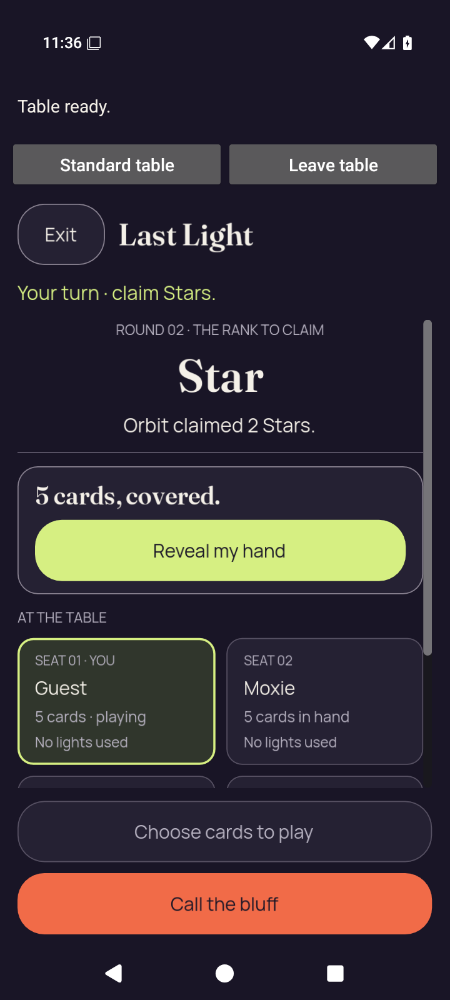</a>

`2d-engine-entry-native-ready.png` · 720 × 1600 · 146,760 bytes.

SHA-256: `403e584ddf4f4e586f897ec49969adc97d61bf7c78b5516bcdbc40220c353004`.

**[Direct original view](../../provenance/visual-review/direct-views-07.json).** Optimized 2D entry: Round 2 Star public claim is visible, hand is covered and full Reveal my hand fits. Standard table / Leave table / Exit, disabled Choose cards to play and Call the bluff fit. Guest and Moxie seat tiles fit; lower tiles are cut at the body scroll boundary, with vertical scrollbar visible. No private faces are visible.

Original capture window: `2026-09-10T23:36:12.590+00:00` to `2026-09-10T23:36:14.940+00:00`; PNG/XML acquired sequentially.

### 3d-engine-entry-native-ready

<a href="../../originals/android-jvm-reports/build/ci/android/godot-session/optimized-test-signed/runtime/captures/3d-engine-entry-native-ready.png">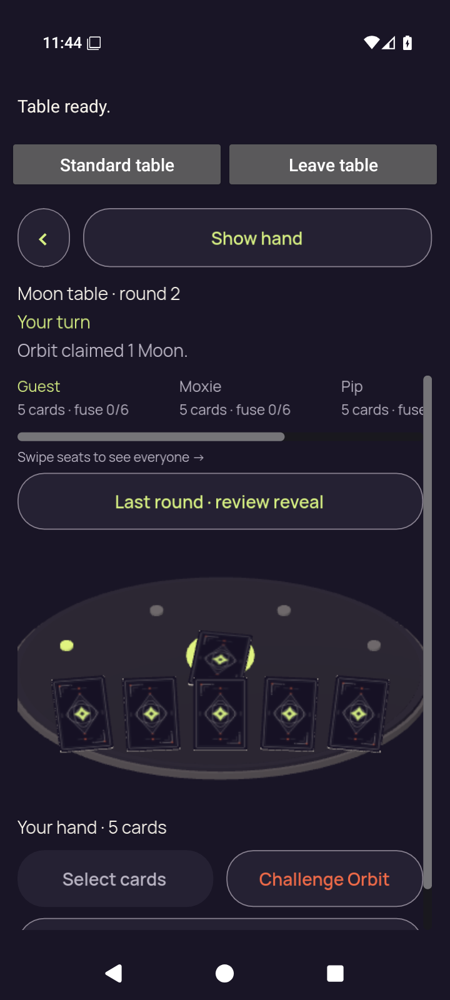</a>

`3d-engine-entry-native-ready.png` · 720 × 1600 · 192,285 bytes.

SHA-256: `a2440d11f90b282ba1b15ee10c36db72dec22c11f346d1c9921b0d84a5949042`.

**[Direct original view](../../provenance/visual-review/direct-views-07.json).** Optimized 3D entry: Round 2 Moon table, Show hand and full Last round review reveal control are visible. Five hand backs and the public pile back show no private faces. Standard table / Leave table, disabled Select cards and Challenge Orbit fit. The lower outlined action is only partly visible at the vertical scroll boundary; its label is offscreen. Vertical body scrollbar and horizontal seat scrollbar/swipe instruction are visible. Table/card artwork looks coarse relative to interface text. Reachability of the lower action was not tested.

Original capture window: `2026-09-10T23:44:54.815+00:00` to `2026-09-10T23:44:57.182+00:00`; PNG/XML acquired sequentially.

### 2d-action-entry-native-ready

<a href="../../originals/android-jvm-reports/build/ci/android/godot-session/optimized-test-signed/runtime/captures/2d-action-entry-native-ready.png">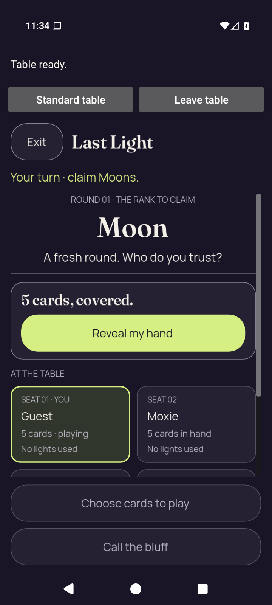</a>

`2d-action-entry-native-ready.png` · 720 × 1600 · 152,354 bytes.

SHA-256: `bd902db6ff3aa988606bab4707a1e03e0de903b9400593caebaca2bbcdc1c434`.

**Preserved image; unviewed.** Original preserved without a direct view or an independently established reviewed-byte representative in this bounded review. Matching published bytes alone do not establish visual review.

Original capture window: `2026-09-10T23:34:06.662+00:00` to `2026-09-10T23:34:09.005+00:00`; PNG/XML acquired sequentially.

### 2d-action-entry-selected

<a href="../../originals/android-jvm-reports/build/ci/android/godot-session/optimized-test-signed/runtime/captures/2d-action-entry-selected.png">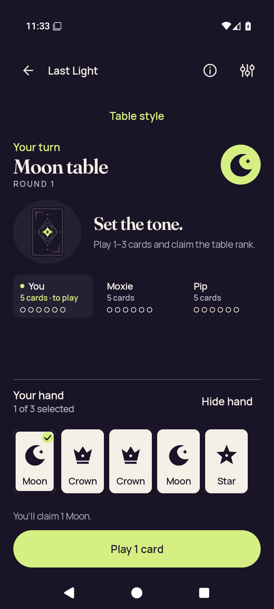</a>

`2d-action-entry-selected.png` · 720 × 1600 · 102,984 bytes.

SHA-256: `2265abe340fc89227771c32b73c155eabef301c870421304496c8a5ae7727af8`.

**Preserved image; unviewed.** Original preserved without a direct view or an independently established reviewed-byte representative in this bounded review. Matching published bytes alone do not establish visual review.

Original capture window: `2026-09-10T23:33:49.245+00:00` to `2026-09-10T23:33:51.591+00:00`; PNG/XML acquired sequentially.

### 2d-action-entry-selector

<a href="../../originals/android-jvm-reports/build/ci/android/godot-session/optimized-test-signed/runtime/captures/2d-action-entry-selector.png">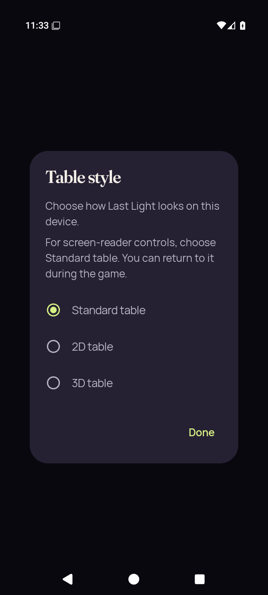</a>

`2d-action-entry-selector.png` · 720 × 1600 · 57,858 bytes.

SHA-256: `7c81a3b3306373cd5d4b8ff4bfca03e128d4f74ab989a14e3567cba954fe965f`.

**Preserved image; unviewed.** Original preserved without a direct view or an independently established reviewed-byte representative in this bounded review. Matching published bytes alone do not establish visual review.

Original capture window: `2026-09-10T23:33:57.941+00:00` to `2026-09-10T23:34:00.296+00:00`; PNG/XML acquired sequentially.

### 2d-action-return-concealed

`2d-action-return-concealed.png` · 720 × 1600 · 109,462 bytes.

SHA-256: `c87957e172bfefcf47ed91b7ec10981c4cf90906fcf37b359fb0034f3d5ade3f`.

**Preserved image; unviewed.** Original preserved without a direct view or an independently established reviewed-byte representative in this bounded review. Matching published bytes alone do not establish visual review.

Original capture window: `2026-09-10T23:34:15.729+00:00` to `2026-09-10T23:34:18.077+00:00`; PNG/XML acquired sequentially.

### 2d-action-return-first-card

`2d-action-return-first-card.png` · 720 × 1600 · 104,029 bytes.

SHA-256: `81cc5fe3c2ee4df28ec55a3e246a5f097ff1cb504a3a74a042627d18ca04382d`.

**Preserved image; unviewed.** Original preserved without a direct view or an independently established reviewed-byte representative in this bounded review. Matching published bytes alone do not establish visual review.

Original capture window: `2026-09-10T23:34:30.920+00:00` to `2026-09-10T23:34:33.260+00:00`; PNG/XML acquired sequentially.

### 2d-action-return-public

`2d-action-return-public.png` · 720 × 1600 · 109,462 bytes.

SHA-256: `c87957e172bfefcf47ed91b7ec10981c4cf90906fcf37b359fb0034f3d5ade3f`.

**Preserved image; unviewed.** Original preserved without a direct view or an independently established reviewed-byte representative in this bounded review. Matching published bytes alone do not establish visual review.

Original capture window: `2026-09-10T23:34:24.459+00:00` to `2026-09-10T23:34:26.785+00:00`; PNG/XML acquired sequentially.

### 2d-action-return-selection-cleared

`2d-action-return-selection-cleared.png` · 720 × 1600 · 109,462 bytes.

SHA-256: `c87957e172bfefcf47ed91b7ec10981c4cf90906fcf37b359fb0034f3d5ade3f`.

**Preserved image; unviewed.** Original preserved without a direct view or an independently established reviewed-byte representative in this bounded review. Matching published bytes alone do not establish visual review.

Original capture window: `2026-09-10T23:34:20.102+00:00` to `2026-09-10T23:34:22.438+00:00`; PNG/XML acquired sequentially.

### 2d-baseline-first-card

<a href="../../originals/android-jvm-reports/build/ci/android/godot-session/optimized-test-signed/runtime/captures/2d-baseline-first-card.png">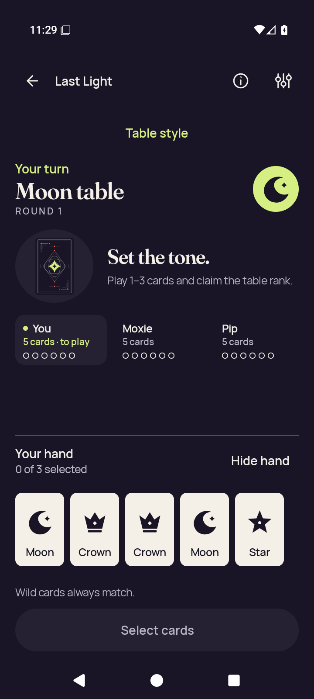</a>

`2d-baseline-first-card.png` · 720 × 1600 · 104,175 bytes.

SHA-256: `09bf780256efd5327008e3c02ab88257bdd42de15154b5e55e8e65f0d6aeaa1a`.

**Preserved image; unviewed.** Original preserved without a direct view or an independently established reviewed-byte representative in this bounded review. Matching published bytes alone do not establish visual review.

Original capture window: `2026-09-10T23:29:51.634+00:00` to `2026-09-10T23:29:53.979+00:00`; PNG/XML acquired sequentially.

### 2d-baseline-public

`2d-baseline-public.png` · 720 × 1600 · 109,594 bytes.

SHA-256: `a4fd118e1cb44c251b55cd0719dd7ef5c49c0c35a1ef770a00368a278698a96f`.

**Preserved image; unviewed.** Original preserved without a direct view or an independently established reviewed-byte representative in this bounded review. Matching published bytes alone do not establish visual review.

Original capture window: `2026-09-10T23:29:45.178+00:00` to `2026-09-10T23:29:47.519+00:00`; PNG/XML acquired sequentially.

### 2d-baseline-selected

`2d-baseline-selected.png` · 720 × 1600 · 102,969 bytes.

SHA-256: `4b77b2b29993e31890fd5403fc6d29773685cccbaf9e7742635316ed43bc3e19`.

**Preserved image; unviewed.** Original preserved without a direct view or an independently established reviewed-byte representative in this bounded review. Matching published bytes alone do not establish visual review.

Original capture window: `2026-09-10T23:31:36.291+00:00` to `2026-09-10T23:31:38.629+00:00`; PNG/XML acquired sequentially.

### 2d-engine-baseline-first-card

<a href="../../originals/android-jvm-reports/build/ci/android/godot-session/optimized-test-signed/runtime/captures/2d-engine-baseline-first-card.png">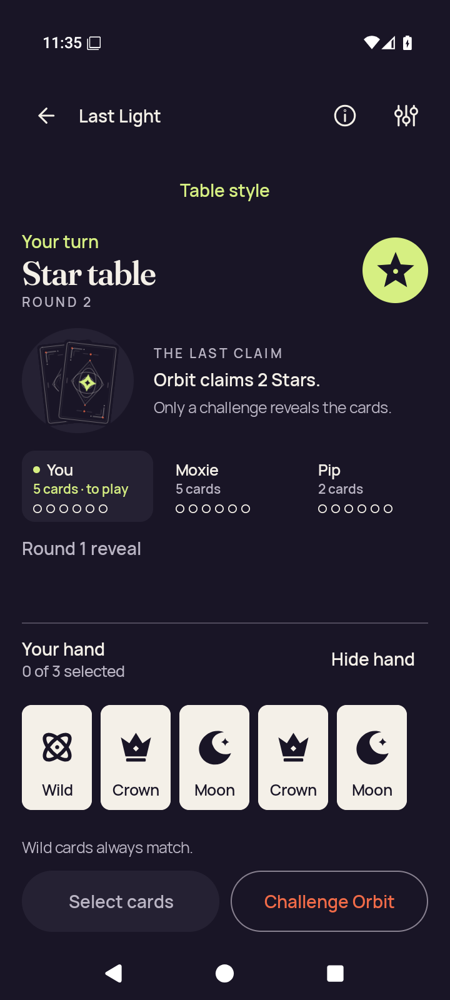</a>

`2d-engine-baseline-first-card.png` · 720 × 1600 · 127,248 bytes.

SHA-256: `d87afb06b6524d357f115e8a2092dd22d1bf3609554e0a32ddcf70c71b3110e6`.

**Preserved image; unviewed.** Original preserved without a direct view or an independently established reviewed-byte representative in this bounded review. Matching published bytes alone do not establish visual review.

Original capture window: `2026-09-10T23:35:45.477+00:00` to `2026-09-10T23:35:47.881+00:00`; PNG/XML acquired sequentially.

### 2d-engine-baseline-public

<a href="../../originals/android-jvm-reports/build/ci/android/godot-session/optimized-test-signed/runtime/captures/2d-engine-baseline-public.png">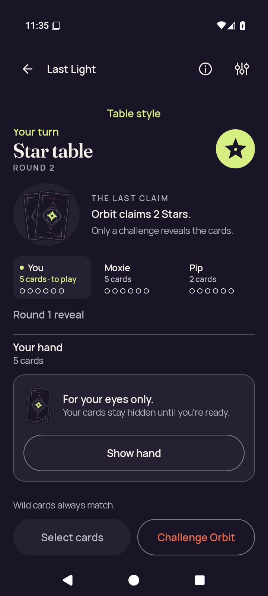</a>

`2d-engine-baseline-public.png` · 720 × 1600 · 130,807 bytes.

SHA-256: `8af498872df1b3eb4d9709e28b28474532bd1b6b06df71eafc1f86cd447de5c2`.

**Preserved image; unviewed.** Original preserved without a direct view or an independently established reviewed-byte representative in this bounded review. Matching published bytes alone do not establish visual review.

Original capture window: `2026-09-10T23:35:39.017+00:00` to `2026-09-10T23:35:41.350+00:00`; PNG/XML acquired sequentially.

### 2d-engine-entry-selector

`2d-engine-entry-selector.png` · 720 × 1600 · 58,413 bytes.

SHA-256: `f6cad068fd31826a2ec06387d94db00bbad0265f1e8f990513de3f3a1742d984`.

**Preserved image; unviewed.** Original preserved without a direct view or an independently established reviewed-byte representative in this bounded review. Matching published bytes alone do not establish visual review.

Original capture window: `2026-09-10T23:36:02.651+00:00` to `2026-09-10T23:36:04.988+00:00`; PNG/XML acquired sequentially.

### 2d-engine-home

`2d-engine-home.png` · 720 × 1600 · 132,119 bytes.

SHA-256: `7ad5253a76169acddf7300b671032bbbcd3d7b4e25772a8cbaac07319fe9d808`.

**Preserved image; unviewed.** Original preserved without a direct view or an independently established reviewed-byte representative in this bounded review. Matching published bytes alone do not establish visual review.

Original capture window: `2026-09-10T23:38:10.359+00:00` to `2026-09-10T23:38:12.692+00:00`; PNG/XML acquired sequentially.

### 2d-engine-leave-confirmation

<a href="../../originals/android-jvm-reports/build/ci/android/godot-session/optimized-test-signed/runtime/captures/2d-engine-leave-confirmation.png">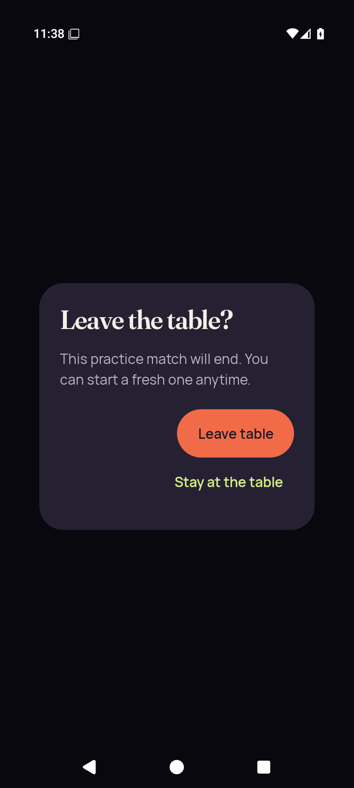</a>

`2d-engine-leave-confirmation.png` · 720 × 1600 · 41,198 bytes.

SHA-256: `df550e2ef1cb60209af301b507785b1d0758a178fe84582548415493863ae3de`.

**Preserved image; unviewed.** Original preserved without a direct view or an independently established reviewed-byte representative in this bounded review. Matching published bytes alone do not establish visual review.

Original capture window: `2026-09-10T23:38:01.671+00:00` to `2026-09-10T23:38:04.003+00:00`; PNG/XML acquired sequentially.

### 2d-engine-leave-selector

`2d-engine-leave-selector.png` · 720 × 1600 · 58,143 bytes.

SHA-256: `e81431968ae69dfe1205c37e85ac7797babd2e399538fbc290940f1c9a5774d9`.

**Preserved image; unviewed.** Original preserved without a direct view or an independently established reviewed-byte representative in this bounded review. Matching published bytes alone do not establish visual review.

Original capture window: `2026-09-10T23:37:46.925+00:00` to `2026-09-10T23:37:49.257+00:00`; PNG/XML acquired sequentially.

### 2d-engine-selected

<a href="../../originals/android-jvm-reports/build/ci/android/godot-session/optimized-test-signed/runtime/captures/2d-engine-selected.png">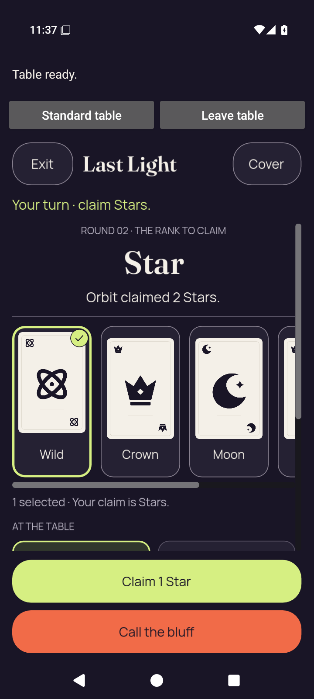</a>

`2d-engine-selected.png` · 720 × 1600 · 127,624 bytes.

SHA-256: `9969671ff93803c50f52400e59026e109e9e13183009c0cab95da7dfb050cf82`.

**Preserved image; unviewed.** Original preserved without a direct view or an independently established reviewed-byte representative in this bounded review. Matching published bytes alone do not establish visual review.

Original capture window: `2026-09-10T23:37:02.775+00:00` to `2026-09-10T23:37:05.136+00:00`; PNG/XML acquired sequentially.

### 2d-engine-standard-after-play

<a href="../../originals/android-jvm-reports/build/ci/android/godot-session/optimized-test-signed/runtime/captures/2d-engine-standard-after-play.png">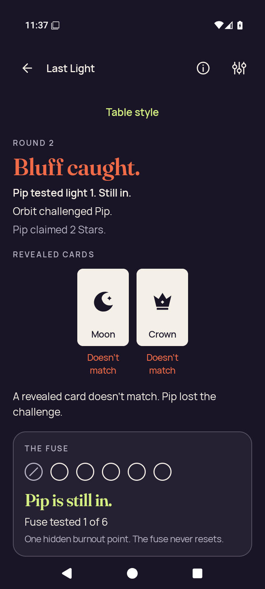</a>

`2d-engine-standard-after-play.png` · 720 × 1600 · 100,354 bytes.

SHA-256: `1c5f3d84d03c5d9aba8aad418905498277315f9deeb507e35ad1ff4744885dd6`.

**Preserved image; unviewed.** Original preserved without a direct view or an independently established reviewed-byte representative in this bounded review. Matching published bytes alone do not establish visual review.

Original capture window: `2026-09-10T23:37:38.140+00:00` to `2026-09-10T23:37:40.478+00:00`; PNG/XML acquired sequentially.

### 2d-entry-native-ready

`2d-entry-native-ready.png` · 720 × 1600 · 151,981 bytes.

SHA-256: `ed5a187ca70c688f817208df7c46631051b273893de6db89a1ddaa47db556c0b`.

**Preserved image; unviewed.** Original preserved without a direct view or an independently established reviewed-byte representative in this bounded review. Matching published bytes alone do not establish visual review.

Original capture window: `2026-09-10T23:31:54.935+00:00` to `2026-09-10T23:31:57.301+00:00`; PNG/XML acquired sequentially.

### 2d-entry-selector

<a href="../../originals/android-jvm-reports/build/ci/android/godot-session/optimized-test-signed/runtime/captures/2d-entry-selector.png">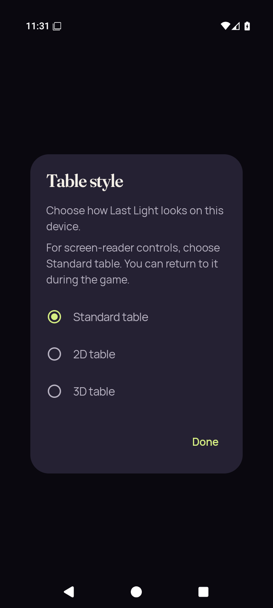</a>

`2d-entry-selector.png` · 720 × 1600 · 57,838 bytes.

SHA-256: `e35bb9c0a8b454a49a148dcd74253f7652a77e4c0c69935c1e2825d95f1dea21`.

**Preserved image; unviewed.** Original preserved without a direct view or an independently established reviewed-byte representative in this bounded review. Matching published bytes alone do not establish visual review.

Original capture window: `2026-09-10T23:31:45.088+00:00` to `2026-09-10T23:31:47.421+00:00`; PNG/XML acquired sequentially.

### 2d-home-after-session-end

<a href="../../originals/android-jvm-reports/build/ci/android/godot-session/optimized-test-signed/runtime/captures/2d-home-after-session-end.png">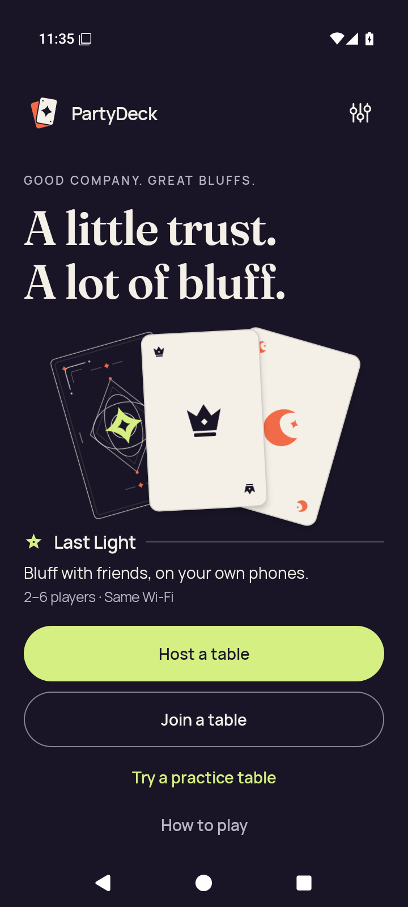</a>

`2d-home-after-session-end.png` · 720 × 1600 · 131,928 bytes.

SHA-256: `2a194acbc55b4604421ffa650de37df818740c3f3a4e4753a4e8710841b61d89`.

**Preserved image; unviewed.** Original preserved without a direct view or an independently established reviewed-byte representative in this bounded review. Matching published bytes alone do not establish visual review.

Original capture window: `2026-09-10T23:35:16.213+00:00` to `2026-09-10T23:35:18.548+00:00`; PNG/XML acquired sequentially.

### 2d-home-resumed

`2d-home-resumed.png` · 720 × 1600 · 152,524 bytes.

SHA-256: `e07f7a502b7578349e4bafed608e349c9d9d74b7f86fea6306e0ef9717a88026`.

**Preserved image; unviewed.** Original preserved without a direct view or an independently established reviewed-byte representative in this bounded review. Matching published bytes alone do not establish visual review.

Original capture window: `2026-09-10T23:32:05.461+00:00` to `2026-09-10T23:32:07.812+00:00`; PNG/XML acquired sequentially.

### 2d-home-system-ui

`2d-home-system-ui.png` · 720 × 1600 · 746,422 bytes.

SHA-256: `91f3d2a2f20fbb7cffd522c8101b932651e5fdc49a4ad949a758aec5278c50db`.

**Preserved image; unviewed.** Original preserved without a direct view or an independently established reviewed-byte representative in this bounded review. Matching published bytes alone do not establish visual review.

Original capture window: `2026-09-10T23:31:59.838+00:00` to `2026-09-10T23:32:02.530+00:00`; PNG/XML acquired sequentially.

### 2d-leave-cancel-confirmation

`2d-leave-cancel-confirmation.png` · 720 × 1600 · 40,525 bytes.

SHA-256: `b50735b5e41d370080e96c8e94001d8a19706543e04720f13a71e91de0863a20`.

**Preserved image; unviewed.** Original preserved without a direct view or an independently established reviewed-byte representative in this bounded review. Matching published bytes alone do not establish visual review.

Original capture window: `2026-09-10T23:33:16.843+00:00` to `2026-09-10T23:33:19.196+00:00`; PNG/XML acquired sequentially.

### 2d-leave-cancel-native-ready

<a href="../../originals/android-jvm-reports/build/ci/android/godot-session/optimized-test-signed/runtime/captures/2d-leave-cancel-native-ready.png">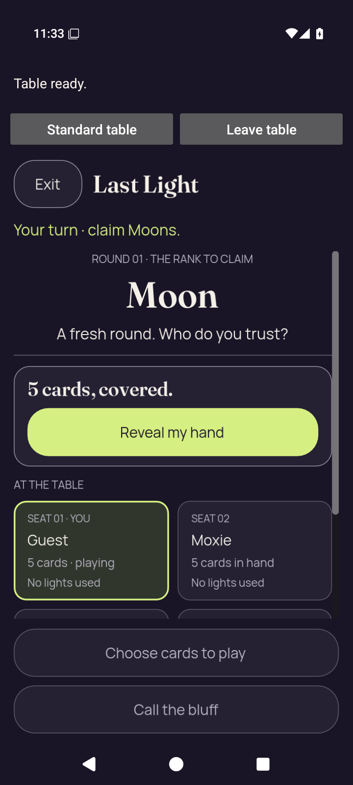</a>

`2d-leave-cancel-native-ready.png` · 720 × 1600 · 151,853 bytes.

SHA-256: `ce3897af3e044169f4aab130c281c69faadd12d0a83aa553029c1a52bda2f6cf`.

**Preserved image; unviewed.** Original preserved without a direct view or an independently established reviewed-byte representative in this bounded review. Matching published bytes alone do not establish visual review.

Original capture window: `2026-09-10T23:33:07.290+00:00` to `2026-09-10T23:33:09.634+00:00`; PNG/XML acquired sequentially.

### 2d-leave-cancel-return-concealed

<a href="../../originals/android-jvm-reports/build/ci/android/godot-session/optimized-test-signed/runtime/captures/2d-leave-cancel-return-concealed.png">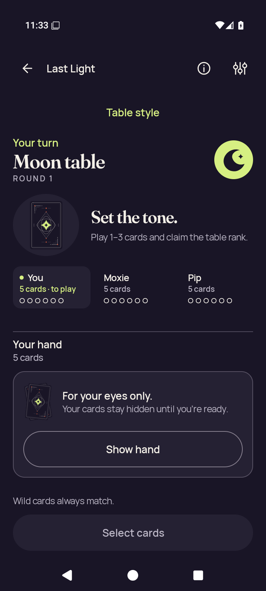</a>

`2d-leave-cancel-return-concealed.png` · 720 × 1600 · 109,166 bytes.

SHA-256: `1592a9f0128607e19354a1c8c7431558d9678de7ea2e49aa6e72496e25c1c7da`.

**Preserved image; unviewed.** Original preserved without a direct view or an independently established reviewed-byte representative in this bounded review. Matching published bytes alone do not establish visual review.

Original capture window: `2026-09-10T23:33:25.522+00:00` to `2026-09-10T23:33:27.865+00:00`; PNG/XML acquired sequentially.

### 2d-leave-cancel-return-first-card

`2d-leave-cancel-return-first-card.png` · 720 × 1600 · 103,753 bytes.

SHA-256: `56594b99401e93bd227a0fbf87b0d0591f9a3aff43b687562bdebefcd065ee94`.

**Preserved image; unviewed.** Original preserved without a direct view or an independently established reviewed-byte representative in this bounded review. Matching published bytes alone do not establish visual review.

Original capture window: `2026-09-10T23:33:40.690+00:00` to `2026-09-10T23:33:43.038+00:00`; PNG/XML acquired sequentially.

### 2d-leave-cancel-return-public

`2d-leave-cancel-return-public.png` · 720 × 1600 · 109,166 bytes.

SHA-256: `1592a9f0128607e19354a1c8c7431558d9678de7ea2e49aa6e72496e25c1c7da`.

**Preserved image; unviewed.** Original preserved without a direct view or an independently established reviewed-byte representative in this bounded review. Matching published bytes alone do not establish visual review.

Original capture window: `2026-09-10T23:33:34.241+00:00` to `2026-09-10T23:33:36.582+00:00`; PNG/XML acquired sequentially.

### 2d-leave-cancel-return-selection-cleared

`2d-leave-cancel-return-selection-cleared.png` · 720 × 1600 · 109,166 bytes.

SHA-256: `1592a9f0128607e19354a1c8c7431558d9678de7ea2e49aa6e72496e25c1c7da`.

**Preserved image; unviewed.** Original preserved without a direct view or an independently established reviewed-byte representative in this bounded review. Matching published bytes alone do not establish visual review.

Original capture window: `2026-09-10T23:33:29.888+00:00` to `2026-09-10T23:33:32.223+00:00`; PNG/XML acquired sequentially.

### 2d-leave-cancel-selected

<a href="../../originals/android-jvm-reports/build/ci/android/godot-session/optimized-test-signed/runtime/captures/2d-leave-cancel-selected.png">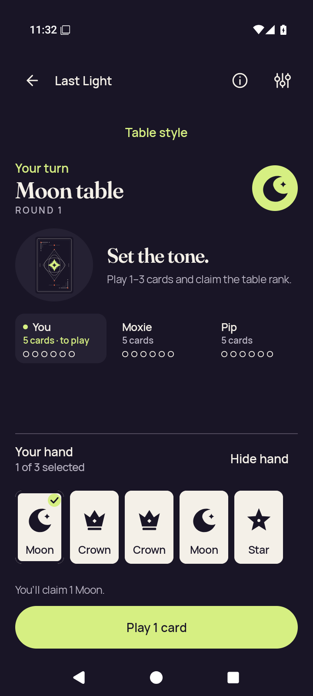</a>

`2d-leave-cancel-selected.png` · 720 × 1600 · 103,251 bytes.

SHA-256: `2e09de7baffcea9137a565a4bf71274ab7026d9ce62594d34dae8ad261edf44b`.

**Preserved image; unviewed.** Original preserved without a direct view or an independently established reviewed-byte representative in this bounded review. Matching published bytes alone do not establish visual review.

Original capture window: `2026-09-10T23:32:48.646+00:00` to `2026-09-10T23:32:50.993+00:00`; PNG/XML acquired sequentially.

### 2d-leave-cancel-selector

`2d-leave-cancel-selector.png` · 720 × 1600 · 58,127 bytes.

SHA-256: `c13ea2606736355ba89d7761c812d6855c0f42533cbf74df410e2fb74804474e`.

**Preserved image; unviewed.** Original preserved without a direct view or an independently established reviewed-byte representative in this bounded review. Matching published bytes alone do not establish visual review.

Original capture window: `2026-09-10T23:32:57.410+00:00` to `2026-09-10T23:32:59.737+00:00`; PNG/XML acquired sequentially.

### 2d-leave-end-confirmation

`2d-leave-end-confirmation.png` · 720 × 1600 · 40,915 bytes.

SHA-256: `7586599da3214e26d57c9235a092287c4d114961eec18c64a4ee5c11da1c4816`.

**Preserved image; unviewed.** Original preserved without a direct view or an independently established reviewed-byte representative in this bounded review. Matching published bytes alone do not establish visual review.

Original capture window: `2026-09-10T23:35:07.537+00:00` to `2026-09-10T23:35:09.875+00:00`; PNG/XML acquired sequentially.

### 2d-leave-end-selector

`2d-leave-end-selector.png` · 720 × 1600 · 57,973 bytes.

SHA-256: `5f2f6887d96ea0ee0fd92eff0d9d1d0e8f7d8449df191394b93864c734577817`.

**Preserved image; unviewed.** Original preserved without a direct view or an independently established reviewed-byte representative in this bounded review. Matching published bytes alone do not establish visual review.

Original capture window: `2026-09-10T23:34:55.024+00:00` to `2026-09-10T23:34:57.359+00:00`; PNG/XML acquired sequentially.

### 2d-recents-resumed

`2d-recents-resumed.png` · 720 × 1600 · 152,524 bytes.

SHA-256: `e07f7a502b7578349e4bafed608e349c9d9d74b7f86fea6306e0ef9717a88026`.

**Preserved image; unviewed.** Original preserved without a direct view or an independently established reviewed-byte representative in this bounded review. Matching published bytes alone do not establish visual review.

Original capture window: `2026-09-10T23:32:15.611+00:00` to `2026-09-10T23:32:17.951+00:00`; PNG/XML acquired sequentially.

### 2d-recents-system-ui

<a href="../../originals/android-jvm-reports/build/ci/android/godot-session/optimized-test-signed/runtime/captures/2d-recents-system-ui.png">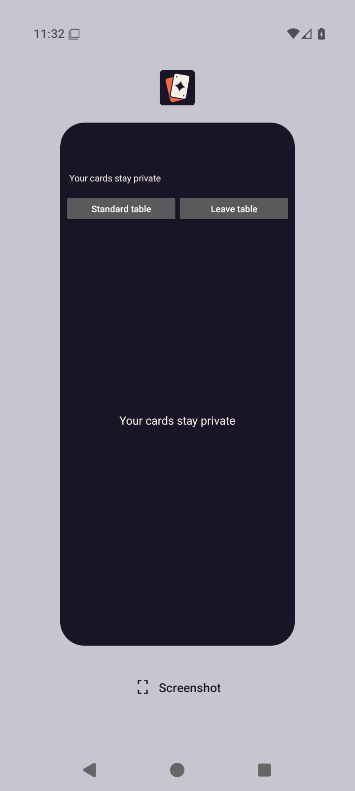</a>

`2d-recents-system-ui.png` · 720 × 1600 · 42,018 bytes.

SHA-256: `a333cf28280834c5845dbc617920078a7415667d975ecd3e0309f36d59183329`.

**Preserved image; unviewed.** Original preserved without a direct view or an independently established reviewed-byte representative in this bounded review. Matching published bytes alone do not establish visual review.

Original capture window: `2026-09-10T23:32:10.581+00:00` to `2026-09-10T23:32:12.936+00:00`; PNG/XML acquired sequentially.

### 2d-standard-concealed

`2d-standard-concealed.png` · 720 × 1600 · 109,617 bytes.

SHA-256: `cf5ad99ce2353a85bdf100866a6f845b9779874321ce5f6b580a2c6eebd5ce56`.

**Preserved image; unviewed.** Original preserved without a direct view or an independently established reviewed-byte representative in this bounded review. Matching published bytes alone do not establish visual review.

Original capture window: `2026-09-10T23:32:24.855+00:00` to `2026-09-10T23:32:27.191+00:00`; PNG/XML acquired sequentially.

### 2d-standard-first-card

<a href="../../originals/android-jvm-reports/build/ci/android/godot-session/optimized-test-signed/runtime/captures/2d-standard-first-card.png">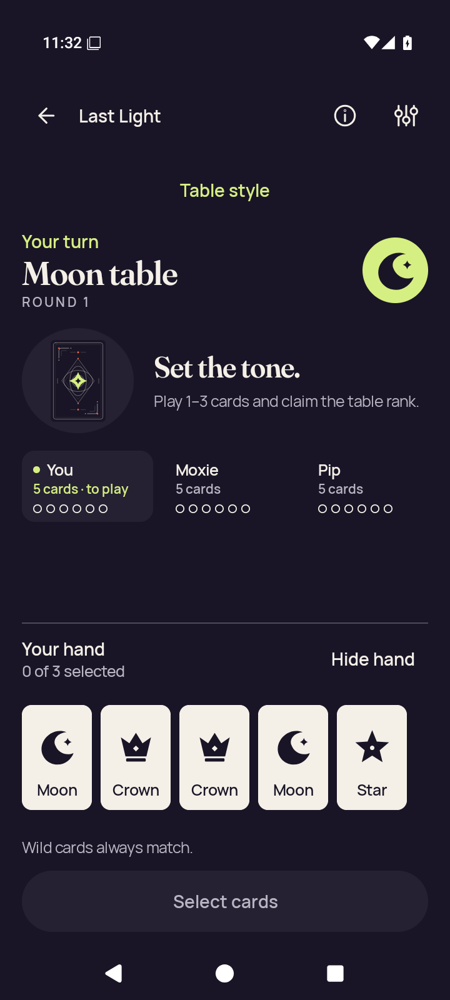</a>

`2d-standard-first-card.png` · 720 × 1600 · 104,012 bytes.

SHA-256: `89e206429e7c2d98bd74a179ea0fb25d051f0b88dc52218fc8afdd12d2779192`.

**Preserved image; unviewed.** Original preserved without a direct view or an independently established reviewed-byte representative in this bounded review. Matching published bytes alone do not establish visual review.

Original capture window: `2026-09-10T23:32:40.025+00:00` to `2026-09-10T23:32:42.377+00:00`; PNG/XML acquired sequentially.

### 2d-standard-play-after-play

<a href="../../originals/android-jvm-reports/build/ci/android/godot-session/optimized-test-signed/runtime/captures/2d-standard-play-after-play.png">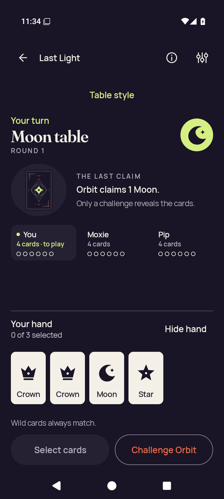</a>

`2d-standard-play-after-play.png` · 720 × 1600 · 112,105 bytes.

SHA-256: `835107064c8c5ce5bf4a3b014722acb420eda92fb71fe102549153a7067b74af`.

**Preserved image; unviewed.** Original preserved without a direct view or an independently established reviewed-byte representative in this bounded review. Matching published bytes alone do not establish visual review.

Original capture window: `2026-09-10T23:34:46.122+00:00` to `2026-09-10T23:34:48.468+00:00`; PNG/XML acquired sequentially.

### 2d-standard-play-selected

`2d-standard-play-selected.png` · 720 × 1600 · 103,098 bytes.

SHA-256: `c1831754775a8e54a16741b6db041469bf9cb115df5721dd04278f7ac688d249`.

**Preserved image; unviewed.** Original preserved without a direct view or an independently established reviewed-byte representative in this bounded review. Matching published bytes alone do not establish visual review.

Original capture window: `2026-09-10T23:34:39.573+00:00` to `2026-09-10T23:34:41.912+00:00`; PNG/XML acquired sequentially.

### 2d-standard-public

`2d-standard-public.png` · 720 × 1600 · 109,453 bytes.

SHA-256: `0478240fe5c3d785758d3d4d1ce7a2602b961ae17671e11c452c38133f5f7f98`.

**Preserved image; unviewed.** Original preserved without a direct view or an independently established reviewed-byte representative in this bounded review. Matching published bytes alone do not establish visual review.

Original capture window: `2026-09-10T23:32:33.576+00:00` to `2026-09-10T23:32:35.924+00:00`; PNG/XML acquired sequentially.

### 2d-standard-selection-cleared

`2d-standard-selection-cleared.png` · 720 × 1600 · 109,453 bytes.

SHA-256: `0478240fe5c3d785758d3d4d1ce7a2602b961ae17671e11c452c38133f5f7f98`.

**Preserved image; unviewed.** Original preserved without a direct view or an independently established reviewed-byte representative in this bounded review. Matching published bytes alone do not establish visual review.

Original capture window: `2026-09-10T23:32:29.213+00:00` to `2026-09-10T23:32:31.559+00:00`; PNG/XML acquired sequentially.

### 3d-action-entry-native-ready

<a href="../../originals/android-jvm-reports/build/ci/android/godot-session/optimized-test-signed/runtime/captures/3d-action-entry-native-ready.png">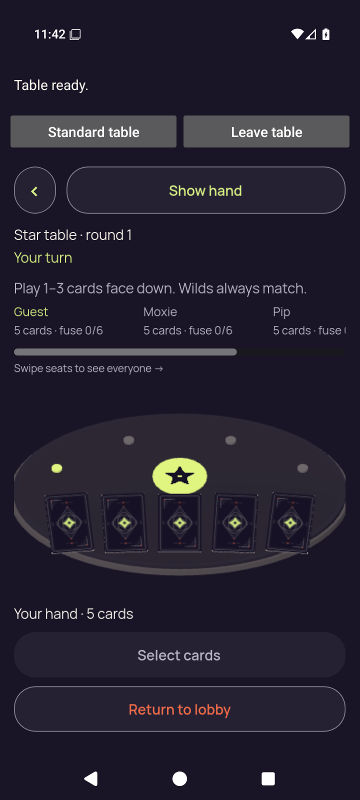</a>

`3d-action-entry-native-ready.png` · 720 × 1600 · 185,012 bytes.

SHA-256: `9a892ba165557d23d6b714752389f0f420800d9a1c5a94d2bde79b4e28f8873b`.

**Preserved image; unviewed.** Original preserved without a direct view or an independently established reviewed-byte representative in this bounded review. Matching published bytes alone do not establish visual review.

Original capture window: `2026-09-10T23:42:49.233+00:00` to `2026-09-10T23:42:51.612+00:00`; PNG/XML acquired sequentially.

### 3d-action-entry-selected

`3d-action-entry-selected.png` · 720 × 1600 · 104,211 bytes.

SHA-256: `d95ed60e34bad405a304828ac2b30785f8aca450ec1ba2a99278b1b5da05990f`.

**Preserved image; unviewed.** Original preserved without a direct view or an independently established reviewed-byte representative in this bounded review. Matching published bytes alone do not establish visual review.

Original capture window: `2026-09-10T23:42:29.640+00:00` to `2026-09-10T23:42:31.979+00:00`; PNG/XML acquired sequentially.

### 3d-action-entry-selector

`3d-action-entry-selector.png` · 720 × 1600 · 58,027 bytes.

SHA-256: `3189602247fee3e37a5444aaf2e1fd30f6a0386746df44faab4a30e19de1a8b4`.

**Preserved image; unviewed.** Original preserved without a direct view or an independently established reviewed-byte representative in this bounded review. Matching published bytes alone do not establish visual review.

Original capture window: `2026-09-10T23:42:38.447+00:00` to `2026-09-10T23:42:40.804+00:00`; PNG/XML acquired sequentially.

### 3d-action-return-concealed

`3d-action-return-concealed.png` · 720 × 1600 · 108,429 bytes.

SHA-256: `b28c27d3ebd52a83f9dcf120cf2bebfcffb178d7da4398b2d2bee20b4c9c15b9`.

**Preserved image; unviewed.** Original preserved without a direct view or an independently established reviewed-byte representative in this bounded review. Matching published bytes alone do not establish visual review.

Original capture window: `2026-09-10T23:42:58.527+00:00` to `2026-09-10T23:43:00.872+00:00`; PNG/XML acquired sequentially.

### 3d-action-return-first-card

<a href="../../originals/android-jvm-reports/build/ci/android/godot-session/optimized-test-signed/runtime/captures/3d-action-return-first-card.png">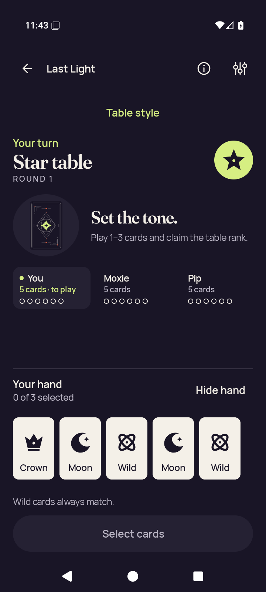</a>

`3d-action-return-first-card.png` · 720 × 1600 · 104,915 bytes.

SHA-256: `8201b4a5c6de80220c5da5cba7fbeced75f6e55803931602b61ba426dfd3958f`.

**Preserved image; unviewed.** Original preserved without a direct view or an independently established reviewed-byte representative in this bounded review. Matching published bytes alone do not establish visual review.

Original capture window: `2026-09-10T23:43:13.708+00:00` to `2026-09-10T23:43:16.047+00:00`; PNG/XML acquired sequentially.

### 3d-action-return-public

`3d-action-return-public.png` · 720 × 1600 · 108,429 bytes.

SHA-256: `b28c27d3ebd52a83f9dcf120cf2bebfcffb178d7da4398b2d2bee20b4c9c15b9`.

**Preserved image; unviewed.** Original preserved without a direct view or an independently established reviewed-byte representative in this bounded review. Matching published bytes alone do not establish visual review.

Original capture window: `2026-09-10T23:43:07.267+00:00` to `2026-09-10T23:43:09.602+00:00`; PNG/XML acquired sequentially.

### 3d-action-return-selection-cleared

`3d-action-return-selection-cleared.png` · 720 × 1600 · 108,429 bytes.

SHA-256: `b28c27d3ebd52a83f9dcf120cf2bebfcffb178d7da4398b2d2bee20b4c9c15b9`.

**Preserved image; unviewed.** Original preserved without a direct view or an independently established reviewed-byte representative in this bounded review. Matching published bytes alone do not establish visual review.

Original capture window: `2026-09-10T23:43:02.919+00:00` to `2026-09-10T23:43:05.249+00:00`; PNG/XML acquired sequentially.

### 3d-baseline-first-card

`3d-baseline-first-card.png` · 720 × 1600 · 105,207 bytes.

SHA-256: `334ea45a4fbc13893bbec705f3c7965be999927ba99d457747f6a891ee2232d2`.

**Preserved image; unviewed.** Original preserved without a direct view or an independently established reviewed-byte representative in this bounded review. Matching published bytes alone do not establish visual review.

Original capture window: `2026-09-10T23:38:29.332+00:00` to `2026-09-10T23:38:31.678+00:00`; PNG/XML acquired sequentially.

### 3d-baseline-public

`3d-baseline-public.png` · 720 × 1600 · 108,638 bytes.

SHA-256: `415e00db4cf0f8422642dc19c2555d9af4577f9827097395e9c3150ff1594659`.

**Preserved image; unviewed.** Original preserved without a direct view or an independently established reviewed-byte representative in this bounded review. Matching published bytes alone do not establish visual review.

Original capture window: `2026-09-10T23:38:22.875+00:00` to `2026-09-10T23:38:25.221+00:00`; PNG/XML acquired sequentially.

### 3d-baseline-selected

`3d-baseline-selected.png` · 720 × 1600 · 104,241 bytes.

SHA-256: `541926d1b612abaf52f1aec542b76ce9e84ab911df47f10249f1484ecf2bcaa0`.

**Preserved image; unviewed.** Original preserved without a direct view or an independently established reviewed-byte representative in this bounded review. Matching published bytes alone do not establish visual review.

Original capture window: `2026-09-10T23:40:14.041+00:00` to `2026-09-10T23:40:16.394+00:00`; PNG/XML acquired sequentially.

### 3d-engine-baseline-first-card

<a href="../../originals/android-jvm-reports/build/ci/android/godot-session/optimized-test-signed/runtime/captures/3d-engine-baseline-first-card.png">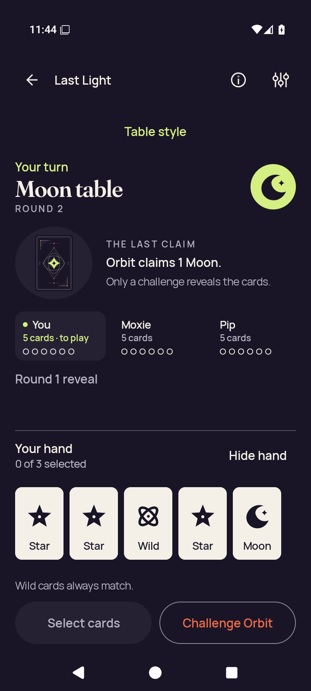</a>

`3d-engine-baseline-first-card.png` · 720 × 1600 · 118,618 bytes.

SHA-256: `0ebd4862a1cbbd75d5ede920e24a16e8cdf5bc2298f635659517713c937be0b1`.

**Preserved image; unviewed.** Original preserved without a direct view or an independently established reviewed-byte representative in this bounded review. Matching published bytes alone do not establish visual review.

Original capture window: `2026-09-10T23:44:26.939+00:00` to `2026-09-10T23:44:29.301+00:00`; PNG/XML acquired sequentially.

### 3d-engine-baseline-public

<a href="../../originals/android-jvm-reports/build/ci/android/godot-session/optimized-test-signed/runtime/captures/3d-engine-baseline-public.png">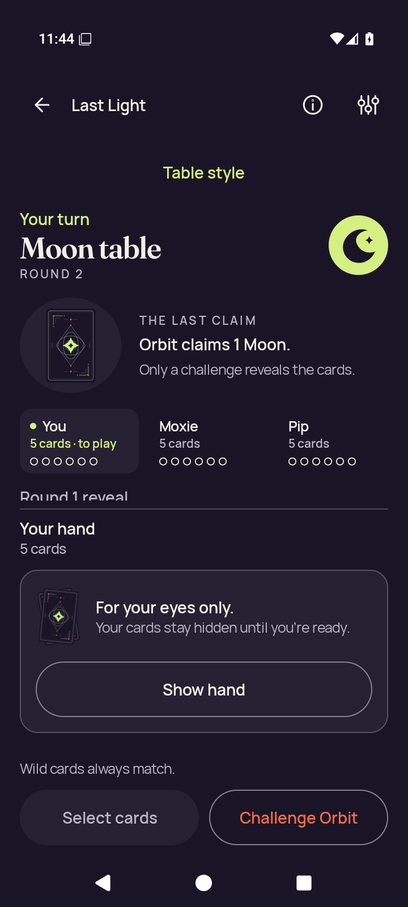</a>

`3d-engine-baseline-public.png` · 720 × 1600 · 120,832 bytes.

SHA-256: `8fa7f9c627599d307ab55f4adb44bd9580a5cd694827db5c82b930f35fdc342f`.

**Preserved image; unviewed.** Original preserved without a direct view or an independently established reviewed-byte representative in this bounded review. Matching published bytes alone do not establish visual review.

Original capture window: `2026-09-10T23:44:20.481+00:00` to `2026-09-10T23:44:22.833+00:00`; PNG/XML acquired sequentially.

### 3d-engine-entry-selector

`3d-engine-entry-selector.png` · 720 × 1600 · 57,649 bytes.

SHA-256: `2be76ff923fcb4053c59dc2d6c43ad16800c7dd8dd331911f8e8f141e669213c`.

**Preserved image; unviewed.** Original preserved without a direct view or an independently established reviewed-byte representative in this bounded review. Matching published bytes alone do not establish visual review.

Original capture window: `2026-09-10T23:44:43.929+00:00` to `2026-09-10T23:44:46.268+00:00`; PNG/XML acquired sequentially.

### 3d-engine-home

`3d-engine-home.png` · 720 × 1600 · 131,849 bytes.

SHA-256: `99a9bcefc89a107526ab7eca168332a5471419775c0e80b042dfdbbe22d43b39`.

**Preserved image; unviewed.** Original preserved without a direct view or an independently established reviewed-byte representative in this bounded review. Matching published bytes alone do not establish visual review.

Original capture window: `2026-09-10T23:46:47.646+00:00` to `2026-09-10T23:46:49.993+00:00`; PNG/XML acquired sequentially.

### 3d-engine-leave-confirmation

`3d-engine-leave-confirmation.png` · 720 × 1600 · 40,831 bytes.

SHA-256: `6b0c225c2b68f1f0c8d4be5f3e14f302a0e5b39cbdbc66aa3a8db2d2a2d7feeb`.

**Preserved image; unviewed.** Original preserved without a direct view or an independently established reviewed-byte representative in this bounded review. Matching published bytes alone do not establish visual review.

Original capture window: `2026-09-10T23:46:38.940+00:00` to `2026-09-10T23:46:41.284+00:00`; PNG/XML acquired sequentially.

### 3d-engine-leave-selector

<a href="../../originals/android-jvm-reports/build/ci/android/godot-session/optimized-test-signed/runtime/captures/3d-engine-leave-selector.png">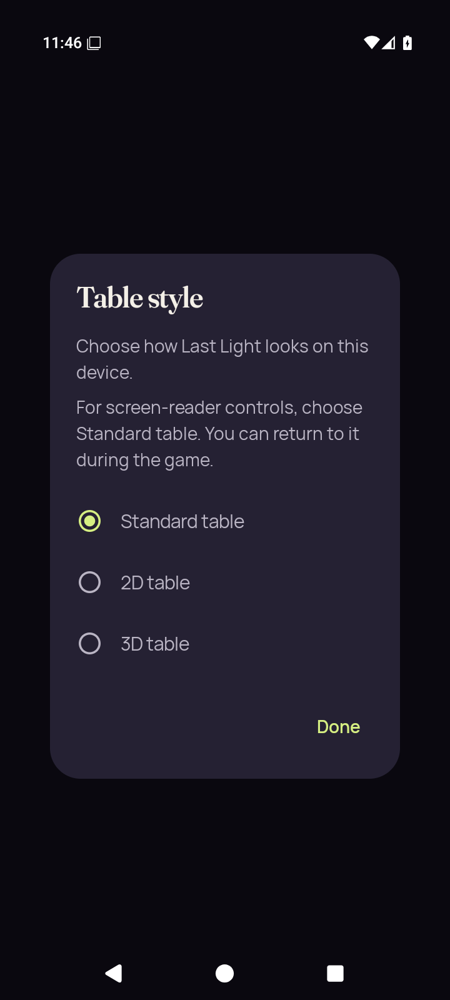</a>

`3d-engine-leave-selector.png` · 720 × 1600 · 58,133 bytes.

SHA-256: `cb601cd376ac46a3042287d888ea023ed27e08a0d492c180ee628fcf3ed2daad`.

**Preserved image; unviewed.** Original preserved without a direct view or an independently established reviewed-byte representative in this bounded review. Matching published bytes alone do not establish visual review.

Original capture window: `2026-09-10T23:46:23.266+00:00` to `2026-09-10T23:46:25.611+00:00`; PNG/XML acquired sequentially.

### 3d-engine-selected

<a href="../../originals/android-jvm-reports/build/ci/android/godot-session/optimized-test-signed/runtime/captures/3d-engine-selected.png">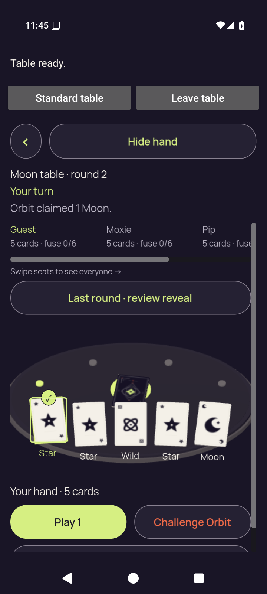</a>

`3d-engine-selected.png` · 720 × 1600 · 183,855 bytes.

SHA-256: `88f08ce5181361643eb68d3ffa9f309186b153e4732929c4a6f190233e8e6d03`.

**Preserved image; unviewed.** Original preserved without a direct view or an independently established reviewed-byte representative in this bounded review. Matching published bytes alone do not establish visual review.

Original capture window: `2026-09-10T23:45:45.381+00:00` to `2026-09-10T23:45:47.760+00:00`; PNG/XML acquired sequentially.

### 3d-engine-standard-after-play

<a href="../../originals/android-jvm-reports/build/ci/android/godot-session/optimized-test-signed/runtime/captures/3d-engine-standard-after-play.png">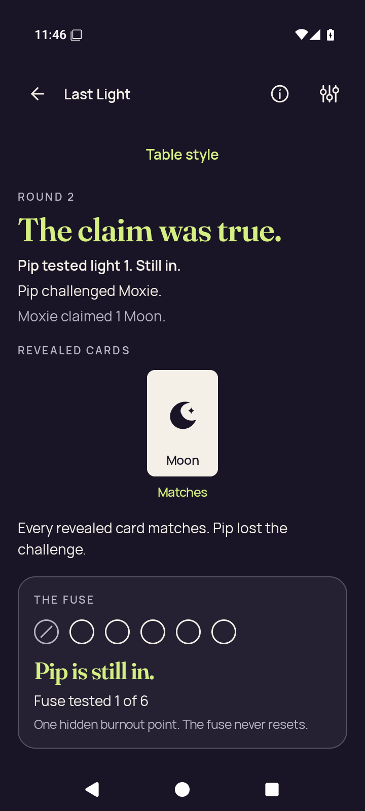</a>

`3d-engine-standard-after-play.png` · 720 × 1600 · 90,007 bytes.

SHA-256: `62572a34775ef447b5c09df1fcd9eee99cd13871a8b9ca2f2ec5a481ffd3d36a`.

**Preserved image; unviewed.** Original preserved without a direct view or an independently established reviewed-byte representative in this bounded review. Matching published bytes alone do not establish visual review.

Original capture window: `2026-09-10T23:46:14.475+00:00` to `2026-09-10T23:46:16.806+00:00`; PNG/XML acquired sequentially.

### 3d-entry-native-ready

`3d-entry-native-ready.png` · 720 × 1600 · 185,014 bytes.

SHA-256: `aebbcfd85ebbd9c496ef6a7b5ff6da224c4a3d3a2643ab1b863d3b3f188f0a40`.

**Preserved image; unviewed.** Original preserved without a direct view or an independently established reviewed-byte representative in this bounded review. Matching published bytes alone do not establish visual review.

Original capture window: `2026-09-10T23:40:33.903+00:00` to `2026-09-10T23:40:36.278+00:00`; PNG/XML acquired sequentially.

### 3d-entry-selector

`3d-entry-selector.png` · 720 × 1600 · 58,061 bytes.

SHA-256: `a94ecce19513263503a8d60e6f02e5500d6e0f414405e4b412fbff7b4d881ac4`.

**Preserved image; unviewed.** Original preserved without a direct view or an independently established reviewed-byte representative in this bounded review. Matching published bytes alone do not establish visual review.

Original capture window: `2026-09-10T23:40:22.822+00:00` to `2026-09-10T23:40:25.162+00:00`; PNG/XML acquired sequentially.

### 3d-home-after-session-end

`3d-home-after-session-end.png` · 720 × 1600 · 131,298 bytes.

SHA-256: `0575a697b0953ba3a8678ce55a8834c942469c56737a82359ac739215b4b6072`.

**Preserved image; unviewed.** Original preserved without a direct view or an independently established reviewed-byte representative in this bounded review. Matching published bytes alone do not establish visual review.

Original capture window: `2026-09-10T23:44:00.218+00:00` to `2026-09-10T23:44:02.590+00:00`; PNG/XML acquired sequentially.

### 3d-home-resumed

`3d-home-resumed.png` · 720 × 1600 · 185,037 bytes.

SHA-256: `53c3b01bcaa4d8a7e1b54f2e9c7829b4f55cfa14283c656ef7535c5225cf39fc`.

**Preserved image; unviewed.** Original preserved without a direct view or an independently established reviewed-byte representative in this bounded review. Matching published bytes alone do not establish visual review.

Original capture window: `2026-09-10T23:40:44.529+00:00` to `2026-09-10T23:40:46.899+00:00`; PNG/XML acquired sequentially.

### 3d-home-system-ui

<a href="../../originals/android-jvm-reports/build/ci/android/godot-session/optimized-test-signed/runtime/captures/3d-home-system-ui.png">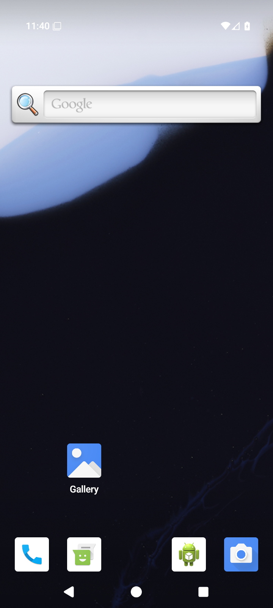</a>

`3d-home-system-ui.png` · 720 × 1600 · 746,206 bytes.

SHA-256: `0fb7d6bf6cc0eb6654b539b939c6a009cfc07205775cb111f56a850bb722d45e`.

**Preserved image; unviewed.** Original preserved without a direct view or an independently established reviewed-byte representative in this bounded review. Matching published bytes alone do not establish visual review.

Original capture window: `2026-09-10T23:40:38.889+00:00` to `2026-09-10T23:40:41.582+00:00`; PNG/XML acquired sequentially.

### 3d-leave-cancel-confirmation

`3d-leave-cancel-confirmation.png` · 720 × 1600 · 40,222 bytes.

SHA-256: `6aa70df5f8b6bb6b1188e01299c640ed5644e30b460bee6450c20a46c14be7fe`.

**Preserved image; unviewed.** Original preserved without a direct view or an independently established reviewed-byte representative in this bounded review. Matching published bytes alone do not establish visual review.

Original capture window: `2026-09-10T23:41:57.217+00:00` to `2026-09-10T23:41:59.551+00:00`; PNG/XML acquired sequentially.

### 3d-leave-cancel-native-ready

`3d-leave-cancel-native-ready.png` · 720 × 1600 · 184,187 bytes.

SHA-256: `2024fd5249c37ed9bc9691ebcae22abd714698e5c0bf768588beba77319d682f`.

**Preserved image; unviewed.** Original preserved without a direct view or an independently established reviewed-byte representative in this bounded review. Matching published bytes alone do not establish visual review.

Original capture window: `2026-09-10T23:41:47.586+00:00` to `2026-09-10T23:41:49.947+00:00`; PNG/XML acquired sequentially.

### 3d-leave-cancel-return-concealed

`3d-leave-cancel-return-concealed.png` · 720 × 1600 · 108,298 bytes.

SHA-256: `aaec9b0a90c50d5caa8de1809ae8b944c2e88068acdebe44b4b1ccb49fef2ca1`.

**Preserved image; unviewed.** Original preserved without a direct view or an independently established reviewed-byte representative in this bounded review. Matching published bytes alone do not establish visual review.

Original capture window: `2026-09-10T23:42:05.905+00:00` to `2026-09-10T23:42:08.257+00:00`; PNG/XML acquired sequentially.

### 3d-leave-cancel-return-first-card

`3d-leave-cancel-return-first-card.png` · 720 × 1600 · 104,769 bytes.

SHA-256: `318b06a125689ed0f261f2381f1e682c8685869729fb118c3dec549bfe6b13d1`.

**Preserved image; unviewed.** Original preserved without a direct view or an independently established reviewed-byte representative in this bounded review. Matching published bytes alone do not establish visual review.

Original capture window: `2026-09-10T23:42:21.048+00:00` to `2026-09-10T23:42:23.388+00:00`; PNG/XML acquired sequentially.

### 3d-leave-cancel-return-public

<a href="../../originals/android-jvm-reports/build/ci/android/godot-session/optimized-test-signed/runtime/captures/3d-leave-cancel-return-public.png">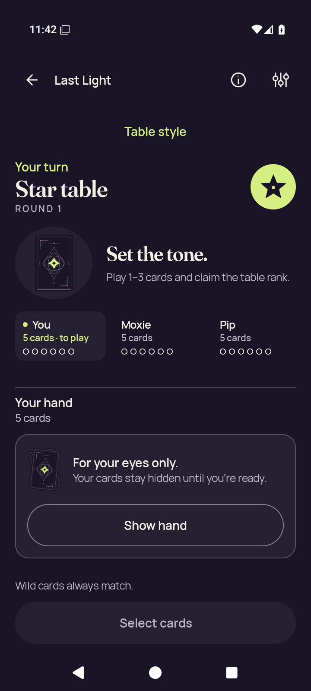</a>

`3d-leave-cancel-return-public.png` · 720 × 1600 · 108,298 bytes.

SHA-256: `aaec9b0a90c50d5caa8de1809ae8b944c2e88068acdebe44b4b1ccb49fef2ca1`.

**Preserved image; unviewed.** Original preserved without a direct view or an independently established reviewed-byte representative in this bounded review. Matching published bytes alone do not establish visual review.

Original capture window: `2026-09-10T23:42:14.621+00:00` to `2026-09-10T23:42:16.955+00:00`; PNG/XML acquired sequentially.

### 3d-leave-cancel-return-selection-cleared

`3d-leave-cancel-return-selection-cleared.png` · 720 × 1600 · 108,298 bytes.

SHA-256: `aaec9b0a90c50d5caa8de1809ae8b944c2e88068acdebe44b4b1ccb49fef2ca1`.

**Preserved image; unviewed.** Original preserved without a direct view or an independently established reviewed-byte representative in this bounded review. Matching published bytes alone do not establish visual review.

Original capture window: `2026-09-10T23:42:10.268+00:00` to `2026-09-10T23:42:12.601+00:00`; PNG/XML acquired sequentially.

### 3d-leave-cancel-selected

`3d-leave-cancel-selected.png` · 720 × 1600 · 103,608 bytes.

SHA-256: `91a25e6365094c41a6968a688a3f18d2399277bfb2abd15d58bfaeed522c83c0`.

**Preserved image; unviewed.** Original preserved without a direct view or an independently established reviewed-byte representative in this bounded review. Matching published bytes alone do not establish visual review.

Original capture window: `2026-09-10T23:41:27.817+00:00` to `2026-09-10T23:41:30.163+00:00`; PNG/XML acquired sequentially.

### 3d-leave-cancel-selector

`3d-leave-cancel-selector.png` · 720 × 1600 · 57,463 bytes.

SHA-256: `2d5ecca3a6a0a3d4aed135afc7a8cae0f1dd07dd80695d37383e5908d4e16aee`.

**Preserved image; unviewed.** Original preserved without a direct view or an independently established reviewed-byte representative in this bounded review. Matching published bytes alone do not establish visual review.

Original capture window: `2026-09-10T23:41:36.510+00:00` to `2026-09-10T23:41:38.851+00:00`; PNG/XML acquired sequentially.

### 3d-leave-end-confirmation

`3d-leave-end-confirmation.png` · 720 × 1600 · 40,670 bytes.

SHA-256: `223f4cc0813038b15937cf735e493acade6934bf66c28de1ee8d4d559157362e`.

**Preserved image; unviewed.** Original preserved without a direct view or an independently established reviewed-byte representative in this bounded review. Matching published bytes alone do not establish visual review.

Original capture window: `2026-09-10T23:43:51.500+00:00` to `2026-09-10T23:43:53.831+00:00`; PNG/XML acquired sequentially.

### 3d-leave-end-selector

<a href="../../originals/android-jvm-reports/build/ci/android/godot-session/optimized-test-signed/runtime/captures/3d-leave-end-selector.png">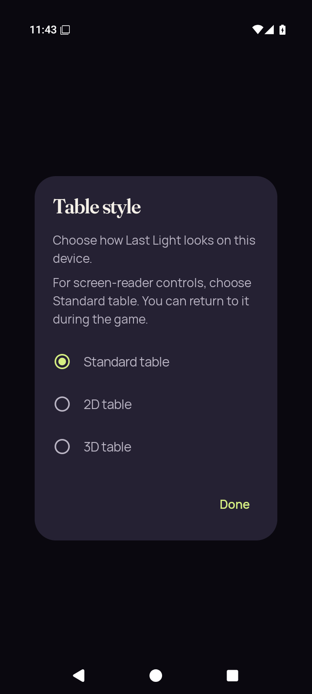</a>

`3d-leave-end-selector.png` · 720 × 1600 · 57,982 bytes.

SHA-256: `3565b584fa1a5c6fdd8027f08db4958b439e8b2fc91e9e8bc4bbe92b95a0e547`.

**Preserved image; unviewed.** Original preserved without a direct view or an independently established reviewed-byte representative in this bounded review. Matching published bytes alone do not establish visual review.

Original capture window: `2026-09-10T23:43:37.620+00:00` to `2026-09-10T23:43:39.960+00:00`; PNG/XML acquired sequentially.

### 3d-recents-resumed

`3d-recents-resumed.png` · 720 × 1600 · 185,037 bytes.

SHA-256: `53c3b01bcaa4d8a7e1b54f2e9c7829b4f55cfa14283c656ef7535c5225cf39fc`.

**Preserved image; unviewed.** Original preserved without a direct view or an independently established reviewed-byte representative in this bounded review. Matching published bytes alone do not establish visual review.

Original capture window: `2026-09-10T23:40:54.719+00:00` to `2026-09-10T23:40:57.084+00:00`; PNG/XML acquired sequentially.

### 3d-recents-system-ui

<a href="../../originals/android-jvm-reports/build/ci/android/godot-session/optimized-test-signed/runtime/captures/3d-recents-system-ui.png">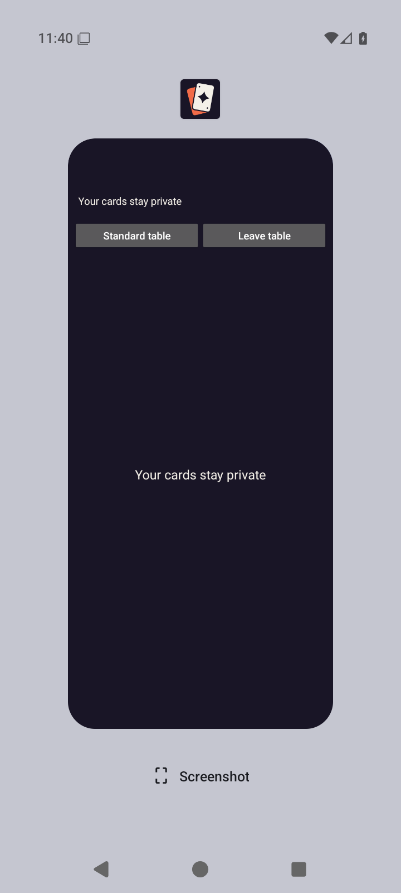</a>

`3d-recents-system-ui.png` · 720 × 1600 · 41,819 bytes.

SHA-256: `724e85145f5c7a491c3748ab48e78a19b37497a52e6cd7b836689217ced94cfd`.

**Preserved image; unviewed.** Original preserved without a direct view or an independently established reviewed-byte representative in this bounded review. Matching published bytes alone do not establish visual review.

Original capture window: `2026-09-10T23:40:49.630+00:00` to `2026-09-10T23:40:51.982+00:00`; PNG/XML acquired sequentially.

### 3d-standard-concealed

<a href="../../originals/android-jvm-reports/build/ci/android/godot-session/optimized-test-signed/runtime/captures/3d-standard-concealed.png">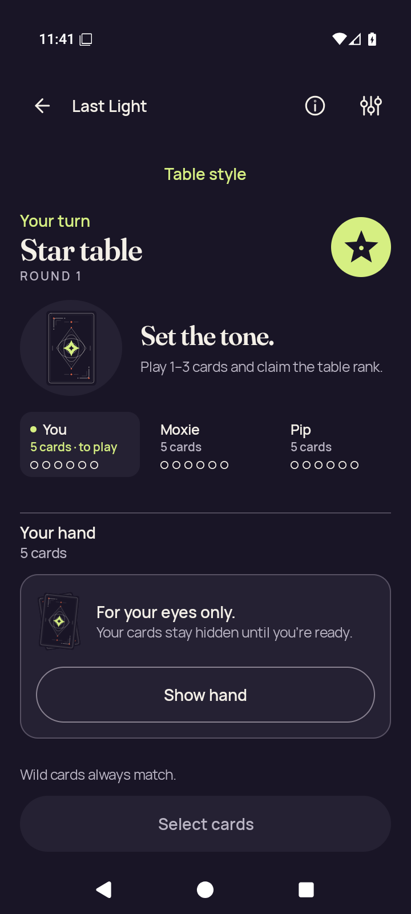</a>

`3d-standard-concealed.png` · 720 × 1600 · 107,853 bytes.

SHA-256: `b2e0d6665e4c2af0a0f0b262a17d833f021c82fe77915878bde027199220f383`.

**Preserved image; unviewed.** Original preserved without a direct view or an independently established reviewed-byte representative in this bounded review. Matching published bytes alone do not establish visual review.

Original capture window: `2026-09-10T23:41:04.071+00:00` to `2026-09-10T23:41:06.414+00:00`; PNG/XML acquired sequentially.

### 3d-standard-first-card

`3d-standard-first-card.png` · 720 × 1600 · 104,189 bytes.

SHA-256: `c15d813bb8e62f359fb38614e5b8cca1b9d2e3c116d76bc680e8b18d4a683440`.

**Preserved image; unviewed.** Original preserved without a direct view or an independently established reviewed-byte representative in this bounded review. Matching published bytes alone do not establish visual review.

Original capture window: `2026-09-10T23:41:19.226+00:00` to `2026-09-10T23:41:21.571+00:00`; PNG/XML acquired sequentially.

### 3d-standard-play-after-play

<a href="../../originals/android-jvm-reports/build/ci/android/godot-session/optimized-test-signed/runtime/captures/3d-standard-play-after-play.png">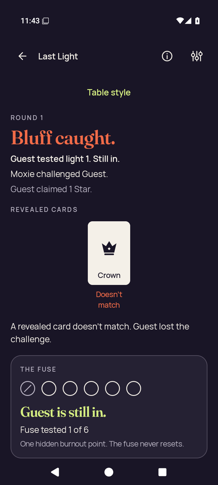</a>

`3d-standard-play-after-play.png` · 720 × 1600 · 91,729 bytes.

SHA-256: `fa703dce1a6256c1c92525be9c5d20bfe4862707ebb75ccdefd47dbe628a6d45`.

**Preserved image; unviewed.** Original preserved without a direct view or an independently established reviewed-byte representative in this bounded review. Matching published bytes alone do not establish visual review.

Original capture window: `2026-09-10T23:43:28.885+00:00` to `2026-09-10T23:43:31.218+00:00`; PNG/XML acquired sequentially.

### 3d-standard-play-selected

<a href="../../originals/android-jvm-reports/build/ci/android/godot-session/optimized-test-signed/runtime/captures/3d-standard-play-selected.png">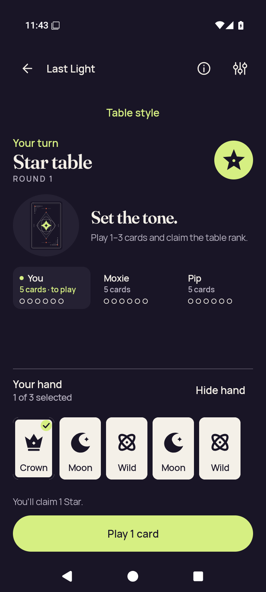</a>

`3d-standard-play-selected.png` · 720 × 1600 · 104,176 bytes.

SHA-256: `19e92f0051e9a8d5e1bb62999207603d2da5b372b5d775f891871fbd283bbdf6`.

**Preserved image; unviewed.** Original preserved without a direct view or an independently established reviewed-byte representative in this bounded review. Matching published bytes alone do not establish visual review.

Original capture window: `2026-09-10T23:43:22.315+00:00` to `2026-09-10T23:43:24.667+00:00`; PNG/XML acquired sequentially.

### 3d-standard-public

`3d-standard-public.png` · 720 × 1600 · 107,708 bytes.

SHA-256: `3923df7ef67a60ebd8c59f6df265a175a34d808ff418fa374dcfba5caf56df50`.

**Preserved image; unviewed.** Original preserved without a direct view or an independently established reviewed-byte representative in this bounded review. Matching published bytes alone do not establish visual review.

Original capture window: `2026-09-10T23:41:12.791+00:00` to `2026-09-10T23:41:15.127+00:00`; PNG/XML acquired sequentially.

### 3d-standard-selection-cleared

`3d-standard-selection-cleared.png` · 720 × 1600 · 107,708 bytes.

SHA-256: `3923df7ef67a60ebd8c59f6df265a175a34d808ff418fa374dcfba5caf56df50`.

**Preserved image; unviewed.** Original preserved without a direct view or an independently established reviewed-byte representative in this bounded review. Matching published bytes alone do not establish visual review.

Original capture window: `2026-09-10T23:41:08.436+00:00` to `2026-09-10T23:41:10.772+00:00`; PNG/XML acquired sequentially.

### final-diagnostic

`final-diagnostic.png` · 720 × 1600 · 131,849 bytes.

SHA-256: `99a9bcefc89a107526ab7eca168332a5471419775c0e80b042dfdbbe22d43b39`.

**Preserved image; unviewed.** Original preserved without a direct view or an independently established reviewed-byte representative in this bounded review. Matching published bytes alone do not establish visual review.

Original capture window: `2026-09-10T23:46:50.457+00:00` to `2026-09-10T23:46:52.805+00:00`; PNG/XML acquired sequentially.

### home-cold

`home-cold.png` · 720 × 1600 · 131,981 bytes.

SHA-256: `27aedf9b8d7b835410b0a8bd13235cc4ab192f8fdf007c5d2c5ccceacac4e7ef`.

**Preserved image; unviewed.** Original preserved without a direct view or an independently established reviewed-byte representative in this bounded review. Matching published bytes alone do not establish visual review.

Original capture window: `2026-09-10T23:29:32.584+00:00` to `2026-09-10T23:29:34.972+00:00`; PNG/XML acquired sequentially.

Original media companions and review receipts

| Preserved file | Bytes | SHA-256 |
| --- | ---: | --- |
| [originals/android-jvm-reports/build/ci/android/godot-session/optimized-test-signed/runtime/captures/2d-action-entry-native-ready.json](../../originals/android-jvm-reports/build/ci/android/godot-session/optimized-test-signed/runtime/captures/2d-action-entry-native-ready.json) | 2,181 | `ba2cbce76e1a8e1499d7c61e4da78c9942b2da87765abc83af63c460b9777176` |
| [originals/android-jvm-reports/build/ci/android/godot-session/optimized-test-signed/runtime/captures/2d-action-entry-native-ready.xml](../../originals/android-jvm-reports/build/ci/android/godot-session/optimized-test-signed/runtime/captures/2d-action-entry-native-ready.xml) | 5,203 | `f0f94a7bd1e71d110a6bdee9781bee1aafb9ddcb7099a51749306186a6bc94d5` |
| [originals/android-jvm-reports/build/ci/android/godot-session/optimized-test-signed/runtime/captures/2d-action-entry-selected.json](../../originals/android-jvm-reports/build/ci/android/godot-session/optimized-test-signed/runtime/captures/2d-action-entry-selected.json) | 1,901 | `c248b18ece0657ac7f59872719b453b87375865c7be4962aee8f76408e4822aa` |
| [originals/android-jvm-reports/build/ci/android/godot-session/optimized-test-signed/runtime/captures/2d-action-entry-selected.xml](../../originals/android-jvm-reports/build/ci/android/godot-session/optimized-test-signed/runtime/captures/2d-action-entry-selected.xml) | 22,433 | `561916165f55ed2f507582bcc913f4790764e15e52be811cf2371599d6f9f6ee` |
| [originals/android-jvm-reports/build/ci/android/godot-session/optimized-test-signed/runtime/captures/2d-action-entry-selector.json](../../originals/android-jvm-reports/build/ci/android/godot-session/optimized-test-signed/runtime/captures/2d-action-entry-selector.json) | 1,901 | `196cf5215ef4ec448e462e0623a3a080eba4fa19f8547d7b3e288f2acaf82c61` |
| [originals/android-jvm-reports/build/ci/android/godot-session/optimized-test-signed/runtime/captures/2d-action-entry-selector.xml](../../originals/android-jvm-reports/build/ci/android/godot-session/optimized-test-signed/runtime/captures/2d-action-entry-selector.xml) | 9,020 | `e26fdbe9fa5fb5cf4eefc26fe358d86cdc60af2dcae1433b3bd82ba04119c189` |
| [originals/android-jvm-reports/build/ci/android/godot-session/optimized-test-signed/runtime/captures/2d-action-return-concealed.json](../../originals/android-jvm-reports/build/ci/android/godot-session/optimized-test-signed/runtime/captures/2d-action-return-concealed.json) | 1,907 | `8450580a2965faef4b709fc7ef5309451fe947a884cbd1321c63268c721a1a94` |
| [originals/android-jvm-reports/build/ci/android/godot-session/optimized-test-signed/runtime/captures/2d-action-return-concealed.xml](../../originals/android-jvm-reports/build/ci/android/godot-session/optimized-test-signed/runtime/captures/2d-action-return-concealed.xml) | 16,813 | `cccf78ada6ff64d732a51ae3d27db5c3b617dc43eafc5f148a9eb65c15e3ccab` |
| [originals/android-jvm-reports/build/ci/android/godot-session/optimized-test-signed/runtime/captures/2d-action-return-first-card.json](../../originals/android-jvm-reports/build/ci/android/godot-session/optimized-test-signed/runtime/captures/2d-action-return-first-card.json) | 1,910 | `36abdefb4cbf3bb1114fcfe45bd53630222847f6fe9305a6a6267320bfe7be95` |
| [originals/android-jvm-reports/build/ci/android/godot-session/optimized-test-signed/runtime/captures/2d-action-return-first-card.xml](../../originals/android-jvm-reports/build/ci/android/godot-session/optimized-test-signed/runtime/captures/2d-action-return-first-card.xml) | 22,439 | `329d2fc099f2202907154d8466c1d6753d526998bf7601c86b8125dc09a7a183` |
| [originals/android-jvm-reports/build/ci/android/godot-session/optimized-test-signed/runtime/captures/2d-action-return-public.json](../../originals/android-jvm-reports/build/ci/android/godot-session/optimized-test-signed/runtime/captures/2d-action-return-public.json) | 1,898 | `a38bad2d2b7ccc1e06518efc82dc7882a03f922951c479fd17a3c57d550fe313` |
| [originals/android-jvm-reports/build/ci/android/godot-session/optimized-test-signed/runtime/captures/2d-action-return-public.xml](../../originals/android-jvm-reports/build/ci/android/godot-session/optimized-test-signed/runtime/captures/2d-action-return-public.xml) | 16,813 | `cccf78ada6ff64d732a51ae3d27db5c3b617dc43eafc5f148a9eb65c15e3ccab` |
| [originals/android-jvm-reports/build/ci/android/godot-session/optimized-test-signed/runtime/captures/2d-action-return-selection-cleared.json](../../originals/android-jvm-reports/build/ci/android/godot-session/optimized-test-signed/runtime/captures/2d-action-return-selection-cleared.json) | 1,931 | `7abd7736e551cfa2cdcef6c05e0364a3053638ccb7c172c4cd2b78cee43698d5` |
| [originals/android-jvm-reports/build/ci/android/godot-session/optimized-test-signed/runtime/captures/2d-action-return-selection-cleared.xml](../../originals/android-jvm-reports/build/ci/android/godot-session/optimized-test-signed/runtime/captures/2d-action-return-selection-cleared.xml) | 16,813 | `cccf78ada6ff64d732a51ae3d27db5c3b617dc43eafc5f148a9eb65c15e3ccab` |
| [originals/android-jvm-reports/build/ci/android/godot-session/optimized-test-signed/runtime/captures/2d-baseline-first-card.json](../../originals/android-jvm-reports/build/ci/android/godot-session/optimized-test-signed/runtime/captures/2d-baseline-first-card.json) | 1,896 | `e969173ff6e25a8ef8194e120358f9903a35e94198791285e4f2417c0976f5fe` |
| [originals/android-jvm-reports/build/ci/android/godot-session/optimized-test-signed/runtime/captures/2d-baseline-first-card.xml](../../originals/android-jvm-reports/build/ci/android/godot-session/optimized-test-signed/runtime/captures/2d-baseline-first-card.xml) | 22,439 | `329d2fc099f2202907154d8466c1d6753d526998bf7601c86b8125dc09a7a183` |
| [originals/android-jvm-reports/build/ci/android/godot-session/optimized-test-signed/runtime/captures/2d-baseline-public.json](../../originals/android-jvm-reports/build/ci/android/godot-session/optimized-test-signed/runtime/captures/2d-baseline-public.json) | 1,884 | `f1f77233a8108ae13ecc735c10b93773eecd2b1415d6fc05e2062076afc9b8e7` |
| [originals/android-jvm-reports/build/ci/android/godot-session/optimized-test-signed/runtime/captures/2d-baseline-public.xml](../../originals/android-jvm-reports/build/ci/android/godot-session/optimized-test-signed/runtime/captures/2d-baseline-public.xml) | 16,813 | `cccf78ada6ff64d732a51ae3d27db5c3b617dc43eafc5f148a9eb65c15e3ccab` |
| [originals/android-jvm-reports/build/ci/android/godot-session/optimized-test-signed/runtime/captures/2d-baseline-selected.json](../../originals/android-jvm-reports/build/ci/android/godot-session/optimized-test-signed/runtime/captures/2d-baseline-selected.json) | 1,886 | `69f9e1ffe0ebb84b06cf4270868ccd33e0134acd3c913874aa59148011cc89da` |
| [originals/android-jvm-reports/build/ci/android/godot-session/optimized-test-signed/runtime/captures/2d-baseline-selected.xml](../../originals/android-jvm-reports/build/ci/android/godot-session/optimized-test-signed/runtime/captures/2d-baseline-selected.xml) | 22,433 | `561916165f55ed2f507582bcc913f4790764e15e52be811cf2371599d6f9f6ee` |
| [originals/android-jvm-reports/build/ci/android/godot-session/optimized-test-signed/runtime/captures/2d-engine-0005-observation.xml](../../originals/android-jvm-reports/build/ci/android/godot-session/optimized-test-signed/runtime/captures/2d-engine-0005-observation.xml) | 5,975 | `b7410490b9c5394d0192ae30056ad74b8c0ed0adaa9027ff8efd9574e7f068f2` |
| [originals/android-jvm-reports/build/ci/android/godot-session/optimized-test-signed/runtime/captures/2d-engine-0005-observation.json](../../originals/android-jvm-reports/build/ci/android/godot-session/optimized-test-signed/runtime/captures/2d-engine-0005-observation.json) | 1,875 | `99201e8aa2360d7640cd5669ec5516e51f36d0b0f415046d5d26611b1f1a3b1e` |
| [originals/android-jvm-reports/build/ci/android/godot-session/optimized-test-signed/runtime/captures/2d-engine-0009-observation.xml](../../originals/android-jvm-reports/build/ci/android/godot-session/optimized-test-signed/runtime/captures/2d-engine-0009-observation.xml) | 5,975 | `e1937318a1922caab62a52cf1de88d9c3d6a3e614026bb20bb364e37ade629ce` |
| [originals/android-jvm-reports/build/ci/android/godot-session/optimized-test-signed/runtime/captures/2d-engine-0009-observation.json](../../originals/android-jvm-reports/build/ci/android/godot-session/optimized-test-signed/runtime/captures/2d-engine-0009-observation.json) | 1,875 | `d0a9ea60a85992d24e6f8ae6027fe5d7bd42a5a2051e64a80bcd03d8c6cc5057` |
| [originals/android-jvm-reports/build/ci/android/godot-session/optimized-test-signed/runtime/captures/2d-engine-0013-observation.xml](../../originals/android-jvm-reports/build/ci/android/godot-session/optimized-test-signed/runtime/captures/2d-engine-0013-observation.xml) | 5,975 | `c47028f7a107d2f8734b89e001068ca3fd2b9b614bbe7af771c97fb19d023dc5` |
| [originals/android-jvm-reports/build/ci/android/godot-session/optimized-test-signed/runtime/captures/2d-engine-0013-observation.json](../../originals/android-jvm-reports/build/ci/android/godot-session/optimized-test-signed/runtime/captures/2d-engine-0013-observation.json) | 1,875 | `98d9eb0cfc4baa92a5c19d7f4e4a5fcd89bd62a8a3383387735233cd6c88f5fc` |
| [originals/android-jvm-reports/build/ci/android/godot-session/optimized-test-signed/runtime/captures/2d-engine-0017-observation.xml](../../originals/android-jvm-reports/build/ci/android/godot-session/optimized-test-signed/runtime/captures/2d-engine-0017-observation.xml) | 5,975 | `9ce301c8d3fdd25c629b62437c8495a16c87fbe84e639379b27bb8ea3e221a44` |
| [originals/android-jvm-reports/build/ci/android/godot-session/optimized-test-signed/runtime/captures/2d-engine-0017-observation.json](../../originals/android-jvm-reports/build/ci/android/godot-session/optimized-test-signed/runtime/captures/2d-engine-0017-observation.json) | 1,875 | `0684796c911a1211cd8688f4af3e63dd7e1898628c52ac1a909d70644ffd013d` |
| [originals/android-jvm-reports/build/ci/android/godot-session/optimized-test-signed/runtime/captures/2d-engine-0020-tap.xml](../../originals/android-jvm-reports/build/ci/android/godot-session/optimized-test-signed/runtime/captures/2d-engine-0020-tap.xml) | 5,975 | `9ce301c8d3fdd25c629b62437c8495a16c87fbe84e639379b27bb8ea3e221a44` |
| [originals/android-jvm-reports/build/ci/android/godot-session/optimized-test-signed/runtime/captures/2d-engine-0020-tap.json](../../originals/android-jvm-reports/build/ci/android/godot-session/optimized-test-signed/runtime/captures/2d-engine-0020-tap.json) | 2,201 | `613ac3d896003308501def817ee89f54fcf80677c2b818e9677b04b00f2fad03` |
| [originals/android-jvm-reports/build/ci/android/godot-session/optimized-test-signed/runtime/captures/2d-engine-0024-observation.xml](../../originals/android-jvm-reports/build/ci/android/godot-session/optimized-test-signed/runtime/captures/2d-engine-0024-observation.xml) | 6,591 | `edeee395d6c817fc3e80ce9202b791d92debc21274be2adcbedafa4c14ea7b0f` |
| [originals/android-jvm-reports/build/ci/android/godot-session/optimized-test-signed/runtime/captures/2d-engine-0024-observation.json](../../originals/android-jvm-reports/build/ci/android/godot-session/optimized-test-signed/runtime/captures/2d-engine-0024-observation.json) | 3,442 | `7f6e2b30947b126925e8c5381e84b75d7cd2a81831a48df76070260aee1e4c71` |
| [originals/android-jvm-reports/build/ci/android/godot-session/optimized-test-signed/runtime/captures/2d-engine-0028-observation.json](../../originals/android-jvm-reports/build/ci/android/godot-session/optimized-test-signed/runtime/captures/2d-engine-0028-observation.json) | 3,442 | `76d8edfc925aea48fe99c539981dde500b04360e2368b279598f626591973bb0` |
| [originals/android-jvm-reports/build/ci/android/godot-session/optimized-test-signed/runtime/captures/2d-engine-0028-observation.xml](../../originals/android-jvm-reports/build/ci/android/godot-session/optimized-test-signed/runtime/captures/2d-engine-0028-observation.xml) | 6,591 | `51818d653de25a3d99d45938ddf059902fc2454d40201f802226aab4ecc102e5` |
| [originals/android-jvm-reports/build/ci/android/godot-session/optimized-test-signed/runtime/captures/2d-engine-0032-observation.xml](../../originals/android-jvm-reports/build/ci/android/godot-session/optimized-test-signed/runtime/captures/2d-engine-0032-observation.xml) | 6,591 | `cd749df50ede251c266381497a07d689b0b73204664c7373c20e69035cf592e6` |
| [originals/android-jvm-reports/build/ci/android/godot-session/optimized-test-signed/runtime/captures/2d-engine-0032-observation.json](../../originals/android-jvm-reports/build/ci/android/godot-session/optimized-test-signed/runtime/captures/2d-engine-0032-observation.json) | 3,442 | `7e5be57d8a77befda05c1b0d63e4c155e0fa14a833ec58886fe259827a99559a` |
| [originals/android-jvm-reports/build/ci/android/godot-session/optimized-test-signed/runtime/captures/2d-engine-0036-observation.json](../../originals/android-jvm-reports/build/ci/android/godot-session/optimized-test-signed/runtime/captures/2d-engine-0036-observation.json) | 3,442 | `321e38b89c9028fe75382f9649211a934af534d1006ccd969c34cd3799ffb7eb` |
| [originals/android-jvm-reports/build/ci/android/godot-session/optimized-test-signed/runtime/captures/2d-engine-0036-observation.xml](../../originals/android-jvm-reports/build/ci/android/godot-session/optimized-test-signed/runtime/captures/2d-engine-0036-observation.xml) | 6,591 | `f5806af2a419281b6f3f5b77b69dafec1e3882082c1f3f098b63b4dc20ee02e4` |
| [originals/android-jvm-reports/build/ci/android/godot-session/optimized-test-signed/runtime/captures/2d-engine-0039-tap.json](../../originals/android-jvm-reports/build/ci/android/godot-session/optimized-test-signed/runtime/captures/2d-engine-0039-tap.json) | 3,957 | `fc489b937a9341f1e9b0fbbb0fece53479285f1f6cafcd0f7903e89a60f46eb9` |
| [originals/android-jvm-reports/build/ci/android/godot-session/optimized-test-signed/runtime/captures/2d-engine-0039-tap.xml](../../originals/android-jvm-reports/build/ci/android/godot-session/optimized-test-signed/runtime/captures/2d-engine-0039-tap.xml) | 6,591 | `f5806af2a419281b6f3f5b77b69dafec1e3882082c1f3f098b63b4dc20ee02e4` |
| [originals/android-jvm-reports/build/ci/android/godot-session/optimized-test-signed/runtime/captures/2d-engine-0043-observation.json](../../originals/android-jvm-reports/build/ci/android/godot-session/optimized-test-signed/runtime/captures/2d-engine-0043-observation.json) | 3,440 | `30c54559881fb11b4cdb498af3adbb0cd7ae14f6ccd99d78816606e377ea0791` |
| [originals/android-jvm-reports/build/ci/android/godot-session/optimized-test-signed/runtime/captures/2d-engine-0043-observation.xml](../../originals/android-jvm-reports/build/ci/android/godot-session/optimized-test-signed/runtime/captures/2d-engine-0043-observation.xml) | 6,589 | `06a3c9c798ed07b6e25595cdb811b63dda10cf083e29b7c0a917d123c063ceb4` |
| [originals/android-jvm-reports/build/ci/android/godot-session/optimized-test-signed/runtime/captures/2d-engine-0047-observation.xml](../../originals/android-jvm-reports/build/ci/android/godot-session/optimized-test-signed/runtime/captures/2d-engine-0047-observation.xml) | 6,590 | `53199b3debe5bf970b238e109d97005b380b837530c4819c876d6b433a60186f` |
| [originals/android-jvm-reports/build/ci/android/godot-session/optimized-test-signed/runtime/captures/2d-engine-0047-observation.json](../../originals/android-jvm-reports/build/ci/android/godot-session/optimized-test-signed/runtime/captures/2d-engine-0047-observation.json) | 3,441 | `f7aca5cf6a44d19f6319641e52a36167448fe05986e161b74114b6eb40445598` |
| [originals/android-jvm-reports/build/ci/android/godot-session/optimized-test-signed/runtime/captures/2d-engine-0051-observation.json](../../originals/android-jvm-reports/build/ci/android/godot-session/optimized-test-signed/runtime/captures/2d-engine-0051-observation.json) | 3,447 | `65367072b4d5ac46204ba268967c59df63ec72384339ea38642d9f5b81b9e96b` |
| [originals/android-jvm-reports/build/ci/android/godot-session/optimized-test-signed/runtime/captures/2d-engine-0051-observation.xml](../../originals/android-jvm-reports/build/ci/android/godot-session/optimized-test-signed/runtime/captures/2d-engine-0051-observation.xml) | 6,591 | `b273745914e515db30bd8bedd7e07cfb06e16e27a3ef142eaf984509db50dc65` |
| [originals/android-jvm-reports/build/ci/android/godot-session/optimized-test-signed/runtime/captures/2d-engine-0055-observation.json](../../originals/android-jvm-reports/build/ci/android/godot-session/optimized-test-signed/runtime/captures/2d-engine-0055-observation.json) | 3,447 | `e6b2a4164e6f6fd3082f253a00e158809fa59f20979aad4f9d07cc82422fc6ca` |
| [originals/android-jvm-reports/build/ci/android/godot-session/optimized-test-signed/runtime/captures/2d-engine-0058-tap.json](../../originals/android-jvm-reports/build/ci/android/godot-session/optimized-test-signed/runtime/captures/2d-engine-0058-tap.json) | 3,962 | `aba69540866982e2654b5a2eda3eda7926934d20872b1b0d64398e5cbe20f229` |
| [originals/android-jvm-reports/build/ci/android/godot-session/optimized-test-signed/runtime/captures/2d-engine-0055-observation.xml](../../originals/android-jvm-reports/build/ci/android/godot-session/optimized-test-signed/runtime/captures/2d-engine-0055-observation.xml) | 6,591 | `7c6b622eb38c5d0e1682ea60882c46407ede26da4769994363f9c321d39f544a` |
| [originals/android-jvm-reports/build/ci/android/godot-session/optimized-test-signed/runtime/captures/2d-engine-0058-tap.xml](../../originals/android-jvm-reports/build/ci/android/godot-session/optimized-test-signed/runtime/captures/2d-engine-0058-tap.xml) | 6,591 | `7c6b622eb38c5d0e1682ea60882c46407ede26da4769994363f9c321d39f544a` |
| [originals/android-jvm-reports/build/ci/android/godot-session/optimized-test-signed/runtime/captures/2d-engine-0064-observation.json](../../originals/android-jvm-reports/build/ci/android/godot-session/optimized-test-signed/runtime/captures/2d-engine-0064-observation.json) | 1,888 | `5b7525d4c61289e7f8d62b7b711172bb3531070b6acb068b8b453d92d77d4166` |
| [originals/android-jvm-reports/build/ci/android/godot-session/optimized-test-signed/runtime/captures/2d-engine-0064-observation.xml](../../originals/android-jvm-reports/build/ci/android/godot-session/optimized-test-signed/runtime/captures/2d-engine-0064-observation.xml) | 5,982 | `8102718280d1a8f158b3f722b7c4384d344483ee76aae624b703054e0940c095` |
| [originals/android-jvm-reports/build/ci/android/godot-session/optimized-test-signed/runtime/captures/2d-engine-0068-observation.json](../../originals/android-jvm-reports/build/ci/android/godot-session/optimized-test-signed/runtime/captures/2d-engine-0068-observation.json) | 1,888 | `841e71638de6ff910dcb3297894e91cf400c38bce55e7c2ab041f2b45e30a0b6` |
| [originals/android-jvm-reports/build/ci/android/godot-session/optimized-test-signed/runtime/captures/2d-engine-0068-observation.xml](../../originals/android-jvm-reports/build/ci/android/godot-session/optimized-test-signed/runtime/captures/2d-engine-0068-observation.xml) | 5,982 | `597e6998071d061d68ccc929d3d6bc5c8142ef0ebd2a380ad6bd38a6c3331a56` |
| [originals/android-jvm-reports/build/ci/android/godot-session/optimized-test-signed/runtime/captures/2d-engine-baseline-first-card.json](../../originals/android-jvm-reports/build/ci/android/godot-session/optimized-test-signed/runtime/captures/2d-engine-baseline-first-card.json) | 1,925 | `a583d08823f881cb67a4b53fd50bbce6062f0c46fabb27d8497b3ba5b9a25f24` |
| [originals/android-jvm-reports/build/ci/android/godot-session/optimized-test-signed/runtime/captures/2d-engine-baseline-first-card.xml](../../originals/android-jvm-reports/build/ci/android/godot-session/optimized-test-signed/runtime/captures/2d-engine-baseline-first-card.xml) | 24,926 | `305759678cd5eef1b9888aafdedd7b216a4126486262dfa47185af7bf23c8b82` |
| [originals/android-jvm-reports/build/ci/android/godot-session/optimized-test-signed/runtime/captures/2d-engine-baseline-public.json](../../originals/android-jvm-reports/build/ci/android/godot-session/optimized-test-signed/runtime/captures/2d-engine-baseline-public.json) | 1,913 | `745cc9bd6ba2471a0d9b5c9481b72fd7de4b2f2e25a90c1fc66230c65ab38e94` |
| [originals/android-jvm-reports/build/ci/android/godot-session/optimized-test-signed/runtime/captures/2d-engine-baseline-public.xml](../../originals/android-jvm-reports/build/ci/android/godot-session/optimized-test-signed/runtime/captures/2d-engine-baseline-public.xml) | 19,299 | `2bb85d504f5efa806085d918853ed506bed968a01457a4780d7b46b5ca051314` |
| [originals/android-jvm-reports/build/ci/android/godot-session/optimized-test-signed/runtime/captures/2d-engine-entry-native-ready.json](../../originals/android-jvm-reports/build/ci/android/godot-session/optimized-test-signed/runtime/captures/2d-engine-entry-native-ready.json) | 2,185 | `a4466faffbd0f85908b0372fde78bc42ea9e401a49a482bbc237aab907b386f8` |
| [originals/android-jvm-reports/build/ci/android/godot-session/optimized-test-signed/runtime/captures/2d-engine-entry-native-ready.xml](../../originals/android-jvm-reports/build/ci/android/godot-session/optimized-test-signed/runtime/captures/2d-engine-entry-native-ready.xml) | 5,203 | `f0f94a7bd1e71d110a6bdee9781bee1aafb9ddcb7099a51749306186a6bc94d5` |
| [originals/android-jvm-reports/build/ci/android/godot-session/optimized-test-signed/runtime/captures/2d-engine-entry-selector.json](../../originals/android-jvm-reports/build/ci/android/godot-session/optimized-test-signed/runtime/captures/2d-engine-entry-selector.json) | 1,909 | `c17e7640b94b3aa23d96338395c428d4674e8a2e34ea299732f6eb4ae2b2c7f3` |
| [originals/android-jvm-reports/build/ci/android/godot-session/optimized-test-signed/runtime/captures/2d-engine-entry-selector.xml](../../originals/android-jvm-reports/build/ci/android/godot-session/optimized-test-signed/runtime/captures/2d-engine-entry-selector.xml) | 9,020 | `e26fdbe9fa5fb5cf4eefc26fe358d86cdc60af2dcae1433b3bd82ba04119c189` |
| [originals/android-jvm-reports/build/ci/android/godot-session/optimized-test-signed/runtime/captures/2d-engine-home.json](../../originals/android-jvm-reports/build/ci/android/godot-session/optimized-test-signed/runtime/captures/2d-engine-home.json) | 1,872 | `40edf2f7263a9327340bfa92ae509a39fe36bdc99f5cd010fa546a3f6be630df` |
| [originals/android-jvm-reports/build/ci/android/godot-session/optimized-test-signed/runtime/captures/2d-engine-home.xml](../../originals/android-jvm-reports/build/ci/android/godot-session/optimized-test-signed/runtime/captures/2d-engine-home.xml) | 13,534 | `8c516106e08aac703a072ba3006e89d6a8b0fa5345652accf20f3223429280af` |
| [originals/android-jvm-reports/build/ci/android/godot-session/optimized-test-signed/runtime/captures/2d-engine-leave-confirmation.json](../../originals/android-jvm-reports/build/ci/android/godot-session/optimized-test-signed/runtime/captures/2d-engine-leave-confirmation.json) | 1,914 | `9de04ac577934eacccddd0bf9a0fd439052c5b7deba406573513477153e7e913` |
| [originals/android-jvm-reports/build/ci/android/godot-session/optimized-test-signed/runtime/captures/2d-engine-leave-confirmation.xml](../../originals/android-jvm-reports/build/ci/android/godot-session/optimized-test-signed/runtime/captures/2d-engine-leave-confirmation.xml) | 5,802 | `3979bafd154da469678fa69d82589043866471582a5d3f82c0108d000235530b` |
| [originals/android-jvm-reports/build/ci/android/godot-session/optimized-test-signed/runtime/captures/2d-engine-leave-selector.json](../../originals/android-jvm-reports/build/ci/android/godot-session/optimized-test-signed/runtime/captures/2d-engine-leave-selector.json) | 1,902 | `3fade82df6ff956a86819a41d7f957f315bbc8f00a1c3b26d3c24a610e0a3717` |
| [originals/android-jvm-reports/build/ci/android/godot-session/optimized-test-signed/runtime/captures/2d-engine-leave-selector.xml](../../originals/android-jvm-reports/build/ci/android/godot-session/optimized-test-signed/runtime/captures/2d-engine-leave-selector.xml) | 9,020 | `e26fdbe9fa5fb5cf4eefc26fe358d86cdc60af2dcae1433b3bd82ba04119c189` |
| [originals/android-jvm-reports/build/ci/android/godot-session/optimized-test-signed/runtime/captures/2d-engine-selected.json](../../originals/android-jvm-reports/build/ci/android/godot-session/optimized-test-signed/runtime/captures/2d-engine-selected.json) | 2,155 | `e606f50a89d4c62aa5632da1b50c06f6d5168e279d18ca24543b11e6858cfdf3` |
| [originals/android-jvm-reports/build/ci/android/godot-session/optimized-test-signed/runtime/captures/2d-engine-selected.xml](../../originals/android-jvm-reports/build/ci/android/godot-session/optimized-test-signed/runtime/captures/2d-engine-selected.xml) | 6,590 | `53199b3debe5bf970b238e109d97005b380b837530c4819c876d6b433a60186f` |
| [originals/android-jvm-reports/build/ci/android/godot-session/optimized-test-signed/runtime/captures/2d-engine-standard-after-play.json](../../originals/android-jvm-reports/build/ci/android/godot-session/optimized-test-signed/runtime/captures/2d-engine-standard-after-play.json) | 1,929 | `067f540005dfc90edc973043f7e1959d970b507f24fcac1642826d2e24f791e7` |
| [originals/android-jvm-reports/build/ci/android/godot-session/optimized-test-signed/runtime/captures/2d-engine-standard-after-play.xml](../../originals/android-jvm-reports/build/ci/android/godot-session/optimized-test-signed/runtime/captures/2d-engine-standard-after-play.xml) | 15,056 | `1162373eff1159fdafeb6aa29036198bdfd97ea1597ae7300f78f35668da8618` |
| [originals/android-jvm-reports/build/ci/android/godot-session/optimized-test-signed/runtime/captures/2d-engine-standard-concealed.json](../../originals/android-jvm-reports/build/ci/android/godot-session/optimized-test-signed/runtime/captures/2d-engine-standard-concealed.json) | 431 | `198b1270b8790c969f0dce37505a7677937d22be618ba9cf181cfc26d3695077` |
| [originals/android-jvm-reports/build/ci/android/godot-session/optimized-test-signed/runtime/captures/2d-engine-standard-concealed.xml](../../originals/android-jvm-reports/build/ci/android/godot-session/optimized-test-signed/runtime/captures/2d-engine-standard-concealed.xml) | 15,056 | `1162373eff1159fdafeb6aa29036198bdfd97ea1597ae7300f78f35668da8618` |
| [originals/android-jvm-reports/build/ci/android/godot-session/optimized-test-signed/runtime/captures/2d-engine-standard-outcome.xml](../../originals/android-jvm-reports/build/ci/android/godot-session/optimized-test-signed/runtime/captures/2d-engine-standard-outcome.xml) | 15,056 | `1162373eff1159fdafeb6aa29036198bdfd97ea1597ae7300f78f35668da8618` |
| [originals/android-jvm-reports/build/ci/android/godot-session/optimized-test-signed/runtime/captures/2d-engine-standard-outcome.json](../../originals/android-jvm-reports/build/ci/android/godot-session/optimized-test-signed/runtime/captures/2d-engine-standard-outcome.json) | 535 | `9ea8bce3f98df6c1465c13d2e38f46e81de0478f19d791719265d1cc4e47bb99` |
| [originals/android-jvm-reports/build/ci/android/godot-session/optimized-test-signed/runtime/captures/2d-entry-native-ready.json](../../originals/android-jvm-reports/build/ci/android/godot-session/optimized-test-signed/runtime/captures/2d-entry-native-ready.json) | 2,156 | `e27d24b7875b1edc5e4991736bebbf76e46e2ced611d83a4143513cce0171d64` |
| [originals/android-jvm-reports/build/ci/android/godot-session/optimized-test-signed/runtime/captures/2d-entry-native-ready.xml](../../originals/android-jvm-reports/build/ci/android/godot-session/optimized-test-signed/runtime/captures/2d-entry-native-ready.xml) | 5,203 | `f0f94a7bd1e71d110a6bdee9781bee1aafb9ddcb7099a51749306186a6bc94d5` |
| [originals/android-jvm-reports/build/ci/android/godot-session/optimized-test-signed/runtime/captures/2d-entry-selector.json](../../originals/android-jvm-reports/build/ci/android/godot-session/optimized-test-signed/runtime/captures/2d-entry-selector.json) | 1,876 | `3d592dd3f18ea472b9cc5d3c6935091a2fefa8538cbd9f9fa061b0745c90ca3f` |
| [originals/android-jvm-reports/build/ci/android/godot-session/optimized-test-signed/runtime/captures/2d-entry-selector.xml](../../originals/android-jvm-reports/build/ci/android/godot-session/optimized-test-signed/runtime/captures/2d-entry-selector.xml) | 9,020 | `e26fdbe9fa5fb5cf4eefc26fe358d86cdc60af2dcae1433b3bd82ba04119c189` |
| [originals/android-jvm-reports/build/ci/android/godot-session/optimized-test-signed/runtime/captures/2d-home-after-session-end.json](../../originals/android-jvm-reports/build/ci/android/godot-session/optimized-test-signed/runtime/captures/2d-home-after-session-end.json) | 1,898 | `1a6e354fccd60c9c70124a4cc185510eae43ce106511fb0803e8371520397354` |
| [originals/android-jvm-reports/build/ci/android/godot-session/optimized-test-signed/runtime/captures/2d-home-after-session-end.xml](../../originals/android-jvm-reports/build/ci/android/godot-session/optimized-test-signed/runtime/captures/2d-home-after-session-end.xml) | 13,534 | `8c516106e08aac703a072ba3006e89d6a8b0fa5345652accf20f3223429280af` |
| [originals/android-jvm-reports/build/ci/android/godot-session/optimized-test-signed/runtime/captures/2d-home-resumed.json](../../originals/android-jvm-reports/build/ci/android/godot-session/optimized-test-signed/runtime/captures/2d-home-resumed.json) | 2,143 | `db2c75f7f3ca499e27ff4a9293449a03159d60f2bd8eda9b875fd1a2c1fd2d4d` |
| [originals/android-jvm-reports/build/ci/android/godot-session/optimized-test-signed/runtime/captures/2d-home-resumed.xml](../../originals/android-jvm-reports/build/ci/android/godot-session/optimized-test-signed/runtime/captures/2d-home-resumed.xml) | 5,203 | `f0f94a7bd1e71d110a6bdee9781bee1aafb9ddcb7099a51749306186a6bc94d5` |
| [originals/android-jvm-reports/build/ci/android/godot-session/optimized-test-signed/runtime/captures/2d-home-system-ui.json](../../originals/android-jvm-reports/build/ci/android/godot-session/optimized-test-signed/runtime/captures/2d-home-system-ui.json) | 2,169 | `007a8e1358aa9de231297c79c738237ce252d27fa8fe3ae0c3d23c8520886781` |
| [originals/android-jvm-reports/build/ci/android/godot-session/optimized-test-signed/runtime/captures/2d-home-system-ui.xml](../../originals/android-jvm-reports/build/ci/android/godot-session/optimized-test-signed/runtime/captures/2d-home-system-ui.xml) | 9,997 | `8bc5c5df977feb9af0ca292b7eab5c024ea36125961b221bb87527946ba85926` |
| [originals/android-jvm-reports/build/ci/android/godot-session/optimized-test-signed/runtime/captures/2d-leave-cancel-confirmation.json](../../originals/android-jvm-reports/build/ci/android/godot-session/optimized-test-signed/runtime/captures/2d-leave-cancel-confirmation.json) | 1,910 | `a0ed804038c77de7742e147f5e1470100250adb03eb00166a54c3d9925eb09f9` |
| [originals/android-jvm-reports/build/ci/android/godot-session/optimized-test-signed/runtime/captures/2d-leave-cancel-confirmation.xml](../../originals/android-jvm-reports/build/ci/android/godot-session/optimized-test-signed/runtime/captures/2d-leave-cancel-confirmation.xml) | 5,802 | `3979bafd154da469678fa69d82589043866471582a5d3f82c0108d000235530b` |
| [originals/android-jvm-reports/build/ci/android/godot-session/optimized-test-signed/runtime/captures/2d-leave-cancel-native-ready.json](../../originals/android-jvm-reports/build/ci/android/godot-session/optimized-test-signed/runtime/captures/2d-leave-cancel-native-ready.json) | 2,178 | `67635eadf43c3b322033399b3b713fad15a4f03fbc0f563af1c70710ccf91ad3` |
| [originals/android-jvm-reports/build/ci/android/godot-session/optimized-test-signed/runtime/captures/2d-leave-cancel-native-ready.xml](../../originals/android-jvm-reports/build/ci/android/godot-session/optimized-test-signed/runtime/captures/2d-leave-cancel-native-ready.xml) | 5,203 | `f0f94a7bd1e71d110a6bdee9781bee1aafb9ddcb7099a51749306186a6bc94d5` |
| [originals/android-jvm-reports/build/ci/android/godot-session/optimized-test-signed/runtime/captures/2d-leave-cancel-return-concealed.json](../../originals/android-jvm-reports/build/ci/android/godot-session/optimized-test-signed/runtime/captures/2d-leave-cancel-return-concealed.json) | 1,922 | `002939799318f2a5472e872f4672cddbe2001dfcdcf4fb012a8438370afc00b3` |
| [originals/android-jvm-reports/build/ci/android/godot-session/optimized-test-signed/runtime/captures/2d-leave-cancel-return-concealed.xml](../../originals/android-jvm-reports/build/ci/android/godot-session/optimized-test-signed/runtime/captures/2d-leave-cancel-return-concealed.xml) | 16,813 | `cccf78ada6ff64d732a51ae3d27db5c3b617dc43eafc5f148a9eb65c15e3ccab` |
| [originals/android-jvm-reports/build/ci/android/godot-session/optimized-test-signed/runtime/captures/2d-leave-cancel-return-first-card.json](../../originals/android-jvm-reports/build/ci/android/godot-session/optimized-test-signed/runtime/captures/2d-leave-cancel-return-first-card.json) | 1,925 | `0df1852c80a24b637f49a4cd1034aeb7caeffdfb427103f4243ba98e72134342` |
| [originals/android-jvm-reports/build/ci/android/godot-session/optimized-test-signed/runtime/captures/2d-leave-cancel-return-first-card.xml](../../originals/android-jvm-reports/build/ci/android/godot-session/optimized-test-signed/runtime/captures/2d-leave-cancel-return-first-card.xml) | 22,439 | `329d2fc099f2202907154d8466c1d6753d526998bf7601c86b8125dc09a7a183` |
| [originals/android-jvm-reports/build/ci/android/godot-session/optimized-test-signed/runtime/captures/2d-leave-cancel-return-public.json](../../originals/android-jvm-reports/build/ci/android/godot-session/optimized-test-signed/runtime/captures/2d-leave-cancel-return-public.json) | 1,913 | `664c0c85ebe5d3dbb1ceb0fb53c5b9ce2f4d146040c00cbe666ef4751b68f5cf` |
| [originals/android-jvm-reports/build/ci/android/godot-session/optimized-test-signed/runtime/captures/2d-leave-cancel-return-public.xml](../../originals/android-jvm-reports/build/ci/android/godot-session/optimized-test-signed/runtime/captures/2d-leave-cancel-return-public.xml) | 16,813 | `cccf78ada6ff64d732a51ae3d27db5c3b617dc43eafc5f148a9eb65c15e3ccab` |
| [originals/android-jvm-reports/build/ci/android/godot-session/optimized-test-signed/runtime/captures/2d-leave-cancel-return-selection-cleared.json](../../originals/android-jvm-reports/build/ci/android/godot-session/optimized-test-signed/runtime/captures/2d-leave-cancel-return-selection-cleared.json) | 1,946 | `9fe91ff4a0531597261ea0c25084cf5f7b5acbd9e132ef89d0402e3bfc1d1829` |
| [originals/android-jvm-reports/build/ci/android/godot-session/optimized-test-signed/runtime/captures/2d-leave-cancel-return-selection-cleared.xml](../../originals/android-jvm-reports/build/ci/android/godot-session/optimized-test-signed/runtime/captures/2d-leave-cancel-return-selection-cleared.xml) | 16,813 | `cccf78ada6ff64d732a51ae3d27db5c3b617dc43eafc5f148a9eb65c15e3ccab` |
| [originals/android-jvm-reports/build/ci/android/godot-session/optimized-test-signed/runtime/captures/2d-leave-cancel-selected.json](../../originals/android-jvm-reports/build/ci/android/godot-session/optimized-test-signed/runtime/captures/2d-leave-cancel-selected.json) | 1,897 | `997d81693f9b319dd11e55cd1366d6bd659e4655e4c6306ad9184bdb0766efd5` |
| [originals/android-jvm-reports/build/ci/android/godot-session/optimized-test-signed/runtime/captures/2d-leave-cancel-selected.xml](../../originals/android-jvm-reports/build/ci/android/godot-session/optimized-test-signed/runtime/captures/2d-leave-cancel-selected.xml) | 22,433 | `561916165f55ed2f507582bcc913f4790764e15e52be811cf2371599d6f9f6ee` |
| [originals/android-jvm-reports/build/ci/android/godot-session/optimized-test-signed/runtime/captures/2d-leave-cancel-selector.json](../../originals/android-jvm-reports/build/ci/android/godot-session/optimized-test-signed/runtime/captures/2d-leave-cancel-selector.json) | 1,898 | `368fccb540d68faf68718883cf3f12f0c56181243ed2263e5ec0d20c86980ba4` |
| [originals/android-jvm-reports/build/ci/android/godot-session/optimized-test-signed/runtime/captures/2d-leave-cancel-selector.xml](../../originals/android-jvm-reports/build/ci/android/godot-session/optimized-test-signed/runtime/captures/2d-leave-cancel-selector.xml) | 9,020 | `e26fdbe9fa5fb5cf4eefc26fe358d86cdc60af2dcae1433b3bd82ba04119c189` |
| [originals/android-jvm-reports/build/ci/android/godot-session/optimized-test-signed/runtime/captures/2d-leave-end-confirmation.json](../../originals/android-jvm-reports/build/ci/android/godot-session/optimized-test-signed/runtime/captures/2d-leave-end-confirmation.json) | 1,898 | `8df8f8435d0e1e4f6bd3e276e04f910c6c223451fbd276b333f86b598cafb585` |
| [originals/android-jvm-reports/build/ci/android/godot-session/optimized-test-signed/runtime/captures/2d-leave-end-confirmation.xml](../../originals/android-jvm-reports/build/ci/android/godot-session/optimized-test-signed/runtime/captures/2d-leave-end-confirmation.xml) | 5,802 | `3979bafd154da469678fa69d82589043866471582a5d3f82c0108d000235530b` |
| [originals/android-jvm-reports/build/ci/android/godot-session/optimized-test-signed/runtime/captures/2d-leave-end-control-observation.xml](../../originals/android-jvm-reports/build/ci/android/godot-session/optimized-test-signed/runtime/captures/2d-leave-end-control-observation.xml) | 5,575 | `c0b8ebcbff1baa3d3e8b5011884d113f242ee50796bf6790cc92c4efa9d5f6d4` |
| [originals/android-jvm-reports/build/ci/android/godot-session/optimized-test-signed/runtime/captures/2d-leave-end-selector.json](../../originals/android-jvm-reports/build/ci/android/godot-session/optimized-test-signed/runtime/captures/2d-leave-end-selector.json) | 1,886 | `42ab849ed6425181aba81d4205699b27404fe99114ab4c2faa1d5c62a2a5a73e` |
| [originals/android-jvm-reports/build/ci/android/godot-session/optimized-test-signed/runtime/captures/2d-leave-end-selector.xml](../../originals/android-jvm-reports/build/ci/android/godot-session/optimized-test-signed/runtime/captures/2d-leave-end-selector.xml) | 9,020 | `e26fdbe9fa5fb5cf4eefc26fe358d86cdc60af2dcae1433b3bd82ba04119c189` |
| [originals/android-jvm-reports/build/ci/android/godot-session/optimized-test-signed/runtime/captures/2d-recents-resumed.json](../../originals/android-jvm-reports/build/ci/android/godot-session/optimized-test-signed/runtime/captures/2d-recents-resumed.json) | 2,155 | `ba1cd27740f28b6fe418df086bd215f083d62c4da3d076f1bcd1cd0df4e1333b` |
| [originals/android-jvm-reports/build/ci/android/godot-session/optimized-test-signed/runtime/captures/2d-recents-resumed.xml](../../originals/android-jvm-reports/build/ci/android/godot-session/optimized-test-signed/runtime/captures/2d-recents-resumed.xml) | 5,203 | `f0f94a7bd1e71d110a6bdee9781bee1aafb9ddcb7099a51749306186a6bc94d5` |
| [originals/android-jvm-reports/build/ci/android/godot-session/optimized-test-signed/runtime/captures/2d-recents-system-ui.json](../../originals/android-jvm-reports/build/ci/android/godot-session/optimized-test-signed/runtime/captures/2d-recents-system-ui.json) | 2,181 | `f2bd124ca76ab103036636017fc318e7bcf4a53ed8d4e363be8e706ea9a209a7` |
| [originals/android-jvm-reports/build/ci/android/godot-session/optimized-test-signed/runtime/captures/2d-recents-system-ui.xml](../../originals/android-jvm-reports/build/ci/android/godot-session/optimized-test-signed/runtime/captures/2d-recents-system-ui.xml) | 5,516 | `62bbbca28516417d7320b5e48783ce77b544839baf548da03ba3bea46d0ca941` |
| [originals/android-jvm-reports/build/ci/android/godot-session/optimized-test-signed/runtime/captures/2d-standard-concealed.json](../../originals/android-jvm-reports/build/ci/android/godot-session/optimized-test-signed/runtime/captures/2d-standard-concealed.json) | 1,891 | `54c113ef7f5aef83a49bbd096d57acb34981e87be27f0516ee65bbcee420b95f` |
| [originals/android-jvm-reports/build/ci/android/godot-session/optimized-test-signed/runtime/captures/2d-standard-concealed.xml](../../originals/android-jvm-reports/build/ci/android/godot-session/optimized-test-signed/runtime/captures/2d-standard-concealed.xml) | 16,813 | `cccf78ada6ff64d732a51ae3d27db5c3b617dc43eafc5f148a9eb65c15e3ccab` |
| [originals/android-jvm-reports/build/ci/android/godot-session/optimized-test-signed/runtime/captures/2d-standard-first-card.json](../../originals/android-jvm-reports/build/ci/android/godot-session/optimized-test-signed/runtime/captures/2d-standard-first-card.json) | 1,894 | `e9b13e781c0db2be62c127d868fc6d3def903d2c244351bac553f1c179d96523` |
| [originals/android-jvm-reports/build/ci/android/godot-session/optimized-test-signed/runtime/captures/2d-standard-first-card.xml](../../originals/android-jvm-reports/build/ci/android/godot-session/optimized-test-signed/runtime/captures/2d-standard-first-card.xml) | 22,439 | `329d2fc099f2202907154d8466c1d6753d526998bf7601c86b8125dc09a7a183` |
| [originals/android-jvm-reports/build/ci/android/godot-session/optimized-test-signed/runtime/captures/2d-standard-hand-fifth-deselect-after.xml](../../originals/android-jvm-reports/build/ci/android/godot-session/optimized-test-signed/runtime/captures/2d-standard-hand-fifth-deselect-after.xml) | 22,439 | `329d2fc099f2202907154d8466c1d6753d526998bf7601c86b8125dc09a7a183` |
| [originals/android-jvm-reports/build/ci/android/godot-session/optimized-test-signed/runtime/captures/2d-standard-hand-fifth-deselect-after.json](../../originals/android-jvm-reports/build/ci/android/godot-session/optimized-test-signed/runtime/captures/2d-standard-hand-fifth-deselect-after.json) | 488 | `2dd6aa7b38e3952e06965dd1d649cfcf79a0b5ce884f4d6a35e6ab258661a6df` |
| [originals/android-jvm-reports/build/ci/android/godot-session/optimized-test-signed/runtime/captures/2d-standard-hand-fifth-deselect-before.json](../../originals/android-jvm-reports/build/ci/android/godot-session/optimized-test-signed/runtime/captures/2d-standard-hand-fifth-deselect-before.json) | 488 | `e0ceb27acf98eee7b56726089f2e2e30687a1766c672a7f5d5c9146802d68090` |
| [originals/android-jvm-reports/build/ci/android/godot-session/optimized-test-signed/runtime/captures/2d-standard-hand-fifth-deselect-before.xml](../../originals/android-jvm-reports/build/ci/android/godot-session/optimized-test-signed/runtime/captures/2d-standard-hand-fifth-deselect-before.xml) | 22,433 | `6f4317d3c36c30de51f844c4019f208d377537c5512878017170c5dd4ab3cc68` |
| [originals/android-jvm-reports/build/ci/android/godot-session/optimized-test-signed/runtime/captures/2d-standard-hand-fifth-deselected-count.json](../../originals/android-jvm-reports/build/ci/android/godot-session/optimized-test-signed/runtime/captures/2d-standard-hand-fifth-deselected-count.json) | 402 | `b37175330f49732ae2db81e99ce8c26d47f63fd523efbd7a7821e18af3b60948` |
| [originals/android-jvm-reports/build/ci/android/godot-session/optimized-test-signed/runtime/captures/2d-standard-hand-fifth-deselected-play.json](../../originals/android-jvm-reports/build/ci/android/godot-session/optimized-test-signed/runtime/captures/2d-standard-hand-fifth-deselected-play.json) | 415 | `555c7671df66ae6afa17033fe978923a08895e9f6af80c75fb5434b2527e199d` |
| [originals/android-jvm-reports/build/ci/android/godot-session/optimized-test-signed/runtime/captures/2d-standard-hand-fifth-deselected-count.xml](../../originals/android-jvm-reports/build/ci/android/godot-session/optimized-test-signed/runtime/captures/2d-standard-hand-fifth-deselected-count.xml) | 22,439 | `329d2fc099f2202907154d8466c1d6753d526998bf7601c86b8125dc09a7a183` |
| [originals/android-jvm-reports/build/ci/android/godot-session/optimized-test-signed/runtime/captures/2d-standard-hand-fifth-select-after.json](../../originals/android-jvm-reports/build/ci/android/godot-session/optimized-test-signed/runtime/captures/2d-standard-hand-fifth-select-after.json) | 485 | `129afcbfc3e894048e8eb642b9219d3055136b4ea64df8ca9f5639f40f1cc8a5` |
| [originals/android-jvm-reports/build/ci/android/godot-session/optimized-test-signed/runtime/captures/2d-standard-hand-fifth-deselected-play.xml](../../originals/android-jvm-reports/build/ci/android/godot-session/optimized-test-signed/runtime/captures/2d-standard-hand-fifth-deselected-play.xml) | 22,439 | `329d2fc099f2202907154d8466c1d6753d526998bf7601c86b8125dc09a7a183` |
| [originals/android-jvm-reports/build/ci/android/godot-session/optimized-test-signed/runtime/captures/2d-standard-hand-fifth-select-after.xml](../../originals/android-jvm-reports/build/ci/android/godot-session/optimized-test-signed/runtime/captures/2d-standard-hand-fifth-select-after.xml) | 22,433 | `6f4317d3c36c30de51f844c4019f208d377537c5512878017170c5dd4ab3cc68` |
| [originals/android-jvm-reports/build/ci/android/godot-session/optimized-test-signed/runtime/captures/2d-standard-hand-fifth-select-before.json](../../originals/android-jvm-reports/build/ci/android/godot-session/optimized-test-signed/runtime/captures/2d-standard-hand-fifth-select-before.json) | 487 | `503ccaeb53b4301d5392fe7e494ab00c3ca079ddf304c1c0a0a1d90652f65915` |
| [originals/android-jvm-reports/build/ci/android/godot-session/optimized-test-signed/runtime/captures/2d-standard-hand-fifth-select-before.xml](../../originals/android-jvm-reports/build/ci/android/godot-session/optimized-test-signed/runtime/captures/2d-standard-hand-fifth-select-before.xml) | 22,439 | `329d2fc099f2202907154d8466c1d6753d526998bf7601c86b8125dc09a7a183` |
| [originals/android-jvm-reports/build/ci/android/godot-session/optimized-test-signed/runtime/captures/2d-standard-hand-fifth-selected-count.json](../../originals/android-jvm-reports/build/ci/android/godot-session/optimized-test-signed/runtime/captures/2d-standard-hand-fifth-selected-count.json) | 400 | `a1b0c10be343931c06e63f98559a6e588fe2c7bf01b7824dec2c0beaf9a56371` |
| [originals/android-jvm-reports/build/ci/android/godot-session/optimized-test-signed/runtime/captures/2d-standard-hand-fifth-selected-count.xml](../../originals/android-jvm-reports/build/ci/android/godot-session/optimized-test-signed/runtime/captures/2d-standard-hand-fifth-selected-count.xml) | 22,433 | `6f4317d3c36c30de51f844c4019f208d377537c5512878017170c5dd4ab3cc68` |
| [originals/android-jvm-reports/build/ci/android/godot-session/optimized-test-signed/runtime/captures/2d-standard-hand-fifth-selected-play.json](../../originals/android-jvm-reports/build/ci/android/godot-session/optimized-test-signed/runtime/captures/2d-standard-hand-fifth-selected-play.json) | 411 | `0473a8a617012a13f8bcdcadf30dc9a887e5d7a3d767cbf4a98f499e29334592` |
| [originals/android-jvm-reports/build/ci/android/godot-session/optimized-test-signed/runtime/captures/2d-standard-hand-fifth-selected-play.xml](../../originals/android-jvm-reports/build/ci/android/godot-session/optimized-test-signed/runtime/captures/2d-standard-hand-fifth-selected-play.xml) | 22,433 | `6f4317d3c36c30de51f844c4019f208d377537c5512878017170c5dd4ab3cc68` |
| [originals/android-jvm-reports/build/ci/android/godot-session/optimized-test-signed/runtime/captures/2d-standard-hand-fourth-feedback.json](../../originals/android-jvm-reports/build/ci/android/godot-session/optimized-test-signed/runtime/captures/2d-standard-hand-fourth-feedback.json) | 493 | `d06f45103f8122e1da07dde9fb06858d096b88de3203a0ae694d5bde506b9f4c` |
| [originals/android-jvm-reports/build/ci/android/godot-session/optimized-test-signed/runtime/captures/2d-standard-hand-fourth-feedback.xml](../../originals/android-jvm-reports/build/ci/android/godot-session/optimized-test-signed/runtime/captures/2d-standard-hand-fourth-feedback.xml) | 22,791 | `b6d2e2b551e046355cf9157dc580358d314afbd7d2bc3ff9d84a71b8acc05976` |
| [originals/android-jvm-reports/build/ci/android/godot-session/optimized-test-signed/runtime/captures/2d-standard-hand-fourth-input.json](../../originals/android-jvm-reports/build/ci/android/godot-session/optimized-test-signed/runtime/captures/2d-standard-hand-fourth-input.json) | 480 | `f602eb4d6c2a5094575e1cfd78d1f350cae66c809d66061bd2be4b673dd3642c` |
| [originals/android-jvm-reports/build/ci/android/godot-session/optimized-test-signed/runtime/captures/2d-standard-hand-fourth-input.xml](../../originals/android-jvm-reports/build/ci/android/godot-session/optimized-test-signed/runtime/captures/2d-standard-hand-fourth-input.xml) | 22,433 | `9396592d276aec6cfe20208fb2f48e607b53146019b019fc1d6c4f06331e29c7` |
| [originals/android-jvm-reports/build/ci/android/godot-session/optimized-test-signed/runtime/captures/2d-standard-hand-fourth-rejected-card-1.json](../../originals/android-jvm-reports/build/ci/android/godot-session/optimized-test-signed/runtime/captures/2d-standard-hand-fourth-rejected-card-1.json) | 489 | `eb1b7187d78b62c7bd81bb60fb48a4e101ed2263aba23cc0fbb7a265edb088d7` |
| [originals/android-jvm-reports/build/ci/android/godot-session/optimized-test-signed/runtime/captures/2d-standard-hand-fourth-rejected-card-1.xml](../../originals/android-jvm-reports/build/ci/android/godot-session/optimized-test-signed/runtime/captures/2d-standard-hand-fourth-rejected-card-1.xml) | 22,791 | `b6d2e2b551e046355cf9157dc580358d314afbd7d2bc3ff9d84a71b8acc05976` |
| [originals/android-jvm-reports/build/ci/android/godot-session/optimized-test-signed/runtime/captures/2d-standard-hand-fourth-rejected-card-2.json](../../originals/android-jvm-reports/build/ci/android/godot-session/optimized-test-signed/runtime/captures/2d-standard-hand-fourth-rejected-card-2.json) | 490 | `327b3cf1702315488e7988918844cf245c29fa81ceff329891062c662bcaf697` |
| [originals/android-jvm-reports/build/ci/android/godot-session/optimized-test-signed/runtime/captures/2d-standard-hand-fourth-rejected-card-2.xml](../../originals/android-jvm-reports/build/ci/android/godot-session/optimized-test-signed/runtime/captures/2d-standard-hand-fourth-rejected-card-2.xml) | 22,791 | `b6d2e2b551e046355cf9157dc580358d314afbd7d2bc3ff9d84a71b8acc05976` |
| [originals/android-jvm-reports/build/ci/android/godot-session/optimized-test-signed/runtime/captures/2d-standard-hand-fourth-rejected-card-3.json](../../originals/android-jvm-reports/build/ci/android/godot-session/optimized-test-signed/runtime/captures/2d-standard-hand-fourth-rejected-card-3.json) | 490 | `6f186ba0c9529a60911aab9ae21e3597a5e4ce418e53c08957cec17accf049df` |
| [originals/android-jvm-reports/build/ci/android/godot-session/optimized-test-signed/runtime/captures/2d-standard-hand-fourth-rejected-card-3.xml](../../originals/android-jvm-reports/build/ci/android/godot-session/optimized-test-signed/runtime/captures/2d-standard-hand-fourth-rejected-card-3.xml) | 22,791 | `b6d2e2b551e046355cf9157dc580358d314afbd7d2bc3ff9d84a71b8acc05976` |
| [originals/android-jvm-reports/build/ci/android/godot-session/optimized-test-signed/runtime/captures/2d-standard-hand-fourth-rejected-card-4.json](../../originals/android-jvm-reports/build/ci/android/godot-session/optimized-test-signed/runtime/captures/2d-standard-hand-fourth-rejected-card-4.json) | 490 | `16e9acb159bf83aa7011dae763b6e2e19a29da8194f6e38502e93a55456b62af` |
| [originals/android-jvm-reports/build/ci/android/godot-session/optimized-test-signed/runtime/captures/2d-standard-hand-fourth-rejected-card-4.xml](../../originals/android-jvm-reports/build/ci/android/godot-session/optimized-test-signed/runtime/captures/2d-standard-hand-fourth-rejected-card-4.xml) | 22,791 | `b6d2e2b551e046355cf9157dc580358d314afbd7d2bc3ff9d84a71b8acc05976` |
| [originals/android-jvm-reports/build/ci/android/godot-session/optimized-test-signed/runtime/captures/2d-standard-hand-fourth-rejected-card-5.json](../../originals/android-jvm-reports/build/ci/android/godot-session/optimized-test-signed/runtime/captures/2d-standard-hand-fourth-rejected-card-5.json) | 490 | `7934e15a3cfb5efbf084604f4844474b9c98bd4cef16884aaa0641e2bcf61143` |
| [originals/android-jvm-reports/build/ci/android/godot-session/optimized-test-signed/runtime/captures/2d-standard-hand-fourth-rejected-card-5.xml](../../originals/android-jvm-reports/build/ci/android/godot-session/optimized-test-signed/runtime/captures/2d-standard-hand-fourth-rejected-card-5.xml) | 22,791 | `b6d2e2b551e046355cf9157dc580358d314afbd7d2bc3ff9d84a71b8acc05976` |
| [originals/android-jvm-reports/build/ci/android/godot-session/optimized-test-signed/runtime/captures/2d-standard-hand-fourth-rejected-count.json](../../originals/android-jvm-reports/build/ci/android/godot-session/optimized-test-signed/runtime/captures/2d-standard-hand-fourth-rejected-count.json) | 401 | `da3dafbbcac4e8a6ed3d2cbeb41f173fad04fdc46c5d43d7873dd10289d2c48f` |
| [originals/android-jvm-reports/build/ci/android/godot-session/optimized-test-signed/runtime/captures/2d-standard-hand-fourth-rejected-count.xml](../../originals/android-jvm-reports/build/ci/android/godot-session/optimized-test-signed/runtime/captures/2d-standard-hand-fourth-rejected-count.xml) | 22,791 | `b6d2e2b551e046355cf9157dc580358d314afbd7d2bc3ff9d84a71b8acc05976` |
| [originals/android-jvm-reports/build/ci/android/godot-session/optimized-test-signed/runtime/captures/2d-standard-hand-fourth-rejected-play.json](../../originals/android-jvm-reports/build/ci/android/godot-session/optimized-test-signed/runtime/captures/2d-standard-hand-fourth-rejected-play.json) | 413 | `31b6f7fce984ea84d558102feb5c457d78a49a6fff02b006aebe60f29c7bf939` |
| [originals/android-jvm-reports/build/ci/android/godot-session/optimized-test-signed/runtime/captures/2d-standard-hand-fourth-rejected-play.xml](../../originals/android-jvm-reports/build/ci/android/godot-session/optimized-test-signed/runtime/captures/2d-standard-hand-fourth-rejected-play.xml) | 22,791 | `b6d2e2b551e046355cf9157dc580358d314afbd7d2bc3ff9d84a71b8acc05976` |
| [originals/android-jvm-reports/build/ci/android/godot-session/optimized-test-signed/runtime/captures/2d-standard-hand-fresh-reveal-card-1.json](../../originals/android-jvm-reports/build/ci/android/godot-session/optimized-test-signed/runtime/captures/2d-standard-hand-fresh-reveal-card-1.json) | 487 | `a6c529f0bf10ecf57dc8ae52efb1aae72fb9c08dc9dbe61e872ec43231e0c93d` |
| [originals/android-jvm-reports/build/ci/android/godot-session/optimized-test-signed/runtime/captures/2d-standard-hand-fresh-reveal-card-1.xml](../../originals/android-jvm-reports/build/ci/android/godot-session/optimized-test-signed/runtime/captures/2d-standard-hand-fresh-reveal-card-1.xml) | 22,439 | `329d2fc099f2202907154d8466c1d6753d526998bf7601c86b8125dc09a7a183` |
| [originals/android-jvm-reports/build/ci/android/godot-session/optimized-test-signed/runtime/captures/2d-standard-hand-fresh-reveal-card-2.json](../../originals/android-jvm-reports/build/ci/android/godot-session/optimized-test-signed/runtime/captures/2d-standard-hand-fresh-reveal-card-2.json) | 488 | `612d39ca3f3639e51d9849e837b7a03e5dba26e8c3584e8bc956fd322d2f86dd` |
| [originals/android-jvm-reports/build/ci/android/godot-session/optimized-test-signed/runtime/captures/2d-standard-hand-fresh-reveal-card-2.xml](../../originals/android-jvm-reports/build/ci/android/godot-session/optimized-test-signed/runtime/captures/2d-standard-hand-fresh-reveal-card-2.xml) | 22,439 | `329d2fc099f2202907154d8466c1d6753d526998bf7601c86b8125dc09a7a183` |
| [originals/android-jvm-reports/build/ci/android/godot-session/optimized-test-signed/runtime/captures/2d-standard-hand-fresh-reveal-card-3.json](../../originals/android-jvm-reports/build/ci/android/godot-session/optimized-test-signed/runtime/captures/2d-standard-hand-fresh-reveal-card-3.json) | 488 | `183821da9eb34fa5ac0df602b621eeb5e4b084341df6986e0207e287613fa148` |
| [originals/android-jvm-reports/build/ci/android/godot-session/optimized-test-signed/runtime/captures/2d-standard-hand-fresh-reveal-card-3.xml](../../originals/android-jvm-reports/build/ci/android/godot-session/optimized-test-signed/runtime/captures/2d-standard-hand-fresh-reveal-card-3.xml) | 22,439 | `329d2fc099f2202907154d8466c1d6753d526998bf7601c86b8125dc09a7a183` |
| [originals/android-jvm-reports/build/ci/android/godot-session/optimized-test-signed/runtime/captures/2d-standard-hand-fresh-reveal-card-4.json](../../originals/android-jvm-reports/build/ci/android/godot-session/optimized-test-signed/runtime/captures/2d-standard-hand-fresh-reveal-card-4.json) | 487 | `042ce0b543e2f1e53897a32dc55174840c29c5a4dee2660ea4fa1ba8a2eb79b0` |
| [originals/android-jvm-reports/build/ci/android/godot-session/optimized-test-signed/runtime/captures/2d-standard-hand-fresh-reveal-card-4.xml](../../originals/android-jvm-reports/build/ci/android/godot-session/optimized-test-signed/runtime/captures/2d-standard-hand-fresh-reveal-card-4.xml) | 22,439 | `329d2fc099f2202907154d8466c1d6753d526998bf7601c86b8125dc09a7a183` |
| [originals/android-jvm-reports/build/ci/android/godot-session/optimized-test-signed/runtime/captures/2d-standard-hand-fresh-reveal-card-5.json](../../originals/android-jvm-reports/build/ci/android/godot-session/optimized-test-signed/runtime/captures/2d-standard-hand-fresh-reveal-card-5.json) | 487 | `8a35a921aff8f99fd588f24242f5f8c5b71b36954eadb057a81181ffc7feae71` |
| [originals/android-jvm-reports/build/ci/android/godot-session/optimized-test-signed/runtime/captures/2d-standard-hand-fresh-reveal-count.json](../../originals/android-jvm-reports/build/ci/android/godot-session/optimized-test-signed/runtime/captures/2d-standard-hand-fresh-reveal-count.json) | 398 | `c104d6c33f6a1034594ffaa1f8ad7ae81a52ea4bf29723d8657deb0ca911c085` |
| [originals/android-jvm-reports/build/ci/android/godot-session/optimized-test-signed/runtime/captures/2d-standard-hand-fresh-reveal-card-5.xml](../../originals/android-jvm-reports/build/ci/android/godot-session/optimized-test-signed/runtime/captures/2d-standard-hand-fresh-reveal-card-5.xml) | 22,439 | `329d2fc099f2202907154d8466c1d6753d526998bf7601c86b8125dc09a7a183` |
| [originals/android-jvm-reports/build/ci/android/godot-session/optimized-test-signed/runtime/captures/2d-standard-hand-fresh-reveal-count.xml](../../originals/android-jvm-reports/build/ci/android/godot-session/optimized-test-signed/runtime/captures/2d-standard-hand-fresh-reveal-count.xml) | 22,439 | `329d2fc099f2202907154d8466c1d6753d526998bf7601c86b8125dc09a7a183` |
| [originals/android-jvm-reports/build/ci/android/godot-session/optimized-test-signed/runtime/captures/2d-standard-hand-fresh-reveal-play.json](../../originals/android-jvm-reports/build/ci/android/godot-session/optimized-test-signed/runtime/captures/2d-standard-hand-fresh-reveal-play.json) | 411 | `da57221d6ff6906c10d9f720b3cfc9ee9b7e2961856b0f59ef2c67b146874a20` |
| [originals/android-jvm-reports/build/ci/android/godot-session/optimized-test-signed/runtime/captures/2d-standard-hand-fresh-reveal-play.xml](../../originals/android-jvm-reports/build/ci/android/godot-session/optimized-test-signed/runtime/captures/2d-standard-hand-fresh-reveal-play.xml) | 22,439 | `329d2fc099f2202907154d8466c1d6753d526998bf7601c86b8125dc09a7a183` |
| [originals/android-jvm-reports/build/ci/android/godot-session/optimized-test-signed/runtime/captures/2d-standard-hand-hidden-play-disabled.json](../../originals/android-jvm-reports/build/ci/android/godot-session/optimized-test-signed/runtime/captures/2d-standard-hand-hidden-play-disabled.json) | 390 | `b9ec9c917b763dc05c9ca3dc72e2642ba7856eaec23119bfaa71e139721b174b` |
| [originals/android-jvm-reports/build/ci/android/godot-session/optimized-test-signed/runtime/captures/2d-standard-hand-hidden-play-disabled.xml](../../originals/android-jvm-reports/build/ci/android/godot-session/optimized-test-signed/runtime/captures/2d-standard-hand-hidden-play-disabled.xml) | 16,813 | `cccf78ada6ff64d732a51ae3d27db5c3b617dc43eafc5f148a9eb65c15e3ccab` |
| [originals/android-jvm-reports/build/ci/android/godot-session/optimized-test-signed/runtime/captures/2d-standard-hand-hidden.json](../../originals/android-jvm-reports/build/ci/android/godot-session/optimized-test-signed/runtime/captures/2d-standard-hand-hidden.json) | 373 | `e92d226695d41c3a37691badcdc46a70907888bb7f5507100041134ff6e9535d` |
| [originals/android-jvm-reports/build/ci/android/godot-session/optimized-test-signed/runtime/captures/2d-standard-hand-hidden.xml](../../originals/android-jvm-reports/build/ci/android/godot-session/optimized-test-signed/runtime/captures/2d-standard-hand-hidden.xml) | 16,813 | `cccf78ada6ff64d732a51ae3d27db5c3b617dc43eafc5f148a9eb65c15e3ccab` |
| [originals/android-jvm-reports/build/ci/android/godot-session/optimized-test-signed/runtime/captures/2d-standard-hand-revealed-card-1.json](../../originals/android-jvm-reports/build/ci/android/godot-session/optimized-test-signed/runtime/captures/2d-standard-hand-revealed-card-1.json) | 483 | `2f01dbabae1fbd3afde86603da2050b24486de715e36f4d9d24e83ce32620965` |
| [originals/android-jvm-reports/build/ci/android/godot-session/optimized-test-signed/runtime/captures/2d-standard-hand-revealed-card-1.xml](../../originals/android-jvm-reports/build/ci/android/godot-session/optimized-test-signed/runtime/captures/2d-standard-hand-revealed-card-1.xml) | 22,439 | `329d2fc099f2202907154d8466c1d6753d526998bf7601c86b8125dc09a7a183` |
| [originals/android-jvm-reports/build/ci/android/godot-session/optimized-test-signed/runtime/captures/2d-standard-hand-revealed-card-2.json](../../originals/android-jvm-reports/build/ci/android/godot-session/optimized-test-signed/runtime/captures/2d-standard-hand-revealed-card-2.json) | 484 | `2ad23b9908381d1fa147b300cacdf1ada21510fb3c7aec30119703fed40753b6` |
| [originals/android-jvm-reports/build/ci/android/godot-session/optimized-test-signed/runtime/captures/2d-standard-hand-revealed-card-2.xml](../../originals/android-jvm-reports/build/ci/android/godot-session/optimized-test-signed/runtime/captures/2d-standard-hand-revealed-card-2.xml) | 22,439 | `329d2fc099f2202907154d8466c1d6753d526998bf7601c86b8125dc09a7a183` |
| [originals/android-jvm-reports/build/ci/android/godot-session/optimized-test-signed/runtime/captures/2d-standard-hand-revealed-card-3.json](../../originals/android-jvm-reports/build/ci/android/godot-session/optimized-test-signed/runtime/captures/2d-standard-hand-revealed-card-3.json) | 484 | `c0278144c1bee2d28ef23bd0b173359d65e75769523c4f1e40e5238a6d3dbcbd` |
| [originals/android-jvm-reports/build/ci/android/godot-session/optimized-test-signed/runtime/captures/2d-standard-hand-revealed-card-3.xml](../../originals/android-jvm-reports/build/ci/android/godot-session/optimized-test-signed/runtime/captures/2d-standard-hand-revealed-card-3.xml) | 22,439 | `329d2fc099f2202907154d8466c1d6753d526998bf7601c86b8125dc09a7a183` |
| [originals/android-jvm-reports/build/ci/android/godot-session/optimized-test-signed/runtime/captures/2d-standard-hand-revealed-card-4.json](../../originals/android-jvm-reports/build/ci/android/godot-session/optimized-test-signed/runtime/captures/2d-standard-hand-revealed-card-4.json) | 483 | `81f404a3481f0d02538574f2dd3269efbc484127d9562f2dfc2d596575e8341e` |
| [originals/android-jvm-reports/build/ci/android/godot-session/optimized-test-signed/runtime/captures/2d-standard-hand-revealed-card-4.xml](../../originals/android-jvm-reports/build/ci/android/godot-session/optimized-test-signed/runtime/captures/2d-standard-hand-revealed-card-4.xml) | 22,439 | `329d2fc099f2202907154d8466c1d6753d526998bf7601c86b8125dc09a7a183` |
| [originals/android-jvm-reports/build/ci/android/godot-session/optimized-test-signed/runtime/captures/2d-standard-hand-revealed-card-5.json](../../originals/android-jvm-reports/build/ci/android/godot-session/optimized-test-signed/runtime/captures/2d-standard-hand-revealed-card-5.json) | 483 | `63461a4985ea6f66fa7d5ff325658d2d4f1bdac22ec1e60dd2c626286ff8f0a5` |
| [originals/android-jvm-reports/build/ci/android/godot-session/optimized-test-signed/runtime/captures/2d-standard-hand-revealed-card-5.xml](../../originals/android-jvm-reports/build/ci/android/godot-session/optimized-test-signed/runtime/captures/2d-standard-hand-revealed-card-5.xml) | 22,439 | `329d2fc099f2202907154d8466c1d6753d526998bf7601c86b8125dc09a7a183` |
| [originals/android-jvm-reports/build/ci/android/godot-session/optimized-test-signed/runtime/captures/2d-standard-hand-select-1-after.json](../../originals/android-jvm-reports/build/ci/android/godot-session/optimized-test-signed/runtime/captures/2d-standard-hand-select-1-after.json) | 481 | `c972d10db9d2ea600e5b5505e59a7a8e2a6d7cb553109714c3a1e845aceec0a6` |
| [originals/android-jvm-reports/build/ci/android/godot-session/optimized-test-signed/runtime/captures/2d-standard-hand-select-1-before.json](../../originals/android-jvm-reports/build/ci/android/godot-session/optimized-test-signed/runtime/captures/2d-standard-hand-select-1-before.json) | 483 | `0cb1f2d959a478623bcd995f73e9c371c2c3f42fbad4d1204af20cb1e1721e85` |
| [originals/android-jvm-reports/build/ci/android/godot-session/optimized-test-signed/runtime/captures/2d-standard-hand-select-1-before.xml](../../originals/android-jvm-reports/build/ci/android/godot-session/optimized-test-signed/runtime/captures/2d-standard-hand-select-1-before.xml) | 22,439 | `329d2fc099f2202907154d8466c1d6753d526998bf7601c86b8125dc09a7a183` |
| [originals/android-jvm-reports/build/ci/android/godot-session/optimized-test-signed/runtime/captures/2d-standard-hand-select-1-after.xml](../../originals/android-jvm-reports/build/ci/android/godot-session/optimized-test-signed/runtime/captures/2d-standard-hand-select-1-after.xml) | 22,433 | `561916165f55ed2f507582bcc913f4790764e15e52be811cf2371599d6f9f6ee` |
| [originals/android-jvm-reports/build/ci/android/godot-session/optimized-test-signed/runtime/captures/2d-standard-hand-select-2-after.json](../../originals/android-jvm-reports/build/ci/android/godot-session/optimized-test-signed/runtime/captures/2d-standard-hand-select-2-after.json) | 482 | `fa553b5d0c8929c821ca08302c475bddb62020a91ba808fb0e8082503f93d6f2` |
| [originals/android-jvm-reports/build/ci/android/godot-session/optimized-test-signed/runtime/captures/2d-standard-hand-select-2-before.json](../../originals/android-jvm-reports/build/ci/android/godot-session/optimized-test-signed/runtime/captures/2d-standard-hand-select-2-before.json) | 484 | `88f052c6248bff80001075e99731827c08cb19cf0da4e691d17e429a317d7bfe` |
| [originals/android-jvm-reports/build/ci/android/godot-session/optimized-test-signed/runtime/captures/2d-standard-hand-select-2-before.xml](../../originals/android-jvm-reports/build/ci/android/godot-session/optimized-test-signed/runtime/captures/2d-standard-hand-select-2-before.xml) | 22,433 | `561916165f55ed2f507582bcc913f4790764e15e52be811cf2371599d6f9f6ee` |
| [originals/android-jvm-reports/build/ci/android/godot-session/optimized-test-signed/runtime/captures/2d-standard-hand-select-2-after.xml](../../originals/android-jvm-reports/build/ci/android/godot-session/optimized-test-signed/runtime/captures/2d-standard-hand-select-2-after.xml) | 22,434 | `47c347b0e729011a79396769e8aa46404bf18de5d00946851a52e78db0fd8700` |
| [originals/android-jvm-reports/build/ci/android/godot-session/optimized-test-signed/runtime/captures/2d-standard-hand-select-3-after.json](../../originals/android-jvm-reports/build/ci/android/godot-session/optimized-test-signed/runtime/captures/2d-standard-hand-select-3-after.json) | 482 | `922617af0513abb4b396dd661d20b6f900a5fc071e42f1cd4faf1ef436f612ca` |
| [originals/android-jvm-reports/build/ci/android/godot-session/optimized-test-signed/runtime/captures/2d-standard-hand-select-3-after.xml](../../originals/android-jvm-reports/build/ci/android/godot-session/optimized-test-signed/runtime/captures/2d-standard-hand-select-3-after.xml) | 22,433 | `9396592d276aec6cfe20208fb2f48e607b53146019b019fc1d6c4f06331e29c7` |
| [originals/android-jvm-reports/build/ci/android/godot-session/optimized-test-signed/runtime/captures/2d-standard-hand-select-3-before.json](../../originals/android-jvm-reports/build/ci/android/godot-session/optimized-test-signed/runtime/captures/2d-standard-hand-select-3-before.json) | 484 | `76f146348be07c11e4250314f09962a62435cd8c485f9cf85a397d3fe8d8046f` |
| [originals/android-jvm-reports/build/ci/android/godot-session/optimized-test-signed/runtime/captures/2d-standard-hand-select-3-before.xml](../../originals/android-jvm-reports/build/ci/android/godot-session/optimized-test-signed/runtime/captures/2d-standard-hand-select-3-before.xml) | 22,434 | `47c347b0e729011a79396769e8aa46404bf18de5d00946851a52e78db0fd8700` |
| [originals/android-jvm-reports/build/ci/android/godot-session/optimized-test-signed/runtime/captures/2d-standard-hand-three-selected-card-1.json](../../originals/android-jvm-reports/build/ci/android/godot-session/optimized-test-signed/runtime/captures/2d-standard-hand-three-selected-card-1.json) | 488 | `262b4e0fd6dfefd3eb8ffc543680066178303046d16ff238b45e0b8132cefbd3` |
| [originals/android-jvm-reports/build/ci/android/godot-session/optimized-test-signed/runtime/captures/2d-standard-hand-three-selected-card-1.xml](../../originals/android-jvm-reports/build/ci/android/godot-session/optimized-test-signed/runtime/captures/2d-standard-hand-three-selected-card-1.xml) | 22,433 | `9396592d276aec6cfe20208fb2f48e607b53146019b019fc1d6c4f06331e29c7` |
| [originals/android-jvm-reports/build/ci/android/godot-session/optimized-test-signed/runtime/captures/2d-standard-hand-three-selected-card-2.json](../../originals/android-jvm-reports/build/ci/android/godot-session/optimized-test-signed/runtime/captures/2d-standard-hand-three-selected-card-2.json) | 489 | `eadb15ce7ef92186428157564909237415e9e39a3e032153ba7220ae963eb9fe` |
| [originals/android-jvm-reports/build/ci/android/godot-session/optimized-test-signed/runtime/captures/2d-standard-hand-three-selected-card-2.xml](../../originals/android-jvm-reports/build/ci/android/godot-session/optimized-test-signed/runtime/captures/2d-standard-hand-three-selected-card-2.xml) | 22,433 | `9396592d276aec6cfe20208fb2f48e607b53146019b019fc1d6c4f06331e29c7` |
| [originals/android-jvm-reports/build/ci/android/godot-session/optimized-test-signed/runtime/captures/2d-standard-hand-three-selected-card-3.json](../../originals/android-jvm-reports/build/ci/android/godot-session/optimized-test-signed/runtime/captures/2d-standard-hand-three-selected-card-3.json) | 489 | `3f1eccab60aa741c8124d7f953b5c0d30e98c914b4211b7f457cf94310bafcbc` |
| [originals/android-jvm-reports/build/ci/android/godot-session/optimized-test-signed/runtime/captures/2d-standard-hand-three-selected-card-3.xml](../../originals/android-jvm-reports/build/ci/android/godot-session/optimized-test-signed/runtime/captures/2d-standard-hand-three-selected-card-3.xml) | 22,433 | `9396592d276aec6cfe20208fb2f48e607b53146019b019fc1d6c4f06331e29c7` |
| [originals/android-jvm-reports/build/ci/android/godot-session/optimized-test-signed/runtime/captures/2d-standard-hand-three-selected-card-4.json](../../originals/android-jvm-reports/build/ci/android/godot-session/optimized-test-signed/runtime/captures/2d-standard-hand-three-selected-card-4.json) | 489 | `58d6c9fdb7579bd09b1c8c4044f553408d553a7b8f42626411c33900dc323091` |
| [originals/android-jvm-reports/build/ci/android/godot-session/optimized-test-signed/runtime/captures/2d-standard-hand-three-selected-card-4.xml](../../originals/android-jvm-reports/build/ci/android/godot-session/optimized-test-signed/runtime/captures/2d-standard-hand-three-selected-card-4.xml) | 22,433 | `9396592d276aec6cfe20208fb2f48e607b53146019b019fc1d6c4f06331e29c7` |
| [originals/android-jvm-reports/build/ci/android/godot-session/optimized-test-signed/runtime/captures/2d-standard-hand-three-selected-card-5.json](../../originals/android-jvm-reports/build/ci/android/godot-session/optimized-test-signed/runtime/captures/2d-standard-hand-three-selected-card-5.json) | 489 | `5fa60810b60410a522e82df951a27c29c596300dee39f60c0f750e1b0d58d668` |
| [originals/android-jvm-reports/build/ci/android/godot-session/optimized-test-signed/runtime/captures/2d-standard-hand-three-selected-count.json](../../originals/android-jvm-reports/build/ci/android/godot-session/optimized-test-signed/runtime/captures/2d-standard-hand-three-selected-count.json) | 400 | `3721ce2eee86fff80c99b8e5e05ac5a4a9a2d134a6ce21d1e4015c791e4e2f72` |
| [originals/android-jvm-reports/build/ci/android/godot-session/optimized-test-signed/runtime/captures/2d-standard-hand-three-selected-count.xml](../../originals/android-jvm-reports/build/ci/android/godot-session/optimized-test-signed/runtime/captures/2d-standard-hand-three-selected-count.xml) | 22,433 | `9396592d276aec6cfe20208fb2f48e607b53146019b019fc1d6c4f06331e29c7` |
| [originals/android-jvm-reports/build/ci/android/godot-session/optimized-test-signed/runtime/captures/2d-standard-hand-three-selected-card-5.xml](../../originals/android-jvm-reports/build/ci/android/godot-session/optimized-test-signed/runtime/captures/2d-standard-hand-three-selected-card-5.xml) | 22,433 | `9396592d276aec6cfe20208fb2f48e607b53146019b019fc1d6c4f06331e29c7` |
| [originals/android-jvm-reports/build/ci/android/godot-session/optimized-test-signed/runtime/captures/2d-standard-hand-three-selected-play.json](../../originals/android-jvm-reports/build/ci/android/godot-session/optimized-test-signed/runtime/captures/2d-standard-hand-three-selected-play.json) | 412 | `3fd66035fb281696f352742cc62bd0666ae5304ac20ebc421c27b60644619f2d` |
| [originals/android-jvm-reports/build/ci/android/godot-session/optimized-test-signed/runtime/captures/2d-standard-hand-three-selected-play.xml](../../originals/android-jvm-reports/build/ci/android/godot-session/optimized-test-signed/runtime/captures/2d-standard-hand-three-selected-play.xml) | 22,433 | `9396592d276aec6cfe20208fb2f48e607b53146019b019fc1d6c4f06331e29c7` |
| [originals/android-jvm-reports/build/ci/android/godot-session/optimized-test-signed/runtime/captures/2d-standard-play-after-play.json](../../originals/android-jvm-reports/build/ci/android/godot-session/optimized-test-signed/runtime/captures/2d-standard-play-after-play.json) | 1,910 | `b92aeedf58e5d6191b465253483c41969f3cea3906c6e49de4b888aa54d1969d` |
| [originals/android-jvm-reports/build/ci/android/godot-session/optimized-test-signed/runtime/captures/2d-standard-play-input.json](../../originals/android-jvm-reports/build/ci/android/godot-session/optimized-test-signed/runtime/captures/2d-standard-play-input.json) | 605 | `ebb6ce5bb3d63cb302ec2b92d4224d0bb9e66076d8fe5406bf49079afb4930df` |
| [originals/android-jvm-reports/build/ci/android/godot-session/optimized-test-signed/runtime/captures/2d-standard-play-input.xml](../../originals/android-jvm-reports/build/ci/android/godot-session/optimized-test-signed/runtime/captures/2d-standard-play-input.xml) | 22,433 | `561916165f55ed2f507582bcc913f4790764e15e52be811cf2371599d6f9f6ee` |
| [originals/android-jvm-reports/build/ci/android/godot-session/optimized-test-signed/runtime/captures/2d-standard-play-after-play.xml](../../originals/android-jvm-reports/build/ci/android/godot-session/optimized-test-signed/runtime/captures/2d-standard-play-after-play.xml) | 22,462 | `bf4f26fc144f044833d1c4e0fe0a130fa0b4de6b4249746cd05059c1704614ba` |
| [originals/android-jvm-reports/build/ci/android/godot-session/optimized-test-signed/runtime/captures/2d-standard-play-outcome.json](../../originals/android-jvm-reports/build/ci/android/godot-session/optimized-test-signed/runtime/captures/2d-standard-play-outcome.json) | 824 | `7886271b0dbfdd7b901c4fa4f1e1929e007821b952608e73b3c12e466bd26adb` |
| [originals/android-jvm-reports/build/ci/android/godot-session/optimized-test-signed/runtime/captures/2d-standard-play-outcome.xml](../../originals/android-jvm-reports/build/ci/android/godot-session/optimized-test-signed/runtime/captures/2d-standard-play-outcome.xml) | 20,317 | `8a813748a064883e4503cc1720d16914481b87a4865d7f5635ca954630c8bd7c` |
| [originals/android-jvm-reports/build/ci/android/godot-session/optimized-test-signed/runtime/captures/2d-standard-play-selected.json](../../originals/android-jvm-reports/build/ci/android/godot-session/optimized-test-signed/runtime/captures/2d-standard-play-selected.json) | 1,904 | `94f1ec6a16c2d87bf58f191d1ab9f099523672e6fd6207f5ff58117412119aa4` |
| [originals/android-jvm-reports/build/ci/android/godot-session/optimized-test-signed/runtime/captures/2d-standard-play-selected.xml](../../originals/android-jvm-reports/build/ci/android/godot-session/optimized-test-signed/runtime/captures/2d-standard-play-selected.xml) | 22,433 | `561916165f55ed2f507582bcc913f4790764e15e52be811cf2371599d6f9f6ee` |
| [originals/android-jvm-reports/build/ci/android/godot-session/optimized-test-signed/runtime/captures/2d-standard-public.json](../../originals/android-jvm-reports/build/ci/android/godot-session/optimized-test-signed/runtime/captures/2d-standard-public.json) | 1,882 | `7e0cc48c10ed0e20c9e98c1b7afe8846cfb6462176affef5f87afb28f560f5ea` |
| [originals/android-jvm-reports/build/ci/android/godot-session/optimized-test-signed/runtime/captures/2d-standard-public.xml](../../originals/android-jvm-reports/build/ci/android/godot-session/optimized-test-signed/runtime/captures/2d-standard-public.xml) | 16,813 | `cccf78ada6ff64d732a51ae3d27db5c3b617dc43eafc5f148a9eb65c15e3ccab` |
| [originals/android-jvm-reports/build/ci/android/godot-session/optimized-test-signed/runtime/captures/2d-standard-selection-cleared.json](../../originals/android-jvm-reports/build/ci/android/godot-session/optimized-test-signed/runtime/captures/2d-standard-selection-cleared.json) | 1,915 | `1e1c54eeb4413eb6f61183526c160cbfb2e1cfab2d1bc1a23f3eb23167b5711d` |
| [originals/android-jvm-reports/build/ci/android/godot-session/optimized-test-signed/runtime/captures/2d-standard-selection-cleared.xml](../../originals/android-jvm-reports/build/ci/android/godot-session/optimized-test-signed/runtime/captures/2d-standard-selection-cleared.xml) | 16,813 | `cccf78ada6ff64d732a51ae3d27db5c3b617dc43eafc5f148a9eb65c15e3ccab` |
| [originals/android-jvm-reports/build/ci/android/godot-session/optimized-test-signed/runtime/captures/3d-action-entry-native-ready.json](../../originals/android-jvm-reports/build/ci/android/godot-session/optimized-test-signed/runtime/captures/3d-action-entry-native-ready.json) | 2,177 | `62e44b002881d31004f6bcf0aa61154e5405260776446d5f8883c9e9cd7fb1ca` |
| [originals/android-jvm-reports/build/ci/android/godot-session/optimized-test-signed/runtime/captures/3d-action-entry-native-ready.xml](../../originals/android-jvm-reports/build/ci/android/godot-session/optimized-test-signed/runtime/captures/3d-action-entry-native-ready.xml) | 5,203 | `f0f94a7bd1e71d110a6bdee9781bee1aafb9ddcb7099a51749306186a6bc94d5` |
| [originals/android-jvm-reports/build/ci/android/godot-session/optimized-test-signed/runtime/captures/3d-action-entry-selected.json](../../originals/android-jvm-reports/build/ci/android/godot-session/optimized-test-signed/runtime/captures/3d-action-entry-selected.json) | 1,901 | `e644c0e873e27c927c3c3ad7bd6f8e7ec6f4a4ec7d91204bdff9b7dd5b0553a8` |
| [originals/android-jvm-reports/build/ci/android/godot-session/optimized-test-signed/runtime/captures/3d-action-entry-selected.xml](../../originals/android-jvm-reports/build/ci/android/godot-session/optimized-test-signed/runtime/captures/3d-action-entry-selected.xml) | 22,432 | `079821a6e13efd80b712ad9f107a1fe21898ac998ba80fbc0a25f58cce231aba` |
| [originals/android-jvm-reports/build/ci/android/godot-session/optimized-test-signed/runtime/captures/3d-action-entry-selector.json](../../originals/android-jvm-reports/build/ci/android/godot-session/optimized-test-signed/runtime/captures/3d-action-entry-selector.json) | 1,901 | `c78d7f62f9faa8866dda8186f643fb5d3b39f941c98d336afd412e335db5858f` |
| [originals/android-jvm-reports/build/ci/android/godot-session/optimized-test-signed/runtime/captures/3d-action-entry-selector.xml](../../originals/android-jvm-reports/build/ci/android/godot-session/optimized-test-signed/runtime/captures/3d-action-entry-selector.xml) | 9,020 | `e26fdbe9fa5fb5cf4eefc26fe358d86cdc60af2dcae1433b3bd82ba04119c189` |
| [originals/android-jvm-reports/build/ci/android/godot-session/optimized-test-signed/runtime/captures/3d-action-return-concealed.json](../../originals/android-jvm-reports/build/ci/android/godot-session/optimized-test-signed/runtime/captures/3d-action-return-concealed.json) | 1,907 | `7963d2f95c7af96a1d7f7f8178ac04270cb1656d3e3e22d630f9b1f5121b8c02` |
| [originals/android-jvm-reports/build/ci/android/godot-session/optimized-test-signed/runtime/captures/3d-action-return-concealed.xml](../../originals/android-jvm-reports/build/ci/android/godot-session/optimized-test-signed/runtime/captures/3d-action-return-concealed.xml) | 16,813 | `944c66f62534b0a13eaa5a8bc019248e4ab40d3ca561e575e73631dbf676d849` |
| [originals/android-jvm-reports/build/ci/android/godot-session/optimized-test-signed/runtime/captures/3d-action-return-first-card.json](../../originals/android-jvm-reports/build/ci/android/godot-session/optimized-test-signed/runtime/captures/3d-action-return-first-card.json) | 1,910 | `246b7e038bb778f8b8cdffd37d46f3034927dd2ccb0c5cfc0f75dc1a12b54732` |
| [originals/android-jvm-reports/build/ci/android/godot-session/optimized-test-signed/runtime/captures/3d-action-return-first-card.xml](../../originals/android-jvm-reports/build/ci/android/godot-session/optimized-test-signed/runtime/captures/3d-action-return-first-card.xml) | 22,438 | `cd5c5994e480eeb97b0c50887fe75669b07397c7c799aead72d275ed1100d509` |
| [originals/android-jvm-reports/build/ci/android/godot-session/optimized-test-signed/runtime/captures/3d-action-return-public.json](../../originals/android-jvm-reports/build/ci/android/godot-session/optimized-test-signed/runtime/captures/3d-action-return-public.json) | 1,898 | `a126141d49d2dfbe64bfae9555a1d1f2e981245d510aeb8034e4281877f9b94d` |
| [originals/android-jvm-reports/build/ci/android/godot-session/optimized-test-signed/runtime/captures/3d-action-return-public.xml](../../originals/android-jvm-reports/build/ci/android/godot-session/optimized-test-signed/runtime/captures/3d-action-return-public.xml) | 16,813 | `944c66f62534b0a13eaa5a8bc019248e4ab40d3ca561e575e73631dbf676d849` |
| [originals/android-jvm-reports/build/ci/android/godot-session/optimized-test-signed/runtime/captures/3d-action-return-selection-cleared.json](../../originals/android-jvm-reports/build/ci/android/godot-session/optimized-test-signed/runtime/captures/3d-action-return-selection-cleared.json) | 1,931 | `543a7bd187a1341f6399947590878ce33eb2edcd94ee178810e1062e2b0a6689` |
| [originals/android-jvm-reports/build/ci/android/godot-session/optimized-test-signed/runtime/captures/3d-action-return-selection-cleared.xml](../../originals/android-jvm-reports/build/ci/android/godot-session/optimized-test-signed/runtime/captures/3d-action-return-selection-cleared.xml) | 16,813 | `944c66f62534b0a13eaa5a8bc019248e4ab40d3ca561e575e73631dbf676d849` |
| [originals/android-jvm-reports/build/ci/android/godot-session/optimized-test-signed/runtime/captures/3d-baseline-first-card.json](../../originals/android-jvm-reports/build/ci/android/godot-session/optimized-test-signed/runtime/captures/3d-baseline-first-card.json) | 1,897 | `e0fbe4fb48477b33768c39c41f08556707a50a188e641258db7b476973f3ce8b` |
| [originals/android-jvm-reports/build/ci/android/godot-session/optimized-test-signed/runtime/captures/3d-baseline-first-card.xml](../../originals/android-jvm-reports/build/ci/android/godot-session/optimized-test-signed/runtime/captures/3d-baseline-first-card.xml) | 22,438 | `cd5c5994e480eeb97b0c50887fe75669b07397c7c799aead72d275ed1100d509` |
| [originals/android-jvm-reports/build/ci/android/godot-session/optimized-test-signed/runtime/captures/3d-baseline-public.json](../../originals/android-jvm-reports/build/ci/android/godot-session/optimized-test-signed/runtime/captures/3d-baseline-public.json) | 1,885 | `3723631bcadb65edfa46e6b9c1bb8e6e452e808ab55b3c1bb2f4e2c4ee06e7cc` |
| [originals/android-jvm-reports/build/ci/android/godot-session/optimized-test-signed/runtime/captures/3d-baseline-public.xml](../../originals/android-jvm-reports/build/ci/android/godot-session/optimized-test-signed/runtime/captures/3d-baseline-public.xml) | 16,813 | `944c66f62534b0a13eaa5a8bc019248e4ab40d3ca561e575e73631dbf676d849` |
| [originals/android-jvm-reports/build/ci/android/godot-session/optimized-test-signed/runtime/captures/3d-baseline-selected.json](../../originals/android-jvm-reports/build/ci/android/godot-session/optimized-test-signed/runtime/captures/3d-baseline-selected.json) | 1,887 | `6c00058dd156d4c0bcf713e3662a3a8e2125a7a714fd9b9b62fb6ed6c3f760dc` |
| [originals/android-jvm-reports/build/ci/android/godot-session/optimized-test-signed/runtime/captures/3d-baseline-selected.xml](../../originals/android-jvm-reports/build/ci/android/godot-session/optimized-test-signed/runtime/captures/3d-baseline-selected.xml) | 22,432 | `079821a6e13efd80b712ad9f107a1fe21898ac998ba80fbc0a25f58cce231aba` |
| [originals/android-jvm-reports/build/ci/android/godot-session/optimized-test-signed/runtime/captures/3d-engine-0005-observation.json](../../originals/android-jvm-reports/build/ci/android/godot-session/optimized-test-signed/runtime/captures/3d-engine-0005-observation.json) | 1,555 | `7abad96775dc19eb7419753d5bf65394e0a32c08e19a17dc6ecdba575b94521f` |
| [originals/android-jvm-reports/build/ci/android/godot-session/optimized-test-signed/runtime/captures/3d-engine-0005-observation.xml](../../originals/android-jvm-reports/build/ci/android/godot-session/optimized-test-signed/runtime/captures/3d-engine-0005-observation.xml) | 5,845 | `8cf1578b6885a01ea7c7c1097cd20284be56fe992f41cbe2fe13804a08946f58` |
| [originals/android-jvm-reports/build/ci/android/godot-session/optimized-test-signed/runtime/captures/3d-engine-0009-observation.json](../../originals/android-jvm-reports/build/ci/android/godot-session/optimized-test-signed/runtime/captures/3d-engine-0009-observation.json) | 1,555 | `c498521e623dea4c205ad8f7fcf4d3aa3ead161d56a1b62997a90eea775a4d38` |
| [originals/android-jvm-reports/build/ci/android/godot-session/optimized-test-signed/runtime/captures/3d-engine-0009-observation.xml](../../originals/android-jvm-reports/build/ci/android/godot-session/optimized-test-signed/runtime/captures/3d-engine-0009-observation.xml) | 5,845 | `4b622e024112a4d1e53d4808a67930ec5ce83322c6863553e7fdba2823a1b15f` |
| [originals/android-jvm-reports/build/ci/android/godot-session/optimized-test-signed/runtime/captures/3d-engine-0013-observation.json](../../originals/android-jvm-reports/build/ci/android/godot-session/optimized-test-signed/runtime/captures/3d-engine-0013-observation.json) | 1,555 | `f6f1102e8db99b7a35f560fa6be91f4a8bf8561fd5cf8b3aea0afe19b3e7e19b` |
| [originals/android-jvm-reports/build/ci/android/godot-session/optimized-test-signed/runtime/captures/3d-engine-0013-observation.xml](../../originals/android-jvm-reports/build/ci/android/godot-session/optimized-test-signed/runtime/captures/3d-engine-0013-observation.xml) | 5,845 | `d2038a20566b9c1dcf0bb8b224d20a4104cfddaddae2d6328ddebb7e32c825e3` |
| [originals/android-jvm-reports/build/ci/android/godot-session/optimized-test-signed/runtime/captures/3d-engine-0017-observation.json](../../originals/android-jvm-reports/build/ci/android/godot-session/optimized-test-signed/runtime/captures/3d-engine-0017-observation.json) | 1,555 | `4e30f4ec81cf47e78d8e1a7813e908a71a0530035e94e4f9dbb2b1117ab212a9` |
| [originals/android-jvm-reports/build/ci/android/godot-session/optimized-test-signed/runtime/captures/3d-engine-0020-tap.json](../../originals/android-jvm-reports/build/ci/android/godot-session/optimized-test-signed/runtime/captures/3d-engine-0020-tap.json) | 1,843 | `03f532339726202c3b230837d71dd0bf53db8a9f2eb0602e3b4ad08ebeb557bb` |
| [originals/android-jvm-reports/build/ci/android/godot-session/optimized-test-signed/runtime/captures/3d-engine-0017-observation.xml](../../originals/android-jvm-reports/build/ci/android/godot-session/optimized-test-signed/runtime/captures/3d-engine-0017-observation.xml) | 5,845 | `fccc5e9ef0ea44ff1d65c586372f421c50f6353da413e8b6bc1dd44d321ea108` |
| [originals/android-jvm-reports/build/ci/android/godot-session/optimized-test-signed/runtime/captures/3d-engine-0020-tap.xml](../../originals/android-jvm-reports/build/ci/android/godot-session/optimized-test-signed/runtime/captures/3d-engine-0020-tap.xml) | 5,845 | `fccc5e9ef0ea44ff1d65c586372f421c50f6353da413e8b6bc1dd44d321ea108` |
| [originals/android-jvm-reports/build/ci/android/godot-session/optimized-test-signed/runtime/captures/3d-engine-0024-observation.json](../../originals/android-jvm-reports/build/ci/android/godot-session/optimized-test-signed/runtime/captures/3d-engine-0024-observation.json) | 3,378 | `4579db2818ae363b596a23eea97ee0c6064df3e68e4261536444421f4d8696ba` |
| [originals/android-jvm-reports/build/ci/android/godot-session/optimized-test-signed/runtime/captures/3d-engine-0024-observation.xml](../../originals/android-jvm-reports/build/ci/android/godot-session/optimized-test-signed/runtime/captures/3d-engine-0024-observation.xml) | 6,717 | `05be2ad86cdcec823f6f04fe653f24ec65565c73febe3b0d87d4904109bf2ee6` |
| [originals/android-jvm-reports/build/ci/android/godot-session/optimized-test-signed/runtime/captures/3d-engine-0028-observation.json](../../originals/android-jvm-reports/build/ci/android/godot-session/optimized-test-signed/runtime/captures/3d-engine-0028-observation.json) | 3,378 | `ee35d1f620417965434d479ae5704b189cbb1e1a0b8a3c98118174f8ff344d92` |
| [originals/android-jvm-reports/build/ci/android/godot-session/optimized-test-signed/runtime/captures/3d-engine-0028-observation.xml](../../originals/android-jvm-reports/build/ci/android/godot-session/optimized-test-signed/runtime/captures/3d-engine-0028-observation.xml) | 6,717 | `ac52c2641f6c7dbf5e90d99c533f4c562163497f2fc7249423ddd612d03f6ba2` |
| [originals/android-jvm-reports/build/ci/android/godot-session/optimized-test-signed/runtime/captures/3d-engine-0032-observation.json](../../originals/android-jvm-reports/build/ci/android/godot-session/optimized-test-signed/runtime/captures/3d-engine-0032-observation.json) | 3,378 | `3b417e55b53b3b8317eb6c2a1c659864e03d8d2770b54182a23e6039483959ba` |
| [originals/android-jvm-reports/build/ci/android/godot-session/optimized-test-signed/runtime/captures/3d-engine-0032-observation.xml](../../originals/android-jvm-reports/build/ci/android/godot-session/optimized-test-signed/runtime/captures/3d-engine-0032-observation.xml) | 6,717 | `35841bfdd056d0228b7fb12f55a0b3ebac7070ea96bd630805c8f8e5ec0e61b2` |
| [originals/android-jvm-reports/build/ci/android/godot-session/optimized-test-signed/runtime/captures/3d-engine-0036-observation.json](../../originals/android-jvm-reports/build/ci/android/godot-session/optimized-test-signed/runtime/captures/3d-engine-0036-observation.json) | 3,378 | `c217d415b84d25aa03200d92c11a653b295cef7dd018d6fce37f3b9dbbf498ea` |
| [originals/android-jvm-reports/build/ci/android/godot-session/optimized-test-signed/runtime/captures/3d-engine-0036-observation.xml](../../originals/android-jvm-reports/build/ci/android/godot-session/optimized-test-signed/runtime/captures/3d-engine-0036-observation.xml) | 6,717 | `d2043e4a3b54cab98de56b685a2f6c5f292b2c388a5566f49ddaad4ef102815b` |
| [originals/android-jvm-reports/build/ci/android/godot-session/optimized-test-signed/runtime/captures/3d-engine-0039-tap.json](../../originals/android-jvm-reports/build/ci/android/godot-session/optimized-test-signed/runtime/captures/3d-engine-0039-tap.json) | 3,856 | `e6428acac5e1eeb767baf0708561cef8289695a67c550135ea4b2c1e92df4ce8` |
| [originals/android-jvm-reports/build/ci/android/godot-session/optimized-test-signed/runtime/captures/3d-engine-0039-tap.xml](../../originals/android-jvm-reports/build/ci/android/godot-session/optimized-test-signed/runtime/captures/3d-engine-0039-tap.xml) | 6,717 | `d2043e4a3b54cab98de56b685a2f6c5f292b2c388a5566f49ddaad4ef102815b` |
| [originals/android-jvm-reports/build/ci/android/godot-session/optimized-test-signed/runtime/captures/3d-engine-0043-observation.json](../../originals/android-jvm-reports/build/ci/android/godot-session/optimized-test-signed/runtime/captures/3d-engine-0043-observation.json) | 3,376 | `92a60f58097c6ed54353dc00e4f8e298126211e536fecd702ece07667a522dc3` |
| [originals/android-jvm-reports/build/ci/android/godot-session/optimized-test-signed/runtime/captures/3d-engine-0043-observation.xml](../../originals/android-jvm-reports/build/ci/android/godot-session/optimized-test-signed/runtime/captures/3d-engine-0043-observation.xml) | 6,715 | `15409ffe6c24ae9f6c0e1326e3097f5ee50568f44cb1db630e6575fdecf548ae` |
| [originals/android-jvm-reports/build/ci/android/godot-session/optimized-test-signed/runtime/captures/3d-engine-0047-observation.json](../../originals/android-jvm-reports/build/ci/android/godot-session/optimized-test-signed/runtime/captures/3d-engine-0047-observation.json) | 3,377 | `ccb7ac3944a81e988ec24c9e68fe005aefc8ef9da30774a24a87aa41aecbfcb4` |
| [originals/android-jvm-reports/build/ci/android/godot-session/optimized-test-signed/runtime/captures/3d-engine-0047-observation.xml](../../originals/android-jvm-reports/build/ci/android/godot-session/optimized-test-signed/runtime/captures/3d-engine-0047-observation.xml) | 6,716 | `f068de071de8d248abfa1e7e11245e3ce7fea10cf724c43da72a6b9359de6bb6` |
| [originals/android-jvm-reports/build/ci/android/godot-session/optimized-test-signed/runtime/captures/3d-engine-0051-observation.xml](../../originals/android-jvm-reports/build/ci/android/godot-session/optimized-test-signed/runtime/captures/3d-engine-0051-observation.xml) | 6,717 | `33ff2bbea2e48e5cfdf479b600eceab82192f3bc01aee1487092c878c8c39e2b` |
| [originals/android-jvm-reports/build/ci/android/godot-session/optimized-test-signed/runtime/captures/3d-engine-0051-observation.json](../../originals/android-jvm-reports/build/ci/android/godot-session/optimized-test-signed/runtime/captures/3d-engine-0051-observation.json) | 3,383 | `dff7355ad64cced893d15cafe710a5a221885457eb654e263e5e4ea88ad26e76` |
| [originals/android-jvm-reports/build/ci/android/godot-session/optimized-test-signed/runtime/captures/3d-engine-0055-observation.json](../../originals/android-jvm-reports/build/ci/android/godot-session/optimized-test-signed/runtime/captures/3d-engine-0055-observation.json) | 3,383 | `b0160f7bb5e6fd232ec3c64c224e743db709836148fbd38138be4d7f9b8186e9` |
| [originals/android-jvm-reports/build/ci/android/godot-session/optimized-test-signed/runtime/captures/3d-engine-0055-observation.xml](../../originals/android-jvm-reports/build/ci/android/godot-session/optimized-test-signed/runtime/captures/3d-engine-0055-observation.xml) | 6,717 | `8db66186c53d304e04433529c9de347aaa0122a6ef2cdb5ab16c10c9089bb89e` |
| [originals/android-jvm-reports/build/ci/android/godot-session/optimized-test-signed/runtime/captures/3d-engine-0058-tap.json](../../originals/android-jvm-reports/build/ci/android/godot-session/optimized-test-signed/runtime/captures/3d-engine-0058-tap.json) | 3,860 | `e85febe8973bf2af771331c91182aa951713f0b0e00db447e7fb68f852e247c3` |
| [originals/android-jvm-reports/build/ci/android/godot-session/optimized-test-signed/runtime/captures/3d-engine-0058-tap.xml](../../originals/android-jvm-reports/build/ci/android/godot-session/optimized-test-signed/runtime/captures/3d-engine-0058-tap.xml) | 6,717 | `8db66186c53d304e04433529c9de347aaa0122a6ef2cdb5ab16c10c9089bb89e` |
| [originals/android-jvm-reports/build/ci/android/godot-session/optimized-test-signed/runtime/captures/3d-engine-0062-observation.json](../../originals/android-jvm-reports/build/ci/android/godot-session/optimized-test-signed/runtime/captures/3d-engine-0062-observation.json) | 928 | `ba2afb4c0cc862a2e6ce56a38fa5e0f84013d147aa187a53c51e37c6d9712150` |
| [originals/android-jvm-reports/build/ci/android/godot-session/optimized-test-signed/runtime/captures/3d-engine-0062-observation.xml](../../originals/android-jvm-reports/build/ci/android/godot-session/optimized-test-signed/runtime/captures/3d-engine-0062-observation.xml) | 5,597 | `7e9ca847b15eb479db8ddd309216864e9dbb7fef802a4738e001fd122dbbe6d3` |
| [originals/android-jvm-reports/build/ci/android/godot-session/optimized-test-signed/runtime/captures/3d-engine-0066-observation.json](../../originals/android-jvm-reports/build/ci/android/godot-session/optimized-test-signed/runtime/captures/3d-engine-0066-observation.json) | 928 | `eb69121d374b2ff305633bb4f354197db2062614f6241a176200cf3271a645bf` |
| [originals/android-jvm-reports/build/ci/android/godot-session/optimized-test-signed/runtime/captures/3d-engine-0066-observation.xml](../../originals/android-jvm-reports/build/ci/android/godot-session/optimized-test-signed/runtime/captures/3d-engine-0066-observation.xml) | 5,597 | `e9b665fdf953732f1621720e3dc68f313977bee2c05670e5009db85dee9aa67d` |
| [originals/android-jvm-reports/build/ci/android/godot-session/optimized-test-signed/runtime/captures/3d-engine-baseline-first-card.json](../../originals/android-jvm-reports/build/ci/android/godot-session/optimized-test-signed/runtime/captures/3d-engine-baseline-first-card.json) | 1,925 | `0bbce7e019b423df17118fcd980c92b80b1db100f15728b40b30039c50d1176f` |
| [originals/android-jvm-reports/build/ci/android/godot-session/optimized-test-signed/runtime/captures/3d-engine-baseline-first-card.xml](../../originals/android-jvm-reports/build/ci/android/godot-session/optimized-test-signed/runtime/captures/3d-engine-baseline-first-card.xml) | 24,923 | `2ade0e367a407850be813f6eaa4fc1211d8502a4ed35cd6589a5764b58c3ab9d` |
| [originals/android-jvm-reports/build/ci/android/godot-session/optimized-test-signed/runtime/captures/3d-engine-baseline-public.json](../../originals/android-jvm-reports/build/ci/android/godot-session/optimized-test-signed/runtime/captures/3d-engine-baseline-public.json) | 1,913 | `186825bcc6caa39a90a19135f7e5ced89050224c99bf58db84ba538bae8db878` |
| [originals/android-jvm-reports/build/ci/android/godot-session/optimized-test-signed/runtime/captures/3d-engine-baseline-public.xml](../../originals/android-jvm-reports/build/ci/android/godot-session/optimized-test-signed/runtime/captures/3d-engine-baseline-public.xml) | 19,298 | `830a88d61d8198c8a8fec6bdcaceef0885240818e048495f4ab2bf3f7da367e8` |
| [originals/android-jvm-reports/build/ci/android/godot-session/optimized-test-signed/runtime/captures/3d-engine-entry-native-ready.json](../../originals/android-jvm-reports/build/ci/android/godot-session/optimized-test-signed/runtime/captures/3d-engine-entry-native-ready.json) | 2,185 | `d83b3679637e4200eec1c14d07fc15e4f0025bee101f5e3924c4e54d78656020` |
| [originals/android-jvm-reports/build/ci/android/godot-session/optimized-test-signed/runtime/captures/3d-engine-entry-native-ready.xml](../../originals/android-jvm-reports/build/ci/android/godot-session/optimized-test-signed/runtime/captures/3d-engine-entry-native-ready.xml) | 5,203 | `f0f94a7bd1e71d110a6bdee9781bee1aafb9ddcb7099a51749306186a6bc94d5` |
| [originals/android-jvm-reports/build/ci/android/godot-session/optimized-test-signed/runtime/captures/3d-engine-entry-selector.json](../../originals/android-jvm-reports/build/ci/android/godot-session/optimized-test-signed/runtime/captures/3d-engine-entry-selector.json) | 1,909 | `3053cf981355f0a665206d82e7fe6ccf9e584cb56ba57ccfc96185e3828b1f7d` |
| [originals/android-jvm-reports/build/ci/android/godot-session/optimized-test-signed/runtime/captures/3d-engine-entry-selector.xml](../../originals/android-jvm-reports/build/ci/android/godot-session/optimized-test-signed/runtime/captures/3d-engine-entry-selector.xml) | 9,020 | `e26fdbe9fa5fb5cf4eefc26fe358d86cdc60af2dcae1433b3bd82ba04119c189` |
| [originals/android-jvm-reports/build/ci/android/godot-session/optimized-test-signed/runtime/captures/3d-engine-home.json](../../originals/android-jvm-reports/build/ci/android/godot-session/optimized-test-signed/runtime/captures/3d-engine-home.json) | 1,872 | `8d4411d46fd2ecc2af0acd61d2890a7082c0f2a7a0ca5f0702e62eee0e60b476` |
| [originals/android-jvm-reports/build/ci/android/godot-session/optimized-test-signed/runtime/captures/3d-engine-home.xml](../../originals/android-jvm-reports/build/ci/android/godot-session/optimized-test-signed/runtime/captures/3d-engine-home.xml) | 13,534 | `8c516106e08aac703a072ba3006e89d6a8b0fa5345652accf20f3223429280af` |
| [originals/android-jvm-reports/build/ci/android/godot-session/optimized-test-signed/runtime/captures/3d-engine-leave-confirmation.json](../../originals/android-jvm-reports/build/ci/android/godot-session/optimized-test-signed/runtime/captures/3d-engine-leave-confirmation.json) | 1,914 | `812dcb1f52a2b5147826caf53e5727785c75f291ef6eb4d06d39ab2f8bcb12a8` |
| [originals/android-jvm-reports/build/ci/android/godot-session/optimized-test-signed/runtime/captures/3d-engine-leave-confirmation.xml](../../originals/android-jvm-reports/build/ci/android/godot-session/optimized-test-signed/runtime/captures/3d-engine-leave-confirmation.xml) | 5,802 | `3979bafd154da469678fa69d82589043866471582a5d3f82c0108d000235530b` |
| [originals/android-jvm-reports/build/ci/android/godot-session/optimized-test-signed/runtime/captures/3d-engine-leave-selector.json](../../originals/android-jvm-reports/build/ci/android/godot-session/optimized-test-signed/runtime/captures/3d-engine-leave-selector.json) | 1,902 | `3bdbe95e3f4e2e46f1759ecca851ad48e874011ad0745922f87a5e1bb28f445d` |
| [originals/android-jvm-reports/build/ci/android/godot-session/optimized-test-signed/runtime/captures/3d-engine-leave-selector.xml](../../originals/android-jvm-reports/build/ci/android/godot-session/optimized-test-signed/runtime/captures/3d-engine-leave-selector.xml) | 9,020 | `e26fdbe9fa5fb5cf4eefc26fe358d86cdc60af2dcae1433b3bd82ba04119c189` |
| [originals/android-jvm-reports/build/ci/android/godot-session/optimized-test-signed/runtime/captures/3d-engine-selected.json](../../originals/android-jvm-reports/build/ci/android/godot-session/optimized-test-signed/runtime/captures/3d-engine-selected.json) | 2,155 | `6ea22ca351556f28c5fc0cf84bb37c4fb5ea846a037b3d7b876bdae31d88ce28` |
| [originals/android-jvm-reports/build/ci/android/godot-session/optimized-test-signed/runtime/captures/3d-engine-selected.xml](../../originals/android-jvm-reports/build/ci/android/godot-session/optimized-test-signed/runtime/captures/3d-engine-selected.xml) | 6,716 | `f068de071de8d248abfa1e7e11245e3ce7fea10cf724c43da72a6b9359de6bb6` |
| [originals/android-jvm-reports/build/ci/android/godot-session/optimized-test-signed/runtime/captures/3d-engine-standard-after-play.json](../../originals/android-jvm-reports/build/ci/android/godot-session/optimized-test-signed/runtime/captures/3d-engine-standard-after-play.json) | 1,929 | `46e8ce0795b8c53c04ad02a4fd8220317a098b132bc5448f88cc088ce3b5882e` |
| [originals/android-jvm-reports/build/ci/android/godot-session/optimized-test-signed/runtime/captures/3d-engine-standard-concealed.json](../../originals/android-jvm-reports/build/ci/android/godot-session/optimized-test-signed/runtime/captures/3d-engine-standard-concealed.json) | 431 | `627d2449e3e6c648bd35136612650f600e6e3cd4293951ff79760880f4cc6f48` |
| [originals/android-jvm-reports/build/ci/android/godot-session/optimized-test-signed/runtime/captures/3d-engine-standard-after-play.xml](../../originals/android-jvm-reports/build/ci/android/godot-session/optimized-test-signed/runtime/captures/3d-engine-standard-after-play.xml) | 14,684 | `0b56e68a274e395acf52ec0bb963d714a69a7b647728ebbcb219ab70b6aad5e7` |
| [originals/android-jvm-reports/build/ci/android/godot-session/optimized-test-signed/runtime/captures/3d-engine-standard-concealed.xml](../../originals/android-jvm-reports/build/ci/android/godot-session/optimized-test-signed/runtime/captures/3d-engine-standard-concealed.xml) | 14,684 | `0b56e68a274e395acf52ec0bb963d714a69a7b647728ebbcb219ab70b6aad5e7` |
| [originals/android-jvm-reports/build/ci/android/godot-session/optimized-test-signed/runtime/captures/3d-engine-standard-outcome.json](../../originals/android-jvm-reports/build/ci/android/godot-session/optimized-test-signed/runtime/captures/3d-engine-standard-outcome.json) | 542 | `68add2df51b3911629131362589efd9c559a78273029db81a77f5a519a4d6ecc` |
| [originals/android-jvm-reports/build/ci/android/godot-session/optimized-test-signed/runtime/captures/3d-engine-standard-outcome.xml](../../originals/android-jvm-reports/build/ci/android/godot-session/optimized-test-signed/runtime/captures/3d-engine-standard-outcome.xml) | 14,684 | `0b56e68a274e395acf52ec0bb963d714a69a7b647728ebbcb219ab70b6aad5e7` |
| [originals/android-jvm-reports/build/ci/android/godot-session/optimized-test-signed/runtime/captures/3d-entry-native-ready.json](../../originals/android-jvm-reports/build/ci/android/godot-session/optimized-test-signed/runtime/captures/3d-entry-native-ready.json) | 2,153 | `f0d4eefadc19b9b608be24b6864db8b951bc5fba64c626b724022d04c0f876dd` |
| [originals/android-jvm-reports/build/ci/android/godot-session/optimized-test-signed/runtime/captures/3d-entry-native-ready.xml](../../originals/android-jvm-reports/build/ci/android/godot-session/optimized-test-signed/runtime/captures/3d-entry-native-ready.xml) | 5,203 | `f0f94a7bd1e71d110a6bdee9781bee1aafb9ddcb7099a51749306186a6bc94d5` |
| [originals/android-jvm-reports/build/ci/android/godot-session/optimized-test-signed/runtime/captures/3d-entry-selector.json](../../originals/android-jvm-reports/build/ci/android/godot-session/optimized-test-signed/runtime/captures/3d-entry-selector.json) | 1,877 | `cdaec52fc1b5710dd9fa6521abd065ffd6c39e3fc2f6b4a50e15fc1c588fa205` |
| [originals/android-jvm-reports/build/ci/android/godot-session/optimized-test-signed/runtime/captures/3d-entry-selector.xml](../../originals/android-jvm-reports/build/ci/android/godot-session/optimized-test-signed/runtime/captures/3d-entry-selector.xml) | 9,020 | `e26fdbe9fa5fb5cf4eefc26fe358d86cdc60af2dcae1433b3bd82ba04119c189` |
| [originals/android-jvm-reports/build/ci/android/godot-session/optimized-test-signed/runtime/captures/3d-home-after-session-end.json](../../originals/android-jvm-reports/build/ci/android/godot-session/optimized-test-signed/runtime/captures/3d-home-after-session-end.json) | 1,898 | `efec937658a1dae29f896e4651e3ee1530f56dfa26bca526d383c4bd3def5776` |
| [originals/android-jvm-reports/build/ci/android/godot-session/optimized-test-signed/runtime/captures/3d-home-after-session-end.xml](../../originals/android-jvm-reports/build/ci/android/godot-session/optimized-test-signed/runtime/captures/3d-home-after-session-end.xml) | 13,534 | `8c516106e08aac703a072ba3006e89d6a8b0fa5345652accf20f3223429280af` |
| [originals/android-jvm-reports/build/ci/android/godot-session/optimized-test-signed/runtime/captures/3d-home-resumed.json](../../originals/android-jvm-reports/build/ci/android/godot-session/optimized-test-signed/runtime/captures/3d-home-resumed.json) | 2,140 | `ebaaf96235bc9beb154e7c5f380f7ad0acb4d34a8ed8ce453605c5ae155f9e29` |
| [originals/android-jvm-reports/build/ci/android/godot-session/optimized-test-signed/runtime/captures/3d-home-resumed.xml](../../originals/android-jvm-reports/build/ci/android/godot-session/optimized-test-signed/runtime/captures/3d-home-resumed.xml) | 5,203 | `f0f94a7bd1e71d110a6bdee9781bee1aafb9ddcb7099a51749306186a6bc94d5` |
| [originals/android-jvm-reports/build/ci/android/godot-session/optimized-test-signed/runtime/captures/3d-home-system-ui.json](../../originals/android-jvm-reports/build/ci/android/godot-session/optimized-test-signed/runtime/captures/3d-home-system-ui.json) | 2,166 | `003f58a512abffc074b86c061ad0be45b4dcc7a36f4ccd7b2744e3c92835eb9e` |
| [originals/android-jvm-reports/build/ci/android/godot-session/optimized-test-signed/runtime/captures/3d-home-system-ui.xml](../../originals/android-jvm-reports/build/ci/android/godot-session/optimized-test-signed/runtime/captures/3d-home-system-ui.xml) | 9,997 | `8bc5c5df977feb9af0ca292b7eab5c024ea36125961b221bb87527946ba85926` |
| [originals/android-jvm-reports/build/ci/android/godot-session/optimized-test-signed/runtime/captures/3d-leave-cancel-confirmation.json](../../originals/android-jvm-reports/build/ci/android/godot-session/optimized-test-signed/runtime/captures/3d-leave-cancel-confirmation.json) | 1,910 | `744890f9bfacfab173dc5e1a67a707e2c6cb2d848b89fde325717248e3798315` |
| [originals/android-jvm-reports/build/ci/android/godot-session/optimized-test-signed/runtime/captures/3d-leave-cancel-confirmation.xml](../../originals/android-jvm-reports/build/ci/android/godot-session/optimized-test-signed/runtime/captures/3d-leave-cancel-confirmation.xml) | 5,802 | `3979bafd154da469678fa69d82589043866471582a5d3f82c0108d000235530b` |
| [originals/android-jvm-reports/build/ci/android/godot-session/optimized-test-signed/runtime/captures/3d-leave-cancel-native-ready.json](../../originals/android-jvm-reports/build/ci/android/godot-session/optimized-test-signed/runtime/captures/3d-leave-cancel-native-ready.json) | 2,174 | `36930249da58d9fb12a49fa68c5e71d1f3cd91daac9adfa42c1c9784a0f543f1` |
| [originals/android-jvm-reports/build/ci/android/godot-session/optimized-test-signed/runtime/captures/3d-leave-cancel-native-ready.xml](../../originals/android-jvm-reports/build/ci/android/godot-session/optimized-test-signed/runtime/captures/3d-leave-cancel-native-ready.xml) | 5,203 | `f0f94a7bd1e71d110a6bdee9781bee1aafb9ddcb7099a51749306186a6bc94d5` |
| [originals/android-jvm-reports/build/ci/android/godot-session/optimized-test-signed/runtime/captures/3d-leave-cancel-return-concealed.json](../../originals/android-jvm-reports/build/ci/android/godot-session/optimized-test-signed/runtime/captures/3d-leave-cancel-return-concealed.json) | 1,922 | `c71338abff41d9bb46c0f5e5831e3d6911acbbcf25a644eeecef76c329082827` |
| [originals/android-jvm-reports/build/ci/android/godot-session/optimized-test-signed/runtime/captures/3d-leave-cancel-return-concealed.xml](../../originals/android-jvm-reports/build/ci/android/godot-session/optimized-test-signed/runtime/captures/3d-leave-cancel-return-concealed.xml) | 16,813 | `944c66f62534b0a13eaa5a8bc019248e4ab40d3ca561e575e73631dbf676d849` |
| [originals/android-jvm-reports/build/ci/android/godot-session/optimized-test-signed/runtime/captures/3d-leave-cancel-return-first-card.json](../../originals/android-jvm-reports/build/ci/android/godot-session/optimized-test-signed/runtime/captures/3d-leave-cancel-return-first-card.json) | 1,925 | `23e230f8210fed2c8d606d5a561ff0de47c90ac4e2372cacdbad0a0d25c0844d` |
| [originals/android-jvm-reports/build/ci/android/godot-session/optimized-test-signed/runtime/captures/3d-leave-cancel-return-first-card.xml](../../originals/android-jvm-reports/build/ci/android/godot-session/optimized-test-signed/runtime/captures/3d-leave-cancel-return-first-card.xml) | 22,438 | `cd5c5994e480eeb97b0c50887fe75669b07397c7c799aead72d275ed1100d509` |
| [originals/android-jvm-reports/build/ci/android/godot-session/optimized-test-signed/runtime/captures/3d-leave-cancel-return-public.json](../../originals/android-jvm-reports/build/ci/android/godot-session/optimized-test-signed/runtime/captures/3d-leave-cancel-return-public.json) | 1,913 | `ac62072116d8bd70f730285a93ccce40f05dc3a551666530b45c9130e14f27cd` |
| [originals/android-jvm-reports/build/ci/android/godot-session/optimized-test-signed/runtime/captures/3d-leave-cancel-return-public.xml](../../originals/android-jvm-reports/build/ci/android/godot-session/optimized-test-signed/runtime/captures/3d-leave-cancel-return-public.xml) | 16,813 | `944c66f62534b0a13eaa5a8bc019248e4ab40d3ca561e575e73631dbf676d849` |
| [originals/android-jvm-reports/build/ci/android/godot-session/optimized-test-signed/runtime/captures/3d-leave-cancel-return-selection-cleared.json](../../originals/android-jvm-reports/build/ci/android/godot-session/optimized-test-signed/runtime/captures/3d-leave-cancel-return-selection-cleared.json) | 1,946 | `0d8990d8a5f7f6e6d474f9bd618d1d694365f3225126018f284646f93a68713d` |
| [originals/android-jvm-reports/build/ci/android/godot-session/optimized-test-signed/runtime/captures/3d-leave-cancel-return-selection-cleared.xml](../../originals/android-jvm-reports/build/ci/android/godot-session/optimized-test-signed/runtime/captures/3d-leave-cancel-return-selection-cleared.xml) | 16,813 | `944c66f62534b0a13eaa5a8bc019248e4ab40d3ca561e575e73631dbf676d849` |
| [originals/android-jvm-reports/build/ci/android/godot-session/optimized-test-signed/runtime/captures/3d-leave-cancel-selected.json](../../originals/android-jvm-reports/build/ci/android/godot-session/optimized-test-signed/runtime/captures/3d-leave-cancel-selected.json) | 1,898 | `add35c025438fe8fecefe57abc736be409535f3b83e964dc03544bcf417e0d12` |
| [originals/android-jvm-reports/build/ci/android/godot-session/optimized-test-signed/runtime/captures/3d-leave-cancel-selected.xml](../../originals/android-jvm-reports/build/ci/android/godot-session/optimized-test-signed/runtime/captures/3d-leave-cancel-selected.xml) | 22,432 | `079821a6e13efd80b712ad9f107a1fe21898ac998ba80fbc0a25f58cce231aba` |
| [originals/android-jvm-reports/build/ci/android/godot-session/optimized-test-signed/runtime/captures/3d-leave-cancel-selector.json](../../originals/android-jvm-reports/build/ci/android/godot-session/optimized-test-signed/runtime/captures/3d-leave-cancel-selector.json) | 1,898 | `3ae54c043b11c69f0b03d028c560b557c98b5e5dce9dd3798bba8e86a4ae784b` |
| [originals/android-jvm-reports/build/ci/android/godot-session/optimized-test-signed/runtime/captures/3d-leave-cancel-selector.xml](../../originals/android-jvm-reports/build/ci/android/godot-session/optimized-test-signed/runtime/captures/3d-leave-cancel-selector.xml) | 9,020 | `e26fdbe9fa5fb5cf4eefc26fe358d86cdc60af2dcae1433b3bd82ba04119c189` |
| [originals/android-jvm-reports/build/ci/android/godot-session/optimized-test-signed/runtime/captures/3d-leave-end-confirmation.json](../../originals/android-jvm-reports/build/ci/android/godot-session/optimized-test-signed/runtime/captures/3d-leave-end-confirmation.json) | 1,898 | `71d4961f6f393d4cd2d9c6053bf90cb5d72d80be732b504bf344fef6f0f6ac4c` |
| [originals/android-jvm-reports/build/ci/android/godot-session/optimized-test-signed/runtime/captures/3d-leave-end-confirmation.xml](../../originals/android-jvm-reports/build/ci/android/godot-session/optimized-test-signed/runtime/captures/3d-leave-end-confirmation.xml) | 5,802 | `3979bafd154da469678fa69d82589043866471582a5d3f82c0108d000235530b` |
| [originals/android-jvm-reports/build/ci/android/godot-session/optimized-test-signed/runtime/captures/3d-leave-end-control-observation.xml](../../originals/android-jvm-reports/build/ci/android/godot-session/optimized-test-signed/runtime/captures/3d-leave-end-control-observation.xml) | 5,575 | `c0b8ebcbff1baa3d3e8b5011884d113f242ee50796bf6790cc92c4efa9d5f6d4` |
| [originals/android-jvm-reports/build/ci/android/godot-session/optimized-test-signed/runtime/captures/3d-leave-end-selector.json](../../originals/android-jvm-reports/build/ci/android/godot-session/optimized-test-signed/runtime/captures/3d-leave-end-selector.json) | 1,886 | `67e60f83e39164c0fa4d8be62dd694e9244ac478043d299a6f7c02d94aff1b24` |
| [originals/android-jvm-reports/build/ci/android/godot-session/optimized-test-signed/runtime/captures/3d-leave-end-selector.xml](../../originals/android-jvm-reports/build/ci/android/godot-session/optimized-test-signed/runtime/captures/3d-leave-end-selector.xml) | 9,020 | `e26fdbe9fa5fb5cf4eefc26fe358d86cdc60af2dcae1433b3bd82ba04119c189` |
| [originals/android-jvm-reports/build/ci/android/godot-session/optimized-test-signed/runtime/captures/3d-recents-resumed.json](../../originals/android-jvm-reports/build/ci/android/godot-session/optimized-test-signed/runtime/captures/3d-recents-resumed.json) | 2,152 | `93d96f6ceefc8b10562e9928dc3cb4ce6fcbd416cba0bb3eac7660f497dc24bf` |
| [originals/android-jvm-reports/build/ci/android/godot-session/optimized-test-signed/runtime/captures/3d-recents-resumed.xml](../../originals/android-jvm-reports/build/ci/android/godot-session/optimized-test-signed/runtime/captures/3d-recents-resumed.xml) | 5,203 | `f0f94a7bd1e71d110a6bdee9781bee1aafb9ddcb7099a51749306186a6bc94d5` |
| [originals/android-jvm-reports/build/ci/android/godot-session/optimized-test-signed/runtime/captures/3d-recents-system-ui.json](../../originals/android-jvm-reports/build/ci/android/godot-session/optimized-test-signed/runtime/captures/3d-recents-system-ui.json) | 2,178 | `3f4753981f4425f60114330a3ca0762c29ef406644c66db618a8cf7da860342a` |
| [originals/android-jvm-reports/build/ci/android/godot-session/optimized-test-signed/runtime/captures/3d-recents-system-ui.xml](../../originals/android-jvm-reports/build/ci/android/godot-session/optimized-test-signed/runtime/captures/3d-recents-system-ui.xml) | 5,516 | `62bbbca28516417d7320b5e48783ce77b544839baf548da03ba3bea46d0ca941` |
| [originals/android-jvm-reports/build/ci/android/godot-session/optimized-test-signed/runtime/captures/3d-standard-concealed.json](../../originals/android-jvm-reports/build/ci/android/godot-session/optimized-test-signed/runtime/captures/3d-standard-concealed.json) | 1,892 | `6d0530e9608519cd95023cb3b6fb2fdaba3b281c066c5b29625495010626eec9` |
| [originals/android-jvm-reports/build/ci/android/godot-session/optimized-test-signed/runtime/captures/3d-standard-concealed.xml](../../originals/android-jvm-reports/build/ci/android/godot-session/optimized-test-signed/runtime/captures/3d-standard-concealed.xml) | 16,813 | `944c66f62534b0a13eaa5a8bc019248e4ab40d3ca561e575e73631dbf676d849` |
| [originals/android-jvm-reports/build/ci/android/godot-session/optimized-test-signed/runtime/captures/3d-standard-first-card.json](../../originals/android-jvm-reports/build/ci/android/godot-session/optimized-test-signed/runtime/captures/3d-standard-first-card.json) | 1,895 | `c91e943030a8f8bcf35f7ed61573b02d9a362b83fae8bbe3afa883efe974cc4c` |
| [originals/android-jvm-reports/build/ci/android/godot-session/optimized-test-signed/runtime/captures/3d-standard-first-card.xml](../../originals/android-jvm-reports/build/ci/android/godot-session/optimized-test-signed/runtime/captures/3d-standard-first-card.xml) | 22,438 | `cd5c5994e480eeb97b0c50887fe75669b07397c7c799aead72d275ed1100d509` |
| [originals/android-jvm-reports/build/ci/android/godot-session/optimized-test-signed/runtime/captures/3d-standard-hand-fifth-deselect-after.xml](../../originals/android-jvm-reports/build/ci/android/godot-session/optimized-test-signed/runtime/captures/3d-standard-hand-fifth-deselect-after.xml) | 22,438 | `cd5c5994e480eeb97b0c50887fe75669b07397c7c799aead72d275ed1100d509` |
| [originals/android-jvm-reports/build/ci/android/godot-session/optimized-test-signed/runtime/captures/3d-standard-hand-fifth-deselect-after.json](../../originals/android-jvm-reports/build/ci/android/godot-session/optimized-test-signed/runtime/captures/3d-standard-hand-fifth-deselect-after.json) | 489 | `aef71e84b5b6cd44e739a2a10e843952f77b0ef8d83cab9c8a3d987ff9b87697` |
| [originals/android-jvm-reports/build/ci/android/godot-session/optimized-test-signed/runtime/captures/3d-standard-hand-fifth-deselect-before.json](../../originals/android-jvm-reports/build/ci/android/godot-session/optimized-test-signed/runtime/captures/3d-standard-hand-fifth-deselect-before.json) | 489 | `fed606526921f5bdccc64370aaecd888a8662ca49b227c69824e300eb4ad79f1` |
| [originals/android-jvm-reports/build/ci/android/godot-session/optimized-test-signed/runtime/captures/3d-standard-hand-fifth-deselect-before.xml](../../originals/android-jvm-reports/build/ci/android/godot-session/optimized-test-signed/runtime/captures/3d-standard-hand-fifth-deselect-before.xml) | 22,432 | `33516d50f3c15646b50f7b19ea8b29ab5edd3b7f0e5bbd2c6ddb0242a4255044` |
| [originals/android-jvm-reports/build/ci/android/godot-session/optimized-test-signed/runtime/captures/3d-standard-hand-fifth-deselected-count.xml](../../originals/android-jvm-reports/build/ci/android/godot-session/optimized-test-signed/runtime/captures/3d-standard-hand-fifth-deselected-count.xml) | 22,438 | `cd5c5994e480eeb97b0c50887fe75669b07397c7c799aead72d275ed1100d509` |
| [originals/android-jvm-reports/build/ci/android/godot-session/optimized-test-signed/runtime/captures/3d-standard-hand-fifth-deselected-count.json](../../originals/android-jvm-reports/build/ci/android/godot-session/optimized-test-signed/runtime/captures/3d-standard-hand-fifth-deselected-count.json) | 403 | `630d52ef9447647997c45b81760602d04d59d2525deecb3b3bf476bf9e2a46e6` |
| [originals/android-jvm-reports/build/ci/android/godot-session/optimized-test-signed/runtime/captures/3d-standard-hand-fifth-deselected-play.json](../../originals/android-jvm-reports/build/ci/android/godot-session/optimized-test-signed/runtime/captures/3d-standard-hand-fifth-deselected-play.json) | 416 | `de00d184d3f34d8758f1c0698968d9ad783c8fa7346d2344f03c3309864d6ae3` |
| [originals/android-jvm-reports/build/ci/android/godot-session/optimized-test-signed/runtime/captures/3d-standard-hand-fifth-deselected-play.xml](../../originals/android-jvm-reports/build/ci/android/godot-session/optimized-test-signed/runtime/captures/3d-standard-hand-fifth-deselected-play.xml) | 22,438 | `cd5c5994e480eeb97b0c50887fe75669b07397c7c799aead72d275ed1100d509` |
| [originals/android-jvm-reports/build/ci/android/godot-session/optimized-test-signed/runtime/captures/3d-standard-hand-fifth-select-after.json](../../originals/android-jvm-reports/build/ci/android/godot-session/optimized-test-signed/runtime/captures/3d-standard-hand-fifth-select-after.json) | 486 | `63dda9eb26f0c70f2ba37d45e5a91989f7523123f3d5a6dcfa2ccc2dc58b1858` |
| [originals/android-jvm-reports/build/ci/android/godot-session/optimized-test-signed/runtime/captures/3d-standard-hand-fifth-select-after.xml](../../originals/android-jvm-reports/build/ci/android/godot-session/optimized-test-signed/runtime/captures/3d-standard-hand-fifth-select-after.xml) | 22,432 | `33516d50f3c15646b50f7b19ea8b29ab5edd3b7f0e5bbd2c6ddb0242a4255044` |
| [originals/android-jvm-reports/build/ci/android/godot-session/optimized-test-signed/runtime/captures/3d-standard-hand-fifth-select-before.json](../../originals/android-jvm-reports/build/ci/android/godot-session/optimized-test-signed/runtime/captures/3d-standard-hand-fifth-select-before.json) | 488 | `1dfcdb9ff75311caa0d25189d3f2d84e0b0c3e1c1d967aeefe9988aee608c05d` |
| [originals/android-jvm-reports/build/ci/android/godot-session/optimized-test-signed/runtime/captures/3d-standard-hand-fifth-select-before.xml](../../originals/android-jvm-reports/build/ci/android/godot-session/optimized-test-signed/runtime/captures/3d-standard-hand-fifth-select-before.xml) | 22,438 | `cd5c5994e480eeb97b0c50887fe75669b07397c7c799aead72d275ed1100d509` |
| [originals/android-jvm-reports/build/ci/android/godot-session/optimized-test-signed/runtime/captures/3d-standard-hand-fifth-selected-count.json](../../originals/android-jvm-reports/build/ci/android/godot-session/optimized-test-signed/runtime/captures/3d-standard-hand-fifth-selected-count.json) | 401 | `11482819ef5042be7ae25167da580ac381bd9dd055ddf296df7ab4685dbda1cb` |
| [originals/android-jvm-reports/build/ci/android/godot-session/optimized-test-signed/runtime/captures/3d-standard-hand-fifth-selected-count.xml](../../originals/android-jvm-reports/build/ci/android/godot-session/optimized-test-signed/runtime/captures/3d-standard-hand-fifth-selected-count.xml) | 22,432 | `33516d50f3c15646b50f7b19ea8b29ab5edd3b7f0e5bbd2c6ddb0242a4255044` |
| [originals/android-jvm-reports/build/ci/android/godot-session/optimized-test-signed/runtime/captures/3d-standard-hand-fifth-selected-play.json](../../originals/android-jvm-reports/build/ci/android/godot-session/optimized-test-signed/runtime/captures/3d-standard-hand-fifth-selected-play.json) | 412 | `08f8f3cde191314508e9d13d911aee45996d29837266bb8dd1a5cb8c79dcfca3` |
| [originals/android-jvm-reports/build/ci/android/godot-session/optimized-test-signed/runtime/captures/3d-standard-hand-fifth-selected-play.xml](../../originals/android-jvm-reports/build/ci/android/godot-session/optimized-test-signed/runtime/captures/3d-standard-hand-fifth-selected-play.xml) | 22,432 | `33516d50f3c15646b50f7b19ea8b29ab5edd3b7f0e5bbd2c6ddb0242a4255044` |
| [originals/android-jvm-reports/build/ci/android/godot-session/optimized-test-signed/runtime/captures/3d-standard-hand-fourth-feedback.json](../../originals/android-jvm-reports/build/ci/android/godot-session/optimized-test-signed/runtime/captures/3d-standard-hand-fourth-feedback.json) | 494 | `f6f9e92fe9e74352c25ca80c73ad729b9f10ac496b03499c2ae34846220fb997` |
| [originals/android-jvm-reports/build/ci/android/godot-session/optimized-test-signed/runtime/captures/3d-standard-hand-fourth-feedback.xml](../../originals/android-jvm-reports/build/ci/android/godot-session/optimized-test-signed/runtime/captures/3d-standard-hand-fourth-feedback.xml) | 22,790 | `89e75f265bc505cc1330a9f376e254aa3294b571cfcb2ca4bf92ae17b8c96407` |
| [originals/android-jvm-reports/build/ci/android/godot-session/optimized-test-signed/runtime/captures/3d-standard-hand-fourth-input.json](../../originals/android-jvm-reports/build/ci/android/godot-session/optimized-test-signed/runtime/captures/3d-standard-hand-fourth-input.json) | 481 | `2c4aa02bbd683a994e51006439f49e30603141045b1cac8e9784d59ab67129c7` |
| [originals/android-jvm-reports/build/ci/android/godot-session/optimized-test-signed/runtime/captures/3d-standard-hand-fourth-input.xml](../../originals/android-jvm-reports/build/ci/android/godot-session/optimized-test-signed/runtime/captures/3d-standard-hand-fourth-input.xml) | 22,432 | `62379b67f80d64cc2f09e5057587e546bf8e1d86476e8aa78f6d08194a09ef53` |
| [originals/android-jvm-reports/build/ci/android/godot-session/optimized-test-signed/runtime/captures/3d-standard-hand-fourth-rejected-card-1.json](../../originals/android-jvm-reports/build/ci/android/godot-session/optimized-test-signed/runtime/captures/3d-standard-hand-fourth-rejected-card-1.json) | 491 | `329d5f46058bb4701a3539ab31b3f173f67ee34fed6ede1f2d98b46e27ee73ad` |
| [originals/android-jvm-reports/build/ci/android/godot-session/optimized-test-signed/runtime/captures/3d-standard-hand-fourth-rejected-card-2.json](../../originals/android-jvm-reports/build/ci/android/godot-session/optimized-test-signed/runtime/captures/3d-standard-hand-fourth-rejected-card-2.json) | 490 | `eb5d77c9bdf9eaa841d53dd2b4b82f26c759ee2628cb54e47ec2e3cb01f45091` |
| [originals/android-jvm-reports/build/ci/android/godot-session/optimized-test-signed/runtime/captures/3d-standard-hand-fourth-rejected-card-1.xml](../../originals/android-jvm-reports/build/ci/android/godot-session/optimized-test-signed/runtime/captures/3d-standard-hand-fourth-rejected-card-1.xml) | 22,790 | `89e75f265bc505cc1330a9f376e254aa3294b571cfcb2ca4bf92ae17b8c96407` |
| [originals/android-jvm-reports/build/ci/android/godot-session/optimized-test-signed/runtime/captures/3d-standard-hand-fourth-rejected-card-2.xml](../../originals/android-jvm-reports/build/ci/android/godot-session/optimized-test-signed/runtime/captures/3d-standard-hand-fourth-rejected-card-2.xml) | 22,790 | `89e75f265bc505cc1330a9f376e254aa3294b571cfcb2ca4bf92ae17b8c96407` |
| [originals/android-jvm-reports/build/ci/android/godot-session/optimized-test-signed/runtime/captures/3d-standard-hand-fourth-rejected-card-3.json](../../originals/android-jvm-reports/build/ci/android/godot-session/optimized-test-signed/runtime/captures/3d-standard-hand-fourth-rejected-card-3.json) | 490 | `9041c62d0aec0a37455e339242320197a9068ad4d4c814f96d4fa394d1d8a6d9` |
| [originals/android-jvm-reports/build/ci/android/godot-session/optimized-test-signed/runtime/captures/3d-standard-hand-fourth-rejected-card-3.xml](../../originals/android-jvm-reports/build/ci/android/godot-session/optimized-test-signed/runtime/captures/3d-standard-hand-fourth-rejected-card-3.xml) | 22,790 | `89e75f265bc505cc1330a9f376e254aa3294b571cfcb2ca4bf92ae17b8c96407` |
| [originals/android-jvm-reports/build/ci/android/godot-session/optimized-test-signed/runtime/captures/3d-standard-hand-fourth-rejected-card-4.json](../../originals/android-jvm-reports/build/ci/android/godot-session/optimized-test-signed/runtime/captures/3d-standard-hand-fourth-rejected-card-4.json) | 491 | `a284dd6990900deb32a87773ca0ac895a70995396724e40ec328ce0ce596c6c3` |
| [originals/android-jvm-reports/build/ci/android/godot-session/optimized-test-signed/runtime/captures/3d-standard-hand-fourth-rejected-card-4.xml](../../originals/android-jvm-reports/build/ci/android/godot-session/optimized-test-signed/runtime/captures/3d-standard-hand-fourth-rejected-card-4.xml) | 22,790 | `89e75f265bc505cc1330a9f376e254aa3294b571cfcb2ca4bf92ae17b8c96407` |
| [originals/android-jvm-reports/build/ci/android/godot-session/optimized-test-signed/runtime/captures/3d-standard-hand-fourth-rejected-card-5.json](../../originals/android-jvm-reports/build/ci/android/godot-session/optimized-test-signed/runtime/captures/3d-standard-hand-fourth-rejected-card-5.json) | 491 | `b876b3806d070f6a9e2a8ad37e75c6791e070a2b5e1884f03336307eb58f1418` |
| [originals/android-jvm-reports/build/ci/android/godot-session/optimized-test-signed/runtime/captures/3d-standard-hand-fourth-rejected-card-5.xml](../../originals/android-jvm-reports/build/ci/android/godot-session/optimized-test-signed/runtime/captures/3d-standard-hand-fourth-rejected-card-5.xml) | 22,790 | `89e75f265bc505cc1330a9f376e254aa3294b571cfcb2ca4bf92ae17b8c96407` |
| [originals/android-jvm-reports/build/ci/android/godot-session/optimized-test-signed/runtime/captures/3d-standard-hand-fourth-rejected-count.json](../../originals/android-jvm-reports/build/ci/android/godot-session/optimized-test-signed/runtime/captures/3d-standard-hand-fourth-rejected-count.json) | 402 | `8a70971ffa8ce347963e94338ccfad2975474249659bbe71b2ff74cd192dca91` |
| [originals/android-jvm-reports/build/ci/android/godot-session/optimized-test-signed/runtime/captures/3d-standard-hand-fourth-rejected-play.json](../../originals/android-jvm-reports/build/ci/android/godot-session/optimized-test-signed/runtime/captures/3d-standard-hand-fourth-rejected-play.json) | 414 | `6c8ba3adfcf3eaf7a7b0dca662b62456d141257466cbf68eea64ad8d2d72208e` |
| [originals/android-jvm-reports/build/ci/android/godot-session/optimized-test-signed/runtime/captures/3d-standard-hand-fourth-rejected-count.xml](../../originals/android-jvm-reports/build/ci/android/godot-session/optimized-test-signed/runtime/captures/3d-standard-hand-fourth-rejected-count.xml) | 22,790 | `89e75f265bc505cc1330a9f376e254aa3294b571cfcb2ca4bf92ae17b8c96407` |
| [originals/android-jvm-reports/build/ci/android/godot-session/optimized-test-signed/runtime/captures/3d-standard-hand-fourth-rejected-play.xml](../../originals/android-jvm-reports/build/ci/android/godot-session/optimized-test-signed/runtime/captures/3d-standard-hand-fourth-rejected-play.xml) | 22,790 | `89e75f265bc505cc1330a9f376e254aa3294b571cfcb2ca4bf92ae17b8c96407` |
| [originals/android-jvm-reports/build/ci/android/godot-session/optimized-test-signed/runtime/captures/3d-standard-hand-fresh-reveal-card-1.json](../../originals/android-jvm-reports/build/ci/android/godot-session/optimized-test-signed/runtime/captures/3d-standard-hand-fresh-reveal-card-1.json) | 489 | `60821fd4551c98243325dfdae196f000a2c5ff5136cdecb442f8cde2479c2dc6` |
| [originals/android-jvm-reports/build/ci/android/godot-session/optimized-test-signed/runtime/captures/3d-standard-hand-fresh-reveal-card-1.xml](../../originals/android-jvm-reports/build/ci/android/godot-session/optimized-test-signed/runtime/captures/3d-standard-hand-fresh-reveal-card-1.xml) | 22,438 | `cd5c5994e480eeb97b0c50887fe75669b07397c7c799aead72d275ed1100d509` |
| [originals/android-jvm-reports/build/ci/android/godot-session/optimized-test-signed/runtime/captures/3d-standard-hand-fresh-reveal-card-2.json](../../originals/android-jvm-reports/build/ci/android/godot-session/optimized-test-signed/runtime/captures/3d-standard-hand-fresh-reveal-card-2.json) | 488 | `fec86b15549f5aa6fd5723b2f14eae2015e7a6bf8c3dca81788a59c9b038bb05` |
| [originals/android-jvm-reports/build/ci/android/godot-session/optimized-test-signed/runtime/captures/3d-standard-hand-fresh-reveal-card-3.json](../../originals/android-jvm-reports/build/ci/android/godot-session/optimized-test-signed/runtime/captures/3d-standard-hand-fresh-reveal-card-3.json) | 488 | `a20263979cd1ad9ccf4e11fcfbc1ebe5b4224a56f2dd9f02181815df5c75cd7e` |
| [originals/android-jvm-reports/build/ci/android/godot-session/optimized-test-signed/runtime/captures/3d-standard-hand-fresh-reveal-card-2.xml](../../originals/android-jvm-reports/build/ci/android/godot-session/optimized-test-signed/runtime/captures/3d-standard-hand-fresh-reveal-card-2.xml) | 22,438 | `cd5c5994e480eeb97b0c50887fe75669b07397c7c799aead72d275ed1100d509` |
| [originals/android-jvm-reports/build/ci/android/godot-session/optimized-test-signed/runtime/captures/3d-standard-hand-fresh-reveal-card-4.json](../../originals/android-jvm-reports/build/ci/android/godot-session/optimized-test-signed/runtime/captures/3d-standard-hand-fresh-reveal-card-4.json) | 488 | `cda5526677debbb10e9df475e42c8e82e2269b87bdbe81a5de6ec14b8a03d38f` |
| [originals/android-jvm-reports/build/ci/android/godot-session/optimized-test-signed/runtime/captures/3d-standard-hand-fresh-reveal-card-3.xml](../../originals/android-jvm-reports/build/ci/android/godot-session/optimized-test-signed/runtime/captures/3d-standard-hand-fresh-reveal-card-3.xml) | 22,438 | `cd5c5994e480eeb97b0c50887fe75669b07397c7c799aead72d275ed1100d509` |
| [originals/android-jvm-reports/build/ci/android/godot-session/optimized-test-signed/runtime/captures/3d-standard-hand-fresh-reveal-card-4.xml](../../originals/android-jvm-reports/build/ci/android/godot-session/optimized-test-signed/runtime/captures/3d-standard-hand-fresh-reveal-card-4.xml) | 22,438 | `cd5c5994e480eeb97b0c50887fe75669b07397c7c799aead72d275ed1100d509` |
| [originals/android-jvm-reports/build/ci/android/godot-session/optimized-test-signed/runtime/captures/3d-standard-hand-fresh-reveal-card-5.json](../../originals/android-jvm-reports/build/ci/android/godot-session/optimized-test-signed/runtime/captures/3d-standard-hand-fresh-reveal-card-5.json) | 488 | `cc6dade4e9a68c6d9161e9a6c6e79034c6e40d588e54c716352c7585a2b49127` |
| [originals/android-jvm-reports/build/ci/android/godot-session/optimized-test-signed/runtime/captures/3d-standard-hand-fresh-reveal-card-5.xml](../../originals/android-jvm-reports/build/ci/android/godot-session/optimized-test-signed/runtime/captures/3d-standard-hand-fresh-reveal-card-5.xml) | 22,438 | `cd5c5994e480eeb97b0c50887fe75669b07397c7c799aead72d275ed1100d509` |
| [originals/android-jvm-reports/build/ci/android/godot-session/optimized-test-signed/runtime/captures/3d-standard-hand-fresh-reveal-count.json](../../originals/android-jvm-reports/build/ci/android/godot-session/optimized-test-signed/runtime/captures/3d-standard-hand-fresh-reveal-count.json) | 399 | `0648cb74ec512a34ae7784db5431c4d93ad4cf537db596c6d6077ce4a77e1310` |
| [originals/android-jvm-reports/build/ci/android/godot-session/optimized-test-signed/runtime/captures/3d-standard-hand-fresh-reveal-count.xml](../../originals/android-jvm-reports/build/ci/android/godot-session/optimized-test-signed/runtime/captures/3d-standard-hand-fresh-reveal-count.xml) | 22,438 | `cd5c5994e480eeb97b0c50887fe75669b07397c7c799aead72d275ed1100d509` |
| [originals/android-jvm-reports/build/ci/android/godot-session/optimized-test-signed/runtime/captures/3d-standard-hand-fresh-reveal-play.json](../../originals/android-jvm-reports/build/ci/android/godot-session/optimized-test-signed/runtime/captures/3d-standard-hand-fresh-reveal-play.json) | 412 | `f6438dd6560e1e8a5935442a5e02de61c5b0dc99bb758a2c9d68e322c24ae22a` |
| [originals/android-jvm-reports/build/ci/android/godot-session/optimized-test-signed/runtime/captures/3d-standard-hand-fresh-reveal-play.xml](../../originals/android-jvm-reports/build/ci/android/godot-session/optimized-test-signed/runtime/captures/3d-standard-hand-fresh-reveal-play.xml) | 22,438 | `cd5c5994e480eeb97b0c50887fe75669b07397c7c799aead72d275ed1100d509` |
| [originals/android-jvm-reports/build/ci/android/godot-session/optimized-test-signed/runtime/captures/3d-standard-hand-hidden-play-disabled.json](../../originals/android-jvm-reports/build/ci/android/godot-session/optimized-test-signed/runtime/captures/3d-standard-hand-hidden-play-disabled.json) | 391 | `aa6136446e7d1914f7f4e0a378af7f80ca3cd7a1bf9b9aaffb7e256c31f2cce2` |
| [originals/android-jvm-reports/build/ci/android/godot-session/optimized-test-signed/runtime/captures/3d-standard-hand-hidden-play-disabled.xml](../../originals/android-jvm-reports/build/ci/android/godot-session/optimized-test-signed/runtime/captures/3d-standard-hand-hidden-play-disabled.xml) | 16,813 | `944c66f62534b0a13eaa5a8bc019248e4ab40d3ca561e575e73631dbf676d849` |
| [originals/android-jvm-reports/build/ci/android/godot-session/optimized-test-signed/runtime/captures/3d-standard-hand-hidden.json](../../originals/android-jvm-reports/build/ci/android/godot-session/optimized-test-signed/runtime/captures/3d-standard-hand-hidden.json) | 374 | `d466a39995b1ec4b4fb7f26fd33fc054314b388d7a335bb8f3f8ed28addfc1e7` |
| [originals/android-jvm-reports/build/ci/android/godot-session/optimized-test-signed/runtime/captures/3d-standard-hand-hidden.xml](../../originals/android-jvm-reports/build/ci/android/godot-session/optimized-test-signed/runtime/captures/3d-standard-hand-hidden.xml) | 16,813 | `944c66f62534b0a13eaa5a8bc019248e4ab40d3ca561e575e73631dbf676d849` |
| [originals/android-jvm-reports/build/ci/android/godot-session/optimized-test-signed/runtime/captures/3d-standard-hand-revealed-card-1.json](../../originals/android-jvm-reports/build/ci/android/godot-session/optimized-test-signed/runtime/captures/3d-standard-hand-revealed-card-1.json) | 485 | `f96845629776ee13bc1fc6ef687bd7c734b0a7a5698edf90ebf52ca16b5a6120` |
| [originals/android-jvm-reports/build/ci/android/godot-session/optimized-test-signed/runtime/captures/3d-standard-hand-revealed-card-1.xml](../../originals/android-jvm-reports/build/ci/android/godot-session/optimized-test-signed/runtime/captures/3d-standard-hand-revealed-card-1.xml) | 22,438 | `cd5c5994e480eeb97b0c50887fe75669b07397c7c799aead72d275ed1100d509` |
| [originals/android-jvm-reports/build/ci/android/godot-session/optimized-test-signed/runtime/captures/3d-standard-hand-revealed-card-2.json](../../originals/android-jvm-reports/build/ci/android/godot-session/optimized-test-signed/runtime/captures/3d-standard-hand-revealed-card-2.json) | 484 | `baf9f821851bc7687cb1ded526a54fc3a6febce818ca5d7cdd2dd550f010029b` |
| [originals/android-jvm-reports/build/ci/android/godot-session/optimized-test-signed/runtime/captures/3d-standard-hand-revealed-card-2.xml](../../originals/android-jvm-reports/build/ci/android/godot-session/optimized-test-signed/runtime/captures/3d-standard-hand-revealed-card-2.xml) | 22,438 | `cd5c5994e480eeb97b0c50887fe75669b07397c7c799aead72d275ed1100d509` |
| [originals/android-jvm-reports/build/ci/android/godot-session/optimized-test-signed/runtime/captures/3d-standard-hand-revealed-card-3.json](../../originals/android-jvm-reports/build/ci/android/godot-session/optimized-test-signed/runtime/captures/3d-standard-hand-revealed-card-3.json) | 484 | `d5c0f545f83ac850f76bb063d6aeb8187658006d58abce89cb5bf732fa1c6798` |
| [originals/android-jvm-reports/build/ci/android/godot-session/optimized-test-signed/runtime/captures/3d-standard-hand-revealed-card-3.xml](../../originals/android-jvm-reports/build/ci/android/godot-session/optimized-test-signed/runtime/captures/3d-standard-hand-revealed-card-3.xml) | 22,438 | `cd5c5994e480eeb97b0c50887fe75669b07397c7c799aead72d275ed1100d509` |
| [originals/android-jvm-reports/build/ci/android/godot-session/optimized-test-signed/runtime/captures/3d-standard-hand-revealed-card-4.json](../../originals/android-jvm-reports/build/ci/android/godot-session/optimized-test-signed/runtime/captures/3d-standard-hand-revealed-card-4.json) | 484 | `3f98ae86dca048755f18e8d880538950769fb59cf2cc28bab33a88dfc3e71d62` |
| [originals/android-jvm-reports/build/ci/android/godot-session/optimized-test-signed/runtime/captures/3d-standard-hand-revealed-card-4.xml](../../originals/android-jvm-reports/build/ci/android/godot-session/optimized-test-signed/runtime/captures/3d-standard-hand-revealed-card-4.xml) | 22,438 | `cd5c5994e480eeb97b0c50887fe75669b07397c7c799aead72d275ed1100d509` |
| [originals/android-jvm-reports/build/ci/android/godot-session/optimized-test-signed/runtime/captures/3d-standard-hand-revealed-card-5.json](../../originals/android-jvm-reports/build/ci/android/godot-session/optimized-test-signed/runtime/captures/3d-standard-hand-revealed-card-5.json) | 484 | `07052eaf5329e2ce8209d5c7b19bdfb55a6223d1bb7a7e760637e249b607f2a1` |
| [originals/android-jvm-reports/build/ci/android/godot-session/optimized-test-signed/runtime/captures/3d-standard-hand-revealed-card-5.xml](../../originals/android-jvm-reports/build/ci/android/godot-session/optimized-test-signed/runtime/captures/3d-standard-hand-revealed-card-5.xml) | 22,438 | `cd5c5994e480eeb97b0c50887fe75669b07397c7c799aead72d275ed1100d509` |
| [originals/android-jvm-reports/build/ci/android/godot-session/optimized-test-signed/runtime/captures/3d-standard-hand-select-1-after.json](../../originals/android-jvm-reports/build/ci/android/godot-session/optimized-test-signed/runtime/captures/3d-standard-hand-select-1-after.json) | 483 | `8041764c908cda40086a985cdc73c726a27fcdd2201916a754cef4012e1d4972` |
| [originals/android-jvm-reports/build/ci/android/godot-session/optimized-test-signed/runtime/captures/3d-standard-hand-select-1-after.xml](../../originals/android-jvm-reports/build/ci/android/godot-session/optimized-test-signed/runtime/captures/3d-standard-hand-select-1-after.xml) | 22,432 | `079821a6e13efd80b712ad9f107a1fe21898ac998ba80fbc0a25f58cce231aba` |
| [originals/android-jvm-reports/build/ci/android/godot-session/optimized-test-signed/runtime/captures/3d-standard-hand-select-1-before.json](../../originals/android-jvm-reports/build/ci/android/godot-session/optimized-test-signed/runtime/captures/3d-standard-hand-select-1-before.json) | 485 | `a825186a69379404564223ff76147c6e21e2d0a6bc275279f9ed03caa864c307` |
| [originals/android-jvm-reports/build/ci/android/godot-session/optimized-test-signed/runtime/captures/3d-standard-hand-select-1-before.xml](../../originals/android-jvm-reports/build/ci/android/godot-session/optimized-test-signed/runtime/captures/3d-standard-hand-select-1-before.xml) | 22,438 | `cd5c5994e480eeb97b0c50887fe75669b07397c7c799aead72d275ed1100d509` |
| [originals/android-jvm-reports/build/ci/android/godot-session/optimized-test-signed/runtime/captures/3d-standard-hand-select-2-after.json](../../originals/android-jvm-reports/build/ci/android/godot-session/optimized-test-signed/runtime/captures/3d-standard-hand-select-2-after.json) | 482 | `5608eba0a2dc4a8d262aef4b94fca2c9a18b4178b7963d9c3ca9e793cf5024ae` |
| [originals/android-jvm-reports/build/ci/android/godot-session/optimized-test-signed/runtime/captures/3d-standard-hand-select-2-after.xml](../../originals/android-jvm-reports/build/ci/android/godot-session/optimized-test-signed/runtime/captures/3d-standard-hand-select-2-after.xml) | 22,433 | `e51e90d2b29e6bb0a512c994f920cd8d8c870fd7502cf936f4643a21331d0e56` |
| [originals/android-jvm-reports/build/ci/android/godot-session/optimized-test-signed/runtime/captures/3d-standard-hand-select-2-before.json](../../originals/android-jvm-reports/build/ci/android/godot-session/optimized-test-signed/runtime/captures/3d-standard-hand-select-2-before.json) | 484 | `a5f1744ad1c16153f94a726ef20b0b071e84995fc02698becd4602a37734f976` |
| [originals/android-jvm-reports/build/ci/android/godot-session/optimized-test-signed/runtime/captures/3d-standard-hand-select-2-before.xml](../../originals/android-jvm-reports/build/ci/android/godot-session/optimized-test-signed/runtime/captures/3d-standard-hand-select-2-before.xml) | 22,432 | `079821a6e13efd80b712ad9f107a1fe21898ac998ba80fbc0a25f58cce231aba` |
| [originals/android-jvm-reports/build/ci/android/godot-session/optimized-test-signed/runtime/captures/3d-standard-hand-select-3-after.json](../../originals/android-jvm-reports/build/ci/android/godot-session/optimized-test-signed/runtime/captures/3d-standard-hand-select-3-after.json) | 482 | `251c937cddde338e28c98df8ad1e5539aeeb025a17ee83f6dea3e0c6caba9abf` |
| [originals/android-jvm-reports/build/ci/android/godot-session/optimized-test-signed/runtime/captures/3d-standard-hand-select-3-after.xml](../../originals/android-jvm-reports/build/ci/android/godot-session/optimized-test-signed/runtime/captures/3d-standard-hand-select-3-after.xml) | 22,432 | `62379b67f80d64cc2f09e5057587e546bf8e1d86476e8aa78f6d08194a09ef53` |
| [originals/android-jvm-reports/build/ci/android/godot-session/optimized-test-signed/runtime/captures/3d-standard-hand-select-3-before.json](../../originals/android-jvm-reports/build/ci/android/godot-session/optimized-test-signed/runtime/captures/3d-standard-hand-select-3-before.json) | 484 | `b32b783ab3bc643c73a6f1566e30d32f317d525ec3f9f6a9a1c9f8e708ddd21e` |
| [originals/android-jvm-reports/build/ci/android/godot-session/optimized-test-signed/runtime/captures/3d-standard-hand-select-3-before.xml](../../originals/android-jvm-reports/build/ci/android/godot-session/optimized-test-signed/runtime/captures/3d-standard-hand-select-3-before.xml) | 22,433 | `e51e90d2b29e6bb0a512c994f920cd8d8c870fd7502cf936f4643a21331d0e56` |
| [originals/android-jvm-reports/build/ci/android/godot-session/optimized-test-signed/runtime/captures/3d-standard-hand-three-selected-card-1.json](../../originals/android-jvm-reports/build/ci/android/godot-session/optimized-test-signed/runtime/captures/3d-standard-hand-three-selected-card-1.json) | 490 | `42be6afd0b9fec7ef90f72e36384fb29850d4c86bf71f4c5ec5e18aaa51fa97f` |
| [originals/android-jvm-reports/build/ci/android/godot-session/optimized-test-signed/runtime/captures/3d-standard-hand-three-selected-card-1.xml](../../originals/android-jvm-reports/build/ci/android/godot-session/optimized-test-signed/runtime/captures/3d-standard-hand-three-selected-card-1.xml) | 22,432 | `62379b67f80d64cc2f09e5057587e546bf8e1d86476e8aa78f6d08194a09ef53` |
| [originals/android-jvm-reports/build/ci/android/godot-session/optimized-test-signed/runtime/captures/3d-standard-hand-three-selected-card-2.json](../../originals/android-jvm-reports/build/ci/android/godot-session/optimized-test-signed/runtime/captures/3d-standard-hand-three-selected-card-2.json) | 489 | `0bb262ade7e9b1ebcb96db8feb99ebffed3d3862a1dc7e8c3c19a1a258e07266` |
| [originals/android-jvm-reports/build/ci/android/godot-session/optimized-test-signed/runtime/captures/3d-standard-hand-three-selected-card-3.json](../../originals/android-jvm-reports/build/ci/android/godot-session/optimized-test-signed/runtime/captures/3d-standard-hand-three-selected-card-3.json) | 489 | `7e2c60e62f3aa102ff0e95d1802fed649de00e6db92948b2759f0efdb546ded2` |
| [originals/android-jvm-reports/build/ci/android/godot-session/optimized-test-signed/runtime/captures/3d-standard-hand-three-selected-card-2.xml](../../originals/android-jvm-reports/build/ci/android/godot-session/optimized-test-signed/runtime/captures/3d-standard-hand-three-selected-card-2.xml) | 22,432 | `62379b67f80d64cc2f09e5057587e546bf8e1d86476e8aa78f6d08194a09ef53` |
| [originals/android-jvm-reports/build/ci/android/godot-session/optimized-test-signed/runtime/captures/3d-standard-hand-three-selected-card-3.xml](../../originals/android-jvm-reports/build/ci/android/godot-session/optimized-test-signed/runtime/captures/3d-standard-hand-three-selected-card-3.xml) | 22,432 | `62379b67f80d64cc2f09e5057587e546bf8e1d86476e8aa78f6d08194a09ef53` |
| [originals/android-jvm-reports/build/ci/android/godot-session/optimized-test-signed/runtime/captures/3d-standard-hand-three-selected-card-4.json](../../originals/android-jvm-reports/build/ci/android/godot-session/optimized-test-signed/runtime/captures/3d-standard-hand-three-selected-card-4.json) | 490 | `18fd9ebd0818ea473e3cdb92bb4370901566852b7b80869092ef2a026cd1eace` |
| [originals/android-jvm-reports/build/ci/android/godot-session/optimized-test-signed/runtime/captures/3d-standard-hand-three-selected-card-4.xml](../../originals/android-jvm-reports/build/ci/android/godot-session/optimized-test-signed/runtime/captures/3d-standard-hand-three-selected-card-4.xml) | 22,432 | `62379b67f80d64cc2f09e5057587e546bf8e1d86476e8aa78f6d08194a09ef53` |
| [originals/android-jvm-reports/build/ci/android/godot-session/optimized-test-signed/runtime/captures/3d-standard-hand-three-selected-card-5.json](../../originals/android-jvm-reports/build/ci/android/godot-session/optimized-test-signed/runtime/captures/3d-standard-hand-three-selected-card-5.json) | 490 | `f3f5544033140f32c9dfde01fe842b47747c324ba3576b35652b0e51fcdc8490` |
| [originals/android-jvm-reports/build/ci/android/godot-session/optimized-test-signed/runtime/captures/3d-standard-hand-three-selected-card-5.xml](../../originals/android-jvm-reports/build/ci/android/godot-session/optimized-test-signed/runtime/captures/3d-standard-hand-three-selected-card-5.xml) | 22,432 | `62379b67f80d64cc2f09e5057587e546bf8e1d86476e8aa78f6d08194a09ef53` |
| [originals/android-jvm-reports/build/ci/android/godot-session/optimized-test-signed/runtime/captures/3d-standard-hand-three-selected-count.json](../../originals/android-jvm-reports/build/ci/android/godot-session/optimized-test-signed/runtime/captures/3d-standard-hand-three-selected-count.json) | 401 | `bfbb3e216d9d20624d904b4b78344593bf4d29c7e5d425db23f8da6493e918cc` |
| [originals/android-jvm-reports/build/ci/android/godot-session/optimized-test-signed/runtime/captures/3d-standard-hand-three-selected-count.xml](../../originals/android-jvm-reports/build/ci/android/godot-session/optimized-test-signed/runtime/captures/3d-standard-hand-three-selected-count.xml) | 22,432 | `62379b67f80d64cc2f09e5057587e546bf8e1d86476e8aa78f6d08194a09ef53` |
| [originals/android-jvm-reports/build/ci/android/godot-session/optimized-test-signed/runtime/captures/3d-standard-hand-three-selected-play.json](../../originals/android-jvm-reports/build/ci/android/godot-session/optimized-test-signed/runtime/captures/3d-standard-hand-three-selected-play.json) | 413 | `a9e330a149dd6a067e4c4c116ab29f84c61da53397831c45bb6d6c04a1f73efd` |
| [originals/android-jvm-reports/build/ci/android/godot-session/optimized-test-signed/runtime/captures/3d-standard-hand-three-selected-play.xml](../../originals/android-jvm-reports/build/ci/android/godot-session/optimized-test-signed/runtime/captures/3d-standard-hand-three-selected-play.xml) | 22,432 | `62379b67f80d64cc2f09e5057587e546bf8e1d86476e8aa78f6d08194a09ef53` |
| [originals/android-jvm-reports/build/ci/android/godot-session/optimized-test-signed/runtime/captures/3d-standard-play-after-play.json](../../originals/android-jvm-reports/build/ci/android/godot-session/optimized-test-signed/runtime/captures/3d-standard-play-after-play.json) | 1,910 | `d509b542a7f5dbbc0c41bfc7fe205feba90b01d8eb2ae34535c02fc7267b0798` |
| [originals/android-jvm-reports/build/ci/android/godot-session/optimized-test-signed/runtime/captures/3d-standard-play-after-play.xml](../../originals/android-jvm-reports/build/ci/android/godot-session/optimized-test-signed/runtime/captures/3d-standard-play-after-play.xml) | 14,700 | `46a472e8ba7206cbf530af4a4e35d754a6bafc73b1bac76423e3871992c0c6f8` |
| [originals/android-jvm-reports/build/ci/android/godot-session/optimized-test-signed/runtime/captures/3d-standard-play-input.json](../../originals/android-jvm-reports/build/ci/android/godot-session/optimized-test-signed/runtime/captures/3d-standard-play-input.json) | 606 | `0edbed377cada52384082f201ccd808b30943c1d76104e694db0988bca1d0af2` |
| [originals/android-jvm-reports/build/ci/android/godot-session/optimized-test-signed/runtime/captures/3d-standard-play-input.xml](../../originals/android-jvm-reports/build/ci/android/godot-session/optimized-test-signed/runtime/captures/3d-standard-play-input.xml) | 22,432 | `079821a6e13efd80b712ad9f107a1fe21898ac998ba80fbc0a25f58cce231aba` |
| [originals/android-jvm-reports/build/ci/android/godot-session/optimized-test-signed/runtime/captures/3d-standard-play-outcome.json](../../originals/android-jvm-reports/build/ci/android/godot-session/optimized-test-signed/runtime/captures/3d-standard-play-outcome.json) | 523 | `1422e20a1158e75e539b2f8d45548ab155c2fe1aba65b20c77d8b37dbd7b2b24` |
| [originals/android-jvm-reports/build/ci/android/godot-session/optimized-test-signed/runtime/captures/3d-standard-play-outcome.xml](../../originals/android-jvm-reports/build/ci/android/godot-session/optimized-test-signed/runtime/captures/3d-standard-play-outcome.xml) | 14,700 | `46a472e8ba7206cbf530af4a4e35d754a6bafc73b1bac76423e3871992c0c6f8` |
| [originals/android-jvm-reports/build/ci/android/godot-session/optimized-test-signed/runtime/captures/3d-standard-play-selected.json](../../originals/android-jvm-reports/build/ci/android/godot-session/optimized-test-signed/runtime/captures/3d-standard-play-selected.json) | 1,904 | `8587e666773f52a8d4b87bb2f8940f17cd28b81c06bcb771105fc706c3964893` |
| [originals/android-jvm-reports/build/ci/android/godot-session/optimized-test-signed/runtime/captures/3d-standard-play-selected.xml](../../originals/android-jvm-reports/build/ci/android/godot-session/optimized-test-signed/runtime/captures/3d-standard-play-selected.xml) | 22,432 | `079821a6e13efd80b712ad9f107a1fe21898ac998ba80fbc0a25f58cce231aba` |
| [originals/android-jvm-reports/build/ci/android/godot-session/optimized-test-signed/runtime/captures/3d-standard-public.json](../../originals/android-jvm-reports/build/ci/android/godot-session/optimized-test-signed/runtime/captures/3d-standard-public.json) | 1,883 | `116a2fffbf6c973d450128f6b3feca8c574d2259a976e9d17492b99511a163f1` |
| [originals/android-jvm-reports/build/ci/android/godot-session/optimized-test-signed/runtime/captures/3d-standard-public.xml](../../originals/android-jvm-reports/build/ci/android/godot-session/optimized-test-signed/runtime/captures/3d-standard-public.xml) | 16,813 | `944c66f62534b0a13eaa5a8bc019248e4ab40d3ca561e575e73631dbf676d849` |
| [originals/android-jvm-reports/build/ci/android/godot-session/optimized-test-signed/runtime/captures/3d-standard-selection-cleared.json](../../originals/android-jvm-reports/build/ci/android/godot-session/optimized-test-signed/runtime/captures/3d-standard-selection-cleared.json) | 1,916 | `8c194aa6e3121615548675078eca28e7e4e16350121ba61b81137ed417128ae5` |
| [originals/android-jvm-reports/build/ci/android/godot-session/optimized-test-signed/runtime/captures/3d-standard-selection-cleared.xml](../../originals/android-jvm-reports/build/ci/android/godot-session/optimized-test-signed/runtime/captures/3d-standard-selection-cleared.xml) | 16,813 | `944c66f62534b0a13eaa5a8bc019248e4ab40d3ca561e575e73631dbf676d849` |
| [originals/android-jvm-reports/build/ci/android/godot-session/optimized-test-signed/runtime/captures/final-diagnostic.json](../../originals/android-jvm-reports/build/ci/android/godot-session/optimized-test-signed/runtime/captures/final-diagnostic.json) | 1,878 | `a78128ba624c9c89e75b1dd009957cbdcd3621a6fa68572a00c56d52fa2a6c16` |
| [originals/android-jvm-reports/build/ci/android/godot-session/optimized-test-signed/runtime/captures/final-diagnostic.xml](../../originals/android-jvm-reports/build/ci/android/godot-session/optimized-test-signed/runtime/captures/final-diagnostic.xml) | 13,534 | `8c516106e08aac703a072ba3006e89d6a8b0fa5345652accf20f3223429280af` |
| [originals/android-jvm-reports/build/ci/android/godot-session/optimized-test-signed/runtime/captures/home-cold.json](../../originals/android-jvm-reports/build/ci/android/godot-session/optimized-test-signed/runtime/captures/home-cold.json) | 1,854 | `ea40eb2c583cd4e9523c7c6e54b51bff4568b08a5f10daa9b7b0564f7a6b732f` |
| [originals/android-jvm-reports/build/ci/android/godot-session/optimized-test-signed/runtime/captures/home-cold.xml](../../originals/android-jvm-reports/build/ci/android/godot-session/optimized-test-signed/runtime/captures/home-cold.xml) | 13,534 | `8c516106e08aac703a072ba3006e89d6a8b0fa5345652accf20f3223429280af` |

