# Android ordinary debug — CI 34538972728

Ordinary debug and optimized passed. Godot debug has 30 passes; optimized has 28 passes and two explicit renderer-death skips. The complete Validate run failed separately on iOS. All four packaged PCKs were independently verified against frozen source/export; pixel findings remain bounded to reviewed stills.

Exact source: `dd6df8a530d71b51ae4c3b0f4a05246f2e58402f`. Platform: Android emulator, ordinary debug.

**32 images**: 5 reviewed byte match; this identity was not reopened; 27 preserved image; unviewed.

[Gallery index](../../../README.md) · [Batch scope and review counts](../../../provenance/20260911-4586/review-summary.json) · [Exact source paths, hashes and timestamps](../../../provenance/20260911-4586/source-map.json).

### home

`home.png` · 720 × 1600 · 129,669 bytes.

SHA-256: `e96d4777eadaa3ea3e8ec2e29024f70b095714b5965d580ae272d86456c15a94`.

**[Reviewed byte match; this identity was not reopened](../../../godot-android-adaptive-34485033488/provenance/publication-review/partydeck-gallery-next2-adaptive-visual-review.json).** The cold Home original shows the complete hero and Host, Join, Practice and How to play actions.

Reviewed representative: [home-cold.png](../../../godot-android-adaptive-34485033488/android-adaptive-api36-debug-font-1.0-34485033488-1/godot-adaptive/runtime/captures/home-cold.png).

### host-returned-home

`host-returned-home.png` · 720 × 1600 · 129,669 bytes.

SHA-256: `e96d4777eadaa3ea3e8ec2e29024f70b095714b5965d580ae272d86456c15a94`.

**[Reviewed byte match; this identity was not reopened](../../../godot-android-adaptive-34485033488/provenance/publication-review/partydeck-gallery-next2-adaptive-visual-review.json).** The cold Home original shows the complete hero and Host, Join, Practice and How to play actions.

Reviewed representative: [home-cold.png](../../../godot-android-adaptive-34485033488/android-adaptive-api36-debug-font-1.0-34485033488-1/godot-adaptive/runtime/captures/home-cold.png).

### practice-returned-home

`practice-returned-home.png` · 720 × 1600 · 129,669 bytes.

SHA-256: `e96d4777eadaa3ea3e8ec2e29024f70b095714b5965d580ae272d86456c15a94`.

**[Reviewed byte match; this identity was not reopened](../../../godot-android-adaptive-34485033488/provenance/publication-review/partydeck-gallery-next2-adaptive-visual-review.json).** The cold Home original shows the complete hero and Host, Join, Practice and How to play actions.

Reviewed representative: [home-cold.png](../../../godot-android-adaptive-34485033488/android-adaptive-api36-debug-font-1.0-34485033488-1/godot-adaptive/runtime/captures/home-cold.png).

### rules-returned-home

`rules-returned-home.png` · 720 × 1600 · 129,669 bytes.

SHA-256: `e96d4777eadaa3ea3e8ec2e29024f70b095714b5965d580ae272d86456c15a94`.

**[Reviewed byte match; this identity was not reopened](../../../godot-android-adaptive-34485033488/provenance/publication-review/partydeck-gallery-next2-adaptive-visual-review.json).** The cold Home original shows the complete hero and Host, Join, Practice and How to play actions.

Reviewed representative: [home-cold.png](../../../godot-android-adaptive-34485033488/android-adaptive-api36-debug-font-1.0-34485033488-1/godot-adaptive/runtime/captures/home-cold.png).

### settings-return-home

`settings-return-home.png` · 720 × 1600 · 129,669 bytes.

SHA-256: `e96d4777eadaa3ea3e8ec2e29024f70b095714b5965d580ae272d86456c15a94`.

**[Reviewed byte match; this identity was not reopened](../../../godot-android-adaptive-34485033488/provenance/publication-review/partydeck-gallery-next2-adaptive-visual-review.json).** The cold Home original shows the complete hero and Host, Join, Practice and How to play actions.

Reviewed representative: [home-cold.png](../../../godot-android-adaptive-34485033488/android-adaptive-api36-debug-font-1.0-34485033488-1/godot-adaptive/runtime/captures/home-cold.png).

### final-screen

<a href="../../originals/android-jvm-reports/build/ci/android/debug/final-screen.png">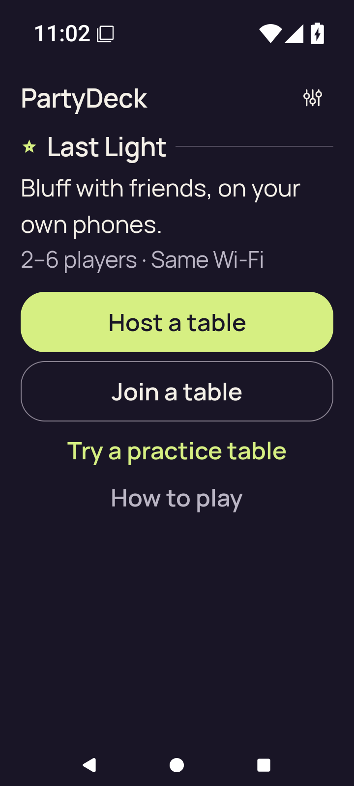</a>

`final-screen.png` · 720 × 1600 · 80,163 bytes.

SHA-256: `737f65bf071ce0c4f9b3ed96e58e443855644f4ff09fc8fbdadd63228bc6b2d8`.

**Preserved image; unviewed.** Original preserved without a direct view or an independently established reviewed-byte representative in this bounded review. Matching published bytes alone do not establish visual review.

### host-after-share

<a href="../../originals/android-jvm-reports/build/ci/android/debug/host-after-share.png">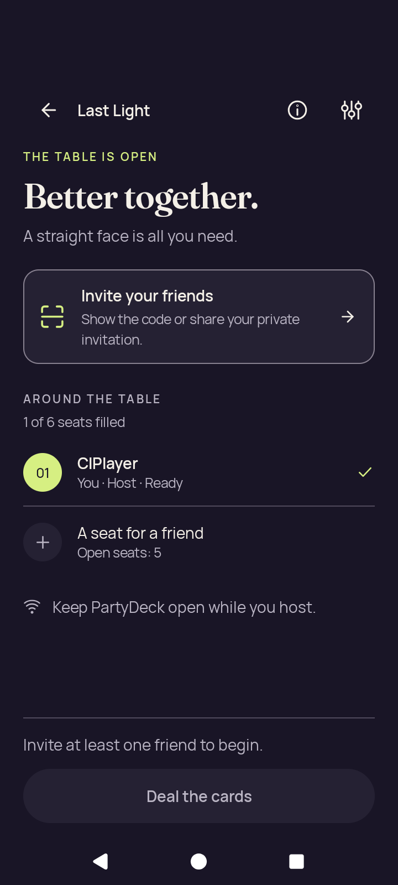</a>

`host-after-share.png` · 720 × 1600 · 99,346 bytes.

SHA-256: `1de4f9c5eaaf38c4b5c9cf9904081ebf9e52dc51b73a77949f734afca4c5ecaf`.

**Preserved image; unviewed.** Original preserved without a direct view or an independently established reviewed-byte representative in this bounded review. Matching published bytes alone do not establish visual review.

### host-lobby

`host-lobby.png` · 720 × 1600 · 99,346 bytes.

SHA-256: `1de4f9c5eaaf38c4b5c9cf9904081ebf9e52dc51b73a77949f734afca4c5ecaf`.

**Preserved image; unviewed.** Original preserved without a direct view or an independently established reviewed-byte representative in this bounded review. Matching published bytes alone do not establish visual review.

### join-invalid

`join-invalid.png` · 720 × 1600 · 93,585 bytes.

SHA-256: `bb2481a1702667a49029e62404501c0ba63bf4f4344e777291898a9d329eb7d6`.

**Preserved image; unviewed.** Original preserved without a direct view or an independently established reviewed-byte representative in this bounded review. Matching published bytes alone do not establish visual review.

### join-name-soft-ime

`join-name-soft-ime.png` · 720 × 1600 · 97,973 bytes.

SHA-256: `5eb7f399ff1afc1b4bccaba121501da86042ef95aa87be48854b78a299c40167`.

**Preserved image; unviewed.** Original preserved without a direct view or an independently established reviewed-byte representative in this bounded review. Matching published bytes alone do not establish visual review.

### large-text-home-actions

<a href="../../originals/android-jvm-reports/build/ci/android/debug/large-text-home-actions.png">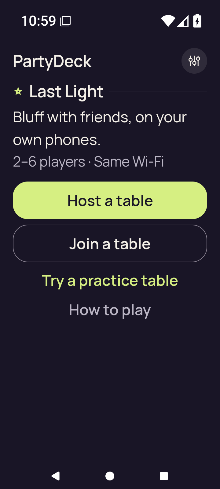</a>

`large-text-home-actions.png` · 720 × 1600 · 83,168 bytes.

SHA-256: `83ce5d981a94f68368dc26eea02c7fc6afc21c6e5a83bf08941a8af92c0e33b9`.

**Preserved image; unviewed.** Original preserved without a direct view or an independently established reviewed-byte representative in this bounded review. Matching published bytes alone do not establish visual review.

### large-text-join-invalid

<a href="../../originals/android-jvm-reports/build/ci/android/debug/large-text-join-invalid.png">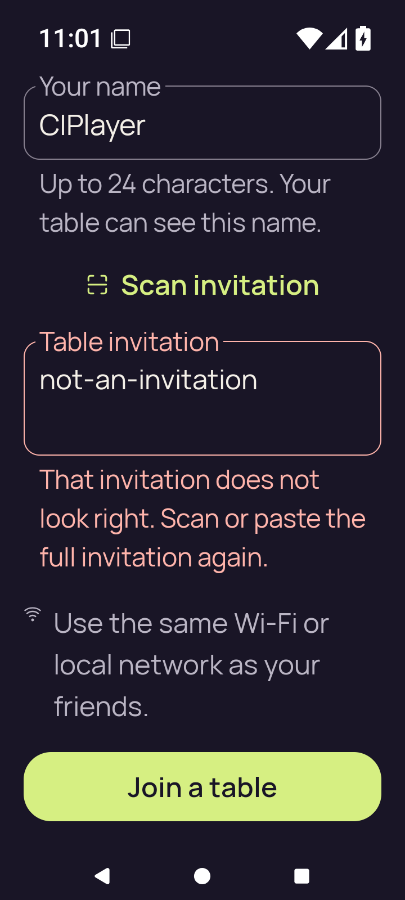</a>

`large-text-join-invalid.png` · 720 × 1600 · 113,697 bytes.

SHA-256: `667acb3b652f5b86c90f1d77a15d030618ef75d8e810debcfc8d83cf782ade4c`.

**Preserved image; unviewed.** Original preserved without a direct view or an independently established reviewed-byte representative in this bounded review. Matching published bytes alone do not establish visual review.

### large-text-join-name-soft-ime

<a href="../../originals/android-jvm-reports/build/ci/android/debug/large-text-join-name-soft-ime.png">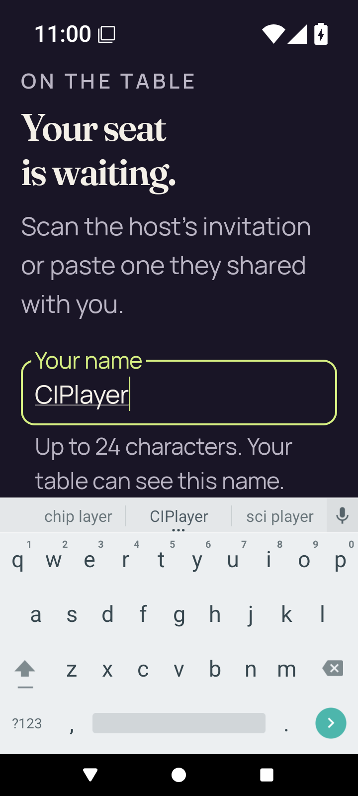</a>

`large-text-join-name-soft-ime.png` · 720 × 1600 · 121,759 bytes.

SHA-256: `a233032fec963b6b381a526b20536a8a7fe9064ebcfb3db1307ee64bf347959c`.

**Preserved image; unviewed.** Original preserved without a direct view or an independently established reviewed-byte representative in this bounded review. Matching published bytes alone do not establish visual review.

### large-text-play-action

<a href="../../originals/android-jvm-reports/build/ci/android/debug/large-text-play-action.png">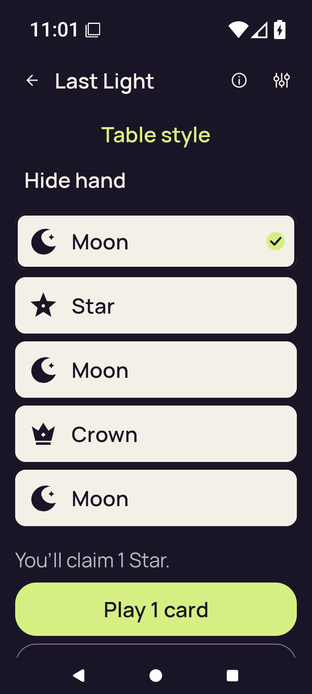</a>

`large-text-play-action.png` · 720 × 1600 · 76,258 bytes.

SHA-256: `7d19715104cb1150be9c985da8efb2114477c02cd895f1c51b32732f7d43ce1c`.

**Preserved image; unviewed.** Original preserved without a direct view or an independently established reviewed-byte representative in this bounded review. Matching published bytes alone do not establish visual review.

### large-text-private-hand

<a href="../../originals/android-jvm-reports/build/ci/android/debug/large-text-private-hand.png">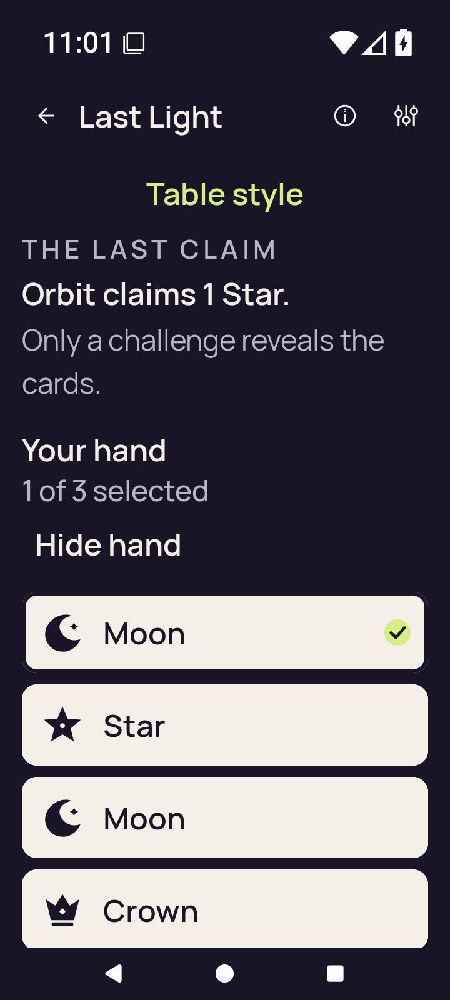</a>

`large-text-private-hand.png` · 720 × 1600 · 92,388 bytes.

SHA-256: `ea8c4fd926ddb403be3a68cca869559e3006fd821f9176c63e9b41968f82cdde`.

**Preserved image; unviewed.** Original preserved without a direct view or an independently established reviewed-byte representative in this bounded review. Matching published bytes alone do not establish visual review.

### large-text-rules-intro

<a href="../../originals/android-jvm-reports/build/ci/android/debug/large-text-rules-intro.png">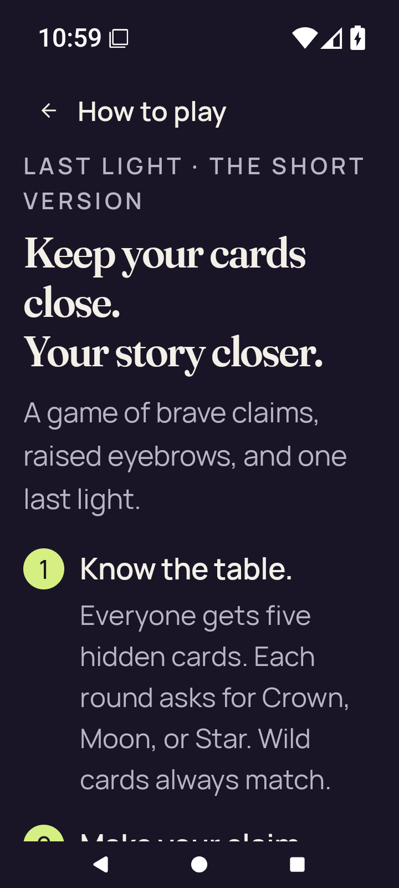</a>

`large-text-rules-intro.png` · 720 × 1600 · 137,015 bytes.

SHA-256: `082861aecaa19bd0c0c324c32a5c435615d124399aff8d6038e4a5e28ce5d371`.

**Preserved image; unviewed.** Original preserved without a direct view or an independently established reviewed-byte representative in this bounded review. Matching published bytes alone do not establish visual review.

### large-text-rules-last-step

<a href="../../originals/android-jvm-reports/build/ci/android/debug/large-text-rules-last-step.png">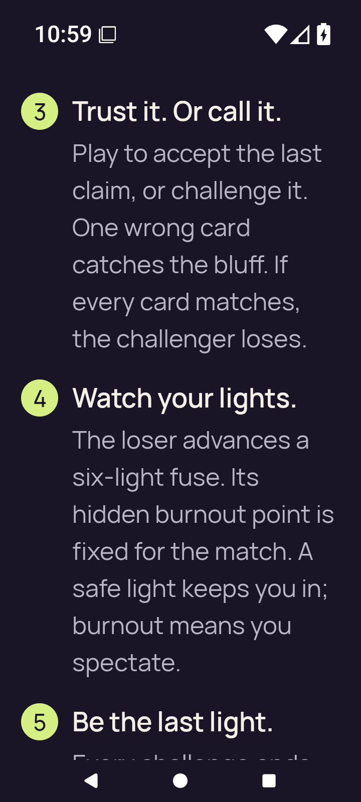</a>

`large-text-rules-last-step.png` · 720 × 1600 · 144,256 bytes.

SHA-256: `7f551c459b294c1cf31861fe3cc99826895132862df461258d58ee113fddbbfc`.

**Preserved image; unviewed.** Original preserved without a direct view or an independently established reviewed-byte representative in this bounded review. Matching published bytes alone do not establish visual review.

### large-text-rules-practice-action

<a href="../../originals/android-jvm-reports/build/ci/android/debug/large-text-rules-practice-action.png">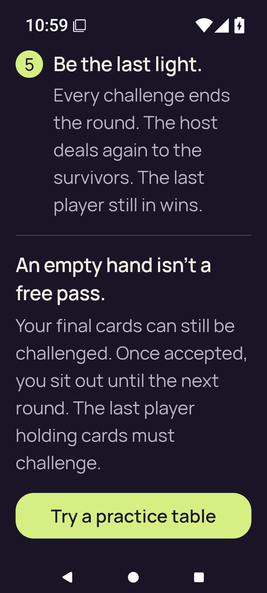</a>

`large-text-rules-practice-action.png` · 720 × 1600 · 125,381 bytes.

SHA-256: `435b1e2ddcb25f95a0114add0a7fb4d7959d42bea8b56d4a00d41a753d9d7284`.

**Preserved image; unviewed.** Original preserved without a direct view or an independently established reviewed-byte representative in this bounded review. Matching published bytes alone do not establish visual review.

### large-text-rules-practice-entered

<a href="../../originals/android-jvm-reports/build/ci/android/debug/large-text-rules-practice-entered.png">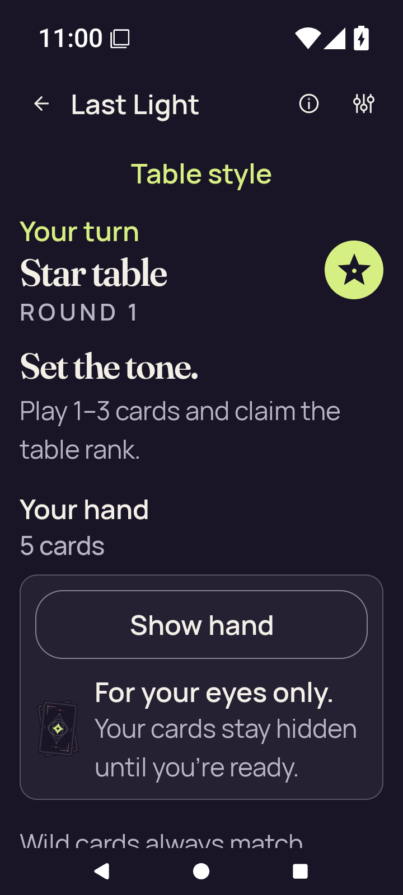</a>

`large-text-rules-practice-entered.png` · 720 × 1600 · 127,354 bytes.

SHA-256: `a9436c6c69c3bde3ade1de8103c6d18aa8c16cf0ef72faba80cff4d05e9846a2`.

**Preserved image; unviewed.** Original preserved without a direct view or an independently established reviewed-byte representative in this bounded review. Matching published bytes alone do not establish visual review.

### large-text-rules-returned-home

<a href="../../originals/android-jvm-reports/build/ci/android/debug/large-text-rules-returned-home.png">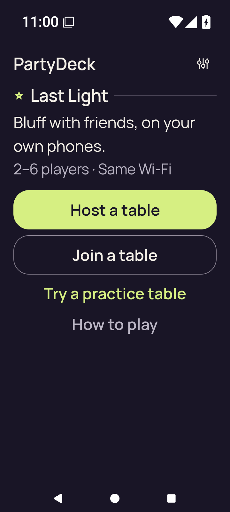</a>

`large-text-rules-returned-home.png` · 720 × 1600 · 79,340 bytes.

SHA-256: `eeb7732fb173c86e0f884000b2b3f84c0ef9801fe5df92d0546c36e7a064fb99`.

**Preserved image; unviewed.** Original preserved without a direct view or an independently established reviewed-byte representative in this bounded review. Matching published bytes alone do not establish visual review.

### large-text-settings

<a href="../../originals/android-jvm-reports/build/ci/android/debug/large-text-settings.png">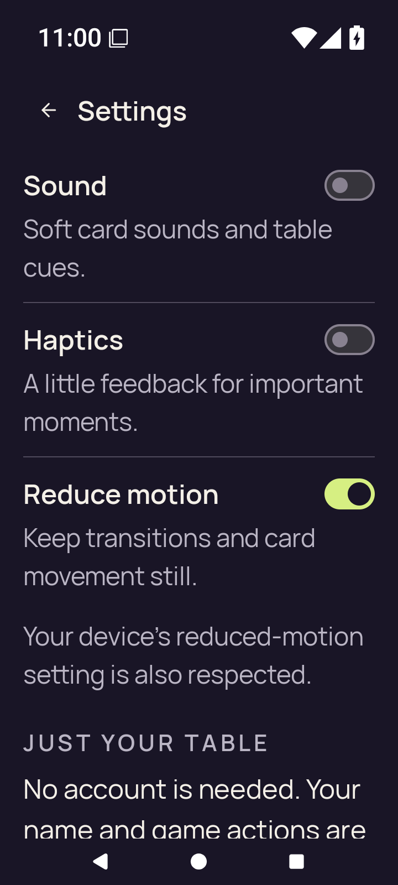</a>

`large-text-settings.png` · 720 × 1600 · 121,084 bytes.

SHA-256: `1587bfcb46c6565cf6aae98ada1f5c0d1cc63cba3b81b0beadf451821e11a8ab`.

**Preserved image; unviewed.** Original preserved without a direct view or an independently established reviewed-byte representative in this bounded review. Matching published bytes alone do not establish visual review.

### practice-after-play

<a href="../../originals/android-jvm-reports/build/ci/android/debug/practice-after-play.png">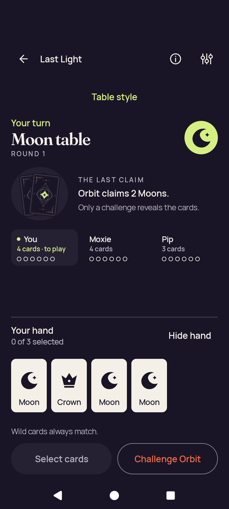</a>

`practice-after-play.png` · 720 × 1600 · 117,374 bytes.

SHA-256: `e08aa94aca22dd721efa116807b5c2222345d6d4a5190890e5a793aad675deeb`.

**Preserved image; unviewed.** Original preserved without a direct view or an independently established reviewed-byte representative in this bounded review. Matching published bytes alone do not establish visual review.

### practice-concealed

<a href="../../originals/android-jvm-reports/build/ci/android/debug/practice-concealed.png">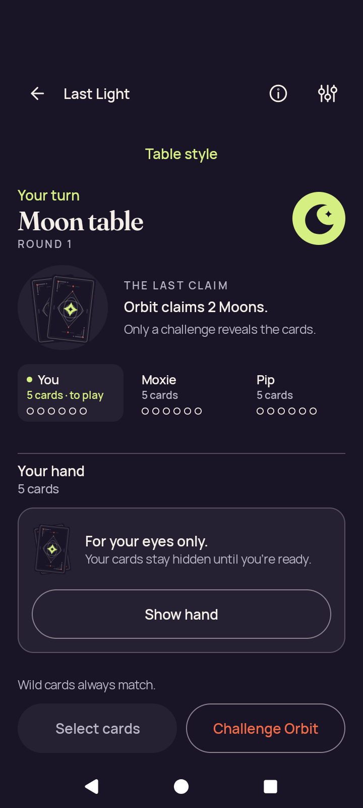</a>

`practice-concealed.png` · 720 × 1600 · 125,520 bytes.

SHA-256: `11962e12deb5091724b941f16f9fb01726b170c65e77edde26b8b797f8c29690`.

**Preserved image; unviewed.** Original preserved without a direct view or an independently established reviewed-byte representative in this bounded review. Matching published bytes alone do not establish visual review.

### practice-resumed-concealed

`practice-resumed-concealed.png` · 720 × 1600 · 125,520 bytes.

SHA-256: `11962e12deb5091724b941f16f9fb01726b170c65e77edde26b8b797f8c29690`.

**Preserved image; unviewed.** Original preserved without a direct view or an independently established reviewed-byte representative in this bounded review. Matching published bytes alone do not establish visual review.

### practice-selected

<a href="../../originals/android-jvm-reports/build/ci/android/debug/practice-selected.png">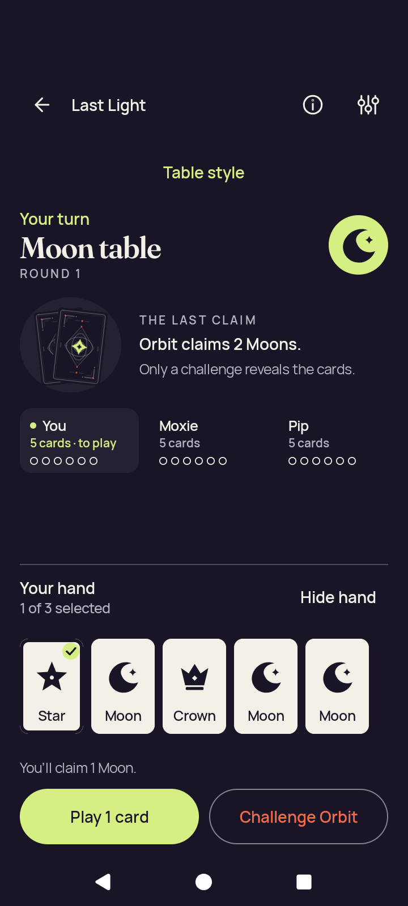</a>

`practice-selected.png` · 720 × 1600 · 120,264 bytes.

SHA-256: `c429a708a642fec53a21a69880edf7cf919500871d12632896d8496215fdb65c`.

**Preserved image; unviewed.** Original preserved without a direct view or an independently established reviewed-byte representative in this bounded review. Matching published bytes alone do not establish visual review.

### rules-intro

`rules-intro.png` · 720 × 1600 · 148,313 bytes.

SHA-256: `a1edaaccbd7febff6692b5e18256a99c65546068237f1b325df6247c457c5996`.

**Preserved image; unviewed.** Original preserved without a direct view or an independently established reviewed-byte representative in this bounded review. Matching published bytes alone do not establish visual review.

### rules-last-step

<a href="../../originals/android-jvm-reports/build/ci/android/debug/rules-last-step.png">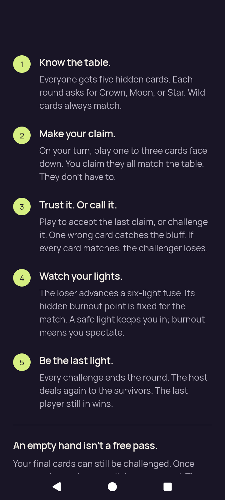</a>

`rules-last-step.png` · 720 × 1600 · 147,034 bytes.

SHA-256: `7bfcffe07d36986fe38208c35c9d6fa91cceb8fb863ab67ea2dbb784215a13a4`.

**Preserved image; unviewed.** Original preserved without a direct view or an independently established reviewed-byte representative in this bounded review. Matching published bytes alone do not establish visual review.

### rules-practice-action

<a href="../../originals/android-jvm-reports/build/ci/android/debug/rules-practice-action.png">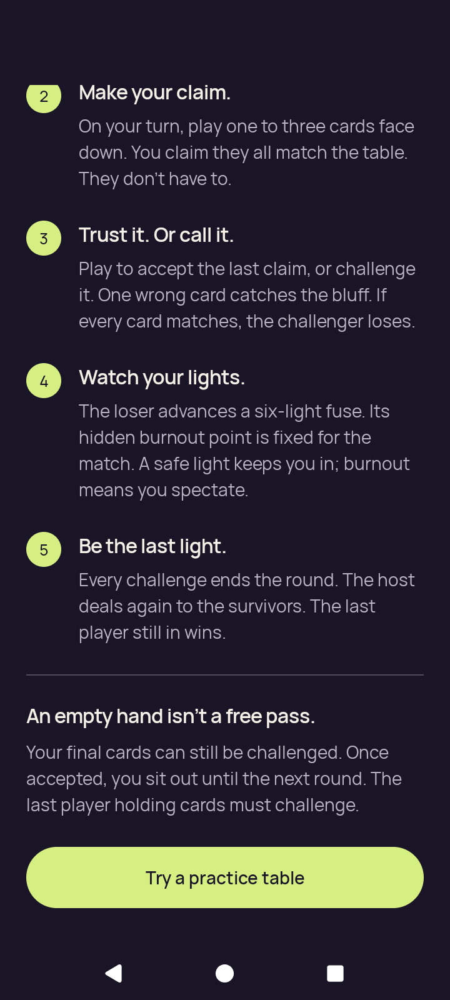</a>

`rules-practice-action.png` · 720 × 1600 · 141,052 bytes.

SHA-256: `6218467a33b1dc3c3adb4aa79b0e77ba48cb5f4f0ae9da0af5d8b8810d8e85ac`.

**Preserved image; unviewed.** Original preserved without a direct view or an independently established reviewed-byte representative in this bounded review. Matching published bytes alone do not establish visual review.

### rules-practice-entered

<a href="../../originals/android-jvm-reports/build/ci/android/debug/rules-practice-entered.png">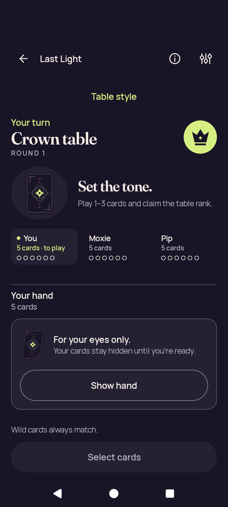</a>

`rules-practice-entered.png` · 720 × 1600 · 107,946 bytes.

SHA-256: `7e6bcf8cf15f543f8609bb0d5502d0ce2019265fabb308c3ee119e4c43bcab86`.

**Preserved image; unviewed.** Original preserved without a direct view or an independently established reviewed-byte representative in this bounded review. Matching published bytes alone do not establish visual review.

### settings-changed

`settings-changed.png` · 720 × 1600 · 116,996 bytes.

SHA-256: `2173a667aa006ca3404472303ecad04c6051bb9f03132d006f7ab47cacb32ff2`.

**Preserved image; unviewed.** Original preserved without a direct view or an independently established reviewed-byte representative in this bounded review. Matching published bytes alone do not establish visual review.

### settings-persisted

`settings-persisted.png` · 720 × 1600 · 116,996 bytes.

SHA-256: `2173a667aa006ca3404472303ecad04c6051bb9f03132d006f7ab47cacb32ff2`.

**Preserved image; unviewed.** Original preserved without a direct view or an independently established reviewed-byte representative in this bounded review. Matching published bytes alone do not establish visual review.

### final-screen

`final-screen.png` · 720 × 1600 · 752,397 bytes.

SHA-256: `7caa5260ada185574c598f5240d46f617a0ec62d1b376f3165b1538c1d3ccb0c`.

**Preserved image; unviewed.** Original preserved without a direct view or an independently established reviewed-byte representative in this bounded review. Matching published bytes alone do not establish visual review.
