# Android ordinary optimized — CI 34538972728

Ordinary debug and optimized passed. Godot debug has 30 passes; optimized has 28 passes and two explicit renderer-death skips. The complete Validate run failed separately on iOS. All four packaged PCKs were independently verified against frozen source/export; pixel findings remain bounded to reviewed stills.

Exact source: `dd6df8a530d71b51ae4c3b0f4a05246f2e58402f`. Platform: Android emulator, ordinary optimized test signed.

**31 images**: 31 preserved image; unviewed.

[Gallery index](../../../README.md) · [Batch scope and review counts](../../../provenance/20260911-4586/review-summary.json) · [Exact source paths, hashes and timestamps](../../../provenance/20260911-4586/source-map.json).

### final-screen

<a href="../../originals/android-jvm-reports/build/ci/android/optimized-test-signed/final-screen.png">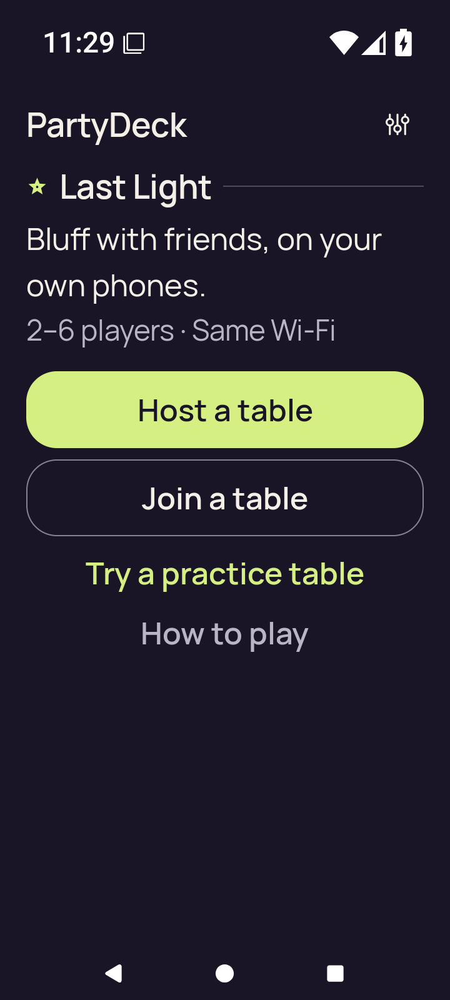</a>

`final-screen.png` · 720 × 1600 · 80,418 bytes.

SHA-256: `f4247074d51a553f4f6a00f32003227a4809ea00e8c4c68835da0588ae8dadbf`.

**Preserved image; unviewed.** Original preserved without a direct view or an independently established reviewed-byte representative in this bounded review. Matching published bytes alone do not establish visual review.

### home

`home.png` · 720 × 1600 · 131,406 bytes.

SHA-256: `ec776bd5cf1ea4398fedc794fe15159efba6f8bc513c9ee4b51b0714740fd933`.

**Preserved image; unviewed.** Original preserved without a direct view or an independently established reviewed-byte representative in this bounded review. Matching published bytes alone do not establish visual review.

### host-after-share

<a href="../../originals/android-jvm-reports/build/ci/android/optimized-test-signed/host-after-share.png">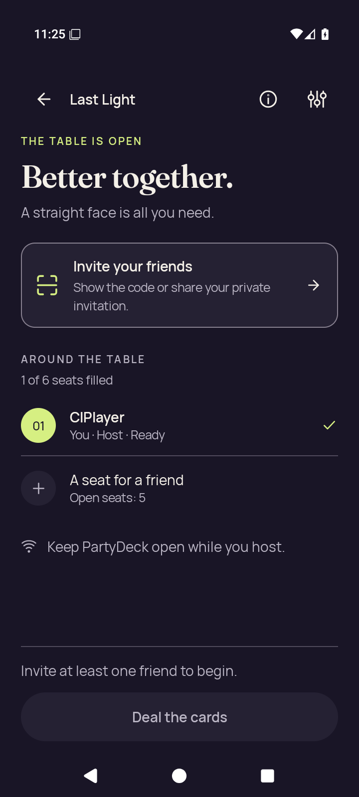</a>

`host-after-share.png` · 720 × 1600 · 101,810 bytes.

SHA-256: `a4094bb40ec1f18f146027971817e7a61dce4ede771e1a2c491a92dbaa8d4d39`.

**Preserved image; unviewed.** Original preserved without a direct view or an independently established reviewed-byte representative in this bounded review. Matching published bytes alone do not establish visual review.

### host-lobby

`host-lobby.png` · 720 × 1600 · 101,578 bytes.

SHA-256: `20244dcb0b00efdf85f0bafdb52ddf6f884eb24c0adad93558c9d25600752d56`.

**Preserved image; unviewed.** Original preserved without a direct view or an independently established reviewed-byte representative in this bounded review. Matching published bytes alone do not establish visual review.

### host-returned-home

`host-returned-home.png` · 720 × 1600 · 131,959 bytes.

SHA-256: `080dbef9b685d0dda4a09edb4c9053ea9773c2dedb289bd15bcac39bbb2ce63d`.

**Preserved image; unviewed.** Original preserved without a direct view or an independently established reviewed-byte representative in this bounded review. Matching published bytes alone do not establish visual review.

### join-invalid

<a href="../../originals/android-jvm-reports/build/ci/android/optimized-test-signed/join-invalid.png">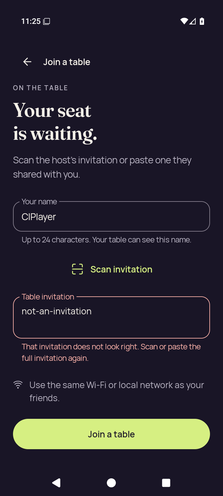</a>

`join-invalid.png` · 720 × 1600 · 95,923 bytes.

SHA-256: `a7ca6e6e71ecc6f695488cd3bce62607187d716a9182aad203e1795d2ef3287c`.

**Preserved image; unviewed.** Original preserved without a direct view or an independently established reviewed-byte representative in this bounded review. Matching published bytes alone do not establish visual review.

### join-name-soft-ime

<a href="../../originals/android-jvm-reports/build/ci/android/optimized-test-signed/join-name-soft-ime.png">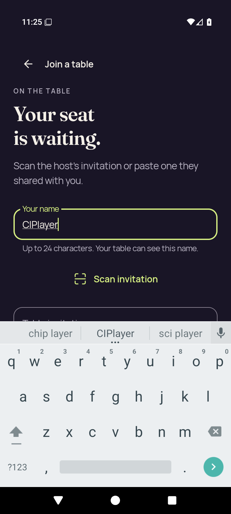</a>

`join-name-soft-ime.png` · 720 × 1600 · 100,639 bytes.

SHA-256: `d50c88765acacff6caac9915ee03e631d5da2c585062b4193ed7d000d2ecbcc7`.

**Preserved image; unviewed.** Original preserved without a direct view or an independently established reviewed-byte representative in this bounded review. Matching published bytes alone do not establish visual review.

### large-text-home-actions

<a href="../../originals/android-jvm-reports/build/ci/android/optimized-test-signed/large-text-home-actions.png">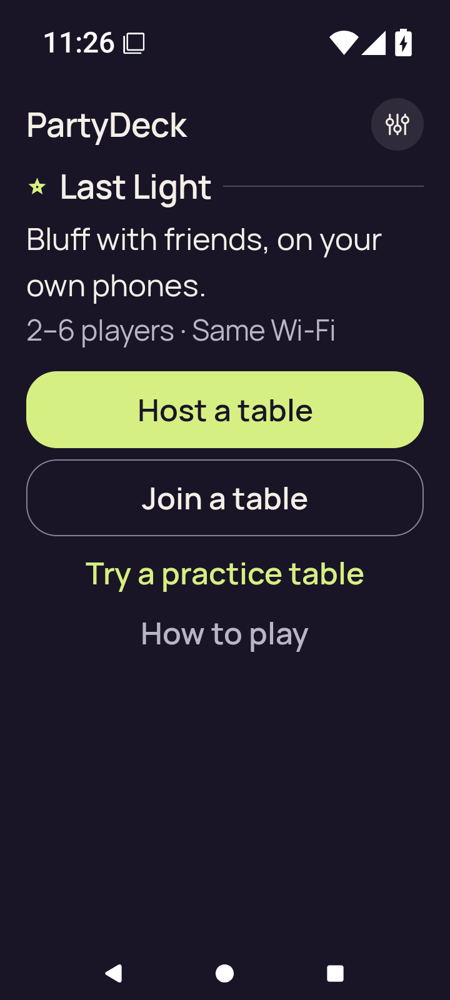</a>

`large-text-home-actions.png` · 720 × 1600 · 82,174 bytes.

SHA-256: `b4393310286af36c379744dfbfc68f7f7f7baac5eb72480a9df6dc98c981e8df`.

**Preserved image; unviewed.** Original preserved without a direct view or an independently established reviewed-byte representative in this bounded review. Matching published bytes alone do not establish visual review.

### large-text-join-invalid

<a href="../../originals/android-jvm-reports/build/ci/android/optimized-test-signed/large-text-join-invalid.png">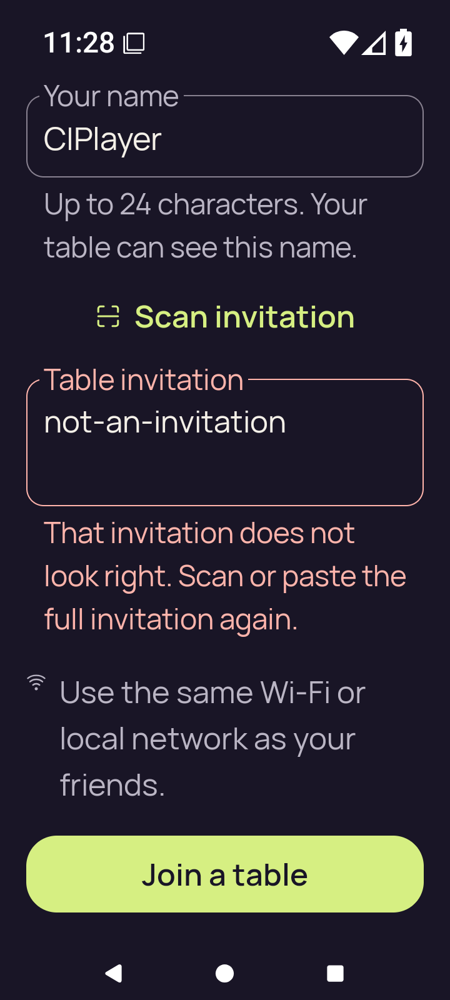</a>

`large-text-join-invalid.png` · 720 × 1600 · 114,725 bytes.

SHA-256: `68a18266247faf08c96bc7b3d3f4a727baecb4953104fc0b2e2720d6d6b90d17`.

**Preserved image; unviewed.** Original preserved without a direct view or an independently established reviewed-byte representative in this bounded review. Matching published bytes alone do not establish visual review.

### large-text-join-name-soft-ime

<a href="../../originals/android-jvm-reports/build/ci/android/optimized-test-signed/large-text-join-name-soft-ime.png">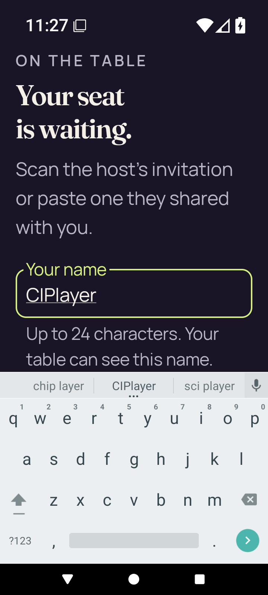</a>

`large-text-join-name-soft-ime.png` · 720 × 1600 · 122,244 bytes.

SHA-256: `d40caefa590a969934843e2da4cdd2419305c58180541eae33e2202b8ac66ed6`.

**Preserved image; unviewed.** Original preserved without a direct view or an independently established reviewed-byte representative in this bounded review. Matching published bytes alone do not establish visual review.

### large-text-play-action

<a href="../../originals/android-jvm-reports/build/ci/android/optimized-test-signed/large-text-play-action.png">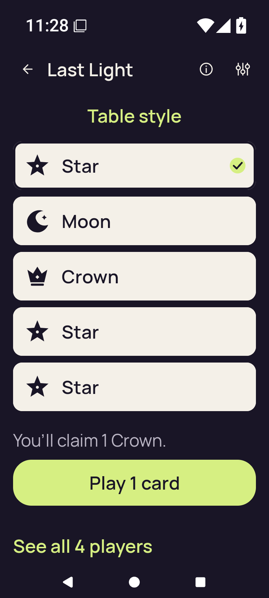</a>

`large-text-play-action.png` · 720 × 1600 · 81,538 bytes.

SHA-256: `a14859e2bf052d7da57ef536b7e9de7003af2aa2bbdfe7caa726c829d509962d`.

**Preserved image; unviewed.** Original preserved without a direct view or an independently established reviewed-byte representative in this bounded review. Matching published bytes alone do not establish visual review.

### large-text-private-hand

<a href="../../originals/android-jvm-reports/build/ci/android/optimized-test-signed/large-text-private-hand.png">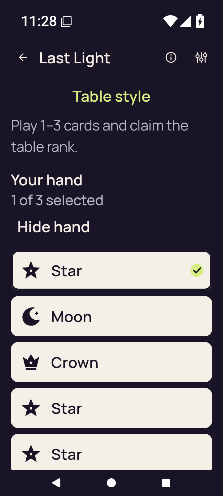</a>

`large-text-private-hand.png` · 720 × 1600 · 86,919 bytes.

SHA-256: `378f75f0d2eb6b424c7ed470abe3d3ec1a51d093b25111d8ad48a12bbf7a283d`.

**Preserved image; unviewed.** Original preserved without a direct view or an independently established reviewed-byte representative in this bounded review. Matching published bytes alone do not establish visual review.

### large-text-rules-intro

<a href="../../originals/android-jvm-reports/build/ci/android/optimized-test-signed/large-text-rules-intro.png">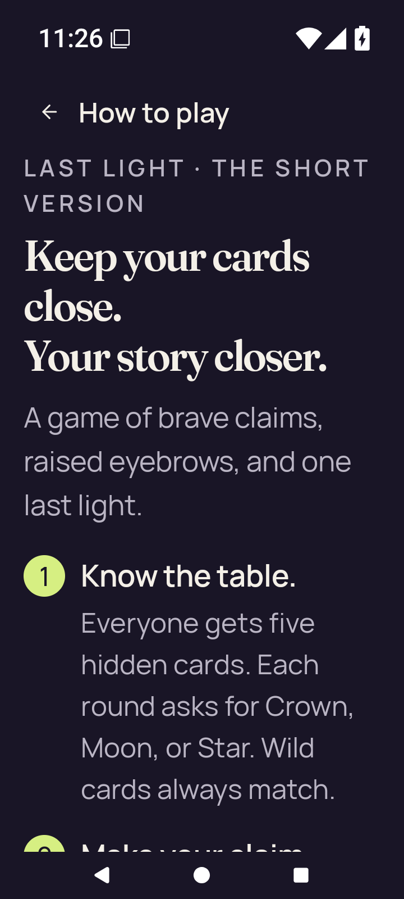</a>

`large-text-rules-intro.png` · 720 × 1600 · 136,155 bytes.

SHA-256: `227944c1619eb152e9c64599899a418281ec7409c78ac308ce5e92690814a10d`.

**Preserved image; unviewed.** Original preserved without a direct view or an independently established reviewed-byte representative in this bounded review. Matching published bytes alone do not establish visual review.

### large-text-rules-last-step

<a href="../../originals/android-jvm-reports/build/ci/android/optimized-test-signed/large-text-rules-last-step.png">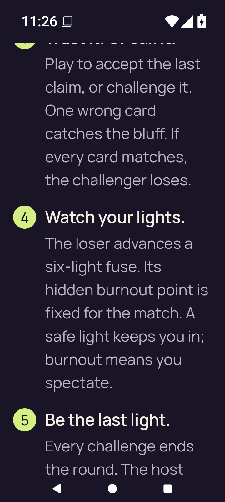</a>

`large-text-rules-last-step.png` · 720 × 1600 · 149,238 bytes.

SHA-256: `be05a917dfd1ea80006bafc903d89e4ee24464334da73999cf6a4f5a754a96c2`.

**Preserved image; unviewed.** Original preserved without a direct view or an independently established reviewed-byte representative in this bounded review. Matching published bytes alone do not establish visual review.

### large-text-rules-practice-action

<a href="../../originals/android-jvm-reports/build/ci/android/optimized-test-signed/large-text-rules-practice-action.png">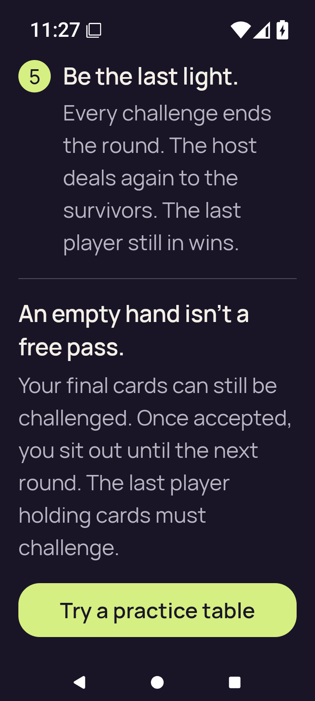</a>

`large-text-rules-practice-action.png` · 720 × 1600 · 124,129 bytes.

SHA-256: `4cc8a2a3c38d8747f95ae8b3bda5ce13c4ebbb55309f5499c97bf9505d51ce72`.

**Preserved image; unviewed.** Original preserved without a direct view or an independently established reviewed-byte representative in this bounded review. Matching published bytes alone do not establish visual review.

### large-text-rules-practice-entered

<a href="../../originals/android-jvm-reports/build/ci/android/optimized-test-signed/large-text-rules-practice-entered.png">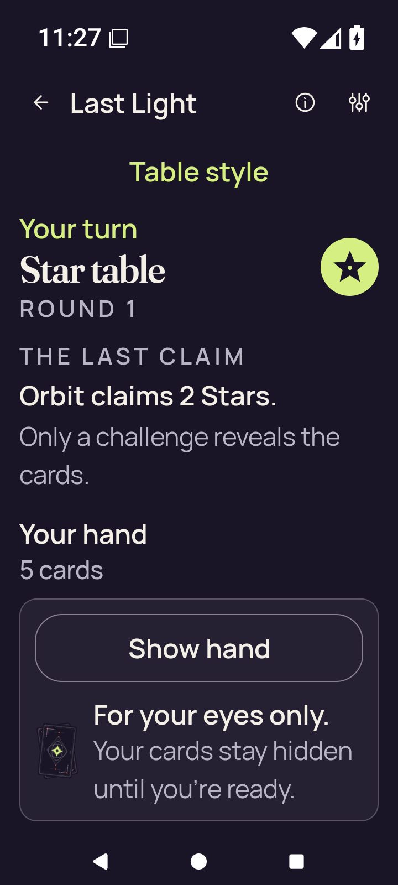</a>

`large-text-rules-practice-entered.png` · 720 × 1600 · 128,780 bytes.

SHA-256: `8d39127996a378e09bbcf6f1a3f4d2b9d5b480a23134768ec4c0d429400e07be`.

**Preserved image; unviewed.** Original preserved without a direct view or an independently established reviewed-byte representative in this bounded review. Matching published bytes alone do not establish visual review.

### large-text-rules-returned-home

<a href="../../originals/android-jvm-reports/build/ci/android/optimized-test-signed/large-text-rules-returned-home.png">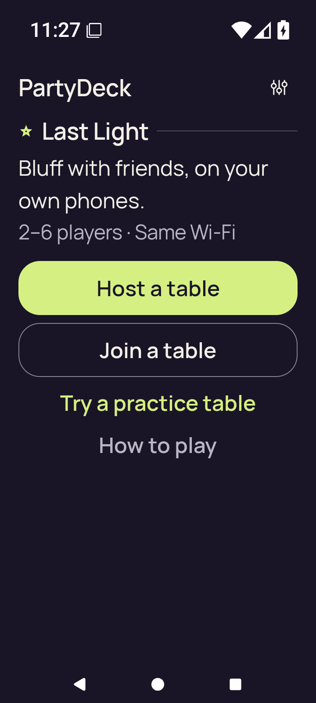</a>

`large-text-rules-returned-home.png` · 720 × 1600 · 79,886 bytes.

SHA-256: `1c1af9499801078d982ec4a2341b6e58a8ed1d1557271763932894c4e8e0f5d6`.

**Preserved image; unviewed.** Original preserved without a direct view or an independently established reviewed-byte representative in this bounded review. Matching published bytes alone do not establish visual review.

### large-text-settings

<a href="../../originals/android-jvm-reports/build/ci/android/optimized-test-signed/large-text-settings.png">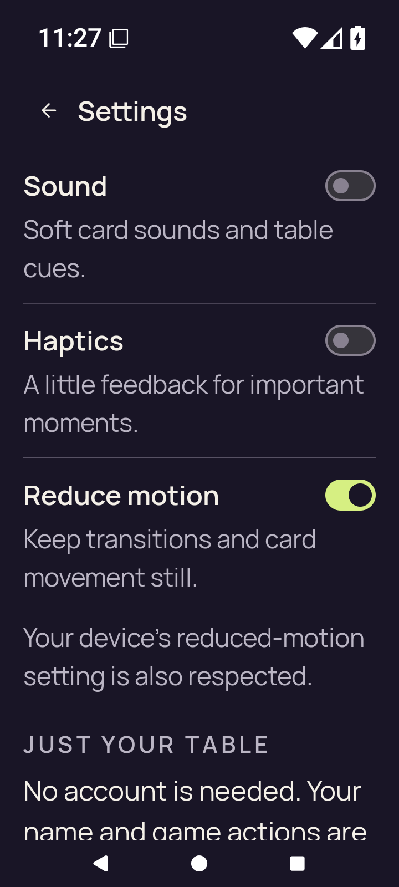</a>

`large-text-settings.png` · 720 × 1600 · 121,638 bytes.

SHA-256: `d914731ff7c85cb4d0892d80d3b46235ac39c2ed851ded966b49b39b9e1b9af7`.

**Preserved image; unviewed.** Original preserved without a direct view or an independently established reviewed-byte representative in this bounded review. Matching published bytes alone do not establish visual review.

### practice-after-play

<a href="../../originals/android-jvm-reports/build/ci/android/optimized-test-signed/practice-after-play.png">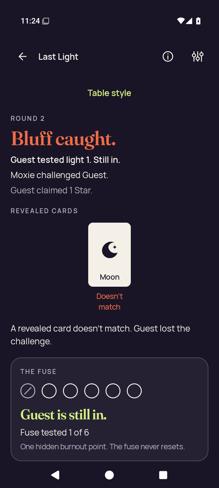</a>

`practice-after-play.png` · 720 × 1600 · 91,638 bytes.

SHA-256: `ca514989bf35d7a0bd461c61fd31ce6935d7e901ae775141953c8fce4b351769`.

**Preserved image; unviewed.** Original preserved without a direct view or an independently established reviewed-byte representative in this bounded review. Matching published bytes alone do not establish visual review.

### practice-concealed

<a href="../../originals/android-jvm-reports/build/ci/android/optimized-test-signed/practice-concealed.png">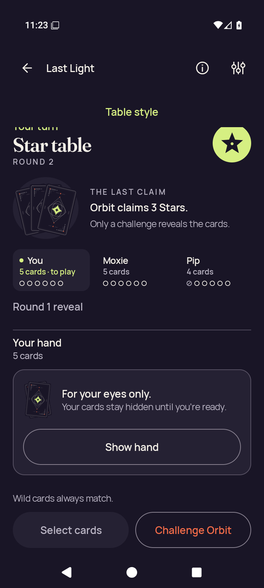</a>

`practice-concealed.png` · 720 × 1600 · 131,513 bytes.

SHA-256: `e595a1255ae52042d32e521358ecb2a8e9bee72dfa2aeebfa02a9eb71d0b47e1`.

**Preserved image; unviewed.** Original preserved without a direct view or an independently established reviewed-byte representative in this bounded review. Matching published bytes alone do not establish visual review.

### practice-resumed-concealed

<a href="../../originals/android-jvm-reports/build/ci/android/optimized-test-signed/practice-resumed-concealed.png">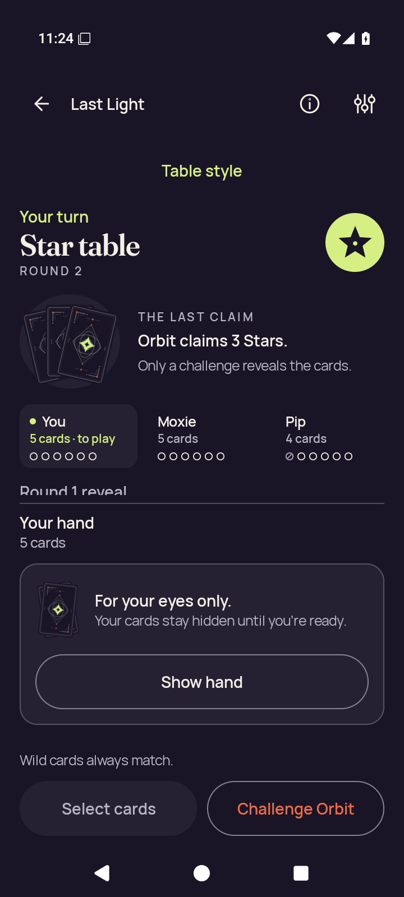</a>

`practice-resumed-concealed.png` · 720 × 1600 · 131,519 bytes.

SHA-256: `721ca0427eec40852bf0f0aa54d5c9cd050caa49f0ce6ccff071d2301f72b369`.

**Preserved image; unviewed.** Original preserved without a direct view or an independently established reviewed-byte representative in this bounded review. Matching published bytes alone do not establish visual review.

### practice-returned-home

<a href="../../originals/android-jvm-reports/build/ci/android/optimized-test-signed/practice-returned-home.png">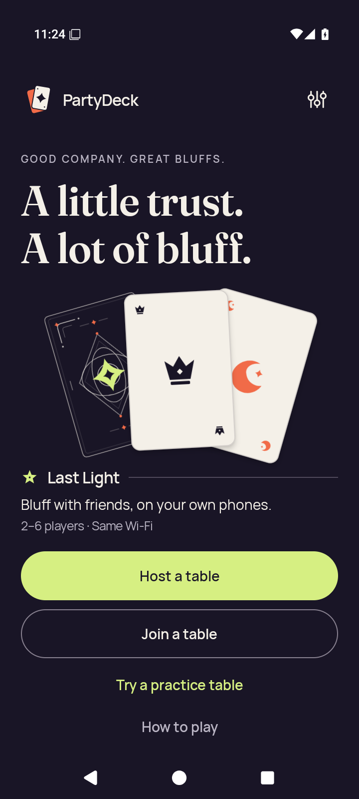</a>

`practice-returned-home.png` · 720 × 1600 · 131,632 bytes.

SHA-256: `f967110945d18af573f25c3c440ca0c60c9a2bba5e3c9be356fe50b897508911`.

**Preserved image; unviewed.** Original preserved without a direct view or an independently established reviewed-byte representative in this bounded review. Matching published bytes alone do not establish visual review.

### practice-selected

<a href="../../originals/android-jvm-reports/build/ci/android/optimized-test-signed/practice-selected.png">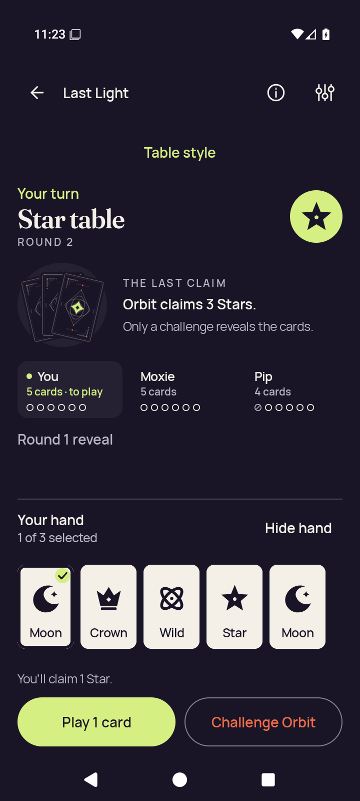</a>

`practice-selected.png` · 720 × 1600 · 130,963 bytes.

SHA-256: `ae720244febbfd78d90d62e3547c8a82cd8d7d8905bc12bd15ee79f129a59d71`.

**Preserved image; unviewed.** Original preserved without a direct view or an independently established reviewed-byte representative in this bounded review. Matching published bytes alone do not establish visual review.

### rules-intro

<a href="../../originals/android-jvm-reports/build/ci/android/optimized-test-signed/rules-intro.png">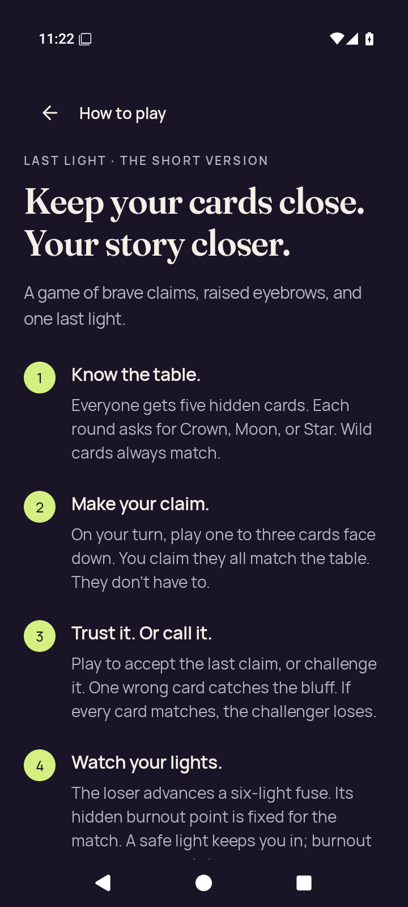</a>

`rules-intro.png` · 720 × 1600 · 150,186 bytes.

SHA-256: `397e0ecc0e873df4f4e9ab17e060808e6e7d000a272214fc114706d6ac55183d`.

**Preserved image; unviewed.** Original preserved without a direct view or an independently established reviewed-byte representative in this bounded review. Matching published bytes alone do not establish visual review.

### rules-last-step

<a href="../../originals/android-jvm-reports/build/ci/android/optimized-test-signed/rules-last-step.png">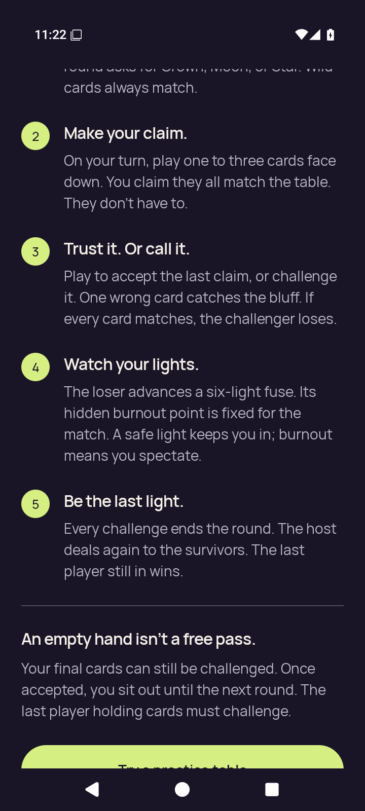</a>

`rules-last-step.png` · 720 × 1600 · 146,368 bytes.

SHA-256: `3293850823d243201ac36205e3bc749fbddf4dd0d7e2c0596059b9d8321ab49d`.

**Preserved image; unviewed.** Original preserved without a direct view or an independently established reviewed-byte representative in this bounded review. Matching published bytes alone do not establish visual review.

### rules-practice-action

<a href="../../originals/android-jvm-reports/build/ci/android/optimized-test-signed/rules-practice-action.png">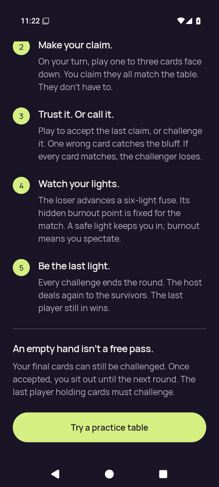</a>

`rules-practice-action.png` · 720 × 1600 · 142,803 bytes.

SHA-256: `38bc537fa82d66564b2f50e9ab3aa6150dcd75d50dd1ab33cb0e63c6a14c7d5e`.

**Preserved image; unviewed.** Original preserved without a direct view or an independently established reviewed-byte representative in this bounded review. Matching published bytes alone do not establish visual review.

### rules-practice-entered

<a href="../../originals/android-jvm-reports/build/ci/android/optimized-test-signed/rules-practice-entered.png">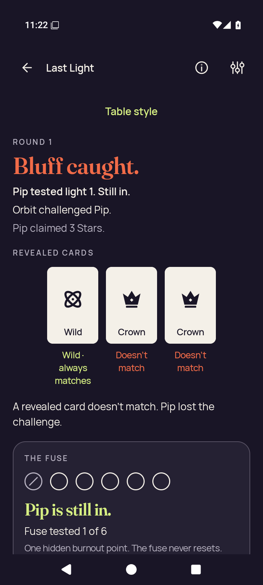</a>

`rules-practice-entered.png` · 720 × 1600 · 97,995 bytes.

SHA-256: `ddf8e55ef41f4f1333f0e94d534f90b9281a3cbe53ede482fda9110a0890ba80`.

**Preserved image; unviewed.** Original preserved without a direct view or an independently established reviewed-byte representative in this bounded review. Matching published bytes alone do not establish visual review.

### rules-returned-home

`rules-returned-home.png` · 720 × 1600 · 131,531 bytes.

SHA-256: `2bdabeb3ad7fa09ee53c42a12a16437d54189060181a23d3a767151de9aa3e4d`.

**Preserved image; unviewed.** Original preserved without a direct view or an independently established reviewed-byte representative in this bounded review. Matching published bytes alone do not establish visual review.

### settings-changed

`settings-changed.png` · 720 × 1600 · 119,033 bytes.

SHA-256: `116015a4889aa9db7f313539a03b3cb34768486acd0d26c8d881dea40495c918`.

**Preserved image; unviewed.** Original preserved without a direct view or an independently established reviewed-byte representative in this bounded review. Matching published bytes alone do not establish visual review.

### settings-persisted

<a href="../../originals/android-jvm-reports/build/ci/android/optimized-test-signed/settings-persisted.png">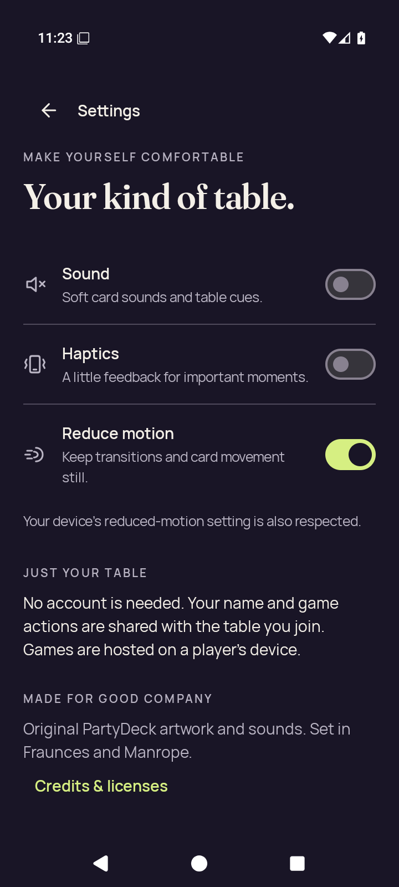</a>

`settings-persisted.png` · 720 × 1600 · 119,557 bytes.

SHA-256: `70d942d6ed9f8f312fe204cc4badb294dae0f8aaa6e071e96d59c8c5bebaa38c`.

**Preserved image; unviewed.** Original preserved without a direct view or an independently established reviewed-byte representative in this bounded review. Matching published bytes alone do not establish visual review.

### settings-return-home

`settings-return-home.png` · 720 × 1600 · 131,531 bytes.

SHA-256: `2bdabeb3ad7fa09ee53c42a12a16437d54189060181a23d3a767151de9aa3e4d`.

**Preserved image; unviewed.** Original preserved without a direct view or an independently established reviewed-byte representative in this bounded review. Matching published bytes alone do not establish visual review.
