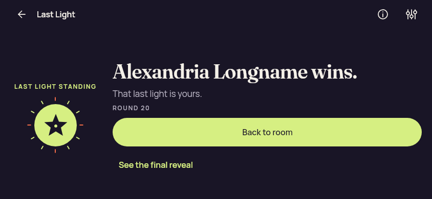
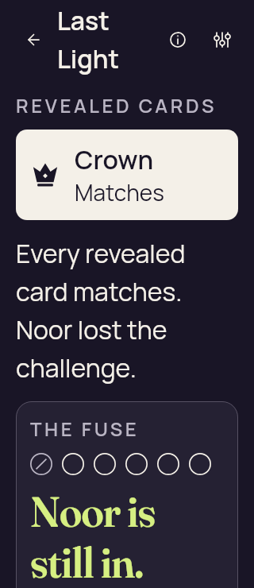
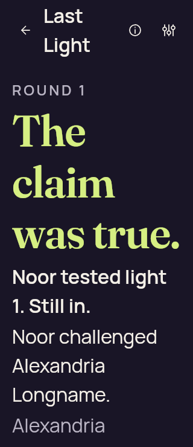
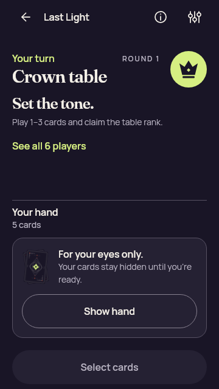
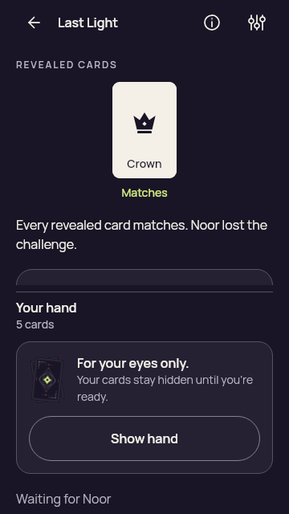
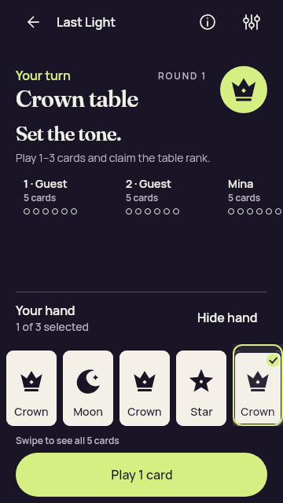
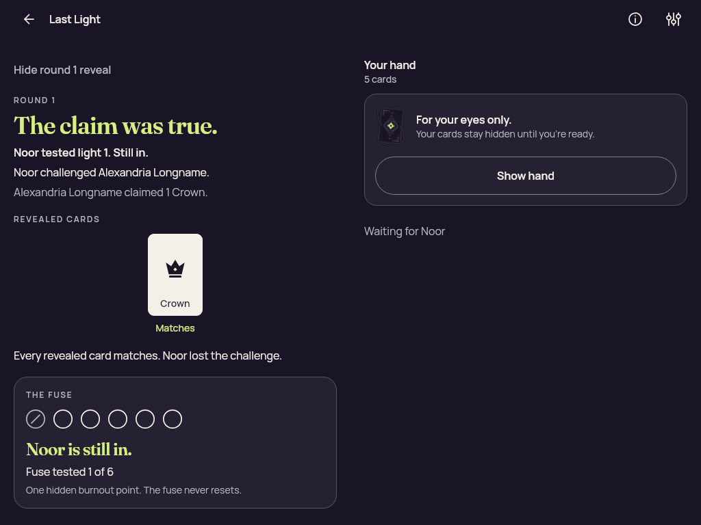
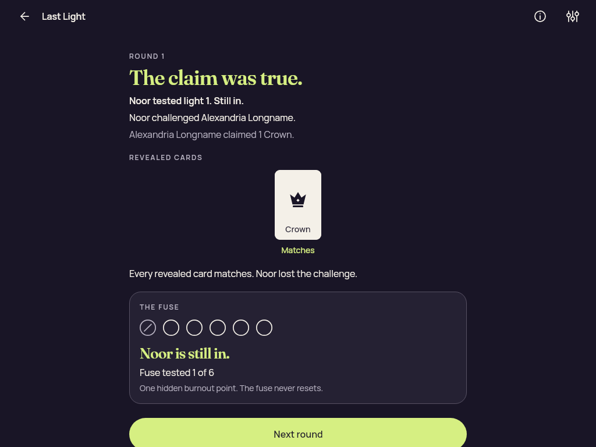

# Compose GameplayLayout — local selection-feedback validation

[All collections](../README.md)

Seven JVM GameplayLayout cases passed with zero failures, errors or skips. Native accessibility and renderer qualification remain separate.

37 original PNGs. One original selection-limit capture was directly reviewed; 36 retain exact-byte links to prior published originals without losing their current capture identities.

Original Compose/Skia JVM layout-test evidence. The seven GameplayLayout tests passed; no native device, real Godot renderer, iOS accessibility audit, TalkBack or performance qualification is supplied by this batch.

Recorded local source-file hashes and the build receipt identify this capture batch; no whole-tree capture commit is asserted.

[Original screenshot inventory](provenance/ui-snapshots.json) · [Original build receipt](provenance/build-receipt.json) · [Original suite report](provenance/TEST-dev.partydeck.app.GameplayLayoutTest.xml) · [Existing visual-review receipt](provenance/visual-review.json)

## Publication visual review

All 37 original capture identities have review coverage: 1 direct original views, 36 exact matches to published originals. Each capture keeps its original name, source, dimensions, scenario and recorded time. Matching pixels do not transfer runtime outcomes. No derived image was created.

[Completed visual review](provenance/visual-review.json) · [Capture/review binding](../godot-ios-native-34488350932/provenance/publication-review/partydeck-gallery-2355-publication-review.json) · [Frozen publication queue](provenance/publication-queue-v1/queue-freeze.json) · [Original copy mapping](provenance/publication-queue-v1/copy-paths.tsv) · [Unchanged queue page](provenance/publication-queue-v1/payload/docs/screenshots/compose-gameplay-layout-20260910-root-validation/README.md). The archived queue page retains its original text and relative paths as provenance.

| Original capture | Scenario and evidence scope |
| --- | --- |
|  | **Bluff with wild** [game-bluff-with-wild.png](game-bluff-with-wild.png); 360 × 640 px SHA-256: <code>52c54d147efe0328c4194122b2a7683a10f6f2c33712e897480662dc6dedec26</code> Original Compose/Skia JVM layout-test evidence. The seven GameplayLayout tests passed; no native device, real Godot renderer, iOS accessibility audit, TalkBack or performance qualification is supplied by this batch. Recorded local source-file hashes and the build receipt identify this capture batch; no whole-tree capture commit is asserted. The original suite report associates these captures with the successful seven-case run; no additional per-image test-case pairing is invented. Existing exact-byte visual-review reuse; this capture remains a distinct original and was not directly viewed by review_design: Exact PNG bytes match the previously published original first-batch/compose/game-bluff-with-wild.png. Prior visual review remains attached to that image; this capture retains its own source and scenario. **Publication review — exact match to a published original:** Exact PNG bytes match the previously published original first-batch/compose/game-bluff-with-wild.png. Prior visual review remains attached to that image; this capture retains its own source and scenario. [Reviewed matching original](../first-batch/compose/game-bluff-with-wild.png); capture context remains separate. |
|  | **Choice long name** [game-choice-long-name.png](game-choice-long-name.png); 360 × 640 px SHA-256: <code>336545c4fe06c1c43d1c85256ed7324da08266eadd3f430931ae27324b0247db</code> Original Compose/Skia JVM layout-test evidence. The seven GameplayLayout tests passed; no native device, real Godot renderer, iOS accessibility audit, TalkBack or performance qualification is supplied by this batch. Recorded local source-file hashes and the build receipt identify this capture batch; no whole-tree capture commit is asserted. The original suite report associates these captures with the successful seven-case run; no additional per-image test-case pairing is invented. Existing exact-byte visual-review reuse; this capture remains a distinct original and was not directly viewed by review_design: Exact PNG bytes match the previously published original first-batch/compose/game-choice-long-name.png. Prior visual review remains attached to that image; this capture retains its own source and scenario. **Publication review — exact match to a published original:** Exact PNG bytes match the previously published original first-batch/compose/game-choice-long-name.png. Prior visual review remains attached to that image; this capture retains its own source and scenario. [Reviewed matching original](../first-batch/compose/game-choice-long-name.png); capture context remains separate. |
|  | **Forced challenge** [game-forced-challenge.png](game-forced-challenge.png); 360 × 640 px SHA-256: <code>daa1f2b113bc54db8e2f426b0f47f907bbdf214c58766e561e15beadc87fd44b</code> Original Compose/Skia JVM layout-test evidence. The seven GameplayLayout tests passed; no native device, real Godot renderer, iOS accessibility audit, TalkBack or performance qualification is supplied by this batch. Recorded local source-file hashes and the build receipt identify this capture batch; no whole-tree capture commit is asserted. The original suite report associates these captures with the successful seven-case run; no additional per-image test-case pairing is invented. Existing exact-byte visual-review reuse; this capture remains a distinct original and was not directly viewed by review_design: Exact PNG bytes match the previously published original first-batch/compose/game-forced-challenge.png. Prior visual review remains attached to that image; this capture retains its own source and scenario. **Publication review — exact match to a published original:** Exact PNG bytes match the previously published original first-batch/compose/game-forced-challenge.png. Prior visual review remains attached to that image; this capture retains its own source and scenario. [Reviewed matching original](../first-batch/compose/game-forced-challenge.png); capture context remains separate. |
|  | **Landscape concealed** [game-landscape-concealed.png](game-landscape-concealed.png); 844 × 390 px SHA-256: <code>c4617f711a9d3cca2f9f5f19af79d1608129620faf7c2ce55ed854c531295035</code> Original Compose/Skia JVM layout-test evidence. The seven GameplayLayout tests passed; no native device, real Godot renderer, iOS accessibility audit, TalkBack or performance qualification is supplied by this batch. Recorded local source-file hashes and the build receipt identify this capture batch; no whole-tree capture commit is asserted. The original suite report associates these captures with the successful seven-case run; no additional per-image test-case pairing is invented. Existing exact-byte visual-review reuse; this capture remains a distinct original and was not directly viewed by review_design: Exact PNG bytes match the previously published original first-batch/compose/game-landscape-concealed.png. Prior visual review remains attached to that image; this capture retains its own source and scenario. **Publication review — exact match to a published original:** Exact PNG bytes match the previously published original first-batch/compose/game-landscape-concealed.png. Prior visual review remains attached to that image; this capture retains its own source and scenario. [Reviewed matching original](../first-batch/compose/game-landscape-concealed.png); capture context remains separate. |
|  | **Landscape eliminated** [game-landscape-eliminated.png](game-landscape-eliminated.png); 844 × 390 px SHA-256: <code>8350390017d78e84decadc825a8cec5fcc523dce6b4e62019094d256ca788b53</code> Original Compose/Skia JVM layout-test evidence. The seven GameplayLayout tests passed; no native device, real Godot renderer, iOS accessibility audit, TalkBack or performance qualification is supplied by this batch. Recorded local source-file hashes and the build receipt identify this capture batch; no whole-tree capture commit is asserted. The original suite report associates these captures with the successful seven-case run; no additional per-image test-case pairing is invented. Existing exact-byte visual-review reuse; this capture remains a distinct original and was not directly viewed by review_design: Exact PNG bytes match the previously published original first-batch/compose/game-landscape-eliminated.png. Prior visual review remains attached to that image; this capture retains its own source and scenario. **Publication review — exact match to a published original:** Exact PNG bytes match the previously published original first-batch/compose/game-landscape-eliminated.png. Prior visual review remains attached to that image; this capture retains its own source and scenario. [Reviewed matching original](../first-batch/compose/game-landscape-eliminated.png); capture context remains separate. |
|  | **Landscape hand** [game-landscape-hand.png](game-landscape-hand.png); 844 × 390 px SHA-256: <code>842fcd1839c0d05dfec387bff88921877d1bc49eecb80c9a3d63322bfb61d273</code> Original Compose/Skia JVM layout-test evidence. The seven GameplayLayout tests passed; no native device, real Godot renderer, iOS accessibility audit, TalkBack or performance qualification is supplied by this batch. Recorded local source-file hashes and the build receipt identify this capture batch; no whole-tree capture commit is asserted. The original suite report associates these captures with the successful seven-case run; no additional per-image test-case pairing is invented. Existing exact-byte visual-review reuse; this capture remains a distinct original and was not directly viewed by review_design: Exact PNG bytes match the previously published original first-batch/compose/game-landscape-hand.png. Prior visual review remains attached to that image; this capture retains its own source and scenario. **Publication review — exact match to a published original:** Exact PNG bytes match the previously published original first-batch/compose/game-landscape-hand.png. Prior visual review remains attached to that image; this capture retains its own source and scenario. [Reviewed matching original](../first-batch/compose/game-landscape-hand.png); capture context remains separate. |
|  | **Landscape previous proof** [game-landscape-previous-proof.png](game-landscape-previous-proof.png); 844 × 390 px SHA-256: <code>059ba1a8ed8340fc4c45a44abb0d023c756687db18daa26ab929ca7bc1a53418</code> Original Compose/Skia JVM layout-test evidence. The seven GameplayLayout tests passed; no native device, real Godot renderer, iOS accessibility audit, TalkBack or performance qualification is supplied by this batch. Recorded local source-file hashes and the build receipt identify this capture batch; no whole-tree capture commit is asserted. The original suite report associates these captures with the successful seven-case run; no additional per-image test-case pairing is invented. Existing exact-byte visual-review reuse; this capture remains a distinct original and was not directly viewed by review_design: Exact PNG bytes match the previously published original first-batch/compose/game-landscape-previous-proof.png. Prior visual review remains attached to that image; this capture retains its own source and scenario. **Publication review — exact match to a published original:** Exact PNG bytes match the previously published original first-batch/compose/game-landscape-previous-proof.png. Prior visual review remains attached to that image; this capture retains its own source and scenario. [Reviewed matching original](../first-batch/compose/game-landscape-previous-proof.png); capture context remains separate. |
|  | **Landscape previous reveal** [game-landscape-previous-reveal.png](game-landscape-previous-reveal.png); 844 × 390 px SHA-256: <code>565ea5890c5330d7de4e0040ad8981a697f33f7327d566bd5b8671df3deb9fb7</code> Original Compose/Skia JVM layout-test evidence. The seven GameplayLayout tests passed; no native device, real Godot renderer, iOS accessibility audit, TalkBack or performance qualification is supplied by this batch. Recorded local source-file hashes and the build receipt identify this capture batch; no whole-tree capture commit is asserted. The original suite report associates these captures with the successful seven-case run; no additional per-image test-case pairing is invented. Existing exact-byte visual-review reuse; this capture remains a distinct original and was not directly viewed by review_design: Exact PNG bytes match the previously published original first-batch/compose/game-landscape-previous-reveal.png. Prior visual review remains attached to that image; this capture retains its own source and scenario. **Publication review — exact match to a published original:** Exact PNG bytes match the previously published original first-batch/compose/game-landscape-previous-reveal.png. Prior visual review remains attached to that image; this capture retains its own source and scenario. [Reviewed matching original](../first-batch/compose/game-landscape-previous-reveal.png); capture context remains separate. |
|  | **Landscape round result** [game-landscape-round-result.png](game-landscape-round-result.png); 844 × 390 px SHA-256: <code>280668abaf08fa9bc3f97a42fac67ffc15b892a48f6cd09f949df7b39c3454d2</code> Original Compose/Skia JVM layout-test evidence. The seven GameplayLayout tests passed; no native device, real Godot renderer, iOS accessibility audit, TalkBack or performance qualification is supplied by this batch. Recorded local source-file hashes and the build receipt identify this capture batch; no whole-tree capture commit is asserted. The original suite report associates these captures with the successful seven-case run; no additional per-image test-case pairing is invented. Existing exact-byte visual-review reuse; this capture remains a distinct original and was not directly viewed by review_design: Exact PNG bytes match the previously published original first-batch/compose/game-landscape-round-result.png. Prior visual review remains attached to that image; this capture retains its own source and scenario. **Publication review — exact match to a published original:** Exact PNG bytes match the previously published original first-batch/compose/game-landscape-round-result.png. Prior visual review remains attached to that image; this capture retains its own source and scenario. [Reviewed matching original](../first-batch/compose/game-landscape-round-result.png); capture context remains separate. |
|  | **Landscape selected** [game-landscape-selected.png](game-landscape-selected.png); 844 × 390 px SHA-256: <code>f6fcf73f097293cf19966d8c4779e02b5d020f34015b36ba1abb09c21eb8d176</code> Original Compose/Skia JVM layout-test evidence. The seven GameplayLayout tests passed; no native device, real Godot renderer, iOS accessibility audit, TalkBack or performance qualification is supplied by this batch. Recorded local source-file hashes and the build receipt identify this capture batch; no whole-tree capture commit is asserted. The original suite report associates these captures with the successful seven-case run; no additional per-image test-case pairing is invented. Existing exact-byte visual-review reuse; this capture remains a distinct original and was not directly viewed by review_design: Exact PNG bytes match the previously published original first-batch/compose/game-landscape-selected.png. Prior visual review remains attached to that image; this capture retains its own source and scenario. **Publication review — exact match to a published original:** Exact PNG bytes match the previously published original first-batch/compose/game-landscape-selected.png. Prior visual review remains attached to that image; this capture retains its own source and scenario. [Reviewed matching original](../first-batch/compose/game-landscape-selected.png); capture context remains separate. |
|  | **Landscape winner** [game-landscape-winner.png](game-landscape-winner.png); 844 × 390 px SHA-256: <code>047656f4f92d2a73a1d65cca1f91e8209fe775a6217b962796f2335ddb230a92</code> Original Compose/Skia JVM layout-test evidence. The seven GameplayLayout tests passed; no native device, real Godot renderer, iOS accessibility audit, TalkBack or performance qualification is supplied by this batch. Recorded local source-file hashes and the build receipt identify this capture batch; no whole-tree capture commit is asserted. The original suite report associates these captures with the successful seven-case run; no additional per-image test-case pairing is invented. Existing exact-byte visual-review reuse; this capture remains a distinct original and was not directly viewed by review_design: Exact PNG bytes match the previously published original first-batch/compose/game-landscape-winner.png. Prior visual review remains attached to that image; this capture retains its own source and scenario. **Publication review — exact match to a published original:** Exact PNG bytes match the previously published original first-batch/compose/game-landscape-winner.png. Prior visual review remains attached to that image; this capture retains its own source and scenario. [Reviewed matching original](../first-batch/compose/game-landscape-winner.png); capture context remains separate. |
|  | **Large text concealed** [game-large-text-concealed.png](game-large-text-concealed.png); 320 × 740 px SHA-256: <code>66a895a136e0cb9bfe69d526f020e64a587a8d95d58dd2e0d71fe7faa44925d7</code> Original Compose/Skia JVM layout-test evidence. The seven GameplayLayout tests passed; no native device, real Godot renderer, iOS accessibility audit, TalkBack or performance qualification is supplied by this batch. Recorded local source-file hashes and the build receipt identify this capture batch; no whole-tree capture commit is asserted. The original suite report associates these captures with the successful seven-case run; no additional per-image test-case pairing is invented. Existing exact-byte visual-review reuse; this capture remains a distinct original and was not directly viewed by review_design: Exact PNG bytes match the previously published original first-batch/compose/game-large-text-concealed.png. Prior visual review remains attached to that image; this capture retains its own source and scenario. **Publication review — exact match to a published original:** Exact PNG bytes match the previously published original first-batch/compose/game-large-text-concealed.png. Prior visual review remains attached to that image; this capture retains its own source and scenario. [Reviewed matching original](../first-batch/compose/game-large-text-concealed.png); capture context remains separate. |
|  | **Large text eliminated** [game-large-text-eliminated.png](game-large-text-eliminated.png); 320 × 740 px SHA-256: <code>38757db2cc93392232a7e8421ce7ed9fca04efac470ae189c7028aafdbc90e53</code> Original Compose/Skia JVM layout-test evidence. The seven GameplayLayout tests passed; no native device, real Godot renderer, iOS accessibility audit, TalkBack or performance qualification is supplied by this batch. Recorded local source-file hashes and the build receipt identify this capture batch; no whole-tree capture commit is asserted. The original suite report associates these captures with the successful seven-case run; no additional per-image test-case pairing is invented. Existing exact-byte visual-review reuse; this capture remains a distinct original and was not directly viewed by review_design: Exact PNG bytes match the previously published original first-batch/compose/game-large-text-eliminated.png. Prior visual review remains attached to that image; this capture retains its own source and scenario. **Publication review — exact match to a published original:** Exact PNG bytes match the previously published original first-batch/compose/game-large-text-eliminated.png. Prior visual review remains attached to that image; this capture retains its own source and scenario. [Reviewed matching original](../first-batch/compose/game-large-text-eliminated.png); capture context remains separate. |
|  | **Large text hand** [game-large-text-hand.png](game-large-text-hand.png); 320 × 740 px SHA-256: <code>067935c4fab262f6d9c6126a8d91582bef1ddda372e3034b4c663c983b4ccb90</code> Original Compose/Skia JVM layout-test evidence. The seven GameplayLayout tests passed; no native device, real Godot renderer, iOS accessibility audit, TalkBack or performance qualification is supplied by this batch. Recorded local source-file hashes and the build receipt identify this capture batch; no whole-tree capture commit is asserted. The original suite report associates these captures with the successful seven-case run; no additional per-image test-case pairing is invented. Existing exact-byte visual-review reuse; this capture remains a distinct original and was not directly viewed by review_design: Exact PNG bytes match the previously published original first-batch/compose/game-large-text-hand.png. Prior visual review remains attached to that image; this capture retains its own source and scenario. **Publication review — exact match to a published original:** Exact PNG bytes match the previously published original first-batch/compose/game-large-text-hand.png. Prior visual review remains attached to that image; this capture retains its own source and scenario. [Reviewed matching original](../first-batch/compose/game-large-text-hand.png); capture context remains separate. |
|  | **Large text previous proof** [game-large-text-previous-proof.png](game-large-text-previous-proof.png); 320 × 740 px SHA-256: <code>9e37d0764b37de09b152d291106f5e854ebc07e684f5568d2ca5d10e2c7d6e81</code> Original Compose/Skia JVM layout-test evidence. The seven GameplayLayout tests passed; no native device, real Godot renderer, iOS accessibility audit, TalkBack or performance qualification is supplied by this batch. Recorded local source-file hashes and the build receipt identify this capture batch; no whole-tree capture commit is asserted. The original suite report associates these captures with the successful seven-case run; no additional per-image test-case pairing is invented. Existing exact-byte visual-review reuse; this capture remains a distinct original and was not directly viewed by review_design: Exact PNG bytes match the previously published original first-batch/compose/game-large-text-previous-proof.png. Prior visual review remains attached to that image; this capture retains its own source and scenario. **Publication review — exact match to a published original:** Exact PNG bytes match the previously published original first-batch/compose/game-large-text-previous-proof.png. Prior visual review remains attached to that image; this capture retains its own source and scenario. [Reviewed matching original](../first-batch/compose/game-large-text-previous-proof.png); capture context remains separate. |
|  | **Large text previous reveal** [game-large-text-previous-reveal.png](game-large-text-previous-reveal.png); 320 × 740 px SHA-256: <code>10f675de2148fd13be34a8967fbeeb456dbe353f7e34769a764978ef0056b045</code> Original Compose/Skia JVM layout-test evidence. The seven GameplayLayout tests passed; no native device, real Godot renderer, iOS accessibility audit, TalkBack or performance qualification is supplied by this batch. Recorded local source-file hashes and the build receipt identify this capture batch; no whole-tree capture commit is asserted. The original suite report associates these captures with the successful seven-case run; no additional per-image test-case pairing is invented. Existing exact-byte visual-review reuse; this capture remains a distinct original and was not directly viewed by review_design: Exact PNG bytes match the previously published original first-batch/compose/game-large-text-previous-reveal.png. Prior visual review remains attached to that image; this capture retains its own source and scenario. **Publication review — exact match to a published original:** Exact PNG bytes match the previously published original first-batch/compose/game-large-text-previous-reveal.png. Prior visual review remains attached to that image; this capture retains its own source and scenario. [Reviewed matching original](../first-batch/compose/game-large-text-previous-reveal.png); capture context remains separate. |
|  | **Large text round result** [game-large-text-round-result.png](game-large-text-round-result.png); 320 × 740 px SHA-256: <code>fa176a0d9d5ddbb91ed9ca93c74b1c3cb174e6d1fc9b8060be6ed33fbd02b2cd</code> Original Compose/Skia JVM layout-test evidence. The seven GameplayLayout tests passed; no native device, real Godot renderer, iOS accessibility audit, TalkBack or performance qualification is supplied by this batch. Recorded local source-file hashes and the build receipt identify this capture batch; no whole-tree capture commit is asserted. The original suite report associates these captures with the successful seven-case run; no additional per-image test-case pairing is invented. Existing exact-byte visual-review reuse; this capture remains a distinct original and was not directly viewed by review_design: Exact PNG bytes match the previously published original first-batch/compose/game-large-text-round-result.png. Prior visual review remains attached to that image; this capture retains its own source and scenario. **Publication review — exact match to a published original:** Exact PNG bytes match the previously published original first-batch/compose/game-large-text-round-result.png. Prior visual review remains attached to that image; this capture retains its own source and scenario. [Reviewed matching original](../first-batch/compose/game-large-text-round-result.png); capture context remains separate. |
|  | **Large text selected** [game-large-text-selected.png](game-large-text-selected.png); 320 × 740 px SHA-256: <code>578525e168d782a5cc19d783c212537cdf1b17b9fc54b03e157711773858ff8a</code> Original Compose/Skia JVM layout-test evidence. The seven GameplayLayout tests passed; no native device, real Godot renderer, iOS accessibility audit, TalkBack or performance qualification is supplied by this batch. Recorded local source-file hashes and the build receipt identify this capture batch; no whole-tree capture commit is asserted. The original suite report associates these captures with the successful seven-case run; no additional per-image test-case pairing is invented. Existing exact-byte visual-review reuse; this capture remains a distinct original and was not directly viewed by review_design: Exact PNG bytes match the previously published original first-batch/compose/game-large-text-selected.png. Prior visual review remains attached to that image; this capture retains its own source and scenario. **Publication review — exact match to a published original:** Exact PNG bytes match the previously published original first-batch/compose/game-large-text-selected.png. Prior visual review remains attached to that image; this capture retains its own source and scenario. [Reviewed matching original](../first-batch/compose/game-large-text-selected.png); capture context remains separate. |
|  | **Large text winner** [game-large-text-winner.png](game-large-text-winner.png); 320 × 740 px SHA-256: <code>7088f1c112b973c7af042071828683669f725ab967be9533ae1ecd1ca7542fb0</code> Original Compose/Skia JVM layout-test evidence. The seven GameplayLayout tests passed; no native device, real Godot renderer, iOS accessibility audit, TalkBack or performance qualification is supplied by this batch. Recorded local source-file hashes and the build receipt identify this capture batch; no whole-tree capture commit is asserted. The original suite report associates these captures with the successful seven-case run; no additional per-image test-case pairing is invented. Existing exact-byte visual-review reuse; this capture remains a distinct original and was not directly viewed by review_design: Exact PNG bytes match the previously published original first-batch/compose/game-large-text-winner.png. Prior visual review remains attached to that image; this capture retains its own source and scenario. **Publication review — exact match to a published original:** Exact PNG bytes match the previously published original first-batch/compose/game-large-text-winner.png. Prior visual review remains attached to that image; this capture retains its own source and scenario. [Reviewed matching original](../first-batch/compose/game-large-text-winner.png); capture context remains separate. |
|  | **Phone concealed** [game-phone-concealed.png](game-phone-concealed.png); 360 × 640 px SHA-256: <code>c42fd7ac3fcfcb9d1ccb32ff7a54fd5bdbeb458a116a055f4cb231e531e5175c</code> Original Compose/Skia JVM layout-test evidence. The seven GameplayLayout tests passed; no native device, real Godot renderer, iOS accessibility audit, TalkBack or performance qualification is supplied by this batch. Recorded local source-file hashes and the build receipt identify this capture batch; no whole-tree capture commit is asserted. The original suite report associates these captures with the successful seven-case run; no additional per-image test-case pairing is invented. Existing exact-byte visual-review reuse; this capture remains a distinct original and was not directly viewed by review_design: Exact PNG bytes match the previously published original first-batch/compose/game-phone-concealed.png. Prior visual review remains attached to that image; this capture retains its own source and scenario. **Publication review — exact match to a published original:** Exact PNG bytes match the previously published original first-batch/compose/game-phone-concealed.png. Prior visual review remains attached to that image; this capture retains its own source and scenario. [Reviewed matching original](../first-batch/compose/game-phone-concealed.png); capture context remains separate. |
|  | **Phone eliminated** [game-phone-eliminated.png](game-phone-eliminated.png); 360 × 640 px SHA-256: <code>357bd5af2fc4df311f432ae43cb61fd6341b7a40e61edddd1aa400c47885af86</code> Original Compose/Skia JVM layout-test evidence. The seven GameplayLayout tests passed; no native device, real Godot renderer, iOS accessibility audit, TalkBack or performance qualification is supplied by this batch. Recorded local source-file hashes and the build receipt identify this capture batch; no whole-tree capture commit is asserted. The original suite report associates these captures with the successful seven-case run; no additional per-image test-case pairing is invented. Existing exact-byte visual-review reuse; this capture remains a distinct original and was not directly viewed by review_design: Exact PNG bytes match the previously published original first-batch/compose/game-phone-eliminated.png. Prior visual review remains attached to that image; this capture retains its own source and scenario. **Publication review — exact match to a published original:** Exact PNG bytes match the previously published original first-batch/compose/game-phone-eliminated.png. Prior visual review remains attached to that image; this capture retains its own source and scenario. [Reviewed matching original](../first-batch/compose/game-phone-eliminated.png); capture context remains separate. |
|  | **Phone hand** [game-phone-hand.png](game-phone-hand.png); 360 × 640 px SHA-256: <code>67f918bfee91987f415e97c09949e4eebdef4d0a6c98e775ee8a6092dddad0ba</code> Original Compose/Skia JVM layout-test evidence. The seven GameplayLayout tests passed; no native device, real Godot renderer, iOS accessibility audit, TalkBack or performance qualification is supplied by this batch. Recorded local source-file hashes and the build receipt identify this capture batch; no whole-tree capture commit is asserted. The original suite report associates these captures with the successful seven-case run; no additional per-image test-case pairing is invented. Existing exact-byte visual-review reuse; this capture remains a distinct original and was not directly viewed by review_design: Exact PNG bytes match the previously published original first-batch/compose/game-phone-hand.png. Prior visual review remains attached to that image; this capture retains its own source and scenario. **Publication review — exact match to a published original:** Exact PNG bytes match the previously published original first-batch/compose/game-phone-hand.png. Prior visual review remains attached to that image; this capture retains its own source and scenario. [Reviewed matching original](../first-batch/compose/game-phone-hand.png); capture context remains separate. |
|  | **Phone previous proof** [game-phone-previous-proof.png](game-phone-previous-proof.png); 360 × 640 px SHA-256: <code>7ed6c3bdd8eac370c872f852bb3de73491f0644c5e47f0cf41acf2bce4d1eb7b</code> Original Compose/Skia JVM layout-test evidence. The seven GameplayLayout tests passed; no native device, real Godot renderer, iOS accessibility audit, TalkBack or performance qualification is supplied by this batch. Recorded local source-file hashes and the build receipt identify this capture batch; no whole-tree capture commit is asserted. The original suite report associates these captures with the successful seven-case run; no additional per-image test-case pairing is invented. Existing exact-byte visual-review reuse; this capture remains a distinct original and was not directly viewed by review_design: Exact PNG bytes match the previously published original first-batch/compose/game-phone-previous-proof.png. Prior visual review remains attached to that image; this capture retains its own source and scenario. **Publication review — exact match to a published original:** Exact PNG bytes match the previously published original first-batch/compose/game-phone-previous-proof.png. Prior visual review remains attached to that image; this capture retains its own source and scenario. [Reviewed matching original](../first-batch/compose/game-phone-previous-proof.png); capture context remains separate. |
|  | **Phone previous reveal** [game-phone-previous-reveal.png](game-phone-previous-reveal.png); 360 × 640 px SHA-256: <code>a040e64e25737e3d0b04ae60c3e0bea38c9cc79c9e2a4d01c5a19409ee967811</code> Original Compose/Skia JVM layout-test evidence. The seven GameplayLayout tests passed; no native device, real Godot renderer, iOS accessibility audit, TalkBack or performance qualification is supplied by this batch. Recorded local source-file hashes and the build receipt identify this capture batch; no whole-tree capture commit is asserted. The original suite report associates these captures with the successful seven-case run; no additional per-image test-case pairing is invented. Existing exact-byte visual-review reuse; this capture remains a distinct original and was not directly viewed by review_design: Exact PNG bytes match the previously published original first-batch/compose/game-phone-previous-reveal.png. Prior visual review remains attached to that image; this capture retains its own source and scenario. **Publication review — exact match to a published original:** Exact PNG bytes match the previously published original first-batch/compose/game-phone-previous-reveal.png. Prior visual review remains attached to that image; this capture retains its own source and scenario. [Reviewed matching original](../first-batch/compose/game-phone-previous-reveal.png); capture context remains separate. |
|  | **Phone round result** [game-phone-round-result.png](game-phone-round-result.png); 360 × 640 px SHA-256: <code>ed44bac4453e2118c6c78362a306c732139ba2da3228931ce8d66096f32141be</code> Original Compose/Skia JVM layout-test evidence. The seven GameplayLayout tests passed; no native device, real Godot renderer, iOS accessibility audit, TalkBack or performance qualification is supplied by this batch. Recorded local source-file hashes and the build receipt identify this capture batch; no whole-tree capture commit is asserted. The original suite report associates these captures with the successful seven-case run; no additional per-image test-case pairing is invented. Existing exact-byte visual-review reuse; this capture remains a distinct original and was not directly viewed by review_design: Exact PNG bytes match the previously published original first-batch/compose/game-phone-round-result.png. Prior visual review remains attached to that image; this capture retains its own source and scenario. **Publication review — exact match to a published original:** Exact PNG bytes match the previously published original first-batch/compose/game-phone-round-result.png. Prior visual review remains attached to that image; this capture retains its own source and scenario. [Reviewed matching original](../first-batch/compose/game-phone-round-result.png); capture context remains separate. |
|  | **Phone selected** [game-phone-selected.png](game-phone-selected.png); 360 × 640 px SHA-256: <code>6e0ebcc7856b0386f99a9fbb243719dfe68da0fe4fdbdb4d97f9ab8a70638a6d</code> Original Compose/Skia JVM layout-test evidence. The seven GameplayLayout tests passed; no native device, real Godot renderer, iOS accessibility audit, TalkBack or performance qualification is supplied by this batch. Recorded local source-file hashes and the build receipt identify this capture batch; no whole-tree capture commit is asserted. The original suite report associates these captures with the successful seven-case run; no additional per-image test-case pairing is invented. Existing exact-byte visual-review reuse; this capture remains a distinct original and was not directly viewed by review_design: Exact PNG bytes match the previously published original first-batch/compose/game-phone-selected.png. Prior visual review remains attached to that image; this capture retains its own source and scenario. **Publication review — exact match to a published original:** Exact PNG bytes match the previously published original first-batch/compose/game-phone-selected.png. Prior visual review remains attached to that image; this capture retains its own source and scenario. [Reviewed matching original](../first-batch/compose/game-phone-selected.png); capture context remains separate. |
|  | **Phone winner** [game-phone-winner.png](game-phone-winner.png); 360 × 640 px SHA-256: <code>be63e9b3011dacad3811f44ad0c51f23421751ee0c6e62431118e8f887b5b24f</code> Original Compose/Skia JVM layout-test evidence. The seven GameplayLayout tests passed; no native device, real Godot renderer, iOS accessibility audit, TalkBack or performance qualification is supplied by this batch. Recorded local source-file hashes and the build receipt identify this capture batch; no whole-tree capture commit is asserted. The original suite report associates these captures with the successful seven-case run; no additional per-image test-case pairing is invented. Existing exact-byte visual-review reuse; this capture remains a distinct original and was not directly viewed by review_design: Exact PNG bytes match the previously published original first-batch/compose/game-phone-winner.png. Prior visual review remains attached to that image; this capture retains its own source and scenario. **Publication review — exact match to a published original:** Exact PNG bytes match the previously published original first-batch/compose/game-phone-winner.png. Prior visual review remains attached to that image; this capture retains its own source and scenario. [Reviewed matching original](../first-batch/compose/game-phone-winner.png); capture context remains separate. |
|  | **Selection limit** [game-selection-limit.png](game-selection-limit.png); 360 × 640 px SHA-256: <code>2a473e93b9476c473720e5f592acd38af7f8001beefb65eb905be45ff0d71491</code> Original Compose/Skia JVM layout-test evidence. The seven GameplayLayout tests passed; no native device, real Godot renderer, iOS accessibility audit, TalkBack or performance qualification is supplied by this batch. Recorded local source-file hashes and the build receipt identify this capture batch; no whole-tree capture commit is asserted. The original suite report associates these captures with the successful seven-case run; no additional per-image test-case pairing is invented. Existing direct visual observation: The JVM layout capture shows three checked cards, 3 of 3 selected and complete count-only Choose up to 3 cards feedback. Play 3 cards is complete; the challenge target wraps and ends with an ellipsis. The fifth card continues beyond the horizontal viewport. This image adds no native iOS audit or TalkBack qualification. **Publication review — direct original view:** The JVM layout capture shows three checked cards, 3 of 3 selected and complete count-only Choose up to 3 cards feedback. Play 3 cards is complete; the challenge target wraps and ends with an ellipsis. The fifth card continues beyond the horizontal viewport. This image adds no native iOS audit or TalkBack qualification. |
|  | **Tablet concealed** [game-tablet-concealed.png](game-tablet-concealed.png); 1024 × 768 px SHA-256: <code>47dee65cec7a47fc8102cf424abcce5cd89b88adf9679a9fd3a7d9e2fe6a6c74</code> Original Compose/Skia JVM layout-test evidence. The seven GameplayLayout tests passed; no native device, real Godot renderer, iOS accessibility audit, TalkBack or performance qualification is supplied by this batch. Recorded local source-file hashes and the build receipt identify this capture batch; no whole-tree capture commit is asserted. The original suite report associates these captures with the successful seven-case run; no additional per-image test-case pairing is invented. Existing exact-byte visual-review reuse; this capture remains a distinct original and was not directly viewed by review_design: Exact PNG bytes match the previously published original first-batch/compose/game-tablet-concealed.png. Prior visual review remains attached to that image; this capture retains its own source and scenario. **Publication review — exact match to a published original:** Exact PNG bytes match the previously published original first-batch/compose/game-tablet-concealed.png. Prior visual review remains attached to that image; this capture retains its own source and scenario. [Reviewed matching original](../first-batch/compose/game-tablet-concealed.png); capture context remains separate. |
|  | **Tablet eliminated** [game-tablet-eliminated.png](game-tablet-eliminated.png); 1024 × 768 px SHA-256: <code>4d5ef9dbcaa425ca9d8e65e21c7959f3ecc6f16c333c53b911b62f4a88e0f626</code> Original Compose/Skia JVM layout-test evidence. The seven GameplayLayout tests passed; no native device, real Godot renderer, iOS accessibility audit, TalkBack or performance qualification is supplied by this batch. Recorded local source-file hashes and the build receipt identify this capture batch; no whole-tree capture commit is asserted. The original suite report associates these captures with the successful seven-case run; no additional per-image test-case pairing is invented. Existing exact-byte visual-review reuse; this capture remains a distinct original and was not directly viewed by review_design: Exact PNG bytes match the previously published original first-batch/compose/game-tablet-eliminated.png. Prior visual review remains attached to that image; this capture retains its own source and scenario. **Publication review — exact match to a published original:** Exact PNG bytes match the previously published original first-batch/compose/game-tablet-eliminated.png. Prior visual review remains attached to that image; this capture retains its own source and scenario. [Reviewed matching original](../first-batch/compose/game-tablet-eliminated.png); capture context remains separate. |
|  | **Tablet hand** [game-tablet-hand.png](game-tablet-hand.png); 1024 × 768 px SHA-256: <code>46141180fac62120c37f0dc9dab09998a5ffcf2be518bf665602ca4249899316</code> Original Compose/Skia JVM layout-test evidence. The seven GameplayLayout tests passed; no native device, real Godot renderer, iOS accessibility audit, TalkBack or performance qualification is supplied by this batch. Recorded local source-file hashes and the build receipt identify this capture batch; no whole-tree capture commit is asserted. The original suite report associates these captures with the successful seven-case run; no additional per-image test-case pairing is invented. Existing exact-byte visual-review reuse; this capture remains a distinct original and was not directly viewed by review_design: Exact PNG bytes match the previously published original first-batch/compose/game-tablet-hand.png. Prior visual review remains attached to that image; this capture retains its own source and scenario. **Publication review — exact match to a published original:** Exact PNG bytes match the previously published original first-batch/compose/game-tablet-hand.png. Prior visual review remains attached to that image; this capture retains its own source and scenario. [Reviewed matching original](../first-batch/compose/game-tablet-hand.png); capture context remains separate. |
|  | **Tablet previous proof** [game-tablet-previous-proof.png](game-tablet-previous-proof.png); 1024 × 768 px SHA-256: <code>6208be7a02f3a18e50f6e8ae1843f1684f1fea02367c5238136291243c0cce47</code> Original Compose/Skia JVM layout-test evidence. The seven GameplayLayout tests passed; no native device, real Godot renderer, iOS accessibility audit, TalkBack or performance qualification is supplied by this batch. Recorded local source-file hashes and the build receipt identify this capture batch; no whole-tree capture commit is asserted. The original suite report associates these captures with the successful seven-case run; no additional per-image test-case pairing is invented. Existing exact-byte visual-review reuse; this capture remains a distinct original and was not directly viewed by review_design: Exact PNG bytes match the previously published original first-batch/compose/game-tablet-previous-proof.png. Prior visual review remains attached to that image; this capture retains its own source and scenario. **Publication review — exact match to a published original:** Exact PNG bytes match the previously published original first-batch/compose/game-tablet-previous-proof.png. Prior visual review remains attached to that image; this capture retains its own source and scenario. [Reviewed matching original](../first-batch/compose/game-tablet-previous-proof.png); capture context remains separate. |
|  | **Tablet previous reveal** [game-tablet-previous-reveal.png](game-tablet-previous-reveal.png); 1024 × 768 px SHA-256: <code>6208be7a02f3a18e50f6e8ae1843f1684f1fea02367c5238136291243c0cce47</code> Original Compose/Skia JVM layout-test evidence. The seven GameplayLayout tests passed; no native device, real Godot renderer, iOS accessibility audit, TalkBack or performance qualification is supplied by this batch. Recorded local source-file hashes and the build receipt identify this capture batch; no whole-tree capture commit is asserted. The original suite report associates these captures with the successful seven-case run; no additional per-image test-case pairing is invented. Existing exact-byte visual-review reuse; this capture remains a distinct original and was not directly viewed by review_design: Exact PNG bytes match the previously published original first-batch/compose/game-tablet-previous-proof.png. Prior visual review remains attached to that image; this capture retains its own source and scenario. **Publication review — exact match to a published original:** Exact PNG bytes match the previously published original first-batch/compose/game-tablet-previous-proof.png. Prior visual review remains attached to that image; this capture retains its own source and scenario. [Reviewed matching original](../first-batch/compose/game-tablet-previous-proof.png); capture context remains separate. |
|  | **Tablet round result** [game-tablet-round-result.png](game-tablet-round-result.png); 1024 × 768 px SHA-256: <code>678098f3294c1a823112e6d0224e26ddac92cf9bd9a94937c02527d48af0e0ad</code> Original Compose/Skia JVM layout-test evidence. The seven GameplayLayout tests passed; no native device, real Godot renderer, iOS accessibility audit, TalkBack or performance qualification is supplied by this batch. Recorded local source-file hashes and the build receipt identify this capture batch; no whole-tree capture commit is asserted. The original suite report associates these captures with the successful seven-case run; no additional per-image test-case pairing is invented. Existing exact-byte visual-review reuse; this capture remains a distinct original and was not directly viewed by review_design: Exact PNG bytes match the previously published original first-batch/compose/game-tablet-round-result.png. Prior visual review remains attached to that image; this capture retains its own source and scenario. **Publication review — exact match to a published original:** Exact PNG bytes match the previously published original first-batch/compose/game-tablet-round-result.png. Prior visual review remains attached to that image; this capture retains its own source and scenario. [Reviewed matching original](../first-batch/compose/game-tablet-round-result.png); capture context remains separate. |
|  | **Tablet selected** [game-tablet-selected.png](game-tablet-selected.png); 1024 × 768 px SHA-256: <code>8703e47cc3baa4da82e6c29d88df3ac5e3021a29f37c5f2d6159a5cc14eee6ba</code> Original Compose/Skia JVM layout-test evidence. The seven GameplayLayout tests passed; no native device, real Godot renderer, iOS accessibility audit, TalkBack or performance qualification is supplied by this batch. Recorded local source-file hashes and the build receipt identify this capture batch; no whole-tree capture commit is asserted. The original suite report associates these captures with the successful seven-case run; no additional per-image test-case pairing is invented. Existing exact-byte visual-review reuse; this capture remains a distinct original and was not directly viewed by review_design: Exact PNG bytes match the previously published original first-batch/compose/game-tablet-selected.png. Prior visual review remains attached to that image; this capture retains its own source and scenario. **Publication review — exact match to a published original:** Exact PNG bytes match the previously published original first-batch/compose/game-tablet-selected.png. Prior visual review remains attached to that image; this capture retains its own source and scenario. [Reviewed matching original](../first-batch/compose/game-tablet-selected.png); capture context remains separate. |
|  | **Tablet winner** [game-tablet-winner.png](game-tablet-winner.png); 1024 × 768 px SHA-256: <code>a14740d1fae23f0a102959ff7d323ff2ac0aaedb828b1d6683cd8b114afbd94d</code> Original Compose/Skia JVM layout-test evidence. The seven GameplayLayout tests passed; no native device, real Godot renderer, iOS accessibility audit, TalkBack or performance qualification is supplied by this batch. Recorded local source-file hashes and the build receipt identify this capture batch; no whole-tree capture commit is asserted. The original suite report associates these captures with the successful seven-case run; no additional per-image test-case pairing is invented. Existing exact-byte visual-review reuse; this capture remains a distinct original and was not directly viewed by review_design: Exact PNG bytes match the previously published original first-batch/compose/game-tablet-winner.png. Prior visual review remains attached to that image; this capture retains its own source and scenario. **Publication review — exact match to a published original:** Exact PNG bytes match the previously published original first-batch/compose/game-tablet-winner.png. Prior visual review remains attached to that image; this capture retains its own source and scenario. [Reviewed matching original](../first-batch/compose/game-tablet-winner.png); capture context remains separate. |
|  | **Three selected** [game-three-selected.png](game-three-selected.png); 360 × 640 px SHA-256: <code>563fe35f3e5e29459309f308b2fd1dcd733e46fa3a604de7507e96cf629c59c6</code> Original Compose/Skia JVM layout-test evidence. The seven GameplayLayout tests passed; no native device, real Godot renderer, iOS accessibility audit, TalkBack or performance qualification is supplied by this batch. Recorded local source-file hashes and the build receipt identify this capture batch; no whole-tree capture commit is asserted. The original suite report associates these captures with the successful seven-case run; no additional per-image test-case pairing is invented. Existing exact-byte visual-review reuse; this capture remains a distinct original and was not directly viewed by review_design: Exact PNG bytes match the previously published original first-batch/compose/game-three-selected.png. Prior visual review remains attached to that image; this capture retains its own source and scenario. **Publication review — exact match to a published original:** Exact PNG bytes match the previously published original first-batch/compose/game-three-selected.png. Prior visual review remains attached to that image; this capture retains its own source and scenario. [Reviewed matching original](../first-batch/compose/game-three-selected.png); capture context remains separate. |
