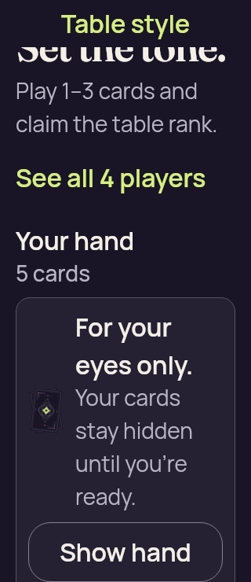
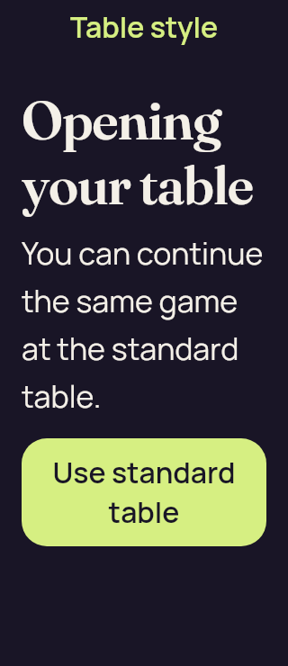
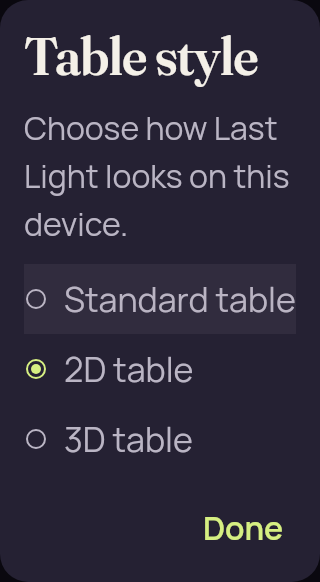
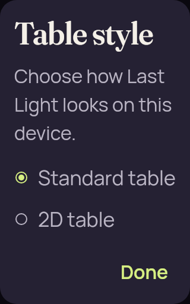

# Compose presentation controls — 200% layout fixtures

[All screenshot collections](../README.md)

**Evidence status:** Two retained UI cases pass in **one actual Compose/Skia rendering execution**. Four original PNGs show available table styles, Opening and concealed fallback at 200% text. These are explicit JVM lifecycle fixtures with real recipient-safe core views; no Android/iOS native factory is instantiated or qualified.

The test viewport is 320 × 740 at density 1.0 and font scale 2.0. Picker captures are cropped to the dialog semantic node; Opening and fallback capture the fixture root without the unchanged outer game header. The exact local whole-tree capture commit was not recorded. [Original provenance](provenance.json) preserves source hashes and the test timestamp, `2026-09-10T05:09:27.364Z`.

The picker only offers fixture-declared available modes. Both selector captures have complete option labels and Done. Opening shows the complete Use standard table action. The fallback is already scrolled: its heading is clipped above and Show hand's lower border is not fully visible, although the label is visible. It contains no private card face or label. The test also retains the same SessionView and pending action, clears selection, and requires a fresh selection before Play.

The [passing XML](iteration-02/test-results.xml) was recovered from Gradle's original test-task cache after another filtered invocation removed the shared report. That recovery did not render another screenshot set. [Original execution log](iteration-01/test.log) · [Recovery explanation](cache-report-recovery.txt) · [Exact fixture source](source/composeApp/src/jvmTest/kotlin/dev/partydeck/app/PresentationLayoutTest.kt).

Source: `/tmp/partydeck-common-presentation-ui`. Every thumbnail opens its unchanged original PNG.

| Original image | Scenario and provenance |
| --- | --- |
|  | **Scrolled Compose fallback with concealed hand** Compose/Skia JVM fixture, 320 × 740 test viewport, density 1.0 Original: [fallback-concealed-large-text.png](iteration-01/screenshots/fallback-concealed-large-text.png) 320 × 740 px; text 2× SHA-256: <code>12347fa731153e191e327d17c0a5c2721f08d11808d1fa8983dfce3887f9e183</code> Scrolled concealed hand fixture: Set the tone heading clipped above, Show hand label visible at bottom but lower border not fully visible. No private card face or label. Explicit presentation lifecycle and availability fixtures with real recipient-safe core views. No native factory is instantiated; the unchanged outer game header is omitted from this fixture. |
|  | **Opening fixture with complete Use standard table action** Compose/Skia JVM fixture, 320 × 740 test viewport, density 1.0 Original: [opening-large-text.png](iteration-01/screenshots/opening-large-text.png) 320 × 740 px; text 2× SHA-256: <code>809be09df87e6cd1fa2c939e75d99017f2e4a06a7636695ea330d3b86230d5da</code> Complete Opening your table message and Use standard table action. No cards are rendered. Explicit presentation lifecycle and availability fixtures with real recipient-safe core views. No native factory is instantiated; the unchanged outer game header is omitted from this fixture. |
|  | **Three available table styles at 200% text** Compose/Skia JVM fixture, 320 × 740 test viewport, density 1.0 Original: [picker-three-available-large-text.png](iteration-01/screenshots/picker-three-available-large-text.png) 320 × 582 px; text 2× SHA-256: <code>971dd17d5da80e6c6f2fd906e1f7c5627efa8cef0f4c990c999f7c4b89046ad4</code> Cropped dialog original; Standard, 2D, 3D and Done fit. 2D is selected. Explicit presentation lifecycle and availability fixtures with real recipient-safe core views. No native factory is instantiated; the unchanged outer game header is omitted from this fixture. |
|  | **Two available table styles at 200% text** Compose/Skia JVM fixture, 320 × 740 test viewport, density 1.0 Original: [picker-two-available-large-text.png](iteration-01/screenshots/picker-two-available-large-text.png) 320 × 512 px; text 2× SHA-256: <code>5f2567bd072ed09df534e5145554638043e6e9306b945d3d6191c8c90f2721b0</code> Cropped dialog original; Standard and 2D options and Done fit. No 3D option is present. Explicit presentation lifecycle and availability fixtures with real recipient-safe core views. No native factory is instantiated; the unchanged outer game header is omitted from this fixture. |
