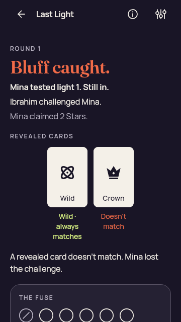
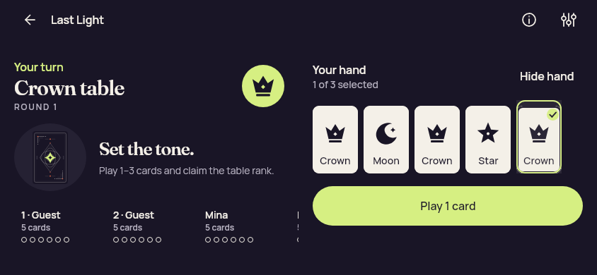
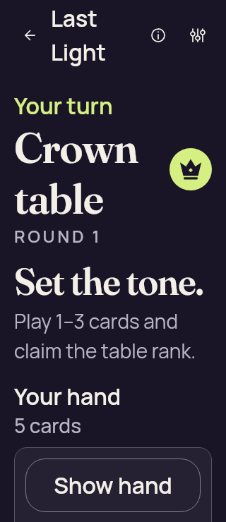
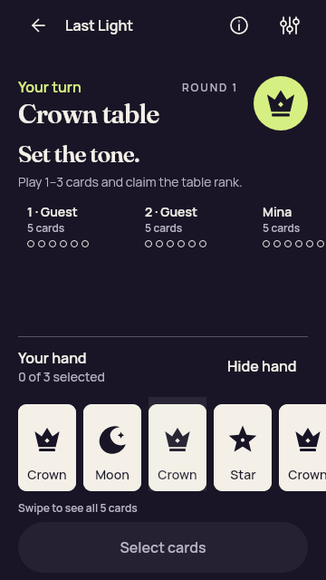
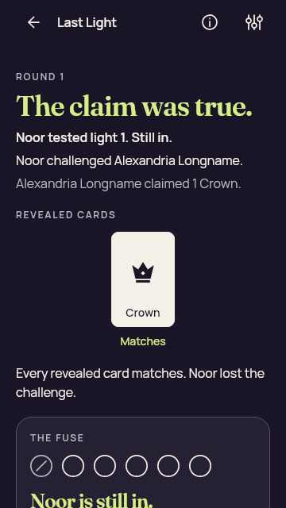
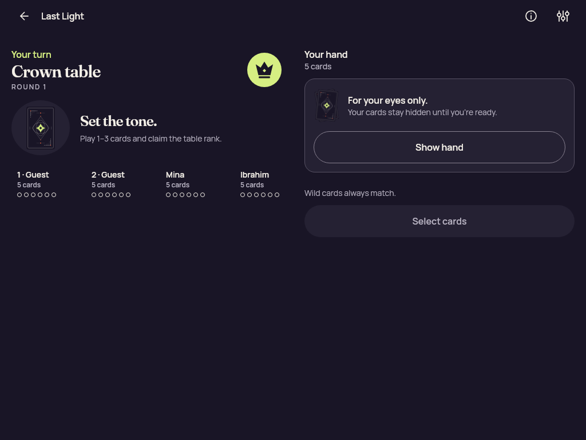
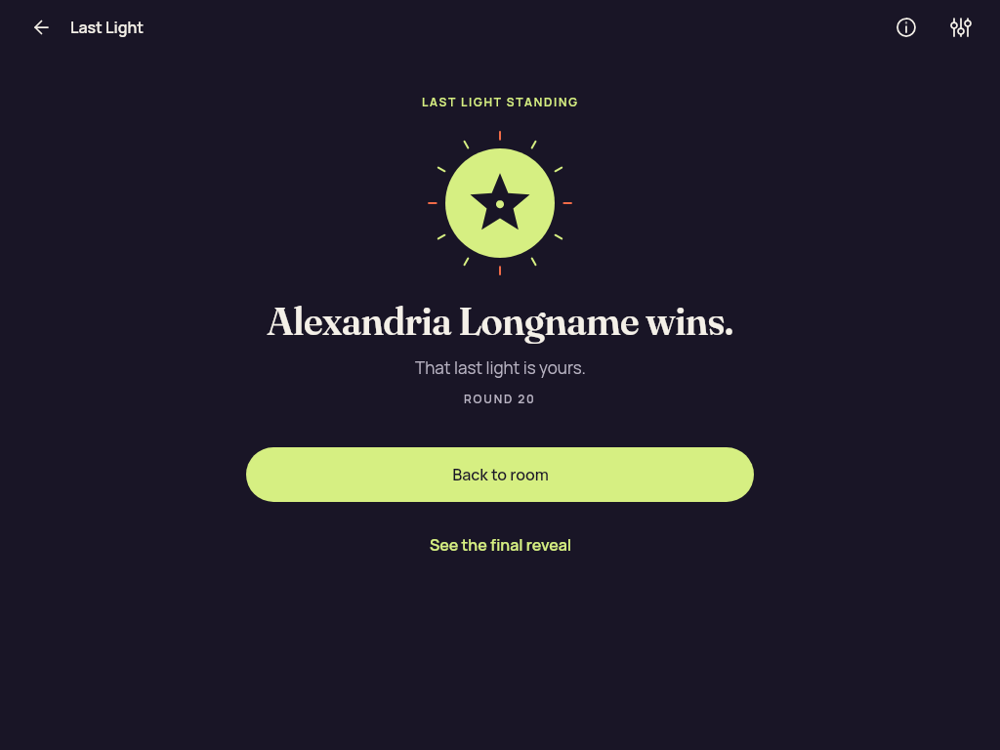

# Compose Standard large text — Final affected gameplay and presentation fixtures

Nine affected JVM cases pass, including six-seat reachability and selection retention. Three changed PNGs are peer reviewed; unchanged bytes do not imply prior pixel review.

Original capture count: **41**. Review methods: 37 preserved original; unviewed, 1 reviewed identical bytes; this identity not reopened, 3 attributed direct original view.

Source: JVM Compose; no PCK or native runtime. [Compare all four iterations](../README.md). [Original preservation manifest](manifest.json).

| Original JUnit suite | Tests | Failures | Errors |
| --- | ---: | ---: | ---: |
| [PresentationLayoutTest[jvm]](test-results/jvmTest/TEST-dev.partydeck.app.PresentationLayoutTest.xml) | 2 | 0 | 0 |
| [GameplayLayoutTest[jvm]](test-results/jvmTest/TEST-dev.partydeck.app.GameplayLayoutTest.xml) | 7 | 0 | 0 |

### game-bluff-with-wild

Original filename: `game-bluff-with-wild.png` · **360 × 640** · 31,335 bytes.

SHA-256: `52c54d147efe0328c4194122b2a7683a10f6f2c33712e897480662dc6dedec26`.

**Preserved original; unviewed.** Original JVM capture preserved without direct pixel review. Its filename and test evidence identify the fixture; no visual acceptance is asserted.

Source iteration: `affected-layout-final-passed`; source file mtime: `2026-09-10T22:39:57.311984+00:00`.

### game-choice-long-name

Original filename: `game-choice-long-name.png` · **360 × 640** · 36,840 bytes.

SHA-256: `336545c4fe06c1c43d1c85256ed7324da08266eadd3f430931ae27324b0247db`.

**Preserved original; unviewed.** Original JVM capture preserved without direct pixel review. Its filename and test evidence identify the fixture; no visual acceptance is asserted.

Source iteration: `affected-layout-final-passed`; source file mtime: `2026-09-10T22:39:55.201984+00:00`.

### game-forced-challenge

Original filename: `game-forced-challenge.png` · **360 × 640** · 38,983 bytes.

SHA-256: `daa1f2b113bc54db8e2f426b0f47f907bbdf214c58766e561e15beadc87fd44b`.

**Preserved original; unviewed.** Original JVM capture preserved without direct pixel review. Its filename and test evidence identify the fixture; no visual acceptance is asserted.

Source iteration: `affected-layout-final-passed`; source file mtime: `2026-09-10T22:39:57.204984+00:00`.

### game-landscape-concealed

Original filename: `game-landscape-concealed.png` · **844 × 390** · 39,059 bytes.

SHA-256: `c4617f711a9d3cca2f9f5f19af79d1608129620faf7c2ce55ed854c531295035`.

**Preserved original; unviewed.** Original JVM capture preserved without direct pixel review. Its filename and test evidence identify the fixture; no visual acceptance is asserted.

Source iteration: `affected-layout-final-passed`; source file mtime: `2026-09-10T22:39:51.011985+00:00`.

### game-landscape-eliminated

Original filename: `game-landscape-eliminated.png` · **844 × 390** · 36,120 bytes.

SHA-256: `8350390017d78e84decadc825a8cec5fcc523dce6b4e62019094d256ca788b53`.

**Preserved original; unviewed.** Original JVM capture preserved without direct pixel review. Its filename and test evidence identify the fixture; no visual acceptance is asserted.

Source iteration: `affected-layout-final-passed`; source file mtime: `2026-09-10T22:39:52.483984+00:00`.

### game-landscape-hand

Original filename: `game-landscape-hand.png` · **844 × 390** · 33,717 bytes.

SHA-256: `842fcd1839c0d05dfec387bff88921877d1bc49eecb80c9a3d63322bfb61d273`.

**Preserved original; unviewed.** Original JVM capture preserved without direct pixel review. Its filename and test evidence identify the fixture; no visual acceptance is asserted.

Source iteration: `affected-layout-final-passed`; source file mtime: `2026-09-10T22:39:51.236984+00:00`.

### game-landscape-previous-proof

Original filename: `game-landscape-previous-proof.png` · **844 × 390** · 31,791 bytes.

SHA-256: `059ba1a8ed8340fc4c45a44abb0d023c756687db18daa26ab929ca7bc1a53418`.

**Preserved original; unviewed.** Original JVM capture preserved without direct pixel review. Its filename and test evidence identify the fixture; no visual acceptance is asserted.

Source iteration: `affected-layout-final-passed`; source file mtime: `2026-09-10T22:39:52.281985+00:00`.

### game-landscape-previous-reveal

Original filename: `game-landscape-previous-reveal.png` · **844 × 390** · 36,971 bytes.

SHA-256: `565ea5890c5330d7de4e0040ad8981a697f33f7327d566bd5b8671df3deb9fb7`.

**Preserved original; unviewed.** Original JVM capture preserved without direct pixel review. Its filename and test evidence identify the fixture; no visual acceptance is asserted.

Source iteration: `affected-layout-final-passed`; source file mtime: `2026-09-10T22:39:52.202985+00:00`.

### game-landscape-round-result

Original filename: `game-landscape-round-result.png` · **844 × 390** · 20,935 bytes.

SHA-256: `280668abaf08fa9bc3f97a42fac67ffc15b892a48f6cd09f949df7b39c3454d2`.

**Preserved original; unviewed.** Original JVM capture preserved without direct pixel review. Its filename and test evidence identify the fixture; no visual acceptance is asserted.

Source iteration: `affected-layout-final-passed`; source file mtime: `2026-09-10T22:39:51.796984+00:00`.

### game-landscape-selected

Original filename: `game-landscape-selected.png` · **844 × 390** · 36,046 bytes.

SHA-256: `f6fcf73f097293cf19966d8c4779e02b5d020f34015b36ba1abb09c21eb8d176`.

**Preserved original; unviewed.** Original JVM capture preserved without direct pixel review. Its filename and test evidence identify the fixture; no visual acceptance is asserted.

Source iteration: `affected-layout-final-passed`; source file mtime: `2026-09-10T22:39:51.397985+00:00`.

### game-landscape-winner

Original filename: `game-landscape-winner.png` · **844 × 390** · 23,671 bytes.

SHA-256: `047656f4f92d2a73a1d65cca1f91e8209fe775a6217b962796f2335ddb230a92`.

**Preserved original; unviewed.** Original JVM capture preserved without direct pixel review. Its filename and test evidence identify the fixture; no visual acceptance is asserted.

Source iteration: `affected-layout-final-passed`; source file mtime: `2026-09-10T22:39:52.543984+00:00`.

### game-large-text-concealed

Original filename: `game-large-text-concealed.png` · **320 × 740** · 34,908 bytes.

SHA-256: `8d016ff7797c9dd3bb8fe79f346b2f2e9d72038a590ce797b3457d45afe04841`.

**[Attributed direct original view (`/root/ui_shell`)](../provenance/ui-shell-final/direct-view-delta.json).** Show hand is visible inside its panel below Your hand and 5 cards. Turn/rank and open-round instructions remain in their previous positions. Explanatory content now follows the control below the viewport; no private card faces are visible.

Scroll context: `initial_unscrolled`.

Source iteration: `affected-layout-final-passed`; source file mtime: `2026-09-10T22:39:52.809984+00:00`.

### game-large-text-eliminated

Original filename: `game-large-text-eliminated.png` · **320 × 740** · 40,416 bytes.

SHA-256: `03025ea93b89cad9f70507011255a0d8961d781bf68c3f43bb68dae927aa16c0`.

**Preserved original; unviewed.** Original JVM capture preserved without direct pixel review. Its filename and test evidence identify the fixture; no visual acceptance is asserted.

Source iteration: `affected-layout-final-passed`; source file mtime: `2026-09-10T22:39:54.846984+00:00`.

### game-large-text-hand

Original filename: `game-large-text-hand.png` · **320 × 740** · 36,066 bytes.

SHA-256: `cda148e79a17289ac421f5b6bb39b05857dd9f2d13c8222d898d0e8c9d4b021c`.

**[Attributed direct original view (`/root/ui_shell`)](../provenance/ui-shell-final/direct-view-delta.json).** The viewport retains current public context, hand count/selection status and a clear Hide hand control. Only the top of the first large card row appears at the bottom; the rest remain available through vertical scrolling. The helper accepts a visible intersection, so this capture no longer inherits the older long scroll needed to reach Reveal. It is not an all-cards-visible claim.

Scroll context: `after_reveal_and_existing_bring_into_view_helper`.

Source iteration: `affected-layout-final-passed`; source file mtime: `2026-09-10T22:39:52.867985+00:00`.

### game-large-text-previous-proof

Original filename: `game-large-text-previous-proof.png` · **320 × 740** · 33,078 bytes.

SHA-256: `9e37d0764b37de09b152d291106f5e854ebc07e684f5568d2ca5d10e2c7d6e81`.

**Preserved original; unviewed.** Original JVM capture preserved without direct pixel review. Its filename and test evidence identify the fixture; no visual acceptance is asserted.

Source iteration: `affected-layout-final-passed`; source file mtime: `2026-09-10T22:39:54.561984+00:00`.

### game-large-text-previous-reveal

Original filename: `game-large-text-previous-reveal.png` · **320 × 740** · 34,558 bytes.

SHA-256: `10f675de2148fd13be34a8967fbeeb456dbe353f7e34769a764978ef0056b045`.

**Preserved original; unviewed.** Original JVM capture preserved without direct pixel review. Its filename and test evidence identify the fixture; no visual acceptance is asserted.

Source iteration: `affected-layout-final-passed`; source file mtime: `2026-09-10T22:39:54.440984+00:00`.

### game-large-text-round-result

Original filename: `game-large-text-round-result.png` · **320 × 740** · 32,581 bytes.

SHA-256: `fa176a0d9d5ddbb91ed9ca93c74b1c3cb174e6d1fc9b8060be6ed33fbd02b2cd`.

**Preserved original; unviewed.** Original JVM capture preserved without direct pixel review. Its filename and test evidence identify the fixture; no visual acceptance is asserted.

Source iteration: `affected-layout-final-passed`; source file mtime: `2026-09-10T22:39:53.998984+00:00`.

### game-large-text-selected

Original filename: `game-large-text-selected.png` · **320 × 740** · 30,298 bytes.

SHA-256: `7ff0c7afaf38fb337cb92968c69d196bac4b3eef2c777996d752e0afb1358db5`.

**[Reviewed identical bytes; this identity not reopened (`/root/ui_shell`)](../provenance/ui-shell-final/direct-view-delta.json).** Captured after scrolling to and selecting the fifth card. The count reads 1 of 3 selected and the selected card has a check mark; Hide hand remains visible. The public instruction tail is clipped at the scroll viewport top as expected for this captured scroll position.

Reviewed representative: [game-large-text-selected.png](../passed-focused-tests/ui-snapshots/game-large-text-selected.png). The original identity and timestamp above remain separate.

Scroll context: `after_selection_and_scroll`.

Source iteration: `affected-layout-final-passed`; source file mtime: `2026-09-10T22:39:53.039984+00:00`.

### game-large-text-winner

Original filename: `game-large-text-winner.png` · **320 × 740** · 26,744 bytes.

SHA-256: `7088f1c112b973c7af042071828683669f725ab967be9533ae1ecd1ca7542fb0`.

**Preserved original; unviewed.** Original JVM capture preserved without direct pixel review. Its filename and test evidence identify the fixture; no visual acceptance is asserted.

Source iteration: `affected-layout-final-passed`; source file mtime: `2026-09-10T22:39:54.886984+00:00`.

### game-phone-concealed

Original filename: `game-phone-concealed.png` · **360 × 640** · 32,137 bytes.

SHA-256: `c42fd7ac3fcfcb9d1ccb32ff7a54fd5bdbeb458a116a055f4cb231e531e5175c`.

**Preserved original; unviewed.** Original JVM capture preserved without direct pixel review. Its filename and test evidence identify the fixture; no visual acceptance is asserted.

Source iteration: `affected-layout-final-passed`; source file mtime: `2026-09-10T22:39:57.369984+00:00`.

### game-phone-eliminated

Original filename: `game-phone-eliminated.png` · **360 × 640** · 33,538 bytes.

SHA-256: `357bd5af2fc4df311f432ae43cb61fd6341b7a40e61edddd1aa400c47885af86`.

**Preserved original; unviewed.** Original JVM capture preserved without direct pixel review. Its filename and test evidence identify the fixture; no visual acceptance is asserted.

Source iteration: `affected-layout-final-passed`; source file mtime: `2026-09-10T22:39:58.276984+00:00`.

### game-phone-hand

Original filename: `game-phone-hand.png` · **360 × 640** · 31,920 bytes.

SHA-256: `67f918bfee91987f415e97c09949e4eebdef4d0a6c98e775ee8a6092dddad0ba`.

**Preserved original; unviewed.** Original JVM capture preserved without direct pixel review. Its filename and test evidence identify the fixture; no visual acceptance is asserted.

Source iteration: `affected-layout-final-passed`; source file mtime: `2026-09-10T22:39:57.435984+00:00`.

### game-phone-previous-proof

Original filename: `game-phone-previous-proof.png` · **360 × 640** · 29,597 bytes.

SHA-256: `7ed6c3bdd8eac370c872f852bb3de73491f0644c5e47f0cf41acf2bce4d1eb7b`.

**Preserved original; unviewed.** Original JVM capture preserved without direct pixel review. Its filename and test evidence identify the fixture; no visual acceptance is asserted.

Source iteration: `affected-layout-final-passed`; source file mtime: `2026-09-10T22:39:58.118984+00:00`.

### game-phone-previous-reveal

Original filename: `game-phone-previous-reveal.png` · **360 × 640** · 35,127 bytes.

SHA-256: `a040e64e25737e3d0b04ae60c3e0bea38c9cc79c9e2a4d01c5a19409ee967811`.

**Preserved original; unviewed.** Original JVM capture preserved without direct pixel review. Its filename and test evidence identify the fixture; no visual acceptance is asserted.

Source iteration: `affected-layout-final-passed`; source file mtime: `2026-09-10T22:39:58.052984+00:00`.

### game-phone-round-result

Original filename: `game-phone-round-result.png` · **360 × 640** · 31,078 bytes.

SHA-256: `ed44bac4453e2118c6c78362a306c732139ba2da3228931ce8d66096f32141be`.

**Preserved original; unviewed.** Original JVM capture preserved without direct pixel review. Its filename and test evidence identify the fixture; no visual acceptance is asserted.

Source iteration: `affected-layout-final-passed`; source file mtime: `2026-09-10T22:39:57.792984+00:00`.

### game-phone-selected

Original filename: `game-phone-selected.png` · **360 × 640** · 32,573 bytes.

SHA-256: `6e0ebcc7856b0386f99a9fbb243719dfe68da0fe4fdbdb4d97f9ab8a70638a6d`.

**Preserved original; unviewed.** Original JVM capture preserved without direct pixel review. Its filename and test evidence identify the fixture; no visual acceptance is asserted.

Source iteration: `affected-layout-final-passed`; source file mtime: `2026-09-10T22:39:57.559984+00:00`.

### game-phone-winner

Original filename: `game-phone-winner.png` · **360 × 640** · 24,841 bytes.

SHA-256: `be63e9b3011dacad3811f44ad0c51f23421751ee0c6e62431118e8f887b5b24f`.

**Preserved original; unviewed.** Original JVM capture preserved without direct pixel review. Its filename and test evidence identify the fixture; no visual acceptance is asserted.

Source iteration: `affected-layout-final-passed`; source file mtime: `2026-09-10T22:39:58.314984+00:00`.

### game-selection-limit

Original filename: `game-selection-limit.png` · **360 × 640** · 38,507 bytes.

SHA-256: `2a473e93b9476c473720e5f592acd38af7f8001beefb65eb905be45ff0d71491`.

**Preserved original; unviewed.** Original JVM capture preserved without direct pixel review. Its filename and test evidence identify the fixture; no visual acceptance is asserted.

Source iteration: `affected-layout-final-passed`; source file mtime: `2026-09-10T22:39:55.534984+00:00`.

### game-tablet-concealed

Original filename: `game-tablet-concealed.png` · **1024 × 768** · 45,833 bytes.

SHA-256: `47dee65cec7a47fc8102cf424abcce5cd89b88adf9679a9fd3a7d9e2fe6a6c74`.

**Preserved original; unviewed.** Original JVM capture preserved without direct pixel review. Its filename and test evidence identify the fixture; no visual acceptance is asserted.

Source iteration: `affected-layout-final-passed`; source file mtime: `2026-09-10T22:39:55.733984+00:00`.

### game-tablet-eliminated

Original filename: `game-tablet-eliminated.png` · **1024 × 768** · 43,026 bytes.

SHA-256: `4d5ef9dbcaa425ca9d8e65e21c7959f3ecc6f16c333c53b911b62f4a88e0f626`.

**Preserved original; unviewed.** Original JVM capture preserved without direct pixel review. Its filename and test evidence identify the fixture; no visual acceptance is asserted.

Source iteration: `affected-layout-final-passed`; source file mtime: `2026-09-10T22:39:56.867984+00:00`.

### game-tablet-hand

Original filename: `game-tablet-hand.png` · **1024 × 768** · 40,436 bytes.

SHA-256: `46141180fac62120c37f0dc9dab09998a5ffcf2be518bf665602ca4249899316`.

**Preserved original; unviewed.** Original JVM capture preserved without direct pixel review. Its filename and test evidence identify the fixture; no visual acceptance is asserted.

Source iteration: `affected-layout-final-passed`; source file mtime: `2026-09-10T22:39:55.822984+00:00`.

### game-tablet-previous-proof

Original filename: `game-tablet-previous-proof.png` · **1024 × 768** · 60,400 bytes.

SHA-256: `6208be7a02f3a18e50f6e8ae1843f1684f1fea02367c5238136291243c0cce47`.

**Preserved original; unviewed.** Original JVM capture preserved without direct pixel review. Its filename and test evidence identify the fixture; no visual acceptance is asserted.

Source iteration: `affected-layout-final-passed`; source file mtime: `2026-09-10T22:39:56.705984+00:00`.

### game-tablet-previous-reveal

Original filename: `game-tablet-previous-reveal.png` · **1024 × 768** · 60,400 bytes.

SHA-256: `6208be7a02f3a18e50f6e8ae1843f1684f1fea02367c5238136291243c0cce47`.

**Preserved original; unviewed.** Original JVM capture preserved without direct pixel review. Its filename and test evidence identify the fixture; no visual acceptance is asserted.

Source iteration: `affected-layout-final-passed`; source file mtime: `2026-09-10T22:39:56.585984+00:00`.

### game-tablet-round-result

Original filename: `game-tablet-round-result.png` · **1024 × 768** · 44,741 bytes.

SHA-256: `678098f3294c1a823112e6d0224e26ddac92cf9bd9a94937c02527d48af0e0ad`.

**Preserved original; unviewed.** Original JVM capture preserved without direct pixel review. Its filename and test evidence identify the fixture; no visual acceptance is asserted.

Source iteration: `affected-layout-final-passed`; source file mtime: `2026-09-10T22:39:56.295984+00:00`.

### game-tablet-selected

Original filename: `game-tablet-selected.png` · **1024 × 768** · 42,445 bytes.

SHA-256: `8703e47cc3baa4da82e6c29d88df3ac5e3021a29f37c5f2d6159a5cc14eee6ba`.

**Preserved original; unviewed.** Original JVM capture preserved without direct pixel review. Its filename and test evidence identify the fixture; no visual acceptance is asserted.

Source iteration: `affected-layout-final-passed`; source file mtime: `2026-09-10T22:39:55.961984+00:00`.

### game-tablet-winner

Original filename: `game-tablet-winner.png` · **1024 × 768** · 28,593 bytes.

SHA-256: `a14740d1fae23f0a102959ff7d323ff2ac0aaedb828b1d6683cd8b114afbd94d`.

**Preserved original; unviewed.** Original JVM capture preserved without direct pixel review. Its filename and test evidence identify the fixture; no visual acceptance is asserted.

Source iteration: `affected-layout-final-passed`; source file mtime: `2026-09-10T22:39:56.943984+00:00`.

### game-three-selected

Original filename: `game-three-selected.png` · **360 × 640** · 38,592 bytes.

SHA-256: `563fe35f3e5e29459309f308b2fd1dcd733e46fa3a604de7507e96cf629c59c6`.

**Preserved original; unviewed.** Original JVM capture preserved without direct pixel review. Its filename and test evidence identify the fixture; no visual acceptance is asserted.

Source iteration: `affected-layout-final-passed`; source file mtime: `2026-09-10T22:39:55.442984+00:00`.

### fallback-concealed-large-text

Original filename: `fallback-concealed-large-text.png` · **320 × 740** · 34,977 bytes.

SHA-256: `d6eaccff405da4d6bfbad52864329549a0705b30bb56b4ef36c8065d375539ab`.

**[Attributed direct original view (`/root/ui_shell`)](../provenance/ui-shell-final/direct-view-delta.json).** The full Show hand pill is visible with the current turn/rank and hand title/count above it. Explanatory copy follows below the button. The test invoked ScrollTo before capturing, so this picture is not used for natural-visibility acceptance.

Scroll context: `after_explicit_performScrollTo_on_reveal`.

Source iteration: `affected-layout-final-passed`; source file mtime: `2026-09-10T22:39:59.339984+00:00`.

### opening-large-text

Original filename: `opening-large-text.png` · **320 × 740** · 31,278 bytes.

SHA-256: `80ecde376374f864b361d321917d597dee02a2331f0c8d90f03eaabbf82023e8`.

**Preserved original; unviewed.** Original JVM capture preserved without direct pixel review. Its filename and test evidence identify the fixture; no visual acceptance is asserted.

Source iteration: `affected-layout-final-passed`; source file mtime: `2026-09-10T22:39:59.278984+00:00`.

### picker-three-available-large-text

Original filename: `picker-three-available-large-text.png` · **320 × 740** · 35,231 bytes.

SHA-256: `2ac10590f102dd755d2d2a7f3b96db84b5db8db339a9fc76f66aeff94176556d`.

**Preserved original; unviewed.** Original JVM capture preserved without direct pixel review. Its filename and test evidence identify the fixture; no visual acceptance is asserted.

Source iteration: `affected-layout-final-passed`; source file mtime: `2026-09-10T22:40:00.321984+00:00`.

### picker-two-available-large-text

Original filename: `picker-two-available-large-text.png` · **320 × 740** · 36,821 bytes.

SHA-256: `b48bd70894b6051980603e783a36f89cefe8a47deb198360b31fe53dff4ee97b`.

**Preserved original; unviewed.** Original JVM capture preserved without direct pixel review. Its filename and test evidence identify the fixture; no visual acceptance is asserted.

Source iteration: `affected-layout-final-passed`; source file mtime: `2026-09-10T22:39:59.931984+00:00`.
