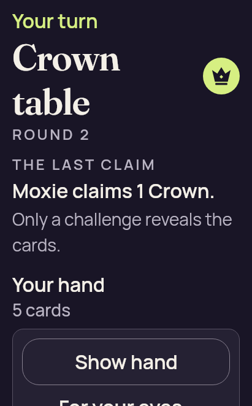

# Compose Standard large text — Natural visibility — corrected pass

Both strict no-scroll fixtures pass. The genuine Show hand control fits below the hand title/count; the explanatory illustration follows it.

Original capture count: **2**. Review methods: 1 reviewed identical bytes; this identity not reopened, 1 attributed direct original view.

Source: JVM Compose; no PCK or native runtime. [Compare all four iterations](../README.md). [Original preservation manifest](manifest.json).

| Original JUnit suite | Tests | Failures | Errors |
| --- | ---: | ---: | ---: |
| [StandardReturnLayoutTest[jvm]](test-results/jvmTest/TEST-dev.partydeck.app.StandardReturnLayoutTest.xml) | 2 | 0 | 0 |

### returned-concealed

Original filename: `returned-concealed.png` · **411 × 662** · 35,137 bytes.

SHA-256: `3e4e4ab066a72ec9aa5d2acad03f6dedef94cb17d963cdfa389c773dca02b9ea`.

**[Reviewed identical bytes; this identity not reopened (`/root/ui_shell`)](../provenance/ui-shell-passed/direct-views.json).** Genuine Show hand is fully inside the large-text viewport below Your hand and 5 cards. Turn/rank/current claim stay visible above it. The illustration and explanatory copy follow the control and continue below the viewport in the same scroll flow. No private card face is shown.

Reviewed representative: [fresh-concealed.png](ui-snapshots/standard-return-font2-8789779573886536011/fresh-concealed.png). The original identity and timestamp above remain separate.

Scroll context: `no scroll, tap or focus operation before capture`.

Source iteration: `fixture-passed-v3`; source file mtime: `2026-09-10T22:34:36.327003+00:00`.

### fresh-concealed

Original filename: `fresh-concealed.png` · **411 × 662** · 35,137 bytes.

SHA-256: `3e4e4ab066a72ec9aa5d2acad03f6dedef94cb17d963cdfa389c773dca02b9ea`.

**[Attributed direct original view (`/root/ui_shell`)](../provenance/ui-shell-passed/direct-views.json).** Genuine Show hand is fully inside the large-text viewport below Your hand and 5 cards. Turn/rank/current claim stay visible above it. The illustration and explanatory copy follow the control and continue below the viewport in the same scroll flow. No private card face is shown.

Scroll context: `no scroll, tap or focus operation before capture`.

Source iteration: `fixture-passed-v3`; source file mtime: `2026-09-10T22:34:36.453003+00:00`.
