# Android debug

Actual standard API 35 emulator, 720 x 1600 at 280 dpi, CI run 34413839964, source 09f35a5891f3912e22b4f8ced7907fe9e945b416. This run failed later at 200% text invitation focus; individual captures do not establish full runtime acceptance.

Click an image for full resolution. Use the displayed filename when giving feedback.

| Preview | Image |
| --- | --- |
| [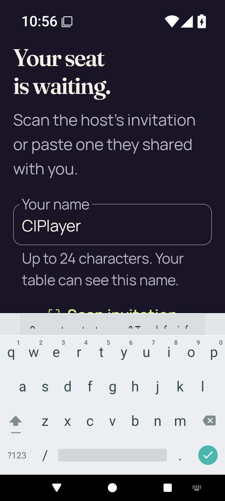](final-screen.png) | [final-screen.png](final-screen.png) 720 × 1600 |
|  | [home.png](home.png) 720 × 1600 |
| [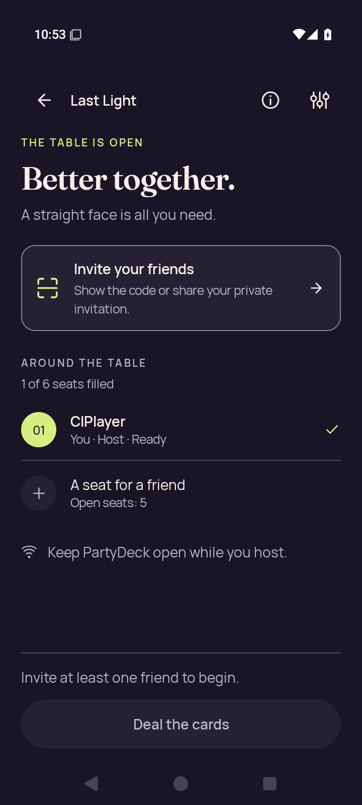](host-after-share.png) | [host-after-share.png](host-after-share.png) 720 × 1600 |
|  | [host-lobby.png](host-lobby.png) 720 × 1600 |
|  | [host-returned-home.png](host-returned-home.png) 720 × 1600 |
| [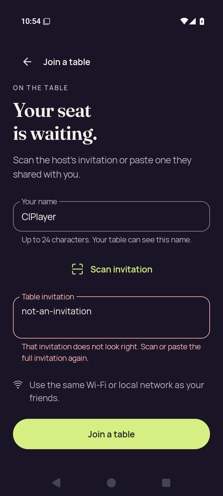](join-invalid.png) | [join-invalid.png](join-invalid.png) 720 × 1600 |
| [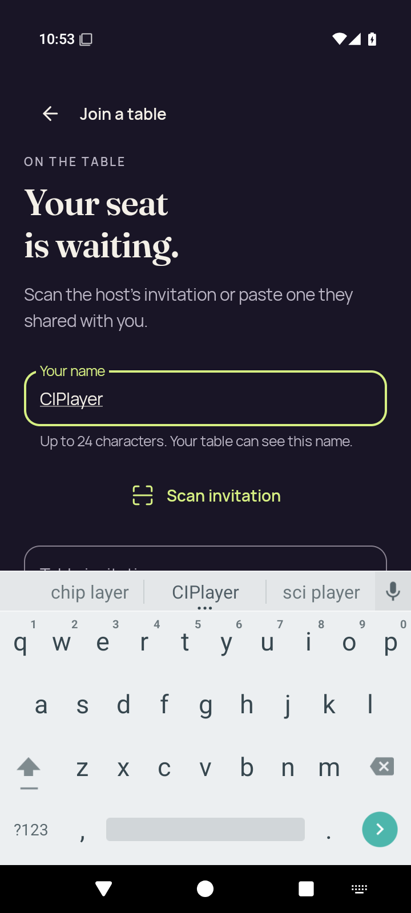](join-name-soft-ime.png) | [join-name-soft-ime.png](join-name-soft-ime.png) 720 × 1600 |
| [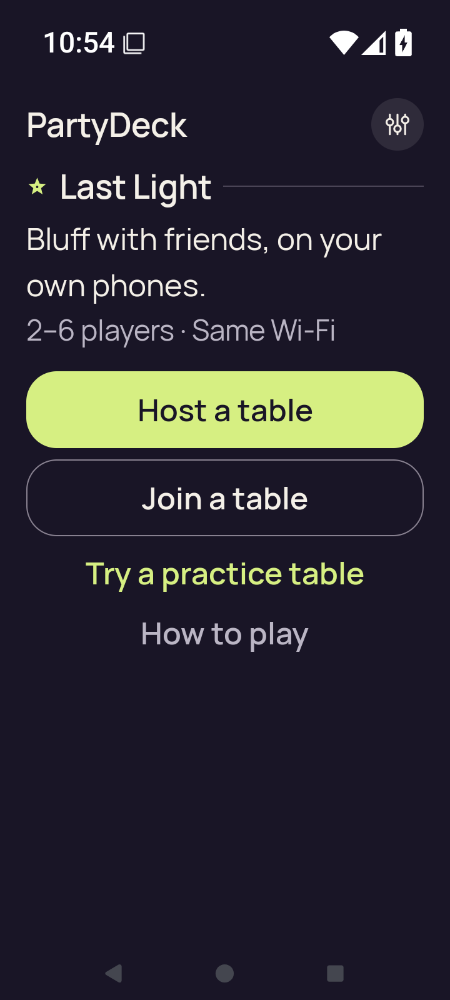](large-text-home-actions.png) | [large-text-home-actions.png](large-text-home-actions.png) 720 × 1600 |
| [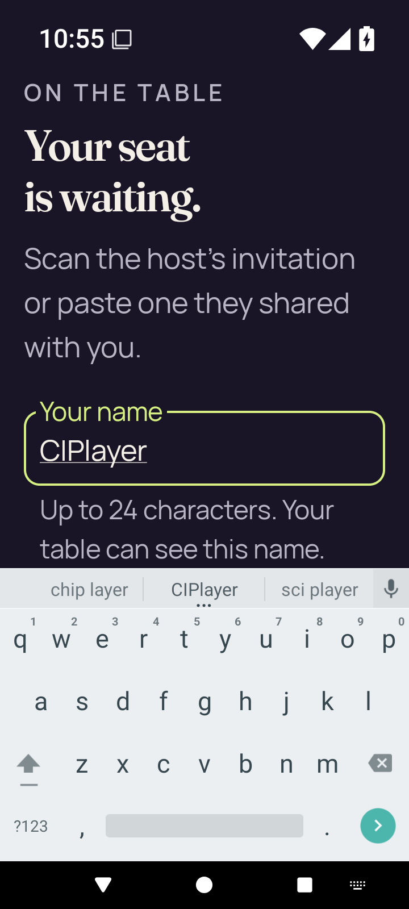](large-text-join-name-soft-ime.png) | [large-text-join-name-soft-ime.png](large-text-join-name-soft-ime.png) 720 × 1600 |
| [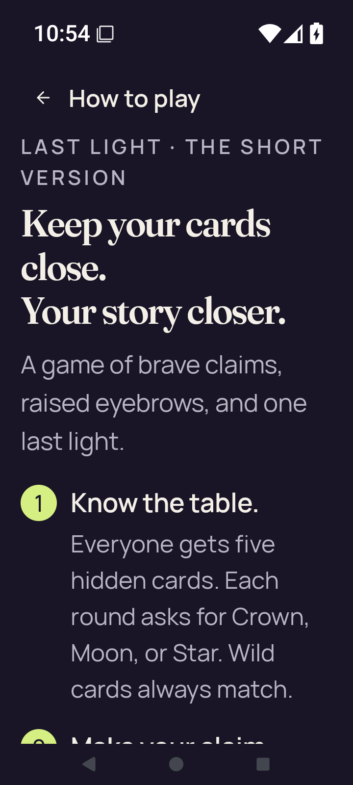](large-text-rules-intro.png) | [large-text-rules-intro.png](large-text-rules-intro.png) 720 × 1600 |
| [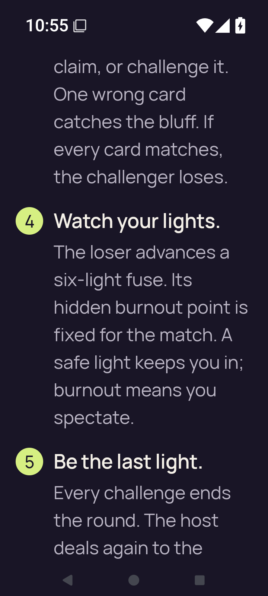](large-text-rules-last-step.png) | [large-text-rules-last-step.png](large-text-rules-last-step.png) 720 × 1600 |
| [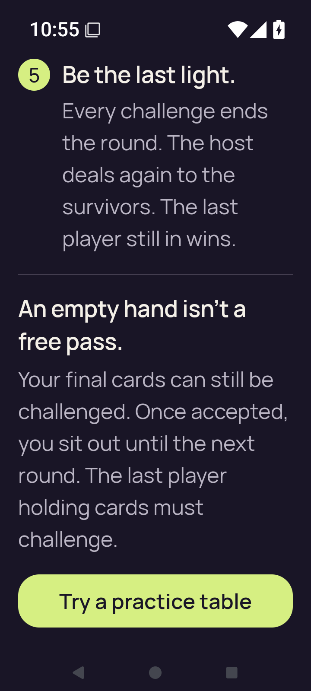](large-text-rules-practice-action.png) | [large-text-rules-practice-action.png](large-text-rules-practice-action.png) 720 × 1600 |
| [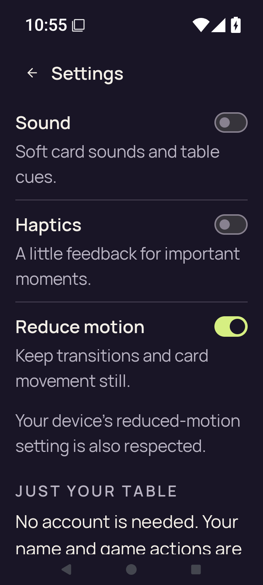](large-text-settings.png) | [large-text-settings.png](large-text-settings.png) 720 × 1600 |
| [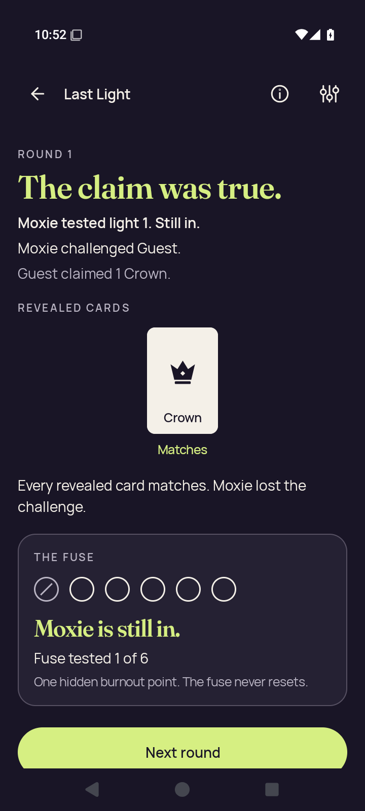](practice-after-play.png) | [practice-after-play.png](practice-after-play.png) 720 × 1600 |
|  | [practice-concealed.png](practice-concealed.png) 720 × 1600 |
| [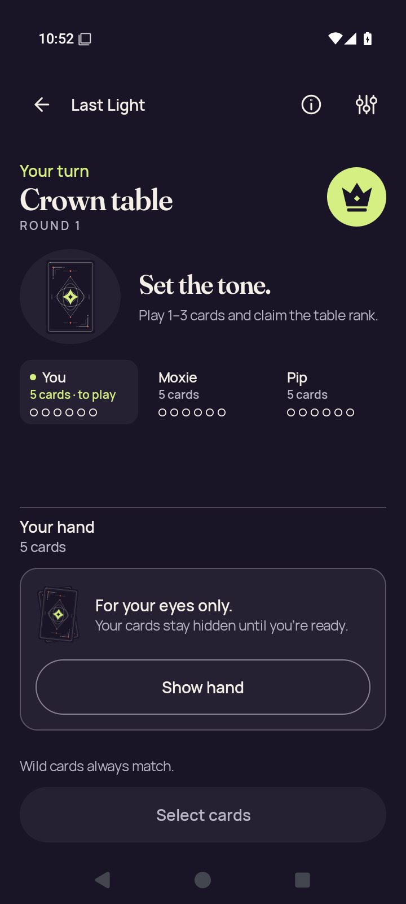](practice-resumed-concealed.png) | [practice-resumed-concealed.png](practice-resumed-concealed.png) 720 × 1600 |
| [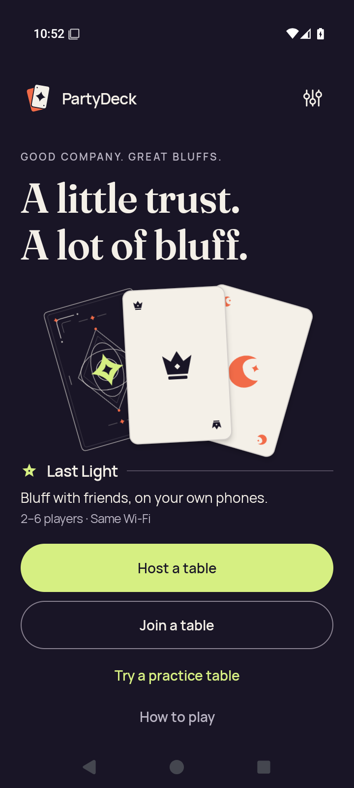](practice-returned-home.png) | [practice-returned-home.png](practice-returned-home.png) 720 × 1600 |
| [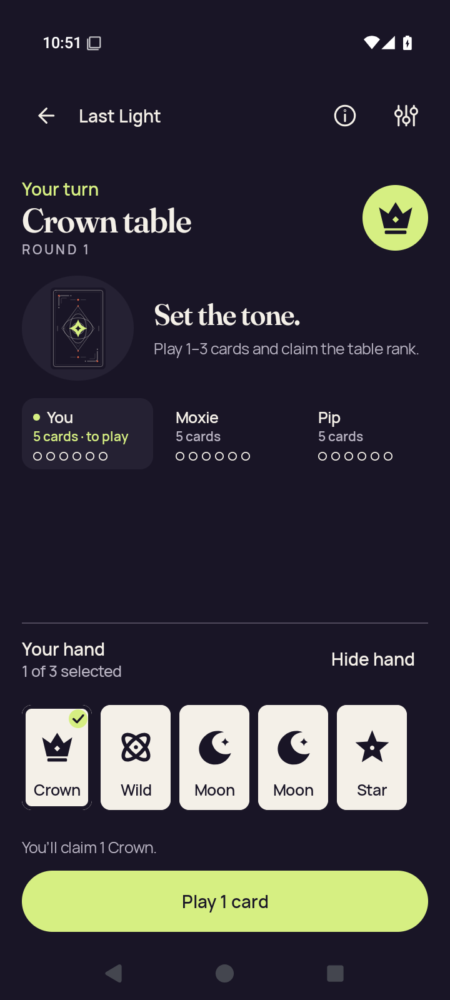](practice-selected.png) | [practice-selected.png](practice-selected.png) 720 × 1600 |
| [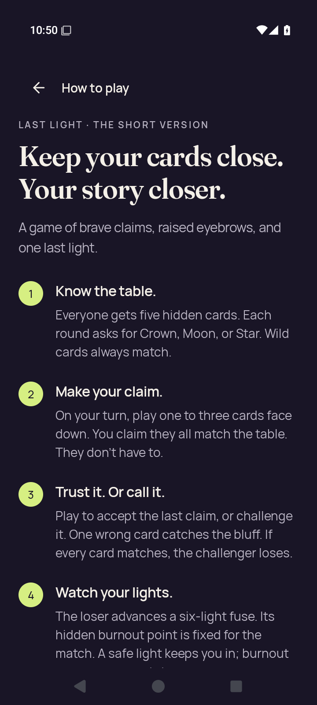](rules-intro.png) | [rules-intro.png](rules-intro.png) 720 × 1600 |
| [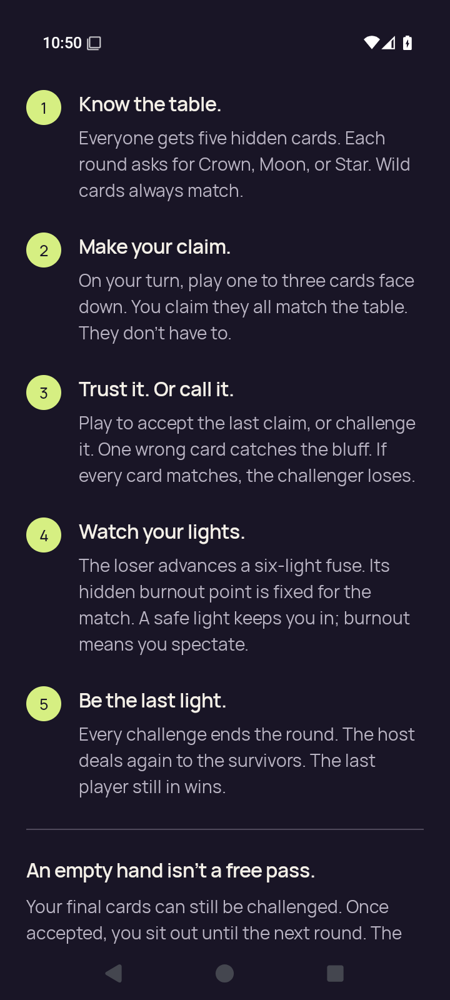](rules-last-step.png) | [rules-last-step.png](rules-last-step.png) 720 × 1600 |
| [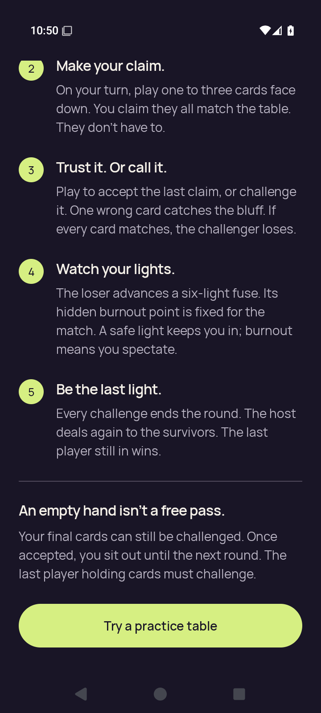](rules-practice-action.png) | [rules-practice-action.png](rules-practice-action.png) 720 × 1600 |
| [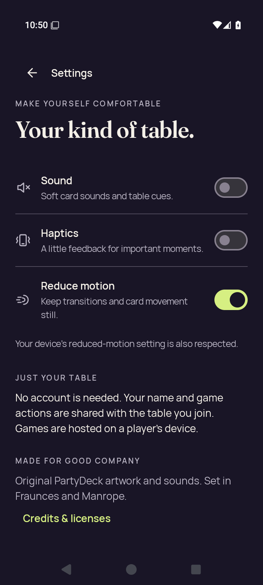](settings-changed.png) | [settings-changed.png](settings-changed.png) 720 × 1600 |
|  | [settings-persisted.png](settings-persisted.png) 720 × 1600 |
|  | [settings-return-home.png](settings-return-home.png) 720 × 1600 |
