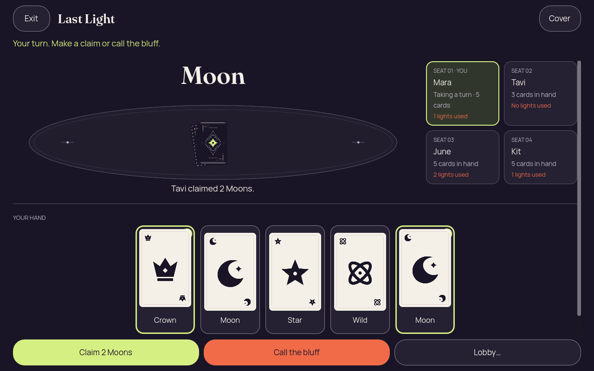
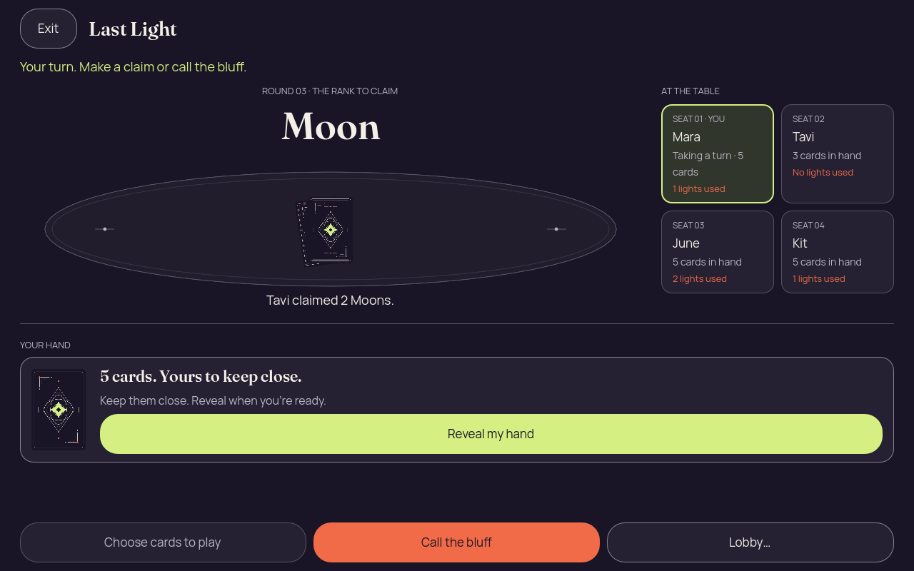

# Godot 2D first iteration

Actual Godot 4.7.2 desktop rendering at 1280 x 800 using OpenGL Compatibility/llvmpipe. A synthetic recipient-safe structural design fixture was used for this early layout/input check. This does not yet establish the Kotlin authority round trip or native mobile acceptance.

Click an image for full resolution. Use the displayed filename when giving feedback.

| Preview | Image |
| --- | --- |
|  | [01-concealed.png](01-concealed.png) 1280 × 800 |
|  | [02-revealed-selected.png](02-revealed-selected.png) 1280 × 800 |
|  | [03-covered-again.png](03-covered-again.png) 1280 × 800 |
|  | [04-resumed-covered.png](04-resumed-covered.png) 1280 × 800 |
