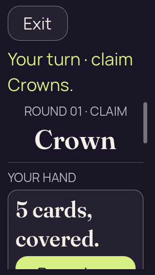
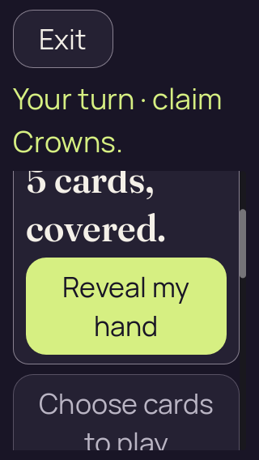
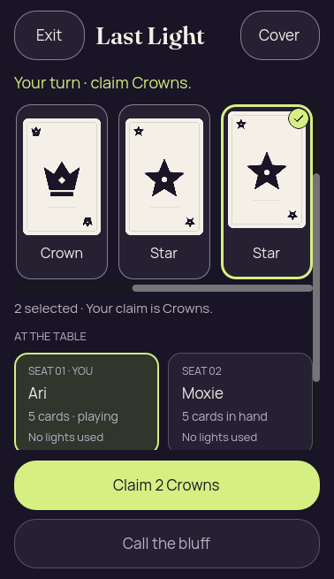

# 2D compact initial Reveal — root packed checks

[All collections](../README.md) · [Preserved evidence index](evidence-index.md) · [Copy/review binding](../android-34503251315/provenance/publication-review/partydeck-gallery-2815-publication-binding-v1.json) · [Completed visual review](provenance/publication-review/partydeck-gallery-after-2355-2d-packed-visual-review-v1.json)

**Both existing packed static fixture checks passed. Native qualification remains pending.**

Both recorded empty-project packed graphical checks pass: 378×655 text scale 1 and 320×568 text scale 2. All eight original PNG identities exactly match separately reviewed source-candidate pixels. No image was reopened for this match; execution/capture identities remain separate.

The integrated PCK is 557b2297bed133a433acc25efa4837462465dd4e06da659ae5a4cbd792f77fe0, 1,549,560 bytes with 136 entries. The 200% initial Reveal clipping and pre-input helper scrolling remain. Desktop packed fixtures establish no native qualification.

Source revision: `local changed-source fixture; exact whole-tree capture commit not asserted`. 8 original PNG identities. Review methods: 8 exact source-candidate byte match.

Every thumbnail opens the unchanged original PNG. Original filenames, dimensions, source paths and outcomes remain separate even when pixels match. No derivative image was created. Frozen provenance pages retain their original text and source references.

| Original capture | Original identity and evidence | Visual observation |
| --- | --- | --- |
|  <code>01-concealed.png</code> packed-check-320x568-text-2 — 01-concealed | 320 × 568 px · 34,818 bytes · text 2.0 SHA-256: <code>e4bfcd497b32883570b9b03621918c6546f5277c1b8587611500095ccbece418</code> Source: <code>/root/projects/PartyDeck/artifacts/evidence-storage/2d-initial-layout-root-validation-20260910/packed-check-320x568-text-2/01-concealed.png</code> [Capture/result JSON](packed-check-320x568-text-2/01-concealed.json) · [Original result](packed-check-320x568-text-2/report.json) · [Execution](packed-check-320x568-text-2/execution.json) | **Exact source-candidate byte match**. Exact bytes match the separately retained source candidate capture. Reused pixel observation: At 200%, Exit and wrapped Your turn · claim Crowns. fit. Round/rank Crown remains readable, followed by YOUR HAND and wrapped 5 cards, covered. Only the top of Reveal is at the lower viewport; its label and lower control portion are clipped. This is the unchanged enlarged-text initial layout. [Reviewed matching original](../godot-2d-initial-layout-source-20260910/results/source-input-320x568-text-2/01-concealed.png); original capture identity remains separate. |
|  <code>02-revealed-selected.png</code> packed-check-320x568-text-2 — 02-revealed-selected | 320 × 568 px · 24,924 bytes · text 2.0 SHA-256: <code>648bd6ae48a4a13930de74a957a060a61ca03b78b21637fdba6c3e2e764fd3b1</code> Source: <code>/root/projects/PartyDeck/artifacts/evidence-storage/2d-initial-layout-root-validation-20260910/packed-check-320x568-text-2/02-revealed-selected.png</code> [Capture/result JSON](packed-check-320x568-text-2/02-revealed-selected.json) · [Original result](packed-check-320x568-text-2/report.json) · [Execution](packed-check-320x568-text-2/execution.json) | **Exact source-candidate byte match**. Exact bytes match the separately retained source candidate capture. Reused pixel observation: At 200%, Exit/Cover and turn/claim fit. A complete selected Star has a bright outline/check and label; the neighboring Star is clipped on the left. The horizontal scrollbar is visible. Selection feedback and Play/lower controls lie below the viewport. [Reviewed matching original](../godot-2d-initial-layout-source-20260910/results/source-input-320x568-text-2/02-revealed-selected.png); original capture identity remains separate. |
|  <code>03-covered-again.png</code> packed-check-320x568-text-2 — 03-covered-again | 320 × 568 px · 35,213 bytes · text 2.0 SHA-256: <code>f800a6739e47c504720e1d4d9c72f5ca1076453d6c9a89e1d5408dd370d62546</code> Source: <code>/root/projects/PartyDeck/artifacts/evidence-storage/2d-initial-layout-root-validation-20260910/packed-check-320x568-text-2/03-covered-again.png</code> [Capture/result JSON](packed-check-320x568-text-2/03-covered-again.json) · [Original result](packed-check-320x568-text-2/report.json) · [Execution](packed-check-320x568-text-2/execution.json) | **Exact source-candidate byte match**. Exact bytes match the separately retained source candidate capture. Reused pixel observation: The scrolled enlarged cover shows full wrapped 5 cards, covered. and complete two-line Reveal my hand. Turn/claim remains visible. Choose cards begins below and is clipped; further lower action content is outside the viewport. No private card ranks are displayed. [Reviewed matching original](../godot-2d-initial-layout-source-20260910/results/source-input-320x568-text-2/03-covered-again.png); original capture identity remains separate. |
|  <code>04-resumed-covered.png</code> packed-check-320x568-text-2 — 04-resumed-covered | 320 × 568 px · 36,366 bytes · text 2.0 SHA-256: <code>9cc42987413e63c037df2ffe055a49a0f113a08574559bd81eb6e69fe491d2ca</code> Source: <code>/root/projects/PartyDeck/artifacts/evidence-storage/2d-initial-layout-root-validation-20260910/packed-check-320x568-text-2/04-resumed-covered.png</code> [Capture/result JSON](packed-check-320x568-text-2/04-resumed-covered.json) · [Original result](packed-check-320x568-text-2/report.json) · [Execution](packed-check-320x568-text-2/execution.json) | **Exact source-candidate byte match**. Exact bytes match the separately retained source candidate capture. Reused pixel observation: After resume at 200%, Exit and wrapped turn/claim remain visible. The scrolled covered-hand title starts at the body edge with its top glyph portions clipped; the two-line Reveal my hand control is complete. Disabled Choose cards to play continues below the viewport. No private faces or ranks are displayed. [Reviewed matching original](../godot-2d-initial-layout-source-20260910/results/source-input-320x568-text-2/04-resumed-covered.png); original capture identity remains separate. |
|  <code>01-concealed.png</code> packed-check-378x655-text-1 — 01-concealed | 378 × 655 px · 48,356 bytes · text 1.0 SHA-256: <code>f8ce08165a3c0d00c7815287b2d5adfe06e6c88789d4e3fcf891f1f666958a48</code> Source: <code>/root/projects/PartyDeck/artifacts/evidence-storage/2d-initial-layout-root-validation-20260910/packed-check-378x655-text-1/01-concealed.png</code> [Capture/result JSON](packed-check-378x655-text-1/01-concealed.json) · [Original result](packed-check-378x655-text-1/report.json) · [Execution](packed-check-378x655-text-1/execution.json) | **Exact source-candidate byte match**. Exact bytes match the separately retained source candidate capture. Reused pixel observation: Exit, Last Light and the one-line turn/claim are complete. Round/rank Crown and the fresh-round prompt sit above the compact cover panel. 5 cards, covered. and the full Reveal my hand control have clear spacing. AT THE TABLE and the upper Ari/Moxie seat cards are visible; the remaining seat content continues below the body edge. Both fixed disabled actions are complete. [Reviewed matching original](../godot-2d-initial-layout-source-20260910/results/source-input-378x655-text-1/01-concealed.png); original capture identity remains separate. |
|  <code>02-revealed-selected.png</code> packed-check-378x655-text-1 — 02-revealed-selected | 378 × 655 px · 44,304 bytes · text 1.0 SHA-256: <code>c557683ea1307a0425b0755ecb68fc2831b895592453703ff2d1b75c53e806c8</code> Source: <code>/root/projects/PartyDeck/artifacts/evidence-storage/2d-initial-layout-root-validation-20260910/packed-check-378x655-text-1/02-revealed-selected.png</code> [Capture/result JSON](packed-check-378x655-text-1/02-revealed-selected.json) · [Original result](packed-check-378x655-text-1/report.json) · [Execution](packed-check-378x655-text-1/execution.json) | **Exact source-candidate byte match**. Exact bytes match the separately retained source candidate capture. Reused pixel observation: Exit, Last Light, Cover and the turn/claim remain complete. The scrolled horizontal hand shows Crown, Star and a selected Star with a bright outline/check; a visible horizontal scrollbar indicates more hand content. 2 selected · Your claim is Crowns. is readable. Ari/Moxie seat panels begin below; full Claim 2 Crowns and disabled Call the bluff fit in the fixed action area. [Reviewed matching original](../godot-2d-initial-layout-source-20260910/results/source-input-378x655-text-1/02-revealed-selected.png); original capture identity remains separate. |
|  <code>03-covered-again.png</code> packed-check-378x655-text-1 — 03-covered-again | 378 × 655 px · 45,843 bytes · text 1.0 SHA-256: <code>759d9188edd8320ff3d0735b4f6f81281d731a924fc867aac46b6769bc1c926d</code> Source: <code>/root/projects/PartyDeck/artifacts/evidence-storage/2d-initial-layout-root-validation-20260910/packed-check-378x655-text-1/03-covered-again.png</code> [Capture/result JSON](packed-check-378x655-text-1/03-covered-again.json) · [Original result](packed-check-378x655-text-1/report.json) · [Execution](packed-check-378x655-text-1/execution.json) | **Exact source-candidate byte match**. Exact bytes match the separately retained source candidate capture. Reused pixel observation: Exit, Last Light and the turn/claim remain complete. The scrolled compact cover panel shows full 5 cards, covered. and Reveal my hand. All four seat names and card counts fit, with the lower panels continuing to the body edge. Fixed disabled Choose cards to play and Call the bluff are complete. No private card faces or ranks are displayed. [Reviewed matching original](../godot-2d-initial-layout-source-20260910/results/source-input-378x655-text-1/03-covered-again.png); original capture identity remains separate. |
|  <code>04-resumed-covered.png</code> packed-check-378x655-text-1 — 04-resumed-covered | 378 × 655 px · 45,843 bytes · text 1.0 SHA-256: <code>759d9188edd8320ff3d0735b4f6f81281d731a924fc867aac46b6769bc1c926d</code> Source: <code>/root/projects/PartyDeck/artifacts/evidence-storage/2d-initial-layout-root-validation-20260910/packed-check-378x655-text-1/04-resumed-covered.png</code> [Capture/result JSON](packed-check-378x655-text-1/04-resumed-covered.json) · [Original result](packed-check-378x655-text-1/report.json) · [Execution](packed-check-378x655-text-1/execution.json) | **Exact source-candidate byte match**. Exact bytes match the separately retained source candidate capture. Reused pixel observation: Exit, Last Light and the turn/claim remain complete. The scrolled compact cover panel shows full 5 cards, covered. and Reveal my hand. All four seat names and card counts fit, with the lower panels continuing to the body edge. Fixed disabled Choose cards to play and Call the bluff are complete. No private card faces or ranks are displayed. [Reviewed matching original](../godot-2d-initial-layout-source-20260910/results/source-input-378x655-text-1/03-covered-again.png); original capture identity remains separate. |
