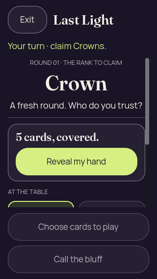
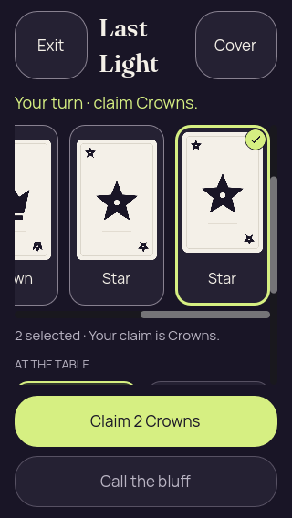
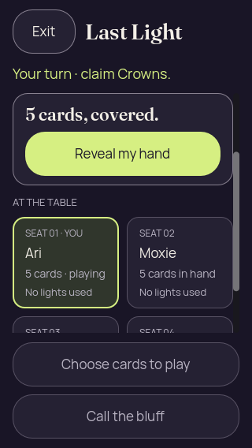
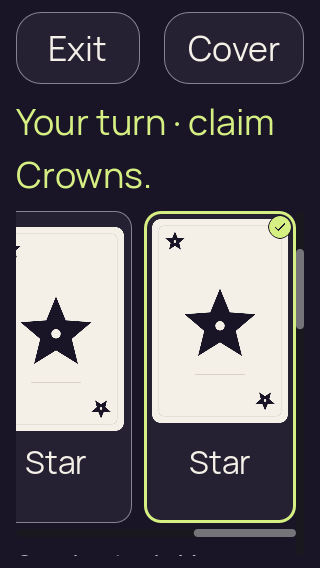
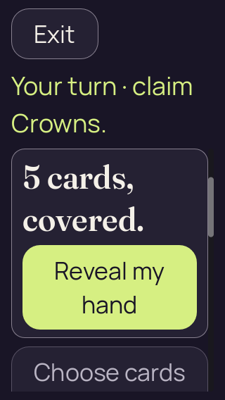
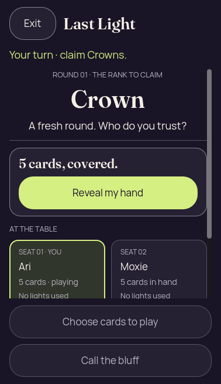
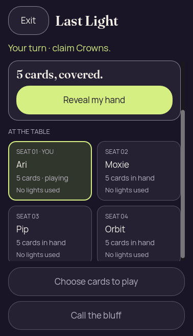

# 2D compact initial Reveal — source proposal

[All collections](../README.md) · [Preserved evidence index](evidence-index.md) · [Copy/review binding](../android-34503251315/provenance/publication-review/partydeck-gallery-2815-publication-binding-v1.json) · [Completed visual review](provenance/publication-review/partydeck-2d-initial-layout-independent-view-receipt-v1.json) · [Unchanged source mapping](provenance/source-proposal/new-pngs.json)

**Accepted bounded source improvement. Native validation remains pending; 320×568 at 200% still clips initial Reveal.**

The independently accepted source proposal applies at width <860, height 500–799 and text scale <1.5. The initial normal-text Reveal is fully contained at 378×655, 378×691, 320×568 and 320×740, with 152, 188, 65 and 237 source units of bottom clearance. The hardest duplicate 24-character names plus opponent/latest-claim fixture retains seven units. Turn/rank/claim and numbered-seat disambiguation remain readable.

The four 200% cases and the specified landscape/wider comparison geometries are unchanged. At 320×568 and 200%, initial Reveal still clips by 93 units; the check helper scrolls before input. There are no new landscape/tablet PNGs and no native acceptance. The completed independent review passed 391 frozen artifact hashes and 679 checks across 13 baseline/22 candidate geometry cases and three input reports. This publication reuses that audit.

The source starts from commit 4f694296b08899176831e7c444c6f8082d40d64b and old PCK d6adbba1b5cbd6a1ac3a5754e4294363eae70ae9540af4ba12040cd4cfff44e0. Candidate table SHA-256 is de0bec7b083327f1210a9413d0236208be832ed49c0cec329b4999fb2994ba9a; no whole-tree candidate capture commit is asserted.

Source revision: `local changed-source fixture; exact whole-tree capture commit not asserted`. 12 original PNG identities. Review methods: 10 direct original view, 2 exact same-batch match.

Every thumbnail opens the unchanged original PNG. Original filenames, dimensions, source paths and outcomes remain separate even when pixels match. No derivative image was created. Frozen provenance pages retain their original text and source references.

| Original capture | Original identity and evidence | Visual observation |
| --- | --- | --- |
|  <code>01-concealed.png</code> source-input-320x568-text-1 — 01-concealed | 320 × 568 px · 37,563 bytes · text 1.0 SHA-256: <code>268b430aa68b59592ea34a61a80c1f59e9bbbaed2b8e9f3378c5ae7735801a53</code> Source: <code>/tmp/partydeck-2d-initial-layout-34488350932-v1/results/source-input-320x568-text-1/01-concealed.png</code> [Capture/result JSON](results/source-input-320x568-text-1/01-concealed.json) · [Original result](results/source-input-320x568-text-1/report.json) · [Execution](results/source-input-320x568-text-1/execution.json) | **Direct original view**. Exit/Last Light and Your turn · claim Crowns. fit. Round/rank Crown and A fresh round. Who do you trust? remain readable. The full compact cover panel, 5 cards, covered. and full Reveal fit with clear spacing. AT THE TABLE appears; lower seat cards begin at the body edge. Fixed disabled Choose cards and Call the bluff controls are complete. |
|  <code>02-revealed-selected.png</code> source-input-320x568-text-1 — 02-revealed-selected | 320 × 568 px · 31,340 bytes · text 1.0 SHA-256: <code>c87c163d4c5f4adc7e595d32c9233cffd2c677f29c5d9bdb49cca702e84bfab9</code> Source: <code>/tmp/partydeck-2d-initial-layout-34488350932-v1/results/source-input-320x568-text-1/02-revealed-selected.png</code> [Capture/result JSON](results/source-input-320x568-text-1/02-revealed-selected.json) · [Original result](results/source-input-320x568-text-1/report.json) · [Execution](results/source-input-320x568-text-1/execution.json) | **Direct original view**. Last Light wraps to two lines between Exit and Cover; all header controls fit. Turn/claim Crowns remains visible. The scrolled horizontal hand shows a clipped left Crown, a complete Star and a selected Star with bright outline/check. 2 selected · Your claim is Crowns. is readable; full Claim 2 Crowns and disabled Call the bluff fit. More seat content continues below the body edge. |
|  <code>03-covered-again.png</code> source-input-320x568-text-1 — 03-covered-again | 320 × 568 px · 39,587 bytes · text 1.0 SHA-256: <code>94364f4959c91d8bb5bd9f6c6ae541d84a7a608412f1db3ac49043db5b8241bb</code> Source: <code>/tmp/partydeck-2d-initial-layout-34488350932-v1/results/source-input-320x568-text-1/03-covered-again.png</code> [Capture/result JSON](results/source-input-320x568-text-1/03-covered-again.json) · [Original result](results/source-input-320x568-text-1/report.json) · [Execution](results/source-input-320x568-text-1/execution.json) | **Direct original view**. The scrolled compact cover shows full 5 cards, covered. and Reveal. Turn/claim remains visible. Ari/Moxie seat cards are readable; the next seat row is clipped at the body edge. Fixed actions fit. No private card ranks or faces are displayed. |
|  <code>04-resumed-covered.png</code> source-input-320x568-text-1 — 04-resumed-covered | 320 × 568 px · 39,587 bytes · text 1.0 SHA-256: <code>94364f4959c91d8bb5bd9f6c6ae541d84a7a608412f1db3ac49043db5b8241bb</code> Source: <code>/tmp/partydeck-2d-initial-layout-34488350932-v1/results/source-input-320x568-text-1/04-resumed-covered.png</code> [Capture/result JSON](results/source-input-320x568-text-1/04-resumed-covered.json) · [Original result](results/source-input-320x568-text-1/report.json) · [Execution](results/source-input-320x568-text-1/execution.json) | **Exact same-batch match**. Original capture identity preserved separately. Its SHA-256 exactly matches the named directly viewed same-batch original; reuse transfers the pixel observation only, not interaction or frame identity. [Reviewed matching original](results/source-input-320x568-text-1/03-covered-again.png); original capture identity remains separate. |
|  <code>01-concealed.png</code> source-input-320x568-text-2 — 01-concealed | 320 × 568 px · 34,818 bytes · text 2.0 SHA-256: <code>e4bfcd497b32883570b9b03621918c6546f5277c1b8587611500095ccbece418</code> Source: <code>/tmp/partydeck-2d-initial-layout-34488350932-v1/results/source-input-320x568-text-2/01-concealed.png</code> [Capture/result JSON](results/source-input-320x568-text-2/01-concealed.json) · [Original result](results/source-input-320x568-text-2/report.json) · [Execution](results/source-input-320x568-text-2/execution.json) | **Direct original view**. At 200%, Exit and wrapped Your turn · claim Crowns. fit. Round/rank Crown remains readable, followed by YOUR HAND and wrapped 5 cards, covered. Only the top of Reveal is at the lower viewport; its label and lower control portion are clipped. This is the unchanged enlarged-text initial layout. |
|  <code>02-revealed-selected.png</code> source-input-320x568-text-2 — 02-revealed-selected | 320 × 568 px · 24,924 bytes · text 2.0 SHA-256: <code>648bd6ae48a4a13930de74a957a060a61ca03b78b21637fdba6c3e2e764fd3b1</code> Source: <code>/tmp/partydeck-2d-initial-layout-34488350932-v1/results/source-input-320x568-text-2/02-revealed-selected.png</code> [Capture/result JSON](results/source-input-320x568-text-2/02-revealed-selected.json) · [Original result](results/source-input-320x568-text-2/report.json) · [Execution](results/source-input-320x568-text-2/execution.json) | **Direct original view**. At 200%, Exit/Cover and turn/claim fit. A complete selected Star has a bright outline/check and label; the neighboring Star is clipped on the left. The horizontal scrollbar is visible. Selection feedback and Play/lower controls lie below the viewport. |
|  <code>03-covered-again.png</code> source-input-320x568-text-2 — 03-covered-again | 320 × 568 px · 35,213 bytes · text 2.0 SHA-256: <code>f800a6739e47c504720e1d4d9c72f5ca1076453d6c9a89e1d5408dd370d62546</code> Source: <code>/tmp/partydeck-2d-initial-layout-34488350932-v1/results/source-input-320x568-text-2/03-covered-again.png</code> [Capture/result JSON](results/source-input-320x568-text-2/03-covered-again.json) · [Original result](results/source-input-320x568-text-2/report.json) · [Execution](results/source-input-320x568-text-2/execution.json) | **Direct original view**. The scrolled enlarged cover shows full wrapped 5 cards, covered. and complete two-line Reveal my hand. Turn/claim remains visible. Choose cards begins below and is clipped; further lower action content is outside the viewport. No private card ranks are displayed. |
|  <code>04-resumed-covered.png</code> source-input-320x568-text-2 — 04-resumed-covered | 320 × 568 px · 36,366 bytes · text 2.0 SHA-256: <code>9cc42987413e63c037df2ffe055a49a0f113a08574559bd81eb6e69fe491d2ca</code> Source: <code>/tmp/partydeck-2d-initial-layout-34488350932-v1/results/source-input-320x568-text-2/04-resumed-covered.png</code> [Capture/result JSON](results/source-input-320x568-text-2/04-resumed-covered.json) · [Original result](results/source-input-320x568-text-2/report.json) · [Execution](results/source-input-320x568-text-2/execution.json) | **Direct original view**. After resume at 200%, Exit and wrapped turn/claim remain visible. The scrolled covered-hand title starts at the body edge with its top glyph portions clipped; the two-line Reveal my hand control is complete. Disabled Choose cards to play continues below the viewport. No private faces or ranks are displayed. |
|  <code>01-concealed.png</code> source-input-378x655-text-1 — 01-concealed | 378 × 655 px · 48,356 bytes · text 1.0 SHA-256: <code>f8ce08165a3c0d00c7815287b2d5adfe06e6c88789d4e3fcf891f1f666958a48</code> Source: <code>/tmp/partydeck-2d-initial-layout-34488350932-v1/results/source-input-378x655-text-1/01-concealed.png</code> [Capture/result JSON](results/source-input-378x655-text-1/01-concealed.json) · [Original result](results/source-input-378x655-text-1/report.json) · [Execution](results/source-input-378x655-text-1/execution.json) | **Direct original view**. Exit, Last Light and the one-line turn/claim are complete. Round/rank Crown and the fresh-round prompt sit above the compact cover panel. 5 cards, covered. and the full Reveal my hand control have clear spacing. AT THE TABLE and the upper Ari/Moxie seat cards are visible; the remaining seat content continues below the body edge. Both fixed disabled actions are complete. |
|  <code>02-revealed-selected.png</code> source-input-378x655-text-1 — 02-revealed-selected | 378 × 655 px · 44,304 bytes · text 1.0 SHA-256: <code>c557683ea1307a0425b0755ecb68fc2831b895592453703ff2d1b75c53e806c8</code> Source: <code>/tmp/partydeck-2d-initial-layout-34488350932-v1/results/source-input-378x655-text-1/02-revealed-selected.png</code> [Capture/result JSON](results/source-input-378x655-text-1/02-revealed-selected.json) · [Original result](results/source-input-378x655-text-1/report.json) · [Execution](results/source-input-378x655-text-1/execution.json) | **Direct original view**. Exit, Last Light, Cover and the turn/claim remain complete. The scrolled horizontal hand shows Crown, Star and a selected Star with a bright outline/check; a visible horizontal scrollbar indicates more hand content. 2 selected · Your claim is Crowns. is readable. Ari/Moxie seat panels begin below; full Claim 2 Crowns and disabled Call the bluff fit in the fixed action area. |
|  <code>03-covered-again.png</code> source-input-378x655-text-1 — 03-covered-again | 378 × 655 px · 45,843 bytes · text 1.0 SHA-256: <code>759d9188edd8320ff3d0735b4f6f81281d731a924fc867aac46b6769bc1c926d</code> Source: <code>/tmp/partydeck-2d-initial-layout-34488350932-v1/results/source-input-378x655-text-1/03-covered-again.png</code> [Capture/result JSON](results/source-input-378x655-text-1/03-covered-again.json) · [Original result](results/source-input-378x655-text-1/report.json) · [Execution](results/source-input-378x655-text-1/execution.json) | **Direct original view**. Exit, Last Light and the turn/claim remain complete. The scrolled compact cover panel shows full 5 cards, covered. and Reveal my hand. All four seat names and card counts fit, with the lower panels continuing to the body edge. Fixed disabled Choose cards to play and Call the bluff are complete. No private card faces or ranks are displayed. |
|  <code>04-resumed-covered.png</code> source-input-378x655-text-1 — 04-resumed-covered | 378 × 655 px · 45,843 bytes · text 1.0 SHA-256: <code>759d9188edd8320ff3d0735b4f6f81281d731a924fc867aac46b6769bc1c926d</code> Source: <code>/tmp/partydeck-2d-initial-layout-34488350932-v1/results/source-input-378x655-text-1/04-resumed-covered.png</code> [Capture/result JSON](results/source-input-378x655-text-1/04-resumed-covered.json) · [Original result](results/source-input-378x655-text-1/report.json) · [Execution](results/source-input-378x655-text-1/execution.json) | **Exact same-batch match**. Original capture identity preserved separately. Its SHA-256 exactly matches the named directly viewed same-batch original; reuse transfers the pixel observation only, not interaction or frame identity. [Reviewed matching original](results/source-input-378x655-text-1/03-covered-again.png); original capture identity remains separate. |
