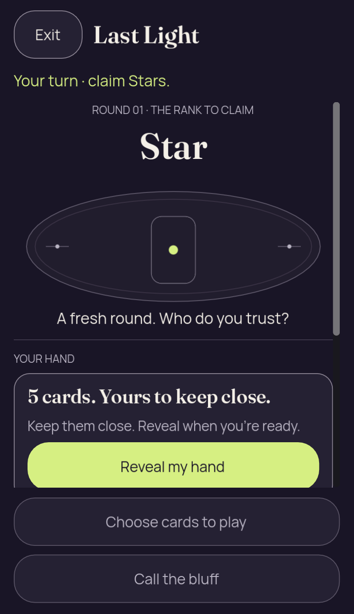
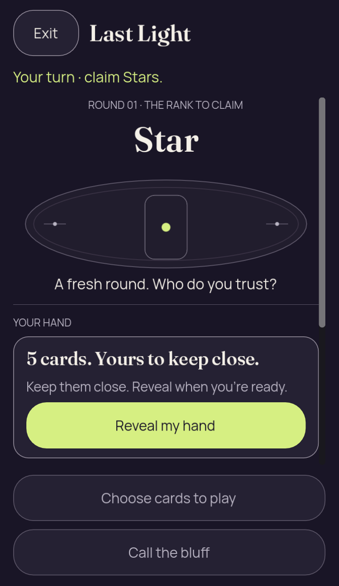
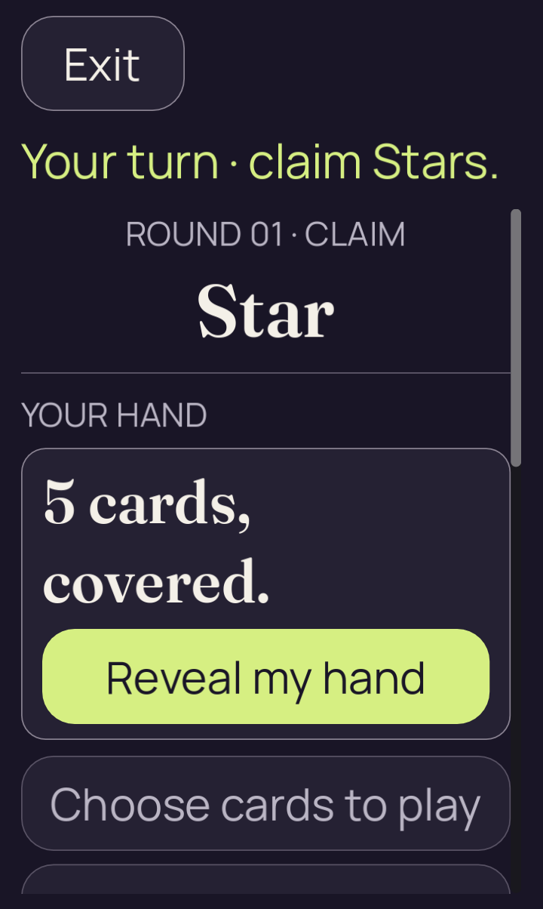
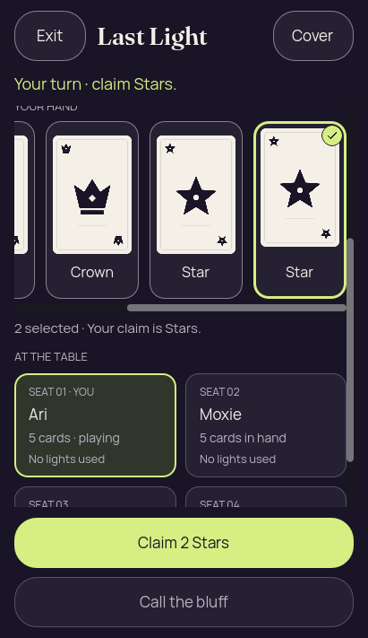
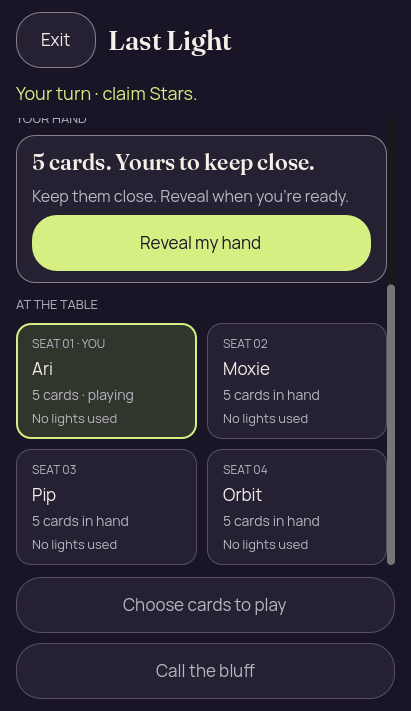
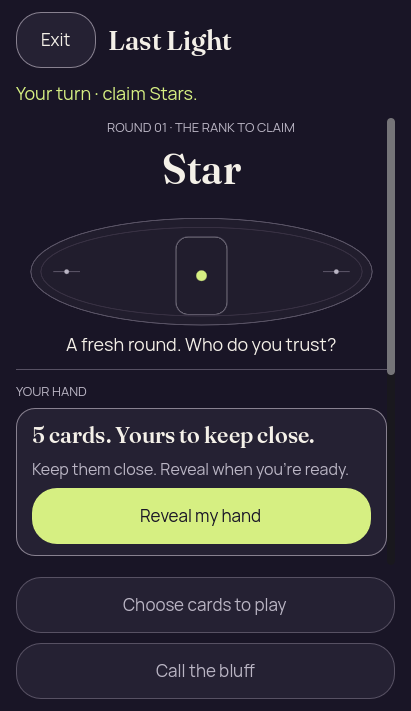
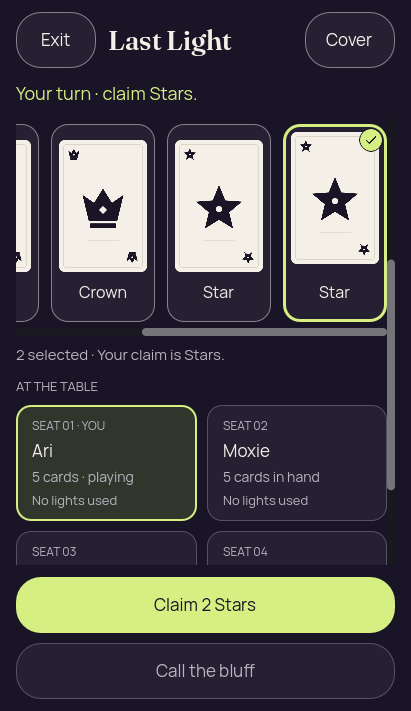
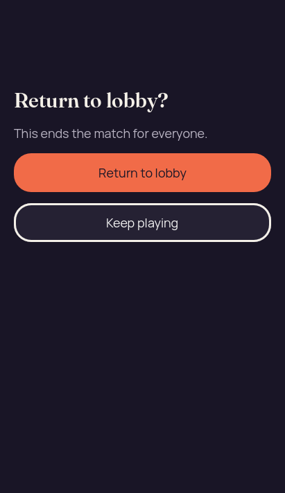

# Godot 2D — initial Reveal source investigation

[All screenshot collections](../README.md) · [Original investigation](receipt-v1/investigation.md) · [Frozen provenance](receipt-v1/provenance.json)

**Evidence status:** Seventeen new originals retain the clipped baseline, the compact source candidate, the unchanged 200% layouts, the four-image failed fixture and the five-image corrected fixture. The normal-text candidate shows complete Reveal and concealed panel. This is a desktop source investigation; the [Android CI pack](../godot-android-34446327045/README.md) still contains the earlier layout.

The sole source change lowers the decorative surface minimum from **148 to 124** for narrow layouts with text scale below 1.5 and logical height at least 500 but below 800. The 151-file frozen source snapshot was checked; only `presentations/two_d/table.gd` differs. [Before source](receipt-v1/source-before.gd), SHA-256 `46fde47e8da4dbb8c8f91e0a4215ceabb4040a8ddfcbab54c8573d5b9cc96eef`; [after source](receipt-v1/source-after.gd), SHA-256 `8d8650c8b6b6c5c5052b798e540d0b618dc2d916d7fdda0c95011eac6412f993`. [Exact patch](compact-surface.patch) and [source inventory](frame-v1-source-manifest.json) are retained. The exact local whole-tree capture commit was not recorded.

Normal probes run Godot 4.7.2 Compatibility/Mesa llvmpipe under Xvfb at **720 × 1244 pixels**, density 1.75, approximately 411.429 × 710.857 logical units. Baseline Reveal `[32,512,339,56]` ends four units below clip `[16,118,379,446]`: seven physical pixels are clipped. Its cover panel overflows sixteen units. Candidate Reveal `[32,488,339,56]` and panel `[16,408,371,148]` fit, leaving an **eight-unit** panel bottom margin. Scroll remains zero. Early/late captures occur after frame callbacks 4/60: baseline 150/1123 ms, candidate 161/1138 ms. Both frames show the same respective defect or correction.

The four 200% probe originals are 720 × 1204 and byte-identical, SHA-256 `b1ae240dd4575fc003a9b14c5b8f5b232c767cbbe9facb5a2a6e2c7930721e0b`. Reveal and panel fit; lower disabled gameplay content continues below the viewport. Each capture keeps its original scenario and source record.

The first 411 × 711 source scene check passes earlier touch/privacy assertions, then exits 1 with **`ERROR: Lobby confirmation check requires a live match with native host permission.`** Its four images contain no lobby confirmation. The corrected fixture exits 0 and yields five images, including the full confirmation. The [fixture-generation receipt](host-fixture-generation.json), [original generator](InitialHostFixture.java) and launch inputs preserve the change: the real adapter/encoder sets only `canReturnToLobby` from false to true, with identical projected GameView. That permission input is not a native execution or an authority-accepted lobby action.

The [raw probe](initial_reveal_probe.gd), [probe runner](run_probe.py), both source-check runners, recorded checker/main/table input copies, invocation receipts, logs, paired diagnostics, fixture generator and [retained authority-library identities](authority-libraries.json) are included. Godot and JAR binaries stay outside the gallery with their recorded hashes. No new capture execution was performed for this archive review.

The frozen receipt also contains copies of four already-published native images and paired JSONs. They are references to the original CI 34439587132 capture records, not new captures: [match entry](../godot-android-34439587132/2d-font-1.0-debug/2d/match/01-concealed.png), [fresh scene Exit entry](../godot-android-34439587132/2d-font-1.0-debug/2d/scene-exit/01-fresh-concealed.png), [fresh native Close entry](../godot-android-34439587132/2d-font-1.0-debug/2d/native-exit/01-fresh-concealed.png), and [concealed resume](../godot-android-34439587132/2d-font-1.0-debug/2d/match/07-resumed-concealed.png). Their hashes and exact copied-source mappings remain in the unchanged provenance and collection manifest.

Source: `/tmp/partydeck-2d-initial-reveal-investigation`. Every thumbnail below displays and opens its unchanged original PNG.

## Baseline normal text — clipped initial Reveal

[Original result](baseline-font-1.0/result.json) · [Invocation](baseline-font-1.0/invocation.json) · [Runtime output](baseline-font-1.0/stdout.log)

| Original image | Scenario and provenance |
| --- | --- |
|  | **Baseline normal text — clipped initial Reveal — early frame** Godot 4.7.2 Compatibility / Mesa llvmpipe / Xvfb source probe, density 1.75 Original: [01-early.png](baseline-font-1.0/captures/01-early.png) 720 × 1244 px; text 1× SHA-256: <code>c770696a7be8b92228a810f3a2ebe5744e88121adfa0e48963ec0a32da650672</code> [Original measurements](baseline-font-1.0/captures/01-early.json) [Original result](baseline-font-1.0/result.json) Desktop source fixture; no native execution or authority-accepted lobby action. The exact local whole-tree capture commit was not recorded. Captured after 4 process-frame callbacks, 150 ms since launch, with scroll offset 0. Reveal overflows its clip by four logical units/seven physical pixels; the concealed panel overflows by sixteen logical units. The label is readable but the lower borders are clipped. |
|  | **Baseline normal text — clipped initial Reveal — late frame** Godot 4.7.2 Compatibility / Mesa llvmpipe / Xvfb source probe, density 1.75 Original: [02-late.png](baseline-font-1.0/captures/02-late.png) 720 × 1244 px; text 1× SHA-256: <code>c770696a7be8b92228a810f3a2ebe5744e88121adfa0e48963ec0a32da650672</code> [Original measurements](baseline-font-1.0/captures/02-late.json) [Original result](baseline-font-1.0/result.json) Desktop source fixture; no native execution or authority-accepted lobby action. The exact local whole-tree capture commit was not recorded. Captured after 60 process-frame callbacks, 1123 ms since launch, with scroll offset 0. Reveal overflows its clip by four logical units/seven physical pixels; the concealed panel overflows by sixteen logical units. The label is readable but the lower borders are clipped. |

## Compact source, normal text — complete initial Reveal

[Original result](compact-surface-font-1.0/result.json) · [Invocation](compact-surface-font-1.0/invocation.json) · [Runtime output](compact-surface-font-1.0/stdout.log)

| Original image | Scenario and provenance |
| --- | --- |
|  | **Compact source, normal text — complete initial Reveal — early frame** Godot 4.7.2 Compatibility / Mesa llvmpipe / Xvfb source probe, density 1.75 Original: [01-early.png](compact-surface-font-1.0/captures/01-early.png) 720 × 1244 px; text 1× SHA-256: <code>70eeb4206f962ce3e3fd4eb513b787cf461af99015b602f69c8de60fcbd1480a</code> [Original measurements](compact-surface-font-1.0/captures/01-early.json) [Original result](compact-surface-font-1.0/result.json) Desktop source fixture; no native execution or authority-accepted lobby action. The exact local whole-tree capture commit was not recorded. Captured after 4 process-frame callbacks, 161 ms since launch, with scroll offset 0. Reveal and the concealed panel are fully visible. Reducing the decorative minimum height from 148 to 124 leaves an eight-logical-unit panel bottom margin. |
|  | **Compact source, normal text — complete initial Reveal — late frame** Godot 4.7.2 Compatibility / Mesa llvmpipe / Xvfb source probe, density 1.75 Original: [02-late.png](compact-surface-font-1.0/captures/02-late.png) 720 × 1244 px; text 1× SHA-256: <code>70eeb4206f962ce3e3fd4eb513b787cf461af99015b602f69c8de60fcbd1480a</code> [Original measurements](compact-surface-font-1.0/captures/02-late.json) [Original result](compact-surface-font-1.0/result.json) Desktop source fixture; no native execution or authority-accepted lobby action. The exact local whole-tree capture commit was not recorded. Captured after 60 process-frame callbacks, 1138 ms since launch, with scroll offset 0. Reveal and the concealed panel are fully visible. Reducing the decorative minimum height from 148 to 124 leaves an eight-logical-unit panel bottom margin. |

## Baseline at 200% text

[Original result](baseline-font-2.0/result.json) · [Invocation](baseline-font-2.0/invocation.json) · [Runtime output](baseline-font-2.0/stdout.log)

| Original image | Scenario and provenance |
| --- | --- |
|  | **Baseline at 200% text — early frame** Godot 4.7.2 Compatibility / Mesa llvmpipe / Xvfb source probe, density 1.75 Original: [01-early.png](baseline-font-2.0/captures/01-early.png) 720 × 1204 px; text 2× SHA-256: <code>b1ae240dd4575fc003a9b14c5b8f5b232c767cbbe9facb5a2a6e2c7930721e0b</code> [Original measurements](baseline-font-2.0/captures/01-early.json) [Original result](baseline-font-2.0/result.json) Desktop source fixture; no native execution or authority-accepted lobby action. The exact local whole-tree capture commit was not recorded. Captured after 4 process-frame callbacks, 160 ms since launch, with scroll offset 0. All four 200% baseline/candidate images are byte-identical, with complete Reveal and panel. Disabled gameplay content continues below the viewport. |
|  | **Baseline at 200% text — late frame** Godot 4.7.2 Compatibility / Mesa llvmpipe / Xvfb source probe, density 1.75 Original: [02-late.png](baseline-font-2.0/captures/02-late.png) 720 × 1204 px; text 2× SHA-256: <code>b1ae240dd4575fc003a9b14c5b8f5b232c767cbbe9facb5a2a6e2c7930721e0b</code> [Original measurements](baseline-font-2.0/captures/02-late.json) [Original result](baseline-font-2.0/result.json) Desktop source fixture; no native execution or authority-accepted lobby action. The exact local whole-tree capture commit was not recorded. Captured after 60 process-frame callbacks, 1128 ms since launch, with scroll offset 0. All four 200% baseline/candidate images are byte-identical, with complete Reveal and panel. Disabled gameplay content continues below the viewport. |

## Compact source at 200% text

[Original result](compact-surface-font-2.0/result.json) · [Invocation](compact-surface-font-2.0/invocation.json) · [Runtime output](compact-surface-font-2.0/stdout.log)

| Original image | Scenario and provenance |
| --- | --- |
|  | **Compact source at 200% text — early frame** Godot 4.7.2 Compatibility / Mesa llvmpipe / Xvfb source probe, density 1.75 Original: [01-early.png](compact-surface-font-2.0/captures/01-early.png) 720 × 1204 px; text 2× SHA-256: <code>b1ae240dd4575fc003a9b14c5b8f5b232c767cbbe9facb5a2a6e2c7930721e0b</code> [Original measurements](compact-surface-font-2.0/captures/01-early.json) [Original result](compact-surface-font-2.0/result.json) Desktop source fixture; no native execution or authority-accepted lobby action. The exact local whole-tree capture commit was not recorded. Captured after 4 process-frame callbacks, 161 ms since launch, with scroll offset 0. All four 200% baseline/candidate images are byte-identical, with complete Reveal and panel. Disabled gameplay content continues below the viewport. |
|  | **Compact source at 200% text — late frame** Godot 4.7.2 Compatibility / Mesa llvmpipe / Xvfb source probe, density 1.75 Original: [02-late.png](compact-surface-font-2.0/captures/02-late.png) 720 × 1204 px; text 2× SHA-256: <code>b1ae240dd4575fc003a9b14c5b8f5b232c767cbbe9facb5a2a6e2c7930721e0b</code> [Original measurements](compact-surface-font-2.0/captures/02-late.json) [Original result](compact-surface-font-2.0/result.json) Desktop source fixture; no native execution or authority-accepted lobby action. The exact local whole-tree capture commit was not recorded. Captured after 60 process-frame callbacks, 1129 ms since launch, with scroll offset 0. All four 200% baseline/candidate images are byte-identical, with complete Reveal and panel. Disabled gameplay content continues below the viewport. |

## Scene check — failed lobby-permission fixture

[Original result](tracked-compact-scene-font-1.0/result.json) · [Invocation](tracked-compact-scene-font-1.0/invocation.json) · [Runtime output](tracked-compact-scene-font-1.0/stdout.log)

| Original image | Scenario and provenance |
| --- | --- |
|  | **Initial concealed hand — failed fixture** Godot 4.7.2 Linux OpenGL desktop source fixture, 411 × 711 Original: [01-concealed.png](tracked-compact-scene-font-1.0/captures/01-concealed.png) 411 × 711 px; text 1× SHA-256: <code>e8b542e7e9be0d48e2b21873eb11d0e50f4450165efba75932b977cee5fb2d04</code> [Original measurements](tracked-compact-scene-font-1.0/captures/01-concealed.json) [Original result](tracked-compact-scene-font-1.0/result.json) Desktop source fixture; no native execution or authority-accepted lobby action. The exact local whole-tree capture commit was not recorded. This run exits 1 after earlier touch/privacy checks: ERROR: Lobby confirmation check requires a live match with native host permission. It produces four originals and no lobby-confirmation image. No private face, label or selected binding is present; initial Reveal is complete. |
|  | **Revealed and selected hand — failed fixture** Godot 4.7.2 Linux OpenGL desktop source fixture, 411 × 711 Original: [02-revealed-selected.png](tracked-compact-scene-font-1.0/captures/02-revealed-selected.png) 411 × 711 px; text 1× SHA-256: <code>99981db181bca41cba09d3a1735afee9a47071732b4382e0fcf9e82bde084754</code> [Original measurements](tracked-compact-scene-font-1.0/captures/02-revealed-selected.json) [Original result](tracked-compact-scene-font-1.0/result.json) Desktop source fixture; no native execution or authority-accepted lobby action. The exact local whole-tree capture commit was not recorded. This run exits 1 after earlier touch/privacy checks: ERROR: Lobby confirmation check requires a live match with native host permission. It produces four originals and no lobby-confirmation image. |
|  | **Hide clears private content and selection — failed fixture** Godot 4.7.2 Linux OpenGL desktop source fixture, 411 × 711 Original: [03-covered-again.png](tracked-compact-scene-font-1.0/captures/03-covered-again.png) 411 × 711 px; text 1× SHA-256: <code>90d8c1dabe6215dbaa7a1245a0bda689b1458de1707e849882128ca4bda88564</code> [Original measurements](tracked-compact-scene-font-1.0/captures/03-covered-again.json) [Original result](tracked-compact-scene-font-1.0/result.json) Desktop source fixture; no native execution or authority-accepted lobby action. The exact local whole-tree capture commit was not recorded. This run exits 1 after earlier touch/privacy checks: ERROR: Lobby confirmation check requires a live match with native host permission. It produces four originals and no lobby-confirmation image. No private face, label or selected binding is present; initial Reveal is complete. |
|  | **Local scene resumes concealed — failed fixture** Godot 4.7.2 Linux OpenGL desktop source fixture, 411 × 711 Original: [04-resumed-covered.png](tracked-compact-scene-font-1.0/captures/04-resumed-covered.png) 411 × 711 px; text 1× SHA-256: <code>90d8c1dabe6215dbaa7a1245a0bda689b1458de1707e849882128ca4bda88564</code> [Original measurements](tracked-compact-scene-font-1.0/captures/04-resumed-covered.json) [Original result](tracked-compact-scene-font-1.0/result.json) Desktop source fixture; no native execution or authority-accepted lobby action. The exact local whole-tree capture commit was not recorded. This run exits 1 after earlier touch/privacy checks: ERROR: Lobby confirmation check requires a live match with native host permission. It produces four originals and no lobby-confirmation image. No private face, label or selected binding is present; initial Reveal is complete. |

## Scene check — corrected lobby-permission fixture

[Original result](tracked-compact-scene-native-host-font-1.0/result.json) · [Invocation](tracked-compact-scene-native-host-font-1.0/invocation.json) · [Runtime output](tracked-compact-scene-native-host-font-1.0/stdout.log)

| Original image | Scenario and provenance |
| --- | --- |
|  | **Initial concealed hand — corrected permission fixture** Godot 4.7.2 Linux OpenGL desktop source fixture, 411 × 711 Original: [01-concealed.png](tracked-compact-scene-native-host-font-1.0/captures/01-concealed.png) 411 × 711 px; text 1× SHA-256: <code>fb244850d4ca7163167dc71f5e2be3213d6e8aca4c936091b24b0a728b2c534f</code> [Original measurements](tracked-compact-scene-native-host-font-1.0/captures/01-concealed.json) [Original result](tracked-compact-scene-native-host-font-1.0/result.json) Desktop source fixture; no native execution or authority-accepted lobby action. The exact local whole-tree capture commit was not recorded. This run exits 0 after correcting only canReturnToLobby through the actual adapter/encoder. The projected GameView remains identical; the five images retain the full local scene check. No private face, label or selected binding is present; initial Reveal is complete. |
|  | **Revealed and selected hand — corrected permission fixture** Godot 4.7.2 Linux OpenGL desktop source fixture, 411 × 711 Original: [02-revealed-selected.png](tracked-compact-scene-native-host-font-1.0/captures/02-revealed-selected.png) 411 × 711 px; text 1× SHA-256: <code>42a8f3d68f298ba3d965bbc53825bc4e1599b5ad40174cdb00ee89f1933b234c</code> [Original measurements](tracked-compact-scene-native-host-font-1.0/captures/02-revealed-selected.json) [Original result](tracked-compact-scene-native-host-font-1.0/result.json) Desktop source fixture; no native execution or authority-accepted lobby action. The exact local whole-tree capture commit was not recorded. This run exits 0 after correcting only canReturnToLobby through the actual adapter/encoder. The projected GameView remains identical; the five images retain the full local scene check. |
|  | **Hide clears private content and selection — corrected permission fixture** Godot 4.7.2 Linux OpenGL desktop source fixture, 411 × 711 Original: [03-covered-again.png](tracked-compact-scene-native-host-font-1.0/captures/03-covered-again.png) 411 × 711 px; text 1× SHA-256: <code>e14895d89399311583c5ae33c0dfacd214ac14f2aab51d054af8574afaeb0e15</code> [Original measurements](tracked-compact-scene-native-host-font-1.0/captures/03-covered-again.json) [Original result](tracked-compact-scene-native-host-font-1.0/result.json) Desktop source fixture; no native execution or authority-accepted lobby action. The exact local whole-tree capture commit was not recorded. This run exits 0 after correcting only canReturnToLobby through the actual adapter/encoder. The projected GameView remains identical; the five images retain the full local scene check. No private face, label or selected binding is present; initial Reveal is complete. |
|  | **Local scene resumes concealed — corrected permission fixture** Godot 4.7.2 Linux OpenGL desktop source fixture, 411 × 711 Original: [04-resumed-covered.png](tracked-compact-scene-native-host-font-1.0/captures/04-resumed-covered.png) 411 × 711 px; text 1× SHA-256: <code>e14895d89399311583c5ae33c0dfacd214ac14f2aab51d054af8574afaeb0e15</code> [Original measurements](tracked-compact-scene-native-host-font-1.0/captures/04-resumed-covered.json) [Original result](tracked-compact-scene-native-host-font-1.0/result.json) Desktop source fixture; no native execution or authority-accepted lobby action. The exact local whole-tree capture commit was not recorded. This run exits 0 after correcting only canReturnToLobby through the actual adapter/encoder. The projected GameView remains identical; the five images retain the full local scene check. No private face, label or selected binding is present; initial Reveal is complete. |
|  | **Complete lobby confirmation with both choices — corrected permission fixture** Godot 4.7.2 Linux OpenGL desktop source fixture, 411 × 711 Original: [05-lobby-confirmation.png](tracked-compact-scene-native-host-font-1.0/captures/05-lobby-confirmation.png) 411 × 711 px; text 1× SHA-256: <code>663c49afff1b2933e09b19122bbfcff542dfb5eb95aa84af091f065543e7bae0</code> [Original measurements](tracked-compact-scene-native-host-font-1.0/captures/05-lobby-confirmation.json) [Original result](tracked-compact-scene-native-host-font-1.0/result.json) Desktop source fixture; no native execution or authority-accepted lobby action. The exact local whole-tree capture commit was not recorded. This run exits 0 after correcting only canReturnToLobby through the actual adapter/encoder. The projected GameView remains identical; the five images retain the full local scene check. The full consequence and both complete confirmation choices fit. Native host permission here is fixture input, not proof of a native host execution. |
