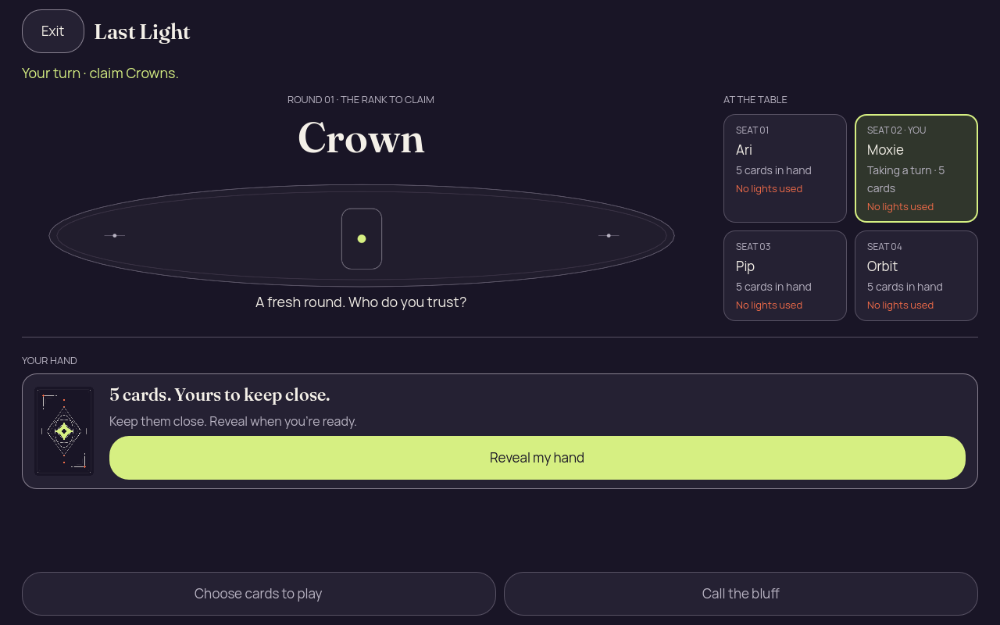
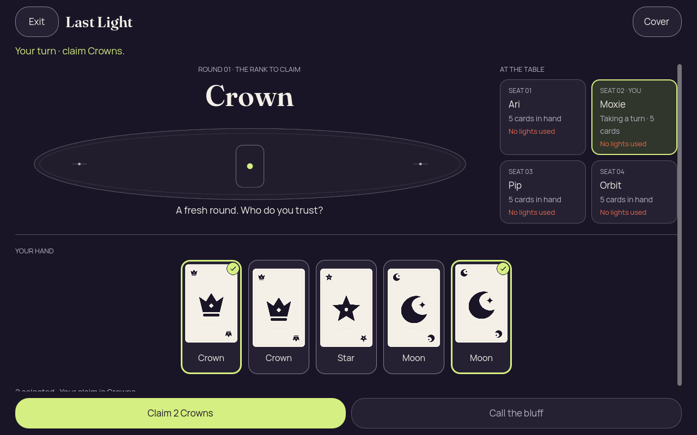
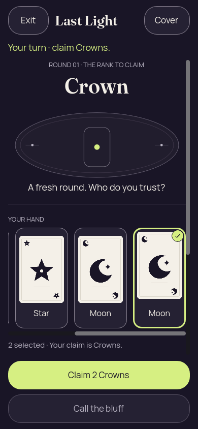
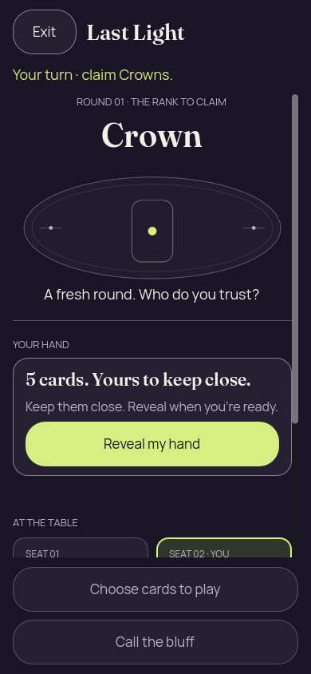
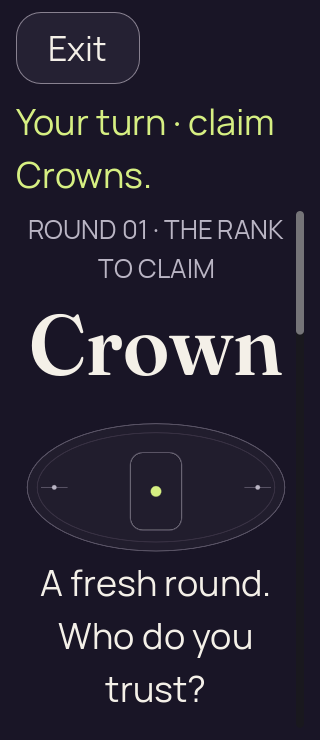
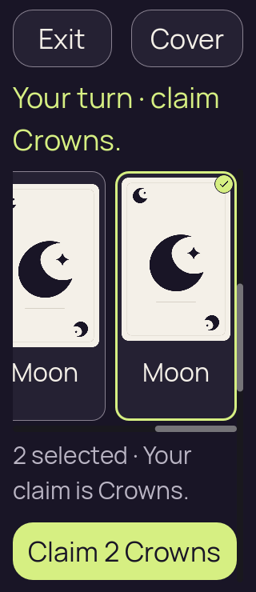
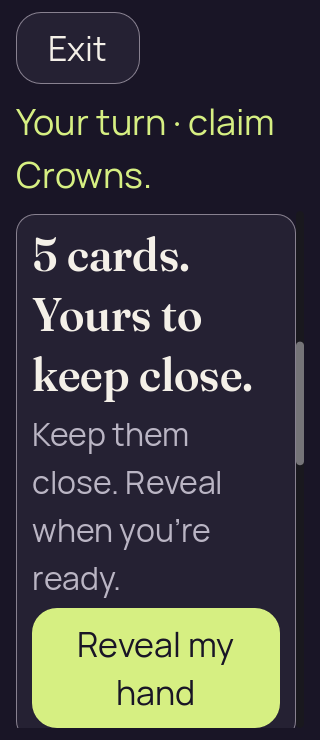
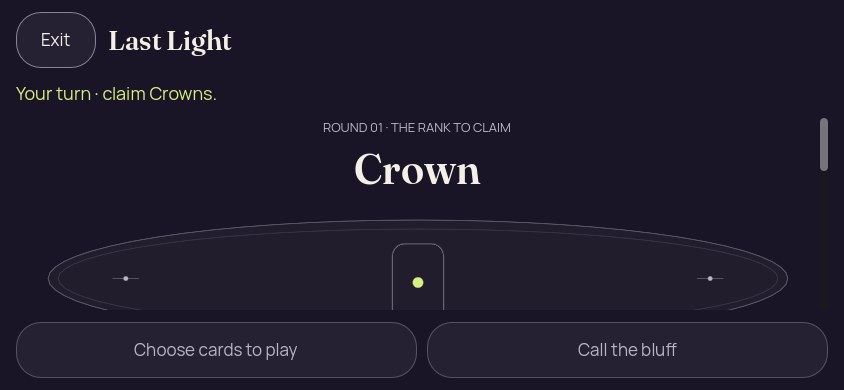
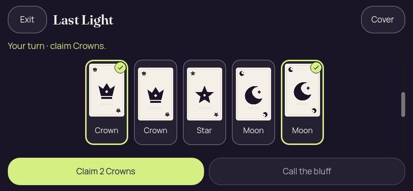
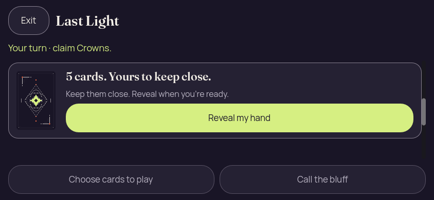

# Godot 2D — iteration 02, authority-derived layout fixtures

[All screenshot collections](../README.md)

Actual Godot 4.7.2.stable.official.ed1daf0bf rendering under Xvfb, OpenGL 4.5 Compatibility / Mesa llvmpipe 25.2.8, LLVM 20.1.2. The source was a shared working tree over the stated basis, including uncommitted changes; no exact capture commit is claimed.

**Evidence status:** All four reports passed their bounded static renderer layout/privacy checks using recipient-safe launch fixtures generated by the real Kotlin LastLightEngine. These captures do not prove an action was accepted by the authority. Selection badges are now visible and the phone hand precedes seats. Remaining design issues: the desktop selection hint is partly clipped by the action dock; the initial 200% and short-landscape viewports spend too much space on the rank/decorative table before Reveal.

Working-tree basis: [`2a9961f0a66b6eb51ba461d52480eb36e7f1ad29`](https://github.com/Apdelrahman1911/PartyDeck/commit/2a9961f0a66b6eb51ba461d52480eb36e7f1ad29); **not an exact capture revision**.

The checker sends actual mouse events to Godot Buttons after programmatically scrolling them into view with `ensure_control_visible`. It exercises reveal, card selection, cover, foreground loss/resume and close; it does not establish touch scrolling, native mobile accessibility, OS lifecycle protection or game-authority acceptance. Captures with identical pixels retain their separate scenario records.

[Source and fixture hashes](source-provenance.json) identify the files used for this iteration. The frozen [playing launch fixture](fixtures/launch-2d.json), [round-ended fixture](fixtures/round-ended-launch-2d.json) and [finished fixture](fixtures/finished-launch-2d.json) are real Kotlin-authority projections. The screenshots on this page cover only the playing fixture; the other preserved inputs are not claimed as captured outcome views.

## Desktop

[Original renderer check report](desktop/report.json).

| Original image | Scenario and provenance |
| --- | --- |
|  | **Initial concealed hand — desktop** Godot 4.7.2 desktop, 2D Compatibility renderer Original: [01-concealed.png](desktop/01-concealed.png) 1280 × 800 px; text 1.0× SHA-256: <code>65369e350ebba3dcd5b8e924c4d01e573ca003555735bd569fa381808eb78086</code> [Original diagnostics](desktop/01-concealed.json) Static recipient-safe fixture generated by Kotlin authority; no authority-accepted gameplay input is claimed. |
|  | **Revealed hand with cards 0 and 4 selected — desktop** Godot 4.7.2 desktop, 2D Compatibility renderer Original: [02-revealed-selected.png](desktop/02-revealed-selected.png) 1280 × 800 px; text 1.0× SHA-256: <code>d8be46fd5b834840027dcf8bfe8da1b70ddb19f4a9d64574c06b54fe1563cd8e</code> [Original diagnostics](desktop/02-revealed-selected.json) Static recipient-safe fixture generated by Kotlin authority; no authority-accepted gameplay input is claimed. Selection hint is partly clipped by the bottom action dock. |
|  | **Hand covered after selection — desktop** Godot 4.7.2 desktop, 2D Compatibility renderer Original: [03-covered-again.png](desktop/03-covered-again.png) 1280 × 800 px; text 1.0× SHA-256: <code>65369e350ebba3dcd5b8e924c4d01e573ca003555735bd569fa381808eb78086</code> [Original diagnostics](desktop/03-covered-again.json) Static recipient-safe fixture generated by Kotlin authority; no authority-accepted gameplay input is claimed. |
|  | **Hand remains covered after background and resume — desktop** Godot 4.7.2 desktop, 2D Compatibility renderer Original: [04-resumed-covered.png](desktop/04-resumed-covered.png) 1280 × 800 px; text 1.0× SHA-256: <code>65369e350ebba3dcd5b8e924c4d01e573ca003555735bd569fa381808eb78086</code> [Original diagnostics](desktop/04-resumed-covered.json) Static recipient-safe fixture generated by Kotlin authority; no authority-accepted gameplay input is claimed. |

## Phone

[Original renderer check report](phone/report.json).

| Original image | Scenario and provenance |
| --- | --- |
|  | **Initial concealed hand — phone** Godot 4.7.2 desktop, 2D Compatibility renderer Original: [01-concealed.png](phone/01-concealed.png) 390 × 844 px; text 1.0× SHA-256: <code>7fff455eaf5daff430a93171432f1c1d89984cd4223029426ae687e06da15e0e</code> [Original diagnostics](phone/01-concealed.json) Static recipient-safe fixture generated by Kotlin authority; no authority-accepted gameplay input is claimed. |
|  | **Revealed hand with cards 0 and 4 selected — phone** Godot 4.7.2 desktop, 2D Compatibility renderer Original: [02-revealed-selected.png](phone/02-revealed-selected.png) 390 × 844 px; text 1.0× SHA-256: <code>1780360db8cc7f3529f5c02adf7eeddfb3044778b04de3bad2a3f3aa8d94cbef</code> [Original diagnostics](phone/02-revealed-selected.json) Static recipient-safe fixture generated by Kotlin authority; no authority-accepted gameplay input is claimed. |
|  | **Hand covered after selection — phone** Godot 4.7.2 desktop, 2D Compatibility renderer Original: [03-covered-again.png](phone/03-covered-again.png) 390 × 844 px; text 1.0× SHA-256: <code>7fff455eaf5daff430a93171432f1c1d89984cd4223029426ae687e06da15e0e</code> [Original diagnostics](phone/03-covered-again.json) Static recipient-safe fixture generated by Kotlin authority; no authority-accepted gameplay input is claimed. |
|  | **Hand remains covered after background and resume — phone** Godot 4.7.2 desktop, 2D Compatibility renderer Original: [04-resumed-covered.png](phone/04-resumed-covered.png) 390 × 844 px; text 1.0× SHA-256: <code>7fff455eaf5daff430a93171432f1c1d89984cd4223029426ae687e06da15e0e</code> [Original diagnostics](phone/04-resumed-covered.json) Static recipient-safe fixture generated by Kotlin authority; no authority-accepted gameplay input is claimed. |

## Phone Large Text

[Original renderer check report](phone-large-text/report.json).

| Original image | Scenario and provenance |
| --- | --- |
|  | **Initial concealed hand — phone-large-text** Godot 4.7.2 desktop, 2D Compatibility renderer Original: [01-concealed.png](phone-large-text/01-concealed.png) 320 × 740 px; text 2.0× SHA-256: <code>2bc862428ee49e4d2c1c6d4287abe9201b9c4704d23196dca7c465b209794127</code> [Original diagnostics](phone-large-text/01-concealed.json) Static recipient-safe fixture generated by Kotlin authority; no authority-accepted gameplay input is claimed. Reveal is below the initial viewport; decorative content dominates this compact layout. |
|  | **Revealed hand with cards 0 and 4 selected — phone-large-text** Godot 4.7.2 desktop, 2D Compatibility renderer Original: [02-revealed-selected.png](phone-large-text/02-revealed-selected.png) 320 × 740 px; text 2.0× SHA-256: <code>b4a2f056a1280631e4115e30d6ab8dd729d96cb613cb4e6ace9044ca1786ac87</code> [Original diagnostics](phone-large-text/02-revealed-selected.json) Static recipient-safe fixture generated by Kotlin authority; no authority-accepted gameplay input is claimed. |
|  | **Hand covered after selection — phone-large-text** Godot 4.7.2 desktop, 2D Compatibility renderer Original: [03-covered-again.png](phone-large-text/03-covered-again.png) 320 × 740 px; text 2.0× SHA-256: <code>daff294ce227748c09d56779dbb2bbd68132a40a8449a35f2759df1aae99a344</code> [Original diagnostics](phone-large-text/03-covered-again.json) Static recipient-safe fixture generated by Kotlin authority; no authority-accepted gameplay input is claimed. |
|  | **Hand remains covered after background and resume — phone-large-text** Godot 4.7.2 desktop, 2D Compatibility renderer Original: [04-resumed-covered.png](phone-large-text/04-resumed-covered.png) 320 × 740 px; text 2.0× SHA-256: <code>daff294ce227748c09d56779dbb2bbd68132a40a8449a35f2759df1aae99a344</code> [Original diagnostics](phone-large-text/04-resumed-covered.json) Static recipient-safe fixture generated by Kotlin authority; no authority-accepted gameplay input is claimed. |

## Short Landscape

[Original renderer check report](short-landscape/report.json).

| Original image | Scenario and provenance |
| --- | --- |
|  | **Initial concealed hand — short-landscape** Godot 4.7.2 desktop, 2D Compatibility renderer Original: [01-concealed.png](short-landscape/01-concealed.png) 844 × 390 px; text 1.0× SHA-256: <code>1b87cece8df044301ef442dffd16e26452e58babd2d5bd3a404f26a9ef9fe419</code> [Original diagnostics](short-landscape/01-concealed.json) Static recipient-safe fixture generated by Kotlin authority; no authority-accepted gameplay input is claimed. Reveal is below the initial viewport; decorative content dominates this compact layout. |
|  | **Revealed hand with cards 0 and 4 selected — short-landscape** Godot 4.7.2 desktop, 2D Compatibility renderer Original: [02-revealed-selected.png](short-landscape/02-revealed-selected.png) 844 × 390 px; text 1.0× SHA-256: <code>a202a783aeb804ee4761a2e01403af16455cf16e1ef6d387ff68aa044617d395</code> [Original diagnostics](short-landscape/02-revealed-selected.json) Static recipient-safe fixture generated by Kotlin authority; no authority-accepted gameplay input is claimed. |
|  | **Hand covered after selection — short-landscape** Godot 4.7.2 desktop, 2D Compatibility renderer Original: [03-covered-again.png](short-landscape/03-covered-again.png) 844 × 390 px; text 1.0× SHA-256: <code>a0d87e413b0d45e1731e0b50c14acb9c1534838a182b01d16f3cdf4e3cb6162f</code> [Original diagnostics](short-landscape/03-covered-again.json) Static recipient-safe fixture generated by Kotlin authority; no authority-accepted gameplay input is claimed. |
|  | **Hand remains covered after background and resume — short-landscape** Godot 4.7.2 desktop, 2D Compatibility renderer Original: [04-resumed-covered.png](short-landscape/04-resumed-covered.png) 844 × 390 px; text 1.0× SHA-256: <code>a0d87e413b0d45e1731e0b50c14acb9c1534838a182b01d16f3cdf4e3cb6162f</code> [Original diagnostics](short-landscape/04-resumed-covered.json) Static recipient-safe fixture generated by Kotlin authority; no authority-accepted gameplay input is claimed. |
