# Godot 2D — iteration 03, compact layouts and outcome fixtures

[All screenshot collections](../README.md)

**Evidence status:** All nine reports pass bounded static input/privacy checks. Reveal and selection reachability improve, but the 200% lobby confirmation puts both choices below the initial viewport; the 200% winner explanation and navigation also begin below the initial viewport.

Actual Godot `4.7.2.stable.official.ed1daf0bf`, OpenGL 4.5 Compatibility / Mesa llvmpipe 25.2.8 LLVM 20.1.2 / Xvfb. These 29 original PNGs are desktop renderer captures at the recorded viewports.

Working-tree basis: `aff9e43331601b6c32b08c4bcefac537851701da`; **not an exact capture revision**. [Original source provenance](source-provenance.json) records source hashes and five frozen fixture hashes. Source files were not frozen for this iteration and the fixture seed is not explicitly recorded.

The [playing](fixtures/launch-2d.json), [round result](fixtures/round-ended-launch-2d.json), [winner](fixtures/finished-launch-2d.json), and [round 2 with older proof](fixtures/round-playing-launch-2d.json) inputs derive from real Kotlin-authority projections. The [lobby permission input](fixtures/native-lobby-permission-2d.json) is synthetic recipient-safe layout data without live invitation/admission values.

The local checker sends desktop mouse events after `ensure_control_visible` can scroll controls into view. A passing report therefore does not establish initial-viewport visibility or touch scrolling. No authority action round trip, native accessibility or native OS lifecycle protection is qualified here.

All supplied images were visually inspected. Concealed, covered, resumed and outcome diagnostics report zero private faces, labels and selected cards. Revealed hands report five faces and labels; two cards are selected except in the round-2 fixture, where Moxie is taking the turn and zero are selected. The 200% lobby confirmation failure is retained unchanged.

## Desktop

[Original static check report](desktop/report.json).

| Original image | Scenario and provenance |
| --- | --- |
|  | **Initial concealed own hand — desktop** Godot 4.7.2 desktop, 2D Compatibility renderer Original: [01-concealed.png](desktop/01-concealed.png) 1280 × 800 px; text 1× SHA-256: <code>189db7c240676c426fdcc7b36447e7bb62957c951ba3ee8a6b9fa24423110ead</code> [Original diagnostics](desktop/01-concealed.json) Static recipient-safe fixture derived from the Kotlin authority; no authority-accepted action is exercised. |
| <a href="desktop/02-revealed-selected.png">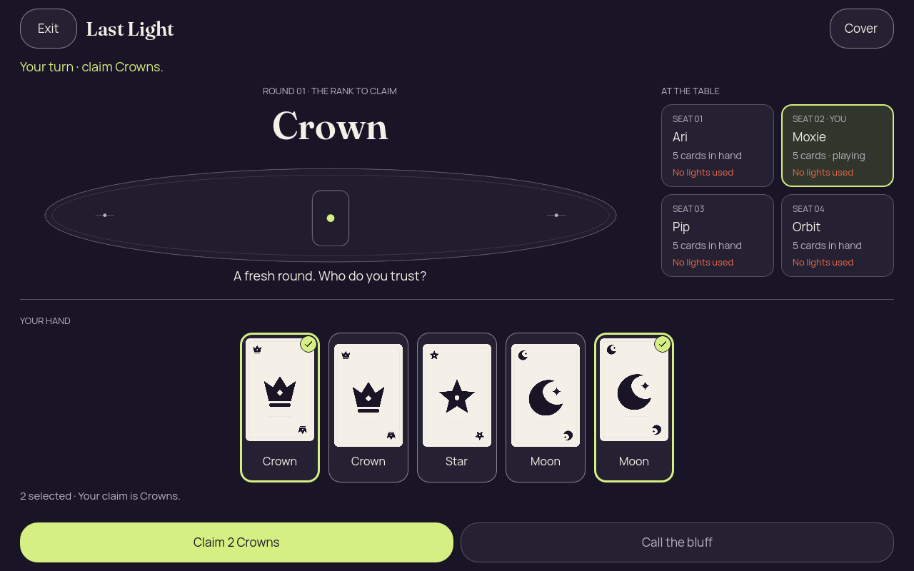</a> | **Own hand revealed with first and last cards selected — desktop** Godot 4.7.2 desktop, 2D Compatibility renderer Original: [02-revealed-selected.png](desktop/02-revealed-selected.png) 1280 × 800 px; text 1× SHA-256: <code>96dfde9c84ba2a1d61a5065600529ba4cb8bf87cb1b806cd881fa1fde58eb858</code> [Original diagnostics](desktop/02-revealed-selected.json) Static recipient-safe fixture derived from the Kotlin authority; no authority-accepted action is exercised. The selection hint is fully visible in this iteration. |
| <a href="desktop/03-covered-again.png">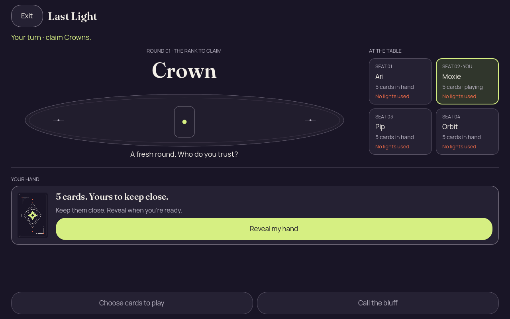</a> | **Hand covered after selection — desktop** Godot 4.7.2 desktop, 2D Compatibility renderer Original: [03-covered-again.png](desktop/03-covered-again.png) 1280 × 800 px; text 1× SHA-256: <code>189db7c240676c426fdcc7b36447e7bb62957c951ba3ee8a6b9fa24423110ead</code> [Original diagnostics](desktop/03-covered-again.json) Static recipient-safe fixture derived from the Kotlin authority; no authority-accepted action is exercised. |
|  | **Hand remains covered after background and resume — desktop** Godot 4.7.2 desktop, 2D Compatibility renderer Original: [04-resumed-covered.png](desktop/04-resumed-covered.png) 1280 × 800 px; text 1× SHA-256: <code>189db7c240676c426fdcc7b36447e7bb62957c951ba3ee8a6b9fa24423110ead</code> [Original diagnostics](desktop/04-resumed-covered.json) Static recipient-safe fixture derived from the Kotlin authority; no authority-accepted action is exercised. |

## Phone, 200% text

[Original static check report](phone-large-text/report.json).

| Original image | Scenario and provenance |
| --- | --- |
| <a href="phone-large-text/01-concealed.png">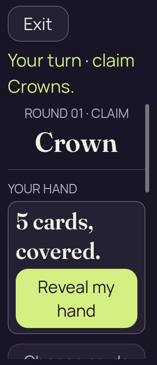</a> | **Initial concealed own hand — phone, 200% text** Godot 4.7.2 desktop, 2D Compatibility renderer Original: [01-concealed.png](phone-large-text/01-concealed.png) 320 × 740 px; text 2× SHA-256: <code>76800f9a5ed10c645e0b9e632782475c095217f817d0154cfee712d25a7f9935</code> [Original diagnostics](phone-large-text/01-concealed.json) Static recipient-safe fixture derived from the Kotlin authority; no authority-accepted action is exercised. Reveal is visible in the initial 320 × 740 viewport at 200% text. |
| <a href="phone-large-text/02-revealed-selected.png">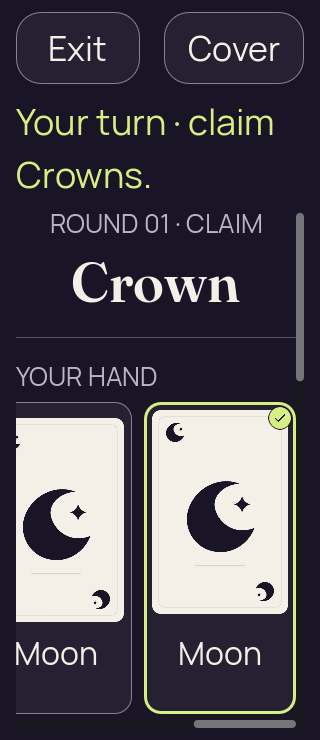</a> | **Own hand revealed with first and last cards selected — phone, 200% text** Godot 4.7.2 desktop, 2D Compatibility renderer Original: [02-revealed-selected.png](phone-large-text/02-revealed-selected.png) 320 × 740 px; text 2× SHA-256: <code>f96b492b4bd48cec3006b2392bd169e43343553112c6e669838d24690290cd8d</code> [Original diagnostics](phone-large-text/02-revealed-selected.json) Static recipient-safe fixture derived from the Kotlin authority; no authority-accepted action is exercised. |
| <a href="phone-large-text/03-covered-again.png">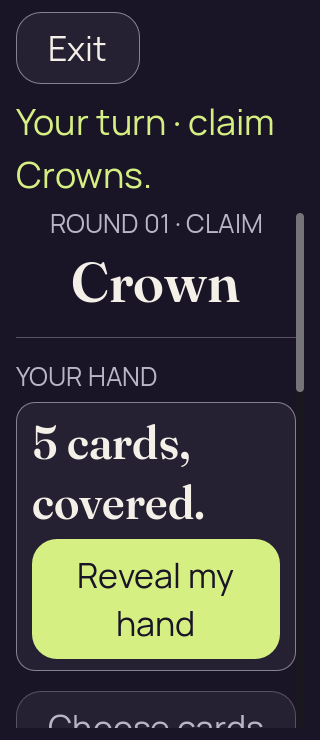</a> | **Hand covered after selection — phone, 200% text** Godot 4.7.2 desktop, 2D Compatibility renderer Original: [03-covered-again.png](phone-large-text/03-covered-again.png) 320 × 740 px; text 2× SHA-256: <code>220d90a1b767cd395d8203897d26701702b0c0897846821316d0cfbc8fcafd75</code> [Original diagnostics](phone-large-text/03-covered-again.json) Static recipient-safe fixture derived from the Kotlin authority; no authority-accepted action is exercised. |
|  | **Hand remains covered after background and resume — phone, 200% text** Godot 4.7.2 desktop, 2D Compatibility renderer Original: [04-resumed-covered.png](phone-large-text/04-resumed-covered.png) 320 × 740 px; text 2× SHA-256: <code>220d90a1b767cd395d8203897d26701702b0c0897846821316d0cfbc8fcafd75</code> [Original diagnostics](phone-large-text/04-resumed-covered.json) Static recipient-safe fixture derived from the Kotlin authority; no authority-accepted action is exercised. |

## Short landscape

[Original static check report](short-landscape/report.json).

| Original image | Scenario and provenance |
| --- | --- |
|  | **Initial concealed own hand — short landscape** Godot 4.7.2 desktop, 2D Compatibility renderer Original: [01-concealed.png](short-landscape/01-concealed.png) 844 × 390 px; text 1× SHA-256: <code>e0739db13429b533f2389fbf0dbb2d868fb83e3ff610442fc4b94503916e0c96</code> [Original diagnostics](short-landscape/01-concealed.json) Static recipient-safe fixture derived from the Kotlin authority; no authority-accepted action is exercised. Reveal, or the selected cards and Claim action, is visible within the 844 × 390 viewport. |
| <a href="short-landscape/02-revealed-selected.png">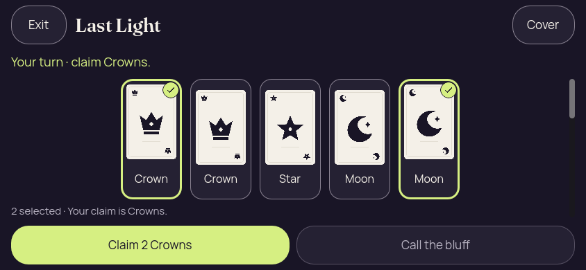</a> | **Own hand revealed with first and last cards selected — short landscape** Godot 4.7.2 desktop, 2D Compatibility renderer Original: [02-revealed-selected.png](short-landscape/02-revealed-selected.png) 844 × 390 px; text 1× SHA-256: <code>25ea93720f965e730908d3e37c9c03a513080ed739989a64a0dc756151ed61b9</code> [Original diagnostics](short-landscape/02-revealed-selected.json) Static recipient-safe fixture derived from the Kotlin authority; no authority-accepted action is exercised. Reveal, or the selected cards and Claim action, is visible within the 844 × 390 viewport. |
|  | **Hand covered after selection — short landscape** Godot 4.7.2 desktop, 2D Compatibility renderer Original: [03-covered-again.png](short-landscape/03-covered-again.png) 844 × 390 px; text 1× SHA-256: <code>e0739db13429b533f2389fbf0dbb2d868fb83e3ff610442fc4b94503916e0c96</code> [Original diagnostics](short-landscape/03-covered-again.json) Static recipient-safe fixture derived from the Kotlin authority; no authority-accepted action is exercised. Reveal, or the selected cards and Claim action, is visible within the 844 × 390 viewport. |
| <a href="short-landscape/04-resumed-covered.png">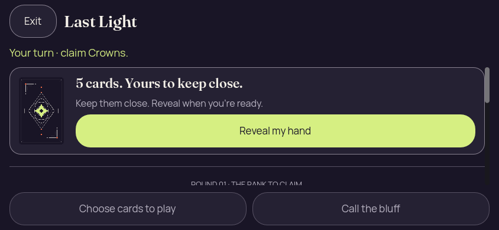</a> | **Hand remains covered after background and resume — short landscape** Godot 4.7.2 desktop, 2D Compatibility renderer Original: [04-resumed-covered.png](short-landscape/04-resumed-covered.png) 844 × 390 px; text 1× SHA-256: <code>e0739db13429b533f2389fbf0dbb2d868fb83e3ff610442fc4b94503916e0c96</code> [Original diagnostics](short-landscape/04-resumed-covered.json) Static recipient-safe fixture derived from the Kotlin authority; no authority-accepted action is exercised. Reveal, or the selected cards and Claim action, is visible within the 844 × 390 viewport. |

## Round 2 with older outcome in input

[Original static check report](old-round-proof/report.json).

| Original image | Scenario and provenance |
| --- | --- |
| <a href="old-round-proof/01-concealed.png">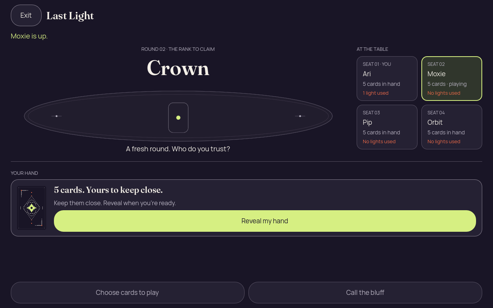</a> | **Initial concealed own hand — round 2 with older outcome in input** Godot 4.7.2 desktop, 2D Compatibility renderer Original: [01-concealed.png](old-round-proof/01-concealed.png) 1280 × 800 px; text 1× SHA-256: <code>4f4ad72803b23c404e0f1295e0ea334add4446dfd4d58acb9152ada9f2fc86bd</code> [Original diagnostics](old-round-proof/01-concealed.json) Static recipient-safe fixture derived from the Kotlin authority; no authority-accepted action is exercised. The input retains the previous round outcome, but its proof is correctly absent from the current round-2 table. |
| <a href="old-round-proof/02-revealed-selected.png">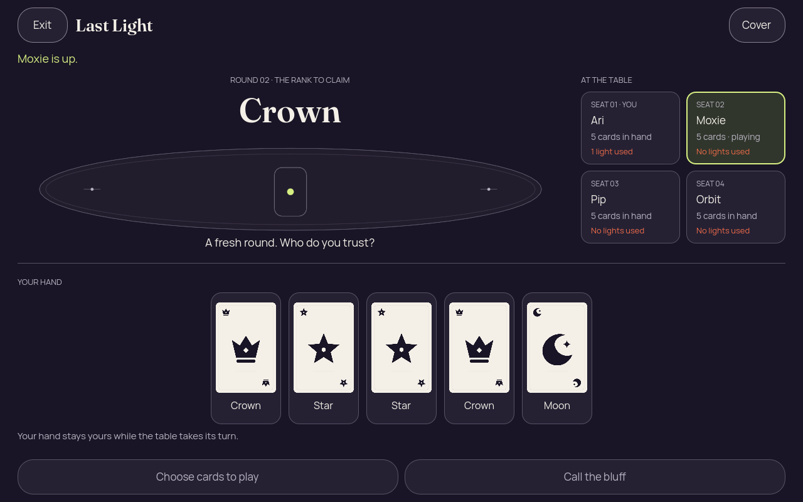</a> | **Own hand revealed with zero selected cards; Moxie is taking the turn — round 2** Godot 4.7.2 desktop, 2D Compatibility renderer Original: [02-revealed-selected.png](old-round-proof/02-revealed-selected.png) 1280 × 800 px; text 1× SHA-256: <code>09f92d1b8664b0728201443dc8d4eff32816d03a7f3888901d858f7578296c07</code> [Original diagnostics](old-round-proof/02-revealed-selected.json) Static recipient-safe fixture derived from the Kotlin authority; no authority-accepted action is exercised. The input retains the previous round outcome, but its proof is correctly absent from the current round-2 table. |
|  | **Hand covered after selection — round 2 with older outcome in input** Godot 4.7.2 desktop, 2D Compatibility renderer Original: [03-covered-again.png](old-round-proof/03-covered-again.png) 1280 × 800 px; text 1× SHA-256: <code>4f4ad72803b23c404e0f1295e0ea334add4446dfd4d58acb9152ada9f2fc86bd</code> [Original diagnostics](old-round-proof/03-covered-again.json) Static recipient-safe fixture derived from the Kotlin authority; no authority-accepted action is exercised. The input retains the previous round outcome, but its proof is correctly absent from the current round-2 table. |
|  | **Hand remains covered after background and resume — round 2 with older outcome in input** Godot 4.7.2 desktop, 2D Compatibility renderer Original: [04-resumed-covered.png](old-round-proof/04-resumed-covered.png) 1280 × 800 px; text 1× SHA-256: <code>4f4ad72803b23c404e0f1295e0ea334add4446dfd4d58acb9152ada9f2fc86bd</code> [Original diagnostics](old-round-proof/04-resumed-covered.json) Static recipient-safe fixture derived from the Kotlin authority; no authority-accepted action is exercised. The input retains the previous round outcome, but its proof is correctly absent from the current round-2 table. |

## Phone round result

[Original static check report](round-result-phone/report.json).

| Original image | Scenario and provenance |
| --- | --- |
| <a href="round-result-phone/01-concealed.png">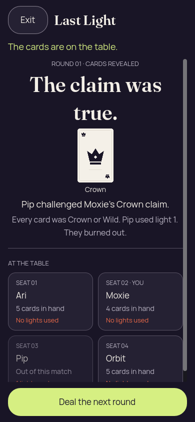</a> | **Truthful Crown claim; Pip used light 1 and burned out — phone** Godot 4.7.2 desktop, 2D Compatibility renderer Original: [01-concealed.png](round-result-phone/01-concealed.png) 390 × 844 px; text 1× SHA-256: <code>63b196928d54100606170d90dca5d48cf71441eae82e247b1c29bbb9216363f1</code> [Original diagnostics](round-result-phone/01-concealed.json) Static recipient-safe fixture derived from the Kotlin authority; no authority-accepted action is exercised. |

## Phone winner

[Original static check report](winner-phone/report.json).

| Original image | Scenario and provenance |
| --- | --- |
| <a href="winner-phone/01-concealed.png">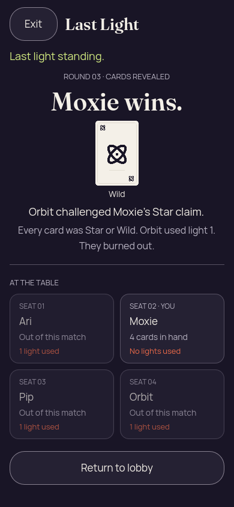</a> | **Moxie wins in round 3; public Wild supports a Star claim — phone winner** Godot 4.7.2 desktop, 2D Compatibility renderer Original: [01-concealed.png](winner-phone/01-concealed.png) 390 × 844 px; text 1× SHA-256: <code>426743bc528741c1ad211436f47f25c8c43c27e989798a7cea41f6903d704ba6</code> [Original diagnostics](winner-phone/01-concealed.json) Static recipient-safe fixture derived from the Kotlin authority; no authority-accepted action is exercised. Orbit used light 1 and burned out. |

## Winner, 200% text

[Original static check report](winner-large-text/report.json).

| Original image | Scenario and provenance |
| --- | --- |
| <a href="winner-large-text/01-concealed.png">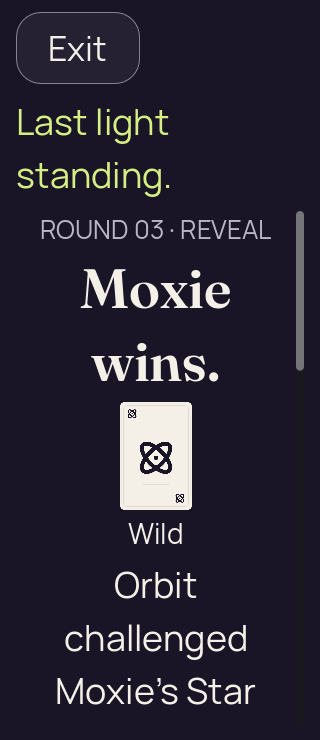</a> | **Moxie wins in round 3; public Wild supports a Star claim — winner, 200% text** Godot 4.7.2 desktop, 2D Compatibility renderer Original: [01-concealed.png](winner-large-text/01-concealed.png) 320 × 740 px; text 2× SHA-256: <code>096b06b54baa13330df4e829a7ebc56a3a8ab86ba8b1afba3fb978664162f692</code> [Original diagnostics](winner-large-text/01-concealed.json) Static recipient-safe fixture derived from the Kotlin authority; no authority-accepted action is exercised. Orbit used light 1 and burned out. Winner and public Wild are visible; the explanation and navigation lie below the initial 740-pixel viewport. |

## Lobby permission fixture, phone

[Original static check report](lobby-phone/report.json).

| Original image | Scenario and provenance |
| --- | --- |
|  | **Initial concealed own hand — lobby permission fixture, phone** Godot 4.7.2 desktop, 2D Compatibility renderer Original: [01-concealed.png](lobby-phone/01-concealed.png) 390 × 844 px; text 1× SHA-256: <code>d32766615f0388c2704fe265b1cba1b1f414c56984face8183d4d57847cc6e3f</code> [Original diagnostics](lobby-phone/01-concealed.json) Synthetic recipient-safe lobby permission layout data; no live invitation or admission value. |
| <a href="lobby-phone/02-revealed-selected.png">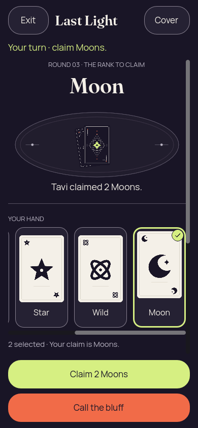</a> | **Own hand revealed with first and last cards selected — lobby permission fixture, phone** Godot 4.7.2 desktop, 2D Compatibility renderer Original: [02-revealed-selected.png](lobby-phone/02-revealed-selected.png) 390 × 844 px; text 1× SHA-256: <code>8f03656a339f3d91917181f1b2df953150337f82b3c0fbe828bf4a867ca27e39</code> [Original diagnostics](lobby-phone/02-revealed-selected.json) Synthetic recipient-safe lobby permission layout data; no live invitation or admission value. |
| <a href="lobby-phone/03-covered-again.png">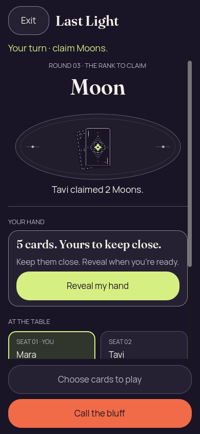</a> | **Hand covered after selection — lobby permission fixture, phone** Godot 4.7.2 desktop, 2D Compatibility renderer Original: [03-covered-again.png](lobby-phone/03-covered-again.png) 390 × 844 px; text 1× SHA-256: <code>d32766615f0388c2704fe265b1cba1b1f414c56984face8183d4d57847cc6e3f</code> [Original diagnostics](lobby-phone/03-covered-again.json) Synthetic recipient-safe lobby permission layout data; no live invitation or admission value. |
|  | **Hand remains covered after background and resume — lobby permission fixture, phone** Godot 4.7.2 desktop, 2D Compatibility renderer Original: [04-resumed-covered.png](lobby-phone/04-resumed-covered.png) 390 × 844 px; text 1× SHA-256: <code>d32766615f0388c2704fe265b1cba1b1f414c56984face8183d4d57847cc6e3f</code> [Original diagnostics](lobby-phone/04-resumed-covered.json) Synthetic recipient-safe lobby permission layout data; no live invitation or admission value. |
| <a href="lobby-phone/05-lobby-confirmation.png">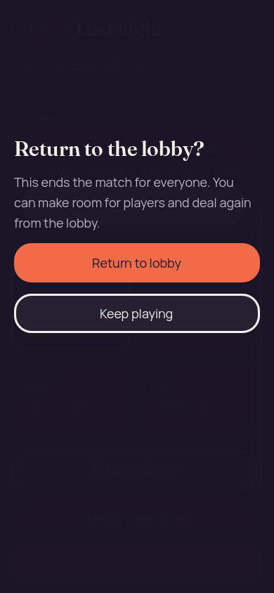</a> | **Return-to-lobby confirmation — lobby permission fixture, phone** Godot 4.7.2 desktop, 2D Compatibility renderer Original: [05-lobby-confirmation.png](lobby-phone/05-lobby-confirmation.png) 390 × 844 px; text 1× SHA-256: <code>677294ed37792739c699ceccde47bdd1f4f4e2d2eff6291898e3cb92a9b72bef</code> [Original diagnostics](lobby-phone/05-lobby-confirmation.json) Synthetic recipient-safe lobby permission layout data; no live invitation or admission value. Consequences, Return and Keep playing are visible together. |

## Lobby permission fixture, 200% text

[Original static check report](lobby-large-text/report.json).

| Original image | Scenario and provenance |
| --- | --- |
| <a href="lobby-large-text/01-concealed.png">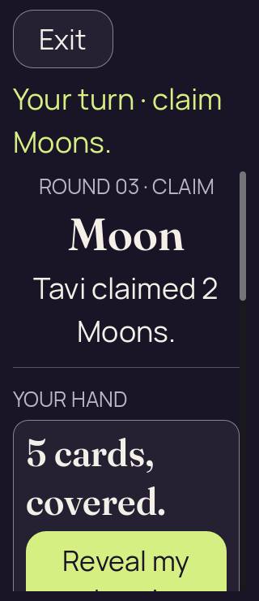</a> | **Initial concealed own hand — lobby permission fixture, 200% text** Godot 4.7.2 desktop, 2D Compatibility renderer Original: [01-concealed.png](lobby-large-text/01-concealed.png) 320 × 740 px; text 2× SHA-256: <code>cefcb568a6799ecfd87c208e49d3eeb6e7fcf057fc021e0b40229ed2a2fe1601</code> [Original diagnostics](lobby-large-text/01-concealed.json) Synthetic recipient-safe lobby permission layout data; no live invitation or admission value. |
| <a href="lobby-large-text/02-revealed-selected.png">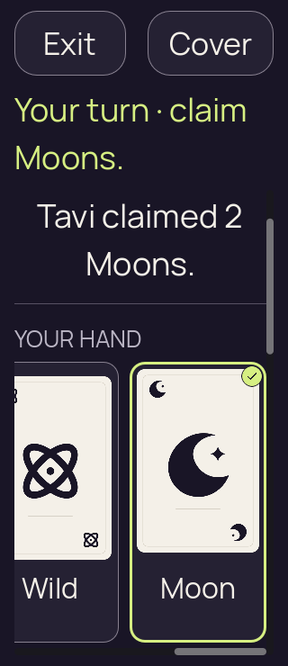</a> | **Own hand revealed with first and last cards selected — lobby permission fixture, 200% text** Godot 4.7.2 desktop, 2D Compatibility renderer Original: [02-revealed-selected.png](lobby-large-text/02-revealed-selected.png) 320 × 740 px; text 2× SHA-256: <code>c4087efdddea0f36a73d6eff8a0c2531f06655de9e21e405c1ad0ae6ff78c733</code> [Original diagnostics](lobby-large-text/02-revealed-selected.json) Synthetic recipient-safe lobby permission layout data; no live invitation or admission value. |
|  | **Hand covered after selection — lobby permission fixture, 200% text** Godot 4.7.2 desktop, 2D Compatibility renderer Original: [03-covered-again.png](lobby-large-text/03-covered-again.png) 320 × 740 px; text 2× SHA-256: <code>7d4add1df20208e85230c692ea34a8c436b298cd07de79ebbe12bca639a0cbe1</code> [Original diagnostics](lobby-large-text/03-covered-again.json) Synthetic recipient-safe lobby permission layout data; no live invitation or admission value. |
|  | **Hand remains covered after background and resume — lobby permission fixture, 200% text** Godot 4.7.2 desktop, 2D Compatibility renderer Original: [04-resumed-covered.png](lobby-large-text/04-resumed-covered.png) 320 × 740 px; text 2× SHA-256: <code>7d4add1df20208e85230c692ea34a8c436b298cd07de79ebbe12bca639a0cbe1</code> [Original diagnostics](lobby-large-text/04-resumed-covered.json) Synthetic recipient-safe lobby permission layout data; no live invitation or admission value. |
| <a href="lobby-large-text/05-lobby-confirmation.png">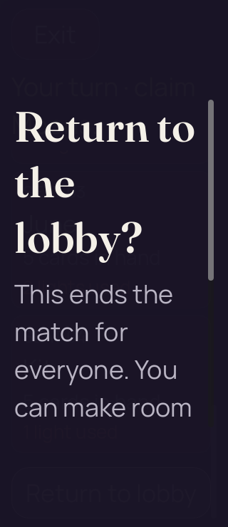</a> | **Return-to-lobby confirmation — lobby permission fixture, 200% text** Godot 4.7.2 desktop, 2D Compatibility renderer Original: [05-lobby-confirmation.png](lobby-large-text/05-lobby-confirmation.png) 320 × 740 px; text 2× SHA-256: <code>10e53faeaa79cf135a04027f4e503d272cb55c0fea97f25950b394c46f87f4c2</code> [Original diagnostics](lobby-large-text/05-lobby-confirmation.json) Synthetic recipient-safe lobby permission layout data; no live invitation or admission value. Visual failure: both choices are below the initial viewport. Return is at y=771, height 124; Keep playing is at y=911, height 74; viewport height is 740. The checker passes only after programmatically scrolling. |
