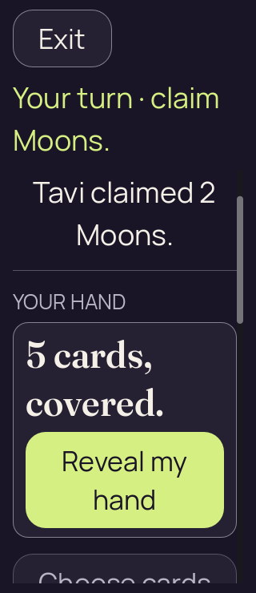
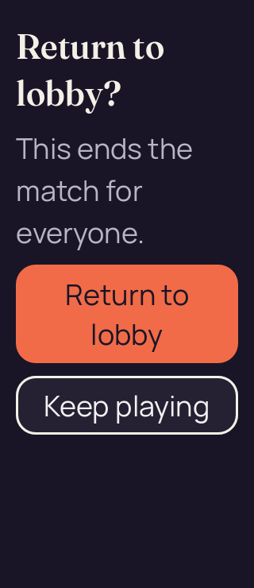
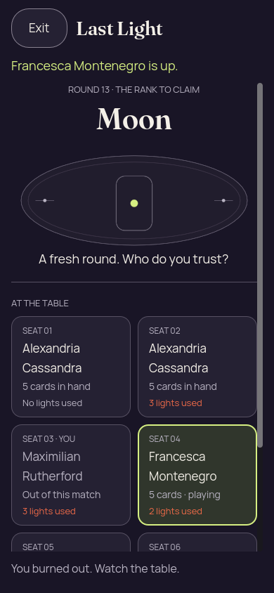
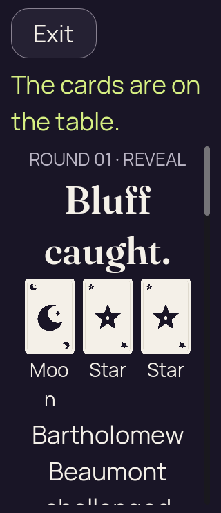

# Godot 2D — iteration 04, compact confirmation and authority edge fixtures

[All screenshot collections](../README.md)

**Evidence status:** The 200% lobby confirmation now shows its consequences and both choices together. Eliminated-player privacy is visible. The three-card public proof still splits Moon across lines; this failed text layout is retained.

The three bounded static reports pass. The initial large-text lobby playing frame still clips Reveal, and the public-proof explanation continues below the viewport. The seed-2 edge inputs were produced with the existing Kotlin LastLightEngine; the included Java generator only serializes recipient-safe GameView/bridge data. The native-lobby-permission input remains explicitly synthetic layout data.

Actual Godot `4.7.2.stable.official.ed1daf0bf`, OpenGL Compatibility / Mesa llvmpipe / Xvfb. These are desktop renderer pixels at the recorded sizes and text settings. [Original source provenance](source-provenance.json) records a working tree over basis `91a4c9c50fb91f6f88ed596dfd1c27433c66ac11`; no exact capture commit is claimed. Implementation hashes are preserved, but the implementation files themselves were not frozen for this 2D iteration.

[The frozen inputs](../godot-2d-iteration-04/fixtures/) and [their Java generator](../godot-2d-iteration-04/PartyDeck2DEdgeFixtures.java) are retained once with iteration 04. Authority-derived inputs explicitly record seed 2; the lobby permission input is synthetic. The fixtures contain recipient-safe DTOs, not serialized authoritative GameState or live invitation credentials.

All 7 supplied PNGs are preserved, including repeated states and failed-attempt initial frames. Every unique image state was visually inspected and copied bytes were verified. Local checks can programmatically scroll controls into view; a passing report is not an initial-viewport, native touch, accessibility or native OS lifecycle pass. Concealed, covered, resumed, confirmation and public-outcome diagnostics retain zero private faces, labels and selection. Revealed forced-challenge input has two private cards and no selection; ordinary revealed hands have five faces/labels and two selected cards.

## Lobby large text

[Original static report](lobby-large-text/report.json).

| Original image | Scenario and provenance |
| --- | --- |
|  | **Initial concealed own hand — lobby large text** Godot 4.7.2 desktop, 2D Compatibility renderer Original: [01-concealed.png](lobby-large-text/01-concealed.png) 320 × 740 px; text 2× SHA-256: <code>cefcb568a6799ecfd87c208e49d3eeb6e7fcf057fc021e0b40229ed2a2fe1601</code> [Original diagnostics](lobby-large-text/01-concealed.json) Synthetic recipient-safe lobby permission layout data; no live invitation/admission value. The initial large-text playing view still clips the lower portion of Reveal; the checker can scroll it into view. |
|  | **Own hand revealed with first and last cards selected — lobby large text** Godot 4.7.2 desktop, 2D Compatibility renderer Original: [02-revealed-selected.png](lobby-large-text/02-revealed-selected.png) 320 × 740 px; text 2× SHA-256: <code>c4087efdddea0f36a73d6eff8a0c2531f06655de9e21e405c1ad0ae6ff78c733</code> [Original diagnostics](lobby-large-text/02-revealed-selected.json) Synthetic recipient-safe lobby permission layout data; no live invitation/admission value. |
|  | **Hand covered with selection cleared — lobby large text** Godot 4.7.2 desktop, 2D Compatibility renderer Original: [03-covered-again.png](lobby-large-text/03-covered-again.png) 320 × 740 px; text 2× SHA-256: <code>7d4add1df20208e85230c692ea34a8c436b298cd07de79ebbe12bca639a0cbe1</code> [Original diagnostics](lobby-large-text/03-covered-again.json) Synthetic recipient-safe lobby permission layout data; no live invitation/admission value. |
|  | **Hand remains covered after background and resume — lobby large text** Godot 4.7.2 desktop, 2D Compatibility renderer Original: [04-resumed-covered.png](lobby-large-text/04-resumed-covered.png) 320 × 740 px; text 2× SHA-256: <code>7d4add1df20208e85230c692ea34a8c436b298cd07de79ebbe12bca639a0cbe1</code> [Original diagnostics](lobby-large-text/04-resumed-covered.json) Synthetic recipient-safe lobby permission layout data; no live invitation/admission value. |
|  | **Return-to-lobby confirmation — lobby large text** Godot 4.7.2 desktop, 2D Compatibility renderer Original: [05-lobby-confirmation.png](lobby-large-text/05-lobby-confirmation.png) 320 × 740 px; text 2× SHA-256: <code>e98f760c7323c8d0f91c1852101bf1b7007e3669011b45a855713bd8e6136b76</code> [Original diagnostics](lobby-large-text/05-lobby-confirmation.json) Synthetic recipient-safe lobby permission layout data; no live invitation/admission value. At 320 × 740 and 200% text, consequences, Return to lobby and Keep playing are fully visible together. |

## Eliminated phone

[Original static report](eliminated-phone/report.json).

| Original image | Scenario and provenance |
| --- | --- |
|  | **Eliminated viewer watches Francesca’s Moon round** Godot 4.7.2 desktop, 2D Compatibility renderer Original: [01-concealed.png](eliminated-phone/01-concealed.png) 390 × 844 px; text 1×; seed 2 SHA-256: <code>caeb2873a51553c77ae4ffe564f300e5718d158ed6b39f452f24a2b006feeb4f</code> [Original diagnostics](eliminated-phone/01-concealed.json) Static seed-2 recipient-safe Kotlin-authority projection; renderer actions are not round-tripped to the authority. Round 13: Maximilian Rutherford has no private hand or play/reveal action; the previous round’s proof is not drawn on the current table. |

## Three card proof large text

[Original static report](three-card-proof-large-text/report.json).

| Original image | Scenario and provenance |
| --- | --- |
|  | **Public Moon, Star and Star reveal after a Star claim — 200% text** Godot 4.7.2 desktop, 2D Compatibility renderer Original: [01-concealed.png](three-card-proof-large-text/01-concealed.png) 320 × 740 px; text 2×; seed 2 SHA-256: <code>6252af1fb8ed780a8658a9e5c611330f2d5b7737212e002ae8c2a1d4f3a72ab2</code> [Original diagnostics](three-card-proof-large-text/01-concealed.json) Static seed-2 recipient-safe Kotlin-authority projection; renderer actions are not round-tripped to the authority. Bartholomew Beaumont challenged Francesca Montenegro; Moon mismatched the Star claim, so Francesca used light 1 and stays in. Visual failure: Moon wraps as “Moo” and “n”; the explanation continues below the initial viewport. |
