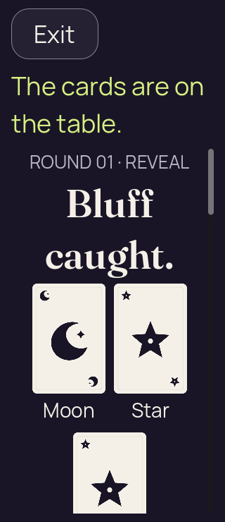
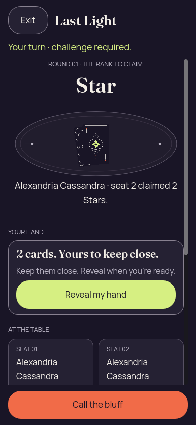
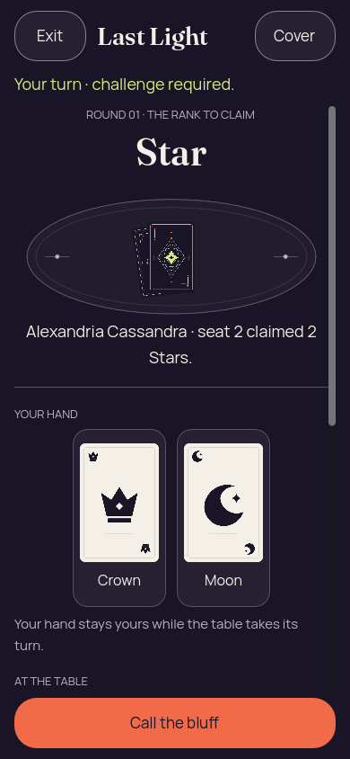
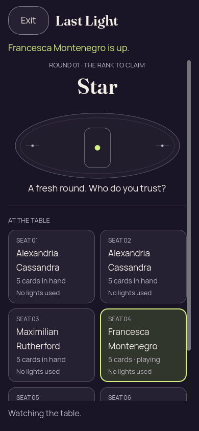
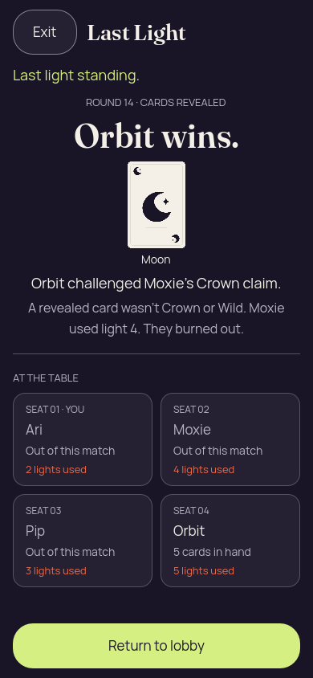
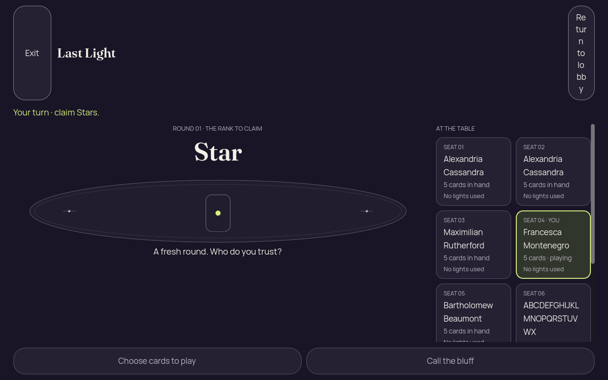
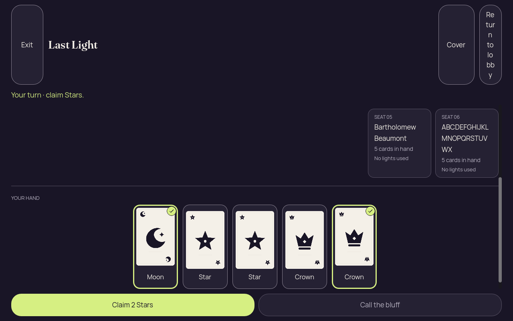
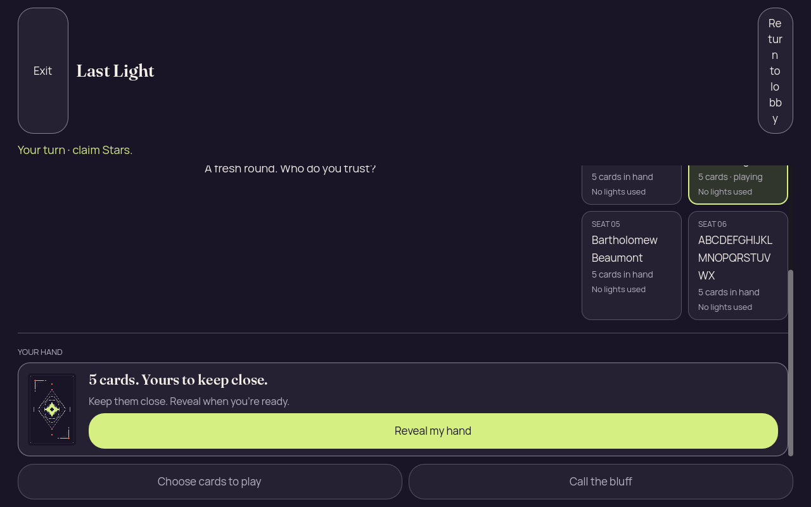

# Godot 2D — iteration 05, proof reflow and retained header/gesture failures

[All screenshot collections](../README.md)

**Evidence status:** Public proof labels reflow without splitting Moon; forced challenge, observer and winner frames are readable. The six-player desktop lobby control wraps into a 199-pixel header, and the temporary emulated-touch probe fails before later capture stages.

Five static reports pass. Proof reflow places the third public card and the detailed explanation below the initial 200% viewport. The temporary gesture probe has only its initial capture and a supplied failure record; no gesture success or clean runtime report is claimed for it. Its failure record does not determine whether scrolling, selection, touch availability or coordinates caused the failure.

Actual Godot `4.7.2.stable.official.ed1daf0bf`, OpenGL Compatibility / Mesa llvmpipe / Xvfb. These are desktop renderer pixels at the recorded sizes and text settings. [Original source provenance](source-provenance.json) records a working tree over basis `91a4c9c50fb91f6f88ed596dfd1c27433c66ac11`; no exact capture commit is claimed. Implementation hashes are preserved, but the implementation files themselves were not frozen for this 2D iteration.

[The frozen inputs](../godot-2d-iteration-04/fixtures/) and [their Java generator](../godot-2d-iteration-04/PartyDeck2DEdgeFixtures.java) are retained once with iteration 04. Authority-derived inputs explicitly record seed 2; the lobby permission input is synthetic. The fixtures contain recipient-safe DTOs, not serialized authoritative GameState or live invitation credentials.

All 12 supplied PNGs are preserved, including repeated states and failed-attempt initial frames. Every unique image state was visually inspected and copied bytes were verified. Local checks can programmatically scroll controls into view; a passing report is not an initial-viewport, native touch, accessibility or native OS lifecycle pass. Concealed, covered, resumed, confirmation and public-outcome diagnostics retain zero private faces, labels and selection. Revealed forced-challenge input has two private cards and no selection; ordinary revealed hands have five faces/labels and two selected cards.

## Three card proof large text

[Original static report](three-card-proof-large-text/report.json).

| Original image | Scenario and provenance |
| --- | --- |
|  | **Public Moon, Star and Star reveal after a Star claim — 200% text** Godot 4.7.2 desktop, 2D Compatibility renderer Original: [01-concealed.png](three-card-proof-large-text/01-concealed.png) 320 × 740 px; text 2×; seed 2 SHA-256: <code>7bce65c450f2f3c3754ac82c35a34eceb4979a88ff46f386ff70473c88da7da0</code> [Original diagnostics](three-card-proof-large-text/01-concealed.json) Static seed-2 recipient-safe Kotlin-authority projection; renderer actions are not round-tripped to the authority. Bartholomew Beaumont challenged Francesca Montenegro; Moon mismatched the Star claim, so Francesca used light 1 and stays in. Moon and Star labels stay whole after reflow; the third card and detailed explanation extend below the initial viewport. |

## Forced challenge phone

[Original static report](forced-challenge-phone/report.json).

| Original image | Scenario and provenance |
| --- | --- |
|  | **Initial concealed own hand — forced challenge phone** Godot 4.7.2 desktop, 2D Compatibility renderer Original: [01-concealed.png](forced-challenge-phone/01-concealed.png) 390 × 844 px; text 1×; seed 2 SHA-256: <code>17970f35dec022f589b2728085a70f0a81c444501fff03f49d8adc16f9a21d33</code> [Original diagnostics](forced-challenge-phone/01-concealed.json) Static seed-2 recipient-safe Kotlin-authority projection; renderer actions are not round-tripped to the authority. Duplicate claimant name is disambiguated as seat 2; Call the bluff is the only gameplay action. |
|  | **Forced challenge: own Crown and Moon revealed, zero selected cards** Godot 4.7.2 desktop, 2D Compatibility renderer Original: [02-revealed-selected.png](forced-challenge-phone/02-revealed-selected.png) 390 × 844 px; text 1×; seed 2 SHA-256: <code>8e9f3ddcc6eedaed7117d4b7dbfa425178275d1d1c7d44b42948d6323b1b0bee</code> [Original diagnostics](forced-challenge-phone/02-revealed-selected.json) Static seed-2 recipient-safe Kotlin-authority projection; renderer actions are not round-tripped to the authority. Duplicate claimant name is disambiguated as seat 2; Call the bluff is the only gameplay action. |
|  | **Hand covered with selection cleared — forced challenge phone** Godot 4.7.2 desktop, 2D Compatibility renderer Original: [03-covered-again.png](forced-challenge-phone/03-covered-again.png) 390 × 844 px; text 1×; seed 2 SHA-256: <code>17970f35dec022f589b2728085a70f0a81c444501fff03f49d8adc16f9a21d33</code> [Original diagnostics](forced-challenge-phone/03-covered-again.json) Static seed-2 recipient-safe Kotlin-authority projection; renderer actions are not round-tripped to the authority. Duplicate claimant name is disambiguated as seat 2; Call the bluff is the only gameplay action. |
|  | **Hand remains covered after background and resume — forced challenge phone** Godot 4.7.2 desktop, 2D Compatibility renderer Original: [04-resumed-covered.png](forced-challenge-phone/04-resumed-covered.png) 390 × 844 px; text 1×; seed 2 SHA-256: <code>17970f35dec022f589b2728085a70f0a81c444501fff03f49d8adc16f9a21d33</code> [Original diagnostics](forced-challenge-phone/04-resumed-covered.json) Static seed-2 recipient-safe Kotlin-authority projection; renderer actions are not round-tripped to the authority. Duplicate claimant name is disambiguated as seat 2; Call the bluff is the only gameplay action. |

## Observer phone

[Original static report](observer-phone/report.json).

| Original image | Scenario and provenance |
| --- | --- |
|  | **Unseated observer watches a six-player Star round** Godot 4.7.2 desktop, 2D Compatibility renderer Original: [01-concealed.png](observer-phone/01-concealed.png) 390 × 844 px; text 1×; seed 2 SHA-256: <code>a1a89f0eb1e231f60026b27cea6f0acccd5cf0a2aa54d123254645817bdfdb66</code> [Original diagnostics](observer-phone/01-concealed.json) Static seed-2 recipient-safe Kotlin-authority projection; renderer actions are not round-tripped to the authority. No private hand, Reveal or gameplay action is exposed. |

## Winner phone

[Original static report](winner-phone/report.json).

| Original image | Scenario and provenance |
| --- | --- |
|  | **Orbit wins after Moxie’s Moon bluff against Crown** Godot 4.7.2 desktop, 2D Compatibility renderer Original: [01-concealed.png](winner-phone/01-concealed.png) 390 × 844 px; text 1×; seed 2 SHA-256: <code>da5c155b9d7522b3dac01f53608ab8c113679fc04905cb410d8de4ccb8c86af0</code> [Original diagnostics](winner-phone/01-concealed.json) Static seed-2 recipient-safe Kotlin-authority projection; renderer actions are not round-tripped to the authority. Named final challenger, claimant, Crown claim, public Moon and Moxie’s light-4 burnout are visible. |

## Six long names desktop

[Original static report](six-long-names-desktop/report.json).

| Original image | Scenario and provenance |
| --- | --- |
|  | **Initial concealed own hand — six long names desktop** Godot 4.7.2 desktop, 2D Compatibility renderer Original: [01-concealed.png](six-long-names-desktop/01-concealed.png) 1280 × 800 px; text 1×; seed 2 SHA-256: <code>9c40a9754ee32e214c74efe7cca6137b27abb668df93aedfe9686afb6d72b64f</code> [Original diagnostics](six-long-names-desktop/01-concealed.json) Static seed-2 recipient-safe Kotlin-authority projection; renderer actions are not round-tripped to the authority. Visual failure: a 56-pixel-wide lobby control wraps into a 199-pixel-high header and the initial Reveal is below the viewport. |
|  | **Own hand revealed with first and last cards selected — six long names desktop** Godot 4.7.2 desktop, 2D Compatibility renderer Original: [02-revealed-selected.png](six-long-names-desktop/02-revealed-selected.png) 1280 × 800 px; text 1×; seed 2 SHA-256: <code>bf4d8a2b22945ecb72a6ce00d7626e9783365459effddba0c8cd314fc3521ea4</code> [Original diagnostics](six-long-names-desktop/02-revealed-selected.json) Static seed-2 recipient-safe Kotlin-authority projection; renderer actions are not round-tripped to the authority. Visual failure: a 56-pixel-wide lobby control wraps into a 199-pixel-high header and the initial Reveal is below the viewport. |
|  | **Hand covered with selection cleared — six long names desktop** Godot 4.7.2 desktop, 2D Compatibility renderer Original: [03-covered-again.png](six-long-names-desktop/03-covered-again.png) 1280 × 800 px; text 1×; seed 2 SHA-256: <code>1772957bfe438da88d2b643758f896fdccdfe365fccdbbd83efc3887673b3992</code> [Original diagnostics](six-long-names-desktop/03-covered-again.json) Static seed-2 recipient-safe Kotlin-authority projection; renderer actions are not round-tripped to the authority. Visual failure: a 56-pixel-wide lobby control wraps into a 199-pixel-high header and the initial Reveal is below the viewport. |
|  | **Hand remains covered after background and resume — six long names desktop** Godot 4.7.2 desktop, 2D Compatibility renderer Original: [04-resumed-covered.png](six-long-names-desktop/04-resumed-covered.png) 1280 × 800 px; text 1×; seed 2 SHA-256: <code>1772957bfe438da88d2b643758f896fdccdfe365fccdbbd83efc3887673b3992</code> [Original diagnostics](six-long-names-desktop/04-resumed-covered.json) Static seed-2 recipient-safe Kotlin-authority projection; renderer actions are not round-tripped to the authority. Visual failure: a 56-pixel-wide lobby control wraps into a 199-pixel-high header and the initial Reveal is below the viewport. |

## Emulated drag phone

[Supplied failure record](emulated-drag-phone/failure.json) · [Original temporary probe](emulated-drag-phone/gesture-check.gd).

| Original image | Scenario and provenance |
| --- | --- |
|  | **Initial concealed frame before the temporary emulated-drag failure** Godot 4.7.2 desktop, 2D Compatibility renderer Original: [01-concealed.png](emulated-drag-phone/01-concealed.png) 390 × 844 px; text 1×; seed 2 SHA-256: <code>c06b5faf2323627c93bf4e6fc2a3579d6fd06a22205eff03a770b340a1377697</code> [Original diagnostics](emulated-drag-phone/01-concealed.json) Static seed-2 recipient-safe Kotlin-authority projection; renderer actions are not round-tripped to the authority. Only the initial PNG exists. The supplied failure record does not isolate the cause; no drag success is claimed. |
