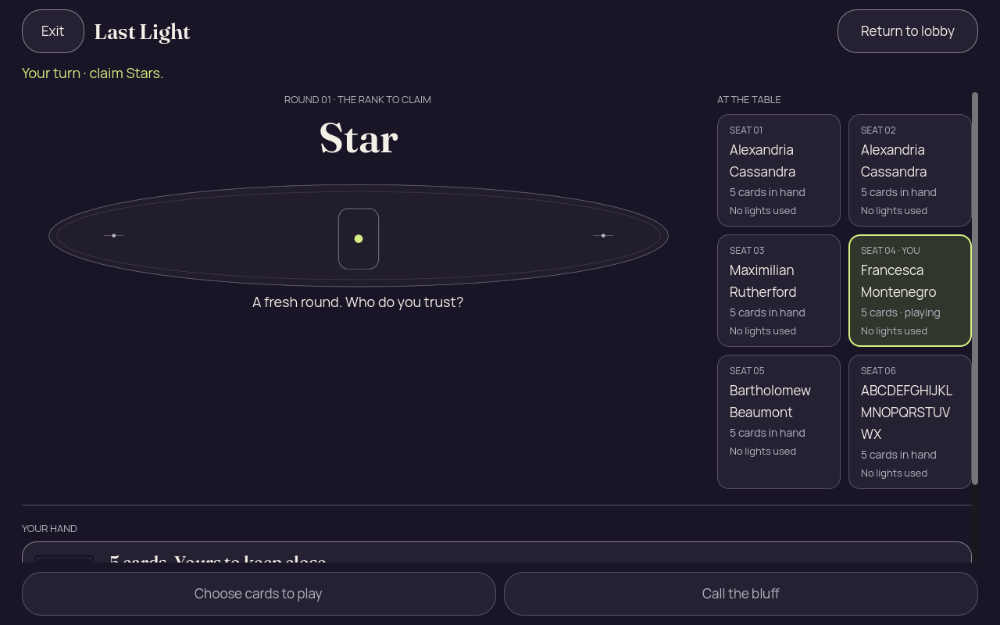
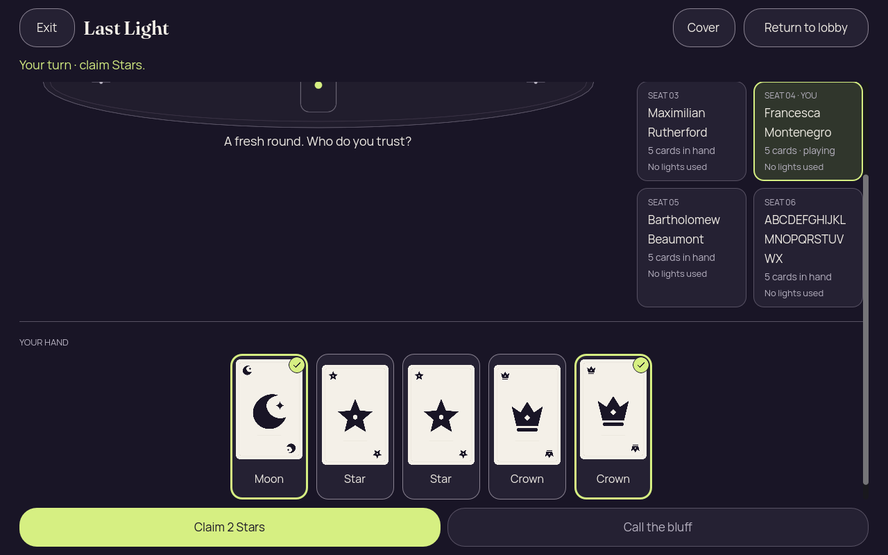
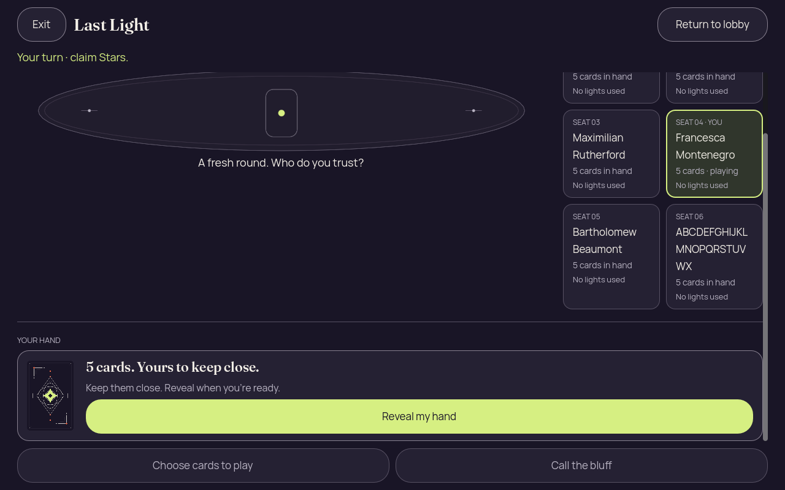

# Godot 2D — iteration 06, header width fixed; hand drag still fails

[All screenshot collections](../README.md)

**Evidence status:** The desktop lobby header returns to normal height, but a tall two-column six-seat layout still pushes Reveal below the initial viewport. A diagnostic emulated hand drag fails with horizontal offset 0 → 0 and selection 0 → 0.

The desktop static report passes after programmatic scrolling. The gesture trace reports an available 218-pixel horizontal range and emulated touchscreen support, but events reach HandCard without reaching HandScroll. The supplied failure record reports exit 1. This is retained diagnostic evidence, not a touch pass.

Actual Godot `4.7.2.stable.official.ed1daf0bf`, OpenGL Compatibility / Mesa llvmpipe / Xvfb. These are desktop renderer pixels at the recorded sizes and text settings. [Original source provenance](source-provenance.json) records a working tree over basis `6457270`; no exact capture commit is claimed. Implementation hashes are preserved, but the implementation files themselves were not frozen for this 2D iteration.

[The frozen inputs](../godot-2d-iteration-04/fixtures/) and [their Java generator](../godot-2d-iteration-04/PartyDeck2DEdgeFixtures.java) are retained once with iteration 04. Authority-derived inputs explicitly record seed 2; the lobby permission input is synthetic. The fixtures contain recipient-safe DTOs, not serialized authoritative GameState or live invitation credentials.

All 5 supplied PNGs are preserved, including repeated states and failed-attempt initial frames. Every unique image state was visually inspected and copied bytes were verified. Local checks can programmatically scroll controls into view; a passing report is not an initial-viewport, native touch, accessibility or native OS lifecycle pass. Concealed, covered, resumed, confirmation and public-outcome diagnostics retain zero private faces, labels and selection. Revealed forced-challenge input has two private cards and no selection; ordinary revealed hands have five faces/labels and two selected cards.

## Six header width desktop

[Original static report](six-header-width-desktop/report.json).

| Original image | Scenario and provenance |
| --- | --- |
|  | **Initial concealed own hand — six header width desktop** Godot 4.7.2 desktop, 2D Compatibility renderer Original: [01-concealed.png](six-header-width-desktop/01-concealed.png) 1280 × 800 px; text 1×; seed 2 SHA-256: <code>2caf75fcbe830e153407967271c3dfb915dd074f9f68299d918bdc0c9e7ca191</code> [Original diagnostics](six-header-width-desktop/01-concealed.json) Static seed-2 recipient-safe Kotlin-authority projection; renderer actions are not round-tripped to the authority. Lobby control width/header height are corrected. The tall two-column seat arrangement still puts initial Reveal below the viewport. |
|  | **Own hand revealed with first and last cards selected — six header width desktop** Godot 4.7.2 desktop, 2D Compatibility renderer Original: [02-revealed-selected.png](six-header-width-desktop/02-revealed-selected.png) 1280 × 800 px; text 1×; seed 2 SHA-256: <code>90d8d71febf3b85eda7f0a2a57b259c87432ffa590acd0090c9996e4756fa44e</code> [Original diagnostics](six-header-width-desktop/02-revealed-selected.json) Static seed-2 recipient-safe Kotlin-authority projection; renderer actions are not round-tripped to the authority. Lobby control width/header height are corrected. The tall two-column seat arrangement still puts initial Reveal below the viewport. |
|  | **Hand covered with selection cleared — six header width desktop** Godot 4.7.2 desktop, 2D Compatibility renderer Original: [03-covered-again.png](six-header-width-desktop/03-covered-again.png) 1280 × 800 px; text 1×; seed 2 SHA-256: <code>23b6092123d9640c4dea6ec8b5d09013b13dd2318bc9e325a5561b0126453d6d</code> [Original diagnostics](six-header-width-desktop/03-covered-again.json) Static seed-2 recipient-safe Kotlin-authority projection; renderer actions are not round-tripped to the authority. Lobby control width/header height are corrected. The tall two-column seat arrangement still puts initial Reveal below the viewport. |
|  | **Hand remains covered after background and resume — six header width desktop** Godot 4.7.2 desktop, 2D Compatibility renderer Original: [04-resumed-covered.png](six-header-width-desktop/04-resumed-covered.png) 1280 × 800 px; text 1×; seed 2 SHA-256: <code>23b6092123d9640c4dea6ec8b5d09013b13dd2318bc9e325a5561b0126453d6d</code> [Original diagnostics](six-header-width-desktop/04-resumed-covered.json) Static seed-2 recipient-safe Kotlin-authority projection; renderer actions are not round-tripped to the authority. Lobby control width/header height are corrected. The tall two-column seat arrangement still puts initial Reveal below the viewport. |

## Emulated drag diagnostic phone

[Supplied failure record](emulated-drag-diagnostic-phone/failure.json) · [Original gesture trace](emulated-drag-diagnostic-phone/gesture-diagnostics.json) · [Original gesture probe](emulated-drag-diagnostic-phone/gesture-diagnostic.gd).

| Original image | Scenario and provenance |
| --- | --- |
|  | **Initial concealed frame before the failed diagnostic hand drag** Godot 4.7.2 desktop, 2D Compatibility renderer Original: [01-concealed.png](emulated-drag-diagnostic-phone/01-concealed.png) 390 × 844 px; text 1×; seed 2 SHA-256: <code>c06b5faf2323627c93bf4e6fc2a3579d6fd06a22205eff03a770b340a1377697</code> [Original diagnostics](emulated-drag-diagnostic-phone/01-concealed.json) Static seed-2 recipient-safe Kotlin-authority projection; renderer actions are not round-tripped to the authority. Trace: hand offset 0 → 0, selection 0 → 0, 218-pixel range; no HandScroll event appears. Supplied failure exit code: 1. |
