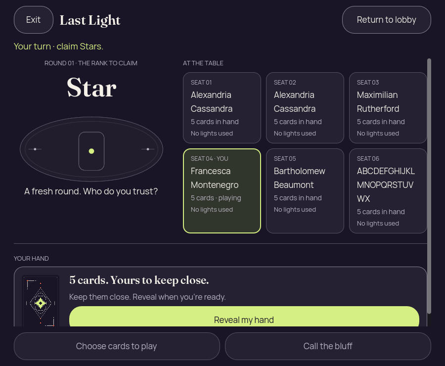
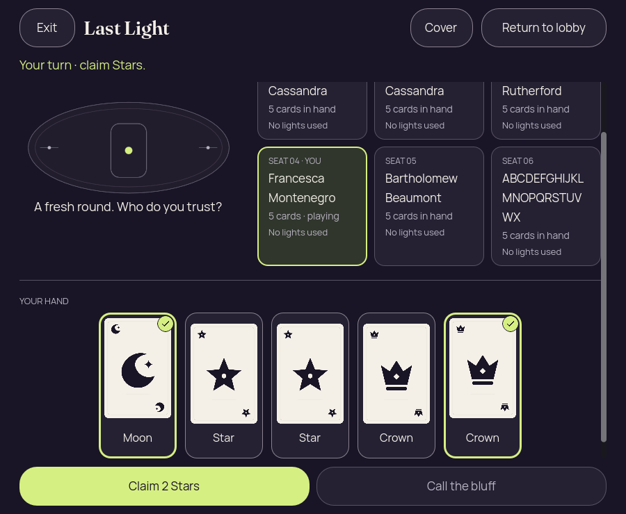
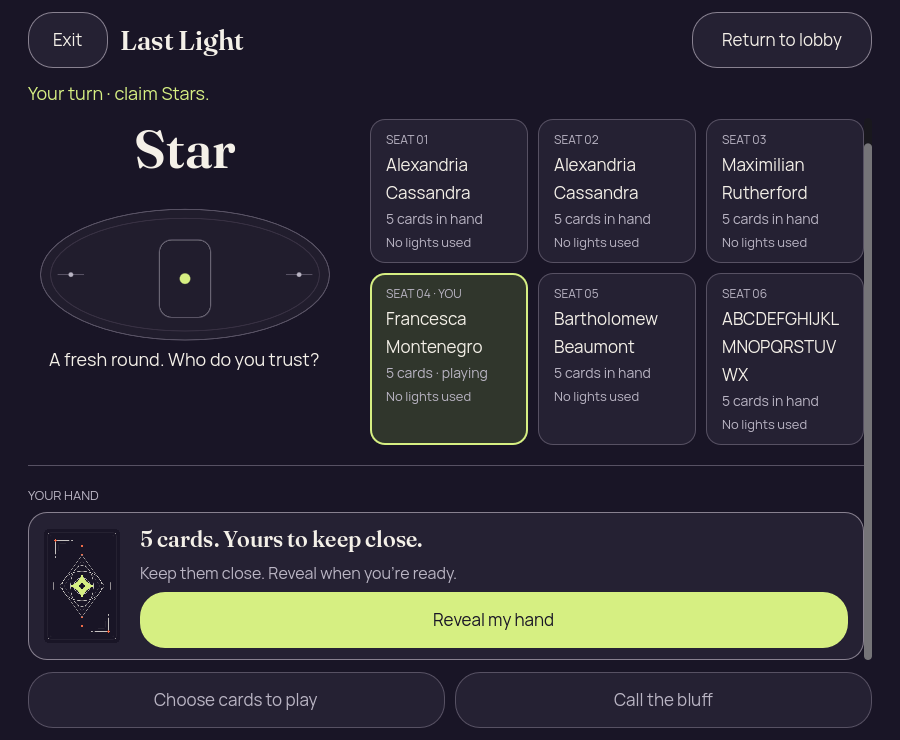
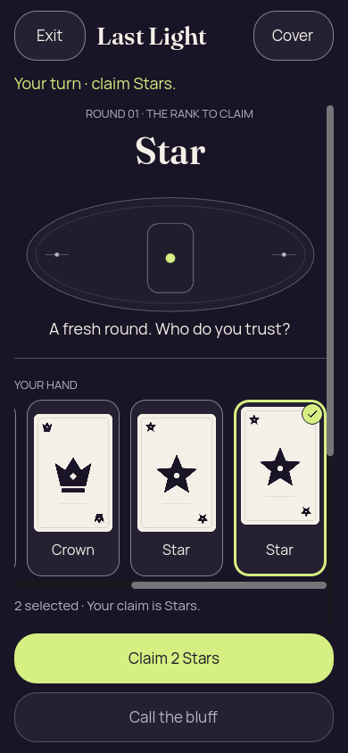
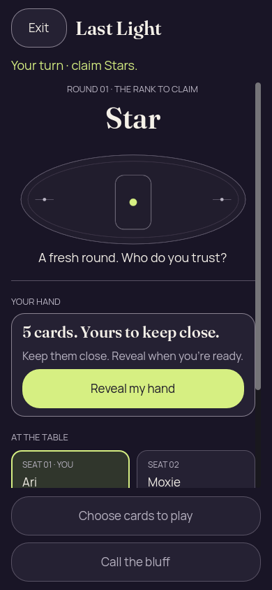
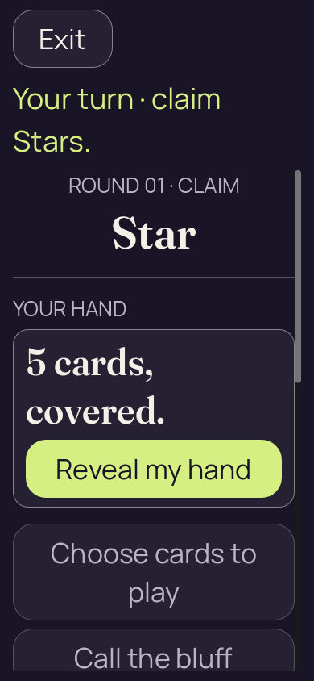

# Godot 2D — iteration 07, six-seat desktop correction and emulated hand drag

[All screenshot collections](../README.md)

**Evidence status:** At 1280 × 800, all six numbered seats, required rank, current turn and the full Reveal control fit together. Emulated horizontal hand drag succeeds (0 → 218, no selection), followed by local tap/privacy checks. The separate 200% action-drag probe still fails.

Three static reports pass. The 900 × 740 initial viewport shows only 41 of Reveal’s 56 pixels: its rect starts at y=619 while its content clip ends at y=660. The 200% action-drag trace remains at vertical offset 0 → 0 despite an available 869-pixel range; the hand stays concealed and the supplied failure record reports exit 1. Neither probe establishes native finger input, OS lifecycle protection or authority acceptance.

Actual Godot `4.7.2.stable.official.ed1daf0bf`, OpenGL Compatibility / Mesa llvmpipe / Xvfb. These are desktop renderer pixels at the recorded sizes and text settings. [Original source provenance](source-provenance.json) records a working tree over basis `6457270`; no exact capture commit is claimed. Implementation hashes are preserved, but the implementation files themselves were not frozen for this 2D iteration.

[The frozen inputs](../godot-2d-iteration-04/fixtures/) and [their Java generator](../godot-2d-iteration-04/PartyDeck2DEdgeFixtures.java) are retained once with iteration 04. Authority-derived inputs explicitly record seed 2; the lobby permission input is synthetic. The fixtures contain recipient-safe DTOs, not serialized authoritative GameState or live invitation credentials.

All 14 supplied PNGs are preserved, including repeated states and failed-attempt initial frames. Every unique image state was visually inspected and copied bytes were verified. Local checks can programmatically scroll controls into view; a passing report is not an initial-viewport, native touch, accessibility or native OS lifecycle pass. Concealed, covered, resumed, confirmation and public-outcome diagnostics retain zero private faces, labels and selection. Revealed forced-challenge input has two private cards and no selection; ordinary revealed hands have five faces/labels and two selected cards.

## Six long names desktop

[Original static report](six-long-names-desktop/report.json).

| Original image | Scenario and provenance |
| --- | --- |
|  | **Initial concealed own hand — six long names desktop** Godot 4.7.2 desktop, 2D Compatibility renderer Original: [01-concealed.png](six-long-names-desktop/01-concealed.png) 1280 × 800 px; text 1×; seed 2 SHA-256: <code>c0857efa4457b01ade7b0e1f54f3bb18ae6d3b6f977225289a2b2c4adda34888</code> [Original diagnostics](six-long-names-desktop/01-concealed.json) Static seed-2 recipient-safe Kotlin-authority projection; renderer actions are not round-tripped to the authority. Three-column seat grid and normal header fit six numbered seats and the complete Reveal control at 1280 × 800. |
|  | **Own hand revealed with first and last cards selected — six long names desktop** Godot 4.7.2 desktop, 2D Compatibility renderer Original: [02-revealed-selected.png](six-long-names-desktop/02-revealed-selected.png) 1280 × 800 px; text 1×; seed 2 SHA-256: <code>f45e6ba2677e4a755aa8e582da3932ff52453cf0658792feef357dbeb9079c65</code> [Original diagnostics](six-long-names-desktop/02-revealed-selected.json) Static seed-2 recipient-safe Kotlin-authority projection; renderer actions are not round-tripped to the authority. Three-column seat grid and normal header fit six numbered seats and the complete Reveal control at 1280 × 800. |
|  | **Hand covered with selection cleared — six long names desktop** Godot 4.7.2 desktop, 2D Compatibility renderer Original: [03-covered-again.png](six-long-names-desktop/03-covered-again.png) 1280 × 800 px; text 1×; seed 2 SHA-256: <code>c0857efa4457b01ade7b0e1f54f3bb18ae6d3b6f977225289a2b2c4adda34888</code> [Original diagnostics](six-long-names-desktop/03-covered-again.json) Static seed-2 recipient-safe Kotlin-authority projection; renderer actions are not round-tripped to the authority. Three-column seat grid and normal header fit six numbered seats and the complete Reveal control at 1280 × 800. |
|  | **Hand remains covered after background and resume — six long names desktop** Godot 4.7.2 desktop, 2D Compatibility renderer Original: [04-resumed-covered.png](six-long-names-desktop/04-resumed-covered.png) 1280 × 800 px; text 1×; seed 2 SHA-256: <code>c0857efa4457b01ade7b0e1f54f3bb18ae6d3b6f977225289a2b2c4adda34888</code> [Original diagnostics](six-long-names-desktop/04-resumed-covered.json) Static seed-2 recipient-safe Kotlin-authority projection; renderer actions are not round-tripped to the authority. Three-column seat grid and normal header fit six numbered seats and the complete Reveal control at 1280 × 800. |
|  | **Return-to-lobby confirmation — six long names desktop** Godot 4.7.2 desktop, 2D Compatibility renderer Original: [05-lobby-confirmation.png](six-long-names-desktop/05-lobby-confirmation.png) 1280 × 800 px; text 1×; seed 2 SHA-256: <code>24040cbc7c35113b367210ab66ade099c2b579b1e00ac00c6e2304a78ff6968a</code> [Original diagnostics](six-long-names-desktop/05-lobby-confirmation.json) Static seed-2 recipient-safe Kotlin-authority projection; renderer actions are not round-tripped to the authority. Three-column seat grid and normal header fit six numbered seats and the complete Reveal control at 1280 × 800. |

## Six long names narrow desktop

[Original static report](six-long-names-narrow-desktop/report.json).

| Original image | Scenario and provenance |
| --- | --- |
|  | **Initial concealed own hand — six long names narrow desktop** Godot 4.7.2 desktop, 2D Compatibility renderer Original: [01-concealed.png](six-long-names-narrow-desktop/01-concealed.png) 900 × 740 px; text 1×; seed 2 SHA-256: <code>e5801524bf299726fd1e9947376522c746b5ef1d85a92743daa0ec9b2edb7ceb</code> [Original diagnostics](six-long-names-narrow-desktop/01-concealed.json) Static seed-2 recipient-safe Kotlin-authority projection; renderer actions are not round-tripped to the authority. Initial Reveal is partly clipped: 41 of its 56 pixels are visible above the content clip, though its label can be read. |
|  | **Own hand revealed with first and last cards selected — six long names narrow desktop** Godot 4.7.2 desktop, 2D Compatibility renderer Original: [02-revealed-selected.png](six-long-names-narrow-desktop/02-revealed-selected.png) 900 × 740 px; text 1×; seed 2 SHA-256: <code>d715c58584f4bd48b27bea7b94a00c300a477953c248c6068ce28e87ff3a3e08</code> [Original diagnostics](six-long-names-narrow-desktop/02-revealed-selected.json) Static seed-2 recipient-safe Kotlin-authority projection; renderer actions are not round-tripped to the authority. This capture follows programmatic scrolling; the hand/action is visible while some table/roster content is above the viewport. |
|  | **Hand covered with selection cleared — six long names narrow desktop** Godot 4.7.2 desktop, 2D Compatibility renderer Original: [03-covered-again.png](six-long-names-narrow-desktop/03-covered-again.png) 900 × 740 px; text 1×; seed 2 SHA-256: <code>41a240b16f6b20fbcf60d07ae52934f0626f79c58ee16fdf7d0049085f14a7c5</code> [Original diagnostics](six-long-names-narrow-desktop/03-covered-again.json) Static seed-2 recipient-safe Kotlin-authority projection; renderer actions are not round-tripped to the authority. This capture follows programmatic scrolling; the hand/action is visible while some table/roster content is above the viewport. |
|  | **Hand remains covered after background and resume — six long names narrow desktop** Godot 4.7.2 desktop, 2D Compatibility renderer Original: [04-resumed-covered.png](six-long-names-narrow-desktop/04-resumed-covered.png) 900 × 740 px; text 1×; seed 2 SHA-256: <code>41a240b16f6b20fbcf60d07ae52934f0626f79c58ee16fdf7d0049085f14a7c5</code> [Original diagnostics](six-long-names-narrow-desktop/04-resumed-covered.json) Static seed-2 recipient-safe Kotlin-authority projection; renderer actions are not round-tripped to the authority. This capture follows programmatic scrolling; the hand/action is visible while some table/roster content is above the viewport. |

## Emulated drag phone

[Original static report](emulated-drag-phone/report.json) · [Original gesture trace](emulated-drag-phone/gesture-diagnostics.json) · [Original gesture probe](emulated-drag-phone/gesture-diagnostic.gd).

| Original image | Scenario and provenance |
| --- | --- |
|  | **Initial concealed own hand — emulated drag phone** Godot 4.7.2 desktop, 2D Compatibility renderer Original: [01-concealed.png](emulated-drag-phone/01-concealed.png) 390 × 844 px; text 1×; seed 2 SHA-256: <code>c06b5faf2323627c93bf4e6fc2a3579d6fd06a22205eff03a770b340a1377697</code> [Original diagnostics](emulated-drag-phone/01-concealed.json) Static seed-2 recipient-safe Kotlin-authority projection; renderer actions are not round-tripped to the authority. Retained desktop emulated-touch trace records hand offset 0 → 218 with selection 0 → 0, then local tap/cover/resume checks. |
|  | **Own hand revealed with first and last cards selected — emulated drag phone** Godot 4.7.2 desktop, 2D Compatibility renderer Original: [02-revealed-selected.png](emulated-drag-phone/02-revealed-selected.png) 390 × 844 px; text 1×; seed 2 SHA-256: <code>62161fbb364b00be5b0998e87f19ad9d48419c5e0f1f8cfffa87fd48b9e9f6ab</code> [Original diagnostics](emulated-drag-phone/02-revealed-selected.json) Static seed-2 recipient-safe Kotlin-authority projection; renderer actions are not round-tripped to the authority. Retained desktop emulated-touch trace records hand offset 0 → 218 with selection 0 → 0, then local tap/cover/resume checks. |
|  | **Hand covered with selection cleared — emulated drag phone** Godot 4.7.2 desktop, 2D Compatibility renderer Original: [03-covered-again.png](emulated-drag-phone/03-covered-again.png) 390 × 844 px; text 1×; seed 2 SHA-256: <code>c06b5faf2323627c93bf4e6fc2a3579d6fd06a22205eff03a770b340a1377697</code> [Original diagnostics](emulated-drag-phone/03-covered-again.json) Static seed-2 recipient-safe Kotlin-authority projection; renderer actions are not round-tripped to the authority. Retained desktop emulated-touch trace records hand offset 0 → 218 with selection 0 → 0, then local tap/cover/resume checks. |
|  | **Hand remains covered after background and resume — emulated drag phone** Godot 4.7.2 desktop, 2D Compatibility renderer Original: [04-resumed-covered.png](emulated-drag-phone/04-resumed-covered.png) 390 × 844 px; text 1×; seed 2 SHA-256: <code>c06b5faf2323627c93bf4e6fc2a3579d6fd06a22205eff03a770b340a1377697</code> [Original diagnostics](emulated-drag-phone/04-resumed-covered.json) Static seed-2 recipient-safe Kotlin-authority projection; renderer actions are not round-tripped to the authority. Retained desktop emulated-touch trace records hand offset 0 → 218 with selection 0 → 0, then local tap/cover/resume checks. |

## Action drag large text phone

[Supplied failure record](action-drag-large-text-phone/failure.json) · [Original action-drag trace](action-drag-large-text-phone/action-gesture-diagnostics.json) · [Original action-drag probe](action-drag-large-text-phone/action-gesture-diagnostic.gd).

| Original image | Scenario and provenance |
| --- | --- |
|  | **Initial 200% frame before the failed Reveal-button vertical drag** Godot 4.7.2 desktop, 2D Compatibility renderer Original: [01-concealed.png](action-drag-large-text-phone/01-concealed.png) 390 × 844 px; text 2×; seed 2 SHA-256: <code>3b58df227661b12a53731f00ad58a6748f2c80c83ef1c618f1ad20397b78bc52</code> [Original diagnostics](action-drag-large-text-phone/01-concealed.json) Static seed-2 recipient-safe Kotlin-authority projection; renderer actions are not round-tripped to the authority. Trace: vertical offset 0 → 0 with an 869-pixel range; hand remains concealed. Supplied failure exit code: 1. |
