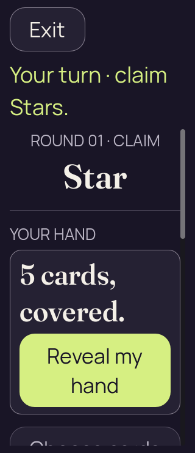

# Godot 2D — iteration 08, retained action-drag failures

[All screenshot collections](../README.md)

**Evidence status:** Three vertical action-drag attempts failed. The ancestor diagnostic identifies HandCover stopping propagation; all initial frames and supplied failure records are preserved.

Actual Godot `4.7.2.stable.official.ed1daf0bf`, OpenGL Compatibility / Mesa llvmpipe / Xvfb. The images are desktop renderer pixels at the recorded sizes and text settings. [Original source provenance](source-provenance.json) records a working tree over milestone `6457270`; no exact capture commit is claimed. Renderer implementation hashes are retained, but its implementation files were not frozen for these captures.

The ancestor probe retains an exit-1 failure, a [gesture trace](action-ancestor-diagnostic-phone/action-gesture-diagnostics.json) and the [original probe](action-ancestor-diagnostic-phone/action-ancestor-diagnostic.gd). The other two failure records retain their reason and result without a process exit code. All three initial frames have zero private faces, labels and selected cards. The 390 × 844 ancestor-diagnostic image is the same original image state as the reviewed 200% frame in iteration 07; its “phone” folder name does not imply normal text.

The [canonical seed-2 input](../godot-2d-iteration-04/fixtures/launch-2d.json) is already frozen with iteration 04. [Iteration 09](../godot-2d-iteration-09/README.md) retains the corrected propagation and repeat gesture checks.

All 3 supplied PNGs are preserved, including repeated states and failures where present. Every unique image state was visually inspected and copied bytes were verified. Programmatic scrolling and mouse input with Godot touch emulation do not establish native finger input, accessibility, OS snapshot privacy or device performance. Original clean-process runtime logs were not supplied; passing static reports do not independently establish a clean engine exit.

## Action ancestor diagnostic phone

[Supplied failure record](action-ancestor-diagnostic-phone/failure.json).

| Original image | Scenario and provenance |
| --- | --- |
|  | **Initial frame before failed vertical action drag — action ancestor diagnostic phone** Godot 4.7.2 desktop, 2D Compatibility renderer Original: [01-concealed.png](action-ancestor-diagnostic-phone/01-concealed.png) 390 × 844 px; text 2×; seed 2 SHA-256: <code>3b58df227661b12a53731f00ad58a6748f2c80c83ef1c618f1ad20397b78bc52</code> [Original diagnostics](action-ancestor-diagnostic-phone/01-concealed.json) Static seed-2 recipient-safe Kotlin-authority projection; renderer actions are not round-tripped to the authority. The trace stays at vertical offset 0 → 0 and the hand remains concealed. HandCover uses MOUSE_FILTER_STOP between the PASS Button and TableScroll. Supplied failure exit code: 1. This original is byte-identical to iteration 07’s reviewed 390 × 844 frame at 200% text. |

## Touch large text phone

[Supplied failure record](touch-large-text-phone/failure.json).

| Original image | Scenario and provenance |
| --- | --- |
|  | **Initial frame before failed vertical action drag — touch large text phone** Godot 4.7.2 desktop, 2D Compatibility renderer Original: [01-concealed.png](touch-large-text-phone/01-concealed.png) 320 × 740 px; text 2×; seed 2 SHA-256: <code>4853b95ca31c4298b70cf923611587dc5621c1d2305b695ee0a0c91fa7911555</code> [Original diagnostics](touch-large-text-phone/01-concealed.json) Static seed-2 recipient-safe Kotlin-authority projection; renderer actions are not round-tripped to the authority. The supplied failure record says dragging on Reveal did not scroll without activating the button. It records no process exit code; only the initial concealed frame is retained. |

## Touch phone

[Supplied failure record](touch-phone/failure.json).

| Original image | Scenario and provenance |
| --- | --- |
|  | **Initial frame before failed vertical action drag — touch phone** Godot 4.7.2 desktop, 2D Compatibility renderer Original: [01-concealed.png](touch-phone/01-concealed.png) 390 × 844 px; text 1×; seed 2 SHA-256: <code>c06b5faf2323627c93bf4e6fc2a3579d6fd06a22205eff03a770b340a1377697</code> [Original diagnostics](touch-phone/01-concealed.json) Static seed-2 recipient-safe Kotlin-authority projection; renderer actions are not round-tripped to the authority. The supplied failure record says dragging on Reveal did not scroll without activating the button. It records no process exit code; only the initial concealed frame is retained. |
