# Godot 2D — iteration 09, corrected gestures and authority edge cases

[All screenshot collections](../README.md)

**Evidence status:** Nine static reports pass. Normal and 200% emulated page/hand drags and tiny-motion taps behave as expected; one/zero-card, truthful rank/Wild, burnout and six-seat confirmation cases are retained.

Actual Godot `4.7.2.stable.official.ed1daf0bf`, OpenGL Compatibility / Mesa llvmpipe / Xvfb. The images are desktop renderer pixels at the recorded sizes and text settings. [Original source provenance](source-provenance.json) records a working tree over milestone `6457270`; no exact capture commit is claimed. Renderer implementation hashes are retained, but its implementation files were not frozen for these captures.

[Eleven frozen inputs](fixtures/) include ten edge cases plus the canonical launch. [Authority provenance](authority-provenance.json) records case-specific seeds: truthful rank, truthful Wild and burnout use seed 1; the other inputs use seed 2. The first five imported cases preserve verified safe bytes and deterministic recipes, without claiming original per-operation logs. New cases record actual `LastLightEngine.start/apply/viewFor` operations. No fabricated GameState or outcome dictionary is used.

[The fixture manifest](fixture-manifest.json) records generator, runner, artifact and fixture hashes. The original [generator](fixture-tools/CompleteEdgeFixtures.java), [runner](fixture-tools/generate.py), [import generator](fixture-tools/imports/PartyDeck2DEdgeFixtures.java) and [import receipt](fixture-tools/imports/source-provenance.json) were separately matched to those hashes and preserved. This freezes fixture tooling, not the renderer implementation. All eleven safe fixture hashes and the authority-provenance hash were independently verified.

The six-seat lobby case uses the actual authority projection with supported host permission. It is separate from the synthetic lobby-permission input in earlier collections. The one-card cover retains “1 cards”; the 200% Wild outcome explanation continues below the initial viewport.

The emulated-touch observations are retained in each applicable `report.json`. Normal text records page drag 0 → 188 and hand drag 0 → 218; 200% text records page drag 0 → 284 and hand drag 0 → 528. Page drags keep the hand concealed; hand drags do not select a card. A tiny-motion tap keeps the hand scroll offset unchanged and selects one card. Iteration 10 repeats the 200% case.

Concealed, covered, resumed, confirmation and public-outcome diagnostics have zero private faces, labels and selection. Ordinary selected frames have five private faces/labels and two selected cards; the one-card frame in iteration 09 has one of each. These are local renderer/privacy checks over a static projection, with simulated foreground changes. No renderer action round-trip to the authority is exercised.

All 26 supplied PNGs are preserved, including repeated states and failures where present. Every unique image state was visually inspected and copied bytes were verified. Programmatic scrolling and mouse input with Godot touch emulation do not establish native finger input, accessibility, OS snapshot privacy or device performance. Original clean-process runtime logs were not supplied; passing static reports do not independently establish a clean engine exit.

## Burnout phone

[Original static report](burnout-phone/report.json).

| Original image | Scenario and provenance |
| --- | --- |
| <a href="burnout-phone/01-concealed.png">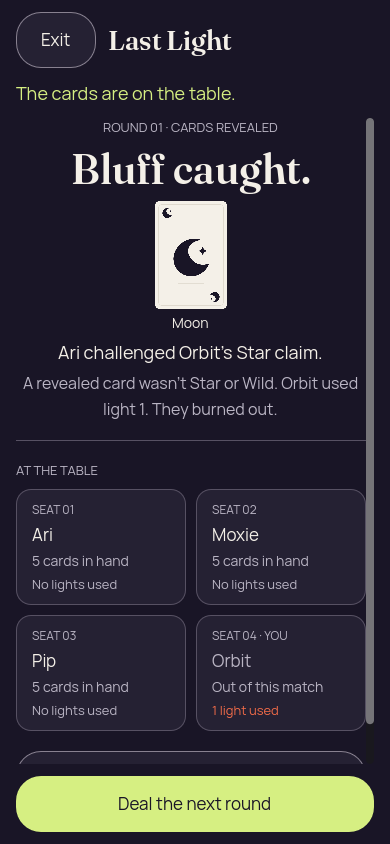</a> | **Orbit burns out after Ari catches the Star bluff** Godot 4.7.2 desktop, 2D Compatibility renderer Original: [01-concealed.png](burnout-phone/01-concealed.png) 390 × 844 px; text 1×; seed 1 SHA-256: <code>9b95d53525a0d7a23a51e6024cbf2d61a5414172da91ab2e22d61c339ea050ee</code> [Original diagnostics](burnout-phone/01-concealed.json) Static seed-1 recipient-safe Kotlin-authority projection; renderer actions are not round-tripped to the authority. Ari challenged Orbit’s Star claim; public Moon did not match. Orbit used light 1 and burned out. |

## Lobby large text phone

[Original static report](lobby-large-text-phone/report.json).

| Original image | Scenario and provenance |
| --- | --- |
| <a href="lobby-large-text-phone/01-concealed.png">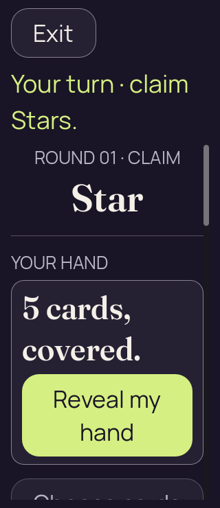</a> | **Initial concealed own hand — lobby large text phone** Godot 4.7.2 desktop, 2D Compatibility renderer Original: [01-concealed.png](lobby-large-text-phone/01-concealed.png) 320 × 740 px; text 2×; seed 2 SHA-256: <code>87609094a54aaac0816954a2b59ea7084be0ad478852b2d2e5e40a7e157b88c1</code> [Original diagnostics](lobby-large-text-phone/01-concealed.json) Static seed-2 recipient-safe Kotlin-authority projection; renderer actions are not round-tripped to the authority. This uses the real six-seat authority projection with host return-to-lobby permission. The consequence and both confirmation choices fit at 320 × 740 with 200% text. |
| <a href="lobby-large-text-phone/02-revealed-selected.png">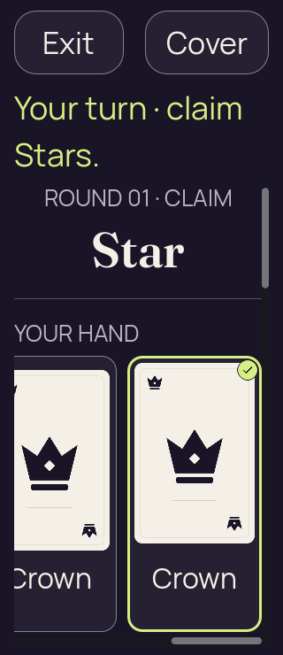</a> | **Own hand revealed with first and last cards selected — lobby large text phone** Godot 4.7.2 desktop, 2D Compatibility renderer Original: [02-revealed-selected.png](lobby-large-text-phone/02-revealed-selected.png) 320 × 740 px; text 2×; seed 2 SHA-256: <code>54a7e271490d5662d3a4fea3e8d0aec73de89a22754cb854d982c5b37537b138</code> [Original diagnostics](lobby-large-text-phone/02-revealed-selected.json) Static seed-2 recipient-safe Kotlin-authority projection; renderer actions are not round-tripped to the authority. This uses the real six-seat authority projection with host return-to-lobby permission. The consequence and both confirmation choices fit at 320 × 740 with 200% text. |
| <a href="lobby-large-text-phone/03-covered-again.png">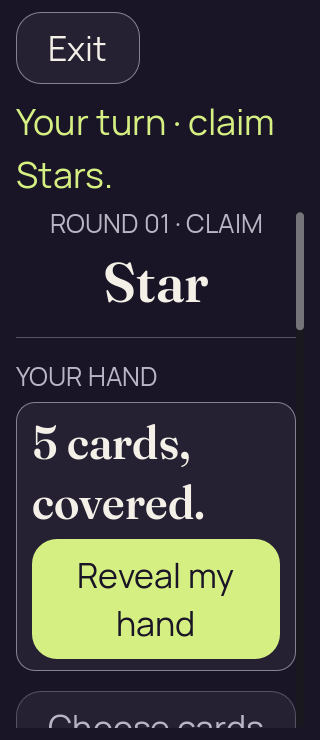</a> | **Hand covered with selection cleared — lobby large text phone** Godot 4.7.2 desktop, 2D Compatibility renderer Original: [03-covered-again.png](lobby-large-text-phone/03-covered-again.png) 320 × 740 px; text 2×; seed 2 SHA-256: <code>8eeca3cc7782485508b46f58bfb692803905333549431cde258f6c84b0b1c6b8</code> [Original diagnostics](lobby-large-text-phone/03-covered-again.json) Static seed-2 recipient-safe Kotlin-authority projection; renderer actions are not round-tripped to the authority. This uses the real six-seat authority projection with host return-to-lobby permission. The consequence and both confirmation choices fit at 320 × 740 with 200% text. |
|  | **Hand remains covered after simulated background and resume — lobby large text phone** Godot 4.7.2 desktop, 2D Compatibility renderer Original: [04-resumed-covered.png](lobby-large-text-phone/04-resumed-covered.png) 320 × 740 px; text 2×; seed 2 SHA-256: <code>8eeca3cc7782485508b46f58bfb692803905333549431cde258f6c84b0b1c6b8</code> [Original diagnostics](lobby-large-text-phone/04-resumed-covered.json) Static seed-2 recipient-safe Kotlin-authority projection; renderer actions are not round-tripped to the authority. This uses the real six-seat authority projection with host return-to-lobby permission. The consequence and both confirmation choices fit at 320 × 740 with 200% text. |
|  | **Return-to-lobby confirmation — lobby large text phone** Godot 4.7.2 desktop, 2D Compatibility renderer Original: [05-lobby-confirmation.png](lobby-large-text-phone/05-lobby-confirmation.png) 320 × 740 px; text 2×; seed 2 SHA-256: <code>e98f760c7323c8d0f91c1852101bf1b7007e3669011b45a855713bd8e6136b76</code> [Original diagnostics](lobby-large-text-phone/05-lobby-confirmation.json) Static seed-2 recipient-safe Kotlin-authority projection; renderer actions are not round-tripped to the authority. This uses the real six-seat authority projection with host return-to-lobby permission. The consequence and both confirmation choices fit at 320 × 740 with 200% text. |

## One card phone

[Original static report](one-card-phone/report.json).

| Original image | Scenario and provenance |
| --- | --- |
|  | **Initial concealed own hand — one card phone** Godot 4.7.2 desktop, 2D Compatibility renderer Original: [01-concealed.png](one-card-phone/01-concealed.png) 390 × 844 px; text 1×; seed 2 SHA-256: <code>555806aa2ea6e58fe88cb1f2a8b67f05c776f87dc6607a0040f59aa1995f22c8</code> [Original diagnostics](one-card-phone/01-concealed.json) Static seed-2 recipient-safe Kotlin-authority projection; renderer actions are not round-tripped to the authority. Ari has one remaining Star. The selected state has one private face, one label and one selection. Covered copy retains the minor grammar defect “1 cards.” |
| <a href="one-card-phone/02-revealed-selected.png">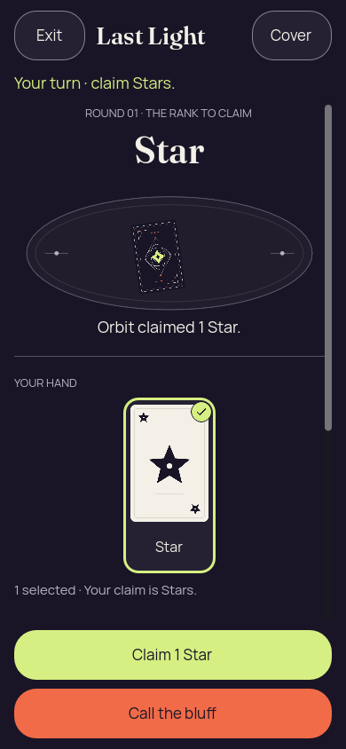</a> | **The sole remaining Star is selected — one-card phone** Godot 4.7.2 desktop, 2D Compatibility renderer Original: [02-revealed-selected.png](one-card-phone/02-revealed-selected.png) 390 × 844 px; text 1×; seed 2 SHA-256: <code>2bfdcf99e0871711eb146144f5b8ad842a851c6e90952f838a2da7cd8b0c46cf</code> [Original diagnostics](one-card-phone/02-revealed-selected.json) Static seed-2 recipient-safe Kotlin-authority projection; renderer actions are not round-tripped to the authority. Ari has one remaining Star. The selected state has one private face, one label and one selection. Covered copy retains the minor grammar defect “1 cards.” |
| <a href="one-card-phone/03-covered-again.png">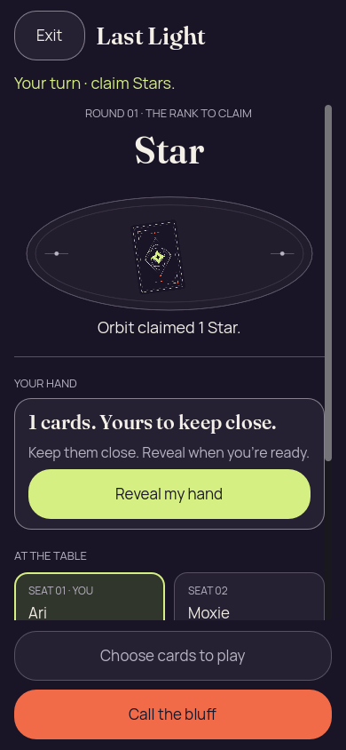</a> | **Hand covered with selection cleared — one card phone** Godot 4.7.2 desktop, 2D Compatibility renderer Original: [03-covered-again.png](one-card-phone/03-covered-again.png) 390 × 844 px; text 1×; seed 2 SHA-256: <code>555806aa2ea6e58fe88cb1f2a8b67f05c776f87dc6607a0040f59aa1995f22c8</code> [Original diagnostics](one-card-phone/03-covered-again.json) Static seed-2 recipient-safe Kotlin-authority projection; renderer actions are not round-tripped to the authority. Ari has one remaining Star. The selected state has one private face, one label and one selection. Covered copy retains the minor grammar defect “1 cards.” |
|  | **Hand remains covered after simulated background and resume — one card phone** Godot 4.7.2 desktop, 2D Compatibility renderer Original: [04-resumed-covered.png](one-card-phone/04-resumed-covered.png) 390 × 844 px; text 1×; seed 2 SHA-256: <code>555806aa2ea6e58fe88cb1f2a8b67f05c776f87dc6607a0040f59aa1995f22c8</code> [Original diagnostics](one-card-phone/04-resumed-covered.json) Static seed-2 recipient-safe Kotlin-authority projection; renderer actions are not round-tripped to the authority. Ari has one remaining Star. The selected state has one private face, one label and one selection. Covered copy retains the minor grammar defect “1 cards.” |

## Six long names desktop

[Original static report](six-long-names-desktop/report.json).

| Original image | Scenario and provenance |
| --- | --- |
|  | **Initial concealed own hand — six long names desktop** Godot 4.7.2 desktop, 2D Compatibility renderer Original: [01-concealed.png](six-long-names-desktop/01-concealed.png) 1280 × 800 px; text 1×; seed 2 SHA-256: <code>c0857efa4457b01ade7b0e1f54f3bb18ae6d3b6f977225289a2b2c4adda34888</code> [Original diagnostics](six-long-names-desktop/01-concealed.json) Static seed-2 recipient-safe Kotlin-authority projection; renderer actions are not round-tripped to the authority. Six numbered seats, current turn, required rank and the complete initial Reveal control fit at 1280 × 800. |
| <a href="six-long-names-desktop/02-revealed-selected.png">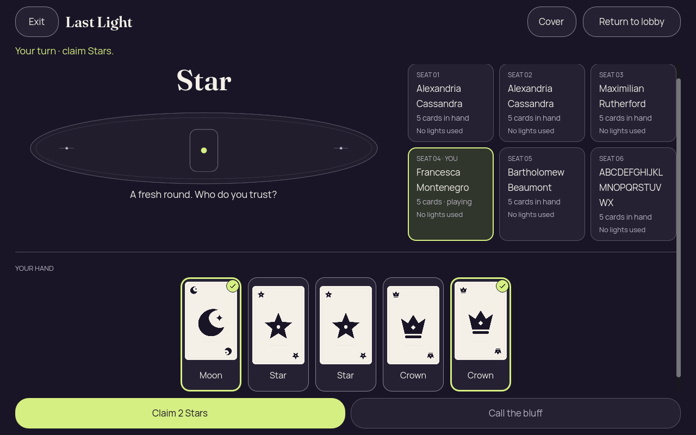</a> | **Own hand revealed with first and last cards selected — six long names desktop** Godot 4.7.2 desktop, 2D Compatibility renderer Original: [02-revealed-selected.png](six-long-names-desktop/02-revealed-selected.png) 1280 × 800 px; text 1×; seed 2 SHA-256: <code>f45e6ba2677e4a755aa8e582da3932ff52453cf0658792feef357dbeb9079c65</code> [Original diagnostics](six-long-names-desktop/02-revealed-selected.json) Static seed-2 recipient-safe Kotlin-authority projection; renderer actions are not round-tripped to the authority. Six numbered seats, current turn, required rank and the complete initial Reveal control fit at 1280 × 800. |
| <a href="six-long-names-desktop/03-covered-again.png">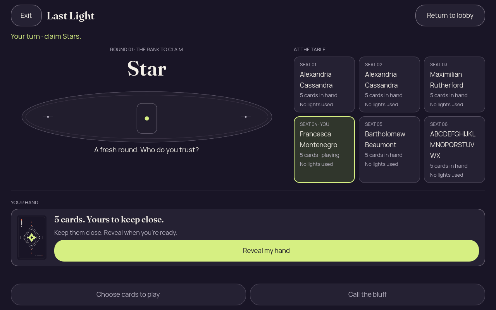</a> | **Hand covered with selection cleared — six long names desktop** Godot 4.7.2 desktop, 2D Compatibility renderer Original: [03-covered-again.png](six-long-names-desktop/03-covered-again.png) 1280 × 800 px; text 1×; seed 2 SHA-256: <code>c0857efa4457b01ade7b0e1f54f3bb18ae6d3b6f977225289a2b2c4adda34888</code> [Original diagnostics](six-long-names-desktop/03-covered-again.json) Static seed-2 recipient-safe Kotlin-authority projection; renderer actions are not round-tripped to the authority. Six numbered seats, current turn, required rank and the complete initial Reveal control fit at 1280 × 800. |
|  | **Hand remains covered after simulated background and resume — six long names desktop** Godot 4.7.2 desktop, 2D Compatibility renderer Original: [04-resumed-covered.png](six-long-names-desktop/04-resumed-covered.png) 1280 × 800 px; text 1×; seed 2 SHA-256: <code>c0857efa4457b01ade7b0e1f54f3bb18ae6d3b6f977225289a2b2c4adda34888</code> [Original diagnostics](six-long-names-desktop/04-resumed-covered.json) Static seed-2 recipient-safe Kotlin-authority projection; renderer actions are not round-tripped to the authority. Six numbered seats, current turn, required rank and the complete initial Reveal control fit at 1280 × 800. |
| <a href="six-long-names-desktop/05-lobby-confirmation.png">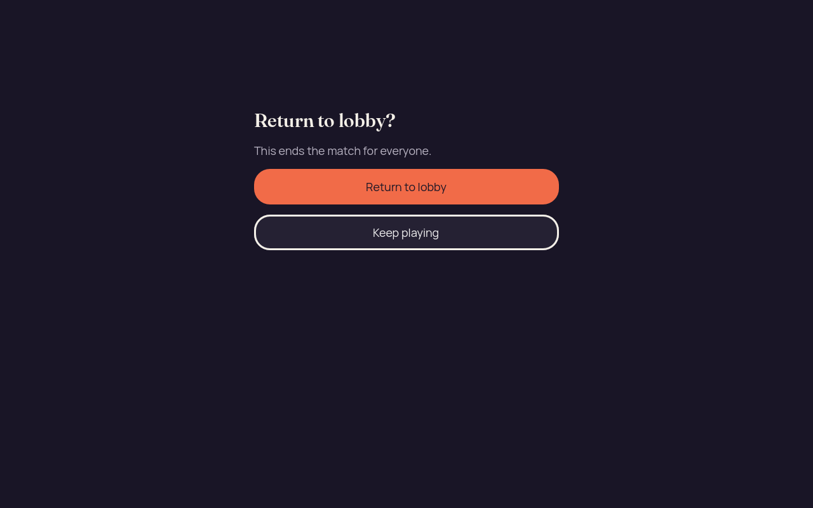</a> | **Return-to-lobby confirmation — six long names desktop** Godot 4.7.2 desktop, 2D Compatibility renderer Original: [05-lobby-confirmation.png](six-long-names-desktop/05-lobby-confirmation.png) 1280 × 800 px; text 1×; seed 2 SHA-256: <code>24040cbc7c35113b367210ab66ade099c2b579b1e00ac00c6e2304a78ff6968a</code> [Original diagnostics](six-long-names-desktop/05-lobby-confirmation.json) Static seed-2 recipient-safe Kotlin-authority projection; renderer actions are not round-tripped to the authority. Six numbered seats, current turn, required rank and the complete initial Reveal control fit at 1280 × 800. |

## Touch large text phone

[Original static report](touch-large-text-phone/report.json).

| Original image | Scenario and provenance |
| --- | --- |
|  | **Initial concealed own hand — touch large text phone** Godot 4.7.2 desktop, 2D Compatibility renderer Original: [01-concealed.png](touch-large-text-phone/01-concealed.png) 320 × 740 px; text 2×; seed 2 SHA-256: <code>4853b95ca31c4298b70cf923611587dc5621c1d2305b695ee0a0c91fa7911555</code> [Original diagnostics](touch-large-text-phone/01-concealed.json) Static seed-2 recipient-safe Kotlin-authority projection; renderer actions are not round-tripped to the authority. Desktop emulated-touch trace at 200% text: page drag 0 → 284 keeps the hand concealed; hand drag 0 → 528 leaves selection at zero; a tiny-motion tap keeps scroll offset unchanged and selects one card. |
| <a href="touch-large-text-phone/02-revealed-selected.png">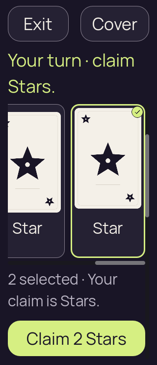</a> | **Own hand revealed with first and last cards selected — touch large text phone** Godot 4.7.2 desktop, 2D Compatibility renderer Original: [02-revealed-selected.png](touch-large-text-phone/02-revealed-selected.png) 320 × 740 px; text 2×; seed 2 SHA-256: <code>d1f279ab86d8c9cb9a44213e0e46116b85931dbb0a280ab9148264fa3652f794</code> [Original diagnostics](touch-large-text-phone/02-revealed-selected.json) Static seed-2 recipient-safe Kotlin-authority projection; renderer actions are not round-tripped to the authority. Desktop emulated-touch trace at 200% text: page drag 0 → 284 keeps the hand concealed; hand drag 0 → 528 leaves selection at zero; a tiny-motion tap keeps scroll offset unchanged and selects one card. |
| <a href="touch-large-text-phone/03-covered-again.png">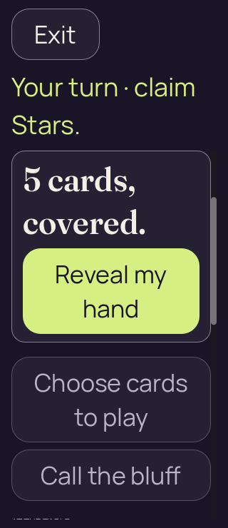</a> | **Hand covered with selection cleared — touch large text phone** Godot 4.7.2 desktop, 2D Compatibility renderer Original: [03-covered-again.png](touch-large-text-phone/03-covered-again.png) 320 × 740 px; text 2×; seed 2 SHA-256: <code>82e7b77a190192d7f482354acb1f37cd7cfc0da018e4ace7086b251c5f8aa854</code> [Original diagnostics](touch-large-text-phone/03-covered-again.json) Static seed-2 recipient-safe Kotlin-authority projection; renderer actions are not round-tripped to the authority. Desktop emulated-touch trace at 200% text: page drag 0 → 284 keeps the hand concealed; hand drag 0 → 528 leaves selection at zero; a tiny-motion tap keeps scroll offset unchanged and selects one card. |
|  | **Hand remains covered after simulated background and resume — touch large text phone** Godot 4.7.2 desktop, 2D Compatibility renderer Original: [04-resumed-covered.png](touch-large-text-phone/04-resumed-covered.png) 320 × 740 px; text 2×; seed 2 SHA-256: <code>82e7b77a190192d7f482354acb1f37cd7cfc0da018e4ace7086b251c5f8aa854</code> [Original diagnostics](touch-large-text-phone/04-resumed-covered.json) Static seed-2 recipient-safe Kotlin-authority projection; renderer actions are not round-tripped to the authority. Desktop emulated-touch trace at 200% text: page drag 0 → 284 keeps the hand concealed; hand drag 0 → 528 leaves selection at zero; a tiny-motion tap keeps scroll offset unchanged and selects one card. |

## Touch phone

[Original static report](touch-phone/report.json).

| Original image | Scenario and provenance |
| --- | --- |
|  | **Initial concealed own hand — touch phone** Godot 4.7.2 desktop, 2D Compatibility renderer Original: [01-concealed.png](touch-phone/01-concealed.png) 390 × 844 px; text 1×; seed 2 SHA-256: <code>c06b5faf2323627c93bf4e6fc2a3579d6fd06a22205eff03a770b340a1377697</code> [Original diagnostics](touch-phone/01-concealed.json) Static seed-2 recipient-safe Kotlin-authority projection; renderer actions are not round-tripped to the authority. Desktop emulated-touch trace: page drag 0 → 188 keeps the hand concealed; hand drag 0 → 218 leaves selection at zero; a tiny-motion tap keeps scroll offset unchanged and selects one card. |
| <a href="touch-phone/02-revealed-selected.png">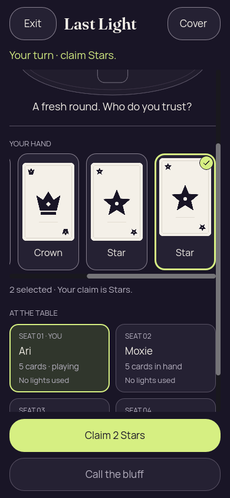</a> | **Own hand revealed with first and last cards selected — touch phone** Godot 4.7.2 desktop, 2D Compatibility renderer Original: [02-revealed-selected.png](touch-phone/02-revealed-selected.png) 390 × 844 px; text 1×; seed 2 SHA-256: <code>a3305d1ce22913450519cecfb5a40acbc9e868ddefc3616034b6d17bfce20316</code> [Original diagnostics](touch-phone/02-revealed-selected.json) Static seed-2 recipient-safe Kotlin-authority projection; renderer actions are not round-tripped to the authority. Desktop emulated-touch trace: page drag 0 → 188 keeps the hand concealed; hand drag 0 → 218 leaves selection at zero; a tiny-motion tap keeps scroll offset unchanged and selects one card. |
|  | **Hand covered with selection cleared — touch phone** Godot 4.7.2 desktop, 2D Compatibility renderer Original: [03-covered-again.png](touch-phone/03-covered-again.png) 390 × 844 px; text 1×; seed 2 SHA-256: <code>490f1edded8c2baa7ab73fd91214b0847e922652144547a2b6235db2d5ba1e18</code> [Original diagnostics](touch-phone/03-covered-again.json) Static seed-2 recipient-safe Kotlin-authority projection; renderer actions are not round-tripped to the authority. Desktop emulated-touch trace: page drag 0 → 188 keeps the hand concealed; hand drag 0 → 218 leaves selection at zero; a tiny-motion tap keeps scroll offset unchanged and selects one card. |
| <a href="touch-phone/04-resumed-covered.png">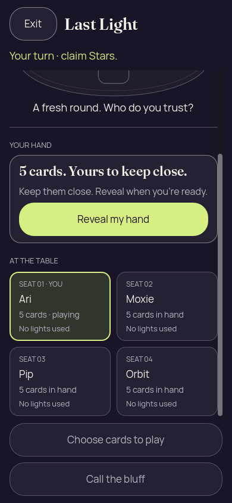</a> | **Hand remains covered after simulated background and resume — touch phone** Godot 4.7.2 desktop, 2D Compatibility renderer Original: [04-resumed-covered.png](touch-phone/04-resumed-covered.png) 390 × 844 px; text 1×; seed 2 SHA-256: <code>490f1edded8c2baa7ab73fd91214b0847e922652144547a2b6235db2d5ba1e18</code> [Original diagnostics](touch-phone/04-resumed-covered.json) Static seed-2 recipient-safe Kotlin-authority projection; renderer actions are not round-tripped to the authority. Desktop emulated-touch trace: page drag 0 → 188 keeps the hand concealed; hand drag 0 → 218 leaves selection at zero; a tiny-motion tap keeps scroll offset unchanged and selects one card. |

## Truthful rank phone

[Original static report](truthful-rank-phone/report.json).

| Original image | Scenario and provenance |
| --- | --- |
| <a href="truthful-rank-phone/01-concealed.png">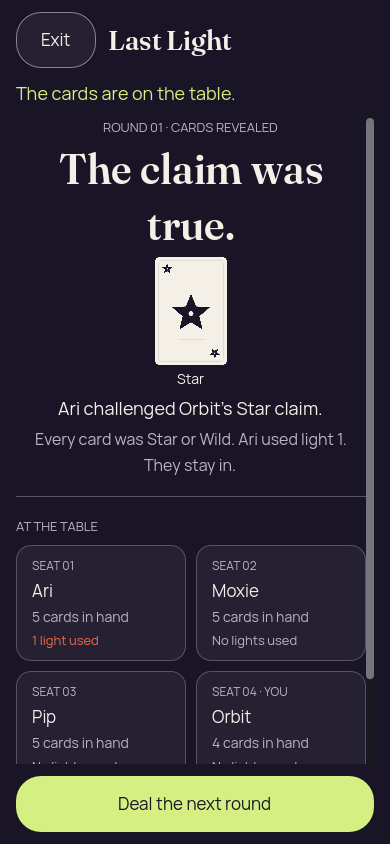</a> | **Truthful Star claim; Ari uses light 1 and remains in** Godot 4.7.2 desktop, 2D Compatibility renderer Original: [01-concealed.png](truthful-rank-phone/01-concealed.png) 390 × 844 px; text 1×; seed 1 SHA-256: <code>993ad8ab9d84a1c5f4a026d8e4dd6710ef3fc275f3f27fcfd484b8a5acbd579b</code> [Original diagnostics](truthful-rank-phone/01-concealed.json) Static seed-1 recipient-safe Kotlin-authority projection; renderer actions are not round-tripped to the authority. Public Star matches Orbit’s Star claim. Ari used light 1 and remains in. |

## Truthful wild large text phone

[Original static report](truthful-wild-large-text-phone/report.json).

| Original image | Scenario and provenance |
| --- | --- |
| <a href="truthful-wild-large-text-phone/01-concealed.png">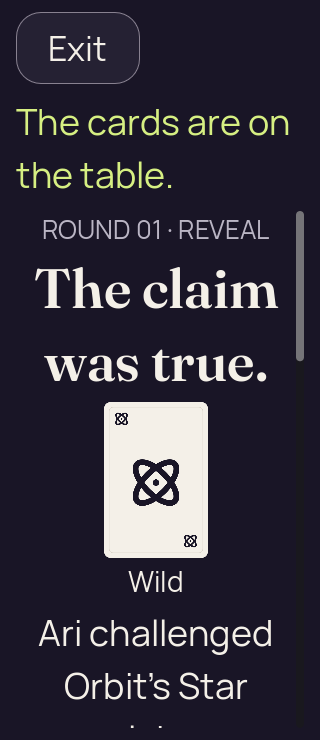</a> | **Truthful Wild proof at 200% text** Godot 4.7.2 desktop, 2D Compatibility renderer Original: [01-concealed.png](truthful-wild-large-text-phone/01-concealed.png) 320 × 740 px; text 2×; seed 1 SHA-256: <code>22e0bf7d420ed074b8c8e0234d5cb1bd5ceb8931a0c30c76446882bf1955210a</code> [Original diagnostics](truthful-wild-large-text-phone/01-concealed.json) Static seed-1 recipient-safe Kotlin-authority projection; renderer actions are not round-tripped to the authority. The truthful verdict and public Wild are visible at 200% text; the explanatory paragraph continues below the initial viewport. |

## Zero card phone

[Original static report](zero-card-phone/report.json).

| Original image | Scenario and provenance |
| --- | --- |
| <a href="zero-card-phone/01-concealed.png">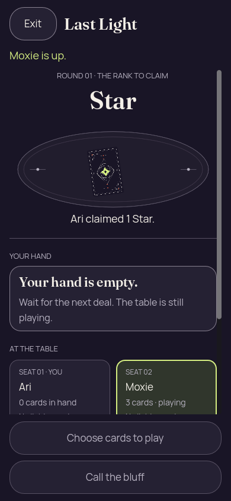</a> | **Ari’s empty hand while Moxie takes the turn** Godot 4.7.2 desktop, 2D Compatibility renderer Original: [01-concealed.png](zero-card-phone/01-concealed.png) 390 × 844 px; text 1×; seed 2 SHA-256: <code>fd0aabb37b2ee19cdc3a583d83600dddb0b4697f2673139d73e3e75d0bdbfb48</code> [Original diagnostics](zero-card-phone/01-concealed.json) Static seed-2 recipient-safe Kotlin-authority projection; renderer actions are not round-tripped to the authority. Ari has an empty hand while Moxie takes the turn; Reveal is absent and gameplay actions are disabled. |
